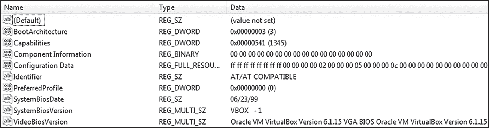
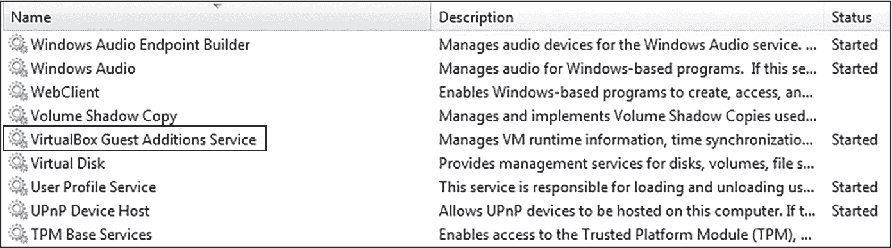
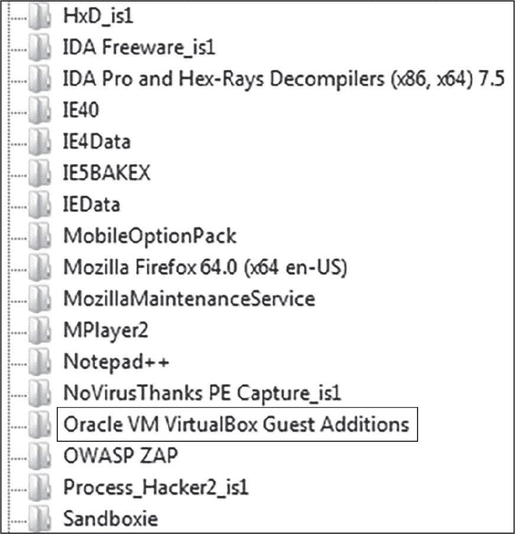
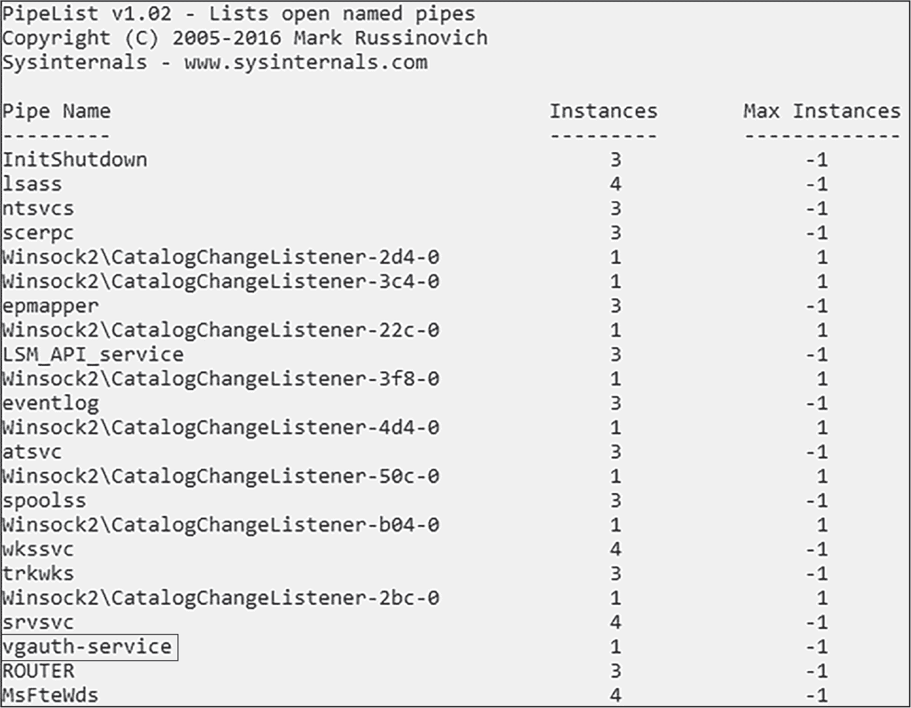
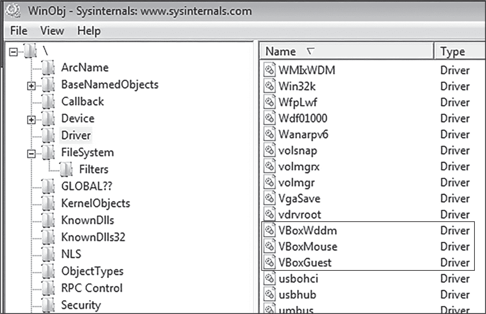

<hgroup>

## <samp class="SANS_Futura_Std_Bold_Condensed_B_11">4</samp> <samp class="SANS_Dogma_OT_Bold_B_11">操作系统工件枚举</samp>

</hgroup>


一个正常的、“真实”的用户环境与恶意软件沙箱或实验室环境有很大不同。典型用户可能已经安装了常见的应用程序，如微软办公软件、电子邮件客户端、多个网页浏览器等。他们可能不会使用虚拟机、Wireshark 或 Procmon，也不太可能安装像 IDA Pro 这样的恶意软件分析工具，或者像 Cuckoo 这样的沙箱工具。另一方面，沙箱或实验室环境通常会在虚拟机中安装分析软件。

这通过对超管程序（hypervisor）在各种*操作系统工件*中的名称和属性进行引用来指示，例如当前运行的进程、配置的注册表键、已安装的设备和驱动程序等。恶意软件可以提取这些信息来了解其环境、选择目标，并决定是否在主机上执行其有效载荷。这被称为*枚举*。

在本章中，我将带你了解几种操作系统工件的枚举技术，并解释恶意软件如何利用其收集的信息来识别分析环境或不适当的目标。我们将在本章和接下来的几章中探讨的许多技术可以通过特别调优的恶意软件分析环境来规避，我们将在附录 A 中讨论这一点。

### <samp class="SANS_Futura_Std_Bold_B_11">进程</samp>

恶意软件可以使用进程枚举技术来检测虚拟机和沙箱，并更好地了解其操作环境。恶意软件可能使用的主要 Windows API 函数来枚举进程包括 <samp class="SANS_TheSansMonoCd_W5Regular_11">CreateToolhelp32Snapshot</samp>、<samp class="SANS_TheSansMonoCd_W5Regular_11">Process32First</samp> 和 <samp class="SANS_TheSansMonoCd_W5Regular_11">Process32Next</samp>。以下恶意软件示例代码列举了主机上正在运行的进程，以寻找目标进程 *VboxTray.exe*，这是某些 VirtualBox 虚拟机中常见的进程：

```
1 call  CreateToolhelp32Snapshot
`--snip--`
loc_2:
lea   ecx, [esp+peInfo]
2 push  ecx // Pointer to buffer (peInfo)
push  eax // Handle to snapshot
call  Process32First
3 test  [esp+peInfo.szExeFile], vboxtray_process_name
jz    loc_3
`--snip--`
loc_3:
lea   ecx, [esp+peInfo]
4 push  ecx // Pointer to buffer (peInfo)
push  eax // Handle to snapshot
call  Process32Next
test  [esp+peInfo.szExeFile], vboxtray_process_name
5 jz    loc_3 // Loop
```

<samp class="SANS_TheSansMonoCd_W5Regular_11">CreateToolhelp32Snapshot</samp> 函数创建一个受害主机上正在运行的进程快照，并返回该快照的句柄 ❶。该句柄与指向 <samp class="SANS_TheSansMonoCd_W5Regular_11">peInfo</samp> 缓冲区的指针一起被压入堆栈，后者将存储 <samp class="SANS_TheSansMonoCd_W5Regular_11">Process32First</samp> 函数的输出 ❷。<samp class="SANS_TheSansMonoCd_W5Regular_11">Process32First</samp> 输出有关主机上第一个进程的信息，即 <samp class="SANS_TheSansMonoCd_W5Regular_11">peInfo.szExeFile</samp>。在调用 <samp class="SANS_TheSansMonoCd_W5Regular_11">Process32First</samp> 后，恶意软件将 <samp class="SANS_TheSansMonoCd_W5Regular_11">peInfo.szExeFile</samp> 与 <samp class="SANS_TheSansMonoCd_W5Regular_11">vboxtray_process_name</samp> 变量进行比较，后者之前被定义为 <samp class="SANS_TheSansMonoCd_W5Regular_11">"VboxTray.exe"</samp> ❸。（该变量赋值在代码片段中未显示。）如果进程名称不匹配，程序将跳转到代码的下一个区域。

指向缓冲区的指针和进程快照句柄再次被压入堆栈，以为下一个函数做准备：<samp class="SANS_TheSansMonoCd_W5Regular_11">Process32Next</samp> ❹，该函数与 <samp class="SANS_TheSansMonoCd_W5Regular_11">Process32First</samp> 完全相同，但会遍历系统中剩余的进程。当下一个进程被枚举并存储到缓冲区后，恶意软件会再次与 <samp class="SANS_TheSansMonoCd_W5Regular_11">vboxtray_process_name</samp> 变量进行比较。这时，如果名称不匹配，代码将循环执行 <samp class="SANS_TheSansMonoCd_W5Regular_11">Process32Next</samp>，直到枚举完所有进程或找到目标进程 ❺。

如果你在分析恶意软件时，发现它正在枚举进程列表并检查是否存在某个特定的进程名，如 *VboxTray.exe* 或 *Vmtoolsd.exe*，这应该引起警觉。以下是恶意软件可能针对的一些常见虚拟机相关进程名称：

**VMware**

+   *TPAutoConnSvc.exe*

+   *VGAuthService.exe*

+   *VMwareService.exe*

+   *Vm3dservice.exe*

+   *Vmtoolsd.exe*

+   *Vmwaretray.exe*

+   *Vmwareuser.exe*

**VirtualBox**

+   *VboxControl.exe*

+   *VBoxService.exe*

+   *VboxTray.exe*

一些恶意软件变种还会搜索典型的恶意软件分析工具（如 Procmon、Wireshark、Process Explorer 和 Fiddler），这些工具可能在分析员的工作站上运行，在恶意软件被引爆时。如果恶意软件发现系统中正在运行以下示例进程，它可能会决定终止自己或采取其他规避措施：

+   *autoruns.exe*

+   *fiddler.exe*

+   *ollydbg.exe*

+   *procexp.exe*

+   *procmon.exe*

+   *tcpview.exe*

+   *wireshark.exe*

+   *x64dbg.exe*

通常，你可以在运行这些工具之前简单地重命名可执行文件。例如，将*procmon.exe*重命名为*nomcorp.exe*可能会避开基本的恶意软件检查。然而，这个技巧对那些检查窗口标题栏的恶意软件不起作用。

在枚举和搜索特定进程名称时，一些恶意软件会使用哈希化的名称，而不是明文字符串，以避免让分析者轻易识别目标。例如，进程名称*fiddler.exe*的 MD5 哈希值是 447c259d51c2d1cd320e71e6390b8495，因此如果你正在调试某个恶意软件样本或在反汇编工具中检查它，你可能会看到字符串<samp class="SANS_TheSansMonoCd_W5Regular_11">447c259d51c2d1cd320e71e6390b8495</samp>，而不是<samp class="SANS_TheSansMonoCd_W5Regular_11">fiddler.exe</samp>。你可以看出，这会减缓分析过程，可能会让经验不足的分析员感到困惑。

这种哈希处理将在第十六章中进行更深入的讨论。目前，记住在分析恶意软件样本时，你可能不会看到清晰明了的进程名称；始终留意可能的哈希化。这不仅适用于进程，还适用于文件名、服务以及恶意软件可能正在搜索的其他字符串。

### <samp class="SANS_Futura_Std_Bold_B_11">目录和文件</samp>

枚举目录和文件是恶意软件检测沙箱和虚拟机的另一种技术。恶意软件可能会搜索与虚拟化软件（如 VMware Workstation 和 VirtualBox）或自动化恶意软件沙箱（如 Cuckoo）相关的特定文件和目录。

以下代码片段展示了一个恶意软件样本调用<samp class="SANS_TheSansMonoCd_W5Regular_11">FindFirstFile</samp>，以*C:\Windows\System32\drivers\vm**为目标。该样本正在搜索 Windows 的*drivers*目录，查找任何前缀为*vm*的驱动文件，这是 VMware Workstation 驱动文件的常见模式：

```
call  FindFirstFileW
test  [ebp+FindFileData.cFileName], fileName ; "C:\Windows\System32\drivers\vm*"
jz    loc_2
`--snip--`
loc_2:
`--snip--`
call  FindNextFileW
test  [ebp+FindFileData.cFileName], fileName
jz    loc_2
```

在调用 <samp class="SANS_TheSansMonoCd_W5Regular_11">FindFirstFile</samp> 后，<samp class="SANS_TheSansMonoCd_W5Regular_11">test</samp> 指令将返回的文件名与 *C:\Windows\System32\drivers\vm** 进行比较。如果 <samp class="SANS_TheSansMonoCd_W5Regular_11">test</samp> 指令的结果是 <samp class="SANS_TheSansMonoCd_W5Regular_11">0</samp>（表示没有匹配），代码跳转到 <samp class="SANS_TheSansMonoCd_W5Regular_11">loc_2</samp>，其中包含下一个函数调用 <samp class="SANS_TheSansMonoCd_W5Regular_11">FindNextFile</samp>。<samp class="SANS_TheSansMonoCd_W5Regular_11">FindNextFile</samp> 执行后，<samp class="SANS_TheSansMonoCd_W5Regular_11">test</samp> 指令再次比较文件名。如果 <samp class="SANS_TheSansMonoCd_W5Regular_11">test</samp> 指令返回 <samp class="SANS_TheSansMonoCd_W5Regular_11">0</samp>，程序再次跳转到 <samp class="SANS_TheSansMonoCd_W5Regular_11">loc_2</samp>。<samp class="SANS_TheSansMonoCd_W5Regular_11">FindNextFile</samp> 将继续执行，直到找到匹配项或没有更多文件。

虽然恶意软件中进行文件枚举的原因有很多，但如果存在 <samp class="SANS_TheSansMonoCd_W5Regular_11">FindFirstFile</samp> 和 <samp class="SANS_TheSansMonoCd_W5Regular_11">FindNextFile</samp>，这可能意味着恶意软件样本正在尝试检测分析环境。恶意软件可能会针对的 VMware Workstation 和 VirtualBox 的文件和目录路径包括以下内容：

**VMware 文件**

+   *C:\Windows\System32\drivers\vm**

+   *C:\Windows\System32\vm**

+   *C:\Windows\SysWOW64\vm**

**VMware 目录**

+   *C:\Program Files\VMware\*

+   *C:\Program Files\Common Files\VMware\*

**VirtualBox 文件**

+   *C:\Windows\System32\VBox**

+   *C:\Windows\System32\drivers\VBox**

**VirtualBox 目录**

+   *C:\Program Files\Oracle\VirtualBox Guest Additions\*

与虚拟机类似，自动化沙盒环境通常包含恶意软件可能会认为可疑的特定文件夹和文件。例如，许多 Cuckoo 安装包含多个脚本和文件，如 *Analyzer.py* 和 *analysis.conf*。一些 Cuckoo 版本甚至可能在 *C:\* 目录路径下有一个名为 *cuckoo* 或 *agent* 的目录。在自动化恶意软件分析沙盒中分析规避型恶意软件时，请牢记这一点。

最后，恶意软件可以通过使用目录和文件枚举来识别其操作环境并分析目标。例如，如果某个恶意软件样本针对特定的组织或系统类型，它可能会枚举文件系统，寻找包含目标公司名称的特定目录和文件。这个检查将使恶意软件仅感染其攻击范围内的系统。一个很好的例子是介绍中提到的 Stuxnet。在其利用战术的一部分中，Stuxnet 会搜索受害主机上与西门子 Step7 软件相关的多个文件。如果这些文件不存在，系统将不会受到感染。

> <samp class="SANS_Dogma_OT_Bold_B_15">注意</samp>

*这些文件和目录中的一些可以被重命名甚至删除，而不会影响虚拟机环境。我将在附录 A 中详细讨论这一点。*

### <samp class="SANS_Futura_Std_Bold_B_11">共享文件夹</samp>

为了在虚拟机和宿主操作系统之间共享文件，分析师可以配置*共享文件夹*。但是，尽管共享文件夹允许从宿主机到访客机以及反向轻松传输文件，它们也为恶意软件提供了另一个线索，表明它正在被分析。

恶意软件可以通过使用<samp class="SANS_TheSansMonoCd_W5Regular_11">WNetGetProviderName</samp> Windows API 函数来枚举共享文件夹，该函数检索网络资源信息。由于虚拟机共享文件夹本质上是网络资源，在配置了共享文件夹的 VirtualBox 虚拟机上调用此函数可能会返回例如<samp class="SANS_TheSansMonoCd_W5Regular_11">VirtualBox Shared Folders</samp>的结果，这表明该机器是托管在 VirtualBox 虚拟化平台上的，直接揭示了这一点。

此外，由于虚拟机共享文件夹的功能类似于网络驱动器，它们可以通过正常的文件和文件夹枚举功能进行识别，例如前面讨论过的<samp class="SANS_TheSansMonoCd_W5Regular_11">FindFirstFile</samp>和<samp class="SANS_TheSansMonoCd_W5Regular_11">FindNextFile</samp>。这些函数的目标路径将是虚拟机网络驱动器的名称。一些常见的网络驱动器名称是*\\VboxSrv*（用于 VirtualBox）和*\\vmware-host*（用于 VMware Workstation）。

### <samp class="SANS_Futura_Std_Bold_B_11">注册表</samp>

Windows 注册表包含关于已安装软件、硬件配置、网络、语言和位置设置以及许多其他数据点的信息，这些都是 Windows 运行所需的。因此，恶意软件在尝试理解目标环境或检测虚拟机或沙箱时，通常会查询注册表。它可能会枚举整个注册表的树形结构，并搜索可疑的与虚拟机相关的字符串，或者它可能只是检查一些特定的感兴趣的键。以下摘录显示了这在实际恶意软件样本中可能是如何表现的：

```
xor   r8d, r8d    ; ulOptions
mov   r9d, ebx    ; samDesired
1 mov   rdx, r15    ; lpSubKey ("HKLM:\HARDWARE\Description\System")
mov   rcx, r13    ; hKey
mov   [rsp+70h+phkResult], rax ; lpReserved
2 call  RegOpenKeyExA
test  eax, eax
jz    short loc_180018C24
`--snip--`
3 mov   [rsp+70h+lpData], r14 ; lpData
mov   [rsp+70h+lpType], rax ; lpType
and   [rsp+70h+phkResult], 0
lea   r9, [rbp+cchValueName] ; lpcchValueName
4 mov   r8, rsi     ; lpValueName
mov   edx, r15d   ; dwIndex
5 call  RegEnumValueA
cmp   eax, 0EAh ; 'ê'
jz    short loc_180018D03
`--snip--`
6 cmp   [rsp+70h+lpData], suspect_value ; "VBOX -1"
je    terminate_process
```

恶意软件调用<samp class="SANS_TheSansMonoCd_W5Regular_11">RegOpenKey</samp>来打开一个特定的感兴趣的注册表键，然后使用<samp class="SANS_TheSansMonoCd_W5Regular_11">RegEnumValue</samp>函数来枚举该注册表键下的所有值和数据。让我们稍微分析一下这段代码。

首先，恶意软件将 <samp class="SANS_TheSansMonoCd_W5Regular_11">lpSubKey</samp> 值（表示它感兴趣的注册表项）移动到 <samp class="SANS_TheSansMonoCd_W5Regular_11">rdx</samp> 寄存器 ❶。在此案例中，该注册表项为 <samp class="SANS_TheSansMonoCd_W5Regular_11">HKLM:\HARDWARE\Description\System</samp>。<samp class="SANS_TheSansMonoCd_W5Regular_11">rdx</samp> 寄存器中的值被用作后续调用 <samp class="SANS_TheSansMonoCd_W5Regular_11">RegOpenKeyExA</samp> ❷ 的参数。接下来，代码加载指向 <samp class="SANS_TheSansMonoCd_W5Regular_11">lpData</samp> ❸ 和 <samp class="SANS_TheSansMonoCd_W5Regular_11">lpValueName</samp> ❹ 结构的指针。然后，它调用 <samp class="SANS_TheSansMonoCd_W5Regular_11">RegEnumValueA</samp> ❺，该函数将返回的值和数据存储在 <samp class="SANS_TheSansMonoCd_W5Regular_11">HKLM:\HARDWARE\Description\System</samp> 注册表项的 <samp class="SANS_TheSansMonoCd_W5Regular_11">lpValueName</samp> 和 <samp class="SANS_TheSansMonoCd_W5Regular_11">lpData</samp> 中。

通常，恶意软件会在循环中多次调用 <samp class="SANS_TheSansMonoCd_W5Regular_11">RegEnumKey</samp>，因为每次调用 <samp class="SANS_TheSansMonoCd_W5Regular_11">RegEnumKey</samp> 只会存储一个值和数据项。为了简化代码，我只在代码中包含了一次对该函数的调用。

最后，恶意软件将可疑的值 <samp class="SANS_TheSansMonoCd_W5Regular_11">VBOX -1</samp> 与 <samp class="SANS_TheSansMonoCd_W5Regular_11">lpdata</samp> 缓冲区中的值 ❻ 进行比较。如果它们匹配，恶意软件会假设自己正在 VirtualBox 虚拟机中运行并终止自己。

恶意软件还可能查询注册表中的特定区域以进行环境分析。例如，它可能会尝试检测自己是否在某个公司计算机系统上运行，以避免不小心感染错误的目标。在以下伪代码中，这个恶意软件示例正在查询与其目标相关的注册表软件，这个公司名为 NewCorp：

```
reg_key = RegOpenKey(HKEY_CURRENT_USER, "Software\\NewCorp", result)

if (reg_key != ERROR_SUCCESS) {
  TerminateProcess)}
```

这个示例使用了 <samp class="SANS_TheSansMonoCd_W5Regular_11">RegOpenKey</samp> Windows API 函数来搜索主机系统的 <samp class="SANS_TheSansMonoCd_W5Regular_11">HKCU\Software\NewCorp</samp> 注册表项。如果恶意软件找到了该注册表项，它会假设自己正在 NewCorp 组织的系统上运行；否则，它会自行终止。

恶意软件还可以使用 Windows 命令行工具查询注册表，例如 <samp class="SANS_TheSansMonoCd_W5Regular_11">reg query</samp>：

```
C:\> reg query HKLM\Software\NewCorp
```

如果该注册表项存在于受害者的系统中，则该命令会成功执行，否则失败。

恶意软件查询注册表的另一种方法是使用 Windows 管理工具（WMI）、PowerShell 和其他本地 Windows 工具，正如我们在第十五章中讨论的那样。目前要强调的是，查询注册表有很多方法，但同样需要注意的是，恶意软件和良性软件都可能因许多原因查询注册表；查询不一定意味着恶意软件正在使用某种分析或规避技术。恶意软件可能会搜索以下注册表项，以尝试识别虚拟机分析环境：

**VMware 工作站**

+   <samp class="SANS_TheSansMonoCd_W5Regular_11">HKCU:\SOFTWARE\VMware, Inc.</samp>

+   <samp class="SANS_TheSansMonoCd_W5Regular_11">HKLM:\SOFTWARE\Classes\Applications\VMwareHostOpen.exe</samp>

+   <samp class="SANS_TheSansMonoCd_W5Regular_11">HKLM:\SOFTWARE\Classes\VMwareHostOpen.AssocFile</samp>

+   <samp class="SANS_TheSansMonoCd_W5Regular_11">HKLM:\SOFTWARE\Classes\VMwareHostOpen.AssocURL</samp>

+   <samp class="SANS_TheSansMonoCd_W5Regular_11">HKLM:\SOFTWARE\Microsoft\Windows\CurrentVersion\Run\VMware 用户进程</samp>

+   <samp class="SANS_TheSansMonoCd_W5Regular_11">HKLM:\SOFTWARE\Microsoft\Windows\CurrentVersion\Run\VMware VM3DService 进程</samp>

+   <samp class="SANS_TheSansMonoCd_W5Regular_11">HKLM:\SOFTWARE\RegisteredApplications\VMware 主机打开</samp>

+   <samp class="SANS_TheSansMonoCd_W5Regular_11">HKLM:\SOFTWARE\WOW6432Node\RegisteredApplications\VMware 主机打开</samp>

+   <samp class="SANS_TheSansMonoCd_W5Regular_11">HKLM:\SYSTEM\CurrentControlSet\Enum\IDE\DiskVMware_Virtual_IDE_Hard_Drive___________00000001\</samp>

**虚拟盒子**

+   <samp class="SANS_TheSansMonoCd_W5Regular_11">HKLM:\HARDWARE\ACPI\DSDT\VBOX__</samp>

+   <samp class="SANS_TheSansMonoCd_W5Regular_11">HKLM:\HARDWARE\ACPI\FADT\VBOX__</samp>

+   <samp class="SANS_TheSansMonoCd_W5Regular_11">HKLM:\HARDWARE\ACPI\RSDT\VBOX__</samp>

+   <samp class="SANS_TheSansMonoCd_W5Regular_11">HKLM:\SOFTWARE\Microsoft\Windows\CurrentVersion\Run\VBoxTray</samp>

+   <samp class="SANS_TheSansMonoCd_W5Regular_11">HKLM:\SOFTWARE\Microsoft\Windows\CurrentVersion\Uninstall\Oracle VM VirtualBox 客户端附加组件</samp>

+   <samp class="SANS_TheSansMonoCd_W5Regular_11">HKLM:\SOFTWARE\Oracle\VirtualBox 客户端附加组件</samp>

+   <samp class="SANS_TheSansMonoCd_W5Regular_11">HKLM:\SYSTEM\ControlSet001\services\VBoxMouse</samp>

+   <samp class="SANS_TheSansMonoCd_W5Regular_11">HKLM:\SYSTEM\ControlSet001\services\VBoxSF</samp>

+   <samp class="SANS_TheSansMonoCd_W5Regular_11">HKLM:\SYSTEM\ControlSet001\services\VBoxService</samp>

+   <samp class="SANS_TheSansMonoCd_W5Regular_11">HKLM:\SYSTEM\ControlSet001\services\VBoxVideo</samp>

+   <samp class="SANS_TheSansMonoCd_W5Regular_11">HKLM:\SYSTEM\ControlSet001\services\VBoxGuest</samp>

**一般**

+   <samp class="SANS_TheSansMonoCd_W5Regular_11">HKLM:\HARDWARE\Description\System\BIOS\系统制造商</samp>

+   <samp class="SANS_TheSansMonoCd_W5Regular_11">HKLM:\HARDWARE\Description\System\BIOS\SystemProductName</samp>

+   <samp class="SANS_TheSansMonoCd_W5Regular_11">HKLM:\HARDWARE\Description\System\SystemBiosVersion</samp>

+   <samp class="SANS_TheSansMonoCd_W5Regular_11">HKLM:\SOFTWARE\Microsoft\Windows\CurrentVersion\Store\Configuration\OEMID</samp>

+   <samp class="SANS_TheSansMonoCd_W5Regular_11">HKLM:\SYSTEM\CurrentControlSet\Control\Class\</samp>

你可以使用 Windows 工具 *regedit.exe* 在你的分析虚拟机上调查这些注册表键，并了解恶意软件可能正在寻找什么。例如，当我检查我自己的分析机器上的 <samp class="SANS_TheSansMonoCd_W5Regular_11">HKLM:\HARDWARE\Description\System</samp> 注册表键时，我可以发现一些可能对恶意软件感兴趣的值和数据（见图 4-1）。



<samp class="SANS_Futura_Std_Book_Oblique_I_11">图 4-1：在</samp> <samp class="SANS_Futura_Std_Book_11">regedit.exe</samp> 中的硬件描述

这里明显的感兴趣数据点是 <samp class="SANS_TheSansMonoCd_W5Regular_11">VBOX -1</samp> 和 <samp class="SANS_TheSansMonoCd_W5Regular_11">Oracle VM VirtualBox</samp> 字符串。另一个重要提示是 <samp class="SANS_TheSansMonoCd_W5Regular_11">SystemBiosDate</samp> 为 <samp class="SANS_TheSansMonoCd_W5Regular_11">06/23/99</samp>，这表明安装了 VirtualBox 虚拟化程序。再一次，这些注册表键仅是示例，可能会根据你的虚拟化程序版本、已安装的软件和其他因素，在你的虚拟机上存在或不存在。

> <samp class="SANS_Dogma_OT_Bold_B_15">注意</samp>

*这些注册表键通常可以被重命名或完全删除，以便欺骗恶意软件并绕过其规避技术。我将在附录 A 中更详细地讨论这一点。*

### <samp class="SANS_Futura_Std_Bold_B_11">服务</samp>

*服务* 是在系统启动时通常会启动并在用户会话的后台运行的应用程序，它们是恶意软件可能尝试识别虚拟机或沙箱环境的另一种方式。有些服务是特定于某种虚拟化程序的，暴露了其存在，还有一些服务也能识别已安装的恶意软件分析工具。例如，恶意软件可能会查找 *VirtualBox 客户端附加服务*，这表明系统中安装了 VirtualBox。

恶意软件可能通过多种方式查询服务。最常见的技术之一是使用 Windows API 函数 <samp class="SANS_TheSansMonoCd_W5Regular_11">EnumServiceStatus</samp> 或 <samp class="SANS_TheSansMonoCd_W5Regular_11">EnumServiceStatusEx</samp>，这些函数会返回主机上的服务列表及其相关状态，通常是 <samp class="SANS_TheSansMonoCd_W5Regular_11">running</samp>（运行中）或 <samp class="SANS_TheSansMonoCd_W5Regular_11">stopped</samp>（已停止）。恶意软件还可以使用 <samp class="SANS_TheSansMonoCd_W5Regular_11">OpenService</samp> 函数打开特定服务的句柄。如果它成功获取句柄（意味着服务存在），返回码将为 <samp class="SANS_TheSansMonoCd_W5Regular_11">true</samp>。

除了 Windows API 函数外，恶意软件还可以使用其他方法来枚举服务。例如，恶意软件可以使用 Windows 的 <samp class="SANS_TheSansMonoCd_W5Regular_11">sc</samp> 命令行工具查询服务列表或特定服务，如下所示：

```
C:\> sc query `ServiceName`
```

类似地，恶意软件可以使用 WMI 命令行工具 <samp class="SANS_TheSansMonoCd_W5Regular_11">wmic</samp> 查询主机上的所有服务：

```
C:\> wmic service get `name`
```

最后，由于一些服务信息存储在注册表中，恶意软件可以查询注册表以获取服务信息。如果你发现恶意软件使用与服务相关的 API 函数，使用如 <samp class="SANS_TheSansMonoCd_W5Regular_11">sc</samp> 等工具，或查询注册表以查找特定的虚拟化管理程序服务，那么该样本可能正在尝试检测分析环境。

为了更好地理解和探索你虚拟机和沙箱中运行的服务，你可以使用 Windows 原生应用 *services.exe* 获取系统上配置的服务列表。在图 4-2 中，你可以看到正在运行的 VirtualBox 客户机增强功能服务，这可能会向恶意软件表明它正在虚拟机环境中运行。



<samp class="SANS_Futura_Std_Book_Oblique_I_11">图 4-2：来自</samp> <samp class="SANS_Futura_Std_Book_11">services.exe</samp> 的输出

表 4-1 列出了 VMware 和 VirtualBox 创建的一些常见服务。

<samp class="SANS_Futura_Std_Heavy_B_11">表 4-1：</samp> <samp class="SANS_Futura_Std_Book_11">常见虚拟化管理程序服务</samp>

| <samp class="SANS_Futura_Std_Heavy_B_11">名称</samp> | <samp class="SANS_Futura_Std_Heavy_B_11">描述</samp> |
| --- | --- |
| <samp class="SANS_TheSansMonoCd_W5Regular_11">VGAuthService</samp> | <samp class="SANS_Futura_Std_Book_11">VMware 客户机身份验证服务</samp> |
| <samp class="SANS_TheSansMonoCd_W5Regular_11">VMTools</samp> | <samp class="SANS_Futura_Std_Book_11">VMware 工具服务</samp> |
| <samp class="SANS_TheSansMonoCd_W5Regular_11">VBoxService</samp> | <samp class="SANS_Futura_Std_Book_11">VirtualBox 客户机增强功能服务</samp> |

### <samp class="SANS_Futura_Std_Bold_B_11">已安装软件</samp>

恶意软件可能会枚举分析机器上已安装的软件，并寻找代表常见分析工具或沙箱相关工件的关键词。此技术也可以用于目标配置文件分析；恶意软件可能仅通过查询主机，寻找已安装的软件，以确认该系统是一个有效的目标。

为了搜索已安装的软件，恶意软件可能会使用 Windows API 函数，如 <samp class="SANS_TheSansMonoCd_W5Regular_11">MsiEnumProducts</samp>，或者检查 <samp class="SANS_TheSansMonoCd_W5Regular_11">HKLM\Software\Microsoft\Windows\Current Version\Uninstall</samp> 注册表项，其内容来自我的恶意软件分析机器，如 图 4-3 所示。



<samp class="SANS_Futura_Std_Book_Oblique_I_11">图 4-3：枚举 HKLM\Software\Microsoft\ Windows\Current Version\Uninstall 注册表项</samp>

这里可以看到多个分析工具，以及 VirtualBox 客户端附加组件。

> <samp class="SANS_Dogma_OT_Bold_B_15">注意</samp>

*软件安装程序会在主机上创建许多工件，例如新的文件夹、文件和注册表项，所有这些都可以被恶意软件枚举。有时，使用* 便携版 *分析工具（这些工具不需要安装，可以直接从自包含的可执行文件运行）是更好的选择。*

### <samp class="SANS_Futura_Std_Bold_B_11">互斥体</samp>

正如 第一章 所解释的，*互斥体* 是一种帮助控制对资源访问的对象，充当某种门卫。某些沙箱和虚拟机监控器具有独特的互斥体，可能对恶意软件具有吸引力。例如，VMware 通常使用以 *VMware* 开头的互斥体，如 <samp class="SANS_TheSansMonoCd_W5Regular_11">VMwareGuestCopyPasteMutex</samp>。

恶意软件可以使用 Windows API 函数 <samp class="SANS_TheSansMonoCd_W5Regular_11">CreateMutex</samp> 或 <samp class="SANS_TheSansMonoCd_W5Regular_11">OpenMutex</samp> 来搜索特定的互斥体值，如下所示：

```
push mutex_name ; "VMwareGuestCopyPasteMutex"
push 0
push 20000L
call OpenMutexA
test eax, eax
```

恶意软件将包含其想要查找的互斥体（<samp class="SANS_TheSansMonoCd_W5Regular_11">VMwareGuestCopyPasteMutex</samp>）的 <samp class="SANS_TheSansMonoCd_W5Regular_11">mutex_name</samp> 变量推送到栈中。它还推送了其他两个值，这些值是 <samp class="SANS_TheSansMonoCd_W5Regular_11">OpenMutex</samp> 函数所需的，但在此不重要。接下来，它调用 <samp class="SANS_TheSansMonoCd_W5Regular_11">OpenMutexA</samp>，并使用 <samp class="SANS_TheSansMonoCd_W5Regular_11">test</samp> 指令检查该函数是成功还是失败。如果函数调用成功，则说明系统中存在 <samp class="SANS_TheSansMonoCd_W5Regular_11">VMwareGuestCopyPasteMutex</samp>，意味着该系统很可能在 VMware 虚拟机监控器内运行。

请记住，并非所有与互斥锁相关的活动都是恶意的。互斥锁是标准的 Windows 对象，本身既不恶意也不良性。如果你发现恶意软件在枚举互斥锁并尝试寻找像上述示例中那样非常特定的字符串，它可能正在使用这种检测技术。一些可能暴露虚拟机环境的互斥锁包括以下内容：

**VMware Workstation**

+   <samp class="SANS_TheSansMonoCd_W5Regular_11">VMToolsHookQueueLock</samp>

+   <samp class="SANS_TheSansMonoCd_W5Regular_11">VMwareGuestCopyPasteMutex</samp>

+   <samp class="SANS_TheSansMonoCd_W5Regular_11">VMwareGuestDnDDataMutex</samp>

**VirtualBox**

+   <samp class="SANS_TheSansMonoCd_W5Regular_11">VBoxService</samp>

+   <samp class="SANS_TheSansMonoCd_W5Regular_11">VBoxTray</samp>

### <samp class="SANS_Futura_Std_Bold_B_11">管道</samp>

*管道* 是 Windows 对象，用于进程间通信。一些虚拟化软件会在客户操作系统上创建独特的管道，这可能会暴露它们的存在给恶意软件。恶意软件可以调用多个不同的函数，如 <samp class="SANS_TheSansMonoCd_W5Regular_11">CreateFile</samp> 和 <samp class="SANS_TheSansMonoCd_W5Regular_11">CallNamedPipe</samp>，来查找特定的命名管道。

检查自己的虚拟机中是否存在这些管道的一个好方法是使用 Pipelist 工具，它是 Mark Russinovich 的 Windows Sysinternals 套件的一部分。图 4-4 显示了在 VMware Workstation 虚拟机上运行 <samp class="SANS_TheSansMonoCd_W5Regular_11">pipelist</samp> 命令的输出。如果你仔细观察，可能会发现 <samp class="SANS_TheSansMonoCd_W5Regular_11">vgauth-service</samp> 管道，这是 VMware 特有的。



<samp class="SANS_Futura_Std_Book_Oblique_I_11">图 4-4：在 VMware Workstation 虚拟机上运行 pipelist 命令的输出</samp>

这里列出了一些可能存在于虚拟机中的常见管道：

**VMware Workstation**

+   <samp class="SANS_TheSansMonoCd_W5Regular_11">Vmmemctl</samp>

+   <samp class="SANS_TheSansMonoCd_W5Regular_11">vgauth-service</samp>

**VirtualBox**

+   <samp class="SANS_TheSansMonoCd_W5Regular_11">VBoxTray</samp>

+   <samp class="SANS_TheSansMonoCd_W5Regular_11">VBoxTrayIPC</samp>

+   <samp class="SANS_TheSansMonoCd_W5Regular_11">VBoxGuest</samp>

+   <samp class="SANS_TheSansMonoCd_W5Regular_11">VBoxVideo</samp>

+   <samp class="SANS_TheSansMonoCd_W5Regular_11">VBoxMouse</samp>

+   <samp class="SANS_TheSansMonoCd_W5Regular_11">VBoxMiniRdr</samp>  ### <samp class="SANS_Futura_Std_Bold_B_11">设备和驱动程序</samp>

虚拟化软件通常会在客户操作系统上安装特定的设备和驱动程序。*设备* 是通常表示系统中物理硬件的对象，如 USB 控制器或硬盘卷。*驱动程序* 是控制硬件的软件对象，允许操作系统和设备之间进行通信。设备和驱动程序对象通常由 Windows 对象管理器管理。

恶意软件可以使用两个 Windows 函数列举设备和驱动程序对象：<samp class="SANS_TheSansMonoCd_W5Regular_11">NtOpenDirectoryObject</samp> 和 <samp class="SANS_TheSansMonoCd_W5Regular_11">NtQueryDirectoryObject</samp>。以下代码展示了这些函数的使用：

```
mov   [rbp+57h+ObjectAttributes.ObjectName], rax
mov   edx, 1     ; DesiredAccess
1 lea   rcx, [rbp+57h+DirectoryHandle] ; "\\Driver"
2 call  NtOpenDirectoryObject
mov   ebx, eax
test  eax, eax
`--snip--`
mov   rcx, [rbp+57h+DirectoryHandle] ; "\\Driver"
xor   r9d, r9d    ; ReturnSingleEntry
mov   [rsp+110h+ReturnLength], rax ; ReturnLength
mov   r8d, r14d    ; BufferLength
mov   [rbp+57h+var_BC], eax
3 mov   rdx, rsi    ; Buffer
lea   rax, [rbp+57h+var_BC]
mov   [rsp+110h+Context], rax  ; Context
mov   [rsp+110h+RestartScan], 1 ; RestartScan
4 call  NtQueryDirectoryObject
```

你可以看到通过指令 <samp class="SANS_TheSansMonoCd_W5Regular_11">lea</samp> （即 *加载有效地址*）将指向 *\\Driver* 目录的句柄加载到寄存器 <samp class="SANS_TheSansMonoCd_W5Regular_11">rcx</samp> 中 ❶。<samp class="SANS_TheSansMonoCd_W5Regular_11">lea</samp> 指令计算操作数的地址并将其加载到目标寄存器中。随后调用 <samp class="SANS_TheSansMonoCd_W5Regular_11">NtOpenDirectoryObject</samp> 函数，它打开 *\\Driver* 目录，为随后的 <samp class="SANS_TheSansMonoCd_W5Regular_11">NtQueryDirectoryObject</samp> 函数调用 ❷ 做准备。然后，<samp class="SANS_TheSansMonoCd_W5Regular_11">NtQueryDirectoryObject</samp> ❹ 查询 *\\Driver* 目录中的对象，并将对象列表存储在先前指定的缓冲区 ❸ 中。恶意软件接着搜索这个缓冲区，寻找通常在虚拟机中使用的特定驱动程序。设备也可以以相同的方式进行查询。

为了更好地理解 Windows 对象管理器的内容，你可以直接在 Windows 虚拟机上使用 Sysinternals 提供的 WinObj 工具查看它。图 4-5 显示了我在分析虚拟机上使用 WinObj 安装的一些与 VirtualBox 相关的驱动程序。你可以在自己的分析系统上自由探索这些内容。



<samp class="SANS_Futura_Std_Book_Oblique_I_11">图 4-5：使用 WinObj 探索驱动程序</samp>

一些常见的 VMware Workstation 和 VirtualBox 的虚拟机管理程序驱动程序包括以下几种：

**VMware Workstation**

+   <samp class="SANS_TheSansMonoCd_W5Regular_11">vm3dmp</samp>

+   <samp class="SANS_TheSansMonoCd_W5Regular_11">vm3dmp-debug</samp>

+   <samp class="SANS_TheSansMonoCd_W5Regular_11">vm3dmp-stats</samp>

+   <samp class="SANS_TheSansMonoCd_W5Regular_11">vm3dmp-sloader</samp>

+   <samp class="SANS_TheSansMonoCd_W5Regular_11">vmci</samp>

+   <samp class="SANS_TheSansMonoCd_W5Regular_11">vmhgfs</samp>

+   <samp class="SANS_TheSansMonoCd_W5Regular_11">VMMemCtl</samp>

+   <samp class="SANS_TheSansMonoCd_W5Regular_11">vmmouse</samp>

+   <samp class="SANS_TheSansMonoCd_W5Regular_11">vmrawdsk</samp>

+   <samp class="SANS_TheSansMonoCd_W5Regular_11">vmusbmouse</samp>

+   <samp class="SANS_TheSansMonoCd_W5Regular_11">vsock</samp>

**VirtualBox**

+   <samp class="SANS_TheSansMonoCd_W5Regular_11">VBoxGuest</samp>

+   <samp class="SANS_TheSansMonoCd_W5Regular_11">VBoxMouse</samp>

+   <samp class="SANS_TheSansMonoCd_W5Regular_11">VBoxSF</samp>

+   <samp class="SANS_TheSansMonoCd_W5Regular_11">VBoxVideo</samp>

+   <samp class="SANS_TheSansMonoCd_W5Regular_11">VBoxWddm</samp>

这里列出一些常见的设备：

**VMware Workstation**

+   <samp class="SANS_TheSansMonoCd_W5Regular_11">VMCIGuestDev</samp>

+   <samp class="SANS_TheSansMonoCd_W5Regular_11">VMCIHostDev</samp>

+   <samp class="SANS_TheSansMonoCd_W5Regular_11">vm3dmpDevice</samp>

+   <samp class="SANS_TheSansMonoCd_W5Regular_11">vmci</samp>

+   <samp class="SANS_TheSansMonoCd_W5Regular_11">vmmemctl</samp>

**VirtualBox**

+   <samp class="SANS_TheSansMonoCd_W5Regular_11">VBoxGuest</samp>

+   <samp class="SANS_TheSansMonoCd_W5Regular_11">VBoxMiniRdr</samp>

### <samp class="SANS_Futura_Std_Bold_B_11">用户名和主机名</samp>

许多自动化恶意软件分析沙箱都有一份默认的可能用户名列表，分配给系统上的用户账户。这些用户名可能是随机生成的，但通常是硬编码的。系统的主机名也可能是硬编码的，并在启动时随机生成。然而，这不仅仅是自动化沙箱的特性。恶意软件分析师也可能配置他们的分析虚拟机，使用可能是通用的、知名的，或者不是“真实”用户可能配置的用户名或主机名。

一些恶意软件可以通过枚举系统的用户账户和主机名来利用此信息，特别是搜索像 *Administrator*、*User* 或 *John* 这样的通用用户名，或者像 *Cuckoo*、*Test*、*Desktop*、*Workstation* 或 *Lab* 这样的主机名。*TequilaBoomBoom*，曾经是 VirusTotal 沙箱服务的主机名，也是一个常见的检查项。

> <samp class="SANS_Dogma_OT_Bold_B_15">注意</samp>

*配置你的虚拟机和沙箱环境时，使用非通用的用户名和主机名。尽量使用实际终端用户或企业环境可能使用的值，或者随机生成名称。*

### <samp class="SANS_Futura_Std_Bold_B_11">区域设置和语言设置</samp>

键盘和语言设置可用于确定潜在受害者的位置。恶意软件可能会利用此技术根据地理或地缘政治原因，选择是否将主机排除或纳入有效目标，或者逃避分析。例如，假设一个恶意软件样本想要确定潜在受害者是否位于俄罗斯或是否说俄语。根据这些信息，它可能选择在主机上部署其有效载荷，或者悄悄终止自身。以下是它可以用来提取这些信息的三种不同方法：

+   获取键盘布局语言

+   枚举系统自身的语言设置，例如显示语言

+   获取主机的区域设置

第一种方法可能是最常见的。Windows 函数 <samp class="SANS_TheSansMonoCd_W5Regular_11">GetKeyboardLayout</samp> 返回主机的活动键盘语言，<samp class="SANS_TheSansMonoCd_W5Regular_11">GetKeyboardLayoutList</samp> 返回主机上安装的所有键盘语言的完整列表。

有几种可能的 Windows 函数可以获取主机的语言设置。例如，<samp class="SANS_TheSansMonoCd_W5Regular_11">GetUserDefaultUILanguage</samp>返回当前登录用户的界面语言。<samp class="SANS_TheSansMonoCd_W5Regular_11">GetSystemDefaultUILanguage</samp>返回系统语言，或者更具体地说，是操作系统安装时的语言。最后，<samp class="SANS_TheSansMonoCd_W5Regular_11">GetProcessPreferredUILanguages</samp>将列出用户的运行进程可能正在使用的语言。选择真多！

主机的*区域设置*与主机的键盘和 UI 语言设置不同，它是特定语言和国家组合的语言相关设置列表。区域设置中可能包含的项目有货币和日期/时间显示格式，以及语言标识符。Windows API 函数<samp class="SANS_TheSansMonoCd_W5Regular_11">GetSystemDefaultLCID</samp>和<samp class="SANS_TheSansMonoCd_W5Regular_11">GetUserDefaultLCID</samp>返回可用于分析主机或用户的区域信息。进程和线程也可能有自己的自定义区域设置，恶意软件可以通过函数<samp class="SANS_TheSansMonoCd_W5Regular_11">GetThreadLocale</samp>查询。

在一个恶意软件样本中，您可能会看到调用前面提到的某个函数，比如<samp class="SANS_TheSansMonoCd_W5Regular_11">GetKeyboardLayout</samp>，然后与几个代表 Windows 语言标识符的值进行比较。以下伪代码演示了这种技术的实际应用：

```
keyboard_layout = GetKeyboardLayout(0)
if keyboard_layout == "0x419" {
  TerminateProcess()
}
```

这个恶意软件样本调用了<samp class="SANS_TheSansMonoCd_W5Regular_11">GetKeyboardLayout</samp>函数，并将结果与值<samp class="SANS_TheSansMonoCd_W5Regular_11">0x419</samp>进行比较，后者是俄语语言标识符的十六进制表示（也称为*十六进制*）。如果使用的是这个俄语语言标识符，恶意软件将执行<samp class="SANS_TheSansMonoCd_W5Regular_11">TerminateProcess</samp>。

表 4-2 列出了 Windows 的一些语言标识符。

<samp class="SANS_Futura_Std_Heavy_B_11">表 4-2:</samp> <samp class="SANS_Futura_Std_Book_11">常见语言标识符</samp>

| <samp class="SANS_Futura_Std_Heavy_B_11">标识符（十六进制）</samp> | <samp class="SANS_Futura_Std_Heavy_B_11">语言（及关联国家）</samp> |
| --- | --- |
| <samp class="SANS_Futura_Std_Book_11">0x402</samp> | <samp class="SANS_Futura_Std_Book_11">保加利亚语（保加利亚）</samp> |
| <samp class="SANS_Futura_Std_Book_11">0x4</samp> | <samp class="SANS_Futura_Std_Book_11">中文（简体）(中国)</samp> |
| <samp class="SANS_Futura_Std_Book_11">0x809</samp> | <samp class="SANS_Futura_Std_Book_11">英语（英国）</samp> |
| <samp class="SANS_Futura_Std_Book_11">0x409</samp> | <samp class="SANS_Futura_Std_Book_11">英语（美国）</samp> |
| <samp class="SANS_Futura_Std_Book_11">0x407</samp> | <samp class="SANS_Futura_Std_Book_11">德语（德国）</samp> |
| <samp class="SANS_Futura_Std_Book_11">0x418</samp> | <samp class="SANS_Futura_Std_Book_11">罗马尼亚语（罗马尼亚）</samp> |
| <samp class="SANS_Futura_Std_Book_11">0x419</samp> | <samp class="SANS_Futura_Std_Book_11">俄语（俄罗斯）</samp> |

还有几种更隐蔽的方法可以枚举或推测潜在受害者的语言和地区设置，例如枚举日期/时间格式、货币格式，甚至日历信息。潜在的列表非常广泛，以至于本书的一部分内容可以专门介绍这种技术。最重要的是，现在你已经掌握了识别恶意软件可能用来配置受害者语言和地区的许多常见方法所需的知识。

### <samp class="SANS_Futura_Std_Bold_B_11">操作系统版本信息</samp>

在感染受害者机器之前，恶意软件通常需要确定该机器是否运行某个特定的操作系统。例如，Stuxnet 只感染了 Windows XP 计算机，因为其作者知道目标设施使用 Windows XP 来控制西门子可编程逻辑控制器。只能在某个特定版本的 Windows 上运行的恶意软件，可能会在感染主机之前尝试识别操作系统，以避免无意中导致系统崩溃。例如，如果恶意软件包含仅适用于特定子版本 Windows 的漏洞利用代码，比如 Windows 7 Service Pack 1，但会导致 Windows 7 Service Pack 2 系统不稳定，它可能会首先想确定受害者的操作系统子版本，以避免造成意外崩溃，从而潜在地警告受害者其存在。

这种技术通常不是作为检测或规避技术来实施的，但在这个上下文中值得讨论，因为它仍然可能干扰分析过程。例如，如果你正在研究 Stuxnet，并决定在一个使用现代 Windows 操作系统的虚拟机或沙箱中运行样本，它很可能无法正常运行，从而无意中规避了自动化和动态分析方法。这是一个重要的要点：在你的分析环境中无法正确执行的恶意软件样本不一定是故意想要规避的。

通过 Windows API，有多种方法可以枚举目标的操作系统及其版本。<samp class="SANS_TheSansMonoCd_W5Regular_11">GetVersionEx</samp>函数，以及它的近亲<samp class="SANS_TheSansMonoCd_W5Regular_11">GetVersion</samp>，可以完成这一操作，如下所示：

```
lea   eax, [ebp-0A0h]
push  eax
mov   [ebp+VersionInformation.dwOSVersionInfoSize], 9Ch
call  GetVersionExA
test  eax, eax
jnz   short loc_2
`--snip--`
cmp   [ebp+VersionInformation.dwMajorVersion], 4
jnz   loc_1000FA0F
```

<samp class="SANS_TheSansMonoCd_W5Regular_11">GetVersionExA</samp> 函数接受一个缓冲区作为参数。这个缓冲区将是内存区域，在调用 <samp class="SANS_TheSansMonoCd_W5Regular_11">GetVersionExA</samp> 后，返回的操作系统信息将被存储在该缓冲区中。<samp class="SANS_TheSansMonoCd_W5Regular_11">lea</samp> 指令将缓冲区地址 <samp class="SANS_TheSansMonoCd_W5Regular_11">[ebp-0A0h]</samp> 加载到 <samp class="SANS_TheSansMonoCd_W5Regular_11">eax</samp> 寄存器中，然后通过 <samp class="SANS_TheSansMonoCd_W5Regular_11">push eax</samp> 将缓冲区地址推送到堆栈中。

接下来，样本必须定义从 <samp class="SANS_TheSansMonoCd_W5Regular_11">GetVersionExA</samp> 函数调用返回的数据的大小。这些数据将存储在名为 <samp class="SANS_TheSansMonoCd_W5Regular_11">VersionInformation</samp> 的结构中。此样本指定 <samp class="SANS_TheSansMonoCd_W5Regular_11">VersionInformation</samp> 结构的大小为 <samp class="SANS_TheSansMonoCd_W5Regular_11">9C</samp>，其十六进制值等于 156 字节。

最后，恶意软件样本调用 <samp class="SANS_TheSansMonoCd_W5Regular_11">GetVersionExA</samp> （<samp class="SANS_TheSansMonoCd_W5Regular_11">调用 GetVersionExA</samp>）来获取操作系统版本，然后通过将 <samp class="SANS_TheSansMonoCd_W5Regular_11">dwMajorVersion</samp> 与值 <samp class="SANS_TheSansMonoCd_W5Regular_11">4</samp> 进行比较来检查该信息，值 4 代表一个非常旧的 Windows 版本。（举个例子，<samp class="SANS_TheSansMonoCd_W5Regular_11">5</samp> 是 Windows XP 的版本号！）本质上，恶意软件样本在测试该主机的 Windows 版本有多旧。

表格 4-3 包含了 <samp class="SANS_TheSansMonoCd_W5Regular_11">dwMajor</samp> 和 <samp class="SANS_TheSansMonoCd_W5Regular_11">dwMinor</samp> 操作系统版本的一个子集。

<samp class="SANS_Futura_Std_Heavy_B_11">表格 4-3:</samp> <samp class="SANS_TheSansMonoCd_W5Regular_11">dwMajor</samp> <samp class="SANS_Futura_Std_Book_11">和</samp> <samp class="SANS_TheSansMonoCd_W5Regular_11">dbMinor</samp> <samp class="SANS_Futura_Std_Book_11">操作系统版本</samp>

| <samp class="SANS_Futura_Std_Heavy_B_11">操作系统</samp> | <samp class="SANS_TheSansMonoCd_W5Regular_11">dwMajorVersion</samp> | <samp class="SANS_TheSansMonoCd_W5Regular_11">dwMinorVersion</samp> |
| --- | --- | --- |
| <samp class="SANS_Futura_Std_Book_11">Windows 10</samp> | <samp class="SANS_Futura_Std_Book_11">10</samp> | <samp class="SANS_Futura_Std_Book_11">0</samp> |
| <samp class="SANS_Futura_Std_Book_11">Windows Server 2016</samp> | <samp class="SANS_Futura_Std_Book_11">10</samp> | <samp class="SANS_Futura_Std_Book_11">0</samp> |
| <samp class="SANS_Futura_Std_Book_11">Windows 8.1</samp> | <samp class="SANS_Futura_Std_Book_11">6</samp> | <samp class="SANS_Futura_Std_Book_11">3</samp> |
| <samp class="SANS_Futura_Std_Book_11">Windows Server 2012</samp> | <samp class="SANS_Futura_Std_Book_11">6</samp> | <samp class="SANS_Futura_Std_Book_11">2</samp> |
| <samp class="SANS_Futura_Std_Book_11">Windows 7</samp> | <samp class="SANS_Futura_Std_Book_11">6</samp> | <samp class="SANS_Futura_Std_Book_11">1</samp> |
| <samp class="SANS_Futura_Std_Book_11">Windows Server 2008</samp> | <samp class="SANS_Futura_Std_Book_11">6</samp> | <samp class="SANS_Futura_Std_Book_11">0</samp> |
| <samp class="SANS_Futura_Std_Book_11">Windows Vista</samp> | <samp class="SANS_Futura_Std_Book_11">6</samp> | <samp class="SANS_Futura_Std_Book_11">0</samp> |
| <samp class="SANS_Futura_Std_Book_11">Windows XP</samp> | <samp class="SANS_Futura_Std_Book_11">5</samp> | <samp class="SANS_Futura_Std_Book_11">1</samp> |

### <samp class="SANS_Futura_Std_Bold_B_11">总结</samp>

在本章中，我们介绍了许多常见的（以及一些不太常见的）恶意软件通过检查操作系统对象和痕迹来检测分析环境的方法。在下一章中，我们将探讨恶意软件可以使用的一些技术，这些技术可以用来寻找合法用户活动的证据（或缺乏活动的证据！），以揭示潜在的虚拟机或沙箱环境。
