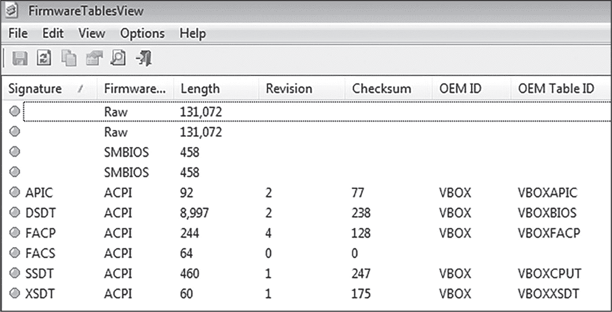
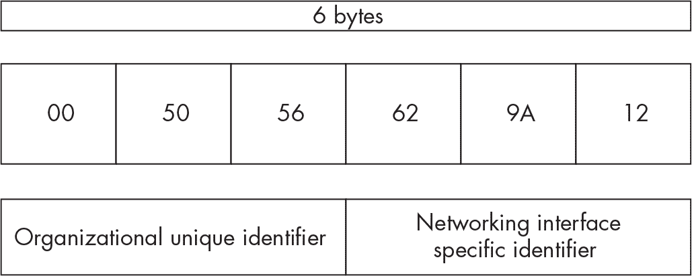

<hgroup>

## <samp class="SANS_Futura_Std_Bold_Condensed_B_11">6</samp> <samp class="SANS_Dogma_OT_Bold_B_11">枚举硬件和网络配置</samp>

</hgroup>


硬件信息，例如 CPU 速度和内存分配，以及网络配置，例如主机网络接口的 MAC 地址和 IP 地址，可以向恶意软件表明它正在实验室环境中运行。此外，恶意软件还可以利用这些信息来建立其操作环境的上下文。在本章中，我们将讨论恶意软件可能使用的收集这些信息并避免检测的技术。

### <samp class="SANS_Futura_Std_Bold_B_11">硬件和设备配置</samp>

系统硬件配置可以为恶意软件样本提供有价值的信息，帮助它判断是否在虚拟机（VM）或沙盒中运行。虚拟机使用的硬件是仿真硬件，容易与真实硬件区分，而且通常与物理系统配置大不相同。恶意软件还可以枚举硬件信息，比如处理器数量、系统中安装的内存大小、硬盘存储容量等。在本节中，我们将依次探讨这些领域。

#### <samp class="SANS_Futura_Std_Bold_Condensed_Oblique_I_11">CPU</samp>

由于虚拟化的 CPU 与物理 CPU 看起来有所不同，恶意软件通常会检查主机的处理器，以确定它运行的环境。恶意软件可以通过几种方式获取 CPU 硬件信息。比较常见的方法是调用 <samp class="SANS_TheSansMonoCd_W5Regular_11">GetSystemInfo</samp> 函数，以获取 <samp class="SANS_TheSansMonoCd_W5Regular_11">dwNumberOfProcessors</samp> 值，该值表示系统拥有的处理器数量。现代计算机系统几乎总是有多个处理器和处理器核心。为了判断是否在虚拟机中运行，恶意软件可能会检查主机的处理器核心数量是否少于两个，例如：

```
SYSTEM_INFO systemInfo;
GetSystemInfo(systemInfo);
int numProcessors = systemInfo.dwNumberOfProcessors;
if numProcessors < 2 {
  KillSelf()
}
```

在这段伪代码中，样本定义了一个结构体（<samp class="SANS_TheSansMonoCd_W5Regular_11">systemInfo</samp>），然后调用 <samp class="SANS_TheSansMonoCd_W5Regular_11">GetSystemInfo</samp>。*结构体*（struct）是一种数据类型，允许将其他数据以单一名称组合在一起。<samp class="SANS_TheSansMonoCd_W5Regular_11">GetSystemInfo</samp> 函数返回的所有信息将存储在 <samp class="SANS_TheSansMonoCd_W5Regular_11">systemInfo</samp> 结构体中。恶意软件随后检查结构体中的 <samp class="SANS_TheSansMonoCd_W5Regular_11">dwNumberOfProcessors</samp> 值，如果 <samp class="SANS_TheSansMonoCd_W5Regular_11">numProcessors</samp> 的值小于 <samp class="SANS_TheSansMonoCd_W5Regular_11">2</samp>，则会终止自身。

类似地，恶意软件样本可以调用以下函数来返回它可以用来推断其运行环境的信息：

<samp class="SANS_TheSansMonoCd_W7Bold_B_11">GetLogicalProcessorInformation</samp><samp class="SANS_TheSansMonoCd_W7Bold_B_11"> </samp>返回处理器核心信息。

<samp class="SANS_TheSansMonoCd_W7Bold_B_11">GetNativeSystemInfo </samp>返回与<samp class="SANS_TheSansMonoCd_W5Regular_11">GetSystemInfo</samp>类似的信息，但通常由 64 位应用程序调用。

<samp class="SANS_TheSansMonoCd_W7Bold_B_11">IsProcessorFeaturePresent </samp>返回各种处理器特性的状态。如果它返回 true 表示<samp class="SANS_TheSansMonoCd_W5Regular_11">PF_VIRT_FIRMWARE_ENABLED</samp>，则说明系统正在使用虚拟固件，这显然是系统可能已虚拟化的线索。

进程环境块（PEB）也可以用于 CPU 枚举。回顾第一章，PEB 结构包含指向内存中其他结构的指针，这些结构包含当前运行进程的信息。以下代码展示了恶意软件如何搜索 PEB 以检索 CPU 信息：

```
mov eax, dword ptr fs:[0x30]
mov edx, dword ptr ds:[eax+0x64]
cmp edx, 1
je terminate_process
```

样本将 PEB 的地址（存储在<samp class="SANS_TheSansMonoCd_W5Regular_11">fs:[0x30]</samp>中）移动到<samp class="SANS_TheSansMonoCd_W5Regular_11">eax</samp>寄存器，然后将恶意软件感兴趣的 PEB 特定偏移量（<samp class="SANS_TheSansMonoCd_W5Regular_11">[eax+0x64]</samp>）放入<samp class="SANS_TheSansMonoCd_W5Regular_11">edx</samp>寄存器。PEB 结构中的偏移量 0x64 存储系统上配置的处理器核心数量。如果处理器核心数量为<samp class="SANS_TheSansMonoCd_W5Regular_11">1</samp>，恶意软件将通过跳转到<samp class="SANS_TheSansMonoCd_W5Regular_11">terminate_process</samp>函数终止自己。

> <samp class="SANS_Dogma_OT_Bold_B_15">注意</samp>

*对于 64 位进程，PEB 的地址将位于 gs 寄存器中的<samp class="SANS_TheSansMonoCd_W5Regular_Italic_I_11">gs:[0x60]</samp>，因此需要留意恶意软件是否引用此地址。*

#### <samp class="SANS_Futura_Std_Bold_Condensed_Oblique_I_11">RAM</samp>

现代计算机通常至少拥有 4GB 的内存，但某些恶意软件分析环境和沙盒可能没有这个内存大小。如果安装的内存低于 4GB 的阈值（或类似的），恶意软件可能会认为它正在虚拟环境中运行。为检查这一点，恶意软件调用 Windows 函数<samp class="SANS_TheSansMonoCd_W5Regular_11">GetPhysicallyInstalledSystemMemory</samp>来返回系统内存的数量，示例如下：

```
lea ecx, [ebp+TotalMemoryInKilobytes]
call GetPhysicallyInstalledSystemMemory
cmp ecx, 4194302
jl  terminate_process
```

在这里，恶意软件样本调用 <samp class="SANS_TheSansMonoCd_W5Regular_11">GetPhysicallyInstalledSystemMemory</samp> 函数，并以 <samp class="SANS_TheSansMonoCd_W5Regular_11">TotalMemoryInKilobytes</samp> 作为参数，该函数将返回的系统总内存值存储下来。在函数调用之后，恶意软件将 <samp class="SANS_TheSansMonoCd_W5Regular_11">TotalMemoryInKilobytes</samp> 的值与 4194302（即 4,194,302 千字节或 4GB）进行比较。如果系统 RAM 的量低于 4GB，恶意软件样本将跳转到 <samp class="SANS_TheSansMonoCd_W5Regular_11">terminate_process</samp> 并删除自身。

#### <samp class="SANS_Futura_Std_Bold_Condensed_Oblique_I_11">硬盘</samp>

大多数现代计算机被分配了数百 GB 的存储空间。恶意软件可以查询硬盘的存储容量，如果该值低于一定阈值，则可能确定正在虚拟环境中运行。这个阈值通常为 40GB、60GB 或 80GB，但随着平均存储容量的增长，这个数字可能会增加。

最常用于收集硬盘和容量信息的 Windows 函数是 <samp class="SANS_TheSansMonoCd_W5Regular_11">GetDiskFreeSpace</samp> 和 <samp class="SANS_TheSansMonoCd_W5Regular_11">GetDiskFreeSpaceEx</samp>。除了逃避检测之外，恶意软件很少会查询硬盘空间，因此这些函数应该引起你的警惕。绕过这种逃避策略的简单方法是将您的虚拟机磁盘大小增加到 40GB 以上，或者更好的是 80GB。

Windows 包含许多不太知名且不常用的 API 函数。其中一个例子是 <samp class="SANS_TheSansMonoCd_W5Regular_11">IsNativeVhdBoot</samp> 函数：

```
call IsNativeVhdBoot
test eax, 0
jne loc_403DDD
```

如果 <samp class="SANS_TheSansMonoCd_W5Regular_11">IsNativeVhdBoot</samp> 的返回值不是 <samp class="SANS_TheSansMonoCd_W5Regular_11">0</samp>，则系统是从虚拟硬盘引导的，表明是虚拟机。请注意，<samp class="SANS_TheSansMonoCd_W5Regular_11">IsNativeVhdBoot</samp> 函数仅在 Windows 8 及以上版本上有效。

#### <samp class="SANS_Futura_Std_Bold_Condensed_Oblique_I_11">监视配置</samp>

典型的现代计算机配置可能会有一台高分辨率显示器，有时甚至不止一台，而（大多数）虚拟机和沙箱环境通常没有这么多显示器。一些恶意软件专门检查正在使用的显示器数量，如果它检测到只有一个显示器，它可能会推测自己处于分析环境中。为了实现这一点，它可以调用 Windows API 函数<samp class="SANS_TheSansMonoCd_W5Regular_11">GetSystemMetrics</samp>，该函数返回一个特定的变量<samp class="SANS_TheSansMonoCd_W5Regular_11">SM_CMONITORS</samp>，表示正在使用的显示器数量。另一种方法是调用<samp class="SANS_TheSansMonoCd_W5Regular_11">EnumDisplayMonitors</samp>函数，该函数不会直接返回总数，而是为每个显示器执行回调函数。*回调函数*只是执行每个对象任务的一种方式——在这个例子中，是每个显示器。

恶意软件还可以使用相同的函数检查屏幕分辨率。非虚拟化终端用户系统的典型分辨率通常很高，例如 1,600 × 900。如果你的分析机器的显示分辨率较低（例如 1,152 × 864），恶意软件可能会注意到这一点。

#### <samp class="SANS_Futura_Std_Bold_Condensed_Oblique_I_11">USB 控制器</samp>

许多虚拟机配置为使用较旧的 USB 协议版本（例如 V1.1 或 V2.0），或者根本没有 USB 控制器设备。因为大多数现代非虚拟化系统至少有一个 USB 控制器，并且拥有最新的 USB 设备版本，这对于恶意软件来说可能是一个重要线索。

Windows 提供了一个有用的 API，用于列举 USB 设备和设置：*Winusb.dll*。如果你发现恶意软件试图导入此 DLL 并使用其功能，这很可能是某些可疑活动的强烈指示。

#### <samp class="SANS_Futura_Std_Bold_Condensed_Oblique_I_11">固件表</samp>

大多数系统硬件都配有被称为*固件*的低级软件。固件赋予硬件生命；没有它，硬件无法与操作系统或其他程序进行交互。Windows 会跟踪*固件表*，这些表格还包含相关硬件的品牌和型号，恶意软件可以利用这些信息来识别与虚拟机监控器相关的任何信息。

让我们来看一下固件表。图 6-1 展示了我在虚拟机上运行 Nirsoft 免费工具 FirmwareTablesView 的输出。



<samp class="SANS_Futura_Std_Book_Oblique_I_11">图 6-1：在 FirmwareTablesView 中显示的固件表</samp>

你可能已经能发现恶意软件样本可能利用的异常情况。文中多次提到*VBOX*，这是 VirtualBox 虚拟机监控器固件的标准前缀。

在固件列中，您可以看到每个固件表的类型，也叫做*提供者签名*：ACPI、SMBIOS 或 Raw。有些函数，如<samp class="SANS_TheSansMonoCd_W5Regular_11">GetSystemFirmwareTable</samp>和<samp class="SANS_TheSansMonoCd_W5Regular_11">EnumSystemFirmwareTables</samp>，需要提供者签名来检索固件表。以下代码展示了一个恶意软件调用<samp class="SANS_TheSansMonoCd_W5Regular_11">EnumSystemFirmwareTables</samp>来检查 ACPI 表：

```
loc_10001300:
push  [esp+38h+BufferSize] ; BufferSize
push  esi                  ; pFirmwareTableEnumBuffer
push  'ACPI'               ; FirmwareTableProviderSignature
call  EnumSystemFirmwareTables
cmp   [esp+38h+BufferSize], eax
```

后来，该恶意软件将搜索存储固件表的缓冲区，查找与虚拟机监控器相关的字符串，如<samp class="SANS_TheSansMonoCd_W5Regular_11">Oracle</samp>、<samp class="SANS_TheSansMonoCd_W5Regular_11">Vbox</samp>、<samp class="SANS_TheSansMonoCd_W5Regular_11">VirtualBox</samp>、<samp class="SANS_TheSansMonoCd_W5Regular_11">VMware</samp> 和 <samp class="SANS_TheSansMonoCd_W5Regular_11">VMware, Inc</samp>。

<samp class="SANS_TheSansMonoCd_W5Regular_11">NtQuerySystemInformation</samp>函数还会返回许多不同的系统信息，既包括恶意用途，也包括合法用途。恶意软件可以利用这个函数来枚举固件表。以下是可能的情况：

```
push  [ebp+Length]  ; SystemInformationLength
push  eax           ; SystemFirmwareTableInformation
push  76            ; SystemInformationClass
call  NtQuerySystemInformation
```

该恶意软件使用几个重要的参数调用了<samp class="SANS_TheSansMonoCd_W5Regular_11">NtQuerySystemInformation</samp>函数。第一个参数，<samp class="SANS_TheSansMonoCd_W5Regular_11">SystemInformationLength</samp> (<samp class="SANS_TheSansMonoCd_W5Regular_11">[ebp+Length]</samp>), 是接收函数调用返回数据的缓冲区大小。第二个参数，<samp class="SANS_TheSansMonoCd_W5Regular_11">SystemFirmwareTableInformation</samp> (<samp class="SANS_TheSansMonoCd_W5Regular_11">eax</samp>), 是指向该缓冲区的指针。第三个参数，<samp class="SANS_TheSansMonoCd_W5Regular_11">76</samp>, 表示该恶意软件感兴趣的系统信息类别，即<samp class="SANS_TheSansMonoCd_W5Regular_11">SystemFirmwareTableInformation</samp>。在恶意软件调用<samp class="SANS_TheSansMonoCd_W5Regular_11">NtQuerySystemInformation</samp>函数并将固件表结构存储在缓冲区后，它可以枚举缓冲区中的与虚拟机监控器（Hypervisor）相关的信息。

请注意，<samp class="SANS_TheSansMonoCd_W5Regular_11">SystemFirmwareTableInformation</samp> 数据类没有被微软文档化，因此关于它的公开信息不多。微软将某些功能保密，可能是为了避免被滥用，但恶意软件作者和研究人员最终会发现这些功能。Conix Cybersécurité 已经编制了一个完整的列表，列出了 <samp class="SANS_TheSansMonoCd_W5Regular_11">NtQuerySystemInformation</samp> 可以返回的数据类，详见 [*https://<wbr>github<wbr>.com<wbr>/conix<wbr>-security<wbr>/zer0m0n<wbr>/blob<wbr>/master<wbr>/src<wbr>/driver<wbr>/include<wbr>/nt<wbr>/structures<wbr>/SYSTEM<wbr>_INFORMATION<wbr>_CLASS<wbr>.h*](https://github.com/conix-security/zer0m0n/blob/master/src/driver/include/nt/structures/SYSTEM_INFORMATION_CLASS.h)。

#### <samp class="SANS_Futura_Std_Bold_Condensed_Oblique_I_11">其他硬件设备</samp>

恶意软件可能会利用其他硬件配置来获取其环境信息，例如 CD 或 DVD 驱动器、声卡和音频配置、连接的打印机（或没有打印机）、以及串口等。我们将在附录 A 中详细介绍一些此类设置，但由于恶意软件可能会枚举受害系统上的所有硬件配置，因此不可能在本书中列出所有硬件配置。

接下来，我们将关注恶意软件可能用来检测虚拟机或沙盒环境的网络相关信息。

### <samp class="SANS_Futura_Std_Bold_B_11">网络相关伪装痕迹</samp>

网络相关的伪装痕迹，如 IP 地址配置、当前建立的连接、开放的服务端口，甚至是受害系统所加入的域，都可以帮助恶意软件识别其操作环境。本节将教你如何做到这一点。

#### <samp class="SANS_Futura_Std_Bold_Condensed_Oblique_I_11">IP 地址配置</samp>

恶意软件可能会出于多种原因获取主机的 IP 地址，最常见的原因是检测主机是否在沙盒或恶意软件分析实验室中运行。内置虚拟网络的默认 IP 地址范围为 192.168.56.*X*。VMware Workstation 的默认 IP 范围是 192.168.*X.X*，其中最后两位数字是随机化的（例如 192.168.5.100 或 192.168.187.101）。此范围取决于系统运行的虚拟机管理程序软件版本。如果受害系统的 IP 地址位于这些范围内，恶意软件可能会判断它是虚拟机，或者进一步检查系统。

获取主机的 IP 地址非常简单，只需利用 <samp class="SANS_TheSansMonoCd_W5Regular_11">GetAdaptersAddresses</samp> 函数即可：

```
push edx ; AdapterAddresses structure
push 0   ; Reserved parameter
push 0   ; Flags parameter
push 2   ; Family parameter
call GetAdaptersAddresses
`--snip--`
mov eax, [ebp+AdapterAddresses.FirstUnicastAddress]
mov edx, [ebp+bad_ip_address]
cmp eax, edx
jnz terminate_process
```

和许多 Windows API 函数一样，<samp class="SANS_TheSansMonoCd_W5Regular_11">GetAdaptersAddresses</samp> 接受一系列的参数。在这个例子中，<samp class="SANS_TheSansMonoCd_W5Regular_11">push edx</samp> 将缓冲区 <samp class="SANS_TheSansMonoCd_W5Regular_11">AdapterAddresses</samp> 的地址推送到栈中，该缓冲区将保存从函数调用中返回的所有地址数据。接下来的三条指令将 <samp class="SANS_TheSansMonoCd_W5Regular_11">reserved</samp>、<samp class="SANS_TheSansMonoCd_W5Regular_11">flags</samp> 和 <samp class="SANS_TheSansMonoCd_W5Regular_11">family</samp> 参数推送到栈中。最重要的是 <samp class="SANS_TheSansMonoCd_W5Regular_11">family</samp> 参数，它的值为 <samp class="SANS_TheSansMonoCd_W5Regular_11">2</samp>，告诉 <samp class="SANS_TheSansMonoCd_W5Regular_11">GetAdaptersAddresses</samp> 仅返回 IPv4 信息。表 6-1 列出了每个 <samp class="SANS_TheSansMonoCd_W5Regular_11">family</samp> 参数值的定义。

<samp class="SANS_Futura_Std_Heavy_B_11">表 6-1：</samp> <samp class="SANS_TheSansMonoCd_W5Regular_11">GetAdaptersAddresses 家族</samp> <samp class="SANS_Futura_Std_Book_11">参数值</samp>

| <samp class="SANS_Futura_Std_Heavy_B_11">ASCII 值</samp> | <samp class="SANS_Futura_Std_Heavy_B_11">数字值</samp> | <samp class="SANS_Futura_Std_Heavy_B_11">定义</samp> |
| --- | --- | --- |
| <samp class="SANS_TheSansMonoCd_W5Regular_11">AF_UNSPEC</samp> | <samp class="SANS_TheSansMonoCd_W5Regular_11">0</samp> | <samp class="SANS_Futura_Std_Book_11">返回 IPv4 和 IPv6 地址</samp> |
| <samp class="SANS_TheSansMonoCd_W5Regular_11">AF_INET</samp> | <samp class="SANS_TheSansMonoCd_W5Regular_11">2</samp> | <samp class="SANS_Futura_Std_Book_11">仅返回 IPv4 地址</samp> |
| <samp class="SANS_TheSansMonoCd_W5Regular_11">AF_INET6</samp> | <samp class="SANS_TheSansMonoCd_W5Regular_11">23</samp> | <samp class="SANS_Futura_Std_Book_11">仅返回 IPv6 地址</samp> |

接下来，恶意软件调用了<samp class="SANS_TheSansMonoCd_W5Regular_11">GetAdaptersAddresses</samp>函数。在后续的代码中，<samp class="SANS_TheSansMonoCd_W5Regular_11">AdapterAddresses.FirstUnicastAddress</samp>的值被移入<samp class="SANS_TheSansMonoCd_W5Regular_11">eax</samp>，而变量<samp class="SANS_TheSansMonoCd_W5Regular_11">bad_ip_address</samp>则被移入<samp class="SANS_TheSansMonoCd_W5Regular_11">edx</samp>。<samp class="SANS_TheSansMonoCd_W5Regular_11">FirstUnicastAddress</samp>变量是<samp class="SANS_TheSansMonoCd_W5Regular_11">AdapterAddresses</samp>的一部分，包含结构中的第一个 IP 地址。<samp class="SANS_TheSansMonoCd_W5Regular_11">bad_ip_address</samp>变量包含恶意软件正在检查的 IP 地址。假设该值为<samp class="SANS_TheSansMonoCd_W5Regular_11">192.168.56.2</samp>，表示一个 VirtualBox 网络。恶意软件使用<samp class="SANS_TheSansMonoCd_W5Regular_11">cmp eax, edx</samp>将<stext class="SANS_TheSansMonoCd_W5Regular_11">FirstUnicastAddress</samp>的值与<samp class="SANS_TheSansMonoCd_W5Regular_11">bad_ip_address</samp>进行比较，检查受害者系统是否具有 IP 地址<samp class="SANS_TheSansMonoCd_W5Regular_11">192.168.56.2</samp>。如果此 IP 存在于<samp class="SANS_TheSansMonoCd_W5Regular_11">AdapterAddresses</samp>结构中，恶意软件将跳转到<samp class="SANS_TheSansMonoCd_W5Regular_11">terminate_process</samp>函数以终止自身。

请记住，列举系统上的 IP 地址有许多方法。有些函数涉及直接查询接口信息，而其他函数则采用更为间接的方法，如列出 IP 网络表。还可以使用 Windows 工具（如 WMI、PowerShell 和 Windows 命令行）查询 IP 地址信息。您应该对任何试图查找主机内部 IP 地址的恶意软件保持警惕，因为它可能正在使用某种检测技术。

#### <samp class="SANS_Futura_Std_Bold_Condensed_Oblique_I_11">域配置</samp>

恶意软件可能会尝试列举受害主机的域名，以确保目标属于某个特定公司或网络，或排除恶意软件分析环境。在这种情况下，*域*只是网络中系统的逻辑分组。您用于工作的计算机很可能是某个域的一部分，该域的名称与您的公司名称相关。这个域通常也是您系统的*主机名*的一部分，或者说是您设备在网络上的名称。例如，如果您在 Evil Corp 工作，您的域名可能是*evil.corp*，而您的主机名可能是*your.computer.evil.corp*。

域枚举可以成为恶意软件的一种极佳规避策略。例如，如果受害系统没有与域关联，或者它所连接的域与恶意软件的主要目标不匹配，恶意软件可能会终止自身以避免分析，或者改变其行为。用于枚举主机域的常见 Windows API 函数是 <samp class="SANS_TheSansMonoCd_W5Regular_11">GetComputerName</samp> 和 <samp class="SANS_TheSansMonoCd_W5Regular_11">DsGetDcName</samp>。

除了 Windows API 函数外，恶意软件还可能查询这些注册表项，其中可能包含系统的域信息：

+   <samp class="SANS_TheSansMonoCd_W5Regular_11">HKCU\Volatile Environment</samp>

+   <samp class="SANS_TheSansMonoCd_W5Regular_11">HKLM\System\CurrentControlSet\Services\Tcpip\Parameters</samp>

为了阻止这种攻击策略，可以将虚拟机和沙箱加入到一个域中。即使该域是虚假的，仍然可以欺骗恶意软件执行。我们将在附录 A 中进一步讨论如何伪造域和网络连接。

#### <samp class="SANS_Futura_Std_Bold_Condensed_Oblique_I_11">MAC 地址配置</samp>

*媒体访问控制（MAC）地址*是一个应用于所有计算机网络硬件的唯一标识符。MAC 地址由代表设备制造商的数字（3 个字节）组成，接着是另一个由特定于主机硬件设备的数字（另外 3 个字节）组成的序列（参见图 6-2）。



<samp class="SANS_Futura_Std_Book_Oblique_I_11">图 6-2：MAC 地址结构</samp>

在图 6-2 中，示例的 MAC 地址是 00:50:56:62:9A:12。前三个字节（00:50:56）代表制造商标识符（在此案例中为 VMware），最后三个字节代表该特定适配器。

恶意软件可以查询主机的 MAC 地址，查看主机是否使用特定制造商的网络硬件。每个网络硬件都有自己的专用 MAC 地址，因此恶意软件还可以利用这些信息来锁定受害者。一个例子就是 2019 年发生的著名供应链攻击事件，名为“ShadowHammer”。攻击者利用一份预先选择的 MAC 地址列表来锁定并感染特定的计算机。

要获取主机上的 MAC 地址列表，恶意软件可以调用 Windows API 函数 <samp class="SANS_TheSansMonoCd_W5Regular_11">GetAdaptersAddresses</samp>。然后它将该列表与硬编码的 MAC 地址列表进行比较，只有在找到与 MAC 地址匹配的网络设备时，才会感染系统。在恶意软件调用 <samp class="SANS_TheSansMonoCd_W5Regular_11">GetAdaptersAddresses</samp> 后（使用我在“IP 地址配置”部分中介绍的相同技术，见第 109 页），它会检查 <samp class="SANS_TheSansMonoCd_W5Regular_11">AdapterAddresses</samp> 结构体中的 <samp class="SANS_TheSansMonoCd_W5Regular_11">PhysicalAddress</samp> 值，该值包含主机的 MAC 地址，如下所示：

```
call GetAdaptersAddresses
`--snip--`
mov eax, [ebp+AdapterAddresses.PhysicalAddress]
`--snip--`
mov [ebp+var_38], 0B203B000h ; MAC address data
mov [ebp+var_34], 0F6DDB6CAh ; MAC address data
mov [ebp+var_30], 1D3CA6CDh  ; MAC address data
mov [ebp+var_2C], 287E2CDBh  ; MAC address data
```

后来，恶意软件通过类似 <samp class="SANS_TheSansMonoCd_W5Regular_11">mov [ebp+var_38], 0B203B000h</samp> 的指令将数据移入堆栈。这些数据代表恶意软件将与受害者的 MAC 地址进行比较的部分 MAC 地址。

与虚拟机相关的 MAC 地址也可以通过这种方式枚举。以下 MAC 地址前缀之一的存在将指示恶意软件它正在虚拟机环境中运行，且可能正在被分析：

**VMware Workstation**

+   00:50:56 ...

+   00:0C:29 ...

+   00:05:69 ...

**VirtualBox**

+   08:00:27 ...

> <samp class="SANS_Dogma_OT_Bold_B_15">注意</samp>

*为了绕过这种检测技术，请更改您的虚拟机和沙箱的 MAC 地址。*

#### <samp class="SANS_Futura_Std_Bold_Condensed_Oblique_I_11">外部 IP 地址与互联网连接性</samp>

一种越来越常见的规避技术是获取潜在受害者的外部 IP 地址。恶意软件可能出于两个原因需要这些信息。首先，恶意软件可以用它来确定潜在受害者的位置。有些恶意软件可能只针对特定地区的受害者，或者它可能想排除某些地理区域。这不仅帮助恶意软件保持目标准确，还有助于反分析和规避；如果潜在受害者不在恶意软件的区域范围内，恶意软件会终止自身或修改行为，从而欺骗沙箱和恶意软件分析员。

其次，恶意软件可以利用主机的外部 IP 地址信息或互联网连接状态来检测分析环境。例如，如果外部 IP 地址是一个流行的虚拟私人网络（VPN）网关（如 NordVPN 或 ExpressVPN）或 TOR 退出节点，恶意软件可能会推断出它正在被分析。（毕竟，如果有人使用 TOR 或 VPN，他们*一定*是恶意软件分析员，对吧？）此外，沙箱和分析环境通常是故意离线的，因此如果主机根本没有外部 IP 地址，恶意软件可能会认为它运行在实验室环境中。

这种技术可以通过多种方式执行，但最常见的方法可能是简单地向 IP 查询服务发送 web 请求，如*WhatIsMyIP.com*或*IPLocation.net*。这些是合法的服务，能够报告回调用主机的外部 IP 和地理位置信息。如果你在分析沙箱或实验室中引爆恶意软件，并且看到类似这些网站的 HTTP 请求，这可能是恶意软件正在尝试查找主机的外部 IP 地址或位置的信号。以下是可能的情况：

```
1 mov   ecx, [ebp+lpszServerName] ; "icanhazip.com"
push  0    ; dwContext
push  0    ; dwFlags
push  3    ; dwService
push  0    ; lpszPassword
push  0    ; lpszUserName
2 push  80   ; nServerPort
3 push  ecx  ; lpszServerName
push  ebx  ; hInternet
4 call  ds:InternetConnectA
```

首先，恶意软件样本将包含域名*icanhazip.com*的值 <samp class="SANS_TheSansMonoCd_W5Regular_11">lpszServerName</samp> 移动到 <samp class="SANS_TheSansMonoCd_W5Regular_11">ecx</samp> 寄存器中，供以后使用 ❶。<samp class="SANS_TheSansMonoCd_W5Regular_11">InternetConnectA</samp> 函数有很多参数，但重要的参数是 <samp class="SANS_TheSansMonoCd_W5Regular_11">nServerPort</samp> ❷，它表示恶意软件样本将通过哪个端口与域名进行联系（端口 <samp class="SANS_TheSansMonoCd_W5Regular_11">80</samp>，或 <samp class="SANS_TheSansMonoCd_W5Regular_11">HTTP</samp>），以及域名本身，现在存储在 <samp class="SANS_TheSansMonoCd_W5Regular_11">ecx</samp> 中 ❸。最后，它调用 <samp class="SANS_TheSansMonoCd_W5Regular_11">InternetConnectA</samp> ❹。这个样本的代码本质上是通过 HTTP 联系 *icanhazip.com* 域名，以获取主机的外部 IP 地址。

一种相关的方法是简单地向在线服务提供商发送 DNS 或 HTTP 请求。任何服务提供商都可以使用，但*Google.com*是常见的一个。如果恶意软件样本向 web 服务器发送请求并未收到数据（或收到错误数据），它可能会推测自己正在被分析。以下样本尝试联系*Google.com*，然后检查响应，以确保它与服务器的正常响应一致：

```
push  ecx    ; lpszServerName ("google.com")
push  ebx    ; hInternet
call  InternetConnectA
`--snip--`
push  eax    ; lpdwNumberOfBytesRead
1 push  9      ; dwNumberOfBytesToRead
lea   ecx,   [ebp+lpBuffer]
2 push  ecx    ; lpBuffer
push  edi    ; hFile
3 call  InternetReadFile
test  eax, eax
jz    short loc_ 4021B6
`--snip--`
loc_404194:
4 mov   eax, offset first_bytes ; "<!doctype"
test  eax, [ebp+lpBuffer]
```

在尝试联系 *Google.com*（使用 <samp class="SANS_TheSansMonoCd_W5Regular_11">InternetConnectA</samp>）之后，样本会传递 <samp class="SANS_TheSansMonoCd_W5Regular_11">InternetReadFile</samp> 函数的参数，其中包括 <samp class="SANS_TheSansMonoCd_W5Regular_11">dwNumberOfBytesToRead</samp> ❶，它包含从 Web 服务器响应中读取的字节数（<samp class="SANS_TheSansMonoCd_W5Regular_11">9</samp>），以及 <samp class="SANS_TheSansMonoCd_W5Regular_11">lpBuffer</samp> ❷，这是一个指向 <samp class="SANS_TheSansMonoCd_W5Regular_11">InternetReadFile</samp> 将返回的数据的指针。接下来，恶意软件样本调用 <samp class="SANS_TheSansMonoCd_W5Regular_11">InternetReadFile</samp> ❸，它从 Google 的响应中读取前 9 个字节（应该是 <samp class="SANS_TheSansMonoCd_W5Regular_11"><!doctype</samp>）。最后，代码将 <samp class="SANS_TheSansMonoCd_W5Regular_11"><!doctype</samp> 值与存储在 <samp class="SANS_TheSansMonoCd_W5Regular_11">lpBuffer</samp> ❹ 中的实际响应进行比较。如果响应不同，这个恶意软件样本可能会得出结论，认为系统没有连接到互联网，或者可能正在沙盒中被分析。

在现代恶意软件中，看到这种外部 IP 验证技术并不罕见，因此要保持警觉。如果你正在分析一个恶意软件样本，并看到它向像 *WhatIsMyIP.com* 这样的站点发送外发 HTTP 或 DNS 请求，或者向 *Google.com* 或 *AWS.Amazon.com* 这样的服务提供商发送请求，那么很有可能该恶意软件正在使用这种虚拟机检测技术。以下是一些其他需要注意的网站：

+   *api.ipify.org*

+   *checkip.amazonaws.com*

+   *checkip.dyndns.com*

+   *icanhazip.com*

+   *ip-api.com*

+   *ip.anysrc.net*

+   *ipecho.net*

+   *ipinfo.io*

+   *iplocation.net*

+   *myexternalip.com*

+   *myipaddress.com*

+   *showipaddress.com*

+   *whatismyip.com*

+   *whatismyipaddress.com*

+   *wtfismyip.com*

#### <samp class="SANS_Futura_Std_Bold_Condensed_Oblique_I_11">TCP 连接状态</samp>

在前一节中，我提到过，恶意软件分析师通常会将分析机器和沙盒配置为完全离线，或连接到一个假网络。恶意软件可以利用这一行为，通过枚举外发的 TCP 连接，尝试判断这些连接是否有效。一个合法的终端用户系统或服务器可能会有许多指向各种外部 IP 地址和端口的外发 TCP 连接。而恶意软件分析机器或沙盒，除非连接到像互联网这样的真实网络，否则可能只有少数几个连接，甚至没有任何连接。

这一策略涉及使用 Windows API <samp class="SANS_TheSansMonoCd_W5Regular_11">GetTcpTable</samp> 函数，该函数返回一个表格，列出了系统上最新的 TCP 连接的当前状态，类似于在主机上运行 *netstat.exe* 的结果。这个表格可能类似于表 6-2。

<samp class="SANS_Futura_Std_Heavy_B_11">表 6-2：</samp> <samp class="SANS_Futura_Std_Book_11">示例 TCP 连接</samp>

| <samp class="SANS_Futura_Std_Heavy_B_11">本地地址</samp> | <samp class="SANS_Futura_Std_Heavy_B_11">本地端口</samp> | <samp class="SANS_Futura_Std_Heavy_B_11">远程地址</samp> | <samp class="SANS_Futura_Std_Heavy_B_11">远程端口</samp> | <samp class="SANS_Futura_Std_Heavy_B_11">状态</samp> |
| --- | --- | --- | --- | --- |
| <samp class="SANS_TheSansMonoCd_W5Regular_11">127.0.0.1</samp> | <samp class="SANS_TheSansMonoCd_W5Regular_11">2869</samp> | <samp class="SANS_TheSansMonoCd_W5Regular_11">local-machine</samp> | <samp class="SANS_TheSansMonoCd_W5Regular_11">49202</samp> | <samp class="SANS_TheSansMonoCd_W5Regular_11">TIME_WAIT</samp> |
| <samp class="SANS_TheSansMonoCd_W5Regular_11">127.0.0.1</samp> | <samp class="SANS_TheSansMonoCd_W5Regular_11">2869</samp> | <samp class="SANS_TheSansMonoCd_W5Regular_11">local-machine</samp> | <samp class="SANS_TheSansMonoCd_W5Regular_11">49203</samp> | <samp class="SANS_TheSansMonoCd_W5Regular_11">ESTABLISHED</samp> |
| <samp class="SANS_TheSansMonoCd_W7Bold_B_11">192.168.1.2</samp> | <samp class="SANS_TheSansMonoCd_W7Bold_B_11">49157</samp> | <samp class="SANS_TheSansMonoCd_W7Bold_B_11">91.184.220.29</samp> | <samp class="SANS_TheSansMonoCd_W7Bold_B_11">80</samp> | <samp class="SANS_TheSansMonoCd_W7Bold_B_11">ESTABLISHED</samp> |
| <samp class="SANS_TheSansMonoCd_W7Bold_B_11">192.168.1.2</samp> | <samp class="SANS_TheSansMonoCd_W7Bold_B_11">49158</samp> | <samp class="SANS_TheSansMonoCd_W7Bold_B_11">64.233.160.15</samp> | <samp class="SANS_TheSansMonoCd_W7Bold_B_11">443</samp> | <samp class="SANS_TheSansMonoCd_W7Bold_B_11">ESTABLISHED</samp> |
| <samp class="SANS_TheSansMonoCd_W5Regular_11">...</samp> | <samp class="SANS_TheSansMonoCd_W5Regular_11">...</samp> | <samp class="SANS_TheSansMonoCd_W5Regular_11">...</samp> | <samp class="SANS_TheSansMonoCd_W5Regular_11">...</samp> | <samp class="SANS_TheSansMonoCd_W5Regular_11">...</samp> |

离线恶意软件分析机器或沙箱可能不会像表 6-2 中的第三行和第四行那样建立远程 TCP 连接。

恶意软件当然也可以利用本地 Windows 工具来实现这一点，比如前面提到的*netstat.exe*。在检查恶意软件时，留意通过 Windows 函数或本地 Windows 工具枚举 TCP 状态信息的尝试。

### <samp class="SANS_Futura_Std_Bold_B_11">总结</samp>

在本章中，我们介绍了恶意软件可能使用的许多硬件和网络配置枚举技术，以确定其操作环境。正如你所看到的，理解其环境并建立上下文是恶意软件检测虚拟机和沙盒、躲避分析师或保持目标不变的关键。 在下一章中，我们将探讨恶意软件如何通过检查运行时异常、监控性能以及滥用虚拟处理器指令来暴露恶意软件分析环境。
