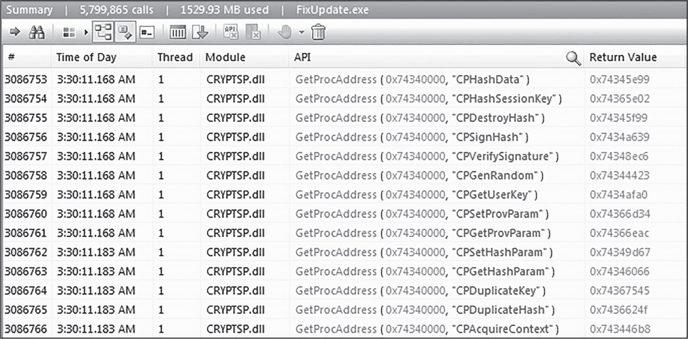
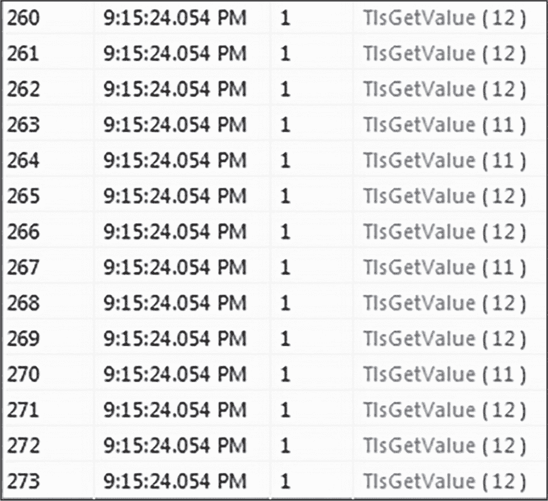
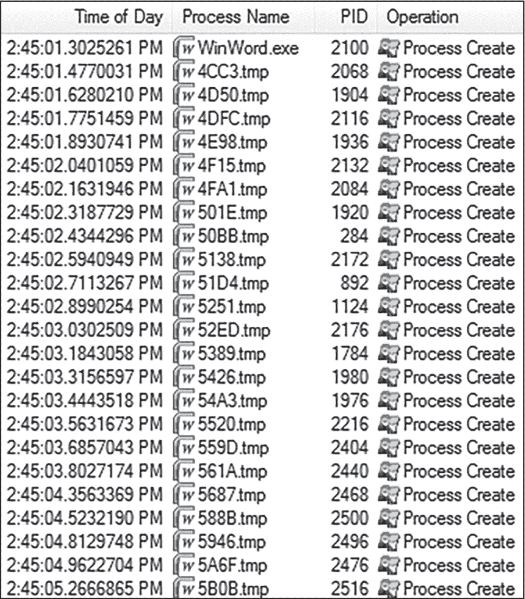
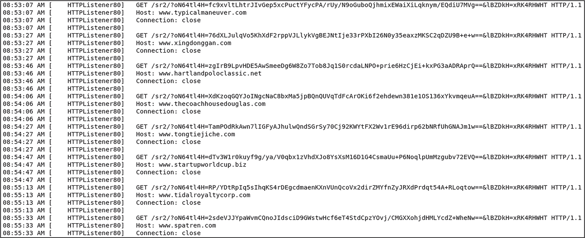
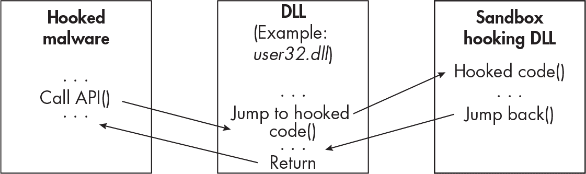

## 8 规避沙箱与干扰分析


在前几章中，你了解了恶意软件用来建立上下文并更好地理解当前环境的几种技术。当恶意软件判断它正在分析员的实验室中运行，或处于其他敌对环境时，它可能会采取回避措施，例如延迟执行、创建诱饵，甚至通过干扰分析员的工具主动阻碍调查工作。本章将重点讨论这些以及恶意软件用来隐藏自己并规避分析工具的其他方法。

### 自我终止

恶意软件避免分析的一种简单有效的方式是*自我终止*。恶意软件可以简单地调用 Windows API 函数，如TerminateProcess或ExitProcess，向自己的进程发出“终止”命令，像这样：

```
is_vm = enumerate_reg_keys(keys)
if (is_vm)
{
  current_process = GetCurrentProcess()
  TerminateProcess(current_process, ... )
}
```

这个恶意软件伪代码首先调用它自己的内部函数enumerate_reg_keys，枚举第四章中讨论的一些与虚拟机相关的注册表键。（函数的详细内容这里未显示。）接下来，如果is_vm返回 true，恶意软件会请求获取它自己的进程句柄（GetCurrentProcess），然后通过调用TerminateProcess终止自身。ExitProcess函数也可以以相同的方式使用，只有一些微小的区别。有时，恶意软件甚至同时调用这两个函数，以确保它已经成功终止。

这种技术对于自动化沙箱尤其有效，因为沙箱无法监控已经自我终止的恶意软件样本的行为。然而，沙箱可能会标记该函数本身，或检测到样本自我终止得太快。这个方法也能有效应对与样本进行手动交互的恶意软件分析员，因为分析员必须通过调试器或反汇编器逆向代码，以确定恶意软件是如何以及为何终止自己的。

当你分析使用这种技术的恶意软件样本时，在 ExitProcess 和 TerminateProcess 上设置调试器断点可能有助于你在恶意软件自我终止之前抓住它。这将允许你检查调用栈以及导致进程终止的代码，并希望能够找出原因。然而，务必记住，这些 API 函数也可能在崩溃期间被调用，因此恶意软件可能并非直接调用它们用于规避目的。

### 延迟执行

想象一下一个典型的自动化恶意软件分析沙箱环境。该环境会根据需求启动，执行恶意软件样本，监视恶意软件的行为几分钟（具体取决于沙箱的配置），然后关闭。那么，如果恶意软件延迟执行以“超时”沙箱分析过程怎么办？例如，也许恶意软件执行一个睡眠例程，在其中它会保持休眠几分钟，超越沙箱环境的短暂生命期。高级恶意软件将其执行延迟数小时甚至数周并不罕见。这是一种有效的规避沙箱并使恶意软件分析师努力受挫的方法。

#### Sleep 函数调用

最常见的延迟执行形式可能就是恶意软件简单地调用 Windows API 中的 Sleep 函数。Sleep 及其相关函数 SleepEx 接受一个表示睡眠时间（以毫秒为单位）的参数。以下汇编代码展示了一个恶意软件样本调用 Sleep 函数的片段：

```
push 493E0h ; 5 minutes
call Sleep
```

在这种情况下，传递给 Sleep 的 493E0h 参数是以十六进制表示的时间，代表 300,000 毫秒，或 5 分钟。

> 注意

*有关 Sleep 函数及其如何被恶意软件利用的更多信息，请参阅第七章。*

为了绕过这种技术，你可以在Sleep和SleepEx函数调用上设置断点，然后修改传递给它的dwMilliseconds参数。或者，你可以在调试器中直接nop掉这些Sleep指令，或者跳过它们。然而，这些方法并不总是万无一失的；高级恶意软件可能会在调用Sleep之前和之后计算系统时间，以验证Sleep函数是否正常执行！最后，许多现代沙箱可以拦截对Sleep的调用并进行修改，从而大幅减少样本的总休眠时间。

#### 超时

恶意软件可以通过使用 Windows 工具（如*ping.exe*）来延迟其执行，从而造成*超时*。这种方法通常比睡眠方法更有效，因为它更难被沙箱干扰。另一个优点是，它可能会混淆分析过程，因为恶意软件分析师必须弄清楚为什么恶意软件样本会调用某个特定的应用程序。

在以下代码片段中，一个恶意软件样本正在执行*ping.exe*来向 Google 发送 1,000 次 ping 请求。根据网络连接速度，这可能会造成较长的延迟，甚至导致沙箱超时并停止分析：

```
push eax ; "ping.exe google.com -n 1000"
push 0;
call CreateProcessA
```

恶意软件还可以调用*timeout.exe* Windows 工具，这通常用于批处理脚本中暂停命令处理，以延迟执行。请注意恶意软件是否调用了这些工具。使用代码分析和调试来理解为什么恶意软件会执行这种行为。

#### 时间炸弹与逻辑炸弹

在*定时炸弹*中，恶意软件设置一个特定的时间，例如某个日期或时间，来决定何时执行。例如，恶意软件样本可能包含嵌入代码，该代码仅在每天上午 9 点、每周六或 2024 年 12 月 26 日下午 5:55 执行。除非沙箱或恶意软件分析师手动设置日期或时间，以诱使恶意软件运行，否则样本不会执行其恶意代码。

与定时炸弹类似，在*逻辑炸弹*中，恶意软件在某个特定事件（如文件删除或数据库事务）发生后执行。逻辑炸弹可能比定时炸弹更有效，因为它们可以非常特定地针对恶意软件的操作环境。

以下简化的伪代码演示了一种时间炸弹技术，在这种技术中，恶意软件样本获取当前的系统日期，并将其与硬编码日期（在此例中为 2024 年）进行比较。

```
`--snip--`
GetSystemTime(&systemTime)

if (systemTime.wYear <= '2024') {
  KillSelf()
}
```

如果恶意软件确定当前日期是 2024 年或更早，它将无法执行。

有时，沙箱可以识别恶意软件是否使用了这些技巧，但它们通常能避开检测。识别时间炸弹和逻辑炸弹的最佳方法是进行代码分析。在反汇编器或调试器中检查恶意软件样本，可能会揭示出恶意软件在寻找的时间、日期或逻辑。一旦识别出这一点，你可以简单地将分析系统时间设置为匹配，或者尝试重新创建这些逻辑。或者，你可以在反汇编器或调试器中修改恶意软件的代码，以绕过这些检查。

需要注意的是，除了用于规避检测外，时间炸弹技巧还用于控制恶意软件的传播。恶意软件可能被编程为*在特定日期或时间之后不执行*，以便更好地控制它，或以其他方式限制其生命周期。

#### 伪代码和无限循环

一些恶意软件作者会在恶意软件中加入*伪代码*，使其进入无限循环，调用高 CPU 占用的函数或仅用于拖延分析时间的函数。通常，当恶意软件检测到沙箱或虚拟机环境时，伪代码会开始运行。以下的汇编代码示例展示了这可能是什么样子的：

```
loop:
inc ecx
cmp ecx,ecx
je loop
```

在这个基本的for循环中，ecx的值每次增加 1，然后与自身比较。如果它等于自身（提示：它会等于），循环将重复执行。这个简单的代码将使恶意软件的执行无限期拖延，或者至少直到沙箱终止，或者恶意软件分析师感到沮丧并结束进程。

类似地，一些恶意软件反复调用 Windows API 函数来拖延分析。例如，它可能调用RegEnumKey来枚举主机的整个注册表，这将耗费大量时间。或者，恶意软件样本可能反复调用LoadLibrary加载不存在的库。在写这本书时，我分析了一个 Dridex 银行木马样本，它执行GetProcAddress超过*五百万次*，以解析它从未使用过的函数地址（见图 8-1）。这会拖延分析，消耗宝贵的沙箱内存和 CPU 资源，有时还会导致崩溃。



图 8-1：通过反复执行 GetProcAddress 来延迟分析

已知 Dridex 也会执行 OutputDebugString 并进入无限循环，这与 GetProcAddress 方法具有相同的效果。OutputDebugString 函数将在第十章中详细讨论。

### 强制重启和注销

强制系统关机、重启或注销可以是有效的规避方法，尤其是在沙盒中。它会迅速停止所有分析工作，至少在主机重启完成之前是这样。然而，现代沙盒大多数可以应对这种情况，如果沙盒检测到已发出关机或注销指令，它会在机器重启后继续分析。但这仍然会对恶意软件分析过程产生负面影响。例如，在重启的情况下，原本保存在内存中的痕迹可能会被销毁。

恶意软件可以通过调用如 InitiateShutdown、InitiateSystemShutdown 和 InitiateSystemShutdownEx 等函数来强制重启或关闭系统。这三个函数的操作类似，接受一些关键参数，例如指定是否关闭或重启主机的选项，以及表示从函数调用到重启或关机的*超时*值。恶意软件可能还会使用的另一个 API 函数是 ExitWindows（或其同类函数 ExitWindowsEx），它提供了注销用户的选项，而不仅仅是重启或关闭主机。最后，系统也可以通过 WMI、PowerShell 或内置的 Windows *shutdown.exe* 工具来关闭。

恶意软件通常在建立持久性后使用此技术，此时它强制重启，然后运行其实际有效负载。通过这种方式，它成功地规避了某些自动化分析沙盒，并使恶意软件分析人员在尝试调查样本时感到困惑（或至少感到烦恼）。

### 诱饵和噪声

一些恶意软件作者利用沙盒在可预测的方式下运行的特点。例如，沙盒必须捕获大量数据，以理解和评估恶意软件样本的行为，而恶意软件可以通过生成大量的*噪声*或*诱饵*数据来利用这一点，这些数据会迅速淹没沙盒或妨碍分析。本节介绍了恶意软件如何做到这一点的几种方式。

#### API 攻击

当沙箱引爆一个恶意软件样本时，它会记录恶意软件的行为和函数调用。*API 擂击* 涉及多次调用相同的函数（在某些情况下，可能是数十万次），快速填满沙箱日志，并用无用的数据淹没分析环境。因此，沙箱可能无法成功分析该样本，因为噪音过多且日志已满。此外，使用 API 擂击技术的恶意软件样本在沙箱中执行的时间会更长，因为其日志记录行为引入了额外的开销。如果在正常的终端用户系统上执行同样的样本，它会更快地执行。

几乎任何 Windows API 函数都可以被滥用来实现这一目的。我见过的两个函数是 printf（一个将字符打印到调用应用程序的 C 函数）和 TlsGetValue。图 8-2 中展示的恶意软件样本连续调用了 TlsGetValue 函数超过 30,000 次！



图 8-2：恶意软件通过多次调用 TlsGetValue 来使用 API 擂击

恶意软件家族 Nymaim 和 Trickbot 都采用了 API 擂击技术，如 Joe Security 博客文章中所描述的（[*https://<wbr>www<wbr>.joesecurity<wbr>.org*](https://www.joesecurity.org)）。至少有一个 Nymaim 变种在检测到其运行在虚拟机或沙箱环境中时，会发出超过 *50 万* 次无害的 Windows API 函数调用！正如你可以想象的那样，这会在沙箱日志中生成大量数据。一些沙箱无法处理如此巨量的数据，可能会提前终止分析。

然而，许多现代沙箱可以检测到 API 擂击，并将这种行为标记为可疑，甚至完全停止记录可疑的函数。沙箱还可能修改正在运行的恶意软件样本的行为或采取其他措施，防止 API 擂击干扰分析。但如果未被检测到，API 擂击会严重影响沙箱评估恶意软件的能力。

#### 不必要的进程生成

与 API 擂击类似，不必要的进程生成是另一种用来压垮沙箱和恶意软件分析师的技术。图 8-3 中展示的恶意软件样本生成了数百个进程，所有进程都被命名为 <xxxx>.tmp，以隐藏其真实活动。



图 8-3：恶意软件生成大量“虚假”进程

由于恶意软件生成了大量进程，分析师很难确定哪些进程值得进一步调查。沙箱也可能被所有数据所压倒。

#### 诱饵网络通信

一些恶意软件变种会发送虚假或诱饵网络流量，以尝试掩盖真实的恶意流量。一个广为人知的恶意软件家族 Formbook 就采用了这种技术。Formbook 连接到一个随机生成的包含多个诱饵网站地址和一个实际的 *命令与控制（C2）* 地址的列表，这可能会使分析人员和沙箱感到困惑。在某些情况下，这些诱饵地址是真实的域名，可能会导致恶意软件分析人员在调查过程中走上错误的道路。图 8-4 展示了 Formbook 使用正常的 HTTP GET 请求连接到多个诱饵 C2 地址。



图 8-4：Formbook 连接到诱饵 C2 地址

如你所见，所有流量看起来几乎相同，但这些连接中只有一个是指向真实 C2 服务器的。

> 注意

*你可以通过以下文件哈希值从 VirusTotal 或 MalShare 下载 Formbook 恶意软件：*

> SHA256: 08ef1473879e6e8197f1eadfe3e51a9dbdc9c892e442b57a3186a64ecc9d1e41

### 反挂钩

许多恶意软件分析沙箱和工具使用 *API 挂钩*，或简称 *挂钩*，来分析恶意软件行为。这涉及将一段代码（称为 *挂钩*）注入到恶意软件的内存空间中。挂钩然后拦截 API 函数调用，将它们重定向到不同的函数或修改其行为，再将其传递给原始函数。这个挂钩通常是一个模块，通常以 DLL 形式存在，然后在恶意软件运行时对其进行监控（见 图 8-5）。



图 8-5：一个沙箱挂钩正在运行的恶意软件进程

在这个示例中，一个沙箱通过 DLL 注入（沙箱挂钩的 DLL）挂钩了正在运行的恶意软件进程（挂钩恶意软件）。沙箱修改了它所挂钩的函数的前几个字节（在 *user32.dll* 内部），并插入了一个跳转（jmp）指令。现在，对 *user32.dll* 库中的该函数的所有调用将跳转到沙箱挂钩 DLL 中的挂钩代码。安装的挂钩允许沙箱拦截和监视函数调用，并可能修改函数调用参数或返回值。

为了实现挂钩，沙箱代理会在它希望挂钩的函数开头插入一个跳转语句。以下汇编代码片段展示了沙箱挂钩后 ReadFile 函数的前几个字节：

```
0x77000000 jmp hook_code
0x77000005 // Start of real ReadFile code
```

在这段钩取的代码中，插入的跳转语句将确保当恶意软件调用 ReadFile 函数时，执行流将转移到沙盒钩子代码 (hook_code)，然后再执行真正的 ReadFile 代码。这种类型的钩子称为 *内联钩子*。沙盒使用一种名为 *进程注入* 的技术，将内联钩子注入目标进程中。我们将在第十二章中更详细地讨论注入和各种类型的钩子。

一些分析工具，如 API Monitor 和某些调试器插件，出于类似目的使用钩子。其中一个例子是流行的工具 ScyllaHide，它可以用来绕过恶意软件中的反调试技术。（第十章将更详细地介绍 ScyllaHide。）在本节中，我们将深入探讨恶意软件如何检测和规避钩子和监控的一些方法。

#### 钩子检测

在执行之前，恶意软件可能会通过扫描自身的内存，检测是否被沙盒或分析工具钩取，查找这些注入的钩子模块。在第七章中，您已经看到恶意软件如何调用像 Module32First 和 Module32Next 这样的函数来枚举其已加载的模块。对于钩子检测，恶意软件样本可能会跟踪它将加载的模块，如果它枚举已加载的模块并注意到一个异常的加载模块，它可能会假设自己被钩取或被其他方式监控。

在执行目标函数之前，恶意软件可以检查沙盒是否已修改该函数的代码，试图对其进行钩取。为此，恶意软件调用 ReadProcessMemory 或 NtReadVirtualMemory 来读取可疑函数所在的内存，然后检查该函数的前几个字节。恶意软件会留意函数开头插入的异常跳转指令，这明显是钩取的迹象，正如以下伪代码所示：

```
handle = GetModuleHandle("ntdll.dll")
functionAddress = GetProcAddress(handle, "NtAllocateVirtualMemory")

ReadProcessMemory(GetCurrentProcess(), functionAddress, buffer, bufferSize, &bytesRead)

if (buffer[0] == 0xE9)
  {
     // Function hooked
      return true
  }
```

该恶意软件的代码首先获取 ntdll.dll 的句柄以及 NtAllocateVirtualMemory 的地址。然后，代码调用 ReadProcessMemory 来检查 NtAllocateVirtualMemory 函数的第一个字节。如果第一个字节是跳转指令（十六进制 E9），则恶意软件假定 NtAllocateVirtualMemory 被钩住，并且正在被沙箱或分析工具监控。

我们将在稍后的 “执行不对齐的函数调用” 一节中再次讨论此技术，见 第 140 页。

#### 钩子移除（解除钩住）

在检测到钩子后，恶意软件样本可以尝试通过恢复原始数据来移除它。恶意软件可以通过几种方式尝试做到这一点。

首先，恶意软件可以手动卸载它认为已加载到其进程地址空间中的任何可疑模块（注入的钩子 DLL）。一旦检测到异常模块，它可以调用 FreeLibrary 函数。FreeLibrary 的参数是恶意软件希望卸载的库模块句柄。

恶意软件实现卸载的一个可能更好的方法是手动重新加载看似已被钩住的 Windows 库。恶意软件可以扫描其已加载的库，以寻找钩子模块的迹象，一旦检测到钩子，它可以卸载该 DLL（使用如 FreeLibrary 等函数），然后从磁盘重新加载一个未被钩住的全新库。这有效地移除了沙箱或分析工具安装的任何函数钩子。

另外，一旦恶意软件检测到某个函数被钩住，它可以简单地将原始代码写入该函数，替换跳转到钩子代码的指令。为了解除内联钩子，恶意软件可以简单地删除函数中的钩住字节（跳转指令），或者用其他内容覆盖它们，正如以下伪代码所示：

```
handle = GetModuleHandle("ntdll.dll")
functionAddress = GetProcAddress(handle, "NtAllocateVirtualMemory")

VirtualProtect(functionAddress, size, PAGE_EXECUTE_READWRITE, &oldProtect)
memcpy(functionAddress, "\x4c\x8b\xd1\xb8", 4)

VirtualProtect(functionAddress, size, oldProtect, &newOldProtect)
```

在这段代码中，恶意软件获取它希望解除钩子的库和函数的地址（GetProcAddress），在此例中是 NtAllocateVirtualMemory，然后调用 VirtualProtect 来准备对该函数进行修改，通过赋予它执行、读取和写入权限。接着，恶意软件复制（memcpy）四个字节（\x4c\x8b\xd1\xb8）到目标函数代码的开头。这些字节是标准的、未钩住的原始字节，在沙箱钩住之前，目标函数中会包含这些字节。最后，恶意软件再次调用 VirtualProtect 来将内存权限恢复为原始设置。

一些沙箱意识到恶意软件可能会尝试解除其已安装的函数钩子，并会对此保持警觉。类似于恶意软件扫描其进程内存以寻找钩子的迹象，沙箱可以定期检查它们的钩子是否仍然存在，如果没有，则进行替换。或者，沙箱可能会监控恶意软件解除钩子的行为，例如监控调用 ReadProcessMemory、WriteProcessMemory、memcpy、FreeLibrary 等函数的行为。

接下来，让我们讨论恶意软件绕过沙箱钩子的一种更微妙的方法：钩子规避。

#### 钩子规避

与钩子移除不同，*钩子规避*绕过或完全防止钩子的使用。钩子规避技术的例子包括以非正常方式调用 Windows 函数和手动加载代码库（从而绕过正常的库加载过程）。由于一些沙箱能够检测到其钩子是否被移除或更改，因此这些方法可能更不容易被发现，并且更难以检测。

##### 执行未对齐的函数调用

在*未对齐*的函数调用中，恶意软件通过跳过沙盒钩子代码间接调用函数，有效地完全绕过了它。通常，恶意软件会通过使用调用指令(call ReadFile)来调用 Windows API 函数，如ReadFile。该指令会跳转到ReadFile函数的开头（在*kernel32.dll*模块内）并执行此代码。然而，如果ReadFile函数已被沙盒钩住，则钩子代码会先执行，如本章前面所讨论的那样。在以下代码中，一个钩子已经被注入到该函数中：

```
0x77000000 jmp hook_code
0x77000005 // Start of real ReadFile code
```

要实现一个未对齐的函数调用，恶意软件可以通过执行指令jmp 0x77000005（或像jmp 0x77000000 + 0x5那样将 5 个字节添加到基址）直接跳转到地址0x77000005，而不是正常调用ReadFile。这样做会跳过在0x77000000的钩子jmp语句，直接执行从0x77000005开始的真实ReadFile代码。

这里需要注意的一点是，恶意软件必须显式指定函数地址，这意味着它必须事先知道该地址。恶意软件可以通过调用GetProcAddress来获取该地址，如下所示的简化汇编代码所示：

```
`--snip--`
call GetProcAddress
mov address, eax
cmp [address], 0E9h
je  skip_hook
`--snip--`
skip_hook:
lea eax, [address+5]
jmp eax
```

恶意软件示例调用GetProcAddress来获取所需目标函数的地址，然后将该值存储在address中（mov address, eax）。该地址指向函数的开始，恶意软件在此处检查是否有钩子。接下来，恶意软件将该地址处的代码与十六进制值0E9h（jmp的汇编操作码之一）进行比较。如果存在此操作码，代码将跳转到skip_hook函数，后者会将目标函数地址加上 5 个字节，并将此最终地址的指针存储在 EAX 中（lea eax, [address+5]）。最后，代码跳转到这个新地址（jmp eax），绕过钩子。

##### 调用低级和不常用的函数

为了绕过沙箱和分析工具中的钩子行为，一些恶意软件调用低级的本地 API 函数，试图避开那些更常见的被钩住的高级调用。例如，恶意软件可以直接调用NtProtectVirtualMemory函数，而不是调用VirtualProtect，以尝试绕过后者的任何钩子。

或者，恶意软件甚至可以直接向内核发起系统调用，绕过正常的 WinAPI 调用程序。我们在第一章中讨论了系统调用。某些沙箱可能不会监视直接进入内核的调用，这可能会在这些沙箱的分析报告中留下盲点。由于这也是一种绕过终端防御的技术，我们将在第十三章中详细讨论这一话题。

由于自动化沙箱和某些恶意软件分析工具会钩住或监控常见的 Windows 函数，恶意软件也可能使用不常见的函数作为绕过钩子的策略。Windows API 包含大量函数，几乎涵盖了程序可能执行的每一项任务，因此不可避免地会有很少使用的和几乎重复的函数。例如，SHEnumKeyEx函数与RegEnumKey非常相似，也可以用于枚举注册表键，但它的使用频率远低于后者。因此，SHEnumKeyEx可能会受到自动化沙箱和分析人员较少关注，当恶意软件使用它来阻止钩子行为时，可能会被忽视。

不幸的是，由于 Windows API 非常庞大，列出所有这些较少使用的函数几乎是不可能的。然而，在调查恶意软件和研究任何不熟悉的 API 调用时，记住这一策略是非常重要的。

##### 手动加载库并调用函数

恶意软件还可以手动加载 Windows 库，而不是依赖标准的 Windows 加载器。正如你在第一章中回顾到的，Windows 应用程序加载库的标准方法是使用诸如LoadLibrary等函数。LoadLibrary函数将请求的库映射到内存中，提供快速且简便的加载过程，操作系统负责所有繁重的工作。简单性带来的缺点是，沙箱和其他分析工具可以轻松地在此库中实现钩子，拦截函数调用。

为了绕过这一点，恶意软件可以通过使用NtMapViewOfSection手动将库文件映射到其进程地址空间中，如下所示的简化伪代码所示：

```
file_name = "C:\Windows\System32\Ntdll.dll"
NtCreateFile(file_handle, ..., file_name, ... )
NtCreateSection(section_handle, ..., file_handle)
NtMapViewOfSection(section_handle, process_handle, ...)
```

在这个例子中，恶意软件使用NtCreateFile来获取文件*C:\Windows\System32\Ntdll.dll*的句柄，这是它希望加载的库。接下来，恶意软件使用NtCreateSection创建一个段对象，并引用先前获得的文件句柄。*段对象*是可以与其他进程共享的内存区块，它提供了一种将文件映射到内存区域的方法。在创建段对象后，恶意软件使用NtMapViewOfSection将*ntdll.dll*文件映射到该段对象中。process_handle变量表示目标进程，文件将被映射到该进程中。在这种情况下，就是恶意软件自身的进程。

另一种类似的方法是从磁盘读取文件，而不是将其映射到内存中。为了从磁盘读取*ntdll.dll*，恶意软件可以调用ReadFile（或NtReadFile）并将目标文件名作为参数传递。使用这两种方法之一，一旦库被映射或读取到内存中，恶意软件就可以通过跳转到或调用目标库中的地址来执行其预定功能。请注意，这些方法“开箱即用”时并不起作用，恶意软件还需要进行一些额外的工作，例如正确定位它希望调用的 DLL 中的函数偏移量。

##### 编写自定义函数

最后，恶意软件作者可能选择完全重写 Windows 函数，并将其包含在恶意软件样本中，以避免钩子技术。这通常是最难实施的钩子绕过技术；许多因素会影响其实现，并且修改后的函数必须与受害主机的操作系统完美兼容。在实践中，看到这种恶意软件方法的情况相对较少。

#### 反钩子工具集

也有一些专门为反钩子目的而编写的工具。其中一个例子是名为 anticuckoo 项目（[*https://<wbr>github<wbr>.com<wbr>/therealdreg<wbr>/anticuckoo*](https://github.com/therealdreg/anticuckoo)），它通过各种方法检测潜在的沙盒钩子。此外，该工具允许用户通过修改钩子函数的代码来利用沙盒，可能会导致内存堆栈损坏，从而导致沙盒崩溃。这个项目似乎不再维护，但它是关于沙盒反钩子的一个很好的研究例子。如需了解有关此技术的更多信息，请阅读“针对 Cuckoo 沙盒检测的流行威胁及我们的缓解措施”这篇信息丰富的博客文章，链接在这里：[ *https://<wbr>www<wbr>.fortinet<wbr>.com<wbr>/blog<wbr>/threat<wbr>-research<wbr>/prevalent<wbr>-threats<wbr>-targeting<wbr>-cuckoo<wbr>-sandbox<wbr>-detection<wbr>-and<wbr>-our<wbr>-mitigation*](https://www.fortinet.com/blog/threat-research/prevalent-threats-targeting-cuckoo-sandbox-detection-and-our-mitigation)。

恶意软件分析是一场猫捉老鼠的游戏。进攻性安全研究人员和恶意软件作者不断想出新的方法来检测和规避钩子，因此恶意软件分析师和沙盒开发者必须不断适应。例如，Cuckoo 沙盒的作者实现了几种*反反钩子*技术，例如通过限制内存保护修改来防止钩子被覆盖。许多其他商业沙盒也实现了类似的功能。

### 规避沙盒分析

由于沙盒是自动化的，它们容易受到元层面的规避策略的影响，所谓元层面是指沙盒产品本身的层级，而不是它的实现或底层操作系统。例如，某些沙盒对提交的文件大小有限制，因此恶意软件作者可以简单地人为地增加恶意软件文件的大小来规避这些限制。其他沙盒则无法处理某些文件类型或脚本。现在越来越常见的是，恶意文件通过加密的电子邮件发送，解密密码在邮件正文中。最终用户可能会高兴地输入密码，解密文件并运行恶意软件，但沙盒在这方面就非常困难了！

此外，一些沙盒在监控某些文件类型时存在问题。截止目前，许多商业和开源沙盒并未完全支持 Microsoft .NET，这是一个跨平台的 Windows 开发框架。由于.NET 实现了与本地 Windows 和 NT API 函数不同的自定义函数，这些沙盒可能会遗漏有关恶意软件行为和功能的重要细节。

这些只是一些示例，实际上还有许多其他方法可以欺骗沙箱，使其根本无法执行恶意软件。在分析自动化沙箱中的恶意软件时，请牢记这一点，并始终注意这些规避技术。评估沙箱产品是否符合您的需求，在部署到您的环境中之前也是至关重要的。

### 破坏手动调查

本章讨论的技术至今主要集中在规避沙箱环境，但恶意软件也可以直接干扰手动分析。例如，第四章描述了恶意软件如何枚举主机上运行的进程，以便检测沙箱环境、虚拟机或分析工具。然而，除了检测这些工具之外，一些恶意软件还可以主动终止它们。

为了终止目标进程，恶意软件可以通过使用 CreateToolhelp32Snapshot、Process32First 和 Process32Next 来遍历进程树，正如你在第四章中看到的那样。然后，恶意软件可以调用 OpenProcess 来获取目标进程的句柄，接着调用 TerminateProcess。以下汇编代码示例演示了恶意软件样本如何终止远程进程：

```
`--snip--`
push  [ebp+dwProcessId] ; PID of "wireshark.exe"
push  0 ; bInheritHandle
push  0x1 ; dwDesiredAccess
call  OpenProcess
mov   [ebp+ProcessHandle], eax
xor   eax, eax
`--snip--`
push  [ebp+ProcessHandle]
call  TerminateProcess
```

在此代码片段中，恶意软件通过 OpenProcess 调用，传入表示目标进程（此例中为 *wireshark.exe*）的 processID 参数、InheritHandle 值（在此不重要）和 dwDesiredAccess 值（即恶意软件进程请求的进程访问权限）。在此，恶意软件请求的访问权限是 1（十六进制表示为 0x1），这等同于 PROCESS_TERMINATE，允许调用进程（恶意软件）终止另一个进程（*wireshark.exe*）。当然，Wireshark 这里只是一个示例。如果恶意软件拥有正确的权限，它可以查询并终止任何进程。

> 注意

*有时，在启动恶意软件分析工具之前重命名其可执行文件，可以欺骗采用这种方法的简单恶意软件。例如，重命名* wireshark.exe *为* krahseriw.exe *可能会防止恶意软件“看到”这个进程，从而避免其被终止。然而，这个解决方案并不适用于所有情况。*

恶意软件可以使用的另一种战术是迷惑分析员。我调查过的一个有趣恶意软件样本创建了一个目录在 *C:\Users\<user>\AppData\Local\Temp* 下。恶意软件将该目录命名为一个随机生成的数字（例如 *21335493*），并将其功能所需的临时文件写入其中。为了保护该目录，恶意软件不断枚举所有打开的窗口，特别查找包含该临时目录名称的窗口，并在匹配时发出“杀死”请求，关闭该窗口。

这是该技术应用的简化伪代码示例：

```
windows[] = EnumWindows()
for (i = 0; i < windows[].length; i++) {
  window_text = GetWindowText(windows[i])
  if (windows_text == "21335493") {
    PostMessage(windows[i], WM_CLOSE)
  }
}
```

这个恶意软件样本使用EnumWindows来枚举所有桌面窗口，然后循环检查所有窗口标题文本，使用GetWindowText，查找21335493。如果代码找到包含此文本的窗口，恶意软件调用PostMessage函数，并使用WM_CLOSE参数，强制该窗口关闭。现在，如果恶意软件分析员尝试在例如文件资源管理器中打开*21335493*临时目录，它将在分析员检查其内容之前自动关闭。

这两个例子只是皮毛。 从第十章开始，我将讨论恶意软件作者可以在其代码中实现的其他有趣措施，以混淆和阻碍手动分析。

### 虚拟机管理程序漏洞和虚拟机逃逸

本章中我们将讨论的最后一种技术可能是终极的沙箱和虚拟机逃避手段：利用虚拟机管理程序本身或完全逃逸出它。虽然恶意软件中很少见到这种手段，但在实际应用中偶尔会出现这种技术的使用，并且在 VMware 和 VirtualBox 等产品中也发现了一些漏洞。一个著名的例子是 Cloudburst，它是 Immunity Inc.于 2009 年开发的一个漏洞，影响了某些版本的 VMware 虚拟机管理程序。播放一个特别制作的视频文件在 Windows 虚拟机中会利用 VMware 显示功能中的缺陷，可能会允许在主机操作系统上执行代码。

大多数已知的虚拟机管理程序漏洞并不直接允许在主机上执行代码，这意味着完全“逃脱”沙箱环境的可能性较小。例如，其中一些漏洞允许写入文件到主机或可能从主机读取文件，但它们不会允许恶意文件或代码在主机上执行。此外，在写本文时，所有这些已发现并报告的漏洞已经被各自的虚拟机管理程序供应商修复。只要你——恶意软件分析员——在已更新并修补过的虚拟机管理程序上引爆恶意软件，从理论上讲，你的主机系统是安全的。

> 注意

*我在这里说“理论上”是因为，始终存在零日漏洞和超管理程序代码中未知、未报告的漏洞，恶意软件可能会利用这些漏洞。在分析恶意软件时总是存在风险，但我相信任何风险都被其带来的好处所抵消。在附录 A 中，我们将讨论你可以采取的几个步骤，确保你在最安全的环境中工作。*

### 规避对策

如前所述，恶意软件作者和恶意软件研究人员之间存在一场猫捉老鼠的游戏：作者发明了一种新型技术来检测或绕过分析工具和沙箱，而分析师和防御安全研究人员则不断适应。一个很好的例子就是自动化分析沙箱的发展。许多现代沙箱已经实施了针对过去几章中提到的检测和规避战术的对策。

沙箱可以提醒恶意软件分析师检测和规避尝试，提供了解恶意软件内部的窗口，使分析师能够做出适当的响应。你可以通过将进程附加到调试器，设置在有趣的函数调用处设置断点，并在调试器或反汇编器中修改恶意软件代码来手动规避许多此类技术。这些函数调用可以被nop掉、跳过或修改（通过操控函数参数或返回值，如第三章所述）。最后，许多技术可以通过正确配置你的虚拟机和超管理程序来规避。我将在附录 A 中讨论如何做到这一点。

### 总结

本章概述了恶意软件在检测到自己被监控时，可能使用的避开沙箱、虚拟机环境和分析工具的方法。在第三部分，你将基于这些知识进一步探讨恶意软件如何利用反反汇编技术干扰反汇编工具，检测并规避像调试器这样的动态代码分析工具，以及误导恶意软件分析师。
