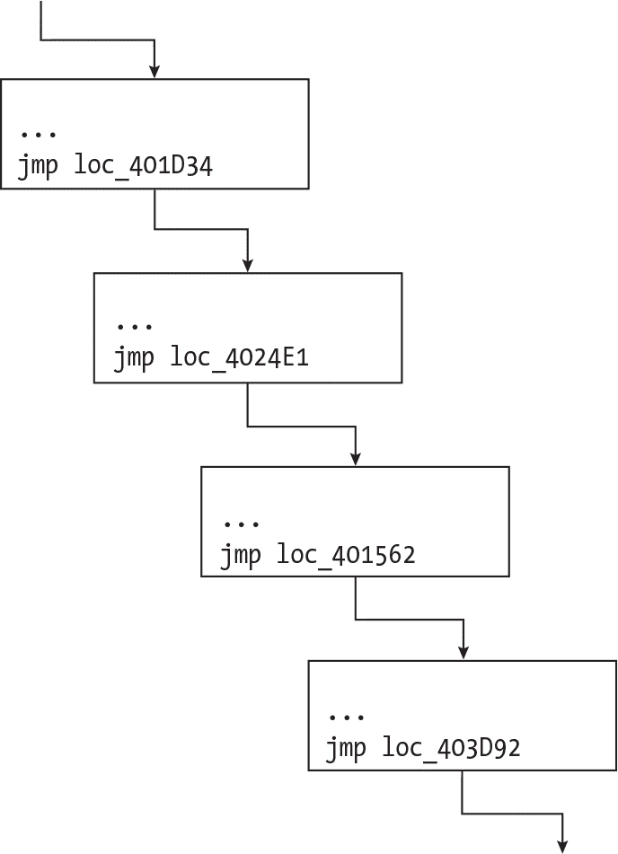
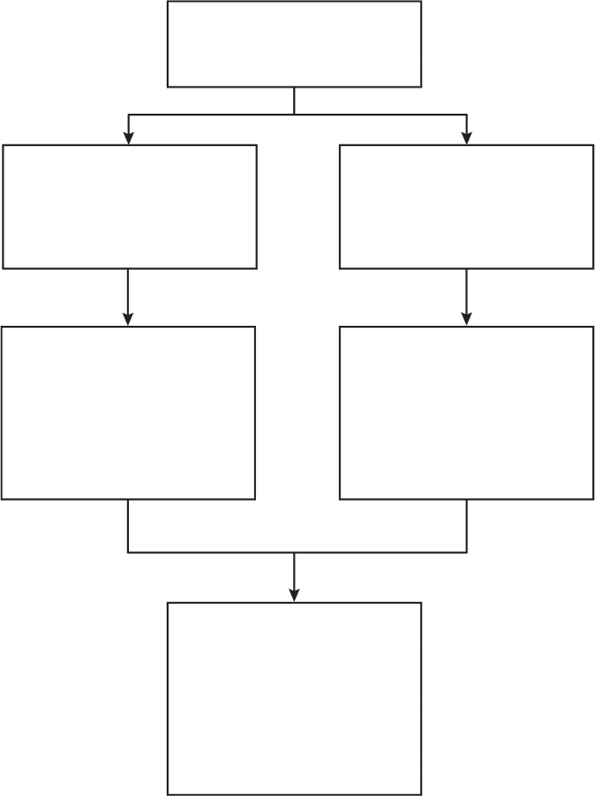
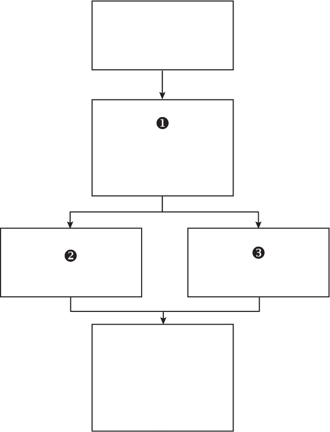
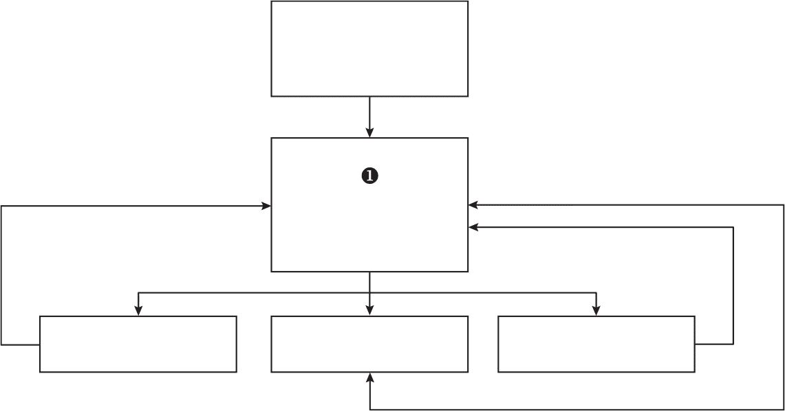
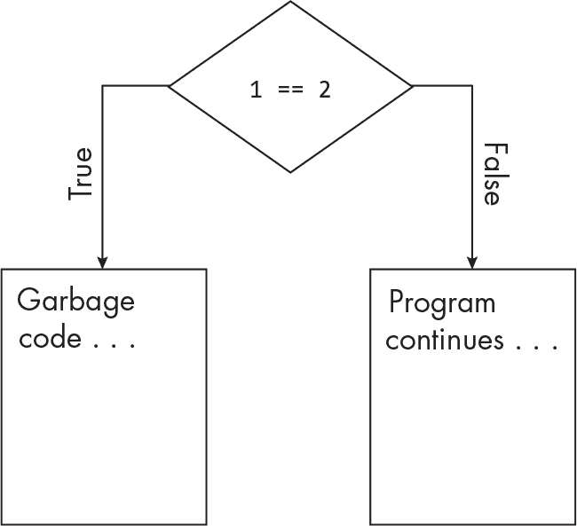
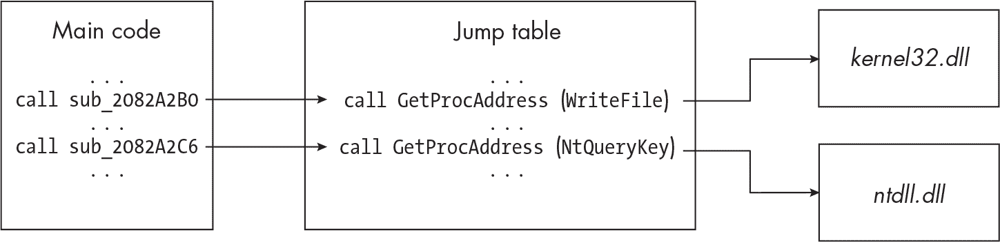

## 9 反汇编防护


由于反汇编器基于自己的（通常非常复杂的）算法将二进制文件分解为汇编代码，因此有一定的误差空间。恶意软件作者意识到这一漏洞，并能够积极利用它。他们可能还会试图模糊恶意软件的控制流、字符串和 API 函数调用引用，使得代码在静态分析时特别难以理解。这些都是 *反汇编防护* 技术的例子，或者说是恶意软件通过反汇编器逆向工程代码时所采取的复杂化手段。在本章中，我们将深入探讨这些策略以及恶意软件分析师如何应对这些问题。

### 破坏反汇编器

反汇编器基于自己硬编码的逻辑和假设来解释文件，这意味着它们可能会以不同且有时是问题重重的方式解读字节。代码可能会被错误地反汇编为数据，或者反之，字节也可能会被加到错误的指令上，从而产生完全新的错误指令。

作为示例，字节 e8 8c 45 0a 90 可以被反汇编为一个调用指令。如果去掉第一个字节（e8），将会得到一个完全不同的反汇编指令。在这种常见的反汇编防护方法中，称为 *流氓字节* 技术，恶意软件中插入流氓字节以混淆反汇编过程。例如，考虑以下代码片段：

```
`--snip--`
00402100      b8 00 00 00 00  mov eax, 0x00
00402105...   85 c0           test eax, eax
00402107...   74 01           jz loc_402109 + 1

loc_402109:
00402109      e8 8b 45 0a 90  call 0x900a4590
`--snip--`
```

在右侧列中，你可以看到几个反汇编指令，构成这些指令的字节在中间列，地址偏移量则在左侧列。这些反汇编指令没有太大意义。例如，有一个条件跳转指令（jz），它的目标是 loc_402109 + 1。由于在 jz 指令之前有一个 mov 指令将 eax 设置为 0，这个跳转将始终发生，但代码会跳转到下一个指令的 *第二个* 字节（字节 8b）。代码中还包含一个调用指令，指向一个在此可执行文件中根本不存在的地址，因为我们的可执行文件位于 0x00402xxx 地址范围内，而不是 0x900xxxxx 范围内。让我们更仔细地看看。

正如第三章所解释的，反汇编器并不总是能区分代码和数据。这意味着，当它将字节转换为代码时，这段代码实际上可能是数据，反之亦然。构成 call 0x900a4590 指令的字节是 e8 8b 45 0a 90。第一个字节 e8 在 x86 汇编指令集中表示调用指令。如果我们去掉这个字节，剩下的就是 8b 45 0a 90。这串字节在 x86 汇编中等价于以下代码：

```
mov eax, [ebp+10]
nop
```

这里我们有一条 mov 指令（将存储在栈上的值从 ebp+10 移动到 eax），后面跟着一条 nop 指令。与我们最初的调用指令 (call 0x900a4590) 相比，这段代码更有意义。因此，似乎第一个字节 (e8) 是一个伪造的字节，它被添加到代码中只是为了混淆反汇编工具。

你可以通过覆盖不正确的代码或数据来处理这个问题。在 IDA 中，你可以按 C 和 D 键（C 用于将数据转换为代码，D 用于将代码转换为数据）。在 Ghidra 中，恰恰相反，令人困惑的是；按 C 进行将代码转换为数据（在此情况下 C 代表“清除代码字节”），按 D 进行将数据转换为代码（D 代表“反汇编”）。

如果你在 IDA 中选择这个虚假的调用指令并按 D，这条指令会被拆解成数据，如下所示：

```
`--snip--`
00402100 mov eax, 0x00
00402105 test eax, eax
00402107 jz loc_402109 + 1

00402109 loc_402109:
1 00402109 db E8h
0040210A db 8Bh
0040210B db 45h
0040210C db 0Ah
0040210D db 90h
`--snip--`
```

注意到曾经是代码的部分现在变成了数据字节，从❶开始。现在，如果你选择从偏移量 0040210A 开始的字节值（小心不要选择 e8 字节），一直选择到 0040210D，然后按 C 将其转换为代码，你将得到以下内容：

```
`--snip--`
00402100 mov eax, 0x00
00402105 test eax, eax
00402107 jz loc_402109 + 1

00402109 loc_402109:
00402109 db E8h
0040210A mov eax, [ebp+10]
0040210D nop
`--snip--`
```

恶意软件将0x00移动到eax（为了将eax清零），然后使用条件跳转（jz）；如前所述，代码将始终执行这个跳转。然而，现在代码跳过了那个恶意字节（e8），而执行了mov和nop指令。这个恶意软件样本巧妙地插入了恶意字节，以欺骗反汇编器，使其认为它是原始调用指令的一部分！

这是一个相当简单的反反汇编方法示例，但它是常见的。这给反汇编器和逆向工程师带来了挑战。当你遇到像这样代码明显错误或没有意义的情况时，可以尝试手动将代码转换为数据字节，或者将某些字节转换为代码。这可能帮助你修复代码，从而更好地理解它。### 控制流混淆

接下来的反反汇编方法是*控制流混淆*，即向恶意软件代码中添加不必要的复杂性，使其更加难以静态分析。这种类型的混淆也会让反汇编器感到困惑，可能无法正确反汇编代码。

为了添加这种类型的混淆，恶意软件作者使用专门为此目的设计的代码混淆器，或恶意软件打包器，我们将在第十七章中详细讨论。让我们深入了解一些常见的控制流混淆方法。在本节的最后，我们将讨论几种应对这些策略的一般方法。

#### 不必要的跳转

恶意软件作者可能会添加不必要的跳转语句，将恶意软件的代码分割成更小的块（见图 9-1）。



图 9-1：不必要的跳转指令

图 9-1 中的代码曾经是一个单一块，但混淆器将其分成了多个块，每个块通过跳转语句连接到下一个块。从功能上讲，代码是相同的，但现在逆向工程师将更难理解和跟踪它。这个例子相当基础，但混淆器可以使代码变得极为复杂，正如你在接下来的几节中将看到的那样。

混淆器还可以使代码频繁地前后跳转，以增加顺序跟踪的难度，正如在这个例子中所示：

```
`--snip--`
push 300h
jmp loc_402B20
`--snip--`
loc_402A30:
call Sleep
jmp loc_402B65
`--snip--`
loc_402B20:
pop ebx
jmp loc_402A30
`--snip--`
loc_402B65:
push ecx
`--snip--`
```

这段代码会跳转到不同的区域，仅仅是为了制造混淆。它首先跳转到loc_402B20，然后回到loc_402A30，再回到loc_402B65，从而创建一个难以跟踪的代码流逻辑。

#### 不必要的代码

恶意软件作者可以向其恶意软件中添加其他类型的不必要代码。例如，他们可能创建代码块或函数的副本，这些副本实际上是相同的，或者至少非常相似，以便代码可以互换执行，从而导致相同的最终代码块，如图 9-2 所示。



图 9-2：可互换的代码块

这不会影响恶意软件的行为，但会增加逆向工程师的复杂性。

另外，恶意软件作者和混淆器可以添加永远不会被执行的虚假代码，这些代码仅存在于混淆分析人员、浪费 CPU 周期并拖慢分析过程。由于这些代码的具体内容可以是任何形式的，因此很难提供具体示例，但以下代码片段演示了这一技巧：

```
`--snip--`
inc ecx
push ecx
dec ecx
push ecx
`--snip--`
```

这段代码只是将ecx寄存器增加 1，将该值推入栈中，再减少 1，并将该值推入栈中。显然，这段代码没有实际的有效目的。

#### 控制流平坦化

*控制流平坦化*是一种通过将一系列条件代码块压缩为一个块来混淆控制流的方法。通常是通过 switch 语句来实现控制流的引导。图 9-3 展示了应用控制流平坦化前的程序。



图 9-3：应用控制流平坦化前的程序

该程序代表正常的、未混淆的代码。在标记为❶的代码块中，有一个条件语句会跳转到两个位置之一（代码块❷或❸）。如果该程序通过控制流平坦化算法处理后，它可能看起来更像图 9-4。



图 9-4：应用控制流平坦化后的程序

在图 9-3 中，代码块❶负责条件语句，决定跳转到代码块❷或❸。在扁平化的代码中，一个*中央调度*代码块❶负责条件语句，同时跟踪代码接下来应该“流向”哪里。调度器将控制流引导到一个代码块后，控制会返回到调度器，由它进一步引导控制流。调度器增加了反汇编代码的复杂性，使得分析师更难理解代码的目的以及接下来执行的路径。

#### 不透明谓词

一个*不透明谓词*（见图 9-5）是一个在程序运行时对程序或反汇编工具不可知，但对程序作者已知的值。程序的创建者（在我们这个例子中，是恶意软件作者）知道某个表达式会产生特定的值，例如，但我们作为反向工程师或我们的反汇编工具对此一无所知。



图 9-5：不透明谓词的实际应用

这段代码可以根据表达式 1 == 2（不透明谓词）决定走哪条路径。恶意软件作者已经知道程序将选择右侧分支，但分析师和反汇编器必须手动分析逻辑才能得出这一结论。显然，这是一个简化的例子，几乎任何人都能破译它。然而，恶意软件作者可以将不透明谓词设计得极其复杂，例如，在运行时计算复杂的数学函数。

这种技术也可以与之前提到的技术结合使用，比如添加不必要的代码。恶意软件作者可以在左分支中加入大量永远不会被执行的垃圾代码。反向工程师必须在分析程序的其余部分之前理解不透明谓词，以避免在垃圾代码上浪费时间。不透明谓词很难处理，正如前面所提到的，它可以是恶意软件作者希望的任何复杂程度。通常，处理这些问题的最佳方法是通过调试器逐步执行恶意软件，这样可以帮助揭示真正的控制流。

#### 返回指针滥用

混淆控制流的另一种方式是使用返回（ret）指令。例如，如果一个程序执行函数 B，当它到达该函数的末尾时，函数 B 会发出一个<stext class="SANS_TheSansMonoCd_W5Regular_11">ret指令来返回到其父函数（函数 A）。不过，在函数 B 返回之前，程序需要知道返回的地址在哪里。因此，返回地址会在函数 B 执行之前推送到栈中，并且在<stext class="SANS_TheSansMonoCd_W5Regular_11">ret指令执行后从栈中弹出。下面的汇编代码演示了这一过程：

```
push returnAddress
`--snip--`
ret
```

该代码发出一个<stext class="SANS_TheSansMonoCd_W5Regular_11">push指令将<stext class="SANS_TheSansMonoCd_W5Regular_11">returnAddress推送到栈中，然后执行<stext class="SANS_TheSansMonoCd_W5Regular_11">ret指令，这将从栈中弹出<stext class="SANS_TheSansMonoCd_W5Regular_11">returnAddress，将程序的控制流返回到父函数。

恶意软件可以滥用返回指针的工作方式，以复制<stext class="SANS_TheSansMonoCd_W5Regular_11">call或<stext class="SANS_TheSansMonoCd_W5Regular_11">jmp指令。通过将一个地址推送到栈中，然后执行<stext class="SANS_TheSansMonoCd_W5Regular_11">ret指令，恶意软件将迫使控制流执行新的返回地址处的代码。这可能会使一些反汇编工具感到困惑，并且通常会使分析人员跟踪代码变得更加困难。

#### SEH 处理程序滥用

恶意软件还可以利用*结构化异常处理程序（SEH）*，它存储了一系列地址，用于处理 Windows 应用程序中的异常。当应用程序触发异常时，它的控制流会转移到存储在 SEH 中的一个地址。

恶意软件可以通过创建一个指向恶意代码的新异常处理程序来滥用 SEH。当恶意软件故意在其代码中引发异常时，控制流将被转移到异常处理程序引用的代码。作为结果，分析人员需要知道恶意软件在哪里建立了异常处理程序，以及异常处理程序指向哪里，以便正确地逆向工程代码。考虑以下示例：

```
`--snip--`
mov eax, evil.429D8C
push eax
push dword ptr fs:[0]
mov dword ptr fs:[0], esp
`--snip--`
```

这个代码块的重点是fs:[0]，它基本上指向当前的异常处理程序。恶意软件将默认的异常处理程序代码替换为指向恶意代码的指针（evil.429D8C）。一旦恶意软件触发异常，代码的控制流将被转移到地址evil.429D8C。由于此处没有使用jmp、ret或call指令，这种控制流转移可能会让未经训练的眼睛难以跟踪，因此要留意引用fs:[0]的代码。通常，这之后会看到一个div指令，这可能表示恶意软件正在尝试引发一个除零异常。我们将在第十一章中进一步讨论 SEH 和这个特定的代码块。

#### 函数指针滥用

如你所见，典型的控制流转移到一个新函数时，会涉及跳转（jump）或调用（call）指令。然而，狡猾的恶意软件可以通过引入函数指针来模糊这些指令，如下所示：

```
`--snip--`
mov [ebp+var_26], offset sub_4511D5
call [ebp+var_26]
`--snip--`
```

这个恶意软件样本将函数sub_4511D5的偏移地址移入栈上的一个变量var_26中。然后，它使用一个调用指令并引用var_26变量，该变量包含它希望调用的目标函数的地址（sub_4511D5）。

这是一种简单的技术，但你可能会看到它在静态分析过程中可能引起混淆。要克服这种技术，你需要定位可疑的调用指令，并向后查找代码，直到你能够识别出被引用的函数指针中存储的内容。然而，恶意软件作者可以使这种混淆技术变得更加复杂。例如，它可以在不同的变量之间传递函数偏移量，这会使分析人员很难识别调用的目标函数。通过调试器分析此类代码可以帮助你更好地理解发生了什么。

#### 控制流混淆对策

本章只概述了几种最常见的控制流混淆技术，但你可以通过一些方法克服它们。首先，你可以使用在“破解反汇编器”中描述的相同方法，参见第 152 页。如果你发现一些代码不可能或根本没有意义，尝试将其转化为数据。这可能帮助你发现异常情况，例如异常字节。反之亦然：如果你发现数据异常或大量数据出现在代码之间，尝试将数据转化为代码并重新评估。这一个小技巧可能帮助你绕过许多简单的反汇编技术。

其次，逐步调试代码可以带来很大的不同；它通常能使理解代码和控制流程变得更加容易。调试器可以与反汇编器一起使用，你可以在自己不完全理解的代码地址上设置调试器断点。例如，如果你在代码中发现一个异常字节，调试器可以帮助你理解可能发生的情况。一些恶意软件分析师喜欢使用带有内置调试器的反汇编器（如 IDA Pro），就是为了这个原因，但分开的反汇编器和调试器也能做到这一点。我通常将 x64dbg 与 Ghidra 或 IDA 配合使用。

第三，你可以尝试识别恶意软件所使用的混淆器。例如，工具如 Detect It Easy（DIE）和 Exeinfo PE 会尝试识别可能的混淆器和压缩工具（详见第十七章）。一旦你识别出混淆器或压缩工具，研究它的工作原理可能会给你一些启示，帮助你反向破解，甚至可能找到现成的去混淆工具！一些工具试图通用地去混淆代码并移除部分复杂性，但根据我的经验，它们通常效果不佳，可能会留下漏洞或误解代码。最后，不同的反汇编器在反汇编代码时会有一些差异。例如，如果你主要使用 IDA，可以尝试 Ghidra 或其他反汇编器，看看是否能获得更容易理解的结果。

最终，应对反汇编防护需要对汇编语言的知识和经验，而这种经验是无可替代的。学习汇编语言（x86、x64 或针对你正在反向分析的恶意软件类型）并不断提高这项技能，能帮助你更快地识别恶意软件采用的反汇编防护和代码混淆技术。

### API 调用和字符串混淆

在本节中，你将学习恶意软件如何混淆其 Windows API 函数调用和字符串，以隐藏其意图，从而避开分析师的检测。

> 注意

*本节概述了专门用于反汇编和防止静态分析的混淆技术，但第十六章涵盖了更通用的混淆技术。API 调用和字符串混淆也可以用于绕过端点防御，如规避反恶意软件软件，但第四部分将更深入地讨论这个话题。*

#### 动态 API 函数解析

*动态 API 函数解析* 是指程序动态获取其希望调用的函数的地址，而不是将该函数包含在其导入地址表（IAT）中。Windows API 函数 GetProcAddress 可以协助实现这一点。GetProcAddress 检索给定模块中函数的过程地址，它需要两个参数：目标函数所在模块的句柄，以及目标函数本身的名称。有时，GetProcAddress 会在调用 LoadLibrary 之后进行，后者会加载包含目标函数的模块。让我们来看一下实际操作：

```
`--snip--`
push ecx ; "kernel32.dll"
call LoadLibraryA
push eax
push edx ; "IsDebuggerPresent"
call GetProcAddress
call eax
`--snip--`
```

这个恶意软件样本首先将包含目标函数的模块名称（在本例中为*kernel32.dll*）推送到栈上，并调用 LoadLibraryA，它将该库加载到进程的地址空间中。LoadLibraryA 返回一个指向*kernel32.dll*模块的句柄，该句柄被存储在 eax 寄存器中，然后被推送到栈上（push eax）。接下来，代码将目标函数的名称 IsDebuggerPresent 推送到栈上并调用 GetProcAddress。调用 GetProcAddress 返回目标函数的地址并将其存储在 eax 中。最后，恶意软件执行一个调用指令，目标为 eax，这将随之调用 IsDebuggerPresent。如您所见，这项技术为函数调用增加了一层混淆。

#### 跳转表和间接 API 调用

API 调用可以通过*跳转表*进行混淆，跳转表是映射外部库地址的数据结构。跳转表既可以用来混淆控制流，也可以阻碍静态代码分析。图 9-6 展示了跳转表如何在实际操作中表现。



图 9-6：跳转表的实际应用

在这个简化的示例中，恶意软件的主代码向不同的地址发出call指令，这些地址表示恶意软件希望调用的 Windows API 函数。然后，恶意软件的代码将控制流转移到跳转表，该跳转表实际上是一个进一步的call指令的列表，使用GetProcAddress来获取目标 Windows API 函数的过程地址，接着调用该函数。例如，当恶意软件希望调用WriteFile时，它会调用sub_2082A2B0，该函数跳转到跳转表，进而获取在*kernel32.dll*库中WriteFile的地址。

跳转表可以像这里展示的那样简单，只有一个call指令的列表：

```
sub_JumpTable:
call sub_2052B2A0 ; jumps to code that further invokes WriteFile
call sub_2052B2B0 ; jumps to code that further invokes ReadFile
call sub_2052B2C0 ; jumps to code that further invokes IsDebuggerPresent
`--snip--`
```

跳转表中的 API 函数可以在恶意软件首次执行时动态解析（从而动态构建表格），也可以在恶意软件需要时按需调用，这意味着函数地址是按需解析的。这为跳转表增加了进一步的复杂性，使得逆向工程师更难追踪代码。

恶意软件还可以使用间接的 API 调用。与跳转表类似，API 函数的地址是动态解析的，并存储在内存或 CPU 寄存器中以供后续使用。然后，恶意软件通过调用该函数地址而不是函数名来调用该函数。你可以在下面的 64 位简化代码示例中看到这一点：

```
`--snip--`
mov  rcx, hModule ; "advapi32.dll"
mov  rdx, "CryptEncrypt"
call GetProcAddress
mov  [rbp-39], rax
mov  rcx, hModule ; "advapi32.dll"
mov  rdx, "CryptDecrypt"
call GetProcAddress
mov  [rbp-35], rax
mov  rcx, hModule ; "kernel32.dll"
mov  rdx, "WriteFile"
call GetProcAddress
mov  [rbp-31], rax
`--snip--`
```

这段代码使用间接调用来混淆它的函数调用。首先，它将目标函数的名称（它希望调用的函数，`CryptEncrypt`）移入 `rdx`，以及相关模块名（`hModule`），在这些函数的情况下，模块名位于 *kernel32.dll* 中。接下来，代码调用 `GetProcAddress` 获取 `CryptEncrypt` 函数的地址。然后，代码将该地址移入栈中（`mov [rbp-39], rax`），以便稍后使用。代码再运行此过程两次，分别针对函数 `CryptDecrypt` 和 `WriteFile`。在将目标函数的地址存储到栈上后，代码可以通过这些地址像这样调用这些函数：

```
call [rbp-39]
```

这个调用指令将会调用存储在栈上 `rbp-39` 处的函数，而这个函数恰好是 `CryptEncrypt`，一个用于加密数据的函数。以这种方式调用函数为手动逆向工程的研究人员提供了一层混淆。

#### 栈字符串

*栈字符串* 指的是恶意软件在内存中动态构建的栈上的字符串。它们为恶意可执行文件增加了一层混淆，使静态分析变得更加耗时，如下所示：

```
`--snip--`
mov   [ebp+file], 65h
mov   [ebp+file+1], 76h
mov   [ebp+file+2], 69h
mov   [ebp+file+3], 6Ch
mov   [ebp+file+4], 2Eh
mov   [ebp+file+5], 64h
mov   [ebp+file+6], 6Ch
mov   [ebp+file+7], 6Ch
lea   eax, [ebp+file]
push  eax
call LoadLibraryA
`--snip--`
```

这段代码包含了几个 `mov` 指令，表示代码将数据移入栈中。它们有趣的地方在于，它们将十六进制值逐字节移入一个缓冲区（`ebp+file`）。如果你将这些十六进制值转换为 ASCII（在 IDA 中使用 R 键或在 Ghidra 中选择 **右键****转换****字符**），你可以像这样还原这个栈字符串：

```
`--snip--`
mov   [ebp+file], 'e'
mov   [ebp+file+1], 'v'
mov   [ebp+file+2], 'i'
mov   [ebp+file+3], 'l'
mov   [ebp+file+4], '.'
mov   [ebp+file+5], 'd'
mov   [ebp+file+6], 'l'
mov   [ebp+file+7], 'l'
lea   eax, [ebp+file]
push  eax
call LoadLibraryA
`--snip--`
```

现在你可以更有依据地猜测恶意软件在处理这些数据时做了什么。它正在栈上创建一个字符串（`evil.dll`），并调用 `LoadLibraryA`，这将把这个恶意 DLL 文件加载到恶意软件的进程中。这是一种 *进程注入* 技术，第四部分(Part IV)会详细讨论这一点。

有一些优秀的工具可以帮助恶意软件分析师自动化堆栈字符串去混淆。比如，运行恶意软件样本通过 FLOSS（在第二章中讨论）可以去混淆一些基本的字符串混淆，并生成一个 IDA 脚本文件，以便你可以轻松地将这些数据加载回 IDA 数据库。以下是 FLOSS 输出的示例：

```
> FLOSS extracted 55 stackstrings
GetWindowsDirectoryA
VirtualAllocEx
GetSystemDirectoryA
Software\Microsoft\Windows NT\CurrentVersion\Windows
DeleteFileA
WriteFile
RegDeleteValueA
RegDeleteKeyA
ineIntel
GetUserNameA
CreateProcessA
recv
FindExecutableA
`--snip--`
```

*Pestr*（[*https://<wbr>pev<wbr>.sourceforge<wbr>.io*](https://pev.sourceforge.io)），另一种堆栈字符串去混淆工具，也几乎可以以相同的方式运行。这两种工具足够简单，可以在开始逆向工程过程前快速运行，且在分析实现了基本字符串混淆的恶意软件代码时，可能会节省一些时间。

#### 数据哈希

恶意软件作者可以通过使用数据*哈希*来混淆恶意软件的功能，这是一种单向数据编码；也就是说，它将一些数据编码成其他无法反转的内容。勒索软件家族 Maze 使用著名的*ROR-13*哈希算法来混淆 Windows API 函数调用，如下代码所示：

```
`--snip--`
mov  [esp+38h+var_38], eax
mov  [esp+38h+var_34], 7C0DFCAAh ; GetProcAddress
call sub_4011A0
sub  esp, 8
mov  [ebp+var_24], eax
mov  eax, [ebp+var_4]
mov  [esp+38h+var_38], eax
mov  [esp+38h+var_34], 0EC0E4E8Eh ; LoadLibraryA
call sub_4011A0
`--snip--`
```

第二行中的mov指令将 ROR-13 哈希值7C0DFCAAh（即GetProcAddress的值）移入堆栈。同样，哈希值0EC0E4E8Eh表示LoadLibraryA函数，它在第 8 行被移入堆栈。此恶意软件使用哈希值代替函数名来混淆对GetProcAddress和LoadLibraryA函数的调用。必须有一个函数负责解释这些哈希值并加载目标函数的地址（在此案例中为函数sub_4011A0），但这在前面的代码中并未展示，具体细节超出了本章的讨论范围。不过，这些内容已经有很好的文献记录，例如在博客文章“恶意软件中的 Windows API 哈希”中，链接为[*https://<wbr>www<wbr>.ired<wbr>.team<wbr>/offensive<wbr>-security<wbr>/defense<wbr>-evasion<wbr>/windows<wbr>-api<wbr>-hashing<wbr>-in<wbr>-malware*](https://www.ired.team/offensive-security/defense-evasion/windows-api-hashing-in-malware)。

仅通过查看代码很难理解发生了什么，因为函数名已经被哈希化，无法读取。幸运的是，许多反汇编工具都有特殊功能或插件，能够自动识别潜在的哈希函数名。在我的案例中，IDA 插件*apihashes*能够正确识别并标注出 ROR-13 哈希数据。哈希技术将在第十六章中进行更详细的讨论。

### 总结

在本章中，您了解了恶意软件可能采用的几种反反汇编技术，以保护自己免受恶意软件分析师及其工具的攻击。反混淆汇编代码是一项具有挑战性的任务，需要高水平的技术能力以及对恶意软件行为和特征的深入了解。更具挑战性的是，许多这些技术对于恶意软件作者来说非常简单，因为他们可以利用特殊的代码编译器、混淆器和像打包工具这样的工具来实现。对于恶意软件作者来说，实施反反汇编措施通常比逆向工程师绕过这些措施要容易得多，但对抗这些技术对于理解恶意软件的行为和功能至关重要。作为分析师，您应该利用可用的各种工具和技术来反混淆恶意软件代码，并揭示其真正意图。

在下一章中，我们将讨论另一个恶意软件为了阻止动态代码分析而实现的反逆向技术：反调试。
