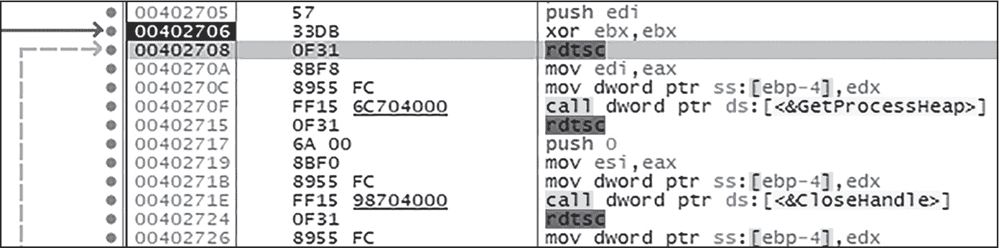
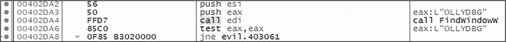
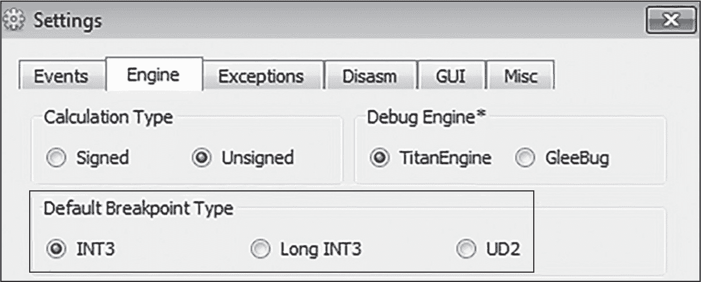
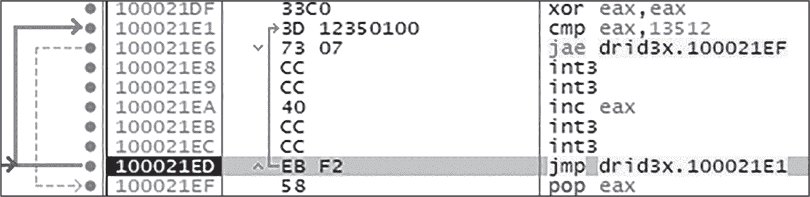
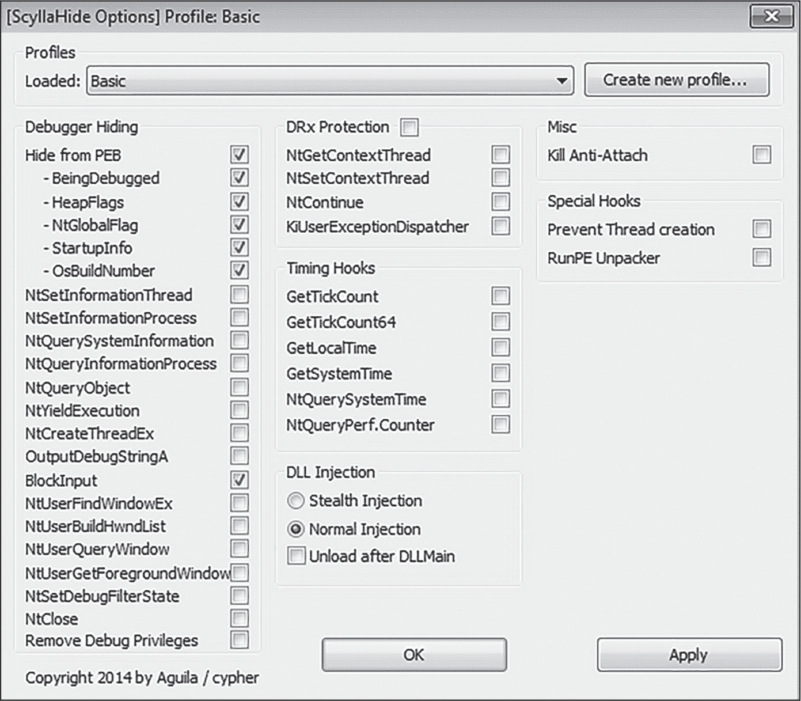
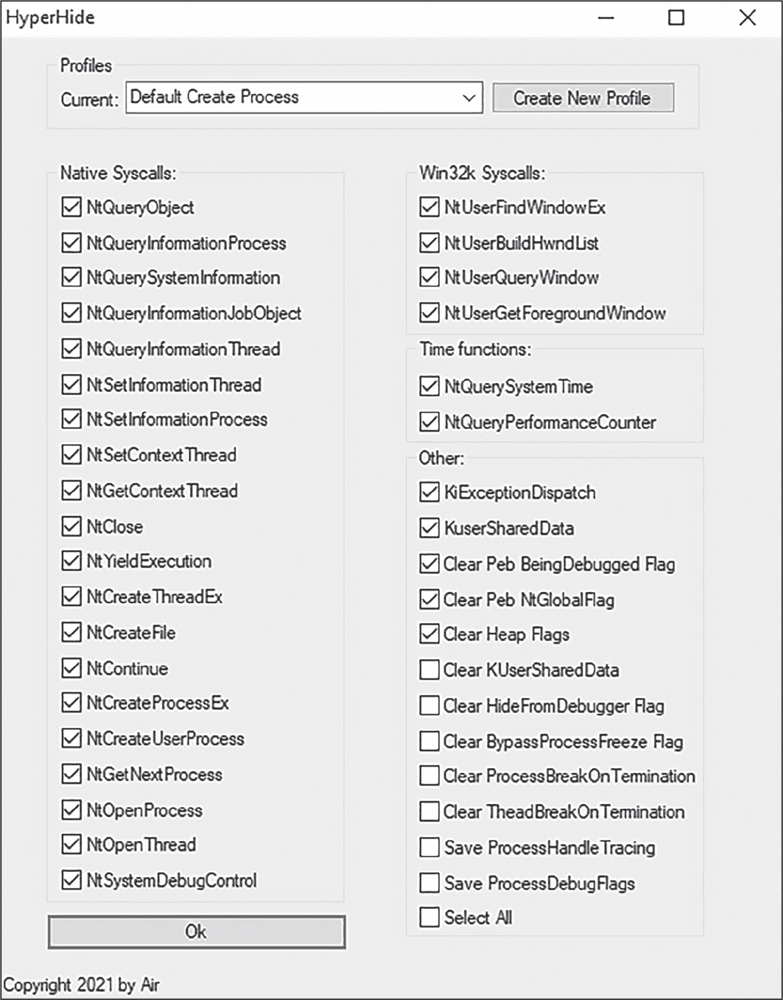

## 10 反调试


*反调试*是一系列由恶意软件（甚至一些合法程序）使用的反逆向技术，旨在阻碍或防止调试。例如，如果恶意软件检测到调试器正在附加，它可能会尝试干扰调试器进程，或者通过使用所谓的反附加机制或使调试程序崩溃，试图完全阻止调试。在本章中，我们将详细探讨其中一些技术。

### 使用 Windows API 函数访问 PEB

如你在第一章中所学到的，进程环境块（PEB）是一个结构，包含指向当前运行进程的内存信息的指针。PEB 包括与反调试相关的几个指针，如表 10-1 所列。

表 10-1: 与反调试相关的 PEB 成员

| PEB 偏移量 | PEB 成员 | 描述 |
| --- | --- | --- |
| 0x002 | BeingDebugged | 指示程序当前是否正在被调试 |
| 0x018 | ProcessHeap | 包含指向堆的 Flags 和 ForceFlags 成员的指针 |
| 0x068 | NtGlobalFlag | 包含与内存堆创建相关的信息 |

Windows 通过其 API 向程序公开了大量有关其内部工作原理的数据。有些 Windows API 函数的唯一目的是告诉调用程序是否附加了调试器，而恶意软件可以轻松利用这一点，通过查询 PEB 来确定是否正在进行调试。不仅如此，恶意软件还可以滥用一些 API 函数，欺骗 Windows 暴露附加的调试器。在本节中，我们将探讨恶意软件如何利用 Windows API 和 NT API 来试图识别调试其代码的恶意分析师。稍后章节中，你还将看到恶意软件如何直接查询 PEB，这也是为什么至少需要了解 PEB 相关成员的基本概念。

#### IsDebuggerPresent 和 CheckRemoteDebuggerPresent

最著名且最简单的 Windows 调试器检测函数之一是IsDebuggerPresent。如果当前进程正在被调试，这个函数将返回非零值；否则，它将返回0。CheckRemoteDebuggerPresent函数返回相同的信息，但返回值为True或False。以下示例展示了恶意软件如何使用它：

```
`--snip--`
push [ebp+hProcess]
push [ebp+DebuggerPresent]
call CheckRemoteDebuggerPresent
`--snip--`
```

这里有两个参数被压入栈中：一个是目标进程的句柄（在此案例中，是恶意软件自身的进程，hProcess），另一个是指向一个变量的指针，该变量将接收返回的信息（DebuggerPresent）。一旦恶意软件调用CheckRemoteDebuggerPresent，返回值（True或False）将被存储在<ssamp class="SANS_TheSansMonoCd_W5Regular_11">DebuggerPresent变量中。如你将在本章后续部分看到的，这些是最容易被规避的调试器检测技术之一。

#### NtQueryInformationProcess

要检测调试器，CheckRemoteDebuggerPresent 会调用系统函数 NtQueryInformationProcess，这是一个低级的 Windows NT 函数，可以返回关于系统的很多不同信息。NtQueryInformationProcess 也可以直接调用。它需要多个参数，包括 ProcessHandle（目标进程的句柄）和 ProcessInformationClass 值（应该返回的信息类型）。在调试器检测的情况下，ProcessInformationClass 的值应该是 7，或者是 ProcessDebugPort。如果返回非零值，表示进程当前在调试器下运行。

另外，恶意软件作者可以指定 ProcessInformationClass ProcessDebugFlags（1F）。如果进程正在被调试，调试标志会被设置，从而向恶意软件发出信号。最后，ProcessDebugObjectHandle（1E）信息类也可以揭示调试器的存在。

#### NtQuerySystemInformation

NtQuerySystemInformation 是一个 Windows NT 函数，用于查询系统信息。这个函数可以返回多种不同类型的信息，而对于我们来说，尤其关键的结构是 SYSTEM_KERNEL_DEBUGGER_INFORMATION。这个结构包含了两个重要的值，用于调试器检测：KdDebuggerEnabled 和 KdDebuggerNotPresent，这两者都可以用来检测内核调试器是否附加到调用进程上。*内核调试器* 是用于调试低级软件的专用工具，有时也用于恶意软件分析。如果 KdDebuggerEnabled 返回非零值，或者 KdDebuggerNotPresent 返回 0，可能意味着恶意软件检测到一个内核调试器存在。

#### OutputDebugString

OutputDebugString函数仅仅是在调试器中显示一个字符串。如果进程附加了调试器，该字符串将会显示；如果没有，OutputDebugString将返回错误。恶意软件可以通过手动使用SetLastError设置一个错误代码（这个错误可以是任何任意值），然后调用OutputDebugString并传递一个随机字符串值，再调用GetLastError检查错误状态是否发生变化，示例如下的伪代码：

```
SetLastError("5");
OutputDebugString("testing123");

error = GetLastError();

if (error == "5"):
  // Debugger detected.
  // Execute evasion code, such as TerminateProcess.
else:
  // Did not detect debugger; continue execution.
```

这个恶意软件样本使用SetLastError设置一个错误代码为5，然后调用OutputDebugString并传入随机字符串值testing123。接着，恶意软件调用GetLastError获取最后的错误代码，并将其与之前SetLastError调用的错误代码进行比较。如果调用OutputDebugString成功且没有错误，则GetLastError的代码仍应为5，这意味着调试器存在。这是一个老技巧，但恶意软件偶尔仍会尝试使用它。

#### CloseHandle 和 NtClose

如果正在调试一个恶意软件样本，并且恶意软件试图使用无效句柄调用CloseHandle或NtClose函数，它将引发一个EXCEPTION_INVALID_HANDLE异常。一旦这个异常被触发，它将被传递到调试器的异常处理程序，提示恶意软件它正在被调试。以下简单代码演示了这一过程：

```
mov ebx, [invalid_handle]
call NtClose
```

上述代码调用NtClose并传递一个无效的句柄作为参数。一旦执行，这将引发一个异常，并提示恶意软件它正在被调试。

#### NtQueryObject

为了使调试器正常工作，它必须创建一个名为*调试对象*的特殊内核对象。恶意软件可以调用NtQueryObject获取所有调试对象的列表，调试对象的存在意味着恶意软件当前正在被调试，或者主机曾经使用过调试器。

该函数的第一个参数，Handle，是查询信息的对象的句柄。第二个参数，NtQueryObject，接受一个<sup class="SANS_TheSansMonoCd_W5Regular_11">ObjectInformationClass值，该值告诉函数需要返回何种类型的数据。第三个参数，ObjectInformation，接受一个指针，指向存储返回数据的位置。

如果你发现恶意软件调用了NtQueryObject，并提供了一个<sup class="SANS_TheSansMonoCd_W5Regular_11">ObjectInformationClass值为<sup class="SANS_TheSansMonoCd_W5Regular_11">3（<sup class="SANS_TheSansMonoCd_W5Regular_11">ObjectAllTypesInformation），然后检查<sup class="SANS_TheSansMonoCd_W5Regular_11">ObjectInformation缓冲区中的字符串，如DebugObject，你可以相对确定恶意软件正在尝试识别调试器。

#### 堆标志

PEB 包含指向进程内存堆结构的指针，称为*进程堆*，位于位置 0x18（64 位进程为 0x30）。进程堆包含多个成员，这些成员是指向附加数据的指针；其中两个成员是<sup class="SANS_TheSansMonoCd_W5Regular_11">Flags和<sup class="SANS_TheSansMonoCd_W5Regular_11">ForceFlags，它们指向一个数据块，提供有关进程堆内存的信息给 Windows 内核。在 Windows 7 及以上版本中，如果进程正在调试，Flags成员的值将为<sup class="SANS_TheSansMonoCd_W5Regular_11">0x40000062，<sup class="SANS_TheSansMonoCd_W5Regular_11">ForceFlags成员的值将为<sup class="SANS_TheSansMonoCd_W5Regular_11">0x40000060。为了检测调试器，恶意软件可能会通过调用函数RtlQueryProcessHeapInformation或RtlQueryProcessDebugInformation尝试读取堆结构中的这些值，或者它可能会手动读取 PEB，如下一节中所讨论的。

这不是一种常见的反调试技术，所以我在这里不再详细介绍，但了解它的存在是很重要的。如果你发现恶意软件调用了其中一个或两个函数，检查后续的代码。如果恶意软件正在查询<sup class="SANS_TheSansMonoCd_W5Regular_11">Flags或<sup class="SANS_TheSansMonoCd_W5Regular_11">ForceFlags成员，那么很有可能它正在尝试检测你的调试器。

### 直接访问 PEB

恶意软件可能直接访问和读取 PEB，而不是依赖于前一节中描述的 Windows 函数，如以下汇编代码所示：

```
`--snip--`
mov eax, [fs:0x30]
cmp [eax+0x2], 1
jnz DebuggerDetected
`--snip--`
```

在这里，为了获取 PEB 的地址以读取它，恶意软件将 fs:0x30 的地址移动到 eax 中。（如你在第一章中所回忆，fs:0x30 是 PEB 起始位置的地址。）接下来，恶意软件将 1 与 eax+0x2 的值进行比较，后者是 PEB 结构中的 BeingDebugged 字段。如果该值为 1，则很可能有调试器附加到该进程，恶意软件可能会相应地做出反应。

另一个手动读取 PEB 的例子涉及到 NtGlobalFlag，它位于 PEB 中字节 0x68 处，包含与内存堆创建相关的信息。当进程在调试器下启动时，NtGlobalFlag 的值将为 0x70，因此恶意软件可以读取其 PEB 中的该值进行快速的调试器检查。

请记住，恶意软件可以通过这种方式查询 PEB 结构的任何成员。直接访问 PEB，而不是调用常见的 Windows 函数来实现这一点，可能是恶意软件在不引起警报的情况下检测调试器的有效方法。

### 时序检查

第七章描述了时序检查，特别是在检测沙箱和虚拟机环境中的应用，但这些检查也可以用来检测调试器。检测调试器的三种常见时序方法是 GetTickCount、rdtsc 指令和系统时间检查。

正如你可能还记得的 第五章 中所提到的，GetTickCount 返回自系统启动以来经过的毫秒数。恶意软件可以在其代码的不同位置调用 GetTickCount 来查看自上次调用此函数以来经过了多少时间。当恶意软件正在被调试时，程序自然会变得更慢，尤其是当恶意软件分析师在整个调试过程中设置了断点。如果分析师恰好在某个函数上设置了断点，或者在逐步执行代码时，GetTickCount 的第一次调用和最后一次调用之间的时间差将远大于平常。恶意软件可以利用这一点来检测是否存在调试器。

恶意软件也可以以类似的方式使用 rdtsc 指令。通过在其代码中各个位置插入 rdtsc 指令，恶意软件可以通过 CPU 定时来判断自己是否正在被调试（参见 图 10-1 中的 x64dbg 截图）。



图 10-1：恶意软件使用 rdtsc 作为反调试技术

最后，恶意软件可以通过调用诸如 GetLocalTime、GetSystemTime 和 NtQuerySystemTime 等函数，在其代码中的各个位置查询系统时间，以检测是否正在使用调试器。

还有许多其他使用时间检查来捕捉调试器的方法，这里列出的只是其中一些最常见的方法。这里的重点是，如果你发现恶意软件偶尔调用时间函数或在代码中使用诸如 rdtsc 这样的指令，它可能正在使用反调试技术。解决这个问题的最好方法是干脆避免使用调试器。然而，这并不总是可行的。你可能需要找出这些函数和指令在恶意软件中的执行位置，并将其修补，或者修改它们的返回值，欺骗恶意软件让其相信自己没有被调试。

### 系统人工制品

恶意软件可能通过系统的人工制品（如桌面窗口、注册表键和值、已加载的模块等）来检测调试器。在本节中，我们将简要介绍这些内容，但你可能会觉得参考 第二部分 更有帮助，第二部分详细讨论了恶意软件如何搜索这些类型的人工制品。

#### 寻找调试器窗口

第五章讨论了恶意软件如何利用诸如FindWindow等函数检测分析工具，该函数用于定位桌面窗口，以及EnumWindows，它用于枚举打开的桌面窗口。恶意软件还可以使用这些函数专门查找调试器窗口。例如，它可能会调用FindWindow来枚举带有调试器产品名称的打开窗口，例如 x64dbg、OllyDbg 或 Immunity 调试器。图 10-2 展示了勒索软件变种 Satan 在寻找任何打开的 OllyDbg 窗口。



图 10-2：恶意软件 Satan 寻找与 OllyDbg 相关的窗口

#### 枚举加载的模块

当你将恶意软件附加到调试器时，调试器可能会将模块加载到恶意软件的地址空间中；例如，WinDbg 调试器可能会加载*dbghelp.dll*库。恶意软件可以通过调用GetModuleHandle函数，并传递模块名称（如*dbghelp.dll*）作为参数，来定位可疑模块。或者，它可以通过使用Module32First和Module32Next枚举所有加载的模块，然后搜索特定的模块名称。

#### 搜索调试器进程

恶意软件还可以枚举主机上运行的进程，查找调试器进程。为此，它可能会调用CreateToolhelp32Snapshot、Process32First和Process32Next，然后专门查找常见的调试器进程名称，如*ollydbg.exe*、*x64dbg.exe*或*ida64.exe*。

#### 检查父进程

为了检测调试器，恶意软件可以检查其父进程是什么。如果恶意软件运行在调试器内部，它的父进程将是调试器进程。如果恶意软件检测到它作为调试器进程的子进程运行（例如*x64dbg.exe*），那么它就能识别出自己正在被调试。

恶意软件可以通过几种方式检测其父进程。一种方法是获取自身的进程 ID (GetCurrentProcessId)，获取所有运行中的进程快照 (CreateToolhelp32Snapshot)，并使用 Process32First 和 Proces32Next 搜索其自身的进程名。一旦找到其进程，进程快照结构中将包含一个条目 (th32ParentProcessID)，表示其父进程的 ID。

类似地，恶意软件可以使用 CreateProcess 创建一个子进程，使得恶意软件的原始进程成为这个新子进程的父进程。然后，子进程可以调用 DebugActiveProcess，并将其父进程作为参数。如果父进程（即原始的恶意软件进程）已经在调试中，那么这个函数将抛出一个异常，如 STATUS_PORT_ALREADY_SET，这让恶意软件意识到它正被调试器监控。

### 断点检测与陷阱

在调试器中调查恶意软件时，恶意软件分析师通常会在特定的指令、函数调用或特定的内存段上创建断点。正如你可能记得的那样，来自第三章，在恶意软件代码中创建软件断点会修改正在运行的恶意软件样本。这意味着恶意软件可以通过一些有趣的方式检测这些断点。本节将讨论恶意软件可能采用的一些断点检测、规避和利用方法。

#### 通过断点检测调试器

当调试器在程序中的某个断点指令（如 int 3，这是最常见的断点之一）处停下时，它会在程序代码的这一点上中断。这是因为断点指令会导致程序发生中断异常，最终将控制权转交给调试器。然而，当程序没有被调试时，断点指令会引发 EXCEPTION_BREAKPOINT，控制流则会传递给程序的默认异常处理程序。

这是恶意软件测试其是否正在被调试的一种有效方法。如果恶意软件执行指令int 3，且未被调试，则会触发一个EXCEPTION_BREAKPOINT并调用异常处理程序。当然，反之亦然。如果这个EXCEPTION_BREAKPOINT没有触发异常处理程序，恶意软件可以推断它正在被调试。请看下面的简化伪代码：

```
`--snip--`
IsBeingDebugged() {
  try {
   ❶ asm ("int 3");
     return true;
  }
 ❷ catch (EXCEPTION_EXECUTE_HANDLER) {
     return false;
  }
}
`--snip--`
```

这段伪代码使用了一个简单的try... catch语句。恶意软件尝试执行int 3指令❶，如果这个语句成功返回且未调用异常处理程序，则恶意软件认为它正在调试器中运行。然而，如果这个指令触发了异常❷，恶意软件就可以安全地假设它没有附加到调试器上。

#### 检测和规避软件断点

恶意软件还可以通过实现断点扫描技术来直接检测断点的使用。在下面的汇编代码示例中，恶意软件扫描其代码中是否包含断点指令int 3（十六进制为0xCC）：

```
`--snip--`
mov ebx, <kernel32.WriteProcessMemory>
cmp byte ptr ds:[ebx], 0xCC
`--snip--`
```

这个恶意软件样本试图确定恶意软件分析师是否在WriteProcessMemory函数上设置了软件断点。首先，恶意软件将WriteProcessMemory的地址移动到ebx寄存器中。然后，它将0xCC（即int 3调试器断点指令）与ebx中的第一个字节进行比较，这个字节是WriteProcessMemory函数的起始位置，也是断点将放置的地方。一旦恶意软件识别出软件断点，它可能会尝试覆盖或清除该断点。

你可以通过使用不常见的断点指令来克服某些断点检测技术。许多调试器都有这个选项。在 x64dbg 中，只需导航到**Options****Settings****Engine**，然后在“Default Breakpoint Type”下设置你喜欢的断点指令，如图 10-3 所示。



图 10-3：在 x64dbg 中设置默认断点类型

一些变种的恶意软件也会寻找这些替代的断点指令，因此更好的选择是使用硬件断点来规避软件断点检测技术。然而，硬件断点同样可以被恶意软件规避，接下来的部分将对此进行讨论。

#### 检测和规避硬件及内存断点

与软件断点类似，硬件断点可被分析人员用来拦截函数调用、在感兴趣的行为上中断，以及一般性地控制恶意软件的执行。由于硬件断点是通过 CPU 寄存器（DR0–DR3）实现的，而不是通过指令，因此恶意软件可以扫描这些寄存器以寻找断点。如果这些寄存器中的任何一个包含数据（特别是内存地址），恶意软件可能会认为已设置硬件断点，并采取规避措施，例如清除这些寄存器，从而有效地移除断点。查找硬件断点的一种方法是使用 GetThreadContext 函数（对于 64 位程序，使用 Wow64GetThreadContext），如下所示：

```
CONTEXT context;
context.ContextFlags = CONTEXT_DEBUG_REGISTERS;
HANDLE hThread = GetCurrentThread();
GetThreadContext(hThread, &context);

if ((context.Dr0) || (context.Dr1) || (context.Dr2) || (context.Dr3)) {
   return true;
}
```

在这个示例伪代码中（改编自 [*https://<wbr>www<wbr>.codeproject<wbr>.com<wbr>/Articles<wbr>/30815<wbr>/An<wbr>-Anti<wbr>-Reverse<wbr>-Engineering<wbr>-Guide*](https://www.codeproject.com/Articles/30815/An-Anti-Reverse-Engineering-Guide)），恶意软件定义了一个新的 CONTEXT 结构体（context），这是一个 Windows 结构，用于存储进程的 CPU 状态和相关数据。这个结构体必须到位，以便存储恶意软件稍后检查的调试寄存器（DR0–DR3）数据。接下来，恶意软件指定 CONTEXT_DEBUG_REGISTERS 应该是 GetThreadContext 返回的数据。然后，恶意软件获取其当前线程的句柄（HANDLE），并调用 GetThreadContext，该函数会将当前线程的 CONTEXT_DEBUG_REGISTERS 存储到 context 结构中。最后，恶意软件样本检查调试寄存器中的数据。如果这些寄存器非零，则该检查返回 true，通知恶意软件调试器已设置硬件断点。

恶意软件可以使用<sup class="SANS_TheSansMonoCd_W5Regular_11">SetThreadContext</sup>（或者对于 64 位恶意软件使用<sup class="SANS_TheSansMonoCd_W5Regular_11">Wow64SetThreadContext</sup>）完全移除它检测到的任何硬件断点。将此行添加到前面的代码示例中，将有效清除调试寄存器，进而移除恶意软件分析师的硬件断点：

```
context.Dr0 = null;
context.Dr1 = null;
context.Dr2 = null;
context.Dr3 = null;

SetThreadContext(hThread, &context);
```

最后，恶意软件可以使用<sup class="SANS_TheSansMonoCd_W5Regular_11">ReadProcessMemory</sup>函数来检测内存断点。设置内存断点会改变内存页，因此，如果恶意软件在可疑内存页上调用<sup class="SANS_TheSansMonoCd_W5Regular_11">ReadProcessMemory</sup>，并且返回一个意外的值，比如<sup class="SANS_TheSansMonoCd_W5Regular_11">PAGE_NOACCESS</sup>或<sup class="SANS_TheSansMonoCd_W5Regular_11">PAGE_GUARD</sup>，它可能会推测此内存页上已经设置了硬件断点。另一种实现相同效果的方法是恶意软件执行<sup class="SANS_TheSansMonoCd_W5Regular_11">VirtualQuery</sup>、<sup class="SANS_TheSansMonoCd_W5Regular_11">VirtualQueryEx</sup>或<sup class="SANS_TheSansMonoCd_W5Regular_11">NtQueryVirtualMemory</sup>。我们将在下一节讨论内存断点。

如果你怀疑恶意软件样本使用了本节描述的任何技术，挂钩（在这些函数上设置断点）是很有帮助的。一旦命中断点，你可以简单地修改返回值，或者完全跳过对该函数的调用。调试器插件 ScyllaHide，如第 181 页所述，也可以在这里提供帮助。

#### <sup class="SANS_Futura_Std_Bold_Condensed_Oblique_I_11">使用内存页保护来检测断点</sup>

*内存页保护*是 Windows 中实现的用于内存访问的特殊标志。在分配新的内存页时，程序可以添加<sup class="SANS_TheSansMonoCd_W5Regular_11">PAGE_GUARD</sup>标志，作为一种内存访问的警报系统。当该内存区域被程序（或其他程序）访问时，它会触发<sup class="SANS_TheSansMonoCd_W5Regular_11">STATUS_GUARD_PAGE_VIOLATION</sup>异常。如果程序在调试器下运行，<sup class="SANS_TheSansMonoCd_W5Regular_11">PAGE_GUARD</sup>的行为通常会有所不同（因为调试器正在处理异常），并且不会触发正常的异常。

恶意软件可以通过在某些内存页上实现页面保护来利用这一点。如果这些页面从调试器外部访问（意味着恶意软件没有被调试），恶意软件将正常引发异常。如果没有引发异常，根据使用的调试器及其配置，这可能会警告恶意软件它正被调试。为了在内存中设置页面保护，恶意软件可以调用VirtualProtect并将PAGE_GUARD（0x100）值设置。以下代码展示了恶意软件调用VirtualAlloc并设置此参数的示例：

```
`--snip--`
push 104h ; 0x100 (PAGE_GUARD) + 0x4 (READ/WRITE)
push edi
push esi
call VirtualAlloc
`--snip--`
```

这段代码调用了VirtualAlloc，并将flNewProtect值设置为0x104，这是0x100（PAGE_GUARD）和0x4（READ/WRITE）保护的组合。内存分配和VirtualAlloc的详细内容请参考第四部分，特别是第十七章。

#### 使用断点陷阱

恶意软件可以在其代码中插入像int 3和int 2d这样的断点指令，迫使调试器频繁中断，从而给恶意软件分析师调试带来麻烦。一个不断中断的调试器会让调试变得非常头疼。故意在恶意软件中放置的断点指令有时被称为*陷阱*。

图 10-4 显示了在 x64dbg 中使用int 3陷阱技术的 Dridex 恶意软件样本。



图 10-4：使用断点反调试陷阱的 Dridex 恶意软件样本

此处显示的 Dridex 代码执行了两个int 3指令，递增eax，执行另外两个int 3指令，然后继续循环。这个函数会重复 13,512 次（cmp eax, 13512），这可能会给恶意软件分析师调试样本时带来很大的困扰。

要绕过这种陷阱技术在恶意软件中通常很困难。最佳方法是识别出有问题的指令并将其修补掉。就像这个 Dridex 示例一样，恶意软件可能会创建一个循环（使用jmp、jnz、jz等）来执行这些断点指令，在这种情况下，你需要修补或修改循环指令，以绕过这种行为。

### 未处理的异常

恶意软件可以设置一个顶级异常处理程序（称为*未处理异常过滤器*）来检测调试器。这将覆盖任何其他处理程序，例如默认的 SEH，首先通过调用SetUnhandledExceptionFilter，允许调用程序成为顶级异常处理程序，然后调用UnhandledExceptionFilter，强制执行异常处理程序。当恶意软件程序未被调试时，异常将被传递到新的处理程序。如果正在调试，则不会调用新的处理程序，异常将被传递给调试器，表明恶意软件正在调试器中运行。

为了应对这种技术，你可以通过断点或钩子拦截对SetUnhandledExceptionFilter和UnhandledExceptionFilter的调用，并修改函数调用或完全修补掉这些代码。第十一章将更详细地讨论异常处理。

### 校验和、代码段哈希和自愈

恶意软件可以通过对其代码进行校验和（或哈希）来判断是否设置了断点，或者分析员是否以其他方式修改了调试器中的代码。使用任何哈希算法（例如 MD5），恶意软件作者可以逐行创建代码的哈希值，或对整个代码段进行哈希（通常称为*代码段哈希*），然后将其与基线值进行比较。如果存在差异，恶意软件可能会认为已设置断点或代码已被修改。

恶意软件还可以实施所谓的*自愈*技术，存储其代码的干净副本，并在检测到代码篡改时恢复原始版本。以下伪代码展示了这一过程在实践中的表现：

```
// Calculate the checksum of the clean code.
clean_code_checksum = calculate_checksum(clean_code)

// At runtime, recalculate the checksum and compare it to the stored value.
malware_code = read_malware_code()
malware_code_checksum = calculate_checksum(malware_code)

// If checksums do not match, terminate the malware.
if malware_code_checksum != clean_code_checksum:
  terminate_malware()
else:
  // The code has not been tampered with! Continue running.
```

分析员很难绕过这种技术。最有效的方法是识别恶意软件在哪个位置获取某段代码的校验和，然后将这一功能从代码中修补掉。如果恶意软件使用这种方法来查找软件断点，还可以使用硬件断点。

### 利用、崩溃和干扰调试器

有时候，最有效的反调试方法就是通过直接干扰调试器，使其崩溃或表现出不可预测的行为。就像任何软件一样，调试器的代码中可能会有漏洞，允许恶意软件干扰分析、使调试器崩溃，甚至可能导致操作系统本身崩溃。一个流行的例子是 OllyDbg 1.1 版本中的一个漏洞，恶意软件可以调用 OutputDebugString 函数，并将 %s 作为参数传递；OllyDbg 无法处理该值，导致正在运行的恶意软件样本崩溃，从而阻止进一步调试。

也许稍微不那么激进的方法是 BlockInput 函数，恶意软件可以滥用它来干扰分析工具。BlockInput 只有一个参数：fBlockIt。如果该参数设置为 1，则所有应用程序的鼠标和键盘事件都会被阻止，这会严重干扰调试过程。如果恶意软件检测到自己正在被手动检查或在调试器下运行，它可能会调用 BlockInput 作为自我防御机制。幸运的是，您可以通过使用 CTRL-ALT-DELETE 来轻松绕过此技术，这将使 BlockInput 例程失效。您也可以在调试器中修改函数调用，将 fBlockIt 参数设置为 0 而不是 1。

最后，恶意软件可以使用 NtSetInformationThread 来隐藏代码执行，避免被调试器检测，或者直接使调试器崩溃。通过将 ThreadInformationClass 值 ThreadHideFromDebugger（以十六进制表示为 0x11）传递给 NtSetInformationThread 函数，恶意软件可以隐蔽地执行代码，从而导致恶意软件分析员无法控制正在运行的样本。此外，如果恶意软件在隐蔽执行的代码中执行一个断点指令（例如 int 3），恶意软件进程将在调试器中无限期挂起。我将在第十一章中讨论这一技术。

这些只是已知的调试器利用技术中的一些例子，肯定还有许多未知的技术。恶意软件分析师应当对这些技术保持警惕，并预期在分析先进的规避恶意软件时会出现新的技术。记住，始终在安全的测试环境中进行分析和调试。

### 调试阻止与反附加技术

恶意软件可能不会检测调试器或主动干扰它，而是简单地尝试完全阻止其功能。这一系列技术通常被称为 *调试阻止* 或 *反附加*。

要附加到正在运行的恶意软件样本，通常调试器会调用 Windows 函数 DebugActiveProcess。如果该进程已经在调试中，该函数将失败。恶意软件可以利用这一点，简单地充当其自己的调试器。它可以生成一个子进程并将父进程设置为调试器。当尝试将调试器附加到该子进程时，恶意软件分析师将遇到令人沮丧的 STATUS_PORT_ALREADY_SET 异常，这意味着该进程已经在调试中。

为了克服这种技术，您可以将调试器附加到父进程，并在 WaitForDebugEvent 上设置断点。当断点被触发时，您可以通过调用 DebugActiveProcessStop 函数强制进程（充当调试器的进程）从其子进程中分离。

> 注意

*有关此技术的更多信息，请查阅 Mark Vincent Yason 的研究论文《The Art of Unpacking》。尽管该论文已久，但依然非常相关。请阅读它：* [`<wbr>www<wbr>.blackhat<wbr>.com<wbr>/presentations<wbr>/bh<wbr>-usa<wbr>-07<wbr>/Yason<wbr>/Whitepaper<wbr>/bh<wbr>-usa<wbr>-07<wbr>-yason<wbr>-WP<wbr>.pdf`](https://www.blackhat.com/presentations/bh-usa-07/Yason/Whitepaper/bh-usa-07-yason-WP.pdf)。

恶意软件还可以修改常见的调试器功能以防止调试；恶意软件家族 GuLoader 就是这么做的。当附加到一个进程时，调试器会调用函数DbgBreakPoint和DbgUiRemoteBreakin，这些函数基本上允许调试器在被调试的程序中使用断点。GuLoader 通过删除int 3操作码，并用nop指令替换它，从而修改了DbgBreakPoint，有效地损害了该功能。同样，GuLoader 通过一个无效的调用指令修改了DbgUiRemoteBreakin函数，最终会导致一个异常，可能导致正在调试的恶意软件崩溃。*CrowdStrike*写了一篇关于 GuLoader 的精彩文章；有关这些技术的更多信息，请阅读这篇论文 [*https://<wbr>www<wbr>.crowdstrike<wbr>.com<wbr>/blog<wbr>/guloader<wbr>-malware<wbr>-analysis<wbr>/*](https://www.crowdstrike.com/blog/guloader-malware-analysis/)。

### 其他反调试技术

恶意软件可以使用许多方法来发现或干扰正在使用的调试器。当然，研究人员和恶意软件作者不断发现新的、富有创意的方式来检测并规避调试器。我尽力在本章中覆盖了尽可能多的常用或特别有趣的技术。

有些方法我选择不在这里描述，因为它们不常见或难以实现。例如，一些恶意软件家族（例如 rootkit）可以直接检查其EPROCESS块，以查找附加调试器的迹象，但这种情况非常罕见。其他技术可能会产生错误。例如，恶意软件可以通过尝试调用OpenProcess来检查其调试权限，目标是系统进程，如*csrss.exe*。如果恶意软件能够获取该进程的句柄，它可能会推测自己正在被调试，但这并不总是准确的。另一个例子是使用*trap flag*，这是在EFLAGS和RFLAGS寄存器中存在的一个特殊标志，可能会暴露调试器的存在。这两种方法都可能产生误报，且实现起来更困难，因此不太常用。

在本章的结尾，我们将看看如何应对逆向工程过程中遇到的反调试技术。

### 反调试技术的对抗

为了有效地绕过反调试技术，首先你需要清楚了解你面临的具体情况。你可以通过逐步执行恶意软件的代码并手动查找技术来识别恶意软件使用的技术，但这当然不是很高效。通常，你需要结合使用反汇编器和调试器，以更好地理解遇到的任何反调试方法。

在深入研究任何恶意软件之前，我总是先在 PE 静态分析和分类工具中检查样本，例如 PEStudio 或 PE-bear。这些工具允许我检查文件中的导入和字符串，可能有助于识别与反调试相关的库和函数调用。我还使用像 CAPA 这样的工具，我在第三章中描述过。

一旦我识别出可执行文件中的反调试技术，我会借助反汇编工具检查周围的代码，并决定如何应对和绕过这些技术。这通常涉及在调试器中设置可疑代码和函数调用的断点，并动态修改代码。

有一些很棒的工具可以帮助自动化绕过反调试技术的过程。*ScyllaHide*（[*https://<wbr>github<wbr>.com<wbr>/x64dbg<wbr>/ScyllaHide*](https://github.com/x64dbg/ScyllaHide)），一个用于 x64dbg 和其他调试器的插件，可能是最流行的工具。它可以通过动态修改恶意软件的代码并挂钩可疑函数，隐藏调试器，从而绕过许多调试器检测和反调试技术（如图 10-5 所示）。



图 10-5：x64dbg 中的 ScyllaHide 菜单

要在 ScyllaHide 中启用*反反调试*功能，只需勾选该功能旁边的框，然后选择**应用**和**确定**。将鼠标悬停在每个选项上会弹出更多信息。我通常启用整个左侧列的选项，这通常不会引发问题。话虽如此，虽然大多数选项可以安全启用，但其中一些可能会破坏恶意软件样本，导致它崩溃或表现出意外行为。因此，请小心使用。

*HyperHide*（[*https://<wbr>github<wbr>.com<wbr>/Air14<wbr>/HyperHide*](https://github.com/Air14/HyperHide)）提供了与 ScyllaHide 类似的许多功能，但通常来说，拥有多种工具总是个好主意。图 10-6 展示了 HyperHide 的反反调试功能。



图 10-6：x64dbg 中的 HyperHide 菜单

这两种工具具有非常相似的反反调试选项，但在某些情况下，一种工具可能比另一种效果更好。试试这两种工具，看看你更喜欢哪一种。

### 总结

本章讨论了恶意软件可能用来检测和绕过调试工具的许多常见反调试方法。许多这些技术在各种恶意软件中广泛使用，从普通的信息窃取软件到高级定制和针对性的威胁，因此理解这里描述的概念非常重要。在下一章中，您将学习恶意软件如何秘密执行代码以规避动态分析工具，如调试器，并使用误导技术来干扰分析过程。
