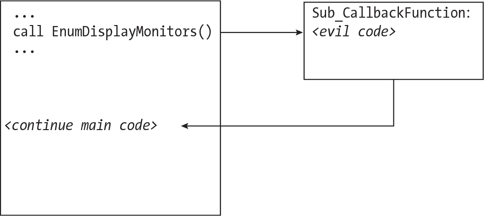
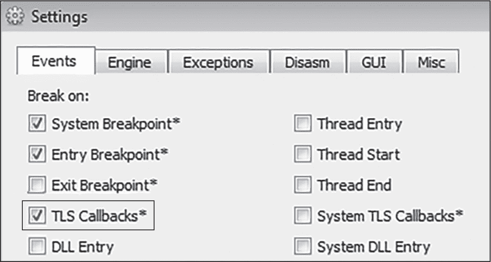
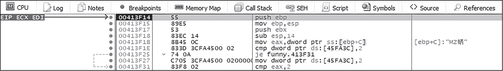
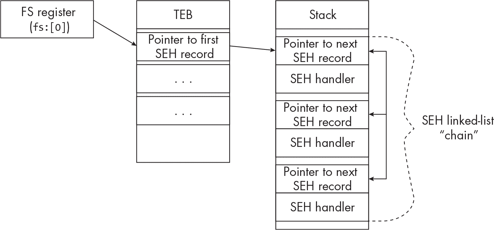
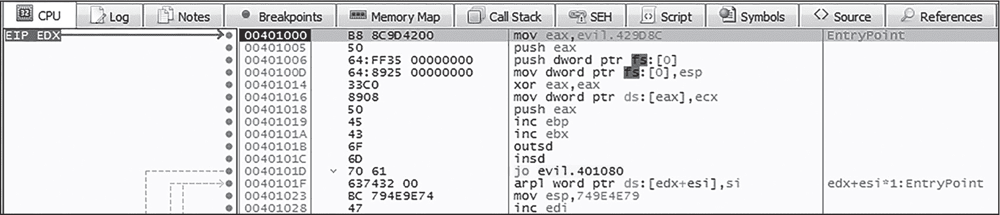
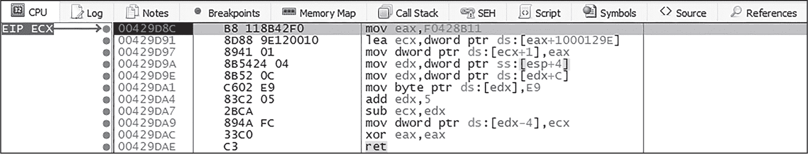
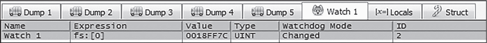

## 第十二章：11 隐蔽代码执行与误导


在继续第三部分关于恶意软件使用的反向工程技术的讨论时，本章将探讨*隐蔽代码执行*，即恶意软件以隐秘的方式执行代码，令分析员难以追踪其逻辑和代码，有时甚至完全避开调试。这还可以起到误导分析员的作用，造成混乱并减缓逆向工程的过程。让我们探讨一些你可能遇到的具体隐蔽代码执行和误导技巧。

### 回调函数

*回调函数*是由特定事件触发的应用程序定义函数，并作为其他函数的输入。例如，Windows API 函数EnumDisplayMonitors使用回调函数来枚举主机上配置的显示器。当调用EnumDisplayMonitors时，显示器会逐一列举，并将每个显示器的信息（如屏幕大小）传递给回调函数。程序定义了这个回调函数，并可以将其指向任何它希望执行的代码。

恶意软件可以通过创建自定义回调函数并将其指向恶意代码，滥用如EnumDisplayMonitors这样的函数，正如图 11-1 所示。然后，这段代码将由调用函数（EnumDisplayMonitors）执行，这样可以达到混淆控制流的目的（作为一种反反汇编和防止反向工程的技术），甚至可能导致恶意软件分析员在调试器中失去对恶意软件的控制。此方法还可能使一些自动化沙盒产生困惑。



图 11-1：一个使用 EnumDisplayMonitors 的回调函数示例

本图中的恶意软件调用EnumDisplayMonitors并定义了包含恶意代码的回调函数。当调用EnumDisplayMonitors时，控制流会转移到恶意回调函数。对于不了解回调工作原理的恶意软件分析员来说，在调试器或静态代码分析中看到这种行为可能会非常混乱，因为代码中可能看不到跳转到这个回调函数的明显痕迹。

理论上，这种技术可以与几乎任何使用回调的 Windows API 函数一起使用（而且有很多这样的函数），但我发现恶意软件可能滥用的许多函数以 Enum 开头，例如 EnumDateFormatsEx、EnumSystemLanguageGroups 和 EnumChildWindows。

### TLS 回调

正如第一章所解释的，线程是操作系统中运行的一个系列指令。线程局部存储（TLS）允许每个程序运行的线程都有自己的变量版本，其他线程可以访问这些变量，并且每个线程的值都是独一无二的。例如，如果全局变量 var 被定义在 TLS 中，则进程中的每个线程都可以在其中存储不同的值。在这种情况下，var 就充当了一个类似全局变量名的角色，但每个线程都有唯一的值。

TLS 回调函数允许程序从 TLS 中清除数据对象。这些回调函数在实际程序代码开始之前运行，因此恶意软件作者可以通过精心制作特殊的 TLS 回调函数，在主恶意代码开始运行之前先执行它们。此技术不仅可以混淆并误导调试恶意软件代码的分析人员，还可以模糊代码的控制流程。让我们来看一个简单的例子，了解如何识别和定位 TLS 回调例程。

> 注意

*要跟随本节内容，请使用以下哈希值从 VirusTotal 或 MalShare 下载示例：*

> SHA256: e4bd2245b1f75abf37abd5a4b58e05f00886d56a5556080c4331847c7266b5b6

为了识别可能使用 TLS 回调函数的恶意软件，你可以使用多种静态可执行文件分析工具，如 PEStudio，我个人的最爱。PEStudio 有一个名为 TLS Callbacks 的标签，它列出了可执行文件中注册的任何回调及其地址。例如，我们在图 11-2 中展示的恶意软件文件包含了两个 TLS 回调。


图 11-2：在 PEStudio 中查看 TLS 回调

请记住，TLS 回调最初是为无害的目的设计的，因此其存在并不一定意味着该可执行文件是恶意的。

为了更好地理解 TLS 回调函数如何混淆并误导分析人员，以及学习如何处理使用这些回调的恶意软件，让我们在调试器中查看此示例。我使用的是 x64dbg，但任何类似的调试器都应该可以使用。

首先，如果你在恶意软件样本中发现 TLS 回调（例如使用 PEStudio），始终确保调试器配置为在 TLS 回调函数处断点。否则，调试器将继续执行，可能不会在回调函数处断点，你可能永远也不会意识到它已经执行。为了确保 x64dbg 在 TLS 回调时断点，点击**选项****首选项****事件**，并确认选中“TLS 回调”，如图 11-3 所示。



图 11-3：启用 TLS 回调断点

将恶意软件样本附加到调试器后，可以按 F9 键正常运行恶意软件样本，调试器将在 TLS 回调函数处断开，如图 11-4 所示。


图 11-4：触发 TLS 断点

调试器现在已经暂停在 TLS 回调函数的地址处，这可能是恶意软件希望秘密执行的恶意代码的入口，如图 11-5 所示。



图 11-5：TLS 回调代码

请注意，TLS 回调并不总是在静态分析工具中清晰地注册和显示。TLS 条目存储在线程环境块（TEB）中，TEB 是一个存储有关当前运行线程信息的数据结构（有关 TEB 的更多信息，请参见第一章）。恶意软件可能在运行时修改其自身的 TEB，可能会动态地操控 TLS 回调，添加或移除回调。通过这样做，恶意软件作者可以隐藏其 TLS 回调，使其更加秘密地执行并避免分析工具的检测。

### 结构化异常处理

正如其名称所示，*结构化异常处理（SEH）*是 Windows 应用程序处理异常的方式。每当 Windows 程序遇到异常时，它会调用 SEH。开发人员可以通过实现 SEH *记录*来选择在程序发生异常时执行某些代码。例如，如果程序由于缺少某个必需的文件而抛出错误，开发人员可能会指示程序显示一个弹出框，消息为：“所需文件不存在！”这个指令通常以try... catch或try... except的形式出现。程序将*尝试*执行一些代码，如果代码由于某种原因失败，则会执行*catch*（异常）。

SEH 由多个记录组成，这些记录存储在程序的堆栈上。每个记录包含两个地址：第一个是指向负责处理异常的函数的指针（即 *异常处理程序*），第二个是指向先前定义的 SEH 记录的指针，这样就创建了一个 SEH 记录链（通常在 Windows 中称为 *链表*）。

异常处理程序的地址存储在特殊的 CPU 寄存器 FS 中（对于 64 位应用程序是 GS），它指向 TEB。在 TEB 结构中，fs:[0] 包含当前的 SEH 框架，该框架指向堆栈上的第一个 SEH 记录。图 11-6 说明了这一结构。



图 11-6：一个 SEH 链表

注意 FS 寄存器指向 TEB 的地址，TEB 进一步包含指向堆栈上第一个 SEH 记录的指针。SEH 记录包含指向链中下一个 SEH 记录的地址，以及指向异常处理程序的地址（当异常被触发时执行的代码）。

当程序将一个新的 SEH 记录添加到堆栈上的 SEH 链时，它必须首先将新处理程序的地址推送到堆栈，然后将先前处理程序的地址推送到堆栈。代码如下所示：

```
`--snip--`
push HandlerAddress ; Address of new handler
push fs:[0]         ; Address of old handler
mov fs:[0], esp
`--snip--`
```

在将新旧处理程序地址推送到堆栈后，指令 mov fs:[0], esp 设置了新处理程序。一旦程序中发生新的异常，HandlerAddress 将成为异常的“第一响应者”。

正如许多无害的 Windows 功能可以被重新利用用于恶意用途一样，SEH 链也可以被滥用来混淆恶意软件的控制流，并误导调试代码的分析人员。让我们看看实际操作中的情况。

> 注意

*要跟进，请使用此哈希值从 VirusTotal 或 MalShare 下载示例：*

> SHA256: d52f0647e519edcea013530a23e9e5bf871cf3bd8acb30e5c870ccc8c7b89a09
> 
> *你还需要一个调试器，例如 x64dbg。*
> 
> *请记住，这个示例是一个勒索软件变种，因此请务必采取预防措施。你可以考虑使用 附录 A 中讨论的一些技巧。*

首先，将文件重命名为 *.exe* 扩展名（例如 *evil.exe*），并在 x64dbg 中打开它。（它是一个 32 位文件，因此你需要在 32 位版本中打开文件。）此时，执行文件将暂停。选择 **调试****运行到用户代码** 以跳到恶意软件代码的开始位置。现在你应该位于恶意软件的入口点，如 图 11-7 所示。



图 11-7：x64dbg 中的恶意软件入口点

以下代码行将由恶意软件执行；请注意，地址在你运行的样本中可能会有所不同，但代码应该类似：

```
mov  eax, evil.429D8C
push eax
push dword ptr fs:[0]
mov  dword ptr fs:[0],esp
xor  eax,eax
mov  dword ptr ds:[eax],ecx
```

首先，恶意软件将地址 evil.429D8C 移动到 eax 寄存器，并将其压入堆栈。这个地址包含将由异常处理程序执行的恶意代码。接下来，恶意软件将当前存储在 fs:[0] 中的值压入堆栈，它指向最顶层的 SEH 记录。然后，恶意软件将 esp（堆栈指针）的值移动到 fs:[0]，这实际上是添加了新处理程序的地址。

为了触发异常处理程序并隐蔽地执行其代码，恶意软件必须强制引发异常。为此，恶意软件使用 xor 清除 eax 寄存器，然后执行一条 mov 指令，尝试将 ecx 中的值移动到 eax 存储的地址。由于 eax 中的值当前为 0，因此会导致在 x64dbg 中出现 EXCEPTION_ACCESS_VIOLATION 错误（如图 11-8 所示）。


图 11-8：恶意软件强制引发的异常

控制流被转移到包含恶意代码的处理程序，如图 11-9 所示。



图 11-9：控制流转移到包含恶意代码的处理程序

然而，除非我们明确告诉调试器在这个处理程序代码处中断，否则代码将执行得太快，无法供我们检查。为了解决这个问题，我们将在调试器中使用命令 bp 00429D8C 在这个处理程序代码上设置断点。现在，如果我们继续执行样本，我们将在恶意处理程序代码处中断，如图 11-9 所示。如果你已经越过了这个点，可能需要终止样本并重新运行，确保在 00429D8C 处设置断点。

如果我们没有意识到恶意软件使用了这种 SEH 滥用技术，并且没有仔细检查代码，我们很可能会完全忽视这段代码执行。由于许多反汇编工具可能不支持 SEH，我们在进行静态代码分析时也不会看到这个跳转。

此外，恶意软件不仅仅通过直接修改 SEH 链来滥用 SEH，还可以通过使用 KiUserExceptionDispatcher 函数来滥用 SEH，该函数将异常处理程序地址作为参数。恶意软件可以将任意地址传递给该函数，将新的处理程序添加到当前的 SEH 链中。然后，通过如前所述强制触发异常，恶意软件就能偷偷执行恶意代码。

当你分析使用这里讨论的技术的恶意软件时，监控 SEH 链会有所帮助。有两种方法可以做到这一点。在 x64dbg 中，你会看到一个 SEH 标签，列出了 SEH 链。然而，根据我的经验，这个功能并不总是可靠。更好的选择是添加一个 *watch*，监视 fs:[0] 的修改。这样，当恶意软件操作寄存器或地址（如 fs:[0]）中存储的数据时，你会收到提醒。要在 x64dbg 中实现这一点，请进入 CPU 窗口下方的 **Watch** 标签，右键点击并选择 **Add**，然后输入 fs:[0]（见 图 11-10）。



图 11-10：在 x64dbg 中添加监视表达式

一旦你添加了监视，右键点击它并在菜单中选择 **Changed**。这样，每当 fs:[0] 的值发生变化时，程序将暂停，如 图 11-11 所示。


图 11-11：触发监视表达式

### VEH 和 64 位 SEH

Windows 中的另一个重要异常处理机制是 *向量化异常处理 (VEH)*，这是对 SEH 的扩展，用于 Windows x86 应用程序。VEH 有时与 SEH 一起用于 32 位 Windows 应用程序，但优先于 SEH；也就是说，如果在应用程序中触发异常，VEH 会尝试先处理异常，然后再由 SEH 处理。

和 SEH 一样，VEH 也可能被恶意软件滥用。例如，恶意软件可以调用 Windows API 函数 AddVectoredExceptionHandler 或 RtlAddVectoredExceptionHandler，这两个函数都会注册一个新的 VEH 记录。这些函数接受一个名为 PVECTORED_EXCEPTION_HANDLER 的参数，该参数代表当异常发生时将被调用的函数。恶意软件可以故意触发异常，这时 VEH 会被触发，恶意代码将被执行。如果你碰巧发现恶意软件调用了这些函数，值得深入检查一下，看它是否在滥用 VEH 来隐秘地执行代码。

在 x64 应用程序中，SEH（有时称为 *x64 SEH*）作为一个表格实现，并存储在可执行文件的 PE 头中。该表格包含程序所有异常处理的描述。此外，x64 SEH 使用一种被称为 *堆栈展开* 的技术，该技术在内核模式下执行，并涉及从堆栈中弹出地址，以便在堆栈上的另一个地址处恢复执行。堆栈展开超出了本书的范围，但利用这种技术的攻击并不常见，因为 x64 SEH 表格存储在文件头中，这使得篡改 SEH 链变得困难，而且堆栈展开发生在内核模式下，而大多数恶意软件都运行在用户模式下。还需要注意的是，VEH 也可以在 64 位应用程序中实现，因此 VEH 滥用场景同样适用于 x64 位恶意软件。

### 隐藏线程

Windows API 提供了一个名为 NtSetInformationThread 的函数，可以用来设置线程的优先级。NtSetInformationThread 有一个名为 THREADINFOCLASS 或 ThreadInformationClass 的参数，该参数指向一个结构体，结构体可能包含多个值，其中一个特别有趣：ThreadHideFromDebugger。如果该值被设置，代码线程将不再向调试器发送调试事件，这意味着代码将基本上在“雷达下飞行”。这为恶意软件绕过分析师可能附加的任何调试器并隐秘地执行其代码提供了机会。克服这种技术的最简单方法是查找调用 NtSetInformationThread 的地方，并在这些位置设置断点。一旦触发断点，可以修改函数的参数，或直接将函数调用从代码中修补掉。

一个类似的规避技术涉及到NtCreateThreadEx函数，该函数具有一个特殊标志THREAD_CREATE_FLAGS_HIDE_FROM_DEBUGGER，可以设置该标志来隐藏新创建的线程，使其不被调试器发现。正如你可能猜到的，这会给恶意软件分析师带来问题，因为代码将会在调试器的直接范围外执行。注意检查恶意软件是否调用了NtCreateThreadEx函数，并启用了THREAD_CREATE_FLAGS_HIDE_FROM_DEBUGGER标志（0x4 的十六进制表示）。

### 总结

在本章中，你了解了恶意软件如何以完全不被分析工具（如调试器）发现的方式执行代码的几种方法。你还看到了恶意软件如何利用回调函数来模糊控制流，同时悄悄执行其恶意代码。这些技术利用了底层和其他合法的 Windows 函数，即使其中一些已经存在多年，它们仍然出现在野外。在下一章中，我们将探索一些恶意软件作者可能使用的额外技术，这些技术能够隐秘地执行代码并完成其他恶意操作：进程注入、操作和钩子技术。
