## 12 进程注入、篡改和钩子


为了融入目标环境，现代的规避性威胁必须在感染的主机上保持隐藏。它们使用的两种方法是进程注入和进程镜像篡改。*进程注入*涉及将恶意代码注入并在另一个进程内执行，而不是直接执行该代码，而*进程镜像篡改*则涉及篡改进程镜像并滥用 Windows 处理进程的方式。恶意软件还可以利用进程注入技术将钩子注入目标进程。钩子允许恶意软件拦截 API 函数调用并监控或修改它们，帮助它保持隐匿。

我们将通过观察不同形式的进程注入开始本章内容。然后，我们将讨论该技术的两个近亲（进程镜像篡改和 DLL 及 shim 劫持）以及各种钩子方法。在本章末尾，我们将简要探讨如何缓解这些类型的攻击。

### 进程注入

恶意软件可能想要实现进程注入技术的原因有很多：

**躲避防御和调查者**

将代码注入到另一个进程中，特别是像 *notepad.exe* 或 *explorer.exe* 这样的知名进程，可能有助于恶意软件在感染的主机上持久存在，且不被终端防御和调查者发现。

**模仿正常行为**

恶意软件可能会将代码注入到某些进程中，以伪装其行为。例如，将代码注入到一个网页浏览器中，并通过该进程与 C2 服务器进行通信，可以帮助隐藏可疑的网络流量，因为网页浏览器与互联网通信是正常且预期的。

**阻挠调试努力**

将代码注入到远程进程中，可以帮助规避和逃避调试工具，使分析师失去对恶意软件代码执行流程的控制。

**提升权限**

特定类型的进程注入技术可以帮助恶意软件提升在感染主机上的权限，从而获得系统内更高级别的访问权限。

**通过钩子拦截数据**

将钩子代码注入进程可以让恶意软件拦截并修改 Windows API 调用，或者拦截敏感数据。

让我们更详细地探讨各种进程注入技术，从恶意软件如何识别目标进程进行注入开始。

#### 随机 vs. 特定目标进程

恶意软件可以将代码注入到一个随机进程中或一个特定选择的目标进程中，这取决于它试图实现的目标。例如，一些恶意软件将恶意代码注入到主机上的多个任意进程中，以确保自身的生存。恶意软件可以简单地使用Process32First 和 Process32Next 枚举主机上的所有进程，然后尝试使用OpenProcess 打开并获取目标进程的句柄。如果它成功以当前的权限级别打开目标进程，恶意软件将在其中注入其代码。然而，这种方法并不是非常隐蔽。一个更隐秘的方法是将代码注入到特定的目标进程中，例如一些著名和常见的 Windows 进程，或者注入到允许恶意软件实现某个特定目标的进程中。例如，恶意软件家族 Formbook 的某些变种将代码注入到与浏览器相关的进程中，试图窃取敏感数据，如网页登录信息。

一些恶意软件甚至可能将代码注入到其自身的进程中（这种技术称为*自我注入*），或者注入到它创建的子进程中。这些类型的注入技术通常发生在*解包*过程中，恶意软件在内存中解密或解包其有效负载，然后将其注入到子进程中。第十七章将更详细地讨论解包过程。现在，让我们来看看最基本和最常见的进程注入形式之一：shellcode 注入。

#### Shellcode 注入

*Shellcode 注入*，也称为*直接注入*，是最古老的注入技术之一；顾名思义，它涉及将*shellcode*，一种位置无关的机器代码，注入到目标进程中。一旦 shellcode 被注入，恶意软件就可以在受害者进程的内存中直接执行其恶意代码，同时保持隐蔽。图 12-1 展示了它的工作原理。

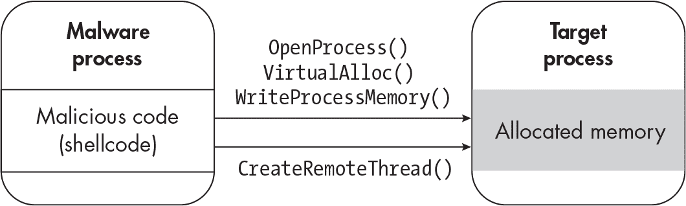

图 12-1：Shellcode 注入技术

为了注入 shellcode，恶意软件首先必须通过调用 OpenProcess（或直接调用其本地 API 等效函数 NtOpenProcess）打开目标进程的对象句柄。OpenProcess 函数有一些重要的参数：dwDesiredAccess 和 dwProcessId。dwDesiredAccess 参数表示调用进程请求的访问权限，dwProcessId 是目标进程的 ID。你可以参考 OpenProcess 函数的原型信息，如下所示：

```
OpenProcess(
  DWORD dwDesiredAccess, // Access rights requested.
  BOOL bInheritHandle,   // If true, processes created by this process inherit this process's handle.
  DWORD dwProcessId      // Process ID of the target process
);
```

一旦恶意软件获得了目标进程的对象句柄，它会调用 VirtualAlloc 在目标进程中分配内存以注入其 shellcode。（或者，它可以调用 VirtualAllocEx 或 NtAllocateVirtualMemory 函数。）VirtualAlloc 函数最相关的参数是 lpAddress 和 dwSize，分别表示分配的内存区域的起始地址和大小。以下是 VirtualAlloc 函数的原型信息：

```
VirtualAlloc(
  LPVOID lpAddress,       // Start address of region of memory to be allocated
  SIZE_T dwSize,          // Size of memory allocation
  DWORD flAllocationType, // Memory type to be allocated
  DWORD flProtect         // Memory protection to be assigned to this region
);
```

分配内存后，恶意软件使用 WriteProcessMemory（或其本地 API 等效函数 NtWriteVirtualMemory）将恶意代码写入这一新分配的内存区域。WriteProcessMemory 接受一些重要参数：hProcess，表示被写入进程的句柄；lpBaseAddress，指向将要写入数据的基地址的指针；lpBuffer，指向包含要写入数据的内存位置的指针；nSize，表示要写入目标进程内存的字节数。以下是 WriteProcessMemory 函数的原型信息：

```
WriteProcessMemory(
  HANDLE hProcess,              // Handle of process being written to
  LPVOID lpBaseAddress,         // Base address where data will be written
  LPCVOID lpBuffer,             // Contains the data to be written
  SIZE_T nSize,                 // Size of data to be written
  SIZE_T lpNumberOfBytesWritten // Optional parameter; pointer to a variable that receives
                  the number of bytes that were written
);
```

最后，在将恶意代码写入目标进程后，恶意软件准备在进程上下文中执行它。为此，它调用 CreateRemoteThread（或者，NtCreateThreadEx 或 RtlCreateUserThread）来在进程上下文中创建一个远程线程并执行代码。CreateRemoteThread 的最重要参数是 hProcess，即目标进程的句柄，以及 lpStartAddress，即要执行代码的起始地址。CreateRemoteThread 的函数原型如下：

```
CreateRemoteThread(
  HANDLE hProcess,                          // Handle to the process in which to create the
                        thread
  LPSECURITY_ATTRIBUTES lpThreadAttributes, // Pointer to a security attributes structure;
                        pertains to security and access control
  SIZE_T dwStackSize,                       // Initial size of the stack for the new thread
  LPTHREAD_START_ROUTINE lpStartAddress,    // Starting address of the new thread
  LPVOID lpParameter,                       // Pointer to a variable that will be passed to
                        the thread's function
  DWORD dwCreationFlags,                    // Creation flags for the thread (such as
                        CREATE_SUSPENDED)
  LPDWORD lpThreadId                        // Pointer to a variable that receives the new
                        Thread ID
);
```

请注意，这只是众多 Shellcode 注入和执行方法中的一种。该技术的流程和被调用的函数（如OpenProcess、VirtualAlloc、WriteProcessMemory等）是我们在本章中讨论的几种技术的基本构建块。还需要记住，本章列出的许多函数可以与其他函数互换。例如，恶意软件可能会调用本地 API NtWriteVirtualMemory，而不是 WriteProcessMemory。它也可以调用 NtCreateThreadEx，而不是 CreateRemoteThread。

要追踪进程注入，我喜欢使用 API Monitor，它可以让你快速查看恶意软件如何注入代码，甚至提取被注入的代码。你还可以使用它以易于阅读的格式检查每个函数调用的参数。

> 注意

*在下一节中，我将使用一个恶意软件可执行文件，你可以从 VirusTotal 或 MalShare 下载，文件哈希如下：*

> SHA256: c39e675a899312f1e812d98038bb75b0c5159006e8df7a715f93f8b3ac23b625

图 12-2 显示了在 API Monitor 中加载恶意软件样本并过滤 OpenProcess、VirtualAlloc 和 WriteProcessMemory 函数的结果。

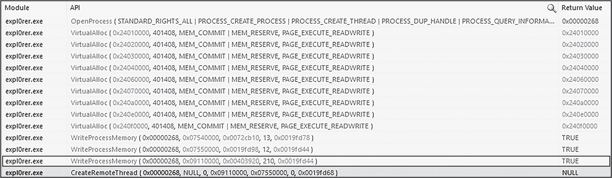

图 12-2：在 API Monitor 中捕获的 Shellcode 注入

如你所见，该样本首先调用 OpenProcess（具有 STANDARD_RIGHTS_ALL 权限及其他几个访问权限），然后多次调用 VirtualAlloc 在目标进程中分配内存。接着，恶意软件通过 WriteProcessMemory 将代码写入该进程，并通过调用 CreateRemoteThread 执行它。

如果你检查第三次调用 WriteProcessMemory 的缓冲区，你会看到恶意软件正在将看起来像是 shellcode 的内容写入目标进程（见 图 12-3）。

> 注意

*这需要一些练习，但你可以通过检查数据并寻找代表常见汇编指令的字节来识别 shellcode，例如 8b ec（它代表 mov ebp, esp）。请回顾 第三章 中的其他汇编指令。*

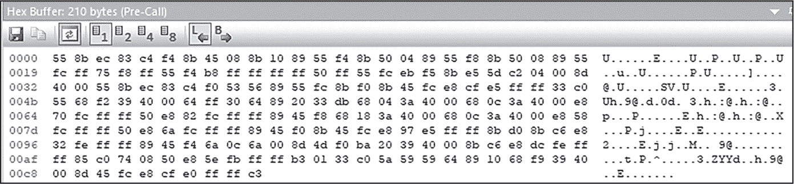

图 12-3：注入目标进程的 shellcode

为了验证它是 shellcode，保存数据（点击十六进制缓冲区窗口左上角的保存图标），然后在反汇编器中查看。你应该能看到以下内容：

```
`--snip--`
push ebp
mov  ebp, esp
add  esp, 0FFFFFFF4h
mov  eax, [ebp+8]
mov  edx, [eax]
mov  [ebp-0Ch], edx
mov  edx, [eax+4]
mov  [ebp-8], edx
mov  edx, [eax+8]
mov  [ebp-4], edx
push dword ptr [ebp-8]
call dword ptr [ebp-0Ch]
`--snip--`
```

因为这些数据可以干净地转换为汇编代码，所以这确实看起来像是 shellcode。我在这里不会详细讲解这段代码，但如果我要分析这个恶意软件样本，我会通过在反汇编器中进一步调查它，了解这段代码的目的，并在调试器中动态分析它。请注意，在某些情况下，反汇编器可能会错误地将它识别为数据，而不是代码。（参见 第三章 中的“反汇编”框，以复习代码与数据的问题。）你可能需要“强制”反汇编器将其识别为代码。

在继续之前，还有一些其他内容被注入到目标进程中，值得注意。如果你检查第一次调用 WriteProcessMemory 的缓冲区，你会看到一个指向 *kernel32.dll* 的引用（见 图 12-4）。

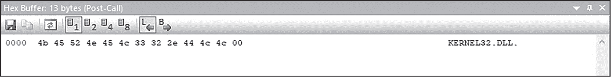

图 12-4：写入内存的字符串 KERNEL32.DLL

这表明该样本可能还使用了另一种进程注入技术——DLL 注入，我们现在来看看这个技术。#### DLL 注入

虽然 DLL 注入是另一种常见的进程注入形式，但不要被它的名字误导。在这种攻击中，恶意软件并不会将一个 DLL 物理注入到目标进程中；相反，它会将恶意 DLL 文件的*路径*写入目标进程，然后强制目标进程加载并执行该 DLL。图 12-5 展示了这种技术。


图 12-5：DLL 注入技术

恶意软件首先将一个恶意 DLL 文件写入磁盘。然后，像 shellcode 注入一样，它调用 OpenProcess 获取目标进程的句柄，并使用 VirtualAlloc 在该进程中分配内存。接下来，它调用 WriteProcessMemory 将该 DLL 文件的位置写入进程。最后，为了让目标进程加载 DLL，恶意软件获取 LoadLibrary 的过程地址，然后调用 CreateRemoteThread，并将 lpStartAddress 参数设置为该地址。一旦远程线程执行，目标进程调用 LoadLibrary，从而加载恶意 DLL。以下是伪代码示例：

```
WriteProcessMemory(victimProcess, `lpBaseAddress`, maliciousDllName, `nSize`,
`lpNumberOfBytesWritten`);
hModule = GetModuleHandle("Kernel32.dll");
GetProcAddress(`hModule`, "LoadLibraryA");
CreateRemoteThread(victimProcess, `lpThreadAttributes`, `dwStackSize`,
addressOfLoadLibraryA, maliciousDllName, `dwCreationFlags`, `lpThreadId`);
```

该恶意软件调用 WriteProcessMemory 将恶意 DLL 路径 malicousDllName 写入目标进程 victimProcess。然后，恶意软件调用 GetModuleHandle，接着调用 GetProcAddress，以获取 LoadLibraryA 函数的过程地址。最后，恶意软件调用 CreateRemoteThread，将 LoadLibraryA 的地址和恶意 DLL 的路径作为参数传入。这强制目标进程加载恶意 DLL 并在新的线程中执行其中的代码。

恶意软件作者使用传统的 DLL 注入时会遇到一个问题：DLL 必须通过标准的 Windows 库加载程序从磁盘加载。这些标准加载程序会被端点防御监控到并容易被发现。为了更隐蔽地进行 DLL 注入，恶意软件使用反射式 DLL 注入。

#### 反射式 DLL 注入

在 *反射式* DLL 注入中，DLL 被存储在内存中而不是磁盘上，恶意软件在加载 DLL 时不依赖于标准的 Windows 加载机制。这使得反射式 DLL 注入成为比标准 DLL 注入方法更为隐蔽的替代方案。

反射式 DLL 注入的初步步骤与标准的 DLL 注入相似。恶意软件使用 OpenProcess 获取受害者进程的句柄，并使用 VirtualAlloc 在该进程中分配内存。然而，恶意软件不仅仅写入 DLL 文件的路径，而是将整个恶意 DLL 复制到目标进程的内存中。然后，它将控制流转移到新注入的 DLL（例如，使用 CreateRemoteThread），该 DLL 执行注入 DLL 的“引导”加载程序代码。

该引导代码是自定义代码，必须重新创建正常的 Windows DLL 加载过程。从高层次看，这些步骤如下：

1.  引导代码计算其自身在内存中的镜像位置，并执行自身的镜像基址重定位，这意味着将可执行代码中的硬编码地址重新对齐，以匹配其当前在内存中的位置。加载程序还会找到注入的 DLL 的 PEB 位置。

2.  引导代码解析 *kernel32.dll* 的导出表，以定位 LoadLibrary、GetProcAddress、VirtualAlloc 和其他基础函数的地址。

3.  恶意 DLL 现在已成功加载到受害者进程中，并准备运行。为了执行 DLL 的恶意代码，恶意软件通常会调用 DLL 导出表中的某个函数，例如在 图 12-6 中显示的函数。

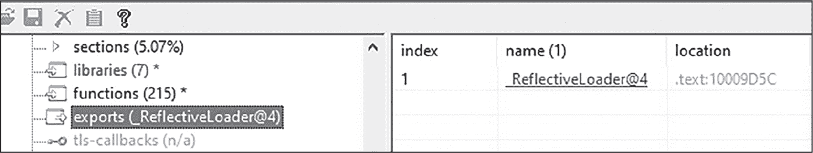

图 12-6：DLL 导出函数

此处显示的恶意软件是使用流行的渗透测试工具 Cobalt Strike 生成的，默认导出函数为 ReflectiveLoader@4。一旦调用此导出函数，恶意代码就会被执行。

图 12-7 展示了典型的反射式 DLL 注入攻击。

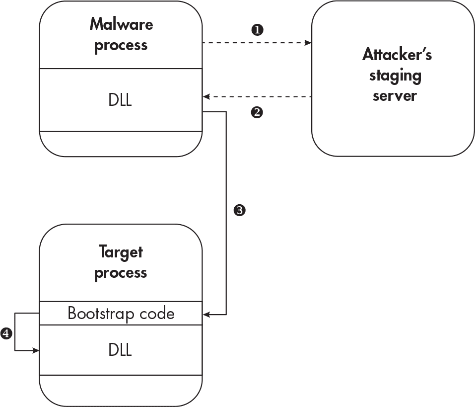

图 12-7：反射式 DLL 注入技术

在这个图示中，正在运行的恶意软件从攻击者控制的暂存服务器下载其 DLL 负载 ❶，然后暂时存储在恶意软件的进程内存空间中 ❷。（请注意，这种技术并不总是依赖于远程暂存服务器，但稍后我们会讨论这一点。）接下来，启动代码与 DLL 一起注入目标进程 ❸，并由恶意软件执行。启动代码执行手动 DLL 加载过程，然后调用注入 DLL 的导出函数，在目标进程的上下文中执行恶意代码 ❹。你可以阅读关于反射式 DLL 注入的更多信息，原作者的资料可以在[*https://<wbr>github<wbr>.com<wbr>/stephenfewer<wbr>/ReflectiveDLLInjection*](https://github.com/stephenfewer/ReflectiveDLLInjection)中找到。

反射式 DLL 注入，像本章中我讨论的许多注入方法一样，可以细分为所谓的分阶段（staged）和无阶段（stageless）技术。刚才介绍的技术被认为是*分阶段*的，因为要注入的负载是从攻击者的暂存服务器上托管并下载的。而在*无阶段*的反射式 DLL 注入中，负载已经嵌入到原始恶意软件可执行文件中，然后解压并注入到目标进程中。

一种类似的技术，有时被称为*Shellcode 反射注入*，涉及将 DLL 转换为 Shellcode，然后将其注入目标进程。我不会进一步介绍这种技术，因为它结合了你已经看到的技术，但你可以在[*https://<wbr>github<wbr>.com<wbr>/monoxgas<wbr>/sRDI*](https://github.com/monoxgas/sRDI)中阅读更多信息。

#### 进程空洞技术

*进程空洞技术*（有时被称为*RunPE*、*进程替换*或*空洞进程注入*）涉及从目标进程的内存中卸载代码，然后将恶意代码重新映射到那里。进程空洞与我们之前看到的其他注入技术有所不同，因为它通常不涉及任意的远程进程。相反，恶意软件启动一个新进程（通常是一个受信任的可执行文件，如我们熟悉的*Calculator.exe*），卸载合法代码，然后在挂起状态下重新映射恶意代码，此时恶意软件执行恶意代码。这种方式将恶意代码隐藏在端点防御和调查者的视线之外，伪装成一个正常的进程。图 12-8 展示了这一技术。

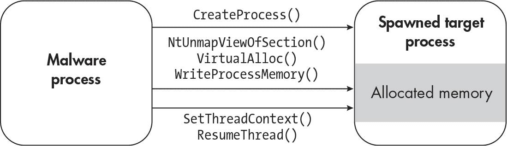

图 12-8：进程空洞技术

这个恶意软件样本首先通过<ѕamp class="SANS_TheSansMonoCd_W5Regular_11">CreateProcess创建了一个新进程，并将进程创建标志设置为<ѕamp class="SANS_TheSansMonoCd_W5Regular_11">CREATE_SUSPENDED（未显示）；这使得新进程在挂起状态下启动。接下来，恶意软件通过使用<ѕamp class="SANS_TheSansMonoCd_W5Regular_11">NtUnmapViewOfSection卸载新创建进程中的合法代码，从而“清空”该进程。然后，恶意软件通过<ѕamp class="SANS_TheSansMonoCd_W5Regular_11">VirtualAlloc为其恶意代码分配新的内存区域，并使用<ѕamp class="SANS_TheSansMonoCd_W5Regular_11">WriteProcessMemory将其有效载荷写入（映射）到这里。最后，恶意软件调用<ѕamp class="SANS_TheSansMonoCd_W5Regular_11">SetThreadContext和<ѕamp class="SANS_TheSansMonoCd_W5Regular_11">ResumeThread，分别将当前线程指向新注入的代码，并恢复线程执行，从而运行恶意代码。

让我们通过实际操作来看看，使用一款变种的勒索软件家族 Satan（SHA256: cbbd2bd6f98bd819f3860dea78f812d5c180fd19924cef32e94B d7f6929023779）。图 12-9 中的 API Monitor 屏幕截图展示了一个恶意软件样本（Satan 勒索软件家族的一个变种），它使用了进程劫持技术。

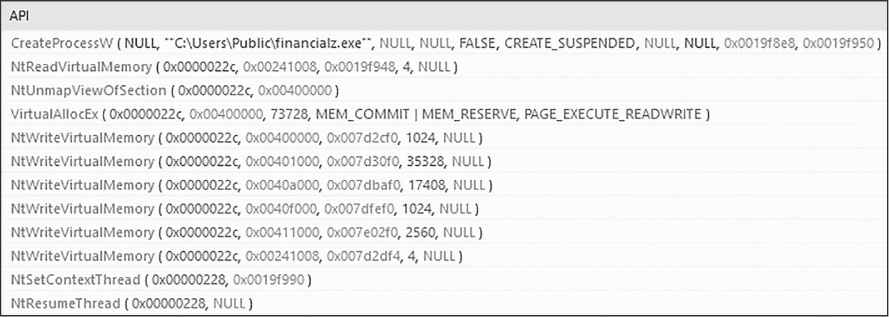

图 12-9：使用进程劫持技术的恶意软件样本

请注意，正如之前讨论的，这个恶意软件是如何通过从磁盘上的可执行文件（*financialz.exe*）以挂起状态（CREATE_SUSPENDED）启动一个新进程，使用<ѕamp class="SANS_TheSansMonoCd_W5Regular_11">CreateProcessW的。然后，它多次调用<ѕamp class="SANS_TheSansMonoCd_W5Regular_11">NtWriteVirtualMemory来将数据映射到新的目标进程中。在 API Monitor 中进一步检查这个函数调用，显示该恶意软件样本将 PE 文件写入目标进程，然后调用<ѕamp class="SANS_TheSansMonoCd_W5Regular_11">NtResumeThread来执行该文件（见图 12-10）。

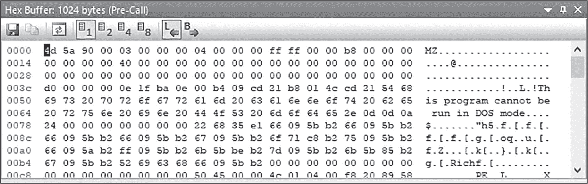

图 12-10：内存中的 PE 头部

请注意，尽管进程劫持通常被归类为一种进程注入技术，但它并不是真正的注入技术，因为它依赖于恶意软件在挂起状态下生成新进程，然后用恶意代码替换进程原有的代码。

#### 线程劫持

*线程劫持*涉及在受害者进程中打开一个正在运行的线程，将恶意代码写入该线程，并强制受害者进程执行该代码。线程劫持与进程空洞技术使用的许多功能相同，但也有一些显著的区别。为了执行线程劫持，恶意软件调用OpenThread函数，指定线程 ID 作为参数，然后调用SuspendThread（对于 64 位进程，使用Wow64SuspendThread）来挂起受害线程。一旦线程处于挂起状态，恶意软件使用VirtualAlloc和WriteProcessMemory分别分配目标进程中的内存并将恶意代码写入其中。最后，恶意软件调用SetThreadContext将控制流从当前挂起的线程转移到新注入的恶意代码，然后调用ResumeThread执行该代码。

#### APC 注入

*异步过程调用（APC）*是 Windows 的一项功能，允许将各种任务排队并在运行线程的上下文中执行。程序可以调用QueueUserAPC函数，传递线程的句柄和程序希望执行的代码的指针，将该任务添加到 APC 队列中。*APC 注入*滥用此功能，悄悄执行代码，并可能提升权限。

为了使程序能够调用 APC 队列中的函数，线程必须处于*可警觉*状态，这意味着线程会定期检查队列中的新项并执行下一个排队的任务。许多系统上运行的进程，从 Web 浏览器到视频播放器，都有在可警觉状态下运行的线程。通常，此类线程最终会收到操作系统的中断请求，此时进程会检查 APC 队列并运行下一个排队的任务。

恶意软件通过尝试通过 APC 排队将恶意代码注入到其他进程中，利用了 APC 功能。图 12-11 展示了这种攻击。

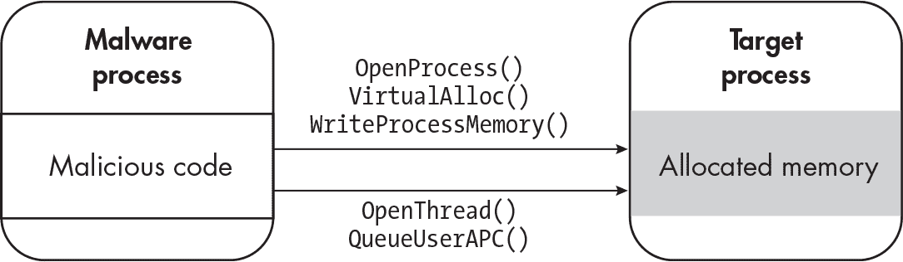

图 12-11：APC 注入技术

该恶意软件首先以常规方式获取目标受害进程的句柄（OpenProcess），并将要执行的恶意代码写入该进程（VirtualAlloc 和 WriteProcessMemory）。接下来，它通过调用 OpenThread 打开目标线程，然后调用 QueueUserAPC（或 NtQueueApcThread）来排队一个新的 APC 任务。每当线程接收到来自操作系统的中断请求时，这段恶意代码就会被执行。

该技术的变种会在挂起状态下创建一个新进程（类似于进程空洞技术），并将恶意代码写入该进程。然后，恶意软件排队其 APC 函数并恢复该线程。一旦线程恢复，恶意代码就会执行。此时，恶意软件可以终止其原始进程，因为其有效载荷现在已在新进程下运行，并且可能不会被端点防护或不知情的终端用户察觉。图 12-12 展示了这一攻击，捕获自 API Monitor。

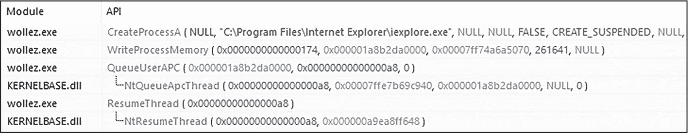

图 12-12：使用 APC 注入技术变种的恶意软件

该恶意软件样本使用 APC 注入技术，在*iexplore.exe*进程的上下文中运行恶意代码。在这种情况下，恶意软件启动了*iexplore.exe*（CreateProcessA），而不是劫持另一个进程（OpenProcess）。

#### 原子炸弹

本章将介绍的最后一种进程注入技术是*原子炸弹*，它与 APC 注入有一些相似之处，但涉及到*原子*，即指向特定数据片段（如字符串）的引用。原子存储在操作系统中一个名为*原子表*的结构中，每个原子都有一个唯一的原子标识符。原子通常用于进程间通信，用以协调进程之间的操作。例如，进程 A 可能会创建一个原子，表示某个特定的数据可用，进程 B 可以使用该原子来访问这些数据。

原子表可以是全局的（即系统中任何正在运行的进程都可以访问）或本地的（仅对特定进程可访问）。要将数据添加到全局原子表，应用程序会调用 GlobalAddAtom 函数；要将原子添加到本地表中，它会调用 AddAtom 函数。原子炸弹利用这些原子表暂时存储恶意代码。图 12-13 展示了这一攻击。

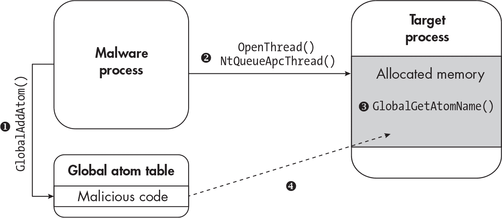

图 12-13: 原子轰炸技术

从高层次来看，这种技术在全局原子表中创建了一个新的全局原子（GlobalAddAtom），在其中存储恶意 shellcode ❶，并使用 APC 排队（NtQueueApcThread） ❷ 强制受害者进程执行 GlobalGetAtomName ❸。一旦受害者进程检索到该原子，存储在原子表中的 shellcode 就可以在该进程的上下文中运行 ❹。

#### 进程注入总结

如你所见，许多进程注入技术使用相同的 API 函数调用，并且表现类似。几乎所有的进程注入技术都会创建一个进程或打开一个目标进程的句柄，分配内存并将代码写入或映射到目标进程中，然后强制注入的代码在目标进程的上下文中执行，正如 图 12-14 中总结的那样。（特别感谢恶意软件研究员 Karsten Hahn，他为此图提供了灵感。）

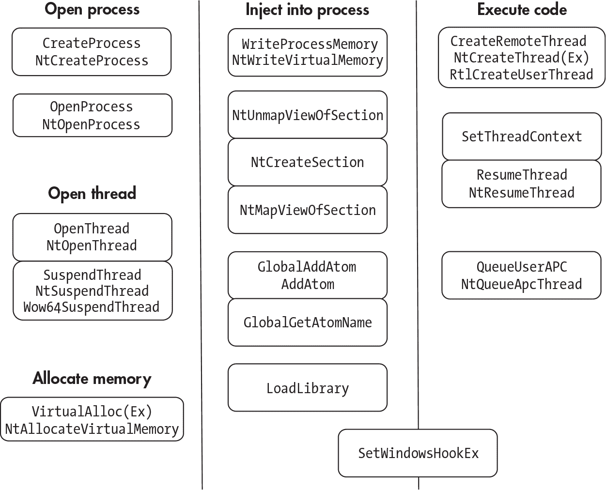

图 12-14: 进程注入行为和 API 调用总结

现在我们已经了解了各种进程注入技术，让我们转向另一种用于类似目的的方法：进程映像篡改。

### 进程映像篡改

*进程映像篡改* 滥用标准的 Windows 进程创建例程和端点防御（特别是反恶意软件软件）运作方式。为了防御恶意软件攻击，反恶意软件软件需要知道何时启动新进程，以便监视其可疑行为。这时 API 函数 PsSetCreateProcessNotifyRoutineEx 就派上了用场。当新进程被创建时，该函数会向端点防御软件发送通知消息，防御软件随后会检查并扫描启动该进程的原始可执行文件。如果反恶意软件软件发现可执行文件包含恶意代码，它可以将文件隔离并终止任何相关的进程。问题是，PsSetCreateProcessNotifyRoutineEx 不是在进程创建的确切时刻被调用，而是在进程上下文中运行的前几个线程被创建并执行时调用。这给了恶意软件一个机会，可以在反恶意软件解决方案扫描文件之前修改原始可执行文件。

进程操作还涉及干扰 Windows 创建进程的方式（如第一章所述）。本质上，Windows 通常会调用一个函数，如NtCreateUserProcess，这是一个内核函数，负责处理进程创建的细节，然后通过执行以下步骤将进程映射到内存中：

1.  获取可执行文件的句柄（例如，通过调用CreateFile）。

2.  为文件创建一个节对象，通常通过调用NtCreateSection函数。在这种情况下，*节*只是一个将被映射到内存中的对象。

3.  通过调用NtCreateProcessEx并传递一个引用新创建的节对象的参数，创建一个进程对象，将进程对象映射到内存中作为一个新进程。

4.  通过调用NtCreateThreadEx来执行该进程，创建并启动一个新线程。

让我们来看看如何使用不同的进程操作技术来干扰这些步骤。

#### 进程混淆

*进程混淆*这个名字听起来有趣，但它威力十足。通过干扰 Windows 创建进程的方式，它使操作系统和反恶意软件解决方案感到困惑。图 12-15 展示了该技术是如何工作的。

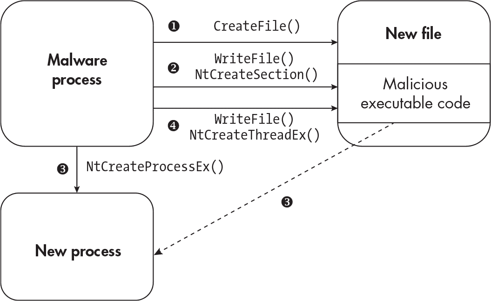

图 12-15：进程混淆技术

该恶意软件首先在磁盘上创建一个新文件并获取其句柄，保持该句柄打开 ❶。它将恶意可执行代码写入此空文件，然后为该文件创建一个节对象 ❷。接下来，它使用这个新创建的节对象来创建一个进程 ❸。恶意代码现在已经映射到内存中，但还没有执行。到目前为止，这个方法遵循标准的 Windows PE 加载步骤，但接下来会变得有趣。

恶意软件修改或移除它在磁盘上创建的文件中的恶意代码❹。然后，它启动一个新线程（NtCreateThreadEx），在内存中执行恶意代码，并关闭打开文件的句柄。此时，上述的PsSetCreateProcessNotifyRoutineEx回调会触发，端点防御机制将启动，检查恶意文件。然而，由于恶意文件实际上已经不再包含恶意代码，反恶意软件程序被欺骗，认为一切正常。反恶意软件程序以及 Windows 本身假设，当文件已经映射到内存并在进程中运行时，它不能（或不应）在磁盘上被修改。进程的 herpaderping 利用了这种假设来执行恶意代码。你可以通过其作者了解更多关于此技术的信息，访问[*https://<wbr>jxy<wbr>-s<wbr>.github<wbr>.io<wbr>/herpaderping<wbr>/*](https://jxy-s.github.io/herpaderping/)。如果你想亲自测试，你可以在[*https://<wbr>github<wbr>.com<wbr>/jxy<wbr>-s<wbr>/herpaderping*](https://github.com/jxy-s/herpaderping)上查看概念验证。

#### 进程双胞胎技术

*进程双胞胎技术*，由安全研究员尤金·科根（Eugene Kogan）和塔尔·利伯曼（Tal Liberman）在 2017 年 Black Hat 大会上首次提出，是一种利用事务性 NTFS 隐藏恶意代码执行的操作技术。术语*doppelganging*来源于*双胞胎*（doppelganger）一词，通常用来形容与他人有惊人相似的人。*事务性 NTFS*是为了增强 NTFS（Windows 默认文件系统）的功能和支持（如文件完整性保护和更好的错误处理）而设计的。它允许使用*事务*，即跟踪对文件系统的更改，并在必要时回滚这些更改。诸如文件删除等操作首先是在虚拟状态下发生的。如果文件删除请求成功，事务就会提交，文件会被实际删除；然而，如果文件删除请求出现错误，事务会回滚，文件不会被删除。最终，事务旨在防止因系统故障或其他意外事件导致的数据不一致和损坏。

使用事务创建的新文件通常无法从当前与其交互的进程之外访问；即便某些反恶意软件解决方案在这种情况下也无法访问该文件。因此，事务可以为恶意文件提供一个临时隐藏的安全位置。而且，由于事务文件可以“回滚”到之前的状态，端点防御机制很容易被混淆。这正是进程双胞胎技术有效的原因。图 12-16 展示了这种技术的工作原理。

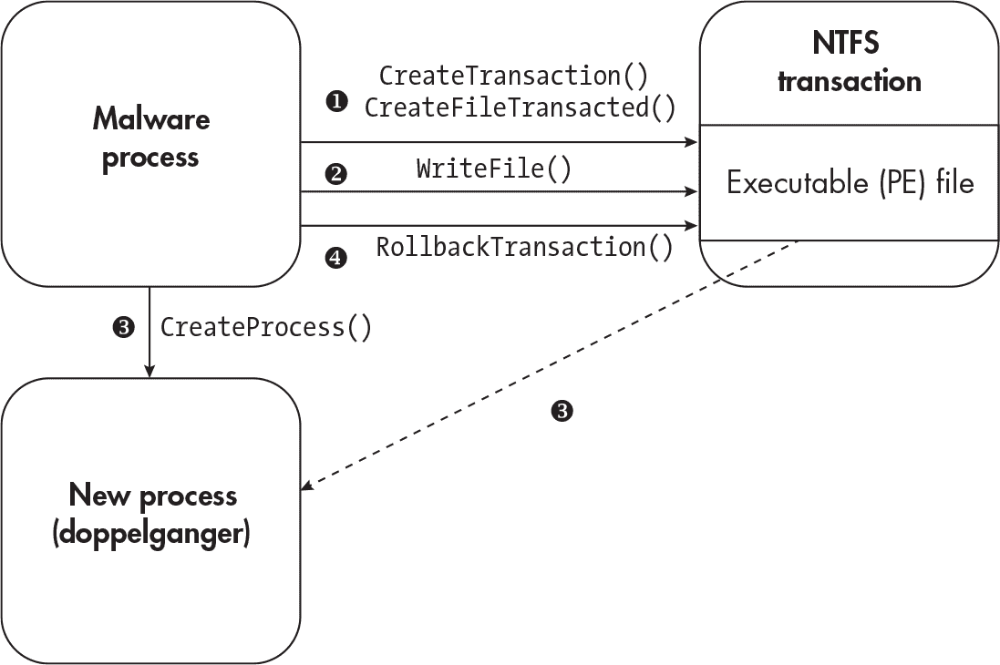

图 12-16：进程伪冒技术

该恶意软件使用CreateTransaction创建一个新的 NTFS 事务，并使用CreateFileTransacted打开一个现有的可执行文件❶。（它也可以调用更底层的函数，如ZwCreateTransaction、RtlSetCurrentTransaction和ZwCreateFile来实现相同的效果。）接下来，恶意软件将其恶意代码写入现有的 PE 文件（WriteFile），这将替换原始可执行文件的代码❷。然后，恶意软件执行CreateProcess或NtCreateProcessEx来创建一个新进程，将新恶意 PE 文件（伪冒文件）的路径作为参数传递❸。一旦 PE 文件被映射到内存中并且恶意进程正在运行，恶意软件故意回滚原始的 NTFS 事务（RollbackTransaction），将文件恢复到其原始的、未感染的状态❹。当反恶意软件程序被通知到进程创建并扫描磁盘上的进程可执行文件时，已经太迟；原始的可执行文件已经被回滚到其未受感染的状态。

自 2017 年首次发布以来，进程伪冒技术出现了一些变种。一种变种被 Malwarebytes 的研究人员称为*事务性空洞注入*，它将进程空洞注入与进程伪冒结合起来（详见博客文章“进程伪冒与进程空洞注入在 Osiris 投放器中的结合”[*https://<wbr>www<wbr>.malwarebytes<wbr>.com<wbr>/blog<wbr>/news<wbr>/2018<wbr>/08<wbr>/process<wbr>-doppelganging<wbr>-meets<wbr>-process<wbr>-hollowing<wbr>_osiris*](https://www.malwarebytes.com/blog/news/2018/08/process-doppelganging-meets-process-hollowing_osiris)）。与伪冒相似，恶意软件为注入的有效载荷创建一个新进程。然而，它不是直接注入载荷，而是将进程创建为挂起状态，并将恶意代码映射到内存中，就像在进程空洞注入中一样。这是安全研究如何被恶意软件作者作为新技术的起点的一个很好的例子。

正如你所看到的，进程图像操作技术依赖于利用 Windows 的基本行为，而且这些技术在短期内不太可能消失。对于分析人员来说，保持对新兴技术的关注非常重要。在本节的结尾，我们将介绍两种较新的进程操作技术。  #### 进程重映像与幽灵化

*进程重映像*类似于之前描述的技术，因为它依赖于操控当前运行的进程来绕过安全控制。为了执行进程重映像，恶意软件修改其 FILE_OBJECT 属性，该属性包含恶意软件在磁盘上的可执行文件路径，改为指向一个无害的合法可执行文件。此技术依赖于 Windows 处理 FILE_OBJECT 的方式存在不一致性，结果是一些反恶意软件产品过于信任恶意进程的 FILE_OBJECT 位置中存储的信息。更多关于该技术的信息可以在 McAfee 的博客文章《In NTDLL I Trust》中找到（[*https://<wbr>www<wbr>.mcafee<wbr>.com<wbr>/blogs<wbr>/other<wbr>-blogs<wbr>/mcafee<wbr>-labs<wbr>/in<wbr>-ntdll<wbr>-i<wbr>-trust<wbr>-process<wbr>-reimaging<wbr>-and<wbr>-endpoint<wbr>-security<wbr>-solution<wbr>-bypass<wbr>/*](https://www.mcafee.com/blogs/other-blogs/mcafee-labs/in-ntdll-i-trust-process-reimaging-and-endpoint-security-solution-bypass/)) 以及 GitHub 上的内容（[*https://<wbr>github<wbr>.com<wbr>/djhohnstein<wbr>/ProcessReimaging*](https://github.com/djhohnstein/ProcessReimaging)）。

*进程幽灵化*与进程“伪装”最为相似。恶意软件创建一个文件并请求 Windows 将该文件置于待删除状态。由于文件进入此状态和实际删除之间可能会有延迟，恶意软件可以在文件中写入恶意可执行代码，并在 Windows 删除文件之前为其创建图像对象（将文件内容复制到内存中）。最后，恶意软件使用现在已删除文件的图像对象创建一个进程并执行它。由于 Windows 在文件处于待删除状态时防止终端防御软件（如反恶意软件）读取和检查该文件，这些防御机制实际上无法察觉文件中的恶意代码。你可以在博客文章《你需要了解的进程幽灵化》中阅读更多关于此技术的内容，网址为 [*https://<wbr>www<wbr>.elastic<wbr>.co<wbr>/blog<wbr>/process<wbr>-ghosting<wbr>-a<wbr>-new<wbr>-executable<wbr>-image<wbr>-tampering<wbr>-attack*](https://www.elastic.co/blog/process-ghosting-a-new-executable-image-tampering-attack)。

现在我们将转向另一对注入和隐蔽执行代码的方法。

### DLL 和 Shim 劫持

*劫持* 是指通过干扰程序的正常执行流程或操控 Windows 运行程序的方式，以执行未授权的代码。具体而言，*DLL 劫持* 利用合法可执行文件加载其所需库的方式来注入恶意 DLL。*Shim 劫持* 则涉及使用 Windows 应用程序的 *Shim*（即拦截 API 调用的小型库）来将代码注入到执行中的进程中。让我们深入了解一下每种技术。

#### DLL 劫持

所有 Windows 应用程序在某个时刻必须加载 DLL 文件才能正常运行。大多数应用程序都有某种清单，列出了所有需要的 DLL 文件及其在磁盘上的位置。这个清单是应用程序 DLL *搜索顺序*的一部分。其他可能的搜索顺序位置包括应用程序的默认安装目录（例如 *C:\Program Files\CoolApplication*），该目录包含其主可执行文件，以及存放标准 Windows DLL 文件的 Windows 目录（例如 *%SystemRoot%\system32*）。

这种设置留下了一个有趣的攻击向量。许多编写不良的应用程序没有验证它们加载的 DLL 文件的内容或签名；相反，它们会根据搜索顺序盲目加载所需的文件。更糟糕的是，一些编写不良的应用程序干脆会在其安装或运行目录中随意加载所有 DLL 文件。如果攻击者知道某个特定应用程序易受 DLL 劫持攻击，它可以制作一个特制的恶意软件，将其有效载荷以 DLL 文件的形式放入应用程序加载 DLL 文件的目录中。攻击者随后可以等待应用程序启动并自动加载该 DLL 到内存中，或者直接执行该应用程序并强制加载恶意 DLL。最后，一些恶意软件会直接修改应用程序的 DLL 搜索顺序或清单，强制加载恶意 DLL。这种攻击有几种变体（如 DLL 搜索顺序劫持、旁加载、预加载、远程预加载等），但它们的效果相同：巧妙且默默地将恶意 DLL 加载到易受攻击的应用程序进程内存空间中并执行未授权的代码。

这种攻击的一个例子来自 Qbot 恶意软件家族。一个 Qbot 变种通过几个文件传送给受害者，其中最引人注目的是一个恶意的 DLL 文件 (*WindowsCodecs.dll*)、一个较旧但合法的 Windows 计算器版本副本 (*calc.exe*) 和一个名为 *7533.dll* 的 DLL 文件。*calc.exe* 文件在其 IAT 中有一个有趣的导入，如 图 12-17 所示。

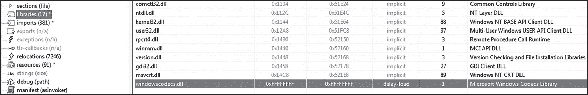

图 12-17：一个有趣的导入，来自一个 Qbot 变种的 calc.exe 文件

执行时，从当前位置开始，这个*calc.exe*应用程序会搜索*WindowsCodecs.dll*，其真实版本是一个合法的、无害的 Windows 辅助应用程序。由于恶意软件作者“贴心地”将*WindowsCodecs.dll*与*calc.exe*文件一起提供，恶意版本的 DLL 就被注入到*calc.exe*中并执行。图 12-18 展示了 Procmon 中的这一攻击。

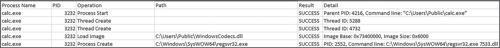

图 12-18：恶意的 WindowsCodecs.dll 文件被旁加载

这个 Procmon 时间线导出展示了受害者执行易受攻击的*calc.exe*文件（进程启动），接着加载恶意的*WindowsCodecs.dll*文件（加载映像），然后执行另一个有效载荷（*regsvr32.exe 7533.dll*）。恶意软件作者知道这个特定版本的*calc.exe*易受 DLL 劫持攻击，因为它会盲目加载并执行任何位于其运行位置的名为*WindowsCodecs.dll*的 DLL。真是非常巧妙！

#### 修补程序劫持

微软的应用兼容性框架允许应用程序*修补*，即为设计用于较旧版本 Windows 的软件添加兼容性，以便它可以在更新版本的操作系统上运行。开发人员可以使用修补程序为程序应用补丁，而无需重写或重新编译代码。然而，修补程序不仅是开发人员的好工具；使用它们也是恶意软件注入代码的强大方法。通过修补程序，恶意软件可以拦截 API 调用并修改其参数。当用户启动应用程序时，Windows 启动修补程序引擎并检查该应用程序是否安装了任何修补程序。恶意软件可以通过滥用修补程序*InjectDLL*来利用这一行为，正如其名称所示，它将 DLL 模块注入到被修补的应用程序中。一旦通过可执行文件启动应用程序，恶意 DLL 文件也会被加载到受害者应用程序的映像中并执行。

恶意行为者可以通过使用内置的 Windows 修补程序数据库安装工具*sdbinst.exe*在受害者系统上创建修补程序。恶意软件调用这个工具并将其指向恶意修补程序数据库（*.sdb*）文件，如下所示：

```
C:\> sdbinst.exe firefox.sdb
```

一旦恶意软件在受害者主机上安装了修补程序，修补程序数据库就会以*.sdb*文件的形式安装在*C:\Windows\AppPatch\Custom*或*C:\Windows\AppPatch\AppPatch64\Custom\Custom64*（针对 64 位应用程序）中。图 12-19 展示了这样的文件可能是什么样子的。

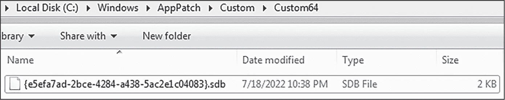

图 12-19：一个 .sdb 文件安装在 Windows 系统上

已安装的 shims 通常在 *HKLM\SOFTWARE\Microsoft\Windows NT\CurrentVersion\AppCompatFlags\Custom* 或 *HKLM\SOFTWARE\Microsoft\Windows NT\CurrentVersion\AppCompatFlags\InstalledSDB* 中有注册表条目，如 图 12-20 所示。

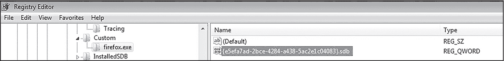

图 12-20：Shim 数据库注册表条目

在调查过程中，你可以通过使用 SDB Explorer 工具，深入探索可疑的 *.sdb* 文件。该工具可以免费从 [*https://<wbr>ericzimmerman<wbr>.github<wbr>.io<wbr>/*](https://ericzimmerman.github.io/) 获取，并显示在 图 12-21 中。

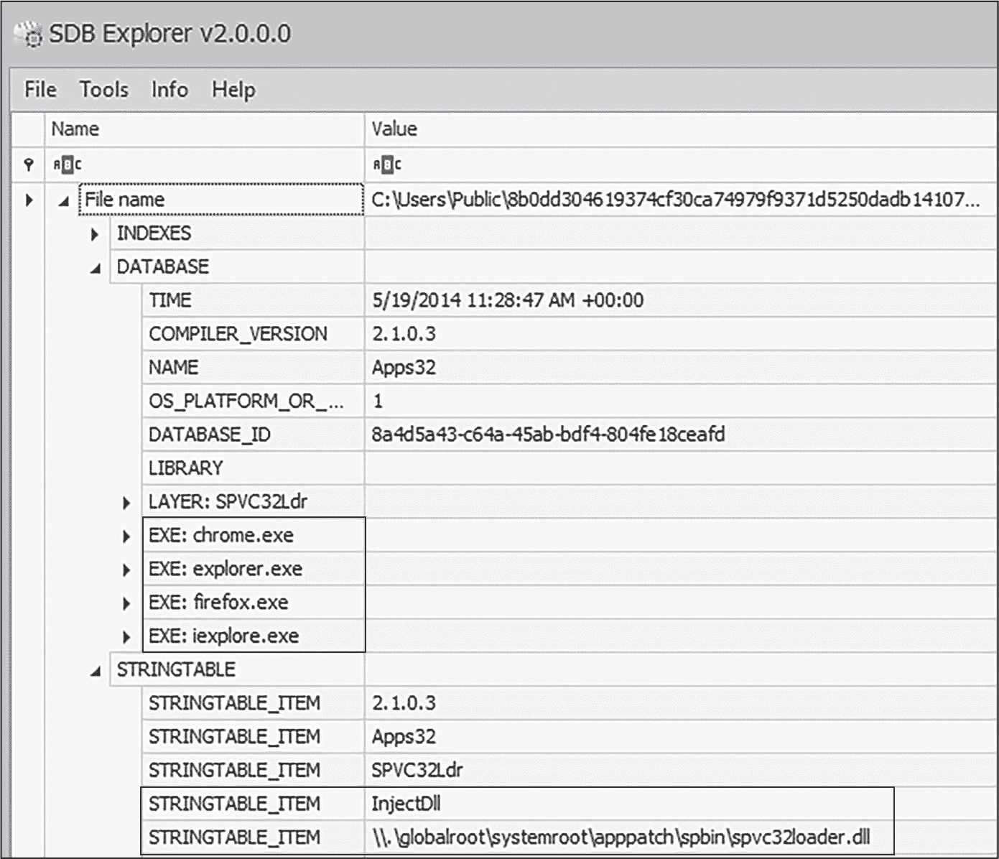

图 12-21：在 SDB Explorer 中分析一个 .sdb 文件

正如你在此输出中看到的，文件似乎在进行 *chrome.exe*、*explorer.exe*、*firefox.exe* 和 *iexplore.exe* 的 shim 操作。你还可以看出它正在使用 InjectDll 功能，并引用了一个 DLL 文件 (*spvc32loader.dll*)。根据这些信息，我们可以怀疑这个 shim 目标是浏览器进程，并试图将恶意的 DLL 注入到它们各自的内存地址空间中，这将在浏览器进程首次执行时发生。

一个关于 shim 劫持的好例子可以在 Mandiant 关于威胁组织 FIN7 的报告中找到，该组织通过注册一个新的 shim 数据库并修补合法的 Windows *services.exe* 可执行文件，成功地安装了 Carbanak 后门并在受感染的终端上保持持久性。*Services.exe* 是一个关键的系统进程，并且每次 Windows 启动时都会运行。一旦 *services.exe* 执行，shim 就会执行并启动恶意的 Carbanak 载荷。有关此攻击的详细信息，请参见 [*https://<wbr>www<wbr>.mandiant<wbr>.com<wbr>/resources<wbr>/fin7<wbr>-shim<wbr>-databases<wbr>-persistence*](https://www.mandiant.com/resources/fin7-shim-databases-persistence)。

Shims 是一种多功能的规避机制。它们是一种通过隐藏在端点防御和调查者的雷达下悄悄注入代码的手段，也是建立持久性的方式（如 FIN7 攻击所示）。除了这些目的之外，shims 还可以作为一种初步的钩子方法。让我们来看一下钩子是如何工作的。

### 钩子

如第八章所述，hooking 是一种用于拦截、监控并可能修改 Windows 函数调用的技术。它既有恶意用途，也有合法应用；例如，以下应用程序可以使用 hooking：

+   良性应用程序（如补丁程序），用于修改或修补代码，或监控系统或其他应用程序

+   沙箱和其他恶意软件分析工具，用于监控恶意软件的行为

+   终端防御软件，如反恶意软件和终端检测与响应（EDR）

+   键盘记录器和其他信息窃取恶意软件，用于拦截键盘事件，以捕获击键并窃取敏感数据

+   规避检测的恶意软件，用于防止其代码被终端防御系统检测到

在本节中，我们首先将讨论 hook 在 Windows 中的工作原理，然后再介绍一些常见的挂钩技术。为了总结本节内容和本章内容，我们将探讨恶意软件如何在受害者进程中实现并注入 hook。

#### SetWindowsHookEx 挂钩与注入

实现 hook 的最简单方法之一是使用专门为此目的设计的 Windows 函数：SetWindowsHookEx。该函数允许调用者指定要挂钩的系统事件，如鼠标或键盘事件，并指定事件发生时要执行的代码。然而，SetWindowsHookEx也可能被滥用进行 DLL 注入，因为它接受一个 DLL 文件作为参数。以下简化的伪代码展示了如何使用SetWindowsHookEx来挂钩并悄无声息地在受害者进程的上下文中运行恶意代码：

```
hmod = LoadLibrary("evil.dll");
lpfn = GetProcAddress(hmod, "Function_1");
idHook = "WH_MOUSE_LL";
dwThreadId = 0;
HHOOK hook = SetWindowsHookEx(idHook, lpfn, hmod, dwThreadId);
```

在这个例子中，几个变量作为参数传递给SetWindowsHookEx。idHook参数可以有多个不同的值，每个值表示一个要监控和挂钩的系统事件。例如，WH_MOUSE和WH_MOUSE_LL（后者在这里显示）将拦截与鼠标相关的事件，如点击。恶意软件常用的两个其他钩子是WH_KEYBOARD和WH_KEYBOARD_LL，它们用于拦截与键盘相关的事件。

hmod 参数表示加载模块的名称，该模块包含将在鼠标事件发生时执行的恶意代码。在当前示例中，这个恶意软件调用了 LoadLibrary，该函数将恶意 DLL (*evil.dll*) 加载到受害者进程中。lpfn 参数表示一个指针，指向将在鼠标事件发生时执行的代码。在这种情况下，将执行的恶意函数是 Function_1，它位于 *evil.dll* 中。

最后，dwThreadId 参数表示要监控的特定线程 ID。如果调用 SetWindowsHookEx 的程序希望仅监控单个应用程序中的单个线程，可以在此设置线程 ID。如果调用程序希望监控所有线程，则可以将此参数设置为 0。

总结来说，每当检测到鼠标事件时，恶意 *evil.dll* 文件将在受害者进程内加载并执行。由于恶意软件可能隐藏并等待非常特定的事件发生，比如某个特定数量的鼠标点击或按下某个特定的键，这种攻击可以非常隐蔽。然而需要注意的是，这种技术相对较老，现代版本的 Windows 可以防止这种攻击，更不用说这种行为非常可疑，很可能触发终端防御机制。此外，这个具体示例几乎肯定会导致系统非常不稳定。（每次鼠标事件发生时加载 DLL 不是明智的决定！）然而，这种技术的变种仍然在现代恶意软件中使用，因此需要对此保持警惕。

#### 内联钩子

用户空间钩子最常见的形式之一是*内联钩子*，它依赖于将代码注入到目标进程，并同时修改被钩住的合法函数，以强制跳转到注入的代码。首先，希望钩住另一个进程（目标进程）的进程必须通过之前描述的其中一种方法将代码注入目标进程；DLL 注入是最常见的一种。接下来，第一个进程在目标进程的地址空间内修改它希望钩住的函数，指向并跳转到注入的钩子代码。当目标进程执行该函数时，控制流从原始代码转移到钩子代码，随后可以用于监视、拦截或修改对原始函数的调用。图 12-22 展示了内联钩子技术。


图 12-22：内联 API 钩子技术

该应用程序调用了位于 *ntdll.dll* 内的 WinAPI 函数 NtCreateFile。通常，*ntdll.dll* 中的 NtCreateFile 代码会执行。然而，*ntdll.dll* 已被篡改，合法代码被跳转指令覆盖，因此现在程序会跳转并执行钩子代码。一旦恶意代码执行完毕，控制流将返回到 *ntdll.dll*，并最终返回到原始应用程序。

假设我们的系统已经被一种恶意软件感染，该恶意软件希望拦截并监控对受害进程（例如 *firefox.exe*）中 NtCreateFile 的所有调用。在将恶意钩子 DLL 注入到 *firefox.exe* 后，恶意软件必须修改受害进程地址空间中的 *ntdll.dll* 模块。恶意软件定位到 *ntdll.dll* 中的 NtCreateFile 函数，并将前 5 个字节覆盖为跳转到恶意注入的 DLL，而不是执行实际的 NtCreateFile 代码。（覆盖 5 个字节是常见的做法，因为这是跳转指令的典型大小。）第一个字节 E9（跳转指令）后跟 4 个字节，表示跳转的内存位置。为了修改目标进程中的函数代码，第一个进程可以调用 WriteProcessMemory 或 memcpy。此代码块展示了合法的 NtCreateFile 函数的前几个字节（以 x64 汇编表示）：

```
`--snip--`
mov  r10, rcx
mov  eax, 55
test byte ptr ds:[7FFE0308], 1
jne  ntdll.7FFC61D3CB65
`--snip--`
```

在恶意软件修改了 NtCreateFile 函数之后，它可能看起来像这样；注意跳转到了恶意代码：

```
`--snip--`
jmp  hooked_code ; Jump to hooking code.
mov  eax, 55
test byte ptr ds:[7FFE0308], 1
jne  ntdll.7FFC61D3CB65
`--snip--`
```

跳转到钩子代码可以通过使用 push 和 ret 指令来实现，而不是 jmp 语句，如下所示：

```
`--snip--`
push address_of_hooked_code ; Push the address of the hooked code to the stack.
ret                         ; Return (jump) to the hooked code.
`--snip--`
```

在安装内联钩子时，代码作者通常希望在钩子代码运行后执行原始函数代码，以避免系统用户的审查。假设在我们的 NtCreateFile 示例中，作者希望拦截对 NtCreateFile 的调用，执行钩子代码，然后执行原始的 NtCreateFile 代码。这可以通过跳转回原始函数的 *跳板* 来实现，如 图 12-23 所示。


图 12-23：内联钩子跳板

跳板通常通过类似 call NtCreateFile+5 的指令来实现。在钩子代码执行后（在注入的 DLL 中），此指令将控制流转回真实的 NtCreateFile，跳过前 5 个字节，其中插入的 jmp 语句位于修改后的 *ntdll.dll* 文件中。

在分析恶意软件时，有三个函数调用可以提示内联钩子。首先，恶意软件调用 ReadProcessMemory 读取它希望在目标进程中钩住的函数的前几个字节。接着，恶意软件调用 VirtualProtect 修改目标内存区域的权限，为写入跳转指令做准备，跳转到注入目标进程的恶意代码。最后，恶意软件调用 WriteProcessMemory 将跳转指令写入目标函数的代码中。

> 注意

*另一种用户空间钩子技术是* IAT 钩子*，它通过修改目标进程的导入地址表，使其指向钩子代码而不是原始的函数代码。然而，现代恶意软件很少使用 IAT 钩子，因为它容易被基于主机的防御检测到，因此我不会进一步详细介绍这种方法。*

### 进程和钩子注入的缓解措施

随着新的注入和钩取技术在恶意软件中使用或被研究人员发现并公布，微软会尽可能通过内置保护来应对这些技术。例如，*数据执行保护*，在 Windows XP 中引入，旨在通过将内存区域标记为不可执行，防止恶意软件执行注入的恶意代码。*AppLocker*，在 Windows 7 中引入，防止未经授权的可执行文件（包括注入的 DLL 文件）执行。*控制流保护*，在 Windows 8.1 中发布，旨在检测恶意软件是否修改了另一个进程的代码控制流，这通常发生在进程注入过程中。而 *任意代码保护（ACG）*，在 Windows 10 中加入，旨在防止恶意软件修改合法进程的代码，从而防止某些类型的进程和钩取注入。

此外，像 EDR 和反恶意软件软件等补充防御措施可以监控可疑进程并检测或阻止其中的一些注入。然而，请记住，并非所有注入都是恶意的：许多良性、合法的应用程序因各种原因使用注入技术，因此终端防御产品可能很难区分良性和恶意的注入。第十三章将探讨一些终端防御措施以及恶意软件如何尝试绕过这些防御。

### 总结

在本章中，我们讨论了恶意软件常用的一些技术，它们通过将代码注入并在其他进程的上下文中运行来避开终端防御，并与其运行的环境融合。我们还介绍了一些恶意软件用来隐藏其恶意行为或实现 rootkit 功能的常见钩子。注入和钩取技术有很多种，无法在本书中一一覆盖。我尽力聚焦于那些你最有可能在实际环境中遇到的技术，以及一些恶意软件作者可能加入到其规避工具箱中的新技术。

在下一章，我们将开始探讨恶意软件如何绕过终端和网络防御措施，以便在一个高度防护的环境中执行并隐藏其恶意代码。
