<hgroup>

## <samp class="SANS_Futura_Std_Bold_Condensed_B_11">13</samp> <samp class="SANS_Dogma_OT_Bold_B_11">规避端点和网络防御</samp>

</hgroup>


为了成功渗透并在目标环境中运行，现代恶意软件必须能够生存并突破该环境的防御。许多目标，特别是在企业环境中的目标，背后都有多个防御应用程序和产品，它们不知疲倦地工作，保护着构成组织基础设施的系统和网络。恶意软件可以采取主动措施来规避这些防御（例如，通过篡改主机防御应用程序），也可以采取被动方式试图悄无声息地绕过这些防御。

在本章中，我将概述恶意软件可能在受害主机和网络中遇到的不同防御类型，然后我会解释它可能采用的一些技术，以绕过这些防御。防御规避是一个庞大的话题，因此本章将主要关注最常见的战术。

### <samp class="SANS_Futura_Std_Bold_B_11">端点防御基础</samp>

端点防御市场充斥着过载的术语和花哨的产品名称。要跟上这一切并从根本上理解每个工具的实际功能可能会很困难。在这一节中，我将尝试为端点防御工具建立一个通用词汇表。然而，首先我们将简要回顾端点防御的历史，为我们建立一个基础知识水平，进而进行更深的理解。

#### <samp class="SANS_Futura_Std_Bold_Condensed_Oblique_I_11">端点防御技术简史</samp>

端点防御软件可以追溯到恶意软件的早期，即 1970 年代和 1980 年代。当时，端点防御被恰当地称为*杀毒软件（AV）*产品，因为大多数类型的恶意软件普遍被称为*病毒*。在那些早期阶段，恶意软件相对简单，AV 软件仅仅是通过搜索文件来查找特定的恶意模式。这些 AV 程序通常是由业余爱好者开发的。

在 1980 年代末和 1990 年代初，恶意软件开始变得更加复杂，商业 AV 软件公司（包括诺顿、卡巴斯基和迈克菲）应运而生，解决日益严重的威胁。这些公司开发的软件比业余爱好者的 AV 程序提供了更多高级功能，如实时扫描、基于启发式的检测和自动签名更新。

随着恶意软件作者被迫适应技术进步，他们创造了更加复杂和隐蔽的恶意软件，能够躲避传统的 AV 软件。作为回应，AV 供应商开始开发更强大的软件（我将称之为*反恶意软件*），以及被称为*端点保护平台（EPP）*的产品。EPP 是一种更完整的主机保护解决方案，包含了传统反恶意软件所没有的功能，例如内置软件防火墙和主机入侵防御。最近，*端点检测与响应（EDR）*解决方案作为一种更先进的端点安全解决方案出现，提供对端点活动的实时可视化，帮助安全团队快速检测和应对安全威胁。

主机防御技术之间有相当大的重叠。例如，许多现代反恶意软件产品结合了 EPP 和甚至 EDR 解决方案的某些方面。EPP 包括传统和现代反恶意软件的所有功能，并且可能与某些 EDR 解决方案有所重叠。EDR 通常包括反恶意软件和 EPP 的所有功能，以及其他一些功能。因此，为了简化起见，我将在本书中将端点防御归类为反恶意软件或 EDR。然而，请注意，每个产品供应商都有自己独特的“秘密配方”，因此这些类别旨在反映防御技术的工作原理，而不是它们在实践中的具体操作细节。

#### <samp class="SANS_Futura_Std_Bold_Condensed_Oblique_I_11">反恶意软件</samp>

也许最常见和最著名的主机防御技术是*反恶意软件*，或者以前被称为*杀毒软件*。它专门用于检测和识别系统上的恶意软件威胁，既包括硬盘上的恶意软件（在恶意软件执行之前），也包括内存中的恶意软件（在恶意软件已经在系统上运行之后）。为了实现这一点，反恶意软件使用一系列技术，包括基于哈希和基于特征的检测，以及启发式和行为分析。

##### <samp class="SANS_Futura_Std_Bold_Condensed_B_11">基于哈希的检测</samp>

*基于哈希的检测*是一种早期反恶意软件扫描程序使用的原始方法，并且今天仍在一定程度上被使用。反恶意软件供应商维护一个已知为良性或恶意的文件哈希数据库。当文件写入磁盘时，反恶意软件会扫描该文件并将其哈希与数据库进行比较。如果该文件已知为良性，反恶意软件将不做任何处理。如果该文件已知为恶意，反恶意软件会自动将其从系统中移除，并将其放入一个特殊的隔离区，确保其不会造成任何危害。

这种基于哈希值的方法的主要问题在于，文件必须已经被反恶意软件程序识别。如果文件是新的，并且不在数据库中，反恶意软件就无法检测到它（至少，单靠哈希分析无法检测）。根据卡巴斯基 2020 年 12 月 15 日的新闻稿，2020 年每天约有 36 万个新的恶意文件被创建。这显然给基于哈希值的检测方法带来了问题，因为反恶意软件程序无法跟上如此庞大的文件量。

##### <samp class="SANS_Futura_Std_Bold_Condensed_B_11">基于特征的检测</samp>

*基于特征的检测*，是对旧有哈希值检测方法的升级，使用*特征*或已知模式来识别文件或进程内存中的恶意代码。这些模式可以是字符串、字节序列、元数据或其他任何能表明文件或内存段可能与恶意软件相关的内容。反恶意软件程序会维护一个庞大的特征库，当它发现匹配时，便会发出警报并将相关文件隔离或终止可疑进程。基于特征的检测与在第二章中讨论的 Yara 规则类似。

随着时间的推移，恶意软件作者已经意识到这些检测技术。例如，由于基于特征的检测是通过寻找恶意模式，恶意软件作者可以简单地加密或混淆他们的恶意软件，无论是在磁盘上还是在内存中，以隐藏或改变这些模式。更糟糕的是，他们可以生成无数种恶意软件的变种，以至于检测机制再也无法跟上其变化。显然，反恶意软件程序必须不断进化。

##### <samp class="SANS_Futura_Std_Bold_Condensed_B_11">基于启发式的检测</samp>

与其匹配文件哈希值或寻找软件中特定的模式，*基于启发式的检测*则关注文件的行为。它通过几种不同的子技术来实现这一目标。首先，它会检查文件是否有恶意代码的迹象。这个过程不仅仅是简单的字符串和字节序列模式匹配；它还会寻找一些指示，如可疑的汇编指令块或 API 调用的异常使用。这个过程还可能涉及加权或评分系统。当反恶意软件软件发现可疑的代码序列时，文件的分数会增加。一旦分数达到预定的阈值，反恶意软件引擎便会将文件判定为恶意文件。

更现代的基于启发式的方法还可以使用文件仿真技术来更好地理解文件。*文件仿真*涉及在*仿真引擎*中执行文件，这是一种非常轻量级的虚拟机，可以在文件真正执行之前动态地评估它。随着 CPU 指令在仿真器中执行，反恶意软件会监控文件的行为，如果有任何行为可疑或使文件的分数足够高，反恶意软件将采取进一步行动。

##### <samp class="SANS_Futura_Std_Bold_Condensed_B_11">基于云的分析沙箱</samp>

在系统上运行每个文件通过仿真引擎将非常繁重，因此一些现代反恶意软件供应商改为使用基于云的分析沙箱。如果一个文件在经历了基于哈希、基于特征码和基于启发式的检测机制后仍未分类，该文件将被发送到反恶意软件供应商的云环境中进行沙箱化和进一步分析。*基于云的沙箱化*是一种众包安全方式，使用这种反恶意软件的所有客户都会收到通知，如果某个文件被确认恶意，即使他们之前从未见过该文件。

图 13-1 总结了我们迄今为止讨论的检测机制。

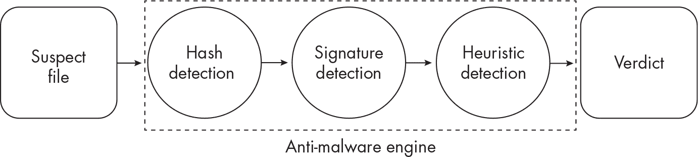

<samp class="SANS_Futura_Std_Book_Oblique_I_11">图 13-1：反恶意软件中的典型检测机制</samp>

请注意，许多现代反恶意软件解决方案使用了上述一些或全部技术的组合。

##### <samp class="SANS_Futura_Std_Bold_Condensed_B_11">局限性与挑战</samp>

尽管反恶意软件已经随着时间的推移取得了显著进步和改进，但它仍然存在一些局限性。总体而言，它能够有效地识别和消除已知恶意的文件、与已知恶意文件相似的文件，以及那些不特别先进、针对性不强或定制化不高的文件。然而，更多先进和特定的威胁可能会悄悄绕过反恶意软件（我们将在本章后面看到）。

反恶意软件的另一个限制是必须考虑系统资源。反恶意软件面临着一项非常困难的任务：它必须同时扫描潜在的成千上万个文件和内存区域，同时保持尽可能低的系统资源占用，以避免干扰最终用户体验。这意味着它不能将每个文件都经过仿真或沙箱处理；它必须将这些更耗时和资源的技术保留给那些需要深入调查的可疑文件。

即使是在它认为是恶意的文件中，反恶意软件也必须具有选择性。例如，反恶意软件已知会将关键系统文件标记为恶意，这种行为是无法容忍的。因此，反恶意软件产品可能倾向于让文件通过而不是将其标记为恶意。

反恶意软件的一个最终限制是，虽然它旨在检测并消除端点的威胁，但它并不是为了事后入侵调查或上下文分析而设计的。现代和高级攻击通常涉及攻击链中的多个步骤，这些步骤使用了多种技术和组件，单靠反恶意软件可能会留下盲点，特别是在复杂的企业环境中。这时，EDR（端点检测与响应）就发挥了作用。

#### <samp class="SANS_Futura_Std_Bold_Condensed_Oblique_I_11">端点检测与响应</samp>

*端点检测与响应（EDR）*解决方案提供比传统反恶意软件解决方案更先进的威胁检测和响应功能。传统的反恶意软件解决方案主要集中在检测和防御已知的恶意软件威胁，而 EDR 解决方案能够检测并应对更广泛的高级威胁。

EDR 的主要优点之一是能够建立攻击的上下文。它通过收集来自多个端点的数据来创建这种上下文，通常被称为*遥测*，从而使调查人员能够进行更深入的分析，并识别整个企业中类似的恶意活动模式。EDR 甚至可以帮助调查小组识别攻击的“零号病人”。

让我们快速看看 EDR 的工作原理。通常，EDR 由多个组件组成，包括用户空间和内核空间的组件，以及日志聚合器和分析引擎。我们将从用户空间组件开始。

##### <samp class="SANS_Futura_Std_Bold_Condensed_B_11">用户空间组件</samp>

EDR 解决方案始终至少有一个可执行文件作为用户空间中的进程运行。这个进程通常被称为*代理*，它以高权限上下文运行，并监视主机上其他进程的可疑行为，必要时进行干预。为了实现这一点，EDR 代理收集并分析系统事件，然后将这些信息转发给日志聚合器，我们稍后会讨论。当主机上创建一个新进程时，EDR 进程可以通过各种方法注入钩子模块到该进程中，方法包括在第十二章中讨论的那些。

图 13-2 展示了恶意软件被 EDR 钩住的过程。

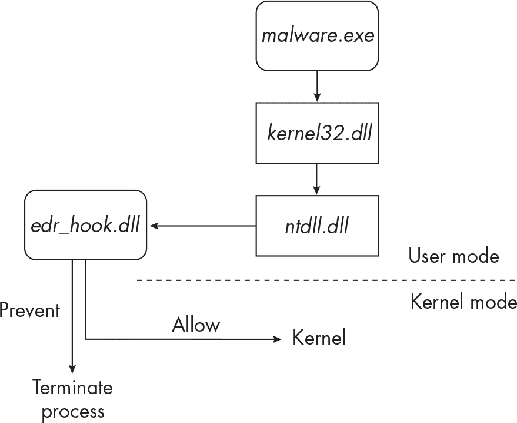

<samp class="SANS_Futura_Std_Book_Oblique_I_11">图 13-2：EDR 过程使用模块钩住恶意软件</samp>

恶意软件可执行文件（*malware.exe*）调用位于*kernel32.dll*中的 WinAPI 函数，进而调用*ntdll.dll*。与正常情况下*ntdll.dll*通过系统调用进入内核空间不同，已安装的 EDR 软件通过先前注入的 DLL（*edr_hook.dll*）钩住*ntdll.dll*。这样，EDR 软件就可以决定是否允许 API 调用，或者阻止甚至终止它。如果 EDR 软件认为该 API 活动无害，它将允许 API 调用正常地传递到内核。

现代反恶意软件和 EDR 软件可能会钩住的一些常见功能包括：

+   内存操作（例如 <samp class="SANS_TheSansMonoCd_W5Regular_11">NtProtectVirtualMemory</samp> 和 <samp class="SANS_TheSansMonoCd_W5Regular_11">NtReadVirtualMemory</samp>）监视内存提交和保护变化，比如当 EDR 软件希望知道内存区域是否已更改为*可读写可执行（RWX）*时，表示该区域可能有代码即将被执行。

+   创建和终止进程的函数（如 <samp class="SANS_TheSansMonoCd_W5Regular_11">NtCreateProcessEx</samp>， <samp class="SANS_TheSansMonoCd_W5Regular_11">NtCreateUserProcess</samp>，和 <samp class="SANS_TheSansMonoCd_W5Regular_11">NtTerminateProcess</samp>），以便 EDR 软件可以监控和挂钩新创建的进程

+   加载库的函数（如 <samp class="SANS_TheSansMonoCd_W5Regular_11">LdrLoadDll</samp>），以便 EDR 软件可以在加载新库和模块时监控可疑进程

+   常用于进程注入的函数（如 <samp class="SANS_TheSansMonoCd_W5Regular_11">NtOpenProcess</samp>， <samp class="SANS_TheSansMonoCd_W5Regular_11">NtCreateThread</samp>， <samp class="SANS_TheSansMonoCd_W5Regular_11">NtResumeThread</samp>， <samp class="SANS_TheSansMonoCd_W5Regular_11">NtUnmapViewOfSection</samp>，和 <samp class="SANS_TheSansMonoCd_W5Regular_11">NtMapViewOfSection</samp>），以便 EDR 软件可以监控代码注入和挂钩注入尝试

+   文件写入（如 <samp class="SANS_TheSansMonoCd_W5Regular_11">NtWriteFile</samp>），常被勒索软件和其他破坏性恶意软件使用

+   尝试创建网络连接的函数，如 <samp class="SANS_TheSansMonoCd_W5Regular_11">InternetOpen</samp> 和 <samp class="SANS_TheSansMonoCd_W5Regular_11">InternetConnect</samp>，这些函数可以被 EDR 监控以检测可疑的网络通信

挂钩 API 函数调用只是监控系统的一种方式。一些 EDR 产品还使用其他来源收集系统数据，例如*Windows 事件追踪（ETW）*，这是一个用于日志记录和诊断的机制，自 2007 年以来就已成为 Windows 的一部分。ETW 能够从多个来源收集和记录数据，包括用户空间进程和内核驱动程序，这使得它在 EDR 数据采集中也非常有用。你可以在微软文档中了解更多信息。

为了识别可疑活动，EDR 代理可能依赖于威胁评分系统。为了说明这一点，请参考图 13-3 中的攻击场景。

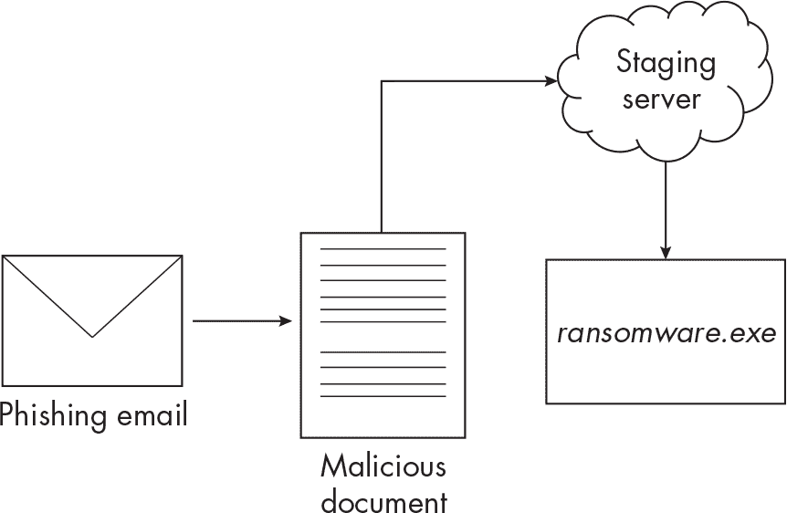

<samp class="SANS_Futura_Std_Book_Oblique_I_11">图 13-3：多阶段攻击</samp>

首先，攻击者向目标用户发送一封精心制作的钓鱼电子邮件，附件包含一个恶意的 Microsoft Office 文档。Office 文档中的恶意代码执行 PowerShell 来联系一个临时服务器，在那里攻击者的恶意软件载荷（*ransomware.exe*）被托管，然后在内存中下载并执行该载荷。之后，勒索软件载荷开始加密受害者硬盘上的文件。

EDR 产品会为构成此次攻击的每个事件分配一个分数。例如，它为启动 PowerShell 命令的 Office 文档分配 35 的威胁值，为连接到可疑服务器的操作分配 20 的威胁值，为下载并执行未知可执行文件分配 30 的威胁值。如果假设最大威胁分数为 100，并且任何超过 75 的值都被认为是恶意的，那么这个总计 85 的事件序列将触发 EDR 解决方案执行一些操作，比如终止 Office 和 PowerShell 进程，或断开与远程服务器的网络连接。勒索软件本身的执行可能会有很高的威胁评分，因为勒索软件会创建大量的文件写入操作。此外，与这些事件相关的元数据将被转发到一个中央日志存储和处理器，允许 EDR 产品在整个企业基础设施的上下文中分析这次攻击。

请记住，这个威胁评分系统示例是故意简化的，旨在演示 EDR 如何比传统的端点防御更能在高级攻击中“串联”事件。接下来，我们将讨论 EDR 解决方案中的另一个重要部分：内核空间组件。

##### <samp class="SANS_Futura_Std_Bold_Condensed_B_11">内核空间组件</samp>

在内核空间，EDR 解决方案主要以内核驱动程序或模块的形式存在，这些模块是执行在内核地址空间中的已编译代码。EDR 内核驱动程序依赖于*回调*，即内核组件注册的函数，用于接收特定事件的通知。例如，为了监控系统中的新进程，EDR 内核驱动程序通过调用内核函数 <samp class="SANS_TheSansMonoCd_W5Regular_11">PsSetCreateProcessNotifyRoutine</samp> 注册一个回调例程。当进程被创建或终止时，EDR 内核驱动程序会收到通知，以便相应地作出响应，通常是通过调用其用户空间组件，将钩子注入新创建的进程中开始监控。图 13-4 展示了这一过程是如何工作的。

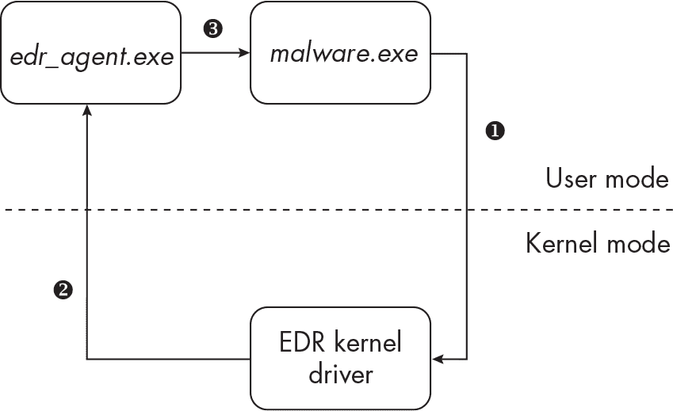

<samp class="SANS_Futura_Std_Book_Oblique_I_11">图 13-4: EDR 钩子注入</samp>

在这个示例中，EDR 内核驱动程序通过 <samp class="SANS_TheSansMonoCd_W5Regular_11">PsSetCreateProcessNotifyRoutine</samp>（未显示）被通知到一个新的进程，*malware.exe*，正在被创建❶。EDR 驱动程序指示用户空间中的 EDR 代理（*edr_agent.exe*）❷将钩子注入到新创建的进程中❸。现在，*malware.exe* 正在被 EDR 监控。

下面是一些 EDR 软件可能使用的其他回调，以及触发它们的情况：

<samp class="SANS_TheSansMonoCd_W7Bold_B_11">PsSetCreateThreadNotifyRoutine</samp> 当创建或删除任何新线程时，都会触发该回调。

<samp class="SANS_TheSansMonoCd_W7Bold_B_11">PsSetLoadImageNotifyRoutine(Ex) </samp>当进程将一个镜像（如 DLL 模块）加载到内存中，或者加载一个新驱动程序时，会触发该事件。

<samp class="SANS_TheSansMonoCd_W7Bold_B_11">IoWMISetNotificationCallback </samp>此事件由 Windows 管理工具（WMI）事件触发。

<samp class="SANS_TheSansMonoCd_W7Bold_B_11">CmRegisterCallback(Ex) </samp>当任何正在运行的线程修改 Windows 注册表时，会触发该事件。

<samp class="SANS_TheSansMonoCd_W7Bold_B_11">FsRtlRegisterFileSystemFilterCallbacks </samp>当某些文件系统操作发生时，会触发此事件。

<samp class="SANS_TheSansMonoCd_W7Bold_B_11">IoRegisterBootDriverCallback </samp>当一个新的启动驱动程序初始化时，会触发此事件。启动驱动程序在系统启动时启动，因此反恶意软件和 EDR 可以利用此回调检测使用启动驱动程序的根套件和启动套件（有关根套件的更多信息，请参见第十四章）。

EDR 还可以利用迷你过滤驱动。*迷你过滤器*用于监视来自用户空间进程的文件系统请求，因此 EDR 可以使用它们来拦截和阻止恶意文件系统操作（例如勒索软件以极快的速度打开和写入文件）。EDR 使用迷你过滤器的另一个原因是监视和保护其自身文件免受篡改或删除。如果恶意软件能够获得低级权限并尝试删除或修改 EDR 组件，迷你过滤驱动将会通知 EDR 产品此活动。

EDR 可能使用的其他内核组件包括网络过滤驱动和*早期启动反恶意软件（ELAM）*驱动。网络过滤驱动可用于监视、拦截和修改网络通信，这对于检测异常网络流量（如命令与控制（C2）流量）非常有用。ELAM 驱动在操作系统启动之前加载，有助于防止恶意软件篡改启动过程。

> <samp class="SANS_Dogma_OT_Bold_B_15">注意</samp>

*你可能已经注意到，EDR 将模块注入到其他进程中，安装钩子以拦截 API 调用，并将驱动程序安装到内核空间，这和恶意软件非常相似！EDR 确实看起来和一种名为根套件的恶意软件变种非常相似。我们将在第十四章中更详细地讨论根套件技术和组件。*

##### <samp class="SANS_Futura_Std_Bold_Condensed_B_11">日志记录与分析</samp>

我之前提到过，EDR 代理的一个职责是将事件及相关数据转发到中央日志服务器，在那里它们可以被进一步分析并存储以备将来调查。图 13-5 展示了这一过程。

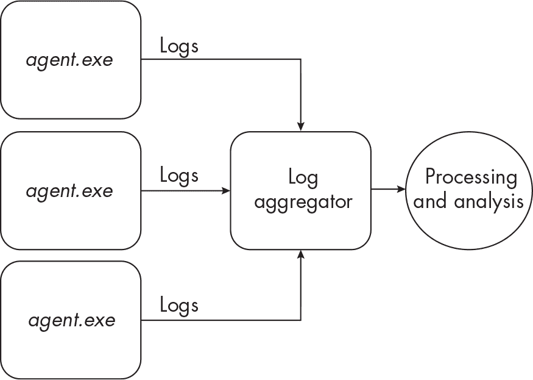

<samp class="SANS_Futura_Std_Book_Oblique_I_11">图 13-5：EDR 代理收集来自多个端点的数据进行分析</samp>

如你所见，运行在企业基础设施中不同端点上的 EDR 代理将数据转发到 EDR 日志聚合器。通过使用各种供应商特定的技术，数据被处理和分析，使 EDR 产品能够检测到更大规模的攻击。例如，使用这些遥测数据，一些 EDR 产品甚至能够“学习”特定企业环境中的正常情况，帮助它们进一步区分典型的终端用户行为和恶意活动。许多现代 EDR 解决方案还可以从许多不同的来源收集日志，以监控整个组织的 IT 基础设施。这些 EDR 解决方案有时被称为*扩展检测与响应*（*XDR*）平台。XDR 能够从客户端终端、服务器、网络设备、应用程序和云计算环境等来源收集并分析数据。在本书的其余部分，我将使用*EDR*一词，也包括 XDR。

尽管 EDR 具有所有的优势和功能，但它仍然可能被高级恶意软件绕过（有时确实如此）。现在你已经基本了解了 EDR 和反恶意软件的工作原理，让我们来看看恶意软件如何篡改并规避这些防御。高级恶意软件通常会首先尝试了解其运行的环境；这涉及到恶意软件侦察目标系统和网络，并试图识别挡在其面前的终端防御。我们从这里开始。

### <samp class="SANS_Futura_Std_Bold_B_11">识别终端防御</samp>

由于许多反恶意软件和 EDR 产品在行为和监控系统的方式上有所不同，一个高级攻击者会在执行恶意软件载荷之前，至少对目标进行基本的侦察。攻击者可能会采用多种技术来枚举目标的防御。例如，以下 PowerShell 命令将检索主机上安装的反恶意软件列表：

```
PS C:\> Get-CimInstance -Namespace root/SecurityCenter2 -ClassName AntivirusProduct
```

这是该命令的一些示例输出：

```
displayName              : Windows Defender
instanceGuid             : {D68BAD3A-821F-4fce-9E54-DA133F2CBA26}
pathToSignedProductExe   : windowsdefender://
pathToSignedReportingExe : %ProgramFiles%\Windows Defender\MsMpEng.exe
productState             : 397568
timestamp                : Mon, 13 Feb 2023 18:29:52 GMT
`--snip--`
```

在我的系统上，Microsoft Defender 被识别为活动的反恶意软件产品。（此输出使用的是过时的名称*Windows Defender*；该产品已更名为 Microsoft Defender。）

尽管该命令只会检索已在 Microsoft 安全中心注册的反恶意软件，大多数反恶意软件供应商都会这样做。一个更强大的解决方案是枚举主机上的工件，寻找终端防御产品的迹象。

在第四章中，我们讨论了恶意软件如何列举并列出主机上运行的进程以进行沙箱和虚拟机检测。它也可以对防御进行同样的操作。例如，它可以调用 Windows API 函数 <samp class="SANS_TheSansMonoCd_W5Regular_11">CreateToolhelp32Snapshot</samp> 创建受害主机上所有进程的“快照”，然后使用 <samp class="SANS_TheSansMonoCd_W5Regular_11">Process32First</samp> 和 <samp class="SANS_TheSansMonoCd_W5Regular_11">Process32Next</samp> 遍历这些进程。接着，它可以搜索可疑的进程名称，例如 *MsMpEng.exe*（Windows 10 和 11 的默认反恶意软件进程）、*AvastSvc.exe*（Avast 反恶意软件产品的可执行进程），或者任何名称中包含 <samp class="SANS_TheSansMonoCd_W5Regular_11">falcon</samp> 字符串的进程（可能与 CrowdStrike Falcon EDR 产品相关），以确定主机上有哪些防御措施。

一些最流行的反恶意软件和 EDR 厂商及产品包括以下内容：

+   CrowdStrike Falcon EDR: *CSFalcon*.exe*

+   ESET Smart Security: *Ekrn.exe*

+   Kaspersky: *Avp.exe*

+   Malwarebytes: *Mbam.exe*

+   McAfee Endpoint Security: *masvc.exe*

+   Sophos: *SavService.exe*

+   Symantec Endpoint Protection: *ccSvcHst.exe*

+   VMware Carbon Black: *cb.exe*

+   Microsoft Defender for Endpoint（前身为 Windows Defender）：*MsMpEng.exe*

这些进程通常会有相关的服务，它们的命名方式相似，恶意软件可以枚举它们。还需记住，列表并不全面，并且在软件版本之间可能会有所变化。

另外，扫描主机以查找与反恶意软件和 EDR 相关的文件、驱动程序和注册表项也很有效。图 13-6 显示了恶意软件样本查询注册表以匹配常见反恶意软件厂商的键值的 Procmon 输出。

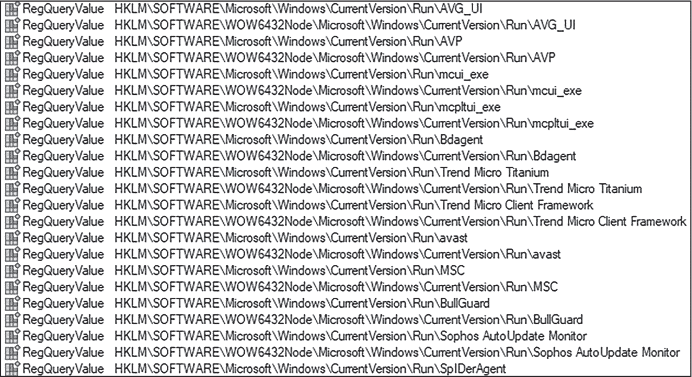

<samp class="SANS_Futura_Std_Book_Oblique_I_11">图 13-6：恶意软件查询注册表以获取反恶意软件和 EDR 产品的名称</samp>

类似地，卡巴斯基的反恶意软件产品，例如，安装在类似于 *C:\Program Files (x86)\Kaspersky Lab\Kaspersky Total Security* 的目录中，并且在 *C:\System32\drivers* 目录下安装了多个驱动程序，这些驱动程序可能会让恶意软件注意到它的存在（参见图 13-7）。

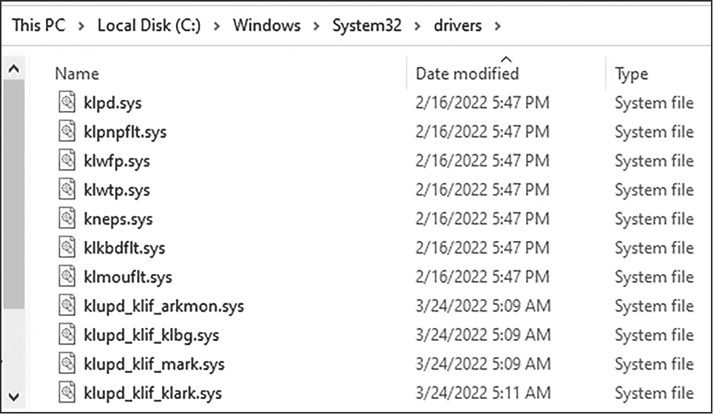

<samp class="SANS_Futura_Std_Book_Oblique_I_11">图 13-7：卡巴斯基安装的驱动程序</samp>

有一些研究项目，如 [*https://<wbr>github<wbr>.com<wbr>/ethereal<wbr>-vx<wbr>/Antivirus<wbr>-Artifacts*](https://github.com/ethereal-vx/Antivirus-Artifacts)，它们记录了端点防御产品在主机上创建的不同工件。这些资源对恶意软件研究人员和恶意软件作者都很有帮助。

最后，已经在主机上运行的恶意软件可能会尝试查找其是否被反恶意软件或 EDR 勾取的迹象。例如，恶意软件可能会使用 <samp class="SANS_TheSansMonoCd_W5Regular_11">Module32First</samp> 和 <samp class="SANS_TheSansMonoCd_W5Regular_11">Module32Next</samp> 枚举其加载的模块（如 第七章 所描述），或者搜索其进程内存中的勾取迹象，正如它绕过沙箱勾取时所做的那样（如 第八章 所描述）。这些勾取可能暴露出特定的防御产品。

一旦检测到并识别出端点安全产品，恶意软件可以采取几种主动或被动的方式绕过它。首先，我们将讨论一些主动措施。

### <samp class="SANS_Futura_Std_Bold_B_11">主动绕过端点防御</samp>

*主动规避*是通过完全禁用防御、修改策略使其变弱，或篡改它们以让其失效来直接绕过防御。这有许多种实现方式，让我们来看一些示例。

#### <samp class="SANS_Futura_Std_Bold_Condensed_Oblique_I_11">禁用主机防御</samp>

恶意软件规避和绕过端点安全的一种粗糙但有效的方法就是直接禁用它。恶意软件在枚举了端点上运行的安全产品后，可以通过几种方式禁用它们。首先，它可以尝试通过调用 <samp class="SANS_TheSansMonoCd_W5Regular_11">TerminateProcess</samp> 函数，或使用 PowerShell 或 Windows 命令行等工具终止应用程序的进程（例如反恶意软件和 EDR 相关进程、Windows 安全中心进程和服务，以及任何防火墙产品，如 Windows 内置的主机防火墙）。

一些反恶意软件解决方案将其配置的部分存储在注册表中；篡改这些配置也可能导致不必要的结果。专门从事其名字所暗示的操作的恶意软件家族 KillAV (<samp class="SANS_TheSansMonoCd_W5Regular_11">SHA256: 659ce17fd9d4c6aad952bc5c0ae93a748178e53f8d60e45ba1d0c15632fd3e3f</samp>)，尝试通过停止进程和篡改注册表来禁用默认的 Windows 反恶意软件和威胁保护服务。以下是该恶意软件执行的一些命令：

```
net stop WinDefend

REG ADD "HKLM\Software\Policies\Microsoft\Windows Defender\Real-Time Protection" /v
"DisableRealtimeMonitoring" /t REG_DWORD /d "1" /f

REG ADD "HKLM\Software\Policies\Microsoft\Windows Defender" /v "DisableAntiSpyware" /t
REG_DWORD /d "1" /f

<samp class="SANS_TheSansMonoCd_W5Regular_11">REG ADD "HKLM\SYSTEM\CurrentControlSet\Services\WdBoot" /v Start /t REG_DWORD /d 4 /f</samp>
```

<samp class="SANS_TheSansMonoCd_W5Regular_11">net stop WinDefend</samp> 命令终止 Microsoft Defender 进程，而各种 <samp class="SANS_TheSansMonoCd_W5Regular_11">REG ADD</samp> 命令则篡改注册表以关闭 Microsoft Defender 实时监控服务、反间谍软件服务和 AV 启动驱动程序 (WdBoot)，这些都是 Windows 默认反恶意软件服务的关键组成部分。

一些恶意软件通过使用如下的 PowerShell 命令，简单地尝试卸载主机上的防御软件：

```
PS C:\> $antimalware = Get-WmiObject -Class Win32_Product | Where-Object{$_.Name -eq "ESET
Endpoint Antivirus"}
PS C:\> $antimalware.Uninstall()
```

第一个 PowerShell 命令利用 WMI 枚举主机上安装的软件，特别查找 ESET 反恶意软件；第二个命令卸载该软件。

一种可能噪音较小的方法是降低端点防御进程的 *优先级*：即减少进程对操作系统的重要性。优先级较高的进程（通常是系统进程等关键进程）会分配更多的 CPU 时间。通过使用 <samp class="SANS_TheSansMonoCd_W5Regular_11">SetPriorityClass</samp> 降低端点防御进程的优先级，恶意软件可以减少其效果。以下伪代码展示了这种方法：

```
// Open the target process (anti-malware process, for example).
hProcess = OpenProcess(..., ..., TargetProcessPID);

// Set process priority to "Low".
SetPriorityClass(hProcess, BELOW_NORMAL_PRIORITY_CLASS);
```

然而，这些技术有一个陷阱：根据操作环境的不同，恶意软件可能需要高权限才能终止反恶意软件进程和服务、篡改注册表配置和进程优先级，并卸载软件。在这种情况下，恶意软件必须提升其权限，然后才能尝试禁用端点防御。我们将在 第 248 页 的“防御规避的权限提升”部分中查看它是如何做到的。

#### <samp class="SANS_Futura_Std_Bold_Condensed_Oblique_I_11">添加反恶意软件排除项</samp>

另一种削弱防御的方法是篡改反恶意软件的排除列表。反恶意软件会定期扫描端点上的特定文件系统目录，这些目录由用户或组织配置软件时决定。大多数反恶意软件允许用户在其配置设置中添加排除项，通常以目录路径的形式。这些排除列表中的任何文件或目录都不会被监控或扫描。

为了使用这种技术，初始的投放者或加载器恶意软件会在受害主机上创建一个排除项，一旦该排除项启用，它会将有效载荷部署到排除的目录中。以下是恶意软件如何使用 PowerShell 在 Microsoft Defender 反恶意软件解决方案中创建排除项的示例：

```
PS C:\> Add-MpPreference -ExclusionPath "C:\Malware\DoNotScanThisDirectory"
```

此命令为路径 *C:\Malware\DoNotScanThisDirectory\* 添加反恶意软件排除项。

请注意，在 Windows 的后续版本中，恶意软件必须具有高权限才能在受害主机上创建排除项，这使得这种攻击的入侵门槛比旧版本操作系统更高。

#### <samp class="SANS_Futura_Std_Bold_Condensed_Oblique_I_11">禁用其他安全控制</samp>

除了禁用反恶意软件、EDR 和其他防御措施外，恶意软件还可以禁用系统的其他安全功能。虽然这些安全功能可能不会直接防止攻击，但禁用它们会降低主机的整体安全性，使其更容易受到进一步攻击。

例如，恶意软件可能禁用 Windows 更新服务，该服务负责定期更新 Windows，以修补漏洞和漏洞。如果威胁行为者在不引人注意的情况下禁用了此服务，最终可能会在较长时间内削弱主机的整体安全性，使系统容易受到后续攻击。要使用 PowerShell 禁用服务，恶意软件可以执行以下命令：

```
PS C:\> Stop-Service "Service_Name"
```

恶意软件还可能禁用 PowerShell 安全性。一些 Windows 环境禁止执行未经授权的 PowerShell 脚本，因此关闭脚本执行控制可能有助于攻击者执行他们原本无法执行的 PowerShell 脚本。要启用 PowerShell 脚本执行，攻击者可以执行以下命令：

```
PS C:\> Set-ExecutionPolicy Unrestricted
```

为了防止未经授权的出站流量从端点传出，通常会配置基于主机的防火墙解决方案。基于主机的防火墙可以用于允许特定进程（如 web 浏览器）的出站流量，同时防止不应与任何其他主机或互联网通信的进程的出站流量。为了绕过这个限制，攻击者可以直接修改主机上的防火墙配置。根据使用的防火墙软件不同，这种配置有所不同，但对于标准的 Windows 防火墙，可以通过 PowerShell 添加或修改规则。例如，恶意软件可以使用以下命令将默认的防火墙策略更改为允许所有进程的所有出站流量：

```
PS C:\> Set-NetFirewallProfile -Name Domain -DefaultOutboundAction Allow
```

恶意软件还可以禁用与安全性无关的工具，这些工具可能被用来暴露它。例如，终止和禁用 Windows 任务管理器，以防止谨慎的用户发现可疑的正在运行的进程，或者禁用注册表编辑器，以防止有经验的系统管理员在注册表中识别恶意遗留物。

在 Windows 系统上，攻击者可以更改许多策略和配置来削弱安全性；这些仅是一些例子。关键要点是，威胁行为者可能不会尝试完全禁用终端防御，如反恶意软件和 EDR，而是可能采取一种较间接的方法，通过对系统进行轻微调整来实现其目标。然而，这是一把双刃剑；恶意软件对系统的修改越多，它被检测到的机会就越高。

#### <samp class="SANS_Futura_Std_Bold_Condensed_Oblique_I_11">通过解除挂钩来致盲防御</samp>

由于 EDR 和现代反恶意软件严重依赖钩子来监控可疑进程以及检测和防止威胁，解除钩取技术可能会为它们创造盲点。在第 137 页“反钩取”部分中概述的解除钩取方法对于某些 EDR 和反恶意软件软件可能有效，但高级主机防御已经在期待这些方法。这些防御可能会使用它们安装的内核组件在内核级别监控自己的钩子，而恶意软件则可能篡改并解除终端防御的钩取。

恶意软件作者与主机防御之间的猫鼠游戏在这里表现得非常明显。终端保护软件监控并钩取恶意软件。恶意软件扫描这些钩子，并解除钩取，或尝试通过其他方式绕过它们。作为回应，终端保护产品会检查它们是否已被解除钩取，循环继续。尽管如此，终端防御在此处还是有一定优势的。如果程序试图移除钩子，EDR 或反恶意软件软件可以在一定程度上推测该进程是恶意的，因为几乎没有正当理由去解除钩取。

如本章前面所提到的，终端防御可能会使用其他系统监控源，如 ETW，来补充传统的基于钩取的监控。这些数据源也可能以各种方式被盲化；事实上，已经有相当多的研究针对 ETW 盲化。这可以通过多种方式实现，其中一种方法是钩取或修补<samp class="SANS_TheSansMonoCd_W5Regular_11">EtwEventWrite</samp>，该函数对 ETW 的操作至关重要。

#### <samp class="SANS_Futura_Std_Bold_Condensed_Oblique_I_11">利用主机防御工具中的漏洞</samp>

反恶意软件、EDR 和其他防御系统是由人类开发的，而人类会犯错，因此，产品代码中不可避免地会存在漏洞，威胁行为者可以利用这些漏洞。尽管公开报告的利用防御工具的攻击尝试并不多，但这始终是一种可能性，特别是对于那些具备发现这些漏洞的手段和能力的威胁行为者。快速搜索 MITRE CVE 漏洞数据库（[*https://<wbr>cve<wbr>.mitre<wbr>.org*](https://cve.mitre.org)）可以找到一些反恶意软件产品中的公开漏洞，如图 13-8 所示。

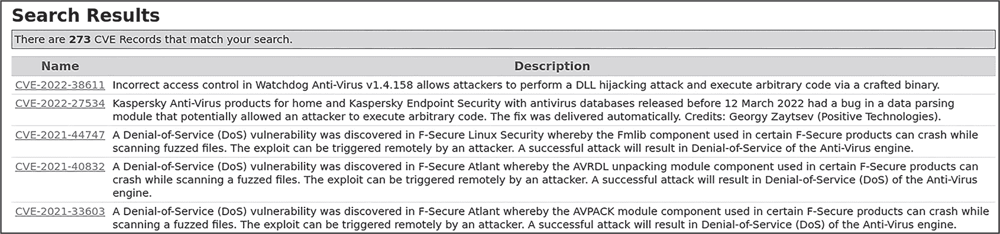

<samp class="SANS_Futura_Std_Book_Oblique_I_11">图 13-8：MITRE 报告的反恶意软件产品中的漏洞</samp>

此列表包括在 Watchdog、Kaspersky 和 F-Secure 产品的反恶意软件引擎中发现的漏洞。列出的漏洞大多数是*拒绝服务（DoS）*漏洞，可能允许特制的代码使反恶意软件引擎崩溃或以其他方式妨碍其有效性。

这总结了我们对主动规避技术的探讨。接下来，我们将讨论被动规避，它可以是一种更加隐蔽且同样有效的方法。

### <samp class="SANS_Futura_Std_Bold_B_11">被动规避端点防御</samp>

被动规避技术通过不直接篡改防御措施来悄悄绕过宿主防御。如你所见，这些方法与主动技术一样有效，却不会引发太多警报。

#### <samp class="SANS_Futura_Std_Bold_Condensed_Oblique_I_11">规避监控</samp>

第八章讨论了恶意软件如何规避 API 钩子和监控，从而试图逃避沙盒。恶意软件可以使用类似的技术来规避端点防御。由于端点防御也依赖于函数钩子来拦截和监控可疑活动，规避和绕过这些钩子通常是让它们失效的有效方式。

由于反恶意软件和 EDR 监控各种 Windows API 调用以检测恶意活动，一种规避措施是实现*直接系统调用*，即从用户模式直接调用内核地址空间，绕过典型的系统调用程序。具体来说，当程序在用户模式下调用 API 函数时，操作系统会发起一个系统调用进入*ntosknrl.exe*以访问该函数的代码（见图 13-9）。

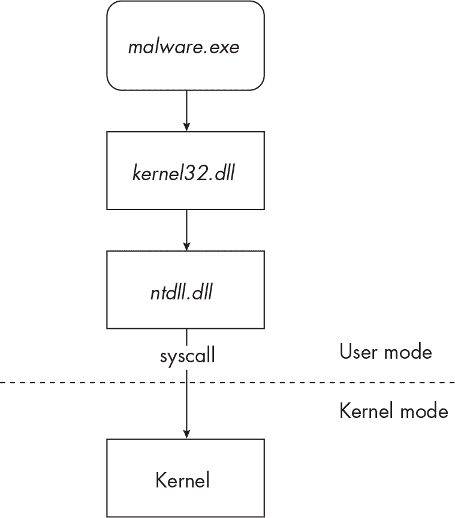

<samp class="SANS_Futura_Std_Book_Oblique_I_11">图 13-9：正常的系统调用行为</samp>

然而，恶意软件并不依赖于常规的 Windows 和 NT API 调用过程，而是可以直接发起系统调用（见图 13-10）。

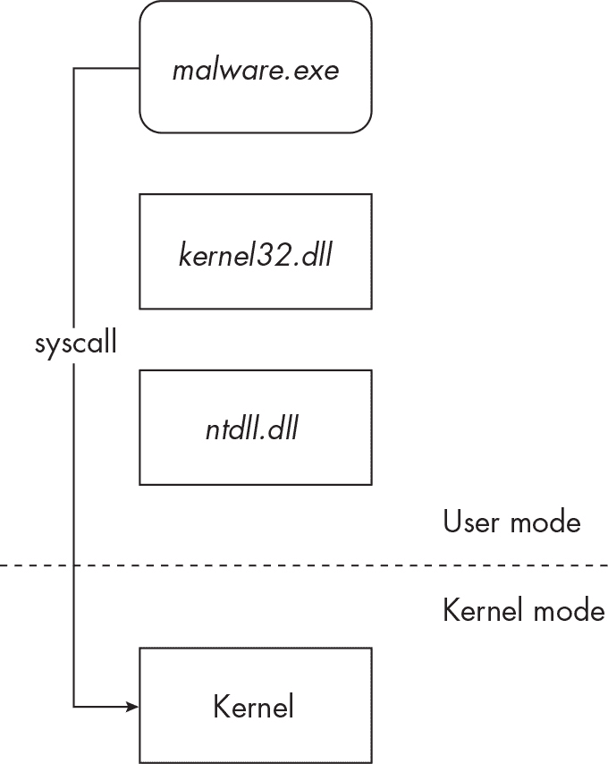

<samp class="SANS_Futura_Std_Book_Oblique_I_11">图 13-10：直接系统调用</samp>

系统调用遵循一种基本模式，称为*系统调用存根*。存根的目的是将执行流从用户模式转移到内核模式，在内核模式下被调用的函数的代码实际上驻留在其中。以下代码展示了一个针对<sup class="SANS_TheSansMonoCd_W5Regular_11">NtAllocateVirtualMemory</sup>函数的系统调用存根：

```
mov r10, rcx
mov eax, 18
test byte ptr ds:[7FFE0308], 1
jne ntdll.7FF80B57C3C5
syscall
ret
```

存根中最重要的部分是 <samp class="SANS_TheSansMonoCd_W5Regular_11">mov eax, 18</samp> 这一行，其中 <samp class="SANS_TheSansMonoCd_W5Regular_11">18</samp> 代表 *系统服务号（SSN）*，有时也称为 *系统调用号* 或 *系统调用 ID*。这个数字映射到将以内核模式调用的函数代码（在本例中为 <samp class="SANS_TheSansMonoCd_W5Regular_11">NtAllocateVirtualMemory</samp>）。存根中下一个最重要的部分是 <samp class="SANS_TheSansMonoCd_W5Regular_11">syscall</samp> 指令（十六进制，<samp class="SANS_TheSansMonoCd_W5Regular_11">0F 05</samp>），它使用 <samp class="SANS_TheSansMonoCd_W5Regular_11">eax</samp> 寄存器中的 SSN 将执行流指向相应的内核函数。返回（<samp class="SANS_TheSansMonoCd_W5Regular_11">ret</samp>）指令会将执行流转回主程序代码，一旦系统调用返回并完成。

> <samp class="SANS_Dogma_OT_Bold_B_15">注意</samp>

*我们目前讨论的系统调用存根特定于 x64 架构。x86 程序通常使用不同的调用：* sysenter*。sysenter 存根非常相似：*

> mov edx, esp
> 
> sysenter
> 
> ret
> 
> *<samp class="SANS_TheSansMonoCd_W5Regular_Italic_I_11">mov edx, esp</samp> 指令将 SSN（存储在 <samp class="SANS_TheSansMonoCd_W5Regular_Italic_I_11">ESP</samp> 中）移动到 <samp class="SANS_TheSansMonoCd_W5Regular_Italic_I_11">EDX</samp> 中，并将其传递给 <samp class="SANS_TheSansMonoCd_W5Regular_Italic_I_11">sysenter</samp> 指令（十六进制 <samp class="SANS_TheSansMonoCd_W5Regular_Italic_I_11">0F</samp>* <samp class="SANS_TheSansMonoCd_W5Regular_Italic_I_11">34</samp>*）。请注意，一些 x64 程序也使用 sysenter 调用。*

如果恶意软件想要直接发起系统调用（以避免 EDR 或反恶意软件钩子），它只需要知道要调用的函数的 SSN（系统服务号），然后直接调用该系统调用。听起来很简单，但恶意软件作者可能会面临一些障碍；最明显的是，函数的 SSN 会根据目标主机的 Windows 版本和补丁级别而变化。为了解决这个问题，恶意软件作者有几个选择。一个选择是从内存中加载的 *ntdll.dll* 中提取 SSN（请参见 图 13-11）。


<samp class="SANS_Futura_Std_Book_Oblique_I_11">图 13-11：已加载的</samp> <samp class="SANS_Futura_Std_Book_11">ntdll.dll</samp> <samp class="SANS_Futura_Std_Book_Oblique_I_11">模块中的系统调用存根</samp>

图 13-11 展示了加载到内存中的 *ntdll.dll* 系统调用存根的样子。注意一些导出 *ntdll.dll* 函数的 SSN 被高亮显示。恶意软件可以检查其加载的模块，定位相关的系统调用存根，并识别它所需的 SSN。一旦获取到它想要调用的函数的 SSN，恶意软件就可以自定义系统调用存根，从而绕过 *ntdll.dll* 的标准系统调用调用。以下代码展示了在 Remcos 的一个变种中使用系统调用（更准确地说，是 sysenter）的方式（<samp class="SANS_TheSansMonoCd_W5Regular_11">SHA256: 45cd8dd797af4fd769eef00243134c46c38bd9e65e15d7bd2e9b834d5e8b3095</samp>）：

```
`--snip--`
sub_1D29    proc near
      push  2BC12D2Eh
      call  resolve_ssn     ; NtMapViewOfSection
      call  invoke_sysenter
      retn  28h
`--snip--`
sub_1D3B    proc near
      push  3ACFFF22h
      call  resolve_ssn     ; NtWriteVirtualMemory
      call  invoke_sysenter
      retn  8
`--snip--`
sub_1D4D    proc near
      push  7C9B2C0Bh
      call  resolve_ssn     ; NtResumeThread
      call  invoke_sysenter
      retn  8
`--snip--`
```

这个 Remcos 示例通过枚举磁盘上的 *ntdll.dll* 文件（此处未展示）来解析它希望调用的函数的 SSN。然后，它调用包含标准 sysenter 存根的函数。具体来说，这个 Remcos 示例试图通过直接发起 sysenter 调用来隐秘地将代码注入到另一个进程中，从而调用 <samp class="SANS_TheSansMonoCd_W5Regular_11">NtMapViewOfSection</samp>、<samp class="SANS_TheSansMonoCd_W5Regular_11">NtWriteVirtualMemory</samp>、<samp class="SANS_TheSansMonoCd_W5Regular_11">NtResumeThread</samp> 等函数。

这种方法的一个问题是，这些系统调用并不是来自它们预定的模块 *ntdll.dll*。对于寻找此类异常的端点防御系统来说，这可能是一个显而易见的提示。一个更为隐蔽的选项，有时被称为 *间接* 系统调用，是恶意软件作者直接重用 *ntdll.dll* 中的系统调用，而不是自定义自己的系统调用存根。为了实现这一点，恶意软件识别出它希望调用的函数在 *ntdll.dll* 中的系统调用存根地址。然后，恶意软件不再调用例如 <samp class="SANS_TheSansMonoCd_W5Regular_11">NtMapViewOfSection</samp> 函数，而是实现一个 <samp class="SANS_TheSansMonoCd_W5Regular_11">jmp</samp> 指令，直接跳转到 *ntdll.dll* 中的该系统调用存根。

这些只是恶意软件作者可能用来绕过端点防御系统所安装的钩子的几种技巧。然而，这些技巧并非万无一失。如你所见，许多方法会产生可疑的迹象（枚举 *ntdll.dll* 内存、直接从恶意软件代码中调用系统调用、直接跳转到 *ntdll.dll* 等）。不仅如此，许多现代端点防御还会钩住内核，试图检测这种类型的活动。

使用系统调用调用进行规避是一个有趣的话题，因此，如果你有兴趣了解更多，建议参考以下文献：

+   Usman Sikander，“使用直接系统调用绕过 AV/EDR（用户模式与内核模式），” *Medium*，2022 年 3 月 11 日，[*https://<wbr>medium<wbr>.com<wbr>/@merasor07<wbr>/av<wbr>-edr<wbr>-evasion<wbr>-using<wbr>-direct<wbr>-system<wbr>-calls<wbr>-user<wbr>-mode<wbr>-vs<wbr>-kernel<wbr>-mode<wbr>-fad2fdfed01a*](https://medium.com/@merasor07/av-edr-evasion-using-direct-system-calls-user-mode-vs-kernel-mode-fad2fdfed01a)。

+   Cornelis，“红队战术：结合直接系统调用和 sRDI 绕过 AV/EDR，” *Outflank*，2019 年 6 月 19 日，[*https://<wbr>www<wbr>.outflank<wbr>.nl<wbr>/blog<wbr>/2019<wbr>/06<wbr>/19<wbr>/red<wbr>-team<wbr>-tactics<wbr>-combining<wbr>-direct<wbr>-system<wbr>-calls<wbr>-and<wbr>-srdi<wbr>-to<wbr>-bypass<wbr>-av<wbr>-edr<wbr>/*](https://www.outflank.nl/blog/2019/06/19/red-team-tactics-combining-direct-system-calls-and-srdi-to-bypass-av-edr/)。

+   红队笔记，“直接从 Visual Studio 调用系统调用以绕过 AVs/EDRs，” *红队笔记*，无日期，[*https://<wbr>www<wbr>.ired<wbr>.team<wbr>/offensive<wbr>-security<wbr>/defense<wbr>-evasion<wbr>/using<wbr>-syscalls<wbr>-directly<wbr>-from<wbr>-visual<wbr>-studio<wbr>-to<wbr>-bypass<wbr>-avs<wbr>-edrs*](https://www.ired.team/offensive-security/defense-evasion/using-syscalls-directly-from-visual-studio-to-bypass-avs-edrs)。

#### <samp class="SANS_Futura_Std_Bold_Condensed_Oblique_I_11">规避基于签名的检测</samp>

正如我们所讨论的，反恶意软件使用基于签名的检测机制，这意味着它会寻找常见的模式来识别文件和内存中的恶意代码。恶意软件通常包含硬编码在其可执行文件中的字符串、函数名称，或者驻留在内存中的 DLL 和模块名称，这些都可能暴露其存在。因此，简单地修改这些字符串、函数和模块名称，通常可以显著降低被检测的概率，至少是针对传统的反恶意软件解决方案来说。这是滥用基于签名的反恶意软件检测的最基本方法之一，但现代恶意软件需要更复杂的规避技术来应对更先进的反恶意软件解决方案。这就是变异技术的作用所在。

*变异*是恶意软件为了规避检测或适应其环境而改变其特征和代码的能力。通过变异，恶意软件的目标是对代码进行足够的修改，以避开雷达监控，同时保留其基本功能。为了帮助你更好地理解变异，我们来看看一个典型恶意软件样本的生命周期。

一些恶意软件作者，尤其是网络犯罪团伙，会将恶意软件“垃圾邮件”发送给数百或数千个潜在受害者，期望能诱使一些毫无防备的人执行它。一旦足够多的受害者被某种恶意软件感染，调查人员不可避免地会获得该样本并为其开发检测规则，这些规则随后会被实施到反恶意软件引擎和其他防御技术中。这将迅速减少任何恶意软件的生命周期。然而，这不仅适用于大规模垃圾邮件恶意软件；它同样适用于更有针对性的恶意软件。如果恶意软件能够在受害者主机上变异，它也可能像这样逃避检测。

有不同形式的变异，比如 *代码块重排*，在这种方式中，代码被移位并重新排序，以创建恶意软件的新“变体”；还有 *寄存器重新分配*，即更改 CPU 寄存器（例如，将所有 ECX 寄存器引用改为 EDX）。这些由 *变异引擎* 实现的恶意软件代码变异，能够显著改变代码的结构和特征。下面是一个非常简单的变异示例，展示了汇编代码如何在功能上相同但外观不同：

```
mov eax, 0
add eax, 1
```

这个示例代码块简单地将 <samp class="SANS_TheSansMonoCd_W5Regular_11">eax</samp> 寄存器设置为 <samp class="SANS_TheSansMonoCd_W5Regular_11">0</samp>，然后将 <samp class="SANS_TheSansMonoCd_W5Regular_11">eax</samp> 设置为 <samp class="SANS_TheSansMonoCd_W5Regular_11">1</samp>。将其与下面的代码进行比较：

```
xor eax, eax
inc eax
```

这段代码也将 <samp class="SANS_TheSansMonoCd_W5Regular_11">eax</samp> 设置为 <samp class="SANS_TheSansMonoCd_W5Regular_11">0</samp>（但使用 <samp class="SANS_TheSansMonoCd_W5Regular_11">xor</samp> 指令，而不是 <samp class="SANS_TheSansMonoCd_W5Regular_11">mov</samp> 指令），然后将 <samp class="SANS_TheSansMonoCd_W5Regular_11">eax</samp> 设置为 <samp class="SANS_TheSansMonoCd_W5Regular_11">1</samp>（使用 <samp class="SANS_TheSansMonoCd_W5Regular_11">inc</samp> 指令，而不是 <samp class="SANS_TheSansMonoCd_W5Regular_11">add</samp>）。如果这段代码是实际的恶意代码，反恶意软件软件可能已经为其中一个代码块建立了检测特征，但可能没有对另一个代码块进行检测。当然，在现实世界中，这段代码会复杂得多。

变异可以在运行时动态发生，也可以在恶意软件文件本身发生。运行时变异发生在恶意软件在受害者系统上执行时。恶意软件可能会在内存中动态修改其代码，以规避扫描内存中恶意代码模式的防御机制。恶意软件文件本身的变异发生在恶意软件被传递给受害者之前。恶意软件作者可能会通过变异引擎运行其代码，生成相同恶意软件的不同变种，并将这些变种传递给不同的受害者。打包器（packers），我将在第十七章中详细讨论，既可以是运行时变异，也可以是静态文件变异。当恶意软件通过打包引擎运行时，它会被混淆，使其看起来与该恶意软件家族的所有其他变种都不同。

类似病毒的勒索软件家族 Virlock 是变异的一个很好的例子。当 Virlock（<samp class="SANS_TheSansMonoCd_W5Regular_11">SHA256: 7a92e23a6842cb51c9959892b83aa3be633d56ff50994e251b4fe82be1f2354c</samp>）在受害者系统上执行时，它会在内存中解密三个自己的实例，并将它们作为文件丢到磁盘上。这三个实例与其他所有 Virlock 恶意软件样本不同，并且具有不同的签名。这确保了恶意软件能够保持未被检测到，至少对于依赖哈希值和基本文件签名进行检测的反恶意软件引擎来说是如此。

#### <samp class="SANS_Futura_Std_Bold_Condensed_Oblique_I_11">使用不常见的编程语言</samp>

为了规避终端防御，恶意软件作者可能会使用不常见或罕见的编程语言来开发恶意软件。反恶意软件程序可能不熟悉这些语言中的代码和数据结构，因此它需要时间才能跟上其特征码和启发式检测。不常见或新的编程语言也可能对恶意软件分析师和逆向工程师造成挑战，因为他们期望看到的是更典型的恶意软件代码，如 C 或 C++。此外，许多这些不常见的语言可以跨不同操作系统使用。例如，为 Windows 编写的程序只要受害者系统安装了所需的库，也可以在 macOS 或 Linux 上运行。这使得恶意软件在不同操作系统之间更具抗性。

使用不常见的编程语言并不是一种新技术。早期的恶意软件通常是用 C 语言编写的，但恶意软件作者开始使用.NET 框架（如 C#），该框架至今仍非常流行。然而，反恶意软件和其他防御措施已经迎头赶上，因此恶意软件作者正在适应并且越来越多地使用其他编程语言。Python 作为一种非常常见的脚本语言，在恶意软件中得到了更多的应用，既可以用于脚本也可以用于可执行文件。恶意软件作者只需编写一个恶意的 Python 脚本（*.py*），该脚本可以在任何安装了正确 Python 库的系统上执行。工具如 Py2Exe 和 PyInstaller 甚至可以将 Python 脚本转换成可执行文件，攻击者可以像处理标准 PE 文件一样将其部署到受害者的机器上。由于编写一个恶意的 Python 脚本并将其转换为可执行文件相对简单，这种方法降低了恶意软件作者的门槛。

Nim（[*https://<wbr>nim<wbr>-lang<wbr>.org*](https://nim-lang.org)），一个自称为“静态类型编译系统编程语言”的语言，恶意软件作者也开始越来越多地使用。特别是，Nim 曾被背后威胁组使用，该组以臭名昭著的 Trickbot 银行木马而闻名（请参见 Lawrence Abrams 的文章《TrickBot 的 BazarBackdoor 恶意软件现在使用 Nim 编码以规避杀毒软件》，链接为[*https://<wbr>www<wbr>.bleepingcomputer<wbr>.com<wbr>/news<wbr>/security<wbr>/trickbots<wbr>-bazarbackdoor<wbr>-malware<wbr>-is<wbr>-now<wbr>-coded<wbr>-in<wbr>-nim<wbr>-to<wbr>-evade<wbr>-antivirus<wbr>/*](https://www.bleepingcomputer.com/news/security/trickbots-bazarbackdoor-malware-is-now-coded-in-nim-to-evade-antivirus/))。使用 Nim 可能帮助恶意软件逃避了杀毒软件的防御。

Go（有时称为 Golang）是 Google 推出的一种开源语言。它比其他编译语言（如 C 语言）更易于编程，因此它在恶意软件中的使用增加也就不足为奇了。Rust（[*https://<wbr>www<wbr>.rust<wbr>-lang<wbr>.org*](https://www.rust-lang.org)）是另一种在恶意软件开发中得到更多使用的语言。实际上，几乎任何编程或脚本语言都可以用于不法目的，因此这一部分可能会非常长。即便是 PowerShell 也正被恶意软件作者越来越多地使用。恶意软件分析师和防御者应该密切关注现代恶意软件中使用的各种编程语言。

#### <samp class="SANS_Futura_Std_Bold_Condensed_Oblique_I_11">滥用证书信任和签名</samp>

*数字签名*是一种受信任的证书，作为文件的批准标志，通知操作系统和其他应用程序该文件是合法且可以安全执行的。许多反恶意软件解决方案对由已知且受信任的机构数字签名的文件审查较少。因此，恶意软件可以滥用证书信任链来绕过端点防御。

*证书信任存储*是 Windows 存储其信任的签名者证书的库。您可以使用 certmgr 应用程序查看 Windows 中的信任存储（该应用程序可以在*C:\Windows\System32*中找到），如图 13-12 所示。

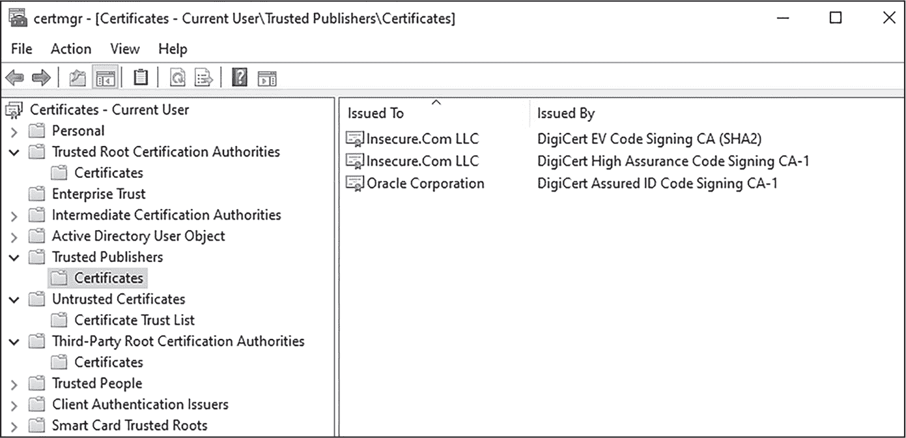

<samp class="SANS_Futura_Std_Book_Oblique_I_11">图 13-12：使用 certmgr 查看 Windows 中的信任存储</samp>

恶意软件作者可以通过几种方式使用受信证书对其代码进行数字签名。首先，如果攻击者渗透了受信任公司网络，它可以生成有效的证书并用这些证书签名自己的恶意软件，或者它可以窃取证书并用这些证书对其恶意代码进行数字签名。事实上，这种情况曾多次发生，例如 2022 年从 Nvidia 盗取代码签名证书时（请参见 Pieter Arntz 的文章《盗用 Nvidia 证书用于签名恶意软件——该如何应对》：[*https://<wbr>www<wbr>.malwarebytes<wbr>.com<wbr>/blog<wbr>/news<wbr>/2022<wbr>/03<wbr>/stolen<wbr>-nvidia<wbr>-certificates<wbr>-used<wbr>-to<wbr>-sign<wbr>-malware<wbr>-heres<wbr>-what<wbr>-to<wbr>-do*](https://www.malwarebytes.com/blog/news/2022/03/stolen-nvidia-certificates-used-to-sign-malware-heres-what-to-do))。代码签名证书有时甚至会在暗网出售！

其次，在某些情况下，可以将恶意代码插入到一个已经签名的可执行文件中，而不会使证书失效。这在 2016 年 Black Hat 大会上由研究人员展示（请参见 Deep Instinct 研究团队的报告《证书绕过：隐藏和执行来自数字签名可执行文件的恶意软件》：[*https://<wbr>www<wbr>.blackhat<wbr>.com<wbr>/us<wbr>-16<wbr>/briefings<wbr>/schedule<wbr>/#certificate<wbr>-bypass<wbr>-hiding<wbr>-and<wbr>-executing<wbr>-malware<wbr>-from<wbr>-a<wbr>-digitally<wbr>-signed<wbr>-executable<wbr>-3984*](https://www.blackhat.com/us-16/briefings/schedule/#certificate-bypass-hiding-and-executing-malware-from-a-digitally-signed-executable-3984))。

最后，恶意软件可以简单地将证书添加到操作系统的受信证书列表中。这说起来容易做起来难：恶意软件必须已经在具有高权限的主机上运行。但如果成功，恶意软件的作者可能能够在主机上运行他们希望运行的任何额外恶意软件。

#### <samp class="SANS_Futura_Std_Bold_Condensed_Oblique_I_11">滥用引擎限制</samp>

如前所述，反恶意软件（以及具有内建反恶意软件功能的 EDR 软件）面临着平衡高检测率与终端用户体验的艰巨任务。这意味着，首先，它必须在检测恶意代码时具有高成功率，同时还要限制误报。此外，反恶意软件的扫描和监控活动必须对终端用户透明。这些扫描不应影响用户体验到使系统无法使用或不稳定的程度。狡猾的恶意软件作者可以利用这些限制，采用各种技术，其中两个例子就是延迟执行和内存炸弹。

与一些恶意软件通过延迟执行来规避沙盒内的检测（如第八章所讨论的）类似，它可能也能够“延迟”反恶意软件扫描引擎的检测。它可能通过等待特定的毫秒数过去来实现这一点。例如，当 600,000 毫秒（即 10 分钟）过去后，样本执行其恶意代码。由于反恶意软件引擎可能对其仿真或沙盒引擎设置了时间限制（以防止反恶意软件引擎无休止地分析大文件并消耗宝贵的系统资源），这种技术有时能够让恶意软件未被检测到地悄然通过。

*内存炸弹*，这一术语由 Uriel Kosayev 和 Nir Yehoshua 在其著作《病毒防护绕过技术》（Packt，2021）中提出，指的是恶意软件在其进程地址空间内分配过大的内存区域。由于反恶意软件必须考虑系统资源的消耗（如 CPU、内存等），它可能仅快速扫描这块大内存区域，甚至完全忽略它，从而使恶意代码未被发现。请注意，这一技术对于沙盒环境也可能有效。

#### <samp class="SANS_Futura_Std_Bold_Condensed_Oblique_I_11">伪装成一个安全文件</samp>

*伪装*是恶意软件作者用来将恶意软件伪装成合法文件的技术。这一技术主要作为欺骗受害者的手段，而不是直接绕过终端防御。伪装有多种形式，包括以下几种：

**伪造文件名**

恶意软件作者仅仅将恶意文件命名为常见的系统文件或合法应用程序文件的名字（例如*explorer.exe*或*PowerPoint.exe*），或者稍微修改文件名（如*expl0rer.exe*）。恶意软件作者还可能将恶意文件的扩展名更改为更不起眼的类型，比如将*.exe*文件重命名为*.jpg*文件。

**伪造文件元数据**

恶意软件作者伪造恶意文件的元数据，例如使用“Microsoft”作为文件的发布者或公司名称。类似的技术还包括重用合法程序的图标。例如，恶意软件可能使用 Microsoft Word 的图标，使其恶意文件看起来像合法文件。

**执行社交工程攻击**

恶意软件作者通过欺骗用户执行恶意软件，例如，向目标用户发送一封带有名为*important_invoice.pdf*的恶意文件的电子邮件。类似的技巧是使用双扩展名。默认情况下，Windows 不显示文件扩展名，因此文件*financials.xls.exe*在 Windows 中会显示为 *financials.xls*。这可能会误导毫无戒心的人启动一个恶意的可执行文件。

尽管伪装是一种相对简单且成本低廉的技术，但它可以非常有效。特别是，ESET 的研究人员报告称，沙虫（Sandworm）威胁组织向乌克兰的受害者发送了伪装成 IDA Pro 反汇编工具组件和 ESET 自家安全软件的恶意软件（见 Kelly Jackson Higgins 文章《沙虫 APT 在追踪其痕迹时戏弄研究人员，目标锁定乌克兰》，网址为 [*https://www.darkreading.com/threat-intelligence/sandworm-apt-trolls-researchers-on-its-trail-while-it-targets-ukraine*](https://www.darkreading.com/threat-intelligence/sandworm-apt-trolls-researchers-on-its-trail-while-it-targets-ukraine)）。另一个显著的伪装案例是恶意软件模仿知名组织撰写的文档，如 2022 年 Proofpoint 报告的世界卫生组织发布的关于 COVID-19 的信息（见 Andrew Northern 等人的文章《Nerbian RAT 使用 COVID-19 主题，具备复杂的规避技术》，网址为 [*https://www.proofpoint.com/us/blog/threat-insight/nerbian-rat-using-covid-19-themes-features-sophisticated-evasion-techniques*](https://www.proofpoint.com/us/blog/threat-insight/nerbian-rat-using-covid-19-themes-features-sophisticated-evasion-techniques)）。

到目前为止，我们已经探讨了恶意软件如何通过积极篡改或被动绕过主机防御来规避它们。现在，让我们稍微转变一下思路，探讨权限提升及其如何被恶意软件用来执行那些可能会被终端防御检测并阻止的操作。

### <samp class="SANS_Futura_Std_Bold_B_11">用于防御规避的权限提升</samp>

*权限提升*，即获得比当前更高的权限级别，是一种强大的规避策略。在主机上获得高权限级别后，攻击者将拥有更多自由，能够执行绕过终端防御的进一步攻击。正如你所看到的，执行某些操作（如禁用反恶意软件或修改防火墙配置）需要高权限级别。虽然有很多方式可以提升权限，本节将重点介绍现代恶意软件中四种最常见的技巧：UAC 绕过、访问令牌伪装和操控、凭据重用和直接利用。

#### <samp class="SANS_Futura_Std_Bold_Condensed_Oblique_I_11">绕过用户帐户控制</samp>

*用户帐户控制（UAC）*是 Windows 中的一种保护控制，旨在防止未经授权的应用程序以高权限级别执行代码。当应用程序请求管理员访问权限时，系统中的管理员必须同意此请求（参见图 13-13）。

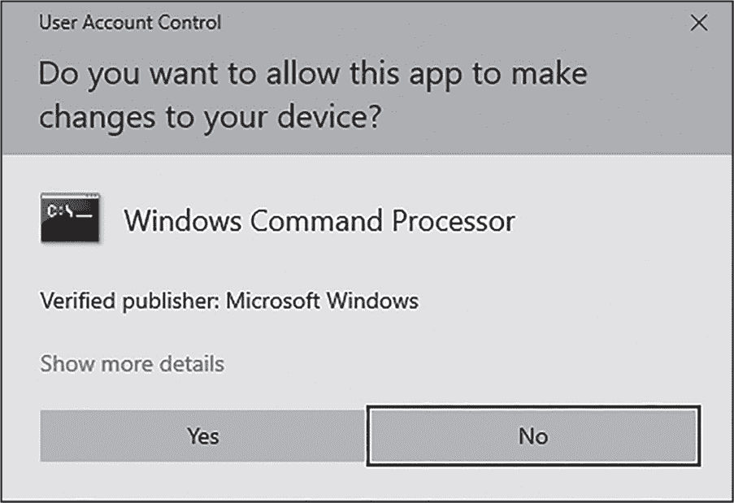

<samp class="SANS_Futura_Std_Book_Oblique_I_11">图 13-13：典型的 UAC 弹出窗口</samp>

当管理员同意时，应用程序的进程完整性级别会提高到“高”。最常见的完整性级别（高、中、低和系统）帮助决定一个进程能做什么以及不能做什么。高完整性进程在提升模式下运行，并可以访问分配给较低完整性级别的对象。中完整性进程以标准用户权限运行；这是大多数进程的默认设置。低完整性进程具有最低权限级别，通常用于诸如 Web 浏览器等应用程序，这些程序应出于安全原因在类似容器的环境中运行。系统完整性进程是对操作系统稳定性至关重要的进程；这些包括服务控制管理器（*services.exe*）和 Windows 子系统进程（*csrss.exe*）。按照设计，较低完整性级别的进程无法修改具有更高完整性级别进程中的数据。

图 13-14 显示了 Process Hacker 中的一个摘录，它方便地根据进程的提升和完整性级别对进程进行高亮显示。

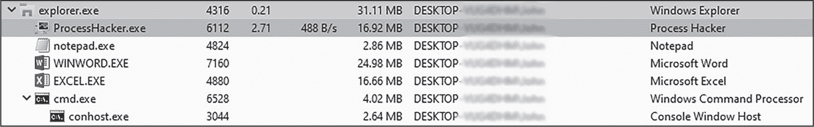

<samp class="SANS_Futura_Std_Book_Oblique_I_11">图 13-14：在 Process Hacker 中查看进程完整性</samp>

Process Hacker 本身（*ProcessHacker.exe*）以橙色（或本书中的深灰色）突出显示，表示它是提升过的并以高完整性模式运行。*Explorer.exe*以粉红色（中灰色）突出显示，标明它是一个系统进程。其他一些更为平凡的进程，如 Excel 和 Notepad，则以黄色（浅灰色）显示，表示它们是中等完整性进程，以标准用户权限运行。

UAC 旨在通过明确请求更高权限账户的许可来保护系统免受恶意权限提升的攻击。UAC 绕过攻击依赖于欺骗用户、应用程序或操作系统本身，使其在提升的上下文中执行潜在的危险操作。让我们通过一个简单的例子来看看 UAC 绕过是如何在实践中工作的。

一些内置的 Windows 工具被设计为以提升权限运行。其中一个工具是*msconfig.exe*，这是一个简单的 Windows 配置工具，允许系统管理员更改 Windows 启动选项、修改服务和启动任务等。通常，请求提升权限的应用程序会弹出 UAC 提示；默认情况下，即使是拥有管理员权限的用户也必须同意该提示。然而，如果从管理员账户执行，*msconfig.exe*会自动将自身提升为高完整性进程，而无需弹出 UAC 提示。此外，它还允许执行其他工具，这些工具也会在高完整性上下文中运行，同样不会出现 UAC 提示。不幸的是，*msconfig.exe*的这一行为可以被恶意利用，导致简单的 UAC 绕过。从*msconfig.exe*的工具菜单中，用户可以选择命令提示符工具并点击启动（参见图 13-15）。

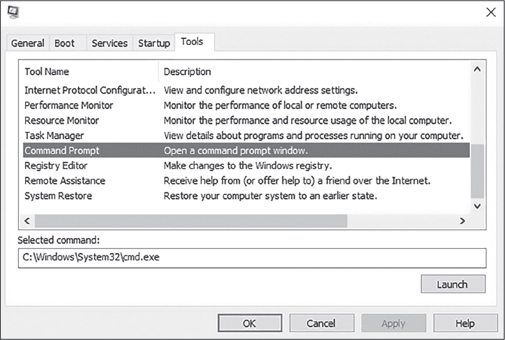

<samp class="SANS_Futura_Std_Book_Oblique_I_11">图 13-15：从</samp> <samp class="SANS_Futura_Std_Book_11">msconfig.exe</samp> <samp class="SANS_Futura_Std_Book_Oblique_I_11">启动命令提示符</samp>

接下来，将启动一个具有其父进程（*msconfig.exe*）完整性级别的新命令提示符，而不会提示 UAC 权限。图 13-16 显示了在 Process Hacker 中该新的*cmd.exe*进程。

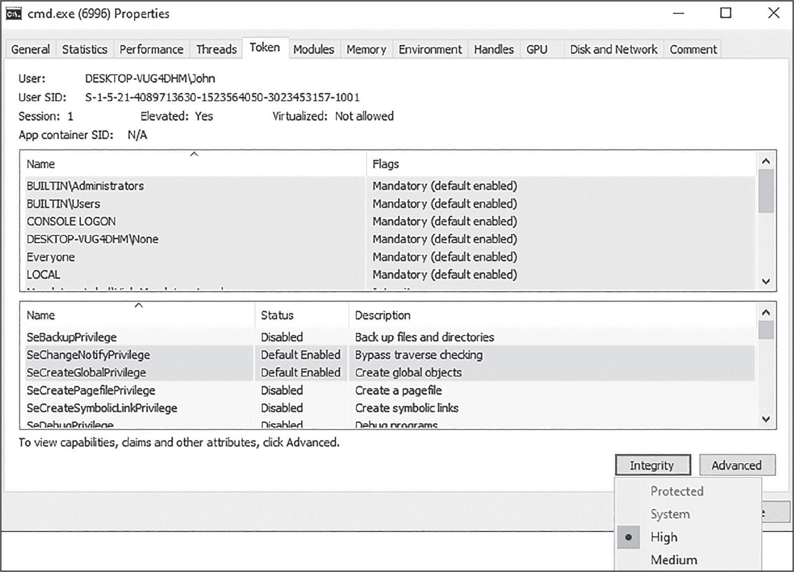

<samp class="SANS_Futura_Std_Book_Oblique_I_11">图 13-16：具有高完整性级别的</samp> <samp class="SANS_Futura_Std_Book_11">cmd.exe</samp> <samp class="SANS_Futura_Std_Book_Oblique_I_11">进程</samp>

请注意，该进程的权限已被提升（“Elevated: Yes”），且其完整性级别为高。用户通过执行必须在高完整性上下文中运行的进程（该进程在默认的 Windows 配置下不会提示 UAC 权限）来绕过了 UAC，并通过启动一个继承该进程高完整性级别的命令提示符。这个命令提示符现在以管理员身份运行，可以用来执行高权限命令。一个类似的真实案例来自恶意软件家族 Trickbot，它利用了*WSReset.exe* Windows 工具的自动提升特性；详情见 Arnold Osipov 的文章“Trickbot 木马利用新的 Windows 10 UAC 绕过”[在此阅读](https://blog.morphisec.com/trickbot-uses-a-new-windows-10-uac-bypass)。

这个特定的 UAC 绕过问题在于它需要访问系统的 GUI 界面，因此恶意软件必须经过多个步骤才能在不让受害者察觉的情况下执行这一攻击。然而，恶意软件作者已经发现了一些方法来绕过这一限制。

##### <samp class="SANS_Futura_Std_Bold_Condensed_B_11">DLL 劫持</samp>

在第十二章中，您学到了恶意软件如何利用合法应用中的劫持漏洞来注入恶意 DLL 并隐秘地执行代码。这种攻击方式也是绕过 UAC 的有效手段。回顾之前使用的 *msconfig.exe* 示例，如果它成为 DLL 劫持的受害者，并允许恶意 DLL 替换合法 DLL 加载，那么该恶意 DLL 就可以在高权限的 *msconfig.exe* 应用程序上下文中执行。任何 UAC 弹窗将以 *msconfig.exe* 的名义出现，可能会欺骗用户同意并允许恶意代码以比正常情况下更高的权限级别运行。

在 2016 年 Fox-IT 和 NCC Group 发布的报告《Mofang：一场政治动机的信息窃取对抗者》（您可以在 [*https://<wbr>blog<wbr>.fox<wbr>-it<wbr>.com<wbr>/2016<wbr>/06<wbr>/15<wbr>/mofang<wbr>-a<wbr>-politically<wbr>-motivated<wbr>-information<wbr>-stealing<wbr>-adversary<wbr>/*](https://blog.fox-it.com/2016/06/15/mofang-a-politically-motivated-information-stealing-adversary/) 下载）中，研究人员突出展示了 Mofang 威胁组的这种攻击，该组滥用了合法的 *migwiz.exe* Windows 应用程序来加载一个名为 *cryptbase.dll* 的 DLL。这个 DLL 被攻击者劫持，导致 *migwiz.exe*（默认以提升状态运行）加载了恶意版本的 *cryptbase.dll*，有效地绕过了某些 UAC 控制。

##### <samp class="SANS_Futura_Std_Bold_Condensed_B_11">COM 滥用</samp>

*组件对象模型 (COM)* 是 Windows API 的一部分，允许进程间通信。COM 的基本构建块是 *COM 对象*，它由数据和控制访问的函数组成，这些函数被称为 *接口*。COM 对象服务器向 COM 客户端暴露接口，客户端通过这些接口访问 COM 服务器。COM 服务器对象通常是 *.dll* 或 *.exe* 文件。每个 COM 服务器对象都有一个唯一的 ID，称为类 ID (CLSID)，它是一个 128 位的字符串，形式是由一系列数字和字符组成。这些字符串通常显示在括号中，例如：<samp class="SANS_TheSansMonoCd_W5Regular_11">{4E5FC2F8-8C44-6776-0912-CB15617EBC13}</samp>。这一点稍后会很重要。

许多 COM 对象都有一个名为 <samp class="SANS_TheSansMonoCd_W5Regular_11">COMAutoApproval</samp> 的属性，表示该 COM 对象不需要用户明确允许与对象相关的权限提升功能。在 Windows 系统中，您可以在注册表项 *HKEY_LOCAL_MACHINE\SOFTWARE\Microsoft\Windows NT\CurrentVersion\UAC\COMAutoApprovalList* 中查看具有此属性的 COM 对象列表。图 13-17 显示了我系统上的这个列表。

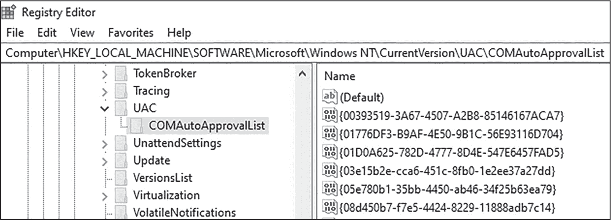

<samp class="SANS_Futura_Std_Book_Oblique_I_11">图 13-17：启用 COMAutoApproval 的情况下查看 COM 对象</samp>

在典型的 Windows 10 系统中，这个列表中有超过 100 个对象！正如你可以想象的那样，其中一些对象可能会被恶意软件滥用，以绕过 UAC。例如，一些 COM 对象接口包含可以执行任意代码的函数。例如，一个 COM 接口可能暴露一个名为<samp class="SANS_TheSansMonoCd_W5Regular_11">ExecuteCommand</samp>的函数，该函数接受任意命令作为输入。以下伪代码展示了这一点：

```
command = "cmd.exe copy malware.exe C:\System32\malware.exe"
CoInitialize(NULL);
comObj = CoCreateInstance (CLSID_VulnerableComObject, ..., ...,
IID_VulnerableComObject, &pMethod);
pMethod->ExecuteCommand(command);
```

该恶意软件初始化 COM（<samp class="SANS_TheSansMonoCd_W5Regular_11">CoInitialize</samp>），并创建 COM 对象<samp class="SANS_TheSansMonoCd_W5Regular_11">VulnerableComObject</samp>的 COM 实例（<samp class="SANS_TheSansMonoCd_W5Regular_11">CoCreateInstance</samp>）。一旦 COM 对象初始化，恶意软件就会调用脆弱的<samp class="SANS_TheSansMonoCd_W5Regular_11">ExecuteCommand</samp>方法（该方法通过 COM 对象暴露并导出），并将<samp class="SANS_TheSansMonoCd_W5Regular_11">command</samp>作为参数传入。由于 COM 对象以高权限运行，随后的命令也将以高权限执行。这个特定的命令将恶意软件可执行文件复制到*System32*目录，这个操作通常会显示 UAC 提示。

这是该技术的简化版，但类似的技术已经在现实攻击中被使用过。一个经过深入研究的项目 UACME 详细介绍了该技术的变种及更多内容，网址是[*https://<wbr>github<wbr>.com<wbr>/hfiref0x<wbr>/UACME*](https://github.com/hfiref0x/UACME)。

##### <samp class="SANS_Futura_Std_Bold_Condensed_B_11">注册表篡改</samp>

尽管修改注册表通常需要对受害者系统拥有高权限，但恶意软件可以利用注册表绕过 UAC 提示本身。考虑一种情境，攻击者控制了受感染的主机并能够执行命令，但没有图形界面。攻击者可能仍然需要点击 UAC 提示才能执行某些操作，而没有图形界面的情况下，这会造成问题。

在这种情况下，恶意软件可以尝试修改注册表项*HKEY_LOCAL_MACHINE\Software\Microsoft\Windows\CurrentVersion\Policies\System\EnableLUA*，将其从默认值<samp class="SANS_TheSansMonoCd_W5Regular_11">1</samp>修改为<samp class="SANS_TheSansMonoCd_W5Regular_11">0</samp>，这将有效地禁用主机上的 UAC 提示。将键值*HKEY_LOCAL_MACHINE\Software\Microsoft\Windows\CurrentVersion\Policies\System\ConsentPromptBehaviorAdmin*设置为<samp class="SANS_TheSansMonoCd_W5Regular_11">0</samp>，也将禁用管理员操作的 UAC 提示。

请注意，机器可能需要重新启动才能使这些更改生效，这可能对攻击者造成问题并引起不必要的关注。

#### <samp class="SANS_Futura_Std_Bold_Condensed_Oblique_I_11">模拟和操控访问令牌</samp>

系统上运行的每个进程都有一个从其父进程继承的访问令牌，而父进程的访问令牌又是从启动它的用户帐户继承的。这个用户帐户访问令牌代表了用户帐户的权利和权限。进程访问令牌可以分配不同的权限：例如，<samp class="SANS_TheSansMonoCd_W5Regular_11">SeBackupPrivilege</samp> 赋予用户或进程备份文件和目录的能力；<samp class="SANS_TheSansMonoCd_W5Regular_11">SeLoadDriverPrivilege</samp> 赋予进程加载内核驱动程序的能力；而 <samp class="SANS_TheSansMonoCd_W5Regular_11">SeShutdownPrivilege</samp> 允许进程关闭系统。

为了获得额外的权限，恶意软件可以复制另一个进程的令牌，这种技术通常被称为 *令牌窃取* 或 *令牌冒充*。恶意软件调用 <samp class="SANS_TheSansMonoCd_W5Regular_11">DuplicateToken</samp> 或 <samp class="SANS_TheSansMonoCd_W5Regular_11">DuplicateTokenEx</samp> 来创建一个从另一个进程分配来的令牌副本，然后调用 <samp class="SANS_TheSansMonoCd_W5Regular_11">ImpersonateLoggedOnUser</samp>，将复制的令牌作为参数传递。这将把原始令牌的权限赋给恶意软件。恶意软件还可以调用 <samp class="SANS_TheSansMonoCd_W5Regular_11">CreateProcessWithToken</samp> 来生成一个全新的进程，并赋予它复制令牌的权限。

> <samp class="SANS_Dogma_OT_Bold_B_15">注意</samp>
> 
> *或者，恶意软件可以操控其自身的令牌并赋予它新的权限。恶意软件可能试图获得的一个重要权限是 <samp class="SANS_TheSansMonoCd_W5Regular_Italic_I_11">SeDebugPrivilege</samp>，该权限允许进程检查和操控其他用户帐户拥有的进程，包括系统帐户。如果一个低权限进程被允许操控系统进程，它可能会在这些进程的上下文中注入并执行代码，从而完全绕过 UAC 控制，或者至少通过 UAC 欺骗用户允许提升的操作。*

为了获得 <samp class="SANS_TheSansMonoCd_W5Regular_11">SeDebugPrivilege</samp> 权限，恶意软件调用 <samp class="SANS_TheSansMonoCd_W5Regular_11">OpenProcessToken</samp> 函数来打开其进程的访问令牌，然后调用 <samp class="SANS_TheSansMonoCd_W5Regular_11">AdjustTokenPrivileges</samp>，将 <samp class="SANS_TheSansMonoCd_W5Regular_11">SeDebugPrivilege</samp> 作为参数传递。然而，仅仅因为一个进程请求了这个特权并不意味着操作系统会授予它。只有之前已经提升权限的进程才能请求并被授予该权限，因此恶意软件必须已经在提升状态下运行。恶意软件通常会使用本章前面提到的 UAC 绕过技术之一来提升自己的权限，然后授予自己 <samp class="SANS_TheSansMonoCd_W5Regular_11">SeDebugPrivilege</samp>，以进一步访问其他系统进程。

#### <samp class="SANS_Futura_Std_Bold_Condensed_Oblique_I_11">提取并重用凭证</samp>

定位和提取账户凭证可以是一种强有力的特权提升方法。例如，如果恶意软件能够找到管理员的凭证，它可能会重新使用这些凭证创建一个具有提升权限的进程，甚至可以横向移动到网络中的其他主机并在这些系统上获得提升的权限。恶意软件有许多方法可以做到这一点。

提取凭证的一种方法是检查 *本地安全授权子系统服务（LSASS）* 进程的内存，该进程负责安全策略和身份验证。从本质上讲，它的进程 (*lsass.exe*) 在其内存地址空间中包含敏感数据——即登录凭证和安全令牌。在现代版本的 Windows 中，这些敏感数据会被混淆（例如，通过哈希处理），但在特殊情况下，数据可能是明文的。通过检查 *lsass.exe* 的进程内存，恶意软件可能能够定位并提取特权凭证和令牌，然后尝试重用它们来提升自身权限。

有一些工具可以自动化这个过程。一个众所周知的例子是 Mimikatz（[*https://<wbr>github<wbr>.com<wbr>/gentilkiwi<wbr>/mimikatz*](https://github.com/gentilkiwi/mimikatz)），它可以从受害系统的内存中提取凭证（以及其他敏感数据）。尽管 Mimikatz 自 2011 年就已存在，但它仍然在积极更新，并且常常在真实世界的攻击中使用。一些攻击框架，如 Cobalt Strike，甚至内置了像 Mimikatz 这样的工具。

另一种提取凭证的方法是 *键盘记录*，即通过捕获受害者的按键来获得各种账户和服务的登录凭证。键盘记录通常通过不同形式的钩子实现，如 第十二章所述。

#### <samp class="SANS_Futura_Std_Bold_Condensed_Oblique_I_11">利用漏洞提升特权</samp>

最后，一些恶意软件可能会尝试利用漏洞来提升其权限。*本地权限提升*（*LPE*）漏洞允许恶意软件在已获得低权限访问的系统上提升其权限，这在威胁行为者中尤其受欢迎。一个较为近期的典型漏洞是 CVE-2021-36934（见 [*https://<wbr>cve<wbr>.mitre<wbr>.org*](https://cve.mitre.org)），被称为“HiveNightmare”，该漏洞影响了 Windows 10 及某些版本的 Windows 11。HiveNightmare 利用了某些 Windows 目录中的访问控制问题。在这些目录内，存储着包含敏感数据的注册表配置单元，如存储的凭据，这些数据通常是非特权用户无法访问的。然而，通过利用这个漏洞，攻击者可以访问 Windows *卷影复制服务（VSS）*中的这些敏感数据的备份，VSS 是一个 Windows 备份机制，用于存储文件和其他数据的副本。在受影响版本的 Windows 中，攻击者可以制作一个特定的有效载荷，利用该访问控制缺陷，使攻击者能够访问解锁的敏感注册表配置单元数据副本，并利用存储的凭据提升其在系统上的权限。

图 13-18 展示了这个漏洞攻击的实例。（漏洞代码可以在 [*https://<wbr>github<wbr>.com<wbr>/GossiTheDog<wbr>/HiveNightmare<wbr>*](https://github.com/GossiTheDog/HiveNightmare) 获取。）

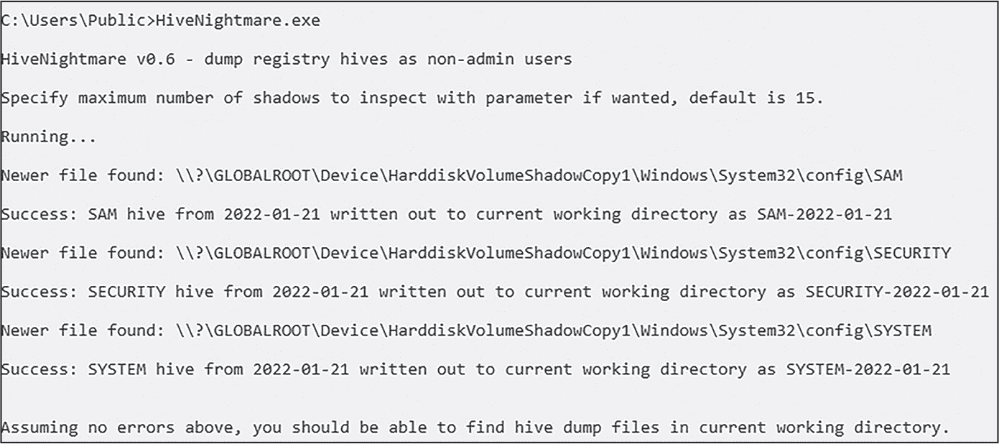

<samp class="SANS_Futura_Std_Book_Oblique_I_11">图 13-18：HiveNightmare 漏洞攻击实例</samp>

这个漏洞代码将提取的注册表配置单元文件转储到当前工作目录。通过快速列出目录内容，可以看到漏洞攻击已经成功（见 图 13-19）。

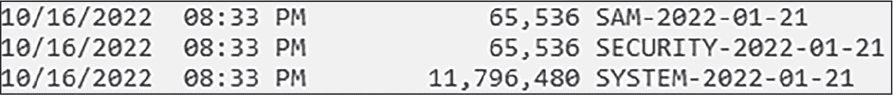

<samp class="SANS_Futura_Std_Book_Oblique_I_11">图 13-19：HiveNightmare 漏洞攻击成功！</samp>

这个攻击从捕获的截图来看可能并不起眼，但它非常强大。作为一个非特权用户，我能够直接从 VSS 中提取敏感的注册表配置单元，这些配置单元通常对我不可用；如果我愿意，我还可以查询它们，提取存储的凭据，然后利用这些凭据在更高权限级别执行代码。这只是一个漏洞的例子（也是一个凭据提取的好例子），但过去五年里，已经发布了许多特权提升漏洞；其中一些漏洞引起了广泛关注，还有一些正被恶意软件在实际环境中滥用。不幸的是，可能还有更多类似的漏洞目前尚未为公众所知。

现在，我们已经看过了一些恶意软件可能绕过终端防御的方法，让我们将注意力转向它如何绕过网络防御控制。

### <samp class="SANS_Futura_Std_Bold_B_11">绕过网络防御</samp>

*网络控制*是恶意软件必须绕过的另一个防御层，才能成功实现其目的。绕过网络防御依赖于你在前几章中已经见过的许多战术。例如，恶意软件可以利用加密等混淆技术来掩盖其 C2 流量。它还可以利用沙箱规避技术，绕过依赖沙箱化可疑文件的网络防御。在本节中，我将重点介绍书中尚未涵盖的绕过技术。不过，在我们开始之前，我会简要介绍一些可用的各种网络防御措施。

#### <samp class="SANS_Futura_Std_Bold_Condensed_Oblique_I_11">引入现代网络防御</samp>

与主机防御类似，网络防御市场充斥着各种产品名称和缩写。从根本上说，现代网络防御只有几种不同的类型。我将在本章重点介绍 NIDS、NDR 和电子邮件保护：

**网络入侵检测系统（NIDS）**

这些产品监控进出站的网络流量，寻找恶意活动的迹象。与反恶意软件类似，NIDS 可以是基于签名的、基于异常的，或两者的结合。基于签名的 NIDS 技术会在网络流量中搜索可疑的签名模式，例如数据、代码或字符串的序列。基于异常的技术则更多地关注网络流量的行为模式，并可能利用机器学习技术。NIDS 也可以是*入侵预防系统（IPS）*，不仅能检测攻击，还能响应并阻止攻击。NIDS 和 IPS 通常包含在现代实施的传统网络防御中，如防火墙。

**网络检测与响应（NDR）**

这是网络版的 EDR。NDR 比 NIDS 更现代，是在某些方面试图取代 NIDS 的解决方案。NDR 通过实时的网络流量分析来识别潜在攻击，检测通过网络传播的威胁（例如恶意软件），并能因可疑行为而触发警报。NDR 与基于主机的 EDR 的遥测数据可以结合，形成扩展检测与响应（XDR），使分析人员和调查员能够跨网络和端点层追踪攻击。

**电子邮件保护技术**

这些解决方案正在变得越来越广泛使用和必要，它们位于组织的电子邮件网关，监控和检查进出站的电子邮件流量。这是一个至关重要的控制措施，因为许多进入的电子邮件都携带恶意附件或 URL。电子邮件保护套件扫描并沙箱化进站（有时也包括出站）邮件，然后对恶意邮件发出警报（或直接删除）。由于这项技术部分依赖于沙箱化，它可能会受到之前讨论的反沙箱技术的阻碍。

现在，我们将开始探讨恶意软件可能尝试绕过这些控制措施的方式。

#### <samp class="SANS_Futura_Std_Bold_Condensed_Oblique_I_11">混淆和掩盖网络流量</samp>

为了绕过 NIDS 和 NDR，现代恶意软件必须采用混淆或加密技术来掩盖其网络流量。有些恶意软件可能会尝试在下载附加负载或模块时，通过使用加密网络协议（如 HTTPS、安全文件传输协议（SFTP）或安全外壳（SSH））来隐藏自己免受网络防御的监控。恶意软件甚至已经被发现利用加密的监控保护软件 Tor 来掩盖其网络活动。恶意软件家族 Bashlite（也称为 Gafgyt）在与其 C2 基础设施通信时曾使用过这种技术。请记住，使用 Tor 和其他不常用协议和服务的行为本身就可能成为恶意活动的迹象。尽管这种技术可能确实可以阻止网络防御和调查人员检查可疑的流量，但这并不意味着恶意软件会完全不被发现。

这种策略的另一个例子是*DNS 隧道*，它利用域名系统（DNS）协议来隐藏流量，比如文件下载、数据从网络中泄漏或 C2 通信。由于 DNS 是互联网运行的基础协议，DNS 隧道可能完全不会被网络监控和防御发现。图 13-20 展示了 DNS 隧道的表现形式。


<samp class="SANS_Futura_Std_Book_Oblique_I_11">图 13-20：DNS 隧道</samp>

我们从感染的主机开始，这台主机上隐藏着一个远程访问木马（RAT）。这个 RAT 与其 C2 服务器（*evil.com*）进行通信，并需要通过 DNS 隧道接收特定的指令。它向其 C2 服务器（*36128.evil.com*）发送一个 DNS 查询。*36128*子域是一个随机生成的数字字符串。接下来，DNS 请求被发送到一个递归 DNS 服务器，这是一个提供 DNS 请求服务的本地服务器。这个递归 DNS 服务器可能是一个互联网服务提供商（适用于家庭用户和小型企业），或者是感染主机所在组织内部的服务器。

递归 DNS 服务器随后会联系一个*权威 DNS 服务器*，它是域名的权威源。当一个新网站从托管服务商处获得时，提供商会作为该域名的权威 DNS 服务器。或者，任何人都可以为他们购买的域名建立自己的权威 DNS 服务器。在这种情况下，感染主机上的 RAT 最终联系的是*evil.com*域名的权威 DNS 服务器，而恶意软件作者拥有该域名的权威 DNS 服务器。

一旦 C2 服务器收到 DNS 请求，它会向发送者返回响应。然而，在这种情况下，响应中包含了一个编码的命令——简单字符串<samp class="SANS_TheSansMonoCd_W5Regular_11">execute</samp>。这个命令可以通过简单的算法（如 Base64 编码）或甚至加密进行混淆，可以隐藏在 DNS 响应中的某个记录里。常被滥用进行 DNS 隧道的记录类型包括 TXT、CNAME、资源记录（RR）和 NULL 记录。（这些超出了本书的范围，不会进一步讨论。）

一旦感染的主机接收到 DNS 响应，RAT 解码嵌入的字符串并处理命令<samp class="SANS_TheSansMonoCd_W5Regular_11">execute</samp>。可以推测，这意味着 RAT 将执行一个恶意命令。DNS 默认情况下是不加密的，但由于它的广泛使用，而且可能难以完全监控，这种类型的攻击可能会避开网络防御系统。

恶意软件还已知使用自定义的 C2 框架，采用新颖的网络通信方式。这些框架可能利用公开访问的服务，如 GitHub、Pastebin、Telegram，甚至 X，来隐藏流量和命令。这些流量不仅通常是加密的，而且由于看起来正常，可能完全未被察觉。一个例子是，ESET 的研究人员发现威胁组织 Turla 滥用了布兰妮·斯皮尔斯的 Instagram 账户来隐藏其 C2 服务器（参见文章“Carbon Paper: Peering into Turla’s Second Stage Backdoor”在[*https://<wbr>www<wbr>.welivesecurity<wbr>.com<wbr>/2017<wbr>/03<wbr>/30<wbr>/carbon<wbr>-paper<wbr>-peering<wbr>-turlas<wbr>-second<wbr>-stage<wbr>-backdoor<wbr>/*](https://www.welivesecurity.com/2017/03/30/carbon-paper-peering-turlas-second-stage-backdoor/)）。Turla 组织将编码文本粘贴到斯皮尔斯的 Instagram 页面上，这些文本代表了一个包含其 C2 服务器地址的 URL。之前被 Turla 组织感染的系统中的恶意软件会监控她的 Instagram 个人资料，寻找这些特定的模式来获取 C2 服务器的地址信息。然后，恶意软件解码该地址，并用它来从攻击者的基础设施中获取更多命令。

攻击者也可能将其恶意软件载荷托管在知名的文件共享网站上，如 Google Drive 和 Dropbox。由于这些服务广泛用于合法目的，恶意软件从 Google Drive 等站点下载载荷或附加模块时，可能对普通观察者和网络防御系统看起来完全正常。

#### <samp class="SANS_Futura_Std_Bold_Condensed_Oblique_I_11">通过地理围栏隐藏基础设施</samp>

*地理围栏*（Geofencing）指的是利用地理位置作为确定恶意软件行为的因素。实际上，恶意软件被设计为仅在目标主机位于特定地理边界内时才执行其有效负载，例如某个特定国家。地理围栏还可以用于阻止和防止恶意软件扫描引擎和分析人员识别和调查恶意服务器。例如，在电子邮件保护解决方案中，当恶意附件在沙箱中被引爆时，沙箱可能会识别出恶意软件正在尝试与互联网上的未知域名进行通信。沙箱随后可能会尝试“扫描”或探测该服务器，以试图识别其真实性质，并将其分类为合法或恶意。

恶意服务器可以使用地理围栏技术来防止这种行为。通过查询系统或调查员探测其基础设施的位置，服务器可以将自己隐藏起来，避免被不请自来的访客发现。例如，一位位于中国的恶意软件作者可能专门针对德国的受害者。任何不是来自德国 IP 地址的流量都可以被阻止，从而防止没有德国 IP 地址的自动扫描引擎或调查人员进一步检查它。或者，服务器甚至可以向非德国 IP 地址的系统显示误导性信息。例如，来自非德国 IP 的任何流量可能会被重定向到一个完全不同的、无害的网站。类似的技术被 Proofpoint 的研究人员发现，他们揭示了威胁团体 TA547 利用地理围栏技术仅向特定目标提供恶意软件有效负载（请参见文章“第一步：初步访问导致勒索软件” [*https://www.proofpoint.com/us/blog/threat-insight/first-step-initial-access-leads-ransomware*](https://www.proofpoint.com/us/blog/threat-insight/first-step-initial-access-leads-ransomware)）。有效负载被托管在服务器上，只有来自特定国家的受害者才能访问并下载恶意软件有效负载。

#### <samp class="SANS_Futura_Std_Bold_Condensed_Oblique_I_11">使用 DGA 生成新基础设施</samp>

恶意软件作者面临的一个主要问题是，一旦 C2 服务器被沙箱、调查员或防御软件识别出来，它就会被“烧掉”，意味着它很快会被大多数安全产品列入黑名单。这使得与该服务器通信的恶意软件变得无效。

恶意软件可以通过动态生成新的 C2 服务器地址来绕过这个问题，这一过程使用*域名生成算法（DGA）*，该算法包含客户端和服务器端组件。在这个例子中，恶意软件（客户端）使用内嵌的 DGA 代码生成新的域名。恶意软件的 C2 服务器使用相同的算法生成与恶意软件客户端生成的域名相同的新域名。DGA 的工作原理是，客户端和服务器端的算法都生成可预测的域名。该算法必须确保客户端和服务器端生成相同的域名，但同时必须足够不可预测，以至于安全研究人员和分析工具无法猜测将生成的下一个域名。

图 13-21 展示了恶意软件如何使用 DGA。

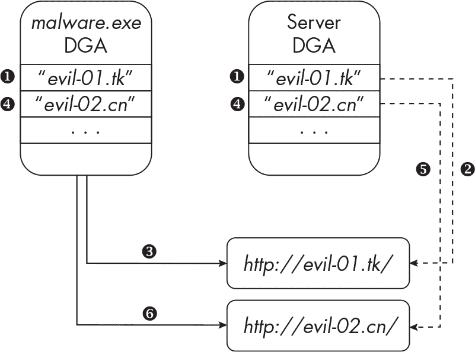

<samp class="SANS_Futura_Std_Book_Oblique_I_11">图 13-21：DGA 的工作原理</samp>

恶意软件首先通过其可执行文件中嵌入的 DGA 代码生成一个新的域名。执行算法后，恶意软件生成域名*evil-01.tk*，在恶意软件的 C2 基础设施上，同样的算法运行并生成相同的*evil-01.tk* ❶。然后，恶意软件作者配置一个新服务器，使用地址*evil-01.tk* ❷。接着，恶意软件使用这个现在已上线的域名连接到 C2 服务器 ❸。

在预定的时间段后，例如八小时，恶意软件会生成一个新的域名，*evil-02.cn* ❹。接着，服务器生成相同的域名，并进行配置 ❺。最后，恶意软件连接到该域名 ❻。此时，第一个服务器（*evil-01.tk*）可能已经下线。这个循环会不断重复，直到算法用尽可用的域名。这种强大的 DGA 技术使得恶意软件作者可以生成数百或数千个新的域名作为 C2 服务器，使得安全产品和调查人员在识别并将这些域名加入黑名单时，像玩“打地鼠”一样充满挑战。

#### <samp class="SANS_Futura_Std_Bold_Condensed_Oblique_I_11">执行快速变换技术</samp>

*快速变换*是一种主要由*僵尸网络*使用的规避技术，僵尸网络是由攻击者控制的感染系统网络。当受害者被某种特定的恶意软件变种感染时，感染的主机（即*机器人*）会被加入到僵尸网络中。攻击者利用僵尸网络进行各种目的，例如发送垃圾邮件、进行钓鱼和*分布式拒绝服务（DDoS）*攻击，以及实施各种类型的欺诈行为。快速变换技术使得攻击者能够利用其机器人作为代理，隐藏和保护 C2 服务器及其他基础设施。

为了执行这一技术，威胁行为者购买一个域名，然后迅速更改与该域名关联的 IP 地址，这样每次受害者访问时，他们会被引导到不同的托管 IP 地址。IP 地址的快速变化是采用*轮询*方式配置的，这是一种平衡客户端请求到 Web 服务器的合法技术。通过将 IP 地址的生存时间（TTL）值缩短到几分钟甚至更少，威胁行为者创造了一个更加难以捉摸的基础设施，使得网络防御更难识别和阻止恶意流量，也使得执法机构和其他调查人员更难识别其完整的基础设施。图 13-22 展示了快速变换技术在实践中的表现。

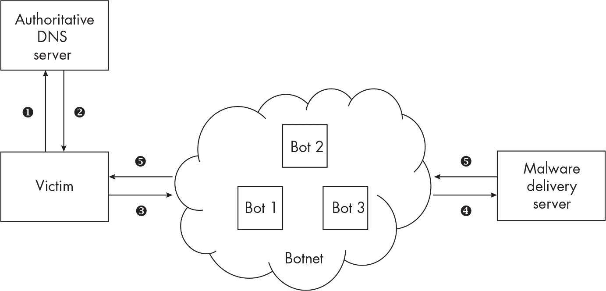

<samp class="SANS_Futura_Std_Book_Oblique_I_11">图 13-22：在僵尸网络中实施的快速变换技术</samp>

首先，受害者在其计算机上执行恶意软件，恶意软件想要与威胁行为者的域名 *evil.com* 建立 HTTP 连接。然而，在此之前，*evil.com* 必须解析为一个 IP 地址。受害者发起一个 DNS 请求 ❶，*evil.com* 被解析（通过恶意软件作者控制的权威 DNS 服务器）为 IP 地址 59.111.180.193 ❷。接下来，恶意软件向 IP 地址 59.111.180.193 发起 HTTP 请求 ❸，该地址属于一个僵尸网络并分配给 Bot 1。作为代理，Bot 1 将 HTTP 请求重定向到威胁行为者的恶意软件传输服务器 ❹，该服务器随后向受害者发送恶意软件负载 ❺。

几分钟后，一个新的受害者（感染了相同的恶意软件）像第一个受害者一样，向 *evil.com* 发起 DNS 和 HTTP 请求。然而，这一次，DNS 服务器返回了 97.66.36.178 作为 IP 地址（因为威胁行为者已经更改了该域名关联的 IP 地址）。这个 IP 映射到 Bot 2，Bot 2 同样充当代理，将 HTTP 请求重定向到恶意软件临时服务器，并向第二个受害者发送负载。由于 IP 地址变化非常频繁并且分布在僵尸网络中（这可能是由成千上万的系统组成的蜘蛛网），因此很难追踪攻击者的基础设施，以便识别僵尸网络中的其他系统以及攻击者的恶意软件分发和 C2 服务器。

快速变换不仅仅用于僵尸网络；它还被*防御力强的主机商（BPHs）*使用，这些是专门为不太讲究的网络活动（如在线赌博和垃圾邮件）或非法活动（如有组织犯罪）提供服务的 Web 主机提供商。通常，BPHs 位于那些这类活动不受到严格审查的国家（因此不会被注意到或被容忍），并且执法机构的恶意基础设施删除请求不被接受。BPHs 可能为网络犯罪团伙和其他人提供快速变换服务。

还有一种相关技术，叫做*双重快速变更*，不仅恶意域名的 IP 地址会迅速变化，攻击者的授权 DNS 服务器的 IP 地址也会发生变化。这为研究人员和网络防御增加了额外的防护层和复杂性。

我们在本章中讨论的技术很少能够单独有效。现代基于恶意软件的攻击通常会结合多种技术来渗透目标，接下来你将看到这一点。

### <samp class="SANS_Futura_Std_Bold_B_11">多阶段和复杂攻击</samp>

如本章前面提到的，一些现代防御措施，如 EDR，使用威胁评分系统或其他分析技术来识别可疑行为。在恶意软件的早期阶段，恶意软件通常以单个恶意文件的形式交付。这个文件包含了感染受害者所需的所有功能，并执行恶意软件作者计划的进一步动作。然而，要成功绕过现代的端点和网络防御，恶意软件作者必须采取更复杂的多阶段方法。精心设计的多步骤复杂攻击链使防御更难识别正在发生的事情并采取适当的行动。图 13-23 展示了这样的攻击。

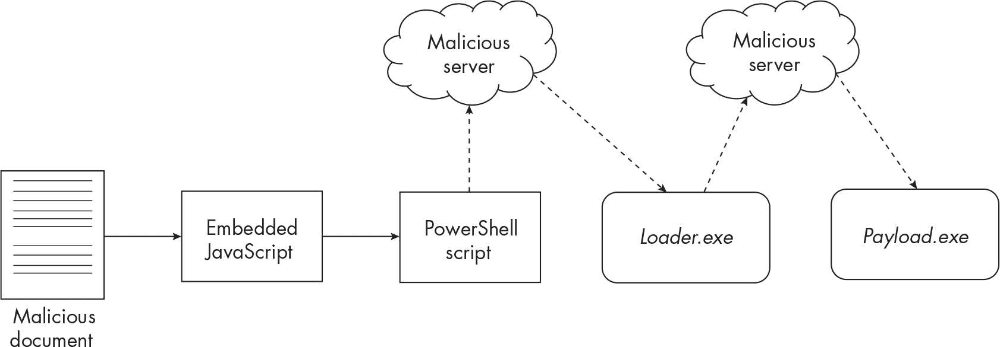

<samp class="SANS_Futura_Std_Book_Oblique_I_11">图 13-23：复杂的多阶段攻击</samp>

首先，恶意软件作者将恶意文档文件交给受害者。一旦打开，文件执行嵌入的 JavaScript 代码，进而执行混淆的 PowerShell 代码。PowerShell 代码联系攻击者的恶意软件暂存服务器下载一个加载程序（*Loader.exe*），该程序负责联系另一个远程服务器下载恶意软件负载（*Payload.exe*）。

跟踪这些分散的事件对于防御来说更具挑战性。EDR 的事件追踪引擎和分析器必须评估来自多个来源的许多不同事件，而不是仅评估单个可执行文件的行为，才能判断这是否是恶意活动。为了进一步复杂化这个攻击，恶意软件作者可能会通过*睡眠例程*来增加难度。例如，PowerShell 命令可能在下载加载程序可执行文件之前等待两个小时，加载程序可能在下载负载文件之前等待四小时，然后负载文件可能在联系 C2 服务器之前等待另一个八小时。事件追踪引擎必须考虑事件之间多个小时的时间差异。

然而，从攻击者的角度来看，这些多阶段攻击存在一个缺点：如果攻击的任何一个阶段失败，整个攻击链就会失败。例如，如果反恶意软件能够检测并隔离最初的恶意 Office 文档，那么攻击链的其余部分将会失败。如果网络防御能够识别并阻止与攻击者的恶意软件部署服务器的连接，也会发生同样的情况。然而，这是恶意软件作者必须冒的风险。

### <samp class="SANS_Futura_Std_Bold_B_11">总结</samp>

本章讨论了恶意软件常用的多种技术，如何主动和被动地绕过主机防御控制，例如反恶意软件和 EDR，以及基于网络的控制，如 NIDS。我们详细分析了恶意软件如何枚举受害主机以识别主机防御，并如何主动破坏这些防御。我们还介绍了恶意软件如何提升其权限，使其能更隐秘地绕过防御。在下一章中，你将学习关于 Rootkit 的内容，这是一种低级别的恶意软件，它使用的技术可能被视为防御规避的终极形式。
