## 14 ROOTKIT 介绍


*Rootkit* 是一种恶意软件变种，通过首先获得受害系统的低级访问权限，专门隐藏自己在主机上的存在。*Rootkit* 这个名称源自 Unix 系统，其中 *root* 用户拥有系统允许的最高权限。Rootkit 使用多种规避方法，例如拦截和修改内核与用户空间之间的通信，直接篡改内核内存中的数据结构，以躲避终端防御和调查工具。

本章提供了基于内核的 rootkit 及其规避防御和操控系统的一些技术的简介。虽然本章不是 rootkit 或 rootkit 分析的详尽资源，但它涵盖了在调查低级恶意软件时需要警惕的一些战术。

### Rootkit 基础

恶意软件作者使用 rootkit 组件的原因有很多：

**持久性和生存能力**

由于 rootkit 存在于内核空间并具有低级系统访问权限，它们在重启后以及在强大的、防御良好的环境中依然能保持存在。Bootkit 是一种更先进的 rootkit 形式，稍后我们将在本章讨论，它驻留在固件层，因此具有更强的持久性。

**防御规避**

一些 rootkit 会积极篡改并盲目绕过终端防御措施，例如 EDR 和反恶意软件。这类 rootkit 还可以通过重定向函数调用等方式，隐藏和保护其文件和进程，避免调查人员发现。

**对设备和驱动程序的低级访问**

一些 rootkit 拦截与内核驱动程序和硬件之间的请求和命令。例如，Moriya 就是其中之一（请参阅 2021 年 5 月的文章“Operation TunnelSnake” [*https://<wbr>securelist<wbr>.com<wbr>/operation<wbr>-tunnelsnake<wbr>-and<wbr>-moriya<wbr>-rootkit<wbr>/101831<wbr>/*](https://securelist.com/operation-tunnelsnake-and-moriya-rootkit/101831/)），它拦截、操控并隐藏与受感染主机之间的网络流量。

由于 rootkit 存在于内核空间，并通过操控内核元素工作，在讨论 rootkit 如何利用这些元素之前，我们先来更详细地了解这些组件是什么。

#### 内核模块和驱动程序

*内核模块* 是包含代码和数据的二进制文件，用于扩展内核的功能。它们可以在系统启动时或按需加载。*内核驱动程序* 是一种特定类型的内核模块，与系统硬件进行交互。内核驱动程序有不同的类型：

**设备驱动程序**

也许是最常见的内核驱动程序类型，设备驱动程序为 Windows 与系统底层硬件设备之间提供接口，例如键盘、鼠标和打印机。它们直接或间接地与系统硬件进行交互。

**过滤驱动程序**

正如它们的名字所示，过滤驱动程序“过滤”目标为其他驱动程序的 IO 通信，拦截并可能修改它。这些驱动程序为其他驱动程序或整个系统添加功能，同时还启用日志记录和监控等能力。一些恶意行为者将过滤驱动程序加载到内核中，以利用这些功能，正如你稍后将看到的那样。

**迷你过滤驱动程序**

类似于过滤驱动程序，迷你过滤驱动程序用于过滤 IO 操作，并且在 Windows 的较新版本中被引入，以提高性能并简化开发和兼容性。这些驱动程序也可能被恶意行为者滥用。

> 注意

*尽管所有内核驱动程序都是模块，但并非所有内核模块都是驱动程序。不过，为了简便起见，本章中我将*模块*和*驱动程序*这两个术语交替使用。*

你可以使用类似 Process Manager 的工具，如 Process Hacker，查看 Windows 中加载的内核模块，如图 14-1 所示。

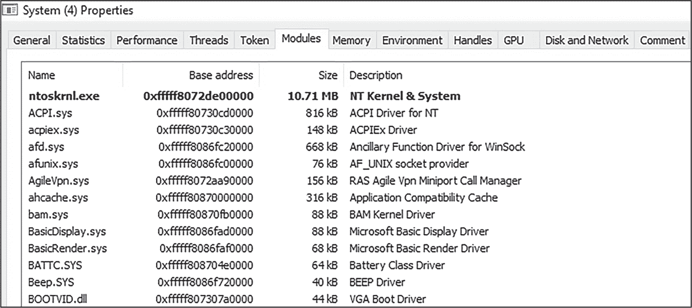

图 14-1：在 Process Hacker 中查看加载的内核模块

要查看 Process Hacker 中加载的内核模块，右键单击系统进程，选择**属性**，然后选择**模块**选项卡。在图 14-1 中，你可以看到我系统上安装的一些内核驱动程序，如高级配置和电源接口（ACPI）驱动程序，以及显示驱动程序，例如 VGA 启动驱动程序。

现在你已经对内核驱动程序有了基本了解，接下来我们将深入探讨恶意内核驱动程序的结构，它们通常被称为 Rootkit。

#### Rootkit 组件

Rootkit 通常有两个组件：一个运行在用户空间的进程和一个从该进程接收指令的内核驱动程序。Rootkit 几乎总是从一个必须在受害主机上部署并执行的用户空间可执行文件开始。一旦完成部署，恶意进程会将一个驱动程序加载到内核空间中。图 14-2 展示了一个简单的、概览式的 Rootkit 安装方式。

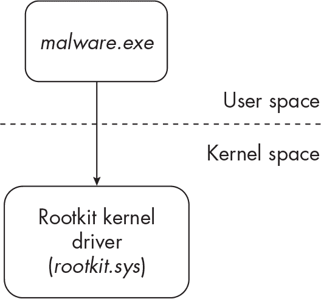

图 14-2：Rootkit 安装过程

首先，受害者会收到一个投放器可执行文件（*malware.exe*），该文件一旦执行，会解密一个嵌入的恶意内核驱动程序（*rootkit.sys*）。该投放器将该驱动程序配置并作为服务执行，从而完成 Rootkit 在内核空间中的安装。（我们稍后会详细讨论这一过程。）用户空间进程代码包含了大部分恶意软件的主要功能，而内核组件则负责在系统中掩盖和保护用户空间进程，建立低级钩子以隐藏内存和磁盘中的痕迹，并使端点防御和调查人员无法察觉其存在。

图 14-3 展示了新安装的 Rootkit 的一些功能。

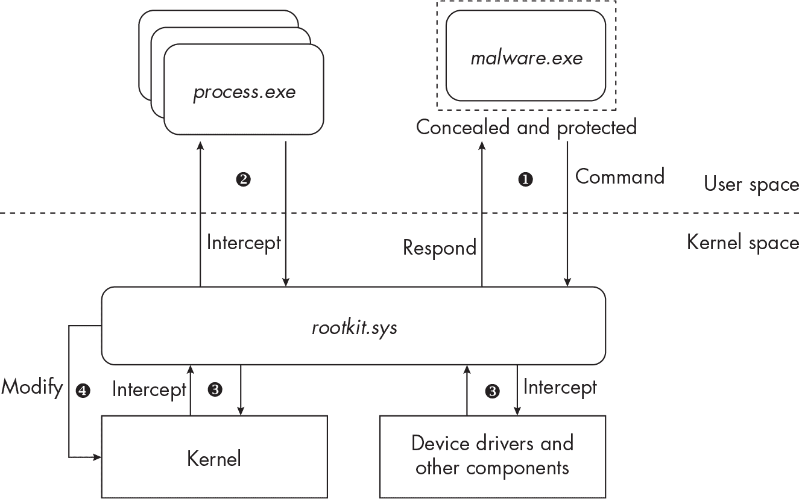

图 14-3：Rootkit 的基本功能

该 Rootkit 能够隐藏其用户空间的可执行文件（*malware.exe*），并向其内核驱动程序（*rootkit.sys*）发出指令 ❶。Rootkit 的用户空间组件通常通过发送请求，利用 WinAPI 函数如DeviceIOControl与内核空间的对应部分进行通信，该函数允许用户空间进程向内核空间驱动程序发送控制码（指令）。此外，该 Rootkit 能够挂钩并拦截来自用户空间的 API 调用 ❷，拦截其他内核组件与设备驱动程序之间的通信 ❸，甚至直接篡改内核内存 ❹。随着本章的进展，这些技术将变得更加清晰。但首先，让我们回顾一下 Rootkit 是如何最初被安装的。

#### Rootkit 安装

过去，Rootkit 的普遍性较高，但微软在后来的 Windows 版本中实施了保护措施，使得实施必要的更改以安装恶意内核组件变得更加困难。尽管如此，仍然存在绕过这些保护措施的方法，因此这类攻击有时仍然发生。让我们来看一个最近的实际案例：HermeticWiper。

HermeticWiper 在 2022 年针对乌克兰的受害者发起攻击。它本身并不是一个 Rootkit；而是一种破坏性恶意软件，需要低级别的访问权限以覆盖磁盘上的数据，使系统无法启动。然而，由于 HermeticWiper 使用了常见的加载内核驱动程序的方法，并且有很好的文献记录，它是一个很好的例子，展示了 Rootkit 如何被安装到受害环境中。

一个特定的 HermeticWiper 样本是由从合法公司 Hermetica Digital Ltd. 偷来的证书签名的，这可能使 HermeticWiper 绕过某些终端防御。（此技术在第十三章中讨论过。）当 HermeticWiper 首次执行时，该样本将写入一个新的 *.sys* 文件，文件名由四个字符组成（例如 *bpdr.sys*）并写入磁盘。此文件是 EaseUS 公司的一款合法驱动程序，通常用于调整和分区磁盘；然而，它也可以被滥用，正如我们稍后将看到的那样。由于在攻击时，该文件由有效证书签名，因此能够绕过 Windows 的驱动程序签名强制保护。

接下来，为了获得加载驱动程序所需的特殊权限，HermeticWiper 尝试获取 SeLoadDriverPrivilege。此权限只能由已在高权限级别运行的进程获取，因此大多数恶意软件需要使用特权提升技术（如绕过 UAC）来获得管理员或系统级权限，然后调用诸如 AdjustTokenPrivileges 的函数（如第十三章所讨论）。一旦获得所需的权限，HermeticWiper 就通过调用 CreateServiceW 创建一个新服务，并通过调用 StartServiceW 启动它。创建和执行服务是加载新内核驱动程序的最常见方法之一，既可以用于合法目的，也可以用于恶意目的。它还可以通过 Windows 命令行实现，如下所示：

```
C:\> sc create "evil" binPath="C:\Users\Public\evil.sys" type=kernel
```

此命令创建了一个新服务（evil），并指定了一个输入参数 C:\Users\Public\evil.sys（要加载的恶意驱动程序的路径）以及类型 kernel，表示该服务为内核驱动程序安装。随后，可以使用以下命令启动该服务：

```
C:\> sc start "evil"
```

以下是在 Windows 中执行这些命令的输出：

```
C:\Windows\system32> sc create "evil" binPath="C:\Users\Public\evil.sys" type=kernel

[SC] CreateService SUCCESS

C:\Windows\system32> sc start "evil"

SERVICE_NAME: evil
TYPE             : 1 KERNEL_DRIVER
STATE            : 4 RUNNING
`--snip--`
WIN32_EXIT_CODE  : 0 (0x0)
`--snip--`
```

对于 HermeticWiper，由于驱动程序（至少在攻击时）是合法的，并且已由有效的授权机构签名，它可能不会在内核空间安装时遇到任何问题，且能够绕过内置的 Windows 控制。如果驱动程序未由有效的签名授权机构签名，我们将在启动服务时收到以下错误：

```
C:\Windows\system32> sc start "evil"

[SC] StartService FAILED 1275:
This driver has been blocked from loading
```

一旦恶意服务成功安装，Windows 服务控制器接管并将驱动程序加载到内核地址空间。恶意软件的用户空间组件现在可以通过调用 DeviceIOControl 与内核空间中的恶意驱动程序进行交互，并向其发出命令。通过这种方式，HermeticWiper 使用一个本应合法的驱动程序（EaseUS 驱动程序）向磁盘写入数据，破坏这些数据并使受感染的系统无法操作。

> 注意

*内核驱动并不总是通过服务加载。还有其他加载它们的技术，包括调用 NT API 函数 NtLoadDriver。*

对合法驱动程序的这种滥用是一种自带易受攻击驱动程序技术的形式，接下来我们将讨论这一技术。

#### BYOVD 攻击

*自带易受攻击驱动程序*（*BYOVD*，或简称 *BYOD*）攻击利用合法签名的驱动程序作为代理与内核交互；禁用安全控制；或加载单独的、未签名的恶意内核驱动程序。恶意软件作者寻找一个已经由有效签名机构签名的合法驱动程序（因此已通过 Windows 操作系统的审查），并在攻击期间将其放置到受害系统中。这个驱动程序还必须具有某种漏洞，允许攻击者在受害系统上执行低级恶意操作。为了利用这些漏洞，rootkit 通常通过其用户空间进程发送命令给易受攻击的驱动程序（例如通过调用 DeviceIOControl）。

一个典型的例子是 FudModule rootkit，据信由朝鲜的网络犯罪集团 Lazarus Group 使用。正如 ESET 研究人员报告的那样，FudModule 利用了一个含有漏洞（CVE-2021-21551）的已签名的 Dell 驱动程序，这个漏洞允许 Lazarus 向内核内存写入数据。更具体地说，这个漏洞是通过特制的指令通过 DeviceIOControl 触发的。最终，攻击者成功禁用了 Windows 中的多个防御机制，实际上使终端防御对攻击的后续阶段失去反应能力。更多信息请见 Peter Kálnai 文章“Lazarus 在荷兰和比利时的亚马逊主题攻击”：[*https://<wbr>www<wbr>.welivesecurity<wbr>.com<wbr>/2022<wbr>/09<wbr>/30<wbr>/amazon<wbr>-themed<wbr>-campaigns<wbr>-lazarus<wbr>-netherlands<wbr>-belgium<wbr>/*](https://www.welivesecurity.com/2022/09/30/amazon-themed-campaigns-lazarus-netherlands-belgium/)。

另一个使用 BYOVD 技术的恶意软件例子是 BlackByte 勒索病毒家族。正如 Sophos 报道的那样，BlackByte 利用了合法产品 MSI AfterBurner 中的一个脆弱驱动程序，这是一款用于调节显卡的工具。该驱动程序漏洞（CVE-2019-16098）使得 BlackByte 的操作者能够与内核交互，并通过终止与 EDR 相关的进程来禁用主机上的 EDR 产品。想了解更多关于该恶意软件的信息，请查看 Andreas Klopsch 的文章《移除所有回调—BlackByte 勒索病毒通过 RTCore64.sys 滥用禁用 EDR》([*https://<wbr>news<wbr>.sophos<wbr>.com<wbr>/en<wbr>-us<wbr>/2022<wbr>/10<wbr>/04<wbr>/blackbyte<wbr>-ransomware<wbr>-returns<wbr>/*](https://news.sophos.com/en-us/2022/10/04/blackbyte-ransomware-returns/))。

另一个例子是恶意软件家族 ZeroCleare，IBM X-Force IRIS 的研究人员发现该家族利用了一个脆弱的 VirtualBox 驱动程序（*vboxdrv.sys*），使攻击者能够在内核内存中执行 shellcode 并安装恶意内核驱动程序。你可以在 IBM 报告《新的破坏性擦除工具 ZeroCleare 针对中东能源部门》([*https://<wbr>securityintelligence<wbr>.com<wbr>/posts<wbr>/new<wbr>-destructive<wbr>-wiper<wbr>-zerocleare<wbr>-targets<wbr>-energy<wbr>-sector<wbr>-in<wbr>-the<wbr>-middle<wbr>-east<wbr>/*](https://securityintelligence.com/posts/new-destructive-wiper-zerocleare-targets-energy-sector-in-the-middle-east/))中阅读更多关于这一攻击的信息。

不幸的是，还有一些最近的恶意软件例子，利用脆弱驱动程序来禁用并盲化终端防御，加载额外的恶意内核驱动程序，或在操作系统的特权区域中执行恶意代码。此外，由于这些驱动程序是合法且已签名的，目前没有太多办法可以完全防止这种类型的攻击。有一个专门的项目跟踪这些脆弱的驱动程序，叫做 Living Off The Land Drivers（简称 LOLDrivers）。如果你有兴趣了解更多关于 BYOVD 攻击的知识，值得去探索一下，访问项目网站：[*https://<wbr>www<wbr>.loldrivers<wbr>.io*](https://www.loldrivers.io)。

> 注意

*并非所有 BYOVD 的使用都与 rootkit 相关。例如，一些恶意软件仅利用脆弱的驱动程序执行内核功能或进行低级操作，这些操作本来是被禁止的。*

现在你已经了解了威胁行为者如何绕过 Windows 的保护机制来安装 rootkit，我们开始研究 rootkit 在受害主机上的行为，并通过操控系统保持隐藏。我们从一个老旧的技术开始：DKOM。

### 直接内核对象操作（DKOM）

*直接内核对象操作*（*DKOM*）涉及直接修改内核内存中的数据。这是一项精细的任务，因为如果操作不当，可能会导致操作系统崩溃。然而，如果操作得当，它可以赋予恶意软件巨大的能力。DKOM 的一个例子是隐藏进程。

通过使用 DKOM，rootkit 可以通过修改其进程的 EPROCESS 数据结构，将其用户空间进程和内核模块从终端防御和取证分析中隐藏。你可能还记得在第一章中，EPROCESS 结构形成了主机上正在运行的进程的双向链表。一些防御和分析工具依赖这些结构来监视和检查异常的运行进程。

要执行这种类型的 DKOM 技术，恶意的内核空间模块会调用诸如 PsLookupProcessByProcessID 之类的函数，以获取指向其自身用户空间组件 EPROCESS 结构的指针。然后，恶意软件可以修改 EPROCESS 结构的*前向链接（flink）*和*后向链接（blink）*成员，将该结构从 EPROCESS 链中解除链接。图 14-4 展示了解除链接前的正常、未修改的 EPROCESS 结构。

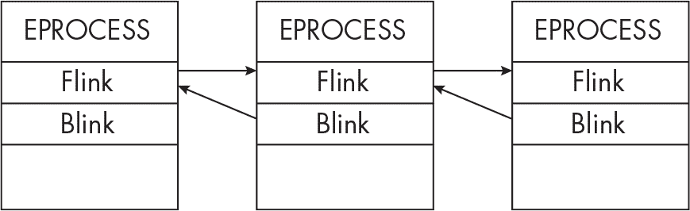

图 14-4：解除链接前的双向链接 EPROCESS 结构

请注意，EPROCESS 结构是通过它们的 flink 和 blink 成员链接的。

图 14-5 显示了当 rootkit 篡改 EPROCESS 结构以将其恶意进程（中间）解除链接时发生的情况。

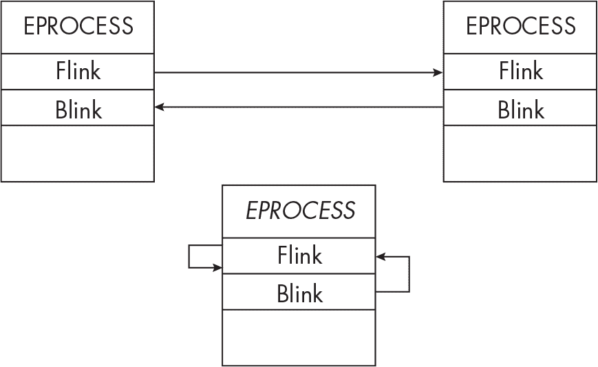

图 14-5：解除链接后的 EPROCESS 结构

请注意，恶意进程的 EPROCESS 结构的 flink 和 blink 都指向它自己，从而有效地将该进程与正常的 EPROCESS 链断开连接。

以下代码是 HideProcess 项目的简化版本（请参见 [*https://<wbr>github<wbr>.com<wbr>/landhb<wbr>/HideProcess*](https://github.com/landhb/HideProcess)），演示了恶意软件如何完成之前提到的任务：

```
void remove_links(PLIST_ENTRY Current) {

    PLIST_ENTRY Previous, Next;
  ❶ Previous = (Current->Blink);
  ❷ Next = (Current->Flink);

    // Loop over self (connect previous with next).
    Previous->Flink = Next;
    Next->Blink = Previous;

    // Rewrite the current LIST_ENTRY to point to itself.
  ❸ Current->Blink = (PLIST_ENTRY)&Current->Flink;
  ❹ Current->Flink = (PLIST_ENTRY)&Current->Flink;
`--snip--`
```

首先，代码定义了变量Previous（存储当前进程的 blink 指针）❶和Next（存储当前进程的 flink 指针）❷。之后，代码将这些LIST_ENTRY值重写为指向自身。Current->Blink = (PLIST_ENTRY)&Current->Flink这一行将进程的当前 blink 指针设置为其 flink 指针的值❸。Current->Flink = (PLIST_ENTRY)&Current->Flink这一行确保进程的 flink 指向自身❹。从本质上讲，这打破了 EPROCESS 链，隐藏了进程，使其从进程管理工具（如任务管理器）和一些取证工具集中消失，可能帮助它更好地逃避端点防御。

然而，DKOM 并不限于隐藏进程。使用 DKOM 技术，恶意软件理论上可以改变内核内存中的任何对象。已知恶意软件使用 DKOM 技术来隐藏恶意网络流量或修改文件，以干扰取证调查。DKOM 还可以用来注入内核钩子，正如你将在下一节中看到的那样。

虽然 DKOM 是 rootkit 用来隐藏或改变系统的最基本和直接的方法之一，但它并不是万能的。DKOM 和其他内核操作技术很容易导致操作系统崩溃，从而可能提醒受害者恶意软件的存在。不仅如此，像 PatchGuard 这样的安全措施也为恶意软件作者带来了挑战，正如我们在本章后面将讨论的那样。

### “传统”内核钩子

就像在用户空间运行的恶意软件可以使用内联和 IAT 钩子来监控、拦截和操作函数调用一样，内核空间中的恶意软件也可以使用几种类型的钩子来发起攻击。我们将讨论一些最常见的钩子技术，从几十年前的 SSDT 钩子技术开始。

> 注意

*本节讨论的技术曾经是 rootkit 和端点防御产品中最常用的一些技术。然而，与 DKOM 类似，这些技术由于微软在现代 Windows 版本中实施的保护措施，已经不再流行。不过，了解这些技术仍然很重要，因为你可能偶尔会看到恶意软件使用这些或类似的战术，这也能帮助你更好地理解更现代的 rootkit 技术。*

#### SSDT 钩子

*系统服务描述符表 (SSDT)* 或 *分发表* 包含一组系统调用 ID 及其对应的内核函数指针。（这些在 32 位和 64 位操作系统之间有所不同，但我们在这里不讨论这些具体细节。）正如在第一章和第十三章中所讨论的，当用户空间的进程调用 Windows API 和 NT API 函数时，最终会通过系统调用进入内核来执行请求。我们来看一个使用NtReadFile读取磁盘文件的例子。以下是必须发生的基本步骤顺序：

1.  用户空间中的程序调用NtReadFile。程序发起一个系统调用，引用与NtReadFile函数对应的系统调用 ID。

2.  系统调用触发处理器从用户模式切换到内核模式，并将请求和系统调用 ID 传递给系统调用处理程序。

3.  系统调用处理程序查阅 SSDT 获取内核NtReadFile函数的地址（该函数从 *ntoskrnl.exe* 导出），然后继续执行该函数。

4.  由于NtReadFile函数被调用来读取磁盘上的文件，因此它必须与内核驱动程序（如磁盘驱动程序堆栈）进行通信。这时，IO 管理器便参与其中。

5.  IO 管理器以*IO 请求包 (IRP)* 的形式向适当的驱动程序发送指令，这些驱动程序将执行NtReadFile请求的操作（例如读取磁盘上的特定文件）。我将在本章后面讨论 IO 管理器和 IRP。

6.  一旦驱动程序处理完请求，结果将被发送回原始的用户空间调用程序。

现在你对 SSDT 的基本使用有了了解，你可以看到恶意软件如何通过在其中插入钩子，将请求重定向到恶意代码。图 14-6 展示了这种方法的一个例子，使用了NtReadFile函数。

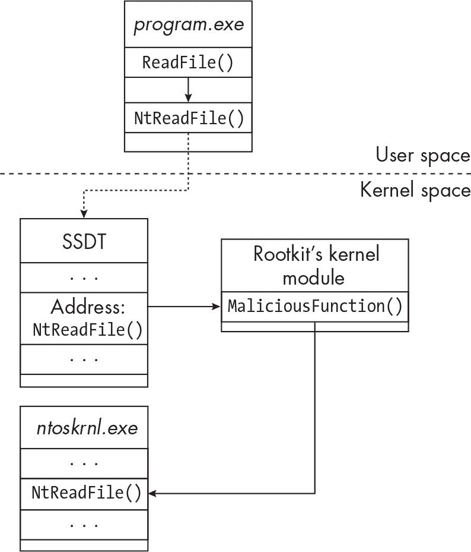

图 14-6：NtReadFile 的 SSDT 钩子

rootkit 修改 SSDT 中指向NtReadFile的函数指针，进而将对NtReadFile的请求重定向到 rootkit 的恶意内核模块。rootkit 然后拦截并修改对NtReadFile的调用。稍后，它可以将调用重定向到 *ntoskrnl.exe* 中的原始NtReadFile函数代码。

恶意软件作者使用 SSDT 钩子的原因有很多。例如，他们可能会为 NtReadFile 实现一个 SSDT 钩子，以防止恶意软件自身的恶意文件和代码被终端防护和调查人员读取。另一种内核钩子技术——内联内核钩子，也用于类似的原因。

#### 内联内核钩子

内联钩子是恶意软件在用户空间（如 第十二章 讨论的）以及内核函数中都使用的一种技术。为了安装钩子，根工具包试图修改 *ntoskrnl.exe* 中的函数代码。类似于刚才讨论的 SSDT 钩子示例，根工具包可以通过篡改函数代码插入跳转指令，将控制流重定向到恶意内核模块的代码，如 图 14-7 所示。

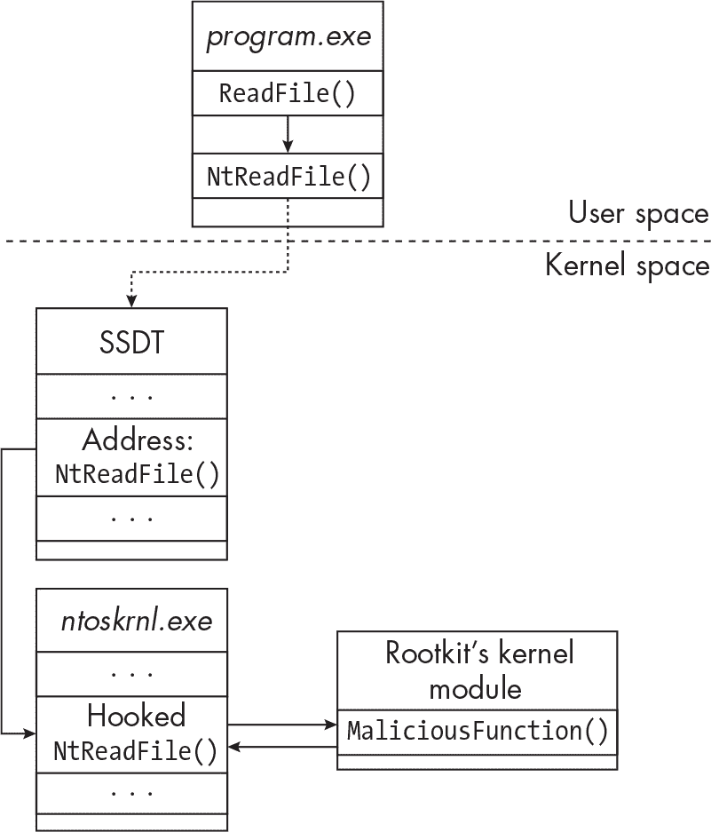

图 14-7：NtReadFile 的内联内核钩子

根工具包可以通过多种方式将钩子写入目标函数。类似于用户空间中的内联钩子，恶意软件首先必须修改目标函数代码的内存保护，然后将钩子写入其中。以下伪代码演示了这一过程：

```
// Set target memory to PAGE_READWRITE protection.
MmProtectMdlSystemAddress(mdl, "PAGE_READWRITE");

// Write a hook (a jump instruction) into the target function.
RtlCopyMemory(targetAddress, sourceAddress, size);

// Set the target memory back to original protections.
MmProtectMdlSystemAddress(mdl, "PAGE_READONLY");
```

MmProtectMdlSystemAddress 是一个内核函数，用于设置 *内存描述符列表 (MDL)* 的内存保护类型，MDL 是一个包含内存地址范围的结构。此函数有两个参数：一个 MemoryDescriptorList（将要修改的内存地址范围）和一个保护常量（如 PAGE_READWRITE，它将改变 MDL 的保护为可写）。

随后，恶意软件调用一个内核函数，如 RtlCopyMemory，将目标代码覆盖为跳转指令。例如，RtlCopyMemory 的主要参数是目标内存区域的目的地址、源地址（其中包含要复制的跳转指令）和复制数据的大小。恶意软件必须小心将目标内存区域恢复为其原始保护设置，因为不正确和异常的保护（例如“可写”）可能会引起终端防护的怀疑，或者导致系统不稳定。

接下来，我们将讨论 IRP 钩子，这也是根工具包已知使用的一种内核钩子类型。

#### IRP 钩子

当用户空间程序需要与内核驱动程序通信时，它们通过 IO 管理器来实现。这种通信主要通过 IO 请求包（IRP）完成，IRP 是包含请求信息和待执行操作的数据结构对象。IRP 在调用程序和内核驱动程序之间传递，但它们也可以用于驱动程序之间的通信。例如，USB 键盘驱动程序需要与 USB 主机控制器驱动程序通信，IO 管理器有助于促进这种通信。这个关系在 图 14-8 中得到了说明。

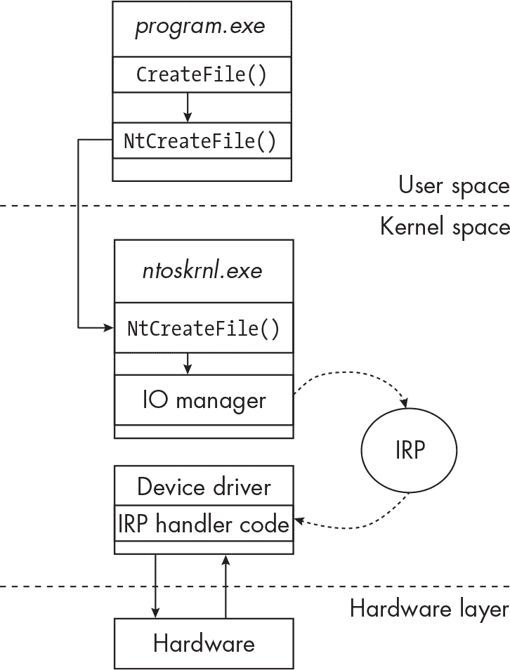

图 14-8：IRP 的工作原理

本程序调用 CreateFile 函数来打开磁盘上的文件句柄。最终，程序会进行系统调用，进入内核（*ntoskrnl.exe*）。此时，IO 管理器开始介入，向文件系统驱动程序发送 IRP 来处理此操作。在最后一步（这里未显示），驱动程序将操作的状态发送回 IO 管理器，后者将状态返回给调用程序。

每个 IRP 包含一个 *IRP 代码*，该代码告诉接收驱动程序应使用哪个 IRP 处理程序来处理相应的请求。表 14-1 列出了我们目的相关的一些更有趣的 IRP 功能代码。

表 14-1： IRP 代码

| IRP 代码 | 请求描述 |
| --- | --- |
| IRP_MJ_CREATE | 当请求线程打开设备或文件对象的句柄时发送给驱动程序，例如调用 NtCreateFile |
| IRP_MJ_WRITE | 当请求者希望传输数据时发送给驱动程序，例如将数据写入文件 |
| IRP_MJ_READ | 当请求者希望读取数据时发送给驱动程序，例如从文件中读取数据 |
| IRP_MJ_DEVICE_CONTROL | 当调用 DeviceIoControl 函数时发送（意味着一个用户空间进程正在向驱动程序发送直接控制代码或指令） |
| IRP_MJ_SHUTDOWN | 当系统关闭已被启动时发送 |
| IRP_MJ_SYSTEM_CONTROL | 当用户空间进程通过 Windows 管理工具（WMI）请求系统信息时发送 |

每个安装在内核中的驱动都会包括一个 IRP 处理程序表，称为 *主要函数表*（或 *IRP 函数表*）。主要函数表包含指向处理特定 IRP 的处理程序代码的指针；这些代码可能位于驱动程序本身中，或者位于另一个驱动或模块中。以下输出显示了 FLTMGR 驱动的 IRP 函数表：

```
IRP_MJ_CREATE              0xfffff8023674ca20   FLTMGR.SYS
IRP_MJ_CREATE_NAMED_PIPE   0xfffff8023674ca20   FLTMGR.SYS
IRP_MJ_CLOSE               0xfffff80236713e60   FLTMGR.SYS
IRP_MJ_READ                0xfffff80236713e60   FLTMGR.SYS
IRP_MJ_WRITE               0xfffff80236713e60   FLTMGR.SYS
IRP_MJ_QUERY_INFORMATION   0xfffff80236713e60   FLTMGR.SYS
IRP_MJ_SET_INFORMATION     0xfffff80236713e60   FLTMGR.SYS
IRP_MJ_QUERY_EA            0xfffff80236713e60   FLTMGR.SYS
`--snip--`
```

该输出是借助 Volatility 创建的，Volatility 是一款内存取证和分析工具。尽管本书未涵盖此内容，但内存取证技术可以极大地增强恶意软件分析过程，特别是在处理根套件时。对于这个具体的例子，我使用了 Volatility 中的 driverirp 模块。

该输出的第一列包含 IRP 代码。第二列和第三列分别包含指向相关 IRP 处理程序函数的指针，以及包含处理程序代码的模块。在这个例子中，驱动指向它所包含的处理程序。

为了拦截、修改并控制 IO 通信，恶意内核驱动可能尝试挂钩 IRP。这样做的一个原因是通过拦截引用磁盘上恶意文件的 IRP 函数调用来隐藏和保护恶意软件的痕迹。Autochk 根套件（SHA256: 28924b6329f5410a5cca30f3530a3fb8a97c23c9509a192f2092cbdf139a91d8）正是这样做的：它在 FLTMGR 驱动中挂钩 IRP_MJ_CREATE，以拦截引用磁盘上恶意文件的 IRP（如 图 14-9 所示）。

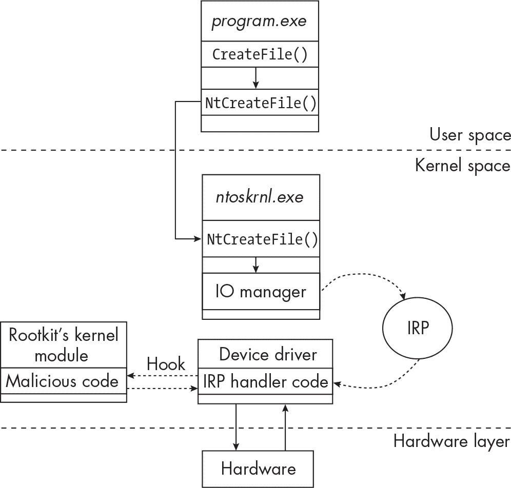

图 14-9：NtReadFile 的 IRP 挂钩

如果用户空间中的应用程序，例如取证工具，尝试访问这个根套件的文件，IRP 将由根套件的处理程序代码来处理，而不是由本应处理此请求的合法处理程序处理。以下是 Volatility 输出，显示了挂钩的 FLTMGR 驱动的 IRP 函数表：

```
0 IRP_MJ_CREATE             0xfffff80230bf1bc4   autochk.sys
1 IRP_MJ_CREATE_NAMED_PIPE  0xfffff8023674ca20   FLTMGR.SYS
2 IRP_MJ_CLOSE              0xfffff80236713e60   FLTMGR.SYS
3 IRP_MJ_READ               0xfffff80236713e60   FLTMGR.SYS
4 IRP_MJ_WRITE        	    0xfffff80236713e60   FLTMGR.SYS
5 IRP_MJ_QUERY_INFORMATION  0xfffff80236713e60   FLTMGR.SYS
6 IRP_MJ_SET_INFORMATION    0xfffff80236713e60   FLTMGR.SYS
7 IRP_MJ_QUERY_EA           0xfffff80236713e60   FLTMGR.SYS
`--snip--`
```

注意到什么可疑的事情了吗？在代码的第一行，FLTMGR.SYS已被替换为autochk.sys。所有原本应发送给 FLTMGR 驱动的MJ_CREATE IRP，现在将被转发到 rootkit 驱动中的恶意处理代码，即autochk.sys!你可以在[*https://<wbr>repnz<wbr>.github<wbr>.io<wbr>/posts<wbr>/autochk<wbr>-rootkit<wbr>-analysis<wbr>/*](https://repnz.github.io/posts/autochk-rootkit-analysis/)阅读有关此 rootkit 的一些技术细节。

要安装一个 IRP 钩子，恶意软件作者有几种选择。一种方法是将受害者驱动中原始处理程序代码指针的值替换为指向恶意处理程序代码的指针。或者，恶意软件可以使用之前描述的内联挂钩方法，通过跳转指令覆盖合法处理函数中的前几个字节，跳转到恶意代码。

这两种技术以及其他提到的挂钩技术，都依赖于在内存中操控内核对象的精细任务。然而，如前所述，由于 Windows 现在内置了保护措施，本节讨论的技术在恶意软件中已不常使用。考虑到这一点，让我们转向一些相对现代的技术，rootkit 可能会使用这些技术绕过 Windows 的保护，首先从 IRP 过滤和拦截开始。

### IRP 拦截与过滤

与粗暴地挂钩内核驱动以拦截和操控 IRP 不同，rootkit 可以注册一个过滤或迷你过滤驱动来实现此功能。如本章开始时所述，过滤驱动和迷你过滤驱动可以“附加”到设备，并被添加到其驱动栈中，拦截通过栈传递的 IRP。让我们更详细地了解这一过程。

> 注意

*过滤驱动（有时也称为*遗留过滤驱动*）和迷你过滤驱动是两种过滤类型，但它们的工作方式大不相同。在本书中，我不会详细讲解这两种驱动的具体细节。*

每个附加到系统的硬件设备都有一个与之关联的分层驱动栈，用于实现设备与操作系统之间的通信（参见图 14-10）。

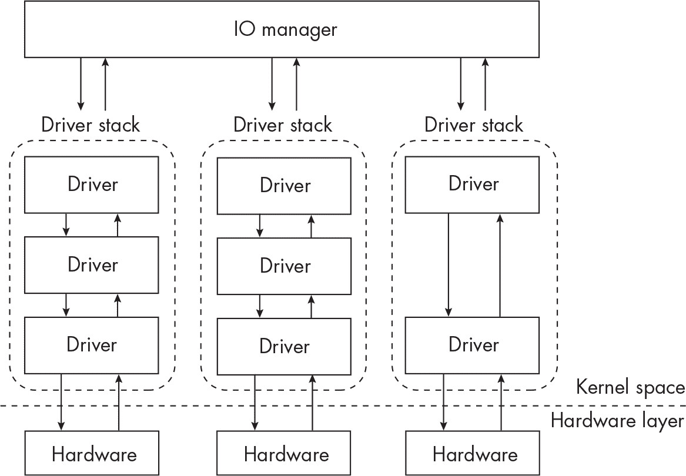

图 14-10：IO 管理器如何与驱动栈通信

堆栈中的每个驱动程序执行特定角色，并作为堆栈中前后驱动程序之间的接口。此外，当 IO 管理器将 IRP 发送到特定设备时，IRP 会通过设备的层次化驱动程序堆栈，逐一经过堆栈中的每个驱动程序。如果其中一个驱动程序有一个处理特定 IRP 的处理程序，它将对该 IRP 执行某种操作。图 14-10 中显示的箭头表示驱动程序之间通过 IRP 进行的通信。

筛选驱动程序旨在插入驱动程序堆栈中以添加功能。它们可以插入堆栈中的不同位置（称为*高度*），甚至可以添加到堆栈的顶部，在那里它们可以拦截所有目的地为驱动程序堆栈的 IRP（见图 14-11）。  

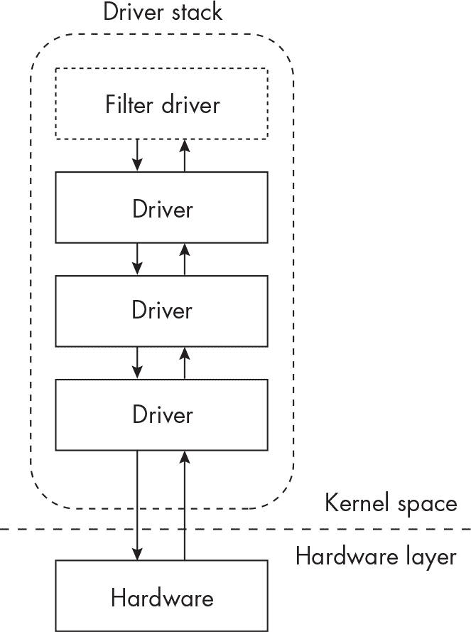  

图 14-11：添加到驱动程序堆栈顶部的筛选驱动程序  

Rootkit 可以注册一个新的筛选驱动程序并将其“插入”到驱动程序堆栈的顶部，从而让它们看到并拦截所有传入的 IRP。拦截后，恶意软件可以选择丢弃该 IRP 或修改它。rootkit 可能会通过这种方式使用筛选驱动程序来保护自己的文件。例如，它可以注册一个筛选驱动程序来监视并拦截对其文件的 IO 请求，修改请求或完全丢弃它们，从而有效地将其隐藏于调查人员和分析工具之外。EDR 和其他端点防御有时也会出于相同的原因使用筛选驱动程序：保护其文件免受恶意软件侵害。  

要实现筛选驱动程序，rootkit 必须首先将驱动程序加载到内核内存中（可能使用“Rootkit 安装”中提到的技术，见第 269 页）。筛选驱动程序必须通过为这些 IRP 设置处理程序来指定它关心的 IRP 通信。例如，如果恶意软件试图拦截MJ_CREATE IRP，它必须在筛选驱动程序的 IRP 功能表中实现这一点。  

恶意软件可以通过注册自己的小型过滤器（调用 FltRegisterFilter）或挂钩现有的小型过滤器来滥用小型过滤器驱动程序。一些现代恶意软件已知会这样做。在分析 rootkit 驱动程序代码时，注意恶意软件是否调用 FltRegisterFilter 来注册自己的小型过滤器驱动程序。还要注意恶意软件是否调用了诸如 FltGetFilterFromName、FltEnumerateFilters 或 FltEnumerateInstances 等函数；它可能正在尝试枚举主机上的其他小型过滤器，为挂钩做准备。有关小型过滤器驱动程序如何在实践中实现的更多信息，请参见 Rahul Dev Tripathi 的文章《通过小型过滤器驱动程序方法限制存储设备》：[*https://<wbr>www<wbr>.codeproject<wbr>.com<wbr>/Articles<wbr>/5341729<wbr>/Storage<wbr>-Device<wbr>-Restriction<wbr>-Using<wbr>-a<wbr>-Minifilter<wbr>-Driv<wbr>*](https://www.codeproject.com/Articles/5341729/Storage-Device-Restriction-Using-a-Minifilter-Driv)。

传统的过滤器驱动程序安装方式不同。具体细节超出了本书的范围，但你可以通过文件系统驱动程序教程了解更多：[*https://<wbr>www<wbr>.codeproject<wbr>.com<wbr>/Articles<wbr>/43586<wbr>/File<wbr>-System<wbr>-Filter<wbr>-Driver<wbr>-Tutorial*](https://www.codeproject.com/Articles/43586/File-System-Filter-Driver-Tutorial)，以及 Rotem Salinas 的精彩文章《奇妙的 Rootkits 及其发现方法》：[*https://<wbr>www<wbr>.cyberark<wbr>.com<wbr>/resources<wbr>/threat<wbr>-research<wbr>-blog<wbr>/fantastic<wbr>-rootkits<wbr>-and<wbr>-where<wbr>-to<wbr>-find<wbr>-them<wbr>-part<wbr>-1*](https://www.cyberark.com/resources/threat-research-blog/fantastic-rootkits-and-where-to-find-them-part-1)。

### 滥用内核回调

滥用内核回调是一些 rootkit 使用的另一种现代方法。回顾 第十三章 中的讨论，回调允许内核模块在发生系统事件时接收到通知，以便它可以采取某种行动。例如，驱动程序可能需要知道何时在用户空间执行了某个进程，因此它会实现 PsSetCreateProcessNotifyRoutine 回调（例如某些 EDR 产品的情况）。一旦此回调在驱动程序中注册，驱动程序将在系统上创建进程时收到 IRP 形式的通知，驱动程序有机会为该事件执行其回调代码。

进程的创建者负责向所有注册的驱动程序发送通知。因此，当一个进程生成一个子进程时，调用进程会向所有注册的驱动程序发送 CreateProcessNotifyRoutine 通知。当驱动程序收到通知时，驱动程序的回调代码将被执行。

根套件（rootkit）如果希望接收特定系统事件的通知，也可以使用回调。一旦发生事件，比如注册表修改或文件系统操作，根套件的恶意驱动程序将会收到通知，回调代码将被执行。以下输出显示了在被感染系统上注册的回调例程：

```
Type                               Callback            Module
--------------------------------------------------------------------
IoRegisterShutdownNotification     0xfffff8033891e830  ntoskrnl.exe
IoRegisterShutdownNotification     0xfffff8033b6b10c0  SgrmAgent.sys
IoRegisterShutdownNotification     0xfffff803390cf320  ntoskrnl.exe
`--snip--`
PsRemoveLoadImageNotifyRoutine     0xfffff80af3afb210  ahcache.sys
PsRemoveCreateThreadNotifyRoutine  0xfffff80336bd1060  mmcss.sys
**PsSetCreateThreadNotifyRoutine     0xfffff6050d26ccc0  comp.sys**
KeBugCheckCallbackListHead         0xfffff8033c13cb90  ndis.sys
KeBugCheckCallbackListHead         0xfffff8033c59b4e0  fvevol.sys
`--snip--`
```

在此输出中，Type 列显示回调类型，Callback 列显示回调处理程序的地址，Module 列显示注册回调的内核模块。大多数这些都是正常、合法的回调。然而，有一个可疑的模块名称（comp.sys），它似乎注册了一个有趣的回调（PsSetCreateThreadNotifyRoutine）。如前所述，当用户空间中的进程创建新线程时，这个回调将被触发。还需要注意的是，回调代码的地址与合法回调的地址有很大不同（例如，0xfffff6050d26ccc0 与 0xfffff80af3afb210）。

DirtyMoe 根套件采用了类似的方法。DirtyMoe 使用内核回调将恶意代码悄悄注入到用户空间中新创建的线程中。你可以在 Martin Chlumecký 的文章《DirtyMoe：Rootkit 驱动程序》中阅读更多内容，文章链接为 [*https://<wbr>decoded<wbr>.avast<wbr>.io<wbr>/martinchlumecky<wbr>/dirtymoe<wbr>-rootkit<wbr>-driver<wbr>/*](https://decoded.avast.io/martinchlumecky/dirtymoe-rootkit-driver/)。

恶名昭著的 Necurs 根套件起源于 2014 年，它设置了一个注册表回调（CmRegisterCallback），这是一种过滤驱动程序回调，能够通知它访问其注册表服务键的任何行为。如果调查员或程序尝试访问此注册表键，访问将失败。以下是一个简化的伪代码示例，展示了恶意驱动程序如何注册并滥用注册表回调：

```
1 void RegistryCallback(..., ..., context)
{
  if (context)
  {
   ❷ if (event == CM_EVENT_REGISTRY_KEY_OPEN)
    {
     ❸ if (context->registryKey == "HKEY_CURRENT_USER\Software\Microsoft\
Windows\CurrentVersion\evil")
      {
     ❹ // Block the action.
      }
    }
  }
}

5 CmRegisterCallback(RegistryCallback, &context);
```

这段恶意代码首先定义了回调函数代码（RegistryCallback），一旦回调发生，就会执行此函数❶。稍后，在代码中，rootkit 定义了注册表回调，传递回调名称（RegistryCallback）以及上下文，它是一个指向包含有关函数调用信息的结构体的指针❺。由于此回调将由与 Windows 注册表交互的程序触发，因此此上下文结构包含重要信息，如特定的注册表操作（打开键、写数据等）和操作目标（或受影响的特定注册表键或值）。

当一个程序执行注册表操作时，例如调用RegOpenKeyExA，rootkit 的恶意回调代码将被执行。rootkit 会检查注册表事件是否等于CM_EVENT_REGISTRY_KEY_OPEN（表示正在打开注册表键）❷，然后检查正在操作的注册表键是否是HKEY_CURRENT_USER\Software\Microsoft\Windows\CurrentVersion\evil（恶意软件用于在主机上建立持久性的注册表键）❸。如果键名匹配，rootkit 会尝试阻止程序或调查者检查该注册表键❹。它可以通过暂时删除自己的注册表键并稍后重新创建它，或通过将恶意代码注入调用进程并挂钩该函数调用来防止调用成功，等等方法来做到这一点。

> 注意

*CmRegisterCallback 现在已过时；该函数的现代版本是 CmRegisterCallbackEx。然而，函数的原理保持不变。*

你已经看到了一些关于 rootkit 如何在操作系统中以非常低级的方式操作，操控内核内存、安装钩子并配置回调，从而保持隐藏并逃避防御的内容。现在我们简要地看一下更深层次的恶意软件变种：引导程序。

### 引导程序

*引导程序*是一种恶意软件，旨在隐藏在系统固件中，破坏整个启动过程。如果引导程序能够篡改操作系统的启动过程，将自身注入此过程链中，它可以有效地实现 rootkit 的所有功能，同时还能在系统重建后生存下来。

一种特定类型的启动劫持程序是 UEFI 启动劫持程序（有时称为 UEFI rootkit），它在*统一可扩展固件接口（UEFI）*内运行，UEFI 是附加到系统主板的一个专用存储芯片。UEFI 包含在操作系统启动之前执行的低级软件，为操作系统内核与系统中安装的各种固件设备提供接口。由于 UEFI 在操作系统启动之前就已运行，因此能够嵌入到 UEFI 芯片中的恶意软件将在更长时间内保持不被检测到，甚至可以在操作系统重装和重建后仍然存活。

一个显著的 UEFI 启动劫持程序例子是 CosmicStrand。2022 年 7 月，卡巴斯基的研究人员报告称，这个 UEFI 启动劫持程序深入系统，入侵途径可能是硬件漏洞。该启动劫持程序影响了某些型号的华硕和技嘉主板的系统，并控制了 Windows 操作系统内核加载程序，将恶意代码注入到内核内存中。有关这一威胁的更多信息，请参见卡巴斯基全球研究与分析团队（GreAT）的文章《CosmicStrand：一款复杂的 UEFI 固件 Rootkit 的发现》，文章链接是 [*https://<wbr>securelist<wbr>.com<wbr>/cosmicstrand<wbr>-uefi<wbr>-firmware<wbr>-rootkit<wbr>/106973<wbr>/*](https://securelist.com/cosmicstrand-uefi-firmware-rootkit/106973/)。

另一个例子是 MosaicRegressor 框架，该框架也被卡巴斯基发现。它包含一个 UEFI rootkit 组件，通过劫持 Windows 启动过程，在磁盘上放置一个可执行文件，该文件在 Windows 启动时悄悄执行。如果从磁盘中移除此可执行文件，它将在系统重启时重新写入磁盘，从而提供高度的持久性。你可以阅读卡巴斯基关于 MosaicRegressor 的文章《潜伏在 UEFI 阴影中的 MosaicRegressor》，由 Mark Lechtik、Igor Kuznetsov 和 Yury Parshin 撰写，文章地址是 [*https://<wbr>securelist<wbr>.com<wbr>/mosaicregressor<wbr>/98849<wbr>/*](https://securelist.com/mosaicregressor/98849/)。

与传统的用户空间恶意软件相比，启动劫持程序（bootkits）相对较少见。然而，它们可能并不像人们所认为的那样罕见。由于它们能够以低级别访问主机，即使在防御良好的环境中，它们也能在不被察觉的情况下存活并持久存在。如果我们无法检测到这种类型的恶意软件，我们就无法知道它的存在，这让我们得出一个令人不安的结论：这种恶意软件可能嵌入了比我们知道的更多的系统中。然而，并非一切都已失去。让我们通过讨论一些 Windows 内置的防御措施来结束这一章，来应对 rootkits 和 bootkits。

### Rootkit 防御

微软已经实施了多种防御措施来对抗根套件，其中最重要的两项是*PatchGuard*和*驱动签名强制(DSE)*。PatchGuard 于 2005 年为 Windows XP 的 x64 版本推出，也被称为*内核补丁保护(KPP)*，它缓解了前面描述的许多根套件技术，例如 SSDT 和 IDT 钩子以及多种形式的 DKOM。PatchGuard 通过定期验证内核内存结构的完整性来测试它们是否被修改。如果 PatchGuard 检测到其中一个结构被修改，它会强制内核崩溃，结果如图 14-12 所示。

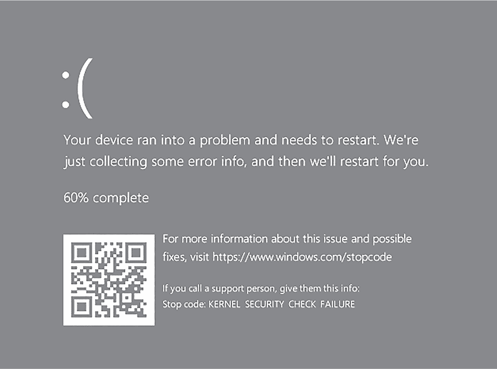

图 14-12: 由 PatchGuard 引起的内核安全检查崩溃

然而，PatchGuard 并非不可绕过。由于它定期扫描内核内存，如果这些检查的时机恰当，恶意软件可以非常快速地篡改内核内存，然后在 PatchGuard 执行完整性检查之前恢复到“干净”状态。为了启动此检查，操作系统调用KeBugCheckEx内核 API 函数，已知某些恶意软件会劫持此函数，防止内核完整性检查成功执行。还存在一些恶意软件利用 PatchGuard 和其他相关组件的漏洞。例如，GhostHook 恶意软件利用了 Windows 实现某种低级 Intel API——Intel Processor Trace 的漏洞，可能允许恶意软件绕过 PatchGuard 的监测。这种攻击技术相当复杂，因此我们在此不深入探讨，但你可以在 Kasif Dekel 的文章《GhostHook——利用处理器跟踪钩子绕过 PatchGuard》中阅读更多内容，网址为[*https://<wbr>www<wbr>.cyberark<wbr>.com<wbr>/resources<wbr>/threat<wbr>-research<wbr>-blog<wbr>/ghosthook<wbr>-bypassing<wbr>-patchguard<wbr>-with<wbr>-processor<wbr>-trace<wbr>-based<wbr>-hooking*](https://www.cyberark.com/resources/threat-research-blog/ghosthook-bypassing-patchguard-with-processor-trace-based-hooking)。

另外两个相对较新的逃避 PatchGuard 的恶意软件实例是 InfinityHook（[*https://<wbr>github<wbr>.com<wbr>/everdox<wbr>/InfinityHook*](https://github.com/everdox/InfinityHook)），它滥用一个名为NtTraceEvent的内核 API，以及 ByePg（[*https://<wbr>github<wbr>.com<wbr>/can1357<wbr>/ByePg*](https://github.com/can1357/ByePg)），它劫持一个名为HalPrivateDispatchTable的内核结构。它们以不同的方式绕过 PatchGuard。然而，值得注意的是，微软已经迅速修补了 PatchGuard 中一些已知的漏洞，迫使恶意软件作者做出适应。

正如本节开头所提到的，微软实施的另一个安全控制是驱动程序签名强制（DSE），有时称为*数字签名强制*，该功能已在 Windows Vista（x64）及更高版本中发布。DSE 确保只有经过预验证（已签名）的驱动程序才能被加载到内核内存中。理论上，合法的驱动程序将被允许加载，而可疑的未签名驱动程序则会被阻止加载。你在本章前面阅读到过，恶意软件可以通过使用带有合法证书签名的恶意内核驱动程序或使用 BYOVD 技术来绕过这一控制。微软建议通过使用*黑名单*已知的易受攻击驱动程序来解决这个问题。如果某个驱动程序被报告为易受攻击或正在被恶意利用，微软会将其加入黑名单，从而防止其后续安装。你可以通过在 Windows 的较新版本中启用“Microsoft 易受攻击驱动程序黑名单”安全选项来强制执行此功能。这个控制的主要问题是，某些合法驱动程序可能会被阻止加载，而且它仅能防御已知的恶意驱动程序。

最后，*早期启动反恶意软件（ELAM）*是一些终端防御软件的功能，旨在保护 Windows 启动过程。ELAM 负责在其他第三方组件之前加载反恶意软件内核组件。这确保了反恶意软件在根套件或其他持久性恶意软件有机会加载和执行之前，能够正确加载并运行。ELAM 可以有效防御根套件。然而，由于 ELAM 驱动程序直到启动过程的后期阶段才会加载，单靠 ELAM 可能无法防止启动病毒的加载。

为了防御启动病毒和 UEFI 根套件，你可以启用*安全启动*。安全启动可在大多数现代硬件上使用，防止恶意代码劫持 Windows 启动过程。在启动时，安全启动会验证 UEFI 固件驱动程序和操作系统本身的完整性，然后才允许系统完全启动。如果恶意软件已经嵌入 UEFI 芯片中，这为系统提供了一层保护。大多数版本的 Windows 中，安全启动是可选的，但在 Windows 11 中是必须启用的。然而，像所有安全控制一样，安全启动的不同实现方式可能存在漏洞，恶意软件可能会利用这些漏洞。Eclypsium 的研究人员（[*https://<wbr>eclypsium<wbr>.com*](https://eclypsium.com)）在 2020 年和 2022 年报道了其中的一些漏洞。

最后需要注意的是，许多 Windows 根套件保护措施，如 PatchGuard 和 DSE，仅适用于 x64（64 位）版本的 Windows。这使得 x86（32 位）版本的 Windows 可能暴露于一系列危险的低级恶意软件之中。幸运的是，正因为这些安全特性在 x86 模式下未启用，EDR 和反恶意软件可以利用这些相同的技术进行保护，监控并保护终端。

### 总结

本章介绍了 rootkit 的基础知识：内核模块的工作原理、恶意软件如何安装恶意模块，以及威胁行为者如何绕过如签名驱动程序强制执行等保护措施。我们讨论了一些常见的 rootkit 技术，如 DKOM、内核钩子、IRP 拦截和内核回调滥用。你还了解了 bootkit，并看到内核空间恶意软件如何绕过 Windows 内建的保护机制，如 PatchGuard。本章仅仅触及了 rootkit 和内核操作技术的皮毛，如果你有兴趣深入了解，建议你查看附录 C 以获取更多资源。在下一章中，我们将讨论现代恶意软件如何通过利用“无文件”技术和反取证技术，避开端点防御和调查人员的监测。
