<hgroup>

## <samp class="SANS_Futura_Std_Bold_Condensed_B_11">16</samp> <samp class="SANS_Dogma_OT_Bold_B_11">编码与加密</samp>

</hgroup>


*编码*是将数据转换为新格式的行为。它用于高效传输数据、确保协议或应用程序之间的互操作性、以及压缩和存储数据等任务。恶意软件作者还利用编码来混淆数据和代码，防止分析师或主机与网络防御查看到这些内容。*加密*与编码有相似之处，是一种保护敏感数据在传输过程中或静态存储时的方式。恶意软件可能会使用加密来达到多种目的，包括混淆内存中的敏感数据，如指挥与控制（C2）信息。除了防御规避外，恶意软件通常还使用编码和加密来妨碍分析，特别是静态代码分析或网络流量分析。

具体来说，恶意软件使用编码和加密算法的原因如下：

+   为了保护文件中的代码和数据，这些文件存储在磁盘上，以便避开如反恶意软件软件等端点防御。这通常涉及一种被称为打包（packing）的技术，本文将在第十七章中详细讨论。

+   为了保护内存中的代码和数据（如 C2 地址、密钥或敏感字符串），免受端点防御软件和分析师的检测。

+   例如，通过在将数据传输到 C2 基础设施之前对其进行加密，以保护其在网络层传输过程中的数据。

+   为了阻碍逆向工程和分析工作。如果恶意软件分析师必须先解码或解密恶意软件代码的部分内容，这会减缓并令分析过程变得困难。

在本章中，你将看到一些恶意软件使用的编码和加密技术，并学到一些实际技巧，以便在分析时克服这些技术。

### <samp class="SANS_Futura_Std_Bold_B_11">基础编码</samp>

最常用的编码形式之一是*Base64*，它最初是为数据传输和各种协议之间的互操作性而设计的。当字符串通过 Base64 编码算法时，字符串会作为二进制数据输入到算法中，并被拆分成 6 位的块。每个块会被转换（编码）为 ASCII 格式，使用总共 64 个不同的字符（26 个小写字母、26 个大写字母、10 个数字以及 / 和 + 字符）。这个 64 字符集如表 16-1 所示，这就是 Base64 得名的原因。该表展示了每个 Base64 字符的字符（Char）、十进制值（Dec）和二进制值（Bin）。

<samp class="SANS_Futura_Std_Heavy_B_11">表 16-1：</samp> <samp class="SANS_Futura_Std_Book_11">Base64 字符集</samp>

| <samp class="SANS_Futura_Std_Heavy_B_11">Char</samp> | <samp class="SANS_Futura_Std_Heavy_B_11">Dec</samp> | <samp class="SANS_Futura_Std_Heavy_B_11">Bin</samp> | <samp class="SANS_Futura_Std_Heavy_B_11">Char</samp> | <samp class="SANS_Futura_Std_Heavy_B_11">Dec</samp> | <samp class="SANS_Futura_Std_Heavy_B_11">Bin</samp> | <samp class="SANS_Futura_Std_Heavy_B_11">Char</samp> | <samp class="SANS_Futura_Std_Heavy_B_11">Dec</samp> | <samp class="SANS_Futura_Std_Heavy_B_11">Bin</samp> |
| --- | --- | --- | --- | --- | --- | --- | --- | --- |
| <samp class="SANS_Futura_Std_Book_11">A</samp> | <samp class="SANS_Futura_Std_Book_11">0</samp> | <samp class="SANS_Futura_Std_Book_11">0</samp> | <samp class="SANS_Futura_Std_Book_11">L</samp> | <samp class="SANS_Futura_Std_Book_11">11</samp> | <samp class="SANS_Futura_Std_Book_11">1011</samp> | <samp class="SANS_Futura_Std_Book_11">W</samp> | <samp class="SANS_Futura_Std_Book_11">22</samp> | <samp class="SANS_Futura_Std_Book_11">10110</samp> |
| <samp class="SANS_Futura_Std_Book_11">B</samp> | <samp class="SANS_Futura_Std_Book_11">1</samp> | <samp class="SANS_Futura_Std_Book_11">1</samp> | <samp class="SANS_Futura_Std_Book_11">M</samp> | <samp class="SANS_Futura_Std_Book_11">12</samp> | <samp class="SANS_Futura_Std_Book_11">1100</samp> | <samp class="SANS_Futura_Std_Book_11">X</samp> | <samp class="SANS_Futura_Std_Book_11">23</samp> | <samp class="SANS_Futura_Std_Book_11">10111</samp> |
| <samp class="SANS_Futura_Std_Book_11">C</samp> | <samp class="SANS_Futura_Std_Book_11">2</samp> | <samp class="SANS_Futura_Std_Book_11">10</samp> | <samp class="SANS_Futura_Std_Book_11">N</samp> | <samp class="SANS_Futura_Std_Book_11">13</samp> | <samp class="SANS_Futura_Std_Book_11">1101</samp> | <samp class="SANS_Futura_Std_Book_11">Y</samp> | <samp class="SANS_Futura_Std_Book_11">24</samp> | <samp class="SANS_Futura_Std_Book_11">11000</samp> |
| <samp class="SANS_Futura_Std_Book_11">D</samp> | <samp class="SANS_Futura_Std_Book_11">3</samp> | <samp class="SANS_Futura_Std_Book_11">11</samp> | <samp class="SANS_Futura_Std_Book_11">O</samp> | <samp class="SANS_Futura_Std_Book_11">14</samp> | <samp class="SANS_Futura_Std_Book_11">1110</samp> | <samp class="SANS_Futura_Std_Book_11">Z</samp> | <samp class="SANS_Futura_Std_Book_11">25</samp> | <samp class="SANS_Futura_Std_Book_11">11001</samp> |
| <samp class="SANS_Futura_Std_Book_11">E</samp> | <samp class="SANS_Futura_Std_Book_11">4</samp> | <samp class="SANS_Futura_Std_Book_11">100</samp> | <samp class="SANS_Futura_Std_Book_11">P</samp> | <samp class="SANS_Futura_Std_Book_11">15</samp> | <samp class="SANS_Futura_Std_Book_11">1111</samp> | <samp class="SANS_Futura_Std_Book_11">a</samp> | <samp class="SANS_Futura_Std_Book_11">26</samp> | <samp class="SANS_Futura_Std_Book_11">11010</samp> |
| <samp class="SANS_Futura_Std_Book_11">F</samp> | <samp class="SANS_Futura_Std_Book_11">5</samp> | <samp class="SANS_Futura_Std_Book_11">101</samp> | <samp class="SANS_Futura_Std_Book_11">Q</samp> | <samp class="SANS_Futura_Std_Book_11">16</samp> | <samp class="SANS_Futura_Std_Book_11">10000</samp> | <samp class="SANS_Futura_Std_Book_11">b</samp> | <samp class="SANS_Futura_Std_Book_11">27</samp> | <samp class="SANS_Futura_Std_Book_11">11011</samp> |
| <samp class="SANS_Futura_Std_Book_11">G</samp> | <samp class="SANS_Futura_Std_Book_11">6</samp> | <samp class="SANS_Futura_Std_Book_11">110</samp> | <samp class="SANS_Futura_Std_Book_11">R</samp> | <samp class="SANS_Futura_Std_Book_11">17</samp> | <samp class="SANS_Futura_Std_Book_11">10001</samp> | <samp class="SANS_Futura_Std_Book_11">c</samp> | <samp class="SANS_Futura_Std_Book_11">28</samp> | <samp class="SANS_Futura_Std_Book_11">11100</samp> |
| <samp class="SANS_Futura_Std_Book_11">H</samp> | <samp class="SANS_Futura_Std_Book_11">7</samp> | <samp class="SANS_Futura_Std_Book_11">111</samp> | <samp class="SANS_Futura_Std_Book_11">S</samp> | <samp class="SANS_Futura_Std_Book_11">18</samp> | <samp class="SANS_Futura_Std_Book_11">10010</samp> | <samp class="SANS_Futura_Std_Book_11">d</samp> | <samp class="SANS_Futura_Std_Book_11">29</samp> | <samp class="SANS_Futura_Std_Book_11">11101</samp> |
| <samp class="SANS_Futura_Std_Book_11">I</samp> | <samp class="SANS_Futura_Std_Book_11">8</samp> | <samp class="SANS_Futura_Std_Book_11">1000</samp> | <samp class="SANS_Futura_Std_Book_11">T</samp> | <samp class="SANS_Futura_Std_Book_11">19</samp> | <samp class="SANS_Futura_Std_Book_11">10011</samp> | <samp class="SANS_Futura_Std_Book_11">e</samp> | <samp class="SANS_Futura_Std_Book_11">30</samp> | <samp class="SANS_Futura_Std_Book_11">11110</samp> |
| <samp class="SANS_Futura_Std_Book_11">J</samp> | <samp class="SANS_Futura_Std_Book_11">9</samp> | <samp class="SANS_Futura_Std_Book_11">1001</samp> | <samp class="SANS_Futura_Std_Book_11">U</samp> | <samp class="SANS_Futura_Std_Book_11">20</samp> | <samp class="SANS_Futura_Std_Book_11">10100</samp> | <samp class="SANS_Futura_Std_Book_11">f</samp> | <samp class="SANS_Futura_Std_Book_11">31</samp> | <samp class="SANS_Futura_Std_Book_11">11111</samp> |
| <samp class="SANS_Futura_Std_Book_11">K</samp> | <samp class="SANS_Futura_Std_Book_11">10</samp> | <samp class="SANS_Futura_Std_Book_11">1010</samp> | <samp class="SANS_Futura_Std_Book_11">V</samp> | <samp class="SANS_Futura_Std_Book_11">21</samp> | <samp class="SANS_Futura_Std_Book_11">10101</samp> | <samp class="SANS_Futura_Std_Book_11">g</samp> | <samp class="SANS_Futura_Std_Book_11">32</samp> | <samp class="SANS_Futura_Std_Book_11">100000</samp> |
| <samp class="SANS_Futura_Std_Book_11">h</samp> | <samp class="SANS_Futura_Std_Book_11">33</samp> | <samp class="SANS_Futura_Std_Book_11">100001</samp> | <samp class="SANS_Futura_Std_Book_11">s</samp> | <samp class="SANS_Futura_Std_Book_11">44</samp> | <samp class="SANS_Futura_Std_Book_11">101100</samp> | <samp class="SANS_Futura_Std_Book_11">3</samp> | <samp class="SANS_Futura_Std_Book_11">55</samp> | <samp class="SANS_Futura_Std_Book_11">110111</samp> |
| <samp class="SANS_Futura_Std_Book_11">i</samp> | <samp class="SANS_Futura_Std_Book_11">34</samp> | <samp class="SANS_Futura_Std_Book_11">100010</samp> | <samp class="SANS_Futura_Std_Book_11">t</samp> | <samp class="SANS_Futura_Std_Book_11">45</samp> | <samp class="SANS_Futura_Std_Book_11">101101</samp> | <samp class="SANS_Futura_Std_Book_11">4</samp> | <samp class="SANS_Futura_Std_Book_11">56</samp> | <samp class="SANS_Futura_Std_Book_11">111000</samp> |
| <samp class="SANS_Futura_Std_Book_11">j</samp> | <samp class="SANS_Futura_Std_Book_11">35</samp> | <samp class="SANS_Futura_Std_Book_11">100011</samp> | <samp class="SANS_Futura_Std_Book_11">u</samp> | <samp class="SANS_Futura_Std_Book_11">46</samp> | <samp class="SANS_Futura_Std_Book_11">101110</samp> | <samp class="SANS_Futura_Std_Book_11">5</samp> | <samp class="SANS_Futura_Std_Book_11">57</samp> | <samp class="SANS_Futura_Std_Book_11">111001</samp> |
| <samp class="SANS_Futura_Std_Book_11">k</samp> | <samp class="SANS_Futura_Std_Book_11">36</samp> | <samp class="SANS_Futura_Std_Book_11">100100</samp> | <samp class="SANS_Futura_Std_Book_11">v</samp> | <samp class="SANS_Futura_Std_Book_11">47</samp> | <samp class="SANS_Futura_Std_Book_11">101111</samp> | <samp class="SANS_Futura_Std_Book_11">6</samp> | <samp class="SANS_Futura_Std_Book_11">58</samp> | <samp class="SANS_Futura_Std_Book_11">111010</samp> |
| <samp class="SANS_Futura_Std_Book_11">l</samp> | <samp class="SANS_Futura_Std_Book_11">37</samp> | <samp class="SANS_Futura_Std_Book_11">100101</samp> | <samp class="SANS_Futura_Std_Book_11">w</samp> | <samp class="SANS_Futura_Std_Book_11">48</samp> | <samp class="SANS_Futura_Std_Book_11">110000</samp> | <samp class="SANS_Futura_Std_Book_11">7</samp> | <samp class="SANS_Futura_Std_Book_11">59</samp> | <samp class="SANS_Futura_Std_Book_11">111011</samp> |
| <samp class="SANS_Futura_Std_Book_11">m</samp> | <samp class="SANS_Futura_Std_Book_11">38</samp> | <samp class="SANS_Futura_Std_Book_11">100110</samp> | <samp class="SANS_Futura_Std_Book_11">x</samp> | <samp class="SANS_Futura_Std_Book_11">49</samp> | <samp class="SANS_Futura_Std_Book_11">110001</samp> | <samp class="SANS_Futura_Std_Book_11">8</samp> | <samp class="SANS_Futura_Std_Book_11">60</samp> | <samp class="SANS_Futura_Std_Book_11">111100</samp> |
| <samp class="SANS_Futura_Std_Book_11">n</samp> | <samp class="SANS_Futura_Std_Book_11">39</samp> | <samp class="SANS_Futura_Std_Book_11">100111</samp> | <samp class="SANS_Futura_Std_Book_11">y</samp> | <samp class="SANS_Futura_Std_Book_11">50</samp> | <samp class="SANS_Futura_Std_Book_11">110010</samp> | <samp class="SANS_Futura_Std_Book_11">9</samp> | <samp class="SANS_Futura_Std_Book_11">61</samp> | <samp class="SANS_Futura_Std_Book_11">111101</samp> |
| <samp class="SANS_Futura_Std_Book_11">o</samp> | <samp class="SANS_Futura_Std_Book_11">40</samp> | <samp class="SANS_Futura_Std_Book_11">101000</samp> | <samp class="SANS_Futura_Std_Book_11">z</samp> | <samp class="SANS_Futura_Std_Book_11">51</samp> | <samp class="SANS_Futura_Std_Book_11">110011</samp> | <samp class="SANS_Futura_Std_Book_11">+</samp> | <samp class="SANS_Futura_Std_Book_11">62</samp> | <samp class="SANS_Futura_Std_Book_11">111110</samp> |
| <samp class="SANS_Futura_Std_Book_11">p</samp> | <samp class="SANS_Futura_Std_Book_11">41</samp> | <samp class="SANS_Futura_Std_Book_11">101001</samp> | <samp class="SANS_Futura_Std_Book_11">0</samp> | <samp class="SANS_Futura_Std_Book_11">52</samp> | <samp class="SANS_Futura_Std_Book_11">110100</samp> | <samp class="SANS_Futura_Std_Book_11">/</samp> | <samp class="SANS_Futura_Std_Book_11">63</samp> | <samp class="SANS_Futura_Std_Book_11">111111</samp> |
| <samp class="SANS_Futura_Std_Book_11">q</samp> | <samp class="SANS_Futura_Std_Book_11">42</samp> | <samp class="SANS_Futura_Std_Book_11">101010</samp> | <samp class="SANS_Futura_Std_Book_11">1</samp> | <samp class="SANS_Futura_Std_Book_11">53</samp> | <samp class="SANS_Futura_Std_Book_11">110101</samp> |  |  |  |
| <samp class="SANS_Futura_Std_Book_11">r</samp> | <samp class="SANS_Futura_Std_Book_11">43</samp> | <samp class="SANS_Futura_Std_Book_11">101011</samp> | <samp class="SANS_Futura_Std_Book_11">2</samp> | <samp class="SANS_Futura_Std_Book_11">54</samp> | <samp class="SANS_Futura_Std_Book_11">110110</samp> | <samp class="SANS_Futura_Std_Book_11">=</samp> | <samp class="SANS_Futura_Std_Book_11">(padding)</samp> |  |

注意等号（=），它用作填充，因此不算作 64 个字符之一。在分析恶意软件代码时，如果你发现一个字符串后面跟着一个或多个等号，应该在脑海中警觉，可能正在处理某种变体的 Base64 编码数据。请注意，这个填充字符并不总是存在的。

Base64 字符集通常在恶意软件中是硬编码的，如下所示：

```
character_set = "ABCDEFGHIJKLMNOPQRSTUVWXYZ
abcdefghijklmnopqrstuvwxyz0123456789+/"
```

如果你在代码中发现类似这样的索引字符串，你可以假设恶意软件正在使用某种变体的 Base64 编码。稍后我们会回到这个话题。

为了更好地理解 Base64 编码在实际中的表现，我们来看一个例子，使用字符串 <samp class="SANS_TheSansMonoCd_W5Regular_11">evil</samp> 作为输入。将 ASCII 字符串 <samp class="SANS_TheSansMonoCd_W5Regular_11">evil</samp> 转换为二进制后，结果如下：

| <samp class="SANS_TheSansMonoCd_W7Bold_B_11">e</samp> | <samp class="SANS_TheSansMonoCd_W7Bold_B_11">v</samp> | <samp class="SANS_TheSansMonoCd_W7Bold_B_11">i</samp> | <samp class="SANS_TheSansMonoCd_W7Bold_B_11">l</samp> |
| --- | --- | --- | --- |
| <samp class="SANS_Futura_Std_Book_11">01100101</samp> | <samp class="SANS_Futura_Std_Book_11">01110110</samp> | <samp class="SANS_Futura_Std_Book_11">01101001</samp> | <samp class="SANS_Futura_Std_Book_11">01101100</samp> |

如果我们将 <samp class="SANS_TheSansMonoCd_W5Regular_11">evil</samp> 的 ASCII 字符串通过 Base64 编码算法处理，ASCII 会被转换为二进制，这个二进制字符串会被拆分成 6 位一组，每组与 Base64 字符集中的一个字符相匹配。对于 <samp class="SANS_TheSansMonoCd_W5Regular_11">evil</samp> 字符串，这些块和对应的值如下所示：

| <samp class="SANS_Futura_Std_Heavy_B_11">Block 1</samp> | <samp class="SANS_Futura_Std_Heavy_B_11">Block 2</samp> | <samp class="SANS_Futura_Std_Heavy_B_11">Block 3</samp> | <samp class="SANS_Futura_Std_Heavy_B_11">Block 4</samp> | <samp class="SANS_Futura_Std_Heavy_B_11">Block 5</samp> | <samp class="SANS_Futura_Std_Heavy_B_11">Block 6</samp> |
| --- | --- | --- | --- | --- | --- |
| <samp class="SANS_Futura_Std_Book_11">011001</samp> | <samp class="SANS_Futura_Std_Book_11">010111</samp> | <samp class="SANS_Futura_Std_Book_11">011001</samp> | <samp class="SANS_Futura_Std_Book_11">101001</samp> | <samp class="SANS_Futura_Std_Book_11">011011</samp> | <samp class="SANS_Futura_Std_Book_11">00</samp> |
| <samp class="SANS_TheSansMonoCd_W5Regular_11">Z</samp> | <samp class="SANS_TheSansMonoCd_W5Regular_11">X</samp> | <samp class="SANS_TheSansMonoCd_W5Regular_11">Z</samp> | <samp class="SANS_TheSansMonoCd_W5Regular_11">p</samp> | <samp class="SANS_TheSansMonoCd_W5Regular_11">b</samp> | <samp class="SANS_TheSansMonoCd_W5Regular_11">A</samp> |

这里输出的 Base64 字符串是 <samp class="SANS_TheSansMonoCd_W5Regular_11">ZXZpbA</samp>。然而，大多数 Base64 实现会将输出分成六个字符一组，如果编码字符串的末尾字符数是奇数，则会根据需要添加填充。在这种情况下，第六块不完整，所以会添加 <samp class="SANS_TheSansMonoCd_W5Regular_11">==</samp> 作为填充，最终结果是 <samp class="SANS_TheSansMonoCd_W5Regular_11">ZXZpbA==</samp>。

Base64 编码的完整讨论超出了本书的范围。关于此算法的技术细节，请参阅 [*https://<wbr>en<wbr>.wikipedia<wbr>.org<wbr>/wiki<wbr>/Base64*](https://en.wikipedia.org/wiki/Base64)。

虽然 Base64 有许多合法的应用场景，但恶意软件也可以利用它作为一种快速简便的方法来达到更恶意的目的：模糊数据。Base64（以及类似的其他编码算法）可以用来隐藏文件本身或内存中的恶意行为或字符串。使用像 Base64 这样的编码算法的优势在于它们非常简单易实现。缺点是它们也非常容易被“破解”；你只需按编码时的方式解码目标数据。Base64 可以使用多种不同的方法和工具进行解码，其中之一是 CyberChef（[*https://<wbr>github<wbr>.com<wbr>/gchq<wbr>/CyberChef*](https://github.com/gchq/CyberChef)），我们稍后会简要介绍。

有许多优秀的工具可以帮助你识别恶意软件中的 Base64 使用。例如，*base64dump.py*（[*https://<wbr>github<wbr>.com<wbr>/DidierStevens<wbr>/DidierStevensSuite<wbr>/blob<wbr>/master<wbr>/base64dump<wbr>.py*](https://github.com/DidierStevens/DidierStevensSuite/blob/master/base64dump.py)）是 Didier Stevens 提供的一个 Python 脚本，它会扫描输入文件并尝试查找其中的编码数据。它会列出所有找到的编码字符串，并显示其解码值，从而使分析人员能够快速识别可疑的编码数据。图 16-1 显示了该工具的输出。

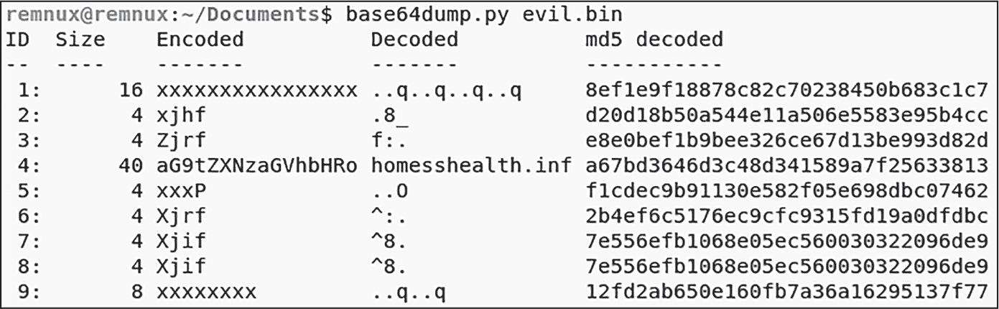

<samp class="SANS_Futura_Std_Book_Oblique_I_11">图 16-1：在</samp> <samp class="SANS_Futura_Std_Book_11">base64dump.py 中查看 Base64 编码的字符串</samp>

注意第 4 行中可能的解码字符串（<samp class="SANS_TheSansMonoCd_W5Regular_11">homesshealth.inf</samp>）。你也可以看到部分编码值。要全面评估这个解码字符串，可以使用 *base64dump.py* 中的 <samp class="SANS_TheSansMonoCd_W5Regular_11">-d</samp>（dump，转储）和 <samp class="SANS_TheSansMonoCd_W5Regular_11">-s</samp>（section，部分）开关，将感兴趣的部分（在此例中是 <samp class="SANS_TheSansMonoCd_W5Regular_11">4</samp>）提取并保存到磁盘：

```
**> base64dump.py evil.bin -s 4 -d**
```

注意，恶意软件作者可以轻松修改标准的 Base64 编码，以防止他们的数据被逆向。仅仅修改 Base64 字符集就会大幅改变其输出。例如，考虑以下修改过的索引字符串：

```
abcdABCDEFGHIJKLMNOPQRSTUVWXYZefghijklmnopqrstuvwxyz0123456789+/
```

将其与之前提到的原始 Base64 字符集进行比较：

```
ABCDEFGHIJKLMNOPQRSTUVWXYZabcdefghijklmnopqrstuvwxyz0123456789+/
```

你注意到区别了吗？在第一组中，字符<samp class="SANS_TheSansMonoCd_W5Regular_11">abcd</samp>被移到了字符集的开头，位于<samp class="SANS_TheSansMonoCd_W5Regular_11">ABCD</samp>之前。仅仅将<samp class="SANS_TheSansMonoCd_W5Regular_11">abcd</samp>移到此索引的开头，就会显著改变 Base64 编码的输出，而且这是一个非常简单的更改。为了检测这些变化，你可以像前面提到的那样，在代码中查找索引字符串。通常，这种 Base64 索引会在恶意软件可执行文件的代码中清晰可见。

最后，请记住，在分析恶意软件时，你可能会遇到其他编码方式（如 Base32、Base85、uuencode 和 yEnc），但这些并不像 Base64 那样常见。花时间学习如何识别和解码 Base64 编码，将帮助你处理大多数涉及简单恶意软件数据编码的案例。恶意软件作者常常会将 PE 文件编码为 Base64。由于 PE 文件的头部包含 ASCII 字符<samp class="SANS_TheSansMonoCd_W5Regular_11">MZ</samp>，因此要注意编码后的<samp class="SANS_TheSansMonoCd_W5Regular_11">MZ</samp>，它的编码版本以<samp class="SANS_TheSansMonoCd_W5Regular_11">TV</samp>开头。

### <samp class="SANS_Futura_Std_Bold_B_11">数据哈希</samp>

*哈希*本质上是一种单向数据编码，意味着理论上它无法被逆转。当数据通过哈希算法处理时，生成的哈希值将始终具有相同的长度。例如，MD5 哈希算法始终生成一个固定长度为 128 位或 32 个字符的哈希值。SHA-1 生成一个 160 位或 40 个字符的哈希值。最后，SHA256 生成一个 256 位或 64 个字符的哈希值。

让我们使用之前提到的 CyberChef 来看看数据哈希在实践中的表现。在图 16-2 中，我使用了 CyberChef 和 MD5 来哈希一个简单的 URL，并在输出框中生成了 32 字符的哈希值。

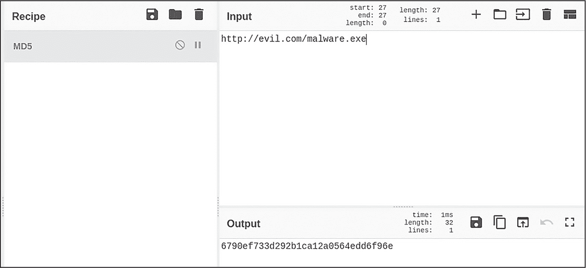

<samp class="SANS_Futura_Std_Book_Oblique_I_11">图 16-2：使用 CyberChef 进行 MD5 哈希</samp>

在图 16-3 中，我修改了 URL 中的一个字符。

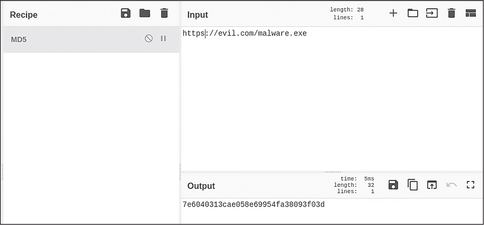

<samp class="SANS_Futura_Std_Book_Oblique_I_11">图 16-3：在 CyberChef 中修改输入的 URL</samp>

你可能会发现，我只是简单地在<samp class="SANS_TheSansMonoCd_W5Regular_11">http</samp>字符串后面添加了一个<samp class="SANS_TheSansMonoCd_W5Regular_11">s</samp>。注意，哈希输出完全改变了。这种现象，即对于不同的输入数据（即使这些输入数据有 99%的相似性）会生成完全不同的哈希值，称为*级联效应*。级联效应将输入数据分成多个字符组，然后再对子组进行细分。

> <samp class="SANS_Dogma_OT_Bold_B_15">注意</samp>

*在本章接下来的各种示例中，我们将使用 CyberChef。这是一个功能强大的数据处理工具，它不仅仅用于哈希数据，还可以用于其他许多数据操作任务。熟悉它的功能是个好主意。*

恶意软件还可以利用哈希的强大功能进行混淆处理，并且它可以通过几种不同的方式在其代码中实现这些哈希算法。一种方法是使用 Windows 中的原生 CryptoAPI。该服务为软件（在我们的案例中是恶意软件）提供了一个简单易用的 API，用于编码、解码、加密和解密数据。我将在本章后面介绍 CryptoAPI，并举例说明它如何在恶意软件中使用。恶意软件作者可能使用的第二种方法是创建自己的自定义哈希算法。博客网站 *Red Team Experiments* 上的文章《恶意软件中的 Windows API 哈希》（[*https://<wbr>www<wbr>.ired<wbr>.team<wbr>/offensive<wbr>-security<wbr>/defense<wbr>-evasion<wbr>/windows<wbr>-api<wbr>-hashing<wbr>-in<wbr>-malware*](https://www.ired.team/offensive-security/defense-evasion/windows-api-hashing-in-malware)）描述了一段小型自定义代码，可以用于哈希 API 函数导入，将这些函数名称从反向工程师和宿主防御中隐藏起来。

根据所使用的算法，哈希在反向分析恶意软件时可能会很棘手。你可以尝试使用哈希破解工具，通过将哈希函数的输出与预计算的已知输入及其对应的输出字典进行比较来暴力破解输入。如果这是一个众所周知的算法，已经有一些工具和资源提供了恶意软件中常见字符串的预哈希值。例如，OALabs 写了一个叫做 hashdb 的工具（[*https://<wbr>github<wbr>.com<wbr>/OALabs<wbr>/hashdb*](https://github.com/OALabs/hashdb)），以及它的配套 IDA Pro 插件 hashdb-ida（[*https://<wbr>github<wbr>.com<wbr>/OALabs<wbr>/hashdb<wbr>-ida*](https://github.com/OALabs/hashdb-ida)），这是一个常见恶意软件字符串的数据库。这个工具非常适合查询恶意软件中引用的未知哈希值，并获得“未哈希”的字符串。该工具支持常见哈希，如 CRC-32 和 ROR-13，以及特定恶意软件家族（如 GuLoader 和 Lockbit）中看到的自定义哈希实现。

如果恶意软件使用未知的自定义哈希算法，过程就更加复杂。要了解恶意软件哈希的数据，你需要首先理解该数据的上下文。你可能需要根据周围的数据，做出有关明文字符串可能是什么的猜测。例如，如果你发现了明文函数字符串，如 <samp class="SANS_TheSansMonoCd_W5Regular_11">CreateProcess</samp> 和 <samp class="SANS_TheSansMonoCd_W5Regular_11">VirtualAlloc</samp>，则周围的混淆字符串可能与进程注入函数相关，如 <samp class="SANS_TheSansMonoCd_W5Regular_11">WriteProcessMemory</samp> 或 <samp class="SANS_TheSansMonoCd_W5Regular_11">CreateRemoteThread</samp>。另一种方法是逆向工程哈希算法本身，以获取原始输入。你首先需要在代码中定位该算法，然后使用反汇编器静态分析该代码，或者使用调试器动态分析代码。接下来，我们将讨论如何在加密的上下文中定位此类代码。

### <samp class="SANS_Futura_Std_Bold_B_11">加密与解密</samp>

除了对数据进行编码外，恶意软件通常还会加密数据。与哈希不同，加密不是单向操作。任何被加密的数据都可以使用解密密钥后续解密。与哈希一样，恶意软件常常加密其部分代码或数据，以便混淆其意图、避开防御并保护自己不被逆向工程师分析。

本节将概述恶意软件可能使用的一些加密算法。然而，由于恶意软件作者甚至可以混淆他们自己的加密方法，使得确定所使用的确切加密算法变得更加困难，我们将更多关注方法论而非加密算法的具体实现。然后，我们将讨论一些识别恶意软件中加密和解密例程的技巧，以及如何克服这些技术的指导。

#### <samp class="SANS_Futura_Std_Bold_Condensed_Oblique_I_11">对称与非对称加密</samp>

加密有两种主要形式：对称加密和非对称加密。*对称加密*涉及两个客户端之间使用共享（对称）密钥。如果客户端 1 希望向客户端 2 发送数据，则每个客户端必须拥有加密密钥，因为该密钥既用于加密也用于解密数据。当恶意软件使用对称加密时，其加密密钥要么嵌入在恶意软件的代码中，要么在运行时生成（例如，使用标准 Windows 库）。常见的对称加密形式包括 AES、DES、Blowfish 和 RC4。 图 16-4 展示了对称加密和解密如何在高层次上工作。


<samp class="SANS_Futura_Std_Book_Oblique_I_11">图 16-4：对称密钥密码学如何工作</samp>

首先，明文数据通过加密算法进行加密，并使用对称加密密钥加密。一旦加密数据准备好被解密，它会通过解密算法运行，并提供相同的对称密钥，从而生成原始的明文数据。

对称加密算法有两种主要形式。*流密码*一次加密一个比特，通常非常快速。它们被用于 SSL/TLS 等协议中，以加密 Web 流量。*分组密码*将数据分成块（区块）进行加密，通常比流密码提供更强的加密。它们也是两者中更常用的一种，尤其是对于速度不是主要考虑的任务。

与对称加密不同，*非对称加密*使用两把密钥而非一把：公钥用于加密，私钥用于解密。如果客户端 1 希望加密并将数据发送给客户端 2，客户端 2 必须先与客户端 1 共享其公钥，客户端 1 利用该密钥加密数据。然后，客户端 2 使用自己的私钥解密数据。反之，当客户端 2 希望为客户端 1 加密数据时，他们用客户端 1 的公钥加密数据，客户端 1 用自己的私钥解密数据。这消除了对安全密钥交换的需求，因为公钥是用于共享和交换的，而私钥保持机密。

图 16-5 展示了非对称加密和解密的过程。


<samp class="SANS_Futura_Std_Book_Oblique_I_11">图 16-5：非对称密钥加密的工作原理</samp>

如同图 16-4 所示，明文数据通过加密算法进行处理，但这次使用的是非对称加密。使用公钥加密数据，私钥负责将数据解密回原始的明文版本。

恶意软件可以加密其代码或数据，以便将其隐藏免受逆向工程师或基于网络和主机的防御的检查。加密还用于勒索软件，这是一种恶意软件，感染受害者后加密主机系统上的选定文件，并对这些文件进行勒索。受害者支付赎金后，攻击者会将解密密钥发送给受害者，从而解密文件。现代勒索软件同时使用对称加密和非对称加密方法，或采用混合方法。

表 16-2 列出了恶意软件中使用的一些常见加密算法。

<samp class="SANS_Futura_Std_Heavy_B_11">表 16-2：</samp> <samp class="SANS_Futura_Std_Book_11">恶意软件中的加密算法</samp>

| <samp class="SANS_Futura_Std_Heavy_B_11">名称</samp> | <samp class="SANS_Futura_Std_Heavy_B_11">类型</samp> | <samp class="SANS_Futura_Std_Heavy_B_11">描述</samp> |
| --- | --- | --- |
| <samp class="SANS_Futura_Std_Book_11">高级加密标准（AES）</samp> | <samp class="SANS_Futura_Std_Book_11">对称（分组密码）</samp> | <samp class="SANS_Futura_Std_Book_11">AES 被认为是最强大的对称加密形式之一，常用于勒索软件。</samp> |
| <samp class="SANS_Futura_Std_Book_11">里维斯密码 4（RC4）</samp> | <samp class="SANS_Futura_Std_Book_11">对称（流密码）</samp> | <samp class="SANS_Futura_Std_Book_11">RC4 是一种快速且易于实现的算法，但它并不特别强大。它被多种恶意软件家族用于快速和简易的数据加密与解密。</samp> |
| <samp class="SANS_Futura_Std_Book_11">里维斯、沙米尔和阿德尔曼（RSA）</samp> | <samp class="SANS_Futura_Std_Book_11">非对称</samp> | <samp class="SANS_Futura_Std_Book_11">RSA 是以其创建者命名的流行算法，已被多种勒索软件家族使用。它以相对较高的速度和效率著称。</samp> |
| <samp class="SANS_Futura_Std_Book_11">椭圆曲线加密算法（ECC）</samp> | <samp class="SANS_Futura_Std_Book_11">非对称</samp> | <samp class="SANS_Futura_Std_Book_11">ECC 是一种较新的算法，相比 RSA，它在相同密钥长度下更为安全，因此更高效。ECC 在恶意软件中得到了更广泛的使用。</samp> |

在深入了解一些常见加密算法在恶意软件中的应用之前，我们需要先讲解加密的重要组成部分：XOR。

##### <samp class="SANS_Futura_Std_Bold_Condensed_B_11">异或</samp>

许多加密算法围绕着*异或（XOR）*操作展开，因此理解它的工作原理非常重要。在 XOR 操作中，输入数据按位与提供的密钥进行比较。表 16-3 展示了一个示例，其中输入 A 和输入 B 的位进行比较，产生一个输出值。

<samp class="SANS_Futura_Std_Heavy_B_11">表 16-3：</samp> <samp class="SANS_Futura_Std_Book_11">XOR 二进制输出</samp>

| <samp class="SANS_Futura_Std_Heavy_B_11">输入 A</samp> | <samp class="SANS_Futura_Std_Heavy_B_11">输入 B</samp> | <samp class="SANS_Futura_Std_Heavy_B_11">XOR 输出</samp> |
| --- | --- | --- |
| <samp class="SANS_Futura_Std_Book_11">0</samp> | <samp class="SANS_Futura_Std_Book_11">0</samp> | <samp class="SANS_Futura_Std_Book_11">0</samp> |
| <samp class="SANS_Futura_Std_Book_11">1</samp> | <samp class="SANS_Futura_Std_Book_11">0</samp> | <samp class="SANS_Futura_Std_Book_11">1</samp> |
| <samp class="SANS_Futura_Std_Book_11">0</samp> | <samp class="SANS_Futura_Std_Book_11">1</samp> | <samp class="SANS_Futura_Std_Book_11">1</samp> |
| <samp class="SANS_Futura_Std_Book_11">1</samp> | <samp class="SANS_Futura_Std_Book_11">1</samp> | <samp class="SANS_Futura_Std_Book_11">0</samp> |

如您所见，如果输入 A 和输入 B 的位相同，结果输出值为 0。如果位不同，输出则为 1。

数据是基于密钥进行 XOR 操作的，该密钥有时是 1 字节长（但可以调整，正如你稍后会看到的那样）。请查看 表 16-4 中的 XOR 操作，它使用了 1 字节的 XOR 密钥 0x35。

<samp class="SANS_Futura_Std_Heavy_B_11">表 16-4：</samp> <samp class="SANS_Futura_Std_Book_11">使用密钥 0x35 进行 XOR 操作的输出</samp>

| <samp class="SANS_Futura_Std_Heavy_B_11">输入文本</samp> | <samp class="SANS_Futura_Std_Heavy_B_11">h</samp> | <samp class="SANS_Futura_Std_Heavy_B_11">t</samp> | <samp class="SANS_Futura_Std_Heavy_B_11">t</samp> | <samp class="SANS_Futura_Std_Heavy_B_11">p</samp> | <samp class="SANS_Futura_Std_Heavy_B_11">s</samp> |
| --- | --- | --- | --- | --- | --- |
| <samp class="SANS_Futura_Std_Medium_11">输入（以二进制表示）</samp> | <samp class="SANS_Futura_Std_Book_11">01101000</samp> | <samp class="SANS_Futura_Std_Book_11">01110100</samp> | <samp class="SANS_Futura_Std_Book_11">01110100</samp> | <samp class="SANS_Futura_Std_Book_11">01110000</samp> | <samp class="SANS_Futura_Std_Book_11">01110011</samp> |
| <samp class="SANS_Futura_Std_Medium_11">XOR 密钥（35）</samp> | <samp class="SANS_Futura_Std_Book_11">00110101</samp> | <samp class="SANS_Futura_Std_Book_11">00110101</samp> | <samp class="SANS_Futura_Std_Book_11">00110101</samp> | <samp class="SANS_Futura_Std_Book_11">00110101</samp> | <samp class="SANS_Futura_Std_Book_11">00110101</samp> |
| <samp class="SANS_Futura_Std_Medium_11">输出（以二进制表示）</samp> | <samp class="SANS_Futura_Std_Book_11">01011101</samp> | <samp class="SANS_Futura_Std_Book_11">01000001</samp> | <samp class="SANS_Futura_Std_Book_11">01000001</samp> | <samp class="SANS_Futura_Std_Book_11">01000101</samp> | <samp class="SANS_Futura_Std_Book_11">01000110</samp> |
| <samp class="SANS_Futura_Std_Medium_11">输出文本</samp> | <samp class="SANS_TheSansMonoCd_W5Regular_11">]</samp> | <samp class="SANS_TheSansMonoCd_W5Regular_11">A</samp> | <samp class="SANS_TheSansMonoCd_W5Regular_11">A</samp> | <samp class="SANS_TheSansMonoCd_W5Regular_11">E</samp> | <samp class="SANS_TheSansMonoCd_W5Regular_11">F</samp> |

在“输入文本”一行中，ASCII 文本字符串 <samp class="SANS_TheSansMonoCd_W5Regular_11">https</samp> 正在使用密钥 0x35 进行 XOR 操作。“输入（以二进制表示）”行显示了该 <samp class="SANS_TheSansMonoCd_W5Regular_11">https</samp> 字符串的二进制表示。“XOR 密钥（35）”行显示了 XOR 密钥（0x35）在二进制中的表示（00110101）。“输出（以二进制表示）”行是 XOR 后的二进制数据，即 XOR 操作完成后的数据。最后，“输出文本”行显示了输出的 ASCII 表示。请注意，XOR 操作是可逆的，这意味着要解密输出文本，只需使用相同的密钥 0x35 再次进行 XOR 操作，就会得到 <samp class="SANS_TheSansMonoCd_W5Regular_11">https</samp> 的结果。

这只是一个使用 1 字节 XOR 密钥的简单示例，但实际上，恶意软件通常通过使用更长的密钥来复杂化加密过程。例如，如果恶意软件使用像 0x356C2DA155 这样的 5 字节密钥，如 表 16-5 所示，密钥中的每个字节将与输入数据中的每个字节进行 XOR 操作，从第一个字节开始并重复。

<samp class="SANS_Futura_Std_Heavy_B_11">表 16-5：</samp> <samp class="SANS_Futura_Std_Book_11">使用密钥 0x356C2DA155 的 XOR 输出</samp>

| <samp class="SANS_Futura_Std_Heavy_B_11">输入文本</samp> | <samp class="SANS_Futura_Std_Heavy_B_11">h</samp> | <samp class="SANS_Futura_Std_Heavy_B_11">t</samp> | <samp class="SANS_Futura_Std_Heavy_B_11">t</samp> | <samp class="SANS_Futura_Std_Heavy_B_11">p</samp> | <samp class="SANS_Futura_Std_Heavy_B_11">s</samp> |
| --- | --- | --- | --- | --- | --- |
| <samp class="SANS_Futura_Std_Medium_11">输入（以二进制表示）</samp> | <samp class="SANS_Futura_Std_Book_11">01101000</samp> | <samp class="SANS_Futura_Std_Book_11">01110100</samp> | <samp class="SANS_Futura_Std_Book_11">01110100</samp> | <samp class="SANS_Futura_Std_Book_11">01110000</samp> | <samp class="SANS_Futura_Std_Book_11">01110011</samp> |
| <samp class="SANS_Futura_Std_Medium_11">XOR 密钥</samp> | <samp class="SANS_Futura_Std_Book_11">00110101 (35)</samp> | <samp class="SANS_Futura_Std_Book_11">11011000 (6C)</samp> | <samp class="SANS_Futura_Std_Book_11">10110100 (2D)</samp> | <samp class="SANS_Futura_Std_Book_11">10100001 (A1)</samp> | <samp class="SANS_Futura_Std_Book_11">10101010 (55)</samp> |
| <samp class="SANS_Futura_Std_Medium_11">输出（以二进制表示）</samp> | <samp class="SANS_Futura_Std_Book_11">01011101</samp> | <samp class="SANS_Futura_Std_Book_11">10101100</samp> | <samp class="SANS_Futura_Std_Book_11">11000000</samp> | <samp class="SANS_Futura_Std_Book_11">11010001</samp> | <samp class="SANS_Futura_Std_Book_11">11011001</samp> |
| <samp class="SANS_Futura_Std_Medium_11">输出文本</samp> | <samp class="SANS_TheSansMonoCd_W5Regular_11">]</samp> | <samp class="SANS_TheSansMonoCd_W5Regular_11">.</samp> | <samp class="SANS_TheSansMonoCd_W5Regular_11">Y</samp> | <samp class="SANS_TheSansMonoCd_W5Regular_11">Ñ</samp> | <samp class="SANS_TheSansMonoCd_W5Regular_11">&</samp> |

现在，<samp class="SANS_TheSansMonoCd_W5Regular_11">https</samp> 的 ASCII 文本字符串与密钥 0x356C2DA155 进行异或运算（XOR），为了简化展示，密钥被分解为多个列。密钥的每个字节将与文本的一个字节进行异或操作。结果的二进制形式显示在第四行，接下来是异或结果的文本表示。有关 XOR 操作的更完整技术解释，请参阅 [*https://<wbr>en<wbr>.wikipedia<wbr>.org<wbr>/wiki<wbr>/Exclusive<wbr>_or*](https://en.wikipedia.org/wiki/Exclusive_or)。

对于恶意软件作者来说，XOR 是非常有用的；它速度快、高效，而且实现简单。然而，它也有一些缺点。如我之前提到的，你可以通过提供与加密时相同的密钥来解密 XOR 加密的数据。为了让 XOR 正常工作，XOR 密钥必须硬编码在恶意软件的代码中，而有经验的逆向工程师可能会找到它。此外，由于 XOR 密钥有时只有一个字节或几个字节长，你通常可以通过暴力破解 XOR 数据，尝试所有可能的 XOR 密钥组合。

有几种工具可以做到这一点。例如，Didier Stevens 的 XORSearch（[*https://<wbr>blog<wbr>.didierstevens<wbr>.com<wbr>/programs<wbr>/xorsearch<wbr>/*](https://blog.didierstevens.com/programs/xorsearch/)）会在输入文件中搜索字符串，尝试不同的 XOR 密钥（以及其他编码方式），并输出结果。我通过 XORSearch 运行了一个可执行文件，得到了 图 16-6 所示的结果。

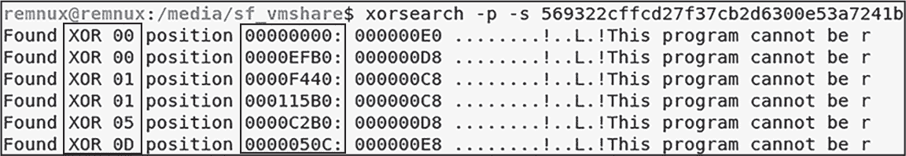

<samp class="SANS_Futura_Std_Book_Oblique_I_11">图 16-6：XORSearch 工具的输出</samp>

第一行中的命令包括几个参数：<samp class="SANS_TheSansMonoCd_W5Regular_11">-p</samp> 告诉 XORSearch 专门搜索编码过的 PE 文件，<samp class="SANS_TheSansMonoCd_W5Regular_11">-s</samp> 开关则告诉 XORSearch 如果找到可执行文件就进行输出。这个可执行文件内嵌了五个额外的可执行文件，其中四个使用 XOR 编码（第一个结果可以忽略，因为它只是包含输入文件的 PE 头）。XORSearch 显示了 XOR 密钥（在第 1 列中高亮显示）和嵌入文件所在的偏移地址（在第 2 列中高亮显示）。

你可以使用反汇编器或调试器轻松发现恶意软件中的 XOR 指令；这条指令就是 <samp class="SANS_TheSansMonoCd_W5Regular_11">xor</samp>。在 IDA Pro 中，一旦加载了你的恶意软件样本，导航到 **搜索****文本**，输入 <samp class="SANS_TheSansMonoCd_W7Bold_B_11">xor</samp> 作为搜索字符串，然后点击 **查找所有出现的地方**。图 16-7 显示了一些示例输出。

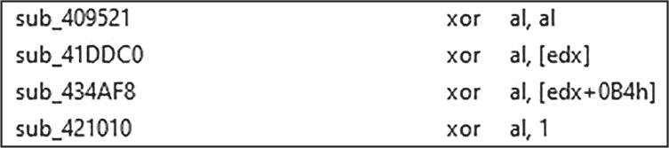

<samp class="SANS_Futura_Std_Book_Oblique_I_11">图 16-7：在 IDA Pro 中查看 XOR 指令</samp>

图中的第一个 XOR 操作对我们并不重要。将寄存器与其自身进行 XOR 运算会清除寄存器，将其设置为 0。这是可执行文件中 XOR 最常见的用法，它与加密并没有直接关系。

最下面的三条 <samp class="SANS_TheSansMonoCd_W5Regular_11">xor</samp> 操作是我们关心的。在这些示例中，一个 CPU 寄存器正与一个内存地址进行 XOR 操作。在 <samp class="SANS_TheSansMonoCd_W5Regular_11">xor al, [edx]</samp> 指令中，<samp class="SANS_TheSansMonoCd_W5Regular_11">al</samp> 是寄存器，<samp class="SANS_TheSansMonoCd_W5Regular_11">[edx]</samp> 是内存地址。在这种情况下，寄存器通常包含 XOR 密钥，正在与存储在内存中的数据进行 XOR 操作。反之亦然。

如果你在代码中发现了 XOR 操作，你可以通过定位代码中的目标加密数据和 XOR 密钥来解密这些数据。例如，在 <samp class="SANS_TheSansMonoCd_W5Regular_11">xor al, [edx]</samp> 的情况下，你可以检查 <samp class="SANS_TheSansMonoCd_W5Regular_11">al</samp> 寄存器来寻找 XOR 密钥。此外，检查 EDX 中的内存指针通常能帮助你找到被 XOR 操作的数据。在调试器中动态分析恶意软件有助于这一过程。

一旦你定位到数据和 XOR 密钥，你可以从文件中复制数据，并使用该密钥进行 XOR 操作。任何工具都可以实现这个操作，但我们再次使用 CyberChef。图 16-8 演示了使用 XOR 密钥 1A2D3F 的操作。

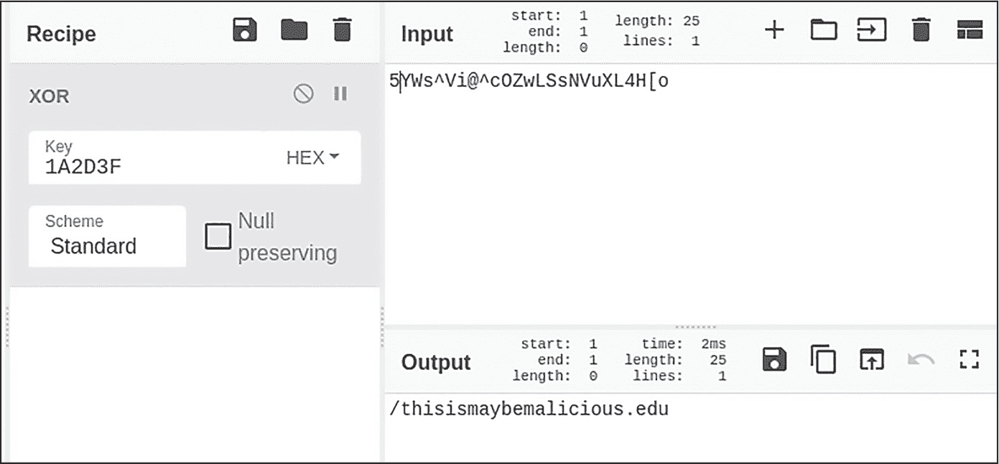

<samp class="SANS_Futura_Std_Book_Oblique_I_11">图 16-8：CyberChef 中的 XOR 解码</samp>

恶意软件通常会在执行代码之前先在内存中解密 XOR 加密的数据和代码。一种逆向工程策略是让恶意软件为你解密这些数据，然后获取它。你可以使用调试器进行操作，我将在《解密加密的恶意软件数据》一节中进一步讨论，第 339 页会详细说明。

顺便提一下，除了 <samp class="SANS_TheSansMonoCd_W5Regular_11">xor</samp> 指令之外，还有一些其他基本方法，某些恶意软件用来混淆代码和数据，例如 <samp class="SANS_TheSansMonoCd_W5Regular_11">ror</samp>（右旋转）和 <samp class="SANS_TheSansMonoCd_W5Regular_11">rol</samp>（左旋转），它们只是将字节按特定数量的空间旋转到任意方向。举个例子，考虑指令 <samp class="SANS_TheSansMonoCd_W5Regular_11">ror eax, 5</samp>。如果 EAX 寄存器的值是 <samp class="SANS_TheSansMonoCd_W5Regular_11">12345678</samp>，当你将所有数字右移五位时，新值变为 <samp class="SANS_TheSansMonoCd_W5Regular_11">45678123</samp>。所有数字已经右移了五个位置，因此被“推出”末尾的数字（4、5、6、7 和 8）现在出现在字符串的开头。<samp class="SANS_TheSansMonoCd_W5Regular_11">rol</samp> 指令将执行此操作的反向操作。

##### <samp class="SANS_Futura_Std_Bold_Condensed_B_11">Rivest Cipher 4</samp>

Rivest Cipher 4，简称 RC4，是恶意软件中最常用的流加密算法之一，因为它实现简单且相对强大（与基本的编码如 Base64 或甚至 XOR 相比）。它的基本工作步骤在图 16-9 中有说明。

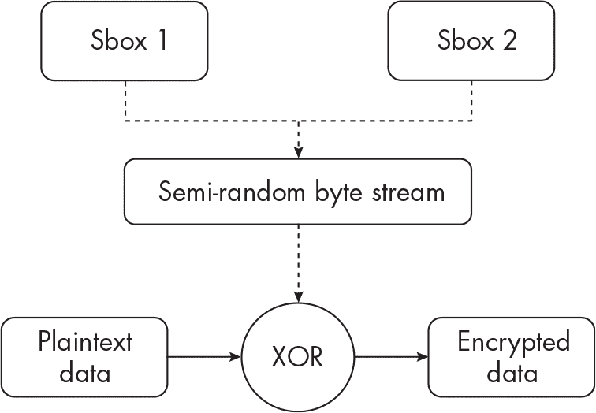

<samp class="SANS_Futura_Std_Book_Oblique_I_11">图 16-9：RC4 工作原理概述</samp>

首先，算法创建了一个值数组，称为 *Sbox*，该数组包含 256 字节（或 0x100 的十六进制）。这是 Sbox 1。另一个 Sbox（Sbox 2）被初始化并包含加密密钥。RC4 密钥长度可以在 1 到 256 字节之间。这个密钥可以硬编码在恶意软件的可执行文件中，或者动态生成。

Sbox 1 和 Sbox 2 然后结合，它们的数据被多次打乱以创建一个半随机字节流。明文（正在加密的数据）接着与这个字节流进行异或操作，这本质上是一个异或密钥。当这个加密数据需要解密时，它会再次与相同的密钥流进行异或操作。

在处理代码中的加密和解密过程时，你可能能够轻松地识别出正在使用的某些算法。256 字节的数组是 RC4 使用的明显标志。你可能会看到 <samp class="SANS_TheSansMonoCd_W5Regular_11">0x100</samp> 在代码中多次被引用，后面跟着循环，就像下面这段代码一样：

```
`--snip--`
loc_45B5F9:
`--snip--`
mov [eax], ebx
inc ebx
add eax, 4
❶ cmp  ebx, 100h
❷ jnz  short loc_45B5F9

loc_45B62A:
`--snip--`
xor eax, eax
mov al, [ebp+var_D]
mov [ebp+edi*4+var_418], eax
inc ebx
add esi, 4
❸ cmp  ebx, 100h
❹ jnz  short loc_45B62A
```

这个例子展示了 RC4 在恶意软件样本中的可能表现。第一段代码展示了 Sbox 1 数组的初始化，并进行与 <samp class="SANS_TheSansMonoCd_W5Regular_11">0x100</samp> ❶ 的比较操作。注意回到函数开始的跳转 ❷，表示一个循环。在第二段代码中，另一个对 <samp class="SANS_TheSansMonoCd_W5Regular_11">0x100</samp>（Sbox 2）的引用及随后的比较操作 ❸，以及一个循环 ❹。这些代码中的两个函数循环通常能揭示出 RC4 的使用。

#### <samp class="SANS_Futura_Std_Bold_Condensed_Oblique_I_11">Windows CryptoAPI</samp>

Windows 提供了许多常见加密算法的实现，称为 *Microsoft Cryptography API (CryptoAPI)*。这个 API 支持多种常见的对称和非对称加密算法，并提供其他服务，如数字证书和哈希。CryptoAPI 还包括了一个在 Windows Vista 中出现的更新版本，称为 *Cryptography API: Next Generation (CNG)*。CNG 包含了 Windows 提供的最新加密库，增加了对现代算法的支持，以及对自定义加密 API 的支持。CNG 在 Windows 的新版本中大大取代了 CryptoAPI。尽管 CryptoAPI 已被弃用，但仍然值得讨论，因为它在恶意软件中仍然被广泛使用，且有着悠久的历史，容易理解。

##### <samp class="SANS_Futura_Std_Bold_Condensed_B_11">CryptoAPI 函数</samp>

在初始化 CryptoAPI 时，应用程序必须调用的关键函数之一是 <samp class="SANS_TheSansMonoCd_W5Regular_11">CryptAcquireContext</samp>。该函数负责返回一个指向*加密服务提供者（CSP）*的句柄，CSP 是一个执行加密和解密功能并存储相关加密密钥的模块。由于 CSP 是某些 Windows 程序的核心部分，它们受到严格控制。应用程序无法直接访问 CSP 的内部，所有操作都通过 API 函数调用间接进行。

表 16-6 描述了 <samp class="SANS_TheSansMonoCd_W5Regular_11">CryptAcquireContext</samp> 以及在 CryptoAPI 中暴露的其他一些重要函数。

<samp class="SANS_Futura_Std_Heavy_B_11">表 16-6：</samp> <samp class="SANS_Futura_Std_Book_11">重要的 CryptoAPI 函数</samp>

| <samp class="SANS_Futura_Std_Heavy_B_11">名称</samp> | <samp class="SANS_Futura_Std_Heavy_B_11">描述</samp> |
| --- | --- |
| <samp class="SANS_TheSansMonoCd_W5Regular_11">CryptAcquireContext</samp> | <samp class="SANS_Futura_Std_Book_11">获取指向特定密钥容器的句柄，该容器是几乎所有加密操作的前驱。</samp> |
| <samp class="SANS_TheSansMonoCd_W5Regular_11">CryptGenKey</samp> | <samp class="SANS_Futura_Std_Book_11">为非对称加密生成公钥和私钥对，或者生成一个随机会话密钥。</samp> |
| <samp class="SANS_TheSansMonoCd_W5Regular_11">CryptGenRandom</samp> | <samp class="SANS_Futura_Std_Book_11">填充一个缓冲区以生成随机字节，有时用于生成密钥。</samp> |
| <samp class="SANS_TheSansMonoCd_W5Regular_11">CryptEncrypt</samp> | <samp class="SANS_Futura_Std_Book_11">加密来自明文缓冲区的数据。</samp> |
| <samp class="SANS_TheSansMonoCd_W5Regular_11">CryptDecrypt</samp> | <samp class="SANS_Futura_Std_Book_11">解密使用</samp> <samp class="SANS_TheSansMonoCd_W5Regular_11">CryptEncrypt</samp><samp class="SANS_Futura_Std_Book_11">加密的数据。</samp> |
| <samp class="SANS_TheSansMonoCd_W5Regular_11">CryptDestroyKey</samp> | <samp class="SANS_Futura_Std_Book_11">销毁密钥的句柄。这是一个常见的清理函数。</samp> |
| <samp class="SANS_TheSansMonoCd_W5Regular_11">CryptReleaseContext</samp> | <samp class="SANS_Futura_Std_Book_11">释放对 CSP 和相关密钥容器的句柄。这是一个常见的清理函数。</samp> |
| <samp class="SANS_TheSansMonoCd_W5Regular_11">CryptCreateHash</samp> | <samp class="SANS_Futura_Std_Book_11">启动数据流的哈希过程，并初始化一个哈希对象，用于存储哈希数据。</samp> |
| <samp class="SANS_TheSansMonoCd_W5Regular_11">CryptDestroyHash</samp> | <samp class="SANS_Futura_Std_Book_11">销毁哈希对象。这是一个常见的清理函数。</samp> |

表中最有趣的函数是<samp class="SANS_TheSansMonoCd_W5Regular_11">CryptEncrypt</samp>和<samp class="SANS_TheSansMonoCd_W5Regular_11">CryptDecrypt</samp>。<samp class="SANS_TheSansMonoCd_W5Regular_11">CryptEncrypt</samp>接受许多参数，例如加密密钥的句柄（通过<samp class="SANS_TheSansMonoCd_W5Regular_11">CryptGenKey</samp>或<samp class="SANS_TheSansMonoCd_W5Regular_11">CryptImportKey</samp>创建）和指向包含待加密明文数据的缓冲区的指针。如果你正在分析一个使用加密操作并调用<samp class="SANS_TheSansMonoCd_W5Regular_11">CryptEncrypt</samp>加密数据的恶意软件样本，你可以在调试器中为此函数设置一个断点，并检查明文缓冲区，这样就能暴露正在加密的数据！你将在本章后面看到一个这样的例子。

开发人员通常会在这些加密函数周围添加封装器，以简化实现，这样软件开发者就不需要直接调用每个函数，从而减少编程错误。这一点非常值得注意，因为一些恶意软件作者直接在代码中调用加密库，而不是使用现有的封装器。由于恶意软件开发者实际上也是人类，容易犯错，直接调用这些 Windows 加密函数可能会给经验不足的恶意软件开发者带来问题。一个勒索软件家族，CryptoLocker，在实现 RSA 加密算法时存在一个缺陷，使得其加密的赎金文件容易被解密。Emsisoft 的研究人员发现 CryptoLocker 错误地实现了<samp class="SANS_TheSansMonoCd_W5Regular_11">CryptAcquireContext</samp>。该函数的一个参数接受标志值，以启用额外功能。一个标志，<samp class="SANS_TheSansMonoCd_W5Regular_11">CRYPT_VERIFYCONTEXT</samp>，必须被设置，否则生成的私钥会存储在本地主机上。这一缺陷对 CryptoLocker 来说非常麻烦。如果解密密钥存储在主机上，受害者只需知道存储位置，就能轻松恢复文件。这正是 Emsisoft 所做的，它恢复了许多受害者的文件。有关更多详情，请参见 Emsisoft 博客中的文章“CryptoDefense：不安全勒索软件密钥与自利博主的故事”([*https://<wbr>www<wbr>.emsisoft<wbr>.com<wbr>/en<wbr>/blog<wbr>/6032<wbr>/cryptodefense<wbr>-the<wbr>-story<wbr>-of<wbr>-insecure<wbr>-ransomware<wbr>-keys<wbr>-and<wbr>-self<wbr>-serving<wbr>-bloggers<wbr>/*](https://www.emsisoft.com/en/blog/6032/cryptodefense-the-story-of-insecure-ransomware-keys-and-self-serving-bloggers/))。

Windows CryptoAPI 相当复杂，并且包含许多不同的功能。有关这些功能的更详细信息，请参阅微软在 MSDN 上的优秀文章“CryptoAPI 系统架构” ([*https://<wbr>learn<wbr>.microsoft<wbr>.com<wbr>/en<wbr>-us<wbr>/windows<wbr>/win32<wbr>/seccrypto<wbr>/cryptoapi<wbr>-system<wbr>-architecture*](https://learn.microsoft.com/en-us/windows/win32/seccrypto/cryptoapi-system-architecture))。

##### <samp class="SANS_Futura_Std_Bold_Condensed_B_11">CryptoAPI 实践分析</samp>

现在让我们看看 Windows CryptoAPI 在实际中的表现；具体来说，让我们检查一下如何实现哈希算法。这个恶意软件示例将获取受害系统所属的 DNS 域名，对其进行哈希处理，并将生成的哈希与硬编码的哈希进行比较：即恶意软件的目标域名。如果哈希值不匹配（意味着受害者的域名与目标域名不一致），恶意软件将不会感染受害系统。此外，将硬编码的域名以哈希形式存储，使得逆向工程师更难（甚至不可能）发现恶意软件实际寻找的域名。让我们通过以下伪代码进一步了解实际情况：

```
hashedTargetDomain = "4b557a3281181193f1b1fae7228314e77d174fa13b59f606c5400409f13875a2"; ❶

GetComputerNameExA(ComputerNameDnsDomain,domainName,dataSize); ❷

CryptAcquireContextA(&hCSP,0,0,0x18,0xf0000000); ❸
CryptCreateHash(hCSP,0x800c,0,0,&hHash); ❹
CryptHashData(hHash,domainName,dataLength,0); ❺
CryptGetHashParam(hHash,HP_HASHSIZE,hashSize,&dataLength,0); ❻
CryptGetHashParam(hHash,HP_HASHVAL,hashedDomainName,hashSize,0);

if (hHash != 0) { ❼
    CryptDestroyHash(hHash);
 }

if (hCSP != 0) { ❽
    CryptReleaseContext(hCSP,0);
 }

<samp class="SANS_TheSansMonoCd_W5Regular_11">memcmp(hashedDomainName,hashedTargetDomain,0x20);</samp> ❾
```

在这个示例中，恶意软件首先定义其目标域名，*victimcompany.com*。该字符串的 SHA256 哈希值为 <samp class="SANS_TheSansMonoCd_W5Regular_11">4b557a3281181193f1b1fae7228314e77d174fa13b59f606c5400409f13875a2</samp>，并存储在变量 <samp class="SANS_TheSansMonoCd_W5Regular_11">hashedTargetDomain</samp> ❶ 中。接下来，恶意软件调用 <samp class="SANS_TheSansMonoCd_W5Regular_11">GetComputerNameExA</samp>，并传入参数 <samp class="SANS_TheSansMonoCd_W5Regular_11">ComputerNameDnsDomain</samp> 来获取感染系统的域名，结果将存储在名为 <samp class="SANS_TheSansMonoCd_W5Regular_11">domainName</samp> 的内存缓冲区中 ❷。然后，恶意软件调用 <samp class="SANS_TheSansMonoCd_W5Regular_11">CryptAquireContextA</samp> ❸，并传入以下参数：一个指针，指向将存储 CSP 句柄的内存位置，密钥容器名称（此处为 <samp class="SANS_TheSansMonoCd_W5Regular_11">NULL</samp>），使用的 CSP（<samp class="SANS_TheSansMonoCd_W5Regular_11">NULL</samp> 表示将使用默认的 Windows 提供程序），提供程序类型（0x18，表示 Microsoft 增强版 RSA 和 AES 加密提供程序），以及标志参数。大多数这些参数在此并不重要。最需要提及的是加密提供程序类型：在此情况下，使用的是 Microsoft 增强版 RSA 和 AES 加密提供程序，它支持多种哈希和加密格式。

> <samp class="SANS_Dogma_OT_Bold_B_15">注意</samp>

*要查看 Microsoft 支持的完整加密提供程序类型列表，请参见* [`learn.microsoft.com/en-us/windows/win32/seccrypto/cryptographic-provider-types`](https://learn.microsoft.com/en-us/windows/win32/seccrypto/cryptographic-provider-types)。

在恶意软件获取密钥容器的句柄后，它接着调用 <samp class="SANS_TheSansMonoCd_W5Regular_11">CryptCreateHash</samp> 创建哈希对象的句柄 ❹。在生成哈希之前，必须创建该哈希对象。该函数接受以下参数：新创建的加密服务提供程序的句柄 (<samp class="SANS_TheSansMonoCd_W5Regular_11">hCSP</samp>)，算法 ID (<samp class="SANS_TheSansMonoCd_W5Regular_11">x800C</samp> 或 <samp class="SANS_TheSansMonoCd_W5Regular_11">CALG_SHA_256</samp>)，哈希密钥，一个可选的标志值，以及指向新哈希对象句柄的指针 (<samp class="SANS_TheSansMonoCd_W5Regular_11">hHash</samp>)。由于恶意软件为算法 ID 参数传入了 <samp class="SANS_TheSansMonoCd_W5Regular_11">CALG_SHA_256</samp> 的值，因此可以推测恶意软件正在使用 SHA256 哈希算法。

最终获取受害者域名的哈希值时，恶意软件调用 <samp class="SANS_TheSansMonoCd_W5Regular_11">CryptHashData</samp> 从域名字符串 ❺ 创建哈希。当恶意软件调用 <samp class="SANS_TheSansMonoCd_W5Regular_11">CryptHashData</samp> 函数时，它传递以下参数：先前创建的哈希对象句柄 (<samp class="SANS_TheSansMonoCd_W5Regular_11">hHash</samp>)，指向包含要哈希数据的缓冲区的指针 (<samp class="SANS_TheSansMonoCd_W5Regular_11">domainName</samp>)，哈希数据的长度，以及一个可选的标志值。调用该函数后，域名的哈希值将存储在哈希对象中。

要检索哈希数据，恶意软件必须调用 <samp class="SANS_TheSansMonoCd_W5Regular_11">CryptGetHashParam</samp> ❻。<samp class="SANS_TheSansMonoCd_W5Regular_11">CryptGetHashParam</samp> 的参数如下：哈希对象的句柄 (<samp class="SANS_TheSansMonoCd_W5Regular_11">hHash</samp>)，查询类型（请求的数据类型，如哈希大小或哈希值），指向接收请求数据的缓冲区的指针，返回数据的大小，以及一个可选的标志值。该恶意软件调用 <samp class="SANS_TheSansMonoCd_W5Regular_11">CryptGetHashParam</samp> 两次：第一次获取哈希数据的大小，第二次获取实际的哈希数据（即受害者域名的哈希值）。在此函数的末尾，恶意软件调用 <samp class="SANS_TheSansMonoCd_W5Regular_11">CryptDestroyHash</samp> 销毁哈希对象 ❼ 并调用 <samp class="SANS_TheSansMonoCd_W5Regular_11">CryptReleaseContext</samp> 释放密钥容器和 CSP 的句柄 ❽。这些是标准的清理函数。

最后，恶意软件必须将硬编码的哈希值与受害者域名的哈希值进行比较，以确定受害者是否是其正确目标。为此，恶意软件调用了 <samp class="SANS_TheSansMonoCd_W5Regular_11">memcmp</samp>，即内存比较，这是一个比较内存中两个值的函数 ❾。正在比较的值是 <samp class="SANS_TheSansMonoCd_W5Regular_11">hashedDomainName</samp> 和 <samp class="SANS_TheSansMonoCd_W5Regular_11">hashedTargetDomain</samp>。如果这些值匹配（意味着主机是恶意软件的目标域的一部分），恶意软件将继续感染该主机。如果不匹配，恶意软件将终止自身。

这个恶意代码示例使用了一个 *护栏*，这是恶意软件作者为避免感染意外受害者而设置的安全措施。这种类型的护栏还可以作为沙盒规避技术，因为恶意软件在没有它需要的域名的沙盒环境中无法正常执行。

#### <samp class="SANS_Futura_Std_Bold_Condensed_Oblique_I_11">Windows 加密 API: 下一代</samp>

由于它仅仅是对 CryptoAPI 的更新，CNG 在功能上非常相似。然而，几乎所有 CNG 函数都以 <samp class="SANS_TheSansMonoCd_W5Regular_11">B</samp> 为前缀，这有助于区分这两个 API。例如，<samp class="SANS_TheSansMonoCd_W5Regular_11">CryptEncrypt</samp> 是 CryptoAPI 的一部分，而 <samp class="SANS_TheSansMonoCd_W5Regular_11">BCryptEncrypt</samp> 是 CNG 的一部分。表 16-7 列出了你可能在恶意软件中看到的一些常见 CNG 函数。

<samp class="SANS_Futura_Std_Heavy_B_11">表 16-7：</samp> <samp class="SANS_Futura_Std_Book_11">重要的 CNG 函数</samp>

| <samp class="SANS_Futura_Std_Heavy_B_11">函数</samp> | <samp class="SANS_Futura_Std_Heavy_B_11">描述</samp> |
| --- | --- |
| <samp class="SANS_TheSansMonoCd_W5Regular_11">BCryptOpenAlgorithmProvider</samp> | <samp class="SANS_Futura_Std_Book_11">初始化一个加密提供程序。这与</samp> <samp class="SANS_TheSansMonoCd_W5Regular_11">CryptAcquireContext</samp> <samp class="SANS_Futura_Std_Book_11">在 CryptoAPI 中的功能非常相似。</samp> |
| <samp class="SANS_TheSansMonoCd_W5Regular_11">BCryptGenerateKeyPair</samp> | <samp class="SANS_Futura_Std_Book_11">初始化一个用于非对称加密的公私钥对。</samp> |
| <samp class="SANS_TheSansMonoCd_W5Regular_11">BCryptGenerateSymmetricKey</samp> | <samp class="SANS_Futura_Std_Book_11">生成对称加密的密钥。</samp> |
| <samp class="SANS_TheSansMonoCd_W5Regular_11">BCryptEncrypt</samp> | <samp class="SANS_Futura_Std_Book_11">加密明文数据。</samp> |
| <samp class="SANS_TheSansMonoCd_W5Regular_11">BCryptDecrypt</samp> | <samp class="SANS_Futura_Std_Book_11">解密数据。</samp> |
| <samp class="SANS_TheSansMonoCd_W5Regular_11">BCryptDestroyKey</samp> | <samp class="SANS_Futura_Std_Book_11">销毁一个密钥对象。这是一个常见的清理函数。</samp> |

由于它与 CryptoAPI 相似，本书中不会详细介绍 CNG。有关更多信息，请参见 Microsoft 知识库中的“Cryptography API: Next Generation”页面（[*https://<wbr>learn<wbr>.microsoft<wbr>.com<wbr>/en<wbr>-us<wbr>/windows<wbr>/win32<wbr>/seccng<wbr>/cng<wbr>-portal*](https://learn.microsoft.com/en-us/windows/win32/seccng/cng-portal)）。

现在我们将讨论一些可以应用于克服恶意软件加密的技巧。

### <samp class="SANS_Futura_Std_Bold_B_11">克服恶意软件加密的实用技巧</samp>

当面对一个使用加密来混淆其字符串、代码或网络通信的恶意软件样本时，你通常需要确定这些加密操作发生的位置，以揭示恶意软件的意图。本节将提供一些关于如何在恶意软件代码中定位和识别加密函数的通用和实用建议，也许还能揭示恶意软件作者不希望你看到的数据。

#### <samp class="SANS_Futura_Std_Bold_Condensed_Oblique_I_11">定位和识别加密例程</samp>

通常，有几种方法可以在恶意软件中定位和识别加密算法。首先，你可以在代码中找到与特定算法匹配的行为。例如，在 RC4 中，如前所述，两个 256 字节（0x100）数组及其相关的循环通常是显而易见的线索。你还可以检查恶意软件的代码中常用于加密算法的常见指令，如<samp class="SANS_TheSansMonoCd_W5Regular_11">xor</samp>和<samp class="SANS_TheSansMonoCd_W5Regular_11">rol</samp>。这是一种更通用的方法，但它对于定位许多类型的算法甚至是自定义实现非常有用。最后，寻找对 CryptoAPI 或 CNG 函数的调用，例如<samp class="SANS_TheSansMonoCd_W5Regular_11">CryptEncrypt</samp>，也能提供线索。

有几种工具可以帮助你大大提高定位和识别加密例程的效率。CAPA（在第三章中介绍过）可以对二进制文件进行基本的代码分析，并提供大量有用的信息，帮助你指导手动分析恶意软件样本的代码。CAPA 还可以定位恶意软件中使用的加密算法，如图 16-10 所示。

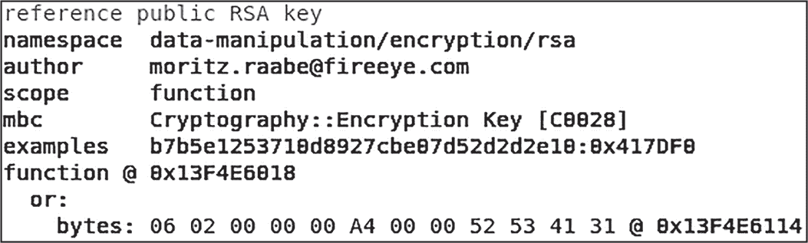

<samp class="SANS_Futura_Std_Book_Oblique_I_11">图 16-10：在 CAPA 中查看 RSA 使用情况</samp>

在这里，你可以看到这个样本（恰好是 Ryuk 勒索病毒家族的一个变种）使用了 RSA 非对称加密。CAPA 甚至向我们展示了该数据在代码中的位置（函数 0x13F4E6018）。

同样，在图 16-11 中，CAPA 在另一个样本中定位到了 RC4 加密。

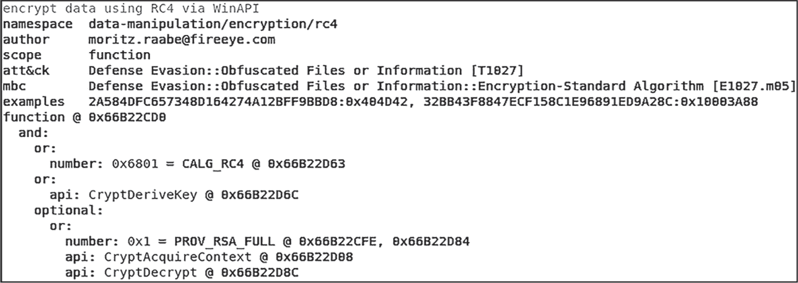

<samp class="SANS_Futura_Std_Book_Oblique_I_11">图 16-11：在 CAPA 中查看 RC4 使用情况</samp>

在这个提取片段中，CAPA 已经识别出恶意软件样本中的加密代码。具体来说，它发现了可能与 RC4 相关的代码，以及几个相关的 CryptoAPI 调用（<samp class="SANS_TheSansMonoCd_W5Regular_11">CryptDeriveKey</samp>、<samp class="SANS_TheSansMonoCd_W5Regular_11">CryptAcquireContext</samp> 和 <samp class="SANS_TheSansMonoCd_W5Regular_11">CryptDecrypt</samp>）。

IDA Pro 和 Ghidra 反汇编器都提供用于定位和识别加密例程的插件。虽然 CAPA 是一个更中立的工具，不需要反汇编器，但使用反汇编器插件的优势在于，你可以快速检查包含有趣加密功能的代码。

下面是两个 IDA Pro 的插件：

+   FindCrypt2（[*https://<wbr>hex<wbr>-rays<wbr>.com<wbr>/blog<wbr>/findcrypt2<wbr>/*](https://hex-rays.com/blog/findcrypt2/)）

+   IDA Signsrch（[*https://<wbr>github<wbr>.com<wbr>/nihilus<wbr>/IDA<wbr>_Signsrch*](https://github.com/nihilus/IDA_Signsrch)）

下面是两个 Ghidra 的插件：

+   FindCrypt（[*https://<wbr>github<wbr>.com<wbr>/d3v1l401<wbr>/FindCrypt<wbr>-Ghidra*](https://github.com/d3v1l401/FindCrypt-Ghidra)）

+   FindCrypt（更新版；[*https://<wbr>github<wbr>.com<wbr>/TorgoTorgo<wbr>/ghidra<wbr>-findcrypt*](https://github.com/TorgoTorgo/ghidra-findcrypt)）

图 16-12 展示了第一个 Ghidra FindCrypt 插件的使用情况。

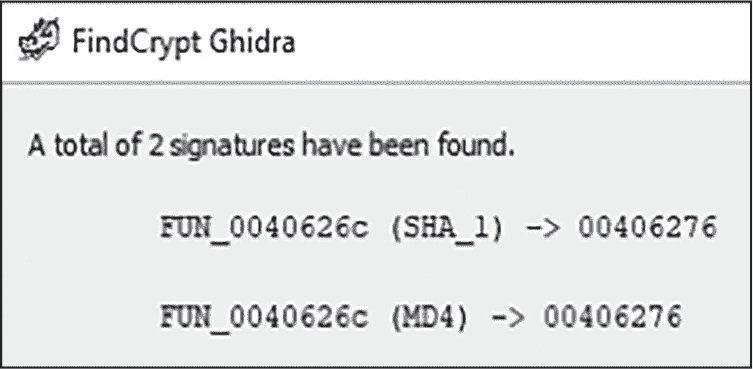

<samp class="SANS_Futura_Std_Book_Oblique_I_11">图 16-12：使用 FindCrypt Ghidra 插件定位加密代码</samp>

FindCrypt 已经找到了两个可能使用的哈希算法（SHA_1 和 MD4），并打印出数据可能所在代码的偏移量。请记住，像这些开源工具始终在变化；开发者可能随时停止维护它们。最好不断寻找新的工具和插件，帮助你进行恶意软件分析。

有时恶意软件样本可能使用自定义的加密算法，或者是经过重度修改、混淆或不常见的算法。这时，通用的加密/解密例程识别就更加有用。这些加密例程通常遵循相似的模式。

首先，待加密或解密的数据将被加载，通常是通过 <samp class="SANS_TheSansMonoCd_W5Regular_11">mov</samp> 操作。以下恶意软件代码展示了数据（<samp class="SANS_TheSansMonoCd_W5Regular_11">ebp+encrypted_data</samp>）被移动到寄存器（<samp class="SANS_TheSansMonoCd_W5Regular_11">ebx</samp>）中：

```
sub_decryptData:
mov ebx, [ebp+encrypted_data]
```

接下来，对数据进行计算。几乎总是会涉及到代码中的循环，可能会有数学指令（如 <samp class="SANS_TheSansMonoCd_W5Regular_11">add</samp>、<samp class="SANS_TheSansMonoCd_W5Regular_11">sub</samp>、<samp class="SANS_TheSansMonoCd_W5Regular_11">mul</samp>、<samp class="SANS_TheSansMonoCd_W5Regular_11">imul</samp> 和 <samp class="SANS_TheSansMonoCd_W5Regular_11">div</samp>），以及 <samp class="SANS_TheSansMonoCd_W5Regular_11">xor</samp> 或移位指令（<samp class="SANS_TheSansMonoCd_W5Regular_11">shl</samp>、<samp class="SANS_TheSansMonoCd_W5Regular_11">shr</samp> 等）：

```
xor ebx, [ebp+xor_key]
```

最后，经过处理的数据会被存储以供后续使用：

```
❶ mov [ebp+decrypted_data], ebx
  dec ecx
❷ cmp ecx, 100
❸ jnz sub_decryptData
```

在这种情况下，恶意软件正在将新解密的数据移动到堆栈❶。可能还会有一个或多个循环和循环计数器❷，这些会跳回到数据读取指令，并加载更多数据进行解密❸。

那么，当你发现加密数据后，你该怎么做呢？ #### <samp class="SANS_Futura_Std_Bold_Condensed_Oblique_I_11">解密加密的恶意软件数据</samp>

假设你已经找到了并可能识别出了恶意软件样本中的加密算法；该恶意软件包含的加密数据将在运行时使用该算法进行解密。处理这种情况有两种方法：静态和动态。

##### <samp class="SANS_Futura_Std_Bold_Condensed_B_11">静态解密</samp>

*静态解密*允许你在不运行恶意软件的情况下解密恶意软件可执行文件中的目标数据。静态解密的优势在于，你可以对恶意软件文件进行批量解密，节省了大量的时间和精力，尤其是在你需要一次性调查多个样本时。静态解密的挑战在于，你必须反向工程恶意软件中的加密例程，这个过程可能很简单，也可能非常困难，取决于所使用的加密算法以及其实现方式。恶意软件作者还可以在不同的恶意软件样本之间更改加密密钥或算法，这可能会削弱上述“批量处理”的优势。

要进行静态解密，你首先需要识别使用的加密算法和所需的加密密钥，这些通常是硬编码在恶意软件中或存储在内存中的。Python API PyCrypto（[*https://<wbr>pypi<wbr>.org<wbr>/project<wbr>/pycrypto<wbr>/*](https://pypi.org/project/pycrypto/)）可以用来自动化这样的任务。另一个选择是，CyberChef 是一个非常适合解码多种数据类型的工具，可以帮助你快速解密你在恶意软件中找到的数据。

##### <samp class="SANS_Futura_Std_Bold_Condensed_B_11">动态解密</samp>

*动态解密*涉及运行恶意软件（或模拟恶意软件中的代码），让恶意软件解密其秘密，并使用调试器等工具“捕获”解密后的数据。动态解密的优点是它通常比静态解密方法更节省时间，并且是快速获取你想要的数据的好方法。缺点是，动态解密在大规模操作时更为困难，而且恶意软件通常通过反分析陷阱保护其加密数据。

让我们通过两个分析场景来讲解一些技巧，帮助你快速动态解密恶意软件的秘密。这些技巧是通用的，无论恶意软件使用何种加密算法都适用。

##### <samp class="SANS_Futura_Std_Bold_Condensed_B_11">解密的代码和数据捕获</samp>

恶意软件可能包含在运行时动态解密的代码，这有助于它逃避基于主机的防御，并使逆向工程变得更加困难。当恶意软件采用这些技术时，识别解密数据的最有效方法是捕获解密后的数据！在下一个示例中，这个恶意软件样本在内存中解密了 shellcode 并执行它。让我们看看能否在 shellcode 解密后捕获它。

> <samp class="SANS_Dogma_OT_Bold_B_15">注意</samp>

*本示例使用的恶意软件可执行文件可以通过 VirusTotal 或 MalShare 下载，使用以下文件哈希值：*

> SHA256: db136799d9e0854fdb99b453a0ebc4c2a83f3fc823c3095574832b6ee5f96708

首先，将样本加载到你选择的反汇编工具中。我使用的是 IDA Pro。要识别该样本使用的加密算法并定位解密代码，你可以使用类似 CAPA 的工具，或者你可以直接使用反汇编工具的搜索功能搜索<samp class="SANS_TheSansMonoCd_W5Regular_11">xor</samp>操作。图 16-13 展示了 IDA Pro 中这个 XOR 搜索的一部分输出。

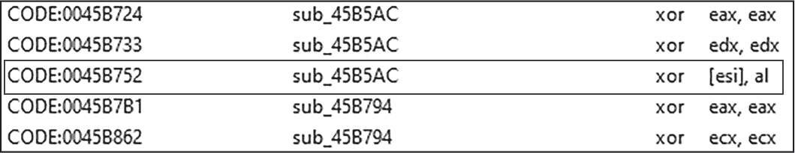

<samp class="SANS_Futura_Std_Book_Oblique_I_11">图 16-13：在 IDA Pro 中查看 xor 指令</samp>

在这个可执行文件中有很多<samp class="SANS_TheSansMonoCd_W5Regular_11">xor</samp>指令，其中大多数是良性的。记住，用相同的寄存器对另一个寄存器进行异或操作基本上会清除该寄存器的内容。所以，<samp class="SANS_TheSansMonoCd_W5Regular_11">xor eax, eax</samp>、<samp class="SANS_TheSansMonoCd_W5Regular_11">xor ecx, ecx</samp>和<samp class="SANS_TheSansMonoCd_W5Regular_11">xor edx, edx</samp>对我们来说不值得关注。让我们通过双击条目来查看指令<samp class="SANS_TheSansMonoCd_W5Regular_11">xor [esi], al</samp>。图 16-14 展示了结果。

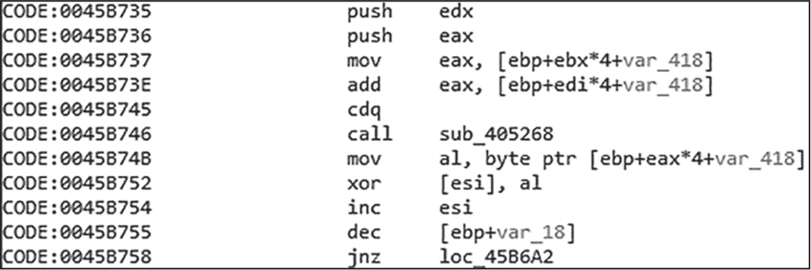

<samp class="SANS_Futura_Std_Book_Oblique_I_11">图 16-14：在 IDA Pro 中查看加密例程</samp>

该代码块包含多个数学指令，如 <samp class="SANS_TheSansMonoCd_W5Regular_11">xor</samp> 和 <samp class="SANS_TheSansMonoCd_W5Regular_11">add</samp>。还包含一些 <samp class="SANS_TheSansMonoCd_W5Regular_11">mov</samp> 指令，似乎在移动数据，以及 <samp class="SANS_TheSansMonoCd_W5Regular_11">inc</samp>、<samp class="SANS_TheSansMonoCd_W5Regular_11">dec</samp> 和 <samp class="SANS_TheSansMonoCd_W5Regular_11">jnz</samp>，表示有一个循环。乍一看，这似乎是一个加密函数！

如果你检查我们当前所在函数上方的代码块，你可能会看到一些额外的加密标识。这里有一条 <samp class="SANS_TheSansMonoCd_W5Regular_11">cmp ebx, 100h</samp> 指令，以及另一个看似循环的结构，如 图 16-15 所示。

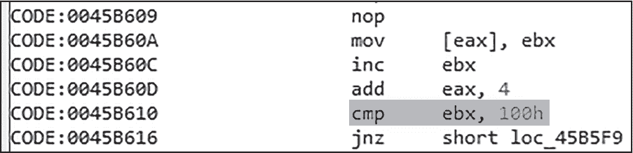

<samp class="SANS_Futura_Std_Book_Oblique_I_11">图 16-15：在 IDA Pro 中查看 RC4 循环</samp>

此外，在偏移量 <samp class="SANS_TheSansMonoCd_W5Regular_11">0x0045B684</samp>，还有另一个循环和 <samp class="SANS_TheSansMonoCd_W5Regular_11">cmp ebx, 100h</samp> 指令，如 图 16-16 所示。

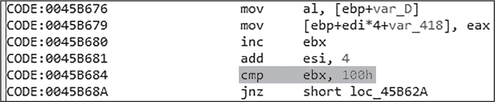

<samp class="SANS_Futura_Std_Book_Oblique_I_11">图 16-16：IDA Pro 中的另一个 RC4 循环</samp>

这看起来像是 RC4。现在我们可能已经找到了正在使用的加密例程，我们可以确定数据将在代码中的哪个位置完全解密，然后在调试器中设置该地址的断点，等待数据解密！首先，我们应该确定在哪里设置断点。我们当前所在的函数是 <samp class="SANS_TheSansMonoCd_W5Regular_11">sub_45B794</samp>。如果你在 IDA Pro 反汇编器或图形视图中选择该函数并按 X，你将找到指向它的交叉引用列表（即，其他调用 <samp class="SANS_TheSansMonoCd_W5Regular_11">sub_45B794</samp> 的函数）。双击列表中的该函数。

你应该能看到指令 <samp class="SANS_TheSansMonoCd_W5Regular_11">lea ebx, [ebp+var_BEEP]</samp>，如图所示：

```
`--snip--`
call sub_45B5AC
call GetConsoleCP
lea edx, [ebp+var_BEEP]
`--snip--`
```

这条 <samp class="SANS_TheSansMonoCd_W5Regular_11">lea</samp> 指令正在将一个地址加载到 EDX 寄存器中。这很有趣，因为它紧接在我们刚刚研究的 RC4 解密函数后面（<samp class="SANS_TheSansMonoCd_W5Regular_11">sub_45B5AC</samp>）。这条 <samp class="SANS_TheSansMonoCd_W5Regular_11">lea</samp> 指令的地址是 <samp class="SANS_TheSansMonoCd_W5Regular_11">0045B850</samp>。这是一个很好的调试器断点目标。

在调试时，我会使用 x64dbg。你也可以使用 IDA Pro 中的内置调试器或你选择的其他调试器。将样本加载到调试器中，选择**运行到用户代码**（跳转到恶意软件代码的起始位置），在感兴趣的代码上设置断点（**bp 0045B850**），然后运行（按下键盘上的 F9 键）。这个特定样本会在执行感兴趣的代码之前休眠约 10 秒（见图 16-17）。

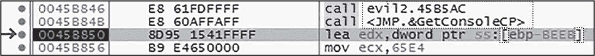

<samp class="SANS_Futura_Std_Book_Oblique_I_11">图 16-17：在 x64dbg 中设置断点于解密后的代码</samp>

一旦断点被触发，右键点击<samp class="SANS_TheSansMonoCd_W7Bold_B_11">[ebp-BEEP]</samp>，选择**跟踪到转储****地址：EBP-BEEP**。如图 16-18 所示，我们现在应该能够在转储窗口中看到解密后的数据！

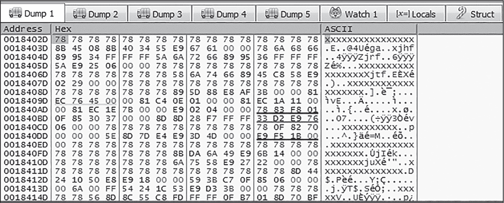

<samp class="SANS_Futura_Std_Book_Oblique_I_11">图 16-18：查看在 x64dbg 中转储的解密代码</samp>

不幸的是，这些数据不容易被人类阅读。让我们进一步检查它。通过右键点击转储窗口并选择**在内存映射中跟踪**来提取这些数据。然后，右键点击高亮显示的内存区域（它将在内存映射窗口中以灰色高亮显示），选择**将内存转储到文件**。

如果你对文件运行<samp class="SANS_TheSansMonoCd_W5Regular_11">strings</samp>命令，或者使用像 PEStudio 这样的 PE 字符串工具，你会看到一些字符串，但没有太多有趣的内容。然而，通过使用字符串去混淆工具 FLOSS（你可能还记得它来自第二章），我们可以解混淆一些数据。你可以像这样运行 FLOSS 工具：

```
> **floss –-format sc32 shellcode_dump.bin**
```

这里我们告诉 FLOSS 将此文件视为 32 位的 shellcode。你可以看到 FLOSS 的输出，它恢复了 52 个栈字符串：

```
FLOSS extracted 52 stackstrings
vbox
Set WshShell = CreateObject("WScript.Shell")
HARDWARE\DEVICEMAP\Scsi\Scsi Port 0\Scsi Bus 0\Target Id 0\... 
Ident
advapi32
VboxGuest.sys
vmware
virus
`--snip--`
sandbox
sample
`--snip--`
```

看起来这款恶意软件正在动态地在栈上构建字符串，以混淆其数据。你可能会在此输出中发现一些可疑的字符串；注意其中提到的沙箱和虚拟机的引用。实际上，这段代码是恶意软件的 shellcode，它会解密后执行，进行一些基本的沙箱检查。然而，我们不会深入这些细节；这个示例仅用来展示动态解密的价值。这个技巧不仅适用于 RC4，也适用于许多其他算法。

##### <samp class="SANS_Futura_Std_Bold_Condensed_B_11">加密前捕获代码和数据</samp>

恶意软件通常采用加密技术来混淆网络流量，例如与 C2 服务器的通信。如图 16-19 所示的恶意软件样本调用<samp class="SANS_TheSansMonoCd_W5Regular_11">BCryptEncrypt</samp>来加密其 C2 信息，然后将数据发送到其控制基础设施。为了捕获明文数据，我只需在<samp class="SANS_TheSansMonoCd_W5Regular_11">BCryptEncrypt</samp>上设置一个断点。

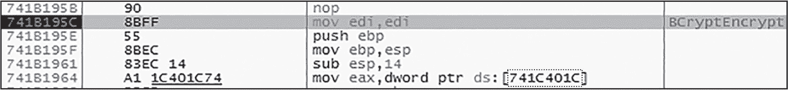

<samp class="SANS_Futura_Std_Book_Oblique_I_11">图 16-19：在 x64dbg 中设置断点以调试 BCryptEncrypt</samp>

> <samp class="SANS_Dogma_OT_Bold_B_15">注意</samp>

*你可以在 MalShare 或 VirusTotal 上通过以下哈希值找到这个样本：*

> SHA256: b2562b0805dd701621f661a43986f9ab207503d4788b655a659b61b2aa095fce

对于<samp class="SANS_TheSansMonoCd_W5Regular_11">BCryptEncrypt</samp>，栈上的第二个值是指向包含待加密明文数据的缓冲区的指针。这些数据似乎是我的虚拟机主机名（见图 16-20）。

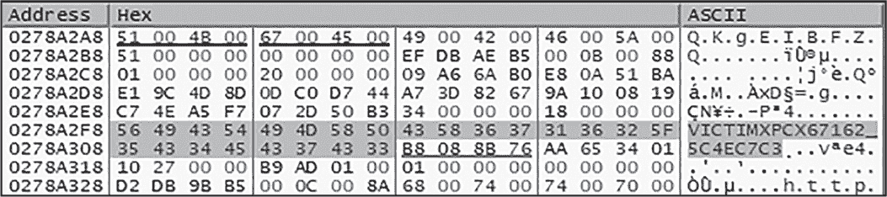

<samp class="SANS_Futura_Std_Book_Oblique_I_11">图 16-20：在 x64dbg 中查看待加密的数据</samp>

请记住，<samp class="SANS_TheSansMonoCd_W5Regular_11">CryptEncrypt</samp>和<samp class="SANS_TheSansMonoCd_W5Regular_11">BCryptEncrypt</samp>函数用于加密数据，而<samp class="SANS_TheSansMonoCd_W5Regular_11">CryptDecrypt</samp>和<samp class="SANS_TheSansMonoCd_W5Regular_11">BCryptDecrypt</samp>函数用于解密数据。这些函数对于恶意软件分析人员非常有用。只需在调试器中对这些函数设置断点，允许函数运行，检查包含数据的缓冲区，你就能节省大量的分析工作！

### <samp class="SANS_Futura_Std_Bold_B_11">总结</samp>

本章讨论了恶意软件可能使用的编码、哈希和加密技术，用于混淆其代码和数据，从而增加分析和逆向工程的保护层，并增加一种规避防御的技术。希望你从中获得了一些有用的技巧，可以在调查使用这些战术的恶意软件时派上用场。在下一章中，我们将探讨另一种恶意软件混淆形式：打包器。
