## 17 打包器与解包恶意软件


现代恶意软件需要内置保护措施，以避开现代的终端和网络防御。理想情况下，这些保护措施还会妨碍逆向工程，并帮助保护恶意软件的负载和内部结构不被调查人员发现。一种选择是*打包器*，这是一种为软件增加混淆和保护的工具。你在实际环境中可能遇到的许多恶意软件样本都会被打包，因此熟悉它们非常重要。本章将介绍各种类型的恶意软件打包器、它们的架构、工作原理，最重要的是，如何绕过它们以访问其中包含的恶意代码。

### 打包器的类型

当最初设计打包器时，它们本身并没有恶意。它们只是用于压缩诸如可执行文件之类的文件。然而，一旦恶意软件开始使用打包程序，*打包器*这个词便与恶意软件同义。

打包器有多种类型。我将称最常见的一种为*通用打包器*，它通常是免费的、开源的，或者以其他方式广泛可用。通用打包器的例子包括 NSPack、MPRESS 和 UPX（可执行文件的终极打包器），这些都可以自由获取，包括恶意软件作者。恶意软件使用通用打包器的缺点（至少对于作者来说）是，它们通常非常容易通过自动化工具或手动分析解包，因为它们并没有设计用于反分析。不过，一些恶意软件样本会使用这些简单的打包器，作为为其负载提供基本混淆的快捷且廉价的方式。

第二种类型的打包器包括*商业打包器*，如 VMProtect、Themida 和 Armadillo。也被称为保护器或混淆器，这些打包器最初是为了保护合法软件的知识产权而创建的。由于它们的设计投入了大量研究，商业打包器通常非常难以解包。幸运的是，它们并不像恶意软件那样普遍用于保护。

最后，最后一种打包器是专门为恶意软件设计的。这些打包器，有时被称为*加密器*，通常由威胁行为者或附属组织开发，并在黑客论坛上出售。此类打包器的示例有 Warzone、Atilla 和 Softinca Crypter，最后一个在图 17-1 中展示。

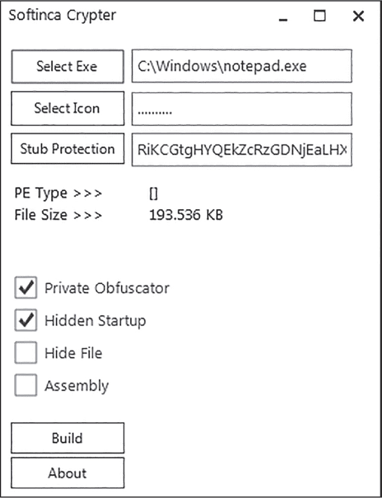

图 17-1：Softinca Crypter 的界面

Softinca Crypter 接收一个可执行文件（未解压的恶意负载）作为输入，添加保护措施，如代码混淆和隐藏负载执行的能力，以避免受害者察觉，然后生成打包后的可执行文件。

> 注意

*由于*打包程序*通常作为保护工具、混淆器和加密器的统称，本章中我将遵循这一惯例。*

### 打包程序架构与功能

当恶意软件可执行文件通过打包程序运行时，该程序会加密并压缩可执行文件中的各个 PE 部分（*.text*、*.data*、*.rdata*、*.rsrc* 等）。打包程序还会添加一个*解包存根*，这通常是一个小的代码段，负责在目标主机上运行后解密可执行文件的各个部分。 图 17-2 展示了这一过程。

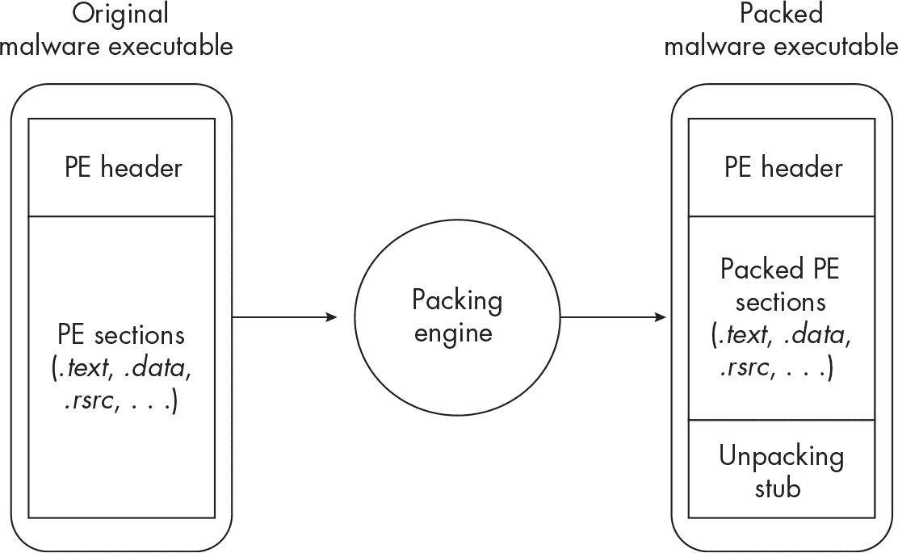

图 17-2：恶意软件打包过程

你可以在 图 17-2 中看到，解包后的恶意软件可执行文件正在通过打包程序运行，该程序将其代码和数据加密（或打包）。解包存根也被添加到打包文件中。在受害者主机上运行时，解包存根解密打包的代码和数据，将解包后的有效载荷加载到内存中，并通过将控制流转移到*原始入口点（OEP）*来执行有效载荷，如 图 17-3 所示。

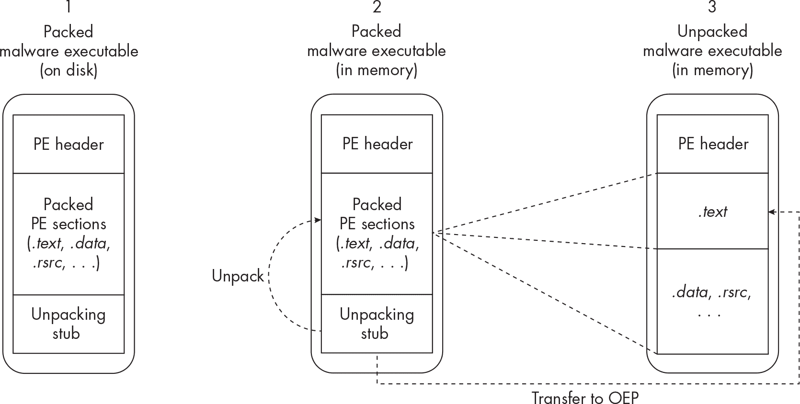

图 17-3：打包的恶意软件正在解包到内存中

让我们更深入地了解这个过程。

#### 解包恶意软件有效载荷

在恶意软件的有效载荷可以执行之前，它必须被解包。解包存根必须将原始可执行文件的代码和数据解密（或去混淆）到内存中。对于大多数 Windows 可执行文件，这通常涉及对打包的可执行文件执行解密和解压算法，使用 Windows API 函数（如 VirtualAlloc）分配内存空间，并将解包后的可执行文件写入新的内存区域。

解包可以分为一个或多个阶段。一般的打包程序，如 UPX，简单地在内存中解包可执行文件并运行它。其他打包程序，尤其是为恶意软件设计的定制打包程序，可能有多个解包阶段，如 图 17-4 所示。

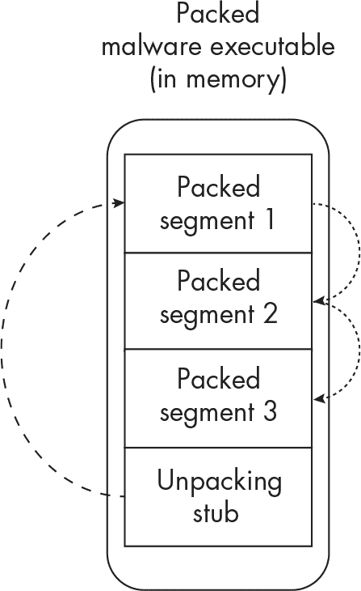

图 17-4：使用多阶段解包的恶意软件

图 17-4 中显示的简化过程展示了一个压缩恶意软件样本解包代码段 1，它解包代码段 2，后者又解包代码段 3。通过分段解包代码，恶意软件可以规避宿主防御措施，这些防御措施通常会在内存中查找整个恶意代码。这种解包例程还使恶意软件分析过程更加复杂，因为分析人员将更难理解解包过程并识别恶意软件解包到内存中的所有位置。

#### 解析导入

一旦恶意软件的有效载荷被解包到内存中，解包存根必须解析原始可执行文件的导入。请记住，导入是 Windows 库（DLL），允许可执行文件在 Windows 环境中运行。当恶意软件样本通过打包程序运行时，导入地址表（IAT）通常会被混淆或隐藏，以掩盖程序的意图并更好地规避防御。这一 IAT 必须被重建，以便恶意软件的解包可执行文件能够按原定意图运行。

压缩的恶意软件通常只在其 IAT（导入地址表）中包含几个条目，包括LoadLibrary和GetProcAddress函数。这两个函数通常用于加载附加库、解析函数地址，并重建原始可执行文件的 IAT。LoadLibrary函数加载原始恶意软件可执行文件所需的每个库，而GetProcAddress函数获取每个所需函数的地址。如果你遇到一个 IAT 中只列出了少数几个库的可执行文件，你应该保持警惕。

打包工具也可能删除所有导入，留下一个空的 IAT。这是最隐蔽的方式，但解包存根需要做大量工作来解析所有导入。它首先获取LoadLibrary和GetProcAddress函数的地址，然后加载每个库并解析解包后的有效载荷操作所需的每个函数地址。

另外，某些打包工具根本不会重建原始 IAT。在这种情况下，导入和地址解析过程必须完全由解包后的恶意软件自己处理。如果是这种情况，你将看到恶意软件很可能会在解包过程完成*之后*使用LoadLibrary和GetProcAddress来解析其导入。

#### 转移执行到 OEP

最后，一旦恶意软件被解包并且 IAT（导入地址表）重建，解包的存根必须将执行从其自身的代码转移到可执行文件的 OEP（原始入口点）。OEP 是解包后的恶意软件有效载荷开始执行其代码的地方。这个执行转移，通常称为*尾跳转*或*尾跳*，通常以跳转（jmp）、返回（ret）或 call 指令的形式出现在解包存根的末尾。一旦执行到这条指令，程序控制将转移到内存中的解包代码，解包后的恶意软件有效载荷最终开始运行。

许多加壳器，尤其是专门为恶意软件加壳设计的加壳器，会实现某种形式的代码注入技术，以尝试绕过防御机制并隐藏在主机上。例如，加壳器可能会在受害主机的某个进程内分配内存，将解包后的代码写入该内存，并将执行转移到这段代码。此时，你可能会发现一些与进程注入技术和相关函数相关的内容，具体内容可以参见第十二章。这是一个需要记住的重要点，稍后我们将在本章中再次提到。

接下来，让我们看看如何识别恶意软件是否被加壳。

### 如何识别加壳的恶意软件

在开始解包恶意软件样本之前，你必须先确定它是否真的被加壳。可以通过几种方式来判断。

#### 查看导入项

确定样本是否被加壳的最简单有效的方法之一是检查文件的导入项。你可以使用几乎任何 PE 文件查看工具来执行此操作，例如 CFF Explorer、PEStudio 和 PE-bear。加壳的恶意软件可能只有少数几个导入的库和函数。图 17-5 中的 PEStudio 截图展示了加壳的恶意软件可能的样子。

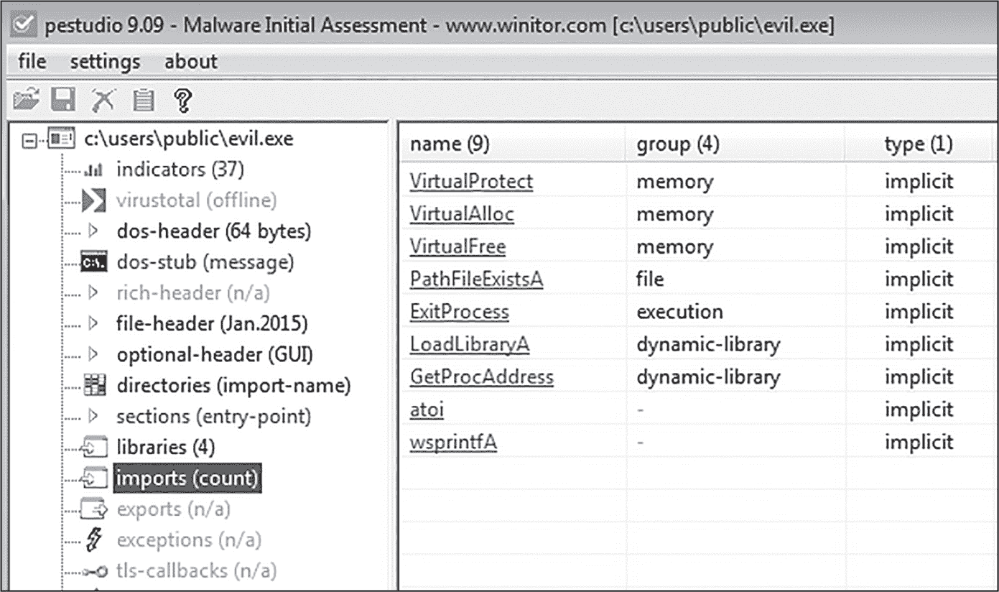

图 17-5：在 PEStudio 中查看加壳的恶意软件样本

注意，列出的函数子集非常有限，其中有两个是 LoadLibraryA 和 GetProcAddress。相比之下，在图 17-6 中，你可以看到一个解包后的恶意软件样本的导入列表。

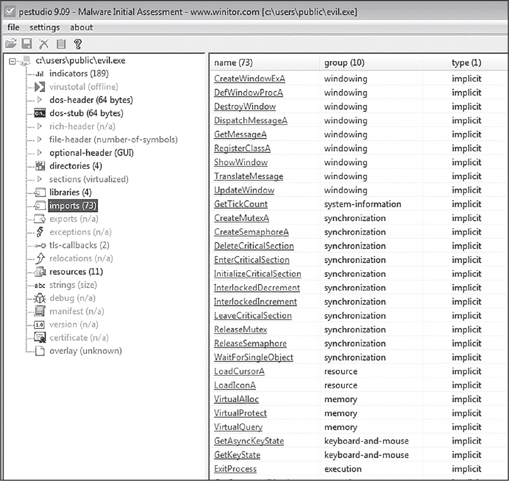

图 17-6：在 PEStudio 中查看解包后的恶意软件样本

很明显，图 17-6 中的恶意软件样本有更多的导入项。同样，如果恶意软件只有有限的导入项列表，那么它很可能是被加壳的。

#### 检查字符串

另一个判断样本是否被打包的好方法是检查它的字符串。打包的恶意软件要么有许多不可读的字符串，要么几乎没有任何字符串。这是因为在打包过程中，打包器会压缩、加密或以其他方式混淆文件中的数据，使得分析更加困难，并绕过防御措施。图 17-7 中的 PEStudio 截图展示了打包恶意软件字符串的可能样子。

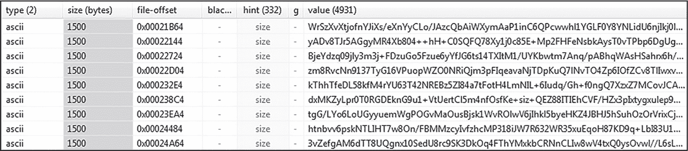

图 17-7：打包恶意软件样本的字符串

相比之下，未打包的样本应该有许多明文（已去混淆）的字符串。

#### 计算熵值

打包的恶意软件通常会有较高的熵值。*熵*是数据随机性的度量。高熵表示数据可能已被加密或压缩，在打包的背景下，这意味着样本很可能是打包过的。最大可能的熵值是 8；文件的熵值越接近这个值，它被打包的可能性就越大。

有许多工具可以计算恶意软件可执行文件的熵值，但我再次使用了 PEStudio 作为示例。图 17-8 展示了一个打包恶意软件样本的熵值。

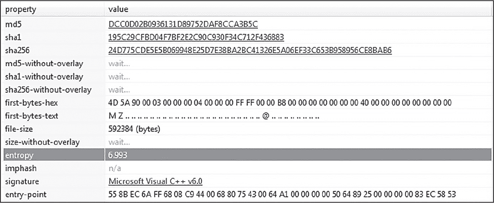

图 17-8：在 PEStudio 中查看打包恶意软件的熵值

一个好的经验法则是，打包的可执行文件熵值大约为 6 或更高。低于这个值的文件，文件被打包的可能性较低。

> 注意

*请记住，某些非 PE 文件（如文档文件）通常会有较高的熵值，因此“6 或更高”这一经验法则仅适用于 PE 文件。*

#### 检查 PE 节

你还可以使用 PE 文件的节信息来判断恶意软件是否被打包。如你可能记得的那样，第一章中提到过，可执行文件有多个节，分别是*.text*、*.data*、*.rdata*、.*rsrc*等。在一个正常的非打包可执行文件中，这些节会被标记为这些名称。有时，打包器会以一种识别打包器的方式重命名文件中的节。例如，UPX 打包器会将它们重命名为*UPX0*、*UPX1*等。另一个打包恶意软件的异常特征是它通常有太多或不够的节。一个正常的非打包可执行文件通常有四个节（大约一两个多一些或少一些），因此一个拥有九个节或只有一两个节的文件可能是一个警示信号，应该进一步调查。

有许多不同的工具可以让你查看 PE 文件的节信息。在图 17-9 中，我使用了 PE-bear 来展示一个打包恶意软件样本的外观。

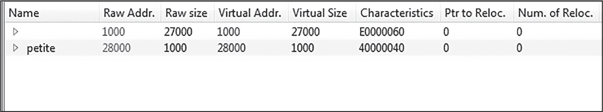

图 17-9：在 PE-bear 中查看被打包恶意软件样本的 PE 区段

该图中的文件只有两个区段。一个区段完全没有标签，另一个被称为 *petite*，这是一个非标准的可执行区段名称。该文件很可能是被打包过的，可能使用了 Petite 打包器。

最后，PE 文件的区段大小也是打包的一个重要指标。每个区段有两个大小特征：原始大小和虚拟大小。PE 文件的 *原始大小* 是区段在磁盘上的大小，而 *虚拟大小* 是文件执行并随后映射到内存后占用的大小。如果你发现一个恶意软件样本的原始大小为零，虚拟大小非零，那么这很可能表明该恶意软件是被打包的。在这种情况下，恶意软件可能试图将其代码隐藏在另一个区段中。

#### 使用自动化打包器检测

最简单的判断恶意软件样本是否被打包的方法是使用自动化打包器检测工具。市面上有几种这类工具，但我个人最喜欢的是 Detect It Easy (DIE)、Exeinfo PE、PE Detective 和 CFF Explorer。这些工具提供的信息包括文件的熵值、区段名称和大小、编译器数据，有时（在最佳情况下）还会提供打包器的名称。

例如，Exeinfo PE 试图使用静态签名识别打包器变种。在 图 17-10 中，你可以看到 Exeinfo PE 的运行情况：它已识别出该恶意软件样本可能是用 .NET 编写的，并且可能被 DeepSea 混淆器打包。

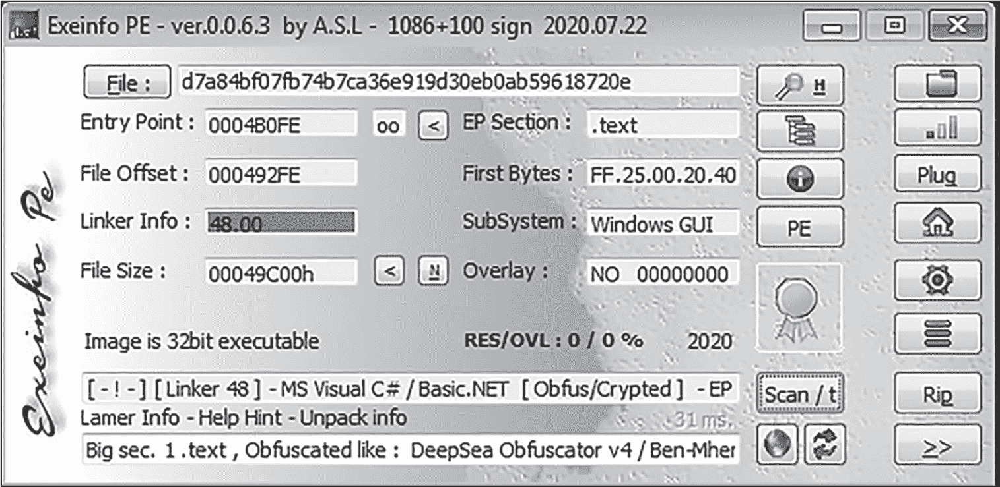

图 17-10：在 Exeinfo PE 中识别恶意软件的打包器

虽然像 Exeinfo PE 这样的自动化打包器检测工具并不总是 100% 准确，但它们是检查恶意软件可执行文件的良好第一步，并且可以为你的分析和解包过程提供重要的提示。最好尝试几种工具，看看哪一种能为你正在检查的恶意软件样本提供最好的输出。

> 注意

*许多这些工具会定期更新其检测数据库，因此务必安装这些工具的更新，以确保获取准确的结果。*

### 自动解包

一旦你确认恶意软件样本确实被打包了，就可以开始考虑解包的方法。你可能会问自己，*为什么要解包恶意软件样本？我不能直接运行它并进行分析吗？* 当然，也可以选择直接在沙箱或调试器中运行恶意软件，完全避免解包；事实上，我将在《不解包分析》一章的第 383 页专门讨论这一点。然而，解包能让你深入了解恶意软件的核心并提取其有效载荷，这通常是你完全理解恶意软件的能力并对其代码进行静态分析所必需的。

虽然你仍然可以理解恶意软件的行为而无需解包它，但你可能会错过一些细微之处。例如，一个恶意软件样本可能具有隐藏的功能，或根据分析环境的不同而表现出不同的行为。在回避恶意软件的情况下，这意味着恶意软件在自动化的恶意软件沙箱中可能表现不同。如果不解包并仔细分析其代码，你可能会错过一些关键的行为、能力和指标。解包恶意软件样本的方法有很多，包括完全自动化解包、沙箱辅助解包、手动动态解包和静态解包。本节将从完全自动化解包和沙箱辅助解包开始，随后在接下来的章节中深入探讨其他方法。

#### 完全自动化解包

*完全自动化解包*是解包恶意软件样本最简单和最快捷的方法，因此总是建议首先尝试这一方法。许多通用和常见的打包工具都具有内置的解包功能，或者有专门为它们编写的自动化解包工具。UPX 打包程序包含一个标志，允许文件解包。只需像这样将<sup class="SANS_TheSansMonoCd_W5Regular_11">-d</sup>参数传递给 UPX，就能解包该文件：

```
C:\> **upx.exe -d** **`file.exe`**
```

其他工具包括 Un{i}packer，它通过代码仿真解包许多常见的打包工具（如 MPRESS、ASPack，以及当然的 UPX），还有 Universal Extractor 2（UniExtract2），它可以解包许多常见的打包工具和压缩文件档案。你应该首先尝试识别正在使用的打包工具；运用你迄今为止学到的技巧，然后尝试一些这些有用的自动化工具。

需要记住的一件重要事情是，像刚才提到的常见打包工具可以被恶意软件作者修改，因为它们中的许多是开源的。恶意软件作者修改这些打包工具来防止通过这些完全自动化方法进行解包是相对简单的。同样，记住高级恶意软件通常不会仅仅使用免费和常见的打包工具进行打包（或者至少不会仅仅使用这些工具），所以不要只依赖这些自动化工具。正如你很快就会看到的那样，还有许多其他工具可以帮助你进行自动化和半自动化的解包。

#### 沙箱辅助解压

解压样本的下一个最简单方法是使用恶意软件分析沙箱。许多恶意软件沙箱可以自动化恶意软件的解压，通常通过检测内存中的恶意代码、挂钩并监视在恶意软件解压过程中经常调用的关键 Windows 函数，以及自动从内存中提取可执行代码。一个做得比较好的沙箱是商业沙箱 VMRay 分析器。在图 17-11 所示的输出中，您可以看到 VMRay 分析器成功地从内存中提取了恶意软件，并展示了其解压的不同阶段。

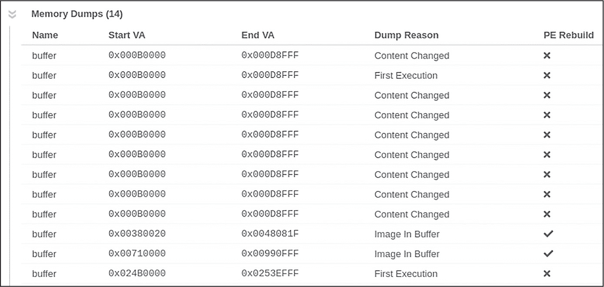

图 17-11：在 VMRay 分析器沙箱中查看从内存中转储的恶意软件可执行代码

在这个截图中，您可以看到 VMRay 分析器如何通过在恶意软件行为的关键阶段转储内存来尝试解压样本。例如，正如您在“Dump Reason”列中看到的那样，当恶意代码的内容发生变化、第一次执行时，或者内存中出现可执行文件（镜像）时，恶意代码会从内存中转储。VMRay 分析器还尝试重建转储的可执行文件的 PE 头，以便在反汇编器或调试器中更好地分析。

甚至有一个专门用于解压的沙箱：UnpacMe。根据其作者的说法，“UnpacMe 自动化了恶意软件分析过程的第一步。”也就是说，它自动化了解压过程。UnpacMe 是一个商业沙箱，但（截至本书写作时）提供免费的服务，每月提交次数有限。图 17-12 展示了一个提交到 UnpacMe 的示例，以及解压后可下载的有效载荷文件。

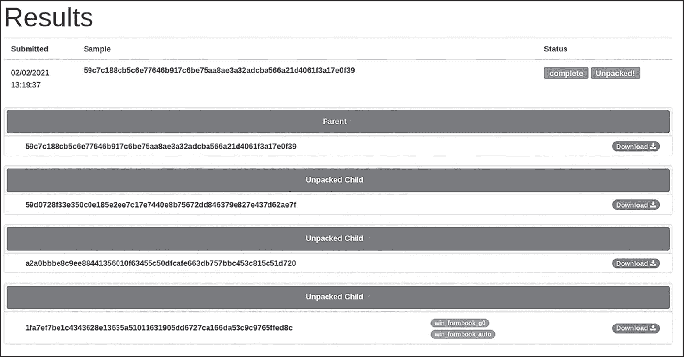

图 17-12：通过 UnpacMe 解压的恶意软件样本

有时恶意软件沙箱无法成功解压恶意软件的有效载荷。这可能有多种原因，例如恶意软件的规避行为，或未能按照恶意软件在内存中的解压过程进行操作。让我们来看看一些手动解压技术，这些技术可以帮助您在自动化技术失败时使用。

### 手动动态解压

手动解压涉及确定解压例程在打包恶意软件代码中的位置，了解它是如何解压恶意软件的，并跟踪这个解压过程以“捕捉”恶意软件的有效载荷到一个新解压的状态。手动解压有两种形式：动态解压和静态解压。

*手动动态解包* 涉及在虚拟机环境中引爆恶意软件，并允许恶意软件像在受害主机上一样执行并解包，同时使用调试器跟踪解包过程并捕获内存中的解包有效载荷。相比之下，*静态解包* 涉及逆向工程恶意软件的解包存根代码，重新创建该代码逻辑，并在打包的恶意软件上运行它。本节将重点讨论动态解包，我们将在“手动静态解包”中讨论静态解包，详见 第 382 页。

> 注意

*与其提供非常具体的解包某些打包器的技术，不如介绍一些更通用的方法，你可以用它们动态解包许多不同类型的恶意软件，无论使用的是哪种打包器。这些技术并未按特定顺序呈现；每个打包器的行为不同，因此没有通用的解包技巧。你可能需要尝试不同的技术，或者将几种技术的部分结合起来。这就是解包如此具有挑战性但也非常有成就感的原因！*

#### 快速且简便的选择：让恶意软件自己做工作

当打包的恶意软件在受害主机上运行时，它必须在某个地方将自己解包到内存中。让恶意软件在虚拟机中爆炸，允许恶意软件执行并解包自己，然后提取解包后的代码，是动态解包最简单的形式之一。在深入研究本节中的更复杂的解包技术之前，你可以先尝试这个方法。

从内存中转储进程相对简单，可以通过 Process Hacker 或 Process Explorer，以及其他高级任务管理器类工具来完成。在 Process Hacker 中，右键点击恶意软件的运行进程，选择 **Create Dump File**，如图 17-13 所示，使用的是 *sample.exe* 进程。

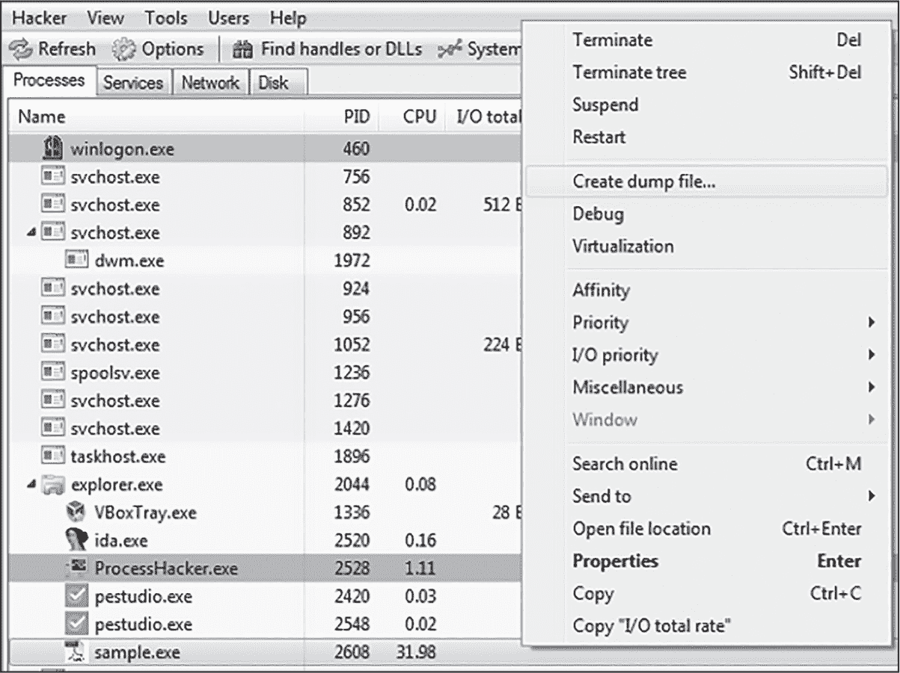

图 17-13：使用 Process Hacker 从内存中提取恶意软件

这是一种快速且简便的解包方法，但它有一些局限性。首先，无法知道恶意软件是否已经完全在内存中解包。例如，逃逸性恶意软件可能会检测到虚拟机环境，并拒绝解包其有效载荷。不仅如此，由于这个文件是直接从内存中提取的，它也没有被正确地从内存中卸载，会出现错位，这意味着你很可能无法轻松地在像 IDA Pro 这样的反汇编工具中进行分析。然而，你可以通过运行 Strings 工具（或像 PEStudio 这样的工具）来检查文件的字符串，这将给你一些关于该恶意软件样本可能在做什么的线索。你甚至可能发现明文函数、C2 地址或解密后的数据。然而，还有更好的选择。

工具 Scylla 允许你从内存中提取恶意软件，并会自动重新对齐文件，修复文件头，甚至修复 IAT。Scylla 既是 x64dbg 的插件，也是一个独立工具，在这两种情况下的工作方式完全相同。例如，假设你有一个恶意软件样本，并将其传输到你的分析虚拟机中，然后引爆它。样本可能不会立即将自己解包到内存中，所以你选择等上一分钟左右，以确保样本已完全解包。接下来，你可以运行 Scylla 工具，如 图 17-14 所示。

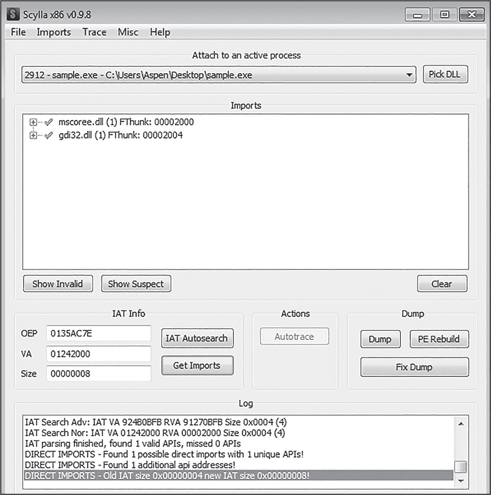

图 17-14：使用 Scylla 转储恶意软件进程

Scylla 允许你选择一个目标进程来进行转储；通常这个进程是恶意软件的活动进程（此例中为 *sample.exe*）。然后，你可以点击 **IAT 自动搜索**，自动在进程内存中搜索可能的 IAT。一旦找到 IAT，点击 **获取导入**，生成一个导入列表，该列表将在进程被转储后填充 IAT。接下来，点击 **转储** 会将进程从内存转储到磁盘，生成一个可执行文件，基本上将进程从内存中解除映射。

大多数高级恶意软件不会允许自己如此干净地解包。然而，由于这项技术不超过五分钟，所以尝试一下总是值得的。现在让我们深入了解一些更高级的解包技术。

#### 内存操作监控

由于解包存根必须为新解包的可执行文件分配内存并修改其内存保护，我们可以假设它将在某些时候调用与内存操作相关的 Windows 函数。这里的想法是，在调试器中设置这些内存操作函数的断点，运行恶意软件，并密切监视这些操作，寻找转储恶意软件解包代码的机会。

##### VirtualAlloc

VirtualAlloc 可能是你会看到的最常见的内存分配函数，但 VirtualAllocEx 和 malloc 也会被使用。你可以简单地将打包的恶意软件样本附加到像 x64bdg 这样的调试器，设置断点到你想要目标的内存分配函数（或者设置所有内存分配函数的断点），然后运行恶意软件样本。一旦击中内存分配函数断点，你必须识别新创建的内存区域的基址，并监视该内存区域是否有新数据。让我们看看这在实践中是如何工作的。

> 注意

*要跟随这个示例，你可以在 VirusTotal 或 MalShare 上找到所需的恶意软件文件，哈希值如下：*

> SHA256: 7b8fc6e62ef39770587a056af9709cb38f052aad5d815f808346494b7a3d00c5

将可执行文件（我在图 17-15 中将其重命名为*badthing.exe*）加载到 x64dbg 中，并在调试菜单中执行**Run to User Code**功能，这将带你进入恶意软件代码的入口点。

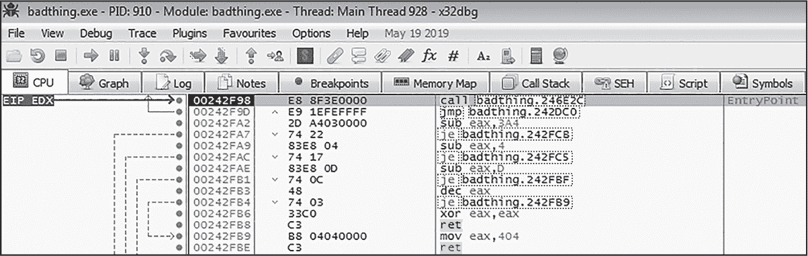

图 17-15：恶意软件在 x64dbg 中的入口点

接下来，在 VirtualAlloc 函数上设置断点（bp VirtualAlloc），如图 17-16 所示。我们希望的是，解压后的可执行文件最终会被映射到这个内存区域。

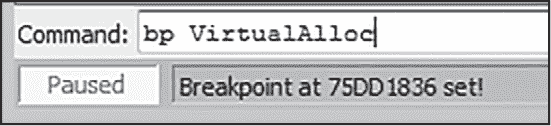

图 17-16：在 VirtualAlloc 上设置断点

随后，继续运行恶意软件（按 F9）直到触发该断点（参见图 17-17）。

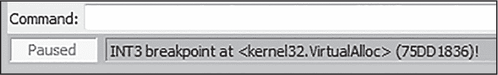

图 17-17：触发 VirtualAlloc 断点

一旦触发断点，你可以执行恶意软件直到函数返回；选择**Debug****Execute Till Return**，然后检查 EAX 寄存器的值，它包含由 VirtualAlloc 分配的目标内存区域（参见图 17-18）。

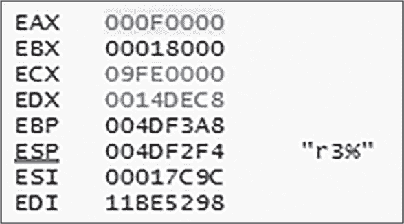

图 17-18：EAX 中一个新分配的内存区域

在我的情况下，这个内存区域的基地址是 000F0000。右键点击这个 EAX 值，选择**Follow in Dump**。你应该能在 Dump 窗口中看到一个空的内存区域（参见图 17-19）。

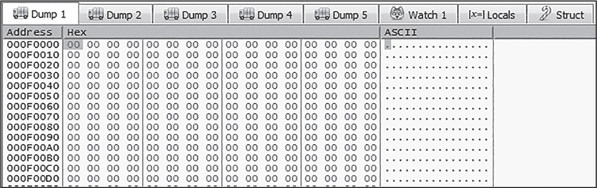

图 17-19：x64dbg Dump 窗口中的新内存区域

如果你继续按 F9 键运行代码，同时观察这个 Dump 窗口，你可能会看到一些有趣的内容，比如一个 MZ 头部，这可能是恶意软件解压后的有效载荷（参见图 17-20）。

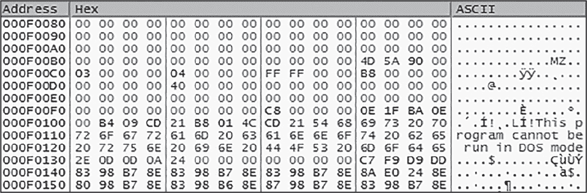

图 17-20：查看分配内存中的解压代码

你可以通过选择头部的起始位置（从 M 开始）以及 Dump 视图中的其余内存区域，右键点击并选择**Binary****Save to File**来从内存中提取该文件。然后，你可以在 PE 文件查看工具中检查这个文件，寻找解包成功的迹象，如明文字符串和导入。

请记住，VirtualAlloc 和 VirtualAllocEx 函数会随后调用低级 API 函数 NtAllocateVirtualMemory。狡猾的恶意软件可能直接调用 NtAllocateVirtualMemory，而不是使用 VirtualAlloc。在 NtAllocateVirtualMemory 上设置断点可以帮助解决这些情况。

##### HeapAlloc 和 Malloc

恶意软件有时会在分配内存时调用 HeapAlloc，而不是 VirtualAlloc。HeapAlloc 和 VirtualAlloc 有两个主要区别：它在程序的堆上分配内存，而不是堆栈；它是一个更高级的 API 调用，有时会随后调用 VirtualAlloc。因此，通常会在 VirtualAlloc 上设置断点，但你也可以尝试在 HeapAlloc 上设置断点。

C 函数 malloc 的内存分配方式与 HeapAlloc 相似。实际上，malloc 通常会调用 HeapAlloc，或者在某些情况下调用 VirtualAlloc。恶意软件调用 malloc 的情况不常见，但如果它是用 C 编写的，或者试图逃避分析或隐藏其活动时，可能会调用 malloc，因为 malloc 可能会引起分析人员的较少关注。在这种情况下，在 malloc 上设置断点可能会很有用。

##### 内存释放

VirtualFree（以及它的兄弟函数，VirtualFreeEx）和HeapFree函数被 Windows 用来释放并清理使用过的内存区域。在恶意软件的解压过程当中，一旦恶意软件为解压后的代码分配了内存并执行它，它很可能会在之后需要清理内存。类似于在VirtualAlloc和HeapAlloc上设置调试断点，设置在VirtualFree、VirtualFreeEx或HeapFree上的断点可以成为一种有效的策略，用来捕获未解压的恶意代码，在它有机会释放内存之前。你可能会幸运地在这些内存区域中发现一个未解压的可执行文件，并将其提取进行进一步分析。

##### VirtualProtect

VirtualProtect及其兄弟函数VirtualProtectEx也是可以用来监控解压代码的函数。在解压阶段，恶意软件分配内存后，必须设置内存的保护。内存的保护标识恶意软件可以对该内存区域执行的操作：写入、读取、执行或这些操作的结合。内存保护选项作为参数传递给VirtualProtect函数，调用该函数时，如图 17-21 所示。

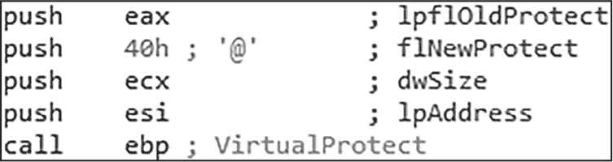

图 17-21：恶意软件调用 VirtualProtect，IDA Pro 中的视图

在此截图中，flNewProtect参数表示将应用于内存区域的新保护（在此案例中为0x40，即 PAGE_EXECUTE_READWRITE）。该内存区域由lpAddress引用。另一个重要的参数是dwSize，它表示将应用新保护类别的内存区域的大小。

在 VirtualProtect 和 VirtualProtectEx 上设置断点并监视标记为可执行的内存区域，可以帮助你捕捉即将被恶意软件执行的恶意代码。很多时候，恶意软件解压后的代码就驻留在这些内存区域中。然后，这部分代码可以从内存中转储出来进行进一步分析。

表 17-1 列出了某些重要的内存保护常量。

表 17-1： 内存保护常量

| 常量（十六进制） | 常量值 | 描述 |
| --- | --- | --- |
| 0x10 | PAGE_EXECUTE | 该内存区域将只能执行（写入和读取将导致访问冲突错误）。 |
| 0x20 | PAGE_EXECUTE_READ | 该内存区域将可执行且可读，但不可写。 |
| 0x40 | PAGE_EXECUTE_READWRITE | 该内存区域将可执行、可读和可写。 |

你可以在微软文档的“内存保护常量”页面中阅读这些常量以及其他相关内容，链接为 [*https://<wbr>learn<wbr>.microsoft<wbr>.com<wbr>/en<wbr>-us<wbr>/windows<wbr>/win32<wbr>/memory<wbr>/memory<wbr>-protection<wbr>-constants*](https://learn.microsoft.com/en-us/windows/win32/memory/memory-protection-constants)。

需要注意的是，VirtualProtect 和 VirtualProtectEx 随后会调用底层的 API 函数 NtProtectVirtualMemory。有时候，狡猾的恶意软件样本可能会直接调用 NtProtectVirtualMemory，绕过正常的 VirtualProtect 调用，从而避开只关注 VirtualProtect 的恶意软件分析人员。在这种情况下，直接在 NtProtectVirtualMemory 上设置断点可能会有所帮助。

在对类似 VirtualProtect 的函数使用断点时，设置硬件断点在被修改的内存区域上比设置软件断点更为有效。正如第三章所讨论的，硬件断点更为持久，因此逃避分析的恶意软件将更难去除它们以绕过分析。我将在“分配内存上的硬件断点”部分（第 365 页）回到这一点。

##### 运行时内存检查

另一种有用的通用解压恶意软件技术是检查调试器中的内存区域，特别是寻找那些被分配了可执行保护的区域。这些区域可能表示存在可执行代码。要在调试器中执行此操作（以我的案例为例，使用 x64dbg），选择调试器窗口顶部附近的**内存映射**。结果应类似于图 17-22。

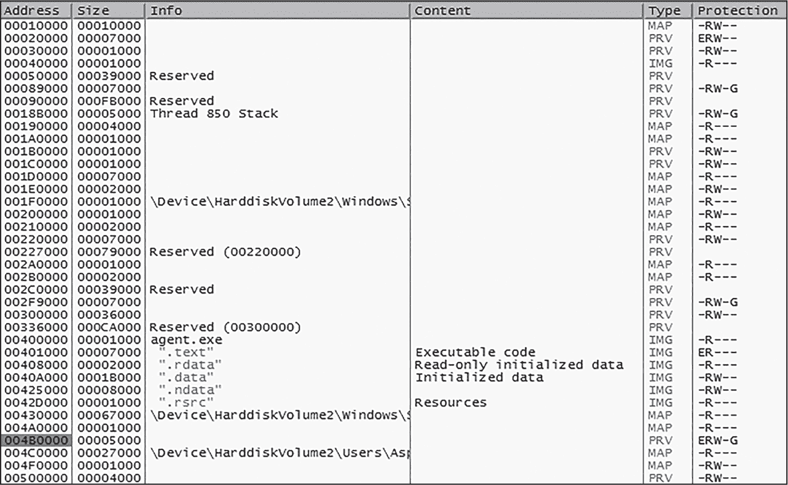

图 17-22：在 x64dbg 中查看内存映射

这个内存映射显示了一些被标记为可执行的内存区域。你可以通过单击顶部的**保护**列标题来轻松排序此列表。一旦找到这些内存区域之一，你可以通过右键点击内存地址并选择**转储内存到文件**来转储它，或者通过选择**在转储窗口中跟踪**来在转储窗口中查看它以进行更仔细的检查。如果你怀疑内存区域中包含的是代码，你也可以在反汇编器中查看该内存区域，这样有助于你快速看到反汇编的代码。要做到这一点，右键点击内存地址并选择**在反汇编器中跟踪**。

需要关注的一些关键事项如下：

**在保护列中具有 E（可执行）的内存区域**

这将表示该区域中存在可执行代码。具有 ERW（执行-读取-写入）保护类的区域应该优先考虑；在许多情况下，恶意软件将在其解压负载即将执行时为该内存区域分配 ERW 保护。请注意，在某些调试器和内存编辑器中，这种保护类被称为 RWX（读取-写入-可执行）。

**具有 PRV 内存类型的区域**

你可以在类型列中找到这一点。PRV 是查找解压代码的一个很好的候选项。

**在信息和内容列中没有任何内容的内存区域**

如果这些字段被填充，通常意味着这些内存区域与恶意软件的可执行文件本身（压缩版本）有关，而不是其解压后的代码。图 17-22 中突出显示的内存区域是进一步检查的重点。

**大型数据大小（由大小列指示）**

一个较大的内存区域（例如 30,000 字节）可能表示内存中解压的可执行文件。然而，这并不总是成立，因为较小的内存区域也可能包含小段恶意代码，例如 shellcode。

**包含 PE 头部的任何内存区域**

运行内存字符串扫描查找 MZ 或 此程序 是有帮助的。在 x64dbg 中执行此操作，右键点击内存映射区域并选择 **查找模式**。然后，在 ASCII 文本框中输入你想要搜索的字符串（例如 此程序），并点击 **确定**。这将搜索所有内存区域，查找你选择的 ASCII 字符串。如果在这些区域中的某个区域找到了 PE 头部，你应该仔细检查它，因为它可能是恶意软件的解压载荷（但要考虑下一点）。

**0x7 范围以下的地址**

以 0x7 开头的内存地址（例如 x77300000）通常与映射到恶意软件进程地址空间中的合法 Windows DLL 相关联，因此你应当减少对这一内存范围的关注。我说 *通常* 是因为恶意软件有时会将恶意代码加载到这些区域之一，但这种情况并不常见。首先将注意力集中在 0x7 范围以下的地址上。对于 64 位恶意软件，这将是 0x700000000000 以下的地址。

##### 分配内存上的硬件断点

如 第三章 所讨论，大多数现代调试器都提供了软件和硬件断点选项。在大多数情况下，软件断点足够使用（例如，设置特定 CPU 指令或 API 函数调用的断点）。然而，硬件断点对于跟踪恶意软件的解压过程也非常有用，因为它们可以直接设置在内存区域上。当恶意软件样本调用如 VirtualAlloc 这样的内存分配函数时，在新分配的内存区域上设置硬件断点可以帮助捕获恶意软件执行其解压后的代码。

在 x64dbg 中执行此操作，定位你感兴趣的内存区域（例如，通过 VirtualAlloc 创建的一个新分配的内存区域），在转储区域查看内存，右键点击并选择 **断点**  **硬件，写入**。这实际上会创建一个持久的硬件断点，当代码或数据写入该内存区域时，恶意程序将暂停。代码写入该区域后，你可以设置一个 硬件，执行 断点来捕获恶意程序执行它。请注意，内存断点也可以在此用于相同的目的。

##### 遵循内存操作的陷阱

在内存管理函数上设置断点可以是跟踪恶意软件解包过程的有效技巧，但也有一些陷阱。首先，由于这些内存管理函数经常被使用（无论是在合法还是非法情况下），它们可能会产生大量噪音。在恶意软件样本中看到成千上万次的内存管理函数执行并不罕见，因此你可能会发现，在这些函数上设置断点会触发调试器执行时的不断暂停，导致你不得不处理太多信息。在这种情况下，最好的做法是与进程创建和代码注入协调工作，正如接下来的章节将详细介绍的那样。或者，你可以简单地改变策略。例如，只关注一个内存操作函数，如VirtualAlloc或VirtualProtect，而不是本章中列出的所有函数。

其次，内存中的断点可能在恶意软件执行过程中触发意外后果，通常表现为异常和程序崩溃。恶意软件可以通过在其代码中实现特殊的保护机制和规避技术来利用这一点，正如在第十章中讨论的那样；我们将在本章末尾简要回顾这一内容。

#### 进程注入监控

恶意软件打包器在解包其恶意代码后，必须将这些代码写入内存。这可能涉及将代码写入其自身的进程地址空间（自注入），或将代码注入到一个生成的子进程或宿主上的其他受害进程中。这是恶意软件解包过程中的关键部分，需要特别关注。正如前面提到的，在沙箱中引爆恶意软件样本始终是一个良好的第一步，但当你尝试手动解包恶意软件时，这一点尤为重要。许多沙箱提供了一个很好的概述，展示了恶意软件如何执行其进程注入行为；这样的指导将帮助你决定在动态解包过程中，在哪里设置断点。

为了说明这一点，图 17-23 展示了提交到 Hybrid Analysis 沙箱中的一个可疑恶意软件样本的结果。

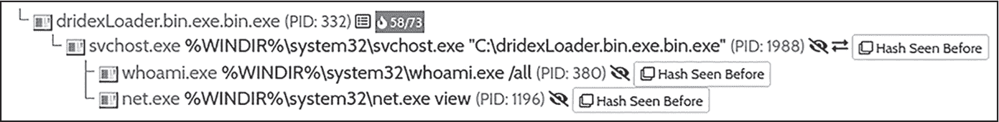

图 17-23：在 Hybrid Analysis 沙箱中恶意软件样本的行为

我们可以看到，这个恶意软件样本正在生成一个子进程 *svchost.exe*，该进程似乎是从路径 *C:\system32\svchost.exe* 执行的。这告诉我们，恶意软件样本可能正在解包其有效载荷并将其注入到来自 *system32* 目录的合法 *svchost.exe* Windows 可执行文件中。如果我们想通过使用调试器手动解包这个恶意软件样本，一个好的第一步是设置断点，预测会被调用的用于此注入技术的函数。例如，恶意软件可能会调用 CreateProcess 或 CreateProcessInternal 来执行 *svchost.exe* 进程。接下来，它可能会调用 WriteProcessMemory 将恶意代码写入目标进程。最后，为了在 *svchost.exe* 的上下文中执行恶意代码，恶意软件可能会调用类似 ResumeThread 的函数。在这些函数上设置断点可能帮助你捕捉到恶意软件有效载荷的解包状态，并从内存中提取它以进行进一步分析。所有这些函数在第十二章中都有描述，所以它们对你来说应该不完全陌生。接下来，让我们看看基于注入的解包在实践中的表现。

> 注意

*要跟随这个示例，你可以使用以下哈希值在 VirusTotal 或 MalShare 上找到所需的恶意软件文件：*

> SHA256: cfb959cc29e728cd0dc6d6f45bcd893fc91cad6f465720d63c5143001e63e705

我们正在调查的恶意软件样本，属于 Ryuk 勒索病毒家族的一个变种，使用了一种进程注入技术，该技术涉及获取一个进程的句柄（OpenProcess）、在该进程内分配内存（VirtualAllocEx）、将其解包代码写入受害者进程（WriteProcessMemory），并最终执行这些恶意代码（CreateRemoteThread）。CreateRemoteThread 是一个非常适合在解包恶意软件时调查的函数，因为在此时，代码已经完全解包，并即将执行。

将恶意软件样本加载到你选择的调试器中（在我的例子中是 x64dbg），并在 CreateRemoteThread 上设置一个断点。接下来，运行恶意软件，直到在 CreateRemoteThread 处触发断点，如图 17-24 所示。

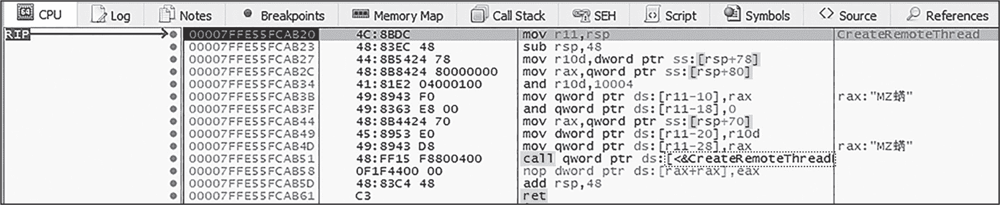

图 17-24：恶意软件调用 CreateRemoteThread 进行进程注入

CreateRemoteThread 接受一些参数，其中之一是指向写入恶意代码的进程的句柄；这个进程即将被执行。由于这个恶意软件样本是一个 64 位样本，CreateRemoteThread函数的这个参数位于 RCX 寄存器中（见图 17-25）。如果这是一个 32 位样本，这个值将位于堆栈中。

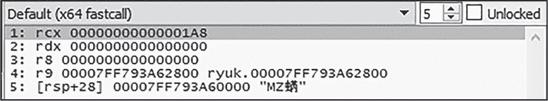

图 17-25：检查 64 位 CPU 寄存器

在我的情况下，这个句柄值是0x1A8。通过与 x64dbg 的“句柄”标签中的句柄列表进行交叉参考，我们可以看到它与进程 ID 2924 相关，该进程在我的虚拟机上是系统进程 *sihost.exe*（见图 17-26）。请注意，你可能需要通过按 F5 刷新“句柄”标签中的数据。

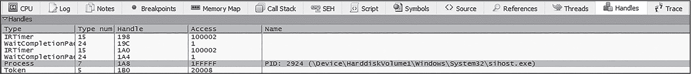

图 17-26：x64dbg 中的句柄列表

要找到即将执行的注入解压缩恶意代码，你需要定位这个代码在 *sihost.exe* 进程中的内存区域。为此，启动另一个调试器实例，然后通过选择**文件****附加**并从进程列表中选择**sihost.exe**来附加到此进程。

附加到该进程后，你可以使用“内存映射”标签来定位可疑的内存区域。这个可疑的内存区域将具有 ERW（执行-读取-写入）保护，并且是一个私有（PRV）内存区域。图 17-27 显示了该可疑内存区域的屏幕截图。

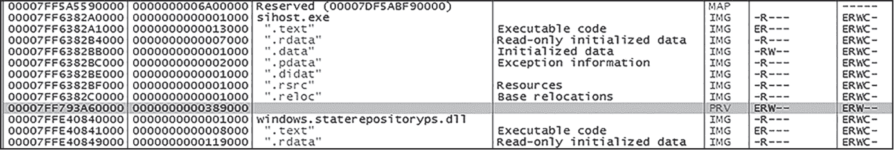

图 17-27：内存映射中的疑似注入代码

为了验证该内存区域是否包含解压缩的可执行文件，右键点击它并选择**在转储中跟踪**。图 17-28 显示该内存区域包含可执行代码！

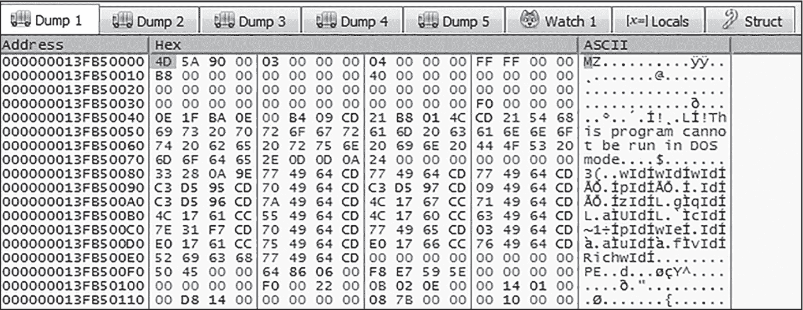

图 17-28：内存中的解压缩可执行文件

现在，为了确认这确实是解压缩的恶意代码，我们将这段代码转储到磁盘（在“内存映射”标签中，右键点击目标内存区域并选择**转储内存到文件**），并使用 PE 查看器如 PEStudio 打开该文件。如图 17-29 所示，PEStudio 中的“字符串”标签揭示了一些有趣的内容。


图 17-29：在 PEStudio 中查看解压缩代码中的字符串

一些罪证字符串包括命令（特别是*cmd.exe*命令，试图从主机中删除备份文件）以及可能与在主机上建立持久性相关的注册表键（/C REG...）。当我们将这些字符串与原始恶意软件样本文件进行比较时，我们可以看到明显的差异（见图 17-30）。

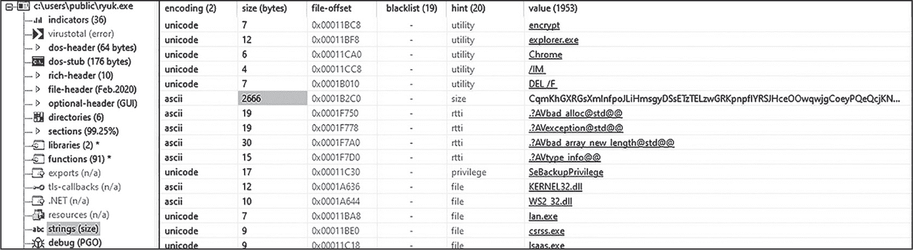

图 17-30：来自原始打包恶意软件的字符串

你能在图 17-30 中发现差异吗？解包代码中的许多字符串缺失。正如你所见，将解包文件中的字符串与原始打包恶意软件文件中的字符串进行比较，可以有效地确认恶意软件是否成功解包。

然而，仅仅查看字符串是有限的。为了进一步分析解包后的代码（例如在反汇编器中），我们可能需要修复并重新对齐转储的代码，稍后我们会介绍这个过程。

#### 使用 API Monitor 进行进程注入跟踪

跟踪技术（见第三章）是一种有效的技术，不仅可以用于监视恶意软件的函数调用，还可以用于解包恶意软件。图 17-31 展示了在 API Monitor 中查看的恶意软件样本。你可以看到恶意软件样本执行了进程注入技术，并使用了本章中提到的几个函数。

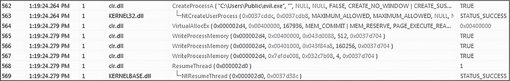

图 17-31：在 API Monitor 中查看进程注入

在创建新进程（CreateProcessA）并在该进程中分配新的内存区域（VirtualAllocEx）后，恶意软件样本使用< sampa class="SANS_TheSansMonoCd_W5Regular_11">WriteProcessMemory将代码写入该新内存区域（见图 17-32）。在 API Monitor 中选择< sampa class="SANS_TheSansMonoCd_W5Regular_11">WriteProcessMemory函数并检查十六进制缓冲区窗口会显示一些有趣的内容：一个< sampa class="SANS_TheSansMonoCd_W5Regular_11">MZ头部！这个< sampa class="SANS_TheSansMonoCd_W5Regular_11">MZ头部告诉我们恶意软件将一个可执行文件写入内存，并且可以从 API Monitor 中复制并转储它。


图 17-32：在 API Monitor 中查看 WriteProcessMemory 进程注入

像 API Monitor 这样的 API 跟踪工具是你工具箱中的绝佳补充，用于跟踪进程注入并在解包过程中捕获恶意软件。

#### 库加载和地址解析

你之前学到，打包器的解包程序可能会使用LoadLibrary和GetProcAddress等函数来动态解析恶意软件所需的函数。因为这些函数是在恶意软件执行其恶意行为之前调用的，所以LoadLibrary和GetProcAddress是接近解包后恶意软件负载的绝佳起点。

当你将打包的可执行文件加载到调试器中时，只需在LoadLibrary和GetProcAddress上设置断点，并通过按 F9 运行代码。可选地，仅在GetProcAddress上设置断点，这样你可以跳过所有的LoadLibrary操作。首先触发的断点很可能是LoadLibrary，它负责导入相关的 DLL 库，随后GetProcAddress会获取恶意软件希望执行的该 DLL 的特定函数地址。如果你继续运行程序，直到所有的函数地址都被解析出来，这可能就是恶意软件在内存中解包并准备开始执行恶意负载和功能的时刻。

从这里，你可以选择将进程从内存中转储（希望它包含了解包后的可执行文件），或者尝试定位 OEP。

#### OEP 位置

由于所有打包器最终都会在解包其负载后将控制流转移到恶意软件的 OEP，因此定位该 OEP 是解包的最佳且最干净的方法之一。这里的“最干净”是指，在 OEP 处转储解包的恶意软件通常会生成一个最接近原始未打包恶意软件样本的可执行文件。接下来，让我们深入探讨如何找到 OEP。

##### 定位解密例程

首先，为了更好地理解恶意软件执行后将经过的解包过程，了解如何在打包样本中定位解密和解压例程是非常有帮助的。第十六章描述了如何在恶意软件中定位解密例程，且这个过程与打包器大致相同。你可以在调试器中调试打包样本，或者使用 IDA Pro 等反汇编工具来定位这些例程。

有一些关键指标可以帮助识别可能的解密和解压例程。首先，可能会有与移位相关的汇编指令，这些指令会重复执行，比如 `xor`、`or`、`shl`、`shr` 等。你还可能会看到许多数学运算指令，如 `add`、`sub`、`mul`、`imul` 和 `div`。最后，还会有循环，这表明解密或解压过程是多次迭代进行的。以下是一个可能在解压存根中的解压例程的示例：

```
`--snip--`
movzx  edx, byte ptr [ecx]
shr    edx, 2
shl    esi, 6
lea    esi, [edx+esi+701h]
mov    edi, eax
sub    edi, esi
mov    dl, [edi]
mov    [eax], dl
mov    dl, [edi+1]
mov    [eax+1], dl
mov    dl, [edi+2]
inc    ecx
mov    [eax+2], dl
add    eax, 3
`--snip--`
```

在这个恶意软件样本代码中，你可能已经注意到 `shr`、`shl`、`sub` 和 `add` 指令，这些都暗示着这段代码正在修改数据。同时还要注意 `mov` 指令（`movzx` 和 `mov`），这些指令表明代码正在操作数据的移动。根据这些迹象，你可以假设这段代码可能是在加载加密（压缩）数据并进行解密（解压）。但为了确定，接下来我们要讨论如何定位尾部跳转指令。

##### 定位尾部跳转

如本章前面所述，尾部跳转发生在解压存根的末尾，并将恶意软件的控制流指向新解压的代码（更具体地说，是 OEP）。定位尾部跳转指令可以帮助你识别解压代码的执行起始位置，这是解压过程中的一个好技巧。由于尾部跳转位于解压过程的最后，它很可能会紧随你刚刚识别的解压和解密例程之后。使用像 IDA Pro 这样的反汇编工具定位尾部跳转最为方便，它应该看起来像是图 17-33。

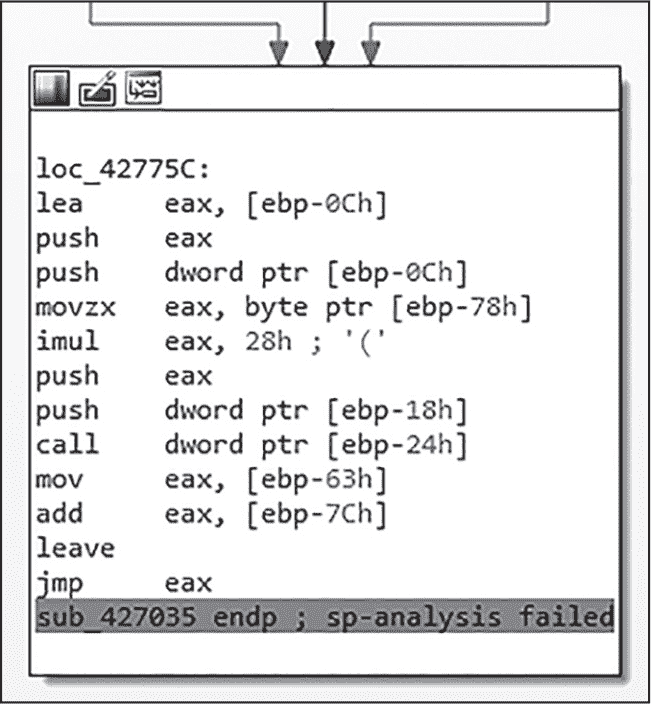

图 17-33：IDA Pro 中的恶意软件尾部跳转

在这个截图中，代码块顶部有三个箭头，这意味着解包过程中的其他代码块正在跳转到这个代码块。这里还出现了一个call指令，接下来是一个jmp指令。这两条指令都引用了动态位置（注意 CPU 寄存器），而不是静态地址，这也是另一个很好的迹象，表明其中一个是尾部跳转。由于恶意软件可能会执行call指令而不是jmp指令，那么究竟哪个是尾部跳转呢？为了回答这个问题，你可能需要将这个样本放入调试器中，设置断点，查看这些指令的地址发生了什么，或者花更多时间静态分析解包代码。它们中的一个会指向 OEP，即恶意软件解包并开始执行其有效载荷代码的点。

> 注意

*你可能已经注意到，sp-analysis failed出现在图 17-33 中代码的最后一行高亮部分。这是 IDA 的提示，表示它无法反汇编其余的代码，可能是因为剩余的代码在解包后动态解析，并且在二进制文件中无法静态访问。这是另一个表明代码被打包且存在解包存根的良好指示器！* ##### 自动查找 OEP

虽然定位 OEP 的最佳方法通常是先定位尾部跳转，但也有一些调试工具和插件试图自动定位样本中的 OEP。例如，OllyDbg（一个老旧的调试器，仍然偶尔被恶意软件分析师和逆向工程师使用）内置了一个名为 SFX 的功能，可能有助于找到解包过程和 OEP。在 OllyDbg 中，导航到**Options****Debugging Options****SFX**，你应该能看到图 17-34 中显示的选项。


图 17-34：OllyDbg 中的调试选项

选择**Trace Real Entry Blockwise**或**Trace Real Entry Bytewise**，然后运行可执行文件。这个工具会尝试跟踪解包代码，并在 OEP 处断点。

由于自动定位 OEP 的工具效果不稳定，它们可能在处理高级恶意软件和打包工具时效果不佳。然而，它们仍然是工具箱中的一种选择，可能会为你节省一些时间和精力。

一旦你认为已经找到了 OEP（使用前面讨论的任何技术），并且样本已经在内存中解包，那么有多种方式可以验证这是否为真实的 OEP，以及样本是否已经完全解包。一个方法是检查内存中的字符串。在 x64dbg 中，只需在反汇编视图中右键点击鼠标，然后选择**查找****当前模块****字符串引用**。一个已解包的恶意软件样本通常会在内存中加载可读字符串，这些字符串表示其某些功能。如果你在内存中看到一些可疑的字符串，那么该样本（或者至少部分内容）现在已经在内存中解包。在这个窗口中，你也可以使用屏幕底部的搜索栏来搜索特定的字符串。

你还可以通过右键点击反汇编窗口，选择**查找****当前模块****模式**来搜索内存中的特定字符串或二进制模式。如果你知道恶意软件有某种能力，并且它将在内存中解包，这种方法非常有用。例如，如果你知道恶意软件将尝试联系 C2 URL（如*http://<wbr>evil<wbr>.com<wbr>/c2<wbr>.php*），你可以在调试器中专门搜索这个模式；如果它存在，恶意软件很可能已经解包，或者该字符串已经被去混淆。请注意，这也可能意味着该字符串在运行时已经加载到堆栈上。

最后，你可以检查*模块间调用*，即恶意软件在某个时刻执行的 Windows API 函数，这些函数现在可能已经在内存中解包。为此，请在 x64dbg 的反汇编视图中右键点击，然后选择**查找****当前模块****模块间调用**。在一个已解包的恶意软件样本中，通常会列出许多有趣的 API 函数。然而，请记住，有些恶意软件不会显示其模块间调用，而是在稍后的时刻进一步解包并解析这些函数。

#### 解包恶意软件提取

当你认为恶意软件的有效载荷已经在内存中解包时，是时候从内存中转储解包的代码了。从内存中转储解包的可执行文件将使你能够更详细地分析恶意代码，比如在反汇编器中进行分析。你可以在解包过程的任何阶段进行此操作，因此不一定需要已经找到 OEP。然而，最好先找到尾跳指令和随后的控制转移到 OEP。你也不必从内存中提取有效载荷以便进一步分析；你可以继续让恶意软件运行，并在调试器中分析它，正如我将在本章后面讨论的那样。

有几种方法可以从内存中转储恶意软件解包的有效载荷。一种方法是使用 Scylla，步骤大致与本章前面描述的一致。在 x64dbg 中启动 Scylla，只需导航到 **插件****Scylla**。选择恶意软件的进程，在 OEP 字段中输入 OEP 地址（如果你已经找到了），或者保持默认的 OEP 设置。你还可以点击 **IAT 自动搜索** 和 **获取导入** 来尝试自动重建 IAT。最后，点击 **转储**。转储解包的有效载荷后，你可能还需要使用 PE 重建选项来修复可执行文件。

另外，你也可以使用 OllyDumpEx，它包含在一些 x64dbg 的包中，或者可以在这里找到：[*https://<wbr>github<wbr>.com<wbr>/x64dbg<wbr>/x64dbg<wbr>/wiki<wbr>/Plugins*](https://github.com/x64dbg/x64dbg/wiki/Plugins)。OllyDumpEx 提供了更多的细节控制，但用户体验稍差。要在 x64dbg 中启动 OllyDumpEx，请导航到 **插件****OllyDumpEx****转储进程**。OllyDumpEx 允许你选择一个进程（模块）、特定的内存区域或内存地址来进行转储。使用哪个选项取决于样本是如何被解包的，以及你是否已经成功找到了 OEP。如果你找到了解包的恶意软件 OEP，选择恶意软件的进程模块，点击 **获取 EIP 作为 OEP** 然后点击 **转储**，如图 17-35 所示。

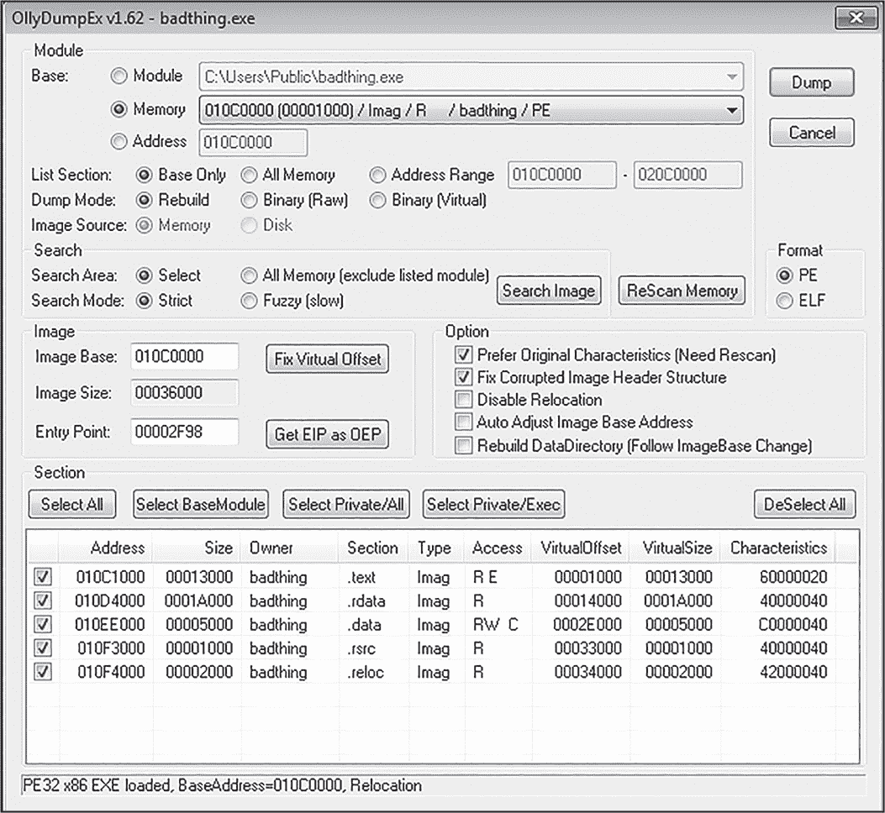

图 17-35：x64dbg 中的 OllyDumpEx 插件

最后，你可以使用本地的 x64dbg 界面将可疑的内存区域保存到磁盘。右键点击反汇编窗口并选择 **在内存映射中跟踪**。接下来，选择包含解包代码的内存区域，右键点击并选择 **将内存转储到文件**。

在这种情况下，提取的内存将以二进制数据的形式存在，通常保存为 *.bin* 文件。运行字符串工具（如 Strings 或 PE Viewer）来查看提取的内存通常是一个不错的第一步。查看字符串可以提供有关如何继续分析的线索。然而，如果你将这个文件加载到反汇编器中查看代码，你可能会失望地发现它需要一些修复。

#### 解包可执行文件修复

一旦解包的有效载荷被转储到磁盘，根据提取方式的不同，它可能无法处于可执行状态或在反汇编器中清晰可分析。常见的原因包括文件错位、PE 头损坏或 IAT 损坏，这些问题也可能使静态分析可执行文件变得困难。让我们看看如何修复这些问题。

##### 自动修复

Scylla 允许你重建一个损坏的可执行文件转储。在你将恶意软件的可疑解包载荷从内存中转储出来后，启动 Scylla（无论是独立版本还是集成在 x64dbg 中的插件），选择恶意软件的运行进程，输入正确的 OEP（如果已识别），然后点击 **IAT 自动搜索**，接着点击 **获取导入**。你可能会收到是否使用高级结果的提示。如果不确定，选择 **否**。如果这个方法不正确，可以稍后再尝试使用高级结果。接下来，点击 **修复转储**，选择你的内存转储文件，并保存文件。检查新生成的可执行文件后，如果 PE 头损坏，你也可以点击 **PE 重建** 来重建头部。还有其他工具可以用来重建 IAT，如 Imports Fixer、ImpREC 和 ChimpREC，但我发现 Scylla 是重建导入最好的工具之一。如果 Scylla 在你的特定情况下不起作用，可以随时尝试这些其他工具。

我的另一个常用工具用于修复未映射（dump）的 PE 可执行文件是 PE Unmapper（[*https://<wbr>github<wbr>.com<wbr>/hasherezade<wbr>/pe<wbr>_unmapper*](https://github.com/hasherezade/pe_unmapper)）。这个工具可以帮助自动化将可执行映像从内存中卸载到文件，并重新对齐可执行文件的过程。以下是其使用示例：

```
C:\> **pe_unmapper.exe dumped_executable.mem 0x13F630000 fixed_executable.exe**
```

要执行 PE Unmapper，你需要将工具（pe_unmapper.exe）指向目标内存映像（在本示例中是 dumped_executable.mem），指定映像的基址（即从内存中转储映像的位置；在此案例中为 0x13F630000），然后指定输出文件名（在此案例中为 fixed_executable.exe）。

##### 手动重新对齐

如果你的自动化工具失败了，你需要使用像 PE-bear 这样的 PE 编辑器工具手动重新对齐头部。在 PE-bear 中，只需加载可执行文件并导航到 **Section Hdrs** 选项卡，你应该可以看到所有部分及其关联的原始大小和虚拟大小。记住，原始大小表示文件在磁盘上的大小，而虚拟大小表示文件加载到内存中的大小。由于我们已将文件从内存中卸载，我们需要尽量让磁盘上的文件与内存中的文件匹配得尽可能紧密。图 17-36 展示了在部分重新对齐之前转储的可执行文件的样子。

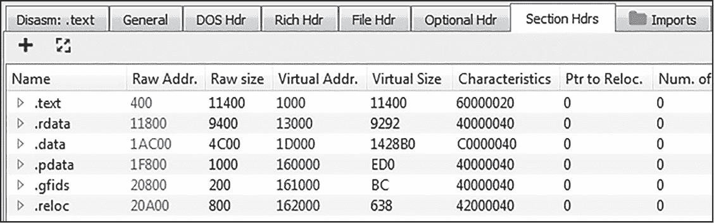

图 17-36：在 PE-bear 中查看新卸载的可执行文件

注意到原始地址（Raw Addr.）和虚拟地址（Virtual Addr.）的偏移量并不匹配。要修复并重新对齐文件，首先确保每个原始地址与其相关联的虚拟地址匹配。这可以通过将虚拟地址列中的内容简单地复制到原始地址列来完成。例如，如果*.text*节的虚拟地址是1000，那么原始地址也应该是1000。

接下来，我们需要重新计算原始大小，以匹配新的原始地址，从而为文件分配空间。通过将第一个节（通常是*.text*）的原始地址减去下一个列出的节（通常是*.rdata*）的原始地址来完成。例如，如果*.text*节的原始地址是 1000 字节，而*.rdata*节的原始地址是 13000 字节，那么*.text*节的原始大小应该是A000（在十进制中为 12000 字节）。你需要对每个地址进行类似的计算。对于最后一个节，你可以尝试输入 0 字节，这通常是可以的。如果这不起作用，可以尝试将其更改为 1000 字节之类的值。图 17-37 展示了解包后的文件应该是什么样的。

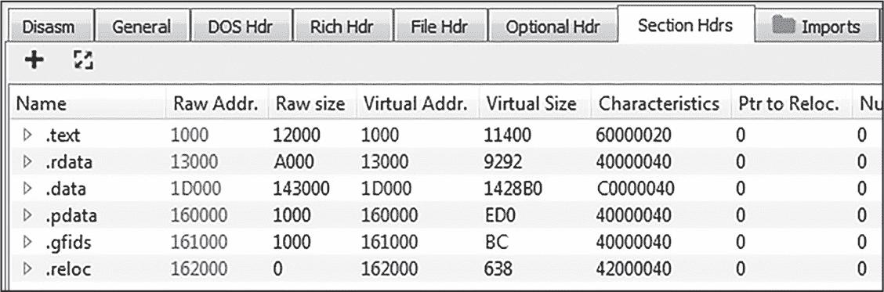

图 17-37：在 PE-bear 中查看修复后的可执行文件

要测试对齐是否成功，请导航到 PE-bear 中的**Imports**选项卡，你应该能看到列出的导入项。如果需要，你可以使用 Scylla 尝试重建 IAT 和头部信息，如前所述。

如果自动和手动修复都无效，而解包后的可执行文件仍然无法运行，你不一定需要修复它。你可以继续在调试器中检查恶意软件（因为当你从内存中转储它时，解包后的有效载荷已经准备好执行），或者你可以尝试在反汇编器或 PE 工具中分析解包后的可执行文件。它可能会更难导航，你可能需要手动标记 Windows 函数调用。

#### 动态解包的通用技巧

有时候这些技巧可能不起作用。恶意软件可能使用了不常见的解包方法，或者它在解包或注入代码时特别隐蔽。如果你遇到这种情况并且遇到了瓶颈，有一些通用技巧可能会帮助你摆脱困境。

##### 倒推分析

如果你在分析一个顽固的恶意软件样本时无法跟踪解包过程或定位 OEP，倒推分析可能会有所帮助。

首先，你需要识别恶意软件表现出的某种行为，并确定可能负责此行为的 Windows API 函数。例如，如果恶意软件试图通过 HTTP 联系 C2 地址，它可能在有效载荷解包后调用 InternetConnectA 函数。或者，如果恶意软件正在创建和修改磁盘上的文件，它可能会调用 WriteFile 函数。

接下来，在你已经确定的函数上设置断点。一旦断点被触发，向回跟踪代码并尝试找到解包例程、样本首次解包的内存区域，或者（更好的是）OEP。

##### 钩取 Windows 解密和压缩函数

恶意软件打包器在解包过程中可能会调用本地 Windows API 解密相关的函数。这些函数中有两个是 CryptDecrypt 和 RtlDecompressBuffer。CryptDecrypt 用于解密之前使用 CryptEncrypt 函数加密的数据。在 CryptDecrypt 上设置断点，可能会让你直接捕获恶意软件解密后的有效载荷（或其他重要数据）的一部分，捕获时机是解密后但未执行之前。断点触发后，检查传入 CryptDecrypt 函数的缓冲区（通常是堆栈上的 *第五* 个值）。

RtlDecompressBuffer 有时被恶意软件用来解压先前压缩的缓冲区。与 CryptDecrypt 一样，在 RtlDecompressBuffer 上设置断点，并在函数调用后检查缓冲区（通常是堆栈上的 *第二* 个值）。你可能会幸运地看到这个缓冲区中的新解包代码或可执行文件。

##### 定位打包代码

IDA Pro 和一些其他反汇编工具有一个功能，可以将可执行文件中的数据和代码以彩色框的形式可视化。你可以在 IDA 界面顶部找到这种可视化效果，如图 17-38 所示。

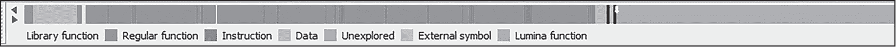

图 17-38：IDA Pro 中文件的可视化表示

尽管在黑白书籍中你看不见它，但这个可视化表示为文件中不同类型的数据分配了不同的颜色。未探索部分（位于此图像的最右侧）是可执行文件中 IDA 无法确定数据类型的区域。有时这些区域是加密或打包的数据或代码，或者是恶意软件在执行后写入数据的区域。这些区域通常会被分配一个名称（例如 unk_4141C0 或 dword_1000502C）。如果选择该区域名称并按下 X（跨引用的快捷键），你应该会看到一个列出引用该区域的代码区域的列表。探索这些代码区域可能会引导你找到恶意软件的主要解包例程！或者，在引用未探索区域的代码区域上设置断点，可能会帮助你了解恶意软件如何使用该区域。

#### 动态解包的有用工具

由于解包有时非常困难，因此在困难时刻依赖一组工具会非常有帮助。本节将概述我最喜欢的一些工具。

##### HollowsHunter

HollowsHunter（[*https://<wbr>github<wbr>.com<wbr>/hasherezade<wbr>/hollows<wbr>_hunter*](https://github.com/hasherezade/hollows_hunter)），它是基于名为 PE-Sieve 的工具（[*https://<wbr>github<wbr>.com<wbr>/hasherezade<wbr>/pe<wbr>-sieve*](https://github.com/hasherezade/pe-sieve)）构建的，是一个 Windows 命令行工具，能够检测正在运行的进程中的各种异常（例如注入的 PE 文件和代码、钩住的函数以及内存补丁），然后转储可疑的内存区域。虽然它并非仅用于解包，但在这方面也表现出色。表 17-2 列出了 HollowsHunter 的一些最有用的参数。

表 17-2： 有用的 HollowsHunter 参数

| 参数 | 描述 |
| --- | --- |
| /help | 显示所有命令及其用法。 |
| /pid pid | 指定要扫描的目标进程 ID，而不是扫描所有进程。也可以指定多个目标进程 ID。 |
| /loop | 在初始扫描完成后继续循环。适用于 监控系统上运行的进程，以防恶意软件解压或代码注入存在延迟。 |
| /data | 扫描不可执行的内存区域以及可执行区域。如果你怀疑恶意软件可能正在写入代码或数据，并将其设置为不可执行保护（如 R、W、RW 等），请启用此选项。 |
| /hooks | 扫描内存补丁和内联钩子。 |
| /iat mode | 扫描 IAT 钩子。将 mode 设置为 1 将执行过滤扫描，排除系统 IAT 钩子的噪音。 |
| /shellc | 扫描 shellcode 注入。可能会产生一些噪音，因此请谨慎使用。 |
| /imp mode | 尝试恢复任何转储的可执行文件的导入表。将 mode 设置为 1 将尝试自动检测正确的导入重建方法。 |

要使用 HollowsHunter，在你的分析环境中执行恶意软件并运行 HollowsHunter，使用所需的命令行选项，如下所示：

```
C:\> **hollows_hunter64.exe /loop /hooks /shellc /iat 1 /imp 1**
```

该命令告诉 HollowsHunter 继续循环遍历系统上所有运行中的进程（/loop），特别是搜索钩子（/hooks）、注入的 shellcode（/shellc）和 IAT 钩子（/iat 1）。最后，HollowsHunter 将尝试重建转储的解压可执行文件的 IAT（/imp 1）。

在运行 HollowsHunter 后，它会尝试检测内存中的恶意代码。例如，在图 17-39 中，HollowsHunter 检测到了*RuntimeBroker.exe*和*dllhost.exe*进程中可能的恶意代码。这段代码可能是恶意软件解包自己后，随即注入到这些进程中的结果。

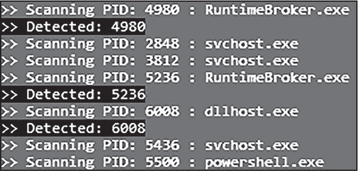

图 17-39：HollowsHunter 扫描进程内存

一旦检测到可疑代码，HollowsHunter 会将可疑的内存区域转储到磁盘，并将所有转储的内存镜像按进程 ID 整理成一系列目录，正如图 17-40 所示。

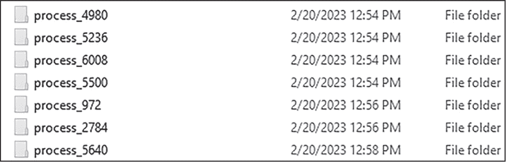

图 17-40：HollowsHunter 输出结果

HollowsHunter 通常是我尝试的第一个解包技术。有时候我只需要快速获得解包后的恶意软件样本，而不必在解包过程中浪费时间。一个类似的工具 Mal_Unpack（[*https://<wbr>github<wbr>.com<wbr>/hasherezade<wbr>/mal<wbr>_unpack*](https://github.com/hasherezade/mal_unpack)）是由同一个作者编写的，也非常有用。像 HollowsHunter 一样，Mal_Unpack 基于 PE-Sieve，但它使用了一种特殊的可选驱动程序，可以更好地控制自动解包过程。图 17-41 展示了 Mal_Unpack 的使用情况。

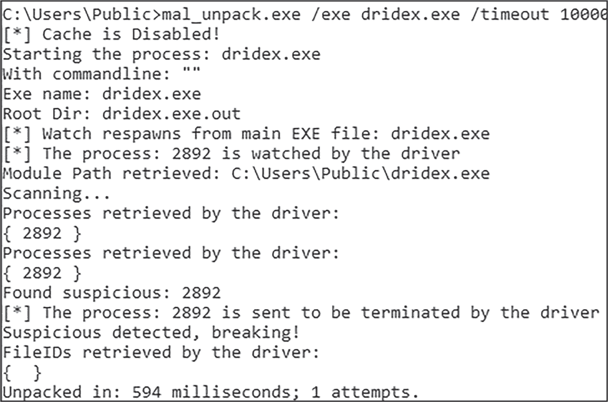

图 17-41：Mal_Unpack 解包 Dridex 恶意软件样本

如你所见，Mal_Unpack 成功解包了一个属于 Dridex 家族的恶意软件样本！

这两个工具都可以成为你分析工具库中有价值的补充。然而，由于 HollowsHunter 能够扫描主机上所有运行的进程，它通常能识别并定位恶意软件注入到其他进程中的代码。因此，我常常发现它更符合我的需求。我建议尝试这两个工具，以确定哪个最适合你。

##### ScyllaHide RunPE 解包器

我在本书中多次提到的 ScyllaHide，提供了一个名为 RunPE 解包器的选项，旨在当它检测到解包发生时，自动从内存中提取可执行文件。该功能挂钩了NtResumeThread，以拦截某些进程注入技术，并在恶意软件执行其有效载荷之前转储解包后的恶意软件。

要使用此功能，请将恶意软件样本加载到 x64dbg 中，选择**插件****ScyllaHide****选项**。勾选**RunPE 解包器**并点击**应用**，如图 17-42 所示。

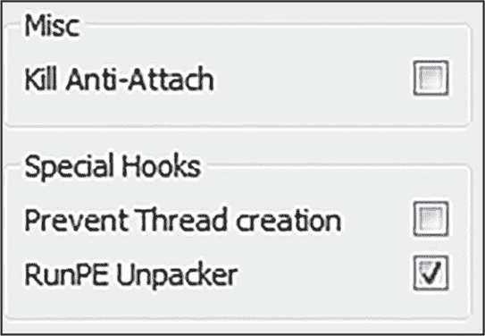

图 17-42：ScyllaHide 中的 RunPE 解包器

启用此功能后，像平常一样运行恶意软件。如果解包成功，你应该会在桌面上看到一个新创建的可执行文件；你不会收到其他关于成功与否的通知。RunPE 解包器针对特定的进程注入技术，并非所有情况下都有效。但在有效时，它能节省你大量时间。

##### 关于仿真与插桩的说明

仿真器和二进制插桩框架，我们将在附录 A 中简要讨论，也可用于动态解包恶意软件。这些工具集甚至可以提供一种完全自动化解包过程的方法。例如，Speakeasy（[*https://<wbr>github<wbr>.com<wbr>/mandiant<wbr>/speakeasy*](https://github.com/mandiant/speakeasy)）允许你仿真恶意代码并“挂钩”可疑的函数调用。由于 Speakeasy 操作可以脚本化，因此可以自动化拦截如 VirtualProtect、WriteProcessMemory 或 ResumeThread 等函数调用，从而自动化恶意软件的解包。虽然本章不会深入讨论仿真器或插桩，但要知道，你在本章中学到的许多技术都可以应用于这些工具集。

##### 其他工具

最后，你可以在 GitHub 上找到几个有助于解包的 x64dbg 脚本和插件，链接如下：[*https://<wbr>github<wbr>.com<wbr>/x64dbg<wbr>/Scripts*](https://github.com/x64dbg/Scripts) 和 [*https://<wbr>github<wbr>.com<wbr>/x64dbg<wbr>/x64dbg<wbr>/wiki<wbr>/Plugins*](https://github.com/x64dbg/x64dbg/wiki/Plugins)。这些脚本和插件可以自动解包某些打包器，自动定位 OEP，隐藏调试器，绕过反分析检查等。

最后需要注意的是，来自惊人的恶意软件研究和逆向工程社区，总是会有新的创新研究项目和工具发布，因此我无法在这里一一列举。始终关注新发布的工具，它们能帮助解包并更广泛地进行恶意软件分析。

### 手动静态解包

我们将讨论的最后一种解包方法是*静态解包*，即逆向工程解包机制的过程，分析一个打包的恶意软件样本，然后编写代码复制该机制。当这段代码在打包的恶意软件可执行文件上运行时，恶意软件样本理论上会被解包。编写静态解包器的过程大致如下：

1.  定位打包的恶意软件可执行文件中的解包例程。

2.  定位解混淆或解密过程中的具体指令。

3.  逆向工程解密例程（可以借助反编译器完成，比如内置在 IDA Pro、Ghidra 或 x64dbg 中的反编译器）。

4.  编写静态解包代码，以模拟可执行文件中的解包例程。

5.  将打包的恶意软件样本输入静态解包器并进行测试！根据需要进行调试。

我选择不深入讲解这种解包技术有两个原因。首先，这个过程可能非常耗时且乏味，学习其他解包技术可能是更好的时间利用，假设你的目标是快速解包恶意软件样本以便更好地理解它。其次，如果你成功逆向工程解包技术并编写了静态解包器，你的代码可能只能在这个特定样本上正常工作，因为恶意软件打包器通常会在解包例程中引入某种随机性（例如随机解密密钥、混淆技术或其他方式）。静态解包器对于打包器代码的重大修改并不具有韧性。

这并不意味着手动静态解包没有价值。静态解包器通常更适合大规模分析。例如，如果你试图一次解包几十或几百个样本，静态解包比将所有这些样本通过动态引擎运行更高效。此外，逆向解包过程并编写解包器是了解恶意软件如何打包其代码的好方法，通常也是了解加密、压缩和混淆的好方法。

### 无解包分析

有时你可能会发现自己无法成功解包恶意软件样本。也许在恶意软件运行时你失去了对样本的控制，无法确定恶意软件是如何以及在哪里解包的，或者找不到 OEP。在这种情况下，问问自己是否真的需要解包恶意软件。你试图通过解包实现什么目标？你想回答哪些问题？

在许多情况下，你不必完全解包样本就能理解其关键行为，甚至可以进行代码分析。你可以使用本书中介绍的技术，从内存中提取解包后的恶意软件样本的部分内容。这将使你至少能够对数据、代码和提取的字符串进行一些分析。或者，你可以在调试器中检查正在运行的恶意软件，监控其行为，设置在有趣的函数调用上的断点，检查内存中的代码和字符串。最后，有时仅仅在自动化沙箱中检查恶意软件的执行状态就足以让你理解恶意软件的基本功能。

### 反解包技术

到目前为止，我们一直在讨论恶意软件打包工具用于解密和去混淆恶意软件有效载荷、将其写入内存并执行的典型方法，有时是以隐蔽的方式。我们也讨论了常见的自动和手动解包方法，以便更好地分析和理解恶意软件。但是，如果恶意软件打包工具本身反击并试图规避你的工具和分析怎么办？一些打包工具，尤其是专门为恶意软件设计的工具，会实现某种形式的虚拟机和沙盒检测技术，并试图规避分析过程，以保护恶意软件的原始代码。因此，了解和理解高级打包工具使用的常见反解包技术非常重要。

本书中已经讨论了许多这些技术。例如，恶意软件打包工具通常会实现 第二部分中讨论的沙盒和虚拟机检测技术。在解包恶意代码之前，打包工具会尝试识别样本是否运行在虚拟机或沙盒环境中，如果是，它会避免解包。

许多恶意软件打包工具还利用了 第十章中讨论的技术来检测和阻碍调试程序。例如，在解包和运行恶意代码之前，打包工具会尝试检测是否正在被调试，如果是，它会终止自身。它还可能通过使用反调试技术（例如干扰断点或使用内存保护页）来干扰手动解包过程。一些打包工具甚至实现了 第八章中讨论的沙盒规避技术。例如，它们可能在解包和执行恶意软件有效载荷之前先睡眠一段时间，从而在恶意软件沙盒中创建超时情况并混淆分析过程。

基本的反解包技术可以像修改原始打包程序一样简单，使其更难被检测和解包，这可以通过任何著名或开源的打包工具来实现。例如，恶意软件作者可以使用 UPX 打包工具打包他们的样本，但修改它以去除正常的节名称字符串（如 UPX0、UPX1 等）或破坏其头部。然后，当恶意软件分析师尝试识别打包工具时，他们将不容易检测到 UPX。此外，打包工具的代码可以被修改，使正常的 UPX 解包变得不可能（例如，使用 UPX 工具）。打包工具还可以修改或破坏解包后的可执行文件头部，这样在解包样本时，自动化工具和恶意软件分析师就更难定位解包后的 PE 文件。

IAT 混淆是恶意软件加壳程序采用的另一种技术。在加壳程序解析初始的导入函数后，它可能会修改或完全销毁 IAT，然后在稍后的时刻通过动态解析函数地址来重建 IAT。同样地，加壳程序也可能会分配一块独立的内存区域，如跳转表，用来存储跳转到它希望执行的函数的指令，从而混淆其 IAT。

最后，恶意软件加壳程序可以通过彻底混淆的方式进行自我掩盖。加壳程序往往具有非常复杂的控制流程，包含难以理解的代码和控制流转换（如在第九章和第十一章中讨论的一些技巧），使得跟踪代码和解包过程变得困难。加壳程序可能还会通过多次步骤解包恶意代码，进一步混淆解包过程，令分析人员难以清晰地解包恶意软件的有效载荷。

### 总结

在本章中，您了解了一些常见的加壳程序类型以及恶意软件如何利用加壳程序来混淆代码，阻碍分析人员和研究人员理解其行为，并逃避检测和防御工具。您还看到了一些可以用来剖析解压器层并获取恶意软件核心（其有效载荷）的方法。最后，我们简要探讨了恶意软件加壳程序如何尝试规避分析措施。

在附录 A 中，我们将探讨如何建立一个有效的反规避分析实验室，这在您的恶意软件规避调查中将是一个极大的资产。

### 结束语

本章标志着*恶意软件规避*的结束。希望您已经获得了可以应用到威胁调查和分析工作中的新技能。但最重要的是，我希望这本书能激发您对规避威胁领域的兴趣，并让您渴望获得更多的知识。

我鼓励您继续研究这一迷人的话题。一个很好的开始是查阅附录 C，其中包含一些推荐的资源和进一步阅读。然后，尝试运用您的新技能，拆解一段有趣的恶意软件。进行实验，揭示它如何试图规避防御和您的分析工具。最重要的是：记录您的发现与他人分享！我们共同抵抗恶意软件和网络犯罪的力量远大于单打独斗。感谢您的阅读。
