# A 建立一个反规避分析实验室


建立一个分析实验室是恶意软件分析的关键部分，对于高度规避和上下文感知的恶意软件尤其如此。一个调试良好的分析环境使得分析和逆向这类恶意软件的困难任务变得稍微容易一些。在本章中，我将带你创建一个基本的恶意软件分析实验室环境，提供一些隐藏你的虚拟机管理程序和虚拟机免受恶意软件攻击的配置建议，并分享一些你在分析过程中可以使用的小技巧。

## 实验室架构

恶意软件分析实验室环境包含支持分析过程的各种虚拟机、软件和其他工具。实验室环境很可能包括图 A-1 中展示的所有或部分组件。

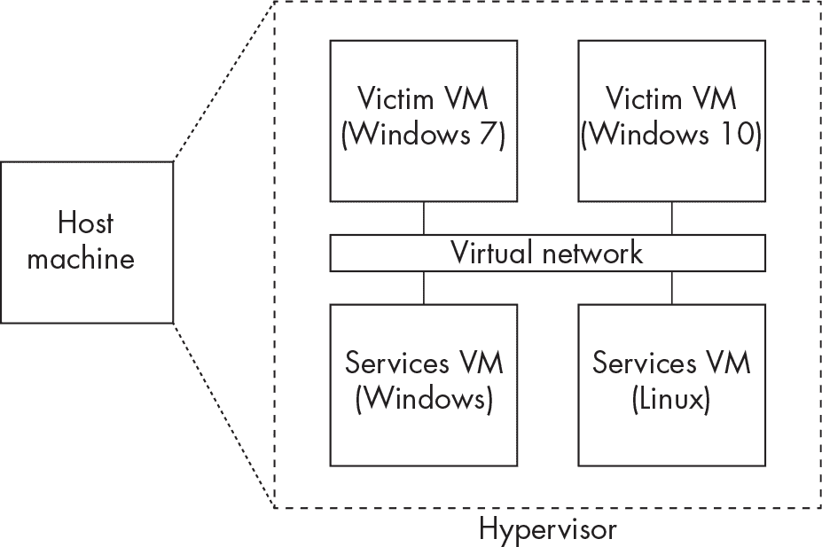

图 A-1：一个典型的恶意软件分析实验室环境

让我们依次介绍每个部分。

### 主机

你的*主机*由一个或多个计算机组成，这些计算机包含并运行你的恶意软件分析虚拟机。通常最好选择与恶意软件操作系统不同的主机操作系统。例如，在本书中，我主要关注的是 Windows 恶意软件，因此我会选择 Linux 或 macOS 作为我的主机操作系统。原因很简单：如果你分析的恶意软件逃脱了 Windows 虚拟机环境（虽然不太可能，但仍然有风险），那么主机上的不同操作系统意味着恶意软件很可能无法感染它。

### 虚拟机管理程序

恶意软件分析实验室的第二个最重要的组件是*虚拟机管理程序*。本质上，虚拟机管理程序将主机计算机的资源（处理能力、内存、存储等）分配给虚拟操作系统及其应用程序（虚拟机）。虚拟机管理程序可以同时运行多个虚拟机，并确保它们彼此不会干扰。

大多数虚拟化管理程序都可以进行*快照*，即虚拟机在某一特定状态下的镜像，这是恶意软件分析中的重要组成部分。在配置好虚拟机后，记得先拍摄一个“干净的”预感染快照；这将成为你启动恶意软件前的起始点。在恶意软件执行的关键节点，你甚至可以在分析过程中拍摄快照。例如，你可能希望在调试恶意软件可执行文件时拍摄虚拟机的快照。如果调试器崩溃或者恶意软件使用了反调试技术，你可以根据需要轻松恢复到先前的快照。分析完成后，快照也可以恢复到原始状态。我们将在本章后面再次讨论快照。

两个最受欢迎的虚拟化管理程序分别是 VirtualBox 和 VMware Workstation，适用于 Windows 和 Linux 系统。稍后我们会再次讨论它们。

### 受害者 Windows 虚拟机

当处理针对 Windows 的恶意软件时，你应当专门配置一个或多个 Windows 虚拟机作为“受害者”主机，在这些主机上执行恶意软件并监控其行为。（对于针对 Linux 或 macOS 的恶意软件，你需要相应的配置。）由于一些恶意软件专门针对特定版本的 Windows，保持不同配置的虚拟机是明智的选择。例如，我同时使用 Windows 7 和 Windows 10 虚拟机，并且在它们上安装了不同版本的软件（如 Microsoft Office）。请注意，你不应主要依赖 Windows 7 来进行恶意软件分析；由于它现在已经相当过时，可能缺少现代恶意软件所依赖的文件和库！

恶意软件分析和研究社区慷慨地提供了许多便捷的、免费的开源工具，用于配置你的受害者机器。

### 服务 Windows 虚拟机

如其名称所示，“服务”Windows 虚拟机托管着可能用于支持恶意软件分析过程的服务。举例来说，包括活动目录服务（用于模拟 AD 域）、服务器消息块（SMB）和文件共享服务、聊天服务（如 IRC）以及数据库服务器。如果你正在分析的恶意软件样本尝试与网络中的其他服务通信，安装这些服务并观察恶意软件如何与它们交互是没坏处的。然而，这个实验室组件并不是严格的要求，你可能能够在没有它的情况下进行分析；这完全取决于恶意软件的能力以及你在分析中要达成的目标。你甚至可以使用网络模拟工具（如 INetSim、FakeDNS 或 FakeNet）模拟其中一些服务，稍后我们会简要讨论这些工具。

### Linux 虚拟机

即使你处理的是针对 Windows 的恶意软件，手边有一台 Linux 虚拟机也是个好主意。Linux 有许多命令行工具，可以为你节省大量时间和精力。它还可以作为 Windows 受害者虚拟机的网络网关，通过监控和伪造网络服务来提供支持。甚至还有一些预构建的 Linux 恶意软件分析环境。Remnux ([*https://<wbr>remnux<wbr>.org*](https://remnux.org)) 包含了你在 Linux 上进行恶意软件分析所需的几乎所有工具。Remnux 的替代方案包括 SANS SIFT Workstation ([*https://<wbr>www<wbr>.sans<wbr>.org<wbr>/tools<wbr>/sift<wbr>-workstation<wbr>/*](https://www.sans.org/tools/sift-workstation/)) 和 Tsurugi Linux ([*https://<wbr>tsurugi<wbr>-linux<wbr>.org*](https://tsurugi-linux.org))，但请注意，这些工具也主要专注于通用的取证和事件响应任务。最后，Security Onion ([*https://<wbr>securityonionsolutions<wbr>.com<wbr>/software*](https://securityonionsolutions.com/software)) 是一个专注于网络流量分析和监控的预配置虚拟机镜像。它也可以成为你恶意软件分析工具箱中的一项有力补充。

现在你已经基本了解了分析实验室的组成，是时候自己搭建一个了！

## 搭建你的实验室

本节将引导你搭建一个基本的恶意软件分析实验室，该实验室由一个安装了虚拟机管理程序的主机、一台 Windows 受害者虚拟机和一台 Linux 虚拟机组成。由于主机操作系统和虚拟机管理程序的组合种类繁多，我无法涵盖所有情况，因此本实验假设你的主机操作系统是 Linux 的某个版本，如 Ubuntu，并且你的虚拟机管理程序是 VMware Workstation 或 Oracle VirtualBox。以下步骤也适用于 Windows 或 macOS 主机，但请注意，可能需要对一些细节进行调整。

### 选择虚拟机管理程序

你选择的虚拟机管理程序将主要取决于你主机的操作系统和可用资源。以下是一些最受欢迎的虚拟机管理程序：

**Oracle VirtualBox**

VirtualBox ([*https://<wbr>www<wbr>.virtualbox<wbr>.org*](https://www.virtualbox.org)) 是一款功能丰富的虚拟机管理程序，供非商业用途免费使用。它包括了大多数收费虚拟机管理程序的功能，并且支持 Windows、Linux 和 macOS 环境。

**VMware Workstation**

VMware Workstation ([*https://<wbr>www<wbr>.vmware<wbr>.com<wbr>/products<wbr>/workstation<wbr>-pro<wbr>.html*](https://www.vmware.com/products/workstation-pro.html)) 拥有一套丰富的功能，可以安装在 Windows 或 Linux 主机环境中。它需要购买许可证，但 VMware 提供了一个免费的 30 天试用期。

**VMware Fusion**

VMware Fusion ([*https://<wbr>www<wbr>.vmware<wbr>.com<wbr>/products<wbr>/fusion<wbr>.html*](https://www.vmware.com/products/fusion.html)) 是适用于 macOS 的专用 VMware 虚拟化管理程序。它与 VMware Workstation 非常相似，也需要许可证。

**Microsoft Hyper-V**

Hyper-V ([*https://<wbr>learn<wbr>.microsoft<wbr>.com<wbr>/en<wbr>-us<wbr>/virtualization<wbr>/hyper<wbr>-v<wbr>-on<wbr>-windows<wbr>/about<wbr>/*](https://learn.microsoft.com/en-us/virtualization/hyper-v-on-windows/about/)) 是适用于 Windows 主机的一个优秀且免费的虚拟化管理程序。它可以运行 Windows 虚拟机以及一些基于 Linux 的虚拟机。

**KVM（基于内核的虚拟机）**

KVM ([*https://<wbr>linux<wbr>-kvm<wbr>.org*](https://linux-kvm.org)) 是适用于 Linux 主机环境的开源虚拟化管理程序。

作为付费产品，VMware Workstation 和 VMware Fusion 拥有一些免费的或开源虚拟化管理程序所没有的附加功能。不过，根据我的经验，VirtualBox 完全适合恶意软件分析，在使用过程中我并没有感觉缺少任何功能。

选择虚拟化管理程序后，您需要下载并安装它。对于 VirtualBox，您可以在 [*https://<wbr>www<wbr>.virtualbox<wbr>.org<wbr>/wiki<wbr>/Downloads*](https://www.virtualbox.org/wiki/Downloads) 找到适用于您的操作系统的最新版本虚拟化管理程序，并获取更多安装说明。要下载 VMware Workstation 的试用版，请访问 [*https://<wbr>www<wbr>.vmware<wbr>.com<wbr>/products<wbr>/workstation<wbr>-pro<wbr>/workstation<wbr>-pro<wbr>-evaluation<wbr>.html*](https://www.vmware.com/products/workstation-pro/workstation-pro-evaluation.html)。

安装虚拟化管理程序后，您需要验证一些设置。

### 验证虚拟化管理程序的网络设置

要在稍后为虚拟机实现网络功能，首先需要检查 VirtualBox 虚拟机管理程序的网络设置。在 VirtualBox 中，导航到**文件****主机网络管理器**。

如果此处没有列出任何网络，请点击**创建**来创建一个。您可以简单地使用默认设置（将 IPv4 地址设置为 192.168.56.1，子网掩码设置为 255.255.255.0 等等），但在 DHCP 服务器选项卡中，请确保选中**启用服务器**。

如果在 VirtualBox 主机网络管理器中没有看到任何网络，且在尝试创建网络时遇到“错误：VBoxNetAdpCtl：添加新接口时出错：无法打开 /dev/vboxnetctl：没有此类文件或目录”等错误，尝试退出 VirtualBox，在终端执行以下命令，然后重新启动 VirtualBox：

```
> **sudo modprobe vboxnetadp**
```

如果您使用的是 VMware Workstation 虚拟化管理程序，网络设置上没有特别要求，您可以继续进行下一步：在虚拟机上下载并安装 Windows。

### 获取 Windows 镜像

要创建 Windows 受害者虚拟机，你需要一份 Windows 7、10 或 11 的拷贝，但我将以 Windows 10 作为示例，因为它是我进行恶意软件分析时的首选操作系统。你可能已经有一份 Windows 的拷贝和许可。如果没有，你可以从 [*https://<wbr>www<wbr>.microsoft<wbr>.com<wbr>/en<wbr>-us<wbr>/software<wbr>-download<wbr>/windows10ISO*](https://www.microsoft.com/en-us/software-download/windows10ISO) 获取 Windows 10 的 ISO 镜像文件。只需选择你想下载的 Windows 版本，例如 Windows 10（多版本 ISO），然后点击 **确认**。

接下来，你需要选择要下载的 Windows 安装文件的语言以及架构（64 位或 32 位）。除非你明确要分析 32 位恶意软件，否则你应选择 64 位版本，这种情况比较少见。将 Windows ISO 文件放到一旁，稍后你会用到它。

### 创建 Windows 受害者虚拟机

现在，你将开始在选择的虚拟机管理程序中创建 Windows 虚拟机。我将以 VirtualBox 为例，稍后我会讨论 VMware Workstation 中相同的步骤。

> 注意
> 
> *以下说明包含虚拟机管理程序中的一系列菜单。步骤可能会根据你使用的虚拟机管理程序版本有所变化。如果缺少某个配置窗口，或者你的窗口与此处描述的不同，具体的配置可能会在虚拟机创建过程中稍后显示在另一个窗口中。*

#### 在 VirtualBox 中创建虚拟机

如果你选择了 VirtualBox 作为你的虚拟机管理程序，启动程序并选择 **机器****新建**，然后指定虚拟机的名称以及存储位置。同时指定你安装操作系统的类型和版本。对于我们的用途，类型应选择 **Microsoft Windows**，版本选择 **Windows 10（64 位）**。点击 **下一步**。

接下来，你需要配置虚拟机的一些基本设置。将内存大小设置为 4,096MB（即 4GB）或更高。逃避检测的恶意软件通常会使用内存大小检测作为反虚拟机技巧，因此将此值设置得尽可能高是很重要的（4GB 通常就足够）。这也会提升虚拟机的性能。然后，在硬盘设置中选择 **现在创建虚拟硬盘** 并点击 **下一步**。

要配置虚拟机的磁盘镜像，设置文件大小为至少 80GB。确保在硬盘文件类型中选择 **VDI**，并在物理硬盘存储中选择 **动态分配**。点击 **创建**。

你应该能够在 Oracle VM VirtualBox 管理器屏幕中看到并选择你创建的虚拟机，如 图 A-2 所示。

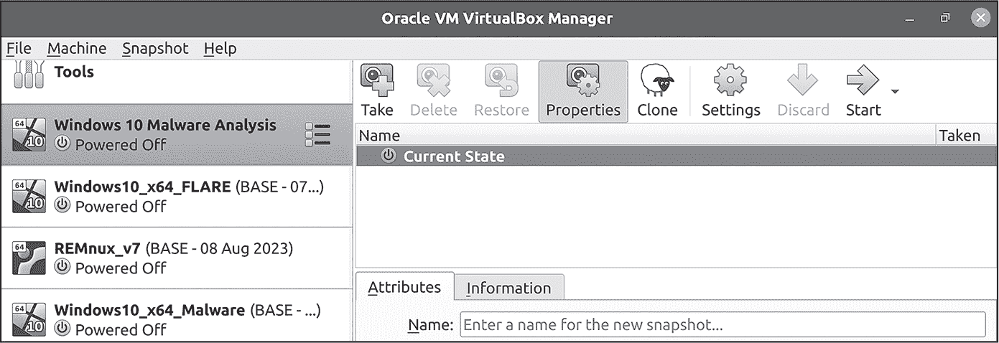

图 A-2：在 Oracle VM VirtualBox 管理器中创建的新虚拟机

现在我们将在 VMware Workstation 中介绍这些相同的步骤。

#### 在 VMware Workstation 中创建虚拟机

要在 VMware Workstation 中创建新的虚拟机，请导航至**文件****新建虚拟机**。您应该会看到新虚拟机向导对话框。在虚拟机配置下，选择**典型（推荐）**，然后点击**下一步**。

VMware Workstation 应该会提示您选择安装操作系统的方式。选择**使用 ISO 镜像**，然后浏览到您之前下载的 Windows 10 ISO 文件。接着，点击**下一步**。

现在，您需要配置一些基本的 Windows 安装设置。将 Windows 产品密钥字段留空（除非您有产品密钥要输入）。在“安装 Windows 的版本”中，选择合适的 Windows 版本（在本例中，**Windows 10 专业版**）。在个性化 Windows 字段中，输入您的用户名（并可选择设置密码）以用于新的 Windows 安装。然后，点击**下一步**。

接下来，您需要指定新虚拟机的名称以及它和所有文件应存储的位置。配置完这些设置后，点击**下一步**。

要配置虚拟机磁盘，请将磁盘大小设置为至少 80GB，然后选择**将虚拟磁盘存储为单个文件**或**将虚拟磁盘分割成多个文件**。这一选择完全基于个人喜好。我个人更倾向于后者，因为将较小的虚拟机文件转移到另一个硬盘或 USB 驱动器上比转移一个庞大的文件要容易得多。一旦做出选择，点击**下一步**。

最后，您应该看到一个显示新虚拟机设置概述的屏幕。稍后，我们将自定义此虚拟机。现在，请确保取消选择**创建后自动启动此虚拟机**，然后点击**完成**以创建虚拟机。

#### 在虚拟机中安装 Windows

现在，您已在选择的虚拟化平台中创建了虚拟机，准备好安装 Windows。要开始安装过程，首先需要将虚拟机指向 Windows 安装镜像（即您之前下载的 ISO 文件）。

如果您正在使用 VMware Workstation 并且已经按照之前的指示操作，ISO 文件已经加载到虚拟机中并准备好使用！对于 VirtualBox，您需要右键点击虚拟机并选择**设置**，然后点击**存储**。接下来，选择存储设备下的 CD 图标以及属性中的光驱下拉菜单（见图 A-3），导航到您磁盘上的 Windows ISO 文件，并点击**确定**保存配置。

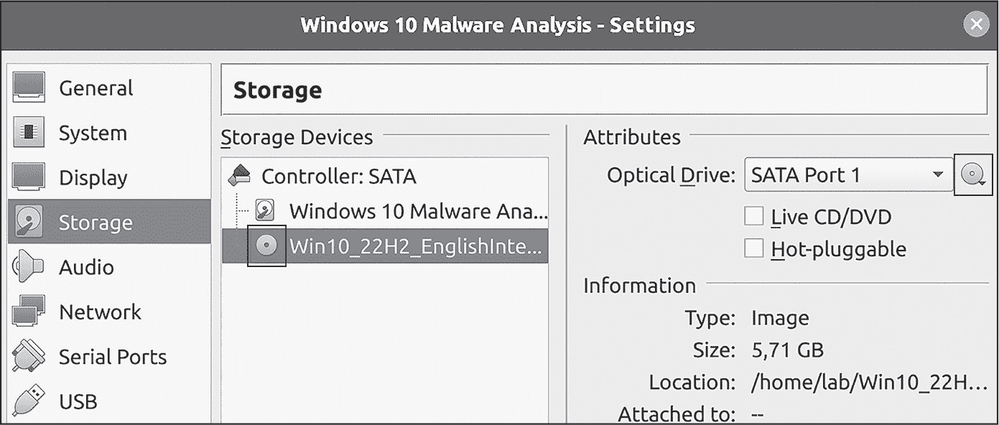

图 A-3：将 Windows 安装程序 ISO 添加到 VirtualBox 虚拟机

要开始 Windows 安装过程，启动虚拟机。在 VirtualBox 中，右键点击虚拟机，鼠标悬停在**启动**上，然后选择**正常启动**。在 VMware Workstation 中，右键点击虚拟机，鼠标悬停在**电源**上，然后点击**启动来宾操作系统**。ISO 文件应该会加载并启动 Windows 安装过程。

Windows 安装过程大约需要 20 到 40 分钟。如果您需要帮助完成 Windows 10 的安装步骤，可以参考在线资源，例如在[*https://<wbr>answers<wbr>.microsoft<wbr>.com*](https://answers.microsoft.com)。

完成安装后，关闭虚拟机并移除 Windows ISO 文件。（某些版本的 VirtualBox 和 VMware Workstation 会自动移除它。）对于 VirtualBox，您可以像添加 ISO 一样移除它：在虚拟机的存储设置中，右键点击 ISO 文件并选择**从虚拟驱动器中移除磁盘**。对于 VMware Workstation，只需确保在虚拟机的 CD/DVD 设置中取消勾选**开机时连接**。

### 调整虚拟机设置以实现隐蔽性和隔离性

接下来，您将进行一些基本配置和调优，以帮助限制虚拟机的足迹，使得难以被规避的恶意软件检测到它正在虚拟机中运行。将虚拟机与主机操作系统隔离也是一种安全措施，可以在恶意软件分析过程中更好地保护主机。这些设置通常非常容易实施，而且效果显著，因此不要忽视它们。

#### 内存和处理器

为了防止恶意软件通过 CPU 和内存枚举来检测虚拟机，请将虚拟机的内存设置为尽可能高（至少 4GB），并使用至少两个处理器。这可能会让恶意软件误以为它正在非虚拟机环境中执行。

在 VirtualBox 中，要修改内存设置，请进入**设置****系统****主板**。要修改 CPU 设置，请进入**设置****系统****处理器**。

在 VMware 中，要访问内存设置，请进入**设置****内存**。要设置 CPU，请进入**设置****处理器**。

为分析虚拟机分配更多 CPU 和内存的另一个好处是性能提升。虚拟机越强大，在恶意软件分析过程中表现得越好，特别是一些恶意软件分析工具需要大量系统资源。请记住，规避性的恶意软件使用多种技术来干扰基于系统性能和资源的分析沙盒和虚拟机，例如 API 攻击（在第八章中详细介绍）。

#### 硬盘大小

检查硬盘大小是恶意软件用来检测虚拟机的最古老、最简单、最常见的技术之一。虚拟机通常有较小的硬盘，因此请为你的虚拟磁盘驱动器分配至少 60GB 的空间。通常，我会分配 80GB 或更多。如果你按照本章前面提到的 VirtualBox 和 VMware Workstation 虚拟机创建说明操作过，那么你已经完成了这一步骤。

要检查 VirtualBox 中虚拟磁盘驱动器的存储空间，进入**设置****存储**。在 VMware 中，进入**设置****硬盘**。

你可以事后扩展虚拟机的硬盘大小，但通常最好在创建虚拟机时就配置硬盘大小。

#### 显示设置和加速

支持*3D 加速*的功能能提升虚拟机的性能，但也可能使虚拟化程序暴露于某些恶意软件之下。为了防止被检测到，应禁用这些选项。在 VirtualBox 中，进入**设置****显示**，然后在屏幕选项卡中确保没有选择**启用 3D 加速**。

在 VMware 中，进入**设置****显示**，然后取消选择**加速 3D 图形**。

#### USB 控制器设置

一些恶意软件试图枚举系统上的 USB 控制器。如果系统使用的是过时的 USB 驱动程序（如 1.0 或 2.0 版本，而不是更新的 3.0 驱动程序），恶意软件可能会认为它正在分析机上运行。要配置此设置，在 VirtualBox 中进入**设置****USB**，在 VMware Workstation 中进入**设置****USB 控制器**。

#### 网络适配器配置

在虚拟机中的恶意软件分析中，一个关键部分是理解并正确利用适合当前任务的虚拟机网络配置。你可以为分析实验室的虚拟机分配不同类型的网络配置，以下是一些最重要的模式：

**未连接**

VirtualBox 中的“未连接”模式（在 VMware Workstation 中，该设置是一个名为“开机时连接”的复选框，必须取消选中）本质上是关闭虚拟机的网络功能。虚拟机将完全与任何网络隔离，无法与其他虚拟机、本地主机的网络或互联网通信。这是分析恶意软件时最安全的选项。然而，现代的规避型恶意软件通常期望某种网络连接，因此在虚拟机处于此模式时，它可能无法完全执行（或根本无法执行）。出于这个原因，我在本章中不会进一步讨论此模式。

**仅主机**

主机仅连接是一种与主机操作系统共享的私人网络。在这种配置下，虚拟机无法访问互联网，但可以访问主机及其他运行在主机上的虚拟机。这个选项在安全性和效果之间提供了一个很好的折衷，尤其是当你使用另一台虚拟机作为网络网关时，正如我们稍后会在本章中探讨的那样。

**桥接和 NAT**

在桥接模式和网络地址转换（NAT）模式下，虚拟机连接到主机的本地网络，允许它访问互联网和其他网络资源。在桥接模式下，虚拟机有一个与主机不同的 IP 地址。在 NAT 模式下，虚拟机共享主机的 IP 地址，不能直接从本地网络访问。这里最重要的一点是，虚拟机（以及任何正在运行的恶意软件！）能够访问互联网。NAT 模式提供了一些额外的安全性，因此如果我需要虚拟机访问互联网，我会选择这个模式。

通常情况下，我几乎总是将我的分析虚拟机设置为主机仅模式（Host-Only）。我使用一台 Linux 虚拟机作为网络网关，让 Windows 受害者虚拟机伪造互联网连接，我们稍后会详细讨论这个方法。然而，如第六章所述，一种越来越常见的反虚拟机和反沙盒技术是恶意软件尝试联系远程服务器，以确定虚拟机是否已连接到互联网。一些恶意软件还可能从攻击者控制的服务器下载模块或有效载荷，如果分析环境被隔离，你可能会错过这类活动。在这些特殊情况下，将虚拟机设置为 NAT 模式或桥接模式是有意义的。只需意识到将恶意软件连接到互联网的风险。例如，恶意软件可能会从你的虚拟机窃取数据（例如剪贴板内容或任何虚拟共享驱动器中的数据），甚至将你的虚拟机添加到僵尸网络中，在这种情况下，你的虚拟机可能会在未经过你同意的情况下被用于犯罪活动。

要在 VirtualBox 中配置虚拟机的网络适配器，请导航至**设置****网络**，在适配器 1 标签页中，确保勾选了**启用网络适配器**。然后，在**附加到**下拉菜单中，根据需要将虚拟机网络适配器更改为**主机仅适配器**、**NAT**或**桥接**（参见图 A-4）。现在，选择**NAT**模式或**桥接**模式，因为稍后你将需要访问互联网。

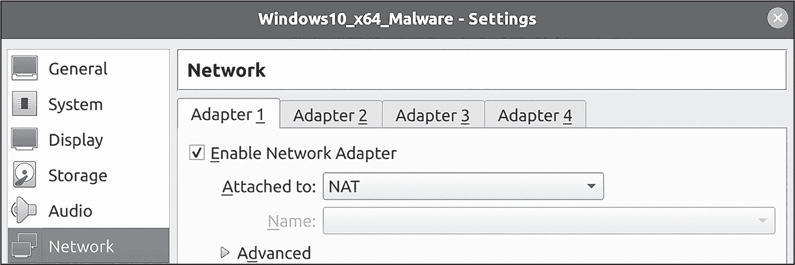

图 A-4：在 VirtualBox 中配置虚拟机的网络适配器

如果你无法将网络适配器设置为 NAT 模式，你可能需要先在 VirtualBox 中配置一个 NAT 网络。要做到这一点，请导航至**文件****首选项****网络**，然后点击**+**。

要在 VMware Workstation 中配置网络适配器，请导航至**虚拟机设置****硬件****网络适配器**，然后选择所需的网络连接类型（参见图 A-5）。现在，选择**NAT**模式或**桥接**模式。

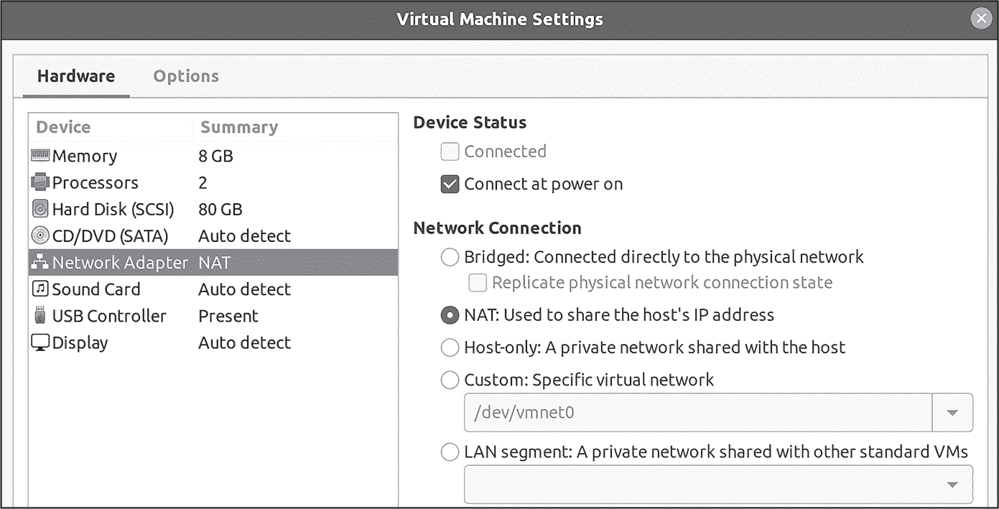

图 A-5：在 VMware Workstation 中配置虚拟机的网络适配器

#### MAC 地址

网络配置选项中还列出了 MAC 地址设置。虚拟化管理程序通常为其虚拟网络适配器使用标准的 MAC 地址范围。例如，VirtualBox 可能使用 MAC 地址前缀 00:00:7D、00:01:5D、00:0F:4B、00:10:E0、00:14:4F、00:21:28、00:21:F6、08:00:27 或 52:54:00。VMware 可能使用前缀 00:05:69、00:0C:29、00:1C:14 或 00:50:56。

为了绕过基于 MAC 地址的虚拟机检测，只需将虚拟机的默认 MAC 地址更改为不同的前缀。

> 注意

*要查看完整的 MAC 地址前缀列表，请访问* [`gist.github.com/aallan/b4bb86db86079509e6159810ae9bd3e4`](https://gist.github.com/aallan/b4bb86db86079509e6159810ae9bd3e4)。*理想情况下，选择与知名网络适配器制造商相对应的 MAC 地址。*

要在 VirtualBox 中更改 MAC 地址，导航到 **设置****网络**。在“适配器 1”选项卡中，点击“高级”旁边的箭头，然后在 MAC 地址字段中输入新地址（参见图 A-6）。

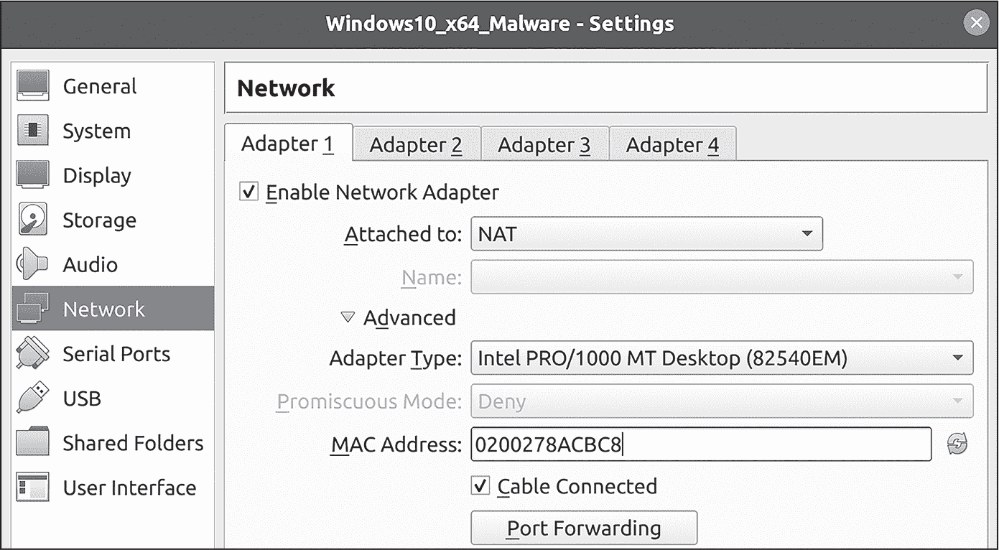

图 A-6：VirtualBox 中的网络适配器设置

对于 VMware，导航到 **设置****网络适配器****高级**，并在 MAC 地址字段中输入新地址（参见图 A-7）。

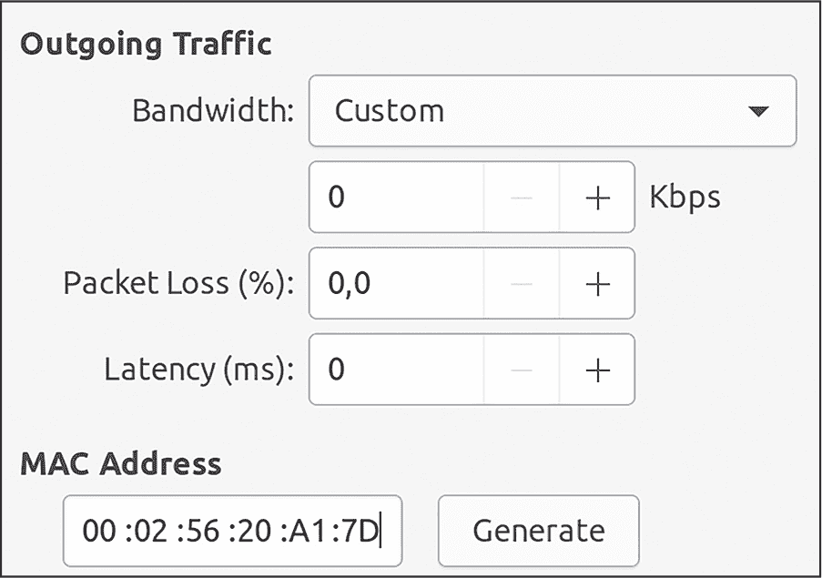

图 A-7：VMware 中的网络适配器设置

在 VirtualBox 和 VMware 中，你可以通过点击 MAC 地址字段旁边的刷新符号（VirtualBox）或 **生成**（VMware）来生成随机的 MAC 地址。然而，生成的随机地址仍然在正常的虚拟化管理程序地址范围内，因此最好手动设置一个新的前缀，以避免被检测到。

#### 剪贴板和拖放设置

一些虚拟化管理程序（包括 VMware Workstation 和 VirtualBox）允许主机与客户系统之间共享剪贴板。这意味着你可以从主机机器复制数据并粘贴到客户虚拟机中，反之亦然。此功能可能很方便，但也带来一定风险。当启用剪贴板共享时，主机系统剪贴板中的任何数据理论上都可以被客户虚拟机访问。如果你将敏感数据（如密码）复制到主机的剪贴板中，运行在客户虚拟机中的恶意软件可能会访问这些数据。同样，恶意软件也可能利用剪贴板向主机系统写入数据，或利用虚拟化管理程序中的潜在漏洞。虽然这种情况不太可能发生，但仍有可能。

拖放功能允许你将文件从主机机器拖（复制）到来宾虚拟机，反之亦然。就像剪贴板共享一样，这可能会将主机机器暴露于比必要的更多风险，具体取决于你正在分析的恶意软件的性质。仅在绝对需要时才启用这些功能。

要关闭 VirtualBox 中的剪贴板和文件拖放设置，请前往 **设置****常规****高级**，并在 **共享剪贴板** 和 **拖放** 下拉菜单中选择 **禁用**（见 图 A-8）。

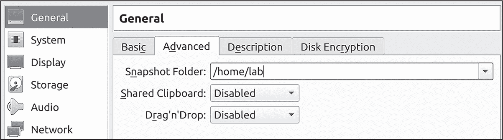

图 A-8：VirtualBox 中的剪贴板和拖放设置

在 VMware 中，前往 **设置****选项****来宾隔离**，如 图 A-9 所示。

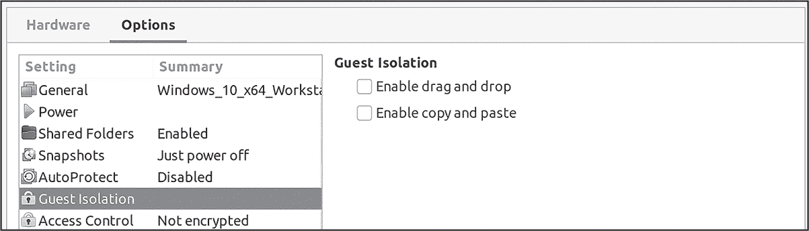

图 A-9：VMware 中的剪贴板和拖放设置

在此菜单中，通过取消选择 **启用拖放** 和 **启用复制粘贴** 选项来禁用拖放和剪贴板共享。

#### 共享文件夹

共享文件夹允许从来宾操作系统到主机操作系统轻松共享文件。但请记住，恶意软件也会访问你共享文件夹中的任何内容。（我是在吃了大亏后才学到这一点。）只有在必要时才启用共享文件夹；如果必须使用它们，至少将其设置为“只读”作为最基本的预防措施。

你可以在 VirtualBox 中找到共享文件夹设置（见 图 A-10），方法是前往 **设置****共享文件夹**。

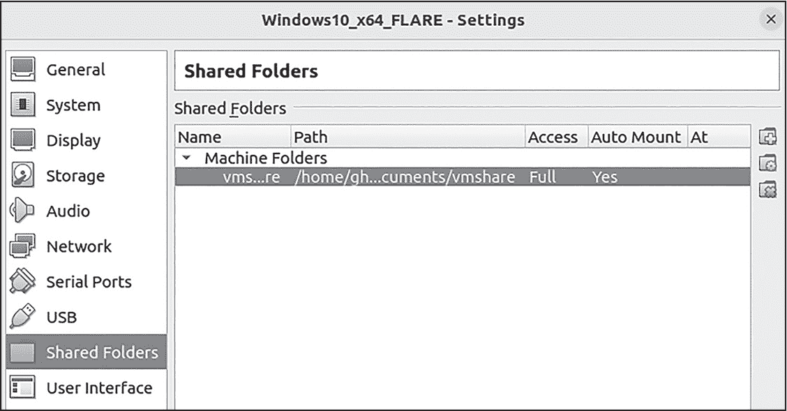

图 A-10：VirtualBox 中的共享文件夹设置

要在 VirtualBox 中添加共享文件夹，点击菜单右侧带有加号 (+) 的文件夹图标。你也可以通过双击“机器文件夹”下的共享文件夹来编辑共享文件夹配置。要删除共享文件夹，点击带有（X**）** 标志的文件夹图标。

在 VMware 中，共享文件夹设置也在 设置  共享文件夹（见 图 A-11）。

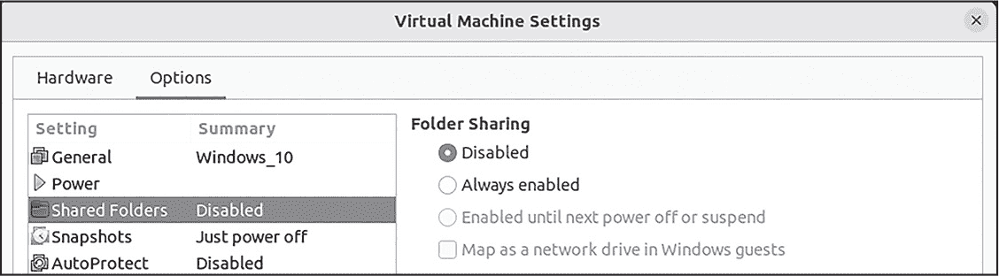

图 A-11：VMware 中的共享文件夹设置

你可以从此菜单中添加和编辑共享文件夹。要禁用共享文件夹，请在 **文件夹共享** 下选择 **禁用**。

> 注意

*剪贴板共享、拖放设置和共享文件夹仅在你的虚拟机中安装了可选的 VirtualBox 客户端附加工具或 VMware 工具时有效。我们将在本章稍后讨论这些工具。*

### 安装 Windows 恶意软件分析工具

现在你应该拥有一个功能齐全的 Windows 虚拟机，并且该虚拟机已经进行了调整，能有效抵抗许多基本的虚拟机检测与规避技术。然而，仅此还不足以支持你的恶意软件分析之旅；你还需要分析工具。我推荐下载并安装 FLARE-VM（[*https://<wbr>www<wbr>.mandiant<wbr>.com<wbr>/resources<wbr>/blog<wbr>/flare<wbr>-vm<wbr>-the<wbr>-windows<wbr>-malware*](https://www.mandiant.com/resources/blog/flare-vm-the-windows-malware)），这是 Mandiant 提供的一个完全配置好的恶意软件分析环境。它包括一系列脚本，通过下载并安装许多有用的工具，为 Windows 准备好进行恶意软件分析任务。安装 FLARE-VM 不是强制要求，但它能为你节省大量时间。要下载并安装 FLARE-VM，请启动你的 Windows 虚拟机，并仔细按照 *README* 文件中的安装步骤操作，文件可在 [*https://<wbr>github<wbr>.com<wbr>/mandiant<wbr>/flare<wbr>-vm*](https://github.com/mandiant/flare-vm) 获取。

如果你选择不安装 FLARE-VM，至少应采取以下措施来准备你的恶意软件分析环境：

1.  **禁用 Windows 更新。** 通常，你不希望你的恶意软件分析环境接收定期的 Windows 更新，因此最好将其禁用。具体操作方法，请参阅 [*https://<wbr>www<wbr>.windowscentral<wbr>.com<wbr>/how<wbr>-stop<wbr>-updates<wbr>-installing<wbr>-automatically<wbr>-windows<wbr>-10*](https://www.windowscentral.com/how-stop-updates-installing-automatically-windows-10)。不过请记住，如果禁用 Windows 更新，可能会错过恶意软件利用你未安装的操作系统或应用程序版本的尝试。

2.  **禁用 Windows 篡改保护。** 在禁用 Microsoft Defender（下文描述）之前，禁用 Windows 篡改保护是必要的一步。你可以在 **Windows 安全****病毒与威胁防护** 设置中禁用篡改保护。有关禁用篡改保护的更多信息，请参阅 [*https://<wbr>support<wbr>.microsoft<wbr>.com<wbr>/en<wbr>-us<wbr>/windows<wbr>/prevent<wbr>-changes<wbr>-to<wbr>-security<wbr>-settings<wbr>-with<wbr>-tamper<wbr>-protection<wbr>-31d51aaa<wbr>-645d<wbr>-408e<wbr>-6ce7<wbr>-8d7f8e593f87*](https://support.microsoft.com/en-us/windows/prevent-changes-to-security-settings-with-tamper-protection-31d51aaa-645d-408e-6ce7-8d7f8e593f87)。

3.  **禁用 Microsoft Defender。** 禁用 Defender 可防止反恶意软件软件干扰你的恶意软件分析环境。了解如何禁用它，请访问 [*https://<wbr>www<wbr>.windowscentral<wbr>.com<wbr>/how<wbr>-permanently<wbr>-disable<wbr>-windows<wbr>-defender<wbr>-windows<wbr>-10*](https://www.windowscentral.com/how-permanently-disable-windows-defender-windows-10)。

如果你选择不安装 FLARE-VM，你需要手动安装这些工具。表 A-1 总结了我在环境中使用的工具，其中许多工具我在本书中提到过，以及它们的功能。

表 A-1： 基于 Windows 的恶意软件分析工具

| 工具类型 | 用途 | 示例 |
| --- | --- | --- |
| 高级任务管理器 | 与运行中的进程和恶意软件交互 | Process Hacker [https://processhacker.sourceforge.io](https://processhacker.sourceforge.io) |
| 调试器 | 动态分析恶意代码 | x64dbg [https://github.com/x64dbg/x64dbg](https://github.com/x64dbg/x64dbg) |
| 反汇编器 | 逆向工程恶意软件 | IDA Pro [https://hex-rays.com/ida-free/](https://hex-rays.com/ida-free/)Ghidra [https://github.com/NationalSecurityAgency/ghidra](https://github.com/NationalSecurityAgency/ghidra) |
| 文件检测器 | 检测各种文件类型，识别打包器和混淆器等 | Detect It Easy [https://github.com/horsicq/DIE-engine/releases](https://github.com/horsicq/DIE-engine/releases) |
| 十六进制编辑器 | 查看和修改二进制数据 | HxD [https://mh-nexus.de/en/hxd/](https://mh-nexus.de/en/hxd/) |
| 网络监控工具 | 监控和检查恶意软件样本的网络交互 | Wireshark [https://www.wireshark.org](https://www.wireshark.org) |
| PE 分析器 | 概览基于 PE 的恶意软件 | PEStudio [https://www.winitor.com/download](https://www.winitor.com/download) |
| 进程监视器 | 监视恶意软件进程及其与操作系统的交互 | Procmon [https://learn.microsoft.com/en-us/sysinternals/downloads/procmon](https://learn.microsoft.com/en-us/sysinternals/downloads/procmon) |
| 注册表与基线对比工具 | 在引爆恶意软件后，将系统状态与基线状态进行对比 | Regshot [https://sourceforge.net/projects/regshot/](https://sourceforge.net/projects/regshot/) |
| Web 代理 | 拦截并监视恶意软件发起的网页请求 | Fiddler [https://www.telerik.com/fiddler](https://www.telerik.com/fiddler) |

根据你分析的恶意软件类型，你可能需要其他工具和软件。例如，如果你处理的是 Excel 和 Word 文件，你需要安装 Microsoft Office；要分析恶意 PDF 文件的行为，可能需要 Adobe Acrobat；如果你在调查 .NET 可执行文件，你需要 .NET 框架及其相关库。确保识别、安装并配置好你在分析文件时需要的所有软件。请注意，FLARE-VM 可能不包含你所需要的所有工具，因此你可能需要手动安装它们。

### 安装 VM 工具

*VM 工具* 是一个通用术语，指可以安装在来宾虚拟机中的虚拟化软件。在 VirtualBox 中，这个工具集被称为“来宾附加组件”；在 VMware Workstation 中，它被称为 VMware 工具。这些软件可以提高虚拟机的可用性和性能，还提供了共享文件夹、剪贴板共享等实用功能。不幸的是，这些工具也会引入一些异常，比如进程和驱动程序文件，恶意软件可以利用这些异常来检测虚拟化环境。

即使存在一定的风险，这些工具为分析虚拟机增加了便捷的功能和额外的性能。我采取双重方法：我有一台未安装 VM 工具的 Windows 虚拟机和一台已安装的虚拟机。我将已安装工具的虚拟机作为我的主要分析环境。如果我正在调查的恶意软件特别擅长逃避和检测虚拟机，我就切换到没有安装工具的虚拟机。这对我来说效果很好，也可能对你同样有效。

另一种选择是在引爆有问题的恶意软件之前，使用 Windows 软件卸载程序卸载 VM 工具。最后，还有两个工具，VBoxCloak 和 VMwareCloak，它们提供了清理安装 VM 工具后遗留的某些文件和 *杂物*（不需要的进程和遗留物）的选项。我们将在本章后面讨论它们。

要在 VirtualBox 虚拟机中安装 Guest Additions，启动虚拟机并在 Windows 启动后，进入 **设备****插入 Guest Additions CD 镜像**。

Guest Additions 安装程序文件现在可以在虚拟机的虚拟光驱中访问。在我的情况下，这是 *D:* 驱动器。双击 **VBoxWindowsAdditions.exe** 可执行文件以启动 Guest Additions 安装程序（见图 A-12）。安装后不要忘记重新启动虚拟机。

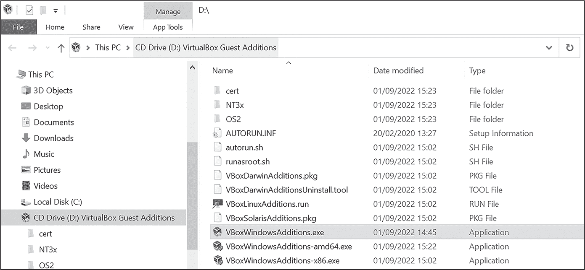

图 A-12：安装 Guest Additions

若需要更多信息或帮助，请参见 VirtualBox Guest Additions 文档：[*https://<wbr>www<wbr>.virtualbox<wbr>.org<wbr>/manual<wbr>/ch04<wbr>.html*](https://www.virtualbox.org/manual/ch04.html)。

对于 VMware Workstation 的较新版本，VMware Tools 通常会自动安装。如果需要手动安装，过程与 VirtualBox 的几乎完全相同。在 VMware Workstation 的虚拟机中，导航至 **VM****安装 VMware Tools**。（在我的情况下，此选项显示为 **重新安装 VMware Tools**，因为我已经安装了工具，如图 A-13 所示。）与 VirtualBox Guest Additions 相同，安装后你需要重新启动虚拟机。

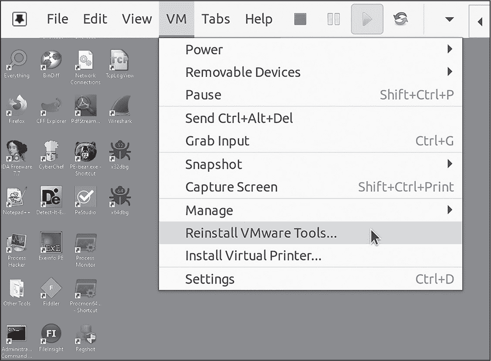

图 A-13：安装 VMware Tools

现在我们稍作休息，暂时离开 Windows 虚拟机，讨论如何设置 Linux 虚拟机。

### 安装和配置 Linux 虚拟机

在你的实验室中拥有一个 Linux 虚拟机的主要好处之一是，它可以充当 Windows 虚拟机的轻量级网关。当你在 Windows 虚拟机中引爆恶意软件时，Linux 虚拟机可以拦截网络流量以供后续分析，甚至可以伪造网络和互联网服务，稍后你将看到这一点。我在我的实验室中使用 Remnux，所以本指南将介绍这个工具。正如本章前面提到的，Remnux 是一个预打包的、功能完备的 Linux 恶意软件分析环境。它包含了你进行恶意文件和代码静态分析时所需的大多数工具，还提供了一些动态分析选项（如代码仿真工具）。你可以在 [*https://<wbr>docs<wbr>.remnux<wbr>.org<wbr>/install<wbr>-distro<wbr>/get<wbr>-virtual<wbr>-appliance*](https://docs.remnux.org/install-distro/get-virtual-appliance) 下载 Remnux。只需选择所需的虚拟机（VirtualBox 或 VMware），然后按照提供的说明下载并配置虚拟机。完成后，你应该拥有一个正常运行的 Remnux 虚拟机。别忘了使用以下命令更新 Remnux：

```
> **remnux upgrade**
> **remnux update**
```

> 注意

*在更新 Remnux 到最新版本之前，你需要为 Remnux 提供互联网访问权限，因此在使用之前，务必将其网络适配器设置为 NAT 或桥接模式。更新完成后，你可以将其恢复为仅主机模式。*

### 手动安装 Linux 虚拟机工具

使用 Remnux 是可选的，你也可以选择从头开始配置自己的 Linux 虚拟机。如果你选择这样做，你需要自行安装恶意软件分析工具。表 A-2 列出了我认为在恶意软件分析中必不可少的一些 Linux 工具。这些工具在 Remnux 中已预安装并配置好。需要注意的是，一些工具也包含在 Windows 版的 FLARE-VM 中。

表 A-2： Linux 恶意软件分析工具

| 工具 | 用途 |
| --- | --- |
| Base64dump [https://github.com/DidierStevens/DidierStevensSuite/blob/master/base64dump.py](https://github.com/DidierStevens/DidierStevensSuite/blob/master/base64dump.py) | 识别并提取文件中的 Base64 编码数据 |
| Binwalk [https://github.com/ReFirmLabs/binwalk](https://github.com/ReFirmLabs/binwalk) | 分析二进制镜像并提取嵌入的文件（例如使用隐写术技术的恶意软件） |
| CAPA [https://github.com/mandiant/capa](https://github.com/mandiant/capa) | 扫描并检测可执行文件中的可疑签名，例如潜在的规避和混淆技术 |
| ExifTool [https://exiftool.org](https://exiftool.org) | 识别文件类型并允许查看和编辑其元数据 |
| FakeDNS [https://github.com/SocialExploits/fakedns/blob/main/fakedns.py](https://github.com/SocialExploits/fakedns/blob/main/fakedns.py) | 响应 DNS 查询并模拟 DNS 服务 |
| FLOSS [https://github.com/mandiant/flare-floss](https://github.com/mandiant/flare-floss) | 从 PE 文件中提取编码和混淆的字符串 |
| INetSim (互联网服务模拟套件) [https://www.INetSim.org](https://www.INetSim.org) | 模拟不同的网络服务（如 DNS、FTP 和 HTTP） |
| Speakeasy [https://github.com/mandiant/speakeasy](https://github.com/mandiant/speakeasy) | 模拟可执行代码和 shellcode |
| XORSearch [https://blog.didierstevens.com/programs/xorsearch/](https://blog.didierstevens.com/programs/xorsearch/) | 扫描文件，查找以各种格式（如 XOR 或 ROL）编码和混淆的字符串 |
| Yara [https://github.com/Yara-Rules/rules](https://github.com/Yara-Rules/rules) | 识别并分类恶意软件 |

这一部分只是粗略介绍了 Remnux 和基于 Linux 的分析环境中可用的有用工具；还有恶意文档分析工具、模拟工具和内存取证工具，但对它们的全面讨论超出了本书的范围。

### 配置和验证网络设置

你几乎完成了恶意软件分析实验室的设置，但还有几个步骤。在继续之前，请确保你的 Windows 虚拟机和 Remnux 虚拟机的网络适配器都设置为 **仅主机**。这对于你接下来完成实验室设置的步骤非常重要。

接下来，你需要从 Remnux 虚拟机中获取一些网络适配器信息。在 Remnux 的终端中执行 ifconfig 命令。图 A-14 显示了一些示例输出。

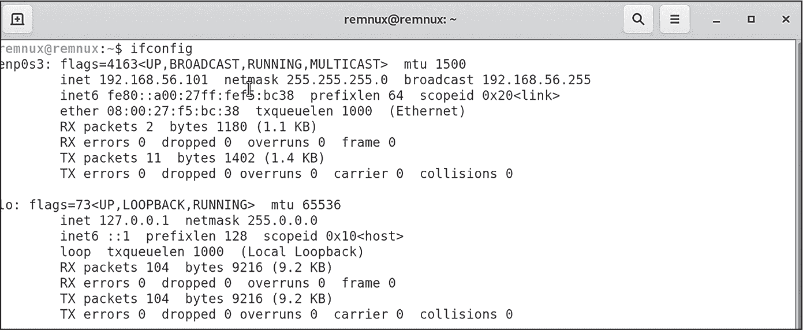

图 A-14：获取 Remnux 操作系统网络配置

输出中列出的第一个条目是我们关心的内容。该虚拟机的 inet（IP）地址是 192.168.56.101，子网掩码是 255.255.255.0。你的结果可能会有所不同，具体取决于你的 Remnux 配置以及你是否使用 VirtualBox 或 VMware。记下这些值，因为你稍后会用到它们。

返回到你的 Windows 虚拟机，并从开始菜单进入 Windows 网络设置。将 Windows 虚拟机的 IP 地址设置为与 Remnux 虚拟机相同的子网。（例如，如果你的 Remnux 虚拟机 IP 地址是 192.168.56.101，你可以将 Windows 虚拟机的 IP 地址设置为 192.168.56.102。）如果 Remnux 虚拟机的子网掩码是 255.255.255.0（默认值），在子网前缀长度字段中输入 24。对于网关地址，输入 Remnux 虚拟机的 IP 地址（因为 Remnux 将充当 Windows 虚拟机的网关），并在首选 DNS 地址中再次输入该地址。图 A-15 显示了此配置在 Windows 10 中的样子。

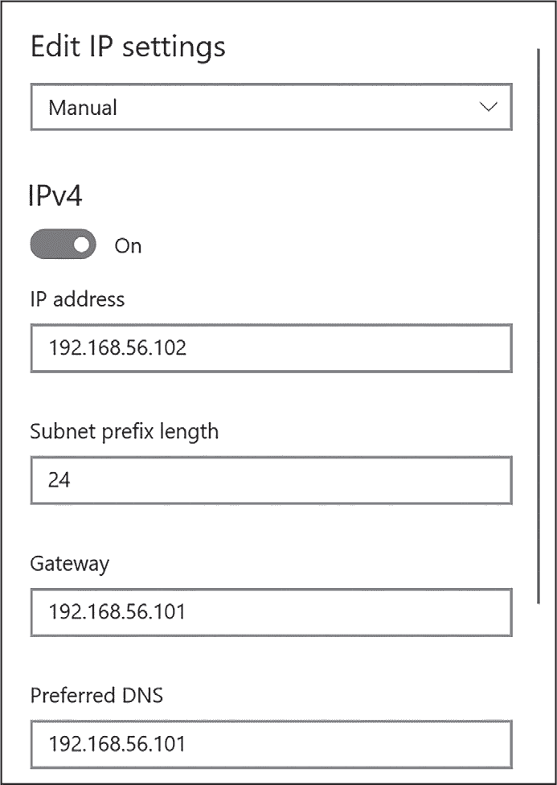

图 A-15：配置 Windows 虚拟机 IP 设置

点击 **保存** 来设置配置。你可能需要重启你的 Windows 虚拟机。

现在，你将测试 Remnux 虚拟机与 Windows 虚拟机之间的连接。确保两个虚拟机都已开机，并在 Windows 虚拟机中执行对 Remnux IP 的 ping 命令，如 图 A-16 所示。

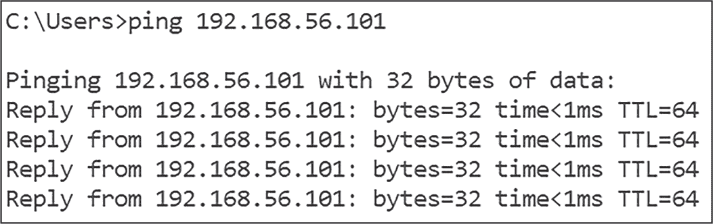

图 A-16：测试实验室网络配置

此命令应返回一个 Reply，类似于这里显示的输出。如果没有返回，你可能需要进行一些故障排除。首先，确认 Remnux 虚拟机已开机，且 Windows 和 Remnux 的网络适配器在你的虚拟化管理程序中设置为“仅主机”（Host-Only），同时确保 Windows 的 IP 地址配置正确。

最后一步是完成你新的实验室环境：对虚拟机进行快照。  ### 创建和恢复虚拟机快照

正如本章前面提到的，快照允许你将虚拟机保存为某种状态；在这种情况下，就是在 Windows 虚拟机被恶意软件感染之前的原始干净状态。首先，通过操作系统内的正常关机来关闭你的 Windows 和 Remnux 虚拟机。

要在 VirtualBox 中创建快照，请选择你的 Windows 虚拟机并前往 **Snapshot****Take**。确保为快照命名一个对你有意义的名称（例如“Windows 恶意软件分析 - 干净”）。对于 Remnux 虚拟机也重复此过程。

要在 VMware Workstation 中创建快照，右键点击 Windows 虚拟机并选择 **Snapshot****Take Snapshot**。同样，为快照命名一个直观的名称，并对 Remnux 重复这些步骤。

要恢复到某个快照（例如，在你引爆并分析一个恶意软件样本之后），你需要访问虚拟化管理程序的快照管理器。在 VirtualBox 中，你可以通过选择虚拟机并导航到 **Machine****Tools****Snapshots** 来访问它。快照会显示在右侧窗格中的 Name 下。图 A-17 显示了我的虚拟机的快照列表。（我将列表中的第一个快照命名为“BASE – 08 Aug 23 – 原始 Windows 10”，但你可以根据自己的需要命名快照。）要恢复之前的快照，右键点击它并选择 **Restore**。

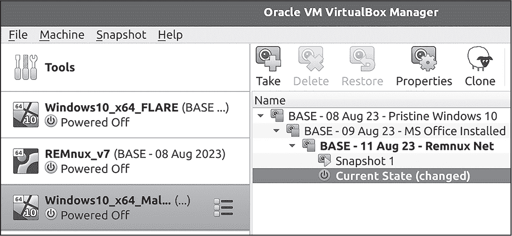

图 A-17：VirtualBox 快照管理器

在 VMware Workstation 中，快照管理器的位置稍微有点隐蔽。要访问它，右键点击你的虚拟机并选择 **Snapshots****Snapshot Manager**。你将看到一个树状图，显示所有快照，如 图 A-18 所示。只需右键点击某个快照并选择 **Restore**。

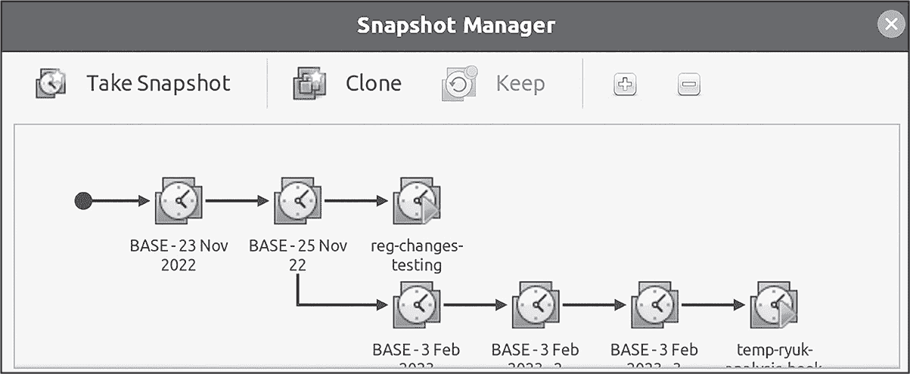

图 A-18：VMware 快照管理器

快照是非常强大的工具，不仅可以将虚拟机恢复到原始状态，还能防止分析中的麻烦。例如，我的一种策略是在调试的某些阶段创建快照。有时调试器会在分析过程中崩溃，或者恶意软件可能会偷偷执行代码以“逃脱”调试器。恢复到之前的调试快照可以让我避免从头开始。

如果你按照前面的步骤操作，你应该已经拥有一个正常工作的恶意软件分析实验室。你有一台 Windows 受害者虚拟机，可以安全地引爆恶意软件，还有一台 Linux 虚拟机，用于模拟网络服务和捕获网络流量。你还已经为 Windows 虚拟机配置了虚拟硬件，以抵御恶意软件的检测。现在，让我们来看一下如何配置操作系统以进一步隐蔽 Windows 虚拟机。

## Windows 配置以实现隐蔽

有几个可选的 Windows 设置和技巧，可以应用于你的 Windows 虚拟机，帮助它躲避情境感知的恶意软件。大多数这些设置并不算高级，有些甚至看起来有些荒谬，但将它们纳入使用可以让你的分析系统更具韧性和隐蔽性。

### 注册表数据

正如你在第四章中所学，Windows 注册表包含大量与操作系统和硬件相关的信息，恶意软件可能会查询这些信息以检测虚拟机监控程序。幸运的是，你可以修改许多这些注册表键值和数据，以规避检测。你可以直接在 Windows 注册表编辑器（RegEdit）中进行修改，或者使用 PowerShell。例如，运行以下 PowerShell 命令来修改注册表键值：

```
PS C:\> **Set-ItemProperty -Path** **`Registry Path`** **-Name** **`Name of Value`** **-Value** **`Registry Data`**
```

要将 BIOSProductName 的值重命名为 Fake BIOS，请执行以下命令：

```
PS C:\> **Set-ItemProperty -Path "HKLM:\SYSTEM\CurrentControlSet\Control\**
**SystemInformation" -Name "BIOSVersion" -Value "Fake BIOS"**
```

许多可能对恶意软件感兴趣的注册表键值会在不同版本的 Windows、虚拟机监控程序和补丁中更新，因此在这里列出所有这些键值并不可行。相反，我创建了一个简单的 PowerShell 脚本，能够清理注册表，隐藏其中的一些指示符，并完成其他一些虚拟机隐匿任务，我将在本节中讨论这些任务。你可以在 [*https://<wbr>github<wbr>.com<wbr>/d4rksystem<wbr>/VBoxCloak*](https://github.com/d4rksystem/VBoxCloak) 找到 VirtualBox 版本的脚本 VBoxCloak，在 [*https://<wbr>github<wbr>.com<wbr>/d4rksystem<wbr>/VMwareCloak*](https://github.com/d4rksystem/VMwareCloak) 找到 VMware 版本的脚本 VMwareCloak。

### 主机名和域名

由于一些高级恶意软件会枚举分析环境的主机名、域名和用户账户信息，以确定它是否在虚拟机中运行，因此将这些值设置为无害的名称是明智的。恶意软件可能会寻找如 sandbox、virus、malware、VMware、virtualbox、test 或 cuckoo 等字符串。例如，最好在安装和配置系统时设置系统的主机名和主用户账户名，但你也可以在触发恶意软件之前更改这些设置。

使用 PowerShell 更改系统主机名，请使用以下命令：

```
PS C:\> **Rename-Computer -NewName "****`new hostname`****"**
```

要更改本地用户账户名，请使用以下命令：

```
PS C:\> **Rename-LocalUser -Name "****`current local username`****" -NewName "****`new local username`****"**
```

你需要重启虚拟机才能使这些更改生效。此外，一些恶意软件（如某些变种的窃取信息软件和勒索软件）会在感染系统之前，测试该系统是否属于企业域（或者，在更具针对性的恶意软件情况下，测试是否属于*特定的*企业域）。在这种情况下，向你的系统添加一个虚假的域名可以帮助你避免被检测到。你可以通过创建一个实际的域（使用域控制器）来实现，或者更简单地，通过执行以下 PowerShell 命令，将系统“添加”到域 *corp.com*：

```
PS C:\> **Set-ItemProperty -Path "HKLM:\SYSTEM\CurrentControlSet\Services\Tcpip\**
**Parameters\" -Name "Domain" -Value "corp.com" -Force**
```

请记住，这个注册表更改并不会将 Windows 系统添加到真实的域中；它只是更改了恶意软件可能查询的一个配置设置。我创建了一个简短的脚本，自动更改系统的主机名和本地用户账户名，然后通过这个注册表技巧将虚拟机添加到一个虚假的域中。你可以在 [*https://<wbr>github<wbr>.com<wbr>/d4rksystem<wbr>/hostname<wbr>-changer*](https://github.com/d4rksystem/hostname-changer) 找到这个脚本。然而，要完全模拟一个域环境，最好的方法是在实验室中设置一个真实的域控制器。

### 额外的技巧和窍门

这里有一些额外的配置技巧和窍门，在某些情况下可能会非常有用：

**重命名分析工具并将其安装在非标准位置**

一些狡猾的恶意软件会寻找正在运行的分析工具，如 Wireshark 或 Procmon。仅仅通过在启动之前重命名工具的可执行文件（例如，将 *wireshark.exe* 改为 *krahseriw.exe*）就能阻止这种检测技术。（请注意，这种方式重命名可执行文件可能会破坏工具的功能。）将工具安装在非默认位置也可能会有用。

**添加诱饵文件**

恶意软件可能会检查受害者系统的*桌面*或*文档*目录，只有在这些目录中有文件和文档时才会感染系统。向这些目录添加一些虚假的文档（例如 *invoice.doc*、*passwords.txt* 等）来模拟正常的 Windows 用户是没有坏处的。

**激活鼠标**

上下文感知的恶意软件可能会在鼠标移动或按下某个鼠标按钮时才会激活。手动移动鼠标和点击可以帮助绕过这些简单的鼠标检测技术。你甚至可以通过使用像 PyAutoGUI 这样的 Python 库，在你的虚拟机（VM）和沙箱中自动化鼠标活动（[*https://<wbr>pyautogui<wbr>.readthedocs<wbr>.io<wbr>/en<wbr>/latest<wbr>/*](https://pyautogui.readthedocs.io/en/latest/)）。

**更改恶意软件的文件名和路径**

恶意软件有时会检查其运行位置，以查看其文件名和路径。一些恶意软件沙箱会自动使用恶意文件的 MD5 或 SHA-1 哈希命名文件，这可能会暴露其身份。为了隐藏你的虚拟机，最好将恶意软件文件命名为随机名称，并避免在文件名或路径中包含如 *malware*（恶意软件）、*virus*（病毒）、*lab*（实验室）等词。一些恶意软件还会检查其运行路径，以确保它是从作者预期的目录中运行，而不是从 *Documents*（文档）、*Desktop*（桌面）等目录中。有时，恶意软件甚至会验证它是否仍然保持着原始文件名。

工具 exiftool（我在本章中稍微提到过）以及许多其他 PEStudio 类工具，可以让你查看可执行文件的“原始文件名”字段，这可能是恶意文件最初名称的线索。在下面的代码中，你可以看到 exiftool 的输出和可执行文件的原始名称：

```
>  **exiftool malware.exe**
`--snip--`
File Version          : 6.0.7.2527
Internal Name         : RealOne Player
Legal Copyright       : Copyright © 2001-2002
**Original File Name    : player.exe**
Product Name          : RealOne Player
`--snip--`
```

你甚至常常可以在恶意软件文件的字符串中找到指示其原始文件名的线索，如这个例子（*epmntdrv.sys*）所示：

```
>  **strings evil.bin**
`--snip--`
Invalid parameter passed to C runtime function.
h:\projectarea\00_source\mod.windiskaccessdriver\epmntdrv.sys
ExAllocatePoolWithTag
`--snip--`
```

**增加系统启动时间**

恶意软件可能会检查系统启动了多长时间才完全执行，或者如果系统的启动时间不足，它可能不会运行。在启动分析虚拟机后等待几分钟再激活恶意软件，可能会欺骗它执行。更好的做法是在感染虚拟机之前，让虚拟机运行 20 分钟，然后拍摄系统快照。之后你可以恢复到这个快照，虚拟机已经处于一个正在运行的状态，准备好进行恶意软件激活。

**模拟你的组织或恶意软件目标**

在激活目标恶意软件样本之前，你可以配置环境使其尽可能接近恶意软件的目标。例如，将机器加入到一个虚假的但看似真实的域中，可能有助于提取恶意软件的行为，否则你可能无法看到这些行为。

第二部分详细讨论了虚拟机的痕迹和检测，因此请参考这些章节以获取更多信息，帮助你隐藏分析用的虚拟机。

## 高级虚拟机和虚拟化程序加固

除了虚拟机硬件和客户操作系统配置外，您还可以将所谓的加固技术应用于虚拟机和虚拟化管理程序。*加固* 涉及配置虚拟机或虚拟化管理程序的更高级设置，甚至直接修补虚拟化管理程序。本节将讨论 VMware Workstation 和 VirtualBox 的一些工具和技术。

> 注意

*这些技术包括在书中是为了完整性。根据您的主机操作系统、客户操作系统和虚拟化管理程序版本，它们可能无效，甚至可能导致虚拟机的稳定性或性能问题，因此请自行承担风险。*

### 加固 VMware

每个 VMware 虚拟机都有一个 VMX (*.vmx*) 文件，包含机器的配置。您可以修改此文件来配置虚拟机的一些更高级的选项。VMX 文件位于虚拟机的主目录中。（例如，在我的 Linux 主机上，它位于 */home/<user>/VMware/<vm_name>/<vm_name>.vmx*。）VMware 虚拟机具有显著的系统制造商和型号字符串，可能会引起恶意软件的警觉。默认情况下，运行在 VMware 上的 Windows 虚拟机看起来是这样的：

```
System Manufacturer:    VMware, Inc.
System Model:           VMware Virtual Platform
```

向 VMX 文件中添加这一简单的行，可能有助于通过镜像主机的系统信息来隐藏您的虚拟机：

```
SMBIOS.reflectHost = "True"
```

恶意软件还可能尝试检测您的 VMware 虚拟机的硬盘驱动器型号，如果硬件是虚拟化的，它将非常通用。为了规避这一点，请将这些行添加到您的 VMX 文件中（您可以将“Samsung”替换为任何您喜欢的内容）：

```
scsi0:0.productID = "Samsung SSD"
scsi0:0.vendorID = "Samsung"
```

为了抵御一些基于 cpuid 和 rdtsc 的虚拟机检测技术，请在您的 VMX 文件中添加以下行：

```
hypervisor.cpuid.v0 = "FALSE"
monitor_control.virtual_rdtsc = "FALSE"
```

> 注意

*正如第七章所讨论的，cpuid 可以用来检测机器的处理器是否被虚拟化，而 rdtsc 可以用来执行处理器时序分析。*

这些是简单的更改，但如前所述，根据您的操作系统和版本，效果可能不同。例如，我在使用运行 Linux Ubuntu 20 的主机和 Windows 10 客户虚拟机时，无法通过 SMBIOS.reflectHost 技巧将主机系统信息反射到虚拟机中。然而，它在 Windows 10 主机和 Windows 10 客户虚拟机上是有效的。

这里是您可以添加到虚拟机中的其他已知 VMX 配置：

```
SMBIOS.noOEMStrings = "TRUE"
serialNumber.reflectHost = "TRUE"
hw.model.reflectHost = "TRUE"
board-id.reflectHost = "TRUE"

monitor_control.restrict_backdoor = "TRUE"
monitor_control.disable_directexec = "TRUE"
monitor_control.disable_reloc = "TRUE"
monitor_control.disable_btinout = "TRUE"
monitor_control.disable_btmemspace = "TRUE"
monitor_control.disable_btpriv = "TRUE"
monitor_control.disable_btseg = "TRUE"
monitor_control.disable_chksimd = "TRUE"
monitor_control.disable_ntreloc = "TRUE"
monitor_control.disable_selfmod = "TRUE"
```

此配置中的第一组可能有助于通过将主机信息反射到来宾操作系统来隐藏虚拟机，而不是使用默认的 VMware 字符串。第二组与二进制代码在来宾虚拟机中如何模拟、虚拟机如何与物理处理器交互以及其他功能相关。这些设置有助于绕过利用这些设置来检测虚拟机的恶意软件。这些配置大多数没有 VMware 的文档记录，但一些重要的项目试图识别并详细说明它们。例如，查看 Tom Liston 和 Ed Skoudis 在他们的报告《On the Cutting Edge: Thwarting Virtual Machine Detection》中所做的研究，地址是 [*https://<wbr>handlers<wbr>.sans<wbr>.org<wbr>/tliston<wbr>/ThwartingVMDetection<wbr>_Liston<wbr>_Skoudis<wbr>.pdf*](https://handlers.sans.org/tliston/ThwartingVMDetection_Liston_Skoudis.pdf)，并在 [*http://<wbr>sanbarrow<wbr>.com<wbr>/vmx<wbr>/vmx<wbr>-advanced<wbr>.html*](http://sanbarrow.com/vmx/vmx-advanced.html) 上阅读有关 监控控制 的高级参数列表。还有一个较旧的工具叫做 VmwareHardenedLoader ([*https://<wbr>github<wbr>.com<wbr>/hzqst<wbr>/VmwareHardenedLoader*](https://github.com/hzqst/VmwareHardenedLoader))，它是一组脚本和配置，执行许多上述更改，并包含其他一些功能。

### 加固 VirtualBox

调整 VirtualBox 稍微棘手一些；它没有类似于 VMX 文件的配置文件。相反，你必须使用 VBoxManage，这是一个专门为 Windows 和 Linux 设计的应用程序，用于对 VirtualBox 虚拟机进行配置更改。例如，为了防止一些 rdtsc 虚拟机检测技术，你可以通过在命令行中运行以下命令来配置你的虚拟机：

```
> **VBoxManage setextradata "vm_name" VBoxInternal/TM/TSCMode RealTSCOffset**
> **VBoxManage setextradata "vm_name" VBoxInternal/CPUM/SSE4.1 1**
> **VBoxManage setextradata "vm_name" VBoxInternal/CPUM/SSE4.2 1**
```

相比 VMware，VirtualBox 中的一些配置比较复杂，并且（在撰写本文时）很难找到相关信息。幸运的是，由于 VirtualBox 是开源的，一些社区成员编写了针对 VirtualBox 及其虚拟机的加固工具。就像 VMware 一样，也有 VBoxHardenedLoader ([*https://<wbr>github<wbr>.com<wbr>/hfiref0x<wbr>/VboxHardenedLoader*](https://github.com/hfiref0x/VboxHardenedLoader))，你可能想要了解一下。

一些加固工具的主要问题是它们可能会在不同版本的虚拟化程序下失效，因此必须为每个新的 VirtualBox 版本进行修改。与本章中提到的任何工具或配置一样，你的成功取决于你具体的实验室环境。

## 压力测试您的虚拟机

在引爆恶意软件之前，尤其是潜在的规避恶意软件，使用像 Pafish（[*https://<wbr>github<wbr>.com<wbr>/a0rtega<wbr>/Pafish*](https://github.com/a0rtega/Pafish)）这样的工具来对你的 Windows 分析虚拟机进行压力测试，以测试其对检测技术的应对能力，这在 图 A-19 中有所展示，会很有帮助。

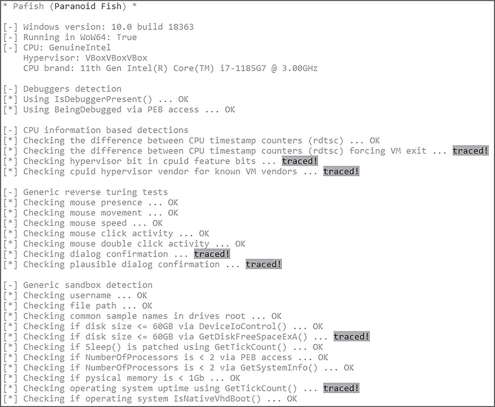

图 A-19：Pafish 在 VirtualBox 虚拟机中的运行

你可以看到，Pafish 使用多个不同的指标（通过“traced!”信息表示）检测到我的虚拟机，例如 CPU 定时计数器、缺乏空闲磁盘空间和操作系统的正常运行时间。与 Pafish 类似的两个工具是 Al-Khaser（[*https://<wbr>github<wbr>.com<wbr>/LordNoteworthy<wbr>/al<wbr>-khaser*](https://github.com/LordNoteworthy/al-khaser)）和 InviZzzible（[*https://<wbr>github<wbr>.com<wbr>/CheckPointSW<wbr>/InviZzzible*](https://github.com/CheckPointSW/InviZzzible)）。在分析虚拟机中运行多个评估工具，无论是在你按照本章指导操作之前还是之后，都能帮助你了解虚拟机的可检测性。

完全隐藏虚拟机免受像 Pafish 和 Al-Khaser 等压力测试软件使用的所有技术是非常困难的。毕竟，这些工具专门为虚拟机检测而设计。请记住，恶意软件分析的目标不是通过压力测试，而且在野外，恶意软件样本使用所有这些技术的可能性也非常小。

也就是说，你可以通过使用裸机分析系统或仪器工具在压力测试中获得更高的分数（当然，也能阻止恶意软件），我们将在本章末尾简要介绍这两者。

## 操作安全与效率的建议

*操作安全（OPSEC）* 对于恶意软件分析至关重要。适当的操作安全包括安全地处理恶意软件和调查工具，以保护自己和他人，包括当你专业分析恶意软件时，保护你的组织。

以任何方式分析恶意软件本质上都是有风险的。你可能会暴露主机机器的凭证或敏感文件，尤其是当虚拟机启用了文件夹和剪贴板共享功能时。你可能在调查恶意基础设施时无意间泄露自己的家庭 IP 地址给威胁行为者。或者，通过允许恶意软件样本从你的虚拟机连接到 C2 服务器，你可能会向威胁行为者透露你的调查，可能会带来负面后果。为了减轻这些风险，本节提供了一些分析恶意软件时既安全又有效的常见建议。

### 模拟网络服务

在连接到互联网或甚至本地网络的虚拟机中引爆恶意软件是有风险的，因此一个更安全的替代方案是模拟网络服务。使用 INetSim 和 FakeDNS 等工具，你可以欺骗恶意软件，让它相信自己在一个联网或可访问互联网的环境中运行。INetSim 可以模拟多种类型的网络服务，如 FTP 和 HTTP，而 FakeDNS 专门用于模拟 DNS 服务。

网络模拟是使用之前设置的 Remnux 虚拟机（VM）进行的一个简单过程。首先，确保 Remnux 和 Windows 虚拟机的网络适配器处于主机仅模式，并且 Remnux 虚拟机已经开启。在 Remnux 的终端中输入以下命令：

```
> **accept-all-ips start**
```

*accept-all-ips*脚本将网关（此处为 Remnux）配置为接受所有 IPv4 和 IPv6 地址，并将其重定向到相应的本地端口。简而言之，这使得 Remnux 能够拦截、监控或操控从 Windows 虚拟机发送到特定 IP 地址的网络流量。

接下来，输入此命令以启动 INetSim 服务：

```
> **inetsim**
```

你应该看到类似下面的输出：

```
remnux@remnux:~$ inetsim
INetSim 1.3.2 (2020-05-19) by Matthias Eckert & Thomas Hungenberg
Using log directory: /var/log/inetsim/
Using data directory: /var/lib/inetsim/
Using report directory: /var/log/inetsim/report/
Using configuration file: /etc/inetsim/inetsim.conf
Parsing configuration file.
Configuration file parsed successfully.
=== INetSim main process started (PID 1511) ===
Session ID: 1511
Listening on: 192.168.56.102
Real Date/Time: 2024-03-25 15:39:28
Fake Date/Time: 2024-03-25 15:39:28 (Delta: 0 seconds)
 Forking services... 
   * smtps_465_tcp - started (PID 1518)
   * ftp_21_tcp - started (PID 1521)
   * smtp_25_tcp - started (PID 1517)
   * http_80_tcp - started (PID 1515)
   * pop3_110_tcp - started (PID 1519)
   * ftps_990_tcp - started (PID 1522)
   * pop3s_995_tcp - started (PID 1520)
   * https_443_tcp - started (PID 1516)
 done.
Simulation running.
--`snip`--
```

然后输入fakedns命令，如下所示：

```
> **fakedns**
```

这应该会生成类似下面代码的输出（如果你的 Windows 虚拟机尚未开启并与 Remnux 虚拟机通信，你可能不会看到这么多输出）：

```
remnux@remnux:~$ fakedns
fakedns[INFO]: dom.query. 60 IN A 192.168.56.102
fakedns[INFO]: Response: au.download.windowsupdate.com -> 192.168.56.102
fakedns[INFO]: Response: api.msn.com -> 192.168.56.102
fakedns[INFO]: Response: slscr.update.microsoft.com -> 192.168.56.102
--`snip`--
```

接下来，启动你的 Windows 虚拟机。Windows 启动后，通过浏览器访问你喜欢的网站来测试 FakeDNS 和 INetSim。如果你正确配置了一切，你应该会看到类似图 A-20 所示的页面。

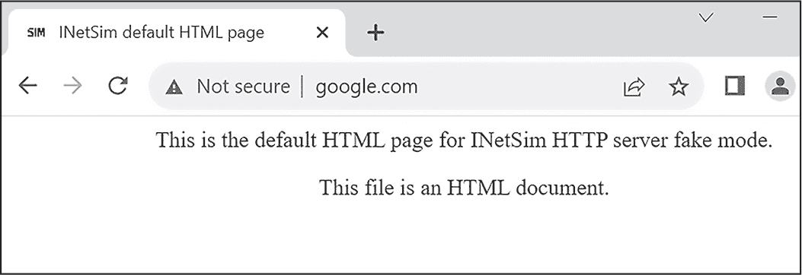

图 A-20：INetSim 和 FakeDNS 正常工作

INetSim 和 FakeDNS 成功拦截了你的网页请求。现在，当你在 Windows 虚拟机中引爆恶意软件时，网络连接也将被捕获，并可以稍后进行分析。在捕获和分析来自受感染的 Windows 虚拟机的网络流量时，记住 Windows 的流量非常嘈杂。许多流量是无害的，因此你的任务是过滤出真正有意义的部分。

> 注意

*INetSim 将网络连接的详细日志存储在* /var/log/inetsim*，其配置文件存储在* /etc/inetsim/inetsim.conf*。配置 INetSim 超出了本章的范围，但你可以在* [`www.inetsim.org/documentation.html`](https://www.inetsim.org/documentation.html)上阅读更多相关信息。

> *除了 INetSim 和 FakeDNS，Wireshark 和 FakeNet 也是你可以用来安全地监控网络流量和捕捉恶意活动的工具。*

### 隐藏你的 IP

如果你决定将虚拟机连接到互联网（通过配置虚拟机的网络适配器为 NAT 或桥接模式），你应该始终通过 VPN 或类似技术来保护自己。使用 VPN 的额外好处是，取决于 VPN 服务提供商，你可能能够选择你的*出口节点*（即流量离开网络的点）。一些恶意软件（例如 SocGholish 家族）是针对特定地区或国家的，因此，如果你使用联网的虚拟机进行分析，将 VPN 出口节点配置为恶意软件目标所在的国家可能是一个不错的分析策略。

### 共享文件夹和文件传输

考虑到使用剪贴板共享和共享文件夹的风险，理想情况下，除非你明确需要它们，否则应该关闭这些功能。特别是共享文件夹对于在宿主系统和虚拟机之间传输恶意软件文件及其他文件非常方便。如果你选择保持禁用共享文件夹（或如果你没有安装任何虚拟机工具），你可以通过配置 FTP 软件（如 FileZilla）来复制文件。只需在你的 Linux 虚拟机上配置 FTP 服务器，在 Windows 虚拟机上配置 FTP 客户端，然后在它们之间传输文件即可。[(*https://<wbr>filezilla<wbr>-project<wbr>.org*)](https://filezilla-project.org)

### 更新软件

保持你的虚拟化软件更新。虚拟化软件是恶意软件作者的主要攻击目标，像 VMware Workstation 和 VirtualBox 这样的软件经常会被发现并报告出漏洞。参考一下，在撰写本文时，通过快速搜索 CVEdetails.com 的漏洞数据库网站，显示 VMware Workstation 存在 171 个已知漏洞，VirtualBox 存在 326 个已知漏洞！当然，这些漏洞并非都非常严重，但它们是一个必须牢记的风险。如果没有得到适当的修补，这些漏洞可能会被用来攻击你的宿主操作系统。你还应保持虚拟机来宾软件的更新，比如 VMware Tools 和 VirtualBox Guest Additions，确保它们是最新版本。

## 裸机分析

在处理高级恶意软件时，要让虚拟机（VM）看起来与真实的物理机器完全相同是非常困难的，甚至可以说是不可能的。你或许能够通过查询注册表或列举正在运行的进程来欺骗一些检测手段，但高级恶意软件可能会使用更复杂的策略，比如 CPU 定时检查，或者甚至是目前尚未公开的技术。你可能能够通过手动修补代码中的问题区域（这可能非常耗时）或使用二进制插装技术（将在下一节中讨论）来绕过这些检查，但有时最好的和最有效的解决方案是裸机分析。

*裸机*这个术语指的是操作系统直接运行在底层硬件上，而不是在虚拟化的管理程序中运行。这可以是你闲置的备用笔记本电脑，也可以是一个充满了物理设备、刚安装了操作系统的服务器机架。在裸机系统上引爆和分析恶意软件是最接近恶意软件在真实受害主机上实际行为的方式。本章以及第二部分中提到的管理程序伪装痕迹应该是不存在的，且更先进的虚拟机检测技术（例如 CPU 时序分析）将无效。如果安装了一些基本的恶意软件分析工具，裸机系统将变得更强大。就像在虚拟机中一样，你可能需要安装一些工具，如反汇编器、调试器，以及进程和网络监视器等。事实上，我在我的裸机分析系统中安装了许多与分析虚拟机相同的工具。

尽管裸机分析的优点通常超过缺点，但也有一些需要注意的事项。首先，它的有效性取决于你的目标。其次，由于没有底层的管理程序（如 VirtualBox 或 VMware），你无法像在虚拟机中那样拍摄干净系统的快照。例如，在 VirtualBox 中，经过恶意软件样本引爆后，你可以简单地将虚拟机恢复到初始状态，但在裸机分析设置中，这并非易事。也有一些专门的工具，比如 Deep Freeze、Microsoft Deployment Toolkit (MDT)、FOG Project、Clonezilla 和 Rollback Rx。这些工具提供类似快照的功能，但会引入一些额外的开销，且这种类型的恶意软件分析环境的可扩展性不太好。此外，虽然裸机系统不会有恶意软件可以检测到的管理程序相关的伪装痕迹（如磁盘上的注册表键和驱动程序文件），但它们可能安装了其他分析工具，可能会暴露你的身份。

## 二进制插桩和仿真

你可能还想将两个工具添加到你的恶意软件分析工具箱中：二进制插桩和仿真。*二进制插桩*是一种修改或插入二进制数据和代码的方法，以实现某种最终结果。在恶意软件分析的背景下，二进制插桩可以用来修改代码，以简化分析过程；这反过来可以让你绕过反分析技术。二进制插桩有两种主要形式：*动态二进制插桩 (DBI)* 和 *静态二进制插桩 (SBI)*。DBI 在程序运行时修补程序的指令，而 SBI 则在执行之前对代码进行更改。

二进制插桩，特别是 DBI（动态二进制插桩），可以与其他分析工具（如调试器）互补。使用 DBI，逆向工程师可以动态修改汇编指令，这对于分析具有上下文感知的恶意软件特别有用。例如，像cpuid和rdtsc这类有问题的虚拟机检测指令可以在恶意软件运行时即时修改或删除。此外，DBI 还可以用来监视和修改 Windows API 调用，并自动化某些恶意软件分析任务。

然而，二进制插桩并不是万能的。DBI 可能会引入较大的性能开销，这在分析过程中可能成为问题；它还可能引入时间延迟，恶意软件可能会检测到这些延迟。

二进制插桩是一个复杂的话题，因此我们不会在这里深入探讨，但这里总结了一些可用的二进制插桩框架：

**DynamoRIO**

一个用于在目标恶意软件执行期间动态操作和转换代码的工具。请参阅[*https://<wbr>dynamorio<wbr>.org*](https://dynamorio.org)。

**FRIDA**

基于 Python 和 JavaScript 的动态插桩工具包。请参阅[*https://<wbr>frida<wbr>.re*](https://frida.re)，以及 BlackBerry 研究与情报团队发布的文章“使用动态二进制插桩框架进行恶意软件分析”，可通过[*https://<wbr>blogs<wbr>.blackberry<wbr>.com<wbr>/en<wbr>/2021<wbr>/04<wbr>/malware<wbr>-analysis<wbr>-with<wbr>-dynamic<wbr>-binary<wbr>-instrumentation<wbr>-frameworks*](https://blogs.blackberry.com/en/2021/04/malware-analysis-with-dynamic-binary-instrumentation-frameworks)查看。

**Intel Pin**

一个流行的动态二进制插桩框架，是许多其他插桩项目的基础框架。请参阅英特尔开发者资源中的“Pin—动态二进制插桩工具”，网址为[*https://<wbr>www<wbr>.intel<wbr>.com<wbr>/content<wbr>/www<wbr>/us<wbr>/en<wbr>/developer<wbr>/articles<wbr>/tool<wbr>/pin<wbr>-a<wbr>-dynamic<wbr>-binary<wbr>-instrumentation<wbr>-tool<wbr>.html*](https://www.intel.com/content/www/us/en/developer/articles/tool/pin-a-dynamic-binary-instrumentation-tool.html)。

基于 Intel PIN 构建的两个插桩工具是 tiny_tracer 和 BluePill。tiny_tracer 项目（[*https://<wbr>github<wbr>.com<wbr>/hasherezade<wbr>/tiny<wbr>_tracer*](https://github.com/hasherezade/tiny_tracer)）是一个允许动态日志记录（追踪）和操作恶意软件代码的工具。它内置有绕过恶意软件中问题反分析特性的功能。BluePill（[*https://<wbr>github<wbr>.com<wbr>/season<wbr>-lab<wbr>/bluepill*](https://github.com/season-lab/bluepill)）是一个较旧的原型工具，设计时考虑到了反分析绕过。这些是动态插桩能够完成的良好示例。

与二进制仪器化不同，*模拟*是在虚拟或模拟环境中运行恶意代码。模拟技术在反恶意软件软件的上下文中已经在第十三章讨论过，它在恶意软件分析中也以类似的方式工作。它的资源消耗也不如完整的沙箱环境或虚拟机那么大。模拟可以很好地控制恶意软件，类似于二进制仪器化，它使你能够自动化许多分析任务。以下是一些你可能想要探索的模拟框架：

**Qiling 框架**

一个轻量级的跨平台模拟器，支持多种软件架构。它还支持多个操作系统，包括 Windows、macOS 和 Linux。详情请见 [*https://<wbr>qiling<wbr>.io*](https://qiling.io)。

**Speakeasy**

为恶意软件设计的模块化模拟器。它可以模拟用户态和内核态的恶意软件。详情请见 [*https://<wbr>github<wbr>.com<wbr>/mandiant<wbr>/speakeasy*](https://github.com/mandiant/speakeasy)。

**Unicorn**

一个轻量级的多平台模拟器框架。Qiling 和 Speakeasy 基于 Unicorn 引擎。详情请见 [*https://<wbr>www<wbr>.unicorn<wbr>-engine<wbr>.org*](https://www.unicorn-engine.org)。

由于它们能够补充和自动化恶意软件分析过程中的部分工作，二进制仪器化工具和模拟器可以成为你分析工具箱中强大的补充。如果你想深入了解这些主题，Dennis Andriesse 的《Practical Binary Analysis》（No Starch Press，2018）提供了更多的信息。

## 摘要

本附录讨论了恶意软件分析中最重要部分之一：实验室环境的一些基本概念。你将了解分析实验室环境的基本设置、重要的安全原则，以及一些用来隐藏你的恶意软件分析虚拟机和实验室组件的工具和技术。

隐藏和加固你的分析虚拟机是一种非常有效的节省时间的技术，能够帮助你规避许多恶意软件使用的常见反分析和虚拟机检测策略。然而，使用这些隐藏技术也有一个很大的缺点：你可能会错过关于恶意软件功能的关键信息。如果你的目标是深入了解一个恶意软件样本，隐藏虚拟机可能会适得其反，因为你可能会错过它最有趣的逃逸和检测行为。
