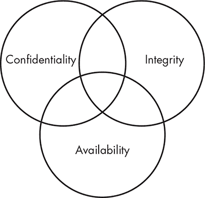
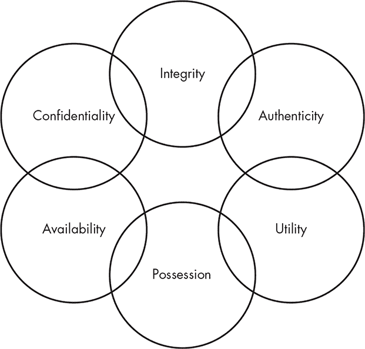
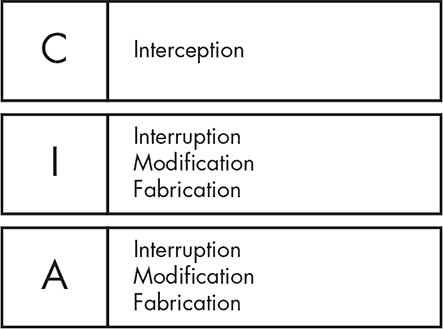
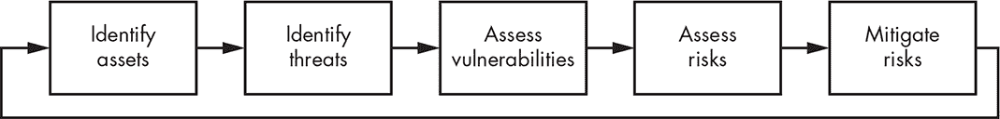
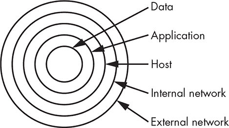

## 1

什么是信息安全？

今天，我们中的许多人都在使用计算机，回家后在计算机上玩耍，在线上上学，通过互联网向商家购买商品，带着笔记本电脑去咖啡店查看电子邮件，使用智能手机查询银行余额，甚至通过手腕上的传感器跟踪我们的运动。换句话说，计算机无处不在。

尽管技术使我们只需点击一下鼠标就能访问大量信息，但它也带来了重大安全风险。如果我们雇主或银行系统中的信息被攻击者暴露，后果可能非常严重。我们可能会在深夜突然发现我们的银行账户余额被转移到另一个国家的银行。我们的雇主可能会因为一个系统配置问题，导致攻击者访问了包含个人身份信息（PII）或专有信息的数据库，而损失数百万美元、面临法律诉讼，并遭受名誉损害。此类问题时常出现在新闻媒体中，令人不安。

三十年前，这种安全漏洞几乎是不存在的，主要是因为当时的技术水平相对较低，且使用者很少。虽然技术变化越来越快，但关于如何保持安全的理论却滞后于实际发展。如果你能很好地理解信息安全的基础知识，就能在面对不断变化的环境时，站稳脚跟，轻松应对。

在本章中，我将介绍一些信息安全的基本概念，包括安全模型、攻击、威胁、漏洞和风险。我还会在讨论风险管理、事件响应和深度防御时，深入探讨一些稍微复杂的概念。

### 定义信息安全

一般来说，*安全*是指保护你的资产，无论是免受入侵你网络的攻击者、自然灾害、破坏、丢失还是滥用。最终，你会尽力保护自己免受最可能发生的攻击，尽可能地根据你的环境采取合理的措施。

你可能有许多想要保护的潜在资产。这些资产可能包括具有固有价值的实物，如黄金，或者对你的业务有价值的物品，如计算机硬件。你也可能拥有一些较为虚拟的有价值资产，如软件、源代码或数据。

在今天的计算环境中，你会发现你的逻辑资产（作为数据或知识产权存在的资产）至少和你的物理资产（那些有形的物品或材料）一样有价值，甚至可能更有价值。这就是信息安全的重要性所在。

*信息安全*被定义为“保护信息和信息系统免受未经授权的访问、使用、披露、破坏、修改或销毁”，根据美国法律。¹ 换句话说，您希望保护您的数据和系统免受那些试图恶意或无意滥用它们的人，或者那些根本不应有权限访问它们的人。

### 何时才算安全？

尤金·斯帕福德曾说过：“唯一真正安全的系统，是关闭电源后，浇筑成混凝土块，并封存在铅衬里房间里，配有武装守卫——即便如此，我仍然对此存疑。”² 处于这种状态的系统可能是安全的，但它无法使用或生产力极低。当您提高安全级别时，通常会降低生产力水平。

此外，在保护资产、系统或环境时，您必须考虑安全级别与所保护物品价值之间的关系。如果您愿意接受性能下降，可以对您负责的每个资产应用非常高的安全级别。您可以建造一个价值十亿美元的设施，周围围绕着铁丝网围栏，由武装警卫和凶猛的攻击犬巡逻，并配有密封的金库，以保护您母亲的巧克力曲奇食谱，但那将是过度的。您所投入的安全成本永远不应超过其所保护物品的价值。

然而，在某些环境中，这样的安全措施可能还不够。在任何您计划实施高度安全措施的环境中，您还需要考虑如果失去这些资产，替换它们的成本，并确保为其价值建立合理的保护水平。

确定您何时可以被认为是安全的，这个问题有点挑战性。如果您的系统已正确打上补丁，您是否安全？如果您使用强密码，您是否安全？如果您完全断开互联网连接，您是否安全？在我看来，这些问题的答案都是“不”。没有任何单一的活动或行动能够在每种情况下使您完全安全。

这是因为即使您的系统已正确打上补丁，仍然会有新的攻击方式使您脆弱。当您使用强密码时，攻击者将通过其他途径进行攻击。当您完全断开互联网时，攻击者仍然可能通过物理方式访问或窃取您的系统。简而言之，定义何时才算真正安全是很困难的。另一方面，定义何时不安全则要容易得多。以下是一些会使您处于不安全状态的例子：

+   不给系统应用安全补丁或应用程序更新

+   使用弱密码，如“password”或“1234”

+   从互联网下载程序

+   打开来自未知发件人的电子邮件附件

+   使用没有加密的无线网络

我可以继续列出很多内容。幸运的是，一旦你能够指出环境中可能使其不安全的地方，你就可以采取措施来缓解这些问题。这个问题类似于不断将物体一分为二。总会有一小部分残留，仍然可以继续分割。尽管你可能永远无法达到一个可以明确称之为“安全”的状态，但你可以朝着正确的方向采取措施。

**这条法律是你的法律……**

定义安全标准的法律体系在不同的行业之间差异很大，不同国家之间的差异也很大。例如，美国和欧盟之间的数据隐私法律就存在显著差异。全球运营的组织需要注意，在开展业务时不要违反任何此类法律。如有疑问，请在行动前咨询法律顾问。

一些法律或法规确实尝试定义“安全”意味着什么，或者至少定义你应采取的一些步骤，以达到“足够安全”的标准。支付卡行业数据安全标准（PCI DSS）适用于处理信用卡支付的公司，1996 年《健康保险可携性与责任法案》（HIPAA）适用于处理医疗保健和病人记录的组织，联邦信息安全管理法（FISMA）为美国许多联邦机构定义了安全标准，还有许多其他类似的规定。虽然这些标准的有效性是值得争议的，但建议你遵循适用于你所处行业的安全标准，即使这些标准不是强制性要求。

### 讨论安全问题的模型

在讨论安全问题时，通常使用一个模型作为基础或基准是很有帮助的。这为我们作为安全专业人员提供了一套一致的术语和概念，供我们参考。

#### *机密性、完整性和可用性三位一体*

信息安全的三个主要概念是机密性、完整性和可用性，通常被称为*机密性、完整性和可用性（CIA）三位一体*，如图 1-1 所示。

*图 1-1：CIA 三位一体*

CIA 三位一体是一个模型，可以帮助你思考和讨论安全概念。有时它也会写作 CAI，或者以其负面形式表示为披露、篡改和拒绝（DAD）。

##### 机密性

*机密性*指的是我们能够保护数据不被未经授权的人查看。你可以在许多过程的不同层次上实现机密性。

举个例子，假设一个人正在从 ATM 提取现金。如果他有 ATM 卡，他可能会尽量保持个人识别号码（PIN）的保密性，以便能够从 ATM 提取资金。此外，ATM 的所有者也会保持账户号码、余额及任何与银行沟通所需的其他信息的保密性。银行也会保持与 ATM 的交易和资金提取后账户余额变化的保密性。

保密性可以通过多种方式受到威胁。您可能丢失一台包含数据的笔记本电脑。有人可能在您输入密码时从旁边看到。您可能将电子邮件附件发送给错误的人，或者攻击者可能渗透到您的系统中，以上这些都是潜在的风险。

##### 完整性

*完整性*是防止他人未经授权或以不希望的方式更改您数据的能力。为了保持完整性，您不仅需要防止未经授权的更改，还需要能够撤销任何不希望的授权更改。

允许您控制完整性的机制的一个好例子可以在许多现代操作系统的文件系统中找到，例如 Windows 和 Linux。为了防止未经授权的更改，这些系统通常会实施权限，限制未经授权的用户对特定文件能够执行的操作。例如，文件的拥有者可能有权限读取和写入该文件，而其他人则可能仅有读取权限，或者完全没有访问权限。此外，一些此类系统和许多应用程序，如数据库，可以让您撤销或回滚不希望出现的更改。

完整性在涉及为其他决策提供基础的数据时尤为重要。如果攻击者更改了包含医学测试结果的数据，医生可能会开错药方，从而危及病人生命。

##### 可用性

CIA 三元组的最后一个要素是可用性。*可用性*指的是我们在需要时访问数据的能力。例如，您可能会因停电、操作系统或应用程序问题、网络攻击或系统被破坏等原因失去数据的可用性。当外部方（如攻击者）造成此类问题时，我们通常称之为*拒绝服务*（DoS）攻击。

##### CIA 三元组如何与安全性相关？

考虑到 CIA 三元组的要素，我们可以开始更详细地讨论安全问题。例如，假设您正在运送一批备份磁带，磁带上存储了某些敏感数据的唯一未加密副本。

如果你在运输过程中丢失了货物，你将面临安全问题。这可能包括保密性被破坏，因为你的文件没有加密。缺乏加密也可能导致完整性问题。如果将来你恢复了这些磁带，可能并不立刻能够发现是否有攻击者篡改了未加密的文件，因为你没有有效的方法来辨别数据是否被篡改。至于可用性，除非磁带被找回，否则你将面临问题，因为你没有文件的备份副本。

虽然你可以使用 CIA 三元组相对准确地描述这个例子中的情况，但你可能会发现该模型过于局限，无法描述整个情况。对于这种情况，存在一个更广泛的模型——帕克六元组。

#### *帕克六元组*

帕克六元组是一个较不为人知的模型，它以唐·帕克（Donn Parker）的名字命名，并在他的著作《*对抗计算机犯罪*》中提出，提供了经典 CIA 三元组的稍微复杂的变体。CIA 三元组仅包括保密性、完整性和可用性，而*帕克六元组*则包括这三个原则以及占有或控制、真实性和效用，³，总共六个原则，如图 1-2 所示。

*图 1-2：帕克六元组*

##### 保密性、完整性和可用性

如我所提到的，帕克六元组包括 CIA 三元组的三个原则，定义与之前讨论的一致。帕克对完整性的描述略有不同；他没有考虑经过授权但不正确的数据修改。对他来说，数据必须是完整的，并且与之前的状态完全一致。

##### 占有或控制

在帕克六元组中，*占有*或*控制*指的是存储数据的介质的物理处置。这使得你可以在不涉及其他因素（如可用性）的情况下讨论数据在物理介质上的丢失。回到你丢失的备份磁带的例子，假设其中一些磁带是加密的，而另一些则不是。占有原则使你能够更准确地描述事件的范围；加密的磁带存在占有问题，但没有保密性问题，而未加密的磁带则在两个方面都存在问题。

##### 真实性

*真实性*原则允许你判断是否已将数据归属给正确的所有者或创作者。例如，如果你发送的电子邮件经过修改，使其看起来是从不同的电子邮件地址发出的，而不是实际发送的地址，那么你就违反了邮件的真实性。真实性可以通过数字签名来强制执行，具体内容我将在第五章进一步讨论。

与此类似但相反的概念是*不可否认性*，它防止人们采取某些行为，比如发送电子邮件后再否认自己做过这件事。我将在第四章中更详细地讨论不可否认性。

##### 实用性

最后，*实用性*是指数据对你的有用程度。实用性也是帕克里安六元组中唯一不一定是二进制性质的原则；根据数据及其格式，你可以拥有多种不同程度的实用性。这是一个相对抽象的概念，但在讨论某些安全领域的情况时，它确实是有用的。

例如，在备份磁带的运输示例中，假设其中一些磁带是加密的，而另一些则不是。对于攻击者或其他未经授权的人来说，加密的磁带可能几乎没有任何实用性，因为数据无法读取。而未加密的磁带则具有更大的实用性，因为攻击者或未经授权的人可以访问这些数据。

在 CIA 三元组和帕克里安六元组中讨论的概念为讨论信息安全领域中可能出现的所有问题提供了实际依据。这些模型使你能够更好地讨论你可能面临的攻击以及你需要采取的控制措施来应对这些攻击。

### 攻击

你可能会面临来自多种不同途径和角度的攻击。你可以根据攻击的*类型*、攻击所代表的*风险*以及你可能采取的*控制措施*来对这些攻击进行分类。

#### *攻击类型*

你通常可以将攻击分为四类：拦截、干扰、修改和伪造。每一类攻击都可能影响 CIA 三元组的一个或多个原则，如图 1-3 所示。

*图 1-3：CIA 三元组与攻击类别*

攻击类别及其可能产生的影响之间的界限有些模糊。根据具体的攻击类型，你可能会将其归入多个类别，或者其可能产生多种影响。

##### 拦截

拦截攻击允许未经授权的用户访问你的数据、应用程序或环境，主要是针对保密性的攻击。拦截可能表现为未经授权的文件查看或复制、窃听电话谈话或阅读他人电子邮件，你可以对静态数据或动态数据进行拦截（这些概念在“静态数据和动态数据”框中有所解释）。当拦截攻击执行得当时，它们可能很难被检测到。

**静态数据和动态数据**

您会发现，在本书中多次提到数据是“静止”还是“传输中”，那么让我们来谈谈这是什么意思。*静止数据*是存储的数据，不处于从一个地方转移到另一个地方的过程中。它可能存储在硬盘或闪存驱动器中，或者可能存储在数据库中。例如，这种类型的数据通常通过某种加密方式进行保护，通常是在文件级别或整个存储设备级别。

*传输中数据*是指正在从一个地方移动到另一个地方的数据。当您使用在线银行会话时，您与银行之间通过网页浏览器传输的敏感数据就是传输中数据。传输中数据同样通过加密进行保护，但在这种情况下，加密保护的是用于将数据从一个地方移动到另一个地方的网络协议或路径。

有些人还可能提出第三类数据，即*使用中的数据*。使用中的数据是指应用程序或个人正在主动访问或修改的数据。使用中数据的保护包括用户的权限和身份验证。您常常会发现使用中数据的概念与传输中数据混为一谈。关于是否应将这种类型的数据作为独立类别来处理，双方都有合理的论点。

##### 中断

中断攻击使您的资产在临时或永久的基础上变得无法使用或无法访问。这些攻击通常影响可用性，但也可能影响完整性。您会将对邮件服务器的 DoS 攻击分类为可用性攻击。

另一方面，如果攻击者操控了数据库所在的进程，阻止访问其包含的数据，您可能会认为这是一次完整性攻击，因为可能会导致数据丢失或损坏，或者您可能会认为这是两者的结合。您也可能将这种数据库攻击视为一种修改攻击，而非中断攻击，正如接下来所看到的那样。

##### 修改

修改攻击涉及篡改资产。这类攻击主要被认为是对完整性的攻击，但也可能代表对可用性的攻击。如果您以未授权的方式访问文件并更改其内容，您就影响了文件数据的完整性。然而，如果涉及的文件是一个管理服务行为的配置文件——比如一个作为网页服务器运行的配置文件——更改该文件的内容可能会影响该服务的可用性。如果您在文件中更改了网页服务器的配置，改变了服务器如何处理加密连接，您甚至可以将其视为一次保密性攻击。

##### 伪造

伪造攻击涉及生成数据、过程、通信或其他类似的材料，这些都是通过系统完成的。像最后两种攻击类型一样，伪造攻击主要影响完整性，但也可能影响可用性。例如，在数据库中生成虚假信息就是一种伪造攻击。你还可以生成电子邮件，这是传播恶意软件的一种常见方式。如果你生成了足够多的附加进程、网络流量、电子邮件、网页流量，或者几乎任何消耗资源的东西，你可能通过使处理这些流量的服务无法提供给合法用户，从而进行可用性攻击。

#### *威胁、漏洞和风险*

为了更具体地讨论攻击，我需要介绍一些新的术语。当你分析攻击如何影响你时，可以用威胁、漏洞和相关的风险来描述它。

##### 威胁

当我在本章早些时候谈到你可能遇到的攻击类型时，我讨论了几种可能危害你资产的攻击类型——例如，未经授权的数据修改。归根结底，威胁是指具有造成危害潜力的事物。威胁往往是特定于某些环境的，特别是在信息安全领域。例如，尽管病毒在 Windows 操作系统上可能会成为问题，但同样的病毒在 Linux 操作系统上不太可能产生任何影响。

##### 漏洞

漏洞是威胁可以利用的弱点或漏洞，从而对你造成损害。一个漏洞可能涉及你正在运行的特定操作系统或应用程序，你办公大楼的物理位置，一个服务器过度拥挤且产生的热量超过空调系统能承受的一个数据中心，缺乏备用发电机，或者其他因素。

##### 风险

风险是指某种不良事件发生的可能性。要在一个环境中存在风险，你需要同时具备威胁和该威胁可能利用的漏洞。例如，如果你有一个由木材构成的结构，并且你在附近点燃了火源，那么你就有了一个威胁（火灾）和一个匹配的漏洞（木质结构）。在这种情况下，你绝对有风险。

同样，如果你有相同的火灾威胁，但你的结构是由混凝土构成的，那么你就不再面临可信的风险，因为你的威胁没有漏洞可以利用。你可以说，足够热的火焰可能会损坏混凝土，但这种情况发生的可能性要小得多。

我们经常讨论计算环境中的潜在，但不太可能发生的攻击。最好的策略是花时间减轻最可能发生的攻击。如果你将资源都投入到为每一个可能发生的攻击做计划（无论它多么不可能发生），你将分散精力，无法在最需要的地方提供保护。

##### 影响

一些组织，比如美国国家安全局（NSA），在威胁/脆弱性/风险的计算中增加了一个叫做*影响*的因素。影响考虑到被威胁资产的价值，并用它来计算风险。在备份磁带的例子中，如果你考虑到未加密的磁带只包含你收藏的巧克力曲奇饼干食谱，你可能实际上没有风险，因为暴露的数据没有任何敏感信息，你还可以从源数据创建额外的备份。在这种情况下，你可以安全地说你没有风险。

#### *风险管理*

风险管理过程可以弥补环境中的风险。图 1-4 显示了一个典型的风险管理过程的大致框架。

*图 1-4：风险管理过程*

如你所见，你需要识别出重要资产，找出可能的威胁，评估你的脆弱性，然后采取措施来减轻这些风险。

##### 识别资产

风险管理过程中的第一步，也是最重要的一步之一，就是识别你要保护的资产。如果你无法列举出你的资产并评估每个资产的重要性，保护这些资产将变得非常困难。

尽管这听起来像是一个非常简单的任务，但它可能比表面上看起来更为复杂，特别是在大型企业中。在许多情况下，组织可能拥有多代硬件，收购其他公司时留下的资产也可能潜伏在不为人知的地方，还有大量未记录的虚拟主机在使用，其中任何一项都可能对业务的持续运作至关重要。

一旦你识别出正在使用的资产，决定哪些资产是关键业务资产则是另一个完全不同的问题。准确确定哪些资产对业务运作至关重要，通常需要依赖于使用该资产的职能部门、支持该资产的部门，以及可能涉及的其他方的输入。

##### 识别威胁

在列举了关键资产后，你可以开始识别可能影响它们的威胁。通常，有一个框架来讨论特定威胁的性质是非常有用的，本章早些时候提到的 CIA 三原则或 Parkerian 六原则正好可以用来达成这一目的。

例如，我们可以运用 Parkerian 六原则来分析你在处理信用卡支付的应用程序时可能面临的威胁。

**保密性** 如果你不当暴露数据，可能会发生泄露。

**完整性** 如果数据损坏，可能会导致错误地处理支付。

**可用性** 如果系统或应用程序出现故障，你将无法处理支付。

**占有** 如果你丢失了备份介质，可能会导致泄露。

**真实性** 如果你没有真实的客户信息，可能会处理欺诈交易。

**效用** 如果你收集无效或不正确的数据，该数据将具有有限的效用。

尽管这显然是对该系统威胁的高层次评估，但它立即指出了一些问题领域。你需要关注数据丢失控制、数据准确性维护以及系统的持续运行。根据这些信息，你可以开始查看潜在的脆弱性和风险区域。

##### 评估脆弱性

在评估脆弱性时，你需要在潜在威胁的背景下进行。任何给定的资产可能会面临成千上万的威胁，可能对其产生影响，但只有一小部分是相关的。在上一节中，你了解了针对处理信用卡交易系统的潜在威胁。

让我们看看已经识别出的问题，并尝试确定是否存在脆弱性。

**机密性** 如果你不当暴露数据，可能会发生数据泄露。

你的敏感数据在静态和传输中都进行了加密。你的系统定期接受外部渗透测试公司的测试。*这不是一个风险。*

**完整性** 如果数据被破坏，可能会错误地处理支付。

你在支付处理工作流程中仔细验证支付数据的正确性。无效数据将导致交易被拒绝。*这不是一个风险。*

**可用性** 如果系统或应用程序宕机，你将无法处理支付。

你没有为支付处理系统的后端数据库提供冗余。如果数据库宕机，你将无法处理支付。*这是一个风险。*

**所有权** 如果你丢失备份介质，可能会发生数据泄露。

你的备份介质是加密的，并由快递员亲自携带。*这不是一个风险。*

**真实性** 如果你没有真实的客户信息，可能会处理欺诈交易。

确保有效的支付和客户信息属于进行交易的个人是困难的。你没有一个好的方法来做到这一点。*这是一个风险。*

**效用** 如果你收集无效或不正确的数据，该数据将具有有限的效用。

为了保护数据的有效性，你会对信用卡号码进行校验和，确保账单地址和电子邮件地址有效，并采取其他措施确保数据的正确性。*这不是一个风险。*

这些例子是你需要采取的过程的高层次视图，但它们有助于说明任务。从这里，你可以再次看到几个关注点，尤其是在身份验证和可用性方面，你可以开始评估可能存在风险的区域。

##### 评估风险

一旦您识别出给定资产的威胁和漏洞，您可以评估整体风险。正如本章前面所讨论的，风险是威胁和漏洞的结合体。没有匹配威胁的漏洞或没有匹配漏洞的威胁不构成风险。

例如，以下项目既是潜在威胁，也是一个脆弱点：

**可用性** 如果系统或应用程序出现故障，您将无法处理支付。

您的支付处理系统后端没有数据库冗余，因此如果数据库出现故障，您将无法处理支付。

在这种情况下，您既有威胁又有相应的漏洞，这意味着由于数据库后端的单点故障，您有可能失去处理信用卡支付的能力。一旦您以这种方式处理了威胁和漏洞，就可以降低这些风险。

##### 降低风险

为了降低风险，您可以采取措施来应对每个威胁。这些措施称为*控制措施*。控制措施分为三类：物理控制、逻辑控制和管理控制。

*物理控制* 保护您的系统所在的物理环境或数据存储的地点。这些控制还管理进入和离开这些环境的访问。物理控制包括围栏、大门、锁、路障、警卫和摄像头，也包括维护物理环境的系统，如供暖和空调系统、灭火系统和备用发电机。

虽然乍一看，物理控制似乎与信息安全没有太大关系，但它们实际上是最关键的控制措施之一；如果您无法物理保护您的系统和数据，那么您所采取的任何其他控制措施都将变得无关紧要。如果攻击者能够物理访问您的系统，他们可以窃取或破坏它们，使其无法使用——在最好的情况下。在最坏的情况下，攻击者将能够直接访问您的应用程序和数据，窃取您的信息和资源，或将其用于他们自己的目的。

*逻辑控制*，有时也称为*技术控制*，保护处理、传输和存储您的数据的系统、网络和环境。逻辑控制包括密码、加密、访问控制、防火墙和入侵检测系统等项。

逻辑控制使您能够防止未经授权的活动；如果您的逻辑控制实施得当并且成功，攻击者或未经授权的用户将无法在不破坏控制的情况下访问您的应用程序和数据。

*行政控制*是基于规则、法律、政策、程序、指南以及其他“纸面”性质的项目。行政控制规定了你的环境中的用户应如何行为。根据环境和控制的不同，行政控制可以代表不同级别的权限。你可能会有一个简单的规则，例如“每天结束时关闭咖啡壶”，目的是避免物理安全问题（比如晚上烧掉你的建筑物）。你也可能有更严格的行政控制，例如要求你每 90 天更换一次密码。

行政控制的一个重要部分是能够强制执行这些控制措施。如果你没有权力或能力确保人们遵守你的控制措施，那么它们比没有还要糟糕，因为它们会产生一种虚假的安全感。例如，如果你制定了一项政策，要求员工不能将商业资源用于个人用途，你将需要能够执行这一政策。在一个非高度安全的环境中，这可能是一个困难的任务。你需要监控电话和手机使用情况、网页访问、电子邮件使用、即时消息对话、已安装的软件以及其他可能被滥用的领域。除非你愿意投入大量资源来监控这些并处理政策违规行为，否则你很快就会有一项无法执行的政策。下次你被审计时，如果被要求提供政策执行的证据，你将面临问题。

#### *事件响应*

如果你的风险管理工作没有你预期的那么彻底，或者你被一些完全出乎意料的事件所打击，你可以通过事件响应来进行应对。你应该将事件响应集中在那些你认为最有可能给组织带来痛苦的事项上。你应该已经在风险管理过程中识别出了这些事项。

尽可能地，你应该根据已记录的事件响应计划来对这类事件作出反应，这些计划应定期由那些在实际事件中需要执行它们的人进行审查、测试和演练。你不希望等到真正的紧急情况发生时，才发现那些搁置在书架上的文档已经过时，并且提到的流程或系统已经发生了重大变化，甚至不再存在。

事件响应过程，从高层次来看，包括以下内容：

+   准备

+   检测与分析

+   隔离

+   根除

+   恢复

+   事件后活动

我将在接下来的内容中更详细地讲解这些阶段。

##### 准备

事件响应的准备阶段包括所有可以提前执行的活动，以便更好地处理事件。通常这涉及到制定管理事件响应和处理的政策和程序，为事件处理人员以及那些预计会报告事件的人进行培训和教育，并且开发和维护文档。

你不应低估事件响应阶段的重要性。如果没有充分的准备，事件响应很难顺利进行，也很难按照你未曾演练过的计划来执行。确定需要做什么、谁来做、以及如何做的时间不是在你面临紧急情况时。

##### 检测与分析

检测和分析阶段是行动开始的地方。在这一阶段，你将检测到问题，决定它是否真的构成事件，并采取适当的应对措施。

最常见的是，你会通过安全工具或服务检测到问题，比如入侵检测系统（IDS）、防病毒软件（AV）、防火墙日志、代理日志，或来自安全信息与事件监控（SIEM）工具或托管安全服务提供商（MSSP）的警报。

这一阶段的分析部分通常是工具或服务（通常是 SIEM 工具）自动化与人工判断的结合。虽然你通常可以使用某种阈值来判断在一定时间内发生的某个数量的事件是否正常，或者某些事件的组合是否不正常（例如，连续两次登录失败，随后成功登录、更改密码和创建新账户），但你通常还是需要人工干预。人工干预可能包括检查各种安全、网络和基础设施设备输出的日志；联系报告事件的一方；以及对情况的总体评估。（对于事件处理人员来说，不幸的是，这些情况通常发生在周五下午 4 点或周日凌晨 2 点。）

当事件处理人员评估情况时，他们将决定问题是否构成事件，评估事件的严重性，并联系任何需要的额外资源，以便进入下一阶段。

##### 遏制、消除和恢复

遏制、消除和恢复阶段是解决事件的大部分工作发生的地方，至少在短期内是这样。

*遏制*意味着采取措施，确保情况不会造成比已经发生的更多的损害——或者至少减少任何正在发生的伤害。如果问题涉及到被远程攻击者控制的恶意软件感染服务器，这可能意味着将服务器从网络中断开，设置防火墙规则以阻止攻击者，并更新入侵防御系统（IPS）的签名或规则以阻止恶意软件的流量。

在*根除*阶段，你将尝试从环境中去除问题的影响。以你被恶意软件感染的服务器为例，你已经隔离了系统并切断了它与指挥控制网络的连接。现在，你需要清除服务器中的恶意软件，并确保它不会在环境中的其他地方存在。这可能涉及对环境中其他主机进行额外扫描，以确保恶意软件不存在，或者检查服务器和网络上的日志，确定被感染的服务器与哪些其他系统进行了通信。对于恶意软件，特别是非常新的恶意软件或变种，任务可能会相当棘手。每当你对是否已彻底清除环境中的恶意软件或攻击者有所疑虑时，应该倾向于采取更谨慎的态度。

最后，你需要恢复到事件发生前的状态。*恢复*可能涉及从备份介质中恢复设备或数据、重建系统或重新加载应用程序。再次强调，这可能比最初看起来更为痛苦，因为你对情况的了解可能不完整或不清晰。你可能会发现自己无法确认备份介质是否干净且无感染，或备份介质本身是否完全损坏。应用程序安装包可能丢失，配置文件可能不可用，或者可能会发生许多其他问题。

##### 事后活动

与准备工作类似，事后活动容易被忽视，但你应该确保不要忽略它。在事后活动阶段，通常称为*事后分析*（拉丁语意为“死后”），你试图明确事件的发生原因、发生的具体经过以及你可以做些什么防止此类事件再次发生。此阶段的目的是为了防止或减少未来类似事件的影响，而不是为了指责或归咎于某人（尽管有时会发生这种情况）。

### 深度防御

现在，你已经了解了安全漏洞可能带来的影响、可能面临的攻击类型以及应对这些攻击的策略，我将向你介绍一种预防这些攻击的方法。*深度防御*是一种在军事演习和信息安全中都常见的策略。基本概念是制定多层次的防御策略，即使其中一层或多层防御措施失败，你仍能成功抵御攻击。

在图 1-5 中，你可以看到一个可能需要部署的防御资产的层次结构示例。

*图 1-5：深度防御*

至少，你希望在外部网络、内部网络、主机、应用程序和数据层面都有防御。每一层的防御如果得当实施，将使得成功突破你的网络并直接攻击你的资产变得困难。

话虽如此，深度防御并不是万灵药。无论你放置多少层防御措施，或在每一层放置多少防御手段，你都无法无限期地阻止每一个攻击者。信息安全领域中的深度防御目标也不是为了做到这一点。其目标是在你真正重要的资产与攻击者之间放置足够的防御措施，以便你能及时发现攻击并有足够的时间去防止它发生。

这种拖延策略的一个例子是要求员工每 60 或 90 天更改一次密码。这使得攻击者更难在破解密码后及时使用它。

使用严格的密码构建规则是另一种拖延策略。考虑密码“mypassword”，它长度为十个字符，仅使用一个字符集。在一个相对较慢的普通系统上，攻击者可能需要一到两周时间才能破解这个密码。而如果使用专门构建的密码破解系统或一个僵尸网络，攻击者可能只需要一到两个小时。

如果你使用更安全的密码构建规则，并采用类似 MyP@ssword1 的密码，这个密码长度为十个字符，但使用了四种字符集，破解这个密码在专门构建的硬件上可能需要数千年，而在一个大型的僵尸网络中，可能也需要几年的时间。

如果你要求员工频繁更改密码并创建复杂的密码，攻击者将无法在时间内破解密码并加以利用。

**密码中的熵**

前面讨论的复杂密码示例采用了一种经典的强密码构建方案，由八个或更多字符组成，包含多个字符集（大写字母、小写字母、数字和标点符号）。有些人会认为它的熵（不可预测性）不足以确保真正的安全，认为你应该使用一个更长、更有熵且更容易记住的密码，比如 correcthorsebatterystaple。⁴

最终，你的主要关注点应该是在构建合理安全的密码并定期更改它们。

你在深度防御策略中包含的层次将根据你所防御的情况和环境有所不同。如前所述，从严格的逻辑（非物理）信息安全角度来看，你应该将外部网络、网络边界、内部网络、主机、应用程序和数据层作为放置防御措施的区域。

你可以通过添加其他重要层次来增加防御模型的复杂性，例如物理防御、政策或用户意识与培训，但目前我将坚持使用一个更简单的例子。

表 1-1 列出了你可能为每一层防御措施使用的一些防御方法。

**表 1-1：** 按层防御

| **层次** | **防御措施** |
| --- | --- |

| 外部网络 | DMZ VPN |

日志记录

审计

渗透测试

漏洞分析 |

| 网络边界 | 防火墙 代理

日志记录

有状态数据包检查

审计

渗透测试

漏洞分析 |

| 内部网络 | 入侵检测系统 入侵防御系统

日志记录

审计

渗透测试

漏洞分析 |

| 主机 | 身份验证 杀毒软件

防火墙

入侵检测系统

入侵防御系统

密码

哈希算法

日志记录

审计

渗透测试

漏洞分析 |

| 应用层 | 单点登录 内容过滤

数据验证

审计

渗透测试

漏洞分析 |

| 数据 | 加密 访问控制

备份

渗透测试

漏洞分析 |

在某些情况下，防御措施会出现在多个层次，因为它适用于多个领域。一个很好的例子是*渗透测试*，这是一种通过使用攻击者入侵时会用到的相同策略来发现安全漏洞的方法，这种测试出现在每一层。我将在第十四章中更深入地讨论这一点。你可能希望在每一层的防御中都使用渗透测试。你还可以看到，某些特定的控制措施可能与特定层次相关联，比如网络边界的防火墙和代理。像信息安全领域的其他一切一样，你可以争辩说这些控制措施中的一些或所有可以存在于不同于此处展示的层次，但这是一条很好的总体指南。在你深入阅读本书时，我将更详细地讨论表 1-1 中展示的每个领域，以及你可能希望为每个领域使用的具体防御措施。

### 摘要

在讨论与信息安全相关的问题时，如攻击和控制，拥有一个模型来指导讨论是很有帮助的。本章讨论了两种潜在模型：CIA 三元组，由机密性、完整性和可用性组成；以及帕克六元组，由机密性、完整性、可用性、所有权或控制、真实性和实用性组成。

在你着眼于防止攻击时，理解攻击发生时可能会造成的损害类别也非常有帮助。攻击可能通过拦截、干扰、修改或伪造等方式影响环境。每种影响都会对 CIA 三元组的特定领域产生影响。

在讨论你可能面临的具体威胁时，理解风险的概念非常重要。只有当威胁存在且你有一个该威胁可以利用的漏洞时，才会面临攻击风险。为了降低风险，你可以使用三种主要的控制措施：物理控制、逻辑控制和行政控制。

最后，本章介绍了深度防御，这是信息安全领域中一个特别重要的概念。要利用这一概念构建防御措施，你需要设置多个防御层次，足够延迟攻击者的时间，以便提醒你攻击的发生，并让你能够进行更积极的防御。

本章讨论的概念是信息安全的基础。它们在许多组织的日常信息安全任务中定期使用；例如，你可能会听到有人谈论机密性泄露，或者讨论某封电子邮件消息的真实性。

信息安全是任何规模的组织每天都要关注的事情，尤其是那些处理个人信息、财务数据、医疗数据、教育数据或其他受到所在国家法律监管的类型信息的组织。当一个组织没有投入信息安全时，后果可能非常严重。他们可能面临罚款、诉讼，甚至可能无法继续开展业务，尤其是在丢失了关键或敏感数据的情况下。简而言之，信息安全是现代商业世界的关键组成部分。

### 练习

以下是一些问题，帮助你回顾本章的关键概念：

1.  解释漏洞和威胁之间的区别。

1.  哪六项可能被视为逻辑控制？

1.  你可能会使用什么术语来描述数据的有用性？

1.  哪一类攻击属于对机密性的攻击？

1.  你如何判断何时可以认为你的环境是安全的？

1.  运用“深度防御”概念，你会使用哪些层次来防止有人通过 USB 闪存驱动器将机密数据从你的环境中移走？

1.  基于 Parkerian 六元组，如果你丢失了一批包含客户个人和支付信息的加密备份磁带，哪些原则会受到影响？

1.  如果你的环境中的网页服务器基于微软的 Internet 信息服务（IIS），并且发现了一种新的蠕虫攻击 Apache 网页服务器，那么你缺少什么？

1.  如果你为你的环境制定了一项新政策，要求你使用复杂且自动生成的密码，且每个系统的密码都是独一无二的，并且长度至少为 30 个字符，例如“!Qa4(j0nO$&xn1%2AL34ca#!Ps321$”，那么哪些方面会受到不利影响？

1.  考虑到 CIA 三元组和 Parkerian 六元组，每个模型的优缺点是什么？
