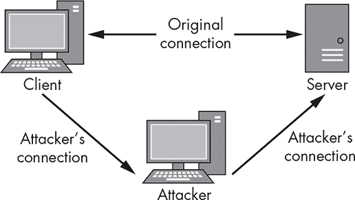
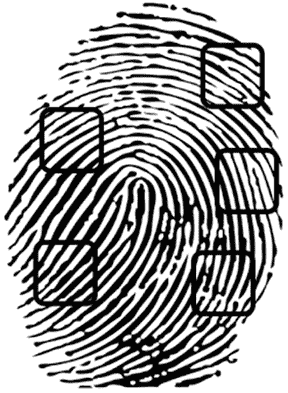
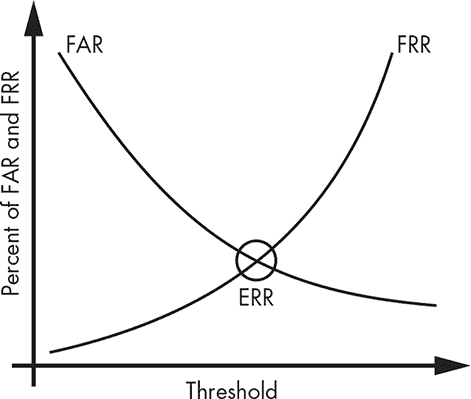
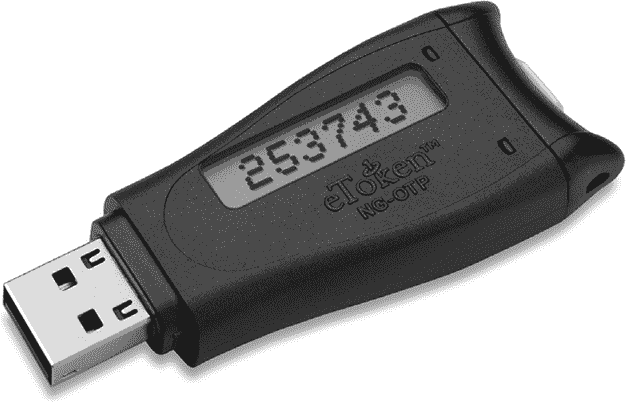

## 2

身份识别与认证

在开发安全措施时，无论是特定机制还是整个基础设施，身份识别和认证都是关键概念。简而言之，*身份识别*是对某人或某物是什么的声明，而*认证*则确定这个声明是否真实。你可以看到这样的过程在日常生活中以各种方式发生。

一个常见的身份识别和认证交易示例是使用需要个人识别号码（PIN）的支付卡。当你刷卡时，你是在断言你就是卡上所示的那个人。此时，你已经提供了身份信息，但仅此而已。当你被提示输入与卡关联的 PIN 时，你正在完成交易的认证部分，证明你是合法的卡持有者。

我们日常使用的一些身份识别和认证方法特别脆弱，这意味着它们在很大程度上依赖于参与交易的人的诚信与勤勉。例如，如果你出示身份证购买酒精饮料，你要求他人相信你的身份证是真实且准确的；除非他们能够访问维护该身份证的系统，否则他们无法进行认证。我们还依赖于执行认证的人员或系统的能力；他们不仅必须能够执行认证操作，还必须能够检测到虚假或欺诈活动。

你可以使用多种方法进行身份识别和认证，从要求简单的用户名和密码，到实施专门的硬件令牌，这些令牌通过多种方式建立你的身份。在本章中，我将讨论其中几种方法并探讨它们的应用。

### 身份识别

正如你刚才了解到的，身份识别仅仅是对我们是谁的断言。这可能包括我们作为个人所声称的身份、系统在网络上所声称的身份，或者电子邮件的发起方所声称的身份。你将看到一些确定身份的方法，并考察这些方法的可信度。

#### *我们所声称的身份*

我们所声称的身份充其量只是一个脆弱的概念。我们可以通过全名、简写的名字、昵称、账户号码、用户名、身份证、指纹或 DNA 样本来识别自己。不幸的是，除了少数几种例外，类似的身份识别方法并不是独一无二的，甚至一些所谓的独一无二的识别方法，如指纹，也可能被复制。

我们声称的身份，在许多情况下，可能会发生变化。例如，女性在结婚后通常会改变姓氏。此外，我们一般可以轻松更改逻辑形式的身份证明——如账户号码或用户名。即使是身体特征，如身高、体重、肤色和眼睛颜色，也可能发生变化。最重要的一点是，要认识到仅凭身份声明是远远不够的。

#### *身份验证*

身份验证是超越身份识别的步骤，但它仍然不等同于认证，我将在下一部分讨论认证。当你被要求出示驾驶执照、社会安全卡、出生证明或其他类似的身份证明时，这通常是为了身份验证，而非认证。这大致相当于某人声称自己是约翰·史密斯；你问他是否真的是约翰·史密斯，并对他回答“当然，我是”感到满足（加上一些文书工作）。

我们可以进一步通过一个例子来验证身份识别的形式（例如，护照），并将其与数据库中包含的额外信息进行比对，匹配照片和身体特征与我们面前的人。这可能会让我们更接近确保我们正确识别了这个人，但它仍然不能算作认证；我们可能验证了身份证件本身的状态，并且知道此人符合最初签发身份证件时的基本规格，但我们并没有采取任何步骤来证明这个人真的是正确的那一个。我们越是趋向验证而非认证，我们的控制措施就越弱。

计算机系统也使用身份验证。当你发送电子邮件时，你提供的身份通常被认为是真的；系统很少采取额外的步骤来验证你的身份。这样的安全漏洞促成了大量垃圾邮件的传播，思科的 Talos 情报小组估计，从 2017 年中期到 2018 年中期，大约 85%的电子邮件都是垃圾邮件。¹

#### *伪造身份证件*

正如我所讨论的，身份证明的方法是可以变化的。因此，它们也容易被伪造。未成年人常常使用假身份证件进入酒吧或夜总会，而罪犯和恐怖分子可能会利用这些证件执行各种更为恶劣的任务。你可能会使用一些身份证明方法，如出生证明，来获得其他身份证明，如社会安全卡或驾驶执照，从而加强一个虚假的身份。

基于虚假信息的身份盗窃今天是一个主要的安全问题；2017 年，身份窃贼从美国消费者手中窃取了约 168 亿美元。²这种类型的攻击不幸地非常常见，并且容易执行。只需要少量的信息——通常一个名字、地址和社会安全号码就足够——就有可能冒充某人，足以进行多种交易，比如开设信用账户。这类犯罪的发生，是因为许多活动缺乏认证要求。虽然大多数人认为身份验证就足够了，但使用伪造的身份验证表格很容易绕过验证。

计算机系统和环境中也存在许多相同的问题。例如，完全有可能从一个伪造的电子邮件地址发送邮件。垃圾邮件发送者经常使用这种策略。我将在第九章中更详细地讨论此类问题。

### 认证

在信息安全中，认证是用来确定身份声明是否真实的一组方法。请注意，认证并不决定被认证方被允许做什么；这个是一个独立的任务，叫做*授权*。我将在第三章中讨论授权。

#### *因素*

认证有几种方法：你知道的东西、你是谁、你拥有的东西、你做的事情和你所在的地方。这些方法被称为*因素*。当你尝试认证身份声明时，最好使用尽可能多的因素。使用的因素越多，结果就越可靠。

*你知道的某些东西*，一种常见的认证因素，包括密码或 PIN 码。然而，这个因素有些薄弱，因为如果这个因素所依赖的信息被暴露，你的认证方式可能就不再唯一。

*你是谁*是基于个体相对独特的身体特征的因素，通常称为*生物识别*。虽然生物识别可以包括像身高、体重、发色或眼睛颜色这样的简单特征，但这些通常不足以成为非常安全的标识符。像指纹、虹膜或视网膜图案、或面部特征这样的复杂标识符更为常见。这些要比密码更强，因为伪造或窃取一个物理标识符的副本要困难一些，虽然不可能完全杜绝。关于生物识别是否真正算作认证因素，还是仅仅构成验证，存在一些争议。我将在本章稍后深入探讨生物识别时再讨论这一问题。

*你拥有的东西*是一个通常基于物理持有的因素，尽管它也可以扩展到一些逻辑概念。常见的例子有自动取款机（ATM）卡、州或联邦发放的身份证件，或基于软件的安全令牌，如图 2-1 所示。³ 一些机构，如银行，也开始使用对逻辑设备的访问权限，例如手机或电子邮件账户，作为身份验证的方法。

*图 2-1：将安全令牌发送到手机是常见的身份验证方法。*

这个因素的强度可能根据实现方式有所不同。如果你想使用发送到不属于你的设备上的安全令牌，你需要窃取该设备来伪造身份验证方法。另一方面，如果安全令牌是发送到电子邮件地址，那么拦截起来就会容易得多，而且你将拥有一个强度较低的验证措施。

*你做的事情*，有时被视为你是某种身份的变体，是一个基于个人行为或动作的因素。这可能包括对个人步态或笔迹的分析，或者是分析在输入密码短语时按键之间的延迟。这些因素提供了强有力的身份验证方法，并且很难伪造。然而，它们的缺点是可能会比其他一些因素更高频率地错误拒绝合法用户。

*你的位置*是一个基于地理位置的身份验证因素。这个因素的操作方式与其他因素不同，因为它要求一个人必须位于特定的位置。例如，在更改 ATM 密码时，大多数银行会要求你进入银行分行，并在此时提供你的身份证明和账户号码。如果银行允许在线重置密码，攻击者就可以远程更改你的密码，并继续清空你的账户。尽管这个因素可能不如其他一些因素有用，但它在没有完全破坏执行身份验证的系统的情况下是很难被对抗的。

#### *多因素身份验证*

*多因素身份验证*使用前面章节中讨论的一个或多个因素。当你只使用两个因素时，这种做法有时也被称为*双因素身份验证*。

让我们回到 ATM 的例子，因为它很好地说明了多因素身份验证。在这个例子中，你使用你知道的东西（你的密码）和你拥有的东西（你的 ATM 卡）。你的 ATM 卡既作为身份验证的一个因素，也作为一种身份证明。另一个多因素身份验证的例子是写支票。在这种情况下，你使用的是你拥有的东西（支票本身）和你做的事情（签署支票）。在这里，写支票所涉及的两个因素相对较弱，因此有时会看到第三个因素——指纹——与它们一起使用。

根据选择的因素，你可以针对每种情况组装更强或更弱的多因素认证方案。在某些情况下，尽管某些方法可能更难以破解，但它们在实施上并不实用。例如，DNA 是一种强有力的认证方法，但在大多数情况下并不实用。在第一章中，我提到过你的安全性应当与保护的对象成比例。你当然可以在每个信用卡终端上安装虹膜扫描仪，但这会非常昂贵、不切实际，并且可能让客户感到不安。

#### *相互认证*

*相互认证*是一种认证机制，在这种机制中，交易双方相互进行认证。这些参与方通常是基于软件的。在标准的单向认证过程中，客户端向服务器进行认证。在相互认证中，不仅客户端向服务器进行认证，服务器也需要向客户端进行认证。相互认证通常依赖于数字证书，我将在第五章中讨论这一点。简而言之，客户端和服务器都需要拥有一个证书，用于相互认证。

在没有执行相互认证的情况下，你容易受到冒充攻击，这通常被称为*中间人攻击*。在中间人攻击中，攻击者插入到客户端和服务器之间。然后，攻击者伪装成服务器与客户端进行通信，并伪装成客户端与服务器进行通信，正如图 2-2 所示，通过绕过正常的流量模式，然后拦截并转发通常直接在客户端和服务器之间流动的流量。

*图 2-2：中间人攻击*

这种情况通常是因为攻击者只需要从客户端到服务器的认证来进行篡改或伪造。如果你实施相互认证，这将使攻击变得更加困难，因为攻击者需要伪造两种不同的认证。

你还可以将相互认证与多因素认证结合起来，尽管后者通常仅在客户端进行。服务器到客户端的多因素认证不仅在技术上具有挑战性，而且在大多数环境中不切实际，因为它需要在客户端进行一些技术上的重负担，可能还需要用户的参与。这样做可能会导致生产力的大幅下降。

### 常见的身份识别与认证方法

我将在本节最后讨论三种常见的身份识别与认证方法：密码、生物识别和硬件令牌。

#### *密码*

密码对大多数常用计算机的人来说都很熟悉。当与用户名结合使用时，密码通常允许你访问计算机系统、应用程序、手机或类似设备。尽管它们只是一个身份验证因素，但如果构建和实施得当，密码可以代表相对较高的安全性。

人们常常将某些密码描述为*强大*，但更合适的描述词可能是*复杂*。如果你构造一个仅使用小写字母且长度为八个字符的密码，你可以使用密码破解工具很快破解它，正如在第一章中讨论的那样。通过向密码中添加字符集，使得破解密码变得越来越困难。如果你使用大写字母、小写字母、数字和符号，你将得到一个可能更难记住的密码，例如*$sU&qw!3*，但它会更加难以破解。

除了构建强密码外，你还需要保持良好的密码管理习惯。不要把密码写下来并将其放在键盘下或显示器上；这样做完全违背了设置密码的初衷。有一种被称为*密码管理器*的应用程序可以帮助我们管理不同账户的所有登录信息和密码，它们有的是本地安装的软件，有的是网页或移动设备上的应用程序。关于这些工具有很多支持与反对的意见；有些人认为将所有密码集中存放在一个地方是个坏主意，但如果使用得当，它们可以帮助你保持良好的密码管理习惯。

另一个常见问题是密码的手动同步——简而言之，就是在各个地方使用相同的密码。如果你在电子邮件、工作登录以及在线编织讨论论坛中使用相同的密码，那么你将所有账户的安全交给了这些系统所有者。如果其中任何一个被攻破，所有的账户都将变得脆弱；攻击者只需要在互联网上查找你的账户名，找到你其他的账户并使用默认密码登录。当攻击者进入你的电子邮件账户时，游戏就结束了，因为攻击者通常可以利用该账户重置你其他账户的凭证。

#### *生物特征识别*

尽管某些生物特征识别可能比其他类型更难伪造，但这仅仅是因为当前技术的局限性。在未来的某个时刻，我们需要开发出更为强大的生物特征来进行测量，或者停止将生物特征作为身份验证机制。

##### 使用生物特征识别

配备生物特征识别功能的设备正变得越来越普遍且价格便宜。你可以在不到 20 美元的价格找到各种选择。在你依赖这些设备进行安全验证之前，值得仔细研究，因为一些便宜的版本容易被绕过。

你可以通过两种方式使用生物识别系统。你可以用它们来验证某人提出的身份声明，如前所述，或者你可以反向操作，使用生物识别作为身份识别的方法。执法机关通常会使用这种方法来识别在各种物体上留下的指纹的主人。考虑到这些组织持有的指纹库的庞大规模，这可能是一个耗时的过程。要以任何方式使用生物识别系统，你需要让用户通过某种注册过程。注册涉及记录用户选择的生物特征——例如，复制指纹——并将其保存在系统中。处理特征时，还可能包括记录图像某些部分出现的元素，这些元素被称为*特征点*（图 2-3）。

*图 2-3: 生物识别特征点*

你可以稍后使用这些特征点将特征与用户进行匹配。

##### 生物识别因素的特征

生物识别因素通过七个特征来定义：普适性、唯一性、持久性、可收集性、性能、可接受性和规避。⁴

*普适性*意味着你应该能够在你预期加入系统的大多数人身上找到你选择的生物特征。例如，尽管你可能会使用疤痕作为身份标识符，但你无法保证每个人都有疤痕。即使你选择了一个常见的特征，比如指纹，你也应该考虑到有些人可能没有右手的食指，并准备好对此进行补偿。

*唯一性*是衡量一个特征在个体之间的独特性的标准。例如，如果你选择使用身高或体重作为生物识别标识符，你很有可能会在任何给定的群体中找到几个人具有相同的身高或体重。你应该尽量选择具有高度唯一性的特征，例如 DNA 或虹膜图案，但即便是这些特征也可能被复制，无论是故意的还是其他原因。例如，双胞胎有相同的 DNA，攻击者也可能复制指纹。

*持久性*测试一个特征在时间推移和年龄增长过程中抵抗变化的能力。如果你选择一个容易变化的因素，例如身高、体重或手部几何形状，最终你会发现自己无法验证一个合法用户。最好选择像指纹这样不太可能在没有刻意干预的情况下改变的特征。

*可收集性*衡量获取一个特征的难易程度。大多数常用的生物识别特征，比如指纹，比较容易获取，这也是它们常见的原因之一。另一方面，DNA 样本较难获取，因为用户必须提供基因样本来注册，并且在以后再次认证时使用。

*性能*衡量的是一个系统基于速度、准确性和错误率等因素的工作表现。稍后我会在本节中更详细地讨论生物识别系统的性能。

*可接受性*是衡量系统特征对用户的接受度的指标。通常，速度慢、难以使用或使用起来不便的系统不太可能被用户接受。⁵需要用户脱衣、接触他人反复使用的设备，或者提供组织或体液的系统也不太可能具有较高的可接受度。

*规避*描述的是通过使用伪造的生物识别标识符欺骗系统的难易程度。经典的规避攻击例子是针对指纹作为生物识别标识符的“橡皮指纹”攻击。在这种攻击中，攻击者从表面提取指纹并用其制作模具，然后在明胶中铸造指纹的正面图像。一些生物识别系统具有专门设计的二次特征，用于通过测量皮肤温度、脉搏或瞳孔反应来防止这种攻击。

##### 性能测量

有多种方法可以衡量生物识别系统的性能，但有几个主要指标尤为重要。*假接受率 (FAR)* 和 *假拒绝率 (FRR)* 就是其中两个。⁶ FAR 衡量的是你接受一个本应被拒绝的用户的频率。这也称为*假阳性*。FRR 衡量的是我们拒绝一个合法用户的频率，有时称为*假阴性*。

你应该避免这两种情况的过度发生。你应该在两种错误类型之间寻求平衡，这种平衡称为*等错误率 (EER)*。如果你在图表中绘制 FAR 和 FRR，就像我在图 2-4 中所做的那样，EER 表示两条线相交的点。我们有时使用 EER 来衡量生物识别系统的准确性。

*图 2-4：等错误率是假接受率与假拒绝率的交点。*

##### 生物识别系统中的缺陷

生物特征识别系统容易遇到一些常见问题。正如我在讨论绕过时提到的，伪造某些生物特征标识符是很容易的。而且，一旦这些标识符被伪造，就很难重新将用户注册到系统中。例如，如果你用用户的两个食指注册，而这些指纹被泄露，你可以将这些指纹从系统中删除并用用户的其他两个手指重新注册。但是，如果你已经将用户的所有手指都注册进系统，你就无法再用任何手指重新注册他们。根据所使用的系统，你可能能够为同一个标识符选择一组不同的细节，但这就偏离了讨论的重点，即生物特征标识符是有限的。这个问题在 2015 年变得非常明显，当时一名攻击者入侵了美国公务员管理办公室，窃取了 560 万名拥有安全许可的联邦员工的指纹记录。⁷

在使用生物识别技术时，你还可能面临隐私问题。当你注册到一个生物特征识别系统时，实际上是将该标识符的副本提供给了系统，无论是指纹、虹膜模式还是 DNA 样本。一旦这些信息被输入到计算机系统中，你几乎无法控制它的去向。我们可以希望，一旦你不再与该机构相关联，机构会销毁这些材料，但你无法保证这一点。特别是在 DNA 采样的情况下，交出基因材料的后果可能会影响你的一生。

#### *硬件令牌*

一种标准的硬件令牌（图 2-5）是一个小型设备，通常具有类似信用卡或钥匙链挂件的外形（大小和形状）。⁸ 最简单的硬件令牌与 USB 闪存驱动器几乎没有区别，并包含一个证书或唯一标识符。它们通常被称为*加密狗*。更复杂的硬件令牌集成了液晶显示器（LCD）、用于输入密码的键盘、生物特征读取器、无线设备以及其他增强安全性的功能。

*图 2-5：硬件令牌*

许多硬件令牌包含一个内部时钟，基于设备的唯一标识符、输入的 PIN 码或密码以及其他潜在因素生成一个代码。通常，这个代码会显示在令牌的显示屏上，并定期更改，通常每 30 秒一次。用于跟踪这些令牌的基础设施可以预测在任何给定时间该输出的正确值，以验证用户身份。

最简单的硬件令牌仅代表“你拥有的东西”因子，因此容易被盗窃并可能被有经验的罪犯使用。尽管这些设备为用户账户提供了更高的安全性，并且在没有相关账户凭证的情况下通常无法使用，但你仍然需要记得保护它们。

更复杂的硬件令牌也可以代表“你知道的东西”或“你是的东西”因子。它们可能需要 PIN 码或指纹，从而大大增强设备的安全性；除了获得硬件令牌外，攻击者还需要破坏使用该设备的基础设施，或者从设备的合法拥有者那里提取“你知道的东西”或“你是的东西”因子。

### 总结

身份识别是对某个方的身份的声明，不论是个人、进程、系统或其他实体。身份识别仅仅是身份的声明；它并不涉及与身份可能关联的任何权限。

认证是用于验证身份声明是否正确的过程。它不同于验证，验证是一种更为弱化的测试身份的方式。

在进行身份验证时，你可以使用多个因子。主要的因子包括“你知道的东西”、“你是的东西”、“你拥有的东西”、“你做的事情”和“你所在的位置”。包括多个因子的身份验证机制称为多因素认证。使用多个因子会为你提供比单一因子更强的身份验证机制。

用于身份验证的常用工具包括密码、令牌和生物识别标识符。每种工具都有其独特的挑战，当你将它们作为安全控制的一部分进行实施时，你需要解决这些问题。

在下一章中，我将讨论身份识别和认证之后发生的步骤：授权和访问控制。

### 练习

1.  验证和认证身份之间有什么区别？

1.  在生物识别系统中，你如何衡量未能验证合法用户的失败率？

1.  你怎么称呼客户端向服务器进行身份验证以及服务器向客户端进行身份验证的过程？

1.  密钥将被描述为哪种类型的认证因子？

1.  哪个生物识别因子描述了一个特征随时间变化的抵抗能力？

1.  如果你使用身份卡作为身份验证方案的基础，你可能会采取哪些步骤使其过渡到多因素认证？

1.  如果你使用的是一个包含只有小写字母的八字符密码，将长度增加到十个字符是否会显著增加其强度？为什么或为什么不？

1.  请列举三种身份卡单独使用时可能不成为理想认证方法的原因。

1.  当为那些在安全环境中登录工作站并且由多人使用的用户实施多因素认证方案时，你可能会使用哪些因素？

1.  如果你正在为一个可能有较多残疾或受伤用户的环境（例如医院）开发多因素认证系统，你可能想使用或避免哪些认证因素？为什么？
