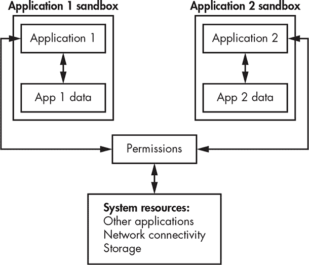
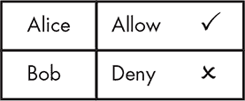
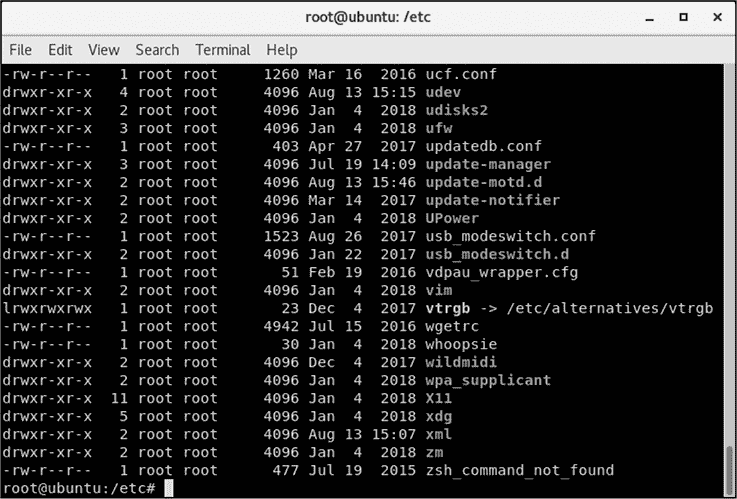
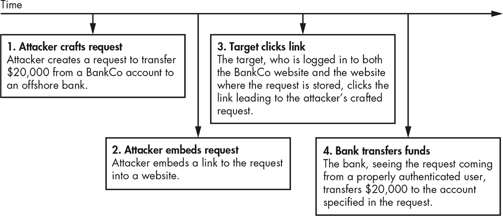
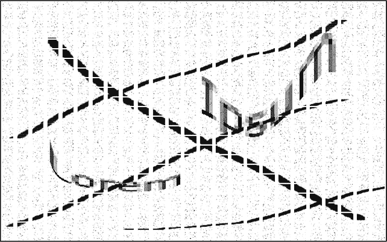
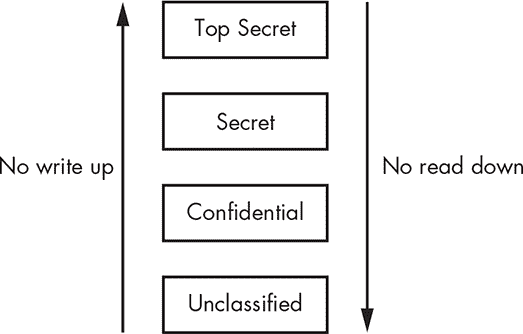
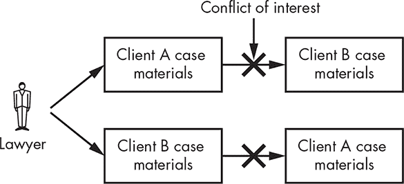

## 第三章：授权与访问控制

在你接收到一方的身份声明并确认该声明是否有效后，正如在第二章中讨论的那样，你必须决定是否允许该方访问你的资源。你可以通过两个主要概念来实现这一点：授权和访问控制。*授权*是确定一个经过身份验证的方可以做什么的过程。你通常会使用*访问控制*来实施授权，它们是你用来拒绝或允许访问的工具和系统。

你可以根据物理属性、规则集、个人或系统列表，或其他更复杂的因素来设定访问控制。对于逻辑资源，你可能会发现简单的访问控制已在日常应用程序和操作系统中实现，而在军事或政府环境中，则会有更加复杂的多层次配置。在本章中，你将更详细地了解访问控制，并学习一些实现方法。

### 什么是访问控制？

虽然*访问控制*这个术语听起来可能很技术化，似乎只属于高安全性的计算设施，但我们每天都在处理访问控制。

+   当你锁定或解锁你家门时，你正在使用一种基于钥匙的物理访问控制。（正如在第二章中讨论的那样，你的钥匙是你拥有的物品；在这种情况下，它们作为身份验证和授权的方式起作用。）

+   当你启动汽车时，你也很可能会使用钥匙。对于一些较新的汽车，你的钥匙可能还会包含一个额外的安全层，利用射频识别（RFID）标签，这些标签是储存在钥匙上的类似证书的标识符。

+   当你到达工作地点时，你可能会使用一个徽章（再次，是你拥有的物品）进入大楼。

+   当你坐在工作前的计算机前并输入密码（你知道的东西）时，你正在进行身份验证，并使用逻辑访问控制系统来访问你被授权使用的资源。

我们大多数人在工作、上学以及进行日常活动时，都会经常遇到类似的实现方式。

你可能希望使用访问控制来执行四个基本任务：允许访问、拒绝访问、限制访问和撤销访问。我们可以通过这四个动作来描述大多数访问控制问题或情况。

*允许访问*是指授予一方对特定资源的访问权限。例如，你可能想要给用户访问某个文件的权限，或者你可能想要允许一整个团队访问某个目录中的所有文件。你还可能通过给员工发放钥匙或徽章来允许他们对某个资源的物理访问。

*拒绝访问*是授予访问权限的反面。当你拒绝访问时，你是在阻止某方访问相关资源。你可能会基于时间来拒绝一个人尝试登录计算机的请求，或者你可能会阻止未经授权的人员在非工作时间进入大楼的大厅。许多访问控制系统默认设置为拒绝访问。

*限制访问*是仅允许对你的资源进行一定程度的访问。在物理安全方案中，你可能有一把可以打开建筑内任何门的主钥匙，一把只能打开少数几扇门的中级钥匙，以及一把只能打开一扇门的低级钥匙。当你使用可能暴露于攻击风险环境中的应用程序时，例如用于互联网的网页浏览器，你也可能会实现有限访问。

限制访问的一种方式是通过在*沙盒*中运行敏感应用程序，沙盒是为特定目的包含一组资源的隔离环境（图 3-1）。

*图 3-1：沙盒是一个隔离的环境，保护一组资源。*

我们使用沙盒来防止其内容访问文件、内存和其他不应互动的系统资源。沙盒对于隔离你无法信任的内容非常有用，比如来自公共网站的代码。沙盒的一个例子是用于运行 Java 编程语言编写程序的 Java 虚拟机（JVM）。JVM 专门构建以保护用户免受潜在恶意下载软件的攻击。

*撤销访问*是指在你授予某方访问权限后，收回该权限。能够撤销访问权限对系统的安全至关重要。例如，如果你解雇了一名员工，你会希望撤销他们可能拥有的任何访问权限，包括访问他们的电子邮件帐户、你的虚拟私人网络（VPN）和你的设施。当你处理计算机资源时，能够快速撤销对特定资源的访问可能尤其重要。

### 实施访问控制

实施访问控制的两种主要方法是使用访问控制列表和能力。这两种方法各有优缺点，并且在执行我们之前提到的四个基本任务时有不同的方式。

#### *访问控制列表*

*访问控制列表*（ACLs），通常读作“ackles”，是包含有关某些方在给定系统中可以访问权限类型的信息的列表。我们通常会看到 ACL 作为应用软件或操作系统的一部分实现，也可能在一些硬件设备的固件中看到它们的应用，例如网络基础设施设备。我们甚至可以看到 ACL 的概念扩展到物理世界，通过控制物理资源的软件系统，比如门禁控制系统的刷卡器。根据图 3-2 中的 ACL，Alice 被允许访问该资源，而 Bob 则被明确拒绝访问。

*图 3-2：一个简单的访问控制列表*

这可能看起来是个简单的概念，但在更大的实现中，ACL 可能变得相当复杂。组织通常使用 ACL 来控制其操作系统运行的文件系统中的访问权限，并控制其系统连接的网络中的流量。你将在本章中了解这两种类型的 ACL。

##### 文件系统 ACL

大多数文件系统中的 ACL 将有三种类型的权限（允许以特定方式访问特定资源的授权）：*读取*，允许用户访问文件或目录的内容；*写入*，允许用户写入文件或目录；*执行*，允许用户执行文件的内容，如果该文件包含能够在该系统上运行的程序或脚本。

一个文件或目录也可以附加多个 ACL。在类 UNIX 操作系统中，例如，给定的文件可能有针对特定用户或组的单独访问列表。系统可能会为某个特定用户（比如某个开发人员）提供特定的读取、写入和执行权限；为某个用户组（例如整个开发人员组）提供不同的读取、写入和执行权限；为任何其他经过身份验证的用户提供第三组读取、写入和执行权限。在基于 Linux 的操作系统中，你可以通过执行以下命令查看这三组权限：

ls -la

图 3-3 显示了系统中显示的这些权限。

*图 3-3：类 UNIX 操作系统上的文件权限*

图 3-3 中的每一行代表一个单独文件的权限。第一个文件*ucf.conf*的权限如下所示：

- r w - r - - r - -

这可能看起来有些晦涩。为了理解这些权限，帮助将它们分成以下几个部分：

- | r w - | r - - | r - -

第一个字符通常表示文件类型：`-`表示普通文件，`d`表示目录。第二部分表示拥有文件权限的*用户*，并设置为`r w -`，意味着用户可以读取和写入文件，但不能执行它。

第三个部分，*组*权限，被设置为`r - -`，这意味着被授予文件所有权的组成员可以读取文件，但不能写入或执行它。最后一个部分，*其他*，也被设置为`r - -`，这意味着任何既不是文件所有者也不是文件所有组成员的人，也可以读取文件，但不能写入或执行它。在 Linux 中，用户权限只适用于单个用户，而组权限则适用于单个组。

通过使用文件权限集，你可以控制访问使用你文件系统的操作系统和应用程序。大多数文件系统使用类似于描述的系统来分配权限。

##### 网络访问控制列表

如果你查看网络上发生的各种活动，无论是私有的还是公共的，你会注意到 ACL 在调节这些活动。在网络 ACL 中，你通常基于用于网络事务的标识符来过滤访问，例如互联网协议（IP）地址、媒体访问控制（MAC）地址和端口。你可以在网络基础设施中看到这些 ACL 的应用，例如路由器、交换机和防火墙设备，也可以在软件防火墙、Facebook、Google 等网站、电子邮件和其他软件形式中看到。

网络访问控制列表（ACL）中的权限通常是二进制的；它们通常不是读、写和执行权限，而是允许或拒绝某些活动。与用户不同，网络 ACL 通常将权限授予流量。例如，在设置 ACL 时，你使用选择的标识符来指明你指的是什么流量以及该流量是否被允许。最好依赖多个标识符来过滤流量，原因稍后会解释。

*媒体访问控制* 地址过滤是最简单的网络面向 ACL 之一。媒体访问控制地址是硬编码到每个系统中网络接口的唯一标识符。

不幸的是，大多数操作系统中的软件设置可以覆盖网络接口的媒体访问控制地址（MAC 地址）。更改这个地址很容易，因此它不是用作网络中设备唯一标识符的一个好选择。

你也可以改用 *IP 地址*。理论上，IP 地址是分配给任何使用互联网协议进行通信的网络中每个设备的唯一地址。你可以基于单个地址或整个 IP 地址范围进行过滤。例如，你可以允许 10.0.0.2 到 10.0.0.10 之间的 IP 地址通过流量，但拒绝 10.0.0.11 及以上的任何流量。不幸的是，像媒体访问控制地址一样，你可以伪造 IP 地址，而且它们并不唯一指向某个网络接口。此外，由互联网服务提供商发放的 IP 地址经常变化，因此仅以 IP 地址作为过滤的唯一依据是一个不太可靠的选择。

**黑洞**

一些组织，比如运营 web 服务器、邮件服务器和其他暴露在互联网上的服务的组织，会进行大规模过滤，以阻挡已知的攻击、垃圾邮件发送者和其他不良流量。这种过滤可能包括丢弃来自单个 IP 地址、IP 地址范围或大型组织、互联网服务提供商，甚至整个国家的 IP 空间的流量。这种做法通常被称为*黑洞*，因为从用户的角度来看，发送到被过滤目的地的任何流量似乎已经消失在了黑洞中。

过滤流量的第三种方式是根据用于网络通信的*端口*。网络端口是连接两个设备的一方的数字标识，我们使用它们来识别流量应路由到的应用程序。许多常见的服务和应用程序使用特定的端口。例如，FTP 使用 20 和 21 端口传输文件，互联网邮件访问协议（IMAP）使用 143 端口管理电子邮件，安全外壳（SSH）使用 22 端口管理远程连接到系统。还有很多其他例子，因为总共有 65,535 个端口。

你可以通过允许或拒绝来自任何你希望管理的端口的流量，来控制许多应用程序在网络上的使用。然而，像媒体访问控制地址和 IP 地址一样，应用程序使用的特定端口是约定，而非绝对规则。你可以相对轻松地将应用程序使用的端口更改为完全不同的端口。

正如你刚才看到的，如果你仅使用单一属性来构建网络 ACL，你很可能会遇到各种问题。如果你使用的是 IP 地址，你的属性可能不一定是唯一的。如果你使用的是媒体访问控制地址，你的属性很容易被篡改，而如果你使用端口，你则依赖于约定而非规则。

当你结合多个属性时，你将开始采用更安全的技术。例如，常见的做法是同时使用 IP 地址和端口，这种组合通常被称为*套接字*。使用套接字，你可以以一种可行的方式，允许或拒绝来自一个或多个 IP 地址的流量，以及网络中一个或多个应用程序的流量。

你还可以构建 ACL 以基于各种其他标准进行过滤。在某些情况下，你可能希望基于更具体的信息来允许或拒绝流量，比如单个数据包的内容或一系列相关数据包。使用这种技术，你可以，例如，过滤掉与非法共享版权材料相关的网络流量。

##### ACL 系统的弱点

使用 ACL（访问控制列表）管理权限的系统容易受到一种被称为*混淆代理问题*的攻击。这种问题发生在具有访问资源权限的软件（代理）拥有比控制该软件的用户更高的访问权限时。如果你能够欺骗软件误用其更高的权限，就可能实施攻击。¹

有几种攻击实际利用了混淆代理问题。这些攻击通常涉及欺骗用户去执行某些操作，而用户实际上认为自己在做完全不同的事情。许多此类攻击是*客户端*攻击，利用了运行在用户计算机上的应用程序中的弱点。这些攻击可能是通过网页浏览器发送并在本地计算机上执行的代码、格式错误的 PDF 文件，或嵌入攻击代码的图片和视频。近年来，软件供应商越来越意识到此类攻击，并开始在软件中构建防御措施，但新的攻击仍然不断出现。利用混淆代理问题的两种常见攻击是跨站请求伪造（CSRF）和点击劫持。

*CSRF* 是一种滥用浏览器在用户计算机上的权限的攻击。如果攻击者知道或能够猜到一个已经验证过用户身份的网站——比如一个常见网站，如[Amazon.com](http://Amazon.com)——他们可以在网页或基于 HTML 的电子邮件中嵌入一个链接，通常指向由攻击者控制的站点托管的图像。当目标的浏览器尝试检索该链接中的图像时，它也会执行攻击者嵌入的附加命令，通常这种行为对于目标是完全不可见的。

在图 3-4 的示例中，攻击者嵌入了一个请求，将资金从 BankCo 的账户转移到攻击者的离岸账户。由于 BankCo 服务器将请求视为来自已验证和授权的用户，因此它继续执行转账。在这种情况下，混淆代理是银行服务器。

*图 3-4：CSRF 攻击示例*

*点击劫持*（也称为*用户界面伪装*）是一种特别狡猾且有效的客户端攻击，它利用了现代网页浏览器中某些页面渲染功能。为了实施点击劫持攻击，攻击者必须合法地控制或已经控制了网站的某部分。攻击者通过在客户端通常会点击的内容上方放置一个不可见的层来构造或修改网站。这会导致客户端执行与他们认为自己正在执行的操作不同的命令。你可以使用点击劫持欺骗客户端进行购物、改变应用程序或操作系统的权限，或执行其他不希望的操作。

#### *功能*

与 ACL（访问控制列表）基于给定资源、身份和一组权限来定义权限不同，你也可以基于用户的*令牌*或密钥来定义权限，这也被称为*能力*。尽管在大多数情况下令牌不是物理对象，但你可以将其看作是你用来开门的门禁卡。大楼只有一扇门，许多人拥有能够打开它的令牌，但每个人的访问级别不同。一个人可能只能在工作日的工作时间进入大楼，而另一个人则可能有权限在任何一天、任何时间进入大楼。

在基于能力的系统中，访问资源的权限完全依赖于拥有令牌，而不是*谁*拥有它。如果你把你的门禁卡给别人，他就能使用它以你拥有的权限进入大楼。当涉及到逻辑资产时，应用程序可以与其他应用程序共享它们的令牌。

如果你使用能力而不是 ACL 来管理权限，你就可以防范混淆代理攻击。你之前学习的 CSRF 和点击劫持攻击都不可能发生，因为攻击者无法滥用用户的权限，除非他们能够访问用户的令牌。

### 访问控制模型

*访问控制模型*是确定谁应该被允许访问哪些资源的一种方法。现存有多种不同的访问控制模型。这里讨论的最常见的几种包括自主访问控制、强制访问控制、基于规则的访问控制、基于角色的访问控制、基于属性的访问控制和多级访问控制。

#### *自主访问控制*

在*自主访问控制*（DAC）模型中，资源的拥有者决定谁可以访问该资源以及他们可以拥有什么级别的访问权限。你可以在大多数操作系统中看到 DAC 的实现；例如，如果你决定在微软操作系统中创建一个网络共享，你就负责管理他人对它的访问。

#### *强制访问控制*

在*强制访问控制*（MAC）模型中，资源的拥有者无法决定谁可以访问该资源。相反，另一个独立的团体或个人有权设置对资源的访问权限。你通常可以在政府组织中找到 MAC 的实现，其中对特定资源的访问在很大程度上取决于应用于该资源的敏感性标签（例如，机密或绝密）、个人允许访问的敏感信息的级别（可能只有机密级别），以及个人是否确实有必要访问该资源（这一概念称为*最小权限原则*，在框中讨论）。

**最小权限原则**

最小权限原则规定，应该只给予一个方所需的最低访问权限，以执行其功能。例如，在一个组织的销售部门工作的人，不需要访问组织内部人力资源系统中的数据来完成工作。违反最小权限原则是我们今天面临的许多安全问题的根源。

最小权限原则实施不当的常见方式之一是操作系统用户账户的权限设置。尤其在微软操作系统中，你经常会发现，执行诸如在文字处理软件中创建文档和交换电子邮件等任务的普通用户，配置了管理员访问权限，这使得他们能够执行操作系统允许的任何任务。

因此，每当权限过高的用户打开包含恶意软件的电子邮件附件，或者访问一个向客户端计算机推送攻击代码的网站时，这些攻击就能在系统中自由肆虐。攻击者可以轻松关闭反恶意软件工具，安装任何他们想要的攻击工具，并继续完全破坏系统。

#### *基于规则的访问控制*

*基于规则的访问控制*允许根据系统管理员定义的一组规则来进行访问控制。如果规则匹配，则会相应地授予或拒绝对资源的访问。

基于规则的访问控制的一个好例子是路由器使用的访问控制列表（ACL）。你可能会看到一条规则，指定来自源 A 到目标 B、端口 C 上的流量是允许的。其他任何设备之间的流量都会被拒绝。

#### *基于角色的访问控制*

*基于角色的访问控制*（RBAC）模型允许根据授予访问权限的个人角色来进行访问控制。例如，如果你有一个员工，他的唯一职责是向应用程序中输入数据，RBAC 将要求你仅允许该员工访问该应用程序。

如果你有一个角色更复杂的员工——比如一家在线零售商的客户服务人员——该员工的角色可能要求他访问有关客户支付状态和信息、发货状态、历史订单和退货的信息。在这种情况下，RBAC 将授予他更多的访问权限。你可以在许多大型应用程序中看到 RBAC 的实现，这些应用程序主要面向销售或客户服务。

#### *基于属性的访问控制*

*基于属性的访问控制*（ABAC）基于个人、资源或环境的特定属性。你经常可以在基础设施系统中看到它的实施，例如网络或电信环境中的系统。

*主体属性*属于个人。我们可以选择任意数量的属性，例如经典的“你必须达到这个高度才能乘坐”的游乐园访问控制中的身高。另一个常见的主体属性示例是*验证码*，即“完全自动化的公共图灵测试，用于区分人类和计算机”（图 3-5）。²验证码基于对方能否通过一个（理论上）对于机器来说过于困难的测试来控制访问。

*图 3-5：一个验证码，旨在证明用户是人类*

*资源属性*属于某个资源，如操作系统或应用程序。你常会看到访问被资源属性控制，虽然通常这是出于技术原因而非安全原因；一些软件仅在特定操作系统上运行，一些网站只与特定浏览器兼容。你可以通过要求某人使用特定软件或协议进行通信来作为一种安全措施，应用这种类型的访问控制。

你可以使用*环境属性*来根据环境条件启用访问控制。人们通常利用时间来控制对物理和逻辑资源的访问。例如，建筑物的访问控制通常只在办公时间内允许访问。许多 VPN 连接有时间限制，强制用户每 24 小时重新连接，以防止用户在授权使用后继续保持连接。

#### *多级访问控制*

*多级访问控制*模型结合了本节中讨论的几种访问控制模型。当更简单的访问控制模型不足以保护你所控制的访问数据时，通常会使用这些多级访问控制模型。军队和政府组织处理敏感数据时，通常使用多级访问控制模型来控制对各种数据的访问，从核秘密到受保护的健康信息。接下来你将了解其中的几个模型。

##### 贝尔-拉帕杜拉模型

*贝尔-拉帕杜拉*模型结合了自主访问控制（DAC）和强制访问控制（MAC），主要关注资源的保密性——换句话说，确保未经授权的人无法读取该资源。通常，在这两种模型一起实施时，MAC 优先于 DAC，而 DAC 在 MAC 权限允许的访问范围内工作。

例如，你可能有一个被分类为机密的资源，并且有一个具有机密级别权限的用户；在强制访问控制（MAC）模型下，用户将有权访问该资源。然而，你可能还在 MAC 访问控制下增加了 DAC（自主访问控制）的层次，因此如果资源所有者没有授予该用户访问权限，即使有 MAC 权限，用户也无法访问该资源。在贝尔–拉帕杜拉模型中，有两个安全属性定义了信息如何流入和流出资源。³

**简单安全属性** 对个人授予的访问权限必须至少与资源的分类等级相同，才能允许个人访问该资源。换句话说，个人不能读取分类级别较高的资源，但可以读取分类级别较低的资源。

**星号属性（或星号属性）** 任何访问资源的人只能将其内容写入（或复制到）另一个与该资源分类相同或更高的资源中。

你可以将这些属性总结为“禁止向上读取”和“禁止向下写入”，如图 3-6 所示。

*图 3-6：贝尔–拉帕杜拉模型*

简而言之，这意味着在处理机密信息时，你不能读取高于自己权限级别的内容，也不能将机密数据写入低于自己权限级别的资源中。

##### 比巴模型

*比巴*访问控制模型主要关注保护数据的完整性，即使这可能以牺牲机密性为代价。这意味着，防止人们篡改数据比防止人们查看数据更为重要。比巴模型有两个安全规则，正好与贝尔–拉帕杜拉模型中的规则相反。⁴

**简单完整性公理** 对个人授予的访问权限必须至少与资源的分类等级相同。换句话说，访问一个级别的权限不会授予访问较低级别的权限。

**星号完整性公理（或星号完整性公理）** 任何访问资源的人只能将其内容写入或复制到与该资源分类相同级别或更低级别的资源中。

我们可以将这些规则总结为“禁止向下读取”和“禁止向上写入”，如图 3-7 所示。这意味着高完整性的资产（即不应被修改的资产）和低完整性的资产应严格分开。

*图 3-7：比巴模型*

这在保护信息方面可能显得完全违反直觉。然而，这些原则通过确保资源只能由具有高级访问权限的人员进行写入，并且具有高级访问权限的人员不会访问低分类别的资源，从而保护了完整性。考虑一个组织，既执行一个低完整性的过程来收集（可能带有恶意的）PDF 上传文件，也执行一个高完整性的过程来扫描来自高度机密系统的文档输入。在 Biba 模型中，上传过程无法将数据发送到扫描过程，因此无法破坏机密输入；此外，扫描过程即使被指向，也无法访问低级别的数据。

##### 布鲁尔与纳什模型

*布鲁尔与纳什*模型，也称为*中国墙*模型，是一种访问控制模型，旨在防止利益冲突。布鲁尔与纳什模型广泛应用于处理敏感数据的行业，如金融、医疗或法律行业。该模型考虑了三种主要的资源类别。⁵

+   *对象*：与单一组织相关的资源，例如文件或信息

+   *公司组*：与某一组织相关的所有对象

+   *冲突类别*：所有涉及竞争方的对象组

一家代表某一行业公司进行商业法律事务的律师事务所，可能拥有涉及各个竞争个人和公司的文件。由于该事务所的个人律师访问不同客户的文件，律师可能会接触到机密数据，从而产生利益冲突。在布鲁尔与纳什模型中，律师被允许访问的资源和案件材料的访问级别将根据之前访问的材料动态变化（参见图 3-8）。

*图 3-8：布鲁尔与纳什模型*

在这个例子中，当律师查看了客户 A 的案件材料后，律师将无法再访问涉及客户 B 或任何与当前客户竞争的其他方的信息，从而解决了利益冲突问题。

### 物理访问控制

到目前为止，你已经看过了逻辑示例，以说明本章讨论的访问控制概念，但许多这些方法同样适用于物理安全。现在让我们来看一些相关的示例。

物理访问控制通常关注的是控制个人和车辆的流动。对个人的访问控制通常通过管理他们进出建筑物或设施的权限，通常使用可以开启设施大门的徽章（你拥有的东西，参见第二章）。使用徽章的门禁控制系统，通常会在运行它们的软件中使用访问控制列表（ACL）来允许或拒绝某些门和时间段的访问。

管理人员进入建筑物的一个常见安全问题是*尾随*，即当你认证了自己的物理访问控制措施（如徽章）后，另一个人紧随其后而没有经过认证。尾随可能导致各种问题，包括在紧急情况下造成建筑物内人员的错误表示。

我们可以通过多种方式尝试解决尾随问题，包括实施禁止尾随的政策、在区域内派驻守卫，或者简单地（但昂贵地）安装物理访问控制解决方案，只允许一个人一次通过，例如旋转门。所有这些都是合理的解决方案，但根据具体环境的不同，它们可能有效，也可能无效。你会发现，通常结合多种解决方案的效果要优于单一方案。

物理访问控制的一个更复杂的例子是许多机场使用的安全系统。在 2001 年 9 月 11 日美国的恐怖袭击事件之后，机场的安全级别提高了。一旦进入机场安全系统，你需要出示登机牌和身份证明（即你拥有的物品，两项）。你通常需要经过多个步骤，以确保你没有携带任何危险物品——这是一种基于属性的访问控制。然后你前往登机口，再次出示登机牌后才能登机。根据不同国家的情况，这些过程可能略有不同，但从访问控制的角度来看，通常是相似的。

车辆的物理访问控制通常围绕着阻止这些车辆进入未经授权的区域，通常使用各种简单的障碍物，包括杰西屏障（图 3-9）、防撞柱、单向刺条和围栏。你还可能看到更复杂的设施，包括有或没有工作人员的升降障碍、自动化的门或门禁以及其他类似的控制措施。

*图 3-9：杰西屏障*

当然，还有大量其他物理访问控制和方法。此外，在提到物理访问控制设备或访问控制时，身份验证设备和访问控制设备之间的界限常常变得模糊，甚至完全重叠。例如，物理锁的钥匙可以被视为身份验证、认证和授权，同时也是物理访问控制的一部分。通常，即使在安全领域内，这些术语也会被不准确或不恰当地使用，这无助于问题的解决。

### 摘要

授权是允许各方访问资源的关键步骤——换句话说，就是身份识别、认证和授权过程。你通过使用访问控制来实现授权。通常，你使用两种访问控制方法之一：访问控制列表（ACL）或能力（Capabilities）。尽管能力可以防止混淆代理攻击，但它们的实现频率远低于应有的程度。

在建立访问控制系统时，你会使用一种访问控制模型来规定应该授予哪些资源的访问权限。在我们的日常生活中，我们常常遇到一些更简单的访问控制模型，如自主访问控制（DAC）、强制访问控制（MAC）、基于角色的访问控制（RBAC）和基于属性的访问控制（ABAC）。处理更敏感数据的环境，如政府、军事、医疗或法律行业，通常使用多级访问控制模型，包括 Bell-LaPadula、Biba 以及 Brewer 和 Nash。

下一章将讨论审计与问责制，这指的是在完成身份识别、认证和授权过程后，如何追踪已发生的活动。

### 练习

1.  讨论授权和访问控制之间的区别。

1.  Brewer 和 Nash 模型保护什么内容？

1.  为什么基于网络中系统的媒体访问控制（MAC）地址的访问控制无法代表强大的安全性？

1.  在授权和认证之间，应该先进行哪一项？

1.  MAC 和 DAC 访问控制模型之间有什么区别？

1.  Bell-LaPadula 和 Biba 多级访问控制模型都有一个主要的安全重点。这两个模型可以一起使用吗？

1.  如果你在 Linux 操作系统上有一个包含敏感数据的文件，设置权限为 `rw-rw-rw-` 会导致潜在的安全问题吗？如果会，CIA 三位一体中的哪些部分可能会受到影响？

1.  你可以使用哪种访问控制模型来防止用户在非工作时间登录他们的账户？

1.  解释一下混淆代理问题是如何允许用户执行他们未被授权进行的操作的。

1.  访问控制列表和能力之间有哪些区别？
