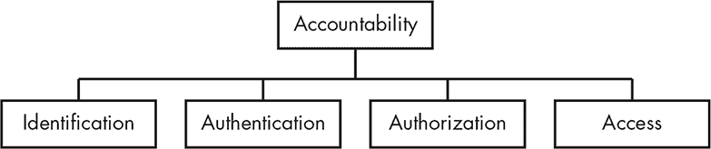
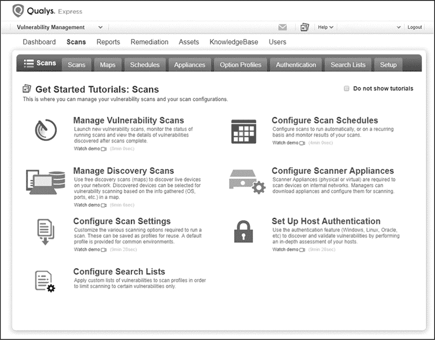

## 4

审计与问责制

在你成功完成身份识别、认证和授权流程（或即使在你还在进行这些流程时），你需要跟踪组织内的活动。即使在你允许某方访问你的资源之后，你仍然需要确保他们的行为符合你的规则，特别是那些涉及安全、业务行为和伦理的规则。本质上，你需要确保能够追究系统用户的*问责责任*（图 4-1）。

*图 4-1：你应该始终让用户承担责任。*

让某人*承担责任*意味着确保这个人对自己的行为负责。在如今，大多数组织将大量信息存储为数字形式的背景下，这一点尤为重要。如果你没有跟踪人员如何访问存储的敏感数据，你可能会遭遇商业损失、知识产权盗窃、身份盗窃和欺诈行为。此外，数据泄露可能会给你的组织带来法律后果。例如，一些类型的数据——如医疗和财务数据——在多个国家受到法律保护；在美国，有两部著名的法律，分别是 1996 年的《健康保险可携性与问责法案》（HIPAA），该法案保护医疗信息，以及 2002 年的《萨班斯-奥克斯利法案》，该法案防止企业欺诈。

你为确保问责制而采取的许多措施是*审计*的例子，审计是审查一个组织记录或信息的过程。你进行审计是为了确保人们遵守法律、政策以及其他行政控制机制。审计还可以防止攻击，例如信用卡公司记录并审计你通过账户进行的购买。如果你决定在一天内购买六台笔记本电脑，你的异常行为可能会触发公司监控系统中的警报，公司可能会暂时冻结你用卡进行的任何购买。在本章中，你将更详细地了解问责制，并看到如何利用审计来执行这一点。

### 问责制

要让人们对自己的行为负责，你必须追溯所有活动的源头。这意味着你需要使用身份识别、认证和授权流程，以便你知道某个事件与谁相关，以及什么权限允许他们执行该操作。

批评问责制及其相关的审计工具是很容易的。你可以认为，实施监控技术就像是大哥在你肩膀上盯着你。在某种程度上，这确实是对的；如果你过度监控人们，可能会创造一个不健康的环境。

但是，你也可能会走得过远。如果你没有足够的控制措施来阻止或防止他人违反你的规则并滥用你的资源，你最终会面临安全灾难。**EQUIFAX 数据泄露**就是一个这样的例子。

**EQUIFAX 数据泄露**

2017 年，Equifax 的股东、董事会、审计员以及美国政府未能追究 Equifax 未能保护消费者个人和财务信息的责任。因此，攻击者盗取了涉及 1.47 亿美国人数据的资料，而 Equifax 几乎没有受到任何后果，除了股价短暂下跌。尽管 Equifax 被召唤到国会作证，立法者表示他们将因这一事件而制定新法规，但 Equifax 没有面临任何后果，国会也没有就此通过任何新法律。

数据泄露发生在攻击者利用 Apache Struts2 框架中的一个漏洞（标记为 CVE-2017-5638）时，该框架用于开发面向 Web 使用的 Java 应用程序。这个漏洞使得攻击者能够在相关的 Web 服务器上执行远程代码执行（RCE），从而在 Equifax 环境中建立立足点。在攻击发生时，Equifax 已经有了针对该漏洞的解决方案，但尚未实施。

尽管截至 2018 年秋季，Equifax 尚未公开披露数据泄露的具体细节（除了最初的入侵情况），我们可以推测，由于攻击者能够侵入一个面向互联网的服务器并访问 Equifax 客户的个人身份信息，系统中存在明显的安全漏洞；例如，Equifax 可能没有将包含敏感数据的服务器进行隔离，或者可能使用了不良的访问控制等问题。（美国政府问责办公室发布了一份报告，确认了这些类型的问题。¹）

尽管外部机构可能会促使责任追究，但遵守这些要求的动力必须来自你所在的组织。例如，当一家公司在美国发生数据泄露时，法律通常要求其通知那些信息被泄露的人。截至 2018 年 3 月，美国所有 50 个州都已通过了泄露披露法。²

然而，在许多情况下，公司外的人通常在公司通知直接相关人员之前并不知道数据泄露的事件。在这种情况下，你可以理解为何一个组织可能会不透露该事件的原因。然而，如果你不遵守法律要求，你最终可能会被发现。当这种情况发生时，你将面临比第一次就正确处理事件时更严重的个人、商业和法律后果。

### 责任的安全益处

当你让人们对自己的行为负责时，你可以通过几种方式保持环境的安全：通过实施一种叫做不可否认性的原则，通过威慑那些本可能滥用资源的人，以及通过检测和防止入侵。确保责任制的过程还可以帮助你为法律程序准备材料。

#### *不可否认性*

*不可否认性*指的是一种情况下，个人无法成功否认自己已作出某种声明或采取过某种行动，通常是因为我们有足够的证据证明他们确实做了。在信息安全环境中，你可以通过多种方式实现不可否认性。你可能能够直接从系统或网络日志中获取活动的证据，或通过数字取证检查系统或涉及设备来恢复这些证据。

你还可以通过加密技术，如哈希函数，来建立不可否认性，通过数字签名来验证通信或文件的真实性。你将在第五章中学习更多关于加密的方法。另一个例子是，当系统为每封发送的电子邮件进行数字签名时，任何人都无法否认该电子邮件来自该系统。

#### *威慑*

责任制也可以成为对环境中不当行为的强大*威慑*。如果人们意识到你正在监控他们，并且你已告知他们违反规则将会受到惩罚，个体在越界之前可能会三思而后行。

威慑的关键在于让人们知道他们将对自己的行为负责。你通常通过审计和监控过程来实现威慑，这两者都在本章的“审计”部分有所讨论。如果你没有明确表达你的意图，威慑的效果将大打折扣。

例如，如果作为监控活动的一部分，你跟踪员工进出设施的门禁时间，你可以将这些活动与员工每周在时间卡上提交的时间进行核对，从而防止员工伪造时间卡，骗取额外的、不应得的工资。由于员工知道会进行这样的交叉核对，他们就会被威慑住，避免在时间卡上撒谎。虽然这看起来可能有些侵扰，但大公司通常会在员工人数较多且需要按特定班次工作的情况下使用这种方法，像是技术支持服务台。

#### *入侵检测与防御*

当你审计环境中的信息时，可以在逻辑和物理层面上检测和防止入侵。如果你实施基于异常活动的警报，并定期检查你记录的信息，你就有更大的机会发现正在进行的攻击以及未来攻击的先兆。

尤其是在逻辑领域，攻击可以在瞬间发生，你还应该实施自动化工具来监控系统，并在出现任何异常活动时提醒你。你可以将这些工具分为两大类：入侵检测系统（IDS）和入侵防御系统（IPS）。

IDS 严格来说是一个监控和警报工具；当发生攻击或其他不良活动时，它会通知你。IPS 通常基于来自 IDS 的信息，可以根据环境中发生的事件采取行动。为了应对网络上的攻击，IPS 可能会拒绝来自攻击源的流量。第十章和第十一章将更详细地讨论 IDS 和 IPS。

#### *记录的可接受性*

当你试图将记录引入法律环境时，如果它们是由受监管且一致的追踪系统生成的，它们更有可能被接受。例如，如果你计划提交数字取证证据用于法院案件，你可能需要提供一个坚实且有记录的*证据链*，以便法院接受。这意味着你需要能够追踪证据的信息，例如证据在时间上的位置、它是如何从一个人传递给另一个人的，以及它在存储时如何被保护。

你的证据收集追责方法应当确保证据链不被中断。如果没有，证据可能最多只能被视为传闻，从而大大削弱你的案件。

### 审计

*审计*是一种有系统的检查和审查组织记录的方法。³ 在几乎任何环境中，从最低级别的技术到最高级别的技术，通常通过某种审计方式确保人们对自己的行为负责。

确保通过技术手段追责的主要方法之一是准确记录谁做了什么，何时做的—然后检查这些记录。如果你没有评估活动的能力，你将无法大规模地促进追责。特别是在大型组织中，你的审计能力直接等同于你能够让任何人对任何事情负责的能力。

你也可能会受制于合同或法规要求，要求你定期接受审计。在许多情况下，这种审计是由不相关且独立的第三方执行的，这些第三方被认证并授权执行此类任务。一个很好的例子是由《萨班斯–奥克斯利法案》强制执行的审计，它确保公司诚实地报告其财务结果。

#### *你审计什么？*

在信息安全领域，组织通常会审计决定访问其各类系统的因素。例如，你可能会审计密码，以便执行关于如何构造和使用密码的政策。如第二章所述，如果你没有以安全的方式构造密码，攻击者可以轻松破解它们。你还应该验证用户更改密码的频率。在许多情况下，系统可以自动检查密码强度并管理密码更改，利用操作系统或其他实用工具中的功能。你还需要审计这些工具，以确保它们正常工作。

组织通常还会审计软件许可证。你使用的软件应该有许可证，证明你是合法获取的。如果外部机构审计你并发现你运行了大量未授权的软件，财务处罚可能会非常严厉。最好在收到外部公司通知之前，自己先找出并纠正这些问题。

商业软件联盟（BSA）就是一家代表软件公司（例如 Adobe 或 Microsoft）工作的公司。它定期审计其他组织，确保它们遵守软件许可。与 BSA 的法律和解可能导致每次未授权软件的事件罚款高达 250,000 美元⁴，此外还需支付最高 7,500 美元的 BSA 法律费用。BSA 还通过提供最高 100 万美元的奖励来鼓励举报者，奖励那些举报违规行为的人⁵。

最后，组织通常会审计互联网使用情况，包括员工访问的网站、即时消息、电子邮件和文件传输。在许多情况下，组织已配置代理服务器，将所有此类流量通过少数几个网关，从而能够记录、扫描并可能过滤这些流量。这些工具可以让你准确检查员工如何使用这些资源，遇到滥用行为时可以采取措施。

#### *日志记录*

在你审计某些内容之前，必须先创建审查记录。*日志记录*为你提供了在环境中发生的活动历史。通常，你会在操作系统中自动生成日志，以跟踪在大多数计算、网络和电信设备上，以及在集成或连接到计算机的设备上发生的活动。日志记录是一个*反应性*工具；它允许你查看事件发生后的记录。要对发生的事情立即做出反应，你需要使用像 IDS 或 IPS 这样的工具，相关内容将在第十章中详细介绍。

通常，你会配置日志记录机制，只记录关键事件，但你也可以记录系统或软件执行的每一个操作。你可能会出于故障排除的目的进行这种操作。日志可能包括软件错误、硬件故障、用户登录或注销、资源访问和需要更高权限的任务等事件记录，具体取决于日志设置和相关系统。

通常，只有系统管理员可以查看日志。通常，系统用户无法修改日志，除非是写入日志。例如，在特定用户上下文下运行的应用程序通常有权限向系统或应用程序日志写入消息。请记住，收集日志而不查看它们是毫无意义的。如果你从不查看日志内容，那么收集它们就等同于没有收集它们。定期检查日志，以便发现其中任何不寻常的内容，是非常重要的。

在正常的安全工作中，你也可能被要求分析日志内容与某个事件或情况的关系。在调查、事件处理和合规检查的情况下，这类活动通常由安全人员执行。如果涉及的时间段超过几天，查看日志可能会是一个艰巨的任务。即使是搜索一个相对简单的日志内容，比如由网络代理服务器生成的日志，也可能需要筛选大量的数据。在这种情况下，自定义脚本甚至是 grep 等工具（一个用于文本搜索的 UNIX 和 Linux 工具）可以帮助你在合理的时间内完成任务。

#### *监控*

审计的一个子集，*监控*是观察环境信息以发现不良情况，如故障、资源短缺和安全问题，以及可能预示这些情况到来的趋势。像日志记录一样，监控在很大程度上是一个反应性活动；它根据收集到的数据采取行动，通常是来自各种设备生成的日志。即使你试图预测未来的事件，你仍然依赖过去的数据来实现这一点。

在监控系统时，通常会关注特定类型或模式的数据，比如计算机上资源使用量的增加、异常的网络延迟（即数据包从一个点传输到另一个点的时间）、不断发生的针对暴露在互联网上的网络接口的服务器攻击、在不寻常的时间段通过物理访问控制的流量等等。

当你检测到这种活动的异常水平，称为*裁剪级别*时，你的监控系统可能会向系统管理员或物理安全人员发送警报，或者可能采取更直接的行动，如从特定 IP 地址阻止流量、切换到关键服务器的备份系统，或召唤执法人员。

#### *通过评估进行审计*

如前所述，日志记录和监控是反应性措施。为了更积极地评估你的系统状态，你可能会使用一种名为*评估*的审计方式，它是在攻击者做出攻击之前，发现并修复漏洞的测试。如果你能够成功且定期地进行评估，你将大大提高你的安全防御能力，并且有更大的机会抵抗攻击。你可以采取两种方法来实现这一目标：漏洞评估和渗透测试。尽管人们常常将这两个术语交替使用，但它们是两种截然不同的活动。

*漏洞评估* 通常涉及使用漏洞扫描工具，例如 Qualys，⁶，如图 4-2 所示，来查找环境中的弱点。这些工具通常通过扫描目标系统来发现开放端口，然后询问每个开放端口，了解它上面到底有哪些服务在监听。此外，如果你有凭证，还可以选择提供凭证，让漏洞扫描器对设备进行身份验证，并收集更多详细信息，例如安装的软件、系统上的用户以及文件中或与文件相关的信息。

*图 4-2：Qualys，漏洞扫描工具*

有了这些信息，漏洞评估工具便可以查询其漏洞信息数据库，判断系统是否可能包含任何弱点。尽管这些数据库通常很全面，但新的或不常见的攻击往往会逃避它们的注意。

*渗透测试* 将评估过程推进了几步。当你进行渗透测试时，你模拟实际攻击者入侵系统时使用的技术。你可能会尝试从用户或附近的其他系统收集更多关于目标环境的信息，利用基于网页的应用程序或与网页连接的数据库中的安全漏洞，或者通过应用程序或操作系统中未修补的漏洞进行攻击。

你将在第十四章中更详细地了解如何评估安全性。就像你可以采取的任何安全措施一样，安全评估应该仅是你整体防御策略的一个组成部分。

### 总结

对于几乎任何你可能想要执行的操作，某个系统都会创建相关的审计记录。组织会定期查询并更新你的病历、学业成绩、购物记录和信用历史，并利用这些数据做出可能影响你生活好坏的决策。

当你允许他人访问你企业的资源或敏感的个人信息时，你需要追究他们对资源或信息的使用责任。

你通过审计过程来追究人们的责任，并确保你的环境符合相关的法律、法规和政策。你可能会执行多种审计任务，包括日志记录、监控和评估。通过这些过程，你不仅能应对威胁，还能主动防范它们。

在下一章中，你将概述作为当今安全系统支柱的主要加密算法。

### 练习

1.  日志记录有什么好处？

1.  讨论授权和责任追究之间的区别。

1.  描述不可否认性。

1.  列出五项你可能想要审计的内容。

1.  处理敏感数据时，为什么责任追究很重要？

1.  为什么审计已安装的软件可能是一个好主意？

1.  在处理法律或监管问题时，为什么需要责任追究？

1.  漏洞评估和渗透测试有什么区别？

1.  责任追究对法院案件中证据的可采性有何影响？

1.  假设环境中包含处理敏感客户数据的服务器，其中一些暴露于互联网，你会选择进行漏洞评估、渗透测试，还是两者兼做？为什么？
