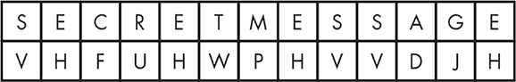
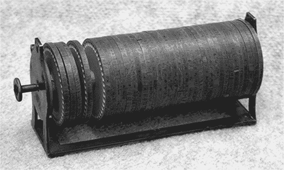
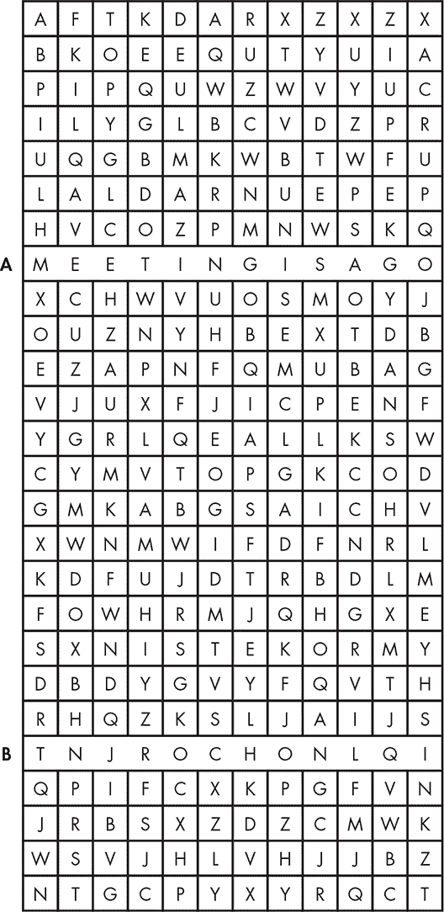
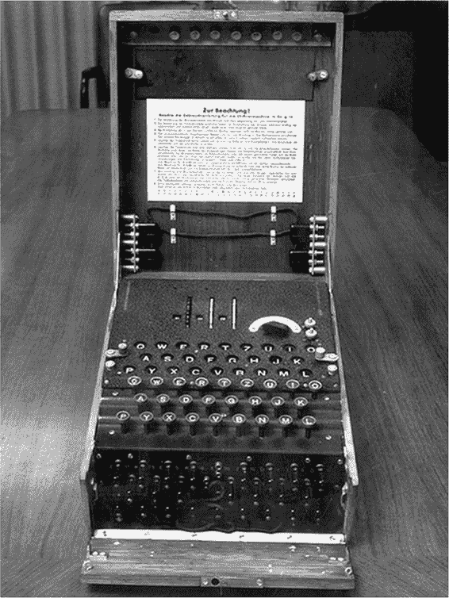
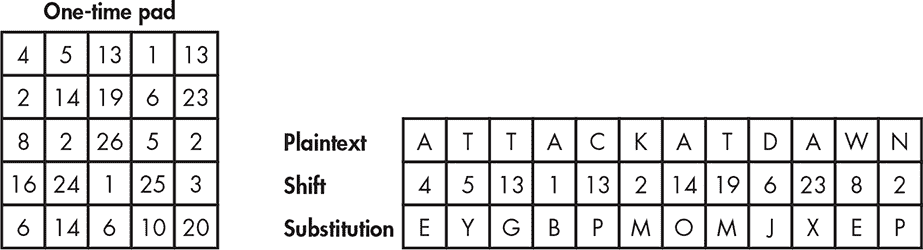
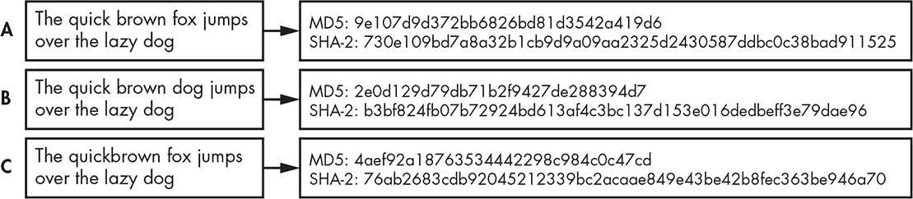
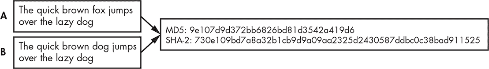
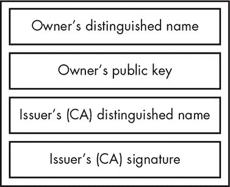

## 5

密码学

*密码学*是保护数据的机密性和完整性的科学，它是你日常通过设备进行大量交易的关键部分。你在用手机通话、查看电子邮件、在线购买商品以及报税等活动中都会用到密码学。如果没有保护你通过这些渠道发送信息的能力，你的互联网活动将变得更加危险。

在密码学中，*加密*是将可读数据（即*明文*或*清文*）转换为不可读的形式（即*密文*）的过程。*解密*是从密文中恢复明文的过程。你通过使用一种特定的计算程序，称为*密码算法*，来加密明文或解密密文。在本章中，你将探索几种此类算法的例子。密码算法通常使用*密钥*，或多个密钥来加密或解密消息。你可以把密钥看作是一个密码，通过它可以在算法中检索出消息。

在本章中，你将首先了解一些早期的密码学实例，然后深入探讨现代密码学实践。

### 密码学的历史

一些最古老的密码学实例可以追溯到古希腊和古罗马。为了隐藏信息，希腊人和罗马人使用了密码，还采用了非常规的方法，比如在信使的剃光头上刺入信息，然后让头发长出来。关于密码学的历史资料多得足以写成一本书，实际上已经有许多书籍涉及这一主题，因此我将仅介绍其中的几个亮点。

#### *凯撒密码*

凯撒密码，作为古代密码学的经典例子，据说曾被尤利乌斯·凯撒使用。凯撒密码的原理是将明文中的每个字母按照字母表中的位置向右移动一定的位数，历史上通常是三位，如图 5-1 所示。经过移动后，字母*A*变为*D*，字母*B*变为*E*，依此类推。为了破解密文，你需要将字母向相反方向移动相同的位数。

*图 5-1：使用凯撒密码加密短语“秘密消息”*

我们称这种类型的加密为*替代密码*，因为它将字母表中的每个字母替换为另一个字母。凯撒密码的一个更新变种是 ROT13 密码，它与凯撒密码使用相同的机制，但每个字母在字母表中向前移动 13 个位置。将每个字母移动 13 个位置使得消息便于解密，因为你只需要再应用一轮 ROT13 加密就能恢复原文；两轮加密后，每个字母将回到其字母表中的原始位置。执行 ROT13 的工具是许多 Linux 和 UNIX 操作系统中自带的基本工具之一。

#### *加密机器*

在现代计算机问世之前，人们使用机器来简化加密并使更复杂的加密方案成为可能。最初，这些设备是基本的机械机器，但随着技术的发展，它们开始加入电子元件，并且系统变得更加复杂。

杰斐逊圆盘是托马斯·杰斐逊在 1795 年发明的纯机械加密机器。它由 36 个圆盘组成，每个圆盘的边缘上标有从*A*到*Z*的字母，如图 5-2 所示。¹

每个圆盘代表消息中的一个字符。每个圆盘上的字母排列顺序不同，每个圆盘都标有独特的标识符，便于区分它们。

要加密消息，你需要将字符排列在一排，使其拼写出明文消息，就像在图 5-3 的 A 行那样。然后，你选择不同的一行字符作为密文，就像在 B 行所示。

*图 5-2：杰斐逊圆盘，最早的加密机器之一*

*图 5-3：使用杰斐逊圆盘加密“会议开始”消息*

该密码的关键在于圆盘的顺序。如果加密和解密设备以相同的顺序排列它们的圆盘，那么你所需要做的就是使用圆盘重新写出密文，然后查看所有行直到找到明文消息。当然，这只不过是替代密码的一个更复杂版本，通过机械辅助使得每个字母的替代方式都不同。

一个更复杂的加密机器实例是德国制造的恩尼格玛机（图 5-4）。² 恩尼格玛机由阿图尔·谢比乌斯于 1923 年设计，在第二次世界大战期间保护了德国的通讯。

*图 5-4：恩尼格玛机*

从概念上讲，恩尼格玛（Enigma）类似于杰斐逊圆盘（Jefferson Disk）。它基于一系列轮子或转子，每个转子上有 26 个字母和 26 个电气接触点。它还配有一个键盘，用于输入明文信息，以及一个位于键盘上方的 26 个字符的显示区，这些字符会亮起，以指示加密后的等效字符。当你在恩尼格玛的键盘上按下一个键时，一个或多个转子会物理旋转，改变它们之间电气接触点的方向。电流会通过整套圆盘，然后再次通过它们返回到原始圆盘，在键盘上方的字符显示区显示出每个字母的加密版本。

为了让两台恩尼格玛机器在战争期间进行通信，它们必须拥有相同的配置。这需要大量的工作，因为转子和每个转子上标有字母的环必须完全相同并处于相同的位置，任何插入的电缆也需要以相同的方式设置。一旦消息被加密，它将通过莫尔斯电码发送到接收端。当接收者收到加密的莫尔斯电码消息时，他们会在键盘上输入相应的字符，如果一切设置正确，解密后的字符就会亮起。

恩尼格玛机器有多个型号，并且可以附加各种配件和附加组件。一些型号还配有补丁面板，允许通过将电缆插入不同的位置来交换一些或所有字母。每个转子上的字母环也可以独立于电气接触点旋转，以改变选定字符与输出字符之间的关系。

由于设备本身的固有优势和解密所需配置的知识，恩尼格玛对于试图破解其生成消息的人来说是一项相当艰巨的任务。但是，设备的强大之处在于它的机密性以及用于特定消息的配置；这在安全领域被称为*通过模糊性确保安全*。一旦这些机密被暴露，加密的消息就不再那么安全了。

1939 年，当二战期间英国的破译基地——布莱切利公园的密码学家们获得一台恩尼格玛进行研究时，他们能够构建一个名为“博贝”（Bombe）的计算机，解码了大量德国的消息，尽管他们没有访问每日更新的恩尼格玛设置。

**关于恩尼格玛机器的更多信息**

对于那些有兴趣亲身体验经典密码学历史的人来说，可以通过多种方式与恩尼格玛（Enigma）进行互动。喜欢 DIY 的人可以购买一个套件，利用现代电子组件重现恩尼格玛的功能。³ 此外，还有各种基于软件的恩尼格玛模拟器。⁴ 这些模拟器特别有用，可以展示转子与通过它们的路径之间的关系，这些关系会随着每个字符的输入而变化。关于这个主题，已经写了很多书籍，其中一本特别优秀的是布赖恩·J·温克尔（Brian J. Winkel）、赛弗·德沃尔（Cipher Deavours）、大卫·坎（David Kahn）和路易斯·克鲁赫（Louis Kruh）合著的《德国恩尼格玛密码机：起源、成功与最终失败》。大卫·坎的《夺取恩尼格玛：破解德国 U 型潜艇密码的竞赛，1933-1945》是另一部详细介绍这一工作的优秀来源。

#### *凯尔科夫原则*

1883 年，《军事科学杂志》刊登了荷兰语言学家和密码学家奥古斯特·凯尔科夫（Auguste Kerckhoffs）的一篇文章，题为《军事密码学》。在这篇文章中，凯尔科夫概述了他认为应作为所有加密系统基础的六项原则。⁵

1.  系统必须在实质上（即使不是数学上）是无法破译的。

1.  系统不应依赖于保密性；即使被敌人窃取，系统仍应保持安全。

1.  密钥必须易于传递和记忆，无需书面记录，而且必须易于更改或修改，以便与不同的参与者一起使用。

1.  系统应当与电报通信兼容。

1.  系统必须是便于携带的，且使用不应要求超过一个人。

1.  最后，系统必须易于使用，不需要复杂的思维或掌握一长串规则。

尽管其中一些原则，例如要求系统支持电报使用或必须便于携带，随着人们开始使用计算机进行加密而变得过时，但第二原则仍然是现代加密算法的核心准则。美国数学家和密码学家克劳德·香农（Claude Shannon）后来重新阐述了这一思想：“敌人知道系统”；⁶换句话说，加密算法应该足够强大，即使人们知道除了密钥之外的加密过程中的每一位，也仍然无法破解加密。这一思想代表了与通过模糊性进行安全保护的相反方法。

### 现代加密工具

尽管像恩尼格玛（Enigma）这样的高效机电加密系统曾在一段时间内提供了高度安全的通信手段，但计算机的复杂性迅速使这些系统过时。一个原因是这些系统并未完全符合凯尔科夫第二原则（Kerckhoffs’s second principle），仍然在很大程度上依赖于通过模糊性来保护其处理的数据。

现代计算机使用的加密算法是真正开放的，这意味着你可以理解加密过程，却仍然无法破解密码。这些算法依赖于一些难度很高的数学问题，有时称为*单向问题*。单向问题在一个方向上很容易执行，但在另一个方向上非常困难。大数因式分解就是一个单向问题的例子；创建一个返回多个整数乘积的算法很容易，但要创建一个能够执行反向操作——找到给定整数的因数——尤其是当这个数字非常大的时候，就会变得非常困难。这样的难题构成了许多现代加密系统的基础。

#### *关键字密码和一次性密码本*

两种技术，关键字密码和一次性密码本，帮助弥合了旧有加密方法和现代加密方法之间的差距。尽管比今天使用的算法更简单，这些技术逐渐符合了凯尔霍夫第二原则设定的标准。

##### 关键字密码

*关键字密码* 是一种替换密码，类似于本章前面讨论的凯撒密码。但与凯撒密码不同的是，它们使用密钥来决定每个字母的替换方式。你不会将所有字母按相同的位移数移动，而是将每个字母移动到与密钥中对应字母的位置。例如，如果你使用密钥 MYSECRET，你将得到图 5-5 中所示的替换方式。

*图 5-5：使用关键字密码进行加密*

字母* A *变成字母* M *，这是密钥中的第一个字母；字母* B *变成字母* Y *，这是密钥中的第二个字母。你可以继续这样做，去掉密钥中重复的字母——注意到 SECRET 中的第二个* E *已经被去掉——一旦密钥用完，你就按照字母表的顺序为剩余字符分配，去除密钥中使用过的字母。如果你从明文 THE QUICK BROWN FOX 开始，你将得到密文 PAC LQBSF YNJVI RJW。

像这样的密码存在弱点。像我们讨论过的所有其他历史密码一样，它们容易受到*频率分析*的攻击，这意味着你可以根据字符使用的频率、这些字符在单词中的位置以及它们的重复情况，来猜测信息内容是什么。例如，字母* E *是英语字母表中最常用的字母，因此你可以假设替换中最常见的字母可能也是* E *，然后从这个假设出发解密信息。

为了修复这个缺陷，加密学家发明了**一次性密码本**。

##### 一次性密码本

*一次性密码本*，也称为维尔纳密码，是一种当正确使用时无法破解的密码。使用一次性密码本时，你需要制作两份相同的纸张，每份纸张包含一组完全随机的数字，这些数字被称为*偏移*，并将其中一份交给每一方。这些纸张就是密钥。为了加密消息，你使用这些偏移量将每个字母向前移动。就像关键词密码一样，如果密码本上的第一个数字是 4，你就将消息的第一个字母向前移动 4 个位置，如果第二个数字是 6，你就将消息的第二个字母向前移动 6 个位置。图 5-6 展示了这个例子的加密过程。

*图 5-6：使用一次性密码本加密*

在这个例子中，你将发送消息 ATTACKATDAWN，经过加密后变为 EYGBPMOMJXEP。接收方将查阅他们的一次性密码本，然后执行相对的向后移动来解密消息。

加密后的文本可能会生成无限多种可能的明文消息。在凯撒密码的情况下，其中你将整个消息按相同的字符数量移动，只有 26 种可能的组合。*暴力破解*，即测试每一个可能的密钥以恢复原始消息，所需的时间非常短，而且当你成功时，很可能能毫不费力地识别出正确的消息。但由于一次性密码本对每个字母使用不同的偏移，消息可能包含任何适合消息长度的字母或单词组合。从前面的例子来看，你同样可以解密错误的消息，如 ATTACKATNOON 或 NODONTATTACK。

一次性密码本是流密码的原始版本，稍后我们将回到流密码的内容。你可以使用更复杂的密码本和数学运算，现代的加密和密钥交换方法使用了这些相同的概念。

#### *对称加密与非对称加密*

今天，我们可以将大多数密码算法分为两种类型：对称加密和非对称加密。在本节中，我将讨论每种类型，并举出一些具体的例子。

##### 对称加密

也被称为私钥加密，*对称密钥加密*使用一个密钥来加密明文和解密密文。从技术上讲，我们到目前为止在本章探讨的密码都使用了对称密钥；例如，要解码凯撒密码，你将应用与加密时相同的密钥来解密消息。这意味着你必须在发送方和接收方之间共享密钥。这个过程被称为*密钥交换*，是密码学的一个重要子主题。我将在本章后面详细讨论密钥交换。

你必须在系统所有用户之间共享一个密钥，这是对称密钥加密的一大弱点。如果攻击者获得了这个密钥，他们就能解密消息——更糟糕的是，解密后篡改消息，再重新加密，并将其作为原始消息传递给接收者（这种策略称为*中间人攻击*）。

##### 分组密码与流密码

数字时代的对称密钥加密使用了两种类型的密码：分组密码和流密码。*分组密码*以预定的位数（或二进制数字，分别为 1 或 0），称为*块*，对该块进行加密。块通常为 64 位，但根据所使用的算法和算法可操作的不同模式，块的大小可能更大或更小。*流密码*则是逐位加密明文消息。你可以通过将分组大小设置为一个位，使分组密码像流密码一样工作。

当前使用的大多数加密算法都是分组密码。尽管分组密码通常比流密码慢，但它们往往更具多功能性。由于分组密码一次处理较大的消息块，它们通常更加消耗资源且实现更为复杂。同时，它们也更容易在加密过程中发生错误。例如，分组密码加密中的一个错误会导致一大段数据无法使用，而流密码中的错误只会破坏一个位。通常可以使用特定的分组模式来检测并补偿这些错误。*分组模式*定义了加密算法使用的具体过程和操作。你将在下一节中了解更多关于这些模式的信息，我将讨论使用这些模式的算法。

通常，分组密码更适合用于大小固定或事先已知的消息，例如文件，或在协议头中报告大小的消息。在加密未知大小的数据或持续流动的数据（如网络传输中的信息，数据的类型和接收内容是可变的）时，通常更适合使用流密码。

##### 对称密钥算法

一些最著名的加密算法是对称密钥算法。美国政府已将其中几种算法，如 DES、3DES 和 AES，作为保护高度敏感数据的标准算法。我将在本节中讨论这三种算法。

*DES*是一种分组密码，使用 56 位的密钥（这意味着其加密算法使用的密钥长度为 56 位）。正如你在讨论关键词密码时所见，密钥的长度决定了算法的强度，因为密钥越长，可能的密钥数就越多。例如，8 位密钥的密钥空间（可能密钥的范围）为 2⁸。DES 的密钥空间为 2⁵⁶——即 72057594037927936 个可能的密钥，攻击者必须逐一测试。

DES 于 1976 年首次在美国使用，并随后传播到全球。人们认为它非常安全，直到 1999 年，一个分布式计算项目尝试通过测试整个密钥空间中的每一个可能的密钥来破解 DES 密钥。它们成功了，只用了 22 个小时多一点。事实证明，密钥空间太短；为了解决这个问题，密码学家开始使用*3DES*（发音为“三重 DES”），它实际上是使用 DES 对每个块进行三次加密，每次使用不同的密钥。

最终，美国政府用*AES*（一组对称分组密码）替代了 DES。AES 使用三种不同的密码：一种使用 128 位密钥，一种使用 192 位密钥，一种使用 256 位密钥，所有这些都加密 128 位的块。简而言之，AES 和 3DES 之间有一些关键的区别。

1.  3DES 是 DES 的三轮变种，而 AES 使用的是 2000 年开发的全新且完全不同的算法。

1.  AES 使用比 3DES 更长且更强的密钥，以及更长的分组长度，使得 AES 更难被攻击。

1.  3DES 比 AES 慢。

黑客们对 AES 进行了一系列攻击，主要集中在使用 128 位密钥进行加密的攻击。大多数攻击要么失败，要么仅部分成功。在撰写本文时，美国政府仍然认为 AES 是安全的。

其他著名的对称分组密码包括 Twofish、Serpent、Blowfish、CAST5、RC6 和 IDEA。流密码的常见例子包括 RC4、ORYX 和 SEAL。

##### 非对称密码学

马丁·赫尔曼和惠特菲尔德·迪菲在他们 1976 年的论文《密码学的新方向》中首次描述了非对称密码学。⁷ 与对称密钥密码学只使用一个密钥不同，*非对称密钥密码学*，也称为公钥密码学，使用两个密钥：一个公钥和一个私钥。你使用公钥来加密数据，任何人都可以访问公钥。你可以在电子邮件签名中看到它们，或者它们可以发布在专门用于托管公钥的服务器上。私钥用于解密消息，由接收者严格保管。密码学家使用复杂的数学运算来生成私钥和公钥。这些运算——通常涉及因式分解非常大的质数，如我在本章前面讨论的——足够复杂，以至于目前没有方法能够通过使用公钥来发现私钥。

非对称密钥加密相对于对称密钥加密的主要优势在于你不再需要分发密钥。正如前文所述，在对称密钥加密中，消息发送者需要找到一种与接收方共享密钥的方法。他们可能通过面对面交换密钥、通过电子邮件发送密钥，或通过电话口头传递密钥，但方法必须足够安全，以确保密钥不被截获。而在非对称密钥加密中，你无需共享私密密钥。你只需提供公钥，任何需要向你发送加密消息的人都可以使用它，而不会危及系统的安全性。

##### 非对称密钥算法

*RSA* 算法以其创始人 Ron Rivest、Adi Shamir 和 Leonard Adleman 的名字首字母命名，是一种在全球范围内使用的非对称算法，包括在安全套接层（SSL）协议中。（*协议* 是定义设备间通信规则的标准。SSL 用于保护许多常见的交易，如网页和电子邮件流量。）RSA 于 1977 年创建，至今仍是世界上最广泛使用的算法之一。

*椭圆曲线加密（ECC）* 是一类加密算法，尽管人们有时将其视为单一的算法。椭圆曲线加密以其加密功能所基于的数学问题命名，相较于其他类型的算法，椭圆曲线加密具有几个优点。

ECC 能够在使用较短的密钥时，保持比许多其他算法更强的加密强度。它也是一种快速高效的算法，可以轻松地在处理能力和内存较少的硬件上实现，比如手机或便携设备。多种加密算法，包括安全哈希算法 2（SHA-2）和椭圆曲线数字签名算法（ECDSA），都使用 ECC。

其他非对称算法包括 ElGamal、Diffie–Hellman 和数字签名标准（DSS）。许多协议和应用程序基于非对称加密技术，包括用于保护消息和文件的 Pretty Good Privacy（PGP）、用于常见互联网流量的 SSL 和传输层安全性（TLS）、以及一些用于语音通话的语音通信协议（VoIP）。

**PGP**

PGP 是由 Phil Zimmerman 创建的，它是最早引起公众和媒体注意的强加密工具之一。PGP 创建于 1990 年代初期，最初版本基于对称加密算法，可以用来保护数据，如通讯和文件。PGP 的原始版本作为免费软件发布，包括源代码。在发布时，PGP 被美国《国际军火贸易条例》（ITAR）法规定为军火。Zimmerman 曾因涉嫌将 PGP 出口到国外而被调查，这在当时是非法的，且被视为武器走私，Zimmerman 因此经历了数年的刑事调查。

#### *哈希函数*

*哈希函数*代表了现代密码学的第三种类型，我们称之为无密钥密码学。与使用密钥不同，哈希函数或消息摘要将明文转换为大致唯一且固定长度的值，通常称为*哈希*。你可以将这些哈希值视为指纹，因为它们是消息的唯一标识符。此外，相似消息的哈希看起来完全不同。图 5-7 展示了一些哈希。

*图 5-7：哈希函数为每条消息生成唯一的值，无论消息多么相似。*

请注意，消息 B 与消息 A 只有一个单词的不同，但它生成了一个完全不同的哈希值。消息 C 也是如此，它仅删除了原始消息中的一个空格，但仍然生成了一个独特的哈希值。你不能通过哈希值发现原始消息的内容或其他特征，但可以用它来判断消息是否发生了变化。这意味着，如果你在分发文件或发送通讯时，可以将哈希值与消息一起发送，以便接收方验证其完整性。为此，接收方只需使用相同的算法重新计算消息的哈希值，然后比较两个哈希值。如果哈希值匹配，消息未发生变化；如果不匹配，消息已被篡改。

虽然从理论上讲，可以为两组不同的数据工程出匹配的哈希值，这种现象称为*碰撞*，但这很困难，通常只有在使用破损的哈希算法时才会发生。一些算法，如消息摘要算法 5（MD5）和安全哈希算法 1（SHA-1），曾经以这种方式受到攻击，尽管这种情况不常见（图 5-8）。

*图 5-8：在哈希碰撞中，两条不同的消息产生相同的哈希值。*

当发生碰撞时，通常会停止使用受损的算法。需要严格哈希安全的用户大多已经停止使用 MD5，并用 SHA-2 和 SHA-3 替代。

其他哈希算法包括 MD2、MD4 和 RACE。

#### *数字签名*

使用非对称算法及其相关的公钥和私钥的另一种方式是创建数字签名。*数字签名*允许你签署一条消息，以便其他人能够检测消息在你发送之后是否发生了任何变化，确保消息确实由预期的发送方发出，并防止发送方否认他们发送了该消息（这一原则被称为*不可否认性*，详见第四章）。

为了对消息进行数字签名，发送方首先生成消息的哈希值，然后使用其私钥对哈希值进行加密。接着，发送方将数字签名与消息一起发送，通常是将其附加到消息本身。

当消息到达接收端时，接收方使用与发送方私钥对应的公钥来解密数字签名，从而恢复原始的消息哈希值。接收方可以通过再次对消息进行哈希处理并比较这两个哈希值来验证消息的完整性。这听起来似乎需要不少工作来验证消息的完整性，但通常软件应用程序会为你完成这些工作，因此这个过程通常对用户是透明的。

#### *证书*

除了哈希值和数字签名之外，你还可以使用数字证书对消息进行签名。*数字证书*，如图 5-9 所示，通过验证公钥是否属于正确的所有者，将公钥与个人关联起来，通常作为该人的电子身份识别形式。

*图 5-9：数字证书*

通常，你可以通过将公钥和身份信息（例如姓名和地址）进行结合，并由处理数字证书的可信实体（称为*证书颁发机构*）进行签名，从而创建证书。证书颁发机构是颁发证书的实体。它充当交易双方之间的可信第三方，最初签署证书并在后续验证证书是否仍然有效。一家知名的证书颁发机构是 VeriSign。一些大型组织，如美国国防部，可能会选择建立自己的证书颁发机构，以降低成本。

证书允许你验证公钥是否真正与某个个人相关联。在前一节讨论的数字签名中，可能有人伪造了用来签署消息的密钥；这些密钥可能并不属于原始发送者。如果发送者有数字证书，你可以轻松地向证书颁发机构查询，确保发送者的公钥是合法的。

证书授权机构只是你可以建立的基础设施中的一小部分，用于大规模处理证书。这个基础设施被称为*公钥基础设施（PKI）*。PKI 通常有两个主要组成部分：发行和验证证书的证书授权机构，以及验证与证书关联的个人身份的注册机构，尽管一些组织可能将一些功能分离为不止这些。

公钥基础设施（PKI）也可能会撤销证书，如果证书达到过期日期、遭到泄露或因其他原因不应继续使用。在这种情况下，证书很可能会被加入到证书撤销列表中，该列表通常是一个公开的列表，保存着所有被撤销的证书一段时间。

### 保护静态数据、传输中的数据和使用中的数据

你可以将密码学的实际应用分为三个主要类别：保护静态数据、保护传输中的数据和保护使用中的数据。静态数据包括存储在设备上的大量数据，如备份磁带、闪存驱动器以及便携设备（如笔记本电脑）中的硬盘。传输中的数据是通过互联网传送的大量信息，包括财务交易、医疗信息、税务申报和其他类似敏感的交换数据。使用中的数据是指正在被主动访问的数据。

#### *保护静态数据*

人们常常忽视保护*静态数据*，即存储在某种设备上的数据，这些数据没有通过网络、协议或其他通信平台进行传输。

从某种意义上讲，静态数据也可以技术上算作是传输中的数据。例如，你可能会邮寄一批包含敏感数据的备份磁带，随身携带包含税表副本的闪存驱动器，或者将包含客户数据库内容的笔记本电脑留在汽车的后座。

攻击者经常利用这一事实。例如，2017 年，有人发现了一只 USB 闪存驱动器，掉落在伦敦希思罗机场外的街道上，并发现它包含了关于女王伊丽莎白二世及其他高级官员和重要人物在机场活动时使用的路线和安保措施的信息。⁸

如果采取必要的步骤通过加密来保护闪存驱动器上的静态数据，这起安全事件就不会发生（当局也不必公开披露事件的发生，这为他们避免了不少尴尬）。

##### 数据安全

我们主要通过加密来保护静态数据，特别是在我们知道包含数据的设备可能会被物理盗窃时。

许多商业产品提供便携设备加密，这些产品通常针对硬盘和便携存储设备，包括像英特尔和赛门铁克等大公司提供的产品。这些商业产品通常会加密整个硬盘（这一过程被称为*全盘加密*），以及各种可移动媒体，并将数据报告回集中管理服务器或其他安全与管理功能。市场上也有一些免费的或开源的加密产品，例如 VeraCrypt，⁹、BitLocker¹⁰（一些版本的 Windows 附带此工具）和 dm-crypt¹¹（这是 Linux 专用的）。

##### 物理安全

物理安全，我将在第九章中详细讨论，是保护静态数据的重要组成部分。如果你能让攻击者更难以物理访问或窃取存储介质中包含的敏感数据，那么你就解决了大部分问题。

在许多情况下，大型企业拥有包含客户信息、销售预测、商业战略文档、网络图等数据的数据库、文件服务器和工作站，这些数据是他们希望避免公开或落入竞争对手手中的。如果存储这些数据的大楼的物理安全性较弱，攻击者可能仅需进入建筑物，窃取设备，便能轻松带着数据离开。

你还需要意识到一些无法物理保护的区域，并限制离开受保护区域的数据。例如，在一座办公楼中，你可以对包含服务器的数据中心应用额外的物理安全措施。一旦敏感数据离开这些区域，你的保护能力就会变得更加有限。就像我之前讨论过的希思罗机场的 U 盘事件，官员们可能会防止敏感数据被复制到外部驱动器上，以避免数据被带出门外并丢失在街头。

#### *保护传输中的数据*

数据通常通过网络传输，无论是封闭的广域网（WAN）、局域网（LAN）、无线网络，还是互联网。为了保护暴露在网络上的数据，你通常会选择加密数据本身或加密整个连接。

##### 保护数据本身

根据你发送的数据类型和所使用的协议，你可以采取多种方式来加密网络传输的数据。

你将经常使用 SSL 和 TLS 来加密两个系统之间的连接，这两个系统通过网络进行通信。SSL 是 TLS 的前身，尽管这两个术语通常可以互换使用，它们几乎是一样的。SSL 和 TLS 与其他协议协同工作，如互联网邮件访问协议（IMAP）和邮局协议（POP）用于电子邮件，超文本传输协议（HTTP）用于网页流量，语音通信和即时消息使用 VoIP。

然而，SSL 和 TLS 保护通常只适用于单一的应用程序或协议，因此，尽管你可能在加密与服务器之间的通信时使用它们，例如与存储你电子邮件的服务器进行通信，但这并不意味着通过你的网页浏览器建立的连接也具有相同的安全级别。许多常见的应用程序支持 SSL 和 TLS，但通常需要单独配置才能使用。

##### 保护连接

保护数据传输的另一种方法是通过虚拟私人网络（VPN）连接加密你所有的网络流量。VPN 连接使用多种协议在两个系统之间创建安全连接。当你从一个可能不安全的网络访问数据时，例如酒店的无线连接时，你可能会使用 VPN。

当前最常用的两种安全 VPN 的协议是互联网协议安全（IPsec）和 SSL。从用户的角度来看，你可以将这两种类型的 VPN 连接配置为具有几乎相同的功能和特性，但它们需要稍微不同的硬件和软件来进行设置。

通常，IPsec VPN 在后台需要更复杂的硬件配置，并且你需要安装一个软件客户端，而 SSL VPN 通常通过从网页下载的轻量级插件运行，并且后台硬件配置较为简单。从安全角度来看，这两种方法的加密水平相对相似。然而，SSL VPN 客户端的一个弱点是，你可能会将其下载到公共计算机或其他随机的不安全设备上，从而为数据泄露或攻击提供了途径。

#### *保护使用中的数据*

最后一类需要保护的数据是当前正在使用的数据。尽管我们可以通过加密来保护存储的数据或在网络上传输的数据，但在合法实体可以访问数据时，我们在保护数据方面的能力受到了一定限制。授权用户可以打印文件、将文件转移到其他计算机或存储设备、通过电子邮件发送文件、在点对点文件共享网络上分享文件，并且通常会使我们精心制定的安全措施形同虚设。

2013 年 6 月，公众发现一名名为爱德华·斯诺登的政府承包商故意泄露了包含有关美国国家安全局 PRISM 项目细节的机密信息，该项目表面上旨在收集和审查与恐怖主义相关的通信。¹²尽管此事件发生在本文撰写时已经超过五年，但美国情报界仍在清理此事件的后果，并致力于防止类似事件的再次发生。

### 总结

加密学自有记录的历史以来，几乎以某种形式存在。早期的加密实践在复杂性上有所不同，从罗马时代的简单替换密码到现代计算机系统发明之前使用的复杂电机械设备。尽管这些原始的加密方法无法防御现代加密攻击，但它们为我们现代的算法奠定了基础。

今天，您通过使用计算机创建复杂的算法来加密您的数据，从而进行加密操作。加密算法主要有三种类型：对称密钥加密、非对称密钥加密和哈希函数。在对称密钥加密中，您使用相同的密钥对数据进行加密和解密，所有操作明文或密文的参与方都可以访问该密钥。在非对称加密中，您使用公钥和私钥。发送方使用接收方的公钥加密消息，接收方使用自己的私钥解密消息。这解决了必须找到一种安全方式在接收方和发送方之间共享单个私钥的问题。哈希函数根本不使用密钥；它们创建一个（理论上）独特的消息指纹，以便我们能够判断消息是否被篡改。

数字签名是哈希函数的扩展，允许您不仅创建哈希以确保消息没有被篡改，还可以使用非对称算法的公钥加密哈希，以确保消息确实由预期的方发送，并确保不可否认性。

证书使您能够将公钥与身份关联，从而确保加密消息确实代表某个特定个人的通信。接收方可以向证书颁发机构——证书授权机构查询，以确定所提供的证书是否确实有效。在证书背后，您可能会发现一个公钥基础设施（PKI），它负责颁发、验证和撤销证书。

一般来说，加密学提供了一种机制，用于保护静态数据、传输中的数据，并在某种程度上保护使用中的数据。它提供了许多基本安全机制的核心，使您能够在数据涉及敏感内容时进行通信和交易。

### 练习

1.  凯撒密码是哪种类型的密码？

1.  块密码和流密码之间有什么区别？

1.  ECC 属于哪种类型的加密算法？

1.  Kerckhoffs 的第二原则的关键点是什么？

1.  什么是替换密码？

1.  对称加密和非对称加密的主要区别是什么？

1.  解释一下 3DES 与 DES 的区别。

1.  公钥加密是如何工作的？

1.  尝试使用本章中的信息解密此消息：V qb abg srne pbzchgref. V srne gur ynpx bs gurz. —Vfnnp Nfvzbi.

1.  在讨论数据的加密安全性时，物理安全为何如此重要？
