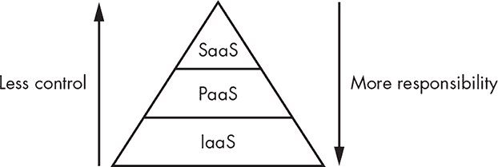

## 第六章：合规性、法律和法规

在信息安全中，外部的规则和法规通常会影响你收集信息、进行调查和监控网络等活动的能力。为了遵守这些规则，你可以制定保护组织的要求、设计新系统和应用程序、决定数据保留多久，或者加密或令牌化敏感数据。

在本章中，我将概述一些可能影响你组织的规则，并讨论如何确保符合这些规则。

### 什么是合规性？

简而言之，*合规性*是你对管理你所处理信息和你所处行业的规则和法规的遵守。

十年前，大多数信息安全工作只遵循少数几项政策和一个普遍的要求，即防止攻击者入侵。旨在保护数据和消费者的法规定义较为宽松，监管方对其执行也不那么严格。

今天，法律和法规变得更加严格，部分原因是因为像 2018 年 8 月英国航空公司泄露 38 万张支付卡信息事件这样的重大泄露事件，¹使得合规问题受到了更多的关注。现代法规不断更新和发展，给需要遵守规则的公司设定了一个不断变化的目标。

一般来说，你是根据你所遵守的标准来衡量合规性的。在多个行业中，你可能需要遵守多个规则集。虽然你很少会遇到相互矛盾的标准集，但你可能会发现它们在具体细节上有所不同。例如，一套合规规则可能规定服务器备份需要保留一年，而另一套可能规定为六个月。面对这种情况，你可能会发现自己为了简便起见，选择采用所有合规工作中最严格的标准。

请记住，合规性并不等同于安全性。即使你已经投入了数百或数千小时来遵守一套特定的规则，并且即使你已经通过了审计，你也可能并不安全，无法抵御攻击。你执行合规性是为了满足特定第三方的需求——即你的客户或商业伙伴、审计员和负责确保你合规的合规机构。合规性是为了满足业务需求，而不是任何技术性的安全需求。此外，只要这些第三方对你的努力感到满意，你就算是“合规”了——无论你实际是否充分满足了要求。组织通常会在检查员到来时展示他们的“最佳状态”。

#### *合规性类型*

合规性主要有两种类型：监管合规性和行业合规性。

*监管合规性*是你遵守与你所运营行业相关的特定法律。几乎在每种情况下，监管合规都涉及周期性的审计和评估，以确保你按照规定进行操作。为这些审计做准备是合规计划的重要组成部分，因为它们不仅可以教育参与者，还能提供发现和解决问题的机会。

*行业合规性*是遵守那些不是法律强制要求的规定，但仍然会对你开展业务的能力产生严重影响的行为。例如，接受信用卡的组织通常必须遵守由一群信用卡发行商（包括 Visa、美国运通和 Mastercard）制定的支付卡行业数据安全标准（PCI DSS），这是一套用于处理信用卡交易的规则。该标准定义了安全程序的要求、保护数据的具体标准以及必要的安全控制措施。信用卡发行商每隔几年就会更新该标准，以跟上当前的形势和威胁。

尽管这些信用卡发行商不能在法律上强制执行他们的标准，但他们的规定无疑具有实际影响。基于 PCI 成员卡片处理信用卡交易的商户必须接受每年的安全实践评估。交易量较少的组织可以仅通过填写一份简短的问卷来完成自我评估。然而，随着交易量的增加，要求变得越来越严格，最终会由专门认证的外部评估员进行访问，强制执行渗透测试，要求进行内部和外部漏洞扫描，并采取大量其他措施。

#### *不合规的后果*

不合规可能会引发各种后果，具体取决于相关规定的具体要求。

在行业合规的情况下，你可能会失去与合规性相关的特权。例如，如果你未能遵守 PCI DSS 的规定，无法有效处理信用卡交易并保护相关数据，你可能会面临高额罚款，甚至丧失商户身份，无法继续处理交易。对于那些高度依赖信用卡交易的企业，比如零售商店，失去处理信用卡的能力可能会导致他们破产。

在监管合规的情况下，你可能面临更为严厉的处罚，包括因违反相关法律而被监禁。

### 达成合规性的控制措施

为了遵守标准和监管要求，你通常需要实施物理、管理和技术控制措施。

#### *控制措施类型*

*物理控制*是用来减少物理安全风险的措施。举例来说，包括围栏、守卫、摄像头、上锁的门等。这些控制措施通常通过物理手段防止或阻止未经授权的人员进入或穿越特定区域。

*行政控制措施*通过实施特定的流程和程序来缓解风险。每当你接受、回避或转移风险时，你很可能正在使用行政控制措施，因为你在制定流程、程序和标准，以防止组织通过承担过多风险而伤害自己。你还需要通过保存政策、程序和标准的记录，并提供证据证明组织已经遵循这些控制措施，来记录你的行政控制措施。

例如，几乎每个标准或法规都要求你拥有*信息安全政策*，这是一份定义组织信息安全的文件。为了遵守这一要求，你必须实施政策，并能够通过定期文档证明你已经遵循了该政策。审计日并不是发现你缺乏展示政策实施的文档的好时机。适当的文档可能包括电子邮件、来自工单系统的票据以及调查文件。

*技术控制措施*通过技术手段来管理风险。你可以通过设置防火墙、入侵检测系统、访问控制列表以及其他技术手段来减少风险，以防止攻击者入侵你的系统。

这些控制措施本身都不足以单独应对风险，但每个控制措施都有助于形成分层防御，提供良好的安全性并满足要求。通常，法规本身会规定某些控制措施。例如，PCI DSS 要求包括多种具体的控制措施，组织必须实施这些控制措施以遵守标准。同时，请记住，你的控制措施只有在正确实施的情况下才有效。如果你不正确地实施了某项控制措施，可能会比根本没有实施它更糟，因为这会产生虚假的安全感。

#### *关键控制与替代控制*

除了区分不同类型的控制措施外，你还可以将控制措施分为两个重要性等级。*关键控制措施*是用于管理环境中风险的主要控制措施，具有以下特点：

1.  它们提供了一定程度的保障，确保风险将得到缓解。

1.  如果该控制措施失败，则不太可能由其他控制措施代替。

1.  该控制措施的失败将影响整个过程。

你认为的关键控制措施会根据你的环境和当前的风险而有所不同，你应始终将关键控制措施作为合规或审计工作的一部分进行测试。一个关键控制措施的例子可能是在处理支付卡信息的所有系统上使用防病毒软件。

*替代控制措施*是替代不切实际或不可行的关键控制措施的控制措施。当你实施替代控制措施时，通常需要向审计员解释它如何实现你所替代控制措施的意图和目标。

例如，尽管法规可能要求你在所有系统上运行防病毒工具，但某些系统可能没有足够的资源运行这些工具而不会带来负面影响。在这种情况下，作为一种补偿性控制措施，你可以使用 Linux 操作系统，因为它们对恶意软件的抵抗力较强。

### 维持合规性

为了保持长期的合规性，你可以循环执行以下活动，如图 6-1 所示：监控、审查、文档化和报告。

*图 6-1：维持合规性*

遵循这个过程的每一步，有助于保持控制措施的有效性。

**监控**

你必须持续监控你的控制措施（以及与其相关的数据），以确定它们是否有效地减轻或减少了风险。在信息安全领域，通常“无新闻”意味着“好消息”。由于你的环境和技术可能发生变化，因此检查你的控制措施——尤其是关键控制措施——是否继续发挥其预定作用是至关重要的。如果没有这样的监控，控制措施很快就会变得无效，可能还不为你所知。

**审查**

控制措施需要定期审查，以确定它们是否仍然有效，并且是否能够实现你所在环境中管理风险的目标。随着旧风险的演变和新风险的出现，你需要确保控制措施仍能适当地覆盖这些风险，判断是否需要新的控制措施，或者决定是否应当废除旧的控制措施。

**文档化**

你应当记录审查的结果，并仔细跟踪控制环境的任何变化。文档化有助于你评估趋势，甚至可能预测未来的控制变化，这将帮助你预见未来所需的资源。

**报告**

在监控、审查和文档化控制措施的状态后，你必须将结果报告给领导层。这不仅能让他们了解控制措施的状态，并帮助他们为组织做出知情决策，还为你提供了申请所需人员和资源的渠道。

### 法律与信息安全

在信息安全方面，执行法律和法规通常比处理物理事件更为复杂。诸如将攻击归因于特定方，或评估攻击造成的损害（当涉及例如建筑物的破坏时，这些评估通常较为简单）等问题，在信息安全领域会变得更加复杂。

近年来，许多法律和法规旨在应对这些类型的情况。它们中的一些存在空白，而另一些则有较大的重叠。你将根据这些法律来准备或接受合规性评估。让我们来看几个例子。

#### *政府相关的监管合规性*

在美国，标准通常是制定管理政府行为及与政府密切合作的个人或组织的法律和法规的基础。在信息安全和合规领域，这些标准通常来自美国国家标准与技术研究院（NIST）发布的系列《特别出版物》（SP）。虽然 NIST 本身不是一个监管机构，但它发布的标准有合规要求，通常通过其他基于 NIST SP 的政府合规标准来执行（是的，这有点复杂）。安全专家在确保组织遵守这些与政府相关的标准方面通常发挥着重要作用。

**什么是 NIST？**

现在被称为 NIST 的机构最初是在 20 世纪初创建的，旨在制定重量和衡量标准，并作为国家实验室。随着时间的推移，其使命已经演变为促进美国的技术和创新。NIST 的《特别出版物》对信息安全有着重要影响。

两个最常见的政府合规标准是《联邦信息安全管理法》（FISMA）和《联邦风险与授权管理计划》（FedRAMP），它们都基于 NIST SP 800-53《信息系统与组织的安全与隐私控制》。

##### 联邦信息安全管理法

2002 年《联邦信息安全管理法》适用于所有美国联邦政府机构、所有管理联邦项目的州政府机构（如医疗保险），以及所有支持、向联邦政府出售商品或接受联邦政府资助的私营公司。

FISMA 要求组织实施采用*基于风险*的方法的信息安全控制——这种方法通过列举和补偿具体风险来处理安全问题。

当一个组织通过审计后，合作的联邦机构会授予它*操作授权（ATO）*。由于 ATO 是针对每个机构的，因此一家与十个不同机构合作的公司必须获得十个不同的 ATO。

##### 联邦风险与授权管理计划

2011 年建立的《联邦风险与授权管理计划》定义了政府机构与云服务提供商签约的规则。² 这一计划适用于云平台提供商，如 AWS 和 Azure，以及基于云的 SaaS 工具提供商。我将在本章稍后讨论这一区别。

与 FISMA 不同，FedRAMP 认证包含一个单一的 ATO，允许组织与任意数量的联邦机构开展业务。由于 FedRAMP ATO 的覆盖范围更广，获取它的要求比 FISMA 更加严格。截止本文写作时，FedRAMP 市场上只有 91 家公司获得了 ATO。³

#### *行业特定的监管合规性*

许多监管合规要求适用于特定的操作领域，如医疗保健行业、上市公司和金融机构。让我们来看看其中一些要求。

##### 健康保险可携带性和责任法案（Health Insurance Portability and Accountability Act，HIPAA）

1996 年的健康保险可携带性和责任法案（Health Insurance Portability and Accountability Act，HIPAA）保护美国医疗保健系统患者的权利和数据。安全专业人员应特别关注 HIPAA 的第二标题，该标题规定了保护受保护健康信息（PHI）和电子受保护健康信息（e-PHI）的要求。（通常可以将这些解释为包含患者医疗记录或医疗交易的任何部分。）虽然 HIPAA 主要适用于从事医疗保健或健康保险的组织，但在其他奇怪的情况下也可能适用，例如自我保险的雇主。

HIPAA 要求您确保处理或存储的任何信息的保密性、完整性和可用性；保护此信息免受威胁和未经授权的披露；并确保您的工作人员符合其所有规定。在处理大量 PHI 的机构中，这可能是一项艰巨的任务。

##### 萨班斯-奥克斯法案（Sarbanes–Oxley Act，SOX）

2002 年的萨班斯-奥克斯法案（Sarbanes–Oxley Act，SOX）监管公开上市公司的财务数据、业务和资产。政府出台 SOX 是为了应对多家大公司的财务欺诈事件，特别是 2001 年安然公司丑闻，公众得知该公司虚假报告了多年的财务状况。⁴

SOX 除了其他条款外，还对组织的电子记录保存提出了具体要求，包括记录的完整性、某些信息的保留期限以及存储电子通信的方法。安全专业人员经常帮助设计和实施受 SOX 影响的系统，因此您需要了解这些法规及其对您的要求。

##### 格拉姆-利奇-布莱利法案（Gramm–Leach–Bliley Act，GLBA）

1999 年的格拉姆-利奇-布莱利法案（Gramm–Leach–Bliley Act，GLBA）旨在保护客户的信息（如个人可识别信息（PII），即任何可以识别特定个人的数据）和金融数据，这些数据属于金融机构的客户。有趣的是，GLBA 广泛定义了“金融机构”，包括“银行、储蓄和贷款协会、信用合作社、保险公司和证券公司……一些零售商和汽车经销商，他们收集和分享关于消费者的个人信息，以及利用金融数据向客户收取债务的企业。”⁵

为了遵守 GLBA，你必须确保每一份相关记录免受未经授权的访问，追踪人员对这些记录的访问，并在分享客户信息时通知客户。组织还必须有一个书面的信息安全计划，并具体制定一个全面的信息安全项目来处理组织的安全事务。

##### 《儿童互联网保护法案》

2000 年《儿童互联网保护法案》（CIPA）要求学校和图书馆防止儿童访问互联网上的淫秽或有害内容。CIPA 要求这些机构采取政策和技术保护措施，以阻止或过滤此类内容。此外，这些机构还必须监控未成年人的活动，并提供关于适当在线行为的教育。

CIPA 通过为选择遵守这些标准的机构提供廉价的互联网接入，而不是通过对不遵守的机构施加惩罚，来鼓励机构采用这些标准。

##### 《儿童在线隐私保护法案》

1988 年的《儿童在线隐私保护法案》（COPPA）通过限制组织收集 13 岁以下儿童的个人身份信息，来保护未成年人的隐私。该法案要求组织在线发布隐私政策，合理努力获取家长同意，并通知家长正在收集其子女的信息。许多公司选择对未成年人的账户收取少量费用，作为验证家长同意的方式，而其他公司则完全拒绝为未成年人提供服务。

COPPA 在信息安全界是一个相当敏感的话题，因为它要求组织判断用户的年龄，并为儿童提供更为严格的个人身份信息（PII）类别，如果要收集此类数据，即使是无意中收集，也需要严格的执行，这两项要求都很难做到高准确度。2016 年，移动广告公司 InMobi 因其广告软件无意中追踪到 13 岁以下未成年人的位置，被依据 COPPA 罚款 95 万美元。⁶如你所见，即便组织诚心遵守，合规性仍然很难达成。

##### 《家庭教育权利和隐私法案》

1974 年的《家庭教育权利和隐私法案》（FERPA）保护学生的记录。FERPA 适用于所有年级的学生，且当学生年满 18 岁时，这些记录的权利从父母转移给学生。

FERPA 定义了机构如何处理学生记录以加以保护，并且规定了人们如何查看或共享这些记录。由于学校现在大多以数字形式保存教育记录，信息安全专业人员在处理涉及教育记录的事件和设计讨论时，参与其中并解决一般安全问题并不罕见。

#### *美国以外的法律*

外国的计算和数据法律可能与美国的法律大相径庭。如果你的组织在国际上运营，你需要研究你计划开展业务的每个国家/地区的相关法律。你还应该查看是否有任何条约规定了这些国家之间安全实践和信息交换的相关规定。

提前了解你可能遇到的监管问题是有益的。例如，在一个国家，你可能可以收集包含机器列表及其相关用户名、与所有者的员工编号和电子邮件地址相交叉的日志数据。但在另一个国家，收集这些数据可能会更加困难，甚至可能是非法的。

一个与信息安全相关的国际法规示例是《通用数据保护条例》（GDPR），这是欧盟在 2018 年制定的法规。GDPR 涉及欧盟所有个人的数据保护和隐私。该法规适用于任何收集欧盟公民数据的个人或组织，无论你在哪个国家工作。

GDPR 要求组织在收集个人数据之前获得同意，报告数据泄露事件，赋予个人访问和删除已收集数据的权利，并为隐私和隐私计划制定具体的指南。鉴于 GDPR 的广泛适用性，全球的安全和隐私计划在该法律生效时都必须进行调整，这促使了大量客户沟通、网站上新增的隐私导向横幅，以及许多组织政策的更新。⁷

### 采用合规框架

除了特定法规提供的框架外，为整体合规工作选择一个框架也是有帮助的。例如，如果你的组织必须遵守不同、不相关的法规——比如 HIPAA 和 PCI DSS——你可能需要选择一个更具总体性的框架来指导整个合规工作和安全计划，然后根据特定合规领域的需要进行调整。

在本节中，你将了解一些可以使用的框架。选择一个知名框架也可以让审计过程更加顺利，因为你可以向审计员展示你的程序和已实施的具体控制措施。

#### *国际标准化组织*

国际标准化组织（ISO）是一个于 1926 年首次成立的机构，旨在制定国际标准。它已制定了超过 21,000 个标准，涵盖几乎每个行业，从技术、食品安全到农业和医疗保健。⁸

涉及信息安全的 ISO 27000 系列包括以下标准：

+   ISO/IEC 27000，《信息安全管理系统——概述与词汇》

+   ISO/IEC 27001，《信息技术——安全技术——信息安全管理系统——要求》

+   ISO/IEC 27002《信息安全控制的实践守则》

这一系列 ISO 标准，也被行业称为 ISO 27k，讨论了信息安全管理体系，旨在帮助管理组织内资产的安全。这些文档列出了管理风险、控制、隐私、技术问题以及其他广泛细节的最佳实践。

#### *美国国家标准与技术研究院*

美国国家标准与技术研究院特别出版物提供了计算与技术中多个主题的指南，包括风险管理。这个领域中两个常被引用的出版物是 SP 800-37《应用风险管理框架到联邦信息系统的指南》和 SP 800-53《联邦信息系统和组织的安全与隐私控制》。

SP 800-37 提出了风险管理框架的六个步骤，这些步骤构成了许多安全程序的基础：

**分类** 根据系统处理的信息以及泄露或丢失这些数据的影响对系统进行分类。

**选择** 根据系统的分类和任何特殊情况来选择控制措施。

**实施** 实施控制措施并记录实施过程。

**评估** 评估控制措施，确保它们已经正确实施并且按预期运行。

**授权** 根据系统所面临的风险和为缓解该风险所实施的控制措施来授权或禁止使用该系统。

**监控** 监控控制措施，确保它们继续有效地缓解风险。

如果你打算根据 SP 800-37 选择控制措施，你可以在 SP 800-53 中找到针对这一目的的具体指南。

#### *自定义框架*

你当然可以开发自己的框架或修改现有框架，但在这样做之前你应该仔细考虑。正如你刚才看到的，已经存在很多风险管理框架，它们都经过了充分的审查和测试。你可能不应该在这里重新发明轮子。

### 技术变革中的合规性

跟上技术变化可能对执法合规的机构和那些试图实现合规的机构带来挑战。一个很好的例子就是本节讨论的云计算。

在将数据和应用程序托管到云端成为一种普遍技术趋势之前，组织通常拥有自己的服务器和基础设施，并将它们托管在内部或共同托管的数据中心。这为谁拥有并负责这些设备的安全提供了相对明确的界限。

现在，几乎整个公司都存在于云端，合规努力已经转移，试图专门应对这些情况；新的政策可能规定如何跟踪和评估第三方的安全和合规工作，新的法规决定如何管理云数据，审计员提出完全不同的问题，需要针对这些类型的环境提供具体证据。

尽管大多数技术变化相对渐进，允许安全和合规行业慢慢适应它，但并非总是如此。有两种相对较新的、潜在的颠覆性技术，可能会导致一些行业的合规要求发生进一步变化：区块链和加密货币。

#### *云中的合规性*

对于部分或完全依赖云的组织来说，合规性可能带来一系列额外的挑战。这是因为云服务有不同的模型，每种模型都给你提供不同程度的控制。这些模型包括*基础设施即服务（IaaS）*、*平台即服务（PaaS）*和*软件即服务（SaaS）*，如图 6-2 所示。

*图 6-2：云模型*

从高层次来看，IaaS 为你提供虚拟服务器和存储的访问权限。例子包括 Google Cloud 和 Amazon Web Services。PaaS 为你提供预建的服务器，如数据库或 Web 服务器，例如 Azure，而 SaaS 为你提供访问特定应用程序或应用程序套件的权限，如 Google Apps。

PaaS 为你提供一定程度的控制，而 SaaS 则几乎没有控制。相反，IaaS 要求你承担更大的责任，PaaS 要求你承担一定程度的责任，而 SaaS 要求你承担的责任很少。引用*蜘蛛侠*中的话，“能力越大，责任越大。”（这句话的归属有些复杂，但我可以相对安全地将其归于斯坦·李在《惊奇幻想》第 15 期中的引用。）

选择使用哪种类型的服务是一个平衡灵活性和可配置性需求与服务易用性之间的决策。如果你想发送一封简单的电子邮件并结束，那么使用像 Gmail 这样的工具（SaaS）是合乎逻辑的。在这种情况下，构建和配置虚拟服务器，在上面安装和配置邮件服务器软件（IaaS），然后发送电子邮件就显得没有太大意义。

##### 谁承担风险？

在每种云模型中，云服务提供商必须对用户无法控制的环境部分负责。这意味着，在某些情况下，你需要直接负责保护你的数据；而在其他情况下，你需要确保你使用的服务能够适当地保护数据。

在 IaaS 环境中，云服务提供商拥有与虚拟基础设施所在的网络和服务器相关的风险。换句话说，它负责确保和维护宿主机（运行虚拟机的服务器）、客户存储卷所在的存储阵列以及宿主机使用的网络等组件。由于 IaaS 让你对环境及其配置有较大的控制权，因此它要求你承担更大的责任。

在 PaaS 环境中，云客户可以直接访问服务器，但无法访问运行这些服务器的基础设施。在这种情况下，云服务提供商负责该基础设施的安全性，包括操作系统补丁、服务器配置、服务器备份和存储卷维护等任务。

在 SaaS 环境中，客户可能根本无法对基础设施或服务器进行任何更改，这意味着云服务提供商对其完全负责。客户可能仍然需要对输入到环境中的数据负责，但不负责环境本身的安全。

##### 审计和评估权限

你与云服务提供商的合同通常会规定你审计和评估云环境安全性的权利。在许多情况下，服务会允许客户在某些特定范围内进行审计和评估。例如，它可能会规定你何时以及如何请求内部审计团队或第三方审计公司对提供商进行审计。这些限制是合理的，因为回应每个审计请求需要大量工作。提供商也可能通过提供年度外部审计结果来回应审计请求，该审计是专门为回应此类请求而进行的。

如果你希望直接评估云服务提供商的安全性，可能会通过渗透测试（我将在第十四章中深入讨论），你可能会遇到阻力。许多提供商直接拒绝此类请求，或者只在非常特定且严格限制的条件下允许渗透测试。这对许多提供商而言是可以理解的，因为他们可能出于同样的原因限制审计。此外，主动的安全测试通常会影响被测试的基础设施、平台或应用程序，提供商可能因此遭遇服务问题。

##### 技术挑战

云服务在合规性方面带来了技术挑战，因为它们是共享资源。如果你在与另一家公司共用同一主机服务器上使用云资源，那么该公司缺乏安全性很可能会影响你的系统安全。

在云服务中，风险随着服务提供商更密切管理的服务而增加，例如 SaaS，因为你和其他客户共享更大一部分环境。你的数据可能和其他客户的数据混合在同一个数据库中，只有应用程序逻辑将你的数据和他们的数据分开。

另一方面，在 IaaS 服务中，尽管你和其他人共享某些服务器资源来托管虚拟机以及一些相同的存储空间，但你的资源和其他人的资源之间存在明显的分隔。

#### *区块链的合规性*

区块链是一种分布式且不可编辑的数字账本。交易作为区块被记录到账本中，每个区块通过单向数学握手（类似于第五章中讨论的哈希）与前一个区块相连接。每个参与者都有区块链的副本，51%的参与者的共识定义了接受的链（通常是最长的链）。

在安全术语中，区块链承诺提供一种强有力的完整性保障。当你将某些内容记录到区块链时，你可以非常确信地说，稍后查看时，它不会被更改。例如，沃尔玛使用这项技术来追踪其食品产品的路径，从供应商开始，到将其销售给顾客的商店。⁹

在合规性方面，创建能够展示对区块链工作原理理解的控制措施至关重要。例如，人们常常引用区块链作为无法更改的记录，你可以将数据写入其中，而无需担心数据被更改。不幸的是，这种情况只有在特定条件下才成立。如果你控制了 51%的参与者，就可以在区块链上强制达成共识，在那时你可以随意写入数据。某些公司甚至推广“私有”区块链，实际上这只是通过加密来确保数据的完整性。想要规范区块链的人应当理解它可能存在的缺陷；如果你从一种新兴技术急速转向下一种技术，你可能会设立一些实际上只是“安全表演”的控制措施。

#### *加密货币的合规性*

*加密货币*是一种基于区块链技术的数字货币形式。加密货币无疑是一种颠覆性技术。第一种加密货币比特币于 2009 年出现，自那时以来，其价值波动极大。

比特币通过与保持底层区块链运行相同的方式来生成货币。正如所讨论的那样，为了将每个比特币区块附加到链上，它需要通过数学的“握手”进行验证。这个功能需要所有参与区块链的人提供一定程度的计算能力，作为奖励，参与者会获得一个比特币。这一生成新比特币的过程被称为*比特币挖矿*。

2019 年 2 月，加拿大最大加密货币交易所 Quadriga 的创始人杰拉尔德·科顿（Gerald Cotton）突然去世。据报道，科顿是一位注重安全的人，他通过存储在高度加密的笔记本电脑中的离线账户管理整个交易所。在他去世后，交易所持有的约 1.9 亿美元加密货币（跨越 11.5 万名客户）全部消失，原因是他的笔记本电脑无法访问。截至目前，关于这一事件的确切情况仍在调查中，尽管有传言称该事件可能涉及某种欺诈行为。

作为一个组织，你很可能受一系列法律和法规的约束，这些法律法规管理着金融交易，并且定义了对投资者的规则以及如何向他们报告。尽管许多企业已经使用加密货币，企业在业务中使用加密货币仍然是一个灰色地带。然而，可以几乎确定的是，作为一个组织，如果因加密货币技术故障导致几百万美元的损失，你将无法不受法律和监管的严重后果而轻松应对。

### 总结

在本章中，我讨论了与信息安全相关的法律和法规，以及遵守这些规定意味着什么。很多这些法律与计算相关，并且在不同国家之间差异很大。企业可能面临合规性和行业合规性的双重要求，它们通常通过实施控制措施来保持合规。

我还谈到了在云计算和区块链等新技术中的合规问题，这些技术为试图监管它们的人带来了额外的挑战。

### 练习

1.  选择本章涉及的与计算相关的美国法律之一，并总结其主要规定。

1.  为什么合规性审计可能是一个积极的事件？

1.  COPPA 关注的是什么类型的数据？

1.  合规性和安全性之间有何关系？

1.  哪些问题可能会使得开展国际信息安全项目变得困难？

1.  哪一份 NIST 特别出版物为 FISMA 和 FedRAMP 奠定了基础？

1.  为什么行业规定，如 PCI DSS，重要？

1.  不合规可能带来哪些潜在影响？

1.  哪些 ISO 标准集可能对信息安全项目有用？

1.  哪两个项目是你公司可能属于的合规标准集合的指标？
