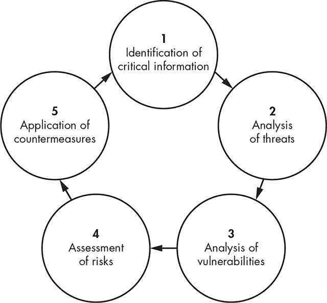
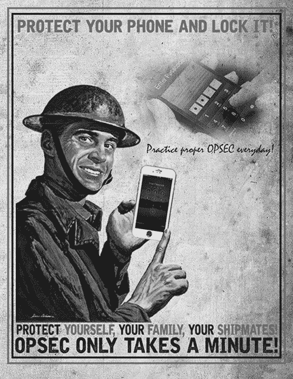

## 7

操作安全

在军事和政府领域，这一过程被称为 OPSEC（操作安全），它是用于保护信息的过程。尽管我们之前讨论了操作安全的某些元素，例如使用加密保护数据，但整个操作安全过程涵盖的内容远不止这些。

操作安全不仅仅是实施安全措施，还包括识别您需要保护的具体内容，以及需要保护它们免受哪些威胁。如果直接跳到实施保护措施，您可能会未能将精力集中在最关键的信息上。此外，在实施安全措施时，您应当采取与所保护内容价值相匹配的措施。如果对所有内容都应用相同级别的安全性，您可能会对一些不太重要的资源过度保护，而对一些更具价值的资源保护不足。

在本章中，我将讨论美国政府关于执行操作安全的指南。随后，我将概述这些概念的起源，并讨论它们作为保护自己和组织的工具在日常生活中的应用。

### 操作安全流程

美国政府提出的操作安全流程分为五个部分，如图 7-1 所示。

*图 7-1：操作安全流程*

首先，您需要识别需要保护的信息。然后，分析可能影响这些信息的威胁和漏洞，并制定减轻这些威胁和漏洞的方法。尽管这一过程相对简单，但它是有效的。我们将一一讲解这些步骤。

#### *关键资料识别*

操作安全流程中最重要的第一步是识别您的最关键信息资产。任何企业、个人、军事行动、流程或项目必定至少有一些依赖于其他一切的信息。这些信息往往是至关重要的。例如，对于一个软饮料公司来说，可能是它们的秘方；对于一个应用程序供应商来说，可能是它们的源代码；而对于一个军事行动来说，可能是攻击时间表。您应该识别出那些如果被曝光会对您造成最大危害的资产。

#### *威胁分析*

下一步是分析与您已识别的关键资料相关的任何威胁。请记住在第一章中提到的，威胁是指可能对您造成危害的事物。利用您的关键资料清单，您可以评估如果关键资料被泄露可能造成的危害，以及可能会利用这些泄露的人。这与许多军事和政府组织用来分类信息并确定谁可以查看的信息处理流程相同。

例如，如果你拥有一家软件公司，你可能会将产品的专有源代码视为关键信息。暴露这些关键信息可能使公司面临攻击者和竞争对手的威胁。攻击者可能会通过确定生成许可证密钥的方案，开发一个工具来盗版你的软件，从而损失收入。竞争对手可能会利用暴露的源代码，复制你软件中的专有功能，并将其用于自己的应用程序，或者他们可能会复制你应用程序的大部分并自己销售。

对每一项关键信息、每个可能在其暴露后利用它的方以及他们可能利用这些信息的方式，重复进行这一步。如你所见，识别为关键信息的资产越多，这一步就越复杂。在某些情况下，你可能会发现只有有限的方可以利用这些信息，并且仅能在有限的方式中使用；而在其他情况下，你可能会发现完全相反的情况。例如，一份用于工业食品加工线大规模生产的秘密巧克力曲奇饼干配方，只对另一家经营此类行业的组织有用。相同的配方如果用于家庭制作，则任何人都能使用。

#### *漏洞分析*

漏洞是他人可以利用来伤害你的弱点。操作安全的第三步是分析你为保护信息资产所采取的保护措施中的漏洞。你将通过查看你如何与这些资产互动，以及攻击者可能针对哪些领域进行攻击来破坏这些资产，来完成这一步。

在分析影响源代码的漏洞时，你可能会发现源代码的安全控制措施不够严格，任何可以访问操作系统或网络共享的人都有可能访问、复制、删除或更改源代码。这可能使得已攻陷系统的攻击者能够复制、篡改或完全删除源代码。或者，漏洞可能使得在系统维护时文件易于被意外更改。

你还可能会发现没有任何政策来规定源代码应该存储在哪里，是否应在其他系统或备份介质上存在其副本，或者一般来说它应如何受到保护。这些问题可能会创造出多个漏洞，并可能导致严重的安全漏洞。

#### *风险评估*

接下来，你需要决定在操作安全过程的其余部分中需要解决的问题。如第一章所述，风险发生的前提是威胁和漏洞匹配。在软件源代码示例中，威胁之一是应用程序源代码可能被暴露。漏洞则是源代码访问控制不力，并且没有政策规定如何准确控制访问。这两个漏洞可能会导致你的关键性信息暴露给竞争对手或攻击者。

再次强调，要构成风险，你需要匹配的威胁和漏洞。如果你的源代码的机密性不是目标——例如，如果你在创建一个开源项目，且源代码可以公开访问——那么你就不会有风险。同样地，如果你的源代码需要满足严格的安全要求，几乎不可能以未经授权的方式发布，那么你也不会有风险，因为漏洞就不存在。

#### *对策的应用*

一旦你发现了对关键性信息的风险，就可以采取措施来缓解这些风险。在操作安全中，这些措施被称为*对策*。如前所述，要构成风险，你需要一组匹配的威胁和漏洞。当你为风险构建对策时，至少需要缓解威胁或漏洞中的一个。

在源代码示例中，威胁是指你的源代码可能会暴露给竞争对手或攻击者，而漏洞则是指你为保护源代码而设置的安全控制措施不充分。在这种情况下，除非完全改变应用程序的性质，否则你无法采取太多措施来保护自己免受威胁，因此无法缓解威胁。然而，你可以采取措施来缓解漏洞。

例如，为了缓解这个漏洞，你可以采取更强的措施来控制代码访问，并建立一套规则来规定如何控制访问。一旦你像这样拆解威胁/漏洞对，你就不再面临严重的风险。

需要注意的是，这是一个*迭代*过程，你可能需要多次重复这个循环，以充分缓解任何问题。每次完成循环时，你都会根据之前缓解努力所获得的知识和经验来调整解决方案，从而提高安全性。你还需要在环境发生变化、出现新的因素时重新审视这个过程。

如果你熟悉风险管理，你可能会注意到，操作安全周期缺少一个评估对策有效性的步骤。我认为这个步骤在整个操作安全过程中是隐含的。然而，这个过程当然不是一成不变的，如果你认为加上这个步骤有益，完全可以加入。

### 操作安全法则

库尔特·哈塞（Kurt Haase），曾是内华达州能源部操作办公室的员工，将操作安全过程总结为三条规则，称为*OPSEC 法则*。这些法则是另一种思考前面提到的周期的方式，尽管不一定是过程中的最*重要*部分，但它们确实有助于突出操作安全的一些主要概念。

#### *第一法则：了解威胁*

操作安全的第一法则是“如果你不知道威胁，怎么知道该保护什么？”¹ 换句话说，你需要意识到面临的实际和潜在威胁，特别是你关键数据的威胁。这个法则直接映射到操作安全过程中的第二个步骤。

最终，正如前面所讨论的，每一条信息都可能面临其自身的威胁。威胁甚至可能取决于你的位置。尤其是在云服务的情况下，这一点尤为真实。例如，即使你列出了一个位置中面临的所有威胁，如果你将这些数据复制到多个存储区域、多个国家，可能会遇到新的威胁。这是因为不同的地区可能有更容易访问的方，或者相关法律可能在不同地点之间差异巨大。

#### *第二法则：知道需要保护的内容*

“如果你不知道该保护什么，怎么知道你正在保护它？”² 这条操作安全法则指出，需要评估你的信息资产，明确什么信息可以视为你的关键数据。这个第二法则映射到操作安全过程中的第一步。

大多数政府环境要求识别和分类信息。每一项信息——可能是一个文档或文件——都会被分配一个标签，如*机密*或*绝密*，以标识其内容的敏感性。这种标签化使得识别关键数据的任务变得相对容易，但不幸的是，政府之外很少有人使用这种系统。

商界的一些组织可能会有信息分类政策，但根据我的经验，它们通常是零星地实施这种标签化。一些民用行业，例如那些涉及联邦要求保护数据的行业，如金融或医疗数据，确实会对信息进行分类，但这些都是例外，而非常规做法。

#### *第三法则：保护信息*

操作安全的第三条也是最后一条法则是：“如果你没有保护[信息]，… 龙会赢！”³ 这条法则强调了操作安全过程整体的重要性。如果你不采取措施保护你的信息不被龙（你的对手或竞争者）获取，他们就会默认获胜。

“龙赢”的案例遗憾地很常见。安全漏洞不断出现在新闻中，并且在跟踪漏洞的网站上也能看到，例如隐私权清理所（*[`www.privacyrights.org/`](https://www.privacyrights.org/)*）。在许多情况下，漏洞的发生仅仅是因为疏忽大意，没有遵循最基本的安全措施。

这也适用于 2018 年 9 月，安全研究员发现的加州电子邮件营销公司 SaverSpy 的数据泄露事件。此次泄露包含超过 43GB 的用户数据，包括超过 1000 万 Yahoo 用户的姓名、电子邮件地址、住址和性别。⁴

我曾想象黑客是在黑夜中突破系统并窃取这些信息。但实际上，研究人员是在 Shodan⁵上浏览被攻破的服务器时发现了这些数据；结果发现，包含这些数据的服务器在互联网上完全暴露且未加保护。更糟的是，数据库里还包含了一份来自之前发现这些暴露服务器的攻击者的勒索信。

操作安全过程本应迅速识别出这些关键数据集，让你更有机会避免这种情况。防止泄露所需的安全措施既不复杂也不昂贵，从长远来看，能够为你节省大量的声誉和财务损失。

### 我们个人生活中的操作安全

操作安全过程不仅在商业和政府中有用，在我们的个人生活中也同样适用。你可能没有有意识地经过操作安全周期中的所有步骤来保护个人数据，但你依然会使用文中讨论的一些方法。

比如说，如果你要去度假几个星期，家里没人，你可能会采取一些措施来确保你不在时家里有一定的安全保障。你可能会列出以下几个能表明房子没人且容易遭受攻击的迹象：

+   晚上没有灯光

+   房子里没有声音

+   堆积在车道上的报纸

+   邮件堆积在邮箱里

+   车道上没有车

+   没有人员进出

你可能会采取措施，确保不会过于明显地向小偷或破坏者展示你的脆弱性。例如，你可以设置灯光定时器，让它们在房子里不同的时间开关。你也可以设置电视或收音机的定时器，制造噪音，让人感觉家里有人。为了解决邮件和报纸堆积的问题，你可以在离开期间暂停它们的投递。为了让房子看起来有人住，你可能还会让朋友每隔几天过来浇水，或者偶尔让他们进出车库移动一下汽车。

**操作安全与社交媒体**

在社交网络工具的时代，你会经常看到个人操作安全违规行为。现在许多这些工具都配备了位置感知功能，当我们更新状态时，它们能够报告我们的物理位置。

此外，人们经常发布他们要去吃午餐、外出度假等消息。在这两种情况下，我们向公众明确发出了可能不在家或者可能在特定地点的信号——从操作安全的角度来看，这是一种不良做法。

尽管你不会像美国政府那样严格执行这些操作安全措施来保护个人数据，但过程是相同的。当涉及到你的逻辑资产时，采取这些方法尤其重要。

你的个人信息会通过大量的计算机系统和网络传输。虽然你可能会通过小心谨慎地分享个人信息，或者在丢弃含有敏感信息的邮件前将其粉碎，来减轻安全威胁，但不幸的是，你无法控制个人信息可能被暴露的所有途径。

正如你在本章早些时候看到的 SaverSpy 泄露事件一样，你不能总是相信组织会小心地处理你的信息。话虽如此，如果你在泄露发生之前就计划好保护个人数据，至少可以在一定程度上缓解问题。例如，你可以设置监控服务来观察你的信用报告，并且在发生泄露时向这些机构提交欺诈报告。你还可以仔细查看自己的财务账户。虽然这些步骤可能不复杂或特别困难，但如果在问题发生之前采取它们，可能会带来很大的不同。

### 操作安全的起源

尽管美国政府实施的操作安全过程可能是一个近代的概念，但其基础概念却是古老的。你可以指出历史上任何时期的军事或大型商业组织，都能找到操作安全原则的踪迹。在这一部分，我将介绍一些对现代操作安全发展至关重要的例子。

#### *孙子*

孙子是公元前六世纪的中国军事将领。对一些人来说，孙子的著作《孙子兵法》是一部进行军事行动的“圣经”。《孙子兵法》催生了无数衍生作品，其中许多将其传播的原则应用到各种情况中，包括信息安全。该文本记录了操作安全原则的一些最早例子。让我们来看看其中的几个。

第一段是：“如果我能在同时隐藏自己的部署的情况下，确定敌人的部署，那么我就可以集中力量，而敌人则必须分散。”⁶ 这是一个简单的告诫：在保护我们自己的同时，发现对手所掌握的信息。

第二段是：“（在）制定战术部署时，你能达到的最高境界就是隐蔽它们；隐蔽你的部署，你就能避开最为狡猾的间谍和最智慧的大脑的窥探。”⁷ 在这里，孙子表示我们应该在一个对对手难以观察的区域进行战略规划——在这种情况下，就是我们能找到的最高点。他再次强调要保护我们的规划活动，以免泄露给可能反对我们的人。

尽管这些段落写于很久之前，但它们与我们在本章早些时候讨论的操作安全法则密切一致——即，了解威胁，知道要保护什么，然后进行保护。

#### *乔治·华盛顿*

美国第一任总统乔治·华盛顿是一个敏锐且高明的军事指挥官，他提倡良好的操作安全实践。在操作安全界，他因曾说过：“即使是微不足道的细节也应该被收集，因为看似无关紧要的事情，当与其他更为重要的事物结合时，可能会得出有价值的结论。”⁸ 这意味着，即使是个别无价值的小信息，若与其他信息结合，也可能变得非常有价值。

这一概念的现代例子是构成身份的三项主要信息：姓名、地址和社会安全号码。单独来看，这些信息是完全无用的。你可以将其中任何一项孤立地展示在广告牌上，让全世界看到，而不至于因此受到任何损害。然而，将这三项信息结合在一起，它们足以让攻击者窃取你的身份，并用来进行各种欺诈活动。

华盛顿还被引用说过：“因为秘密，在大多数此类企业中，成功依赖于此，缺乏它，通常会导致失败。”⁹在此，他指的是一项情报收集计划及其活动需要保持机密。他通常被认为在情报问题上非常了解，并且被认为在任何正式的情报能力出现之前，就已经建立了一个庞大的组织来执行此类活动。

#### *越南战争*

在越南战争期间，美国意识到有关部队调动、作战和其他军事活动的信息正被泄露给敌方。显然，在大多数环境中，无论是军事还是其他领域，让我们的对手获取我们的活动信息都是不利的，尤其是当生命可能受到威胁时。为了阻止信息泄露，当局进行了一项代号为“紫龙”的研究，¹⁰以找出泄露的原因。

最终，研究得出了两个主要结论：首先，在那个环境中，窃听者和间谍比比皆是；其次，军方需要一项调查来揭示信息丧失的程度。调查询问了关于信息本身以及信息的脆弱性的问题。进行这些调查和分析的小组创造了*操作安全*这一术语及其缩写*OPSEC*。此外，他们看到了建立一个操作安全小组的必要性，该小组将把操作安全的原则传递给政府内的不同组织，并与他们合作以将这些原则落实。

#### *商业*

在 1970 年代末和 1980 年代初，一些在军事和政府中使用的操作安全概念开始在商业世界中扎根。工业间谍活动——即为了获得竞争优势而对商业竞争对手进行间谍活动——是一项古老的做法，但随着这一概念在军事世界中变得更加结构化，它也在商业世界中变得更加规范。1980 年，哈佛商学院教授迈克尔·E·波特出版了一本名为*《竞争战略：分析行业和竞争对手的技巧》*的书。此书至今已出版近 60 版，为我们现在所称的竞争情报奠定了基础。

*竞争情报*通常被定义为进行情报收集和分析以支持商业决策。竞争情报的对立面是*竞争反情报*，它包括几年前政府提出的操作安全原则，并且至今仍是开展业务的一个积极部分。你可以在许多大公司中看到这些原则的应用，也可以在像战略与竞争情报专业人员（SCIP）¹¹这样专业组织中看到，巴黎的经济战争学院（Ecole de Guerre Economique）也是其一。

#### *跨机构操作安全支持小组*

越南战争结束后，执行紫龙任务并制定政府操作安全原则的小组试图为一个与各政府机构合作的操作安全组织争取支持。他们未能引起军事机构的兴趣，也未能获得美国国家安全局的正式支持。幸运的是，在美国能源部和美国总务管理局的努力下，他们获得了足够的支持得以继续前进。此时，他们草拟了一份文件，提交给时任总统的里根。

由于里根的连任竞选活动，这些努力曾被推迟，但在 1988 年不久后，他签署了《国家决策安全指令 298》，成立了跨机构操作安全支持小组（IOSS）。¹² 今天，IOSS 负责进行各种操作安全意识和培训工作，例如图 7-2 中展示的海军操作安全海报。¹³

*图 7-2：操作安全意识海报*

### 总结

操作安全的起源可以追溯到有文字记载的历史。你可以在公元前六世纪孙子兵法中找到类似的原则，在乔治·华盛顿的言论中也有体现，在商业界的文献中也有所论述，甚至在美国政府的方法论中也能找到。尽管正式的操作安全流程是最近才形成的，但它们所依赖的原则却极为古老。

操作安全过程包括五个主要步骤。首先，你需要识别最关键的信息，以便知道需要保护的内容。接着，你要分析你的情况，确定环境中存在的威胁和漏洞。一旦知道了威胁和漏洞，你就可以尝试确定可能面临的风险。当你的威胁和漏洞匹配时，你就有了风险。了解风险后，你可以制定对策来减轻风险。

为了总结这个过程，你也可以参考库尔特·哈塞（Kurt Haase）所写的操作安全法则。他的三条法则涵盖了你可能希望内化的一些关键点。

即使你可能不以正式的方式这么做，你也会在个人生活中运用商业和政府中使用的操作安全原则。识别关键性信息并制定保护措施尤为重要，尤其是在如今大量个人信息通过系统和网络共享的背景下。

### 练习

1.  为什么识别你的关键性信息很重要？

1.  操作安全的第一条法则是什么？

1.  IOSS 的功能是什么？

1.  乔治·华盛顿在操作安全的创建中扮演了什么角色？

1.  在操作安全过程中，评估威胁和评估漏洞有什么区别？

1.  为什么你可能需要使用信息分类？

1.  当你完成了整个操作安全流程后，你就完成了吗？

1.  第一个正式的 OPSEC 方法论源自哪里？

1.  操作安全的起源是什么？

1.  定义竞争性反情报。
