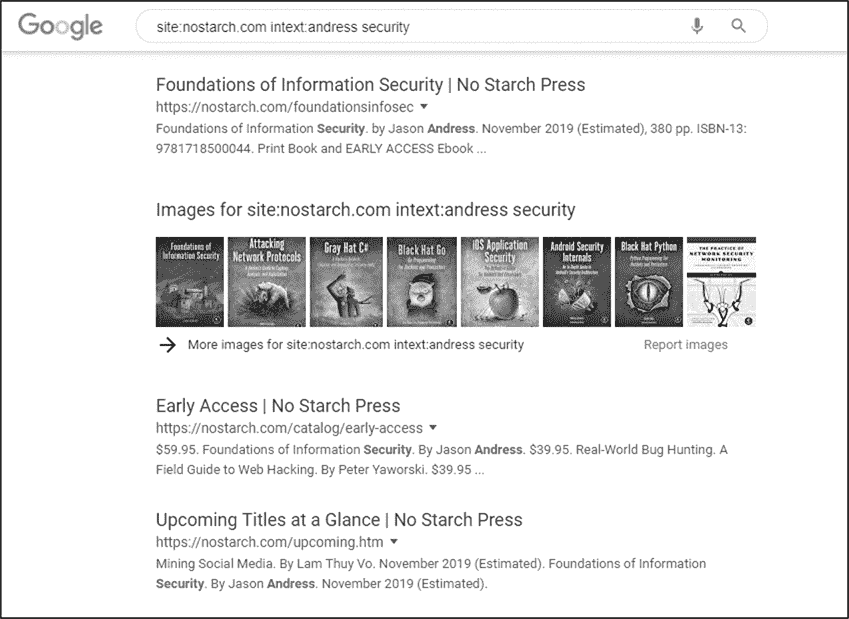
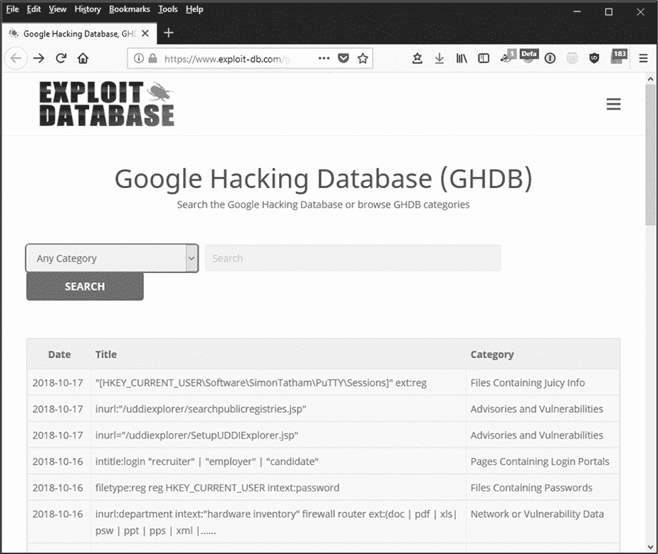
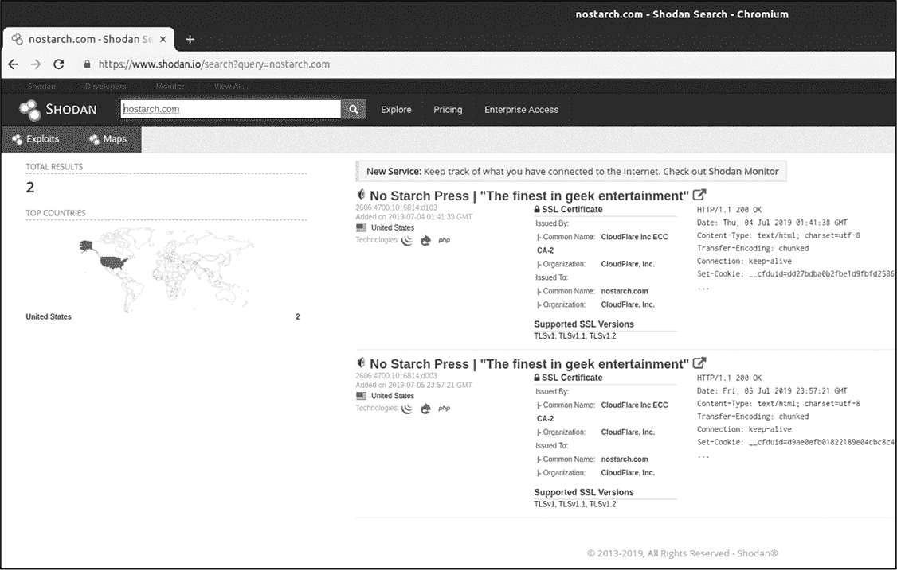
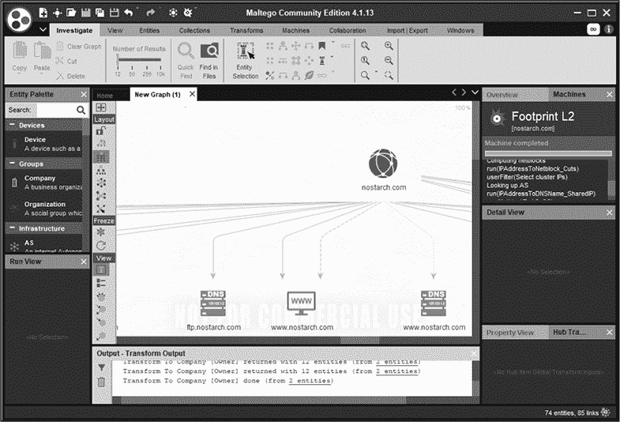
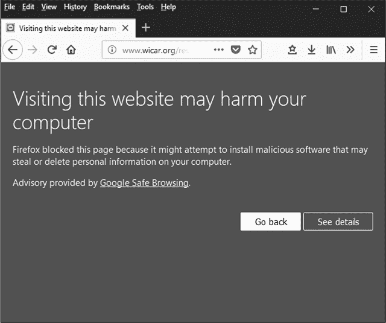

## 人类因素安全

在信息安全领域，我们将人称为安全程序的“薄弱环节”。无论你设置了多少安全措施，你对员工的行为几乎没有控制，他们可能会点击危险的链接，通过不安全的渠道发送敏感信息，交出密码，或者将重要数据发布在显眼的位置。

更糟糕的是，攻击者可以利用这些倾向进行*社交工程攻击*，通过操纵他人来获取信息或进入设施。这些攻击通常依赖于人们愿意帮助他人，特别是在面对显得处于困境中的人、令人畏惧的人（如高级经理）或看起来熟悉的人时。

话虽如此，你可以采取措施保护组织免受这些攻击，通过制定适当的政策，并教育员工识别危险。在本章中，你将了解攻击者可能收集的各种数据、几种类型的社交工程攻击，以及如何建立有效的安全培训计划来提醒你的员工。

### 为社交工程攻击收集信息

为了保护你的组织，你需要了解社交工程师如何收集数据。今天，人们比以往任何时候都能更快地收集到关于个人和组织的信息。在线数据库、公共记录和社交媒体网站上存在着惊人的信息财富，在许多情况下，这些数据是可以自由获取的。许多人会将他们日常活动的详细个人信息发布在网上，供全世界查看。

一旦攻击者收集到有关内部流程、人员或系统的信息，他们就可以利用这些信息进行复杂的攻击。如果攻击者打电话给公司，直接要求一份包含敏感销售数据的报告，电话那头的人很可能会拒绝。然而，如果攻击者使用社交工程技术，打电话时用慌张的语气请求从 SalesCom 服务器上的销售目录中获取最新的 TPS-13 报告副本，因为他们需要在 15 分钟内与黑泽先生开会，且笔记本电脑刚刚崩溃，那么他们更有可能成功。（这是一种被称为"前提设定"的社交工程攻击，我将在本章后面详细讨论。）

了解攻击者可能会在诸如刚才讨论的案例中使用的信息类型是很重要的。在保护个人和商业组织时，你应该关注两个主要的信息来源：人类情报和开放源代码情报。

#### *人类情报*

对于全球范围内的军事和执法组织来说，*人力情报（HUMINT）*是一种通过与人交谈收集的数据。HUMINT 数据可能包括个人观察、人员的日程安排、敏感信息或其他类似的信息。你可以通过敌对手段（例如酷刑）或通过巧妙的骗局欺骗参与者来收集 HUMINT。安全专业人员关注的是后者。

例如，你可以使用 HUMINT 作为进行其他社会工程攻击的基础。你可以观察进出办公楼的交通，注意到该办公室频繁收到包裹，并且每天早晨 8 点都有换班，导致许多人在同一时间进出大楼。在这个繁忙时段，你穿上熟悉的送货制服，进入设施的机会会大大增加。

#### *开放源代码情报（OSINT）*

*开放源代码情报（OSINT）*是从公开可用的来源收集的信息，比如职位发布和公共记录。这些公开的数据可以揭示大量有用的信息，包括特定组织使用的技术、组织结构，以及人员的具体名字和职位。OSINT 是社会工程攻击的主要信息来源之一。

##### 简历和职位发布

在简历中，你可能会找到工作经历、技能以及兴趣爱好，这些信息可以被攻击者用来根据目标的技能或兴趣设定社会工程攻击。在职位列表中，企业通常会曝光他们通常认为是敏感的信息，包括办公室和数据中心的位置、网络或安全基础设施的细节，以及正在使用的软件。招聘人员可能认为在招聘过程中发布这些信息是必要的，但攻击者也可以利用这些信息来规划攻击或增强未来的监视力度。

例如，如果你收集到某公司运行 Windows 服务器在其云托管环境中，并且使用 CompanyX 的杀毒软件，你已经显著减少了在规划攻击时需要考虑的变量数量。如果你收集到更多关于他们信息安全团队的位置和成员的信息，你也许能够预测到他们响应攻击的技能水平和时机，从而使你的攻击更加有效。

##### 社交媒体

攻击者可以轻松地利用社交媒体工具，如 Facebook 和 Twitter，收集开放源代码情报（OSINT），通过跟踪某人的活动、寻找他们的朋友和其他社交联系，甚至追踪他们的物理位置。他们可以利用这些信息来监视目标或采取更直接的行动，比如勒索。在许多情况下，年轻人往往更愿意记录可疑活动，这可能为这类信息提供更丰富的来源。

2016 年美国总统大选结果的操控尝试提供了一个示例，展示了攻击者如何利用社交媒体工具。在大选前的几个月，位于俄罗斯的互联网研究机构购买了大约 3,500 个 Facebook 广告，目的是通过触及种族、执法和移民等主题，在目标选民群体中煽动紧张情绪。2018 年 2 月，美国联邦大陪审团起诉了 13 名为互联网研究机构工作的俄罗斯人，指控他们参与这些活动。¹ 这是社会工程学的经典案例，稍后我会在本章中详细讨论。

##### 公共记录

公共记录可以提供关于目标的大量信息，包括抵押贷款、婚姻、离婚、法律诉讼和停车罚单等证据。攻击者通常利用这些数据进行额外的搜索，找到更多的信息。

公共记录的定义可能会根据记录的地理位置和持有该记录的机构而有所不同。在美国，各州的法律不同，因此在一个州合法访问的信息，在另一个州可能是非法的。

##### Google 黑客攻击

Google 和其他搜索引擎是信息收集的优秀资源，尤其是当攻击者使用高级搜索操作符时，如下所示：

**site** 限制结果为特定网站（site:[nostarch.com](http://nostarch.com)）

**filetype** 限制结果为特定文件类型（filetype:pdf）

**intext** 查找包含某些词或词组的页面（intext:security）

**inurl** 查找 URL 中包含某个词或词组的页面（inurl:security）

你可以将这些操作符结合到一个搜索中，以检索特定的结果。例如，在搜索框中输入**site:[nostarch.com](http://nostarch.com) intext:andress security**，应该会返回该书籍出版商的页面，如图 8-1 所示。

*图 8-1：Google 搜索操作符的应用*

Google Hacking 数据库（*[`www.exploit-db.com/google-hacking-database/`](https://www.exploit-db.com/google-hacking-database/)*），如图 8-2 所示，包含了利用高级搜索操作符进行的预设 Google 搜索，用于查找特定的漏洞或安全问题，如包含密码的文件或易受攻击的配置和服务。

*图 8-2：Google Hacking 数据库*

这不仅提供了一套预先组装好的搜索，用户可以轻松点击使用，还展示了使用搜索操作符的一些更复杂方式。例如，图 8-2 中的底部搜索展示了三个不同操作符的组合（inurl:、intext:和 ext:）。你可以轻松替换这些术语，重新定向搜索以供自己使用。

##### 文件元数据

*元数据* 是几乎所有文件中关于数据的数据，它不仅能揭示像时间戳和文件统计信息等平凡的内容，还能展示更有趣的数据，如用户名、服务器名称、网络文件路径以及已删除或已更新的信息。文件元数据为搜索、排序、文件处理等提供数据，而这些数据通常对用户不可见。许多专业的取证工具，如 EnCase (*[`www.guidancesoftware.com/encase-forensic/`](https://www.guidancesoftware.com/encase-forensic/)*)，具有特定功能，可以在取证调查中快速、轻松地恢复这些数据类型。

图像和视频文件的元数据，称为 *EXIF 数据*，包含如相机设置和硬件等信息。你可以使用 ExifTool (*[`www.sno.phy.queensu.ca/~phil/exiftool/`](https://www.sno.phy.queensu.ca/~phil/exiftool/)*)，一个优秀的跨平台工具来查看和编辑 EXIF 数据，它支持多种文件类型。尤其是一些已经存在很长时间且由多人编辑的文档文件，它们所包含的元数据可能会让你感到惊讶。试试下载并使用它来分析一些文档或图像文件。

含有全球定位系统（GPS）信息的设备生成的图像文件，可能还包含位置信息；如果智能手机启用了相机的定位设置，它会将用户的位置信息嵌入到图像文件中，这意味着将这些图像上传到互联网可能会泄露敏感数据。

目前有许多工具可以帮助从 OSINT（以及其他）来源收集信息。Shodan 和 Maltego 是其中两个较为常见且知名的工具。

##### Shodan

Shodan，如图 8-3 所示，是一个基于网络的搜索引擎，用于查找保存在互联网上连接设备中的信息。

*图 8-3：Shodan*

Shodan 允许你搜索特定的信息，如特定的硬件、软件或开放端口。例如，如果你知道某个特定文件传输协议（FTP）服务的一个易受攻击的版本，你可以让 Shodan 在其数据库中列出所有该服务的实例。同样，你也可以请求 Shodan 提供它所知道的某个域名或服务器的所有信息，并即时查看其中可能存在的特定漏洞。

##### Maltego

Maltego (*[`www.paterva.com/`](https://www.paterva.com/)*)，如图 8-4 所示，是一个情报收集工具，通过特定数据点之间的关系，称为 *transforms*，来发现与你已经拥有的信息相关的内容。

*图 8-4：Maltego*

例如，你可以通过提供一个网站的域名给 Maltego，然后使用变换找到网站上列出的姓名和电子邮件地址。通过这些姓名和电子邮件地址，你可以基于相同的邮件格式在互联网上找到其他地址和姓名。你还可以找到托管该域名的服务器的互联网协议（IP）地址，并进一步找到托管在同一服务器上的其他域名。

Maltego 会在图形上显示你的搜索结果，图形展示了每个发现项之间的链接。你可以通过点击图形中的具体项并选择新的变换来进行进一步的搜索。

#### *其他类型的情报*

OSINT 和 HUMINT 绝不是你可以收集的唯一类型情报。你还可能会看到其他类型的情报：

**地理空间情报（GEOINT）** 通常来自卫星的地理信息。

**测量与签名情报（MASINT）** 从传感器（如光学或天气读取器）收集的测量和签名数据。MASINT 包含一些特定传感器类型的情报，如 RADINT，或者从雷达收集的信息。

**信号情报（SIGINT）** 通过拦截人们或系统之间的信号收集的数据。你可能还会看到这个术语被称为通信情报（COMINT），用于指人际通信，或电子情报（ELINT），用于指系统间的通信。

**技术情报（TECHINT）** 关于设备、技术和武器的情报，通常是为了开发对策而收集的。

**金融情报（FININT）** 关于公司和个人的财务交易数据，通常来自金融机构。

**网络情报/数字网络情报（CYBINT/DNINT）** 从计算机系统和网络中收集的情报。

大多数其他类型的情报将归类于这些类别中的某一项。

### 社会工程攻击的类型

本节讨论了在上一节中收集到的信息可以用于进行的一些社会工程攻击。

#### *预设身份*

在 *预设身份* 攻击中，攻击者利用他们收集到的信息，冒充经理、客户、记者、同事的家人或其他值得信赖的人。通过伪造身份，他们创建可信的情境，诱使目标泄露敏感信息或执行他们通常不会为陌生人做的行为。

攻击者可以在面对面的接触中，或通过某种通信媒介使用预设身份。直接互动需要对细节如肢体语言保持高度关注，而间接接触（如通过电话或电子邮件进行的接触）则要求更强的注意力集中在语言习惯上。这两种类型的攻击都需要良好的沟通和心理技能、专业知识以及敏捷的思维。

预设欺骗为社会工程师提供了优势。例如，如果社会工程师能够提及名字，提供关于组织的细节，并使目标有充分的理由相信他们有权获得请求的信息或访问权限——或者，实际上，他们已经拥有了这些信息——那么他们成功的机会将大大增加。

#### *网络钓鱼*

*网络钓鱼*是一种社会工程技术，攻击者通过电子通讯方式，如电子邮件、短信或电话，收集目标的个人信息或在其系统上安装恶意软件，通常通过说服目标点击恶意链接来实现。

用于基于网页的网络钓鱼攻击的虚假网站通常模仿一些知名网站，例如银行、社交媒体或购物网站。有些看起来明显是假的，公司的标志模仿得很差，语法也很糟糕，而其他一些则极其难以与合法页面区分。幸运的是，近年来许多浏览器在安全性方面有所改进，现在通过显示警告（如图 8-5 中的警告）来使网络钓鱼攻击变得更加困难。

*图 8-5：网络钓鱼警告*

然而，即使没有这些警告，大多数网络钓鱼攻击也会失败，除非目标在被伪造的网站上有账户；比如没有 MyBank 银行账户的人不会轻易上当，点击一个伪造的 MyBank 银行网站。即便目标确实拥有账户，现如今人们对银行或其他网站的未经请求的电子邮件也变得更加谨慎。总体而言，网络钓鱼攻击依赖于接收者对细节的不关注，因此其成功率仍然较低。

为了提高成功率，攻击者可能会转向*鱼叉式钓鱼*，即针对特定公司、组织或个人的定向攻击。鱼叉式钓鱼攻击需要进行高级侦察，以便信息看起来像是来自目标信任的人，例如人力资源人员、经理、公司 IT 支持团队、同事或朋友。

虽然普通的网络钓鱼攻击可能显得笨拙且构建不良，旨在欺骗大池中的小部分接收者，但鱼叉式钓鱼攻击则采取了相反的策略。例如，鱼叉攻击者通常会发送干净的电子邮件，包含预期的标志、图形和签名区块，并且他们会伪装任何恶意链接。如果攻击的目的是窃取某个网站或服务的凭证，攻击者甚至可能使用刚刚窃取的凭证将目标登录到真正的网站，从而不会留下错误信息或会话断开，令目标察觉到有异常发生。

#### *尾随攻击*

物理*尾随攻击*，或称搭便车攻击，是指通过跟随某人进入一个受控的访问点，例如安全门，而不是使用通常需要的凭证、徽章或钥匙。被授权的人可能故意或无意地让你进入。

尾随行为几乎发生在任何使用技术访问控制的地方，部分原因是授权用户的疏忽，部分原因是大多数人倾向于避免对抗。一些设备技巧，例如知道使用哪些道具，以及利用心理学让攻击者能够利用他人的同情心，将有助于他们进行尾随攻击。

**社会工程学的进一步资源**

访问 Chris Hadnagy 的官网 *[`www.social-engineer.com/`](https://www.social-engineer.com/)* 以及他那本出色的书《社会工程学：人类黑客的科学》，了解更多关于社会工程学的信息。Hadnagy 在这方面的讲解要比我在这里讲的更为深入，关于社会工程学攻击能够做什么，他有更详细的讨论。

### 建立安全意识与安全培训计划

为了保护你的组织，你需要通过实施安全培训计划来提高用户的安全意识。这些计划通常包括在新员工入职时进行的由讲师主导或计算机支持的课程，并辅以强制性的小测试。你还可能会定期重复这些培训，以确保员工记住相关信息。

本节概述了你在这些培训计划中通常应该涵盖的一些主题。

#### *密码*

虽然你可以使用技术工具来确保用户选择强密码，但你无法轻易控制用户如何使用这些密码。例如，一名员工可能会把自己的密码写下来并粘贴在键盘底部，或者为了方便而与其他用户共享密码。

另一种有害行为是为多个账户使用相同的密码。即使你强制要求用户在工作场所的系统上创建强密码，用户也可能手动将组织中所有其他系统的密码同步为相同密码（包括他们的虚拟私人网络凭证，允许外部访问组织网络），然后回家后再用相同的方式同步他们的互联网论坛凭证、电子邮件和在线游戏密码，以便让生活更轻松。不幸的是，如果攻击者破坏了他们论坛的密码数据库，并发布了用户的电子邮件地址和解密后的密码，攻击者就可以获取大量令人不安的信息——可能包括用户发到家庭地址的公司 VPN 连接说明。

不幸的是，糟糕的密码管理问题是一个难以通过技术手段解决的问题，而教育是解决这个问题的最佳方法之一。你应该推动用户即使在没有被直接强制的情况下，也创建强密码，告诉他们不要将密码放置或记录在可能被轻易破解的地方，并要求他们不要在多个系统或应用程序中反复使用相同的密码。

#### *社会工程学培训*

训练用户识别并应对社会工程学攻击是一个非常艰巨的任务，因为这类攻击利用了我们的行为规范和倾向。幸运的是，公众对钓鱼邮件和诈骗的认知逐渐提高。

广泛来说，你应该教导用户对任何看起来不寻常的事情保持怀疑，包括邮箱中不典型的请求或邮件以及工作环境中的陌生人，即使这些情况看起来包裹在一层正常性中。

当面对丝毫疑虑时，要要求人们*信任但要验证*。你的用户可能会向你的安全操作中心发送大量电话和电子邮件，但至少他们不会把几千美元汇给一个自称是公司副总裁的人，声称自己在出差时被抢劫并急需资金回国。

#### *网络使用*

你应该与用户讨论正确的网络使用方式。正如我将在第十章中讨论的那样，今天人们可以访问各种网络，包括从工作场所相对受限的网络到家庭、咖啡馆和机场等开放网络。

一个没有安全意识的用户可能会认为在工作时将笔记本连接到会议室的网络与在酒店连接无线网络是一样的，这同样也等同于在机场连接网络。通常，人们把访问网络看作和使用任何公用设施一样，像是墙插提供的电力或灯具发出的光一样；他们期望它随时存在并且按预期工作。除此之外，大多数人对网络中存在的风险并不会过多思考。

你应该引导用户采取能保护企业网络的行为。这意味着你通常不应允许外部设备连接到网络。用户需要知道他们不能允许供应商在会议室插入设备，也不能将自己的 iPad 连接到生产网络。例如，你应该提供一个适当的备用网络供外部设备使用，如访客无线网络，并确保用户知道如何连接它，以及在使用时的相关限制。

此外，你应该限制在外部网络上使用公司资源，这是许多组织长时间以来严重受损的问题。如果你将敏感数据装载在笔记本电脑中，然后连接到当地咖啡店或酒店的网络，你可能会不小心将这些数据分享给网络中的其他人。

解决这个问题的一个简单技术方案是实施一个 VPN，允许用户访问公司网络。你应该配置 VPN 客户端，使其在发现自己连接到外部网络时自动连接到 VPN。此外，你还应教导用户避免将包含敏感信息的设备连接到不安全的网络。

#### *恶意软件*

教育用户关于恶意软件的知识通常包括教他们不要随便点击东西。当他们浏览网页、打开电子邮件附件、浏览社交网络和使用智能手机时，他们应该注意以下常见的警告信号：

+   来自陌生人的电子邮件附件

+   包含潜在可执行文件类型的电子邮件附件，这些文件可能包含恶意软件，如 EXE、ZIP 和 PDF

+   使用缩短网址的网页链接，如 *[`bit.ly/`](http://bit.ly/)* （如果有疑问，用户可以使用像 *[`linkexpander.com/`](https://linkexpander.com/)* 或 *[`unshorten.me/`](http://unshorten.me/)* 这样的工具验证缩短网址的目标地址）

+   网页链接的名称与预期稍有不同（例如，*myco.org* 而不是 *[myco.com](http://myco.com)*）

+   从非官方下载站点下载的智能手机应用

+   非法软件

如果你在用户心中植入一种健康的偏执感，他们会在点击可疑链接之前先打电话给你的帮助台或安全团队询问问题。

#### *个人设备*

你应该设定规则，规定员工何时以及如何在工作场所使用个人设备。通常，你可能允许他们在组织网络的*边界*上使用它；这意味着你允许他们带着笔记本电脑来上班，并将其连接到访客无线网络，但不能连接到与公司生产系统相同的网络。

你还应确保传达这些政策适用于能够连接到网络的设备，如供应商笔记本电脑或移动设备。

#### *清洁桌面政策*

*清洁桌面政策*规定，敏感信息不应长时间无人看管地放在桌面上，例如过夜或午休时。引入此类政策时，你还应该讨论如何妥善处理存储在物理介质上的敏感数据，如纸张或磁带，通过使用碎纸机、数据销毁服务和媒体粉碎机。

#### *对政策和法规知识的熟悉度*

最后，虽然重要性不言而喻，如果你希望用户遵守这些规则，你需要有效地传达这些规则。你可能无法通过仅仅向所有用户发送包含冗长政策链接的电子邮件，并让他们声明已经阅读过它，来真正教育他们。相反，你可以尝试将政策中最关键的部分浓缩成备忘录或要点摘要，确保用户能够记住重点。

此外，如果你正在制作培训演示文稿，可以尝试让它更加有趣。例如，如果你有一个小时的时间来为新员工进行安全意识培训，你可以将讲解部分缩短到 30 分钟，然后用剩下的时间进行一个互动的问答竞赛游戏，内容是你刚刚讲解的材料。一旦通过将班级分成小组并添加奖励（比如奖励给获胜者），你就创造了一个更有趣的环境。

你还可以通过海报、赠送钢笔或咖啡杯以及新闻通讯等方式吸引用户的注意。如果你通过反复且多样化的渠道传递信息，你更有可能在长期内教育用户。

### 总结

在本章中，你探讨了有关信息安全人类因素的各种问题：那些仅靠技术手段无法解决的安全问题。无论是由于疏忽还是针对性的社交工程攻击，组织中的员工都构成了一个安全挑战，而你无法通过技术控制直接应对这一挑战。

我讨论了社交工程攻击的类型，你也看到了攻击者如何利用这些技巧诱使人们在你的组织中提供信息或强迫进行未授权的行为。我还讲解了如何建立安全意识和培训项目。与用户讨论的常见问题包括保护密码、识别社交工程攻击和恶意软件、安全使用网络和个人设备，以及遵守清洁桌面政策。如果你让安全意识和培训项目具有吸引力，这些信息更有可能随着时间的推移在用户中留下深刻印象。

### 练习

1.  为什么人是安全程序中的薄弱环节？

1.  定义尾随行为。为什么这会成为一个问题？

1.  如何更有效地在你的安全意识和培训工作中接触用户？

1.  为什么不应该允许员工将个人设备连接到组织的网络？

1.  如何训练用户识别钓鱼邮件攻击？

1.  为什么不应该为所有账户使用相同的密码？

1.  什么是预文本攻击？

1.  为什么在酒店使用无线网络连接公司笔记本可能会很危险？

1.  为什么点击来自[bit.ly](http://bit.ly)等服务的缩短网址可能会很危险？

1.  为什么使用强密码很重要？
