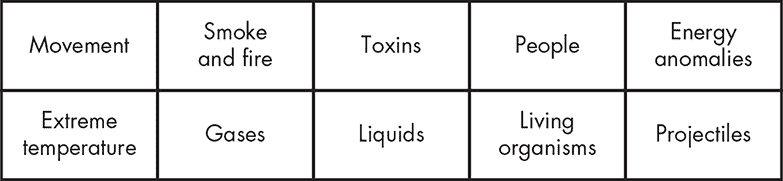
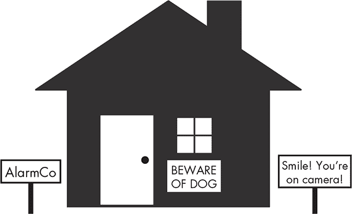
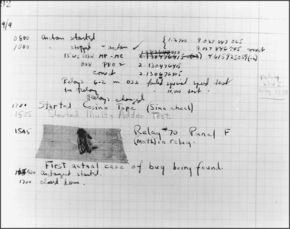

## 物理安全

本章将讨论物理安全，即我们为保护人员、设备和设施所采取的安全措施。在大多数地方，你会看到如锁、围栏、摄像头、保安和照明等物理安全措施。在高安全级别的环境中，你可能还会注意到虹膜扫描仪、人陷阱（需要你通过两个锁定的门才能进入建筑，类似于具有两个入口的电话亭）或配备存储证书功能的身份证件。

物理安全涉及保护三大类资产：人员、设备和数据。你的首要目标当然是保护人员。人员本身就具有很高的价值，而且比设备或数据更难替代，尤其是当他们在自己的领域有经验并且对他们所执行的过程和任务非常熟悉时。

尽管在本章中我将把人员、数据和设备的保护作为独立的概念进行讨论，但每一类的安全都是紧密相连的。你通常不能——也不应该——制定单独保护任何一类资产的安全计划，而忽略其他类别的安全。

许多大型组织通过实施一套政策和程序来保护他们的资产，这些措施统称为业务连续性规划（BCP）和灾难恢复规划（DRP）。*业务连续性规划*指的是在紧急状态下确保关键业务功能能够继续运作的计划。*灾难恢复规划*指的是为潜在灾难做准备的计划，包括灾难发生时及之后该做什么，如设施内的撤离路线图或显示撤离集合地点的标识。

### 识别物理威胁

然而，在实施任何物理安全措施之前，你必须首先识别威胁。物理安全威胁通常分为几个主要类别，如图 9-1 所示。

*图 9-1：物理威胁的类别*

Donn Parker 在他的书《*打击计算机犯罪*》中定义了七种物理威胁类别——极端温度、气体、液体、活体生物、抛射物、运动和能量异常，并在书中介绍了第一章中讨论的 Parkerian 六元组。（尽管这本书是在十多年前写的，我仍然认为它是安全从业者的必读书籍。）

在本章关于保护人员、设备和数据的各个部分中，我将讨论这些威胁如何影响每个资产（如果有影响的话）。

### 物理安全控制

物理安全控制是你为确保物理安全而采取的设备、系统、人员和方法。物理控制主要有三种类型：威慑性、侦测性和预防性。每种类型的关注点不同，但它们之间并非完全独立，稍后我会讨论这一点。此外，这些控制措施在协同作用下效果最佳。在大多数情况下，单一的控制措施不足以确保你的物理安全。

#### *威慑性控制*

威慑性控制旨在劝阻那些可能试图违反其他安全控制的人，通常它们会显示其他安全措施的存在。威慑性控制的例子包括在公共场所张贴的标志，宣称有视频监控的存在，以及在住宅区使用的带有报警公司标志的院子标志，如图 9-2 所示。

*图 9-2：威慑性控制*

这些标志本身并不能阻止人们采取不当行为，但它们确实指出了采取不当行为可能带来的后果。这些措施有助于让诚实的人保持诚实。

#### *侦测性控制*

侦测性控制，如防盗报警器和其他物理入侵检测系统，用于感知并报告不良事件。这些系统通常会检查是否存在未经授权的活动迹象，如门窗开启、玻璃破裂、运动和温度变化。你还可以使用它们检查不良的环境条件，如洪水、烟雾和火灾、电力中断或空气中的污染物。

侦测性系统也可以包括人类或动物守卫，无论他们是亲自巡逻区域，还是通过摄像头或其他技术设备间接监控，如图 9-3 所示。

*图 9-3：侦测性控制*

使用守卫进行监控既有优点也有缺点。与技术系统不同，生物体可能会分心，而且他们需要离开岗位去吃饭和上厕所。另一方面，守卫能够做出推理和判断，这使得他们在某些情况下比技术解决方案更高效或更具洞察力。

#### *预防性控制*

预防性控制使用物理手段来阻止未经授权的实体突破你的物理安全。机械锁是预防性安全的一个极佳示例，因为它们几乎在所有地方都被用来保护企业、住宅和其他地方免受未经授权的进入，如图 9-4 所示。

*图 9-4：预防性控制*

其他预防性控制包括高围栏、防撞柱，以及再次提到的守卫和警犬，它们既是侦测性也是预防性控制。这些控制可能专门针对人员、车辆或其他关注区域，具体取决于环境。

#### *使用物理访问控制*

预防性控制通常构成我们安全工作核心。在某些情况下，它们可能是唯一的物理安全控制。例如，许多房屋有门锁，但没有报警系统或能够威慑犯罪分子的消息。

在商业设施中，您更有可能看到实施所有三种控制方式，通常包括锁具、报警系统和指示报警系统存在的标志。遵循深度防御原则，您设置的物理安全层次越多，您就越安全。

您还应实施与资产价值相一致的物理安全级别，正如第七章所讨论的。如果您有一个空仓库，用高安全性锁、报警系统和武装警卫来保护它是没有意义的。同样，如果您有一屋子的昂贵计算机和电子设备，用便宜的锁而完全放弃报警系统也是不合适的。

### 保护人员

物理安全主要旨在保护那些维持您业务运转的人员。在许多情况下，您可以通过备份恢复数据，如果旧设施被毁坏或损坏，您可以建立新的设施，购买新的设备，但在合理时间内更换经验丰富的人员是困难的，甚至是不可能的。

#### *人员的物理问题*

与设备相比，人员相对脆弱。他们容易受到图 9-1 中列出的几乎所有物理威胁的影响。

*极端温度*，甚至是非极端的温度，也可能迅速变得不舒适，某些*液体*、*气体*或*毒素*的存在或缺失也可能带来不适。甚至是水，过量也能造成伤害，就像 2018 年佛罗伦萨飓风期间美国南部发生的大规模洪水。

同样，缺乏氧气等气体，或者氧气过多，也会很快对人类造成致命危险。某些化学品在小剂量用于过滤设施中的水时对我们有益，但如果化学比例或混合物发生变化，它们则会变得有害。

各种*生物*，从较大的动物到几乎看不见的霉菌、真菌或其他微观生物，都可能对人类构成危险。动物可能咬伤或刺伤人；霉菌可能引起呼吸问题。

显著的*运动*对人类有害，特别是当这种运动来自地震、滑坡、雪崩或建筑物的结构问题时。*能量异常*也对人类极具危险性。例如，设备的屏蔽或绝缘维护不当，或机械或电气故障，可能使人暴露于微波、电流、无线电波、红外线、辐射或其他有害辐射中。这些暴露的后果可能在电击的情况下立即显现，或者在辐射情况下可能具有长期影响。

其他*人*可能是对人类构成的最严重威胁之一。有人可能会在黑暗的停车场攻击你的员工。在某些地区，你可能会遇到社会动荡。你可能会成为社会工程攻击的目标，正如在第八章中讨论的那样，攻击者从你的员工那里提取信息，以获得未经授权的进入设施或数据的权限。

*烟雾和火灾*可能会导致灼伤、烟雾中毒和温度问题（通常情况下，人们在过热时会表现不佳）等其他问题。特别是在大型设施中，烟雾和火灾可能使区域的物理布局变得混乱，难以引导人员安全撤离。如果你的供应品、基础设施或建筑本身因高温而反应并释放毒素、倒塌或产生本节中讨论的其他威胁，问题可能会加剧。

#### *确保安全*

由于许多数据中心使用危险化学品、气体或液体来扑灭火灾，设施管理员通常会为灭火系统配备安全覆盖装置，以防止在区域内有人的情况下系统启动。这些措施优先保护人命安全，而非设备和数据。

#### *撤离*

同样，在紧急情况下，你应当优先考虑撤离人员，而不是抢救设备。规划撤离程序是确保人员安全的最佳方法之一。规划撤离时需要考虑的主要原则是“哪里”、“如何”和“谁”。

##### 哪里

提前考虑你将撤离到哪里。你需要将所有人带到同一个地方，确保他们远离危险区域，并且可以清点到每个人。如果你没有有序且一致地进行撤离，可能无法确保每个人的安全。商业建筑通常会通过标志和撤离地图展示撤离集结地点。

##### 如何

同样重要的是你将要走的路线，目的地是撤离集结地点。在规划路线时，你需要考虑每个区域最近的出口位置，以及在紧急情况下可能被封堵的备用通道。你还应该避免经过任何潜在危险或无法使用的区域，如电梯或被自动关闭防火门封锁的房间。

##### 谁

撤离过程中最重要的部分，当然是确保将每个人都带出建筑，并确保能在撤离集结地点清点到每一个人。这个过程通常需要至少两个人：一个人确保小组中的每个人都已离开场地，另一个人在集结地点确保每个人安全到达。

##### 演练

尤其在大型设施中，全面撤离可能是一项复杂的任务。在真正的紧急情况下，如果你没有迅速而妥善地撤离，可能会导致大量人员伤亡。

举个例子，考虑 2001 年美国世界贸易中心的袭击。2008 年进行的一项研究发现，只有 8.6%的人员在警报响起时从大楼中撤离。其余人员则留在原地，收拾物品，关闭计算机，执行其他任务。¹ 训练人员在发出撤离信号时迅速并正确地做出反应是非常重要的。

#### *行政控制措施*

大多数组织还会采取各种行政控制措施来保护人员安全。行政控制措施可能是由任何权威机构（从公司到联邦政府）制定的政策、程序、指南、法规、法律或类似的规则。

一项常见的行政控制措施是公司使用背景调查来筛选潜在的求职者。这些调查通常包括刑事历史检查、对以前工作和教育经历的核实、信用检查以及药物测试，具体取决于所申请的职位。

公司还可能对员工进行各种定期检查，如药物测试。当员工离职时，雇主通常会进行离职面谈，以确保员工已经归还所有公司财物，并撤销其对系统或区域的访问权限。公司还可能要求员工签署文件，同意不对公司提起法律诉讼，或签署额外的保密协议（NDA）。

### 保护数据

仅次于人员安全的是数据安全。如第五章中所述，保护数据的主要方式是加密。然而，单靠加密并不足够；攻击者可能通过破解加密算法或获取加密密钥来访问数据。此外，加密不能保护数据免受各种物理条件的影响。

遵循第一章中讨论的深度防御概念，您应当增加额外的安全层，以保护您的物理存储介质免受攻击者、不利环境条件和其他威胁的影响。

#### *数据的物理保护*

不利的物理条件，包括温度变化、湿度、磁场、电力和物理冲击，可能会损害物理介质的完整性。此外，每种物理介质都有其优缺点。

*磁介质*，如硬盘、磁带和软盘，利用运动和磁感应材料的结合来记录数据。强磁场可能会破坏存储在磁介质上的数据完整性，尤其是当介质缺乏金属外壳时，比如磁带。此外，在磁介质运动时（读取或写入时）遭遇震动，可能会导致介质无法使用。

*闪存媒介*，或将数据存储在非易失性存储芯片上的媒介，更加坚固。如果避免对存储数据的芯片造成直接的冲击，并且保护这些芯片免受电击，它们通常能承受许多其他类型的媒介无法忍受的条件。它们对温度的敏感性较低，只要温度不至于破坏媒介的外壳，它们通常能承受短时间的液体浸泡，只要事后 properly 风干。一些闪存驱动器专门设计为能够在通常会摧毁其他媒介的极端条件下生存。

*光学媒介*，如 CD 和 DVD，非常脆弱，任何有小孩的人都可以证明这一点。即使是光盘表面上的小划痕，也可能导致它无法使用。它还对温度极为敏感，因为它主要由塑料和薄金属箔制成。在没有保护的环境中，比如专门设计的媒体存储库，各种威胁可能会摧毁光学媒介。

在长时间存储媒介时，你应该考虑技术过时的问题。例如，索尼在 2011 年 3 月停止生产软盘。在此之前，该公司生产了 70%的新软盘。²如今，几乎没有新电脑配备读取软盘的驱动器，在不久的将来，找到能读取这些磁盘的硬件将变得非常困难。

#### *数据的可访问性*

你不仅要保护数据的物理完整性，还必须确保在需要访问数据时，数据是可用的。这通常意味着你的设备和设施必须保持正常工作状态，并且存储数据的媒介必须可用。任何我提到的物理问题，都可能导致你的数据既无法访问，又无法使用。

一些可用性问题与基础设施有关。例如，在停机期间，无论是网络、电力、计算机系统或其他组件出现问题，你可能无法远程访问你的数据。如今，许多企业在全球运营，因此即使是短时间无法远程访问数据，也可能带来严重的影响。

为确保数据的可用性，备份数据本身以及提供访问数据所需的设备和基础设施。使用*冗余阵列的廉价磁盘（RAID）*，或 RAID 阵列，以各种配置进行备份。RAID 是一种将数据复制到多个存储设备上的方法，用以保护数据，以防任何一个设备被摧毁。你可以在计算机协会（ACM）数字图书馆中阅读描述基本概念的原始论文《冗余阵列的廉价磁盘（RAID）的理由》。³

你还可以通过网络将数据从一台机器复制到另一台机器，或者将数据复制到备份存储媒介上，如 DVD 或磁带。

#### *残留数据*

另一方面，在你需要数据时能够访问它，你也必须能够在不再需要时使数据无法访问。例如，你可能会记得在扔掉含有敏感数据的纸张之前将其销毁。但人们经常忘记电子媒介上存储的数据。

在 2016 年，Blancco 对从 eBay 和 Craigslist 购买的 200 个二手硬盘进行了研究。当研究人员分析这些磁盘的内容时，他们发现许多磁盘仍然包含敏感数据，包括公司信息、电子邮件、客户记录、销售数据、图片和社会保障号码。在许多情况下，根本没有人尝试擦除磁盘上的数据；而在其他情况下，数据擦除的操作也非常不彻底。⁴

除了明显含有存储并持有潜在敏感数据的设备外，你可能还会在复印机、打印机和传真机等设备中发现残留数据，这些设备可能包含易失性或非易失性的内部存储，通常是硬盘的形式。在硬盘中，你可能会找到处理过的文件副本，包括敏感的商业数据。当你将这些设备退役或送修时，务必从存储介质中删除数据。

### 保护设备

最后，保护你的设备和存放它们的设施。这个类别排在最后，因为它代表了最容易和最便宜的资产部分。如果一个重大灾难摧毁了你的设施和里面的所有计算设备，只要你仍然有员工来运营你的工作并能够访问关键数据，你很快就能恢复工作状态。

尽管恢复到事件发生前的状态可能需要一些时间，但你通常可以相对轻松地更换地面空间或迁移到附近的其他区域，而计算设备既便宜又充足。

#### *设备的物理问题*

与员工或数据相比，你会发现对设备的物理威胁要少一些，尽管它们仍然很多。

*极端温度*——特别是高温——可能会损害你的设备。在包含大量计算机及相关设备的环境中，我们依赖环境调节设备来将温度保持在合理范围内，通常是华氏 60 多度到 70 多度之间。（专家们仍在争论理想的温度范围。）

*液体*，即使是少量的液体，比如潮湿空气中的水分，也可能会损坏设备。根据液体的种类和数量，它可能会导致多种设备腐蚀、电子设备短路以及其他有害影响。显然，在像洪水这样的极端情况下，任何被浸泡的设备往往会变得完全无法使用。

*生物体*也可能损坏设备，尽管方式较为轻微。设施中的昆虫和小动物可能会引起电气短路，干扰冷却风扇，啃咬电线，并总的来说造成破坏。

**别打扰我**

人们在 1947 年 9 月开始使用*bug*这个词来表示计算机系统中的问题，当时有人发现一只飞蛾在系统中短接了两个连接，导致系统故障。当工作人员移除这只飞蛾时，他们描述该系统已经被调试过了。⁵你可以在图 9-5 中看到这个实际的“bug”。

*图 9-5：第一只计算机虫*

*运动*，无论是地球内部还是设施的结构中，都可能对设备造成损害。地震是这种情况的明显例子。*能量异常*对任何类型的电气设备都可能极其有害，特别是当电源缺失或提供错误电压时。良好的设施设计可以提供一些对这些威胁的保护，但通常你无法缓解严重电气问题的影响，如雷击。

*烟雾和火焰*对你的设备有害，因为它们会引入极端温度、电气问题、运动、液体（电子设备通常在潮湿状态下无法正常工作）以及各种其他问题。扑灭火灾的努力，根据所采用的方法，可能会造成与火灾本身一样严重的损害。

#### *选址*

在规划新设施时，要考虑设施的位置。如果该地点位于易发生自然灾害的区域，最终你可能会发现设施完全无法使用或被摧毁。其他环境威胁可能包括社会动荡、不稳定的电力或公用设施、差的网络连接，或者极端的温度条件。

通过合理的设施设计，你可以通过安装电源过滤器和发电机来弥补一些问题，例如应对电力问题。但其他问题，比如当地温度，最终可能超出我们的控制范围。对于某些类型的设施，如数据中心，保持无故障的环境至关重要，如果遇到严重的环境问题，你可能需要考虑其他地方。

#### *保护访问*

在保护设备或设施的访问时，可以通过在设施内部和外部多个区域采取安全措施，运用深度防御的概念。再次强调，实施的防护措施的适当性取决于具体情况。军事设施可能会有最高级别的安全；而一个小型零售店可能只有最低级别的安全。

通常，你会在物业周围看到实施的物理安全措施。最基本的措施可能会控制车辆流量，以确保它不会进入不希望进入的地方。例如，这可以采取*安全景观*的形式，包括树木、大石块和水泥花坛，放置在建筑物前或车道旁，防止车辆进入。更安全的设施可能还会有围栏、混凝土屏障以及其他更明显的措施。这些控制措施通常是威慑性的，但也可能是预防性的。

设施的入口处很可能会有锁，无论是机械锁还是电子锁，建筑物的门上都会装上。对于非公共建筑，通常的安排是在工作时间保持主入口解锁，并在内部安排保安或接待员。更安全的设施可能会始终保持门锁，并要求佩戴徽章或钥匙才能进入建筑物。

一旦进入设施，物理访问控制可能包括对内部门或建筑物各楼层的上锁，以防止访客或未经授权的人自由进入整个设施。通常，设施会限制对计算机房或数据中心的访问，仅限于那些出于业务需要必须进入的人。你还可能会在这些区域看到更复杂的物理访问控制，例如生物识别系统。

#### *环境条件*

当谈到设施内部的设备时，保持适当的环境条件对于持续运营至关重要。计算设备对电力、温度和湿度的变化，以及电磁干扰都非常敏感。在设备数量较多的区域，保持适当的条件至少可以说是具有挑战性的。

建造这些设施的人通常会为其配备紧急电力供应源，如发电机，以及可以根据需要调节温度、湿度并进行加热和冷却的系统。不幸的是，这些控制措施成本较高，较小的设施可能无法适当配备。

### 总结

在本章中，你学会了如何使用威慑、侦测和预防措施来减轻物理安全问题。威慑措施旨在阻止可能违反你安全的人，侦测措施会提醒你潜在的入侵，预防控制措施则从物理上阻止入侵发生。这些控制措施本身并不是一个完整的解决方案，但它们结合起来可以让你站在更坚实的立场上。

保护人员应该是你在物理安全中的首要关注点。尽管你通常可以替换数据和设备，但你无法替换人员。保护人员的最好方法之一是迅速将他们从危险的情境中移除。你还可以实施各种行政控制措施，确保他们在工作环境中的安全。

保护数据应该是技术型企业的下一个优先事项。确保在需要时能够访问你的数据，并且当不再需要时，它被完全删除。通过保持备份来确保数据的可用性，无论是使用 RAID 保护存储介质故障，还是使用可移动设备，如 DVD 或磁带。

保护你的设备，尽管是你优先级最低的任务，但仍然是一个至关重要的任务。在选择设施的位置时，考虑相关威胁并采取措施缓解它们。采取必要的步骤来保护设施内外的访问权限。最后，保持适合设备的环境条件。

### 练习

1.  物理安全的三个主要问题是什么，按重要性排序？

1.  物理安全措施的三种主要类型是什么？

1.  为什么你可能想使用 RAID？

1.  物理安全最重要的关注点是什么？

1.  你可能会采取什么类型的物理访问控制来阻止对车辆的访问？

1.  能否举出三个作为威慑手段的物理控制的例子？

1.  能否举例说明一个生物体如何可能构成对你设备的威胁？

1.  哪一类物理控制可能包括锁具？

1.  什么是残留数据，为什么在保护数据安全时它是一个值得关注的问题？

1.  你保护人员的主要工具是什么？
