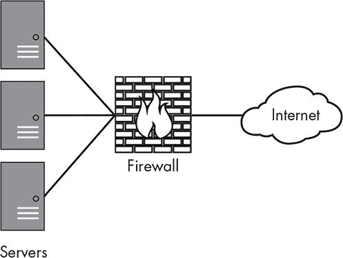
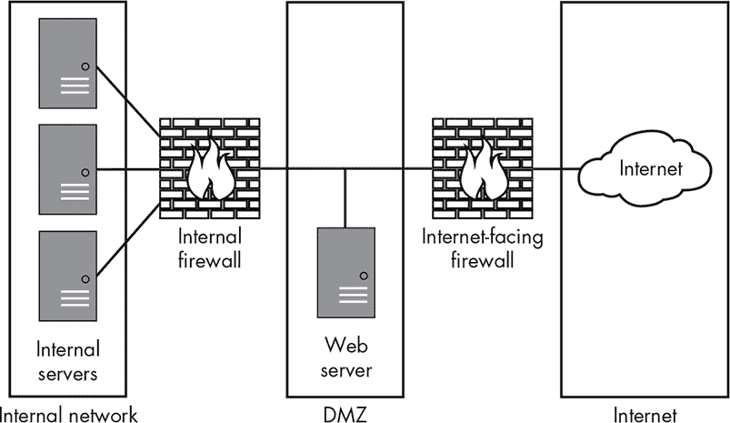

## 网络安全

计算机网络是一组互相连接的计算机或其他设备，用于便于共享资源。你很可能依赖多种网络来进行日常操作。网络控制并使现代汽车、飞机、医疗设备、冰箱以及无数其他设备得以运行。网络让你能够进行通信、导航道路系统、上学、玩游戏、看电视和听音乐。如果没有一个安全稳定的网络系统，你日常享受的许多便利将变得非常难以使用，甚至完全无法使用。

你的网络可能会面临攻击者的威胁；它们也可能遭遇基础设施或网络设备配置错误，甚至是简单的故障。全球大多数地区都依赖网络，因此失去网络连接及其提供的服务可能会让你陷入困境。最严重的情况是，它可能会摧毁你的业务。

2017 年 1 月，喀麦隆的社会动荡达到了高潮，因大规模抗议活动爆发，抗议焦点是法语在一个官方语言为法语和英语的国家中的主导地位。为了遏制抗议者，政府故意将该国大部分以英语为主的地区从全球网络中断开，使其无法连接互联网。这些地区在 93 天后才恢复了网络连接。¹ 这种类型的故障可能会对各行各业产生深远的影响，破坏医疗、通信、就业、教育、购物以及人们生活的许多其他方面。

尽管喀麦隆的情况可能是一个极端例子，但全球每天都发生着较小的网络故障和其他故障，造成严重的影响。这些问题有些可能源于技术故障。其他可能源于本章中我将讨论的特定*分布式拒绝服务攻击（DDoS 攻击）*（来自多个分布式来源的 DoS 攻击），或是完全由网络用户未知的临时原因造成。

本章将介绍你可以部署的基础设施和设备，用于保护你的网络安全，以及你可以用来保护网络流量本身的方法。你还将了解一些工具，帮助你验证安全性。

### 保护网络

你可以使用两种方法来保护你的网络和网络资源。一个选项是通过安全设计网络结构，使其对攻击或技术故障具有抗性。你还可以在网络中及周围部署各种设备，如防火墙和入侵检测系统。

#### *设计安全的网络*

通过正确设计网络，你可以完全防止某些攻击，减轻其他攻击的影响，并且在失败时优雅地应对。

减少攻击影响的一个策略是*网络分段*。当你进行网络分段时，你将网络划分为多个较小的网络，称为*子网*。你可以控制子网之间的流量流动，根据不同的因素来允许或禁止流量，必要时甚至可以完全阻止流量流动。合理分段的网络可以通过将某些流量限制在需要访问的网络部分内来提升网络性能，同时还可以帮助你局部化技术性网络问题。此外，网络分段可以防止未经授权的网络流量或攻击进入特别敏感的网络部分。

你还可以通过将流量引导到*瓶颈点*来保护你的网络，瓶颈点是你可以检查、过滤和控制流量的位置。瓶颈点可能是将流量从一个子网转移到另一个子网的路由器，过滤流量的防火墙，或者为像网页或电子邮件等应用过滤流量的应用代理。我将在本章的下一节中详细讨论这些设备。

在设计网络时创建冗余可以帮助缓解问题。某些技术故障或攻击可能会导致部分技术设备（包括网络、网络基础设施设备或如防火墙等边界设备）无法使用。例如，如果你的某个边界设备遭受了 DDoS 攻击，你无法做太多来阻止它。然而，你可以切换到不同的互联网连接或通过不同的设备路由流量，直到找到一个长期的解决方案。

#### *使用防火墙*

*防火墙*是一种用于控制进出网络流量的机制。讨论这一理念的第一篇论文是由 Jeffrey Mogul 于 1989 年撰写的《简单而灵活的数据报访问控制》²，当时他在数字设备公司（Digital Equipment Corporation）工作。1992 年，数字设备公司创建了第一款商业防火墙——DEC SEAL³。

通常，你会将防火墙放置在信任级别变化的地方，比如内部网络和互联网之间的边界，如图 10-1 所示。你也可以在内部网络上安装防火墙，防止未经授权的用户访问敏感性质的网络流量。

*图 10-1：防火墙放置*

目前许多防火墙通过检查*数据包*（数据块）在网络中流动来决定哪些应该允许进出。它们的决策依据有多种因素。例如，它们可能根据所使用的协议来允许或拒绝流量，让网页和电子邮件流量通过，但阻止其他一切。我将在本节中介绍防火墙的类型。

##### 包括过滤

数据包过滤是一种最古老和最简单的防火墙技术，防火墙会查看流量中每个数据包的内容，并根据源和目标 IP 地址、端口号以及所使用的协议来决定是否允许或拒绝该数据包。

由于数据包过滤防火墙会逐个检查数据包，而不是与构成流量的其他数据包一起考虑，因此攻击者可以通过发送跨越多个数据包的攻击流量，绕过这种类型的防火墙。为了发现这些攻击，你需要采用更复杂的检测方法。

##### 有状态数据包检查

有状态数据包检查防火墙，或称有状态防火墙，基于与数据包过滤防火墙相同的基本原理，但它们可以在更细粒度的层面上跟踪流量。数据包过滤防火墙检查单个数据包时没有上下文，而有状态防火墙可以监控特定连接上的流量。连接由源和目标 IP 地址、使用的端口以及已存在的网络流量定义。

有状态防火墙使用状态表来跟踪连接状态（流量的正常顺序），只允许属于新连接或已建立连接的流量通过。这有助于防止一些有意破坏的攻击流量，因为它们不像正常的、预期的连接。大多数有状态防火墙也可以作为数据包过滤防火墙使用，且它们通常将两种过滤方式结合使用。除了数据包过滤功能外，有状态防火墙还可以识别并跟踪与用户发起的连接相关的流量，如连接到网站时的流量，并且它们会知道连接何时关闭，这意味着不会再有合法的流量。

##### 深度数据包检测

深度数据包检测防火墙为你的防火墙功能增加了另一层智能，因为它们可以分析流经它们的流量的实际内容。虽然数据包过滤防火墙和有状态防火墙只能查看网络流量的结构来过滤攻击和不良内容，但深度数据包检测防火墙可以重新组装流量内容，以查看它将交付给哪个目标应用程序。

使用一个类比，当你寄送包裹时，快递公司会查看包裹的大小、形状、重量、包装方式以及寄件和收件地址。这通常是数据包过滤防火墙和有状态防火墙的工作方式。而在深度数据包检测中，快递公司不仅会查看这些内容，还会打开包裹，检查其内容，然后判断是否继续运输。

尽管该技术在阻止许多攻击方面有很大的潜力，但它也引发了隐私问题。理论上，控制深度包检测设备的人可以读取你的每一封电子邮件消息，看到你所看到的每一个网页，并且轻松监听你的即时消息对话。

##### 代理服务器

代理服务器是一种专门针对应用程序的防火墙。这些服务器提供安全性和性能特性，通常用于邮件或网页浏览等应用程序。代理服务器可以通过充当瓶颈点，为其后面的设备提供一层安全保护，并允许你记录通过它们的流量以便稍后检查。它们是请求的唯一来源。

许多公司依赖代理服务器来阻止垃圾邮件进入用户的电子邮件帐户，减少工作效率，防止员工访问可能含有不良内容的网站，并过滤可能表明存在恶意软件的流量。

##### DMZ

*非军事区*（DMZ）是一种保护层，用于将设备与网络的其他部分分隔开来。你可以通过使用多个防火墙层来实现这一点，如图 10-2 所示。在这种情况下，面向互联网的防火墙可能允许流量通过，连接到位于 DMZ 中的 Web 服务器，但内部防火墙则不会允许来自互联网的流量访问内部服务器。

*图 10-2：DMZ*

DMZ 创建了一个区域，允许外部访问面向公众的服务器，同时为这些服务器提供一定程度的保护，并限制这些服务器的流量渗透到网络中更敏感的部分。这有助于防止攻击者入侵你的面向公众的服务器，并利用它们攻击位于其后面的其他服务器。

#### *实施网络入侵检测系统*

*入侵检测系统（IDS）* 是监控网络、主机或应用程序是否存在未经授权活动的硬件或软件工具。你可以根据它们检测攻击的方式将 IDS 分类：基于签名的检测和基于异常的检测。

*基于签名的 IDS* 像大多数防病毒系统一样工作。它们维护一个可能表示攻击的签名数据库，并将传入的流量与这些签名进行比较。通常，这种方法效果良好——除非攻击是新的，或者专门设计成不匹配现有的攻击签名。该方法的一个大缺点是，如果你没有针对该攻击的签名，可能根本不会发现它。此外，攻击者可能可以访问与你使用的 IDS 工具相同的工具，并且可能能够测试攻击，以特意避开你的安全措施。

*基于异常的 IDS*通常通过确定网络上发生的正常流量和活动类型来工作。然后，它们将当前的流量与此基线进行比较，以检测流量中不常见的模式。此方法可以很好地检测新型攻击或特意设计来避开 IDS 的攻击。另一方面，它可能会比基于签名的 IDS 产生更多的误报，因为它可能会标记那些引起不寻常流量模式或流量激增的合法活动。

当然，你可以安装一个同时使用基于签名和基于异常的 IDS，从而获得每种检测类型的一些优点。这种方式能够更可靠地检测攻击，尽管可能会稍微慢一些，导致检测延迟。

通常，你会将网络 IDS 安装在一个能够监控经过流量的位置，但需要小心放置，以免流量量过大导致 IDS 过载。将网络 IDS 放置在其他过滤设备（如防火墙）之后，可以去除一些明显的不需要的流量。

由于网络 IDS 通常检查大量流量，它们一般只能对流量进行相对粗略的检查，可能会漏掉一些类型的攻击，尤其是那些专门设计来绕过此类检查的攻击。*数据包构造攻击*使用带有攻击或恶意代码的流量包，但这些数据包的设计目的是避开 IDS、防火墙和其他类似设备的检测。

### 保护网络流量

除了保护你的网络免受入侵外，你还需要单独保护流经网络的流量。当你在不安全或不受信任的网络上传输数据时，窃听者可能会从你发送的数据中窃取大量信息。如果你使用的应用程序或协议没有加密它们发送的信息，你可能会不小心将你的登录凭证、信用卡号、银行信息和其他数据暴露给任何正好在监听的人。

攻击者可以从有线和无线网络中截取数据，通常只需很少的努力，这取决于网络的设计。尽管不安全的网络是一个安全问题，但如果你拥有正确的工具，它们并非无法克服的问题。

#### *使用虚拟专用网络*

虚拟专用网络（VPN）可以帮助你在不安全的网络上发送敏感流量。VPN 连接通常被称为隧道，它是两个节点之间的加密连接。你通常通过在一端使用 VPN 客户端应用程序，并在另一端使用一种叫做*VPN 集中器*的设备来创建连接——简单来说，就是客户端和服务器。客户端使用 VPN 客户端应用程序来对 VPN 集中器进行身份验证，通常通过互联网进行。一旦建立连接，通过连接到 VPN 的网络接口交换的所有流量都将通过加密的 VPN 隧道传输。

VPN 可以让远程工作人员访问其组织的内部资源；在这种情况下，工作人员的设备就像是直接连接到组织的内部网络一样。

你还可以使用 VPN 来保护或匿名化你通过不受信任的连接发送的流量。像 StrongVPN 这样的公司（* [`strongvpn.com/`](https://strongvpn.com/) *）将其服务出售给公众，正是为了这样的目的。你可以使用这些 VPN 来防止你的互联网服务提供商记录你流量的内容，阻止同一网络中的其他人窃听你的活动，或隐藏你的地理位置并绕过基于位置的封锁。使用 P2P 文件共享服务分享盗版媒体的人，有时会通过 VPN 来隐藏他们的流量和 IP 地址。

#### *通过无线网络保护数据*

如果你使用无线网络发送数据，你将面临几种特定的安全风险。如今，许多地方提供免费的无线互联网接入。一般来说，公共无线网络通常没有设置密码或加密——这些措施通常是用来保护网络流量的机密性。即使在一些需要密码才能接入的网络中，比如酒店的网络，连接到该酒店网络的其他人也有可能看到你的数据。目前，未加放大器的 802.11 无线连接的最远距离大约是 238 英里。⁴

此外，有人可能在你不知情的情况下将无线设备连接到你的网络。未经授权的无线接入点，通常被称为*恶意接入点*，是一个严重的安全隐患。例如，如果你在禁止无线连接的区域工作，比如一个安全的政府设施，一些有心人可能决定带上自己的接入点并将其安装在桌子下，为附近的户外吸烟区提供无线接入。尽管他的动机可能是良好的，但他简单的行为可能已经使一整套精心设计的网络安全措施无效。

如果恶意接入点的安全性设置不当或完全没有安全性，原本出于良好意图设置接入点的人员，实际上会为在范围内的任何人提供一条直接进入网络的便捷通道，绕过了任何现有的边界安全措施。网络 IDS 可能会发现来自恶意接入点的活动，但不能保证一定会发现。更好的解决方案是仔细记录作为无线网络基础设施一部分的合法设备，并定期使用如 Kismet 之类的工具扫描是否有额外设备，稍后我会在本章中详细讨论这个工具。

对于你网络中合法和授权的设备，保护它们通过的流量的主要方法是加密。你可以将 802.11 无线设备使用的加密分为两大类：有线等效隐私（WEP）和 Wi-Fi 保护接入（WPA、WPA2 和 WPA3）。WPA3 是当前的标准。与其他常见的加密类型相比，WPA3 更容易配置客户端设备，并提供更强的加密，增强了对暴力破解攻击和窃听的保护。⁵

#### *使用安全协议*

保护数据的最简单和最有效的方式之一就是使用安全协议。许多常见的旧协议，比如用于文件传输的文件传输协议（FTP）、用于远程操作机器的 Telnet 协议和用于接收电子邮件的邮局协议（POP），在传输数据时并不安全。这些协议通常以明文（未加密的数据）在网络上传输敏感信息，如登录名和密码。任何在网络上监听的人都可以轻松获取这些协议传输的流量，从中窃取敏感信息。

许多不安全的协议都有安全的替代协议，正如我在第十三章中将详细讨论的那样。简而言之，你通常可以找到适用于你要传输的流量类型的安全协议。你可以使用安全外壳（SSH）代替 Telnet 进行命令行操作，也可以使用基于 SSH 的安全文件传输协议（SFTP）来代替 FTP 进行文件传输。

SSH 是一种非常实用的协议，用于保护通信，因为你可以通过它传输多种类型的流量。正如前面提到的，你可以用它进行文件传输和终端访问，此外，它还可以保护其他多种情况下的流量，比如远程桌面连接、通过 VPN 通信和挂载远程文件系统。

### 网络安全工具

你可以使用多种工具来提高你的网络安全性。攻击者依赖许多相同的工具来渗透网络，因此通过使用这些工具来查找你网络中的安全漏洞，你可以提前防止攻击者入侵。

目前市场上有大量的安全工具，其中许多是免费的或有免费的替代品。许多工具可以在 Linux 操作系统上运行，并且可能需要一些配置。幸运的是，你可以通过安装其中一种安全 Live CD 发行版来使用这些工具，这些 Linux 版本已经预配置了所有工具。一个知名的发行版是 Kali，可以从 *[`www.kali.org/`](https://www.kali.org/)* 下载。

正如我在前面的章节中所讨论的，评估漏洞的关键是要进行彻底且定期的评估，以便在攻击者之前发现漏洞。如果你只是偶尔进行浅显的渗透测试，很可能无法捕捉到环境中所有存在的问题。此外，随着你更新、增加或移除各种网络硬件设备及其上运行的软件，环境中的漏洞也会发生变化。值得注意的是，你可能使用的大多数工具只会发现已知的问题。新出现的或未公开的攻击或漏洞，通常称为*零日攻击*，仍然可能会让你措手不及。

#### *无线保护工具*

正如我在本章前面所讨论的那样，能够通过无线设备访问你网络的攻击者，可能会绕过你精心规划的安全措施。如果你没有采取措施防止未经授权的无线设备，如流氓接入点，可能会在你的网络安全中留下一个大漏洞，而你却浑然不觉。

你可以使用几种工具来检测无线设备。最著名的工具之一叫做 Kismet，它可以在 Linux 和 macOS 上运行，也可以在 Kali 发行版中找到。渗透测试人员常用 Kismet 来检测无线接入点，甚至可以在它们隐藏得很好的情况下找到它们。

其他工具使你能够突破无线网络中使用的不同类型的加密。几种常见的工具，如 coWPAtty 和 Aircrack-NG，可用于破解 WEP、WPA 和 WPA2 加密。

#### *扫描仪*

扫描仪，作为安全测试和评估行业的主力工具，是硬件或软件工具，能够使你对设备和网络进行信息查询。你可以将扫描仪分为两大类：端口扫描仪和漏洞扫描仪。这些类型有时会重叠，具体取决于所使用的工具。

在网络安全中，人们倾向于使用扫描仪作为工具来发现环境中的网络和系统。一个著名的端口扫描工具是一个免费的工具，叫做 Nmap，网络映射器的缩写。尽管通常被认为是端口扫描器，Nmap 也可以用于在网络上查找主机，识别这些主机运行的操作系统，并检测任何开放端口上运行的服务的版本。

#### *数据包嗅探器*

网络或协议分析仪，也称为数据包嗅探器或简单的嗅探器，是一种可以拦截（或嗅探）网络上流量的工具。嗅探器会监听任何你的计算机或设备的网络接口能够看到的流量，无论你是否被设计为接收这些流量。

**注意**

*Sniffer（大写的 S）是 NetScout（前身为 Network General Corporation）注册商标。我在本书中使用 sniffer 一词时，指的是通用意义上的嗅探器。*

要使用嗅探器，你需要将其放置在网络中的一个位置，使其能够看到你想要嗅探的流量。在大多数现代网络中，流量被分割得如此之细，以至于你可能无法看到很多流量（除非是你自己机器上生成的流量）。这意味着你很可能需要访问更高级别的网络交换机，并且可能需要使用专用设备或配置来访问目标流量。

Tcpdump 是 1980 年代发明的经典嗅探器，它是一个命令行工具。它还具有一些其他关键功能，例如流量过滤功能。Tcpdump 仅在类 UNIX 操作系统上运行，但 Windows 系统可以运行该工具的版本，称为 WinDump。

以前被称为 Ethereal 的 Wireshark 是一个功能齐全的嗅探器，能够从各种有线和无线来源拦截流量。它具有图形界面，如图 10-3 所示，并包括许多过滤、排序和分析工具。它是当前市场上最受欢迎的嗅探器之一。

*图 10-3：Wireshark*

你还可以使用 Kismet，这个工具在本章之前讨论过，用于从无线网络嗅探流量。

数据包嗅探器也有硬件形式，例如 Fluke Networks 的 OptiView 便携式网络分析仪。尽管像这样的装备齐全的便携式分析仪可能提供一些好处，如增加的捕获能力和功能，但它们通常价格昂贵，远远超出了普通网络或安全专业人员的预算。

#### *蜜罐*

蜜罐是网络安全工具箱中的一种有些有争议的工具，它是一个系统，可以检测、监控，甚至有时干扰攻击者的活动。你可以配置它们故意展示假的漏洞或材料，使系统对攻击者具有吸引力，例如故意不安全的服务、过时且未打补丁的操作系统，或名为“顶级机密 UFO 文件”的网络共享。

当攻击者访问系统时，蜜罐在他们不知情的情况下监视他们的活动。你可以设置蜜罐为公司提供早期警告系统，发现攻击者的手段，或作为一个故意的目标来监控恶意软件在网络上的活动。

你还可以通过创建蜜罐网络（称为 *honeynets*）来扩展蜜罐的应用。蜜罐网络将多个蜜罐连接起来，具有不同的配置和漏洞，通常配有某种集中式的监控工具来监视网络中所有蜜罐的活动。蜜罐网络特别有助于理解大规模的恶意软件活动，因为你可以复现多种操作系统和漏洞。

关于蜜罐和蜜网的更多信息，*Honeynet Project*是一个极好的资源，网址是*[`www.honeynet.org/`](https://www.honeynet.org/)*。Honeynet Project 提供了各种资源，包括软件、研究成果和大量关于这一主题的论文。

#### *防火墙工具*

在你的网络工具包中，你可能还会发现包含可以绘制防火墙拓扑图并帮助你找到防火墙漏洞的工具会很有用。Scapy (*[`github.com/secdev/scapy/`](https://github.com/secdev/scapy/)*）是一个广为人知且有用的工具，适用于此类工作。它可以构造特别设计的互联网控制消息协议（ICMP）数据包，避开一些正常的防护措施，这些措施通常用于防止你看到防火墙后面的设备，并可能允许你枚举其中的一些设备。你还可以编写 Scapy 脚本来操控网络流量并测试防火墙和 IDS 的响应，这可以帮助你了解它们运行的规则。

你还可以使用我在本节中讨论的其他一些工具来测试你的防火墙安全性。你可以使用端口扫描器和漏洞扫描器从外部检查防火墙，找出任何意外打开的端口或在你的开放端口上运行的、容易受到已知攻击的服务。你还可以使用嗅探器检查进出防火墙的流量，前提是你能够在一个网络位置安装这样的工具，以便你能看到流量。

### 总结

当你保护网络时，应从多个角度进行。你应该使用安全的网络设计，确保你已经正确地分段网络，设置了监控和控制流量的瓶颈点，并在需要的地方创建冗余。你还应该实施像防火墙和 IDS 这样的安全设备，以保护自己在网络内部和外部的安全。

除了保护网络本身外，你还需要保护网络流量。为此，你可以使用 VPN 在使用不可信网络时保护连接，实施专门针对无线网络的安全措施，并应用安全协议。

各种安全工具可以帮助你保持网络的安全。在处理无线网络时，你可以使用 Kismet。你还可以使用 Wireshark 或 Tcpdump 监听网络流量，使用 Nmap 扫描网络上的设备，使用 Scapy 和其他类似工具测试防火墙。你还可以在网络上放置被称为蜜罐的设备，专门吸引攻击者的注意，然后研究他们及其工具。

### 练习

1.  你可能会使用工具 Kismet 做什么？

1.  解释分段的概念。

1.  无线加密的三种主要类型是什么？

1.  你可以使用什么工具扫描网络上的设备？

1.  你可以使用哪些工具来嗅探无线网络上的流量？

1.  为什么你会使用蜜罐？

1.  解释一下 IDS 中签名检测和异常检测的区别。

1.  如果你需要通过不受信任的网络发送敏感数据，你会使用什么？

1.  你会使用 DMZ 来保护什么？

1.  状态防火墙和深度包检查防火墙有什么区别？
