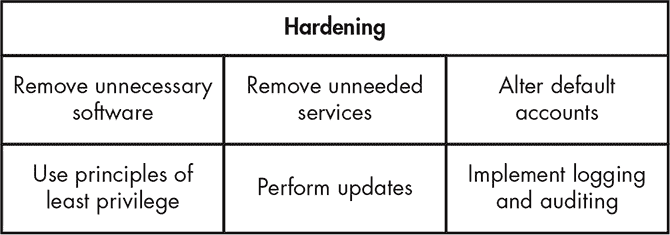
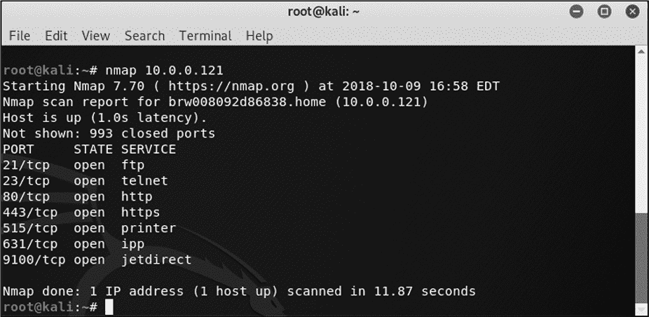
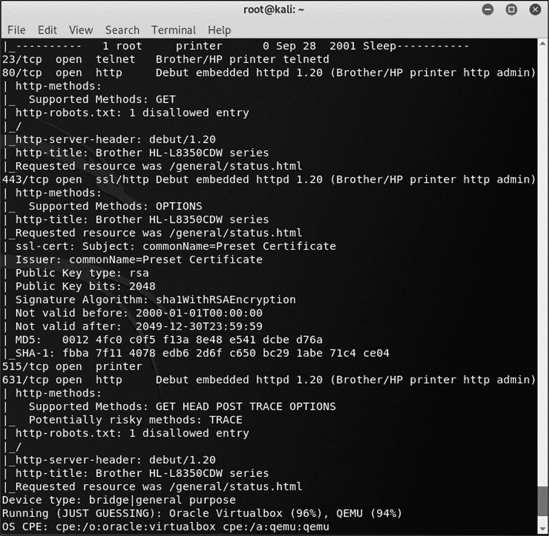
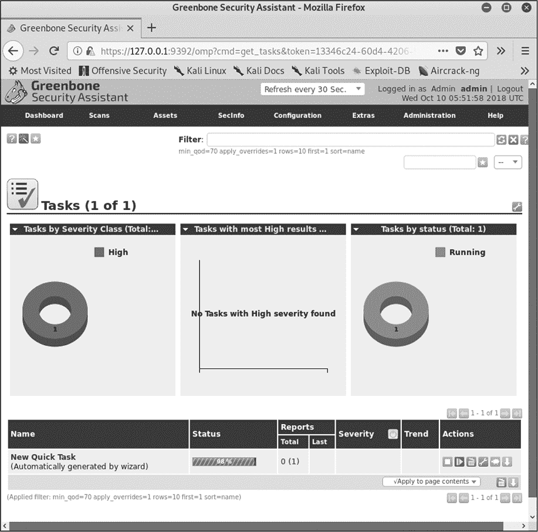
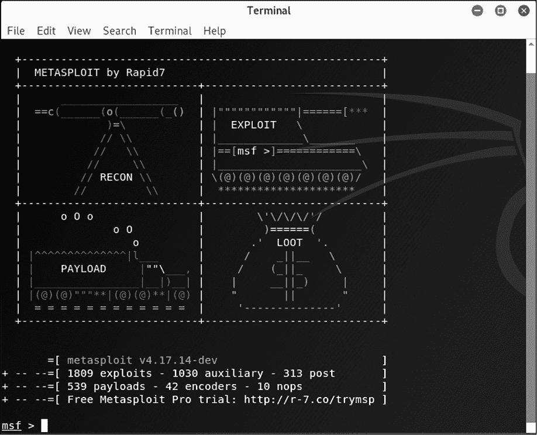

## 操作系统安全

当你试图保护你的数据、进程和应用程序免受精心策划的攻击时，你可能会发现托管所有这些内容的操作系统存在一些弱点。*操作系统*是支撑设备基本功能的软件。当前常用的操作系统有多种 Linux 版本，以及由微软和苹果提供的服务器和桌面操作系统。如果你不注意保护操作系统，就没有基础建立强大的安全防线。

你可以通过多种方式减轻对操作系统的威胁。最简单的方法之一是*操作系统硬化*，即减少攻击者可能利用的入侵途径。当你配置可能面临敌对行为的主机（单独的计算机或网络设备）时，可以使用这种技术。

你还可以在操作系统上添加一些应用程序，旨在对抗攻击者可能用来攻击你的工具。特别是在面向互联网的设备上，最常见和明显的就是反恶意软件工具，它们能保护你免受恶意代码的侵害。前面章节中讨论的防火墙和基于主机的入侵检测系统也能阻止不必要的流量或在流量通过系统时发出警告。

其他安全工具可以通过发现你未曾注意到正在运行的服务、定位已知存在可利用漏洞的网络服务，以及一般性地检查你的系统，来检测主机上潜在的易受攻击区域。

通过应用深度防御的概念并结合这些努力，你可以减轻许多你负责的主机上的安全问题。

### 操作系统硬化

操作系统硬化是信息安全中的一个相对较新的概念，它旨在减少可供攻击者攻击操作系统的途径。我们将这些区域的总和称为*攻击面*。¹ 攻击面越大，攻击者成功突破防御的机会就越大。

你可以通过六种主要方式减少攻击面，如图 11-1 所示。

*图 11-1：操作系统硬化的六种主要方式*

我将逐一讲解这些策略。

#### *移除所有不必要的软件*

安装在操作系统上的每一款软件都会增加你的攻击面。如果你想要加强操作系统的安全性，就应仔细审视你加载到系统中的软件，并确保只安装最基本的程序。

比如，如果你正在准备一台网页服务器，你需要安装网页服务器软件、任何支持网页服务器所需的库或代码解释器，以及涉及操作系统管理和维护的任何工具，如备份软件或远程访问工具。你没有理由安装其他任何东西。

**三思而后行**

在更改操作系统设置、工具和软件时，一定要非常小心。你所做的某些更改可能会对操作系统的功能产生意想不到的影响，而你肯定不希望通过在执行关键功能的机器上亲自体验来发现这一点。在进行更改之前，务必仔细研究这些更改。

一旦在机器上安装了其他软件，即使是出于最好的意图，问题也会开始出现。例如，假设你的某个开发人员远程登录到服务器。他们需要修改一个网页，因此安装了所需的网页开发软件。接着他们需要评估更改，于是安装了自己最喜欢的网页浏览器以及相关的媒体插件，如 Adobe Flash 和 Acrobat Reader，还安装了一个视频播放器来测试一些视频内容。很快，系统不仅包含了不该存在的软件，而且这些软件由于没有 IT 部门的正式支持和维护，未被打补丁或更新，迅速变得过时。此时，你的互联网面向机器上已经存在了一个相对严重的安全问题。

#### *移除所有不必要的服务*

同样，你还应该移除或禁用不必要的*服务*（系统启动时自动加载的软件）。许多操作系统都附带了各种各样的服务，用于通过网络共享信息、查找其他设备、同步时间、允许你访问或传输文件以及执行其他任务。各种应用程序也可能会安装一些服务来提供它们所需的工具和资源。

尝试关闭服务可能是一项令人沮丧的任务，可能需要一些实验。在许多情况下，服务的名称并不能指示其实际功能，追踪它们的功能可能需要一些研究。开始时，最好的方法之一是确定系统监听网络连接的端口，因为这通常能给你提供关于开放端口后端服务的一些线索。例如，如果系统正在监听 80 端口，那么你很可能是在寻找一个网页服务器服务。许多操作系统都内建了允许你执行此操作的工具，如微软操作系统上的 netstat 或第十章中讨论的 Nmap。

除了定位网络上的设备外，Nmap 还可以帮助你确定系统正在监听的网络端口。（要安装 Nmap，可以从*[`nmap.org/`](https://nmap.org/)*下载。）在系统的命令行中运行以下 Nmap 命令：

nmap <IP 地址>

将<IP 地址>替换为你设备的 IP 地址。你将看到类似于图 11-2 所示的结果。

*图 11-2：使用 Nmap 定位服务*

图 11-2 揭示了系统中运行的几种常见服务，列表如下：

**21 端口** 文件传输协议（FTP），允许文件传输

**23 端口** Telnet，允许远程访问设备

**80 端口** 超文本传输协议（HTTP），用于提供网页内容

**443 端口** 安全超文本传输协议（HTTPS），用于通过安全套接层（SSL）或传输层安全性（TLS）协议提供安全的网页

其他几个端口也处于打开状态，运行的服务表明该示例设备是一个打印机。你可以利用这些信息作为关闭不必要服务的起点。例如，如果你不打算允许远程访问该系统或提供网页内容，你会注意到端口 21、23、80 和 443 是开放的。然后，你可以尝试重新配置该设备，以便不运行这些不需要的服务。

#### *更改默认账户*

许多操作系统都配有标准账户。通常包括等同于访客账户和管理员账户的账户。可能还有其他账户，例如供支持人员使用的账户，或者允许特定服务或实用程序运行的账户。

在某些情况下，默认账户可能配有过于宽松的权限，允许执行它们能够进行的操作，这可能会给有经验的攻击者带来麻烦，尤其是在他们成功入侵时。默认账户可能有一个标准密码或根本没有密码。如果你允许这些账户保留在系统中，并且没有更改默认设置，攻击者可能轻松进入并占据系统。

为了减少这些安全风险，你应该首先决定是否真的需要这些默认账户，并禁用或删除任何你不会使用的账户。你通常可以关闭或删除访客账户和支持账户，而不会导致问题。在管理账户的情况下，通常有像*administrator*、*admin*或*root*这样的名称，你可能无法安全地从系统中删除它们，否则可能会导致系统故障，或者操作系统可能会阻止你这样做。然而，你可以尝试重命名这些账户，以迷惑那些试图利用它们的攻击者。最后，无论账户的状态如何，你都不应留下默认密码，因为这些密码通常已被记录并广为人知。

#### *应用最小特权原则*

如在第三章中讨论的，最小权限原则要求你只给予某个方其完成任务所需的最基本权限。操作系统可以在不同程度上实践这一概念。

大多数现代操作系统将任务分为需要管理员权限和不需要管理员权限的两类。一般来说，普通的操作系统用户可以读取和写入文件，可能还可以执行脚本或程序，但他们只能在文件系统的某个受限区域内进行操作。他们通常不能修改硬件的功能，不能更改操作系统本身依赖的文件，也不能安装可能会改变或影响整个操作系统的软件。通常你需要管理员权限才能执行这些操作。

UNIX 和类 Linux 操作系统的管理员往往会严格执行这些角色。虽然管理员可以允许所有用户以管理员权限操作，但他们很少这样做。在 Microsoft 操作系统中，情况通常是完全相反的。Windows 操作系统的管理员通常更倾向于给予用户管理员权限。尽管微软在使其操作系统对非管理员用户更易用、更有用方面有所改进，但两类管理员之间的心态差异依然很大。

当你允许普通系统用户定期以管理员权限操作时，你就给自己带来了各种安全问题。如果用户执行了一个被恶意软件感染的文件或应用程序，他们是以管理员身份执行的，这意味着该程序拥有更大的自由度去修改操作系统以及宿主上安装的其他软件。如果攻击者入侵了用户账户，而该账户已经被赋予管理员权限，那么攻击者就掌握了整个系统的钥匙。几乎任何类型的攻击，只要获得了主机的管理员权限，都将产生更大的影响。

如果相反，你将系统的权限限制到用户执行所需任务所需的最低权限，那么你将大大减少许多安全问题的发生。在许多情况下，当攻击者试图从权限受限的用户账户执行攻击时，这些攻击将完全失败。这是一种廉价且容易实施的安全措施。

#### *执行更新*

为了保持强大的安全性，你必须定期及时地更新操作系统和应用程序。研究人员定期发布新的攻击方法，如果你没有及时应用操作系统和应用程序厂商发布的安全补丁来缓解这些漏洞，你很可能会迅速成为攻击的受害者。

要查看这一操作的示例，可以查看关于恶意软件在互联网上传播的新闻。² 许多恶意软件依然通过利用那些已经被软件供应商修复的已知漏洞继续传播。尽管在计划安装软件更新时保持谨慎是明智的，而且在安装之前彻底测试它们也是一个好主意，但通常不建议长时间拖延更新。

确保系统在安装完毕后及时打好补丁是至关重要的。如果你将一个全新安装且完全未打补丁的系统连接到网络，它可能会迅速被攻陷，即使是在内部网络上也是如此，因为它缺少最新的补丁和安全配置。在这种情况下，最佳做法是将补丁下载到可移动介质上，并在将系统连接到网络之前使用该介质打补丁。

#### *开启日志记录和审计*

最后，但绝对不容忽视的是，你应该为你的系统配置并开启适当的日志记录和审计功能，例如那些记录失败登录尝试的功能。虽然配置这些服务的步骤可能会根据操作系统和使用目的的不同而略有不同，但你通常需要能够准确完整地记录系统上发生的重要进程和活动。你应该记录重要事件，如管理员权限的使用、用户登录和登出系统（或登录失败）、对操作系统的更改，以及类似的活动。

你还可能想要增加一些额外的功能来补充操作系统内置的这些工具。你可以安装监控工具，提醒你系统本身的问题或在各种系统或应用日志中可能出现的异常。你还可以安装补充的日志架构来监控多台机器的活动，或者仅仅为确保你拥有所有活动的未被篡改记录，维护系统外部的日志备份副本。

还需要注意的是，查看日志是整个过程中的一个重要环节。如果你收集了日志却从不查看它们，那么收集日志的工作几乎等同于没有进行。

### 防护恶意软件

世界上的网络、系统和存储设备中存在大量让人瞠目结舌的恶意软件。使用这些工具，攻击者可以禁用系统、窃取数据、进行社会工程攻击、敲诈用户、收集情报等。

一个特别复杂且具有深远影响的恶意软件示例是 Triton。它首次出现在 2017 年 11 月，显然试图破坏工业系统中响应异常操作条件的机制，从而可能对这些系统造成直接损害。³ Triton 针对的设备存在于多种系统中，包括核设施，且具有造成灾难性损害的潜力。

为了保护你的操作系统免受恶意软件的侵害，你可以使用这里概述的一些工具。

#### *反恶意软件工具*

就像在第十章中讨论的入侵检测系统一样，大多数反恶意软件应用程序通过将文件与签名进行匹配或检测异常活动来识别威胁。反恶意软件工具通常比依赖异常检测（在反恶意软件领域通常称为*启发式*）更依赖签名，这主要是因为签名更容易编写并且检测更可靠。应用程序供应商通常每天至少更新一次恶意软件签名，或者在需要时更频繁地更新，因为恶意软件变化迅速。

当工具发现恶意软件时，它可能通过终止任何相关进程并删除检测到的文件或将其隔离，以防止它们执行。有时，它可能只是将文件保持原样。反恶意软件工具有时会检测到其他安全工具或文件，这些工具或文件不是恶意软件，你可能希望将它们忽略并在未来避免干扰。

人们通常会在个人系统和服务器上安装反恶意软件工具，作为常规操作或为了遵守政策。你也可能会在代理服务器上找到这些工具，用来过滤进出流量中的恶意软件。在邮件代理中这种做法较为常见，因为恶意软件经常通过邮件传播。该工具可能完全拒绝邮件、从邮件正文中去除恶意软件，或移除有问题的附件。

#### *可执行空间保护*

可执行空间保护是一种技术，能够防止操作系统和应用程序使用某些内存部分来执行代码。这意味着经典攻击，例如缓冲区溢出（在下一页的“什么是缓冲区溢出？”框中讨论过），依赖于能够在劫持的内存部分执行命令，但这种攻击可能根本无法实现。许多操作系统还使用*地址空间布局随机化（ASLR）*，这是一种将内存内容随机移动的技术，使得篡改内存变得更加困难。⁴

**什么是缓冲区溢出？**

缓冲区溢出攻击通过输入超出应用程序预期的数据来工作——例如，在一个预期仅为 8 个字符的字段中输入 10 个字符，如图 11-3 所示。

*图 11-3：缓冲区溢出的示例*

根据应用的不同，额外的两个字符可能会被写入内存的某个位置，可能会覆盖其他应用程序或操作系统使用的内存位置。有时可以通过特意构造多余的数据来执行命令。

可执行空间保护需要两个组件才能发挥作用：一个硬件组件和一个软件组件。两大 CPU 芯片制造商，英特尔和 AMD，都提供可执行空间保护组件。英特尔将其称为执行禁用（XD）位，而 AMD 则称之为增强病毒保护。

许多常见的操作系统，包括微软的、苹果的以及几个 Linux 发行版，都实现了可执行空间保护软件组件。

#### *软件防火墙和主机入侵检测*

我已经讨论过如何在网络上使用防火墙和入侵检测系统来检测并过滤不良流量。你还可以通过在主机层面上实现类似的一套工具来增加一层安全性。尽管网络防火墙和入侵检测系统通常是专门构建的设备，部署在网络中，但它们执行的实际功能是通过驻留在设备上的专用软件来完成的。你可以将类似的软件直接安装到驻留在你网络中的主机上。此外，在主机上和主机外使用防火墙和入侵检测系统可以增加你的安全防护层。

正确配置的软件防火墙为驻留在你网络中的主机增加了一层有用的安全防护。这些防火墙通常只包含你可能在大型防火墙设备中找到的一部分功能，但它们通常也能够执行类似的包过滤和有状态的包检查。它们的形式可以从内置于常见操作系统中的相对简单版本，到为企业网络设计的大型版本，后者包括集中监控以及更多复杂的规则和管理选项。

主机型入侵检测系统分析主机网络接口上的活动或指向该接口的活动。它们与基于网络的入侵检测系统有许多相同的优点，但操作范围显著缩小。与软件防火墙类似，这些工具可能从简单的消费级版本到复杂的商业版都有。

集中管理的主机入侵检测系统可能存在的一个潜在缺陷是，为了使软件能够实时报告攻击情况，信息需要通过网络传输。如果该主机正通过同一网络受到攻击，软件可能无法完成这一任务。你可以尝试通过从设备向管理机制发送定期信标来缓解这个问题，这样如果信标没有出现，你就可以假设存在问题，但这可能不是一个完全的解决方法，因为没有消息并不总是意味着好消息。

### 操作系统安全工具

你可以用来评估网络安全的许多相同工具（在第十章中讨论过）也能帮助你评估主机的安全性。例如，你可以使用扫描工具检查主机如何与网络上的其他设备交互，或者你可以使用漏洞评估工具帮助指出可能包含易受攻击的应用程序或服务的特定区域，或者指出已经在你环境中的工具，攻击者可能会用它们来破坏你的安全。我要讨论的这一节中的工具并不是一个详尽无遗的列表，但我会讲解一些重点内容。

#### *扫描器*

你可以使用第十章中提到的扫描工具来检测主机中的安全漏洞。例如，你可以查找开放的端口和正在运行的服务版本，检查服务在连接时显示的横幅信息，这些信息可能包括软件版本，或者检查你的系统在网络上展示的信息。

在本章早些时候，我讨论了操作系统强化时，你学习了如何使用 Nmap 发现有服务监听的端口。Nmap 有很多用途，它可以提供更多的信息——例如，特定的供应商或版本信息。图 11-4 展示了使用以下命令对网络打印机进行 Nmap 扫描的结果：

nmap -sS -sU -A -v 10.0.0.121

*图 11-4：Nmap 结果*

在这种情况下，我使用了`-sS`来运行 TCP SYN 端口扫描，使用`-sU`来运行 UDP 端口扫描。我启用了操作系统检测、版本检测和脚本扫描（`-A`），并且在运行时启用了详细输出（`-v`）。如果你尝试这个命令，你会发现它的完成时间要比我之前运行的命令长得多。

在图 11-4 中，端口列表显示了几个额外的端口，并且展示了有关正在运行的特定服务和版本的许多信息。返回的`http-title`告诉你这是一台 Brother HL-L8350CDW 系列打印机。掌握这些信息后，你可能会更有机会成功攻击该设备。

**你发现了什么？**

当使用启用操作系统检测的 Nmap 进行扫描时，你可能会注意到它报告的设备指纹显示运行着一些奇怪的，甚至是完全错误的东西。有时，Nmap 的操作系统指纹可能会有所偏差，因此如果某些输出看起来不对，最好通过其他工具验证 Nmap 的结果。

除了 Nmap 内置的许多功能外，您还可以使用 Nmap 脚本引擎创建自定义的 Nmap 功能。Nmap 脚本引擎是一个自定义语言和脚本引擎，允许您向 Nmap 添加功能。Nmap 是一个功能强大的工具，拥有丰富的选项、功能和能力。幸运的是，您也可以参考一个很棒的文档，网址是*[`nmap.org/book/man.html`](https://nmap.org/book/man.html)*。

#### *漏洞评估工具*

漏洞评估工具，通常包括许多与 Nmap 类似的功能，旨在寻找并报告主机上的网络服务，这些服务存在已知漏洞。

其中一个著名的扫描工具是 OpenVAS (*[`www.openvas.org/`](http://www.openvas.org/)*)。您可以通过命令行使用 OpenVAS，但它也有一个方便的图形界面，称为 Greenbone，如图 11-5 所示。OpenVAS 可以对目标进行端口扫描，然后尝试确定在它发现开放的端口上运行的服务（及其版本）。OpenVAS 随后会返回一个给定设备可能存在的漏洞的具体列表。

*图 11-5：OpenVAS 界面*

OpenVAS 包括一个端口扫描器，用于找到监听服务，从而帮助您识别其中的漏洞。

#### *利用框架*

*漏洞利用*是利用其他软件中的缺陷，使其以创建者未预期的方式行为的小程序。攻击者通常使用漏洞利用来获得系统访问权限或在系统上获取更高权限。作为一名安全专家，您也可以使用这些工具和技术来评估自己系统的安全性，以便在攻击者发现问题之前修复它们。

*漏洞利用框架*是一个包含预打包漏洞利用和工具的集合，例如网络映射工具和嗅探器。这些框架使得漏洞利用变得简单，并提供了一个庞大的漏洞利用库。漏洞利用框架在 2000 年代初期变得流行，并且至今仍在使用。一些著名的漏洞利用框架包括 Rapid7 的 Metasploit（如图 11-6 所示）、Immunity CANVAS 和 Core Impact。

*图 11-6：Metasploit 框架*

许多漏洞利用框架是图形化界面工具，您可以像运行其他应用程序一样运行它们。您甚至可以配置一些工具，自动寻找并攻击系统，随着获得更多的访问权限，它们会进一步传播到网络中。

### 总结

为了确保操作系统的安全，您可以从加固操作系统开始。加固包括移除所有不必要的软件和服务，修改系统上的默认账户，应用最小权限原则，频繁更新软件，并进行日志记录和审计。

你还可以实现额外的软件来保护你的操作系统。反恶意软件工具可以检测、预防并移除恶意软件，你还可以直接在主机上使用防火墙技术，以便在网络接口进出时过滤掉不希望的流量。你还可以安装主机入侵检测系统来检测通过网络发起的攻击。

最后，你可以利用各种安全工具来发现安全漏洞。一些扫描工具，如 Nmap，可以为你提供关于你的系统及其运行的软件的信息。像 OpenVAS 这样的漏洞评估工具可以定位你服务或网络启用软件中的具体安全漏洞。此外，你还可以使用像 Metasploit 这样的攻击框架，攻击系统以获取访问权限或提升你的权限级别。使用一些攻击者所使用的相同技术，可以帮助你发现并解决安全问题。

### 练习题

1.  地址空间布局随机化（ASLR）有什么作用？

1.  什么是攻击框架？

1.  端口扫描器和漏洞评估工具之间有什么区别？

1.  解释攻击面（attack surface）的概念。

1.  如果网络上已经有防火墙，为什么你还需要在主机上安装防火墙？

1.  什么是操作系统强化？

1.  什么是 XD 位，为什么要使用它？

1.  可执行空间保护为你做了什么？

1.  最小特权原则如何应用于操作系统强化？

1.  从 *[`www.nmap.org/`](https://www.nmap.org/)* 下载 Nmap 并安装。使用 Zenmap GUI 或命令行 (`nmap <`IP 地址`>`) 进行基本扫描。你能找到哪些开放的端口？
