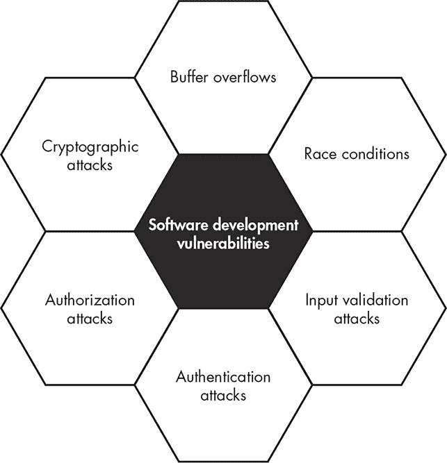
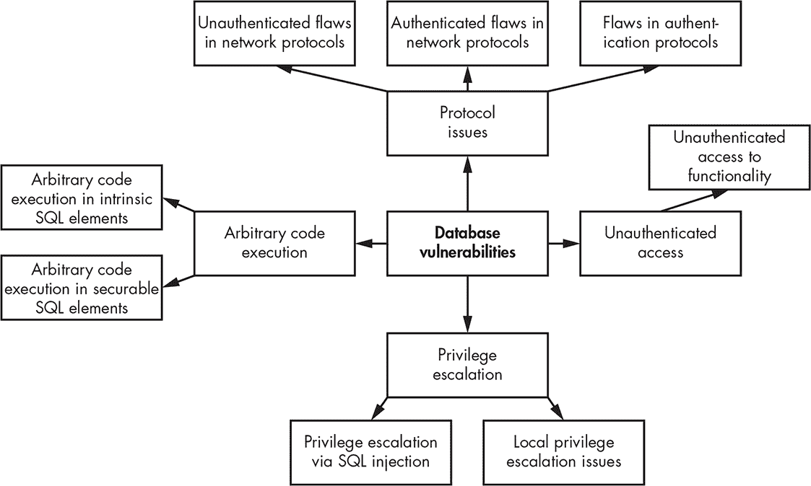
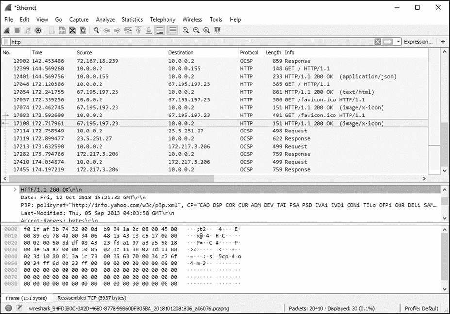
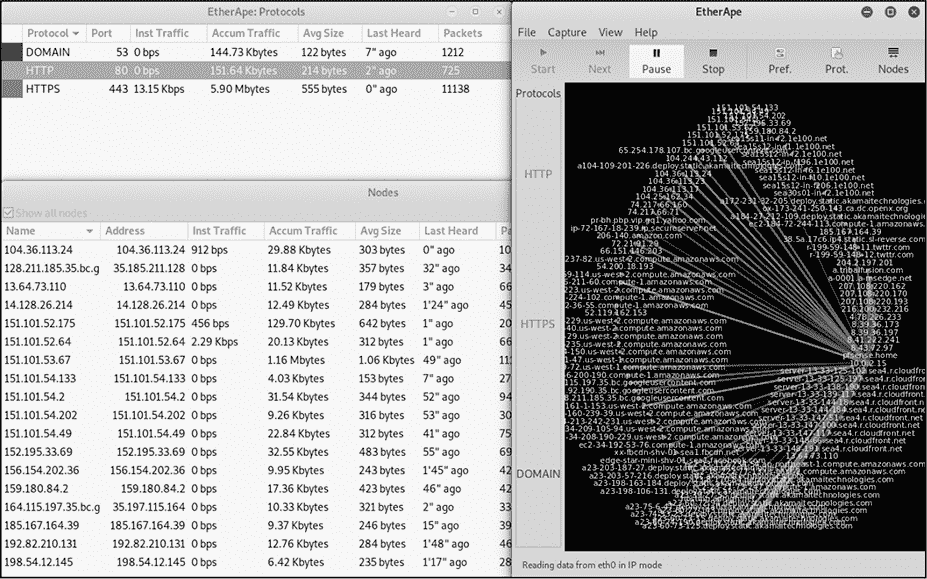
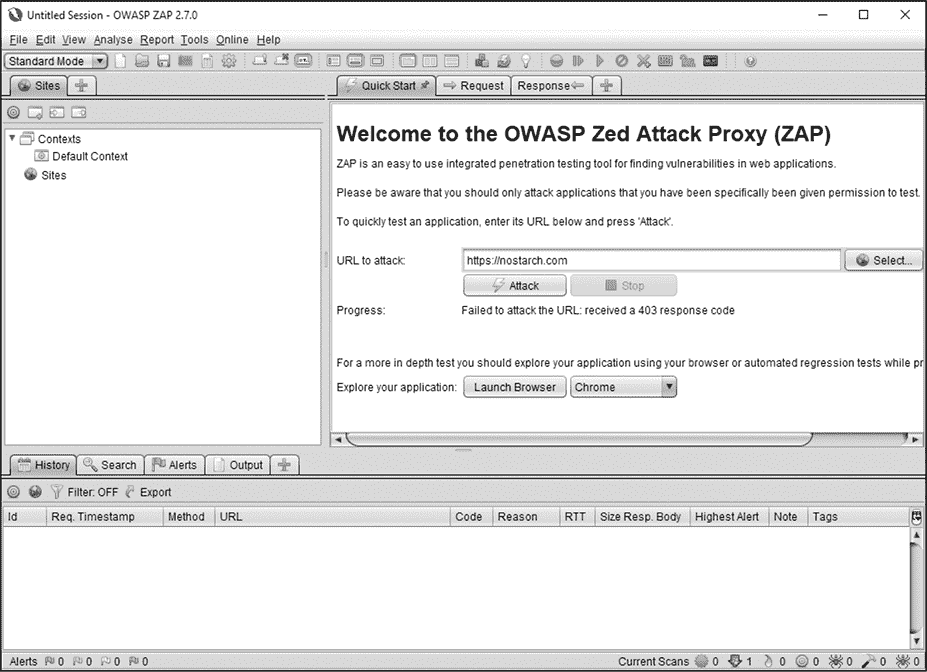
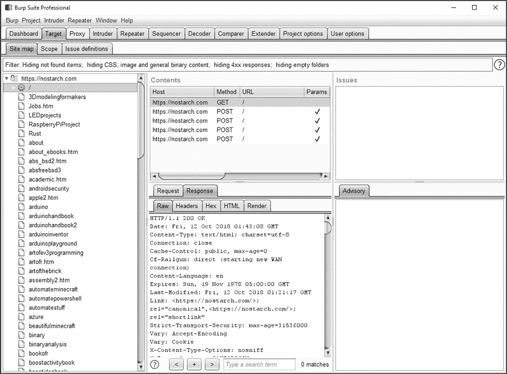

## 第十三章：应用程序安全

在第十章和第十一章中，我讨论了确保网络和操作系统安全的重要性。防止攻击者与网络交互并颠覆操作系统安全的一部分工作就是确保应用程序的安全。

2013 年 12 月，运营超过 1800 家门店的零售商 Target 公司报告称发生了客户数据泄露事件，涉及 4000 万个客户姓名、卡号、卡片到期日和卡片安全码。¹ 一个月后，Target 宣布额外有 7000 万个客户的个人数据遭到泄露。²

这次泄露事件并非源于 Target 系统，而是来自与 Target 网络相连接的一个供应商 Fazio 机械公司的系统。专家们认为攻击是这样发生的：³

1.  攻击者通过特洛伊木马（一种恶意软件）攻破了 Fazio 机械公司的系统，并利用网络钓鱼攻击将其植入。

1.  由于网络分段不当，攻击者能够利用 Fazio 公司对 Target 网络的访问权限，进一步访问 Target 网络的其他部分。

1.  攻击者在 Target 的销售点（POS）系统（基本上是收银机）上安装了名为 BlackPOS 的信用卡收集恶意软件，并利用该恶意软件收集 POS 扫描到的支付卡信息。

1.  攻击者将收集到的信用卡号码转移到 Target 网络上受损的文件传输协议（FTP）服务器，然后将其发送到公司外部，最终它们出现在俄罗斯的一个服务器上。

1.  攻击者随后将窃取的信用卡和个人数据在黑市上出售。

多个层面的问题促成了此次攻击的发生。任何一个缺失或失效的控制措施——如缺乏网络分段、缺乏反恶意软件工具、以及缺乏数据丢失防护工具——都可能阻止攻击的成功。在本章中，你将了解在软件开发过程中引入的应用程序漏洞、常见的 Web 应用程序漏洞以及影响应用程序使用的数据库漏洞。我还将讨论可以用来保护应用程序的工具。

### 软件开发漏洞

许多常见的软件开发漏洞可能导致应用程序中的安全问题。这些漏洞包括缓冲区溢出、竞态条件、输入验证攻击、身份验证攻击、授权攻击和加密攻击，如图 13-1 所示。我将在本节中逐一介绍每种漏洞。

通过简单地避免使用允许这些漏洞存在的编程技术，你可以在开发新软件时相对轻松地避免所有这些漏洞。卡内基梅隆大学的计算机应急响应小组发布了一套定义安全软件开发标准的文档，适用于几种编程语言，这是进一步研究安全编码的一个很好的资源。⁴

*图 13-1：软件开发漏洞*

#### *缓冲区溢出*

*缓冲区溢出*，或称缓冲区超限，发生在你没有正确考虑输入到应用程序中的数据大小时。如果一个应用程序接收数据，大多数编程语言会要求你指定预期接收的数据量，并为这些数据预留存储空间。如果你没有限制接收的数据量（这个过程称为*边界检查*），那么你可能会接收到 1,000 个字符的输入，而你只为 50 个字符分配了存储空间。

在这种情况下，多出的 950 个字符的数据可能会覆盖内存中其他区域，这些区域被其他应用程序或操作系统使用。攻击者可能会利用这种技术篡改其他应用程序或使操作系统执行他们自己的命令。

正确的边界检查可以完全消除这种类型的攻击。有些语言，如 Java 和 C#，会自动执行边界检查。

#### *竞态条件*

竞态条件发生在多个进程（或同一进程中的多个线程）控制或共享资源访问时，而资源的正确处理依赖于事务的正确排序或时机。

例如，如果你通过自动柜员机（ATM）从银行账户取款 20 美元，过程可能如下：

1.  检查账户余额（$100）。

1.  提取资金（$20）。

1.  更新账户余额（$80）。

如果其他人在大约相同的时间启动相同的过程，并试图进行 30 美元的取款，你可能会遇到一些问题。

| **用户 1** | **用户 2** |
| --- | --- |
| 检查账户余额（$100）。 | 检查账户余额（$100）。 |
| 提取资金（$20）。 | 提取资金（$30）。 |
| 更新账户余额（$80）。 | 更新账户余额（$70）。 |

由于两个用户共享对资源的访问权限，账户最终记录了$70 的余额，而你应该只看到$50。两个用户“竞速”访问资源，导致不良情况发生。（请注意，大多数实际银行会采取措施防止这种情况发生。）

竞态条件在现有软件中可能很难检测到，因为它们很难重现。当你开发新应用程序时，只要小心处理用户访问资源的方式，避免依赖时序，你通常可以避免这些问题。

#### *输入验证攻击*

如果你不小心*验证*应用程序的输入——换句话说，确保用户提交的任何输入（例如表单的答案）以可接受的格式到达——你可能会成为格式字符串攻击等问题的受害者。

在*格式字符串攻击*中，攻击者利用编程语言中的某些打印函数，这些函数本意是格式化输出，但实际上允许攻击者操控或查看应用程序的内部内存。在某些语言中，如 C 和 C++，你可以将特定字符插入到输入中，如`%f`、`%n`和`%p`，以对打印到屏幕的数据进行格式化。例如，攻击者可能会在精心构造的输入中包含`%n`（将整数写入内存）参数，以将一个值写入他们通常无法访问的内存位置。攻击者可以利用这种技术使应用程序崩溃，或者导致操作系统执行某个命令，从而可能危及系统安全。

为了解决这种攻击，你应该通过过滤输入内容中意外或不希望出现的内容来验证输入。在格式字符串攻击的情况下，你可以尝试从输入中移除有问题的字符，或者你也可以设置错误处理机制，确保预见并补偿此类问题，从而避免它们造成麻烦。

#### *身份验证攻击*

身份验证攻击是指试图在没有适当凭证的情况下访问资源的攻击行为。在你的应用程序中实施强大的身份验证机制将有助于抵御这种攻击。

如果你要求应用程序用户创建强密码，将有助于防止攻击者入侵。如果你使用一个包含八个字符、全部为小写的密码，比如*hellobob*，那么一个相对强大的机器几乎可以瞬间破解这个密码。如果你使用一个包含十个字符、大小写字母、数字和符号的密码，比如*H3lloBob!1*，那么破解它所需的时间将增加到超过 20 年。⁵ 此外，你的应用程序不应使用那些内置且无法更改的密码（通常称为*硬编码*密码）。

此外，你应避免在客户端（即最终用户的机器）进行身份验证，因为这样会将身份验证措施置于容易受到攻击的位置。与大多数安全措施一样，当你让攻击者直接访问并随意操作你的控制机制时，你基本上就削弱了这些控制措施的有效性。

如果你依赖本地应用程序或脚本来执行身份验证步骤，然后仅仅将“通过”消息发送到服务器端，那么攻击者可以直接将此消息重复发送到你的后台，而无需完成身份验证。身份验证工作应尽可能远离攻击者的可接触范围，并且最好完全放在服务器端。

#### *授权攻击*

*授权攻击*是指试图在没有适当授权的情况下访问资源的攻击。与身份验证机制一样，将授权机制放置在客户端是一种不好的做法。任何在可能受到用户直接攻击或操控的环境中执行的过程，几乎可以确保在某些时候会成为安全问题。您应该改为在远程服务器上进行身份验证，或者如果设备是便携式的，则在设备硬件上进行身份验证，这样能给您更多的控制权。

当您为某项操作授权用户时，应遵循最小权限原则，如第三章所讨论的那样。如果您没有小心地仅授予最低限度的权限，无论是对用户还是对软件，都可能使自己面临攻击和被攻破的风险。

此外，每当用户或进程尝试进行需要权限的操作时，您应该始终重新检查，以确保该用户确实有权进行该操作，每次尝试时都应如此。如果您的用户因意外或故意而访问了应用程序的受限部分，您应该采取措施防止用户继续操作。

#### *加密攻击*

密码学很容易实现得不当，且如此会给您带来虚假的安全感。实现密码学时的一个大错误是开发自己独特的加密方案。目前使用的主要密码算法，如高级加密标准（AES）和里维斯-沙密尔-阿德尔曼（RSA），已经由成千上万的技术人员开发和测试，他们的生计就是开发这类工具。此外，这些算法之所以被广泛使用，是因为它们经得起时间的考验，并没有遭受严重的破解。虽然您自创的算法可能有一定的安全优势，但您可能不应将其用于存储或处理敏感数据的软件中。

除了使用已知的算法外，您还应考虑到所选机制可能在未来变得过时或遭到破坏。这意味着您应该以支持使用不同算法的方式来设计软件，或者至少设计应用程序时要确保更换算法不是一项艰巨的任务。您还应当使得更换软件所使用的加密密钥变得可能，以防您的密钥被破坏或暴露。

### 网络安全

攻击者可以使用多种技术来攻击网络应用程序，破坏您的机器、窃取敏感信息，并诱使您在不知情的情况下执行操作。您可以将这些攻击分为两大类：客户端攻击和服务器端攻击。

#### *客户端攻击*

客户端攻击要么利用加载到用户客户端上的软件中的弱点，要么依靠社会工程来欺骗用户。有很多这样的攻击，但我将特别关注一些使用网络作为攻击媒介的攻击。

*跨站脚本攻击 (XSS)* 是一种通过将用脚本语言编写的代码放入网页或其他媒体（如 Adobe Flash 动画和某些类型的视频文件）中进行的攻击，这些网页或其他媒体由客户端浏览器显示。当其他人查看网页或媒体时，他们会自动执行代码，从而执行攻击。

例如，攻击者可能会在博客文章的评论区中留下包含攻击脚本的评论。访问该网页的人的浏览器会执行该攻击。

第三章中提到的跨站请求伪造和点击劫持也是客户端攻击。在跨站请求伪造攻击中，攻击者以某种方式在网页上放置一个或多个链接，使其自动执行。该链接在用户当前已通过身份验证的另一个网页或应用程序上启动一项活动，例如在亚马逊上将商品添加到他们的购物车或将钱从一个银行帐户转移到另一个银行帐户。

如果您正在浏览多个页面并且仍然通过了攻击目标页面的身份验证，您可能会在后台执行攻击而永远不会知道。例如，如果您在浏览器中打开了多个页面，包括一个用于 *MySpiffyBank.com*（一家常见的银行机构）的页面，并且当您访问 *BadGuyAttackSite.com* 时仍然登录到该页面，则攻击页面上的链接可能会自动执行以让您将钱转移到另一个帐户。虽然攻击者很可能不知道用户通过了哪些网站的身份验证，但他们可以做出有根据的猜测，例如银行或购物网站，并包含专门针对这些网站的组件。

点击劫持是一种利用浏览器图形显示功能来诱骗您点击您可能不会点击的内容的攻击。点击劫持攻击通过在页面或页面的某些部分上放置另一层图形或文本来模糊您点击的内容。例如，攻击者可能会在带有“更多信息”按钮的另一层下隐藏“立即购买”按钮。

这些类型的攻击大多数情况下已经被常见浏览器的新版所阻挡，比如 Internet Explorer、Firefox、Safari 和 Chrome。本节讨论的最常见攻击将被这些浏览器自动阻挡，但在许多情况下，新攻击方式只会导致旧攻击的新变种。此外，许多客户端仍在运行过时或未打补丁的软件，容易受到多年前的攻击。了解常见攻击的工作原理并防范它们，不仅可以为你提供额外的安全保障，还能帮助你理解攻击者是如何开发出更新的攻击手段。

跟上最新的浏览器版本和更新非常重要，因为这些浏览器的供应商会定期更新其保护机制。此外，一些浏览器允许你应用额外的工具来保护自己免受客户端攻击。其中一个较为知名的工具是 NoScript（*[`noscript.net/`](http://noscript.net/)）*，它是 Firefox 的一个插件。NoScript 默认阻止大多数网页脚本，并要求你明确启用你希望运行的脚本。使用得当时，像这样的脚本阻止工具可以有效地防止许多你可能遇到的基于网页的威胁。

#### *服务器端攻击*

服务器端网页交易中的一些漏洞也可能导致问题。这些威胁和漏洞根据你的操作系统、web 服务器软件及其版本、脚本语言以及其他多个因素有所不同。然而，这些漏洞通常由几个共同的原因引起。

##### 缺乏输入验证

如本章前面所讨论的，软件开发人员常常忽视对用户输入的正确验证，而一些最常见的服务器端网页攻击正是利用这一弱点进行攻击。

*目录遍历攻击*强烈说明了如果你不验证输入到你的 web 应用程序中的内容，可能会发生什么。攻击者可以利用这些攻击访问 web 服务器结构外的文件系统，从而访问存储内容的地方，这通过使用*../*字符序列实现，该序列将目录提升一级，从而改变目录。例如，在一个易受攻击的服务器上，访问*https://www.vulnerablewebserver.com/../../../etc/passwd*将显示*/etc/password*文件的内容。进一步解释，这个 URL 请求 web 服务器按以下方式在文件系统中移动：

1.  从*/var/www/html*（通常存储网页内容的地方）

1.  到*/var/www*

1.  然后到*/var*

1.  然后到 /（根目录）

1.  然后回到*/etc*

1.  然后显示*/etc/passwd*的内容

如果你小心地验证输入并过滤掉可能被用于危害安全的字符，你通常可以在攻击开始之前就阻止这种攻击。在许多情况下，过滤掉特殊字符（例如上述提到的字符以及*、%、‘、；和/）将完全消除此类攻击。

##### 不当或不足的权限

指定不当的用户权限通常会导致 Web 应用程序和各种互联网面向的应用程序出现问题。Web 应用程序和页面通常使用敏感文件和目录，如果这些文件暴露给普通用户，将会导致安全问题。

例如，一个可能导致问题的领域是配置文件的暴露。许多使用数据库的 Web 应用程序（这是绝大多数应用程序的情况）都有*配置文件*，这些文件保存了应用程序用于访问数据库的凭据。如果这些文件及其所在目录没有得到妥善保护，攻击者可能仅仅通过读取文件中的凭据就能访问数据库，任意操作数据。对于存储敏感数据的应用程序来说，这可能是灾难性的。

同样，如果你没有注意保护 Web 服务器上的目录，可能会发现你的应用程序中的文件被更改、新文件被添加，或者某些文件的内容完全被删除。互联网面向的不安全应用程序通常不会持续太久，就会被攻破。

##### 多余的文件

当 Web 服务器从开发阶段过渡到生产阶段时，开发人员常常忘记清理那些与运行网站或应用程序无直接关系的文件，或者是开发或构建过程中遗留下来的文件。

如果你留下了应用程序构建源代码的归档文件、文件的备份副本、包含你的笔记或凭据的文本文件，或者其他类似的相关文件，你可能正将攻击者需要的材料交给他们，从而使你的系统受到威胁。在部署 Web 服务器时，最后一个步骤应该是确保所有此类文件都已清理或在不再需要时移走。这也是一个良好的定期检查，确保在故障排除或升级期间，这些文件没有被遗留在公共可见的地方。

### 数据库安全

许多今天正在使用的网站和应用程序依赖数据库来存储它们显示和处理的信息。在某些情况下，数据库应用程序可能保存非常敏感的数据，如税务报告、医疗信息或法律记录，或者它们可能仅仅包含一个编织讨论论坛的内容。无论是哪种情况，这些数据对应用程序的拥有者来说都非常重要，如果数据被损坏或以未经授权的方式篡改，拥有者会感到不便。

有几个问题可能会危害你的数据库安全。经典的列表包括以下内容：⁶

+   网络协议中的未认证漏洞

+   网络协议中的认证漏洞

+   认证协议中的漏洞

+   未认证的功能访问

+   内在 SQL 元素中的任意代码执行

+   可安全执行 SQL 元素中的任意代码

+   通过 SQL 注入进行的权限提升

+   本地权限提升问题

尽管这些问题看起来可能非常复杂，但您可以将其分解为四个主要类别，如图 13-2 所示。在本节中，我将详细介绍每个类别。

*图 13-2：数据库漏洞类别*

#### *协议问题*

任何给定数据库所使用的协议可能存在漏洞。这包括用于与数据库通信的网络协议。这些协议中的漏洞通常涉及常见的软件开发问题，例如本章前面讨论的缓冲区溢出问题。

为了缓解*已知*的协议问题，您应使用数据库软件的最新版本和补丁，如第十一章所讨论的。为了保护您的数据库免受*未知*问题（尚未发现的问题）的影响，您应该限制对数据库的访问，无论是通过限制谁能够通过网络连接到数据库，使用第十章中讨论的一些方法，还是通过限制为数据库本身提供的权限和帐户，遵循最小权限原则。

根据使用的特定软件和版本，您还可能发现用于认证数据库的协议存在问题。一般来说，您的软件变得越旧，使用的认证协议就越可能不可靠。许多旧版应用程序会使用已知在某些时候被破解或存在明显架构缺陷的认证协议，例如通过网络以明文形式发送登录凭据，Telnet（一个远程访问设备的工具）就是这样做的。再次强调，最好的防御方法是确保您使用的是所有软件的最新版本。

#### *未认证访问*

当您允许用户或进程与数据库进行交互而不提供一组凭据时，就可能会产生安全问题。例如，通过 Web 界面对数据库的一些简单查询可能会意外暴露数据库中的信息；或者您可能会暴露关于数据库本身的信息，例如版本号，这样攻击者就能获得额外的材料来破坏您的应用程序。您还可能会遇到与本章开始时讨论的安全软件开发实践相关的各种问题。

如果用户或进程必须发送一组凭据来启动事务，那么该事务可以根据这些凭据进行监控和适当限制。如果您允许访问应用程序或工具集的某些部分而不要求凭据，您可能会失去对发生的操作的可视性和控制。

#### *任意代码执行*

*任意代码执行*（当通过网络进行时也称为*远程代码执行*）是指攻击者可以在系统上执行任何他们选择的命令，且没有任何限制。在数据库安全性方面，攻击者能够做到这一点，是因为与数据库通信的语言存在安全漏洞。结构化查询语言（SQL）是目前市场上许多常见数据库所使用的语言。它包含了多个内置元素，这些元素可能会带来安全风险，其中一些可以限制使用，而一些则无法限制。

这些语言元素可能会帮助软件中的漏洞暴露，或者如果你使用不安全的编码实践，也可能带来问题，比如允许攻击者在应用程序内执行任意代码。例如，如果服务器没有适当且安全地配置，任何人都可能从服务器的文件系统中读取或写入数据（使用`load_file`和`outfile`功能），这是许多数据库系统中常见的能力。一旦你能够与操作系统本身进行交互，就可以获得进一步攻击、窃取数据等的立足点。

针对这些攻击，你的最佳防御措施是双重的。从消费者方面来看，你应该使用所有软件的最新版本和补丁。从供应商方面来看，你应当要求在所有情况下都使用安全编码实践，以消除漏洞，并进行内部审查，确保这些实践得以遵守。

#### *权限提升*

最后一类主要的数据库安全问题是权限提升。*权限提升攻击*是指将你的访问权限提升到超出你在系统或应用程序中被授权的权限级别。权限提升的目的是获取软件的管理员权限，以进行需要高权限的其他攻击。

你通常可以通过*SQL 注入*进行权限提升，SQL 注入是一种攻击方式，攻击者通过提交包含 SQL 命令的输入来攻击应用程序。例如，一个较为常见的 SQL 注入例子是，在应用程序的用户名字段中输入字符串`' or '1'='1`。如果应用程序没有正确过滤输入，这个字符串可能会导致它自动记录你输入了一个合法的用户名，因为你设置了一个始终为真的条件，1 = 1。这使得你可能提升自己的权限等级。

如果你没有正确保护操作系统，数据库中也可能会发生权限提升。数据库应用程序运行在操作系统上，使用操作系统用户的凭证和权限，就像 Web 浏览器或任何其他应用程序一样。如果你不小心保护操作系统及其运行的用户帐户，正如在第十章和第十一章中讨论的那样，你所设置的任何数据库安全措施可能都没有效果。如果攻击者获取了运行数据库软件的帐户，他们可能会拥有做任何他们想做的事情的权限，包括删除数据库本身、修改任何数据库用户的密码、更改数据库功能设置、操控数据等等。

对于操作系统问题，最好的防御措施是第十一章中讨论的硬化和缓解步骤。如果你能防止攻击者首先侵入你的系统，你就能在很大程度上避免这些问题。

### 应用程序安全工具

你可以使用工具评估和提高应用程序的安全性。我在第十章和第十一章中讨论了其中一些工具，如嗅探器。其他一些工具则较为复杂，如模糊测试工具和逆向工程工具。某些工具还需要一定的软件开发经验和对相关技术的熟悉，才能有效使用。

#### *嗅探器*

你可以使用嗅探器来观察与应用程序或协议交换的特定网络流量。在图 13-3 中，我正在使用 Wireshark 来专门检查超文本传输协议（HTTP）流量。

*图 13-3：Wireshark 中的 HTTP 流量*

在某些情况下，你还可以使用特定操作系统的工具，从嗅探工具中获取额外的信息。一个很好的例子是 Linux 的网络监控工具 EtherApe，它不仅能嗅探网络流量，还能轻松地将你看到的流量与网络目标或特定协议关联起来，如图 13-4 所示。

*图 13-4：EtherApe*

通常，像这样的图形化表示可以让你更直观地解析数据，轻松地辨别出可能被忽视的流量模式。

#### *Web 应用分析工具*

目前有大量的工具可以用来分析网页或基于 Web 的应用程序，其中一些是商业工具，另一些是免费的。大多数这些工具用于寻找常见的漏洞，如 XSS 或 SQL 注入漏洞，错误设置的权限，冗余文件，过时的软件版本，以及其他许多安全问题。

##### OWASP Zed 攻击代理

OWASP Zed Attack Proxy (ZAP)，如图 13-5 所示，是一个免费且开源的 web 服务器分析工具，它会检查本章中提到的许多常见漏洞。

*图 13-5：ZAP*

ZAP 会索引它能在目标 web 服务器上看到的所有文件和目录，这个过程通常被称为*蜘蛛爬行*，然后定位并报告它找到的任何潜在问题。

**信任但验证**

在使用 web 分析工具时，重要的一点是并非工具报告的所有潜在问题都是实际的安全问题。这些工具几乎都会返回一定数量的假阳性，表示问题并不存在。手动验证问题是否真实存在是非常重要的，在采取措施进行缓解之前一定要确认问题的真实性。

##### Burp Suite

你还可以选择一些商业化的 web 分析工具，它们的价格从几百美元到几千美元不等。一个这样的工具是 Burp Suite (*[`portswigger.net/burp/`](https://portswigger.net/burp/)*)，它的专业版（本书撰写时为每年 399 美元）倾向于价格较低，但仍然提供一整套功能。Burp Suite 运行在图形界面下，如图 13-6 所示，除了任何 web 评估产品中常见的标准功能外，它还包括一些更先进的工具，用于进行更深入的攻击。

*图 13-6：Burp Suite*

Burp Suite 也有一个免费的社区版本，允许你使用标准的扫描和评估工具，但不包括访问更高级功能的权限。

#### *模糊测试工具*

除了所有可以用来检查软件中已知漏洞的工具外，还有一些工具可以通过一个叫做*模糊测试*的过程帮助你发现完全意想不到的问题。用于这种技术的工具被称为*模糊测试工具*，它们通过用各种数据和输入从不同来源攻击你的应用程序，希望能够导致应用程序崩溃或出现一些意外的行为。

模糊测试的概念最初由 Barton Miller 在 1980 年代末为一门研究生级别的操作系统课程开发，⁷，并且它已经在安全研究人员和进行应用程序安全评估的人群中变得非常流行。Miller 在威斯康星大学的模糊测试网页是进一步阅读模糊测试的一个很好的资源，并且其中包括了激发这一分析领域的文献。你可以在 *[`pages.cs.wisc.edu/~bart/fuzz/`](http://pages.cs.wisc.edu/~bart/fuzz/)* 找到它。

有各种各样的模糊测试工具可用；一些具有特定焦点，例如 Web 应用程序或硬件设备，而其他一些则更为通用。OWASP 的模糊测试页面（*[`www.owasp.org/index.php/Fuzzing`](https://www.owasp.org/index.php/Fuzzing)*）列出了许多当前的模糊测试工具和资料。

### 总结

软件开发过程中引入的几种常见漏洞可能会影响您的应用程序的安全性。您可能会遇到缓冲区溢出、竞争条件、输入验证攻击、身份验证攻击、授权攻击和密码学攻击等问题，仅举几例。尽管这些问题很常见，但通过遵循安全编码准则（无论是组织内部的还是来自国家标准与技术研究所（NIST）或美国计算机应急响应团队（US-CERT）等外部来源的），您可以相对轻松地解决大部分问题。

在网络安全方面，您应该关注客户端问题和服务器端问题。客户端问题涉及针对您运行的客户端软件或使用软件的人的攻击。您可以通过确保使用最新版本的软件及其相关补丁，有时添加额外的安全工具或插件来帮助减轻这些问题。服务器端攻击则是针对 Web 服务器本身的攻击。这些攻击通常利用权限不严格、输入验证不足以及开发或故障排除过程中遗留文件的存在。修复这些问题需要开发人员和安全人员的审慎处理。

对于几乎任何面向互联网的应用程序，数据库安全都是一个大问题。您应该注意协议问题、未经身份验证的访问、任意代码执行和权限提升等问题。通过遵循安全编码实践、保持软件版本和补丁的最新状态，并遵循最小权限原则，您可以减轻许多这些问题。

应用程序安全工具可以帮助您的应用程序抵御攻击。与网络和主机安全一样，您可以使用嗅探器来检查进出应用程序的网络数据。您还可以使用工具来检查现有应用程序的操作方式，并确定攻击者可能利用的弱点。此外，模糊测试工具和 Web 应用程序分析工具可以发现已知或未知的漏洞。

### 练习

1.  模糊测试工具的作用是什么？

1.  举一个竞争条件的例子。

1.  为什么从 Web 服务器中删除多余的文件很重要？

1.  Burp Suite 工具的作用是什么？在什么情况下可能会使用它？

1.  网络安全的两大主要类别是什么？

1.  SQL 注入攻击是针对数据库还是针对 Web 应用程序的攻击？

1.  输入验证为什么重要？

1.  解释一次跨站请求伪造（CSRF）攻击及可能采取的预防措施。

1.  如何使用嗅探器来提高你的应用程序安全性？

1.  如何在你的应用程序中防止缓冲区溢出？
