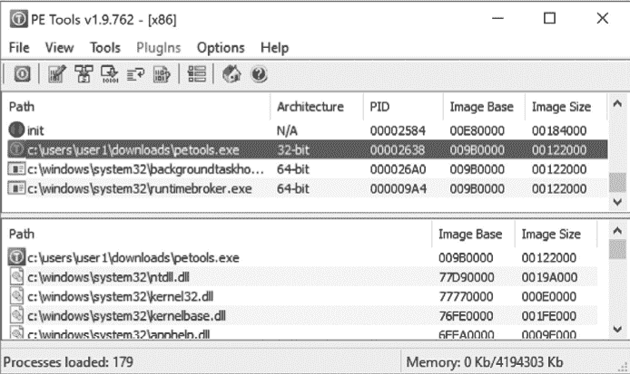
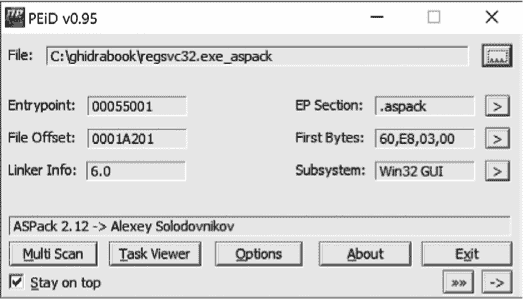

## 第三章：逆向工程与反汇编工具**


在我们掌握了一些反汇编的基本背景后，在深入了解 Ghidra 的具体细节之前，了解一些其他用于逆向工程二进制文件的工具将非常有用。这些工具中的许多在 Ghidra 之前就已经存在，并且仍然对快速查看文件以及核对 Ghidra 工作结果非常有用。正如我们将看到的，Ghidra 将这些工具的许多功能集成到其用户界面中，提供了一个单一的、集成的逆向工程环境。

### 分类工具

当第一次遇到未知文件时，回答一些简单问题通常是很有帮助的，比如“这是什么东西？”解决这个问题的首要原则是 *绝不* 依赖文件扩展名来确定文件的真实类型。这也是第二、第三和第四个原则。一旦你开始认同 *文件扩展名毫无意义* 的观点，你可能会希望熟悉以下一种或多种工具。

#### *file*

`file` 命令是一个标准工具，包含在大多数 *nix 风格的操作系统中，以及 Windows Subsystem for Linux (WSL) 中。^(1) 通过安装 Cygwin 或 MinGW，Windows 用户也可以使用该命令。^(2) `file` 命令通过检查文件中的特定字段来识别文件类型。

在某些情况下，`file` 能够识别常见的字符串，如 `#!/bin/sh`（一个 shell 脚本）和 `<html>`（一个 HTML 文档）。

含有非 ASCII 内容的文件会带来一些挑战。在这种情况下，`file` 会尝试确定文件内容是否按照已知的文件格式进行结构化。在许多情况下，它会寻找特定的标签值（通常称为 *magic numbers*）^(3)，这些标签值被认为是特定文件类型的独特标识。以下的十六进制列表示例展示了几种用于识别常见文件类型的 magic numbers。

```
Windows PE executable file

  00000000 4D 5A 90 00 03 00 00 00 04 00 00 00 FF FF 00 00 MZ..............

  00000010 B8 00 00 00 00 00 00 00 40 00 00 00 00 00 00 00 ........@.......

Jpeg image file

  00000000 FF D8 FF E0 00 10 4A 46 49 46 00 01 01 01 00 60 ......JFIF.....`

  00000010 00 60 00 00 FF DB 00 43 00 0A 07 07 08 07 06 0A .`.....C........

Java .class file

  00000000 CA FE BA BE 00 00 00 32 00 98 0A 00 2E 00 3E 08 .......2......>.

  00000010 00 3F 09 00 40 00 41 08 00 42 0A 00 43 00 44 0A .?..@.A..B..C.D.
```

`file` 命令有能力识别多种文件格式，包括几种类型的 ASCII 文本文件和各种可执行文件及数据文件格式。`file` 执行的 magic number 检查是根据 *magic 文件* 中的规则进行的。默认的 magic 文件因操作系统而异，但常见的位置包括 */usr/share/file/magic*、*/usr/share/misc/magic* 和 */etc/magic*。有关 magic 文件的更多信息，请参考 `file` 的文档。

在某些情况下，`file` 可以区分给定文件类型中的不同变种。以下列表演示了 `file` 不仅能够识别 ELF 二进制文件的多个变种，还能识别与二进制文件如何链接（静态或动态）以及是否经过剥离相关的信息。

```
ghidrabook# file ch2_ex_*

  ch2_ex_x64:        ELF 64-bit LSB shared object, x86-64, version 1 (SYSV), 

                     dynamically linked, interpreter /lib64/l, for GNU/Linux 

                     3.2.0, not stripped

  ch2_ex_x64_dbg:    ELF 64-bit LSB shared object, x86-64, version 1 (SYSV), 

                     dynamically linked, interpreter /lib64/l, for GNU/Linux 

                     3.2.0, with debug_info, not stripped

  ch2_ex_x64_static: ELF 64-bit LSB executable, x86-64, version 1 (GNU/Linux), 

                     statically linked, for GNU/Linux 3.2.0, not stripped

  ch2_ex_x64_strip:  ELF 64-bit LSB shared object, x86-64, version 1 (SYSV), 

                     dynamically linked, interpreter /lib64/l, for GNU/Linux 

                     3.2.0, stripped

  ch2_ex_x86:        ELF 32-bit LSB shared object, Intel 80386, version 1 

                     (SYSV), dynamically linked, interpreter /lib/ld-, for 

                     GNU/Linux 3.2.0, not stripped

  ch2_ex_x86_dbg:    ELF 32-bit LSB shared object, Intel 80386, version 1 

                     (SYSV), dynamically linked, interpreter /lib/ld-, for 

                     GNU/Linux 3.2.0, with debug_info, not stripped

  ch2_ex_x86_static: ELF 32-bit LSB executable, Intel 80386, version 1 

                     (GNU/Linux), statically linked, for GNU/Linux 3.2.0, 

                     not stripped

  ch2_ex_x86_strip:  ELF 32-bit LSB shared object, Intel 80386, version 1 

                     (SYSV), dynamically linked, interpreter /lib/ld-, for 

                     GNU/Linux 3.2.0, stripped

  ch2_ex_Win32:      PE32 executable (console) Intel 80386, for MS Windows

  ch2_ex_x64:        PE32+ executable (console) x86-64, for MS Windows
```

**WSL 环境**

Windows Subsystem for Linux 提供了一个直接在 Windows 中运行的 GNU/Linux 命令行环境，无需创建虚拟机。在 WSL 安装过程中，用户可以选择一个 Linux 发行版，然后在 WSL 上运行它。这提供了对常见命令行自由软件的访问（`grep`、`awk`）、编译器（`gcc`、`g++`）、解释器（Perl、Python、Ruby）、网络工具（`nc`、`ssh`）以及其他许多工具。一旦安装了 WSL，许多为 Linux 编写的程序就可以在 Windows 系统上进行编译和执行。

`file` 工具和类似的工具并非万无一失。很有可能由于文件恰巧带有特定文件格式的标识符，导致其被错误地识别。你可以通过使用十六进制编辑器，将任何文件的前 4 个字节修改为 Java 魔术数字序列：`CA FE BA BE`，来亲自验证这一点。`file` 工具会错误地将这个新修改的文件识别为 *编译过的 Java 类数据*。类似地，一个仅包含字符 `MZ` 的文本文件会被识别为 *MS-DOS 可执行文件*。在进行任何逆向工程时，一个好的做法是，在将任何工具的输出作为最终结果之前，首先通过多种工具和手动分析来验证这些输出。

**去除二进制可执行文件中的符号**

*去除*二进制文件符号是从二进制文件中去除符号的过程。二进制目标文件由于编译过程而包含符号。这些符号中的一些在链接过程中被使用，以在创建最终可执行文件或库时解析文件之间的引用。在其他情况下，符号可能存在，以便为调试器提供附加信息。链接过程完成后，许多符号已不再需要。传递给链接器的选项可以使链接器在构建时去除不必要的符号。或者，可以使用名为 `strip` 的工具从现有二进制文件中去除符号。虽然去除符号的二进制文件比未去除符号的二进制文件小，但去除符号后的二进制文件行为保持不变。

#### *PE 工具*

PE 工具是一组有助于分析 Windows 系统上正在运行的进程和可执行文件的工具集合。^4 图 2-1 展示了 PE 工具提供的主要界面，界面显示了活动进程的列表，并提供访问所有 PE 工具实用程序的功能。

从进程列表中，用户可以将进程的内存镜像转储到文件中，或使用 PE Sniffer 工具确定构建可执行文件时使用的编译器，或确定该可执行文件是否经过任何已知的混淆工具处理。工具菜单提供类似的选项，用于分析磁盘文件。用户可以使用嵌入式 PE 编辑器工具查看文件的 PE 头字段，该工具还允许轻松修改任何头部值。在尝试从混淆版本的文件重构有效的 PE 时，通常需要修改 PE 头部。



*图 2-1：PE Tools 工具*

**二进制文件混淆**

*混淆*是任何试图掩盖某物真实含义的行为。当应用于可执行文件时，混淆就是试图隐藏程序的真实行为。程序员可能出于多种原因使用混淆技术。常见的例子包括保护专有算法和掩盖恶意意图。几乎所有形式的恶意软件都会利用混淆技术来阻碍分析。有很多工具可以帮助程序作者生成混淆的程序。混淆工具和技术及其对逆向工程过程的影响将在第二十一章中进一步讨论。

#### *PEiD*

PEiD 是另一个 Windows 工具，其主要功能是识别用于构建特定 Windows PE 二进制文件的编译器，并识别任何用于混淆 Windows PE 二进制文件的工具。^(5) 图 2-2 显示了使用 PEiD 来识别用于混淆 Gaobot 蠕虫变种的工具（此案例中为 ASPack）。^(6)



*图 2-2：PEiD 工具*

PEiD 的许多附加功能与 PE Tools 重叠，包括概述 PE 文件头信息、收集正在运行的进程信息以及执行基本的反汇编操作。

### 汇总工具

由于我们的目标是逆向工程二进制程序文件，我们需要更复杂的工具来提取文件初步分类后的详细信息。本节讨论的工具，必然会更加了解它们所处理的文件格式。在大多数情况下，这些工具理解非常特定的文件格式，且它们被用来解析输入文件，以提取非常具体的信息。

#### *nm*

当源文件被编译为目标文件时，编译器必须嵌入有关任何全局（外部）符号位置的信息，以便链接器能够在合并目标文件以创建可执行文件时解析对这些符号的引用。除非指示从最终可执行文件中剥离符号，否则链接器通常会将目标文件中的符号携带到生成的可执行文件中。根据 man 页面，`nm` 工具“列出目标文件中的符号”。

当`nm`用于检查中间目标文件（*.o*文件而不是可执行文件）时，默认输出将显示文件中声明的任何函数和全局变量的名称。接下来是`nm`工具的示例输出：

```
ghidrabook# gcc -c ch2_nm_example.c

ghidrabook# nm ch2_nm_example.o

                   U exit

                   U fwrite

  000000000000002e t get_max

                   U _GLOBAL_OFFSET_TABLE_

                   U __isoc99_scanf

 00000000000000a6 T main

  0000000000000000 D my_initialized_global

  0000000000000004 C my_uninitialized_global

                   U printf

                   U puts

                   U rand

                   U srand

                   U __stack_chk_fail

                   U stderr

                   U time

  0000000000000000 T usage

ghidrabook#
```

在这里，我们看到`nm`列出了每个符号，并提供了关于符号的信息。字母代码用于表示列出的符号的类型。在这个例子中，我们看到了以下字母代码：

U 一个未定义的符号（通常是外部符号引用）。

T 在文本段中定义的符号（通常是一个函数名）。

t 在文本段中定义的局部符号。在 C 程序中，这通常等同于静态函数。

D 一个初始化的数据值。

C 一个未初始化的数据值。

**注意**

*大写字母代码用于全局符号，而小写字母代码用于局部符号。更多信息，包括字母代码的完整解释，可以在* nm 的手册页中找到。*

使用`nm`显示可执行文件中的符号时，会显示更多信息。在链接过程中，符号会被解析为虚拟地址（如果可能的话），这会导致在运行`nm`时显示更多的信息。以下是`nm`在可执行文件上的截断示例输出：

```
ghidrabook# gcc -o ch2_nm_example ch2_nm_example.c

ghidrabook# nm ch2_nm_example

  ...

                   U fwrite@@GLIBC_2.2.5

  0000000000000938 t get_max

  0000000000201f78 d _GLOBAL_OFFSET_TABLE_

                   w __gmon_start__

  0000000000000c5c r __GNU_EH_FRAME_HDR

  0000000000000730 T _init

  0000000000201d80 t __init_array_end

  0000000000201d78 t __init_array_start

  0000000000000b60 R _IO_stdin_used

                   U __isoc99_scanf@@GLIBC_2.7

                   w _ITM_deregisterTMCloneTable

                   w _ITM_registerTMCloneTable

  0000000000000b50 T __libc_csu_fini

  0000000000000ae0 T __libc_csu_init

 U __libc_start_main@@GLIBC_2.2.5

  00000000000009b0 T main

  0000000000202010 D my_initialized_global

  000000000020202c B my_uninitialized_global

                   U printf@@GLIBC_2.2.5

                   U puts@@GLIBC_2.2.5

                   U rand@@GLIBC_2.2.5

  0000000000000870 t register_tm_clones

                   U srand@@GLIBC_2.2.5

                   U __stack_chk_fail@@GLIBC_2.4

  0000000000000800 T _start

  0000000000202020 B stderr@@GLIBC_2.2.5

                   U time@@GLIBC_2.2.5

  0000000000202018 D __TMC_END__

  000000000000090a T usage

ghidrabook#
```

此时，一些符号（例如`main`）已经被分配了虚拟地址，新的符号（如`__libc_csu_init`）由于链接过程而引入，一些符号（如`my_unitialized_global`）已更改了符号类型，另一些符号仍未定义，因为它们继续引用外部符号。在这种情况下，我们正在检查的二进制文件是动态链接的，未定义的符号在共享的 C 库中定义。

#### *ldd*

当创建一个可执行文件时，必须解决该可执行文件引用的任何库函数的位置。链接器有两种方法来解决对库函数的调用：*静态链接*和*动态链接*。提供给链接器的命令行参数决定使用哪种方法。一个可执行文件可以是静态链接的、动态链接的，或者是两者都有的。^(7)

当请求静态链接时，链接器将应用程序的目标文件与所需库的副本结合起来，以创建可执行文件。在运行时，无需查找库代码，因为它已经包含在可执行文件中。静态链接的优点包括：(1) 它能使函数调用稍微更快，(2) 由于不需要假设用户系统上是否有库代码，二进制文件的分发变得更容易。静态链接的缺点包括：(1) 生成的可执行文件较大，(2) 当库组件发生变化时，程序的升级更加困难。程序更新变得更加困难，因为每次库发生更改时，程序必须重新链接。从逆向工程的角度来看，静态链接在某种程度上使问题变得更加复杂。如果我们面临分析一个静态链接的二进制文件的任务，就没有简单的方法来回答“这个二进制文件链接了哪些库？”以及“这些函数中哪些是库函数？”第十三章讨论了在逆向工程静态链接代码时遇到的挑战。

动态链接与静态链接的不同之处在于，链接器不需要复制任何所需的库。相反，链接器仅在最终可执行文件中插入对所需库（通常是*.so*或*.dll*文件）的引用，这通常会导致生成的可执行文件更小。当使用动态链接时，库代码的升级变得更加容易。由于只维护一个库的副本，并且该副本被多个二进制文件引用，替换掉过时的库副本并用新版本替代，将导致任何基于动态链接到该库的二进制文件的进程使用更新的版本。使用动态链接的一个缺点是，它需要更复杂的加载过程。所有必要的库必须被定位并加载到内存中，而不像静态链接文件那样，加载的文件已经包含了所有的库代码。动态链接的另一个缺点是，供应商不仅必须分发他们自己的可执行文件，还必须分发所有该可执行文件所依赖的库文件。如果在没有所有必需库文件的系统上尝试执行程序，将会导致错误。

以下输出演示了程序的动态和静态链接版本的创建、生成的二进制文件的大小，以及`file`如何识别这些二进制文件：

```
ghidrabook# gcc -o ch2_example_dynamic ch2_example.c

ghidrabook# gcc -o ch2_example_static ch2_example.c -static

ghidrabook# ls -l ch2_example_*

  -rwxrwxr-x 1 ghidrabook ghidrabook  12944 Nov  7 10:07 ch2_example_dynamic

  -rwxrwxr-x 1 ghidrabook ghidrabook 963504 Nov  7 10:07 ch2_example_static

ghidrabook# file ch2_example_*

  ch2_example_dynamic: ELF 64-bit LSB executable, x86-64, version 1 (SYSV),

  dynamically linked, interpreter /lib64/l, for GNU/Linux 3.2.0,

  BuildID[sha1]=e56ed40012accb3734bde7f8bca3cc2c368455c3, not stripped

  ch2_example_static:  ELF 64-bit LSB executable, x86-64, version 1 (GNU/Linux),

  statically linked, for GNU/Linux 3.2.0,

  BuildID[sha1]=430996c6db103e4fe76aea7d578e636712b2b4b0, not stripped

ghidrabook#
```

为了使动态链接正常工作，动态链接的二进制文件必须指明它们所依赖的库，以及每个库所需的特定资源。因此，与静态链接的二进制文件不同，确定动态链接的二进制文件所依赖的库非常简单。`ldd`（*列出动态依赖项*）工具用于列出任何可执行文件所需的动态库。在以下示例中，`ldd`用于确定 Apache web 服务器所依赖的库：

```
ghidrabook# ldd /usr/sbin/apache2

  linux-vdso.so.1 =>  (0x00007fffc1c8d000)

  libpcre.so.3 => /lib/x86_64-linux-gnu/libpcre.so.3 (0x00007fbeb7410000)

  libaprutil-1.so.0 => /usr/lib/x86_64-linux-gnu/libaprutil-1.so.0 (0x00007fbeb71e0000)

  libapr-1.so.0 => /usr/lib/x86_64-linux-gnu/libapr-1.so.0 (0x00007fbeb6fa0000)

  libpthread.so.0 => /lib/x86_64-linux-gnu/libpthread.so.0 (0x00007fbeb6d70000)

  libc.so.6 => /lib/x86_64-linux-gnu/libc.so.6 (0x00007fbeb69a0000)

  libcrypt.so.1 => /lib/x86_64-linux-gnu/libcrypt.so.1 (0x00007fbeb6760000)

 libexpat.so.1 => /lib/x86_64-linux-gnu/libexpat.so.1 (0x00007fbeb6520000)

  libuuid.so.1 => /lib/x86_64-linux-gnu/libuuid.so.1 (0x00007fbeb6310000)

  libdl.so.2 => /lib/x86_64-linux-gnu/libdl.so.2 (0x00007fbeb6100000)

  /lib64/ld-linux-x86-64.so.2 (0x00007fbeb7a00000)

ghidrabook#
```

`ldd`工具可在 Linux 和 BSD 系统上使用。在 macOS 系统上，可以使用`otool`工具配合`-L`选项来实现类似功能：`otool -L` 文件名。在 Windows 系统上，可以使用`dumpbin`工具，这是 Visual Studio 工具套件的一部分，用于列出依赖库：`dumpbin /dependents` 文件名。

**小心你的工具！**

尽管`ldd`看起来像是一个简单的工具，但`ldd`的手册页面指出，“你永远不应该在不可信的可执行文件上使用`ldd`，因为这可能会导致执行任意代码。”虽然在大多数情况下这种情况不太可能发生，但它提醒我们，当检查不可信的输入文件时，甚至像`ldd`这样的简单软件逆向工程（SRE）工具也可能会产生意想不到的后果。虽然执行不可信的二进制文件显然不安全，但即使是在静态分析不可信二进制文件时，也应该采取预防措施，并假设进行 SRE 任务的计算机以及与其连接的任何数据或其他主机，可能会因 SRE 活动而被入侵。

#### *objdump*

虽然`ldd`是一个相对专业的工具，但`objdump`则非常多功能。`objdump`的目的是“显示目标文件中的信息”。^(8) 这是一个相当广泛的目标，为了实现这一目标，`objdump`支持超过 30 个命令行选项，用于从目标文件中提取各种信息。`objdump`工具可以用来显示与目标文件相关的以下数据（还有更多）：

**段头信息** 程序文件中各个部分的摘要信息。

**私有头文件** 程序内存布局信息和运行时加载器所需的其他信息，包括所需库的列表，类似于`ldd`产生的输出。

**调试信息** 程序文件中嵌入的任何调试信息。

**符号信息** 符号表信息，类似于`nm`工具的输出方式。

**反汇编清单** `objdump`工具对标记为代码的文件部分执行线性遍历反汇编。当反汇编 x86 代码时，`objdump`可以生成 AT&T 或 Intel 语法，并且可以将反汇编结果保存为文本文件。这类文本文件称为反汇编*死清单*，虽然这些文件可以用于逆向工程，但它们难以有效导航，并且更难以一致且无错误地修改。

`objdump`工具作为 GNU binutils 工具套件的一部分可用，可以在 Linux、FreeBSD 和 Windows（通过 WSL 或 Cygwin）上找到。^(9) 注意，`objdump`依赖于*二进制文件描述符库（libbfd）*，这是 binutils 的一个组件，用于访问目标文件，因此能够解析 libbfd 支持的文件格式（例如 ELF 和 PE）。对于 ELF 特定的解析，还提供了一个名为`readelf`的工具。`readelf`工具提供了与`objdump`大致相同的功能，主要的区别是`readelf`不依赖于 libbfd。

#### *otool*

`otool`工具最简单的描述就是类似于`objdump`的 macOS 选项，它对于解析 macOS Mach-O 二进制文件的信息非常有用。以下清单展示了`otool`如何显示 Mach-O 二进制文件的动态库依赖性，从而执行类似`ldd`的功能：

```
ghidrabook# file osx_example

  osx_example: Mach-O 64-bit executable x86_64

ghidrabook# otool -L osx_example

  osx_example:

    /usr/lib/libstdc++.6.dylib (compatibility version 7.0.0, current version 7.4.0)

    /usr/lib/libgcc_s.1.dylib (compatibility version 1.0.0, current version 1.0.0)

    /usr/lib/libSystem.B.dylib (compatibility version 1.0.0, current version 1281.0.0)
```

`otool`工具可以用于显示与文件头和符号表相关的信息，并对文件的代码段执行反汇编。有关`otool`功能的更多信息，请参考相关的 man 页面。

#### *dumpbin*

`dumpbin`命令行工具包含在微软的 Visual Studio 工具套件中。与`otool`和`objdump`类似，`dumpbin`能够显示与 Windows PE 文件相关的广泛信息。以下清单展示了`dumpbin`如何以类似`ldd`的方式显示 Windows 记事本程序的动态依赖：

```
$ dumpbin /dependents C:\Windows\System32\notepad.exe

Microsoft (R) COFF/PE Dumper

Copyright (C) Microsoft Corporation.  All rights reserved.

Dump of file notepad.exe

File Type: EXECUTABLE IMAGE

  Image has the following delay load dependencies:

    ADVAPI32.dll

    COMDLG32.dll

    PROPSYS.dll

    SHELL32.dll

    WINSPOOL.DRV

    urlmon.dll

  Image has the following dependencies:

    GDI32.dll

    USER32.dll

    msvcrt.dll

    ...
```

额外的`dumpbin`选项提供了从 PE 二进制文件的各种部分提取信息的能力，包括符号、导入的函数名、导出的函数名和反汇编代码。有关使用`dumpbin`的更多信息，可以通过微软网站获取。^(10)

#### *c++filt*

支持函数重载的语言必须有一种机制来区分多个重载版本的函数，因为每个版本的函数名称相同。以下 C++示例展示了名为`demo`的函数几个重载版本的原型：

```
void demo(void);

void demo(int x);

void demo(double x);

void demo(int x, double y);

void demo(double x, int y);

void demo(char* str);
```

一般来说，在目标文件中不可能有两个同名的函数。为了支持函数重载，编译器通过结合描述函数参数类型顺序的信息来为重载函数生成唯一的名称。为具有相同名称的函数生成唯一名称的过程称为*名称混淆*。^(11) 如果我们使用`nm`从编译后的 C++代码中转储符号，我们可能会看到类似以下内容（已过滤，专注于`demo`的版本）：

```
ghidrabook# g++ -o ch2_cpp_example ch2_cpp_example.cc

ghidrabook# nm ch2_cpp_example | grep demo

  000000000000060b T _Z4demod

  0000000000000626 T _Z4demodi

  0000000000000601 T _Z4demoi

  0000000000000617 T _Z4demoid

  0000000000000635 T _Z4demoPc

  00000000000005fa T _Z4demov
```

C++标准并没有定义一个标准的名称混淆方案，因此编译器设计者需要自行开发。这是用来解密显示的`demo`混淆变体的工具所需的，我们需要一个理解我们编译器（在此案例中为`g++`）名称混淆方案的工具。`c++filt`正是为了这个目的设计的。这个工具将每个输入单词当作一个混淆后的名称，然后尝试确定用于生成该名称的编译器。如果该名称看起来是有效的混淆名称，它会输出去混淆后的名称。当`c++filt`无法将一个单词识别为混淆名称时，它会原样输出该单词。

如果我们将前面示例中`nm`的结果传递给`c++filt`，我们就可以恢复去混淆后的函数名称，如下所示：

```
ghidrabook# nm ch2_cpp_example | grep demo | c++filt

  000000000000060b T demo(double)

  0000000000000626 T demo(double, int)

  0000000000000601 T demo(int)

  0000000000000617 T demo(int, double)

  0000000000000635 T demo(char*)

  00000000000005fa T demo()
```

需要注意的是，**混淆后的名称**包含了关于函数的附加信息，而`nm`通常不会提供这些信息。这些信息在逆向工程中非常有用，在更复杂的情况下，这些额外的信息可能包括关于类名或函数调用约定的数据。

### 深度检查工具

到目前为止，我们已经讨论了基于对文件内部结构的最少了解进行简要分析的工具。我们还看到了能够根据文件结构的详细知识提取特定数据的工具。在这一节中，我们将讨论旨在独立于被分析文件类型提取特定类型信息的工具。

#### *字符串*

有时，提出一些关于文件内容的更一般性的问题是有用的——

不一定需要了解文件结构的特定知识的问题。其中一个问题是：“这个文件包含任何嵌入的字符串吗？”当然，我们首先需要回答的问题是：“什么构成了字符串？”我们可以宽泛地定义*字符串*为一串连续的可打印字符。这个定义通常会被扩展，指定一个最小长度和特定的字符集。因此，我们可以指定搜索所有至少包含四个连续 ASCII 可打印字符的序列，并将结果打印到控制台。此类字符串的搜索通常不受文件结构的任何限制。你可以在 ELF 二进制文件中搜索字符串，就像你在 Microsoft Word 文档中搜索字符串一样轻松。

`strings`工具专门用于从文件中提取字符串内容，通常不考虑文件的格式。使用`strings`的默认设置（7 位 ASCII 序列，至少四个字符）可能会得到如下内容：

```
ghidrabook# strings ch2_example

  /lib64/ld-linux-x86-64.so.2

  libc.so.6

  exit

  srand

  __isoc99_scanf

  puts

  time

  __stack_chk_fail

  printf

  stderr

  fwrite

  __libc_start_main

  GLIBC_2.7

  GLIBC_2.4

  GLIBC_2.2.5

  _ITM_deregisterTMCloneTable

  __gmon_start__

  _ITM_registerTMCloneTable

  usage: ch4_example [max]

  A simple guessing game!

  Please guess a number between 1 and %d.

  Invalid input, quitting!

  Congratulations, you got it in %d attempt(s)!

  Sorry too low, please try again

  Sorry too high, please try again

  GCC: (Ubuntu 7.4.0-1ubuntu1~18.04.1) 7.4.0

  ...
```

**为什么 STRINGS 发生了变化？**

从历史上看，当`strings`用于可执行文件时，默认只会搜索二进制文件中可加载的初始化数据区段的字符序列。这需要`strings`解析二进制文件，以查找这些区段，并使用像 libbfd 这样的库。当它用于解析不受信任的二进制文件时，库中的漏洞可能会导致任意代码执行。^(12) 因此，`strings`的默认行为已更改为检查整个二进制文件，而不解析可加载的初始化数据区段（与使用`-a`标志的效果相同）。可以使用`-d`标志来调用历史行为。

12。参见 CVE-2014-8485 和*[`lcamtuf.blogspot.com/2014/10/psa-dont-run-strings-on-untrusted-files.html`](https://lcamtuf.blogspot.com/2014/10/psa-dont-run-strings-on-untrusted-files.html)*。

不幸的是，尽管我们看到一些看起来像是程序输出的字符串，但其他一些字符串似乎是函数名和库名。我们应当小心，不要根据`strings`的输出草率推断程序的行为。分析人员常常会陷入试图根据`strings`的输出推断程序行为的陷阱。记住，二进制文件中的字符串的存在并不意味着该字符串以任何方式被该二进制文件使用。

以下是关于`strings`使用的一些最后说明：

+   默认情况下，`strings`不会指示字符串在文件中的位置。使用`-t`命令行参数，可以让`strings`为每个找到的字符串打印文件偏移信息。

+   许多文件使用替代字符集。使用`-e`命令行参数，可以使`strings`搜索宽字符，如 16 位 Unicode 字符。

#### *反汇编器*

如前所述，已经有工具可以生成二进制对象文件的死列表式反汇编。PE、ELF 和 Mach-O 二进制文件可以分别使用`dumpbin`、`objdump`和`otool`进行反汇编。然而，这些工具都无法处理任意的二进制数据块。你有时会遇到不符合广泛使用文件格式的二进制文件，在这种情况下，你需要能够从用户指定的偏移量开始反汇编过程的工具。

两个适用于 x86 指令集的*流式反汇编工具*的示例是`ndisasm`和`diStorm`。^(13) 工具`ndisasm`包含在 NASM 中。^(14) 以下示例展示了如何使用`ndisasm`反汇编通过 Metasploit 框架生成的一段 shellcode：^(15)

```
ghidrabook#  msfvenom -p linux/x64/shell_find_port -f raw > findport

ghidrabook#  ndisasm –b 64 findport

  00000000  4831FF            xor rdi,rdi

  00000003  4831DB            xor rbx,rbx

  00000006  B314              mov bl,0x14

  00000008  4829DC            sub rsp,rbx

  0000000B  488D1424          lea rdx,[rsp]

  0000000F  488D742404        lea rsi,[rsp+0x4]

  00000014  6A34              push byte +0x34

  00000016  58                pop rax

  00000017  0F05              syscall

  00000019  48FFC7            inc rdi

  0000001C  66817E024A67      cmp word [rsi+0x2],0x674a

  00000022  75F0              jnz 0x14

  00000024  48FFCF            dec rdi

  00000027  6A02              push byte +0x2

  00000029  5E                pop rsi

  0000002A  6A21              push byte +0x21

  0000002C  58                pop rax

  0000002D  0F05              syscall

  0000002F  48FFCE            dec rsi

  00000032  79F6              jns 0x2a

  00000034  4889F3            mov rbx,rsi

  00000037  BB412F7368        mov ebx,0x68732f41

  0000003C  B82F62696E        mov eax,0x6e69622f

  00000041  48C1EB08          shr rbx,byte 0x8

  00000045  48C1E320          shl rbx,byte 0x20

  00000049  4809D8            or rax,rbx

  0000004C  50                push rax

  0000004D  4889E7            mov rdi,rsp

  00000050  4831F6            xor rsi,rsi

  00000053  4889F2            mov rdx,rsi

  00000056  6A3B              push byte +0x3b

  00000058  58                pop rax

  00000059  0F05              syscall

ghidrabook#
```

流式反汇编的灵活性在许多情况下都非常有用。一种场景涉及计算机网络攻击的分析，其中网络数据包可能包含 shellcode。流式反汇编工具可以用来反汇编数据包中包含 shellcode 的部分，以便分析恶意负载的行为。另一种情况是分析没有布局参考的 ROM 镜像。ROM 的某些部分包含数据，而其他部分则包含代码。流式反汇编工具可以用来仅反汇编那些被认为是代码的镜像部分。

### 总结

本章讨论的工具不一定是同类中最优秀的。然而，它们确实代表了任何希望反向工程二进制文件的人常用的工具。更重要的是，它们代表了促使 Ghidra 开发的工具类型。在未来的章节中，我们偶尔会介绍一些独立工具，这些工具提供与 Ghidra 集成的功能类似的功能。了解这些工具将极大提升你对 Ghidra 用户界面和 Ghidra 所提供的众多信息展示的理解。
