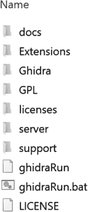
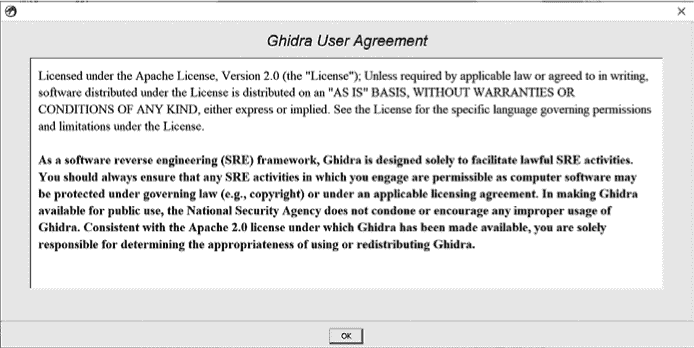

# 第四章：**认识 Ghidra**

Ghidra 是由美国国家安全局（NSA）开发的一个免费开源的 SRE 工具套件。这个平台无关的 Ghidra 环境包括一个交互式反汇编器和反编译器，以及大量相关工具，它们协同工作，帮助你分析代码。它支持多种指令集架构和二进制格式，可以在独立模式和协作 SRE 配置中运行。也许 Ghidra 最棒的特点是，它允许你自定义工作环境，开发自己的插件和脚本，增强你的 SRE 过程，并与 Ghidra 社区分享你的创新。

### Ghidra 许可证

Ghidra 是免费分发的，并且根据 Apache 许可证 2.0 版授权。这个许可证为个人使用 Ghidra 提供了很大的自由，但也有一些相关的限制。所有下载、使用或编辑 Ghidra 的个人都鼓励阅读 Ghidra 用户协议（*docs/UserAgreement.html*）以及*GPL*和*licenses*目录中的许可证文件，以确保他们遵守所有许可协议，因为 Ghidra 中的第三方组件有自己的许可证。如果你在阅读过程中忘记了本段中的内容，Ghidra 会在每次启动 Ghidra 或从帮助菜单选择“关于 Ghidra”时，友好地显示许可信息。

### Ghidra 版本

Ghidra 支持 Windows、Linux 和 macOS。虽然 Ghidra 高度可配置，但大多数新用户可能会下载 Ghidra 并选择开始使用最新版的 Ghidra Core，其中包括传统的逆向工程功能。本书的重点是非共享项目中的 Ghidra Core 功能。此外，我们还花时间讨论共享项目、无头 Ghidra 以及开发者、功能 ID 和实验配置。

### Ghidra 支持资源

使用一套新的软件工具可能会让人感到困难，尤其是当目标是通过逆向工程来解决一个具有挑战性的实际问题时。作为 Ghidra 用户（或潜在开发者），你可能会想知道当你遇到与 Ghidra 相关的问题时该向哪里求助。如果我们做好了本书的工作，它可以在许多情况下提供帮助。然而，当你需要额外帮助时，以下是你可以求助的一些额外资源：

**官方帮助文档** Ghidra 包含一个详细的帮助系统，可以通过菜单激活或按 F1 键启动。帮助系统提供了一个层次化菜单和搜索功能。虽然帮助菜单提供了多种视图，但它目前不支持提问式问题，比如“如何做*x*？”

**自述文件** 在某些情况下，Ghidra 帮助菜单将引导您查阅特定主题的附加内容，例如自述文件。文档中包含许多自述文件，用于补充特定插件、扩展帮助菜单中的主题（如*support/analyzeHeadlessREADME.html*）、协助各种安装（*docs/InstallationGuide.html*）并帮助您作为开发者的成长（例如*Extensions/Eclipse/GhidraDev/GhidraDev_README.html*），如果您选择追求这条路线（也许是开发支持询问“我如何做*x*”的功能）。

**Ghidra 网站** Ghidra 项目主页（*[`www.ghidra-sre.org/`](https://www.ghidra-sre.org/)*）为潜在用户、当前用户、开发者和贡献者提供了进一步了解 Ghidra 的选项。除了与每个 Ghidra 发布版本相关的详细下载信息外，还有一个有用的安装指南视频，指导您完成安装过程。

**Ghidra *docs*目录** 您的 Ghidra 安装包括一个目录，其中包含有关 Ghidra 的有用文档，包括可打印的菜单和热键指南（*docs/CheatSheet.html*），这些可以极大地简化您对 Ghidra 的介绍，还有更多。涵盖 Ghidra 初学者、中级和高级功能的教程可以在*docs/GhidraClass*下找到。

### 下载 Ghidra

获得您的免费 Ghidra 副本是一个简单的三步过程：

1.  导航至*[`ghidra-sre.org/`](https://ghidra-sre.org/)*。

1.  单击大红色的**下载 Ghidra**按钮。

1.  将文件保存到计算机上的所需位置。

与许多简单的三步过程一样，有几个地方可能会有一些叛逆者选择略微偏离推荐路径。以下选项适用于那些希望与传统起始包有所不同的人：

+   如果您想安装不同的版本，只需单击**发布**按钮，您将有下载其他已发布版本的选项。虽然某些功能可能有所不同，但 Ghidra 的基本功能应该保持不变。

+   如果您希望安装到支持协作工作的服务器，请等到第十一章了解如何对安装进行重要更改（或者随意跳过并尝试使用*server*目录中的信息。）最坏的情况是，可以轻松撤销并使用简单的三步过程重新开始，并以本地 Ghidra 实例开始。

+   铁心勇士可能希望从源代码构建 Ghidra。 Ghidra 的源代码在 GitHub 上可用，网址为*[`github.com/NationalSecurityAgency/ghidra/`](https://github.com/NationalSecurityAgency/ghidra/)*。

让我们继续传统的安装过程。

### 安装 Ghidra

那么，当您点击神奇的红色下载按钮并选择了计算机上的目标位置时，它究竟做了什么呢？如果一切顺利，您现在应该在选定的目录中有一个*zip*文件。对于原始的 Ghidra 版本，*zip* 文件的名称为 *ghidra_9.0_PUBLIC_20190228.zip*。我们可以分解一下命名规则。首先，*9.0* 是版本号。接着，*PUBLIC* 是发布类型（还有其他类型的发布，例如 *BETA_DEV* 发布）。最后是发布日期，后面跟着 *.zip* 文件扩展名。

这个 *zip* 文件实际上是包含了超过 3400 个文件的集合，这些文件构成了 Ghidra 框架。如果您对保存文件的位置满意，那么解压它（例如，右键点击并选择“全部解压”）将使您能够访问 Ghidra 的层级目录。请注意，Ghidra 需要编译一些内部数据文件，因此 Ghidra 用户通常需要对所有 Ghidra 程序子目录具有写访问权限。

#### *Ghidra 目录布局*

在开始使用 Ghidra 之前，熟悉 Ghidra 安装内容并不是必须的要求。然而，由于我们目前关注的是您下载的提取文件，让我们先简单看看基本的布局。随着您逐步使用 Ghidra 更高级的功能，对 Ghidra 目录结构的理解将变得越来越重要。以下是对 Ghidra 安装中每个子目录的简要描述。图 3-1 展示了 Ghidra 目录布局。

*图 3-1：Ghidra 目录布局*

***docs*** 包含了有关 Ghidra 及其使用方法的一般支持文档。此目录中有两个子目录值得一提。首先，*GhidraClass* 子目录提供了帮助您了解 Ghidra 的教育内容。其次，*languages* 子目录描述了 Ghidra 的处理器规范语言 SLEIGH。SLEIGH 在第十八章中有详细讨论。

***扩展*** 包含了有用的预构建扩展以及编写 Ghidra 扩展所需的重要内容和信息。此目录将在第十五章、第十七章和第十八章中详细讨论。

***Ghidra*** 包含了 Ghidra 的代码。随着我们在第十二章中开始定制 Ghidra，并在第十三章至第十八章中构建新功能时，您将进一步了解此目录中的资源和内容。

***GPL*** Ghidra 框架中的一些组件并非由 Ghidra 团队开发，而是包含了其他根据 GNU 通用公共许可证（GPL）发布的代码。*GPL* 目录包含与这些内容相关的文件，包括许可信息。

***licenses*** 包含概述 Ghidra 各种第三方组件的适当和合法使用的文件。

***server*** 支持安装 Ghidra 服务器，促进协作式 SRE。本目录将在第十一章中深入讨论。

***support*** 作为一个汇总，包含了各种 Ghidra 专用功能和能力。作为额外内容，如果你想进一步自定义工作环境（例如，创建一个 Ghidra 启动脚本的快捷方式），这里也可以找到 Ghidra 图标（*ghidra.ico*）。在全书中，根据需要会讨论这个目录，以介绍各种 Ghidra 功能。

#### *启动 Ghidra*

在子目录旁边，根目录中的文件让你能够开始你的 Ghidra SRE 之旅。这个目录中还有另一个许可文件（*LICENSE.txt*），但更重要的是，你会找到实际上启动 Ghidra 的脚本。第一次双击 *ghidraRun.bat*（或者在 Linux 或 macOS 的命令行中运行等效的 *ghidraRun* 脚本）时，你需要同意在图 3-2 中显示的最终用户许可协议（EULA），以确认你计划根据 Ghidra 用户协议使用 Ghidra。一旦同意后，在后续启动中你将不再看到此窗口，但可以随时通过帮助菜单查看内容。

此外，系统可能会要求你提供 Java 安装路径。（如果你没有安装 Java，请参阅 *docs* 子目录中的安装指南，其中在 Java 注释部分提供了相关文档。）Ghidra 需要版本 11 或更高版本的 Java 开发工具包（JDK）。^(1)

*图 3-2：Ghidra 用户协议*

### 总结

一旦成功打开 Ghidra，你就可以继续使用它来完成一些有用的工作。在接下来的几个章节中，你将学习如何使用 Ghidra 进行基本的文件分析，了解 CodeBrowser 及其许多常见的 Ghidra 显示窗口，并学习如何配置和操作这些显示窗口，以进一步理解程序的行为。
