# 第六章：**启动 Ghidra**


现在是时候开始实际使用 Ghidra 了。本书的其余部分将介绍 Ghidra 的各种功能，以及如何利用它们来最好地满足您的逆向工程需求。在本章中，我们首先介绍启动 Ghidra 时您会看到的选项，然后描述当您打开单个二进制文件进行分析时会发生什么。最后，我们简要概述用户界面，为接下来的章节打下基础。

### 启动 Ghidra

每次启动 Ghidra 时，您都会短暂看到一个显示 Ghidra 徽标、构建信息、Ghidra 和 Java 版本号以及许可证信息的启动画面。如果您希望详细阅读启动画面以了解更多关于版本的信息，可以随时通过选择帮助 ▸ 关于 Ghidra 从 Ghidra 项目窗口显示它。一旦启动画面消失，Ghidra 将在“每日提示”对话框后显示 Ghidra 项目窗口，如图 4-1 所示。您可以通过点击“下一条提示”按钮浏览提示。当您准备开始工作时，关闭“每日提示”对话框。

如果您不希望看到每日提示，可以随时取消勾选对话框底部的“启动时显示提示”复选框。如果您取消勾选该框并发现自己错过了每日提示对话框，您可以通过 Ghidra 帮助菜单轻松恢复它。

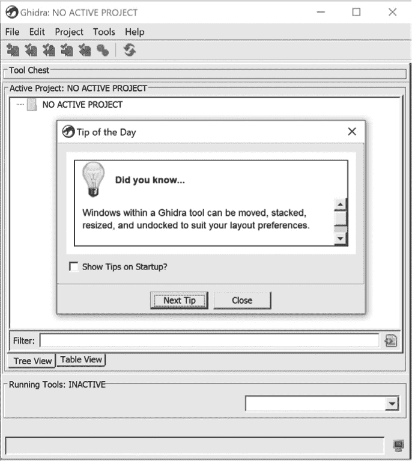

*图 4-1：启动 Ghidra*

如果您关闭了“每日提示”对话框或取消勾选该框并重新启动 Ghidra，您将看到 Ghidra 项目窗口。Ghidra 使用项目环境来帮助您管理和控制与文件或文件组相关的工具和数据。当您使用它们时，这种初步介绍重点讨论了作为非共享项目组成部分的单个文件。更复杂的项目功能将在第十一章中讨论。

### 创建新项目

如果这是您第一次启动 Ghidra，您需要创建一个项目。如果您之前启动过 Ghidra，活动项目将是您最近使用的项目。选择文件 ▸ 新建项目可以让您指定与项目相关的环境特性。创建新项目的第一步是选择非共享项目或共享项目。在本章中，我们从非共享项目开始。做出选择后，您将看到图 4-2 中的对话框。非共享项目需要您指定项目目录和名称。

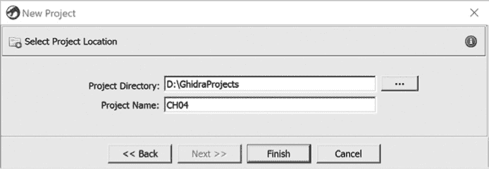

*图 4-2：创建 Ghidra 项目*

输入项目位置信息后，点击**完成**以完成项目创建过程。这将使您返回到项目窗口，并选中刚创建的项目，如图 4-3 所示。

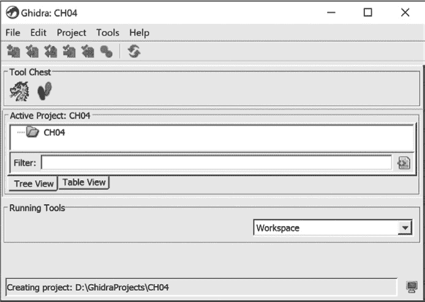

*图 4-3：Ghidra 项目窗口*

#### *Ghidra 文件加载*

要进行任何有用的工作，您需要至少向新项目中添加一个文件。您可以通过选择“文件 ▸ 导入文件”并浏览到您希望导入的文件，或者直接将文件拖放到项目窗口中的文件夹来打开文件。在选择文件后，您将看到如图 4-4 所示的导入对话框。

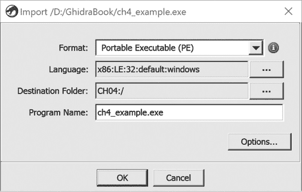

*图 4-4：Ghidra 导入对话框*

Ghidra 会生成潜在文件类型的列表，并将这些文件类型提供给您，在对话框顶部的格式选择框中。点击格式字段右侧的“信息”按钮，将为您提供支持的格式列表，这些格式在第十七章中进行了描述。格式选择框提供了一组 Ghidra 加载器，这些加载器最适合处理所选文件。在此示例中，格式选择框中提供了两种选项：可移植执行文件（PE）和原始二进制文件。原始二进制文件选项将始终存在，因为它是 Ghidra 在加载无法识别的文件时的默认选项；这是加载任何文件的最低级别选项。当提供多个加载器选择时，除非您有与 Ghidra 判断相矛盾的特定信息，否则接受默认选择通常是一个不错的策略。

语言字段允许您指定在反汇编过程中应使用哪个处理器模块。Ghidra 的语言/编译器规范可以包括处理器类型、字节序（LE/BE）、位数值（16/32/64）、处理器变体以及编译器 ID（例如，ARM:LE:32:v7:default）。有关更多信息，请参阅第十三章中的语言/编译器规范说明以及第 396 页上的“语言定义文件”。在大多数情况下，Ghidra 会根据从可执行文件头部读取的信息选择合适的处理器。

目标文件夹字段允许您选择显示新导入文件的项目文件夹。默认情况下，显示的是顶级项目文件夹，但可以添加子文件夹以组织项目中的导入程序。您可以选择语言和目标文件夹字段右侧的扩展按钮，以查看每个字段的其他选项。您还可以编辑程序名称字段中的文本。不要被术语的变化弄混淆：程序名称是 Ghidra 用于在项目中引用导入二进制文件的名称，包括在项目窗口中的显示。默认情况下，它是导入文件的名称，但可以更改为更具描述性的名称，例如“来自星际企业号的恶意软件”。

除了图 4-4 中显示的四个字段外，你还可以通过“选项”按钮访问其他选项，以控制加载过程。这些选项依赖于所选格式和处理器。图 4-5 中显示了 *ch4_example.exe*，一个用于 x86 的 PE 文件，选择了默认选项。虽然通常采用默认选项是一个好的方法，但随着经验的积累，你也可以选择其他选项。例如，如果你希望将任何依赖的库导入到项目中，可以选择“加载外部库”选项。

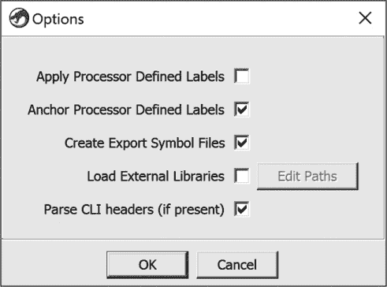

*图 4-5：Ghidra PE 文件加载选项*

导入选项用于更精细地控制文件加载过程。并非所有输入文件类型都适用这些选项，在大多数情况下，你可以依赖默认选择。关于选项的更多信息可以在 Ghidra 帮助中找到。有关 Ghidra 导入过程和加载器的更多细节，请参见第十七章。

当你对加载选项满意并点击 OK 关闭对话框后，将会看到导入结果摘要窗口，如图 4-6 所示。这里为你提供了一个机会，可以查看所选导入选项，并查看加载器从所选文件中提取的基本信息。在《导入文件》中，我们讨论了如何在分析之前修改一些导入结果，如果你拥有在导入结果摘要窗口中未反映的附加信息。

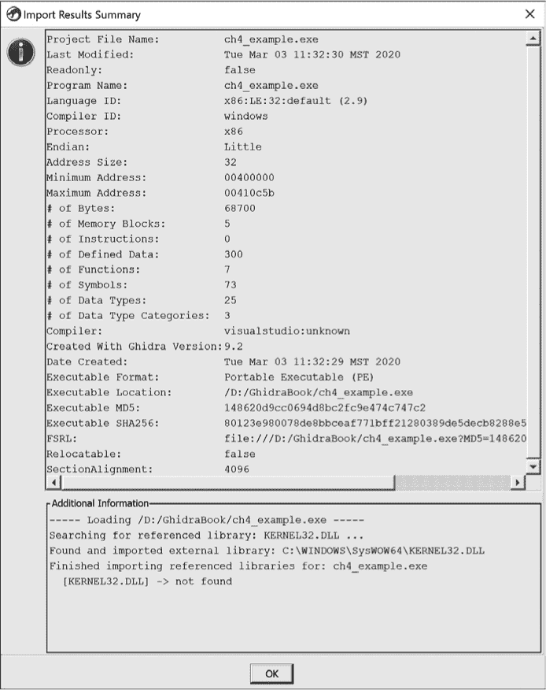

*图 4-6：Ghidra 导入结果摘要窗口*

#### *使用 Raw Binary 加载器*

有时，Raw Binary 将是格式选择列表中唯一的选项。这是 Ghidra 告诉你它的加载器无法识别所选文件的方式。需要使用 Raw Binary 加载器的情况包括分析自定义固件镜像和可能从网络数据包捕获或日志文件中提取的漏洞载荷。在这些情况下，Ghidra 无法识别任何文件头信息来指导加载过程，因此需要你介入并执行加载器通常会自动完成的任务，例如指定处理器、位数，并在某些情况下指定特定的编译器。

例如，如果你知道二进制文件包含 x86 代码，可以在语言对话框中看到许多可供选择的选项，如图 4-7 所示。通常需要进行一些研究，有时还需要一些试验和错误，才能将语言选择缩小到适合你的二进制文件的选项。你能获得的关于该文件设计运行设备的信息将非常有用。如果你确信该文件不打算用于 Windows 系统，你应该在编译器设置中选择 gcc 或默认选项（如果可用）。

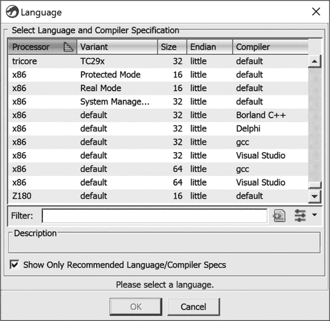

*图 4-7：语言和编译器选择选项*

如果二进制文件没有包含 Ghidra 能处理的头部信息，Ghidra 将无法识别文件的内存布局。如果你知道文件的基地址、文件偏移量或文件长度，可以将这些值输入到图 4-8 中所示的相应加载器选项字段中，或者在不输入这些附加信息的情况下继续加载文件。（这些信息可以在分析前后通过“内存映射窗口”在第 85 页中提供或调整。）

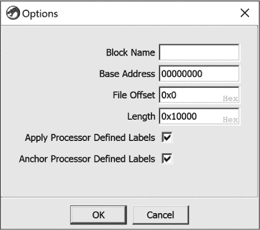

*图 4-8：Ghidra 原始二进制文件加载选项*

第十七章提供了关于手动加载和组织无法识别的二进制文件的更详细讨论。

### 使用 Ghidra 分析文件

从本质上讲，Ghidra 本质上是一个由插件库控制的数据库应用程序，每个插件具有独特的功能。所有项目数据都使用一个自定义数据库存储，该数据库会随着用户向项目中添加信息而增长和演变。Ghidra 提供的各种显示仅仅是数据库的视图，展示了对软件逆向工程师有用的格式中的信息。用户对数据库所做的任何修改都会反映在视图中，并保存在数据库中，但这些更改对原始可执行文件没有任何影响。Ghidra 的强大之处在于它包含的用于分析和操作数据库内数据的工具。

CodeBrowser 作为 Ghidra 中众多工具的基石，具有独特的功能，帮助你保持窗口的有序，添加和删除工具，重新排列内容，并记录你的操作过程。默认情况下，CodeBrowser 会打开包含程序树、符号树、数据类型管理器、列表、反编译器和控制台的窗口。这些窗口和其他显示内容将在第五章中介绍。

上述过程可以用来创建项目并向其中添加文件，但分析的真正工作尚未开始。当你在 Ghidra 项目窗口中双击一个文件时，会打开 CodeBrowser 窗口，如图 4-9 所示。如果这是你第一次选择已导入的文件，你将看到一个选项，允许 Ghidra 自动分析该文件。图 4-10 中展示了使用分析选项对话框进行自动分析的示例。在涉及来自常见平台并使用常见编译器构建的二进制文件的绝大多数情况下，自动分析可能是正确的首选。你可以随时通过点击 CodeBrowser 窗口右下角的红色停止按钮来停止自动分析过程。（该按钮仅在自动分析期间可见。）

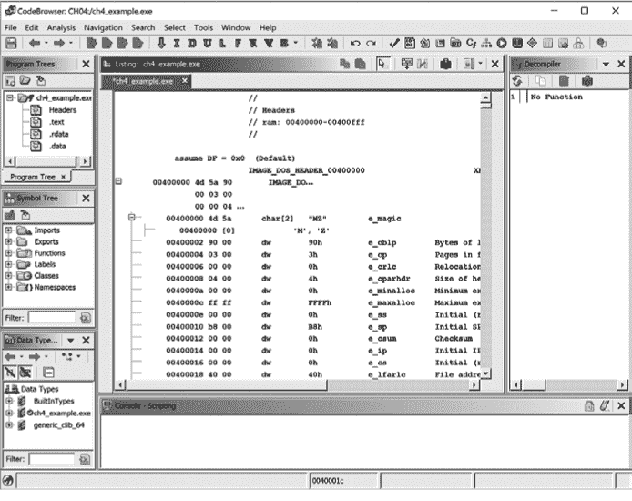

*图 4-9：Ghidra CodeBrowser 窗口*

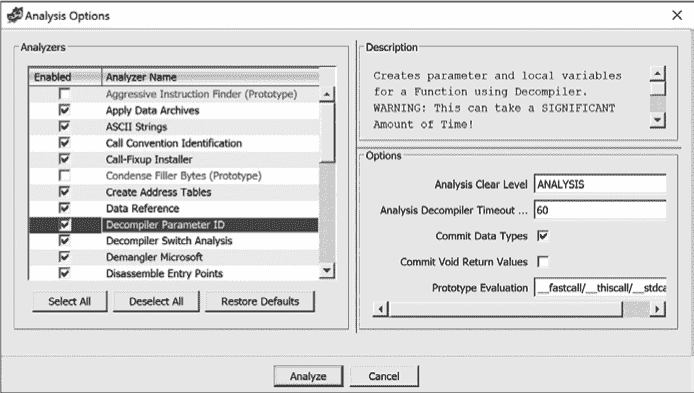

*图 4-10：分析选项对话框*

请记住，如果你不满意 Ghidra 的自动分析结果，你总是可以通过关闭 CodeBrowser 并选择不保存更改来放弃工作，这时你可以重新打开文件并尝试不同的自动分析选项组合。修改自动分析选项的最常见原因是遇到结构特别复杂的文件，例如混淆的二进制文件，或是由可能不为 Ghidra 所知的编译器或操作系统构建的二进制文件。

请注意，如果你正在打开一个非常大的二进制文件（例如 10MB 或更大），Ghidra 可能需要几分钟到几小时才能完成自动分析。在这种情况下，你可以选择禁用或为一些更高要求的分析器设置分析超时（例如，反编译器切换分析、反编译器参数 ID 和堆栈）。如 图 4-10 所示，突出显示一个分析器将显示该分析器的描述，其中可能包含有关该分析器运行时间的有用警告。此外，你还会看到选项框，提供你控制个别分析器一些行为方面的机会。任何你选择禁用或超时的分析，都可以稍后通过 Ghidra 的分析菜单下的选项重新运行。

**自动分析警告**

一旦加载器开始分析文件，它可能会在分析过程中遇到一些问题，认为这些问题足够重要，需要向你发出警告。例如，构建时未关联程序数据库（PDB）文件的 PE 文件就是一种情况。在这种情况下，分析完成后，你将看到一个自动分析汇总对话框，里面包含了总结任何遇到的问题的消息（见 图 4-11）。

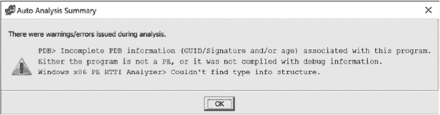

*图 4-11：自动分析汇总对话框*

在大多数情况下，消息只是信息性的。在某些情况下，消息是指导性的，提供了解决问题的建议，可能是通过安装一个可选的第三方工具，以便 Ghidra 在未来使用。

在 Ghidra 完成自动分析文件后，你可以看到导入汇总信息已经补充了有关文件的新信息，如 图 4-12 所示。

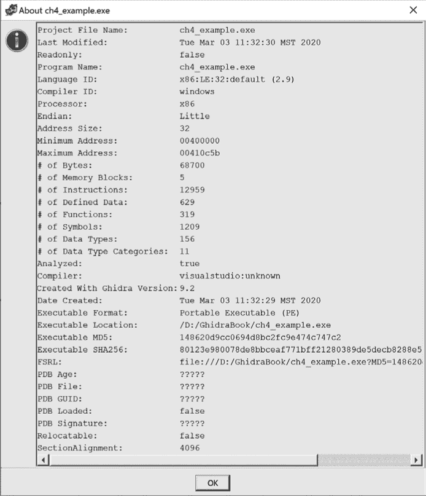

*图 4-12：Ghidra 帮助 ▸ 关于 ch4_example.exe 的导入汇总信息视图*

#### *自动分析结果*

Ghidra 的自动分析通过运行每个选定的分析器来执行，分析器会在你新加载的二进制文件上进行分析。分析选项对话框以及 Ghidra 帮助提供了每个分析器的描述。默认选择的分析器是因为 Ghidra 用户历史上发现它们在各种文件类型中最为实用。在接下来的章节中，我们将讨论在文件初次加载及随后的自动分析过程中，从二进制文件中提取的一些最有用的信息。

##### 编译器识别

确定构建某个软件所使用的编译器有助于我们理解二进制文件中使用的函数调用约定，并确定该二进制文件可能链接的库。如果在加载文件时能够识别出编译器，Ghidra 的自动分析将会结合特定于该编译器的行为知识。你在使用不同的编译器和不同的编译选项时可能观察到的差异，详细讨论见第二十章。

##### 函数参数和局部变量识别

在每个已识别的函数内（通过符号表条目和作为调用指令目标的地址识别），Ghidra 对堆栈指针寄存器的行为进行详细分析，以识别对堆栈中变量的访问并理解函数的堆栈帧布局。根据这些变量是作为函数内的局部变量，还是作为函数调用过程中传入函数的堆栈分配参数，自动为这些变量生成名称。堆栈帧的相关内容在第六章中有进一步讨论。

##### 数据类型信息

Ghidra 利用对常见库函数及其相关参数的知识，来识别每个函数中使用的函数、数据类型和数据结构。这些信息会被添加到符号树、数据类型管理器窗口以及列表窗口中。这个过程通过提供本来需要从各种应用程序编程接口（API）参考中手动获取和应用的信息，节省了你大量的时间。关于 Ghidra 如何处理库函数及相关数据类型的详细信息，可以参见第八章。

### 初始分析期间的桌面行为

在初步分析新打开的文件时，CodeBrowser 桌面上会发生大量活动。你可以通过观察 CodeBrowser 窗口右下角的分析更新，来理解这一分析过程。这也可以让你跟踪分析进度。如果你不是速读专家，可以打开相关的 Ghidra 日志文件，慢慢浏览活动。你可以从 Ghidra 项目窗口通过选择帮助 ▸ 显示日志来打开日志文件。（注意，显示日志菜单选项仅在 Ghidra 项目 ▸ 帮助菜单中可用，而不在 CodeBrowser ▸ 帮助菜单中。）

以下输出来自 Ghidra 在自动分析*ch4_example.exe*时生成的日志文件，代表了在自动分析过程中生成的消息。这些消息构成了分析过程的叙述，并提供了对 Ghidra 执行的操作序列的深入了解，以及每个任务所需的时间：

```
2019-09-23 15:38:26 INFO  (AutoAnalysisManager) -----------------------------

    ASCII Strings                              0.016 secs

    Apply Data Archives                        1.105 secs

 Call Convention Identification             0.018 secs

    Call-Fixup Installer                       0.000 secs

    Create Address Tables                      0.012 secs

    Create Function                            0.000 secs

    Data Reference                             0.014 secs

    Decompiler Parameter ID                    2.866 secs

    Decompiler Switch Analysis                 2.693 secs

    Demangler                                  0.004 secs

    Disassemble Entry Points                   0.016 secs

    Embedded Media                             0.031 secs

    External Entry References                  0.000 secs

    Function ID                                0.312 secs

    Function Start Search                      0.051 secs

    Function Start Search After Code           0.006 secs

    Function Start Search After Data           0.005 secs

    Non-Returning Functions - Discovered       0.062 secs

    Non-Returning Functions - Known            0.000 secs

    PDB                                        0.000 secs

    Reference                                  0.025 secs

    Scalar Operand References                  0.074 secs

    Shared Return Calls                        0.000 secs

    Stack                                      0.063 secs

    Subroutine References                      0.016 secs

    Windows x86 PE Exception Handling          0.000 secs

    Windows x86 PE RTTI Analyzer               0.000 secs

    WindowsResourceReference                   0.100 secs

    X86 Function Callee Purge                  0.001 secs

    x86 Constant Reference Analyzer            0.509 secs

-----------------------------------------------------

     Total Time   7 secs

-----------------------------------------------------

2019-09-23 15:38:26 DEBUG (ToolTaskManager)   task finish (8.128 secs)

2019-09-23 15:38:26 DEBUG (ToolTaskManager)   Queue - Auto Analysis

2019-09-23 15:38:26 DEBUG (ToolTaskManager)   (0.0 secs)

2019-09-23 15:38:26 DEBUG (ToolTaskManager)   task Complete (8.253 secs)
```

即使自动分析尚未完成，你也可以开始浏览各种数据展示。当自动分析完成后，你可以安全地对项目文件进行任何更改。

#### *保存你的工作并退出*

当你需要从分析中休息时，保存你的工作是一个好主意。你可以通过以下任何一种方式在 CodeBrowser 窗口中轻松完成：

+   在**CodeBrowser 文件**菜单中使用其中一个保存选项。

+   点击**CodeBrowser**工具栏中的**保存**图标。

+   关闭**CodeBrowser**窗口。

+   在**Ghidra**窗口中保存项目。

+   通过**Ghidra 文件**菜单退出 Ghidra。

在每种情况下，系统都会提示你保存任何修改过的文件。关于如何更改 CodeBrowser 和其他 Ghidra 工具的外观和功能的更详细信息，请参阅第十二章。

### Ghidra 桌面技巧与窍门

Ghidra 显示了大量信息，其桌面可能会变得杂乱。以下是一些快速技巧，帮助你更好地利用桌面：

+   你为 Ghidra 分配的屏幕空间越多，你就会越高兴。利用这一点为购买一台超大屏幕显示器（或者四个）提供理由！

+   别忘了使用 CodeBrowser 中的窗口菜单来打开新的视图或恢复你不小心关闭的数据展示。许多窗口也可以通过 CodeBrowser 工具栏上的工具按钮打开。

+   当你打开一个新窗口时，它可能会出现在现有窗口的前面。当这种情况发生时，查找窗口顶部或底部的选项卡，它们允许你在窗口之间切换。

+   你可以关闭任何窗口并根据需要重新打开它，也可以将其拖动到 CodeBrowser 桌面上的新位置。

+   可以使用“编辑 ▸ 工具选项”来控制显示的外观，并找到相关的显示选项。

虽然这些提示只是冰山一角，但它们在你开始使用 Ghidra CodeBrowser 桌面时应该会有所帮助。更多关于 CodeBrowser 的技巧和窍门，包括快捷键和工具栏选项，请参见第五章。

### 总结

熟悉 CodeBrowser 桌面界面将极大提升你使用 Ghidra 的体验。逆向工程二进制代码本身就足够困难，何况还要与工具作斗争。你在初始加载阶段选择的选项以及 Ghidra 执行的相关分析为之后的所有分析奠定了基础。此时，你可能对 Ghidra 已经为你完成的工作感到满意，对于简单的二进制文件，这可能就是你所需要的一切。另一方面，如果你想了解如何在逆向工程过程中获得更多控制权，那么你已经准备好深入探索 Ghidra 的各类数据展示功能。在接下来的章节中，你将接触到每个主要展示界面、你会在什么情况下使用它们，以及如何掌握这些工具和展示界面，从而优化你的工作流程。
