## 第七章：GHIDRA 数据展示**

此时，您应该对创建项目、将二进制文件加载到项目中以及启动自动分析有一定信心。一旦 Ghidra 的初始分析阶段完成，您就可以开始掌控分析过程。如第四章中所讨论的，启动 Ghidra 时，您的冒险旅程始于 Ghidra 项目窗口。当您在项目中打开一个文件时，会打开第二个窗口。这就是 Ghidra 的 CodeBrowser，它是您进行 SRE 工作的主要基地。您已经使用 CodeBrowser 自动分析了文件；现在我们将深入了解 CodeBrowser 菜单、窗口和基本选项，以增强您对 Ghidra 功能的认知，并帮助您创建符合个人工作流程的 SRE 分析环境。让我们从 Ghidra 的主要数据展示开始。

### CodeBrowser

您可以通过从 Ghidra 项目窗口选择工具 ▸ 运行工具 ▸ CodeBrowser 来打开 CodeBrowser 窗口。虽然 CodeBrowser 通常通过选择一个用于分析的文件来打开，但我们现在打开一个空实例，以便在没有特定文件相关内容影响显示的情况下演示功能和配置选项，如图 5-1 所示。在默认配置下，CodeBrowser 有六个子窗口。在详细了解这些显示相关的内容之前，让我们先花点时间看看 CodeBrowser 菜单及其相关功能。

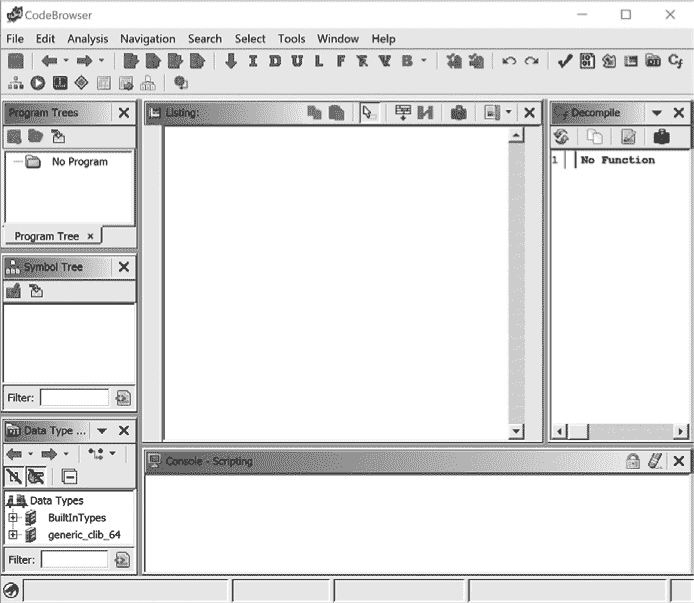

*图 5-1：未填充的 CodeBrowser 窗口*

在 CodeBrowser 窗口的顶部是主菜单，下方是工具栏。工具栏提供一些最常用菜单选项的一键快捷方式。由于我们目前没有加载文件，因此在本节中我们将重点介绍那些与已加载文件无关的菜单选项。其他菜单操作将在与 SRE 过程相关的实际应用中演示和解释。

**文件** 提供大多数文件操作菜单中预期的基本功能，包括打开/关闭、导入/导出、保存和打印的选项。此外，还有一些专门针对 Ghidra 的选项，例如工具选项，允许您保存和操作 CodeBrowser 工具，和解析 C 源代码，这可以通过从 C 头文件提取数据类型信息来辅助反编译过程。（参见 “解析 C 头文件” 章节，第 269 页）

**编辑** 包含一个适用于所有子窗口外部的命令：编辑 ▸ 工具选项命令，该命令打开一个新窗口，允许您控制与 CodeBrowser 提供的众多工具相关的参数和选项。与控制台相关的选项显示在图 5-2 中。恢复默认按钮（恢复到默认设置）始终可以在右下角找到。

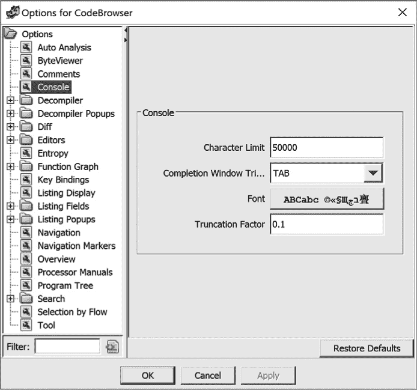

*图 5-2：CodeBrowser 控制台编辑选项*

**分析** 允许您重新分析二进制文件或选择性地执行单独的分析任务。基本的分析选项在“使用 Ghidra 分析文件”一节中进行了介绍，见第 48 页。

**导航** 方便在文件内进行导航。此菜单提供许多应用程序支持的基本键盘功能，并为二进制文件添加了特殊的导航选项。虽然该菜单提供了一种通过文件移动的方法，但在掌握了可用的多种导航选项后，您可能会更常使用工具栏选项或快捷键（列在每个菜单选项的右侧）。

**搜索** 提供对内存、程序文本、字符串、地址表、直接引用、指令模式等的搜索功能。基本的搜索功能在“搜索”一节中进行了介绍，见第 114 页。更专业的搜索概念会在后续章节的许多示例中进行介绍。

**选择** 提供了识别文件中某个部分以供特定任务处理的功能。选择可以基于子程序、函数、控制流，或仅仅是通过突出显示文件中所需的部分。

**工具** 包含一些有趣的功能，允许您将额外的 SRE 资源放置在桌面上。最有用的功能之一是处理器手册选项，它会显示与当前文件关联的处理器手册。如果您尝试打开缺失的处理器手册，系统会提供一种方法来包含该手册，如图 5-3 所示。

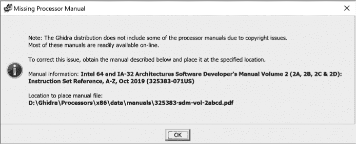

*图 5-3：缺失处理器手册信息*

**窗口** 允许您根据工作流程配置 Ghidra 的工作环境。本章大部分内容将介绍和研究默认的 Ghidra 窗口以及一些其他您会觉得有用的窗口。

**帮助** 提供了丰富、组织良好且非常详细的选项。帮助窗口支持搜索、不同的视图、收藏夹、缩放以及打印和页面设置选项。

### CodeBrowser 窗口

扩展的窗口菜单可以在图 5-4 的中央看到。默认情况下，启动 CodeBrowser 时会打开六个可用窗口：程序树、符号树、数据类型管理器、列表、控制台和反编译器。每个窗口的名称显示在关联窗口的左上角。每个窗口都作为窗口菜单中的一个选项出现，其中一些在菜单下方的工具栏上也有相应的图标。（例如，我们在图 5-4 中使用箭头突出显示了工具栏选项和菜单选项，用于打开和访问反编译器窗口。）

**热键、按钮和工具栏，哦，我的天！**

在 Ghidra 中，几乎所有常用的操作都有对应的菜单项、快捷键和工具栏按钮。如果没有，你可以创建它们！Ghidra 的工具栏是高度可配置的，快捷键与菜单操作的映射也是如此。（参见 CodeBrowser 编辑 ▸ 工具选项 ▸ 快捷键绑定，或者只需将鼠标悬停在一个命令上并按 F4。）如果这还不够，Ghidra 还提供了良好的上下文敏感菜单，以响应右键点击。这些上下文敏感菜单虽然没有提供给定位置的所有可用操作列表，但它们确实能很好地提醒你最常用的操作。这个灵活性允许你使用最适合自己的方式来执行操作*并*根据你发现 Ghidra 如何为你工作来定制环境。

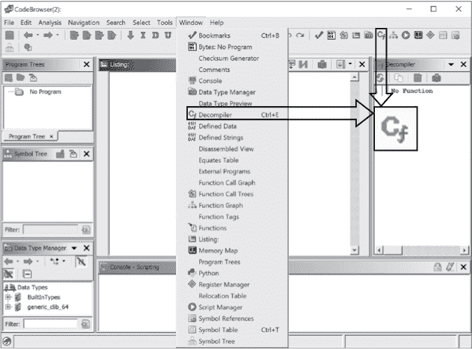

*图 5-4：突出显示显示反编译器窗口的 CodeBrowser 窗口选项*

让我们深入了解这六个默认窗口，理解它们在 SRE 过程中的基本重要性。

**窗口内部与外部**

当你开始探索 Ghidra 的各个窗口时，你会注意到，默认情况下，有些窗口会在 CodeBrowser 桌面内打开，而其他窗口则作为新的浮动窗口在 CodeBrowser 桌面外打开。让我们花一点时间来讨论这些“内部”与“外部”窗口在 Ghidra 环境中的含义。

“外部”窗口漂浮在 CodeBrowser 环境外，并且可以是连接的或独立的。这些窗口允许你与 CodeBrowser 一起并排查看它们的内容。这些窗口的示例包括功能图、注释和内存映射。

接下来，有三种不同类别的“内部”窗口：

+   默认在 CodeBrowser 中打开的窗口（例如，符号树和列表）

+   与默认的 CodeBrowser 窗口叠加的窗口（例如，字节）

+   与其他 CodeBrowser 窗口创建或共享空间的窗口（例如，等价项和外部程序）

当你打开一个与另一个打开的窗口共享空间的窗口时，它会显示在现有窗口的前面。所有共享同一空间的窗口都会被标签化，以便在窗口之间快速导航。如果你希望同时查看两个共享空间的窗口，可以单击窗口的标题栏并将其拖动到 CodeBrowser 窗口外。

但要小心！将窗口移回 CodeBrowser 窗口并不像将它们移出去那么容易。（有关详细信息，请参见 “重新排列窗口” 第 242 页）

**我的窗口在哪里？**

Ghidra 有很多窗口，跟踪它们在任何特定时间的位置可能是一个挑战。随着你打开更多的窗口，其他窗口可能会消失在 CodeBrowser 中或桌面上，这使得定位更加复杂。Ghidra 提供了一个独特的功能来帮助你找到那些丢失的窗口。点击相关的工具栏图标或菜单项将把选定的窗口移到最前面，但这可能还不够。如果你继续点击窗口的工具栏图标，丢失的窗口将通过振动、改变字体大小或颜色、缩放、旋转以及其他令人兴奋的动作来吸引你的注意，帮助你找到它。如果你感到无聊，你也可以向它挥挥手。

#### *Listing 窗口*

被称为反汇编窗口的 Listing 窗口将是你查看、操作和分析 Ghidra 生成的反汇编代码的主要工具。文本显示呈现了程序的完整反汇编列表，并提供了查看二进制文件数据区域的主要方式。

*ch5_example1.exe* 的 CodeBrowser 显示如 图 5-5 所示，采用其默认配置。Listing 窗口左侧的边距提供有关文件的重要信息，以及你在文件中的位置。Listing 窗口右侧（即垂直滚动条右边）有一个额外的标记区域，提供重要信息和导航功能。滚动条指示你在文件中的位置，可以用于导航。在滚动条的右侧是一些信息显示，包括书签，提供有关文件的额外见解。

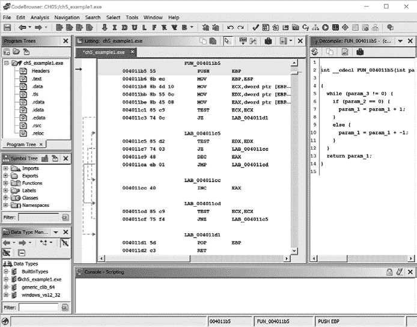

*图 5-5：加载了* ch5_example1.exe *的默认 CodeBrowser 窗口*

**你最喜欢的边距条**

在文件自动分析后，你可以使用信息边距条帮助你导航并进一步分析文件。默认情况下，只有导航栏会显示。你可以选择通过使用 Listing 窗口右上角的切换概述边距工具按钮（参见图 5-6）来添加（或隐藏）概述栏和熵条。不管显示了哪些边距条，所有边距条左侧的导航标记都会提醒你当前所在文件的位置。左键点击任何边距条中的位置，将把你定位到文件中的该位置，并更新 Listing 窗口的内容。

现在你已经知道如何控制边距条的显示（与隐藏），让我们来看看每个边距条显示了什么，以及你如何在 SRE 过程中使用它：

**导航标记区域** 允许您在文件中移动，但它还有另一个非常重要的功能：如果右键单击导航标记区域，您将看到可以与文件关联的标记和书签类别。通过选择和取消选择标记类型，您可以控制在导航条中显示的内容。这使您可以轻松地浏览特定类型的标记（例如高亮显示）。

**概览条** 为您提供文件内容的重要视觉信息。概览条中的水平带表示程序的颜色编码区域。虽然 Ghidra 为常见类别（如函数、外部引用、数据和指令）提供默认颜色，但您可以通过“编辑 ▸ 工具选项”菜单控制颜色方案。默认情况下，将鼠标悬停在某个区域上时，您可以查看该区域的详细信息，包括区域类型和相关地址（如果适用）。

**熵条** 提供了一个独特的 Ghidra 功能：它根据周围文件内容对文件内容进行“刻板化”。如果某个区域内变化很小，则分配较低的熵值。如果该区域具有较高的随机性，则相应的熵值较高。将鼠标悬停在熵条上的水平带上，可以查看该区域的熵值（介于 0.0 到 8.0 之间）、类型（例如，*.text*），以及文件中相关的地址。高度可配置的熵条可以帮助确定该带中最可能的内容。有关此功能及其背后数学原理的更多信息，可以在 Ghidra 帮助菜单中找到。

图 5-6 详细说明了特定于列表窗口的工具按钮。在 图 5-7 中，我们扩展并放大了列表窗口，以便调查显示的内容。反汇编以线性方式呈现，最左列默认显示虚拟地址。

*图 5-6：列表窗口工具按钮*

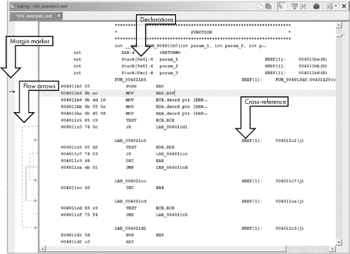

*图 5-7：带标签的示例工件的列表窗口*

在列表窗口中，有几个项目值得您注意。窗口最左侧的灰色带是边距标记器。它用于指示您当前在文件中的位置，并包含点标记和区域标记，这些在 Ghidra 帮助中有详细描述。在此示例中，当前文件位置（`004011b6`）通过小黑箭头在边距标记器中显示。

在边缘标记的右侧区域用于图形化地描述函数内的非线性流动。^(1) 当控制流指令的源地址或目标地址在列出窗口中可见时，相关的流箭头将会出现。实心箭头表示无条件跳转，而虚线箭头表示条件跳转。将鼠标悬停在流线上的时候，会弹出一个工具提示，显示流的起始地址和结束地址以及流的类型。当跳转（无条件或条件）将控制转移到程序中较早的地址时，这通常意味着有一个循环。此行为在图 5-7 中通过从地址`004011cf`到`004011c5`的流箭头进行展示。你可以通过双击相关的流箭头轻松导航到任何跳转的源地址或目标地址。

图 5-7 顶部的声明展示了 Ghidra 关于函数栈帧布局的最佳估计。^(2) Ghidra 通过对栈指针和函数内部任何栈帧指针的行为进行详细分析，计算出函数栈帧（局部变量）的结构。栈显示将在第六章中进一步讨论。

列表通常会有许多由*XREF*标示的数据和代码*交叉引用*，这些可以在图 5-7 的右侧看到。每当反汇编中的一个位置引用另一个位置时，就会创建一个交叉引用。例如，地址 A 的指令跳转到地址 B 的指令时，会在 A 到 B 之间创建一个交叉引用。将鼠标悬停在引用地址上时，会弹出一个参考提示，显示引用位置。参考提示与列出窗口的布局相同，但具有黄色背景（类似于工具提示弹出）。弹出窗口允许你查看内容，但不允许你跟踪引用。交叉引用在第九章中进行详细讨论。

#### *创建额外的反汇编窗口*

如果你希望同时查看两个函数的列出，可以通过在列出工具栏中使用快照图标来打开另一个反汇编窗口（参见图 5-6）。第一个打开的反汇编窗口在文件名之前会有前缀*Listing:*。所有随后的反汇编窗口将标题为*[Listing: <filename>]*，表示它们与主显示窗口是断开的。快照是断开的，因此你可以自由地在它们之间导航，而不会影响其他窗口。

**配置列出窗口**

反汇编列表可能被分解为多个组成字段，包括助记符字段、地址字段和注释字段等信息。我们迄今看到的列表是由一组默认字段组成的，这些字段提供了关于文件的重要信息。然而，有时默认视图并没有提供你希望看到的信息。这时，浏览器字段格式化器便派上用场了。

浏览器字段格式化器为你提供了自定义超过 30 个字段的能力，确保你对列表窗口的外观拥有完全控制。你可以通过点击列表工具栏中的按钮来激活浏览器字段格式化器（参见图 5-6）。这将打开一个强大的子菜单和布局编辑器，如图 5-8 所示，位于列表顶部。浏览器字段格式化器允许你控制地址断点、板注释、函数、变量、指令、数据、结构和数组的外观。在这些类别中，有可以调整、调优和控制的字段，以便为你创建完美的列表格式。我们主要使用列表的默认格式，但你应该探索浏览器字段格式化器，看看是否有任何选项可以帮助你更好地理解列表窗口的内容。

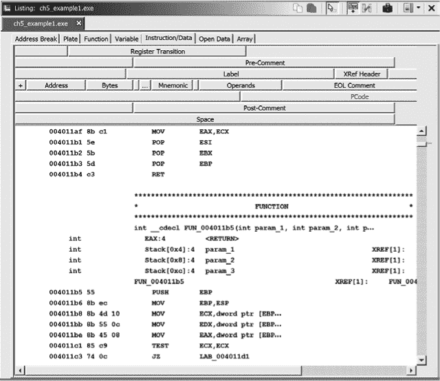

*图 5-8：激活浏览器字段格式化器后的列表窗口*

#### *Ghidra 函数图形视图*

虽然汇编列表既有趣又富有信息，但通过查看基于图形的显示，程序的流程可能更容易理解。你可以通过选择窗口 ▸ 函数图形或点击 CodeBrowser 工具栏中的相关图标来打开与 CodeBrowser 相关联的函数图形窗口。与图 5-7 中函数对应的函数图形窗口如图 5-9 所示。图形视图有点像程序流程图，因为函数被拆解为基本块，让你可以从一个块到另一个块可视化函数的控制流。^(3)

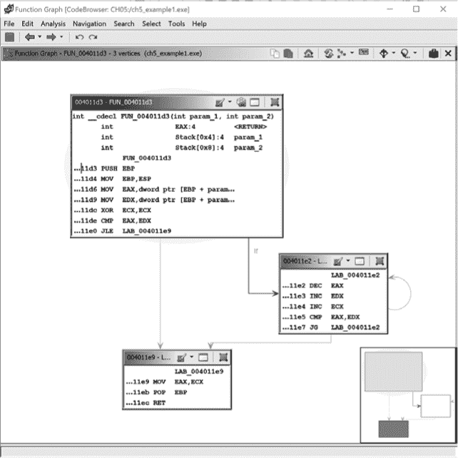

*图 5-9：来自图 5-7 的列表的图形视图*

在屏幕上，Ghidra 使用不同颜色的箭头来区分函数块之间的各种流动类型。此外，当你将鼠标悬停在箭头上时，箭头会变成动画，指示流动方向。以条件跳转结束的基本块会生成两种可能的流：*Yes edge* 箭头（即，测试条件成立）默认为绿色，而 *No edge* 箭头（即，测试条件未成立）默认为红色。以一个潜在的后继块结束的基本块使用 *Normal edge*（默认为蓝色）箭头指向下一个要执行的块。你可以点击任何箭头查看一个块到另一个块之间的关联转换。由于图形视图和列表视图默认是同步的，当你在列表视图和图形视图之间切换和导航时，文件位置通常会保持一致。例外情况请参见第十章以及 Ghidra 帮助。

在图形模式下，Ghidra 一次显示一个函数。Ghidra 通过使用传统的图像交互技术，如平移和缩放，来帮助你在图形中进行导航。较大或较复杂的函数可能会导致图形变得极其杂乱，难以导航，这时卫星视图可以为你提供帮助。默认情况下，卫星视图位于图形窗口的右下角，可以作为一个有价值的工具，帮助你提供一定的情境意识（参见图 5-9）。

**卫星导航**

卫星视图始终显示图形的完整块结构，并带有一个高亮框，表示当前在反汇编窗口中查看的图形区域。点击卫星视图中的任何块会将图形聚焦于该块。高亮框起到放大镜的作用，可以拖动它到概览窗口的任何位置，从而快速重新定位图形视图到图形上的任何位置。除了提供在函数图窗口中导航的方式外，这个神奇的窗口还有其他功能，可能在你查看文件时既能对你有所帮助，也可能会对你造成干扰。

这个窗口会占据你函数图窗口中的宝贵空间，可能会隐藏你想要查看的重要块和内容。解决此问题有两种方法。你可以右键点击卫星视图，取消选中“停靠卫星视图”复选框。这将把卫星视图及其完整功能移出函数图窗口。任何时候重新勾选此选项，卫星视图会回到函数图窗口的原始位置。

第二个选项是隐藏卫星视图，前提是你不需要它来进行导航。这是右键上下文菜单中的另一个复选框。当你隐藏卫星视图时，函数图窗口的右下角会出现一个小图标。点击此图标将恢复卫星视图。

当卫星视图可见时，它可能会导致主视图的响应变得比预期的慢。隐藏卫星视图可以帮助提高响应速度。

**工具连接**

工具可以协同工作或独立工作。我们已经看到列表窗口和功能图窗口如何共享数据，以及在一个窗口中发生的事件如何影响另一个窗口。如果在功能图窗口中选择某个块，相应的代码将在列表窗口中高亮显示。相反，在列表窗口中导航功能时，将导致功能图窗口更新。这是许多自动发生的双向工具连接之一。Ghidra 还支持单向连接，并能够通过工具事件的生产者/消费者模型手动连接和断开工具。在本书中，我们重点介绍 Ghidra 提供的双向自动工具连接。

除了使用卫星视图进行导航外，您还可以通过多种方式在功能图窗口中操作视图，以适应您的需求：

**平移** 首先，除了使用卫星视图快速重新定位图形外，您还可以通过点击并拖动背景来重新定位图形，以改变图形视图。

**缩放** 您可以使用传统的键盘方法，如 CTRL/COMMAND、鼠标滚轮或关联的快捷键进行缩放。如果您缩放得太远，可能会超过*绘制阈值*，此时块内容将不再显示。每个块只会变成一个彩色矩形。在某些情况下，特别是在与列表窗口并排工作时，这可能是有利的，因为它提高了渲染功能图的速度。

**重新排列块** 您可以通过点击目标块的标题栏并将其拖动到新位置来重新排列图形中的单个块。在移动块时，块之间的所有链接都会被保留。如果您在某个时刻希望恢复图形的默认布局，可以通过选择功能图工具栏中的刷新图标来实现。

**分组和折叠块** 块可以单独或与其他块一起分组，并且可以折叠以减少显示中的杂乱。分组会导致块折叠。折叠块是跟踪已分析块的一个简便方法。您可以通过选择块工具栏最右侧的分组图标来折叠任何块。如果选择多个块并使用此选项，它们将被折叠，并且相关块的列表将显示在堆叠窗口中。有关形成/解散分组以及在新形成的分组上执行操作的一些细节，请参见 Ghidra 帮助。

**自定义图形显示**

为了帮助您的分析，Ghidra 在每个函数图节点的顶部提供了一个菜单栏，允许您控制该特定节点的显示。您可以控制节点的背景/文本颜色，跳转到 XREF，查看该图节点的完整窗口列表，并使用分组功能将节点合并和折叠。（请注意，更改函数图中块的背景也会更改列表窗口中的背景。）如果您同时使用列表窗口和函数图窗口，这些功能可能没有必要，但这些自定义选项可能会很有用，值得进一步探索。这些选项将在第十章中进一步讨论。

由于基于图形的显示会在 CodeBrowser 外部的窗口中打开，您可以并排查看这两种显示。由于这些窗口之间有连接，在一个窗口中移动位置时，另一个窗口中的位置标记也会随之移动。虽然许多用户倾向于选择一种视图来可视化程序流程，但您并不需要只选择其中一种。同时请记住，您对图形视图和文本视图的控制远远超出了这些示例。有关 Ghidra 图形功能的更多内容，请参见第十章，有关操作 Ghidra 视图选项的更多信息，请参见 Ghidra 帮助文档。

在接下来的五章中，我们主要关注示例的列表显示，必要时辅以图形显示，以增强清晰度。在第六章中，我们将重点介绍如何理解 Ghidra 反汇编，在第七章中，我们将讨论如何操作列表显示，以清理和注释反汇编内容。

**移动操作**

除了传统的文件导航方式（向上箭头、向下箭头、向上翻页、向下翻页等），Ghidra 还提供了针对 SRE 过程的特定导航工具。导航工具栏中的图标（如图 5-10 所示）使您可以轻松地在程序中移动。让我们来看看这些为逆向工程师提供服务的图标。

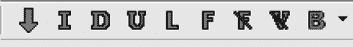

*图 5-10：CodeBrowser 导航工具栏*

最左侧是方向图标。这个箭头在向上和向下之间切换，控制其他所有导航图标的方向。接下来的八个图标将帮助您浏览图 5-11 中显示的各个目标。

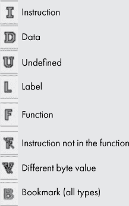

*图 5-11：导航工具栏定义*

与仅仅将您推进到列表中的下一个数据项不同，选择数据选项会跳过相邻数据，直接带您到下一个不相邻的数据的开始位置。指令和未定义项表现出相同的行为。

导航工具栏最右侧的下拉箭头显示一个列表，允许你选择特定的书签类型以便快速导航。虽然这些快捷导航主要用于列出窗口，但它们在所有与列出窗口连接的窗口中都有效。在这些窗口中进行导航时，所有连接的窗口会同步导航。

#### *程序树窗口*

让我们回到默认 CodeBrowser 窗口的讨论，简要查看程序树窗口，如图 5-12 所示。

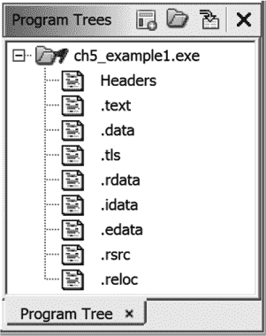

*图 5-12：程序树窗口*

该窗口显示了你程序的文件夹和片段结构，并提供了在自动分析过程中精细调整组织结构的功能。*片段*是 Ghidra 中指代一段连续地址范围的术语。片段之间不能重叠。片段的更传统名称是*程序段*（例如，*.text*、*.data* 和 *.bss*）。与程序树相关的操作包括以下内容：

+   创建文件夹/片段

+   展开/折叠/合并文件夹

+   添加/删除文件夹/片段

+   在列出窗口中识别内容并移动到片段

+   按名称/地址排序

+   选择地址

+   复制/剪切/粘贴片段/文件夹

+   重新排序文件夹

程序树窗口是一个连接窗口，因此在窗口中点击某个片段会将你导航到列出窗口中的相应位置。有关程序树窗口的更多信息，请参阅 Ghidra 帮助文档。

#### *符号树窗口*

当你将文件导入 Ghidra 项目时，系统会选择一个 Ghidra 加载模块来加载文件内容。如果二进制文件中存在符号表信息，加载器能够提取该符号表信息（在第二章中讨论）并在符号树窗口中显示，如图 5-13 所示。符号树窗口包括与程序相关的导入、导出、函数、标签、类和命名空间。接下来的部分将讨论这些类别及相关的符号类型。

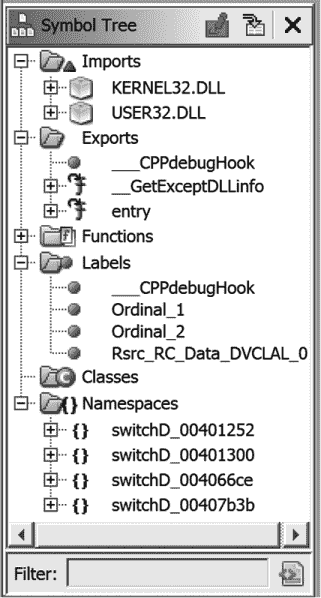

*图 5-13：CodeBrowser 符号树窗口*

符号树窗口底部的过滤器可以控制所有六个符号树文件夹。随着你对所分析的文件越来越熟悉，这个功能会变得更加有价值。此外，你会发现符号树窗口提供了与命令行工具类似的功能，如 `objdump` (`-T`)、`readelf` (`-s`) 和 `dumpbin` (`/EXPORTS`)。

##### 导入

在符号树窗口中的*Imports*文件夹列出了正在分析的二进制文件导入的所有函数。仅当二进制文件使用共享库时，此文件夹才相关——静态链接的二进制文件没有外部依赖，因此没有导入项。*Imports*文件夹列出了导入的库，每个条目表示从该库导入的项（函数或数据）。单击符号树视图中的任何符号会使所有相关显示跳转到选定的符号。在我们示例中的 Windows 二进制文件中，点击*Imports*文件夹中的`GetModuleHandleA`将使反汇编窗口跳转到`GetModuleHandleA`的导入地址表条目，在这个例子中它位于地址`0040e108`，如图 5-14 所示。

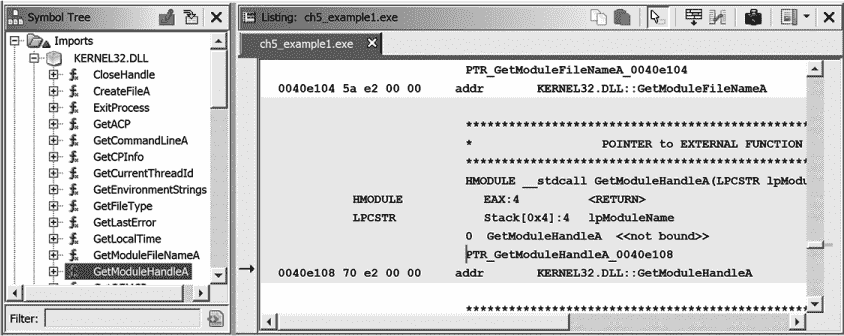

*图 5-14：导入地址表条目及其在列表窗口中的相关位置*

需要记住的一个重要点是，Imports 类别只显示二进制文件的导入表中命名的符号。二进制文件选择通过诸如`dlopen/dlsym`或`LoadLibrary/GetProcAddress`等机制自行加载的符号将不会在符号树窗口中列出。

##### 导出

*Exports*文件夹列出了文件的入口点。这些入口点包括程序的执行入口点，通常在其头部部分中指定，以及文件导出供其他文件使用的任何函数和变量。导出的函数通常出现在共享库中，例如 Windows DLL 文件。导出的条目按名称列出，当选择导出项时，相应的虚拟地址将在列表窗口中突出显示。对于可执行文件，*Exports*文件夹始终至少包含一个条目：程序的执行入口点。根据二进制文件的类型，Ghidra 可能将此符号命名为`entry`或`_start`。

##### 函数

*Functions* 文件夹包含了 Ghidra 在二进制文件中识别的每个函数的列表。在符号树窗口中，将鼠标悬停在函数名上会弹出一个详细信息框，显示有关该函数的详细信息，如 图 5-15 所示。在加载过程中，加载器利用各种算法，包括文件结构分析和字节序列匹配，以推断用于创建文件的编译器。在分析阶段，*Function ID* 分析器利用编译器识别信息，进行基于哈希的函数体匹配，以识别可能已经链接到二进制文件中的库函数体。当哈希匹配成功时，Ghidra 从哈希数据库（包含在 Ghidra *.fidbf* 文件中）中获取匹配函数的名称，并将其添加为函数符号。哈希匹配对于去符号化的二进制文件特别有用，因为它提供了一种独立于符号表存在的符号恢复方式。有关此功能的更深入讨论，请参见 “Function IDs” 章节中的 第 272 页。

*图 5-15：符号树函数文件夹弹出框*

##### 标签

*Labels* 文件夹是 *Functions* 文件夹的数据等价物。任何包含在二进制符号表中的数据符号都将列在 *Labels* 文件夹中。此外，每当你将新的标签名添加到数据地址时，该标签将被添加到 *Labels* 文件夹中。

##### 类别

*Classes* 文件夹包含 Ghidra 在分析阶段识别的每个类的条目。在每个类下，Ghidra 列出了已识别的数据和方法，这些数据和方法有助于你理解类的行为。C++ 类及 Ghidra 用于填充类文件夹的结构在 第八章 中有更详细的讨论。

##### 命名空间

在 *Namespaces* 文件夹中，Ghidra 可能会创建新的命名空间以提供组织结构，并确保分配的名称在二进制文件中不会冲突。例如，可能会为每个识别到的外部库或每个使用跳转表的 switch 语句创建命名空间（允许跳转表标签在其他 switch 语句中重复使用而不发生冲突）。

#### *数据类型管理器窗口*

数据类型管理器窗口允许你通过使用数据类型档案系统来定位、组织并应用数据类型到文件中。档案代表了 Ghidra 从大多数流行编译器附带的头文件中收集的预定义数据类型的积累知识。通过处理头文件，Ghidra 理解常见库函数所期望的数据类型，并能够相应地注释你的反汇编和反编译列表。同样，Ghidra 从这些头文件中理解复杂数据结构的大小和布局。所有这些信息都被收集到档案文件中，并在每次分析二进制文件时应用。

回顾图 5-4，你可以看到内建类型树的根节点，其中包含诸如`int`等无法更改、重命名或在数据类型档案中移动的原始类型，即使没有加载程序，它也会在数据类型管理器窗口（CodeBrowser 窗口的左下角）中显示。除了内建类型，Ghidra 还支持创建用户定义的数据类型，包括结构体、联合体、枚举和类型定义。它还支持数组和指针作为派生数据类型。

每个你打开的文件在数据类型管理器窗口中都有一个相关条目，如前文图 5-5 所示。该文件夹的名称与当前文件相同，文件夹内的条目是特定于当前文件的。

数据类型管理器窗口显示每个已打开的数据类型档案的节点。档案可以自动打开，例如当程序引用一个档案时，或者由用户手动打开。数据类型和数据类型管理器将在第八章和第十三章中更详细地介绍。

#### *控制台窗口*

位于 CodeBrowser 窗口底部的控制台窗口作为 Ghidra 的插件和脚本输出区，包括你自己开发的插件和脚本，是查看 Ghidra 在处理文件时执行任务信息的地方。开发脚本和插件将在第十四章和第十五章中介绍。

#### *反编译器窗口*

反编译器窗口允许你通过连接的窗口同时查看和操作二进制文件的汇编和 C 语言表示。由 Ghidra 反编译器生成的 C 语言表示并不总是完美的，但它在帮助你理解二进制文件时非常有用。反编译器提供的基本功能包括恢复表达式、变量、函数参数和结构体字段。反编译器通常还能够恢复函数的块结构，而这个结构在汇编语言中通常会被掩盖，因为汇编语言不是块结构的，并且大量使用`goto`（或等效）语句使其看起来像是块结构。

反编译器窗口显示所选函数的 C 语言表示，如图 5-16 所示。根据你对汇编语言的了解，反编译后的代码可能比在列表窗口中的代码更容易理解。即使是初学者程序员，也应能够识别出反编译函数中的无限循环。（`while`循环条件依赖于`param_3`的值，而该值在循环中没有被修改。）

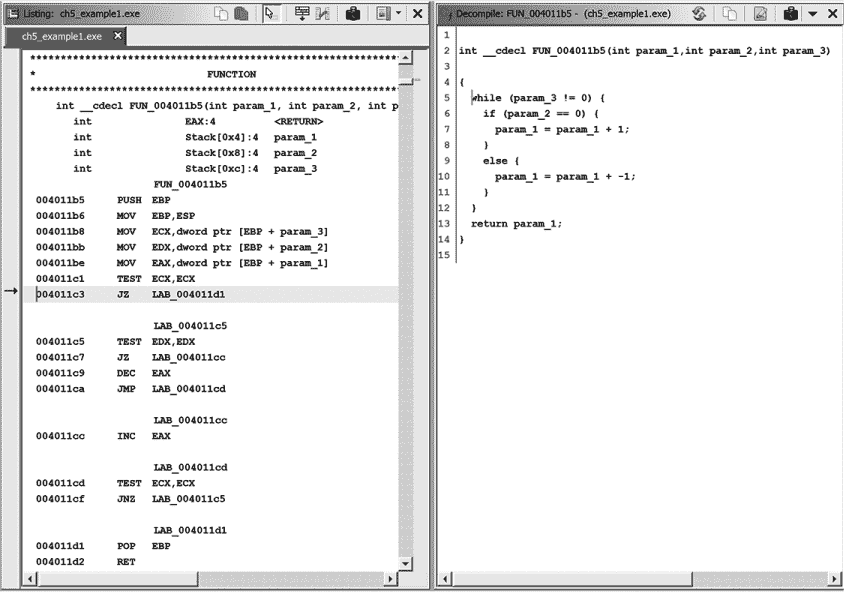

*图 5-16：列表窗口和反编译器窗口*

反汇编窗口中的图标显示在图 5-17 中。如果你想比较多个函数的反汇编版本，或者在 Listing 窗口中移动时继续查看特定函数，可以使用“快照”图标打开额外的（不连接的）反汇编窗口。“导出”图标允许你将反汇编的函数保存为 C 文件。

在反汇编窗口中，可以通过右键单击打开上下文菜单，执行与高亮项目相关的操作。与函数参数`param_1`相关的选项显示在图 5-18 中。

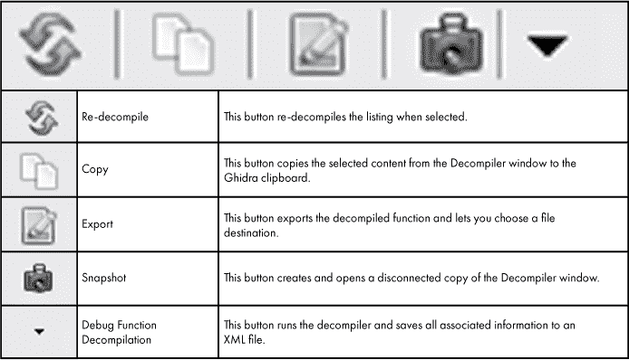

*图 5-17：反汇编窗口工具栏*

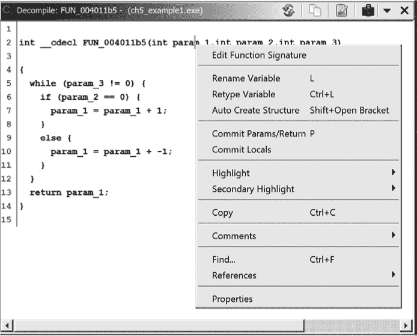

*图 5-18：反汇编窗口中函数参数的选项*

反汇编是一个极其复杂的过程，反汇编理论仍然是一个活跃的研究领域。与能够根据制造商参考手册验证其准确性的反汇编不同，当前没有提供从汇编语言回译为 C 语言的规范化手册（或者 C 到汇编的规范化手册）。事实上，虽然 Ghidra 的反汇编器始终生成 C 源代码，但反汇编器正在分析的二进制文件可能最初并非用 C 语言编写，因此许多反汇编器假设的 C 语言相关推断可能根本不成立。

与大多数复杂插件一样，反汇编器有其独特性，其输出的质量在很大程度上取决于输入的质量。反汇编窗口中许多问题和不规则现象都可以追溯到底层反汇编中的问题，因此，如果反汇编的代码没有意义，你可能需要花时间改进反汇编的质量。在大多数情况下，这涉及使用更准确的数据类型信息对反汇编进行注释，相关内容将在第八章和第十三章中讨论。我们将在后续章节继续探索反汇编器的功能，并在第十九章中深入讨论它。

### 其他 Ghidra 窗口

除了六个默认窗口外，你还可以打开其他窗口，以通过不同的视图来支持你的 SRE 过程，查看文件的其他或专业化的内容。可用窗口的列表显示在“窗口”菜单中，如前文图 5-4 所示。这些显示的实用性取决于你分析的二进制文件的特征以及你使用 Ghidra 的技能。其中一些窗口足够专业，需要在后续章节中更详细地介绍，但我们在这里介绍一些常见的窗口。

#### *字节窗口*

Bytes 窗口提供了文件字节级内容的原始视图。默认情况下，Bytes 窗口会打开在 CodeBrowser 的右上方，并以每行 16 个字节的标准十六进制转储显示程序内容。该窗口同时作为十六进制编辑器，并且可以通过使用 Bytes 窗口工具栏中的设置工具来配置显示各种格式。在许多情况下，向 Bytes 窗口添加 ASCII 显示可能会很有帮助，如图 5-19 所示。该图还显示了字节查看器选项对话框和用于编辑或快照字节视图的工具栏图标。

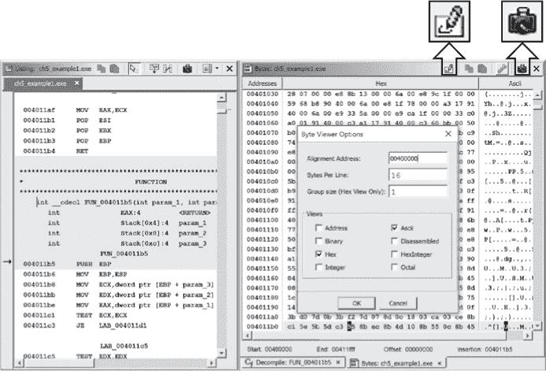

*图 5-19：同步的十六进制和反汇编视图，突出显示了切换和快照图标*

与列表窗口一样，可以使用 Bytes 窗口工具栏中的快照图标（见图 5-19）同时打开多个 Bytes 窗口。默认情况下，第一个 Bytes 窗口与列表窗口相连，因此在一个窗口中滚动和点击一个元素会导致另一个窗口滚动到相同的位置（相同的虚拟地址）。后续的 Bytes 窗口是断开的，这使得您可以独立滚动它们。当窗口断开连接时，窗口名称会出现在窗口标题栏的方括号内。

要将 Bytes 窗口转换为十六进制（或 ASCII）编辑器，只需切换图 5-19 中高亮的铅笔图标。光标将变为红色，表示可以进行编辑，尽管您无法在包含现有代码项（如指令）的地址上进行编辑。当编辑完成后，再次切换该图标即可返回只读模式。（请注意，任何更改不会反映在断开连接的 Bytes 窗口中。）

如果十六进制列显示问号而不是十六进制值，Ghidra 正在告诉您，它不确定给定虚拟地址范围内可能占用的值。这种情况通常出现在程序包含 *bss* 节时，^(4) 该节通常在文件中不占用空间，但会被加载器扩展以适应程序的静态存储需求。

#### *定义数据窗口*

定义数据窗口显示当前程序、视图或选择中定义的数据的字符串表示形式，以及相关的地址、类型和大小，如图 5-20 所示。与大多数列式窗口一样，您可以通过点击列标题按升序或降序对任何列进行排序。在定义数据窗口中双击任何一行会导致列表窗口跳转到所选项的地址。

当与交叉引用一起使用时（在第九章中讨论），已定义数据窗口可以快速识别有趣的项目，并通过几次点击追踪到程序中引用该项目的任何位置。例如，您可能会看到字符串 `"SOFTWARE\Microsoft\Windows\Current Version\Run"` 列出，并想知道为什么某个应用程序会引用 Windows 注册表中的这个特定键，然后发现该程序正在设置该注册表键，以便在 Windows 启动时自动启动。

*图 5-20：已定义数据窗口，强调显示了过滤图标*

已定义数据窗口具有强大的过滤功能。除了窗口底部的过滤栏外，右上角的过滤图标（在图 5-20 中突出显示）允许您控制额外的数据类型过滤选项，如图 5-21 所示。

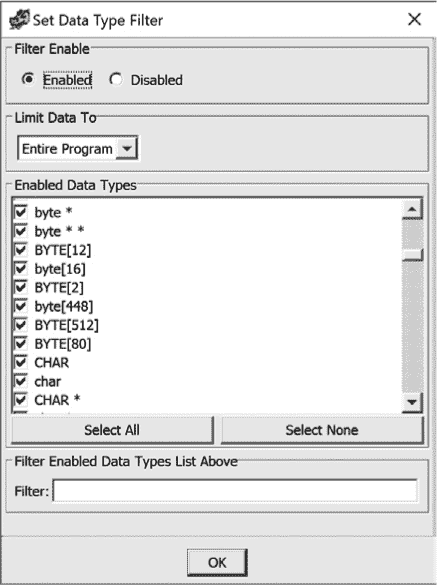

*图 5-21：已定义数据类型过滤选项*

每次通过点击确定关闭设置数据类型过滤器对话框时，Ghidra 会根据新的设置重新生成已定义数据窗口的内容。

#### *已定义字符串窗口*

已定义字符串窗口显示了在二进制文件中定义的字符串。此窗口的示例如图 5-22 所示。除了图中显示的默认列外，您还可以通过右键单击列标题的行来添加列。可能最有趣的列之一是“是否存在编码错误”标志，它可能表明字符集存在问题或字符串被误识别。除了此窗口，Ghidra 还提供了强大的字符串搜索功能。有关此功能的讨论，请参见第六章。

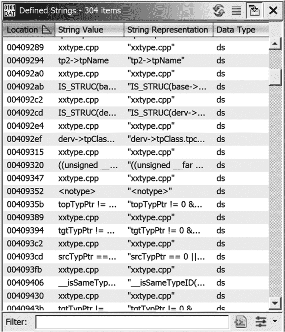

*图 5-22：已定义字符串窗口*

#### *符号表和符号引用窗口*

符号表窗口提供了二进制文件中所有全局名称的汇总列表。默认显示八列，如图 5-23 所示。该窗口具有高度的可配置性，可以在显示中添加和删除列，也可以对任意列进行升序或降序排序。前两列默认是名称和位置。*名称*只是赋予在*位置*上定义的符号的一个符号性描述。

符号表与列表窗口连接，但提供了控制其与列表窗口交互的功能。图 5-23 中右侧的强调图标是一个切换按钮，用于决定单击符号表窗口中的某个位置是否会导致列表窗口中的相关位置移动。无论切换按钮的选择如何，双击任何符号表位置条目都会立即跳转到列表视图并显示所选条目。这为快速在程序列表中导航到已知位置提供了一个有用的工具。

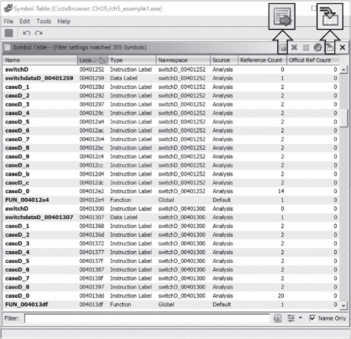

*图 5-23：符号表窗口，突出显示显示符号引用和导航切换图标*

符号表窗口提供了强大的过滤功能，并且有多种方式可以访问过滤选项。工具栏中的齿轮图标打开符号表过滤对话框。该对话框（选中“使用高级过滤器”框）如图 5-24 所示。除了这个对话框，你还可以使用窗口底部的过滤选项。有关符号表过滤选项的详细讨论，请参见 Ghidra 帮助文档。

图 5-23 中左侧的强调图标是显示符号引用图标。点击此图标将把符号引用窗口添加到符号表窗口。默认情况下，这两个表格将并排显示。为了提高可读性，你可以将符号引用窗口拖到符号表窗口下方，如图 5-25 所示。这两个表格之间的连接是单向的，当在符号表中进行选择时，符号引用表会更新。

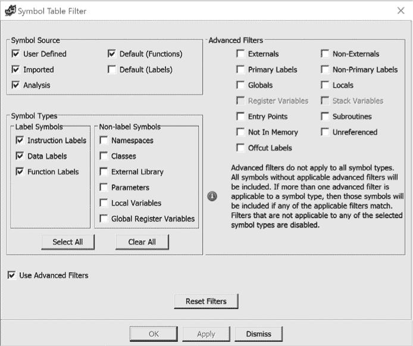

*图 5-24：符号表过滤对话框*

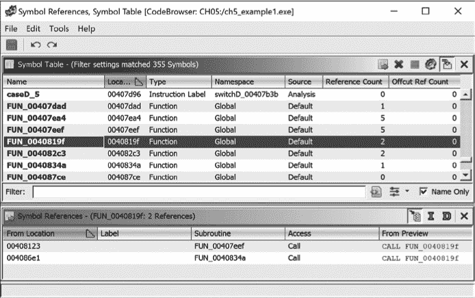

*图 5-25：带有符号引用的符号表*

与符号表窗口一样，符号引用窗口也具有相同的列组织控制。此外，符号引用窗口的内容由符号引用工具栏右上角的三个图标（S、I 和 D）控制。这些选项是互斥的，意味着一次只能选择一个：

**S 图标** 当选择此图标时，符号引用窗口将显示你在符号表中选择的符号的所有*引用*。图 5-25 显示了选择此选项时的符号引用窗口。

**I 图标** 当选择此图标时，符号引用窗口将显示你在符号表中选择的函数的所有指令引用。（如果你没有选择函数入口点，则此列表为空。）

**D 图标** 选择此图标时，符号引用窗口将显示符号表中你所选函数的所有数据引用。如果未选择函数入口点或该函数没有引用任何数据符号，则此列表将为空。

#### *内存映射窗口*

内存映射窗口显示了程序中内存块的汇总列表，如图 5-26 所示。请注意，Ghidra 所称的*内存块*在讨论二进制文件结构时通常被称为*节*。窗口中展示的信息包括内存块（节）名称、起始和结束地址、长度、权限标志、块类型、初始化标志以及源文件名和用户评论的空间。起始和结束地址表示程序节在运行时将被映射到的虚拟地址范围。

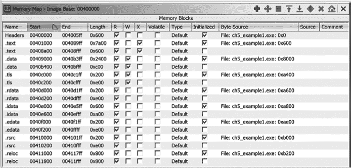

*图 5-26：内存映射窗口*

双击窗口中的任何起始地址或结束地址，都会将列表窗口（以及所有其他连接的窗口）跳转到指定地址。内存映射窗口工具栏提供了添加/删除块、移动块、拆分/合并块、编辑地址和设置新的图像基地址等选项。这些功能在反向工程处理非标准格式的文件时尤为有用，因为 Ghidra 加载器可能未能检测到二进制文件的段结构。

命令行工具与内存映射窗口的对应命令包括`objdump`（`-h`）、`readelf`（`-S`）和`dumpbin`（`/HEADERS`）。

#### *函数调用图窗口*

在任何程序中，函数既可以调用其他函数，也可以被其他函数调用。函数调用图窗口展示了给定函数的直接邻居。为了简便起见，我们将 Y 称为 X 的邻居，如果 Y 直接调用 X，或者 X 直接调用 Y。当你打开函数调用图窗口时，Ghidra 会确定光标所在函数的邻居，并生成相应的显示。该显示展示了函数在程序文件中的使用上下文，但它只是大局中的一部分。

图 5-27 显示了一个名为`FUN_0040198c`的函数，它是从`FUN_00401edc`调用的，并且依次调用了另外六个函数。在窗口中双击任何函数都会立即将列表窗口和其他连接的窗口跳转到选中的函数。Ghidra 的交叉引用（XREFs）机制是生成函数调用图窗口的基础。关于 XREFs 的详细内容，请参见第九章。

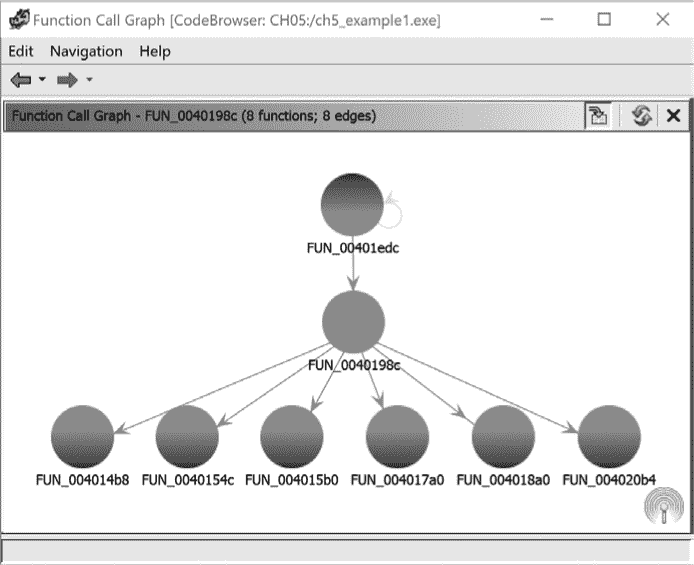

*图 5-27：函数调用图窗口*

**谁在调用？**

虽然函数调用图窗口很有帮助，但有时你需要更广泛的视角，或者至少是更大的视角。函数调用树窗口（窗口 ▸ 函数调用树）可以让你看到所有对选定函数的调用以及从选定函数的调用。函数调用树窗口（如图 5-28 所示）分为两个部分：一个用于显示进入调用，另一个用于显示输出调用。进入调用和输出调用都可以根据需要展开或折叠。

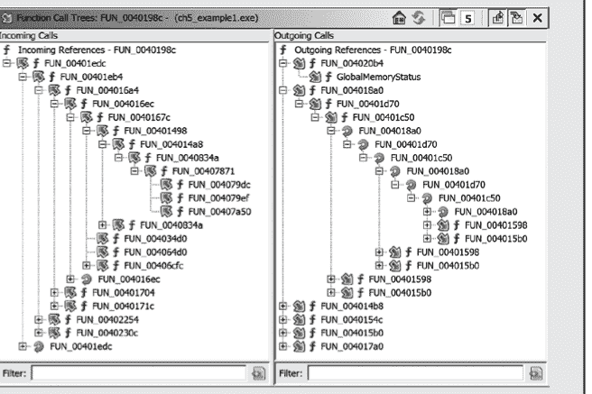

*图 5-28：函数调用树视图*

如果你在选中入口函数的情况下打开函数调用树窗口，你可以查看程序函数调用的层级表示。

### 总结

初看之下，Ghidra 提供的显示窗口数量可能让人感到不知所措。在你足够熟悉之后，可能会发现坚持使用默认显示窗口最为简单，直到你开始探索额外的显示选项。无论如何，你绝不必觉得有义务使用 Ghidra 提供的所有功能，并不是每个窗口在每个逆向工程场景下都能发挥作用。

熟悉 Ghidra 显示界面的最佳方法之一，就是浏览 Ghidra 为你的二进制文件填充的数据的各种标签子窗口，并且打开其他可用的窗口。当你对 Ghidra 越来越熟悉时，你的逆向工程效率和效果也会提高。

Ghidra 是一个非常复杂的工具。除了本章介绍的窗口外，你可能会遇到一些额外的对话框，当你努力掌握 Ghidra 时，我们会在书的其余部分介绍关键的对话框。

到此为止，你应该开始对 Ghidra 界面和 CodeBrowser 桌面感到更为熟悉。在下一章中，我们将开始关注你可以通过许多方式操作反汇编代码，以增强你对其行为的理解，并且一般来说帮助你更轻松地使用 Ghidra。
