## 第八章：**理解 Ghidra 反汇编**


在本章中，我们介绍了一些重要的基础技能，帮助你更好地理解 Ghidra 的反汇编内容。我们从基本的导航技巧开始，这些技巧可以让你在汇编代码中移动，并检查你遇到的各种文物。随着你从一个函数跳转到另一个函数，你会发现你需要通过仅使用反汇编中提供的线索来解码每个函数的原型。因此，我们将讨论如何理解一个函数接受多少个参数，并且如何解码我们遇到的每个参数的数据类型。由于一个函数执行的大部分工作都与函数维护的局部变量相关，我们还将讨论函数如何使用栈来存储局部变量，以及如何在 Ghidra 的帮助下准确理解一个函数如何使用它可能为自己保留的任何栈空间。无论你是在调试代码、分析恶意软件，还是开发漏洞，理解如何解码一个函数的栈分配变量是理解任何程序行为的基本技能。最后，我们将介绍 Ghidra 提供的搜索选项，以及这些选项如何帮助理解反汇编内容。

### 反汇编导航

在第四章和第五章中，我们展示了在基本层面上，Ghidra 将许多常见的逆向工程工具的功能集成到它的 CodeBrowser 显示中。浏览显示内容是掌握 Ghidra 所需的基本技能之一。静态反汇编清单，例如像`objdump`这样的工具提供的清单，除了上下滚动之外，并没有内建的导航功能。即使是提供集成的`grep`风格搜索的最佳文本编辑器，这种*死列表*也非常难以浏览。另一方面，Ghidra 提供了出色的导航功能。除了提供你在使用文本编辑器或文字处理软件时习惯的标准搜索功能外，Ghidra 还开发并显示了一个全面的交叉引用列表，这些交叉引用像网页的超链接一样起作用。最终的结果是，在大多数情况下，导航到感兴趣的位置只需要双击即可。

#### *名称和标签*

当程序被反汇编时，程序中的每个位置都会分配一个虚拟地址。因此，我们可以通过提供我们感兴趣访问的位置的虚拟地址来在程序内导航。不幸的是，记住这些地址并将其整理成目录并非易事。正因为如此，早期的程序员便开始为他们想要引用的程序位置分配符号名称，这使得工作变得轻松得多。将符号名称分配给程序地址就像为程序操作码分配助记符指令名称一样；通过使标识符更容易记住，程序变得更加易于阅读和编写。Ghidra 继承了这一传统，通过为虚拟地址创建标签并允许用户修改和扩展标签集来延续这一做法。我们已经在 Symbol Tree 窗口中看到过名称的使用。回想一下，双击名称会导致 Listing 视图（以及 Symbol References 窗口）跳转到引用的位置。虽然在使用上，“名称”和“标签”这两个术语有所不同（例如，函数有名称，并且在 Ghidra Symbol Tree 中与标签出现在不同的分支中），但在导航上下文中，这两个术语通常可以互换使用，因为它们都表示导航目标。

Ghidra 在自动分析阶段通过使用二进制文件中现有的名称（如果有）或根据二进制文件中某个位置的引用方式自动生成名称，从而生成符号名称。除了符号用途外，任何在反汇编窗口中显示的标签都是潜在的导航目标，类似于网页上的超链接。这些标签与标准超链接的两大主要区别是：标签没有任何突出显示，无法指示它们可以被点击跟踪，而且 Ghidra 通常需要双击才能跟踪，而传统的超链接只需单击。

**您已被邀请加入命名约定！**

Ghidra 在分配标签时为用户提供了很多灵活性，但某些模式有特殊含义，并且是 Ghidra 保留的。这些包括以下前缀，当它们后面跟着下划线和地址时：`EXT`、`FUN`、`SUB`、`LAB`、`DAT`、`OFF` 和 `UNK`。创建标签时应避免使用这些模式。此外，标签中不允许使用空格和不可打印字符。幸运的是，标签最多可以包含 2000 个字符。如果你认为自己可能会超出这个限制，请仔细计算！

#### *Ghidra 中的导航*

在图 6-1 中显示的列表中，每个由实心箭头指示的符号都代表一个命名的导航目标。在 Listing 窗口中双击它们中的任何一个，Ghidra 将会将 Listing 显示（以及所有相关窗口）移动到选定的位置。

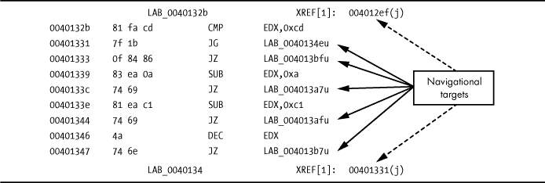

*图 6-1：列出显示导航目标*

在导航方面，Ghidra 将另外两种显示实体视为导航目标。首先，交叉引用（在图 6-1 中由虚线箭头表示）被视为导航目标。双击底部的交叉引用地址将使显示跳转到引用位置（此例中为`00401331`）。交叉引用将在第九章中详细介绍。将鼠标悬停在这些可导航对象上会显示一个弹出框，显示目标代码。

其次，另一种在导航方面受到特殊处理的显示实体是使用十六进制值的实体。如果显示的十六进制值序列表示二进制文件中的有效虚拟地址，那么关联的虚拟地址将在右侧显示，如图 6-2 所示。双击显示的值将会将反汇编窗口重新定位到该虚拟地址。在图 6-2 中，双击任何由实心箭头指示的值将会跳转显示，因为每个值都是该二进制文件中的有效虚拟地址。双击其他值则不会产生任何效果。

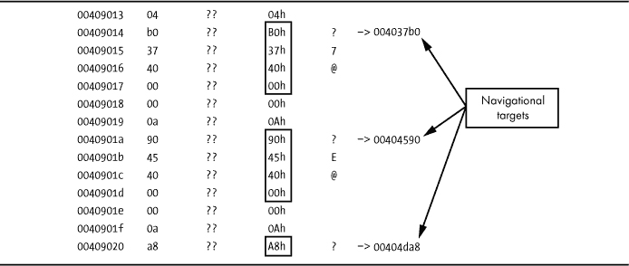

*图 6-2：显示十六进制导航目标的列表*

#### *转到*

当你知道想要导航到的地址或名称时（例如，在 ELF 二进制文件中导航到 *main* 以开始分析），你可以滚动列表寻找该地址，或者在符号树窗口的函数文件夹中查找所需的名称，或者使用 Ghidra 的搜索功能（在本章后面会讨论）。最终，最简单的方式是使用“转到”对话框（如图 6-3 所示），可以通过导航 ▸ 转到，或者在反汇编窗口处于活动状态时使用 G 热键来访问。

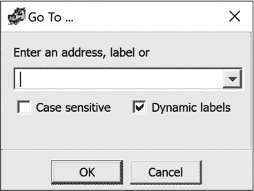

*图 6-3：转到对话框*

导航到二进制文件中的任何位置非常简单，只需指定一个有效的地址（区分大小写的符号名称或十六进制值），然后点击确认，显示就会立即跳转到所需位置。输入到对话框中的值会通过下拉历史列表在后续使用中提供，简化了返回先前请求位置的操作。

#### *导航历史*

作为最终的导航功能，Ghidra 支持基于你浏览反汇编的顺序进行前后导航。每次你导航到反汇编中的新位置时，当前的位置都会被添加到历史列表中。这个列表可以通过“转到”窗口或者代码浏览器工具栏中的左右箭头图标进行浏览。

在 Go To 窗口中，如图 6-3 所示，文本框右侧的箭头打开一个选择列表，允许你从之前在 Go To 对话框中输入的位置信息中选择。CodeBrowser 工具栏按钮，如图 6-4 中左上方所见，提供类似浏览器的前进和后退功能。每个按钮都关联着一个详细的下拉历史列表，允许你直接访问导航历史中的任何位置，而不需要重新回溯整个列表。图 6-4 中显示了与返回箭头相关的下拉列表示例。


*图 6-4：带地址列表的前进和后退导航箭头*

ALT-左箭头（Mac 上是 OPTION-左箭头）用于向后导航，是你可以牢记的最有用的快捷键之一。当你已经深入跟踪了一系列函数调用，并且决定返回到反汇编的原始位置时，向后导航非常方便。ALT-右箭头（Mac 上是 OPTION-右箭头）将反汇编窗口在历史列表中向前移动。

虽然我们现在对如何在 Ghidra 中导航反汇编有了更清晰的认识，但我们仍然没有对我们访问过的各个目标赋予意义。下一节将探讨为什么函数（尤其是堆栈帧）对逆向工程师来说是如此重要的导航目标。

### 堆栈帧

因为 Ghidra 是一个低级分析工具，它的许多功能和显示期望用户对编译语言的低级细节有一定了解，这些语言专注于生成机器语言和管理高级程序使用的内存。Ghidra 特别关注编译器如何处理局部变量声明和访问。你可能已经注意到，在大多数函数列表的开头，有大量的行专门用于局部变量。这些行来自 Ghidra 对每个函数进行的详细堆栈分析，通过其堆栈分析器完成。进行此分析是必要的，因为编译器将函数的局部变量（在某些情况下，还包括函数的传入参数）放置在分配到堆栈上的内存块中。在本节中，我们将回顾编译器如何处理局部变量和函数参数，以帮助你更好地理解 Ghidra 列表视图的细节。

#### *函数调用机制*

函数调用可能需要为传递给函数的参数（实参）以及执行函数时的临时存储空间分配内存。参数值或其对应的内存地址需要存储在函数能够找到的地方。临时空间通常通过程序员声明局部变量来分配，这些变量可以在函数内使用，但在函数完成后无法访问。*栈帧*（也称为*激活记录*）是分配在程序运行时栈中的内存块，专门用于特定函数调用的内存空间。

编译器使用栈帧使函数参数和局部变量的分配与释放对程序员透明。对于在栈上传递参数的调用约定，编译器会插入代码，在将控制权传递给函数之前，将函数的参数放入栈帧中，随后插入代码分配足够的内存来保存函数的局部变量。在某些情况下，函数应返回的地址也会存储在新的栈帧中。栈帧还支持递归，^(1)因为每个递归调用都会得到自己的栈帧，确保每次调用都与前一次调用相互独立。

以下是函数调用时发生的操作：

1.  调用者将被调用函数所需的任何参数放入被调用函数采用的调用约定所要求的位置。如果参数通过运行时栈传递，则程序栈指针可能会发生变化。

1.  调用者通过类似 x86 的`CALL`、ARM 的`BL`或 MIPS 的`JAL`指令将控制权传递给被调用的函数。一个返回地址会被保存在程序栈中或处理器寄存器里。

1.  如果需要，被调用的函数配置一个帧指针并保存调用者期望保持不变的寄存器值。^(2)

1.  被调用的函数为其可能需要的任何局部变量分配空间。这通常通过调整程序栈指针来预留运行时栈上的空间。

1.  被调用的函数执行其操作，可能会访问传递给它的参数并生成结果。如果函数返回结果，通常会将其放入一个特定的寄存器中，调用者可以在函数返回后检查该寄存器。

1.  当函数完成其操作后，为局部变量保留的任何栈空间会被释放。通常通过逆转步骤 4 中执行的操作来完成这一过程。

1.  为调用者保存的寄存器值（在步骤 3 中）会被恢复为原始值。

1.  被调用的函数将控制权返回给调用者。典型的指令包括 x86 的`RET`、ARM 的`POP`和 MIPS 的`JR`。根据使用的调用约定，这个操作也可能会从程序栈中清除一个或多个参数。

1.  一旦调用者重新获得控制权，它可能需要通过恢复程序栈指针到步骤 1 之前的值，从程序栈中移除参数。

步骤 3 和步骤 4 是进入函数时常见的操作，合在一起被称为函数的*序言*。类似地，步骤 6 到步骤 8 构成了函数的*尾声*。除了步骤 5，这些操作都是与调用函数相关的开销，可能在程序的高级源代码中并不明显，但在汇编语言中却十分可见。

**它们真的被移除了么？**

当我们谈论“移除”栈中的项目以及整个栈帧的移除时，我们指的是调整栈指针，使其指向栈中更低的位置，并且已移除的内容不再通过`POP`操作访问。直到这些内容被`PUSH`操作覆盖，它们仍然存在。从编程的角度来看，这算作移除。从数字取证的角度来看，你需要稍微费点劲才能找到这些内容。从变量初始化的角度来看，这意味着栈帧中的任何未初始化的局部变量可能包含来自上次使用特定栈字节范围的过期值。

#### *调用约定*

当从调用者传递参数到被调用者时，调用函数必须按照被调用函数预期的方式存储参数；否则，可能会出现严重问题。*调用约定*严格规定了调用者应该将任何函数所需的参数放置的位置：在特定的寄存器中、在程序栈上，或同时在寄存器和栈中。当参数通过程序栈传递时，调用约定还决定了在被调用函数完成后，谁负责从栈中移除这些参数：调用者还是被调用者。

无论你是在逆向哪种架构的程序，如果不理解所使用的调用约定，理解函数调用周围的代码将会非常困难。在接下来的章节中，我们将回顾一些在编译后的 C 和 C++代码中常见的调用约定。

##### 栈和寄存器参数

函数参数可以通过处理器寄存器、程序栈或两者的组合传递。当参数被放置到栈上时，调用者执行内存写操作（通常是`PUSH`）将参数放到栈上，而被调用函数必须执行内存读取操作才能访问该参数。为了加快函数调用过程，一些调用约定通过处理器寄存器传递参数。当参数通过寄存器传递时，无需执行内存的写入和读取操作，因为参数可以直接通过指定的寄存器提供给被调用函数。寄存器传递调用约定的一个缺点是处理器的寄存器数量有限，而函数参数列表可以非常长，因此这些约定必须正确处理需要更多参数而寄存器不足的情况。多余的参数通常会“溢出”到栈上。

##### C 调用约定

*C 调用约定*是大多数 C 编译器在生成函数调用时使用的默认调用约定。在 C/C++程序中，可以使用关键字`_cdecl`强制使用此调用约定。`cdecl`调用约定规定调用者将任何栈分配的函数参数按从右到左的顺序放置到栈上，并且调用者（而不是被调用者）在被调用函数完成后从栈中移除参数。对于 32 位 x86 二进制文件，`cdecl`将所有参数放在程序栈上。对于 64 位 x86 二进制文件，`cdecl`根据操作系统有所不同；在 Linux 上，最多六个参数被放置在寄存器`RDI`、`RSI`、`RDX`、`RCX`、`R8`和`R9`中，顺序如下，任何额外的参数将溢出到栈上。对于 ARM 二进制文件，`cdecl`将前四个参数放在寄存器`R0`到`R3`中，第五个及以后的参数溢出到栈上。

当栈分配的参数按从右到左的顺序放置到栈上时，最左边的参数在函数调用时将始终位于栈顶。这使得第一个参数在不考虑函数期望的参数数量的情况下也能轻松找到，同时这也使得`cdecl`调用约定非常适合用于可以接受可变数量参数的函数（如`printf`）。

要求调用函数从栈中移除参数意味着你通常会看到在从被调用函数返回后，紧接着有指令调整程序栈指针。在可以接受可变数量参数的函数中，调用者确切知道它传递了多少参数，因此可以轻松地做出正确的调整，而被调用函数则无法事先知道它将接收到多少个参数。

在以下示例中，我们考虑对 32 位 x86 二进制文件中的函数的调用，每个函数使用不同的调用约定。第一个函数有如下原型：

```
void demo_cdecl(int w, int x, int y, int z);
```

默认情况下，此函数将使用`cdecl`调用约定，期望四个参数按从右到左的顺序推送，并要求调用者在每次调用后清理堆栈上的参数。给定以下 C 语言中的函数调用：

```
demo_cdecl(1, 2, 3, 4);    // call to demo_cdecl (in C)
```

编译器可能会生成如下代码：

```
➊ PUSH   4              ; push parameter z

  PUSH   3              ; push parameter y

  PUSH   2              ; push parameter x

  PUSH   1              ; push parameter w

  CALL   demo_cdecl     ; call the function

➋ ADD   ESP, 16        ; adjust ESP to its former value
```

四个`PUSH`操作➊会将程序堆栈指针`(ESP)`改变 16 个字节（在 32 位架构上为`4 * sizeof(int)`），在从`demo_cdecl`返回后会立即撤销这一操作➋。以下技术在某些版本的 GNU 编译器（`gcc`和`g++`）中使用，同时遵循`cdecl`调用约定，并消除了调用者在每次调用`demo_cdecl`后显式清理堆栈参数的需求：

```
MOV    [ESP+12], 4    ; move parameter z to fourth position on stack

MOV    [ESP+8], 3     ; move parameter y to third position on stack

MOV    [ESP+4], 2     ; move parameter x to second position on stack

MOV    [ESP], 1       ; move parameter w to top of stack

CALL   demo_cdecl     ; call the function
```

在这个例子中，当`demo_cdecl`的参数被放置到堆栈上时，程序堆栈指针没有发生变化。请注意，无论使用哪种方法，当函数被调用时，堆栈指针都会指向最左侧的堆栈参数。

##### 标准调用约定

在 32 位 Windows DLL 中，微软大量使用了一种它命名为*标准调用约定*的调用约定。在源代码中，这可以通过在函数声明中使用`_stdcall`修饰符来强制，如下所示：

```
void _stdcall demo_stdcall(int w, int x, int y);
```

为了避免“标准”一词的混淆，我们在本书的其余部分将这种调用约定称为`stdcall`调用约定。

`stdcall`调用约定还要求任何堆栈分配的函数参数按照从右到左的顺序放置在程序堆栈上，但被调用的函数负责在函数执行完毕后清除堆栈上的参数。这只有在函数接受固定数量的参数时才可行；像`printf`这样的可变参数函数不能使用`stdcall`调用约定。

`demo_stdcall`函数期望三个整数参数，总共占用 12 个字节的堆栈空间（在 32 位架构上为`3 * sizeof(int)`）。x86 编译器可以使用一种特殊形式的`RET`指令，同时从堆栈顶部弹出返回地址，并通过堆栈指针的调整来清除堆栈分配的函数参数。以`demo_stdcall`为例，我们可能会看到以下指令用于返回给调用者：

```
RET 12    ; return and clear 12 bytes from the stack
```

使用`stdcall`可以消除每次函数调用后清理堆栈参数的需求，这会导致程序稍微更小、运行稍微更快。根据约定，微软对于所有从 32 位共享库（DLL）文件导出的固定参数函数使用`stdcall`约定。如果你打算为任何共享库组件生成函数原型或二进制兼容替代品，这一点非常重要。

##### x86 的 fastcall 约定

微软的 C/C++和 GNU `gcc`/`g++`（版本 3.4 及以上）编译器识别`fastcall`约定，这是`stdcall`约定的一种变体，其中前两个参数分别放入`ECX`和`EDX`寄存器。其余的参数按从右到左的顺序放入栈中，调用的函数在返回时负责从栈中移除参数。以下声明演示了`fastcall`修饰符的使用：

```
void fastcall demo_fastcall(int w, int x, int y, int z);
```

给定以下 C 语言函数调用：

```
demo_fastcall(1, 2, 3, 4);      // call to demo_fastcall (in C)
```

编译器可能生成以下代码：

```
PUSH   4              ; move parameter z to second position on stack

PUSH   3              ; move parameter y to top position on stack

MOV    EDX, 2         ; move parameter x to EDX

MOV    ECX, 1         ; move parameter w to ECX

Call   demo_fastcall  ; call the function
```

从`demo_fastcall`返回时不需要进行栈调整，因为`demo_fastcall`负责在返回调用者时从栈中清除参数`y`和`z`。需要理解的是，虽然函数有四个参数，但由于两个参数是通过寄存器传递的，调用的函数只需要从栈中清除 8 个字节。

##### C++调用约定

C++类中的非静态成员函数必须提供指向用于调用该函数的对象的指针（`this`指针）。^(3) 调用该函数的对象地址必须由调用者作为参数提供，但 C++语言标准并未指定`this`应如何传递，因此不同编译器使用不同的技术并不奇怪。

在 x86 架构上，微软的 C++编译器使用`thiscall`调用约定，将`this`放入`ECX/RCX`寄存器，并要求非静态成员函数像`stdcall`一样清除栈上的参数。GNU 的`g++`编译器将`this`视为任何非静态成员函数的隐含第一个参数，并在其他方面表现得像使用`cdecl`约定一样。因此，对于`g++`编译的 32 位代码，`this`在调用非静态成员函数之前会被放置在栈顶，调用者负责在函数返回后从栈中移除参数（至少会有一个）。C++程序的其他特点将在第八章和第二十章中讨论。

##### 其他调用约定

完全覆盖每种调用约定将需要一本书。调用约定通常是操作系统、语言、编译器和/或处理器特定的，如果你遇到由不常见的编译器生成的代码，可能需要进行一些研究。然而，有几种额外的情况值得特别提及：优化代码、自定义汇编语言代码和系统调用。

当函数被导出供其他程序员使用（例如库函数）时，重要的是它们需要遵循公认的调用约定，以便程序员能够轻松地与这些函数进行接口。另一方面，如果一个函数仅供程序内部使用，那么该函数使用的调用约定只需要在程序内部了解。在这种情况下，优化编译器可能会选择使用替代的调用约定来生成更快的代码。例如，使用 Microsoft C/C++ 的 `/GL` 选项会指示它执行“整体程序优化”，这可能会导致在函数边界间优化寄存器的使用，而使用 GNU `gcc`/`g++` 的 `regparm` 关键字允许程序员指定最多三个参数通过寄存器传递。

当程序员费心编写汇编语言时，他们将完全控制如何将参数传递给他们创建的任何函数。除非他们希望将其函数提供给其他程序员，否则汇编语言程序员可以自由地以任何他们认为合适的方式传递参数。因此，在分析自定义汇编代码（如混淆例程和 shellcode）时需要特别小心。

*系统调用*是一种特殊类型的函数调用，用于请求操作系统服务。系统调用通常会引发从用户模式到内核模式的状态转换，以便操作系统内核处理用户的请求。系统调用的启动方式在不同的操作系统和处理器之间有所不同。例如，32 位的 Linux x86 系统调用可能使用 `INT 0x80` 指令或 `sysenter` 指令来启动，而其他 x86 操作系统可能只使用 `sysenter` 指令或替代的中断号，64 位 x86 代码则使用 `syscall` 指令。在许多 x86 系统上（Linux 为例外），系统调用的参数被放置在运行时栈上，且在启动系统调用之前，系统调用号被放入 `EAX` 寄存器。Linux 系统调用在特定的寄存器中接受参数，当可用寄存器不足时，参数有时会放置在内存中。

#### *附加栈帧考虑*

在任何处理器上，寄存器是有限的资源，需要在程序中的所有函数之间进行共享与合作。当一个函数（`func1`）正在执行时，它的视角是它完全控制所有处理器寄存器。当`func1`调用另一个函数（`func2`）时，`func2`可能希望采用相同的视角，并根据自己的需求使用所有可用的处理器寄存器，但如果`func2`随意更改寄存器，它可能会破坏`func1`所依赖的值。

为了解决这个问题，所有编译器都遵循明确定义的寄存器分配和使用规则。这些规则通常被称为平台的*应用程序二进制接口（ABI）*。ABI 将寄存器分为两类：调用者保存寄存器和被调用者保存寄存器。当一个函数调用另一个函数时，调用者只需要保存调用者保存寄存器中的寄存器，以防止值丢失。任何被调用者保存寄存器中的寄存器必须由被调用函数（即被调用者）在使用这些寄存器之前保存。这通常发生在函数的序言序列中，而调用者保存的值会在函数的尾声部分，在返回之前恢复。调用者保存寄存器被称为*可覆盖*寄存器，因为被调用函数可以自由修改它们的内容，而无需先保存它们。相反，被调用者保存寄存器被称为*不可覆盖*寄存器。

针对 Intel 32 位处理器的 System V ABI 规定，调用者保存寄存器包括`EAX`、`ECX`和`EDX`，而被调用者保存寄存器包括`EBX`、`EDI`、`ESI`、`EBP`和`ESP`。^(4) 在编译代码中，你可能会注意到编译器通常倾向于在函数内部使用调用者保存寄存器，因为这样它们不需要在函数入口和退出时保存和恢复其内容。

#### *局部变量布局*

与决定如何将参数传递给函数的调用约定不同，没有约定决定函数局部变量的内存布局。在编译一个函数时，编译器必须计算该函数局部变量所需的空间大小，以及保存任何不应覆盖寄存器所需的空间，并确定这些变量是否可以分配到处理器寄存器中，或者是否必须分配到程序栈上。具体如何进行这些分配，对函数的调用者和任何可能被调用的函数都没有影响，并且通常无法仅通过检查函数的源代码来确定函数的局部变量布局。关于栈帧，有一点是肯定的：编译器必须至少分配一个寄存器来记住函数新分配的栈帧的位置。最明显的选择是栈指针寄存器，它的定义就是指向栈，因此也指向当前函数的栈帧。

#### *栈帧示例*

当你进行任何复杂的任务时，比如逆向工程二进制文件，你应始终尽量高效地利用时间。在理解反汇编函数的行为时，花费在常见代码序列上的时间越少，你就能花更多时间去处理困难的序列。函数的序言和尾声是常见代码序列的绝佳例子，了解它们、识别它们，并迅速跳到需要更多思考的有趣代码，是非常重要的。

Ghidra 在每个函数列表的开头通过局部变量列表总结了它对函数序言的理解，虽然它使代码更具可读性，但并不会减少你需要阅读的反汇编代码量。在以下示例中，我们将讨论两种常见的栈帧类型，并回顾创建它们所需的代码，这样当你遇到类似的代码时，就可以迅速跳过它，进入函数的核心部分。

考虑以下在 32 位 x86 计算机上编译的函数：

```
void helper(int j, int k);    // a function prototype

void demo_stackframe(int a, int b, int c) {

    int x;

    char buffer[64];

    int y;

    int z;

    // body of function not terribly relevant

    // other than the following function call

    helper(z, y);

}
```

`demo_stackframe`的局部变量需要 76 个字节（三个 4 字节整数和一个 64 字节缓冲区）。此函数可以使用`stdcall`或`cdecl`，栈帧将保持相同。

##### 示例 1：通过栈指针访问局部变量

图 6-5 显示了调用`demo_stackframe`时可能的栈帧。在这个示例中，编译器选择在引用栈帧中的变量时使用栈指针，保留所有其他寄存器以供其他用途。如果任何指令导致栈指针的值发生变化，编译器必须确保在所有后续的局部变量访问中考虑到这一变化。

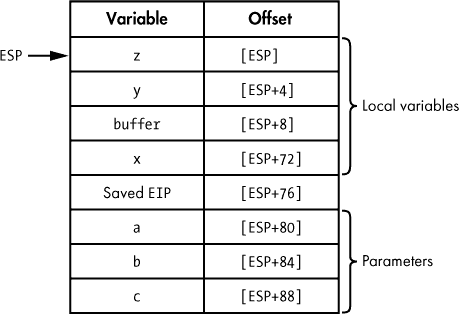

*图 6-5：在 32 位 x86 计算机上编译的函数示例栈帧*

该栈帧的空间在进入`demo_stackframe`时通过一行代码的序言进行设置：

```
SUB    ESP, 76        ; allocate sufficient space for all local variables
```

图 6-5 中的偏移列表示引用栈帧中每个局部变量和参数所需的 x86 寻址模式（在此情况下为基址+位移）。在此情况下，`ESP`被用作基址寄存器，每个位移是从`ESP`到变量在栈帧中的起始位置的相对偏移量。然而，图 6-5 中显示的位移仅在`ESP`中的值没有改变时是正确的。不幸的是，栈指针经常变化，编译器必须不断适应，以确保在引用栈帧中的任何变量时使用正确的偏移量。考虑在函数`demo_stackframe`中对`helper`的调用，相关代码如下所示：

```
➊ PUSH   dword [ESP+4]  ; push y

➋ PUSH   dword [ESP+4]  ; push z

   CALL   helper

   ADD    ESP, 8         ; cdecl requires caller to clear parameters
```

第一个`PUSH` ➊正确地根据图 6-5 中的偏移量压入了局部变量`y`。乍一看，第二个`PUSH` ➋似乎错误地第二次引用了局部变量`y`。然而，由于堆栈帧中的所有变量都是相对于`ESP`进行引用的，并且第一个`PUSH` ➊修改了`ESP`，因此图 6-5 中的所有偏移量必须暂时调整。因此，在第一次`PUSH` ➊之后，局部变量`z`的新偏移量变为`[ESP+4]`。在检查使用堆栈指针引用堆栈帧变量的函数时，必须小心注意堆栈指针的任何变化，并相应地调整所有未来的变量偏移量。

一旦`demo_stackframe`完成，它需要返回给调用者。最终，`RET`指令将把所需的返回地址从堆栈顶部弹出到指令指针寄存器（在这种情况下是`EIP`）。在返回地址被弹出之前，局部变量需要从堆栈顶部移除，以便堆栈指针在执行`RET`指令时正确指向保存的返回地址。对于这个特定函数（假设使用的是`cdecl`调用约定），尾声代码如下：

```
ADD    ESP, 76        ; adjust ESP to point to the saved return address

RET                   ; return to the caller
```

##### 示例 2：让堆栈指针休息一下

通过将第二个寄存器用于在堆栈帧中定位变量，可以允许堆栈指针在不需要重新计算每个变量偏移量的情况下自由变化。当然，编译器需要承诺不更改这个第二个寄存器；否则，它将需要处理前面示例中提到的相同问题。在这种情况下，编译器首先需要为此目的选择一个寄存器，然后它必须生成代码，在进入函数时初始化该寄存器。

任何为此目的选定的寄存器都称为*帧指针*。在前面的示例中，`ESP`被用作帧指针，我们可以说它是基于`ESP`的堆栈帧。大多数架构的 ABI 建议使用哪个寄存器作为帧指针。帧指针始终被视为不可破坏寄存器，因为调用函数可能已经将其用于相同的目的。在 x86 程序中，`EBP`/`RBP`（扩展基指针）寄存器通常专用于帧指针。默认情况下，大多数编译器生成的代码使用除堆栈指针外的寄存器作为帧指针，尽管通常有选项指定应使用堆栈指针。（例如，GNU 的`gcc`/`g++`提供了`-fomit-frame-pointer`编译器选项，生成不使用第二个寄存器作为帧指针的函数。）

为了查看使用专用帧指针时`demo_stackframe`的堆栈帧会是什么样子，我们需要考虑这段新的序言代码：

```
➊ PUSH   EBP            ; save the caller's EBP value, because it's no-clobber

➋ MOV    EBP, ESP       ; make EBP point to the saved register value

➌ SUB    ESP, 76        ; allocate space for local variables
```

`PUSH`指令➊保存当前调用者使用的`EBP`值，因为`EBP`是一个不会被覆盖的寄存器。在返回之前，必须恢复调用者的`EBP`值。如果需要保存其他寄存器（例如`ESI`或`EDI`）以代表调用者，编译器可以在保存`EBP`的同时保存它们，或者将保存它们的操作延迟到局部变量分配之后。因此，堆栈帧中没有标准的位置用于存储保存的寄存器。

一旦`EBP`被保存，它可以通过`MOV`指令➋改变为指向当前堆栈位置，这将当前堆栈指针的值（此时唯一保证指向堆栈的寄存器）复制到`EBP`。最后，与基于`ESP`的堆栈帧一样，为局部变量分配空间➌。最终的堆栈帧布局如图 6-6 所示。

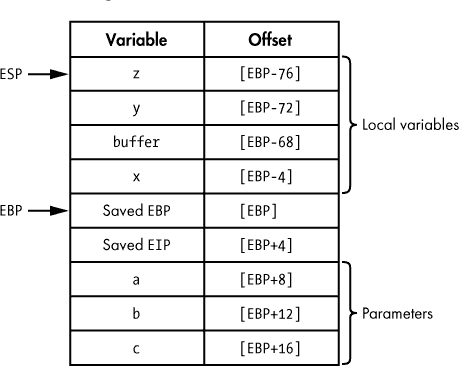

*图 6-6：基于 EBP 的堆栈帧*

使用专用的帧指针后，所有变量的偏移量现在都可以相对于帧指针寄存器进行计算，如图 6-6 所见。通常（但不一定）使用正偏移来访问任何栈分配的函数参数，而使用负偏移来访问局部变量。在使用专用帧指针的情况下，堆栈指针可以自由更改，而不会影响帧内任何变量的偏移量。对函数`helper`的调用现在可以按如下方式实现：

```
➍ PUSH   dword [ebp-72] ; PUSH y

   PUSH   dword [ebp-76] ; PUSH z

   CALL   helper

   ADD    ESP, 8         ; cdecl requires caller to clear parameters
```

堆栈指针在第一次`PUSH` ➍后发生变化，但这对后续`PUSH`中对局部变量`z`的访问没有影响。

在使用帧指针的函数的尾声部分，必须在返回之前恢复调用者的帧指针。如果帧指针需要通过`POP`指令恢复，则必须在弹出旧帧指针值之前先清除栈中的局部变量，但由于当前帧指针指向堆栈中保存的帧指针值位置，因此这一过程变得简单。在使用`EBP`作为帧指针的 32 位 x86 程序中，以下代码表示一个典型的尾声：

```
MOV    ESP, EBP       ; clears local variables by resetting ESP

POP    EBP            ; restore the caller's value of EBP

RET                   ; pop return address to return to the caller
```

这个操作如此常见，以至于 x86 架构提供了`LEAVE`指令来完成相同的任务：

```
LEAVE                 ; copies EBP to ESP AND then pops into EBP

RET                   ; pop return address to return to the caller
```

虽然不同处理器架构中使用的寄存器和指令的名称肯定会有所不同，但构建堆栈帧的基本过程将保持不变。无论架构如何，你都应当熟悉典型的序言和尾声序列，以便快速分析函数内更有趣的代码。

### Ghidra 堆栈视图

堆栈框架是一个运行时概念；没有堆栈和正在运行的程序，就没有堆栈框架。虽然这是事实，但这并不意味着在使用 Ghidra 等工具进行静态分析时应该忽视堆栈框架的概念。每个函数设置堆栈框架所需的所有代码都存在于二进制文件中。通过仔细分析这些代码，我们可以详细了解任何函数的堆栈框架结构，即使该函数没有运行。事实上，Ghidra 的一些最复杂的分析正是为了确定它反汇编的每个函数的堆栈框架布局。

#### *Ghidra 堆栈框架分析*

在初步分析过程中，Ghidra 会非常详细地跟踪堆栈指针在函数执行过程中的行为，记录每一个 `PUSH` 或 `POP` 操作，以及可能更改堆栈指针的任何算术操作，例如加或减常量值。此分析的目标是确定分配给函数堆栈框架的局部变量区域的确切大小，确定是否在给定函数中使用了专用的帧指针（例如通过识别 `PUSH EBP/MOV EBP, ESP` 序列），并识别函数堆栈框架中所有变量的内存引用。

例如，如果 Ghidra 记录了指令

```
MOV    EAX, [EBP+8]
```

在 `demo_stackframe` 的代码中，它会理解函数的第一个参数（此例中为 `a`）被加载到 `EAX` 寄存器中（参见图 6-6）。Ghidra 能区分访问函数参数的内存引用（那些位于保存的返回地址以下的）和访问局部变量的引用（那些位于保存的返回地址以上的）。

Ghidra 采取额外步骤来确定堆栈框架内哪些内存位置被直接引用。例如，虽然图 6-6 中的堆栈框架大小为 96 字节，但只有七个变量可能会被引用（四个局部变量和三个参数）。因此，你可以将注意力集中在 Ghidra 确定为重要的七个元素上，而不用过多考虑 Ghidra 未命名的所有字节。在识别和命名堆栈框架中的各个元素的过程中，Ghidra 还识别了变量之间的空间关系。这在某些使用场景中非常有帮助，例如漏洞开发，当 Ghidra 可以轻松地确定哪些变量可能会在缓冲区溢出时被覆盖。Ghidra 的反编译器（在第十九章中讨论）也大量依赖堆栈框架分析，并利用这些结果推断函数接收的参数数量以及反编译代码中所需的局部变量声明。

#### *列表视图中的堆栈框架*

理解一个函数的行为通常归结于理解该函数操作的数据类型。当你阅读反汇编列表时，理解函数操作的数据的第一步通常是查看函数堆栈帧的分解。Ghidra 提供了两种查看任何函数堆栈帧的方式：摘要视图和详细视图。为了理解这两种视图，我们将参考以下版本的 `demo_stackframe`，这是我们使用 `gcc` 编译的：

```
void demo_stackframe(int i, int j, int k) {

    int x = k;

    char buffer[64];

 int y = j;

    int z = 10;

    buffer[0] = 'A';

    helper(z, y);

}
```

由于本地变量仅在函数运行时存在，因此任何在函数中没有被有意义地使用的本地变量实际上是没有用的。从高层次来看，以下代码是 `demo_stackframe` 的功能等效版本（你可以说是优化后的版本）：

```
void demo_stackframe_2(int b) {

    helper(10, b);

}
```

（因此，尽管这个函数看起来像是在做很多工作，实际上它只是试图装作忙碌，以给老板留下好印象。）

在原始版本的 `demo_stackframe` 中，本地变量 `x` 和 `y` 分别从参数 `k` 和 `j` 初始化。本地变量 `z` 被初始化为字面值 10，并且 64 字节本地数组 `buffer` 中的第一个字符被初始化为字符 `'A'`。使用默认自动分析的 Ghidra 反汇编显示了该函数的内容，如 图 6-7 所示。

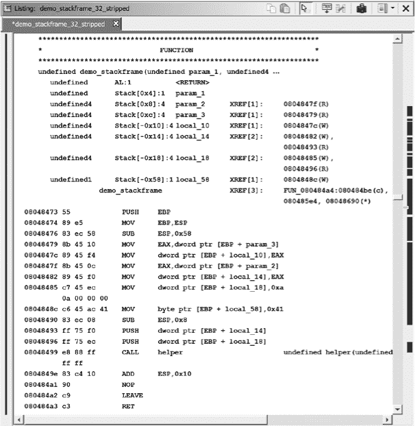

*图 6-7：* demo_stackframe *函数的反汇编*

在我们开始熟悉 Ghidra 的反汇编符号时，有许多要点需要讨论。在本讨论中，我们专注于反汇编中的两个部分，它们为我们提供了特别有用的信息。让我们首先关注堆栈摘要，如下所示的列表中所示。（你可以随时参考 图 6-7 来查看这个摘要堆栈帧的上下文。）为了简化讨论，术语 *本地变量* 和 *参数* 用来区分两种类型的变量。术语 *变量* 用于讨论这两者时。

```
        undefined   AL:1            <RETURN>

        undefined   Stack[0x4]:1    param_1

        undefined4  Stack[0x8]:4    param_2

        undefined4  Stack[0xc]:4    param_3

        undefined4  Stack[-0x10]:4  local_10

        undefined4  Stack[-0x14]:4  local_14

        undefined4  Stack[-0x18]:4  local_18

        undefined1  Stack[-0x58]:1  local_58
```

Ghidra 提供了一个摘要堆栈视图，列出了堆栈帧中直接引用的每个变量，并附带有关每个变量的重要信息。Ghidra 为每个变量分配的有意义的名称（在第三列）在查看反汇编列表时提供有关变量的信息：传递给函数的参数名称以 `param_` 为前缀，本地变量名称以 `local_` 为前缀。因此，很容易区分这两种类型的变量。

变量名的前缀与关于变量位置或位置的信息结合在一起。对于参数，例如`param_3`，名称中的数字对应函数参数列表中该参数的位置。对于局部变量，例如`local_10`，数字是一个十六进制偏移量，表示变量在堆栈帧中的位置。位置也可以在列表的中间列中找到，位于名称的左侧。该列有两个组件，通过冒号分隔：Ghidra 对变量大小的字节估计和变量在堆栈帧中的位置，表示为该变量相对于函数入口时初始堆栈指针值的偏移量。

该堆栈帧的表格表示如图 6-8 所示。如前所述，参数位于保存的返回地址下方，因此它们相对于返回地址有一个正偏移。局部变量位于保存的返回地址上方，因此它们有一个负偏移。堆栈中局部变量的顺序与它们在本章前面展示的源代码中的声明顺序不匹配，因为编译器可以根据多种内部因素自由地安排局部变量在堆栈中的位置，例如字节对齐和数组相对于其他局部变量的放置。

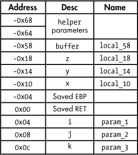

*图 6-8：示例堆栈帧图像*

#### *反编译器辅助堆栈帧分析*

记得我们识别的代码功能等价物吗？

```
void demo_stackframe_2(int j) {

    helper(10, j);

}
```

反编译器为该函数生成的代码如图 6-9 所示。Ghidra 的反编译器生成的代码与我们的优化代码非常相似，因为反编译器只包含了原始函数的可执行等价物。（例外是`param_1`的包含。）

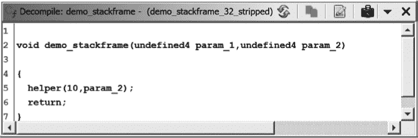

*图 6-9：反编译器窗口（使用反编译器参数 ID 分析器）*

你可能已经注意到，函数`demo_stackframe`接受了三个整数参数，但在反编译器的列表中只有其中两个（`param_1`和`param_2`）被列出。缺少的那个是哪一个，为什么？原来，Ghidra 反汇编器和 Ghidra 反编译器对参数命名的方式略有不同。虽然两者都命名了直到最后一个引用的所有参数，但反编译器只命名了直到最后一个有实际用途的参数。Ghidra 可以为你运行的一种分析器叫做*反编译器参数 ID 分析器*。在大多数情况下，这个分析器默认是禁用的（它只对小于 2MB 的 Windows PE 文件启用）。当启用反编译器参数 ID 分析器时，Ghidra 使用反编译器推导的参数信息来命名反汇编列表中的函数参数。以下列表展示了启用反编译器参数 ID 分析器时，`demo_stackframe`反汇编列表中的变量：

```
        undefined   AL:1            <RETURN>

        undefined   Stack[0x4]:4    param_1

        undefined4  Stack[0x8]:4    param_2

        undefined4  Stack[-0x10]:4  local_10

        undefined4  Stack[-0x14]:4  local_14

        undefined4  Stack[-0x18]:4  local_18

        undefined1  Stack[-0x58]:1  local_58
```

注意，`param_3` 不再出现在函数参数列表中，因为反编译器已确定它在函数内部没有以任何有意义的方式使用。这个特定的堆栈帧将在第八章中进一步讨论。如果你希望在打开二进制文件后，Ghidra 在禁用该分析器的情况下执行反编译器参数 ID 分析，你可以选择“分析 ▸ 一次性 ▸ 反编译器参数 ID”来在事后运行该分析器。

#### *作为操作数的局部变量*

让我们将注意力转向以下列表中的实际反汇编部分：

```
08048473 55           PUSH   EBP➊

08048474 89 e5        MOV    EBP,ESP

08048476 83 ec 58     SUB    ESP,0x58➋

08048479 8b 45 10     MOV    EAX,dword ptr [EBP + param_3]

0804847c 89 45 f4     MOV    dword ptr [EBP + local_10],EAX➌

0804847f 8b 45 0c     MOV    EAX,dword ptr [EBP + param_2]

08048482 89 45 f0     MOV    dword ptr [EBP + local_14],EAX➍

08048485 c7 45 ec     MOV    dword ptr [EBP + local_18],0xa➎

         0a 00 00 00

0804848c c6 45 ac 41  MOV    byte ptr [EBP + local_58],0x41➏

08048490 83 ec 08     SUB    ESP,0x8

08048493 ff 75 f0     PUSH   dword ptr [EBP + local_14]➐

08048496 ff 75 ec     PUSH   dword ptr [EBP + local_18]
```

该函数使用一个常见的函数序言➊，用于基于`EBP`的堆栈帧。编译器在堆栈帧中分配了 88 字节（`0x58`等于 88）的局部变量空间➋。这略高于预估的 76 字节，表明编译器有时会通过填充额外的字节来保持堆栈帧内的特定内存对齐。

Ghidra 的反汇编列表和我们之前执行的堆栈帧分析之间的一个重要区别是，在反汇编列表中，你看不到类似`[EBP-12]`的内存引用（例如你可能会在`objdump`中看到）。相反，Ghidra 已将所有常量偏移量替换为符号名称，这些符号名称对应堆栈视图中的符号及其相对于函数初始堆栈指针位置的偏移量。这与 Ghidra 生成更高级反汇编的目标一致。处理符号名称比处理数字常量更为简便。它还给我们提供了一个可以修改的名称，一旦我们了解变量的用途后，可以使其与我们的理解相匹配。Ghidra 会在 CodeBrowser 窗口的极低右角显示当前指令的原始形式，没有任何标签，供参考。

在这个例子中，由于我们有源代码可以进行对比，我们可以通过使用反汇编中可用的各种线索，将 Ghidra 生成的变量名映射回原始源代码中使用的名称：

1.  首先，`demo_stackframe`接受三个参数，`i`、`j`和`k`，它们分别对应变量`param_1`、`param_2`和`param_3`。

1.  局部变量`x`（`local_10`）由参数`k`（`param_3`）初始化➌。

1.  类似地，局部变量`y`（`local_14`）由参数`j`（`param_2`）初始化➍。

1.  局部变量`z`（`local_18`）被初始化为值 10➎。

1.  第一个字符`buffer[0]`（`local_58`）在 64 字节字符数组中被初始化为 *A*（ASCII `0x41`）➏。

1.  对`helper`的调用有两个参数被压入堆栈➐。在这两个压栈之前的 8 字节堆栈调整与这两个压栈结合在一起，产生了 16 字节的净堆栈变化。因此，堆栈保持了程序中先前所实现的任何 16 字节对齐。

#### *Ghidra 堆栈帧编辑器*

除了概览栈视图，Ghidra 还提供了一个详细的栈帧编辑器，其中对栈帧中分配的每一个字节都进行了详细记录。栈帧编辑器窗口可以通过右键点击并在 Ghidra 的概览栈视图中选择函数 ▸ 编辑栈帧来访问。当你在 Ghidra 的概览栈视图中选择一个函数或栈变量时，弹出的窗口将显示 `demo_stackframe` 函数的情况，具体请参见图 6-10。

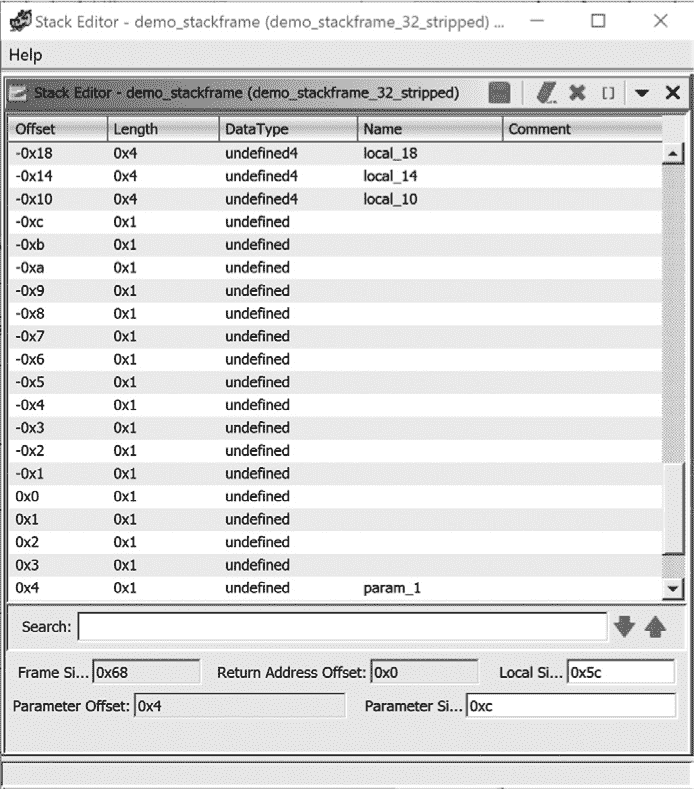

*图 6-10：示例概览栈视图*

因为详细视图会考虑栈帧中的每一个字节，所以它占用的空间比概览视图要大得多。图 6-10 中显示的栈帧部分总共占用了 29 字节，这只是整个栈帧的一小部分。在之前的列表中，`local_10` ➌，`local_14` ➍ 和 `local_18` ➎ 在反汇编列表中直接引用，其中它们的内容是通过 `dword`（4 字节）写入进行初始化的。基于移动了 32 位数据的事实，Ghidra 能推断出这些变量都是 4 字节的，并将它们标记为 `undefined4`（未知类型的 4 字节变量）。

由于这是一个栈帧编辑器，我们可以使用此窗口编辑字段、改变显示格式，并在对我们的分析有益时添加补充信息。例如，我们可以为 `0x0` 处的保存返回地址添加一个名称。

**基于寄存器的参数**

ARM 调用约定使用最多四个寄存器将参数传递给函数，而不使用栈。一些 x86-64 调用约定使用多达六个寄存器，一些 MIPS 调用约定则使用最多八个寄存器。基于寄存器的参数比基于栈的参数稍微难以识别。

请考虑以下两个汇编语言片段：

```
stackargs:               ; An example x86 32-bit function

    PUSH EBP             ; save no-clobber ebp

    MOV  EBP, ESP        ; set up frame pointer

 ➊ MOV  EAX, [EBP + 8]  ; retrieve stack-allocated argument

    MOV  CL, byte [EAX]  ; dereference retrieved pointer argument

    ...

    RET

regargs:                 ; An example x86-64 function

    PUSH RBP             ; save no-clobber rbp

    MOV  RBP, RSP        ; set up frame pointer

 ➋ MOV  CL, byte [RDI]  ; dereference pointer argument

    ...

    RET
```

在第一个函数中，保存的返回地址下方的栈区域被访问 ➊，我们可以推断出该函数至少需要一个参数。像大多数高级反汇编工具一样，Ghidra 通过执行栈指针和帧指针分析来识别访问函数栈帧成员的指令。

在第二个函数中，`RDI` 在初始化之前被使用 ➋。唯一合理的推断是，`RDI` 必须在调用者中初始化，在这种情况下，`RDI` 被用来将信息从调用者传递给 `regargs` 函数（也就是说，它是一个参数）。在程序分析术语中，`RDI` 在进入 `regargs` 时是*活跃的*。为了确定函数期望的基于寄存器的参数数量，可以通过观察函数内哪些寄存器的内容在写入（初始化）之前已经被读取和使用，从而识别出所有活跃的寄存器。

不幸的是，这种数据流分析通常超出了大多数反汇编器的能力，包括 Ghidra。另一方面，反编译器必须执行这种类型的分析，并且通常能够很好地识别基于寄存器的参数的使用。Ghidra 的反编译器参数 ID 分析器（编辑 ▸ <prog> 的选项 ▸ 属性 ▸ 分析器）可以根据反编译器执行的参数分析更新反汇编列表。

堆栈编辑器视图提供了编译器内部工作原理的详细视图。在图 6-10 中，可以清楚地看到编译器在保存的帧指针`-0x4`和局部变量`x`（`local_10`）之间插入了 8 个额外的字节。这些字节占据了堆栈帧中的偏移量`-0x5`到`-0xc`。除非你是编译器开发人员，或者愿意深入挖掘 GNU `gcc`的源代码，否则你只能猜测为什么这些额外的字节是以这种方式分配的。在大多数情况下，我们可以将这些额外字节归因于对齐的填充，并且通常这些额外字节的存在对程序的行为没有影响。在第八章中，我们将回到堆栈编辑器视图，并探讨它在处理数组和结构等复杂数据类型时的应用。

### 搜索

正如本章开头所示，Ghidra 使得通过反汇编导航变得容易，能够定位已知的工件，并发现新的工件。它还设计了许多数据显示，以总结特定类型的信息（如名称、字符串、导入等），使得这些信息也容易找到。然而，对反汇编列表的有效分析通常需要能够搜索新的线索来指导反汇编分析。幸运的是，Ghidra 有一个搜索菜单，允许我们进行搜索以定位感兴趣的项。图 6-11 中显示了默认的搜索菜单选项。在本节中，我们将探讨如何利用 CodeBrowser 提供的文本和字节搜索功能来搜索反汇编。

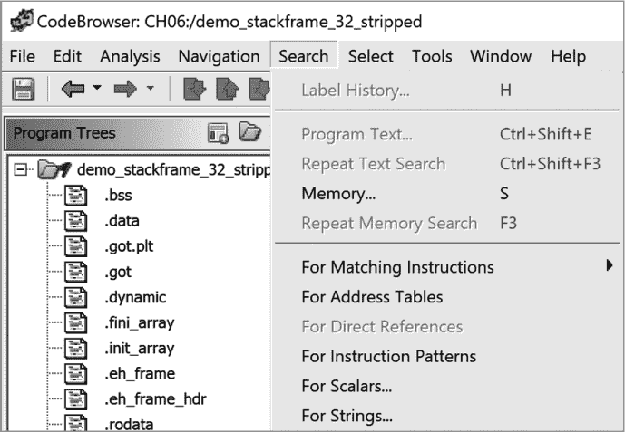

*图 6-11：Ghidra 搜索菜单选项*

#### *搜索程序文本*

Ghidra 的文本搜索实际上是通过反汇编列表视图进行的子字符串搜索。文本搜索通过“搜索 ▸ 程序文本”启动，这将打开图 6-12 所示的对话框。提供两种搜索类型：整个程序数据库，超出您在 CodeBrowser 窗口中看到的内容，以及 CodeBrowser 中的列表显示。除了搜索类型外，还有几个自解释选项，允许您选择搜索方式和搜索内容。

要在匹配项之间导航，可以使用“搜索程序文本”对话框底部的“下一项”和“上一项”按钮，或者选择“搜索全部”以在新窗口中打开搜索结果，方便地导航到任何匹配项。

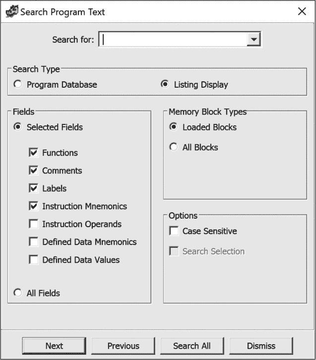

*图 6-12：搜索程序文本对话框*

**我命令你...**

搜索窗口是 Ghidra 中的一种窗口类型，你可以随意重命名它们，这将帮助你在实验过程中跟踪搜索窗口。要重命名窗口，只需右键点击标题栏并提供一个对你有意义的名称。一个实用的小技巧是将搜索字符串和助记符一起包含在名称中，以帮助你记住所选择的设置。

#### *搜索内存*

如果你需要搜索特定的二进制内容，比如已知的字节序列，那么文本搜索就不是答案。相反，你需要使用 Ghidra 的内存搜索功能。可以通过“搜索 ▸ 内存”或快捷键 S 来启动内存搜索。图 6-13 显示了搜索内存对话框。要搜索十六进制字节序列，搜索字符串应该指定为以空格分隔的两位数、不区分大小写的十六进制值列表，如`c9 c3`，如图 6-13 所示。如果你不确定十六进制序列，可以使用通配符（*或`?`）。

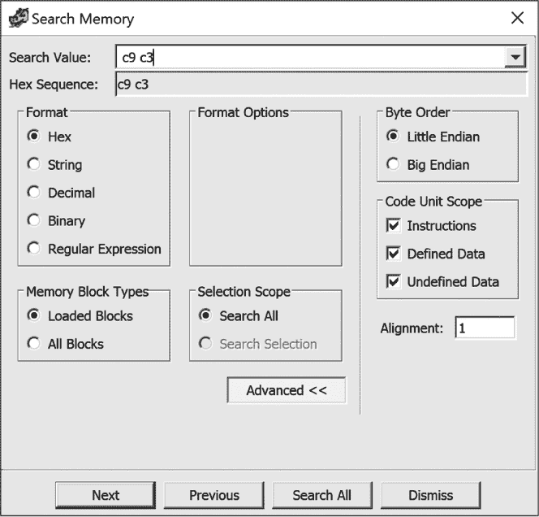

*图 6-13：搜索内存对话框*

搜索内存结果中的字节`c9 c3`，使用“搜索全部”选项运行，结果如图 6-14 所示。你可以对任何列进行排序，重命名窗口，或应用过滤器。此窗口还提供了一些右键选项，包括删除行和操作选择的功能。

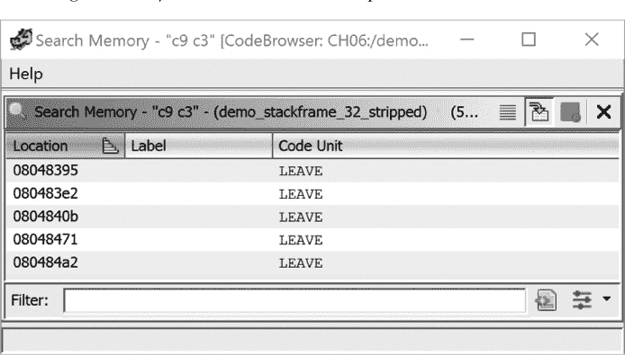

*图 6-14：搜索内存结果*

搜索值可以通过字符串、十进制、二进制和正则表达式格式输入。字符串、十进制和二进制各自提供了适合的格式选项。正则表达式让你能够搜索特定的模式，但由于处理方式的限制，它只能向前搜索。Ghidra 使用 Java 内建的正则表达式语法，相关内容在 Ghidra 帮助文档中有详细说明。

### 总结

本章的目的是为你提供有效解读 Ghidra 反汇编列表并进行导航的基本技能。你与 Ghidra 的绝大多数交互都将涉及到我们到目前为止讨论的操作。然而，能够执行基本的导航，理解堆栈等重要的反汇编结构，以及搜索反汇编，仅仅是逆向工程师技能的冰山一角。

在掌握这些技能后，下一步的逻辑是学习如何根据自己的需求使用 Ghidra。在下一章中，我们将开始研究如何根据对二进制内容和行为的理解，进行最基本的反汇编列表修改，从而添加新的知识。
