## 第九章：反汇编操作**


在导航之后，反汇编修改是 Ghidra 的下一个最重要功能。Ghidra 提供了轻松操作反汇编的能力，能够添加新信息或重新格式化列表以满足你的特定需求，并且由于 Ghidra 的底层结构，你对反汇编所做的更改会很容易地传播到所有相关的 Ghidra 视图，从而保持程序的一致视图。Ghidra 会自动处理诸如上下文感知的搜索和替换等操作（在合理的情况下），并且它能轻松地将指令重新格式化为数据，数据重新格式化为指令。而且，也许最好的功能是你几乎做的任何事情都可以撤销！

**我希望我没有做那件事**

成为软件逆向工程的高手的一部分是具备探索、实验的能力，并且在必要时，能够回溯并重新追溯自己的步骤。Ghidra 强大的撤销功能使你在 SRE 过程中可以灵活地撤销（和重做）操作。有多种方法可以访问这种神奇的功能：CodeBrowser 工具栏中的适当箭头图标 ➊➋，如图 7-1 所示；从 CodeBrowser 菜单中选择编辑 ▸ 撤销；以及使用热键 CTRL-Z 撤销和 CTRL-SHIFT-Z 重做。

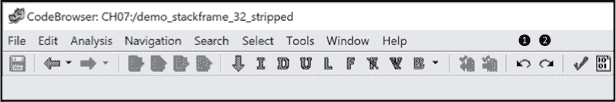

*图 7-1：CodeBrowser 工具栏中的撤销和重做图标*

### 操作名称和标签

到目前为止，我们已经在 Ghidra 反汇编中遇到了两类标识符：标签（与位置相关的标识符）和名称（与栈帧变量相关的标识符）。在大多数情况下，我们会将这两者统称为*名称*，因为 Ghidra 在这方面也有些模糊。（如果要非常精确，标签实际上有相关的名称、地址、历史记录等。标签的名称是我们通常引用标签的方式。）当这种区分至关重要时，我们会使用更具体的术语。

总结一下，栈变量名称有两种前缀，取决于变量是参数（`param_`）还是局部变量（`local_`），而位置在自动分析期间会分配有帮助的前缀的名称/标签（例如，`LAB_`、`DAT_`、`FUN_`、`EXT_`、`OFF_` 和 `UNK_`）。在大多数情况下，Ghidra 会根据它对相关变量或地址用途的最佳猜测自动生成名称和标签，但你仍然需要自己分析程序，理解位置或变量的目的。

当你开始分析任何程序时，最常见的处理反汇编列表的方法之一是将默认名称更改为更有意义的名称。幸运的是，Ghidra 允许你轻松更改任何名称，并且它会智能地将名称更改传播到整个程序中。要打开名称更改对话框，请点击名称，然后使用 L 快捷键或右键上下文菜单中的编辑标签选项。从这里开始，栈变量（名称）和命名位置（标签）的过程会有所不同，详情见后面的章节。

#### *重命名参数和局部变量*

与栈变量相关的名称并不与特定的虚拟地址相关联。与大多数编程语言一样，这些名称仅限于所属栈帧对应的函数作用域。因此，程序中的每个函数可以有一个名为`param_1`的栈变量，但没有任何函数可以有多个名为`param_1`的变量，如图 7-2 所示。

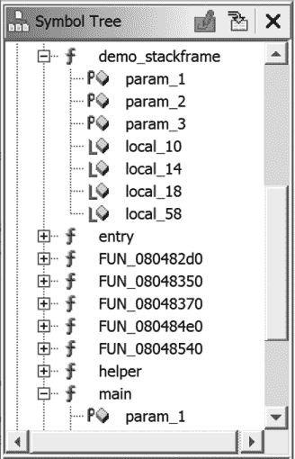

*图 7-2: 符号树显示参数名称的重用*（param_1）

当你在列出窗口中重命名变量时，图 7-3 中所示的提示对话框将弹出。你正在更改的实体类型（变量、函数等）将出现在窗口的标题栏中，而当前（即将更改的）名称将出现在可编辑文本框和标题栏中。

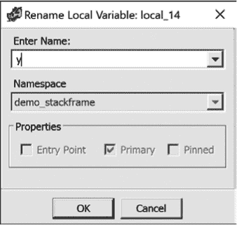

*图 7-3: 重命名栈变量*（local_14 改为 y）

一旦提供了新名称，Ghidra 将更改当前函数中所有旧名称的出现。以下列表显示了在`demo_stackframe`中将`local_14`重命名为`y`后的结果：

```
     *******************************************************************

     *                         FUNCTION                                *

     *******************************************************************

     undefined demo_stackframe(undefined param_1, undefined4

        undefined     AL:1              <RETURN>

        undefined     Stack[0x4]:1      param_1

        undefined4    Stack[0x8]:4      param_2      

        undefined4    Stack[0xc]:4      param_3      

        undefined4    Stack[-0x10]:4    local_10     

        undefined4    Stack[-0x14]:4    y➊           

        undefined4    Stack[-0x18]:4    local_18     

        undefined1    Stack[-0x58]:1    local_58     

     demo_stackframe    

08048473 55           PUSH   EBP

08048474 89 e5        MOV    EBP,ESP

08048476 83 ec 58     SUB    ESP,0x58

08048479 8b 45 10     MOV    EAX,dword ptr [EBP + param_3]

0804847c 89 45 f4     MOV    dword ptr [EBP + local_10],EAX

0804847f 8b 45 0c     MOV    EAX,dword ptr [EBP + param_2]

08048482 89 45 f0     MOV    dword ptr [EBP + y],EAX➋

08048485 c7 45 ec     MOV    dword ptr [EBP + local_18],0xa

         0a 00 00 00

0804848c c6 45 ac 41  MOV    byte ptr [EBP + local_58],0x41

08048490 83 ec 08     SUB    ESP,0x8

08048493 ff 75 f0     PUSH   dword ptr [EBP + y]➌

08048496 ff 75 ec     PUSH   dword ptr [EBP + local_18]

08048499 e8 88 ff     CALL   helper                        

         ff ff

0804849e 83 c4 10     ADD    ESP,0x10

080484a1 90           NOP

080484a2 c9           LEAVE

080484a3 c3           RET
```

这些更改➊➋➌也会反映在符号树中，如图 7-4 所示。

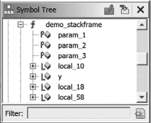

*图 7-4: 重命名栈变量后的符号树视图*，y

**禁止的名称**

有一些有趣的规则限制了你在函数内命名变量。以下是一些更相关的参数命名规则：

+   你*不能*在名称中使用前缀`param_`后跟一个整数，即使结果名称与现有参数名称不冲突。

+   你*可以*使用前缀`param_`，后跟其他字符。

+   你*可以*使用前缀`Param_`后跟一个整数，因为名称区分大小写（但这可能不建议这样做）。

+   你*可以*通过输入`param_`后跟一个整数值来将参数名称恢复为原始的 Ghidra 分配名称。如果使用原始的整数值，Ghidra 将无异常地恢复该名称。如果使用任何不同于原始值的整数，Ghidra 将警告“重命名失败——默认名称不可使用*.*”此时，在重命名参数对话框中点击取消将恢复原始名称。

+   你*可以*拥有两个参数，分别命名为`param_1`（由 Ghidra 命名）和`Param_1`（由你命名）。名称区分大小写，但不建议重复使用它们。

局部变量也区分大小写，你可以使用前缀`local_`和非数字后缀。

对于所有类型的变量，你*不能*使用已经在该范围内（例如，在同一个函数中）使用的变量名。你的尝试将会被对话框拒绝，并附有拒绝的理由。

最后，如果你对标签感到完全困惑，可以通过按快捷键 H，选择“显示所有历史记录”，并将变量的当前名称（或过去的名称）输入文本框来查看变量的标签历史。（此选项也可以通过主菜单中的“搜索 ▸ 标签历史”来访问。）

**你应该在哪里更改你的名字？**

变量名称可以从列表、符号树和反编译窗口中更改；结果是一样的，但从列表窗口访问的对话框会显示更多信息。使用任何这些方法时，都会强制执行与命名变量相关的所有规则。

本书中的许多示例参数名称都是在列表窗口中使用左侧所示对话框进行更改的，参见图 7-5。要在符号树中更改名称，请右键点击名称并从上下文菜单中选择**重命名**。在反编译窗口中，使用快捷键 L，或使用**重命名变量**上下文菜单选项；相应的对话框显示在图 7-5 的右侧。虽然这两个对话框提供相同的功能，但右侧对话框不包含与参数相关的命名空间或属性信息。

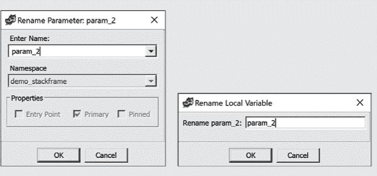

*图 7-5：从列表窗口或符号树（左）或反编译窗口（右）重命名变量*

在 Ghidra 中，*命名空间*只是一个命名的范围。在命名空间内，所有符号都是唯一的。全局命名空间包含二进制文件中的所有符号。函数命名空间嵌套在全局命名空间内。在函数命名空间内，所有变量名和标签都是唯一的。函数本身也可以包含嵌套的命名空间，例如与开关语句相关联的命名空间（这允许在不同的命名空间中重用 case 标签；例如，当一个函数包含两个开关语句，每个语句都有一个 case 10）。

#### *重命名标签*

标签是与位置相关联的默认或用户分配的名称。与堆栈变量一样，名称更改对话框可以通过快捷键 L 或上下文选项“编辑标签”打开。当你更改一个位置的名称时，还可以更改其命名空间和属性，如图 7-6 所示。

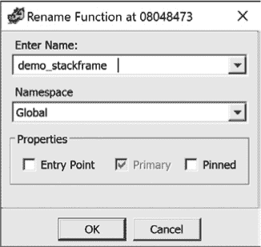

*图 7-6：重命名函数*

这个增强版对话框在标题栏中显示实体类型和虚拟地址。在属性下，你可以将地址标识为入口点或固定地址（参见“编辑标签”第 126 页）。如第六章所述，Ghidra 限制名称的最大长度为 2000 个字符，所以可以随意使用有意义的名称，甚至将关于该地址的叙述嵌入其中（不允许有空格）。如果名称过长，清单窗口将只显示部分名称，但反编译器窗口会显示完整名称。

#### *添加新标签*

虽然 Ghidra 会生成许多默认标签，但你也可以添加新标签并将它们与清单中的任何地址关联。这些标签可以用于注释你的反汇编，尽管在许多情况下，*注释*（本章后面会讨论）是更合适的方式。要添加新标签，请打开添加标签对话框（快捷键 L），如图 7-7 所示，针对与光标位置关联的地址。名称的下拉列表包含你最近使用的名称列表，而命名空间的下拉列表让你选择适当的标签范围。

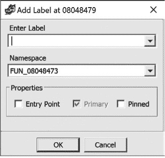

*图 7-7：添加标签对话框*

**FUN_ 与前缀**

当 Ghidra 在自动分析过程中创建标签时，它使用有意义的前缀后跟地址，告诉你在该位置会发生什么。这些前缀如下列出，并附有非常概括的描述。有关每个前缀的更多信息，可以在 Ghidra 帮助中找到。

LAB_address 代码——自动生成的标签（通常是函数内的跳转目标）

DAT_address 数据——自动生成的全局变量名称

FUN_address 函数——自动生成的函数名称

SUB_address 调用目标（或等效项）——可能不是函数

EXT_address 外部入口点——可能是其他人的函数

OFF_address 剪切片（位于现有数据或代码内部）——可能是反汇编错误

UNK_address 未知——无法确定此处数据的目的

函数标签具有以下特定行为：

+   如果你在清单窗口删除了默认的函数标签（例如 `FUN_08048473`），则 `FUN_` 前缀将被 `SUB_` 前缀替换（在这种情况下，结果为 `SUB_08048473`）。

+   向一个已有默认 `FUN_` 标签的地址添加新标签，会改变函数名称，而不是创建新标签。

+   标签区分大小写，因此你可以使用 `Fun_` 或 `fun_` 作为有效的前缀，如果你的目的是创建混淆的反汇编。

如果你尝试使用 Ghidra 的保留前缀来命名，可能会遇到冲突。如果你坚持使用一个保留前缀，Ghidra 会拒绝你的新标签，如果它认为可能会发生名称冲突。仅当 Ghidra 确定你的后缀看起来像一个地址时才会发生这种情况（根据我们的经验，这意味着四个或更多的十六进制数字）。例如，Ghidra 会允许 `FUN_zone` 和 `FUN_123`，但会拒绝 `FUN_12345`。此外，如果你尝试在与具有默认标签的函数相同的地址上添加标签（例如，`FUN_08048473`），Ghidra 会重命名该函数，而不是在该位置添加第二个标签。

#### *编辑标签*

要编辑标签，可以使用快捷键 L 或右键菜单中的“编辑标签”选项。编辑标签会呈现与添加标签相同的对话框，只不过对话框中的字段会初始化为现有标签的当前值。请注意，编辑标签可能会对共享相同地址的其他标签产生影响，无论它们是否共享相同的命名空间。例如，如果你将一个标签标识为入口点，Ghidra 会将与该位置关联的所有标签标识为入口点。

**这是一个 BUG 还是一个特性？**

在尝试修改函数名称的过程中，你可能会注意到，Ghidra 很乐意让你为两个函数设置相同的名称。这可能会让你联想到重载函数，可以通过传递给它们的参数来区分它们。Ghidra 的能力远不止于此：即使这导致在同一命名空间内出现重复的函数原型，你也可以给两个函数完全相同的名称。这是可能的，因为标签不是唯一的标识符（在数据库意义上是主键），因此即使与其相关的参数一起考虑，它也不能唯一标识一个函数。重复的名称可以用来标记函数；例如，用于对它们进行进一步分析或将它们排除在考虑之外。请记住，所有的名称都会保存在函数历史记录中（快捷键 H），并且可以轻松恢复。

图 7-7 中的主复选框表示这是当地址显示时将显示的标签。默认情况下，此复选框对主标签是禁用的，因此你不能取消选择主名称。这是必要的，以确保始终有一个名称可供显示。如果选择了另一个标签作为主标签，那么该标签的复选框将被禁用，其他标签在相同地址上的复选框将被启用。

尽管到目前为止，我们将标签与地址关联，但实际上标签最常见的用途是与拥有地址的内容相关联。例如，`main` 标签通常表示程序中主函数代码块的开始。Ghidra 会根据文件头信息为该位置分配一个地址。如果我们将整个二进制内容重新定位到新的地址范围，我们预计 `main` 标签会继续正确地关联到 `main` 的新地址及其对应的、未改变的字节内容。当一个标签被 *固定* 时，标签与其地址处内容的关联会被切断。如果你随后将二进制内容移动到新地址范围，任何固定的标签将不会相应移动，而是会固定在你固定它们时的地址。固定标签最常见的用途是为复位向量和内存映射的 I/O 地址命名，这些地址是由处理器/系统设计者指定的特定地址。

#### *移除标签*

要移除光标处的标签，你可以使用右键菜单选项（或快捷键 DELETE）。需要注意的是，并非所有标签都可以删除。首先，不可能删除默认的 Ghidra 生成标签。其次，如果你重命名了一个默认标签，并且后来决定删除这个新标签，Ghidra 会将你删除的标签替换为最初分配的默认标签（这是上一陈述的直接结果）。有关删除标签的更多细节，请参考 Ghidra 帮助文档。

#### *导航标签*

标签与可导航的位置相关联，因此双击标签的引用将带你跳转到该标签。虽然这一点在第九章中有更详细的讨论，但请记住，你可以在反汇编中为任何你希望导航到的位置添加标签。虽然在第 132 页的“注释”部分也描述了相同的功能，但有时候，标签（特别是它的 2000 字符限制）是实现同样目标的最快方法。

### 注释

将注释嵌入到反汇编和反编译器列表中，是在分析程序时为自己留下进展和发现备注的特别有用方式。Ghidra 提供了五种类型的注释，每种类型都适用于不同的目的。我们首先来看一下可以直接添加到反汇编中的注释，这些注释出现在列表窗口中。

尽管你可以通过右键菜单导航到“设置注释”对话框（见图 7-8），最快的方法是使用注释的快捷键，即分号（;）键。（这是一个合乎逻辑的选择，因为在许多汇编语言的变种中，分号是注释的标志。）

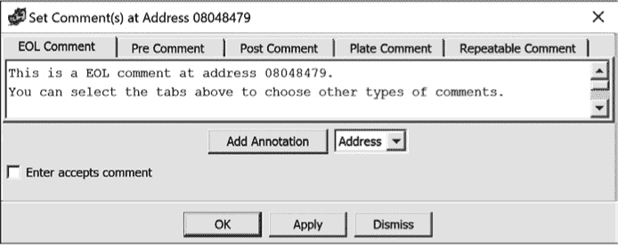

*图 7-8：设置注释对话框*

“设置评论”对话框会与特定地址一起打开：如图 7-8 中所示的`08048479`，并在标题栏中显示。输入到五个评论类别标签（EOL、Pre、Post、Plate 和 Repeatable Comments）中的任何内容都会与该地址关联。

默认情况下，你在文本框中输入内容，包括回车符，创建一个或多行的评论，然后点击**应用**或**确定**。（应用可以让你在上下文中查看评论，并保持“设置评论”对话框打开以便继续编辑。）为了节省输入简短评论的时间，可以在对话框左下角选择**回车键接受评论**复选框。（如果你写的是特别详细的板块评论，你随时可以暂时取消勾选此框。）

**这三个按钮**

在“设置评论”对话框底部的三个按钮（见图 7-8）中，OK 和 Apply 按钮的行为符合预期。点击 OK 会关闭对话框并提交更改。点击 Apply 会更新列表，方便你检查更改并决定是否批准或继续编辑评论。

然而，Dismiss 并不等同于 Cancel，Cancel 会退出对话框且对列表没有任何影响！这个独特的术语与其独特的行为一致。点击 Dismiss 按钮，如果没有修改任何评论，则立即退出窗口；如果修改了评论，则可以选择是否保存更改。使用右上角的 X 关闭窗口也会表现出相同的行为。这种 Dismiss 功能将在 Ghidra 的其他地方遇到。

要删除评论，可以在“设置评论”对话框中清除评论文本，或者当光标停在列表窗口的评论上时使用快捷键 DELETE。右键点击 Comments ▸ Show History for Comment 可以用来回顾与特定地址关联的评论，并根据需要恢复它们。

#### *行尾评论*

可能最常用的评论类型是*行尾（EOL）评论*，它们被放置在列表窗口现有行的末尾。要添加一个行尾评论，可以使用分号快捷键打开“设置评论”对话框并选择 EOL 评论标签。默认情况下，EOL 评论以蓝色文本显示，如果你在评论文本框中输入多行，它们会跨越多行。每一行会缩进对齐到反汇编的右侧，现有内容会被向下移动以腾出空间给新评论。你可以随时通过重新打开“设置评论”对话框来编辑评论。删除评论的最快方法是点击列表窗口中的评论并按 DELETE 键。

Ghidra 本身在自动分析过程中添加了许多 EOL 注释。例如，当你加载 PE 文件时，Ghidra 会插入描述 EOL 注释，用以描述`IMAGE_DOS_HEADER`部分的字段，包括`Magic number`注释。只有当 Ghidra 拥有与特定数据类型相关的信息时，才能做到这一点。这些信息通常包含在类型库中，在数据类型管理器窗口中显示，并在第八章和第十三章中深入讨论。在所有注释类型中，EOL 注释通过编辑 ▸ 工具选项 ▸ 列表字段选项对每个注释类型进行配置的能力最强。

#### *前置和后置注释*

*前置*注释和*后置*注释是完整行注释，分别出现在给定反汇编行的前后。以下示例显示了一个多行的前置注释和一个截断的单行后置注释，关联地址为`08048476`。将鼠标悬停在截断的注释上将显示完整的注释。默认情况下，前置注释以紫色显示，后置注释以蓝色显示，因此你可以轻松地将它们与列表中的正确地址关联。

```
08048473  PUSH   EBP

08048474  MOV    EBP,ESP

        ******** Pre Comment - This is a multi-line comment.

        ******** The following statement allocates 88 bytes of local

        ******** variable space in the stack frame.

08048476  SUB    ESP,0x58

        ******** Post Comment - Now that we have allocated the space...

08048479  MOV    EAX,dword ptr [EBP + param_3]
```

#### *板块注释*

*板块注释*允许你在列表窗口的任何位置分组显示注释。板块注释居中，并置于星号框住的矩形内。我们已经检查的许多列表都包含了一个简单的板块注释，框内写着`FUNCTION`，如图 7-9 所示。这个示例包括了右侧的反编译窗口，你可以看到，在这个默认展示中，一个板块注释已被插入到列表窗口中，但反编译窗口中没有对应的注释。

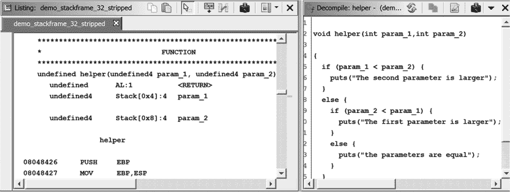

*图 7-9：板块注释示例*

当你在选择函数中的第一个地址时打开注释对话框，你可以选择用更具信息性的自定义注释替换默认的板块注释，如图 7-10 所示。除了替换默认的板块注释外，Ghidra 还会在反编译窗口顶部添加你的注释作为 C 风格注释。如果光标在创建板块注释时位于反编译窗口顶部，结果也是一样的。

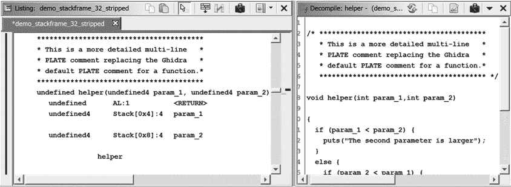

*图 7-10：自定义板块注释示例*

**注意**

*默认情况下，反编译窗口只显示板块注释和前置注释，但你可以通过编辑 ▸ 工具选项 ▸ 反编译器 ▸ 显示来更改此设置。*

#### *可重复的注释*

*可重复注释*是一次输入但可能在反汇编中许多位置自动出现的注释。可重复注释的行为与交叉引用的概念相关，交叉引用将在第九章中深入讨论。基本上，在交叉引用目标位置输入的可重复注释会在交叉引用源位置回显。因此，一个可重复注释可能会在反汇编的多个位置回显（因为交叉引用可以是多对一的）。在反汇编清单中，可重复注释的默认颜色为橙色，回显注释为灰色，这使它们与其他类型的注释区分开来。以下清单演示了可重复注释的使用。

```
08048432  JGE    LAB_08048446                  Repeatable comment at 08048446➊

08048434  SUB    ESP,0xc

08048437  PUSH   s_The_second_parameter_is_larger

0804843c  CALL   puts                          

08048441  ADD    ESP,0x10

08048444  JMP    LAB_08048470

        LAB_08048446                                              

08048446  MOV    EAX,dword ptr [EBP + param_2] Repeatable comment at 08048446➋
```

在清单中，`08048446` ➋ 位置设置了可重复注释，并在 `08048432` ➊ 位置重复出现，因为 `08048432` 位置的指令将地址 `08048446` 作为跳转目标（因此，从 `08048432` 到 `08048446` 存在交叉引用）。

当 EOL 注释和可重复注释共享相同的地址时，仅 EOL 注释会在清单中显示。两个注释都可以在“设置注释”对话框中查看和编辑。如果你删除 EOL 注释，则可重复注释将在清单中变为可见。

#### *参数和局部变量注释*

要将注释与堆栈变量关联，请选择堆栈变量并使用分号快捷键。图 7-11 显示了生成的最小注释窗口。该注释将以类似于 EOL 注释的格式显示在堆栈变量旁边。将鼠标悬停在注释上时，可以显示完整的注释。注释的颜色与变量类型的默认颜色相匹配，而不是 EOL 注释的蓝色默认颜色。

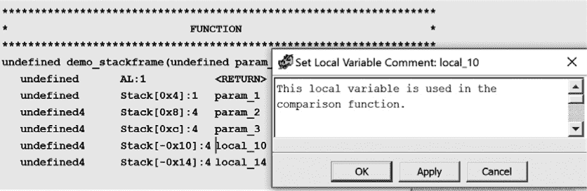

*图 7-11：堆栈变量注释*

#### *注释*

Ghidra 提供了一种强大的功能，可以在其“设置注释”对话框中为注释添加链接，链接可以指向程序、URL、地址和符号。当符号名称发生变化时，注释中的符号信息会自动更新。当你使用注释启动指定的可执行文件时，你还可以提供可选参数以获得更大的控制权限（是的，这对我们来说听起来也很危险）。

例如，图 7-12 中的板注释提供了一个指向清单中地址的超链接。关于注释强大功能的更多信息可以在 Ghidra 帮助中找到。

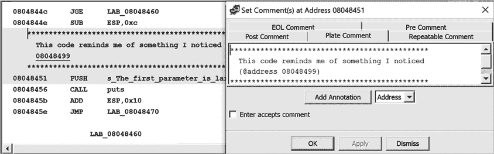

*图 7-12：地址注释示例*

### 基本代码转换

在许多情况下，您会对 Ghidra 生成的反汇编列表感到非常满意。然而，在某些情况下，您可能不会满意。当您分析的文件类型越来越远离普通可执行文件时，您可能需要更多地控制反汇编分析和显示过程。如果您分析的是混淆代码或使用了自定义（Ghidra 未知）文件格式的文件，这一点尤为重要。

Ghidra 支持以下代码转换（包括但不限于）：

+   更改代码显示选项

+   格式化指令操作数

+   操作函数

+   将数据转换为代码

+   将代码转换为数据

一般来说，如果二进制文件非常复杂，或者 Ghidra 不熟悉用于构建二进制文件的编译器生成的代码序列，那么在分析阶段，Ghidra 将遇到更多问题，您需要手动调整反汇编代码。

#### *更改代码显示选项*

Ghidra 允许对列表窗口中的行进行非常细粒度的格式控制。布局通过浏览器字段格式化器进行控制（在第五章中介绍）。选择浏览器字段格式化器图标会打开一个选项卡式显示，展示与您的列表相关的所有字段，如图 5-8 所示。您可以通过简单的拖放界面添加、删除和重新排列字段，并立即查看列表中的更改。列表字段项与关联的浏览器字段格式化器之间的紧密关联非常有用。每当您将光标移动到列表窗口中的新位置时，浏览器字段格式化器会自动移动相应的选项卡和字段，以便您可以立即识别与特定项相关的选项。有关浏览器字段格式化器的更多讨论，请参见第十二章中的“特殊工具编辑功能”。

要控制列表窗口中各个元素的显示方式，可以选择“编辑 ▸ 工具选项”，如第四章所述。每个字段在列表窗口中都有独特的子菜单，允许您根据个人喜好微调每个字段。虽然每个字段的功能不同，但通常您可以控制显示颜色、关联的默认值、配置和格式。例如，喜欢汇编代码并在闲暇时阅读的用户，可能会选择调整 EOL 注释字段区域的默认参数，如图 7-13 所示，启用“在每行开始处显示分号”选项，以便以熟悉的格式查看汇编注释。

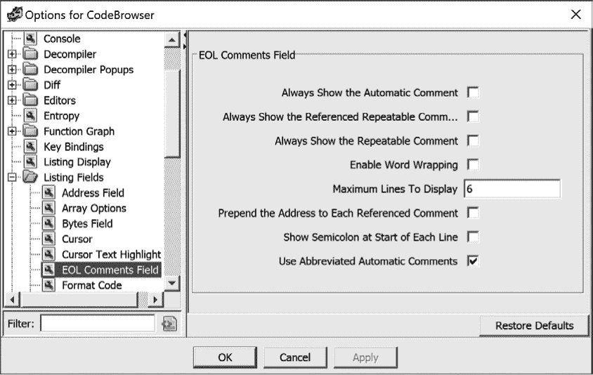

*图 7-13：EOL 注释字段的工具选项菜单*

若要为列表窗口中的单独行或较大范围的选择设置背景颜色，请通过右键点击上下文菜单选择“颜色”选项，并选择一种颜色。可用的颜色范围广泛，还提供了最近使用的颜色快速选择选项。通过相同的菜单，您还可以清除单行、选定区域或整个文件的背景颜色。

**注意**

*如果当前未为列表设置任何颜色，则清除选项不会显示。*

#### *格式化指令操作数*

在自动分析过程中，Ghidra 会做出许多关于如何格式化与每条指令相关的操作数的决定，尤其是各种整数常量，这些常量被各种指令类型广泛使用。其中，这些常量可能表示跳转或调用指令中的相对偏移、全局变量的绝对地址、算术运算中使用的值，或程序员定义的常量。为了提高反汇编的可读性，Ghidra 尽量使用符号名称而不是数字。

在某些情况下，格式化决定是根据被反汇编指令的上下文做出的（例如调用指令）；在其他情况下，决定是基于所使用的数据（例如访问全局变量或栈帧或结构中的偏移量）。通常，Ghidra 可能无法辨别常量使用的确切上下文。当这种情况发生时，常量通常以十六进制值的形式进行格式化。

如果你不是世界上少数几个以十六进制为生的人，你一定会欢迎 Ghidra 的操作数格式化功能。假设你的反汇编列表中有以下内容：

```
08048485  MOV    dword ptr [EBP + local_18],0xa

0804848c  MOV    byte ptr [EBP + local_58],0x41
```

右键点击十六进制常量`0x41`，会弹出如图 7-14 所示的上下文敏感菜单。（请参见图 6-7 查看此示例的上下文。）该常量可以按图中右侧显示的各种数字表示重新格式化，或者作为字符常量（因为该值也在 ASCII 可打印范围内）。这个功能非常有帮助，因为你可能没有意识到给定常量可以关联的多种表示方式。在所有情况下，菜单会显示如果选择某个选项，操作数文本将被替换的确切文本。

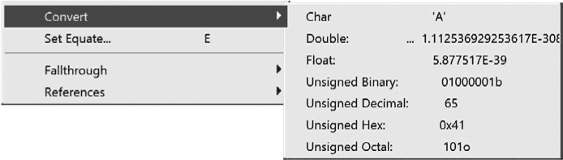

*图 7-14：常量的格式化选项*

在许多情况下，程序员在源代码中使用命名常量。这些常量可能是`#define`语句（或其等效语句）的结果，或者它们可能属于枚举常量集合。不幸的是，当编译器处理完源代码后，已经无法确定源代码使用的是符号常量还是文字常量。幸运的是，Ghidra 维护了一个包含许多常见库（如 C 标准库或 Windows API）关联的命名常量的大型目录。通过在与任何常量值相关的上下文菜单中选择“设置等式”选项（快捷键 E），可以访问此目录。选择常量`0xa`的“设置等式”选项后，会打开设置等式对话框（图 7-15）。

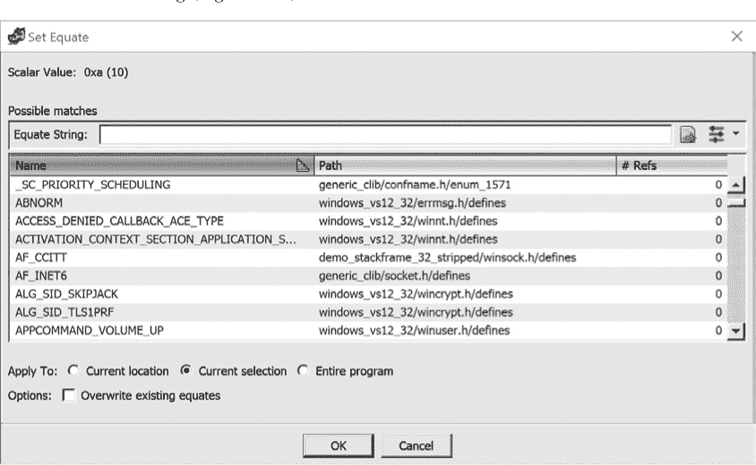

*图 7-15：设置等式对话框*

该对话框是从 Ghidra 的内部常量列表中填充的，经过筛选以符合我们正在尝试格式化的常量值。在这种情况下，我们可以滚动查看 Ghidra 已知的所有与值`0xA`相等的常量。如果我们确定该值与创建 X.25 风格的网络连接有关，我们可能会选择`AF_CCITT`，最终得到以下反汇编行：

```
08048485  MOV    dword ptr [EBP + local_18],AF_CCITT
```

标准常量列表非常有用，可以帮助确定特定常量是否与已知名称相关联，并节省大量时间浏览 API 文档寻找潜在匹配项。

#### *操作函数*

Ghidra 提供了在反汇编中操作函数的功能（例如，修正 Ghidra 识别为属于函数的代码，或更改函数属性），这在你不同意自动分析结果时尤其有用。在某些情况下，例如 Ghidra 无法找到函数调用时，可能会无法识别函数，因为没有显而易见的方式可以到达它们。在其他情况下，Ghidra 可能无法正确定位函数的结束位置，要求你修正反汇编。当编译器将函数分割到多个地址范围中，或在优化代码的过程中，编译器将两个或多个函数的常见结束序列合并以节省空间时，Ghidra 可能会很难找到函数的结束位置。

##### 创建新函数

可以通过现有的、不属于函数的指令创建新函数。创建函数的方法是右键点击将要包含在新函数中的第一条指令，并选择“创建函数”（或快捷键 F）。如果选择了一个范围，它将成为函数体。如果没有选择，Ghidra 将跟随控制流，试图确定函数体的边界。

##### 删除函数

您可以通过将光标放置在函数签名内并使用快捷键 DELETE 删除现有的函数。如果您认为 Ghidra 在自动分析时出错，或者您在创建函数时出错，您可能希望删除某个函数。请注意，尽管函数及其相关属性将不再存在，但底层字节内容不会发生任何变化，因此如果需要，可以重新创建该函数。

##### 编辑函数属性

Ghidra 为它识别的每个函数关联多个属性，您可以通过从 CodeBrowser 菜单中选择“窗口 ▸ 函数”选项来查看这些属性。（虽然默认只显示五个属性，但您可以通过右键单击列标题添加额外的 16 个属性。）要编辑这些属性，请在光标位于函数的板注释与函数反汇编代码开始前的最后一个局部变量之间的区域时，从右键上下文菜单中打开编辑函数对话框。编辑函数对话框的示例见图 7-16。

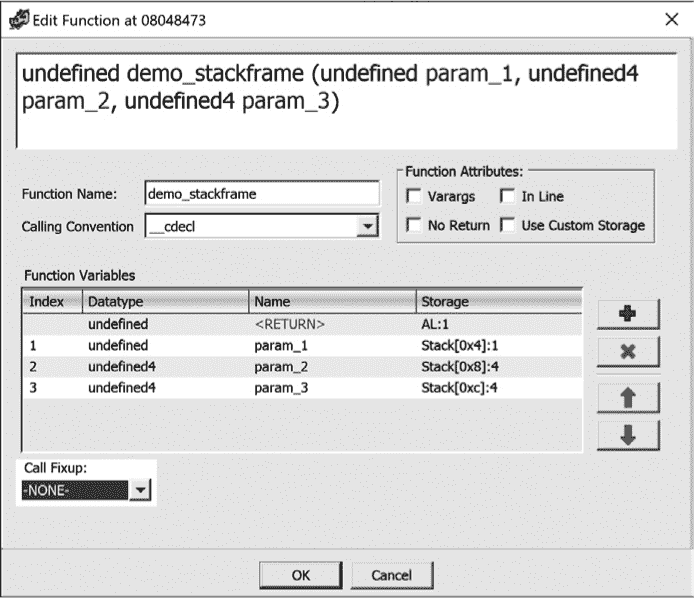

*图 7-16：编辑函数对话框*

通过此对话框可以修改的每个属性在这里进行了说明：

**函数名称**

您可以在对话框顶部的文本框中修改名称，也可以在“函数名称”字段中修改。

**函数属性**

在此区域可以启用五个可选的函数属性。前四个属性，Varargs、In Line、No Return 和 Use Custom Storage，默认为未选中复选框。第五个可选属性 Call Fixup 出现在对话框的左下角，默认为 `none`，并提供一个下拉菜单，您可以从中选择一个值。如果您修改了任何函数的属性，Ghidra 会自动将更新后的函数原型传播到所有可能显示该函数的反汇编位置。

可变参数（Varargs）选项表示函数接受可变数量的参数（例如，`printf`）。如果你在编辑函数参数列表（位于图 7-16 顶部的文本字段中），使得最后一个参数有省略号（...），也会启用可变参数。内联选项对反汇编分析没有影响，除了在函数原型中包含`inline`关键字。请注意，如果编译器实际内联了函数，你在反汇编中将看不到该函数作为一个独立实体，因为其主体将嵌入在调用它的函数体内部。无返回选项用于已知函数永远不会返回的情况（例如，使用`exit`或不透明谓词跳转到另一个函数）。当标记函数为无返回时，Ghidra 将不假定调用该函数后的字节是可达的，除非有其他证据支持其可达性，例如跳转指令指向这些字节。使用自定义存储选项允许你覆盖 Ghidra 对参数和返回值存储位置及大小的分析。

**调用约定**

调用约定下拉菜单允许你修改函数使用的调用约定。修改调用约定可能会改变 Ghidra 的堆栈指针分析，因此正确设置非常重要。

**函数变量**

函数变量区域允许你在指导下编辑函数变量。当你修改与变量相关的四列数据时，Ghidra 会提供信息，帮助你适当地进行更改。例如，尝试更改`param_1`的存储将显示消息：“启用‘使用自定义存储’以允许编辑参数和返回存储”。右侧的四个图标允许你添加、删除和导航变量。

#### *将数据转换为代码（反之亦然）*

在自动分析阶段，数据字节可能会被错误地分类为代码字节并解析为指令，或者代码字节可能会被错误地分类为数据字节并格式化为数据值。这种情况有多种原因，包括某些编译器将数据嵌入程序的代码部分，以及一些代码字节从未直接引用为代码，因此 Ghidra 选择不对其进行反汇编。特别是混淆程序通常故意模糊代码和数据之间的区别。（参见第二十一章。）

重新格式化任何内容的第一个选项是移除其当前的格式（代码或数据）。通过右键点击您希望取消定义的项目并选择“清除代码字节”（快捷键 C），可以取消定义函数、代码或数据。取消定义一个项目会使底层字节重新格式化为一系列原始字节值。通过使用点击并拖动操作选择一段地址范围，可以取消定义较大的区域。在下面的例子中，考虑一个简单的函数列表：

```
004013e0  PUSH   EBP

004013e1  MOV    EBP,ESP

004013e3  POP    EBP

004013e4  RET
```

取消定义该函数将产生一系列未分类的字节，如下所示，我们可以几乎以任何方式重新格式化它们：

```
004013e0      ??       55h    U

004013e1      ??       89h

004013e2      ??       E5h

004013e3      ??       5Dh    ]

004013e4      ??       C3h
```

要反汇编一系列未定义的字节，请右键点击第一个要反汇编的字节并选择 **反汇编**。这会导致 Ghidra 从该点开始递归下降算法。通过使用点击并拖动选择一段地址范围，可以将大区域转换为代码，在执行代码转换操作之前。

将代码转换为数据稍微复杂一些。首先，除非您先取消定义要转换为数据的指令，并且适当地格式化字节，否则不能通过右键菜单直接将代码转换为数据。基本数据格式化将在下一节中讨论。

### 基本数据转换

要理解程序的行为，正确格式化的数据与正确格式化的代码一样重要。Ghidra 从多个来源获取信息，并使用算法方法来确定在反汇编中最合适的数据格式。例如：

+   数据类型和/或大小可以通过寄存器的使用方式推断出来。一条从内存加载 32 位寄存器的指令意味着相关的内存位置包含一个 4 字节的数据类型（尽管我们可能无法区分 4 字节的整数和 4 字节的指针）。

+   可以使用函数原型为函数参数分配数据类型。Ghidra 维护了一个大型的函数原型库，正是为了这个目的。通过分析传递给函数的参数，试图将一个参数与一个内存位置关联。如果能揭示出这种关系，可以将数据类型应用于相关的内存位置。考虑一个函数，其唯一的参数是指向 `CRITICAL_SECTION`（Windows API 数据类型）的指针。如果 Ghidra 能确定传递给该函数的地址，则该地址可以被标记为 `CRITICAL_SECTION` 对象。

+   分析字节序列可以揭示可能的数据类型。这正是扫描二进制文件时发现字符串内容的情况。当遇到长序列的 ASCII 字符时，假设它们表示字符数组并不为过。

在接下来的几个部分中，我们将讨论一些您可以在反汇编中对数据进行的基本转换。

#### *指定数据类型*

Ghidra 提供了数据大小和类型说明符。最常见的说明符有 `byte`、`word`、`dword` 和 `qword`，分别表示 1 字节、2 字节、4 字节和 8 字节的数据类型。可以通过右键点击任何包含数据（不是指令）的反汇编行，并选择图 7-17 中显示的“设置数据类型”子菜单，来设置或更改数据类型。

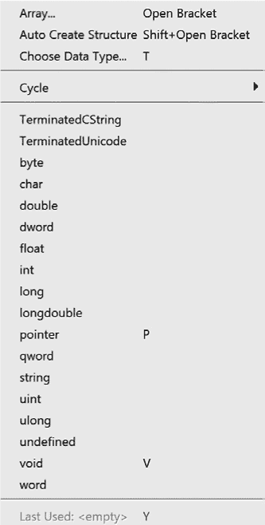

*图 7-17：数据子菜单*

此列表允许你通过选择数据类型立即更改当前选中项的格式和数据大小。循环选项让你能够快速循环浏览一组相关的数据类型，例如数字、字符和浮点类型，正如图 7-18 所示（带有关联热键）。例如，反复按 F 键将让你在 float 和 double 类型之间切换，因为它们是该循环组中的唯一项。

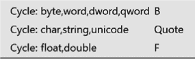

*图 7-18：循环组*

切换数据类型会导致数据项的大小发生变化，可能变大、变小或保持不变。如果数据项的大小保持不变，唯一可观察到的变化就是数据的格式。如果你将数据项的大小从 `ddw`（4 字节）减少到 `db`（1 字节），例如，任何额外的字节（本例中为 3 字节）将变为未定义。如果你增大数据项的大小，Ghidra 会警告你存在冲突，并引导你解决该冲突。一个涉及数组维度的示例见图 7-19。


*图 7-19：数组声明和警告示例*

#### *与字符串一起工作*

选择“搜索 ▸ 字符串”会弹出图 7-20 所示的对话框，在该对话框中可以设置和控制特定字符串搜索的搜索条件。虽然该窗口中的大多数字段不言自明，Ghidra 的一个独特功能是能够将 *字模型* 与搜索关联。字模型可用于确定在特定上下文中某个字符串是否被视为一个单词。字模型的详细讨论请参见第十三章。

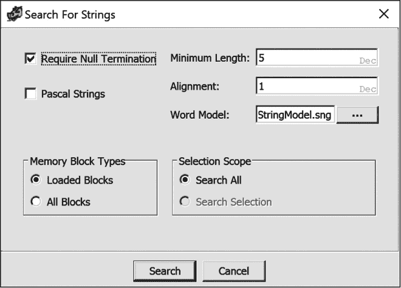

*图 7-20：搜索字符串对话框*

一旦搜索完成，结果将在字符串搜索窗口中显示（图 7-21）。后续的搜索结果将以标签页的形式展示在同一窗口中，窗口标题栏将包括每次搜索的时间戳，方便你按时间顺序排列。

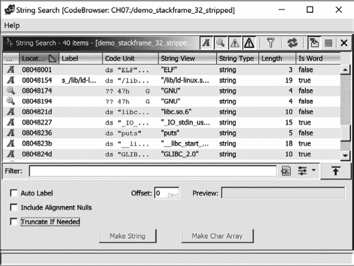

*图 7-21：显示搜索结果的字符串搜索窗口*

字符串搜索窗口的最左侧列包含表示字符串定义状态的图标（从未定义到冲突）。这些图标的含义如图 7-22 所示。要显示或隐藏某一类别中的字符串，可以在标题栏中切换相应的图标。

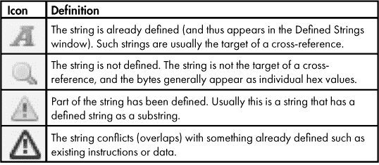

*图 7-22：字符串切换图标定义*

使用图标可以让你轻松识别列表中尚未定义为字符串的项目，并通过选择它们并点击相应的“Make String”或“Make Char Array”按钮，将它们转化为字符串或字符数组。这些新定义的实体将显示在“已定义字符串”窗口中，详情请参见 “已定义字符串窗口”中的第 81 页。

#### *定义数组*

来自高级语言的反汇编列表的一个缺点是，它们提供的数组大小线索非常少。在反汇编列表中，如果每个数组项都单独列在一行，数组可能会占用大量空间。以下列表显示了数据段中的一系列项目。唯一被指令引用的项目是列表中的第一个项，这表明它可能是数组中的第一个元素。数组中的其他元素通常不会直接被引用，而是通过相对于数组起始位置的索引计算进行引用。

```
        DAT_004195a4                          XREF[1]:  main:00411727(W)

004195a4    undefined4    ??

004195a8      ??          ??

004195a9      ??          ??

004195aa      ??          ??

004195ab      ??          ??

004195ac      ??          ??

004195ad      ??          ??

004195ae      ??          ??

004195af      ??          ??

004195b0      ??          ??

004195b1      ??          ??

004195b2      ??          ??

004195b3      ??          ??

004195b4      ??          ??

004195b5      ??          ??

004195b6      ??          ??
```

Ghidra 可以将连续的数据定义组合成一个数组定义。要创建数组，选择数组的第一个元素，并在上下文菜单中使用“数据 ▸ 创建数组”选项（快捷键）。系统会提示你输入数组的元素数量，或者你可以接受 Ghidra 建议的默认值。（如果你选择的是一个数据范围而不是单个值，Ghidra 会将你的选择作为数组的边界。）默认情况下，数组元素的数据类型和大小是基于选择中的第一个元素的数据类型。数组以折叠格式呈现，但可以展开查看各个元素。每行显示的元素数量可在 CodeBrowser 窗口的“编辑 ▸ 工具选项”中进行控制。关于数组的详细讨论，请参见[第八章。

### 总结

与前一章一起，本章涵盖了 Ghidra 用户最常需要执行的操作。反汇编操作让你能够将自己的知识与 Ghidra 在分析阶段提供的知识结合起来，从而生成有价值的信息。就像源代码一样，正确使用名称、分配数据类型以及详细的注释，不仅有助于你记住自己分析过的内容，还能极大地帮助其他使用你工作的人。在下一章中，我们将探讨如何处理更复杂的数据结构，比如 C 语言的`struct`，并研究一些编译后的 C++语言的低级细节。
