## 第十章：**数据类型与数据结构**


理解你在分析二进制时遇到的数据类型和数据结构是逆向工程的基础。传递给函数的数据是逆向工程函数签名的关键（即函数所需的参数数量、类型和顺序）。除此之外，在函数内部声明和使用的数据类型和数据结构为每个函数的作用提供了更多线索。这进一步强调了深入理解数据类型和数据结构在汇编语言级别上的表示和操作的重要性。

在本章中，我们将大量时间专注于这些对逆向工程工作至关重要的主题。我们将演示如何识别反汇编中使用的数据结构，并在 Ghidra 中建模这些结构。接下来，我们将展示 Ghidra 丰富的结构布局如何帮助你节省分析时间。由于 C++ 类是 C 结构的复杂扩展，本章最后将讨论如何进行已编译 C++ 程序的逆向工程。所以，让我们开始讨论在已编译程序中如何操作和定义简单与复杂的数据类型及结构。

### 数据解析

作为逆向工程师，你需要理解在反汇编中看到的数据。将特定数据类型与变量关联的最简单方法是观察该变量作为已知函数参数的使用情况。在分析阶段，Ghidra 会尽可能地注释数据类型，当它可以基于变量与 Ghidra 拥有原型的函数的使用关系来推导时。

通过导入的库函数，Ghidra 通常已经知道函数的原型。在这种情况下，你可以通过将鼠标悬停在 Listing 窗口或 Symbol Tree 窗口中的函数名称上，轻松查看该原型。当 Ghidra 无法识别函数的参数顺序时，至少应该知道函数是从哪个库中导入的（请参见 Symbol Tree 窗口中的 *Imports* 文件夹）。遇到这种情况时，学习函数签名和行为的最佳资源是任何相关的 man 页面或其他可用的 API 文档。如果一切都失败了，记住这句格言：“谷歌是你的朋友。”

理解二进制程序行为的低悬果实在于 cataloging（编目）程序调用的库函数。调用 `connect` 函数的 C 程序正在创建一个网络连接。调用 `RegOpenKey` 函数的 Windows 程序则是在访问 Windows 注册表。然而，为了理解这些函数的调用方式及原因，还需要进行额外的分析。

发现一个函数是如何被调用的需要了解与该函数相关的参数。我们来看看一个 C 程序，它调用 `connect` 函数来检索一个 HTML 页面。在调用 `connect` 时，程序需要知道托管该页面的服务器的 IP 地址和目标端口，这些信息通过一个名为 `getaddrinfo` 的库函数提供。Ghidra 识别出这是一个库函数，并在调用中添加了注释，在列表窗口中为我们提供了额外的信息，如下所示：

```
00010a30  CALL  getaddrinfo    int getaddrinfo(char * __name, c...
```

你可以通过几种方式获取更多关于此调用的信息。将鼠标悬停在指令右侧的简略注释上，可以看到 Ghidra 提供了完整的函数原型，帮助你理解函数调用中传递的参数。将鼠标悬停在符号树中的函数名称上，会在弹出窗口中显示函数原型和变量。或者，右键菜单中选择编辑功能会以可编辑格式提供相同的信息，如图 8-1 所示。如果你需要更多信息，可以使用数据类型管理器窗口查找特定参数的信息，如 `addrinfo` 数据类型。如果你点击了前述列表中的 `getaddrinfo`，你会看到图 8-1 中显示的内容会在列表中重复显示。（这属于一个 thunk 函数，具体讨论内容请参见 “Thunk” 在第 212 页的内容。）

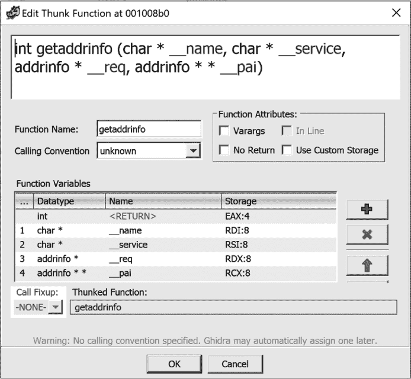

*图 8-1：getaddrinfo* 函数的编辑功能窗口

最后，你不需要通过符号树和数据类型管理器窗口来查看这些信息，因为反编译器已经在反编译器窗口中应用了这些信息。如果你查看反编译器窗口，你会看到 Ghidra 已经通过使用加载的类型库中的信息，为结构体 (`addrinfo`) 中包含的字段加入了成员名称。在这个示例中，在反编译器的以下代码摘录中，你可以看到成员名称 `ai_family` 和 `ai_socktype` 帮助我们理解 `local_48` 是在获取 `connect` 所需的信息时使用的结构体。在这种情况下，`ai_family` 的赋值表示正在使用 IPv4 地址（`2` 等同于符号常量 `AF_INET`），而 `ai_socktype` 表示使用的是流套接字（`1` 等同于符号常量 `SOCK_STREAM`）：

```
  local_48.ai_family = 2;

  local_48.ai_socktype = 1;

  local_10 = getaddrinfo(param_1,"www",&local_48,&local_18);
```

### 识别数据结构的使用

虽然原始数据类型通常适合存放在处理器的寄存器或指令操作数中，但复合数据类型如数组和结构体通常需要更复杂的指令序列来访问它们包含的各个数据项。在我们讨论 Ghidra 提供的用于提高复杂数据类型代码可读性的功能之前，我们需要回顾一下该代码的样子。

#### *数组成员访问*

*数组*是最简单的复合数据结构，就内存布局而言。传统上，数组是连续的内存块，包含相同数据类型的连续元素（同质集合）。数组的大小是数组中元素数量与每个元素大小的乘积。使用 C 语言的表示法，声明整数数组时所消耗的最小字节数是

```
int array_demo[100];
```

计算结果为

```
int bytes = 100 * sizeof(int); // or 100 * sizeof(array_demo[0])
```

通过提供一个索引值（该值可以是变量或常量），可以访问单个数组元素，如下所示的有效数组引用：

```
 ➊ array_demo[20] = 15;              // fixed index into the array

    for (int i = 0; i < 100; i++) {

     ➋ array_demo[i] = i;            // varying index into the array
```

假设为了举例，`sizeof(int)`是 4 个字节，那么第一次数组访问 ➊ 访问的是位于数组内 80 字节处的整数值，而第二次数组访问 ➋ 访问的是位于数组内偏移量为 0、4、8、... 96 字节处的整数值。第一次数组访问的偏移量可以在编译时计算为`20 * 4`。在大多数情况下，第二次数组访问的偏移量必须在运行时计算，因为循环计数器`i`的值在编译时并不固定。因此，`i * 4`的乘积会在每次循环时计算，以确定数组的确切偏移量。

最终，如何访问数组元素不仅取决于所使用的索引类型，还取决于数组在程序内存空间中的分配位置。

##### 全局分配数组

当数组在程序的全局数据区分配时（例如，在`.data`或`.bss`段内），编译器在编译时就知道数组的基地址，这使得编译器能够计算出任何通过固定索引访问的数组元素的固定地址。考虑以下简单程序，它通过固定和变量索引访问全局数组。

```
int global_array[3];

int main(int argc, char **argv) {

    int idx = atoi(argv[1]); //not bounds checked for simplicity

    global_array[0] = 10;

    global_array[1] = 20;

    global_array[2] = 30;

    global_array[idx] = 40;

}
```

**C 语言究竟在期待什么？**

为了简化，我们说 C 语言期望使用整数索引，无论是变量还是常量。实际上，任何可以计算为整数或被解释为整数的表达式都可以使用。一般准则是：“任何可以使用整数的地方，都可以使用一个能计算出整数的表达式。”当然，这并不仅限于整数。C 语言可以很好地评估你提供的任何表达式，并尝试使其与预期的变量类型兼容。如果值超出了数组的范围会怎样？当然，你就有了许多可以被利用的漏洞！值将会被读取或写入到超出范围的内存区域，或者如果计算出的目标地址在程序中无效，程序就会崩溃。

如果我们对相应的二进制文件进行反汇编，主函数包含以下代码：

```
          ...

00100657  CALL   atoi

0010065c  MOV    dword ptr [RBP + local_c],EAX

0010065f  MOV    dword ptr [DAT_00301018],10➊

00100669  MOV    dword ptr [DAT_0030101c],20➋

00100673  MOV    dword ptr [DAT_00301020],30➌

0010067d  MOV    EAX,dword ptr [RBP + local_c]

00100680  CDQE

00100682  LEA    RDX,[RAX*4]➍

0010068a  LEA    RAX,[DAT_00301018]➎

00100691  MOV    dword ptr [RDX + RAX*1]=>DAT_00301018,40➏

          ...
```

尽管这个程序只有一个全局变量（全局数组），但是反汇编结果的 ➊ ➋ ➌ 行似乎表明有三个全局变量：`DAT_00301018`、`DAT_0030101c` 和 `DAT_00301020`。然而，`LEA` 指令 ➎ 加载了之前看到的一个全局变量的地址 ➊。在这种情况下，当与偏移量计算（`RAX*4`） ➍ 和规模化内存访问 ➏ 结合时，`DAT_00301018` 很可能是一个全局数组的基地址。注释操作数 `=>DAT_00301018` ➏ 为我们提供了一个数组的基地址，值 40 将会写入该数组。

**什么是去除符号的二进制文件？**

当编译器生成目标文件时，它们必须包含足够的信息，以便链接器能够完成工作。链接器的一个任务是解析目标文件之间的引用，比如调用一个函数，而该函数的实现位于不同的文件中，并利用编译器生成的符号信息。在许多情况下，链接器会将目标文件中的所有符号表信息合并，并将合并后的信息包含在最终的可执行文件中。这些信息对于可执行文件的正确运行不是必需的，但从逆向工程的角度来看，它非常有用，因为 Ghidra（以及像调试器这样的其他工具）可以利用符号表信息恢复函数和全局变量的名称及大小。

*去除符号*一个二进制文件意味着移除可执行文件中对二进制运行操作不必要的部分。这可以通过使用命令行工具 `strip` 对可执行文件进行后处理，或者通过向编译器和/或链接器提供构建选项（对于 `gcc`/`ld` 来说是 `-s`）让它们自己生成一个去除符号的二进制文件来实现。除了符号表信息，`strip` 还可以移除任何调试符号信息，例如局部变量 `names` 和类型信息，这些信息是在构建二进制文件时嵌入其中的。缺少符号信息时，逆向工程工具必须拥有算法来识别和命名函数及数据。

基于 Ghidra 所分配的名称，我们知道全局数组从地址 `00301018` 开始，包含 12 个字节。在编译期间，编译器使用固定的索引（0、1、2）来计算数组中相应元素的实际地址（`00301018`、`0030101c` 和 `00301020`），这些地址分别由 ➊、➋ 和 ➌ 中的全局变量引用。根据写入这些位置的值，我们可以推测我们正在将 32 位整数（`dword`）值写入该数组。如果我们查看列表中相关的数据，看到以下内容：

```
        DAT_00301018

00301018      ??       ??

00301019      ??       ??

0030101a      ??       ??

0030101b      ??       ??

        DAT_0030101c

0030101c      ??       ??

0030101d      ??       ??

0030101e      ??       ??

0030101f      ??       ??

 DAT_00301020

00301020      ??       ??

00301021      ??       ??

00301022      ??       ??

00301023      ??       ??
```

问号表示该数组可能在程序的 `.bss` 区段中分配，并且文件镜像中没有初始化值。

当使用变量索引访问数组时，在反汇编中更容易识别数组。当使用常量索引访问全局数组时，相应的数组元素在反汇编中显示为全局变量。然而，使用变量索引值会在 ➎ 显示数组的基址，在 ➍ 显示单个元素的大小，因为访问数组时必须使用索引来计算偏移量。（这种缩放操作是必需的，用于将 C 中的整数数组索引转换为汇编语言中正确数组元素的字节偏移量。）

使用 Ghidra 中在前一章节讨论的类型和数组格式化操作（数据 ▸ 创建数组），我们可以将 `DAT_000301018` 格式化为一个三元素整数数组，从而在反汇编中显示带有名称的数组，使用索引而非偏移量访问：

```
00100660  MOV    dword ptr [INT_ARRAY_00301018],10

0010066a  MOV    dword ptr [INT_ARRAY_00301018[1]],20

00100674  MOV    dword ptr [INT_ARRAY_00301018[2]],30
```

Ghidra 分配的默认数组名称 `INT_ARRAY_00301018` 包括了数组类型以及数组的起始地址。

**更新注释中的符号信息**

当你开始识别数据类型、修改符号名称等时，你可以确保你在列表中添加的重要注释不会变得过时或难以理解，通过使用注释标注，这些标注会随着你更新符号而自动更新。`Symbol` 注释选项允许你包含符号引用，当你更改符号时，它们会自动更新，以准确反映你的发现。（请参见“注释”，见第 132 页）

让我们看看数组创建前后的反汇编窗口（图 8-2 和图 8-3）。在图 8-2 中，第 2 行的一个重要警告是另一个线索，提示你可能正在查看一个数组，并且整数值的赋值支持数组类型是整数的假设。

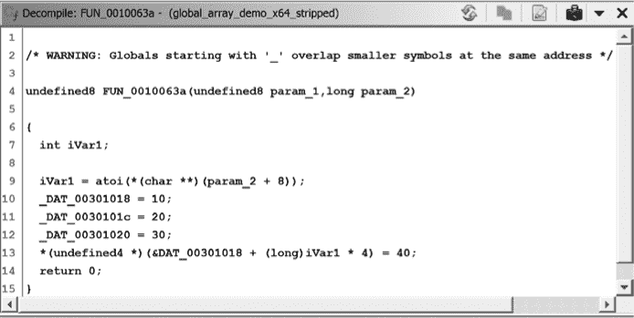

*图 8-2：反汇编窗口指示潜在的数组*

在创建整数数组后，反汇编窗口中的代码会更新为使用新的数组变量，如图 8-3 所示。

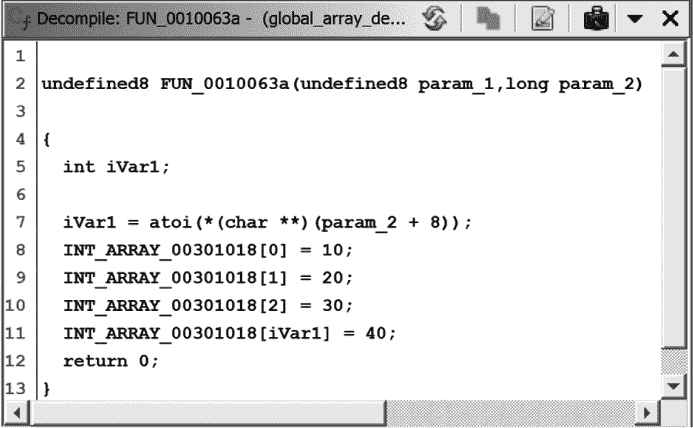

*图 8-3：声明数组类型后的反汇编窗口视图*

##### 堆栈分配的数组

编译器在编译时无法知道堆栈上分配的数组的绝对地址，因为它是函数中的局部变量，因此即使是使用常量索引的访问也需要在运行时进行计算。尽管有这些差异，编译器通常将堆栈分配的数组与全局分配的数组几乎一样对待。

以下程序是前一个示例的变体，它使用堆栈分配的数组，而不是全局数组：

```
int main(int argc, char **argv) {

   int stack_array[3];

   int idx = atoi(argv[1]); //bounds check omitted for simplicity

   stack_array[0] = 10;

   stack_array[1] = 20;

   stack_array[2] = 30;

   stack_array[idx] = 40;

}
```

`stack_array` 分配的地址在编译时是未知的，因此编译器无法像处理 `global_array[2]` 那样预计算 `stack_array[2]` 的地址。然而，编译器可以计算数组中任何元素的相对位置。例如，`stack_array[2]` 的元素从数组开头的偏移量 `2*sizeof(int)` 开始，编译器在编译时是清楚这一点的。如果编译器决定在堆栈帧中的偏移量 `EBP-0x18` 分配 `stack_array`，它可以计算 `EBP-0x18+2*sizeof(int)`，这在编译时会简化为 `EBP-0x10`，避免了在运行时访问 `stack_array[2]` 时需要额外的算术运算。这个过程在以下的列表中变得明显：

```
     undefined main()

        undefined     AL:1           <RETURN>

        undefined4    Stack[-0xc]:4  local_c➊

        undefined4    Stack[-0x10]:4 local_10

        undefined4    Stack[-0x14]:4 local_14

        undefined4    Stack[-0x18]:4 local_18

        undefined4    Stack[-0x1c]:4 local_1c

        undefined8    Stack[-0x28]:8 local_28

0010063a  PUSH   RBP

0010063b  MOV    RBP,RSP

0010063e  SUB    RSP,0x20

00100642  MOV➋  dword ptr [RBP + local_1c],EDI

00100645  MOV    qword ptr [RBP + local_28],RSI

00100649  MOV    RAX,qword ptr [RBP + local_28]

0010064d  ADD    RAX,0x8

00100651  MOV    RAX,qword ptr [RAX]

00100654  MOV    RDI,RAX

00100657  MOV    EAX,0x0

0010065c  CALL   atoi

00100661  MOV➌  dword ptr [RBP + local_c],EAX

00100664  MOV➍  dword ptr [RBP + local_18],10

0010066b  MOV    dword ptr [RBP + local_14],20

00100672  MOV    dword ptr [RBP + local_10],30

00100679  MOV    EAX,dword ptr [RBP + local_c]

0010067c  CDQE

0010067e  MOV    dword ptr [RBP + RAX*0x4 + -0x10],40➎

00100686  MOV    EAX,0x0

0010068b  LEAVE

0010068c  RET
```

检测这个数组比检测全局数组更困难。这个函数似乎有六个不相关的变量 ➊（`local_c`、`local_10`、`local_14`、`local_18`、`local_1c` 和 `local_28`），而不是一个包含三个整数和一个整数索引变量的数组。这些局部变量中的两个（`local_1c` 和 `local_28`）是函数的两个参数，`argc` 和 `argv`，它们被保存以便稍后使用 ➋。

使用常量索引值往往掩盖了堆栈分配数组的存在，因为你只会看到对单独局部变量的赋值 ➍。只有乘法 ➎ 暗示了存在一个数组，数组的每个元素都是 4 字节。我们来进一步分解这个表达式：`RBP` 保存堆栈帧基指针的地址；`RAX*4` 是数组索引（由 `atoi` 转换并存储在 `local_c` ➌）乘以数组元素的大小；`-0x10` 是从 `RBP` 开始到数组起始位置的偏移量。

将局部变量转换为数组的过程与在数据段中创建数组有所不同。由于堆栈结构信息与函数中的第一个地址相关联，你不能选择堆栈变量的子集。相反，将光标放置在数组起始位置的变量 `local_18` 上，右键点击并选择“设置数据类型”后选择“数组”选项，然后指定数组元素的数量。Ghidra 会显示关于与我们将局部变量拉入数组定义时冲突的警告信息，如图 8-4 所示。

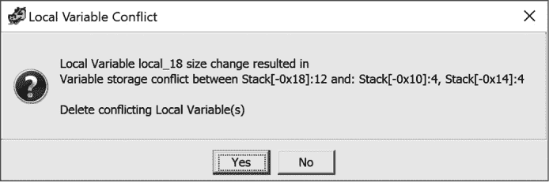

*图 8-4：定义堆栈数组时的潜在冲突警告*

如果继续操作，尽管存在潜在冲突，你仍然会在列表窗口中看到数组，如下所示：

```
          ...

00100664  MOV    dword ptr [RBP + local_18[0]],10

0010066b  MOV    dword ptr [RBP + local_18[1]],20

00100672  MOV    dword ptr [RBP + local_18[2]],30

          ...
```

即使在定义了数组之后，图 8-5 中的反编译器输出也与原始源代码不相似。反编译器省略了静态数组赋值操作，因为它认为这些操作对函数的结果没有贡献。调用`atoi`及其结果赋值依然保留，因为 Ghidra 无法计算调用`atoi`的副作用，但 Ghidra 错误地将`atoi`保存的结果误认为是数组的第四个元素（反汇编中的`local_c`，反编译器输出中的`iVar1`）。

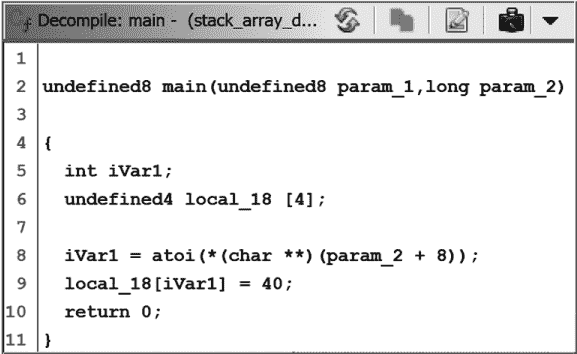

*图 8-5：数组定义后的所有栈变量反编译器视图*

##### 堆分配数组

*堆分配数组*是使用动态内存分配函数如`malloc`（C）或`new`（C++）分配的。从编译器的角度来看，处理堆分配数组的主要区别是，编译器必须基于内存分配函数返回的地址生成对数组的所有引用。以下是一个在程序堆中分配一个小数组的 C 程序：

```
int main(int argc, char **argv) {

   int *heap_array = (int*)malloc(3 * sizeof(int));

   int idx = atoi(argv[1]); //bounds check omitted for simplicity

   heap_array[0] = 10;

   heap_array[1] = 20;

   heap_array[2] = 30;

   heap_array[idx] = 40;

}
```

相应的反汇编比前两个例子稍微复杂一些：

```
     undefined main()

        undefined     AL:1              <RETURN>

        undefined8    Stack[-0x10]:8    heap_array

        undefined4    Stack[-0x14]:4    local_14

        undefined4    Stack[-0x1c]:4    local_1c

        undefined8    Stack[-0x28]:8    local_28

0010068a  PUSH   RBP

0010068b  MOV    RBP,RSP

0010068e  SUB    RSP,0x20

 00100692  MOV    dword ptr [RBP + local_1c],EDI

00100695  MOV    qword ptr [RBP + local_28],RSI

00100699  MOV    EDI,0xc➊

0010069e  CALL    malloc

001006a3  MOV    qword ptr [RBP + heap_array],RAX➋

001006a7  MOV    RAX,qword ptr [RBP + local_28]

001006ab  ADD    RAX,0x8

001006af  MOV    RAX,qword ptr [RAX]

001006b2  MOV    RDI,RAX

001006b5  CALL    atoi

001006ba  MOV    dword ptr [RBP + local_14],EAX

001006bd  MOV    RAX,qword ptr [RBP + heap_array]

001006c1  MOV    dword ptr [RAX],10➌

001006c7  MOV    RAX,qword ptr [RBP + heap_array]

001006cb  ADD    RAX,0x4➍

001006cf  MOV    dword ptr [RAX],20

001006d5  MOV    RAX,qword ptr [RBP + heap_array]

001006d9  ADD    RAX,0x8➎

001006dd  MOV    dword ptr [RAX],30

001006e3  MOV    EAX,dword ptr [RBP + local_14]

001006e6  CDQE

001006e8  LEA    RDX,[RAX*0x4]➏

001006f0  MOV    RAX,qword ptr [RBP + heap_array]

001006f4  ADD➐  RAX,RDX

001006f7  MOV    dword ptr [RAX],40

001006fd  MOV    EAX,0x0

00100702  LEAVE

00100703  RET
```

数组的起始地址（由`malloc`返回并存储在`RAX`寄存器中）被保存在局部变量`heap_array` ➋中。在这个例子中，与前面的例子不同，每次访问数组时都会先读取`heap_array`的内容以获取数组的基地址。对`heap_array[0]`、`heap_array[1]`和`heap_array[2]`的引用分别需要 0 ➌、4 ➍和 8 字节的偏移 ➎。对数组索引的访问`heap_array[idx]`通过多条指令实现，首先将数组索引与数组元素的大小相乘 ➏，然后将结果加到数组的基地址 ➐。

堆分配的数组有一个特别好的特性：可以通过数组的总大小和每个元素的大小计算出分配给数组的元素个数。传递给内存分配函数的参数（这里是传给`malloc`的`12` ➊）告诉你分配给数组的字节数。将这个值除以元素的大小（在这个例子中是 4 字节，从偏移量➌ ➍ ➎可以观察到，步长是 4，而比例因子➏也表明这一点）就能得出数组中的元素数量。在这个例子中，分配了一个三元素的数组。

如图 8-6 所示，反编译器也能识别该数组。（数组指针的名称`puVar2`表明它是一个指向无符号整数的指针，前缀`pu`表示这一点。）

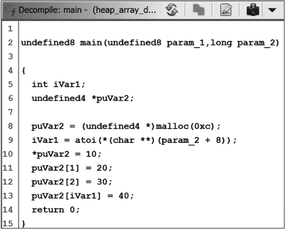

*图 8-6：堆数组函数的反编译器视图*

在这个函数中，与栈分配的数组函数不同，反编译器列出了常量索引数组的赋值，即使它通常会排除这些赋值，因为数组没有在其他操作中使用或从函数中返回。这个情况不同，因为这些赋值*不是*仅仅操作栈变量：栈变量实际上是一个指向堆上由`malloc`请求的内存的指针。通过这个变量写入数据并不是写入到本地栈变量，而是通过栈变量来定位已分配的内存。程序可能会在函数退出时丢失该指针（堆数组起始地址），但值会继续保存在内存中。（这个具体的例子实际上是一个内存泄漏的演示。虽然这不是一个好的编程实践，但它确实让我们展示了堆数组的概念。）

总之，当一个变量作为数组的索引使用时，数组最容易被识别。数组访问操作需要将索引乘以数组元素的大小，再将结果偏移量加到数组的基地址，这一点在反汇编列表中非常明显。

#### *结构体成员访问*

C 风格的结构体，通常在这里称为*结构体*，将（通常是异质的）数据项集合成复合数据类型。在源代码中，结构体中的数据字段是通过名称访问的，而不是通过索引。不幸的是，这些有用的字段名称在编译时被转换为数字偏移量，因此当你查看反汇编时，结构体字段的访问与使用常量索引访问数组元素非常相似。

以下是包含五个异质字段的结构定义，将在接下来的示例中使用：

```
struct ch8_struct {     //Size  Minimum offset  Default offset

    int    field1;      //  4       0            0

    short  field2;      //  2       4            4

    char   field3;      //  1       6            6

    int    field4;      //  4       7            8

    double field5;      //  8       11           16

};                      // Minimum total size: 19 Default size: 24
```

当编译器遇到结构体定义时，它会持续跟踪结构体各个字段占用的字节数，以确定每个字段在结构体中的偏移量。分配每个字段所需的空间总和决定了结构体所需的最小空间。然而，你不应当假设编译器会使用最小所需空间来分配结构体。默认情况下，编译器会将结构体字段对齐到最有效的内存地址，以便最有效地读写这些字段。例如，4 字节的整型字段会对齐到能被四整除的偏移量，而 8 字节的双精度浮点数则会对齐到能被八整除的偏移量。根据结构体的组成，编译器可能会插入填充字节来满足对齐要求，这意味着结构体的实际大小会比其组件字段的大小总和大。样本结构的默认偏移量和结果结构大小可以在前述结构定义的注释中的默认偏移量列中看到，它们的总和为 24，而不是最小的 19。

通过使用编译器选项请求特定的成员对齐方式，可以将结构打包到所需的最小空间中。Microsoft C/C++ 和 GNU `gcc`/`g++` 都识别 `pack` 编译指令来控制结构字段对齐。GNU 编译器还识别 `packed` 属性，用于按结构单独控制结构对齐。请求对结构字段进行 1 字节对齐会导致编译器将结构压缩到所需的最小空间。样本结构的偏移量和结构大小可以在最小偏移量列中找到。（请注意，某些处理器在数据按其类型对齐时表现更好，而其他处理器则可能在数据*未*按特定边界对齐时产生异常。）

记住这些事实后，我们来看编译后的代码中结构的处理方式。与数组一样，访问结构成员的方式是将结构的基地址与所需成员的偏移量相加。然而，虽然数组的偏移量可以根据提供的索引值在运行时计算（因为数组中的每个元素大小相同），但结构的偏移量必须在编译时计算，并且在编译后的代码中将显示为固定的结构偏移量，这些偏移量与使用常量索引的数组引用几乎一模一样。

在 Ghidra 中创建结构比创建数组更为复杂，因此我们将在下一节中讲解该内容，在展示几个反汇编和反编译的结构示例后进行说明。

##### 全局分配结构

与全局分配的数组一样，全局分配的结构的地址在编译时已知。这使得编译器能够在编译时计算结构中每个成员的地址，从而避免在运行时进行任何计算。考虑以下程序，它访问一个全局分配的结构：

```
struct ch8_struct global_struct;

int main() {

    global_struct.field1 = 10;

    global_struct.field2 = 20;

    global_struct.field3 = 30;

    global_struct.field4 = 40;

    global_struct.field5 = 50.0;

}
```

如果该程序使用默认的结构对齐选项进行编译，那么我们可以期待在反汇编时看到如下所示的结果：

```
     undefined main()

        undefined     AL:1              <RETURN>

001005fa  PUSH   RBP

001005fb  MOV    RBP,RSP

001005fe  MOV    dword ptr [DAT_00301020],10

00100608  MOV    word ptr [DAT_00301024],20

00100611  MOV    byte ptr [DAT_00301026],30

00100618  MOV    dword ptr [DAT_00301028],40

00100622  MOVSD  XMM0,qword ptr [DAT_001006c8]

0010062a  MOVSD  qword ptr [DAT_00301030],XMM0

00100632  MOV    EAX,0x0

00100637  POP    RBP

00100638  RET
```

该反汇编中没有进行任何数学运算来访问结构的成员，并且如果没有源代码，我们无法确定是否确实使用了结构。因为编译器在编译时已经完成了所有的偏移量计算，这个程序看起来像是在引用五个全局变量，而不是一个结构中的五个字段。你应该能注意到，这与之前使用常量索引值的全局分配数组的示例有很多相似之处。

在 图 8-2 中，均匀的偏移量和相应的值使我们能够准确推测我们正在处理的是一个数组。在这个示例中，我们可以正确地得出结论，我们没有在处理一个数组，因为变量的大小是不均匀的（分别是 `dword`、`word`、`byte`、`dword` 和 `qword`），但我们缺乏足够的证据来断言我们正在处理的是一个结构。

##### 栈分配结构体

和栈分配的数组一样，单凭栈布局很难识别栈分配的结构体，反编译器也无法提供额外的洞察。修改前面的程序以使用在`main`中声明的栈分配结构体，得到如下反汇编结果：

```
     undefined main()

        undefined     AL:1              <RETURN>

        undefined8    Stack[-0x18]:8    local_18

        undefined4    Stack[-0x20]:4    local_20

        undefined1    Stack[-0x22]:1    local_22

        undefined2    Stack[-0x24]:2    local_24

        undefined4    Stack[-0x28]:4    local_28

001005fa  PUSH   RBP

001005fb  MOV    RBP,RSP

001005fe  MOV    dword ptr [RBP + local_28],10

00100605  MOV    word ptr [RBP + local_24],20

0010060b  MOV    byte ptr [RBP + local_22],30

0010060f  MOV    dword ptr [RBP + local_20],40

00100616  MOVSD  XMM0,qword ptr [DAT_001006b8]

0010061e  MOVSD  qword ptr [RBP + local_18],XMM0

00100623  MOV    EAX,0x0

00100628  POP    RBP

00100629  RET
```

同样，访问结构体字段时不进行任何数学运算，因为编译器可以在编译时确定每个字段在堆栈帧中的相对偏移量，我们得到的依然是一个可能具有误导性的图像——看起来像是使用了五个独立的变量，而不是一个包含五个不同字段的单一变量。实际上，`local_28`应该是一个 24 字节结构体的起始位置，其他变量应该以某种方式格式化，反映它们是结构体中的字段。

##### 堆分配的结构体

堆分配的结构体揭示了结构体的大小和字段布局的更多信息。当一个结构体在程序堆中分配时，编译器别无选择，只能生成代码，在每次访问字段时计算正确的字段地址，因为结构体的地址在编译时是未知的。对于全局分配的结构体，编译器能够计算出固定的起始地址。对于栈分配的结构体，编译器可以计算出结构体起始地址与包含该栈帧的栈指针之间的固定关系。当结构体在堆中分配时，编译器唯一能访问的结构体引用就是指向结构体起始地址的指针。

为了演示堆分配的结构体，我们修改示例程序，在`main`中声明一个指针，并将其指向足够大的内存块，以容纳该结构体：

```
int main() {

    struct ch8_struct *heap_struct;

    heap_struct = (struct ch8_struct*)malloc(sizeof(struct ch8_struct));

    heap_struct->field1 = 10;

    heap_struct->field2 = 20;

    heap_struct->field3 = 30;

    heap_struct->field4 = 40;

    heap_struct->field5 = 50.0;

}
```

这是对应的反汇编：

```
     undefined main()

        undefined     AL:1              <RETURN>

        undefined8    Stack[-0x10]:8    heap_struct

0010064a  PUSH   RBP

0010064b  MOV    RBP,RSP

0010064e  SUB    RSP,16

00100652  MOV    EDI,24➊

00100657  CALL   malloc

0010065c  MOV    qword ptr [RBP + heap_struct],RAX

00100660  MOV    RAX,qword ptr [RBP + heap_struct]

00100664  MOV    dword ptr [RAX],10➋

0010066a  MOV    RAX,qword ptr [RBP + heap_struct]

0010066e  MOV    word ptr [RAX + 4],20➌

00100674  MOV    RAX,qword ptr [RBP + heap_struct]

00100678  MOV    byte ptr [RAX + 6],30➍

0010067c  MOV    RAX,qword ptr [RBP + heap_struct]

00100680  MOV    dword ptr [RAX + 8],40➎

00100687  MOV    RAX,qword ptr [RBP + heap_struct]

0010068b  MOVSD  XMM0,qword ptr [DAT_00100728]

00100693  MOVSD  qword ptr [RAX + 16],XMM0➏

00100698  MOV    EAX,0x0

0010069d  LEAVE

0010069e  RET
```

在这个例子中，我们可以分辨出结构体的确切大小和布局。结构体的大小可以通过`malloc`请求的内存量推测为 24 字节 ➊。结构体包含以下字段，位于指定的偏移量：

+   偏移量为 0 的一个 4 字节（`dword`）字段 ➋

+   偏移量为 4 的一个 2 字节（`word`）字段 ➌

+   偏移量为 6 的一个 1 字节字段 ➍

+   偏移量为 8 的一个 4 字节（`dword`）字段 ➎

+   偏移量为 16 的一个 8 字节（`qword`）字段 ➏

基于浮点数指令（`MOVSD`）的使用，我们进一步推测，`qword`字段实际上是一个`double`类型。

使用 1 字节对齐打包结构体的同一程序编译结果如下：

```
0010064a  PUSH    RBP

0010064e  SUB    RSP,16

00100652  MOV    EDI,19

00100657  CALL   malloc

0010065c  MOV    qword ptr [RBP + local_10],RAX

00100660  MOV    RAX,qword ptr [RBP + local_10]

00100664  MOV    dword ptr [RAX],10

0010066a  MOV    RAX,qword ptr [RBP + local_10]

0010066e  MOV    word ptr [RAX + 4],20

00100674  MOV    RAX,qword ptr [RBP + local_10]

00100678  MOV    byte ptr [RAX + 6],30

0010067c  MOV    RAX,qword ptr [RBP + local_10]

00100680  MOV    dword ptr [RAX + 7],40

00100687  MOV    RAX,qword ptr [RBP + local_10]

0010068b  MOVSD  XMM0,qword ptr [DAT_00100728] =

00100693  MOVSD  qword ptr [RAX + 11],XMM0

00100698  MOV    EAX,0x0

0010069d  LEAVE

0010069e  RET
```

唯一的变化是结构体的大小变小（现在为 19 字节），并且为了适应每个结构体字段的重新对齐，偏移量进行了调整。

无论编译程序时使用了什么对齐方式，找到程序堆中分配和操作的结构体是确定给定数据结构大小和布局的最快方式。然而，请记住，许多函数不会直接访问结构体的每个成员来帮助你理解结构体的布局。相反，你可能需要跟踪指向结构体的指针，并注意每当该指针被解引用时所使用的偏移量，最终拼凑出结构体的完整布局。在第 437 页的“示例 3：自动化结构体创建”中，你将看到反编译器如何自动化这一过程。

##### 结构体数组

一些程序员认为，复合数据结构的美妙之处在于，它们允许通过将较小的结构体嵌套在较大的结构体中，构建任意复杂的结构体：例如，结构体数组、结构体内嵌结构体、以及包含数组作为成员的结构体。之前关于数组和结构体的讨论同样适用于这些嵌套类型。例如，考虑以下简单程序，其中`heap_struct`指向一个包含五个`ch8_struct`项的数组：

```
int main() {

    int idx = 1;

    struct ch8_struct *heap_struct;

 heap_struct = (struct ch8_struct*)malloc(sizeof(struct ch8_struct) * 5);

    heap_struct[idx].field1 = 10;

}
```

在底层，访问`field1`涉及将索引值乘以数组元素的大小（在这种情况下，结构体的大小），然后将偏移量加到所需的字段上。对应的反汇编结果如下所示：

```
     undefined main()

        undefined     AL:1              <RETURN>

        undefined4    Stack[-0xc]:4     idx

        undefined4    Stack[-0x18]:8    heap_struct

0010064a  PUSH   RBP

0010064b  MOV    RBP,RSP

0010064e  SUB    RSP,16

00100652  MOV    dword ptr [RBP + idx],1

00100659  MOV➊  EDI,120

0010065e  CALL   malloc

00100663  MOV    qword ptr [RBP + heap_struct],RAX

00100667  MOV    EAX,dword ptr [RBP + idx]

0010066a  MOVSXD RDX,EAX

0010066d  MOV➋  RAX,RDX

00100670  ADD    RAX,RAX

00100673  ADD    RAX,RDX

00100676  SHL➌  RAX,3

0010067a  MOV    RDX,RAX

0010067d  MOV    RAX,qword ptr [RBP + heap_struct]

00100681  ADD➍  RAX,RDX

00100684  MOV➎  dword ptr [RAX],10

0010068a  MOV    EAX,0

0010068f  LEAVE

00100690  RET
```

该函数在堆中分配了 120 字节➊。`RAX`中的数组索引通过一系列操作乘以 24➋，最后以`SHL RAX, 3` ➌结束，然后将结果加到数组的起始地址➍。（如果你不太清楚从➋开始的操作序列等同于乘以 24，不用担心，类似的代码序列在第二十章中有详细讨论。）由于`field1`是结构体的第一个成员，因此无需额外的偏移量即可生成分配到`field1`的最终地址➎。

从这些事实中，我们可以推导出数组项的大小（24），数组中的项数（120 / 24 = 5），以及每个数组元素在偏移量 0 处有一个 4 字节（`dword`）字段。这个简短的列表没有提供足够的信息来得出关于每个结构体中剩余 20 字节如何分配给其他字段的结论。使用反编译器列出的图 8-7 中的相同公式，我们可以更容易地推导出数组的大小（0x18 十六进制是 24 十进制）。

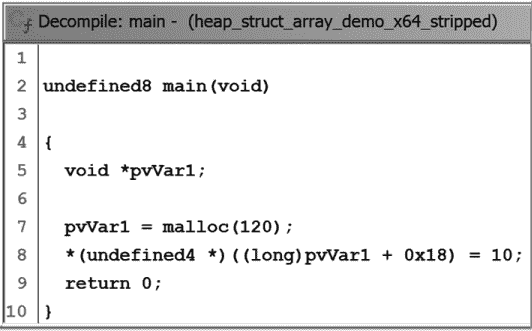

*图 8-7：带有堆分配结构体数组的函数反编译视图*

### 使用 Ghidra 创建结构体

在上一章中，你看到如何使用 Ghidra 的数组聚合功能，将长列表的数据声明折叠成表示数组的单一反汇编行。接下来的几节将探讨 Ghidra 提供的功能，以提高操作结构的代码的可读性。我们的目标是避免使用像 `[EDX + 10h]` 这样的晦涩结构引用，转而使用更易读的方式，比如 `[EDX + ch8_struct.field_e]`。

每当你发现程序在操作数据结构时，你需要决定是否要将结构字段名称包含到你的反汇编中，还是你可以理解反汇编列表中散布的所有数字偏移量。在某些情况下，Ghidra 可能会识别出一个作为 C 标准库或 Windows API 一部分定义的结构，并利用它对该结构的精确布局的了解，将数字偏移量转换为符号字段名。这是理想的情况，因为它会减少你需要做的工作。我们将在你更深入了解 Ghidra 如何处理结构定义后，再回到这个场景。

#### *创建新结构*

当 Ghidra 没有某个结构的布局知识时，你可以通过选择数据并使用右键上下文菜单来创建该结构。当你选择 数据 ▸ 创建结构（或使用快捷键 SHIFT-）时，你将看到如[图 8-8 所示的“创建结构”窗口。由于你已高亮选中一块数据（无论它是已定义还是未定义），Ghidra 会尝试识别是否有现有结构具有匹配的格式或相同的大小。你可以从窗口中选择现有结构之一，或者创建一个新结构。在这个例子中，我们使用了之前讨论的全局分配结构示例代码，并创建了一个名为`ch8_struct`的新结构。点击“确定”后，该结构将成为数据类型管理器窗口中的官方类型，且信息会传播到其他 CodeBrowser 窗口。

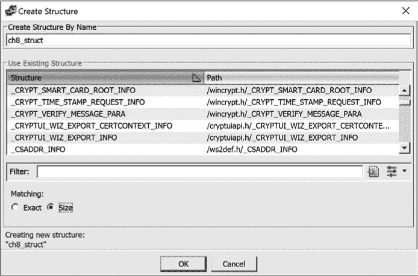

*图 8-8：创建结构窗口*

让我们来看一下创建这个结构对相关 CodeBrowser 窗口的影响，从列表窗口开始。如章节早些时候所示，反汇编列表几乎没有提示你正在处理一个结构，因为代码修改了一系列看似无关的全局变量：

```
001005fa  PUSH   RBP

001005fb  MOV    RBP,RSP

001005fe  MOV    dword ptr [DAT_00301020],10

00100608  MOV    word ptr [DAT_00301024],20

00100611  MOV    byte ptr [DAT_00301026],30

00100618  MOV    dword ptr [DAT_00301028],40

00100622  MOVSD  XMM0,qword ptr [DAT_001006c8]

0010062a  MOVSD  qword ptr [DAT_00301030],XMM0

00100632  MOV    EAX,0

00100637  POP    RBP

00100638  RET
```

当你导航到相关数据项，选择范围（`00301020` 到 `00301037`），并创建关联的结构时，你会看到结构中的各个数据项现在与名为 `ch8_struct_00301020` 的结构相关联，并且结构中的每个项目都有一个名称 `field_`，后面加上它与结构中第一个元素的偏移量。

```
00401035  POP    EBP

001005fb  MOV    RBP,RSP

001005fe  MOV    dword ptr [ch8_struct_00301020],10

00100608  MOV    word ptr [ch8_struct_00301020.field_0x4],20

00100611  MOV    byte ptr [ch8_struct_00301020.field_0x6],30

00100618  MOV    dword ptr [ch8_struct_00301020.field_0x8],40

00100622  MOVSD  XMM0,qword ptr [DAT_001006c8]

0010062a  MOVSD  qword ptr [ch8_struct_00301020.field_0x10],XMM0

00100632  MOV    EAX,0

00100637  POP    RBP

00100638  RET
```

这是随着结构的创建而变化的多个窗口之一。回想一下，Decompiler 窗口曾给出过一个有用的警告，提醒我们可能在处理结构体或数组。创建结构体后，警告消失，反编译的代码也更接近原始的 C 代码，如图 8-9 所示。

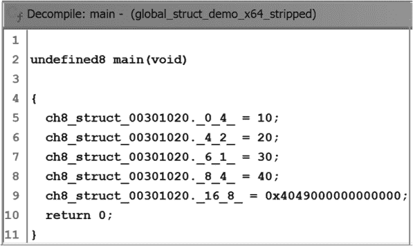

*图 8-9：创建结构体后的反编译器视图*

**联合体的状态**

*联合体*是一种与结构体相似的构造。结构体和联合体之间的主要区别在于，结构体字段有独立的偏移量和专用的内存空间，而联合体字段从偏移量 0 开始重叠在一起。其结果是所有联合体字段共享相同的内存空间。Ghidra 中的联合体编辑器窗口与结构体编辑器窗口相似，功能基本相同。

新创建的结构体现在也作为一个条目出现在 CodeBrowser 中的 Data Type Manager 窗口中。图 8-10 显示了 Data Type Manager 窗口中的新条目以及关联的窗口，展示了 `ch8_struct` 的所有引用。

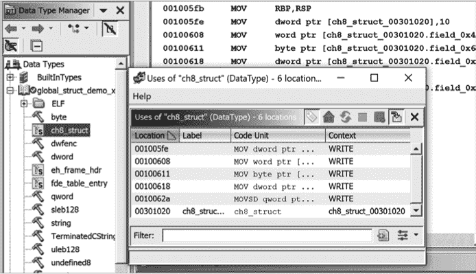

*图 8-10：Data Type Manager 和 References 窗口中新声明的结构体*

#### *编辑结构体成员*

此时，Ghidra 将新创建的结构体呈现为一系列未定义字节的连续集合，每个偏移量由示例程序访问，而不是一组已定义的数据类型（你可以根据每个项的大小和使用方式来确定）。要定义每个字段的类型，你可以通过右键单击 Listing 窗口中的结构体并选择合适的 Data 选项来编辑结构体。或者，你可以通过双击 Data Type Manager 中的结构体来编辑它。

如果你在 Data Type Manager 窗口中双击新创建的结构体（如图 8-10 所示），将会打开结构体编辑器窗口（如图 8-11 所示），该窗口展示了 24 个未定义类型的元素，长度都为 1。要确定结构体中各个元素的数量、大小和类型，你可以研究反汇编代码，或者让前面图 8-9 中显示的反编译器列表提供答案。

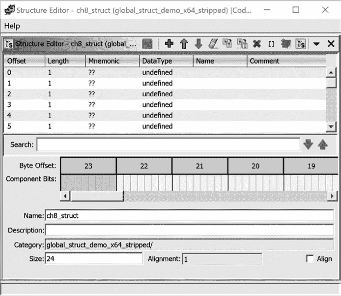

*图 8-11：结构体编辑器窗口*

与我们新创建的结构相关的原始反编译器列表显示，在同一结构`ch8_struct_00301020`中，使用包含两个整数的字段名引用了五个项目。第一个整数表示从结构基地址的偏移量。第二个整数表示使用的字节数，这是衡量项目大小的一个好指标。使用这些信息（以及一些有意义的字段名），你可以更新结构编辑器窗口，如图 8-12 所示。结构编辑器中的字节偏移/组件位滚动条提供了结构的可视化表示。当结构被编辑时，反编译器窗口（在图 8-12 的左侧）、列表窗口以及其他相关窗口也会更新。

因为`field_c`是一个字符，反编译器将整数 30 转换为表示 30（0x1e）的 ASCII 字符，这是一个不可打印的控制字符（RS）。在结构编辑器中，已包含填充字节（由助记符`??`表示），以确保字段的正确对齐，并且每个字段的偏移量以及结构的整体大小（24 字节）与之前示例中的值相匹配。

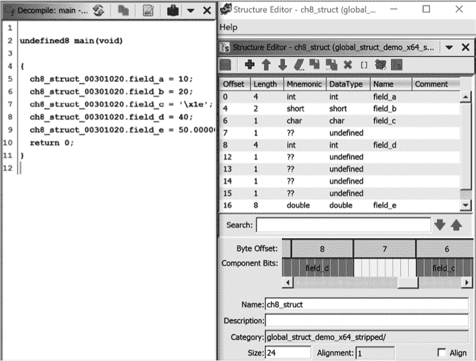

*图 8-12：编辑结构后的反编译器和结构编辑器窗口*

#### *应用结构布局*

你已经看到如何使用现有的结构定义并创建新的结构，将现有内存与特定的内存布局关联。你还看到这种关联是如何通过 CodeBrowser 窗口传播的，以使内容更加清晰。模糊的内存引用，例如`[EBX+8]`，通过将数字结构偏移量转换为符号引用，如`[EBX+ch8_struct.field_d]`，变得更加易读，尤其是因为符号引用可以赋予有意义的名称。Ghidra 使用层次符号表示法，明确显示正在访问的结构类型以及该结构中的哪个字段。

Ghidra 的已知结构布局库已通过解析常见的 C 头文件收集的信息进行了填充。结构的布局定义了其总大小、每个字段的名称和大小以及每个字段在结构中的起始偏移量。即使数据段中没有相关内容，你也可以使用结构布局，这在处理结构指针时尤其有用。

每当你遇到形如`[reg+N]`的内存引用时（例如`[RAX+0x12]`），其中`reg`是寄存器名称，`N`是一个小常量，`reg`作为指针使用，`N`表示相对于`reg`所指向的内存的偏移量。这是结构体成员访问的常见模式，`reg`指向结构体的开始位置，`N`选择结构体中偏移量为`N`的字段。在某些情况下，在你的帮助下，Ghidra 可以清理这种类型的内存引用，以反映指向的结构类型以及引用的结构体中的具体字段。

让我们看一下本章开始时示例的 32 位版本，我们请求从服务器获取一个 HTTP 页面。请求是通过一个名为`get_page`的函数发出的。在这个版本的二进制文件中，Ghidra 确认该函数接收三个堆栈分配的参数。这些参数在 Listing 窗口中显示如下：

```
     undefined get_page(undefined4 param_1, undefined param_2...

        undefined     AL:1              <RETURN>

        undefined4    Stack[0x4]:4      param_1

        undefined     Stack[0x8]:1      param_2

        undefined4    Stack[0xc]:4      param_3
```

Decompiler 窗口显示，`param_3`在调用`connect`时与一些偏移量一起使用：

```
iVar1=connect(local_14,*(sockaddr **)(param_3+20),*(socklen_t*)(param_3+16));
```

通过追踪调用序列和被调用函数的返回值，我们可以得出结论，`param_3`是指向`addrinfo`结构体的指针，并将`param_3`重新定义为`addrinfo*`（使用 Listing 或 Decompiler 窗口中的 CTRL-L）。使用`param_3`的反编译语句将被替换为这里显示的更具信息量的语句：

```
iVar1 = connect(local_14, param_3->ai_addr, param_3->ai_addrlen);
```

你可以看到，指针运算已被结构体字段引用所取代。源代码中的指针运算很少能自我解释。你花费时间更新程序变量的数据类型是非常值得的。你将为同事节省他们自己推断`param_3`类型所需的时间，等你从海滩度假回来时，你会感谢自己，因为你不需要重新分析代码以重新学习那个你忘记更新的变量类型。

### C++反向工程入门

C++类是 C 结构体的面向对象扩展，因此，通过回顾已编译 C++代码的特性来总结我们对数据结构的讨论是有一定逻辑的。C++的详细内容超出了本书的范围。在这里，我们尝试概述要点，并指出 Microsoft 的 C++编译器和 GNU 的`g++`之间的几个差异。

请记住，对 C++语言的扎实基础理解将极大地帮助你理解已编译的 C++。面向对象的概念，如继承和多态性，在源代码级别就很难掌握。如果在没有理解这些概念的源代码基础上试图在汇编级别深入探讨它们，可能会让你感到沮丧。

#### *this 指针*

`this`指针在所有非静态的 C++成员函数中都可以使用。每当调用这样的函数时，`this`会被初始化为指向用于调用该函数的对象。考虑以下 C++中的函数调用：

```
// object1, object2, and *p_obj are all the same type.

object1.member_func();

object2.member_func();

p_obj->member_func();
```

在三次对 `member_func` 的调用中，`this` 分别取值为 `&object1`、`&object2` 和 `p_obj`。

最容易将 `this` 视为传递给所有非静态成员函数的隐藏第一个参数。如 第六章 所讨论，Microsoft C++ 编译器使用 `thiscall` 调用约定，并将 `this` 传递给 `ECX` 寄存器（x86）或 `RCX` 寄存器（x86-x64）。GNU `g++` 编译器将 `this` 处理得就像它是非静态成员函数的第一个（最左边的）参数一样。在 32 位 Linux x86 上，用于调用函数的对象地址在调用函数之前被压入栈顶。在 Linux x86-64 上，`this` 通过第一个寄存器参数 `RDI` 传递。

从逆向工程的角度来看，在函数调用之前将地址移动到 `ECX` 寄存器中，很可能指示两件事。首先，文件是使用 Microsoft 的 C++ 编译器编译的。其次，函数可能是成员函数。当相同的地址被传递给两个或更多函数时，我们可以推断出这些函数都属于同一类层次结构。

在函数内部，如果在初始化 `ECX` 之前就使用了它，意味着调用者必须先初始化 `ECX`（回想一下在 “基于寄存器的参数” 中讨论的 *活跃性* 概念，第 113 页），这可能是函数是成员函数的一个迹象（尽管该函数也可能只是使用了 `fastcall` 调用约定）。进一步说，当成员函数将 `this` 传递给其他函数时，能够推断出这些函数也属于同一类。

对于使用 GNU `g++` 编译的代码，调用成员函数时 `this` 参数看起来和其他任何第一个参数差不多，因此成员函数的调用不太容易区分。然而，任何不以指针作为第一个参数的函数，肯定可以排除为成员函数。

#### *虚函数和虚函数表*

*虚函数* 使 C++ 程序具有多态行为。对于每个包含虚函数的类（或通过继承得到的子类），编译器都会生成一个表，表中包含指向类中每个虚函数的指针。这些表被称为 *虚函数表*（也称为 *vtable*）。每个包含虚函数的类的实例都会增加一个数据成员，该成员指向类的虚函数表。*虚函数表指针* 被分配为类实例中的第一个数据成员，当对象在运行时被创建时，其构造函数会设置虚函数表指针，指向合适的虚函数表。当该对象调用虚函数时，正确的函数会通过在对象的虚函数表中查找来选择。因此，虚函数表是实现运行时解析虚函数调用的基本机制。

一些示例可能有助于澄清虚函数表的使用。考虑以下 C++ 类定义：

```
class BaseClass {

    public:

        BaseClass();

     ➊ virtual void vfunc1() = 0➋;

        virtual void vfunc2();

        virtual void vfunc3();

        virtual void vfunc4();

    private:

        int x;

        int y;

};

class SubClass : public BaseClass➌ {

    public:

        SubClass();

     ➍ virtual void vfunc1();

        virtual void vfunc3();

        virtual void vfunc5();

    private:

        int z;

};
```

在这种情况下，`SubClass` 继承自 `BaseClass` ➌。`BaseClass` 包含四个虚函数 ➊，而 `SubClass` 包含五个虚函数 ➍（其中四个来自 `BaseClass`，其中两个被它重写，另外加上新的 `vfunc5`）。在 `BaseClass` 中，`vfunc1` 是一个 *纯虚函数*，在其声明中由 `= 0` ➋ 标明。纯虚函数在声明类中没有实现，并且 *必须* 在子类中重写，才能使类成为具体类。换句话说，`BaseClass::vfunc1` 没有实现，直到子类提供实现之前，不能实例化对象。`SubClass` 提供了这样的实现，因此可以创建 `SubClass` 对象。从面向对象的角度看，`BaseClass::vfunc1` 是一个 *抽象函数*，这使得 `BaseClass` 成为一个 *抽象基类*（即一个不完整的类，不能直接实例化，因为它缺少至少一个函数的实现）。

初看之下，`BaseClass` 似乎包含两个数据成员，`SubClass` 包含三个数据成员。然而请记住，任何包含虚函数的类，无论是显式定义的还是因为继承了虚函数，都包含一个 vftable 指针。因此，编译后的 `BaseClass` 实现有三个数据成员，而实例化后的 `SubClass` 对象有四个数据成员。在这两种情况下，第一个数据成员是 vftable 指针。在 `SubClass` 中，vftable 指针实际上是从 `BaseClass` 继承的，而不是专门为 `SubClass` 引入的。你可以在 图 8-13 中简化的内存布局中看到这一点，其中一个 `SubClass` 对象已经被动态分配。在对象创建过程中，新的对象的 vftable 指针会被初始化为指向正确的 vftable（在这种情况下是 `SubClass` 的 vftable）。


*图 8-13：一个简单的 vftable 布局*

`SubClass` 的 vftable 包含两个指向属于 `BaseClass` 的函数的指针（`BaseClass::vfunc2` 和 `BaseClass::vfunc4`），因为 `SubClass` 并没有重写这两个函数，而是从 `BaseClass` 继承了它们。`BaseClass` 的 vftable 显示了纯虚函数是如何处理的。由于纯虚函数 `BaseClass::vfunc1` 没有实现，因此在 `BaseClass` 的 vftable 中没有地址可以存储在 `vfunc1` 的位置上。在这种情况下，编译器会插入一个错误处理函数的地址，这个函数在微软库中叫做 `purecall`，在 GNU 库中叫做 `__cxa_pure_virtual`。理论上，这些函数不应被调用，但如果它们被调用，程序将异常终止。

在 Ghidra 中操作类时，必须考虑 vftable 指针。由于 C++ 类是 C 结构体的扩展，您可以利用 Ghidra 的结构定义功能来定义 C++ 类的布局。对于多态类，您必须将 vftable 指针作为类中的第一个字段，并且在计算对象的总大小时考虑 vftable 指针的大小。这一点在观察使用 `new` 运算符动态分配对象时最为明显，其中传递给 `new` 的大小值包括所有显式声明字段（包括任何超类字段）所需的空间，以及 vftable 指针所需的空间。

在以下示例中，一个 `SubClass` 对象被动态创建，并将其地址保存在一个 `BaseClass` 指针中。然后，指针被传递给一个函数（`call_vfunc`），该函数使用该指针调用 `vfunc3`：

```
void call_vfunc(BaseClass *bc) {

    bc->vfunc3();

}

int main() {

    BaseClass *bc = new Subclass();

    call_vfunc(bc);

}
```

由于 `vfunc3` 是一个虚拟函数，而 `bc` 指向一个 `SubClass` 对象，编译器必须确保调用 `SubClass::vfunc3`。以下是 `call_vfunc` 的 32 位 Microsoft C++ 版本反汇编，演示了如何解析虚拟函数调用：

```
     undefined __cdecl call_vfunc(int * bc)

        undefined     AL:1              <RETURN>

        int *         Stack[0x4]:4      bc

004010a0  PUSH   EBP

004010a1  MOV    EBP,ESP

004010a3  MOV    EAX,dword ptr [EBP + bc]

004010a6  MOV➊  EDX,dword ptr [EAX]

004010a8  MOV➋  ECX,dword ptr [EBP + bc]

004010ab  MOV➌  EAX,dword ptr [EDX + 8]

004010ae  CALL➍ EAX

004010b0  POP    EBP

004010b1  RET
```

vftable 指针（`SubClass` 的 vftable 地址）从结构体中读取并保存在 `EDX` 中 ➊。接下来，`this` 指针被移动到 `ECX` 中 ➋。然后，vftable 被索引，读取第三个指针（在此情况下为 `SubClass::vfunc3` 的地址）到 `EAX` 寄存器中 ➌。最后，虚拟函数被调用 ➍。

vftable 索引操作 ➌ 看起来非常像结构体引用操作。事实上，它与结构体引用操作没有区别，您可以为类及其 vftable 定义新的结构体（在数据类型管理器窗口右键单击），然后使用定义的结构体（见 图 8-14）使反汇编和反编译结果更加易读。

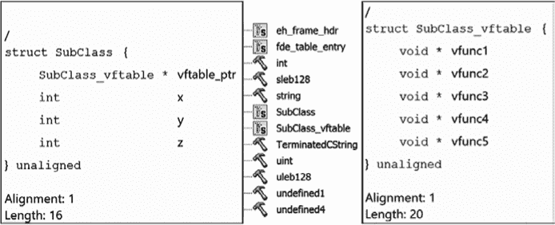

*图 8-14：数据管理器窗口显示新的* SubClass *和* SubClass_vftable

反编译器窗口显示了包含新结构的引用，如 图 8-15 所示。

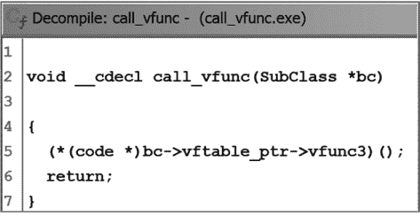

*图 8-15：反编译器窗口反映了* SubClass 的定义结构

类的 vftable 仅在两种情况下直接引用：在类的构造函数和析构函数中。当你定位到 vftable 时，可以利用 Ghidra 的数据交叉引用功能（见 第九章）快速定位相关类的所有构造函数和析构函数。

#### *对象生命周期*

理解对象的创建和销毁机制有助于揭示对象层次结构和嵌套对象关系，并快速识别类的构造函数和析构函数。

**构造函数是什么？**

*类构造函数*是一个初始化函数，在创建该类的新对象时会被调用。构造函数为类中的变量初始化提供了一个机会。构造函数的反向操作是*析构函数*，当对象超出作用域或动态分配的对象被显式删除时，会调用析构函数。析构函数执行清理工作，如释放资源（例如打开的文件描述符和动态分配的内存）。编写得当的析构函数可以减轻内存泄漏的潜在风险。

一个对象的存储类别决定了其构造函数何时被调用。^(1) 对于全局和静态分配的对象（静态存储类别），构造函数在程序启动时被调用，即在进入程序的`main`函数之前。对于栈分配的对象（自动存储类别），当对象在声明它的函数作用域内可见时，构造函数会被调用。在许多情况下，这会在进入声明它的函数时立即发生。然而，当一个对象在嵌套的块语句中声明时，只有在进入该块时（如果真的进入的话），它的构造函数才会被调用。当对象在程序堆中动态分配时，它的创建是一个两步过程：首先调用`new`运算符分配对象的内存，然后调用构造函数来初始化对象。Microsoft C++确保在调用构造函数之前，`new`的结果不为 null，但 GNU 的`g++`并不这样做。

**新变化？**

`new`运算符用于 C++中的动态内存分配，就像`malloc`在 C 中用于动态内存分配一样。它用于从堆中分配内存，并允许程序在执行过程中根据需要请求空间。`new`运算符是 C++语言内建的，而`malloc`仅仅是一个标准库函数。请记住，C 是 C++的子集，因此你可能在 C++程序中看到它们中的任何一个。`malloc`与`new`之间最显著的区别是，对于对象类型，`new`的调用会隐式地调用对象的构造函数，而`malloc`返回的内存在提供给调用者之前不会被初始化。

当构造函数执行时，以下操作顺序会发生：

1.  如果类有超类，则会调用超类的构造函数。

1.  如果类中有虚函数，vftable 指针会被初始化为指向该类的 vftable。这可能会覆盖在超类构造函数中初始化的 vftable 指针，这正是期望的行为。

1.  如果类中有任何数据成员本身是对象，那么每个数据成员的构造函数都会被调用。

1.  最后，类构造函数会执行。这是由类的程序员指定的 C++构造函数代码。

从程序员的角度来看，构造函数不指定返回类型，也不允许返回值。某些编译器实际上将`this`作为结果返回，并可能在调用者中进一步使用它，但这是编译器的实现细节，C++程序员无法访问返回的值。

析构函数顾名思义，在对象生命周期结束时被调用。对于全局和静态对象，析构函数由在`main`函数终止后执行的清理代码调用。对于栈上分配的对象，析构函数在对象超出作用域时被调用。对于堆上分配的对象，析构函数通过`delete`操作符在释放对象所分配的内存之前立即调用。

析构函数执行的操作与构造函数类似，唯一的区别是它们大致按照相反的顺序执行：

1.  如果类有任何虚函数，对象的 vftable 指针会被恢复，指向与关联类对应的 vftable。这是必须的，以防子类在其创建过程中覆盖了 vftable 指针。

1.  程序员指定的析构函数代码会被执行。

1.  如果类有任何数据成员是对象，析构函数会依次执行这些成员的析构函数。

1.  最后，如果对象有父类，则会调用父类的析构函数。

通过理解何时调用父类的构造函数和析构函数，可以通过调用其相关父类函数的链条追踪对象的继承层次结构。

**我认为你超负荷了**

重载函数是指具有相同名称但参数不同的函数。C++要求每个重载函数版本在接收的参数类型的顺序和/或数量上与其他版本有所不同。换句话说，虽然它们共享相同的函数名，但每个函数原型必须是唯一的，每个重载函数体可以在反汇编的二进制文件中被唯一标识。这与如`printf`这样的函数不同，后者接收可变数量的参数，但仅与一个函数体关联。

#### *名称修饰*

也叫做*名称装饰*，*名称修饰*是 C++编译器用来区分重载函数版本的机制。为了为重载函数生成唯一的内部名称，编译器会通过附加字符修饰函数名，这些字符编码了函数的各种信息：函数（或其所属类）所在的命名空间（如果有的话）、函数所属的类（如果有的话），以及调用函数所需的参数顺序（类型和顺序）。

名称修饰是 C++ 程序的编译器实现细节，因此不是 C++ 语言规范的一部分。不出所料，编译器厂商开发了各自的、通常不兼容的名称修饰约定。幸运的是，Ghidra 能理解 Microsoft C++ 编译器和 GNU `g++` v3（及之后版本）使用的名称修饰约定，以及其他一些编译器。Ghidra 用类似 `FUN_`地址 的形式代替被修饰的名称。被修饰的名称确实携带有关每个函数签名的有价值信息，Ghidra 会将这些信息包含在符号表窗口中，并将其传播到反汇编和其他相关窗口。（要确定没有被修饰名称的函数签名，可能需要进行耗时的数据流分析，分析该函数的输入和输出数据。）

#### *运行时类型识别*

C++ 提供了操作符 (`typeid`) 用于确定和检查（`dynamic_cast`）对象在运行时的数据类型。为了支持这些操作，C++ 编译器必须在程序二进制文件中嵌入每个多态类的类型特定信息。当在运行时执行 `typeid` 或 `dynamic_cast` 操作时，库函数会引用类型特定信息以确定所引用的多态对象的确切运行时类型。不幸的是，和名称修饰一样，*运行时类型识别（RTTI）* 是编译器的实现细节，而不是语言问题，并且没有标准的方式来实现 RTTI 功能。

我们将简要介绍 Microsoft C++ 编译器和 GNU `g++` 在 RTTI 实现上的相似性与差异性。具体而言，我们将描述如何定位 RTTI 信息，并从中了解与该信息相关的类名。希望获得更详细讨论的读者可以参考本章末尾列出的参考文献，特别是那些文献详细描述了如何遍历类的继承层次结构，包括在使用多重继承时如何追踪该层次结构。

请考虑以下简单程序，它使用了多态：

```
  class abstract_class {

      public:

          virtual int vfunc() = 0;

  };

    class concrete_class : public abstract_class {

      public:

          concrete_class(){};

          int vfunc();

  };

  int concrete_class::vfunc() {return 0;}

➊ void print_type(abstract_class *p) {

      cout << typeid(*p).name() << endl;

  }

  int main() {

      abstract_class *sc = new concrete_class();➋

      print_type(sc);

  }
```

`print_type` 函数 ➊ 打印指针 `p` 所指向对象的类型。在这种情况下，它必须打印 `"concrete_class"`，因为在 `main` 函数 ➋ 中创建了一个 `concrete_class` 对象。那么 `print_type`，更具体地说，`typeid` 是如何知道 `p` 指向的是什么类型的对象呢？

答案出奇地简单。由于每个多态对象都包含指向 vftable 的指针，编译器利用这一事实将类类型信息与类的 vftable 放置在一起。具体而言，编译器会在类的 vftable 之前立即放置一个指针，该指针指向一个包含关于拥有该 vftable 的类的信息的结构体。在 GNU `g++`代码中，该指针指向一个`type_info`结构，该结构包含指向类名的指针。在 Microsoft C++代码中，指针指向 Microsoft 的`RTTICompleteObjectLocator`结构，该结构又包含指向`TypeDescriptor`结构的指针。`TypeDescriptor`结构包含一个字符数组，指定多态类的名称。

仅在使用`typeid`或`dynamic_cast`运算符的 C++程序中，才需要 RTTI 信息。大多数编译器提供了选项，允许在不需要 RTTI 的二进制文件中禁用 RTTI 的生成；因此，如果你遇到的编译后的二进制文件中没有 RTTI 信息，而 vftable 却存在，也不必感到惊讶。

对于使用 Microsoft C++编译器构建的 C++程序，Ghidra 包含一个默认启用的 RTTI 分析器，能够识别 Microsoft 的 RTTI 结构，标注这些结构（如果存在）在反汇编清单中，并在符号树的*Classes*文件夹中利用从这些 RTTI 结构中恢复的类名。Ghidra 没有非 Windows 二进制文件的 RTTI 分析器。当 Ghidra 遇到一个未剥离的非 Windows 二进制文件时，如果它理解该二进制文件使用的名称重整方案，Ghidra 会利用可用的名称信息填充符号树的*Classes*文件夹。如果一个非 Windows 二进制文件已经被剥离，Ghidra 将无法自动恢复任何类名或识别 vftable 或 RTTI 信息。

#### *继承关系*

通过使用编译器特定实现的 RTTI，确实可以解开继承关系，但如果程序没有使用`typeid`或`dynamic_cast`运算符，则 RTTI 可能不存在。没有 RTTI 信息的情况下，可以使用什么技术来确定 C++类之间的继承关系呢？

确定继承层次结构的最简单方法是观察在创建对象时调用的父类构造函数的调用链。使用内联构造函数是这一技术的最大障碍。在 C/C++中，被声明为`inline`的函数通常会被编译器当作宏处理，函数的代码会被扩展到显式函数调用的位置。内联函数隐藏了函数被调用的事实，因为不会生成任何汇编语言的调用语句。这使得理解父类构造函数是否被调用变得具有挑战性。

对 vftable 的分析和比较也能揭示继承关系。例如，在比较图 8-14 中显示的 vftable 时，我们注意到`SubClass`的 vftable 包含了在`BaseClass`的 vftable 中出现的两个相同的指针，我们由此得出结论，`BaseClass`和`SubClass`之间一定存在某种关系。为了理解哪个是基类，哪个是子类，我们可以应用以下准则，单独使用或组合使用：

+   当两个 vftable 包含相同数量的条目时，这两个相应的类*可能*涉及到继承关系。

+   当类 X 的 vftable 包含的条目比类 Y 的 vftable 多时，类 X*可能*是类 Y 的子类。

+   当类 X 的 vftable 包含在类 Y 的 vftable 中也存在的条目时，必须存在以下关系之一：X 是 Y 的子类，Y 是 X 的子类，或者 X 和 Y 都是共同基类 Z 的子类。

+   当类 X 的 vftable 包含的条目也出现在类 Y 的 vftable 中，并且类 X 的 vftable 包含至少一个`purecall`条目，而该条目在类 Y 的相应 vftable 条目中不存在时，类 Y 很可能是类 X 的子类。

虽然前面的列表并非详尽无遗，但我们可以使用这些准则来推断图 8-14 中`BaseClass`和`SubClass`之间的关系。在这种情况下，最后三个规则都适用，但最后一条规则特别引导我们得出结论，单凭 vftable 分析，我们可以推断`SubClass`继承自`BaseClass`。

#### *C++ 反向工程参考*

关于反向工程编译后的 C++程序，存在若干优秀的参考资料。^(2)虽然这些文章中的许多细节专门适用于使用微软 C++编译器编译的程序，但许多概念同样适用于使用其他 C++编译器编译的程序。

### 总结

你可以预期在几乎所有非简单程序中都会遇到复杂数据类型。理解数据结构中数据的访问方式，以及如何识别数据结构布局的线索，是反向工程的重要技能。Ghidra 提供了多种专门用于处理数据结构的功能。熟悉这些功能将大大增强你理解正在操作的数据的能力，并让你有更多时间去理解数据是如何以及为什么被操作的。在下一章，我们将继续讨论 Ghidra 的基本功能，深入探讨交叉引用。
