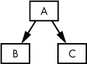
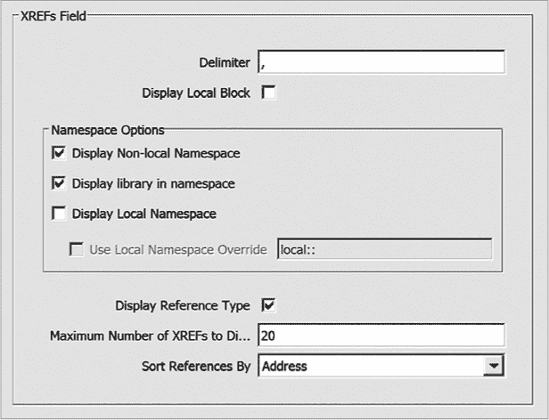
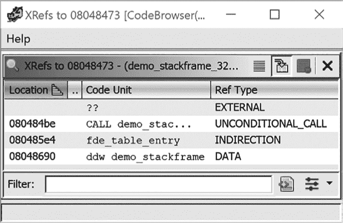
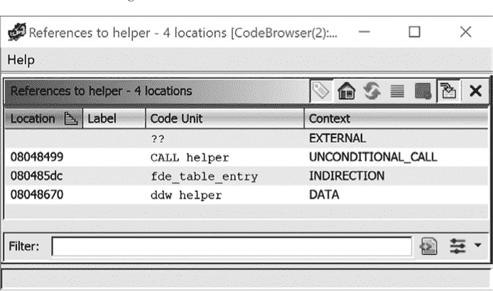
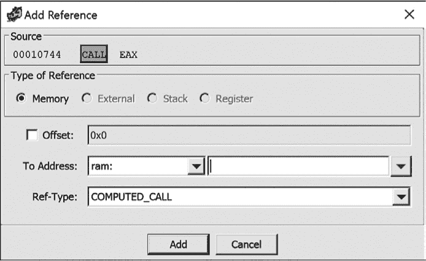

# 第十一章：**交叉引用**


在逆向工程一个二进制文件时，两个常见的问题是“这个函数从哪里被调用？”和“哪些函数访问了这个数据？”这些以及其他类似的问题旨在识别并列出程序中对各种资源的引用。以下两个示例展示了这些问题的实用性。

**示例 1**

当你在查看某个二进制文件中的大量 ASCII 字符串时，发现了一个特别可疑的字符串：“72 小时内付款，否则恢复密钥将被销毁，您的数据将永远保持加密状态。”单凭这个字符串，不能作为确凿证据。它并不能确认该二进制文件具备执行加密勒索攻击的能力或意图。问题“这个字符串在二进制文件中的哪里被引用？”的答案，将帮助你迅速找到使用该字符串的程序位置。这些信息反过来应帮助你定位任何相关的加密勒索代码，或者证明这个字符串在这个上下文中是无害的。

**示例 2**

你已经定位到一个包含堆栈分配缓冲区的函数，该缓冲区可能会发生溢出，进而导致程序被利用，你想确定这种情况是否真的可能发生。如果你想开发并展示一个利用漏洞的攻击，除非你能够让这个函数执行，否则它对你来说是没用的。这就引出了一个问题：“哪些函数调用了这个易受攻击的函数？”以及关于这些函数可能传递给易受攻击函数的数据性质的其他问题。在你向上回溯潜在的调用链时，这一思路必须继续，以找出一个你可以影响的链路，证明溢出是可以被利用的。

### 引用基础

Ghidra 可以帮助你分析这两种情况（以及许多其他情况），通过其丰富的机制来展示和访问引用信息。在本章中，我们将讨论 Ghidra 提供的引用类型、用于访问引用信息的工具以及如何解读这些信息。在第十章中，我们将使用 Ghidra 的图形功能来检查引用关系的可视化表示。

所有引用都遵循相同的一般流量规则。每个引用都与一个方向的概念相关。所有引用都是从一个地址指向另一个地址。如果你熟悉图论，你可以将地址视为有向图中的节点（或*顶点*），而引用则是标识节点间有向连接的*边*。图 9-1 提供了基本图形术语的快速回顾。在这个简单的图中，三个节点——A、B 和 C——通过两条有向边连接。

有向边通过箭头表示，以指示沿边的允许方向。在图 9-1 中，从 A 到 B 是可能的，但从 B 到 A 则不行，类似于单行道。如果箭头是双向的，那么两个方向的旅行都是可以接受的。

Ghidra 有两大类引用：正向引用和反向引用（每类还可细分）。反向引用是两类中较为简单的一种，并且在逆向工程中更为常见。反向引用，也叫做*交叉引用*，提供了一种在列表中的位置（如代码和数据）之间导航的方式。



*图 9-1：具有三个节点和两条边的有向图*

#### *交叉引用（反向引用）*

在 Ghidra 中，反向引用通常被简称为*XREFs*，这是*cross-reference*（交叉引用）一词的助记符。在本文中，我们仅在指代 Ghidra 列表、菜单项或对话框中的特定字符序列（XREF）时使用术语*XREF*。在其他情况下，我们使用更通用的术语*cross-reference*来指代反向引用。在进入更全面的示例之前，我们先看一下 Ghidra 中具体的 XREF 示例。

##### 示例 1：基本 XREF

我们首先通过检查在`demo_stackframe`中遇到的一些 XREF（请参见第六章）来理解相关的格式和含义：

```
     *******************************************************************

     *                         FUNCTION                                *

     *******************************************************************

     undefined demo_stackframe(undefined param_1, undefined4\. . . 

        undefined   AL:1            <RETURN>

        undefined   Stack[0x4]:4    param_1 

        undefined4  Stack[0x8]:4    param_2   XREF[1]:➊0804847f➋(R)➌

        undefined4  Stack[0xc]:4    param_3   XREF[1]:  08048479(R) 

        undefined4  Stack[-0x10]:4  local_10  XREF[1]:  0804847c(W)  

        undefined4  Stack[-0x14]:4  local_14  XREF[2]:  08048482(W), 

                                                        08048493(R)  

        undefined4  Stack[-0x18]:4  local_18  XREF[2]:  08048485(W), 

                                                        08048496(R)  

        undefined1  Stack[-0x58]:1  local_58  XREF[1]:  0804848c(W)  

     demo_stackframe                          XREF[4]:  Entry Point(*),  

                                                        main:080484be(c)➍, 

                                                        080485e4, 08048690(*)  
```

Ghidra 不仅通过指示符`XREF` ➊表示存在交叉引用，还通过`XREF`后面的索引值显示交叉引用的数量。交叉引用的这一部分（例如`XREF[2]:`）称为*XREF 头*。通过检查列表中的头部，我们可以看到大多数交叉引用只有一个引用地址，但也有一些有多个。

紧跟在头部之后的是与交叉引用相关的地址 ➋，这是一个可导航的对象。在地址之后，括号内有一个类型指示符 ➌。对于数据交叉引用（本示例即为此情况），有效的类型有`R`（表示变量在对应的 XREF 地址被读取），`W`（表示变量正在写入），以及`*`（表示一个位置的地址被作为指针使用）。总而言之，*数据交叉引用*在声明数据的位置进行标识，相关的 XREF 条目提供了指向数据被引用位置的链接。

**格式化 XREF**

与你在 Listing 窗口中遇到的大多数项目一样，你可以控制与交叉引用显示相关的属性。选择 编辑 ▸ 工具选项 打开可编辑的 CodeBrowser 选项。由于 XREF 是 Listing 窗口的一部分，XREF 字段可以在 Listing 字段文件夹中找到。选中后，它会打开如图 9-2 所示的对话框（此处为默认选项）。如果你将“最大显示 XREF 数量”更改为 2，则所有超过此数字的交叉引用头将显示为 `XREF[more]`。显示非本地命名空间的选项可以帮助你快速识别所有不在当前函数体内的交叉引用。所有选项的详细说明请参见 Ghidra 帮助。



*图 9-2：显示默认设置的 XREF 字段编辑窗口*

列表中还包含一个 *代码交叉引用* ➍。代码交叉引用是一个非常重要的概念，因为它们促进了 Ghidra 的函数图和函数调用图的生成，这也是第十章的重点内容。代码交叉引用用于表示一条指令将控制权转移或可能转移到另一条指令。指令转移控制的方式被称为 *流*。流可以分为三种基本类型：顺序流、跳转流或调用流。跳转流和调用流可以进一步根据目标地址是近地址还是远地址来区分。

*顺序流* 是最简单的流类型，因为它表示从一条指令到下一条指令的线性流动。这是所有非分支指令（如 `ADD`）的默认执行流。顺序流没有特殊的显示指示符，唯一的标识是指令在反汇编中的排列顺序：如果指令 A 有一个顺序流指向指令 B，那么指令 B 将紧跟在反汇编列表中的指令 A 后面。

##### 示例 2：跳转和调用 XREF

让我们快速看一个包含代码交叉引用的新示例，展示跳转和调用的情况。与数据交叉引用一样，代码交叉引用也在 Listing 窗口中有一个相关的 XREF 条目。以下列出了与 `main` 函数相关的信息：

```
     ********************************************************************

     *                         FUNCTION                                 *

     ********************************************************************

     undefined4 __stdcall main(void)

        undefined4  EAX:4           <RETURN>

        undefined4  Stack[-0x8]:4   ptr      ➊XREF[3]:  00401014(W),

                                                         0040101b(R),

                                                         00401026(R)

     main                                    ➋XREF[1]:  entry:0040121e(c)
```

你可以清楚地识别与堆栈变量 ➊ 相关的三个 XREF，以及与函数本身 ➋ 相关的 XREF。我们来解码 XREF 的含义，`entry:0040121e(c)`*.* 冒号前的地址（或者在这个例子中是标识符）表示引用（或源）实体。在这种情况下，控制从 `entry` 转移。冒号右侧是 `entry` 中具体的地址，是交叉引用的来源。后缀 `(c)` 表示这是对 `main` 的 `CALL`。简单来说，交叉引用的意思是，“`main` 是从 `entry` 中的地址 `0040121e` 被调用的。”

如果我们双击交叉引用地址以跟随链接，我们将被带到 `entry` 中指定的地址，在那里可以查看调用。虽然 XREF 是单向链接，但我们可以通过双击函数名（`main`）或使用 CodeBrowser 工具栏中的向后导航箭头快速返回到 `main`。

```
0040121e  CALL   main
```

在以下的列表中，XREF 上的 `(j)` 后缀表示该标记位置是 `JUMP` 的目标：

```
004011fe  JZ     LAB_00401207➊

00401200  PUSH   EAX

00401201  CALL   __amsg_exit

00401206  POP    ECX

        LAB_00401207                           XREF[1]: 004011fe(j)➋

00401207  MOV    EAX,[DAT_0040acf0]
```

类似于之前的示例，我们可以双击 XREF 地址 ➋ 来导航到转移控制的语句。我们可以通过双击相关的标签 ➊ 返回。

#### *引用示例*

让我们通过一个源代码到反汇编的示例，展示多种类型的交叉引用。以下程序 *simple_flows.c* 包含了多个操作，展示了 Ghidra 的交叉引用功能，如注释文本所示：

```
int read_it;            // integer variable read in main

int write_it;           // integer variable written 3 times in main

int ref_it;             // integer variable whose address is taken in main

void callflow() {}      // function called twice from main

int main() {

    int *ptr = &ref_it; // results in a "pointer" style data reference (*)

    *ptr = read_it;     // results in a "read" style data reference (R)

    write_it = *ptr;    // results in a "write" style data reference (W)

    callflow();         // results in a "call" style code reference (c)

    if (read_it == 3) { // results in "jump" style code reference (j)

        write_it = 2;   // results in a "write" style data reference (W)

    }

    else {              // results in an "jump" style code reference (j)

        write_it = 1;   // results in a "write" style data reference (W)

    }

    callflow();         // results in an "call" style code reference (c)

}
```

##### 代码交叉引用

列表 9-1 显示了前面程序的反汇编。

```
     undefined4 __stdcall main(void)

        undefined4 EAX:4 <RETURN>

        undefined4 Stack[-0x8]:4 ptr          XREF[3]:  00401014(W),

                                                        0040101b(R),

                                                        00401026(R)

     main                                     XREF[1]:  entry:0040121e(c)

00401010  PUSH   EBP

00401011  MOV    EBP,ESP

00401013  PUSH   ECX

00401014  MOV➊  dword ptr [EBP + ptr],ref_it

0040101b  MOV    EAX,dword ptr [EBP + ptr]

0040101e  MOV➋  ECX,dword ptr [read_it]

00401024  MOV    dword ptr [EAX]=>ref_it,ECX

00401026  MOV    EDX,dword ptr [EBP + ptr]

00401029  MOV    EAX=>ref_it,dword ptr [EDX]

0040102b  MOV    [write_it],EAX

00401030  CALL➌ callflow

00401035  CMP    dword ptr [read_it],3

0040103c  JNZ    LAB_0040104a

0040103e  MOV    dword ptr [write_it],2

00401048  JMP➍  LAB_00401054

        LAB_0040104a                          XREF[1]:➎0040103c(j)

0040104a  MOV   dword ptr [write_it],1

 LAB_00401054                          XREF[1]:  00401048(j)

00401054  CALL   callflow

00401059  XOR    EAX,EAX

0040105b  MOV    ESP,EBP

0040105d  POP    EBP

0040105e  RET➏
```

*列表 9-1：* simple_flows.exe 中 main 函数的反汇编

除了 `JMP` ➍ 和 `RET` ➏ 指令之外，每条指令都与其紧随其后的指令存在关联的顺序流。用于调用函数的指令，如 x86 的 `CALL` 指令 ➌，会被分配一个 *调用流*，表示控制转移到目标函数。调用流通过 XREF 在目标函数处标记（即流的目标地址）。在 列表 9-1 中引用的 `callflow` 函数的反汇编展示在 列表 9-2 中。

```
     undefined __stdcall callflow(void)

        undefined AL:1 <RETURN>

     callflow                                 XREF[4]:  0040010c(*),

                                                        004001e4(*),

                                                        main:00401030(c),

                                                        main:00401054(c)

00401000  PUSH   EBP

00401001  MOV    EBP,ESP

00401003  POP    EBP

00401004  RET
```

*列表 9-2：* callflow *函数的反汇编*

**额外的 XREF？**

时不时地，你会在列表中看到一些似乎异常的内容。列表 9-2 中有两个指针 XREF，`0040010c(*)` 和 `004001e4(*)`，它们不容易解释。我们立即理解了两个 XREF，可以追溯到 `main` 中对 `callflow` 的调用。那另外两个 XREF 是什么呢？事实证明，这些是该特定代码的有趣现象。这个程序是为 Windows 编译的，因此生成了一个 PE 文件，而这两个异常的 XREF 带我们进入了列表中 Headers 部分的 PE 头。这里显示了这两个引用地址（包括相关字节）：

```
0040010c  00 10 00 00 ibo32     callflow               BaseOfCode

               .  .  .

004001e4  00 10 00 00 ibo32     callflow               VirtualAddress
```

为什么这个函数在 PE 头中被引用？一个快速的 Google 搜索可以帮助我们理解发生了什么：`callflow`恰好是文本段中的第一个内容，而两个 PE 字段间接地引用了文本段的起始位置，因此与 `callflow` 函数相关的 XREF 是出乎意料的。

在此示例中，我们看到`callflow`被`main`调用了两次：一次来自地址`00401030`，另一次来自地址`00401054`。由函数调用引起的交叉引用通过后缀`(c)`进行区分。交叉引用中显示的源位置既表示调用的地址，也表示包含该调用的函数。

每个无条件和条件分支指令都分配了一个*跳转流*。条件分支还会分配顺序流，以处理分支未被执行时的控制流；无条件分支没有关联的顺序流，因为该分支总是会被执行。跳转流与显示在清单 9-1 中的`JNZ` ➎目标处的跳转式交叉引用相关。与调用式交叉引用一样，跳转交叉引用显示引用位置的地址（跳转的来源）。跳转交叉引用通过`(j)`后缀加以区分。

**基本块**

在程序分析中，*基本块*是一个最大化的指令序列，从头到尾执行且不发生分支。因此，每个基本块都有一个入口点（块中的第一条指令）和一个出口点（块中的最后一条指令）。基本块中的第一条指令通常是分支指令的目标，而最后一条指令通常是分支指令。第一条指令可能是多个代码交叉引用的目标。除了第一条指令外，基本块中的其他任何指令都不能成为代码交叉引用的目标。基本块的最后一条指令可能是多个代码交叉引用的来源，例如条件跳转，或者它可能流向一个作为多个代码交叉引用目标的指令（根据定义，这必须开始一个新的基本块）。

##### 数据交叉引用

*数据交叉引用*用于跟踪二进制文件中数据的访问方式。最常见的三种数据交叉引用类型分别表示何时读取某个位置、何时写入某个位置以及何时获取某个位置的地址。之前示例程序中的全局变量在清单 9-3 中展示，因为它们提供了多个数据交叉引用的示例。

```
        read_it                               XREF[2]:  main:0040101e(R),

                                                        main:00401035(R)

0040b720 undefined4    ??

        write_it                              XREF[3]:  main:0040102b(W),

                                                        main:0040103e(W),

                                                        main:0040104a(W)

 0040b724    ??         ??

0040b725    ??         ??

0040b726    ??         ??

0040b727    ??         ??

        ref_it                                XREF[3]:  main:00401014(*),

                                                        main:00401024(W),

                                                        main:00401029(R)

0040b728 undefined4    ??
```

*清单 9-3：在* simple_flows.c 中引用的全局变量

*读取交叉引用*表示正在读取内存位置的内容。读取交叉引用只能来自指令地址，但可以引用任何程序位置。全局变量`read_it`在清单 9-1 中被读取了两次。该清单中显示的相关交叉引用注释准确地指示了`main`中哪些位置引用了`read_it`，并且可以通过后缀`(R)`识别为读取交叉引用。在清单 9-1 中对`read_it`的读取➋是一次 32 位的读取操作，结果存储在`ECX`寄存器中，这导致 Ghidra 将`read_it`格式化为`undefined4`（一个 4 字节的未指定类型的值）。Ghidra 通常会尝试根据代码在二进制文件中的操作推断数据项的大小。

全局变量`write_it`在清单 9-1 中被引用了三次。相关的*写入交叉引用*被生成并作为注释显示在`write_it`变量旁边，指示修改该变量内容的程序位置。写入交叉引用使用`(W)`后缀。在这种情况下，尽管似乎有足够的信息，Ghidra 并没有将`write_it`格式化为 4 字节变量。与读取交叉引用一样，写入交叉引用只能来源于程序指令，但可能引用任何程序位置。通常，针对程序指令字节的写入交叉引用表明是自修改代码，并且在恶意软件去混淆程序中经常遇到。

第三种数据交叉引用，*指针交叉引用*，表示正在使用位置的地址（而不是位置的内容）。全局变量`ref_it`的地址在清单 9-1 中被获取➊，这导致了清单 9-3 中`ref_it`的指针交叉引用，如后缀`(*)`所示。指针交叉引用通常是代码或数据中的地址推导的结果。如你在第八章中看到的，数组访问操作通常通过向数组起始地址添加偏移量来实现，并且大多数全局数组的第一个地址通常可以通过存在指针交叉引用来识别。因此，大多数字符串字面量（在 C/C++中，字符串是字符数组）是指针交叉引用的目标。

与只能从指令位置起源的读写交叉引用不同，指针交叉引用可以从指令位置或数据位置起源。来自程序数据区的指针交叉引用的一个例子是任何地址表（例如虚函数表 vftable，生成指向每个条目的指针交叉引用，指向相应的虚函数）。让我们通过 第八章 中的 `SubClass` 示例来看这个问题。下面显示的是 `SubClass` 的虚函数表的反汇编：

```
           SubClass::vftable           XREF[1]:  SubClass_Constructor:00401062(*)

   00408148 void * SubClass::vfunc1 vfunc1

➊ 0040814c void * BaseClass::vfunc2 vfunc2

   00408150 void * SubClass::vfunc3 vfunc3

   00408154 void * BaseClass::vfunc4 vfunc4

   00408158 void * SubClass::vfunc5 vfunc5
```

在这里，你可以看到位于 `0040814c` 位置的 ➊ 数据项是指向 `BaseClass::vfunc2` 的指针。导航到 `BaseClass::vfunc2` 会显示以下列表：

```
     **************************************************************

     *                          FUNCTION                          *

     **************************************************************

     undefined __stdcall vfunc2(void)

        undefined AL:1 <RETURN>

        undefined4 Stack[-0x8]:4 local_8      XREF[1]:  00401024(W)

     BaseClass::vfunc2                        XREF[2]:  00408138(*)➊,

                                                        0040814c(*)➋

00401020  PUSH   EBP

00401021  MOV    EBP,ESP

00401023  PUSH   ECX

00401024  MOV    dword ptr [EBP + local_8],ECX

00401027  MOV    ESP,EBP

00401029  POP    EBP

0040102a  RET
```

与大多数函数不同，这个函数没有代码交叉引用。相反，我们看到两个指针交叉引用，表示该函数的地址在两个位置派生。第二个 XREF ➋ 回溯到之前讨论的 `SubClass` 的虚函数表（vftable）条目。跟踪第一个 XREF ➊ 将引导我们到 `BaseClass` 的虚函数表，其中也包含指向这个虚函数的指针。

这个例子展示了 C++ 虚函数很少直接调用，通常也不是调用交叉引用的目标。由于虚函数表的创建方式，所有 C++ 虚函数将至少通过一个虚函数表条目进行引用，并且总会是至少一个指针交叉引用的目标。（记住，重写虚函数并不是强制性的。）

当二进制文件包含足够的信息时，Ghidra 能够为你定位虚函数表。Ghidra 找到的任何虚函数表都会作为条目列出在符号树（Symbol Tree）中 *Classes* 文件夹下，且该条目对应的类条目下。点击符号树窗口中的虚函数表将引导你到程序数据区的虚函数表位置。

### 引用管理窗口

到现在为止，你可能已经注意到 XREF 注释在列出窗口中非常常见。这绝非偶然，因为交叉引用形成的链接是将一个程序连接在一起的“粘合剂”。交叉引用讲述了内部和外部功能依赖关系的故事，而大多数成功的逆向工程工作需要对这些行为有全面的理解。接下来的章节将超越交叉引用的基本显示和导航功能，介绍几种在 Ghidra 中管理交叉引用的选项。

#### *XRefs 窗口*

你可以使用 XREF 头部来了解更多关于特定交叉引用的信息，如以下列表所示：

```
        undefined4 Stack[-0x10]:4 local_10    XREF[1]:  0804847c(W)  

        undefined4 Stack[-0x14]:4 local_14    XREF[2]:➊08048482(W), 

                                                        08048493(R)  
```

双击 `XREF[2]` 头部 ➊ 将弹出关联的 XRefs 窗口，如 图 9-3 所示，详细列出了交叉引用。默认情况下，窗口显示位置、标签（如果适用）、引用的反汇编代码和引用类型。



*图 9-3：XRefs 窗口*

#### *引用到*

另一个有助于理解程序流程的窗口是“引用到”窗口。在列表窗口中右键点击任何地址，选择**引用** ▸ **显示引用地址**，就会弹出如图 9-4 所示的窗口。



*图 9-4：引用到窗口*

在这个例子中，我们选择了`helper`函数的起始地址。在这个窗口中，你可以通过点击窗口中的任何条目来导航到相关位置。

#### *符号引用*

在第 82 页的“符号表和符号引用窗口”中介绍的另一个参考视图是符号表和符号引用窗口的组合。默认情况下，当你选择“窗口 ▸ 符号引用”时，会显示两个相关的窗口。一个显示整个符号表中的每个符号，另一个显示与符号相关的引用。在符号表窗口中选择任何条目（例如函数、vftable 等）会导致在符号引用窗口中显示相关的符号引用。

引用列表可用于快速识别从哪个位置调用了特定的函数。例如，许多人认为 C 语言的`strcpy`函数是危险的，因为它会将源字符数组（包括关联的空字符终止符）复制到目标数组中，而根本没有检查目标数组是否足够大以容纳源数组中的所有字符。你可以在列表中定位到任何一个`strcpy`的调用，并使用上述方法打开“引用到”窗口，但如果你不想花时间在二进制文件中找到`strcpy`的使用位置，可以打开符号引用窗口，快速定位到`strcpy`及其所有相关引用。

#### *高级引用操作*

在本章开始时，我们将*回引用*与*交叉引用*等同，并简要提到 Ghidra 还具有*前向引用*，其中有两种类型。*推断前向引用*通常会自动添加到列表中，并与回引用一一对应，尽管推断前向引用是沿相反方向遍历的。换句话说，我们从目标地址回溯到源地址时遍历回引用，而我们从源地址向前遍历到目标地址时则遍历推断前向引用。

第二种类型是*显式前向引用*。显式前向引用有多种类型，它们的管理比其他交叉引用复杂得多。显式前向引用的类型包括内存引用、外部引用、栈引用和寄存器引用。除了查看引用外，Ghidra 还允许你添加和编辑各种类型的引用。

当 Ghidra 的静态分析无法确定在运行时计算出的跳转或调用目标，但你通过其他分析知道目标时，你可能需要手动添加交叉引用。在以下代码中，我们在第八章中最后看到过，它调用了一个虚函数。

```
0001072e  PUSH   EBP

0001072f  MOV    EBP,ESP

00010731  SUB    ESP,8

00010734  MOV    EAX,dword ptr [EBP + param_1]➊

00010737  MOV    EAX,dword ptr [EAX]

00010739  ADD    EAX,8

0001073c  MOV    EAX,dword ptr [EAX]

0001073e  SUB    ESP,12

00010741  PUSH   dword ptr [EBP + param_1]

00010744  CALL➋ EAX

00010746  ADD    ESP,16

00010749  NOP

0001074a  LEAVE

0001074b  RET
```

`EAX` ➋ 中存储的值取决于通过 `param_1` ➊ 传递的指针的值。因此，Ghidra 没有足够的信息来创建交叉引用，将 `00010744`（`CALL` 指令的地址）与调用的目标关联。手动添加交叉引用（例如，指向 `SubClass::vfunc3`）将使目标函数被链接到调用图中，从而改善 Ghidra 对程序的分析。右键点击调用 ➋ 并选择 **引用** ▸ **从中添加引用** 打开如图 9-5 所示的对话框。此对话框也可以通过“引用” ▸ “添加/编辑”选项访问。



*图 9-5：添加引用对话框*

将目标函数的地址指定为“目标地址”设置，并确保已选择正确的引用类型设置。当你点击“添加”按钮关闭对话框时，Ghidra 会创建引用，并在目标地址处出现新的`(c)`交叉引用。关于正向引用的更多信息，包括剩余的引用类型和引用操作，请参见 Ghidra 帮助文档。

### 总结

引用是强大的工具，可以帮助你理解二进制文件中各个构件之间的关系。我们详细讨论了交叉引用，并介绍了与引用相关的其他一些功能，这些功能将在后续章节中再次讨论。在下一章中，我们将探讨引用的可视化表示，以及生成的图表如何帮助我们更好地理解函数内的控制流以及二进制文件中函数之间的关系。
