## 第十二章：图形**


如我们在上一章中所做的那样，通过图形直观地表示数据（见图 9-1），提供了一种简洁明了的机制，展示图形中节点之间的多种连接关系，并帮助我们识别在操作图形作为抽象数据类型时可能难以发现的模式。Ghidra 的图形视图提供了一个新的视角（除了反汇编和反编译列表之外）来查看二进制文件的内容。它们通过将函数和其他类型的块表示为节点，且通过将流程和交叉引用表示为边（连接节点的线），让你快速查看一个函数的控制流以及文件中函数之间的关系。通过足够的练习，你可能会发现，像`switch`语句和嵌套的`if`/`else`结构这样的常见控制结构，在图形形式下比在长文本列表中更容易识别。在第五章中，我们简要介绍了函数图和函数调用图窗口。在本章中，我们将深入探讨 Ghidra 的图形功能。

由于交叉引用将一个地址与另一个地址关联，因此它们是绘制二进制图形的自然起点。通过将自己限制在顺序流和特定类型的交叉引用中，我们可以推导出许多有用的图形来分析我们的二进制文件。虽然流程和交叉引用充当图形中的边，但节点背后的含义可能会有所不同。根据我们希望生成的图形类型，节点可以包含一个或多个指令，或者整个函数。让我们通过查看 Ghidra 如何将代码组织成*块*，然后再讨论 Ghidra 中可用的图形类型。

### 基本块

在计算机程序中，*基本块*是一个或多个指令的组合，该组合具有一个开始时的单一入口点和一个结束时的单一出口点。除了最后一条指令外，基本块中的每条指令都会将控制权转移到块内的恰好一个*后继*指令。类似地，除了第一条指令外，基本块中的每条指令都会从块内的恰好一个*前驱*指令接收控制权。在“交叉引用（反向引用）”一节中（见第 185 页），我们将其称为*顺序流*。你可能会不时注意到，在基本块的中间有一个函数调用，并心想，“这不正是应该终止一个块的指令，比如跳转吗？”为了确定基本块，通常忽略函数调用将控制权转移到当前块外的事实，除非已知被调用的函数不会正常返回。

一旦基本块中的第一条指令被执行，块中的其余部分将保证执行完毕。这对于程序的运行时插装有重要影响，因为不再需要在程序中的每条指令上设置断点，或者逐步执行程序来记录已执行的指令。相反，可以在每个基本块的第一条指令上设置断点，并且每次触发断点时，都可以假定该块中的每条指令都将被执行。让我们转向 Ghidra 的功能图能力，以提供另一种块的视角。

### 功能图

功能图窗口在第五章中介绍，以图形格式显示单个函数。以下程序包含一个由单个基本块组成的函数，因此它是展示 Ghidra 功能图的一个有用起点：

```
int global_array[3];

int main() {

    int idx = 2;

    global_array[0] = 10;

    global_array[1] = 20;

 global_array[2] = 30;

    global_array[idx] = 40;

}
```

当你打开`main`已选择的功能图窗口（窗口 ▸ 功能图），你将看到一个只有一个基本块的功能图，如图 10-1 所示。

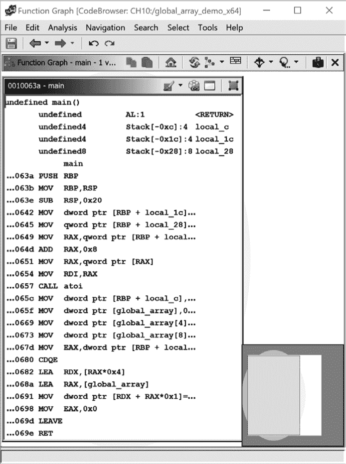

*图 10-1：一个包含卫星视图的单块功能图窗口，右下角*

功能图窗口和列表窗口之间有一个有用的双向链接。如果你并排查看这两个窗口，功能的并行列出和图形表示可以帮助你更好地理解函数的控制流。你在功能图窗口所做的更改（例如，重命名函数、变量等）将立即反映在列表窗口中。你在列表窗口所做的更改也会反映在功能图窗口中，尽管你可能需要刷新窗口才能看到更改。

**折线**

随着函数变得更加复杂，每个函数中的基本块数量可能会增加。当你首次生成功能图时，连接各个基本块的边会被切割成折线。这意味着它们会整齐地弯曲成 90 度角，以确保它们不会被节点遮挡。这导致了一个整齐的网格布局，其中所有边的组成部分都是水平或垂直的。如果你决定通过拖动节点改变图的布局，边可能会失去折线的特性，变成直线并绕过其他节点。图 10-2 展示了左侧的折线表示与右侧的非折线表示之间的对比。你可以通过刷新功能图窗口随时恢复到原始布局。

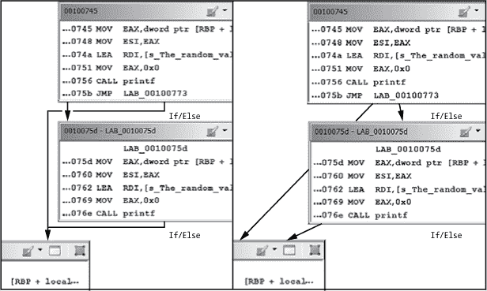

*图 10-2：带有折线和非折线边的功能图*

如果你在 Function Graph 窗口中点击任何一行文本，Listing 窗口中的光标将移动到反汇编列表中的相应位置。如果你双击 Function Graph 中的数据，Listing 窗口将导航到该数据在 Listing 数据部分的位置，而 Function Graph 窗口将继续保持对该函数的聚焦。（尽管 Ghidra 目前没有提供基于图形的数据可视化或数据组件之间关系的可视化，但它允许你同时查看 Listing 视图中的数据和图形视图中的相关代码。）

让我们来看一个快速示例，演示 Listing 窗口和 Function Graph 窗口之间的关系。假设你在图 10-1 中看到了`global_array`变量，并想了解更多关于它的类型。当你通过在图形视图中双击该名称导航到它时，你会看到 Ghidra 已经将`global_array`分类为一个未定义字节数组（`undefined1`），并通过索引访问第四个和第八个元素。如果你将 Listing 窗口中数据部分的数组定义从`undefined1[12]`更改为`int[3]`（分别显示在图 10-3 的上半部分和下半部分），你可以立即看到声明对 Function Graph 窗口（以及 Decompiler 窗口）中反汇编代码的影响：索引值变为`1`和`2`，以反映每个数组元素的新 4 字节大小。

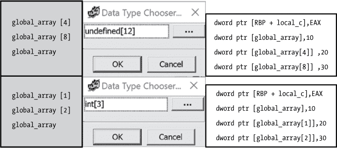

*图 10-3：修改数组声明对 Function Graph 和 Listing 窗口的影响*

在 Listing 窗口中的导航是灵活的，只要你没有点击不同的函数。你可以滚动查看整个 Listing 窗口的内容，在数据部分点击并进行更改，在函数内进行修改，等等。如果你点击了另一个函数，图形视图将更新，显示新选定函数的图形。

**什么是交互阈值？**

在与 Function Graph 窗口交互时，特别是处理复杂函数时，你可能需要缩小视图，因为你无法看到所有想看的内容。当各个节点变得太小，无法以有意义的方式进行交互时，你已经超出了*交互阈值*。Function Graph 中每个节点的投影阴影用来指示这种情况。虚拟地址可能只显示最低有效值，而且图中的节点数量可能变得难以处理。试图选择节点中的内容最终会选择整个块。如果函数的复杂性使你超出了这个阈值，不要灰心。你可以点击任何节点将其聚焦，或者双击某个节点来放大它。

图 10-4 突出了 Function Graph 窗口中可用的菜单和工具栏。

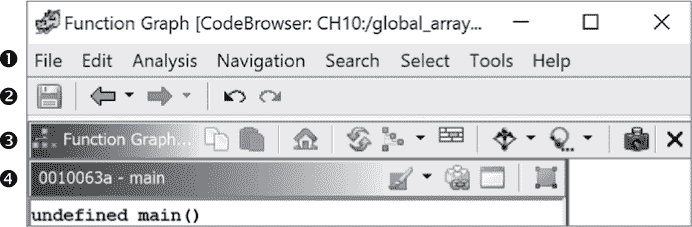

*图 10-4：Function Graph 工具栏*

函数图实际上不过是代码浏览器窗口中单个函数的图形化展示，因此，除了窗口菜单外，代码浏览器中的所有菜单都可以在函数图窗口中使用➊。代码浏览器工具栏的可用子集➋包括保存当前文件状态、撤销和重做、以及在当前导航链中前进和后退的功能。需要注意的是，由于窗口是相互关联的，这可能会使你导航到当前函数之外（并返回），从而改变函数图窗口的内容。

函数图工具栏图标 ➌ 及其默认行为在图 10-5 中有描述。

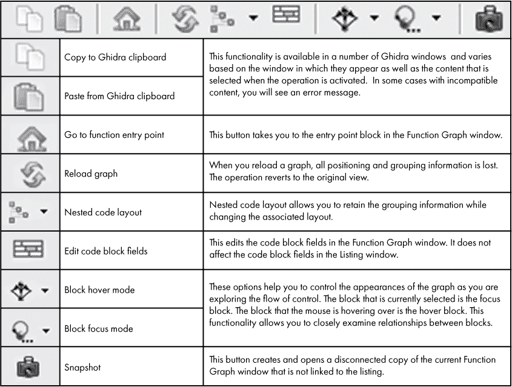

*图 10-5：函数图工具栏操作*

每个基本块还有一个工具栏 ➍，让你能够修改该块，并通过将多个块（顶点）组合成一个单一的块来进行分组（有关工具栏图标及其默认行为的解释，请参见图 10-6）。这个功能对于简化因函数高度嵌套而导致的图形复杂性非常有用。例如，在你理解了循环的行为并且不再需要查看循环内的代码后，你可能选择将循环语句内嵌套的所有块折叠成一个图节点。根据你所分组的嵌套块的数量，图形的可读性可能会显著提升。要分组节点，你必须使用 CTRL-点击选择所有将要属于该组的节点，然后点击你认为位于组根节点的节点上的**合并顶点**工具。*恢复组*是一个特别有用的按钮，它让你能够快速查看组内内容，并随后重新折叠该组。

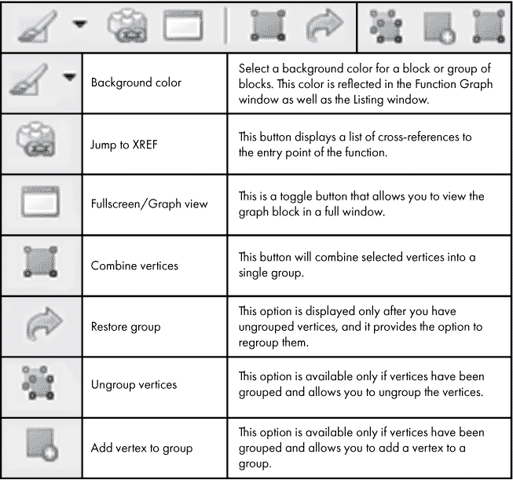

*图 10-6：函数图基本块工具栏*

要查看与函数图相关的其他功能，你需要查看包含多个基本块的示例。以下程序将在后续示例中使用：

```
int do_random() {

    int r;

    srand(time(0));

    r = rand();

    if (r % 2 == 0) {

       printf("The random value %d is even\n", r);

    }

    else {

       printf("The random value %d is odd\n", r);

    }

    return r;

}

int main() {

    do_random();

}
```

`do_random` 函数包含控制结构（`if`/`else`），导致图形中有四个基本块，这些基本块在图 10-8 中被标记出来。查看一个包含多个块的函数，可以更明显地看出，函数图是一个控制流图，边缘表示从一个块到另一个块的可能流动。请注意，Ghidra 为函数图提供的布局称为*嵌套代码布局*，它与 C 代码的流动非常相似。这使得在更大的程序上下文中查看你的列表和反汇编器窗口的图形表示变得更加容易。为了保持这种视图，我们强烈建议你修改图形选项，将边缘绕过顶点（编辑 ▸ 工具选项 ▸ 功能图 ▸ 嵌套代码布局 ▸ 将边缘绕过顶点）。默认情况下，Ghidra 会不幸地将边缘路由到节点后面，这往往会误导节点之间关系的呈现。

**此图形已过时**

虽然列表中的一些更改会立即反映在功能图窗口中，但在其他情况下，图形可能会变得过时（与列表视图不同步）。当这种情况发生时，Ghidra 会在图形窗口的底部显示如图 10-7 所示的消息。


*图 10-7：陈旧图形警告消息*

消息左侧的*回收*图标允许你刷新图形，而不需要恢复到原始布局。（当然，你也可以选择刷新并重新布局。）

在图 10-8 中显示的图形中，BLOCK-1 是进入该函数的唯一入口点。这个块像所有基本块一样，表现出从指令到指令的顺序流动。块内的三个函数调用（`time`、`srand` 和 `rand`）不会“中断”基本块的执行，因为 Ghidra 假定它们都返回并继续顺序执行剩余的指令。如果 BLOCK-1 末尾的 `JNZ` 条件计算为假（即随机值为偶数），则进入 BLOCK-2。如果 `JNZ` 条件计算为真（即随机值为奇数），则进入 BLOCK-3。最后的块，BLOCK-4，是在完成 BLOCK-2 或 BLOCK-3 后进入的。请注意，点击一条边缘会使其聚焦，并使其显示得比其他边缘更粗。在图中，连接 BLOCK-1 和 BLOCK-3 的边缘是活动边缘，并且显示为粗体。

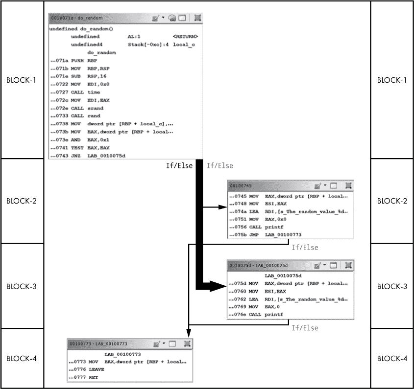

*图 10-8：选择深色线条显示条件满足时的流程图*

如果你有一个特别长的基本块，并希望将其拆分为更小的块，或者希望为进一步分析将代码的某个部分视觉上隔离开来，你可以通过在函数图中引入新的标签来拆分基本块。使用热键 L 在 `0010072e` 行插入一个新标签（位于 BLOCK-1 中，位于调用`srand`之前）会在函数图中添加一个第五个块，如图 10-9 所示。引入的新边表示数据流，且不与交叉引用相关联。

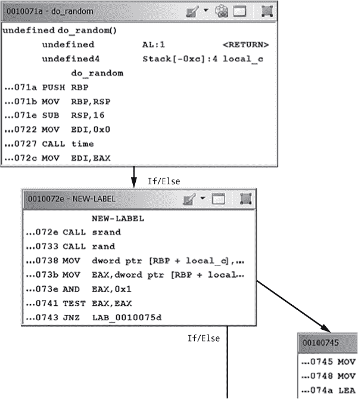

*图 10-9：带有新标签的函数图，介绍了新的基本块*

**与函数图交互**

虽然在书中展示这一点并不容易，但函数图窗口在你与图中各个组件交互时，会包含颜色、动画以及信息弹出框：

**边**

边的颜色基于该边表示的过渡类型。你可以通过“编辑 ▸ 工具选项”窗口控制这些颜色，如图 10-10 所示。默认情况下，绿色边表示条件跳转（条件为真时，跳转发生），红色边表示顺序执行（跳转未发生），蓝色边表示无条件跳转。点击单个边或一组边会增加边的厚度，并改变为该颜色的高亮阴影。

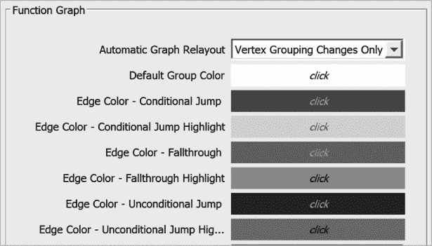

*图 10-10：函数图颜色自定义选项*

**节点**

每个节点的内容是相应基本块的反汇编列表。你与列出的代码的交互方式与在“列出窗口”中与代码交互的方式相同。例如，悬停在名称上会弹出一个显示该位置反汇编的框。当你将鼠标悬停在节点上时，Ghidra 会在相关的边上使用路径高亮动画，以指示当前选择的路径高亮选项一致的控制流方向。你可以在“编辑 ▸ 工具选项”中禁用此功能。

**卫星图**

卫星图（即图的简略概览）会围绕当前聚焦的块显示一个黄色光环，函数图窗口也是如此。为了便于识别，函数的入口块（包含函数入口地址）在卫星图中是绿色的，任何返回块（包含`ret`或等效指令的块）是红色的。即使你更改了图中相关块的背景颜色，卫星图中的入口和出口颜色也不会改变。所有其他块将镜像函数图窗口中分配给它们的颜色。

### 函数调用图

函数调用图有助于快速理解程序中函数调用的层次结构。函数调用图类似于函数图，但每个块代表一个完整的函数体，每条边代表从一个函数到另一个函数的调用交叉引用。

为了讨论函数调用图，我们使用以下简单的程序来创建一个简单的函数调用层次结构：

```
#include <stdio.h>

void depth_2_1() {

    printf("inside depth_2_1\n");

}

void depth_2_2() {

    fprintf(stderr, "inside depth_2_2\n");

}

void depth_1() {

    depth_2_1();

    depth_2_2();

    printf("inside depth_1\n");

}

int main() {

    depth_1();

}
```

使用 GNU `gcc` 编译一个动态链接版本的程序并通过 Ghidra 加载二进制文件后，我们可以通过窗口 ▸ 函数调用图生成一个函数调用图。默认情况下，这将创建一个以当前选中的函数为中心的函数调用图。当选择 `main` 时，函数调用图如 图 10-11 所示。（为了清晰起见，这些示例中隐藏了卫星视图。要取消隐藏卫星视图，可以使用 图 10-11 右下角的图标。）

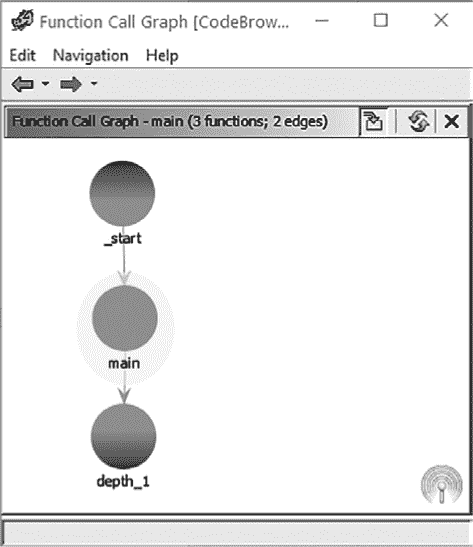

*图 10-11：聚焦于 main 的简单函数调用图*

图表标题栏中的字符串 *main（3 个函数；2 条边）* 让我们知道当前所在的函数，并显示相关函数和边的数量。将鼠标悬停在图中的节点上，会在节点的顶部和/或底部显示加号和/或减号图标，如 图 10-12 所示。

顶部或底部的加号图标表示可以显示更多的传入或传出函数。相反，减号图标则提供了收缩节点的功能。例如，点击展开时位于 `depth_1` 函数底部的减号符号，将会使得函数调用图从 图 10-13 中显示的状态切换为 图 10-11 中显示的状态。

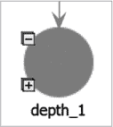

*图 10-12：带有展开/收缩图标的函数调用图节点*

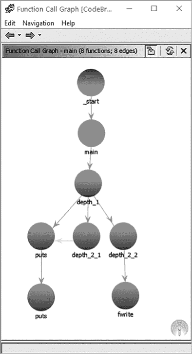

*图 10-13：从 main 扩展的函数调用图*

与每个节点关联的右键上下文菜单提供了一个选项，可以同时展开或收缩所有同一水平节点的所有传出边。这相当于同时点击同一等级上所有节点的加号或减号图标。最后，双击图中的节点会将图中心定位到选中的节点，并完全展开所有传入和传出边。一个默认禁用但许多人认为有用的选项，允许你进行缩放操作。可以通过编辑 ▸ 工具选项中的勾选“滚轮平移”选项来启用此功能。Ghidra 会在你切换焦点时维护一个简短的图历史记录缓存，以便你返回时保持图的状态。这使得你可以展开和收缩节点，离开然后返回，找到你离开时的图形状态继续分析。

图 10-14 显示了相同的程序，重点是 `_start` 而不是 `main`，并且大多数节点已完全展开，以显示图表的全部范围。除了我们的 `main` 函数和相关子例程外，我们还可以看到编译器插入的包装代码。该代码负责库的初始化和终止，以及在将控制权转移到 `main` 函数之前正确配置环境。（细心的读者可能会注意到，编译器将对 `puts` 和 `fwrite` 的调用替换为 `printf` 和 `fprintf`，因为它们在打印静态字符串时效率更高。）

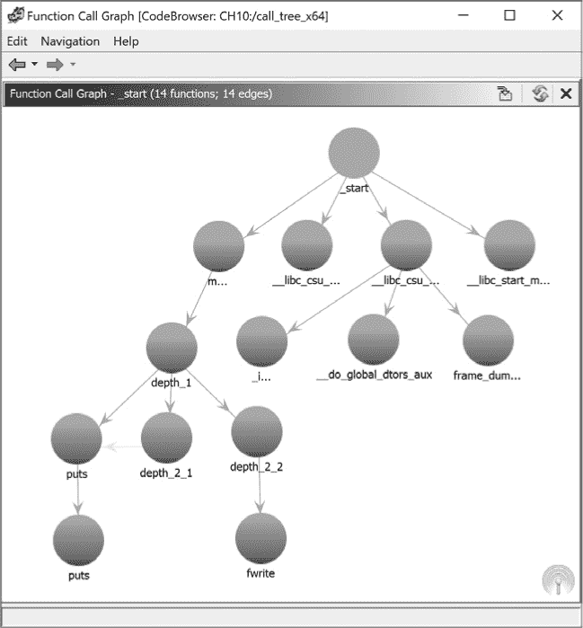

*图 10-14：从* _start 扩展的函数调用图

**THUNK**

你可能会注意到，图 10-14 中的图表显示了多次（显然是递归的）对 `puts` 的调用。欢迎进入神奇的 thunk 函数世界。*thunk 函数* 是一种编译器设备，它促进了对编译时地址未知的函数（如动态链接库函数）的调用。Ghidra 将地址未知的函数称为 *thunked* 函数。编译器将程序对 thunked 函数的所有调用替换为对编译器插入到可执行文件中的 thunk 函数存根的调用。*thunk 函数存根* 通常会执行表查找，以便在将控制权转移到 thunked 函数之前，获取该函数的运行时地址。thunk 存根查阅的表通常在运行时填充，待关联的 thunked 函数地址变得已知。在 Windows 可执行文件中，这个表通常称为 *导入表*。在 ELF 二进制文件中，这个表通常称为 *全局偏移表*（或 *got*）。

如果我们从 Listing 窗口中的 `depth_1` 函数导航到 `puts`，我们会进入以下列表：

```
    **************************************************************

    *                       THUNK FUNCTION                       *

    **************************************************************

             thunk int puts(char * __s)

                Thunked-Function: <EXTERNAL>::puts

     int               EAX:4          <RETURN>

     char *            RDI:8          __s

                puts@@GLIBC_2.2.5

                puts     XREF[2]: puts:00100590(T),

                                  puts:00100590(c), 00300fc8(*)

00302008                 ??         ??

00302009                 ??         ??

0030200a                 ??         ??
```

这个 thunk 函数列表出现在 Ghidra 所称的 `EXTERNAL` 程序部分。像这样的 Ghidra thunk 函数列表是外部库在运行时动态加载和链接到进程中的方式的结果，这意味着这些库在静态分析期间通常是不可用的。虽然该列表为你提供了被调用函数和库的指示，但函数代码并不直接可访问（除非库也被加载到 Ghidra 中，这可以通过导入过程中的选项页面轻松完成）。

在这里，我们还观察到一种新的 XREF 类型。第一个 XREF 上的 `(T)` 后缀表示这个 XREF 是指向 thunked 函数的链接。

现在，让我们回顾一下 `call_tree` 程序的静态链接版本。从 `main` 函数生成的初始图与图 10-11 所示的动态链接版本完全相同。不过，为了了解与静态链接二进制图形相关的潜在复杂性，让我们研究两个看似相对简单的扩展。图 10-15 显示了 `puts` 函数的外部调用。标题栏显示 *puts(9 个函数；11 条边)*。请注意，标题栏的总数可能不准确，直到程序被完全分析后才会更新。

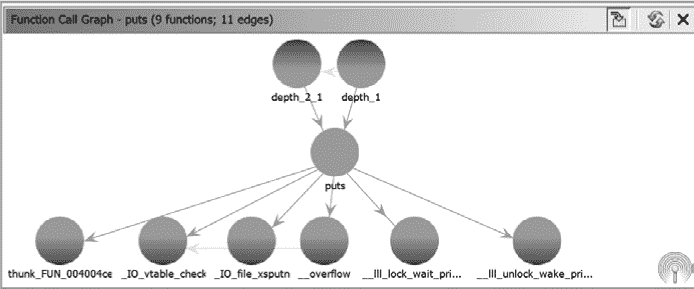

*图 10-15：静态链接二进制中的函数调用图*

当我们将焦点转向 *_lll_lock_wait_private* 时，会看到一个包含 70 个节点和超过 200 条边的庞大图形，部分内容如图 10-16 所示。

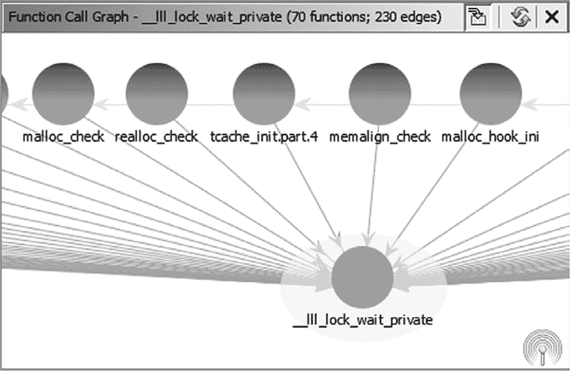

*图 10-16：静态链接二进制中的扩展函数调用图*

虽然静态链接的二进制文件比较复杂，处理相关图形可能具有挑战性，但有两个特点使这一过程变得可行。首先，你通常可以通过使用快捷键 G 或从程序的 `entry` 符号进行导航来定位 `main` 函数。其次，一旦你在列表中找到了 `main`，你就可以轻松打开并控制相关函数调用图中显示的内容。

### 树形结构

Ghidra 以类似树的结构展示了与特定二进制文件相关的许多层次化概念。虽然这些结构不一定在纯图论意义上是树，但它们提供了扩展和折叠节点的功能，并展示了不同类型节点之间的层次关系。当我们在第五章讨论 CodeBrowser 窗口时，你已经接触到了程序树、符号树、函数调用树以及数据类型管理器（它也是以树的形式呈现）。这些树形视图可以与其他视图并行使用，为你分析的二进制文件提供额外的见解。

### 总结

图形是帮助你分析任何二进制文件的强大工具。如果你习惯了以纯文本格式查看反汇编代码，可能需要一些时间来适应基于图形的显示方式。在 Ghidra 中，关键在于意识到所有在文本显示中可用的信息仍然可以在图形显示中找到；不过，它可能会以略有不同的格式呈现。例如，交叉引用在图形显示中变成了连接各个模块的边。

你查看的图形取决于你想要了解二进制文件的哪些信息。如果你想知道某个特定函数是如何被调用的，你可能对函数调用图更感兴趣。如果你想了解某条特定指令是如何被访问的，你可能更关注函数图。两者都能为你提供有关程序运行的有价值的见解。

现在你已经了解了在仅有你作为反向工程师的情况下运行 Ghidra 作为独立实例时可用的基本功能，接下来是时候探讨将 Ghidra 用作协作工具的选项了。在下一章中，我们将了解 Ghidra Server 以及它提供的支持协作反向工程的环境。
