# 第十四章：**协作性 SRE**


到目前为止，你应该已经能够熟练地浏览 Ghidra 项目环境以及许多可用的工具和窗口。你知道如何创建项目、导入文件、浏览和操作反汇编。你理解 Ghidra 数据类型、数据结构和交叉引用。但你是否理解规模？一个 200MB 的二进制文件很可能会生成数百万行的反汇编，并包含数十万个函数。即使你拥有一台最大尺寸的、纵向显示的显示器，你一次也只能查看其中几百行反汇编。

承担这样一项巨大的任务的一种方法是分配一个团队来完成，但这会引入一个额外的问题：如何同步每个人的工作，以免他们在更改时互相干扰？现在是时候扩展我们对 Ghidra 使用的讨论，涵盖一个协作团队共同在一个共享项目上工作。Ghidra 对协作逆向工程的支持使其在软件分析工具中独树一帜。在本章中，我们将介绍 Ghidra 的协作服务器，该服务器随标准 Ghidra 分发包一起提供。我们将讨论它的安装、配置和使用，帮助你让更多的人集中精力解决最具挑战性的 RE 问题。

### 团队合作

SRE 是一个复杂的过程，很少有人能精通其中的所有细节。能够让具有不同技能的分析师同时分析一个二进制文件，可以大大减少获得所需结果所需的时间。一个擅长在复杂程序中导航控制流的人，可能会不愿意分析和记录相关的数据结构。一个恶意软件分析专家，可能不适合进行漏洞发现工作，而任何时间紧迫的人，也不太可能利用时间插入大量注释，这些注释在未来肯定会有用，但短期内可能会阻碍他们分析其他代码。五个同事可能希望独立分析同一个二进制文件，但他们意识到有些步骤是他们都需要完成的。一个人可能需要将任务交给同事，以便获得专家意见，或是在度假期间。 有时，多个视角同时审视同一件事有助于进行理智检查。无论动机如何，Ghidra 内的共享项目功能都支持多种形式的协作 SRE。

### Ghidra 服务器设置

Ghidra 中的协作是通过共享的 Ghidra Server 实例来实现的。如果你是负责设置 Ghidra Server 的系统管理员，你有许多选择，比如是否在实体服务器上部署，还是在虚拟环境中部署以便于迁移和可重复安装。本章中我们使用的部署方式仅适用于开发和实验。如果你正在为生产环境配置 Ghidra Server，应该仔细阅读 Ghidra Server 文档，并根据你的环境和特定需求确定合适的配置。（整个书籍可以用来描述 Ghidra Server 的设置及其所有安装选项和相关方法，但这本书并不涉及这些内容。）

尽管 Ghidra Server 可以在所有支持 Ghidra 的平台上进行配置，但我们将描述如何在 Linux 环境中运行 Ghidra Server 实例，并假设你对 Linux 命令行和系统管理有一定的了解。在本章中，我们将对 Ghidra Server 配置文件（位于 *server/server.conf*）进行一些小的修改，以便展示我们希望演示的概念，避免在完成初始安装、配置、管理和访问控制后过度依赖 Linux 命令行界面。修改内容包括将默认的 Ghidra 仓库目录更改为我们自己选择的目录，正如 Ghidra Server 文档中推荐的那样，并调整用户管理和访问控制设置。

**GHIDRA SERVER 特性**

你的 Ghidra Server 很高兴为你提供以下安装选项：

**平台** 实体服务器、虚拟机、容器等！

**操作系统** 支持多种版本的 Windows、Linux 和 macOS，总有一种适合你的口味。

**认证方法** 选择你的朋友和同事如何访问你的服务——从“对公众开放”到“仅限 PKI”以及介于两者之间的所有方式。

**准备工作** 你可以通过容器、脚本、*.bat* 文件或详细的说明进行安装，或者你可以通过在控制台上敲击指令直到发生一些令人兴奋的事情，来自定义你的安装过程。

如果你没有找到喜欢的选项，不用担心，因为这里仅展示了部分可用选项。Ghidra Server 的配置可以满足即使是最挑剔用户的需求，为他们提供理想的 Ghidra 安装体验。感谢你访问 Ghidra Server。欲了解更多信息，请参阅位于 Ghidra 目录中的扩展服务器菜单 *server/svrREADME.html*。

以下步骤将引导你通过一个脚本过程，在 Ubuntu 主机上创建一个环境并初始化 Ghidra 用户。

1.  定义脚本中将使用的环境变量，包括你正在安装的 Ghidra 版本：

    ```
    #set some environment variables

    OWNER=ghidrasrv

    SVRROOT=/opt/${OWNER}

    REPODIR=/opt/ghidra-repos

    GHIDRA_URL=https://ghidra-sre.org/ghidra_version.zip

    GHIDRA_ZIP=/tmp/ghidra.zip
    ```

1.  安装两个必要的包（*unzip* 和 *OpenJDK*），这些是完成安装并运行服务器所需要的：

    ```
    sudo apt update && sudo apt install -y openjdk-version-jdk unzip
    ```

1.  创建一个非特权用户来运行服务器，并创建一个目录来托管 Ghidra 仓库，该目录位于 Ghidra 服务器安装目录之外。根据服务器配置指南，建议将服务器可执行文件和仓库保存在不同的目录中，这有助于未来的服务器更新。Ghidra 服务器管理工具（svrAdmin）将使用服务器管理员用户的主目录。```
    sudo useradd -r -m -d /home/${OWNER} -s /usr/sbin/nologin -U ${OWNER}

    sudo mkdir ${REPODIR}

    sudo chown ${OWNER}.${OWNER} ${REPODIR}
    ```

1.  下载 Ghidra，解压并将其移动到服务器根目录。确保在下载 Ghidra 时获取最新的公开发布版本（发布日期在 *.zip* 文件名中）：

    ```
    wget ${GHIDRA_URL} -O ${GHIDRA_ZIP}

    mkdir /tmp/ghidra && cd /tmp/ghidra && unzip ${GHIDRA_ZIP}

    sudo mv ghidra_* ${SVRROOT}

    cd /tmp && rm -f ${GHIDRA_ZIP} && rmdir ghidra
    ```

1.  创建原始服务器配置文件的备份，并更改仓库保存的位置：

    ```
    cd ${SVRROOT}/server && cp server.conf server.conf.orig

    REPOVAR=ghidra.repositories.dir

    sed -i "s@^$REPOVAR=.*\$@$REPOVAR=$REPODIR@g" server.conf

    ```

1.  将 `-u` 参数添加到 Ghidra 服务器启动参数中，以便用户在连接时可以指定用户名，而不是被迫使用本地用户名。此选项使我们能够从一台机器登录为多个不同的用户进行演示，并允许我们从多台机器登录同一账户。（一些版本的 Ghidra 期望仓库路径是最后一个命令行参数，因此我们将 `parameter.2` 更改为 `parameter.3`，然后在更新的行之前添加了新的 `parameter.2=-u`。）

    ```
    PARM=wrapper.app.parameter.

    sed -i "s/^${PARM}2=/${PARM}3=/" server.conf

    sed -i "/^${PARM}3=/i ${PARM}2=-u" server.conf

    ```

1.  将 Ghidra 服务器进程和 Ghidra 服务器目录的所有权更改为 *ghidrasvr* 用户。（由于这只是一个演示服务器，我们保持了所有其他参数不变。强烈建议您阅读 *server/svrREADME.html* 以确定适合生产部署的配置。）

    ```
    ACCT=wrapper.app.account

    sed -i "s/^.*$ACCT=.*/$ACCT=$OWNER/" server.conf

    sudo chown -R ${OWNER}.${OWNER} ${SVRROOT}
    ```

1.  最后，作为服务安装 Ghidra 服务器并添加授权连接到服务器的用户：

    ```
    sudo ./svrInstall

    sudo ${SVRROOT}/server/svrAdmin -add user1

     sudo ${SVRROOT}/server/svrAdmin -add user2

    sudo ${SVRROOT}/server/svrAdmin -add user3
    ```

尽管有关访问控制的详细讨论将在本章稍后部分进行，但在此提到它仍然很重要，因为用户需要存在于 Ghidra 服务器实例所使用的认证系统中。这发生在 Ghidra 服务器本身。默认情况下，每个用户必须在 24 小时内通过使用默认密码*changeme*（在首次登录时必须更改）从 Ghidra 客户端登录。如果用户未在 24 小时内激活他们的账户，该账户将被锁定并且必须重置。Ghidra 为 Ghidra 服务器系统管理员提供了多种认证选项，从简单的密码到公钥基础设施（PKI）。我们选择使用本地 Ghidra 密码（这是默认的）。

如果您想安装自己的 Ghidra 服务器或只是需要更深入地了解各种安装选项，请参阅 Ghidra 目录中的 *server/svrREADME.html*。

**项目仓库**

团队合作的一个优势是多个人可以同时在同一个二进制文件上工作。团队合作的一个劣势是多个人可以同时在同一个二进制文件上工作。当多个用户与相同内容交互时，可能会引入竞争条件。在*竞争条件*中，操作（例如保存更新的文件）执行的顺序可能会影响最终结果。Ghidra 拥有项目库和版本控制系统，以控制哪些更改何时由谁提交。

Ghidra 仓库负责文件的签入和签出，跟踪版本历史，并让你查看当前已签出的文件。当你签出一个文件时，会得到该文件的副本。当你完成文件操作并将文件签回时，会创建文件的新版本，并成为该文件的版本历史的一部分。如果其他人也签入了该文件的新版本，仓库会帮助解决任何冲突。我们将在本章稍后演示与仓库的交互。

### 共享项目

到目前为止，我们只创建并使用了独立的 Ghidra 项目，适用于单个分析师在单台计算机上工作。现在你已经配置并授权自己访问 Ghidra 服务器，接下来我们将介绍创建共享项目的过程。共享项目可以让任何被授权连接到你 Ghidra 服务器的用户访问，并支持项目的协作并发访问。

#### *创建共享项目*

当你创建一个新项目（文件 ▸ 新建项目）并选择共享项目时，必须指定与 Ghidra 服务器关联的服务器信息，如图 11-1 左侧所示。默认端口号（13100）已提供，但你必须提供服务器的主机名或 IP 地址，并且可能需要根据 Ghidra 服务器的配置进行身份验证。

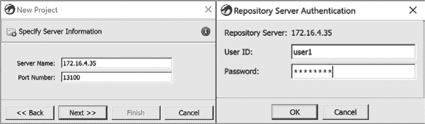

*图 11-1：登录到 Ghidra 服务器仓库*

在图的右侧，我们以通过安装脚本创建的用户之一（*user1*）登录。如果这是第一次以此用户身份登录，您需要更改密码（从*changeme*开始），如前文所述。

接下来，选择一个现有的仓库，或通过输入新仓库名称来创建一个新仓库，如图 11-2 所示。在这个例子中，我们将创建一个名为*CH11*的新仓库。

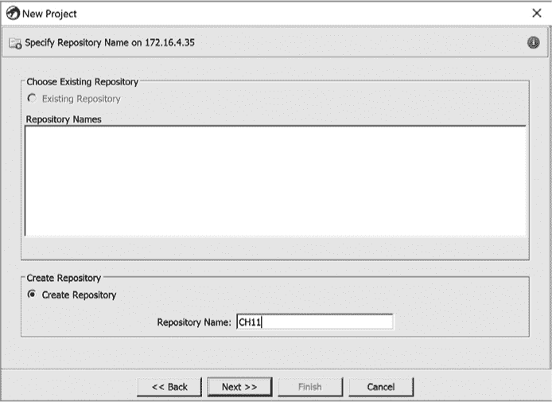

*图 11-2：新建项目对话框*

点击**下一步**会创建一个新的仓库和新项目，并带你进入熟悉的项目窗口（图 11-3）。

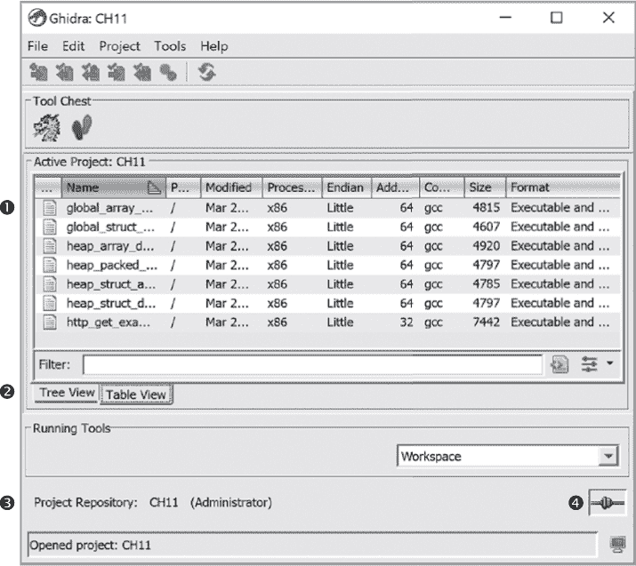

*图 11-3：共享项目的项目窗口，显示表格视图*

我们已导入一些文件 ➊，并使用表格而不是默认的树状结构显示它们。*表视图*是选项卡布局选择之一 ➋，可以提供关于每个项目文件更详细的信息。项目窗口显示项目仓库的名称（*CH11*），您在项目中的角色（管理员），以及右侧的图标以提供有关连接服务器的信息 ➌。在这种情况下，悬停在图标上 ➍ 会显示消息：“作为用户 1 连接到 172.16.4.35。” 如果未连接，图标将显示为断开的链接，而不是显示的连接链接。

#### *项目管理*

一旦项目创建并有管理员，授权用户可以登录服务器并与项目一起工作。成功登录后，您将进入 Ghidra 项目窗口，其中您将可以访问您授权的项目。

**这里谁才是老大？**

服务器管理员负责创建 Ghidra 服务器帐户并配置连接到服务器的身份验证协议。服务器管理是一种完全基于命令行的活动，服务器管理员无需自己是 Ghidra 用户。在客户端，任何授权用户均可在 Ghidra 服务器上创建存储库，并自动成为他们创建的每个存储库的管理员。这使他们完全控制存储库，包括谁可以访问以及每个用户可以拥有的访问类型。创建后，管理员可以通过 Ghidra 的项目窗口向其他授权用户授予访问权限。

**我不想分享**

对于非共享项目，使用 Ghidra 服务器安装也有优势。您最初介绍了如何在单台计算机上安装 Ghidra，并使用该计算机访问您的项目和文件（所有这些都存储在该计算机上）。这意味着所有分析工作都依赖于该计算机。Ghidra 服务器支持从各种设备进行多点访问您的文件。您可以在访问文件之前要求进行身份验证，并且如果需要，可以将项目从非共享转换为共享。一个限制是您需要连接到 Ghidra 服务器才能签出或签入文件。

### 项目窗口菜单

现在我们已经创建并连接到 Ghidra 服务器，项目窗口中的选项变得更加有意义，因为一些先前不可用的选项现在具有新的上下文。在这里，以及在第十二章中，我们讨论了各个菜单组件及其如何用于改进您的分析过程。

#### *文件*

文件菜单显示在 图 11-4 中。文件菜单中的前五个选项是相当标准的文件类型操作，它们的行为与您从菜单驱动的应用程序中所期望的一样。我们将详细讨论用数字标记的显著选项。

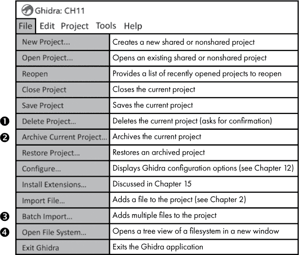

*图 11-4：文件菜单*

##### 删除项目

在 Ghidra 中删除项目 ➊ 是一种不可撤销的永久操作。幸运的是，这需要努力并需要确认。首先，您不能删除正在使用的活动项目。这最大程度地减少了意外删除的危险。要删除项目，您必须完成以下三个步骤：

1.  从菜单中选择**文件** ▸ **删除项目**。

1.  浏览到（或输入名称）要删除的项目。

1.  在结果确认窗口中确认您要删除该项目。

删除项目会删除其所有关联文件。因此，首先通过“归档当前项目”选项➋归档项目可能是明智的选择。

##### 项目归档

归档项目允许您保存项目的快照、其关联文件和关联工具配置。归档项目的原因包括以下几点：

+   你打算删除该项目，但希望保留一份副本“以防万一”。

+   你想要为迁移到另一台服务器的项目打包。

+   您希望能够轻松在 Ghidra 不同版本之间传输版本。

+   您希望创建项目的备份。

按照以下步骤归档项目：

1.  关闭 CodeBrowser 窗口和所有相关工具。

1.  从菜单中选择**文件** ▸ **归档当前项目**。

1.  在您的本地机器上选择归档文件的位置和名称。

如果选择了现有文件的名称，您将有机会更改名称或覆盖现有文件。归档文件可以通过“恢复项目”选项轻松恢复。

##### 批量导入

批量导入选项（在 图 11-4 的 ➌ 处）允许您在单个操作中将文件集合导入项目。当您选择文件 ▸ 批量导入时，Ghidra 显示一个类似于 图 11-5 中所示的文件浏览器窗口。此窗口允许您导航到包含您希望导入的文件的目录。

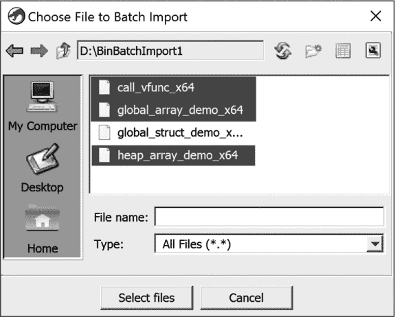

*图 11-5：批量文件导入选择窗口，已选择文件*

你可以从单个目录中选择文件（或多个文件），或选择整个目录，将其添加到批量导入列表中。在突出显示文件并点击“选择文件”按钮后，你将进入批量导入窗口，显示你已经选择用于导入的文件。在图 11-6 中，来自目录*BinBatchImport1*的文件作为单独文件加载，而目录*BinBatchImport2*则作为目录添加，右侧显示五个文件。你可以添加/删除文件以完善导入列表，并控制多个选项，包括在目录中查找文件时的递归深度。

要在批量导入窗口中确定适当的深度限制，或仅仅是浏览文件系统，可以使用“打开文件系统”菜单选项（见图 11-4 中的➍）。该选项会在单独的窗口中打开选定的文件系统容器（*.zip*文件、*.tar*文件、目录等）。(最好提前确定深度，因为如果你需要同时操作两个窗口，你将需要打开第二个 Ghidra 实例。在单一实例中，每个窗口会阻止对另一个窗口的访问。)

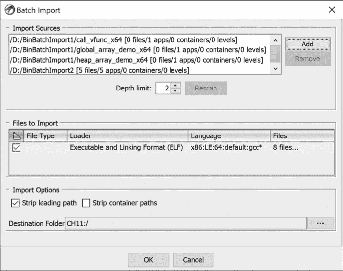

*图 11-6：批量文件导入确认对话框*

#### *编辑*

编辑菜单如图 11-7 所示。工具选项和插件路径选项将在第十二章中讨论，但 PKI 选项与 Ghidra 服务器的设置相关，因此值得在本章中进行讨论。

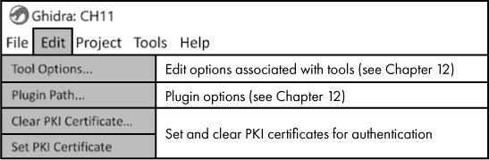

*图 11-7：编辑菜单*

##### PKI 证书

如本章开头所述，当你设置 Ghidra 服务器时，可以选择几种身份验证方法。我们设置了一个简单的服务器，使用用户名和密码进行身份验证。PKI 证书则更为复杂。虽然 PKI 的实现方式可能有所不同，但以下示例代表了一个合理的 Ghidra 服务器 PKI 客户端身份验证过程：

*User1*希望进行身份验证，以便她可以在 Ghidra 服务器项目上工作。她拥有一张包括用户名和公钥的客户端证书。她还持有与证书中公钥对应的私钥，并将其安全地存放，以便在此类重要场合使用。她的证书由一个受 Ghidra 服务器信任的证书颁发机构（CA）进行加密签名。

*User1*向服务器提供她的证书，服务器可以从中提取公钥和用户名。服务器进行检查以确认证书有效（例如，证书没有在证书撤销列表中、在有效的日期范围内、并且有受信任的证书颁发机构的有效签名，可能还有其他检查）。如果所有检查都通过，服务器确认证书有效并将*User1*的身份与公钥绑定。现在，*User1*需要证明她拥有相应的私钥，以便 Ghidra 服务器可以验证它与提取的公钥匹配。只要私钥确实仅由*User1*持有，Ghidra 服务器就会正确验证她的证书，服务器会验证*User1*确实拥有私钥，因此*User1*被认为已经通过身份验证。

管理 PKI 证书授权的过程可以在 Ghidra Server 的自述文件(*server/svrREADME.html*)中找到。设置 PKI 证书和清除 PKI 证书的菜单选项使用户能够将自己与密钥文件（**.pfx**、**.pks**、**.p12**）关联（或取消关联）。在设置 PKI 证书时，用户会获得一个文件导航窗口，用于识别合适的密钥库。证书可以随时通过“清除 PKI 证书”选项进行清除。如果选择启用 PKI 身份验证，Java 的`keytool`工具可以用于管理密钥、证书和 Java 密钥库。

#### *项目*

如图 11-8 所示，项目菜单提供了管理项目级活动的功能，包括查看和复制其他项目中的内容、更改密码，以及管理你所管理的项目的用户访问权限。


*图 11-8：项目菜单*

##### 查看项目和代码库

前四个选项➊与查看项目和代码库有关。前两个选项“查看项目”和“查看代码库”会在与活动项目窗口相邻的新窗口中打开项目（本地）或代码库（远程服务器）的只读版本。在图 11-9 中，本地项目*ExtraFiles*已在活动项目旁边打开。你可以浏览该只读项目，或将“只读项目数据”窗口中的任何文件或目录拖动到活动项目窗口中。在图 11-9 中，三个被选中的文件（扩展名为*NEW*）已经从项目数据窗口复制到活动项目中：*CH11*。

下一个选项“查看最近的”提供了一个最近项目的列表，可以加快定位项目或代码库的过程。关闭视图会关闭只读视图（尽管在某些版本的 Ghidra 中，这个选项似乎是无效的）。一个更简单可靠的替代方法是点击你想要关闭的项目标签底部的 X 按钮，如图 11-9 右下角所示。

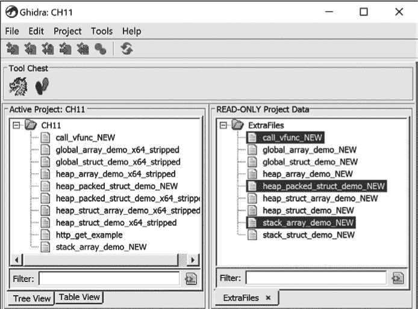

*图 11-9：使用项目窗口查看另一个项目*

##### 更改密码和项目访问权限

更改密码选项（位于图 11-8 中的 ➋）仅适用于共享项目中的用户，前提是 Ghidra 服务器已配置了允许密码更改的身份验证方法。这是一个两步过程，首先是初始确认对话框，如图 11-10 所示，接着是与初始强制密码更改相同的密码更改选项对话框。


*图 11-10：密码更改初始确认对话框*

虽然用户可以各自控制自己的密码，但共享项目还提供了控制谁可以访问项目以及授予每个用户哪些权限的能力。如本章前面所述，Ghidra 服务器系统管理员对访问权限有一定的控制权。具体而言，管理员可以为仓库分配管理员并创建和删除用户账户。

在客户端，如果您是管理员，还可以通过项目菜单中的“编辑项目访问列表”选项（位于图 11-8 中的 ➌）控制访问。当选择该选项时，您将看到图 11-11 中所示的对话框，该对话框允许您添加和删除项目中的用户，并控制他们的相关权限。每个用户只能被放置在一个特定的权限类中，从最少权限（左侧的只读）到最高权限（右侧的管理员）。

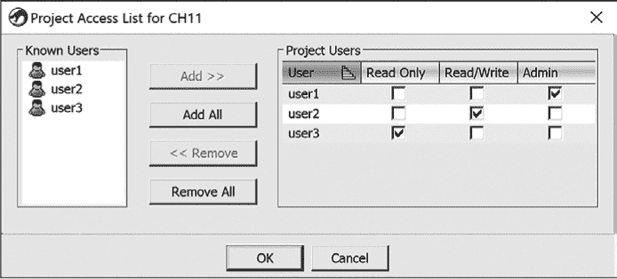

*图 11-11：访问控制窗口*

##### 查看项目信息

最后的菜单选项是查看项目信息（位于图 11-8 中的 ➍）。结果对话框中提供的选项取决于项目是否托管在 Ghidra 服务器上。图 11-12 展示了非服务器型（左）和服务器型（右）项目信息对话框的示例。虽然显示的信息相当直观，但每个窗口底部的按钮允许您将非共享项目转换为共享项目（通过“转换为共享”按钮）或更改项目信息。

点击“转换为共享”按钮会打开一个对话框，要求您指定服务器信息并输入项目管理员的用户 ID 和密码。随后的步骤允许您指定一个仓库、添加用户、设置他们的权限，并确认是否要转换项目。请注意，此操作无法撤销，并且会删除所有现有的本地版本历史。

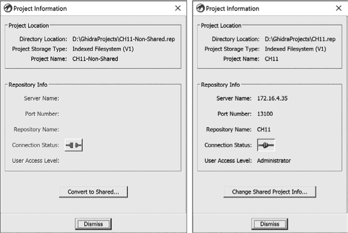

*图 11-12：非共享和共享项目的项目信息窗口*

### 项目仓库

到此为止，你可能会想，如何在保持项目完整性的同时共享项目？本节将介绍 Ghidra 用来确保每个人的工作在共享项目中得到保留的过程，团队可以并行工作。在深入讨论过程之前，让我们先了解与共享 Ghidra 项目相关的文件类型。我们将从讨论项目与仓库之间的关系开始。

仓库是版本控制过程的关键推动力。当你创建一个新的非共享项目时，会创建一个项目文件（*.gpr* 文件）和一个带有 *.rep* 扩展名的仓库目录，以便于版本控制。还会创建其他文件来控制锁定、版本控制等，但理解每个文件的目的对于成功使用 Ghidra 并非至关重要。对于非共享项目，所有文件都存储在你指定的目录中，这些目录位于项目创建时的计算机上（参见 第四章）。

当你创建一个共享项目时，你可以选择创建一个新的仓库，或者从现有仓库中选择，如本章前面所讨论的（参见 图 11-2）。如果你同时创建一个新项目和新仓库，那么项目和仓库之间会形成一对一的关系，而你成为项目管理员。如果你选择一个现有的仓库，你正在为一个你不是项目管理员的新项目创建（除非你拥有该仓库）。无论哪种情况，*.gpr* 文件和 *.rep* 目录共享相同的基本名称。如果仓库名为 RepoExample，则项目文件将命名为 *RepoExample.gpr*，仓库文件夹将命名为 *RepoExample.rep*。（尽管具有扩展名，仓库实际上是一个目录，而不是文件。）

总结一下：如果你创建了仓库，那么你就是项目管理员，可以选择其他谁可以访问你的仓库。如果你使用现有的仓库，那么你就是一个用户，拥有项目管理员分配给你的权限和特权。那么，当多个用户想要对同一个项目进行更改时，会发生什么呢？这就是版本控制发挥作用的地方。

**版本控制与版本跟踪**

Ghidra 包含两种非常不同的版本控制系统。在本章中，我们讨论的是版本控制，并希望这一概念很快能变得非常清晰。Ghidra 还具有 *版本追踪* 功能。版本追踪用于识别两个二进制文件之间的差异（和相似性）。在 SRE 社区中，这个过程通常称为 *二进制差异比较*。目标可能包括识别二进制文件不同版本中的更新、识别恶意软件家族使用的函数、识别签名等。由于相关的源代码可能不可用，因此源代码级别的差异比较无法进行，Ghidra 的版本追踪功能显得尤为重要。关于 Ghidra 版本追踪的更多细节将在第二十三章中讨论。

#### *版本控制*

*版本控制* 是任何可以由多个用户进行更改，或需要记录更改历史的系统中的一个重要概念。版本控制允许你管理系统的更新，有效控制竞争条件。项目窗口中有一个版本控制工具栏（图 11-13）。许多操作要求相关文件必须处于关闭状态才能完成该操作。

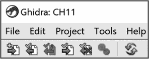

*图 11-13：Ghidra 项目窗口版本控制工具栏*

图标根据所选文件的有效性启用相应的版本控制操作。组成版本控制工作流程的基本操作显示在图 11-14 中。（我们还提供了一列，列出了所有 Git 爱好者大致的 Git 等效操作。）


*图 11-14：Ghidra 版本控制工具栏操作*

除了使用工具栏图标，你还可以通过右键点击上下文菜单执行版本控制操作。

##### 合并文件

当协作团队成员决定将他们所做的更改提交到项目中时，以下两种情况之一将成立：

**无冲突** 在这种情况下，自用户检出文件以来，文件没有被检查出新的版本。由于不存在潜在冲突（没有用户未察觉的提交冲突），被检入的文件将成为文件的新版本。旧版本将以存档的形式保留，并且版本号将递增，以确保可以跟踪版本的连续链。

**潜在冲突** 在这种情况下，另一个用户在该用户检查文件时提交了新的更改。文件检查的顺序可能会影响最终的“当前版本”。在这种情况下，Ghidra 开始执行合并过程。如果提交中没有引入冲突，Ghidra 将继续进行自动合并。如果检测到冲突，必须由用户手动解决每个冲突。

作为一个冲突示例，假设*user1*和*user2*都已经签出同一个文件，且*user2*将`FUN_00123456`的名称更改为`hash_something`并提交了更改。与此同时，*user1*分析了同一个函数并将其重命名为`compute_hash`。当*user1*最终提交更改时（在*user2*之后），他们将被告知名称冲突，并被要求在`hash_something`和`compute_hash`之间选择正确的函数名，才能完成提交操作。关于此过程的更多信息，请参阅 Ghidra 帮助文档。

**版本控制注释**

当你在版本控制下添加或修改文件时，应添加一条注释解释你所做的更改。每次版本控制操作都会显示一个对话框，其中包含注释字段和一些特殊选项。图 11-15 显示了“添加文件到版本控制”注释对话框。

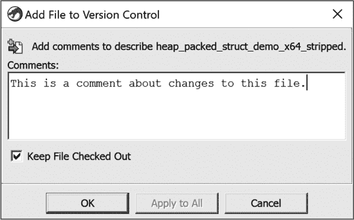

*图 11-15：Ghidra 的“添加文件到版本控制”注释对话框*

标题栏显示正在执行的操作，下面补充了与之关联的图标，并描述了你应在“注释”文本框中输入的内容。如果选择了多个文件，则任何注释将仅与第一个文件关联，除非点击了“应用到所有”按钮。在“注释”文本框下方是与正在执行的操作相关的特定选项，用户可以选择或取消选择这些选项。有关每个操作的特殊选项，请参见图 11-14 的第三列。

#### *示例场景*

共享项目涉及许多复杂的细节、选项和术语。为了澄清与 Ghidra 服务器和共享项目相关的一些概念，我们通过一个示例来展示我们所讨论的概念，从项目的概念开始。

一个*项目*是存在于客户端机器上的本地实体（就像本地的 Git 仓库）。共享项目还与 Ghidra 服务器上的仓库相关联（类似于 Git 远程仓库），该仓库存储所有协作分析工作的结果。在文件被导入并添加到版本控制后，它们会被共享，在此之前它们是私有的。因此，用户可以将文件导入项目，在此时它们是私有的，然后选择将它们添加到版本控制，这时它们变成共享的。

**HELP! 我的文件被劫持了！**

Ghidra 为共享项目环境中经常发生的情况提供了一个特殊的术语（及相关的项目数据树图标）。如果你在项目中有一个私有文件（已导入但尚未添加到版本控制中），并且另一个用户将同名的文件添加到仓库中，你的文件将被 *劫持*！这是一个非常常见的情况，因此 Ghidra 提供了一个右键菜单选项来处理这一情况。你需要关闭被劫持的文件，然后从右键菜单中选择撤销劫持选项。这样，你将有机会接受仓库中的文件，并在需要时保留自己的文件副本。解决劫持问题的其他选项包括重命名文件、将其移至其他项目或删除它。

实际上，项目权限实际上就是仓库权限。如果你使用现有仓库创建一个项目，实际上是在说，“这个项目在本地由服务器上的那个仓库远程支持”（就像 Git 克隆）。让我们通过一系列共享项目活动来观察它们如何影响共享项目环境：

1.  *user1* 创建了一个新的共享项目（及相关的新仓库）叫做 *CH11-Example*，并将 *user2* 和 *user3* 添加到项目中，赋予他们权限（见图 11-16）。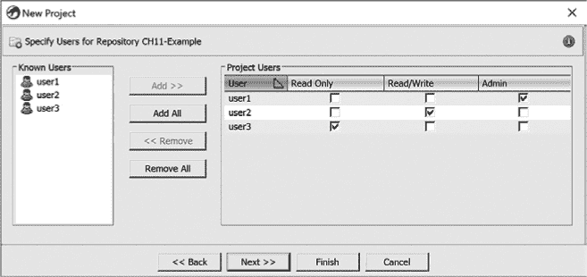

    *图 11-16：示例场景，步骤 1*

1.  *user2* 创建了一个与现有 *CH11-Example* 仓库相关联的新共享项目（即 *user2* 克隆了 *CH11-Example*）。注意，项目的名称与 *user1* 的项目不同，但仓库（远程）是相同的。此外，*user2* 在仓库中的权限显示在窗口底部（见图 11-17）。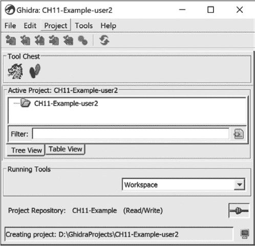

    *图 11-17：示例场景，步骤 2*

1.  *user1* 导入一个文件并将其添加到版本控制中，*user2* 随后也能看到该文件（大致等同于 `git add`/`commit`/`push`）。如图 11-18 所示。

    *图 11-18：示例场景，步骤 3*

1.  *user1* 和 *user2* 然后分别将相同的文件导入到各自的项目中，但没有将它们添加到版本控制中。这些是私有文件（见图 11-19）。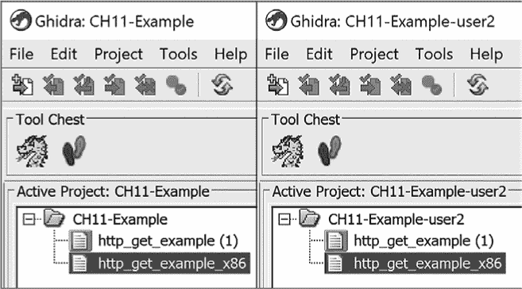

    *图 11-19：示例场景，步骤 4*

1.  *user2* 将第二个文件添加到版本控制中（这会将其提交）。结果，文件不再是私有的。*user1* 现在将其视为被劫持的文件（见图 11-20）。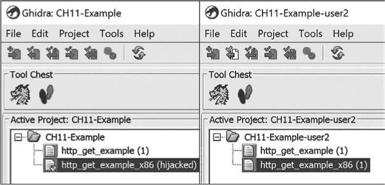

    *图 11-20：示例场景，步骤 5*

1.  *user1* 选择了右键菜单中的“撤销劫持”选项，并可以选择用代码库中的版本替换她的文件，并保留自己的文件副本（如果需要）。她选择接受代码库版本并保留自己的文件副本（她已将其移至另一个项目，现在该文件的扩展名为*.keep*）。现在一切恢复正常。在这种情况下，*user1* 现在看到的是第二个文件的状态，即当 *user2* 将其添加到版本控制时的状态（见图 11-21）。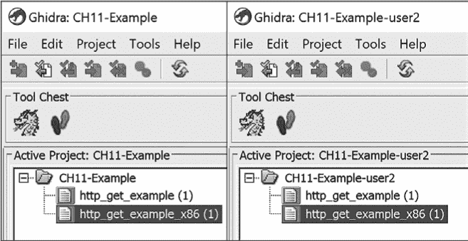

    *图 11-21：示例场景，第 6 步*

1.  *user1* 检出了第二个文件，进行了分析，然后提交了该文件。现在，*user1* 和 *user2* 都能看到该文件的分析版本（版本 2），如图 11-22 所示。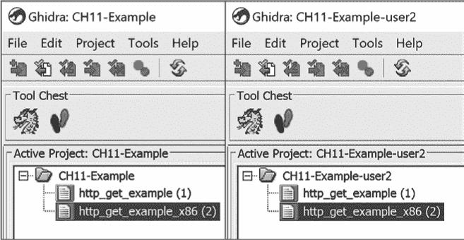

    *图 11-22：示例场景，第 7 步*

1.  *user3* 创建了一个项目并将其与相同的代码库关联（见图 11-23）。*user3* 现在可以看到所有文件，并且可以在本地进行更改（包括添加私有文件），但没有提交到代码库的选项，因为她没有被授予写入权限。（该项目在窗口底部标注为“只读”。）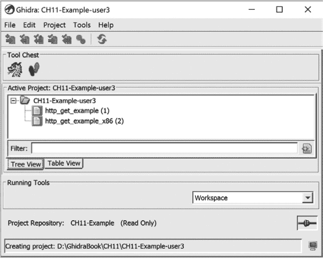

    *图 11-23：示例场景，第 8 步*

1.  *user2* 在下班前提交了所有文件。这一点很重要，因为她知道自己希望通过在家用电脑上继续工作。由于该项目在她的家用电脑上不存在，她需要登录到 Ghidra 服务器并使用现有的代码库创建一个新项目。这将在她的家用电脑上创建该项目，并且她可以继续工作。（如果她在离开工作时没有提交所有文件，她将无法在家中访问到最新的工作。）

1.  其余的用户回家时确信他们的协作 Ghidra 服务器正在按预期工作。

### 总结

并不是每个用户都需要 Ghidra 服务器或共享项目来促进协作式逆向工程，但许多相关的功能也可以应用于非共享项目。接下来的章节将集中讨论非共享项目，并在适当时提到共享项目和 Ghidra 服务器。无论你的 Ghidra 安装配置如何，都有可能默认配置、工具和视图并不完全适合你的工作流。下一章将重点讨论 Ghidra 的配置、工具和工作区，以及如何让它们更好地适应你的需求。
