## 第十五章：自定义 Ghidra**

在使用 Ghidra 一段时间后，你可能会偏好某些设置，希望在每次打开新项目时使用这些设置作为默认，或者希望将其应用于特定项目中的所有文件。此时，你可能会感到困惑，为什么有些你更改的选项会在会话之间持续存在，而其他选项则每次加载新项目或文件时都需要重新设置。在本章中，我们将探讨如何自定义 Ghidra 的默认外观和行为，以更好地满足你的逆向工程需求。

为了理解一些自定义设置的范围，理解*插件*和*工具*之间的（模糊）区别是很有用的。从一般意义上讲，以下是成立的：

**插件** 插件是一个软件组件（例如，字节查看器、列表窗口等），它为 Ghidra 添加功能。插件通常表现为窗口，但许多插件在后台执行工作（例如，分析器）。

**工具** 工具可以是单个插件或一组协同工作的插件。它们通常表现为一个有用的图形用户界面（GUI），帮助用户完成任务。我们一直在使用的一个工具——CodeBrowser，是一个作为 GUI 框架的窗口。功能图也是一个工具。

如果这些定义没有严格遵循，也不要慌张。在许多情况下，区分两者并不重要。例如，后面将讨论的工具选项菜单中，包括了一些可以同时应用于工具和插件的选项，尽管使用的是*工具*一词。在这种情况下，以及其他许多情境中，区分它们并不重要，因为它们被视为相同。即使术语的使用有所不同，你也应该能够成功地完成自定义过程。

除了 Ghidra 的自定义设置外，我们还将讨论 Ghidra 的*工作空间*，以完整本章内容。工作空间将工具与配置结合，提供设计和使用个性化虚拟桌面的功能。

### CodeBrowser

在第四章和第五章中，我们介绍了 CodeBrowser 及其许多相关窗口。我们已经涵盖了一些基本的自定义选项；现在我们将在继续介绍 Ghidra 项目窗口和工作空间之前，详细讲解 CodeBrowser 的自定义示例。

#### *重新排列窗口*

以下六个基本操作可以帮助你控制各个窗口在 CodeBrowser 窗口中的显示位置：

**打开** 窗口通常通过 CodeBrowser 的窗口菜单打开。每个窗口都有默认设置，决定它打开的位置。

**关闭** 窗口可以通过点击窗口右上角的 X 来关闭。（如果重新打开一个已关闭的窗口，它会出现在与关闭时相同的位置，而不是原来的默认位置。）

**移动** 通过拖放的方式移动窗口。

**堆叠** 使用拖放功能堆叠和取消堆叠窗口。

**调整大小** 将鼠标悬停在两个窗口之间的边框上，会出现一个箭头，允许你扩大或缩小与边框相邻的窗口。

**取消停靠** 你可以将工具从 CodeBrowser 窗口中取消停靠，但重新停靠并不像你想象的那么简单，如图 12-1 所示。

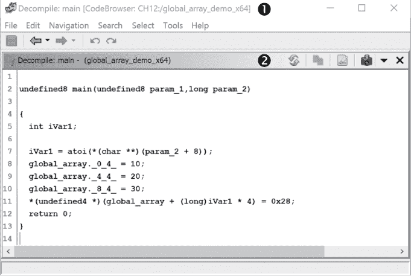

*图 12-1：重新停靠反汇编窗口*

要重新停靠窗口，你不能点击标题栏 ➊，因为那样会把窗口拖动到 CodeBrowser 前面。相反，点击内部标题栏 ➋ 来重新停靠或堆叠窗口。现在我们可以重新排列窗口，让我们通过使用“编辑 ▸ 工具选项”菜单来自定义窗口本身。

#### *编辑工具选项*

当你选择“编辑 ▸ 工具选项”时，会打开一个 CodeBrowser 选项窗口，如图 12-2 所示。这个窗口允许你控制与单个 CodeBrowser 组件相关的选项。

可用的选项由每个组件的开发者决定，且可用选项之间的显著差异反映了各个工具的具体性质。由于描述每个可用工具选项将占据整本书的篇幅，我们将重点看一些影响我们在前面章节中讨论过的工具的编辑内容，以及一些适用于许多工具的相似编辑。

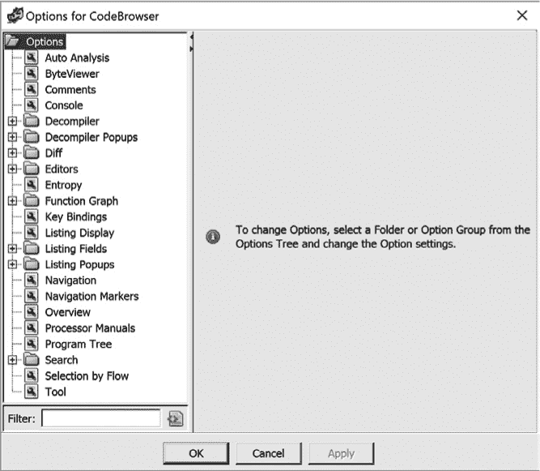

*图 12-2：默认的 CodeBrowser 编辑 ▸ 工具选项窗口*

尽管在灰度模式下可能不明显，许多工具使用颜色来识别属性，并且相关的颜色调色板是可配置的。点击选项窗口中的默认颜色将打开一个标准的颜色编辑器对话框，如图 12-3 中的 Byte Viewer 选项面板所示。这为你提供了控制 CodeBrowser 中各种项目颜色的选项。

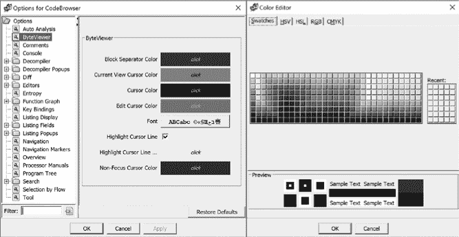

*图 12-3：编辑 ▸ 工具选项颜色编辑器对话框*

在图 12-3 中，你可以为 Byte Viewer 窗口中的六个项目选择颜色：块分隔符、当前视图光标、光标、编辑光标、高亮光标行和非焦点光标。除了在 Byte Viewer 窗口中自定义颜色外，你还可以选择字体，并选择高亮显示光标行。方便的是，任何 CodeBrowser 工具的选项面板中都包含一个右下角的“恢复默认值”选项。这使得你可以在某些分析步骤中使用特殊的颜色方案，完成后再恢复工具的默认颜色方案。

除了外观上的变化，许多工具还提供了在编辑选项中设置参数的能力。我们在之前的章节中介绍新功能时，也暗示了这一潜力，例如控制哪些分析器包含在自动分析中的能力。一般来说，任何有*默认值*的地方，都有方法将其更改为其他选项。

某些通用工具的设置也可以通过选项窗口访问和修改。例如，按键绑定用于指定 Ghidra 操作和热键序列之间的映射，在默认的 CodeBrowser 窗口中有超过 550 个操作，你可以通过选项窗口创建或重新分配热键绑定。热键重新分配在许多情况下都很有用，包括通过热键使额外的命令可用、将默认序列更改为更容易记住的序列、以及更改可能与操作系统或终端应用程序使用的其他序列冲突的序列。你甚至可以将所有热键重新映射为与其他反汇编器相同的热键。

每个热键绑定都与三个字段相关，如图 12-4 所示。第一个字段是操作名称。在某些情况下，操作名称对应于菜单命令（例如，分析 ▸ 自动分析）。在其他情况下，它是与菜单命令相关联的参数（例如，分析选项中的 Aggressive Instruction Finder）。

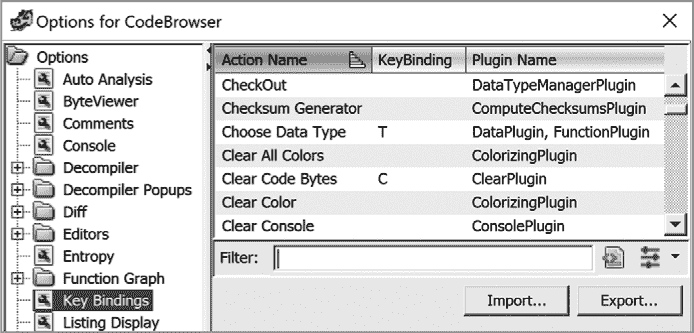

*图 12-4：编辑 ▸ 工具选项 热键绑定选项*

第二列是与操作相关联的实际按键绑定（热键）。最后一列包含实现该操作的插件名称。^(1) 并非所有操作都有关联的热键，但你可以通过选择一个操作并在文本框中输入所需的热键来轻松分配热键。如果该热键已经与其他操作关联，系统会显示该热键的所有其他用途。当你使用具有多个键绑定的热键时，系统会提供一个潜在操作列表，你需要选择合适的操作。

#### *编辑工具*

在 编辑 ▸ 工具选项 窗口的底部，有一个名为 Tool 的选项。Tool 的含义取决于用于打开选项对话框的工具菜单。通常，这将是 CodeBrowser 或项目窗口。图 12-5 显示了 CodeBrowser 工具的默认配置选项。选项对话框的标题栏提供了我们正在查看 CodeBrowser 选项页面的最明显线索。

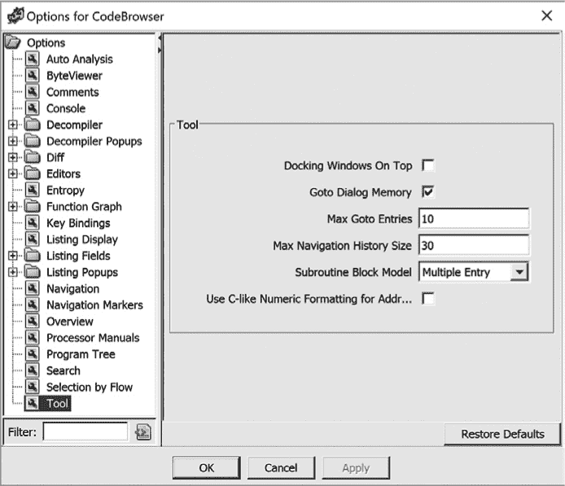

*图 12-5：使用 编辑 ▸ 工具选项 ▸ 工具 编辑 CodeBrowser 选项*

#### *特殊工具编辑功能*

一些工具在各自的窗口中集成了编辑功能，以便你可以立即看到选项对关联内容的影响。最广泛的内置编辑功能可以在“列出窗口”中找到。列出窗口包含反汇编的文本内容，并且可以通过在第 133 页的“更改代码显示选项”中介绍的浏览器字段格式化器进行高度配置。图 12-6 显示了一个默认的浏览器字段格式化器打开的列出窗口。

*图 12-6：带有默认浏览器字段格式化器的列出窗口*

在格式化器的顶部出现了一排标签 ➊，表示反汇编中存在的各种字段类型。在这种情况下，我们正在查看指令，因此选择了指令/数据标签。格式化器的其余部分 ➋ 显示与指令/数据部分中地址相关的每个单独字段的条形图。在这种情况下，光标位于列出窗口中的某个地址，因此地址字段被高亮显示。

你可以使用浏览器字段格式化器更改列出窗口的外观。其功能非常广泛，每个字段都有其相关的选项。我们将只研究一些较简单的功能，许多功能类似于编辑代码浏览器中窗口外观的操作。你可以通过拖动字段到新的位置来重新排列字段；增大或减小字段的宽度；并添加、删除、启用或禁用个别字段。

图 12-7 显示了移除字节字段后的相同列出内容。在之前的章节中，我们已经移除了字节字段，以便简化列出内容并在可用空间中显示更多的内容。

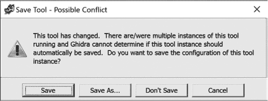

*图 12-7：带有自定义浏览器字段格式化器选择的列出窗口*

#### *保存代码浏览器布局*

关闭代码浏览器时，你可以保存与文件相关的任何布局更改。或者，你也可以选择不保存退出，这将生成一条警告消息，确保你理解其中的含义。如果你在代码浏览器窗口中使用“文件 ▸ 保存工具”选项，则当前的代码浏览器外观将与当前文件关联，并存储在活动项目中。下次打开该文件时，Ghidra 将使用保存的代码浏览器布局。当你同时打开多个代码浏览器实例并且修改了其中一些（或全部）时，可能会导致工具配置冲突。此时，Ghidra 会显示一个新的保存工具对话框，如图 12-8 所示。

*图 12-8：Ghidra 的保存工具—可能的冲突对话框*

在本章的后面，我们将向你展示如何使用此功能以及类似的自定义功能，来创建一个强大的工具套件，这些工具是针对你的反向工程任务和个人喜好进行调优的。

### Ghidra 项目窗口

让我们换个思路（或者换个窗口）回到 Ghidra 项目窗口，如图 12-9 所示。主菜单在前一章已经讨论过。在讨论项目窗口的自定义之前，让我们先看看窗口中两个尚未讨论的区域。

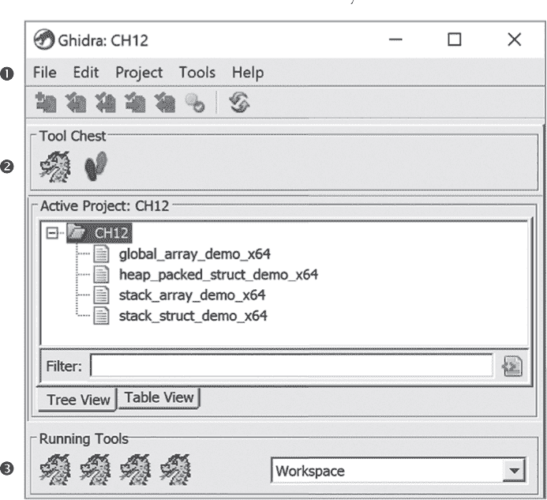

*图 12-9：Ghidra 项目窗口*

工具箱 ➋ 显示了所有能够操作你导入到项目中的二进制文件的工具图标。默认情况下，提供两个工具。龙形图标是 CodeBrowser 的默认图标，足迹图标与 Ghidra 的版本控制工具相关联。在本章稍后的部分，我们将演示如何通过修改和导入工具以及构建我们自己的工具来补充工具箱。

正在运行的工具 ➌ 包含每个正在运行的工具实例的图标。在这个例子中，我们已将每个项目文件在单独的 CodeBrowser 窗口中打开。因此，目前有四个 CodeBrowser 实例在运行。点击任何一个正在运行的工具图标将把相应的工具调到桌面前台。

让我们返回到 Ghidra 项目窗口菜单 ➊，查看一些自定义窗口的选项。我们将从调查图 12-10 中显示的 Ghidra 项目四个编辑 ▸ 工具选项开始。两个选项与 CodeBrowser 中的相同：键绑定和工具。

在图 12-10 中，选择了键绑定选项。与 CodeBrowser 工具相比，Ghidra 项目工具的操作显著较少，因此键绑定的选项也较少。如果你在家里跟着操作，可能会注意到大部分操作都与 FrontEndPlugin 相关。（Ghidra 项目工具也称为 Ghidra 前端，在整个 Ghidra 环境中，包括 Ghidra 帮助文档，都会交替使用这两个术语。）

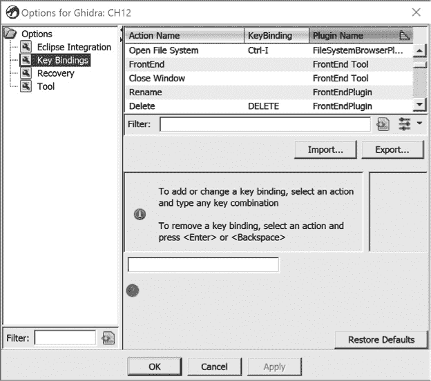

*图 12-10：Ghidra 项目窗口（即 Ghidra 前端），通过编辑 ▸ 工具选项*

Eclipse 集成是第十五章的重点，因此我们暂时会推迟讨论这个选项。恢复选项允许你设置快照的频率，默认值是 5 分钟。将此值设置为 0 将禁用快照。

最后的选项，工具，可能会很有趣，可以尝试一下。如本章前面所述，术语*工具*在此上下文中指的是活动工具。在此情况下，它是 Ghidra 项目工具。相关选项如图 12-11 所示，我们将重点关注 Swing 外观与感觉和使用反转颜色选项，这些选项会改变 Ghidra 窗口的外观。

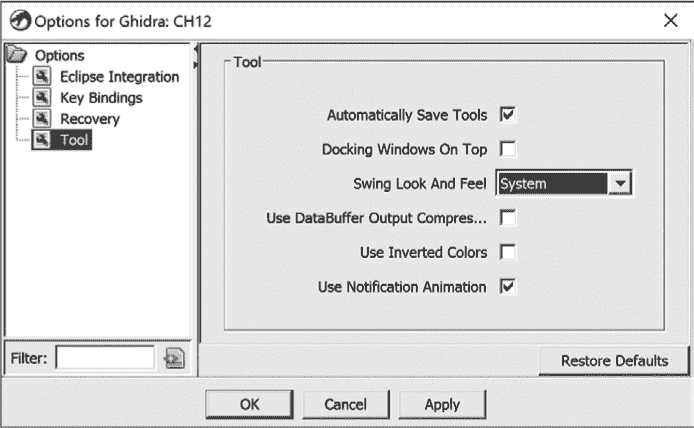

*图 12-11：Ghidra 项目工具编辑选项*

将“使用反转颜色”和选择“金属”作为 Swing 外观和感觉相结合，会产生一个深色主题，这在许多逆向工程师中非常流行。你所做的更改将在重启 Ghidra 后生效，新样式将用于所有 Ghidra 窗口，包括 CodeBrowser 和 Decompiler。下图展示了部分 CodeBrowser 窗口 图 12-12。

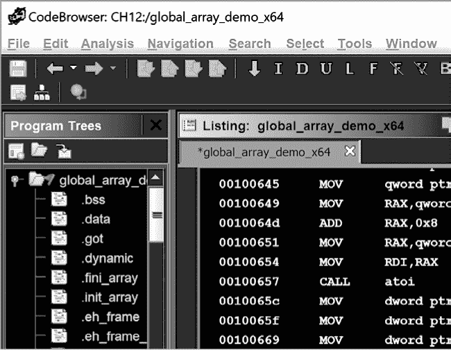

*图 12-12：使用深色主题的 CodeBrowser 窗口部分*

现在你已经知道如何改变 Ghidra 的外观和感觉以更好地符合你的个人风格，让我们回到文件菜单，探讨在该上下文中“配置”意味着什么。File ▸ Configure 选项展示了 Ghidra 插件集合的三类，如 图 12-13 所示。每个类别都有不同的用途。

Ghidra Core 包含我们在默认 Ghidra 配置中使用的一组插件。这些插件提供了逆向工程所必需的基本功能。Developer 类别提供的插件可以帮助你开发新的插件。如果你想了解更多关于 Ghidra 开发的信息，这是一个很好的起点。最后一组插件是 Experimental。这些插件尚未经过彻底测试，可能会导致 Ghidra 实例不稳定，因此使用时请小心。

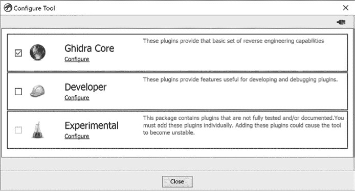

*图 12-13：Ghidra 项目配置选项*

虽然默认 Ghidra 安装时只有 Ghidra Core 被启用，但你可以勾选其他选项旁边的框以启用它们。使用类别下方的 Configure 选项来选择（或取消选择）类别列表中显示的各个插件。图 12-14 显示了 Ghidra Core 插件列表，包括每个插件的描述和类别。如果你点击该菜单中的某个 Ghidra 插件，屏幕底部的窗口会提供关于该插件的更多信息。

还有两个额外的 Ghidra 项目菜单选项可用于 Ghidra 配置。第一个是 File ▸ Install Extensions，我们将在 第十五章 讨论。另一个选项是 Edit ▸ Plugin Path，它允许你添加、修改和删除新的用户插件路径，这些路径告诉 Ghidra 在其默认安装的 Java 类之外查找其他类。通过这个选项，你可以将额外的插件和类包含到 Ghidra 实例中。编辑插件路径后需要重启 Ghidra 才能看到效果。

*图 12-14：选择了 ImporterPlugin 的 Ghidra Core 配置窗口*

现在你已经了解了修改插件选项的潜力，我们可以继续扩展插件的使用。工具菜单选项允许你执行与工具相关的操作，包括创建新工具（如果现有工具无法完全满足你的需求）。在这种情况下，我们将构建并使用现有插件集合的工具，而不是从头编写插件。

### 工具

大多数工具选项都可以在 Ghidra 项目窗口的工具菜单中找到，如图 12-15 所示。到目前为止，你一直在使用和修改默认工具 CodeBrowser，作为你的主要分析工具。接下来，我们将演示如何在 Ghidra 中创建自定义工具。

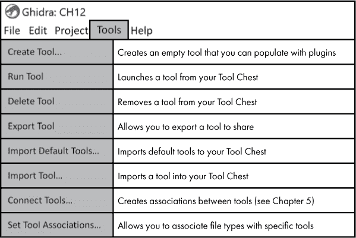

*图 12-15：Ghidra 工具菜单选项*

如果你曾经尝试修改 CodeBrowser 工具，可能会因为默认工具在你打开后续文件时被修改而感到沮丧。让我们考虑一个特殊的情况：你想要检查一个包含许多函数调用的文件，这个文件导航起来比较复杂。在第十章中，我们演示了如何使用函数调用图和函数图来帮助你理解程序的控制流。这两种图表都会在各自的窗口中打开，如果你打开了很多文件，这可能会造成一些挑战。我们将通过一个名为 *ExamineControlFlow* 的专用工具来解决这些问题，它可以帮助你分析程序中的控制流。

当你选择“工具 ▸ 创建工具…”菜单选项时，你将看到两个窗口（如图 12-16 所示）。图中的上窗口展示了类似于图 12-13 中看到的插件选项，但增加了一个新的类别：功能 ID，详细内容请参见第十三章。图中的下窗口是一个空白的、未命名的工具开发窗口，你可以自定义该窗口以创建你的工具——ExamineControlFlow。

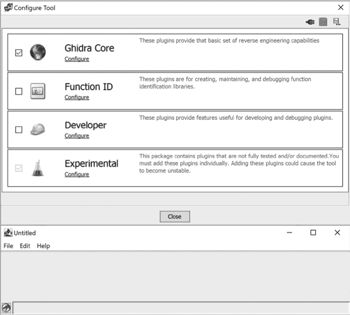

*图 12-16：Ghidra 配置工具窗口*

你可以通过使用 Ghidra Core 中的插件来组合你的新工具。当你选择 Ghidra Core 类别时，你的工具开发窗口将填充来自 Ghidra Core 的选项，如图 12-17 所示。结果窗口与 CodeBrowser 很相似，这是因为 CodeBrowser 也是基于 Ghidra Core 开发的。

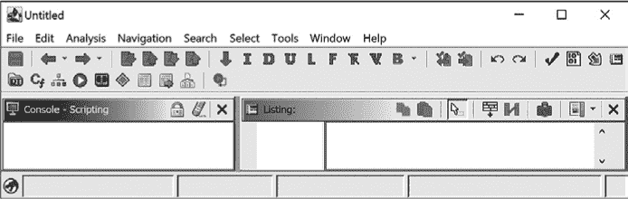

*图 12-17：配置前的新工具，未命名*

你需要移除一些你不想在新工具中使用的插件，然后指定你想要的窗口。点击 Ghidra Core 下的 **配置** 选项，并删除以下你不需要的插件（你还可以删除其他插件，但为了简洁起见，我们只删除了这些）：

+   控制台

+   DataTypeManagerPlugin

+   EclipseIntegrationPlugin

+   ProgramTreePlugin

每个工具都与其他插件相关联，因此，当你从新工具中移除每个插件时，Ghidra 会显示一条警告信息，列出正在被移除的附加插件。你可以随时通过在新工具中选择“文件”▸“配置”来将插件重新添加。移除 DataTypeManagerPlugin 时的警告信息示例显示在图 12-18 中。

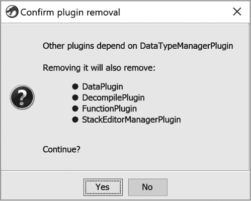

*图 12-18：移除 DataTypeManagerPlugin 时的插件依赖警告*

你还可以控制新工具的布局。在这种情况下，你希望能在同一工具中看到 Listing、Function Call Graph 和 Function Graph 窗口。按照前几章中描述的技巧，你可以通过新工具中的“窗口”菜单打开所需的窗口，然后将它们拖动到期望的位置。新创建的未命名工具显示在图 12-19 中。

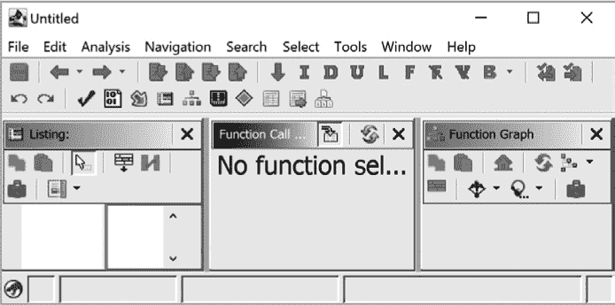

*图 12-19：新创建的未命名工具*

由于你计划频繁使用这个工具并与合作伙伴共享，应该通过选择“文件”▸“另存为工具”来保存此工具，这样你可以为工具命名并为其关联一个图标（见图 12-20）。你可以从提供的图标中选择，或者选择你自己的图像文件（例如*.jpg*、*.png*、*.gif*等格式）。

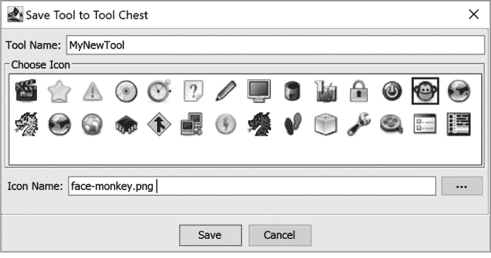

*图 12-20：新工具的图标选项*

这个新工具（以及你创建的其他工具）将成为工具箱的一部分，并在你的项目中显示为一个选项，如图 12-21 所示。

若要与他人共享新工具，可以使用“工具”▸“导出工具”进行导出。Ghidra 会要求你选择一个文件夹来保存工具，并创建一个包含工具规格的*.tool*文件。若要导入工具，请使用“工具”▸“导入工具”选项。

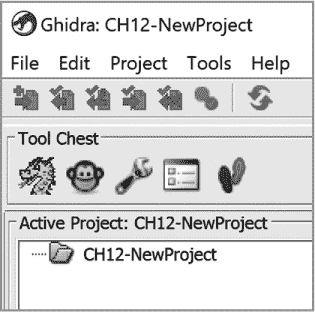

*图 12-21：新项目中显示在工具箱中的新工具选项*

在 Ghidra 项目窗口中双击文件默认会将其打开在 CodeBrowser 中，但你也可以通过右键点击文件，选择工具箱中的任意工具，或者将文件名拖动并放到某个工具上来选择其他工具。

使用 Ghidra 的时间越长，你会越意识到没有一个统一的 Ghidra 界面可以为你提供完成每项逆向工程任务所需的所有工具。作为逆向工程师，分析特定文件的方法很大程度上取决于文件本身、分析目标以及实现目标的进度。

本章及前几章的大部分内容都致力于描述如何更改 Ghidra 的外观和功能，并根据你的需求调整可用工具。定制 Ghidra 的最后一步是能够保存你所创建的这些配置，以便你可以根据所进行的分析项目选择正确的配置。这是通过创建和保存 Ghidra 工作区来实现的。

### 工作区

Ghidra 的*工作区*可以看作是一个虚拟桌面，其中包含当前配置的工具和相关的文件。假设你正在分析一个二进制文件。在查看文件时，你注意到它具有与上周分析的另一个文件相似的特征。你想比较这两个文件，以识别它们之间函数的相似性，但你也希望继续分析当前的文件。这是两个具有共同文件的独立问题。

一种同时进行这两条路径的方法是为每个分析问题创建一个工作区。你可以通过在 Ghidra 项目窗口中选择“项目 ▸ 工作区 ▸ 添加”，并为新工作区命名来保存当前的分析。在这个例子中，我们将这个工作区命名为*文件分析*。然后，你可以从工具箱中打开另一个工具，并可能使用一个专门的工具，利用*差异视图*比较这两个文件（见第二十三章），然后使用相同的方法创建第二个工作区（*文件比较*）。现在，你可以通过在图 12-22 中显示的下拉菜单中选择工作区，或通过使用“项目 ▸ 工作区”菜单中的“切换”选项，轻松切换工作区，这将循环显示所有可用的工作区。

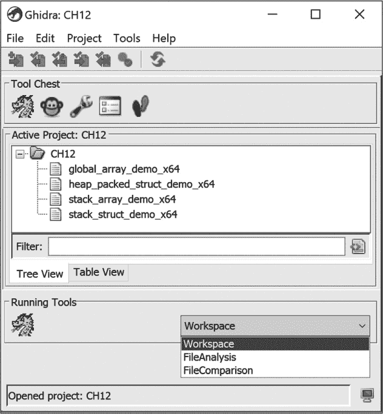

*图 12-22：Ghidra 项目窗口中的工作区选项*

### 总结

在开始使用 Ghidra 时，你可能对其默认行为和默认的代码浏览器布局感到非常满意。然而，随着你对 Ghidra 基本功能的熟悉，你一定会找到定制 Ghidra 以适应你的逆向工程工作流的方法。尽管没有办法通过单独一章提供 Ghidra 所有可能选项的完整覆盖，但我们已经介绍并提供了你在 SRE 过程中最有可能需要的定制功能的示例。发现额外有用的工具和选项将留给好奇的读者去探索。
