## 第十六章：扩展 Ghidra 的世界观**


我们希望从高质量的逆向工程工具中获得的一项功能是能够完全自动地识别并注释尽可能多的二进制内容。在理想情况下，100% 的指令会被识别，并归入构成二进制文件的 100% 原始函数中。这些函数每一个都会有名称和完整的原型，所有由函数操作的数据也会被识别，包括对程序员使用的原始数据类型的完全理解。这正是 Ghidra 的目标，从初始导入二进制文件开始，经过自动分析，Ghidra 无法完成的任何部分将变成用户的任务。

在本章中，我们将探讨 Ghidra 用于识别二进制文件中各种结构的技术，并讨论如何增强其识别能力。我们首先讨论初始加载和分析过程。你在这些步骤中的选择有助于确定 Ghidra 为你分析的文件提供哪些资源。这是一个向 Ghidra 提供它可能未能自动检测到的信息的机会，这样 Ghidra 的分析阶段就能做出更明智的决策。随后，我们将讨论 Ghidra 如何利用字模型、数据类型和函数识别算法，以及如何增强这些算法以根据你的特定逆向工程应用来定制其性能。

### 导入文件

在导入过程中，显示在图 13-1 中的对话框呈现了 Ghidra 对文件身份的初步分析，这将指导文件加载过程。你可以覆盖任何字段，或者按照 Ghidra 的建议继续操作。通过“选项...”按钮访问的附加选项是特定于所加载文件类型的。图 13-1 显示了 PE 文件的选项，图 13-2 显示了加载 ELF 二进制文件的选项。

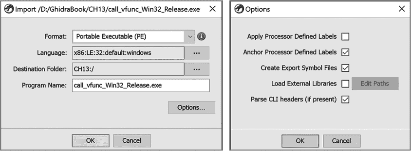

*图 13-1：PE 文件的导入对话框和选项*

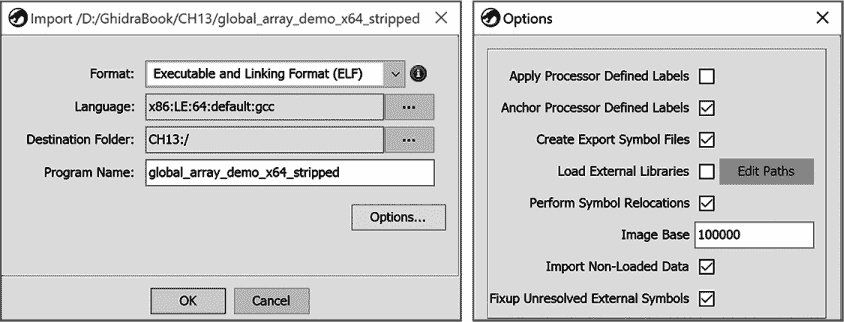

*图 13-2：ELF 二进制文件的导入对话框和选项*

**语言/编译器规格**

图 13-1 和 13-2 中的语言字段决定了 Ghidra 如何解释在你加载的文件中识别为机器代码的字节。语言/编译器规格由三个到五个冒号分隔的子字段组成，如下所述：

+   处理器名称字段指定了二进制文件构建所使用的处理器类型。它将 Ghidra 定向到 *Ghidra/Processors* 目录下的特定子目录。

+   字节序字段表示二进制文件处理器的字节序，它可以是小端字节序（LE）或大端字节序（BE）。

+   架构大小（位数）字段通常与所选处理器的指针大小一致（16/32/64 位）。

+   处理器变种/模式字段用于选择所选处理器的特定型号或标识特定的操作模式。例如，当选择 x86 处理器时，我们可以选择系统管理模式、实模式、保护模式或默认模式。对于 ARM 处理器，我们可以选择 v4、v4T、v5、v5T、v6、Cortex、v7、v8 或 v8T 等型号。

+   如果已知，编译器字段会列出用于编译二进制文件的编译器，或者在某些情况下，列出用于编译的调用约定。有效的名称包括*windows*、*gcc*、*borlandcpp*、*borlanddelphi*和*default*。

图 13-3 将语言标识符 ARM:LE:32:v7:default 分解为其组成的子字段。加载器最重要的任务之一就是推断正确的语言/编译器规范。

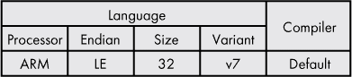

*图 13-3：语言/编译器规范示例*

格式选项指定 Ghidra 用于导入文件的加载器。Ghidra 依赖于加载器对特定文件格式的详细了解，以识别文件的特征并选择用于分析的正确插件。一个写得很好的加载器能够识别文件的类型、架构，并且希望能够识别用于创建该二进制文件的编译器。有关编译器的信息有助于增强函数识别。为了指纹识别编译器，加载器会检查二进制文件的结构，寻找特定于编译器的特征（例如，程序段的数量、名称、位置和顺序），或搜索二进制文件中的特定编译器字节序列（如代码块或字符串）。例如，在使用`gcc`编译的二进制文件中，找到版本字符串并不罕见——例如，*GCC: (Ubuntu 7.3.0-27ubuntu1~18.04) 7.3.0*。

当 Ghidra 完成加载过程后，会显示一个导入结果摘要窗口，如图 13-4 所示。

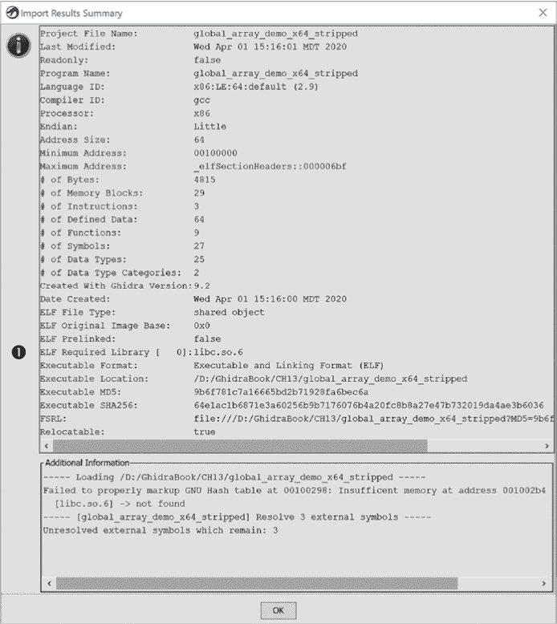

*图 13-4：ELF 二进制文件的导入结果摘要窗口*

此摘要标识了一个 ELF 必需的库，*lib.so.6* ➊。（请注意，如果该文件是静态链接的，这个库不会作为依赖项列出。）当可执行文件依赖多个共享库时，可能会列出多个库文件。了解程序依赖哪些库可以帮助你在分析程序时找到可能需要的资源。例如，如果*libssl.so* 或 *libcrypto.so* 出现在所需库列表中，你可能需要查找 OpenSSL 文档并可能需要源代码。本章后面会讨论 Ghidra 如何使用源代码。一旦文件成功导入，你可以自动分析该文件。

### 分析器

*自动分析*是通过一组协同工作的分析工具（分析器）完成的，这些工具可以手动激活（例如，当打开一个新文件时），或者在检测到可能影响最终反汇编的更改时自动激活。分析器按优先级顺序依次运行，因为分析器所做的更改可能会影响后续的分析器。例如，堆栈分析器在函数分析器查看所有调用并创建函数之前无法查看函数。我们将在第十五章中更详细地探讨这个层次结构，当我们构建一个分析器时。

当你在 CodeBrowser 中打开一个新文件并选择自动分析时，Ghidra 会显示一个可以在该文件上运行的分析器列表。默认和可选分析器的列表取决于加载器提供的文件信息（这些信息也作为导入摘要的一部分显示给用户，如图 13-4 所示）。例如，Windows x86 PE RTTI 分析器在分析 ELF 或 ARM 二进制文件时就不太有用了。默认的分析器选择可以通过“编辑 ▸ 工具选项”菜单进行修改。

一些分析器也可以通过使用 CodeBrowser 中的“分析 ▸ 一次性”菜单作为一次性选项使用。如果分析器支持一次性使用并且适用于正在分析的文件类型，它就会出现在列表中。一次性分析对于运行在初始自动分析过程中未选择的分析器非常有用，或者在找到新信息可能从额外分析中受益时重新运行分析器。例如，如果在初始分析过程中收到缺少 PDB 的错误消息，你可以找到 PDB 文件，然后运行 PDB 分析器。

CodeBrowser ▸ 分析菜单中的“分析所有打开的文件”选项一次性分析项目中所有打开的文件，使用在“编辑 ▸ 工具选项”中选择的分析器列表。如果项目中所有打开的文件具有相同的架构（语言/编译器规范），则所有文件都将被分析。任何与当前文件架构不匹配的文件将不会包含在分析中。这确保了分析器与正在分析的文件类型一致。

许多 CodeBrowser 工具，包括分析器，依赖于各种工件来识别文件中的重要结构。幸运的是，我们可以扩展这些工件来增强 Ghidra 的功能。我们将从讨论单词模型文件以及它们如何用于在搜索结果中识别特殊字符串和字符串类型开始。

### 单词模型

*词模型*提供了一种识别你感兴趣的特殊字符串和字符串类型的方式，例如已知的标识符、电子邮件地址、目录路径名、文件扩展名等等。当你的字符串搜索与词模型相关联时，字符串搜索结果窗口将包含一个名为 IsWord 的列，用于指示找到的字符串是否根据词模型被视为一个词。将感兴趣的字符串定义为有效的词，然后筛选有效的词是一个很好的方法，可以优先考虑对这些字符串进行进一步检查。

从高层次来看，词模型使用有效字符串的训练集来确定“如果三元组 X（一个由三个字符组成的序列）出现在长度为 Z 的序列 Y 中，那么 Y 是一个词的概率为 P”。该概率被间接地用作阈值，以确定在分析过程中是否应将字符串视为有效词。

*StringModel.sng*，如图 13-5 所示，是 Ghidra 中字符串搜索的默认词模型文件。

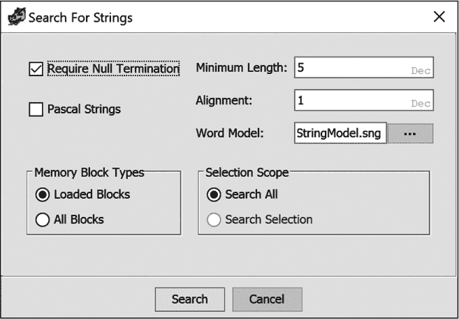

*图 13-5：字符串搜索对话框*

以下是*StringModel.sng*文件的一个摘录，展示了有效词模型文件的格式：

```
➊ # Model Type: lowercase

➋ # Training file: contractions.txt

  # Training file: uniqueStrings_012615_minLen8.edited.txt

  # Training file: connectives

  # Training file: propernames

  # Training file: web2

  # Training file: web2a

  # Training file: words

➌ # [^] denotes beginning of string

   # [$] denotes end of string

   # [SP] denotes space

   # [HT] denotes horizontal tab

➍ [HT]    [HT]    [HT]    17

   [HT]    [HT]    [SP]    8

   [HT]    [HT]    (  1

 [HT]    [HT]    ;  1

   [HT]    [HT]    \  25

   [HT]    [HT]    a  2

   [HT]    [HT]    b  1

   [HT]    [HT]    c  1
```

文件中的前 12 行是关于模型的元数据注释。在这个例子中，模型类型➊是`lowercase`，这可能意味着模型不区分大小写字母。用于此模型的训练文件的名称列在➋处。文件名称通常表明内容：*contractions.txt*很可能是一个有效缩写的文件，例如*can’t*。四行注释➌描述了在三元组中使用的一些不可打印 ASCII 字符的符号。实际的三元组列表从➍开始，每一行条目包含三元组中的三个字符，后面跟着一个值，用于确定该三元组是否为一个词的一部分的概率。

你可以通过编辑*StringModel.sng*或创建新的模型文件并将它们存储在*Ghidra/Features/Base/data/stringngrams*中，来补充或替换默认的词模型，然后在字符串搜索对话框的词模型字段中选择新文件。有很多理由修改词模型，比如包括特定于已知恶意软件家族的字符串，或检测英语以外语言中的词汇。最终，词模型提供了一种强大的手段，通过在字符串窗口中标记它们来控制 Ghidra 识别为更高优先级的字符串类型。

以类似的方式，我们可以编辑并扩展 Ghidra 识别的数据类型。

### 数据类型

数据类型管理器允许我们管理与文件相关的所有数据类型。Ghidra 通过将数据类型定义存储在*数据类型归档文件*中，允许你重用数据类型定义。数据类型管理器窗口中的每个根节点都是一个数据类型归档。图 13-6 显示了一个数据类型管理器窗口，其中选择了三个数据类型归档。

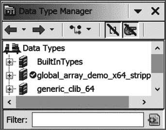

*图 13-6：数据类型管理器窗口*

BuiltInTypes 档案始终会列出。该档案包括所有（且仅包括）由实现`ghidra.program.model.data.BuiltInDataType`接口的 Java 类在 Ghidra 中建模的类型。Ghidra 会在其类路径中查找每个这样的类，以便填充此档案。

第二个档案是特定于正在分析的文件的，且该档案与文件名相同。在这种情况下，档案与文件*global_array_demo_x64*相关联。档案旁边的勾选框表示它与当前活动文件相关联。最初，Ghidra 会使用特定于文件格式的数据类型（例如，PE 或 ELF 相关的数据类型）填充该档案。在自动分析过程中，Ghidra 会将其他档案中的数据类型复制到此档案中，前提是它们被识别为当前程序中正在使用的数据类型。换句话说，这个档案包含了所有已知数据类型管理器的子集，这些数据类型恰好在当前程序中使用。这个档案也是你在 Ghidra 中选择创建的任何自定义数据类型的存放地，具体内容可以参考《使用 Ghidra 创建结构体》，详见第 166 页。

第三个档案提供了 64 位 ANSI C 函数原型和 C 库数据类型。这个特定的档案包含从 64 位 Linux 系统的标准 C 库头文件中提取的信息，是默认 Ghidra 安装中的几个平台特定档案之一。之所以存在，是因为这个特定的二进制文件有一个库依赖，依赖于*libc.so.6*，如图 13-4 所示。默认的 Ghidra 安装有四个额外的特定平台数据档案，这些档案位于*Ghidra/Features/Base/data/typeinfo*目录下的一个平台特定的子目录中。文件名指示它们支持的平台：*generic_clib.gdt*、*generic_clib_64.gdt*、*mac_osx.gdt*、*windows_vs12_32.gdt*和*windows_vs12_64.gdt*。（*.gdt*扩展名用于所有 Ghidra 数据类型档案。）

除了 Ghidra 加载器自动选择的档案外，你还可以将自己的数据类型档案添加为数据类型管理器窗口中的节点。为了演示，图 13-7 展示了在所有默认的*.gdt*文件被添加到数据类型列表后，数据类型管理器窗口的样子。图的右侧显示了用于操作档案和数据类型的菜单。额外的档案通过“打开文件档案”菜单选项加载，该选项会打开文件浏览器供你选择感兴趣的档案。

要将新的内置类型添加到 BuiltInTypes 归档中，请将相应的*.class*文件添加到 Ghidra 的类路径中。如果在 Ghidra 运行时添加类型，您必须刷新 BuiltInTypes（见图 13-7），才能使它们显示出来。刷新操作会导致 Ghidra 重新扫描其类路径，以查找任何新添加的`BuiltInDataType`类。好奇的读者可能会在其 Ghidra 源代码分发包中找到大量内置类型的示例，路径为*Ghidra/Framework/SoftwareModeling/src/main/java/ghidra/program/model/data*。

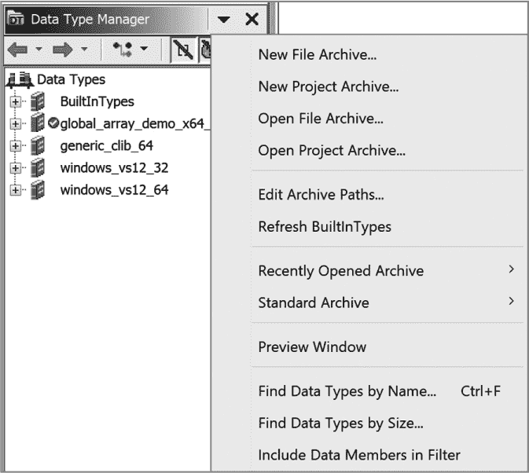

*图 13-7：数据类型管理器，所有标准归档已加载，选项菜单已展开*

#### *创建新的数据类型归档*

在分析二进制文件时，无法预见您可能遇到的所有数据类型。您在 Ghidra 分发包中包含的归档包含了来自 Windows（Windows SDK）和 Unix（C 库）系统中最常用库的数据类型。当 Ghidra 未包含您正在分析的程序中使用的数据类型信息时，它提供了创建新数据类型归档的功能，可以通过多种方式填充它们，并与其他人共享。在接下来的章节中，我们将讨论您可能创建新数据类型归档的三种方式。

##### 解析 C 头文件

数据类型信息最常见的来源之一是 C 头文件。假设您拥有所需的头文件，或者花时间自己创建它们，您可以使用 C-Parser 插件从现有的 C 头文件中提取信息，创建自己的数据类型归档。例如，如果您经常分析与 OpenSSL 加密库链接的二进制文件，您可以下载 OpenSSL 源代码，并要求 Ghidra 解析其中的头文件，以创建一个包含 OpenSSL 数据类型和函数签名的归档。

这个过程远没有看起来那么简单。头文件通常充满了宏，用于根据所使用的编译器、操作系统和架构来影响编译器的行为。例如，C 结构体

```
struct parse_demo {

    uint32_t int_member;

    char    *ptr_member;

};
```

在 32 位系统上编译时占用 8 个字节，在 64 位系统上编译时占用 16 个字节。这种可变性给 Ghidra 带来了问题，因为 Ghidra 试图充当通用预处理器，您需要引导 Ghidra 完成解析过程，以创建一个有用的归档。当您需要将归档与 Ghidra 一起使用时，必须确保归档的创建方式与您正在分析的二进制文件兼容（也就是说，不要将 64 位归档加载到帮助分析 32 位文件时）。

要解析一个或多个 C 头文件，请在 CodeBrowser 中选择 文件 ▸ 解析 C 源代码，打开图 13-8 所示的对话框。待解析的源文件部分提供了一个按顺序排列的头文件列表，供插件解析。顺序很重要，因为一个文件中的数据类型和预处理指令会在下一个文件中生效。

解析选项框提供了一系列选项，类似于编译器命令行选项，影响 C 解析器插件的行为。解析器仅识别大多数编译器理解的 `-I`（包含目录）和 `-D`（定义宏）选项。Ghidra 提供了多种预处理器配置，形式为 *.prf* 文件，您可以从中选择，以为常见的操作系统和编译器组合提供合理的默认设置。您还可以自定义任何可用的配置，或从头开始创建自己的配置，并将其保存到自己的 *.prf* 文件中，以便将来使用。常见的解析器选项更改是正确设置您希望 C 解析器针对的架构，因为所有提供的配置都针对 x86。例如，如果您正在分析小端 ARM 二进制文件，您可能会将面向 Linux 的配置中的 `-D_X86_` 更改为 `-D__ARMEL__`。

插件的输出可以通过“解析到程序”按钮合并到当前活动文件中，或通过“解析到文件”存储在一个单独的 Ghidra 数据类型归档文件（*.gdt*）中。有关 C 解析器的更多信息，请参阅 Ghidra 帮助。

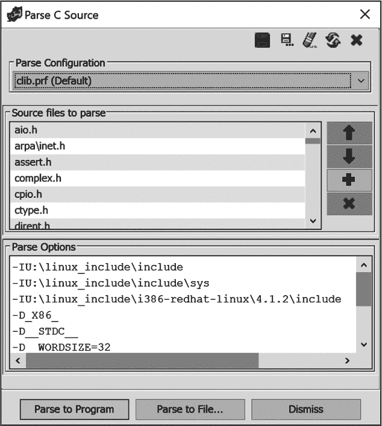

*图 13-8：解析 C 源代码对话框*

##### 创建新的文件归档

作为解析 C 头文件的替代方法，您可能希望将分析文件时创建的自定义数据类型捕获到一个归档文件中，以便与其他 Ghidra 用户共享或在其他 Ghidra 项目中使用。数据类型管理器的“新建文件归档”选项（参见图 13-7）要求您选择文件名和保存位置，然后创建一个新的空归档，该归档会列在数据类型管理器窗口中。您可以使用在“使用 Ghidra 创建结构体”（第 166 页）中描述的技术将新的类型添加到归档中。归档创建后，您可以与其他 Ghidra 用户共享它，或在您的其他 Ghidra 项目中使用它。

##### 创建新的项目归档

项目数据归档仅存在于创建它的项目中。如果您期望在项目中多个文件之间重用自定义数据类型，但不打算在项目外部使用这些数据类型，这可能会很有用。在数据类型管理器中，“新建项目归档”选项（参见图 13-7）要求您选择项目中的一个文件夹来存放新的归档，然后创建一个新的空归档，并将其列出在数据类型管理器窗口中。与其他数据类型归档一样，您可以根据需要向归档中添加新类型。

### 功能 ID

当你开始逆向工程任何二进制文件时，最不希望做的事情就是浪费时间逆向工程那些你可以通过简单地阅读手册页、查看一些源代码或做一点互联网研究就能更容易了解其行为的库函数。不幸的是，静态链接的二进制文件模糊了应用程序代码和库代码之间的区别：整个库与应用程序代码结合，形成一个单一的、庞大的可执行文件。幸运的是，Ghidra 提供了工具来识别和标记库代码，无论这些代码是来自库归档文件还是仅仅是通过跨多个二进制文件的代码重用生成的，这使我们能够将注意力集中在应用程序中的独特代码上。*函数 ID 分析器*使用 Ghidra 提供的函数签名识别许多常见的库函数，并且你可以通过使用函数 ID 插件来扩展函数签名数据库。

函数 ID 分析器与使用哈希值层次结构来描述函数的函数 ID 数据库（FidDb）配合使用。每个函数都会计算一个完整哈希（旨在抵御链接器可能引入的变化）和一个特定哈希（帮助区分函数的不同变种）。这两者之间的主要区别在于，特定哈希可能包括任何常量操作数的具体值（基于启发式方法），而完整哈希则不包括。两个哈希值的结合，再加上关于任何关联父函数和子函数的信息，形成了每个库函数的指纹，这些指纹被记录在 FidDb 中。函数 ID 分析器为你正在分析的二进制文件中的每个函数生成相同类型的指纹，并将其与相关 FidDb 中所有已知的指纹进行比较。当找到匹配项时，Ghidra 会从 FidDb 中恢复该函数的原始名称，将适当的标签应用到正在分析的函数上，添加该函数到符号树窗口，并更新该函数的注释。以下是 `_malloc` 函数的示例注释：

```
    **************************************************************

    * Library Function – SingleMatch                             *

    * Name: _malloc                                              *

    * Library: Visual Studio 2005 Release                        *

    **************************************************************
```

FidDb 中的函数信息是以层次结构存储的，包括名称、版本和变体。变体字段用于编码诸如编译器设置之类的信息，这些信息会影响哈希值，但不属于版本号的一部分。

功能 ID 分析器提供了多个选项，可以在自动分析对话框中选择分析器来控制其行为，如图 13-9 所示。指令计数阈值是一个可调节的阈值，旨在减少与小函数进行随机匹配时的假阳性。假阳性是指一个函数错误地匹配到一个库函数。假阴性是指一个函数没有与库函数匹配，但本应匹配。该阈值大致表示一个函数、其父函数和子函数（合计）必须包含的最小指令数，以便被考虑匹配。有关匹配分数的更多信息，请参阅 Ghidra 帮助中的*评分与消歧*。

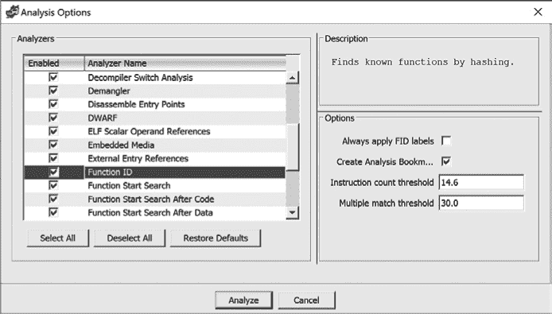

*图 13-9：自动分析选项*

由于二进制文件中的实际功能通常包含在函数中，因此扩展函数签名的能力对于减少重复工作至关重要，而这一工作由功能 ID 插件来促进。

### 功能 ID 插件

*功能 ID 插件*（与功能 ID 分析器不同）允许您创建、修改和控制 FidDb 的关联。默认的 Ghidra 安装中未启用此插件。要启用它，请从 CodeBrowser 窗口选择**文件** ▸ **配置**，然后勾选功能 ID 的复选框。在功能 ID 描述中选择**配置**，并选择**FidPlugin**以查看与插件相关的其他操作信息，如图 13-10 所示。

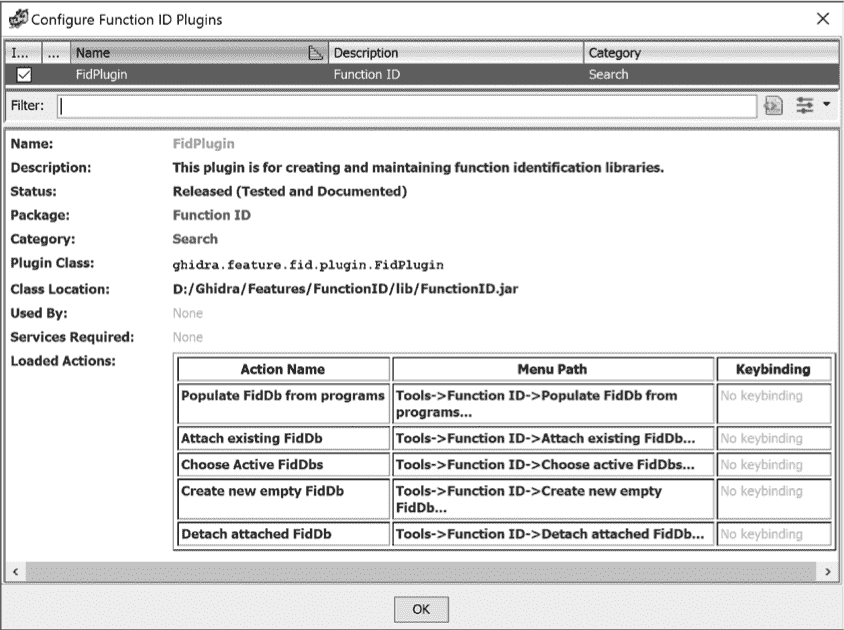

*图 13-10：FidPlugin 详细信息*

启用后，功能 ID 插件通过 CodeBrowser 的工具 ▸ 功能 ID 菜单进行控制，如图 13-11 所示。

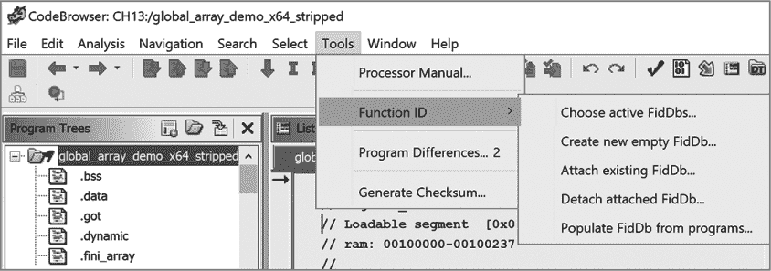

*图 13-11：CodeBrowser 功能 ID 子菜单*

在我们通过示例演示如何使用功能 ID 插件扩展 Ghidra 签名之前，先简要讨论五个新的菜单选项：

**选择活动 FidDb** 显示一个活动功能 ID 数据库的列表。每个数据库都可以通过关联的复选框进行选择或取消选择。

**创建新的空 FidDb** 允许您创建并命名一个新的功能 ID 数据库。创建的新 FidDb 将在选择“选择活动 FidDb”时列出。

**附加现有 FidDb** 显示一个文件选择对话框，让您将现有的 FidDb 添加到活动 FidDb 列表中。添加 FidDb 后，您可以选择“选择活动 FidDb”以查看已添加的 FidDb。

**分离现有 FidDb** 仅适用于已手动附加的 FidDb。此操作将移除所选 FidDb 与当前 Ghidra 实例之间的关联。

**从程序填充 FidDb** 生成新的函数指纹并将其添加到现有的 FidDb 中。图 13-12 中的对话框用于控制此过程，稍后将讨论其使用方法。

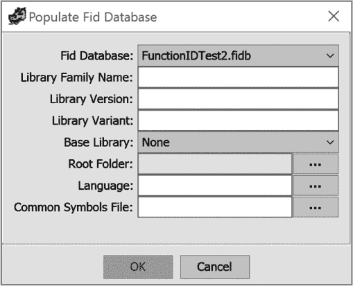

*图 13-12：填充 Fid 数据库对话框*

#### *函数 ID 插件示例：UPX*

当我们自动分析的二进制文件中，除了 Ghidra 识别的库函数外，几乎没有其他函数时，我们的逆向工程任务相对简化。我们可以集中精力处理 Ghidra 未能识别的函数，假设新且有趣的功能就在这里。当 Ghidra 完全无法识别任何函数时，我们的任务变得更加具有挑战性。当我们（人工分析员）识别出这些函数并扩展 Ghidra 未来识别这些函数的能力时，我们减少了未来的工作量。接下来，我们将演示这种扩展是多么强大。

假设我们将一个 64 位的 Linux ELF 二进制文件加载到 Ghidra 中并自动分析该文件。生成的符号树条目如图 13-13 所示。我们使用符号树导航到入口点并检查代码。我们初步分析认为，该二进制文件使用*Ultimate Packer for eXecutables (UPX)* 进行打包，且我们看到的函数是 UPX 打包器添加的，用于在运行时解包二进制文件。我们通过将 `entry` 中看到的字节与已发布的 UPX 入口函数的字节进行对比，确认了这一假设。（另外，我们也可以创建自己的 UPX 打包二进制文件进行对比。）现在，我们将这些信息添加到我们的 FidDb 中，这样以后遇到其他 UPX 打包的 64 位 Linux 二进制文件时，我们就不必再进行相同的分析。

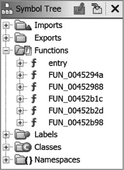

*图 13-13：疑似 UPX 压缩程序函数，用于* upx_demo1_x64_static.upx

你添加到 FidDb 的函数应该有意义的名称。因此，我们将示例中的函数名称更改为表示它们是 UPX 压缩程序的一部分，如图 13-14 所示，然后将这些函数添加到一个新的函数 ID 数据库中，以便 Ghidra 在未来能正确标记这些函数。

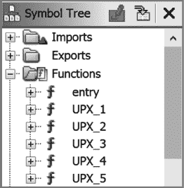

*图 13-14：已标记的 UPX 压缩程序函数，用于* upx_demo1_x64_static.upx

我们通过选择**工具** ▸ **函数 ID** ▸ **创建新的空 FidDb** 来创建一个新的 FidDb，并命名为*UPX.fidb*。接下来，我们通过选择**工具** ▸ **函数 ID** ▸ **从程序填充 FidDb**，将从更新后的二进制文件中提取的信息填充到新的数据库中。在弹出的对话框中输入 FidDb 信息，如图 13-15 所示。

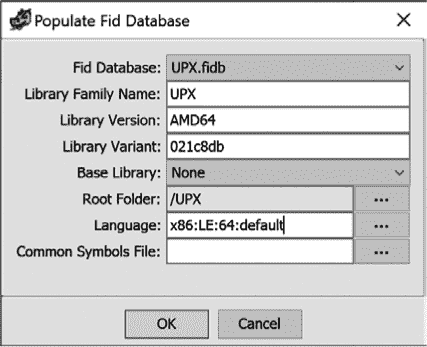

*图 13-15：填充 Fid 数据库对话框*

这里描述了每个字段的目的以及我们输入的值：

**Fid 数据库** *UPX.fidb* 是我们新创建的 FidDb 的名称。下拉列表允许你从已创建的所有 FidDb 中进行选择。

**库的名称** 选择一个能够描述你提取函数数据的库名称。在我们的例子中，我们输入了*UPX*。

**库版本** 此字段可以是版本号、平台名称或两者的组合。由于 UPX 适用于许多平台，我们根据二进制文件的架构选择了库版本。

**库变种** 此字段可用于任何其他信息，用以区分同一版本的其他库。在本例中，我们使用了来自 GitHub 上 UPX 仓库的该版本 UPX 的提交 ID（*[`github.com/upx/`](https://github.com/upx/)*）。

**基础库** 在此，您可以引用另一个 FidDb，Ghidra 将用它来建立父/子关系。我们没有使用基础库，因为 UPX 是完全自包含的。

**根文件夹** 此字段命名一个 Ghidra 项目文件夹。选定文件夹中的所有文件将在功能摄取过程中进行处理。在本例中，我们从下拉菜单中选择了 */UPX*。

**语言** 此项包含与新 FidDb 相关联的 Ghidra 语言标识符。要从根文件夹进行处理，文件的语言标识符必须与此值匹配。此项内容来自二进制文件的导入结果摘要窗口，但可以使用文本框右侧的按钮进行修改。

**通用符号文件** 此字段指定包含应从摄取过程中排除的功能列表的文件。此字段在本例中未使用。

当我们点击“确定”时，摄取过程开始。当完成后，我们将看到 FidDb 填充的结果（图 13-16）。

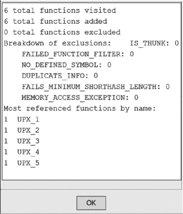

*图 13-16：来自 UPX FidDb 填充的结果窗口*

一旦新 FidDb 被创建，Ghidra 就可以使用它来识别您正在分析的任何二进制文件中的功能。我们通过加载一个新的 UPX 打包的 64 位 Linux ELF 二进制文件 *upx_demo2_x64_static.upx*，并在没有功能 ID 分析器的情况下对文件进行自动分析来演示这一过程。结果符号树，如图 13-17 所示，显示了五个未识别的功能，正如我们预期的那样。

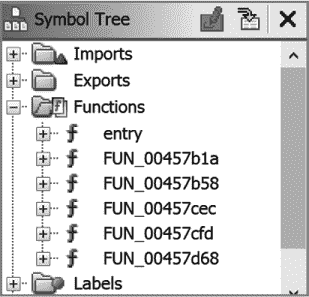

*图 13-17：* upx_demo2_x64_static.upx *在功能 ID 分析器前的符号树条目*

运行功能 ID 作为一次性分析器（分析 ▸ 一次性 ▸ 功能 ID）会生成图 13-18 中所示的符号树，其中包括 UPX 功能名称。

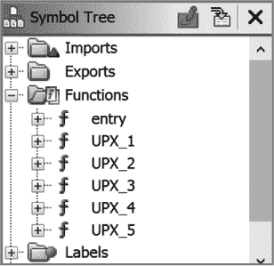

*图 13-18：* upx_demo2_x64_static.upx *在功能 ID 分析器后的符号树条目*

分析器还会更新列出窗口，显示新的功能名称和板块注释，类似于接下来展示的 `UPX_1` 的板块注释。这个板块注释包含了我们在创建 FidDb 时提供的信息：

```
    **************************************************************

    * Library Function - Single Match                            *

    * Name: UPX_1                                                *

    * Library: UPX AMD64 021c8db                                 *

    **************************************************************

                            undefined UPX_1()

    undefined         AL:1           <RETURN>

        UPX_1                             XREF[1]:     UPX_2:00457c08(c)

00457b1a 48 8d 04 2f  LEA    RAX,[RDI + RBP*0x1]

00457b1e 83 f9 05     CMP    ECX,0x5
```

创建新的 FidDb 只是扩展 Ghidra 函数识别功能的开始。你可以分析与函数相关的参数，并将其保存在数据类型档案中。然后，当 Function ID 正确识别函数时，你可以将相应的数据类型管理器条目拖动到列表窗口中的函数上，函数原型就会更新为适当的参数。

#### *Function ID 插件示例：静态库分析*

当你逆向工程一个静态链接的二进制文件时，你可能首先希望得到一个与该二进制文件中链接的函数相匹配的 FidDb，这样 Ghidra 就能识别出库代码，节省你分析的精力。以下示例解答了两个重要问题：（1）如何知道你是否拥有这样的 FidDb？（2）如果没有 FidDb，该怎么办？第一个问题的答案很简单：Ghidra 自带至少十几个 FidDb（以*.fidbf*文件的形式），这些都与 Visual Studio 的库代码相关。如果二进制文件不是 Windows 二进制文件，而且你还没有创建或导入任何 FidDb，那么你需要通过使用 Ghidra 的 Function ID 插件来自己制作一个 FidDb（这也解决了第二个问题）。

在填充新的 FidDb 时，最重要的一点是你需要一个输入源，它应该有较高的概率与任何你打算应用 FidDb 的二进制文件匹配。在 UPX 示例中，我们有一个包含我们直觉上可能在未来再次遇到的代码的二进制文件。在常见的静态链接情况下，我们有一个二进制文件，目标是尽可能匹配这个二进制文件中的所有代码。

有多种方法可以识别你正在处理的是一个静态链接的二进制文件。在 Ghidra 中，查看符号树中的*Imports*文件夹。对于一个完全静态链接的二进制文件，文件夹会为空，因为它不需要导入函数。部分静态链接的二进制文件可能有一些导入，因此你可以在“已定义字符串”窗口中查找来自著名库的版权或版本字符串。

在命令行中，你可以使用简单的工具，如`file`和`strings`：

```
$ file upx_demo2_x64_static_stripped

  upx_demo2_x64_static_stripped: ELF 64-bit LSB executable, x86-64,

  version 1 (GNU/Linux), statically linked, for GNU/Linux 3.2.0,

  BuildID[sha1]=54e3569c298166521438938cc2b7a4dda7ab7f5c, stripped

$ strings upx_demo2_x64_static_stripped | grep GCC

  GCC: (Ubuntu 7.4.0-1ubuntu1~18.04.1) 7.4.0
```

`file`命令的输出告诉我们，该二进制文件是静态链接的，已剥离符号，并且来自 Linux 系统。（一个剥离符号的二进制文件不包含任何熟悉的名称，因此无法通过函数名推测其行为。）使用`grep GCC`过滤`strings`命令的输出可以识别编译器 GCC 7.4.0 以及用于构建该二进制文件的 Linux 发行版 Ubuntu 18.04.1。（你也可以使用 CodeBrowser 的搜索功能，选择程序文本并使用*GCC*作为过滤条件，来获取相同的信息。）很可能这个二进制文件是与*libc.a*链接的，^(1)因此我们从 Ubuntu 18.04.1 中复制*libc.a*，并将其作为恢复剥离符号的起点。（二进制文件中的其他字符串可能会促使我们选择更多静态库进行函数 ID 分析；但在此示例中，我们仅限于使用*libc.a*。）

要使用*libc.a*来填充 FidDb，Ghidra 必须识别其中包含的指令和函数。归档（即*.a*）文件格式定义了一个容器，通常用于存储对象文件（*.o*），这些文件可能被编译器提取并链接到可执行文件中。Ghidra 导入容器文件的过程与导入单个二进制文件的过程不同，因此当我们使用“文件 ▸ 导入”来导入*libc.a*时，Ghidra 会提供其他导入模式，如图 13-19 所示。（这些选项也可以通过文件菜单选择。）

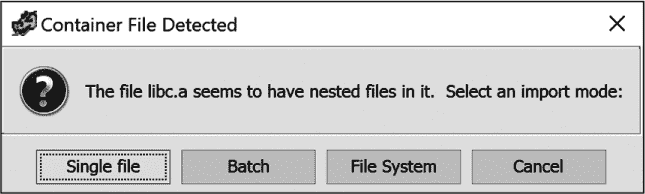

*图 13-19：导入容器文件*

单文件模式要求 Ghidra 将容器文件作为单个文件导入。由于容器文件并不是一个可执行文件，Ghidra 可能会建议使用原始二进制格式进行导入，并执行最小化的自动化分析。在文件系统模式下，Ghidra 会打开一个文件浏览窗口（见图 13-20），显示容器文件的内容。在这种模式下，你可以通过上下文菜单的选项选择容器中的任意文件进行导入。

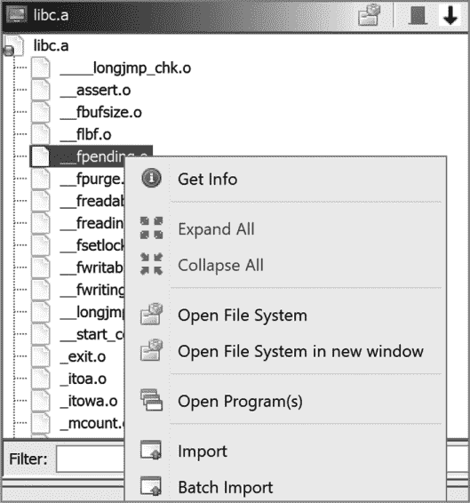

*图 13-20：文件系统导入模式*

在批处理模式下，Ghidra 会自动导入容器中的文件，而不会暂停显示单个文件的信息。在初步处理容器内容后，Ghidra 会显示如图 13-21 所示的批量导入对话框。在点击确定之前，你可以查看每个正在导入文件的信息，添加更多文件到批量导入中，设置导入选项，并选择 Ghidra 项目中的目标文件夹。图 13-21 显示我们即将从*libc.a*库中导入 1690 个文件到 CH13 项目的根目录。

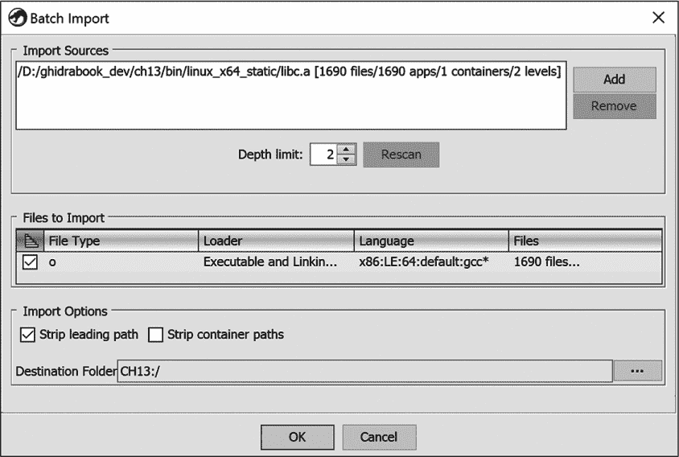

*图 13-21：Ghidra 的批量导入对话框*

点击**OK**开始导入过程（可能需要一些时间）。导入完成后，您将能够在 Ghidra 项目窗口中浏览新导入的文件。由于*libc.a*是一个容器文件，它将在项目窗口中显示为一个文件夹，您可以浏览其内容，打开并分析文件夹中的任何文件。

到这一步，我们终于可以将每个`libc`函数的指纹捕获到 FidDb 中，并使用这个 FidDb 对我们样本的静态链接二进制文件进行功能 ID 分析。这个过程类似于 UPX 示例，首先创建一个新的空 FidDb，然后从程序中填充数据。在这种情况下，程序将是我们新导入的*libc.a*文件夹的全部内容。这里我们遇到了一个重大挑战。

当我们选择文件来填充新的 FidDb 时，必须确保每个文件都已被 Ghidra 正确分析，以识别函数及其相关指令（即功能 ID 哈希过程的输入）。到目前为止，我们看到 Ghidra 只会在我们打开程序时在 CodeBrowser 中进行分析，但在处理*libc.a*时，我们面临着分析*libc.a*归档中 1690 个单独文件的艰巨任务。逐一打开并分析它们并不是一种高效的做法。即使选择在导入时打开所有文件，并使用 Ghidra 的“分析所有打开的文件”选项，也需要花费我们相当多的时间来处理所有 1690 个文件（并且可能需要手动调整工具选项和资源分配，以适应在 Ghidra 实例中处理如此庞大任务）。

如果这个问题看起来笨重，您是对的。这不是我们应该通过 Ghidra GUI 手动解决的任务。这是一个明确定义的重复性任务，不应该需要人工干预。幸运的是，接下来的三章介绍了我们可以用来自动化这一任务及其他任务的方法。当我们到达 “自动化 FidDb 创建” 第 359 页时，我们将重新审视这个具体任务，并演示如何使用 Ghidra 的无头模式轻松实现批处理操作。

无论我们使用什么方法来处理*libc.a*，一旦完成，返回到功能 ID 插件并填充我们的新 FidDb，生成以下结果就变得简单：

```
FidDb Populate Results

2905 total functions visited

2638 total functions added

267 total functions excluded

Breakdown of exclusions:    FAILS_MINIMUM_SHORTHASH_LENGTH: 234

    DUPLICATE_INFO: 9

    FAILED_FUNCTION_FILTER: 0

    IS_THUNK: 16

    NO_DEFINED_SYMBOL: 8

    MEMORY_ACCESS_EXCEPTION: 0

Most referenced functions by name:

749  __stack_chk_fail

431  free

304  malloc

...
```

我们的新 FidDb 现在可以使用了，并允许功能 ID 分析器匹配*upx_demo2_x64_static_stripped*中包含的许多函数，从而大大减少了我们对该二进制文件进行逆向工程的工作量。

### 总结

本章展示了通过解析 C 源文件、扩展词模型以及使用 Function ID 插件提取函数指纹等方式扩展 Ghidra 的一些方法。当二进制文件包含静态链接的代码或来自先前分析过的二进制文件的复用代码时，将这些函数与 Ghidra FidDb 进行匹配，可以帮助你避免手动查找大量代码的麻烦。可以预见的是，静态链接库种类繁多，Ghidra 不可能包含涵盖所有使用场景的 FidDb 文件。必要时创建自己的 FidDb 文件的能力，允许你构建一个针对特定需求调整的 FidDb 集合。在第十四章和第十五章中，我们将介绍 Ghidra 强大的脚本功能，进一步扩展 Ghidra 的功能。
