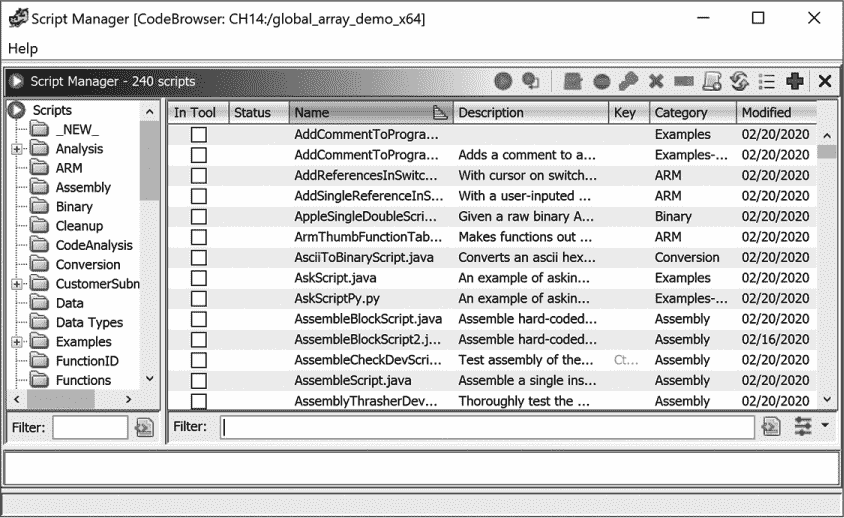
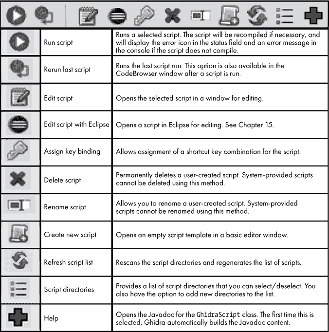
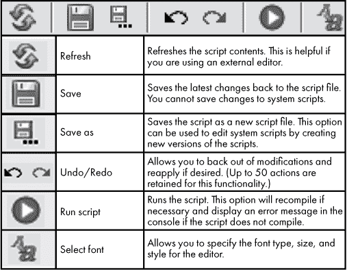
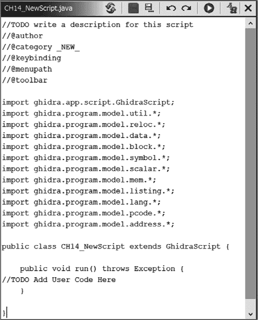
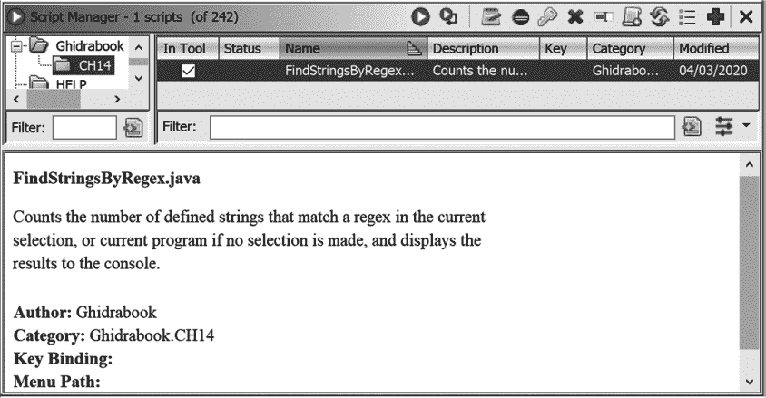
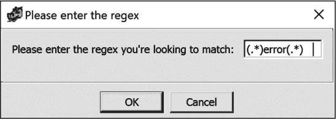
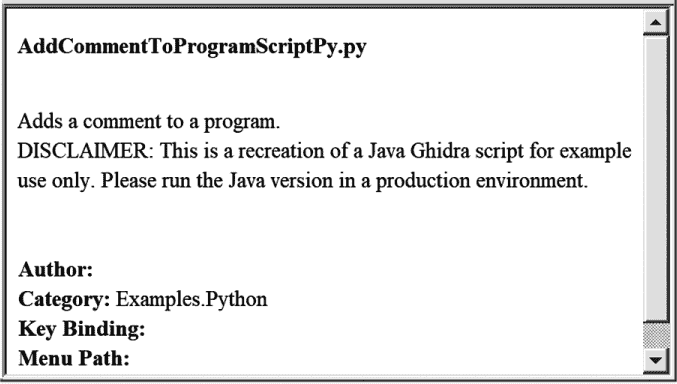
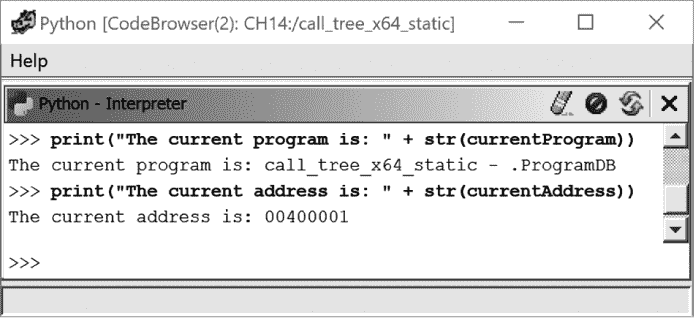

## 第十七章：**基础 Ghidra 脚本编写**


没有任何应用程序能够满足每个用户的所有需求。这是因为无法预见所有可能出现的使用情况。Ghidra 的开源模型鼓励开发者提出功能请求并进行创新贡献。然而，有时你需要立即解决眼前的问题，而不能等待其他人实现新功能。为了支持无法预见的使用案例和对 Ghidra 操作的程序化控制，Ghidra 包含了集成脚本功能。

脚本的用途是无穷无尽的，既可以是简单的单行代码，也可以是完整的程序，自动化常见任务或执行复杂分析。本章我们将重点介绍通过 CodeBrowser 界面提供的基本脚本编写。我们将介绍内部脚本环境，讨论如何使用 Java 和 Python 开发脚本，接着进入 第十五章中讨论的其他集成脚本选项。

### 脚本管理器

Ghidra 脚本管理器可以通过 CodeBrowser 菜单访问。选择“窗口 ▸ 脚本管理器”会打开如 图 14-1 所示的窗口。也可以通过 CodeBrowser 工具栏中的脚本管理器图标（一个绿色圆圈，内有箭头，也出现在脚本管理器窗口的左上角）来打开该窗口。



*图 14-1：脚本管理器窗口*

#### *脚本管理器窗口*

在全新安装的 Ghidra 中，脚本管理器加载时会包含超过 240 个脚本，这些脚本按类别树进行组织，如 图 14-1 左侧所示。部分文件夹内包含子文件夹，以便对脚本进行更详细的分类。你可以展开或折叠这些文件夹，查看脚本的组织结构。选择一个文件夹或子文件夹将只显示该文件夹中的脚本。为了填充这个窗口，Ghidra 会在 Ghidra 安装目录中的 *ghidra_scripts* 子目录内查找并索引所有脚本。Ghidra 还会查找用户主目录下的 *ghidra_scripts* 目录，并索引其中的脚本。

默认的脚本集覆盖了广泛的功能。一些脚本旨在演示基本的脚本概念。脚本列表表格中的列提供了关于每个脚本用途的更多细节。与大多数 Ghidra 表格一样，你可以控制显示哪些列以及各列的排序方式。默认情况下，所有可用的字段都会显示，除了“创建时间”和“路径”之外。六个信息列为脚本提供了以下详细信息：

**状态** 显示脚本的状态。该字段通常为空，但可以显示一个红色图标，表示脚本中有错误。如果你已将工具栏图标与脚本关联，该图标将显示在这一列。

**名称** 包含脚本的文件名及其扩展名。

**描述** 从脚本中的元数据注释提取的描述。该字段可能非常长，但您可以通过悬停在字段上阅读完整内容。该字段在“脚本开发”一节中有更详细的讨论，详见第 289 页。

**键** 指示是否为运行该脚本分配了键绑定。

**类别** 指定脚本将在脚本管理器的主题层次结构中列出的路径。这是一个逻辑层次结构，*不是*文件系统目录层次结构。

**已修改** 脚本最后保存的日期。对于默认脚本，日期为 Ghidra 实例的安装日期。

窗口左侧的过滤器字段用于在脚本类别中进行搜索。右侧的过滤器用于搜索脚本的名称和描述。最后，在底部，还有一个最初为空的额外窗口。该窗口以易于处理的格式显示所选脚本的元数据，包括从脚本中的元数据提取的字段。元数据字段的格式和含义在“编写 Java 脚本（不是 JavaScript！）”一节中讨论，详见第 289 页。

虽然脚本管理器提供了大量的信息，但此窗口的主要功能来自于其提供的工具栏。工具栏的概述请参见图 14-2。

#### *脚本管理器工具栏*

脚本管理器没有菜单来帮助您管理脚本。相反，所有的脚本管理操作都与脚本管理器工具栏上的工具相关联（见图 14-2）。

虽然大部分菜单选项从图 14-2 中的描述来看都比较清晰，但编辑选项值得额外讨论。Eclipse 中的编辑功能在第十五章中有所介绍，因为它支持更高级的脚本功能。编辑脚本选项会打开一个原始的文本编辑器窗口，并带有自己的工具栏，如图 14-3 所示。相关的操作提供了编辑文件的基本功能。有了编辑器，我们可以开始编写实际的脚本。



*图 14-2: 脚本管理器工具栏*



*图 14-3: 编辑脚本工具栏*

### 脚本开发

在 Ghidra 中开发脚本有几种方法。本章重点介绍使用 Java 和 Python 编写脚本，因为这些语言是脚本管理器窗口中现有脚本所使用的语言。超过 240 个系统脚本大多是用 Java 编写的，因此我们将从编辑和开发 Java 脚本开始。

#### *编写 Java 脚本（不是 JavaScript！）*

在 Ghidra 中，使用 Java 编写的脚本实际上是一个完整的类规范，旨在无缝编译、动态加载到运行中的 Ghidra 实例中、调用并最终卸载。该类必须扩展类`Ghidra.app.script.GhidraScript`，实现`run()`方法，并使用注释提供有关脚本的 Javadoc 格式元数据。我们将展示脚本文件的结构，描述元数据要求，查看一些系统脚本，然后继续编辑现有脚本并构建我们自己的脚本。

图 14-4 显示了选择“创建新脚本”选项（参见图 14-2）时打开的脚本编辑器，用于创建新的 Java 脚本。我们将新脚本命名为*CH14_NewScript*。



*图 14-4：一个新的空脚本*

文件顶部是用于生成预期 Javadoc 信息的元数据注释和标签。这些信息也用于填充脚本管理器窗口中的字段（参见图 14-1）。任何在类、字段或方法声明之前以`//`开头的注释将成为脚本的 Javadoc 描述的一部分。额外的注释可以嵌入脚本中，并且不会包含在描述中。此外，以下元数据注释中的标签是支持的：

@author 提供有关脚本作者的信息。该信息由作者自行决定，可以包括任何相关细节（例如，姓名、联系信息、创建日期等）。

@category 确定脚本在类别树中的位置。这是唯一的强制标签，必须在所有 Ghidra 脚本中存在。句点（点）字符充当类别名称的路径分隔符（例如，`@category Ghidrabook.CH14`）。

@keybinding 记录用于从 CodeBrowser 窗口访问脚本的快捷键（例如，`@keybinding K`）。

@menupath 定义脚本的菜单路径，并提供一种从 CodeBrowser 菜单运行脚本的方式（例如，`@menupath File.Run.ThisScript`）。

@toolbar 为脚本关联一个图标。此图标显示为 CodeBrowser 窗口中的工具栏按钮，可用于运行脚本。如果 Ghidra 在脚本目录或 Ghidra 安装中找不到图像，将使用默认图像（例如，`@toolbar myImage.png`）。

当遇到一个新的 API（如 Ghidra API）时，可能需要一些时间才能在不不断查阅 API 文档的情况下编写脚本。尤其是 Java 对类路径问题和正确包含所需支持包非常敏感。一个节省时间和精力的选择是编辑现有程序，而不是创建一个新程序。我们在展示脚本的简单示例时采用了这种方法。

#### *编辑脚本示例：正则表达式搜索*

假设你的任务是开发一个脚本，接受用户输入的正则表达式并将匹配的字符串输出到控制台。此外，脚本需要在特定项目的脚本管理器中显示。虽然 Ghidra 提供了多种方法来完成这个任务，但你被要求编写一个脚本。为了找到一个具有相似功能的脚本作为基础，你查看了脚本管理器中的类别，检查了“字符串”和“搜索”类别的内容，然后筛选出包含 *strings* 的选项。使用筛选器可以提供一个更全面的与字符串相关的脚本列表供你参考。在这个示例中，你将编辑列表中第一个与要实现功能相似的脚本——*CountAndSaveStrings.java*。

在编辑器中打开脚本，通过右键点击所需脚本并选择 **编辑**（使用基本编辑器）来确认它是否是我们新功能的良好起点；然后使用 **另存为** 选项保存该脚本并将其命名为 *FindStringsByRegex.java*。Ghidra 不允许你在脚本管理器窗口中编辑作为 Ghidra 安装一部分提供的系统脚本（尽管你可以在 Eclipse 和其他编辑器中编辑）。你也可以在使用“另存为”之前编辑该文件，因为 Ghidra 会防止你不小心将任何修改后的内容写入现有的 *CountAndSaveStrings.java* 脚本。

原始的 *CountAndSaveStrings.java* 包含以下元数据：

```
➊ /* ###

   * IP: GHIDRA

   *

   * Licensed under the Apache License, Version 2.0 (the "License");

   * you may not use this file except in compliance with the License.

   * You may obtain a copy of the License at

   * http://www.apache.org/licenses/LICENSE-2.0

   * Unless required by applicable law or agreed to in writing, software

   * distributed under the License is distributed on an "AS IS" BASIS,

   * WITHOUT WARRANTIES OR CONDITIONS OF ANY KIND, either express or implied.

   * See the License for the specific language governing permissions and

   * limitations under the License.

   */

➋  //Counts the number of defined strings in the current selection,

   //or current program if no selection is made,

   //and saves the results to a file.

➌ //@category CustomerSubmission.Strings
```

我们可以在不影响脚本执行或关联 Javadoc 的情况下，留下、修改或删除脚本的许可协议➊。我们将修改脚本的描述➋，以便 Javadoc 和脚本管理器中显示的信息能够准确描述该脚本。脚本作者只包含了五个可用标签中的一个➌，因此我们将为未填充的标签添加占位符，并修改描述，如下所示：

```
// Counts the number of defined strings that match a regex in the current

// selection, or current program if no selection is made, and displays the

// number of matching strings to the console.

//

//@author Ghidrabook

//@category Ghidrabook.CH14

//@keybinding

//@menupath

//@toolbar
```

类别标签 `Ghidrabook.CH14` 将添加到脚本管理器的树状显示中，如图 14-5 所示。

原始脚本的下一部分包含 Java `import` 语句。在创建新脚本时，Ghidra 会包含一个长列表的导入，如图 14-4 所示，只有以下导入对字符串搜索是必要的，因此我们将保留与原始 *CountAndSaveStrings.java* 相同的导入列表：

```
import ghidra.app.script.GhidraScript;

import ghidra.program.model.listing.*;

import ghidra.program.util.ProgramSelection;

import java.io.*;
```

保存新脚本后，然后在脚本管理器中选择它，以查看图 14-5 中显示的内容。我们的新类别已包含在脚本树中，脚本的元数据显示在信息窗口和脚本表格中。该表格只包含一个脚本，*Ghidrabook.CH14*，因为它是所选类别中唯一的脚本。



*图 14-5：脚本管理器窗口中显示的新脚本信息*

由于本书并非旨在作为 Java 教程，我们将总结我们对脚本所做的更改，而不是解释 Java 的语法和功能。以下列表描述了*CountAndSaveStrings.java*的行为：

1.  获取程序列表内容以进行搜索。

1.  获取文件以保存结果。

1.  打开文件。

1.  遍历程序列表：统计符合条件的字符串数量，并将每个符合条件的字符串写入文件。

1.  关闭文件。

1.  将符合条件的字符串的数量写入控制台。

我们所需的修改脚本的功能如下：

1.  获取程序列表内容以进行搜索。

1.  向用户询问要搜索的正则表达式（regex）。

1.  遍历程序列表：统计符合条件的字符串数量，并将每个符合条件的字符串写入控制台。

1.  将符合条件的字符串的数量写入控制台。

我们的新脚本将比原始脚本短得多，因为不再需要与文件系统交互以及执行相关的错误检查。我们的实现如下：

```
public class FindStringsByRegex extends GhidraScript➊ {

   @Override

   public void run() throws Exception {

      String regex =

         askString("Please enter the regex",

         Please enter the regex you're looking to match:);

      Listing listing = currentProgram.getListing();

      DataIterator dataIt;

      if (currentSelection != null) {

          dataIt = listing.getDefinedData(currentSelection, true);

      }

      else {

         dataIt = listing.getDefinedData(true);

      }

      Data data;

      String type;

      int counter = 0;

      while (dataIt.hasNext() && !monitor.isCancelled()) {

         data = dataIt.next();

         type = data.getDataType().getName().toLowerCase();

         if (type.contains("unicode") || type.contains("string")) {

            String s = data.getDefaultValueRepresentation();

            if (s.matches(regex)) {

               counter++;

               println(s);

            }

         }

      }

      println(counter + " matching strings were found");

   }

}
```

所有你为 Ghidra 编写的 Java 脚本必须继承（扩展）一个名为`Ghidra.app.script.GhidraScript`的现有类➊。保存脚本的最终版本后，从脚本管理器中选择并执行它。当脚本执行时，我们可以看到在图 14-6 中显示的提示。此图包含我们将要搜索的正则表达式，以测试我们的脚本。



*图 14-6：输入正则表达式的新脚本提示*

当我们的新脚本执行完成后，CodeBrowser 控制台将显示以下内容：

```
FindStringsByRegex.java> Running...

FindStringsByRegex.java> "Fatal error: glibc detected an invalid stdio handle\n"

FindStringsByRegex.java> "Unknown error "

FindStringsByRegex.java> "internal error"

FindStringsByRegex.java> "relocation error"

FindStringsByRegex.java> "symbol lookup error"

FindStringsByRegex.java> "Fatal error: length accounting in _dl_exception_create_format\n"

FindStringsByRegex.java> "Fatal error: invalid format in exception string\n"

FindStringsByRegex.java> "error while loading shared libraries"

FindStringsByRegex.java> "Unknown error"

FindStringsByRegex.java> "version lookup error"

FindStringsByRegex.java> "sdlerror.o"

FindStringsByRegex.java> "dl-error.o"

FindStringsByRegex.java> "fatal_error"

FindStringsByRegex.java> "strerror.o"

FindStringsByRegex.java> "strerror"

FindStringsByRegex.java> "__strerror_r"

FindStringsByRegex.java> "_dl_signal_error"

FindStringsByRegex.java> "__dlerror"

FindStringsByRegex.java> "_dlerror_run"

FindStringsByRegex.java> "_dl_catch_error"

FindStringsByRegex.java> 20 matching strings were found

FindStringsByRegex.java> Finished!
```

这个简单的示例展示了 Ghidra 广泛的 Java 脚本功能的低门槛。现有脚本可以很容易地修改，新的脚本可以通过脚本管理器从零开始构建。在第十五章和第十六章中，我们展示了一些更复杂的 Java 脚本功能，但 Java 只是 Ghidra 提供的脚本选项之一。Ghidra 还允许你使用 Python 编写脚本。

#### *Python 脚本*

在脚本管理器中的 240 多个脚本中，只有少数是用 Python 编写的。你可以通过在脚本管理器中过滤*.py*扩展名来轻松找到 Python 脚本。大多数 Python 脚本可以在树形结构中的 Examples.Python 类别下找到，并且包含类似于图 14-7 中所示的免责声明。



*图 14-7：带免责声明的示例 Python 脚本*

在此目录中的示例中，以下三个示例是如果你更喜欢使用 Python，提供了一个很好的起点：

***ghidra_basic.py*** 这个脚本包含与 Ghidra 相关的基本 Python 脚本示例。

***python_basics.py*** 这是对你可能想使用的许多 Python 命令的一个非常基础的介绍。

***jython_basic.py*** 该脚本扩展了基础 Python 命令，展示了特定于 Jython 的内容。

这些示例中展示的 Ghidra 功能仅仅触及了 Ghidra API 的表面。你可能仍然需要花些时间阅读 Ghidra 的 Java 示例库，才能准备好通过你的 Python 脚本访问 Ghidra 的完整 Java API。

除了运行 Python 脚本外，Ghidra 还提供了 Python 解释器，使你能够使用 Python/Jython 直接访问与 Ghidra 相关的 Java 对象，如 图 14-8 所示。

**GHIDRA 的 Python 未来**

Python 因其简洁性和众多可用库而广受欢迎，成为创建脚本的首选语言。尽管 Ghidra 发布版中的大多数脚本是用 Java 编写的，但开源的逆向工程社区很可能会在 Ghidra 中使用 Python 作为主要脚本语言。Ghidra 依赖 Jython 来支持 Python（这使得可以直接访问 Ghidra 的 Java 对象）。Jython 与 Python 2（特别是 2.7.1）兼容，但不支持 Python 3。尽管 Python 2 在 2020 年 1 月停止了生命周期，但 Python 2 脚本在 Ghidra 中仍然能够正常运行，任何新的 Ghidra Python 2 脚本应尽可能地以便于迁移到 Python 3 的方式编写。



*图 14-8：Python 解释器* 打印 *示例*

通过 CodeBrowser 可以访问 Python 解释器，选择 Windows ▸ Python。有关如何使用解释器的更多信息，请参见 Ghidra 帮助。在使用 Python 和 Python 解释器时，要获取 API 信息，请选择解释器窗口左上角的帮助 ▸ Ghidra API 帮助，如 图 14-8 所示，这将打开 `GhidraScript` 类的 Javadoc 内容。或者，Python 有一个内置函数 `help( )`，在 Ghidra 中已经被修改，可以直接访问 Ghidra 的 Javadoc。要使用该功能，在解释器中键入 `help(`object`)`，如 图 14-9 所示。例如，`help(currentProgram)` 显示 Ghidra Javadoc 内容，描述了 Ghidra API 类 `ProgramDB`。


*图 14-9：Python 解释器帮助示例*

#### *对其他语言的支持*

最后，Ghidra 支持来自 Java 和 Python 以外的其他语言的脚本，这使你能够将现有的脚本从你的逆向工程工具包中带入 Ghidra 的工作流程中。这个功能在 Ghidra 帮助中有更详细的讨论。

### Ghidra API 介绍

此时，你已经掌握了编辑和运行 Ghidra 脚本所需的所有信息。现在是时候使用 Ghidra API 来扩展你的脚本功能，并更直接地与 Ghidra 文物进行交互了。Ghidra 提供了两种截然不同的 API 风格。

*Program* API 定义了一个对象层次结构，深度多层，最上层由`Program`类根本。这一 API 可能会随着 Ghidra 的版本不同而有所变化。*Flat* API 通过暴露该 API 的所有层级，统一从一个类`FlatProgramAPI`中访问，从而将 Program API 进行扁平化。Flat API 通常是访问许多 Ghidra 构造的最便捷方式。此外，它比 Program API 更不容易随着 Ghidra 版本的更新而发生变化。

在本章的其余部分，我们将重点介绍一些更有用的 Flat API 功能。在必要时，我们还会提供有关 Program API 中特定类的详细信息。我们使用 Java 作为本讨论的语言，因为它是 Ghidra 的原生语言。

Ghidra API 包含许多包、类及其相关函数，用于与 Ghidra 项目和相关文件交互，所有这些内容都在随 Ghidra 提供的 Javadoc 风格文档中详细说明，可以通过点击脚本管理器窗口中的红色加号访问。该文档与随 Ghidra 提供的示例脚本一起，是你了解 API 及其使用方法的主要参考资料。最常见的做法是浏览 Ghidra 类，查找那些从名称上看似乎能完成你需要的任务的类。随着你对 Ghidra 的理解不断加深，你对命名约定和文件组织结构的理解将帮助你更快地识别出合适的类。

Ghidra 遵循 Java Swing 的*模型-委托*架构，其中数据值和特性存储在模型对象中，并由用户界面委托对象（如树视图、列表视图和表格视图）显示。委托对象处理事件，例如鼠标点击，来更新和刷新数据和视图。在绝大多数情况下，你的脚本将集中在表示各种程序和逆向工程构造的模型类所封装的数据上。

本节的其余部分集中介绍常用的模型类、它们之间的关系，以及与之交互的有用 API。我们并不打算涵盖整个 Ghidra API，实际上还有许多其他的函数和类可以使用。整个 Ghidra API 的权威文档是随 Ghidra 提供的 Javadoc，最终的参考资料是构建 Ghidra 的 Java 源代码。

#### *地址接口*

`Address`接口描述了地址空间内地址的模型。所有地址通过一个最多为 64 位的偏移量表示。分段地址可能会通过段值进一步限定。在许多情况下，一个地址的偏移量相当于程序列表中的虚拟地址。`getOffset`方法从`Address`实例中检索`long`类型的偏移量值。许多 Ghidra API 函数要求以`Address`对象作为参数，或者返回`Address`对象作为结果。

#### *符号接口*

`Symbol`接口定义了所有符号的共同属性。至少，一个符号由名称和地址组成。这些属性可以通过以下成员函数获取：

Address getAddress()

返回`Symbol`的地址。

String getName()

返回`Symbol`的名称。

#### *引用接口*

`Reference`表示源地址和目标地址之间的交叉引用关系（如第九章所述），并且具有一个引用类型。与`Reference`相关的有用函数包括：

public Address getFromAddress()

返回此引用的源地址。

public Address getToAddress()

返回此引用的目标地址。

public RefType getReferenceType()

返回一个`RefType`对象，描述源地址和目标地址之间的链接性质。

#### *GhidraScript 类*

虽然这个类并没有表示二进制文件中的某个特定属性，但你编写的每个脚本必须是`GhidraScript`类的子类，而`GhidraScript`又是`FlatProgramAPI`类的子类。因此，你的脚本可以即时访问整个 Flat API，而你唯一的义务是提供实现。

```
protected abstract void run() throws Exception;
```

这样， hopefully，你的脚本就能做一些有趣的事情。`GhidraScript`类的剩余部分为你提供了与 Ghidra 用户以及正在分析的程序交互的最常见资源的访问权限。该类的一些更有用的函数和数据成员（包括一些从`FlatProgramAPI`继承的）将在以下章节中总结。

##### 有用的数据成员

`GhidraScript`类为你提供了方便访问在脚本中常用的多个对象，包括以下内容：

受保护的 Program currentProgram;

这是当前打开的程序。`Program`类将在后面讨论。这个数据成员可能是你获取更有趣信息（例如指令和符号列表）的通道。

受保护的 Address currentAddress;

这是当前光标位置的地址。`Address`类将在后面讨论。

受保护的 ProgramLocation currentLocation;

一个`ProgramLocation`对象，描述当前光标位置，包括其地址、光标所在的行、列以及其他信息。

受保护的 ProgramSelection currentSelection;

一个`ProgramSelection`对象，表示在 Ghidra 图形界面中选择的一系列地址。

受保护的 TaskMonitor monitor;

`TaskMonitor`类更新长时间运行任务的状态，并检查是否有长时间运行的任务被用户取消（`monitor.isCancelled()`）。你编写的任何长时间运行的循环都应该包含调用`monitor.isCancelled`，作为附加的终止条件，以识别用户是否尝试取消你的脚本。

##### 用户界面函数

GhidraScript 类提供了便捷的函数，用于执行基本的用户界面操作，从简单的消息输出到更具互动性的对话框元素。一些常见的用户界面函数在此描述：

public void println(String message)

将`message`打印到 Ghidra 的控制台窗口，后跟换行符。此函数对于以非侵入的方式打印状态消息或脚本结果非常有用。

public void printf(String message, Object... args)

使用`message`作为 Java 格式化字符串，并将格式化后的`args`打印到 Ghidra 的控制台窗口。

public void popup(final String message)

在弹出对话框中显示`message`，要求用户点击确定才能继续脚本执行。这是一种更具侵入性的方式来向用户显示状态消息。

public String askString(String title, String message)

许多可用的`ask`函数之一。`askString`显示一个文本输入对话框，使用`message`作为提示，并返回用户输入的文本。

public boolean askYesNo(String title, String question)

使用对话框询问用户一个是或否的`问题`。如果选择“是”，返回`true`；选择“否”，返回`false`。

public Address askAddress(String title, String message)

显示一个对话框，使用`message`作为提示，解析用户输入为`Address`对象。

public int askInt(String title, String message)

显示一个对话框，使用`message`作为提示，解析用户输入为`int`类型。

public File askFile(final String title, final String approveButtonText)

显示一个系统文件选择对话框，并返回一个 Java `File`对象，表示用户选择的文件。

public File askDirectory(final String title, final String approveButtonText)

显示一个系统文件选择对话框，并返回一个 Java `File`对象，表示用户选择的目录。

public boolean goTo(Address address)

将所有连接的 Ghidra 反汇编窗口重新定位到`address`。此函数的重载版本接受`Symbol`或`Function`参数，并根据这些参数调整显示。

##### 地址相关函数

对于处理器而言，地址通常只是一个数字，恰好指向一个内存位置。Ghidra 通过`Address`类来表示地址。`GhidraScript`提供了一个包装函数，可以方便地将数字转换为 Ghidra 的`Address`对象：

public Address toAddr(long offset)

创建`Address`对象的便捷函数，位于默认地址空间中

##### 读取程序内存

`Memory` 类表示字节值的连续范围，例如加载到 Ghidra 中的可执行文件的内容。在 `Memory` 对象中，每个字节值都与一个地址关联，尽管地址可能被标记为未初始化，并且没有可获取的值。如果尝试访问 `Memory` 对象中无效地址的内存位置，Ghidra 会抛出 `MemoryAccessException`。有关 `Memory` 类的完整 API 函数说明，请查阅文档。以下便捷函数通过 Flat API 暴露了 `Memory` 类的一部分功能：

public byte getByte(Address addr)

返回从 `addr` 获取的单个字节值。数据类型 `byte` 在 Java 中是有符号类型，因此该值的范围为 -128..127。

public byte[] getBytes(Address addr, int length)

返回从 `addr` 开始的 `length` 字节数据。

public int getInt(Address addr)

返回从 `addr` 开始的 4 字节值，作为 Java 的 `int` 类型。此函数会考虑字节序，并在重建 `int` 值时遵循二进制的底层架构。

public long getLong(Address addr)

返回从 `addr` 开始的 8 字节值，作为 Java 的 `long` 类型。此函数会考虑字节序，并在重建 `long` 值时遵循二进制的底层架构。

##### 程序搜索功能

Ghidra 的搜索功能根据被搜索项的类型，分布在不同的 Program API 类中。`Memory` 类包含原始字节搜索功能。代码单元（如 `Data` 和 `Instruction`）、注释文本及相关迭代器从 `Listing` 类中获取。符号/标签及相关迭代器通过 `SymbolTable` 类访问。以下便捷函数通过 Flat API 暴露了部分可用的搜索功能：

public Data getFirstData()

返回程序中的第一个数据项。

public Data getDataAfter(Data data)

返回 `data` 后的下一个数据项，如果没有此数据项，则返回 `null`。

public Data getDataAt(Address address)

返回 `address` 处的数据项，如果没有此数据项，则返回 `null`。

public Instruction getFirstInstruction()

返回程序中的第一条指令。

public Instruction getInstructionAfter(Instruction instruction)

返回 `instruction` 后的下一个指令项，如果没有此指令项，则返回 `null`。

public Instruction getInstructionAt(Address address)

返回 `address` 处的指令，如果不存在此指令，则返回 `null`。

public Address find(String text)

在 Listing 窗口中搜索 `text` 字符串。Listing 组件按以下顺序进行搜索：

1.  Plate 注释

1.  Pre 注释

1.  标签

1.  代码单元助记符和操作数

1.  EOL 注释

1.  可重复注释

1.  Post 注释

成功的搜索返回包含匹配项的地址。请注意，由于搜索顺序的原因，返回的地址可能*不*代表在严格递增的地址顺序下反汇编清单中第一次出现的文本。

public Address find(Address start, byte[] values);

在`addr`处开始搜索内存，查找指定的字节`values`序列。当`addr`为`null`时，搜索从二进制文件中的最低有效地址开始。成功的搜索将返回匹配序列中第一个字节的地址。

public Address findBytes(Address start, String byteString)

在`addr`处开始搜索内存，查找可能包含正则表达式的指定`byteString`。当`addr`为`null`时，搜索从二进制文件中的最低有效地址开始。成功的搜索将返回匹配序列中第一个字节的地址。

##### 操作标签和符号

在脚本中，经常需要操作命名的位置。以下是可用于在 Ghidra 数据库中处理命名位置的函数：

public Symbol getSymbolAt(Address address)

返回与给定地址关联的`Symbol`，如果该位置没有`Symbol`，则返回`null`。

public Symbol createLabel(Address address, String name, boolean makePrimary)

将给定的`name`分配给给定的`address`。Ghidra 允许多个名称分配给单一地址。如果`makePrimary`为`true`，则新名称将成为与`address`关联的主名称。

public List<Symbol> getSymbols(String name, Namespace namespace)

返回`namespace`中所有名为`name`的符号列表。如果`namespace`为`null`，则搜索全局命名空间。如果结果为空，则表示该符号不存在。如果结果仅包含一个元素，则表示该名称是唯一的。

##### 与函数的操作

许多脚本旨在分析程序中的函数。以下函数可用于访问有关程序函数的信息：

public final Function getFirstFunction()

返回程序中的第一个`Function`对象

public Function getGlobalFunctions(String name)

返回命名函数的第一个`Function`对象，如果没有这样的函数则返回`null`

public Function getFunctionAt(Address entryPoint)

返回`entryPoint`处的`Function`对象，如果没有这样的函数则返回`null`

public Function getFunctionAfter(Function function)

返回`function`的后继`Function`对象，如果没有这样的函数则返回`null`

public Function getFunctionAfter(Address address)

返回在地址后开始的`Function`对象，如果没有这样的函数则返回`null`

##### 与交叉引用的操作

交叉引用在第九章中有详细介绍。在 Ghidra 程序 API 中，顶层的`Program`对象包含一个`ReferenceManager`，显而易见，它管理程序中的引用。与许多其他程序构造一样，Flat API 提供了方便的函数来访问交叉引用，其中一些在此处进行了详细说明：

public Reference[] getReferencesFrom(Address address)

返回所有来自`address`的`Reference`对象的数组。

public Reference[] getReferencesTo(Address address)

返回所有指向`address`的`Reference`对象的数组。

##### 程序操作函数

在自动化分析任务时，您可能会希望将新信息添加到程序中。Flat API 提供了多种修改程序内容的功能，包括以下内容：

public final void clearListing(Address address)

移除`address`处定义的任何指令或数据。

public void removeFunctionAt(Address address)

移除位于`address`的函数。

public boolean disassemble(Address address)

从`address`开始执行递归下降反汇编。如果操作成功，返回`true`。

public Data createByte(Address address)

将指定地址处的项目转换为数据字节。此外，还可以使用`createWord`、`createDword`、`createQword`和其他数据创建函数。

public boolean setEOLComment(Address address, String comment)

在给定的`address`处添加一个 EOL 注释。其他与注释相关的函数包括`setPlateComment`、`setPreComment`和`setPostComment`。

public Function createFunction(Address entryPoint, String name)

在`entryPoint`处创建一个具有给定`name`的函数。Ghidra 会尝试通过定位函数的返回指令来自动识别函数的结束。

public Data createAsciiString(Address address)

在`address`处创建一个以空字符结尾的 ASCII 字符串。

public Data createAsciiString(Address address, int length)

在`address`处创建指定`length`长度的 ASCII 字符串。如果`length`为零或更小，Ghidra 会尝试自动定位字符串的空字符终止符。

public Data createUnicodeString(Address address)

在`address`处创建一个以空字符结尾的 Unicode 字符串。

#### *程序类*

`Program`类代表程序 API 层次结构的根节点，以及二进制文件数据模型的最外层。您通常会使用`Program`对象（通常是`currentProgram`）来访问二进制模型。常用的`Program`类成员函数包括以下内容：

public Listing getListing()

获取当前程序的`Listing`对象。

public FunctionManager getFunctionManager()

检索程序的 `FunctionManager`，该管理器提供对已在二进制文件中识别的所有函数的访问。此类提供了将 `Address` 映射回其包含的 `Function`（`Function` `getFunctionContaining(Address addr)`）的功能。此外，它还提供了一个 `FunctionIterator`，当你想要处理程序中的每个函数时非常有用。

public SymbolTable getSymbolTable()

检索程序的 `SymbolTable` 对象。使用 `SymbolTable`，可以处理单个符号或遍历程序中的所有符号。

public Memory getMemory()

检索与此程序关联的 `Memory` 对象，该对象允许你操作原始程序字节内容。

public ReferenceManager getReferenceManager()

检索程序的 `ReferenceManager` 对象。`ReferenceManager` 可用于添加和删除引用以及检索多种类型引用的迭代器。

public Address getMinAddress()

返回程序中最低有效地址。这通常是二进制文件的基础内存地址。

public Address getMaxAddress()

返回程序中最高有效地址。

public LanguageID getLanguageID()

返回二进制文件语言规范的对象表示。可以使用 `getIdAsString()` 函数检索语言规范本身。

#### *函数接口*

`Function` 接口定义了函数对象所需的程序 API 行为。成员函数提供对与函数常相关的各种属性的访问，包括以下内容：

public String getPrototypeString(boolean formalSignature,

boolean includeCallingConvention)

返回 `Function` 对象的原型字符串。两个参数影响返回的原型字符串的格式。

public AddressSetView getBody()

返回包含函数代码体的地址集合。*地址集合*由一个或多个地址范围组成，允许函数的代码分布在多个非连续的内存范围中。获取 `AddressIterator` 以访问集合中的所有地址，或者获取 `AddressRangeIterator` 以遍历每个范围。请注意，必须使用 `Listing` 对象来检索函数体内的实际指令（参见 `getInstructions`）。

public StackFrame getStackFrame()

返回与函数相关联的堆栈帧。结果可用于获取关于函数局部变量和基于堆栈的参数布局的详细信息。

#### *指令接口*

`Instruction` 接口定义了指令对象所需的程序 API 行为。成员函数提供对与指令常相关的各种属性的访问，包括以下内容：

public String getMnemonicString()

返回指令的助记符。

public String getComment(int commentType)

返回与指令相关联的`commentType`注释，如果没有与该指令关联的指定类型的注释，则返回`null`。`commentType`可能是`EOL_COMMENT`、`PRE_COMMENT`、`POST_COMMENT`或`REPEATABLE_COMMENT`之一。

public int getNumOperands()

返回与此指令关联的操作数数量。

public int getOperandType(int opIndex)

返回在`OperandType`类中定义的操作数类型标志的位掩码。

public String toString()

返回指令的字符串表示。

### Ghidra 脚本示例

在本章的其余部分，我们将介绍一些脚本可以用来回答程序相关问题的常见情况。为简洁起见，本文仅展示每个脚本`run`函数的主体部分。

#### *示例 1：枚举函数*

很多脚本操作于单个函数。例如，生成以特定函数为根的调用树，生成函数的控制流图，以及分析程序中每个函数的堆栈帧。清单 14-1 遍历程序中的每个函数，并打印每个函数的基本信息，包括函数的起始和结束地址、函数参数的大小以及函数局部变量的大小。所有输出都发送到控制台窗口。

```
// ch14_1_flat.java

void run() throws Exception {

  int ptrSize = currentProgram.getDefaultPointerSize();

 ➊ Function func = getFirstFunction();

  while (func != null && !monitor.isCancelled()) {

     String name = func.getName();

     long addr = func.getBody().getMinAddress().getOffset();

     long end = func.getBody().getMaxAddress().getOffset();

  ➋ StackFrame frame = func.getStackFrame();

  ➌ int locals = frame.getLocalSize();

  ➍ int args = frame.getParameterSize();

     printf("Function: %s, starts at %x, ends at %x\n", name, addr, end);

     printf("  Local variable area is %d bytes\n", locals);

     printf("  Arguments use %d bytes (%d args)\n", args, args / ptrSize);

  ➎ func = getFunctionAfter(func);

  }

}
```

*清单 14-1：函数枚举脚本*

该脚本使用 Ghidra 的 Flat API 遍历从第一个函数 ➊开始的所有函数，并依次向前推进 ➎。获取每个函数堆栈帧的引用 ➋，并检索局部变量的大小 ➌以及基于堆栈的参数的大小 ➍。在继续迭代之前，会打印每个函数的摘要。

#### *示例 2：枚举指令*

在给定的函数内，您可能想要枚举每一条指令。清单 14-2 计算当前光标位置所标识的函数中包含的指令数量：

```
// ch14_2_flat.java

public void run() throws Exception {

   Listing plist = currentProgram.getListing();

➊ Function func = getFunctionContaining(currentAddress);

   if (func != null) {

   ➋ InstructionIterator iter = plist.getInstructions(func.getBody(), true);

      int count = 0;

      while (iter.hasNext() && !monitor.isCancelled()) {

         count++;

         Instruction ins = iter.next();

      }

   ➌ popup(String.format("%s contains %d instructions\n",

                          func.getName(), count));

   }

   else {

      popup(String.format("No function found at location %x",

                          currentAddress.getOffset()));

   }

}
```

*清单 14-2：指令枚举脚本*

该函数首先获取包含光标的函数的引用 ➊。如果找到该函数，下一步是使用程序的`Listing`对象获取该函数的`InstructionIterator` ➋。迭代循环计算检索到的指令数量，并通过弹出消息对话框 ➌将总数报告给用户。

#### *示例 3：枚举交叉引用*

迭代交叉引用可能会令人困惑，因为可以访问交叉引用数据的函数数量以及代码交叉引用是双向的。要获取所需的数据，您需要访问适合您情况的正确类型的交叉引用。

在我们第一个交叉引用示例中，如清单 14-3 所示，我们通过遍历函数中的每条指令，检查该指令是否调用了其他函数，从而获取函数中所有调用的列表。实现这一点的一种方法是解析`getMnemonicString`函数的结果，查找`call`指令。这并不是一个很便携或者高效的解决方案，因为调用函数的指令在不同的处理器类型之间有所不同，而且还需要额外的解析来确定到底调用了哪个函数。交叉引用避免了这些困难，因为它们与处理器无关，并且直接告诉我们交叉引用的目标。

```
// ch14_3_flat.java

void run() throws Exception {

   Listing plist = currentProgram.getListing();

➊ Function func = getFunctionContaining(currentAddress);

   if (func != null) {

      String fname = func.getName();

      InstructionIterator iter = plist.getInstructions(func.getBody(), true);

   ➋ while (iter.hasNext() && !monitor.isCancelled()) {

         Instruction ins = iter.next();

         Address addr = ins.getMinAddress();

         Reference refs[] = ins.getReferencesFrom();

     ➌ for (int i = 0; i < refs.length; i++) {

        ➍ if (refs[i].getReferenceType().isCall()) {

               Address tgt = refs[i].getToAddress();

               Symbol sym = getSymbolAt(tgt);

               String sname = sym.getName();

               long offset = addr.getOffset();

               printf("%s calls %s at 0x%x\n", fname, sname, offset);

            }

         }

      }

   }

}
```

*清单 14-3：枚举函数调用*

**危险函数**

C 语言中的`strcpy`和`sprintf`函数被认为是危险的，因为它们允许将数据无限制地复制到目标缓冲区。尽管程序员可以通过检查源缓冲区和目标缓冲区的大小来安全地使用这些函数，但这些检查常常被那些不了解这些函数危险性的程序员忽略。例如，`strcpy`函数的声明如下：

```
char *strcpy(char *dest, const char *source);
```

`strcpy`函数将源缓冲区中所有字符（包括遇到的第一个空字符终止符）复制到指定的目标缓冲区(`dest`)。根本问题在于，无法在运行时确定任何数组的大小，而`strcpy`无法判断目标缓冲区是否足够大，以容纳从源缓冲区复制的所有数据。这种未经检查的复制操作是缓冲区溢出漏洞的主要原因。

我们首先获取包含光标位置的函数的引用 ➊。接下来，我们遍历该函数中的每条指令 ➋，对于每条指令，我们会遍历每个来自该指令的交叉引用 ➌。我们只对调用其他函数的交叉引用感兴趣，因此我们必须测试`getReferenceType`的返回值 ➍，以确定`isCall`是否为`true`。

#### *示例 4：查找函数调用*

交叉引用也对于识别每个引用特定位置的指令非常有用。在清单 14-4 中，我们遍历所有指向特定符号的交叉引用（与之前示例中的*from*不同，这次是*to*）。

```
   // ch14_4_flat.java

➊ public void list_calls(Function tgtfunc) {

     String fname = tgtfunc.getName();

     Address addr = tgtfunc.getEntryPoint();

     Reference refs[] = getReferencesTo(addr);

  ➋ for (int i = 0; i < refs.length; i++) {

     ➌ if (refs[i].getReferenceType().isCall()) {

           Address src = refs[i].getFromAddress();

        ➍ Function func = getFunctionContaining(src);

           if (func.isThunk()) {

              continue;

           }

           String caller = func.getName();

           long offset = src.getOffset();

        ➎ printf("%s is called from 0x%x in %s\n", fname, offset, caller);

        }

      }

   }

➏ public void getFunctions(String name, List<Function> list) {

      SymbolTable symtab = currentProgram.getSymbolTable();

      SymbolIterator si = symtab.getSymbolIterator();

      while (si.hasNext()) {

        Symbol s = si.next();

        if (s.getSymbolType() != SymbolType.FUNCTION || s.isExternal()) {

          continue;

       }

       if (s.getName().equals(name)) {

          list.add(getFunctionAt(s.getAddress()));

       }

    }

 }

 public void run() throws Exception {

    List<Function> funcs = new ArrayList<Function>();

    getFunctions("strcpy", funcs);

    getFunctions("sprintf", funcs);

    funcs.forEach((f) -> list_calls(f));

 }
```

*清单 14-4：枚举函数的调用者*

在这个示例中，我们编写了辅助函数`getFunctions` ➏，用于收集与我们关注的函数相关的`Function`对象。对于每个感兴趣的函数，我们调用第二个辅助函数`list_calls` ➊来处理所有对该函数的交叉引用 ➋。如果交叉引用类型被确定为调用类型的交叉引用 ➌，则会检索调用函数 ➍并将其名称显示给用户 ➎。除此之外，这种方法还可以用来创建一个低成本的安全分析工具，突出显示对`strcpy`和`sprintf`等函数的所有调用。

#### *示例 5：模拟汇编语言行为*

有多种原因可能需要编写脚本来模拟你正在分析的程序的行为。例如，您正在研究的程序可能是自我修改的，就像许多恶意软件程序一样，或者程序可能包含一些在运行时需要解码的数据。在不运行程序并从正在运行的进程内存中提取修改后的数据的情况下，你如何理解程序的行为呢？

如果解码过程不太复杂，你可能能够快速编写一个脚本，执行与程序运行时相同的操作。通过使用脚本以这种方式解码数据，可以在你不清楚程序执行内容或无法访问运行程序的平台时，避免运行程序。例如，没有 MIPS 执行环境时，你无法执行 MIPS 二进制文件并观察它可能执行的任何数据解码。然而，你可以编写一个 Ghidra 脚本来模拟二进制文件的行为，并在你的 Ghidra 项目中进行所需的更改，完全不需要 MIPS 执行环境。

以下 x86 代码是从一个 DEFCON Capture the Flag 二进制文件中提取的：^(1)

```
08049ede  MOV    dword ptr [EBP + local_8],0x0

        LAB_08049ee5

08049ee5  CMP    dword ptr [EBP + local_8],0x3c1

08049eec  JA     LAB_08049f0d

08049eee  MOV    EDX,dword ptr [EBP + local_8]

08049ef1  ADD    EDX,DAT_0804b880

08049ef7  MOV    EAX,dword ptr [EBP + local_8]

08049efa  ADD    EAX,DAT_0804b880

08049eff  MOV    AL,byte ptr [EAX]=>DAT_0804b880

08049f01  XOR    EAX,0x4b

08049f04  MOV    byte ptr [EDX],AL=>DAT_0804b880

08049f06  LEA    EAX=>local_8,[EBP + -0x4]

08049f09  INC    dword ptr [EAX]=>local_8

08049f0b  JMP    LAB_08049ee5
```

这段代码解码了一个嵌入在程序二进制文件中的私钥。使用列表 14-5 中的脚本，我们可以在不运行程序的情况下提取私钥。

```
// ch14_5_flat.java

public void run() throws Exception {

   int local_8 = 0;

   while (local_8 <= 0x3C1) {

      long edx = local_8;

      edx = edx + 0x804B880;

      long eax = local_8;

      eax = eax + 0x804B880;

      int al = getByte(toAddr(eax));

      al = al ^ 0x4B;

      setByte(toAddr(edx), (byte)al);

      local_8++;

   }

}
```

*列表 14-5：使用 Ghidra 脚本模拟汇编语言*

列表 14-5 是根据以下机械规则生成的前述汇编语言序列的相当字面翻译：

+   对于汇编代码中使用的每个栈变量和寄存器，声明一个适当类型的脚本变量。

+   对于每个汇编语言语句，编写一个模仿其行为的语句。

+   通过读取和写入脚本中声明的相应变量来模拟栈变量的读写。

+   使用`getByte`、`getWord`、`getDword`或`getQword`函数模拟从非栈位置读取数据，具体取决于读取的数据量（1、2、4 或 8 字节）。

+   使用`setByte`、`setWord`、`setDword`或`setQword`函数来模拟写入非栈位置，具体取决于写入的数据量。

+   如果代码包含一个终止条件不明显的循环，首先可以使用一个无限循环，比如 `while(true){...}`，然后在遇到导致循环终止的语句时插入一个 `break` 语句。

+   当汇编代码调用函数时，事情会变得更加复杂。为了正确模拟汇编代码的行为，你必须模仿已调用函数的行为，包括提供一个在模拟的代码上下文中有意义的返回值。

随着汇编代码复杂性的增加，编写一个能仿真汇编语言序列所有方面的脚本变得更加具有挑战性，但你不必完全理解你正在仿真的代码是如何工作的。一次翻译一到两条指令。如果每条指令都正确翻译，那么整个脚本就应该能够正确地模拟原始汇编代码的完整功能。完成脚本后，你可以使用该脚本更好地理解底层的汇编代码。你将会在 第二十一章 中看到这种方法，以及更多通用的仿真功能，届时我们将讨论如何分析混淆的二进制文件。

例如，一旦我们翻译了示例算法，并花些时间考虑它是如何工作的，我们可以将仿真脚本简化如下：

```
public void run() throws Exception {

   for (int local_8 = 0; local_8 <= 0x3C1; local_8++) {

      Address addr = toAddr(0x804B880 + local_8);

      setByte(addr, (byte)(getByte(addr) ^ 0x4B));

   }

}
```

一旦脚本执行，你可以看到解码后的私钥从地址`0x804B880`开始。如果你不想在仿真代码时修改 Ghidra 数据库，可以将 `setByte` 函数调用替换为 `printf` 函数调用，这样就会把结果输出到 CodeBrowser 控制台，或者将数据写入磁盘文件以存储二进制数据。别忘了，除了 Ghidra 的 Java API 外，你还可以访问所有标准的 Java API 类以及你选择安装到系统上的其他 Java 包。

### 总结

脚本编写提供了一种强大的手段，用于自动化重复任务并扩展 Ghidra 的功能。本章介绍了如何使用 Java 和 Python 编辑和构建新的脚本，Ghidra 的集成功能可以在 CodeBrowser 环境内构建、编译和运行基于 Java 的脚本，让你在无需深入理解 Ghidra 开发环境的复杂性情况下，扩展 Ghidra 的功能。第十五章 和 第十六章介绍了 Eclipse 集成以及在无头模式下运行 Ghidra 的能力。
