## 第十八章：ECLIPSE 和 GHIDRADEV**


Ghidra 附带的脚本以及我们在 第十四章 中创建的脚本相对简单。所需的编码非常少，这大大简化了开发和测试阶段。Ghidra 的脚本管理器提供的基本脚本编辑器适合快速且简单的工作，但它缺乏管理复杂项目的能力。对于更复杂的任务，Ghidra 提供了一个插件，方便在 Eclipse 开发环境中进行开发。在本章中，我们将讨论 Eclipse 以及它在开发更高级 Ghidra 脚本中的作用。我们还将展示如何使用 Eclipse 创建新的 Ghidra 模块，并在后续章节中重新讨论这一主题，随着我们扩展 Ghidra 的加载器库并讨论 Ghidra 处理器模块的内部工作原理。

### Eclipse

*Eclipse* 是一个集成开发环境（IDE），被许多 Java 开发者使用，这使它成为 Ghidra 开发的自然选择。虽然可以在同一台机器上运行 Eclipse 和 Ghidra，而两者之间没有任何交互，但集成这两者可以大大简化 Ghidra 开发过程。如果没有集成，Eclipse 就只是 Ghidra 环境外的另一种脚本编辑选项。通过将 Eclipse 与 Ghidra 集成，你会突然拥有一个功能丰富的 IDE，其中包括 Ghidra 特定的功能、资源和模板，来促进你的 Ghidra 开发过程。集成 Eclipse 和 Ghidra 并不需要太多工作，你只需要为两者提供一些关于彼此的信息，便能实现它们的共同使用。

#### *Eclipse 集成*

为了让 Ghidra 与 Eclipse 配合使用，Eclipse 需要安装 GhidraDev 插件。你可以通过 Ghidra 或 Eclipse 内部将两者集成。有关两种集成方式的说明，请参阅位于 Ghidra 安装目录下的 *Extensions/Eclipse/GhidraDev* 目录中的 *GhidraDev_README.html* 文档。

尽管书面文档会指导你完成整个过程，但最简单的起点是选择一个需要 Eclipse 的 Ghidra 操作，例如使用 Eclipse 编辑脚本（参见 图 14-2）。如果你选择这个选项，并且之前没有集成 Eclipse 和 Ghidra，你将被提示输入所需的目录信息以完成连接。根据你的配置，你可能需要提供 Eclipse 安装目录、Eclipse 工作区目录、Ghidra 安装目录、Eclipse 插件目录，可能还需要提供用于与 Eclipse 进行脚本编辑通信的端口号。

Ghidra 的文档将帮助你克服集成过程中遇到的任何障碍。真正敢于冒险的人可以探索 Ghidra 源代码库中的 *Ghidra/Features/Base/src/main/java/ghidra/app/plugin/core/eclipse* 目录下的集成插件。

#### *启动 Eclipse*

一旦 Ghidra 和 Eclipse 成功集成，你就可以使用它们编写 Ghidra 脚本和插件。在 Ghidra 与 Eclipse 集成后第一次启动 Eclipse 时，你可能会看到图 15-1 中显示的对话框，要求在 Ghidra 实例和 Eclipse GhidraDev 实例之间建立通信路径。

继续前进，你将看到 Eclipse IDE 欢迎界面，如图 15-2 所示。这个 Eclipse 实例的菜单栏上新增了一个选项：GhidraDev。我们将使用这个菜单来创建更复杂的脚本和 Ghidra 工具。

Ghidra Eclipse 的登录页面，欢迎来到 Eclipse IDE for Java 开发者工作台，包括多个教程、文档以及有关 Eclipse IDE 和 Java 的信息，这些内容应该为新手用户提供必要的背景支持，同时也为有经验的用户提供可选的复习材料。为了继续使用 Ghidra，我们将重点讨论如何使用 GhidraDev 菜单来增强 Ghidra 的现有功能，构建新功能，并定制 Ghidra，以改善我们的逆向工程工作流程。

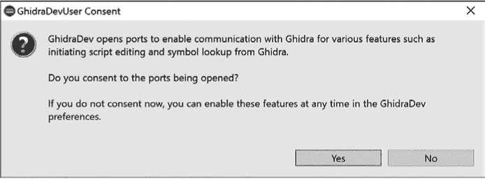

*图 15-1：GhidraDevUser 同意对话框*

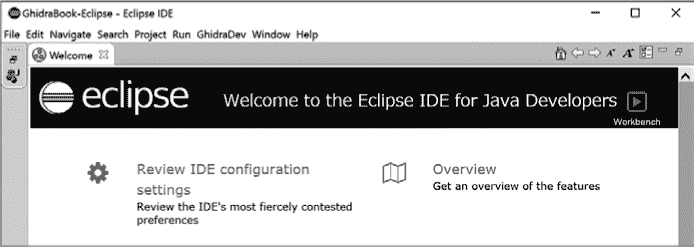

*图 15-2：Eclipse IDE 欢迎界面*

#### *使用 Eclipse 编辑脚本*

一旦 GhidraDev 插件安装在 Eclipse 中，你就可以使用 Eclipse IDE 创建新脚本或编辑现有脚本。随着我们从使用 Ghidra 的脚本管理器来创建和编辑脚本，转向使用 Eclipse，有一点值得记住，虽然可以通过脚本管理器启动 Eclipse，但这仅限于编辑现有脚本（见图 14-2）。如果你想使用 Eclipse 编辑新脚本，你需要先启动 Eclipse，然后使用 GhidraDev 菜单来创建新脚本。无论是你自己启动 Eclipse，还是通过 Ghidra 的脚本管理器进入 Eclipse，在本章剩余部分，我们都将使用 Eclipse，而不是脚本管理器的基本编辑器，来创建和修改 Ghidra 的脚本和模块。

要编辑我们在“编辑脚本示例：正则搜索”中创建的第一个脚本，请从 Eclipse 菜单中选择 **文件** ▸ **打开文件**，并导航到脚本 *FindStringByRegex.java*。这将脚本在 Eclipse IDE 中打开，您可以开始使用 Eclipse 提供的丰富编辑选项。图 15-3 展示了脚本的前几行，其中注释和导入部分已被折叠。折叠行是 Eclipse IDE 的默认功能，如果您在 Ghidra 提供的基本编辑器和 Eclipse 之间切换，这可能会引起一些困惑。

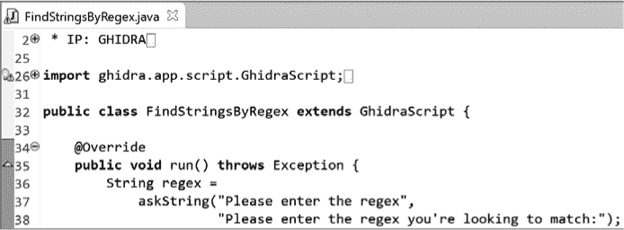

*图 15-3：Eclipse 编辑器展示的* FindStringsByRegex

默认情况下，只显示一行注释。您可以点击图标展开（点击第 2 行左侧的 + 图标）内容并显示所有注释，或者根据需要折叠（点击第 34 行左侧的 `–` 图标）内容。第 26 行的 `import` 语句也有类似的情况。将鼠标悬停在任何折叠部分的图标上，会在弹出窗口中显示隐藏的内容。

在我们开始构建扩展 Ghidra 功能的示例之前，您需要更多地了解 GhidraDev 菜单和 Eclipse IDE。让我们将焦点重新放回到 GhidraDev 菜单，探索各种选项以及它们在实际应用中的使用方式。

### GhidraDev 菜单

展开的 GhidraDev 菜单如图 15-4 所示，包含五个选项，您可以利用这些选项来控制开发环境并处理文件。本章我们将重点讨论 Java 开发，虽然在一些窗口中 Python 也可作为选项。

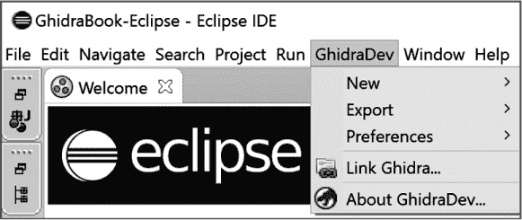

*图 15-4：GhidraDev 菜单选项*

#### *GhidraDev ▸ 新建*

GhidraDev ▸ 新建菜单提供了三个子菜单选项，如图 15-5 所示。所有三个选项都会启动向导，指导您完成相关的创建过程。我们从最简单的选项开始，即创建一个新的 Ghidra 脚本。这是创建脚本的一种替代路径，和第十四章中讨论的路径有所不同。

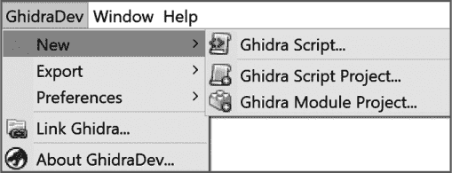

*图 15-5：GhidraDev ▸ 新建子菜单*

##### 创建脚本

使用 GhidraDev ▸ 新建 ▸ Ghidra 脚本创建新脚本时，会弹出一个对话框，允许您输入有关新脚本的信息。一个已填充内容的对话框示例如图 15-6 所示。除了目录和文件信息外，该对话框还会收集我们手动输入到脚本管理器基本编辑器中的相同元数据。

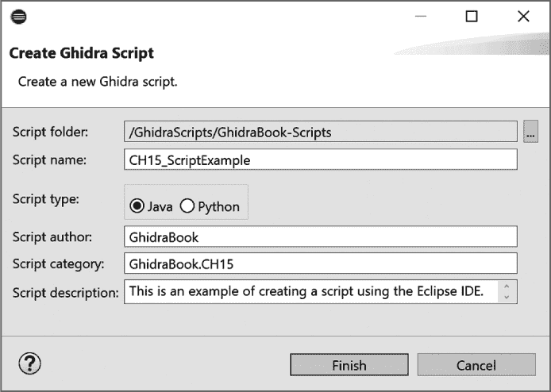

*图 15-6：创建 Ghidra 脚本对话框*

对话框底部的完成按钮生成了图 15-7 中所示的脚本模板。在图 15-6 中输入的元数据被包含在脚本顶部的注释部分。此内容与我们在第十四章中看到的元数据格式相同（见图 14-4 的顶部）。当您在 Eclipse 中编辑此脚本时，与脚本中每个`TODO`项相关的任务标签（如图 15-7 第 14 行左侧的剪贴板图标）标识出需要处理的位置。您可以随意删除和插入任务标签。

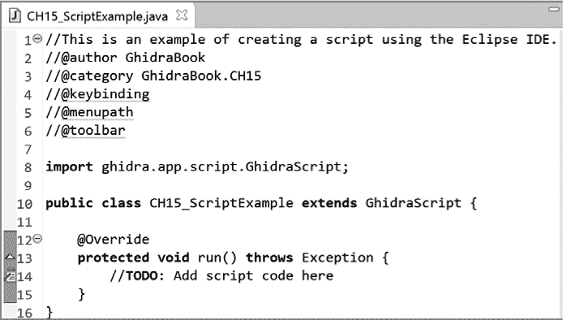

*图 15-7：GhidraDev ▸ 新建脚本脚本外壳*

Eclipse 并不会像 Ghidra 基本编辑器那样预加载您的脚本与 `import` 语句列表（参见图 14-4）。不用担心，Eclipse 通过在您使用需要相关 `import` 语句的内容时提醒您来帮助管理 `import` 语句。例如，如果我们将图 15-7 中的 `TODO` 注释替换为 Java `ArrayList` 的声明，Eclipse 会在该行添加一个错误标签并将 `ArrayList` 用红色下划线标出。将鼠标悬停在错误标签或 `ArrayList` 上时，会弹出一个窗口，建议快速修复此问题，如图 15-8 所示。

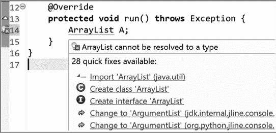

*图 15-8：Eclipse 快速修复选项*

选择建议列表中的第一个选项会指示 Eclipse 将选定的 `import` 语句添加到脚本中，如图 15-9 所示。虽然在 CodeBrowser 脚本管理器中创建新脚本时，加载潜在的 `import` 语句列表是很有帮助的，但在 Eclipse 中它并不是那么重要。

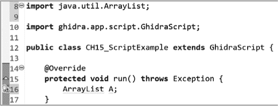

*图 15-9：应用快速修复导入后的 Eclipse*

##### 创建脚本项目

GhidraDev ▸ 新建菜单中的第二个选项创建一个新的脚本项目，如图 15-10 所示。我们将第一个脚本项目命名为*CH15_ProjectExample_linked*，并将其放在我们为 Eclipse 设置的默认目录中。创建运行配置复选框允许您创建一个*运行配置*，该配置为 Eclipse 提供启动 Ghidra 所需的信息（命令行参数、目录路径等），并使我们能够使用 Eclipse 在 Ghidra 中运行和调试脚本。保持此复选框的默认状态，即选中状态。点击**完成**以使用默认格式完成脚本的创建，该格式将脚本项目与您的主目录链接。

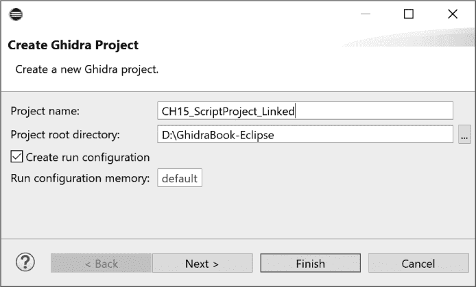

*图 15-10：Eclipse Ghidra 脚本项目对话框*

我们将创建第二个脚本项目*CH15_ProjectExample*，这次会选择“下一步”按钮。点击“下一步”会出现一个对话框，里面有两个默认勾选的链接选项（因此我们第一个项目名称带有*linked*扩展名）。第一个选项创建一个指向你的主脚本目录的链接。第二个选项让你链接到 Ghidra 安装脚本目录。在此，“链接”意味着表示你的主脚本目录和/或 Ghidra 脚本目录的文件夹将被添加到新项目中，这样你在项目开发时可以方便地访问这些目录中的任何脚本。

选择或取消选择这些选项后点击“完成”按钮的结果将在本章后面讨论 Eclipse 包资源管理器时变得更加清晰。对于第二个脚本项目，如图 15-11 所示，取消勾选第一个链接复选框。

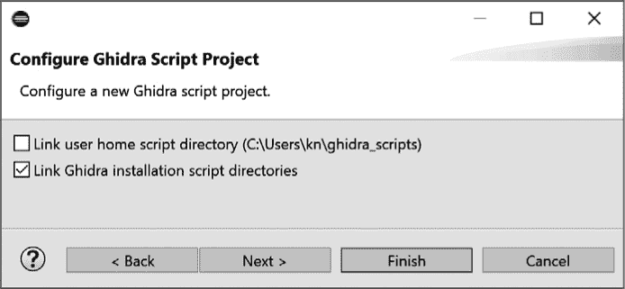

*图 15-11：Eclipse 脚本项目配置选项*

##### 创建模块项目

GhidraDev ▸ 新建菜单中的最后一个选项会创建一个 Ghidra 模块项目。^(1) 这与 Ghidra 模块（例如分析器、加载器等）不同，*Ghidra 模块项目*将为新的 Ghidra 模块聚合代码、相关的帮助文件、文档和其他资源，例如图标。此外，它还允许你控制新模块与 Ghidra 中其他模块的交互方式。我们将在本章及未来的章节中演示 Ghidra 模块的具体应用。

选择“新建 ▸ Ghidra 模块项目”会显示如图 15-12 所示的对话框，这个对话框应该很熟悉，因为它与脚本项目对话框完全相同。我们将新项目命名为*CH15_ModuleExample*，以便在包资源管理器中轻松识别。

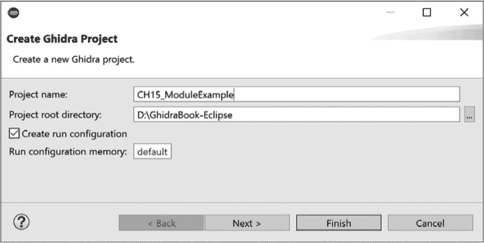

*图 15-12：Eclipse 模块项目对话框*

在此步骤点击“下一步”可以让你基于现有的 Ghidra 模板来创建模块，如图 15-13 所示。默认情况下，所有选项都已被选择。你可以根据开发目标选择包括所有、部分或没有任何模板。你选择的任何选项将会在包资源管理器中作为项目分组。如果是我们的话，我们已经取消了所有选项。

虽然大多数选择会生成带有任务标签的相关源代码模板，但有两个例外。首先，如果你没有选择任何模块模板，将不会有模板文件。其次，处理器模块不会生成模板文件，但会生成其他支持内容。（处理器模块将在第十八章中讨论。）

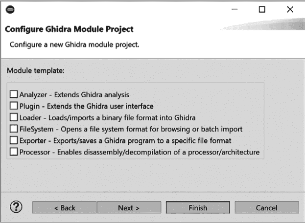

*图 15-13：Ghidra 模块项目的模板选项*

现在您已经了解了如何创建 Ghidra 脚本、脚本项目和模块项目，让我们将焦点转向 Eclipse 包资源管理器，以更好地理解如何使用我们新创建的内容。^(2)

#### *导航包资源管理器*

Eclipse 的包资源管理器是您完成 Ghidra 扩展所需的 Ghidra 文件的入口。在这里，我们展示了层级组织结构，并深入了解通过 GhidraDev 菜单创建的 Ghidra 项目和模块的示例。图 15-14 显示了一个示例的 Eclipse 包资源管理器窗口，包含了我们在本章早些时候创建的项目以及一些我们创建的其他项目，用于演示不同选项对最终包资源管理器内容的影响。

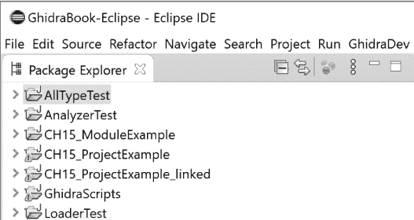

*图 15-14：包资源管理器，包含示例模块和项目*

我们首先来看这两个脚本项目。*CH15_ProjectExample_linked*是我们通过勾选两个链接选项创建的脚本项目（请参见图 15-11）。紧接着，我们看到一个类似的项目，*CH15_ProjectExample*，但在这种情况下，没有勾选任何链接选项。图 15-15 显示了*CH15_ProjectExample*的部分扩展包资源管理器条目。

以下四个组件包含在此脚本项目中：

**JUnit4** 这是一个开源的 Java 单元测试框架。更多信息，请访问*[`junit.org/junit4/index.html`](https://junit.org/junit4/index.html)*。

**JRE 系统库** 这是 Java 运行时环境系统库。

**引用的库** 这些是引用的库，它们不是 JRE 系统库的一部分，但属于我们的 Ghidra 安装的一部分。

**Ghidra** 这是您当前 Ghidra 安装的目录。我们已经扩展了此目录，以便您可以看到在第三章（见图 3-1）中介绍并在本书中使用的熟悉的文件结构。

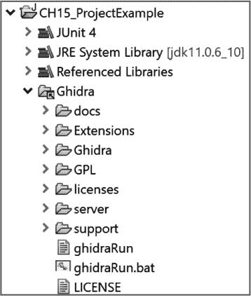

*图 15-15：包资源管理器脚本项目条目* 没有*链接*

比较图 15-15 中的内容与图 15-16 中显示的*CH15_ProjectExample_linked*的扩展内容。在这个脚本项目中，我们选择了两个链接选项。将用户主脚本目录链接后，会在项目层次结构中显示*Home scripts*条目，并为我们提供便捷访问我们之前编写的脚本，以供示例使用或修改。

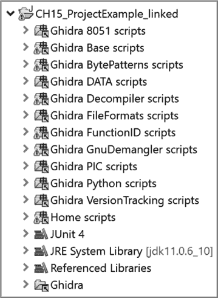

*图 15-16：包资源管理器脚本项目条目* 含*链接*

链接 Ghidra 安装脚本目录会导致图 15-16 中所有以*Ghidra*开头并以*scripts*结尾的文件夹。每一个文件夹都对应于 Ghidra 安装中的*Ghidra/Features*目录中的一个脚本目录。^(3) 展开这些文件夹中的任何一个，可以访问到你 Ghidra 安装中包含的每个脚本的源代码。像主页脚本一样，这些脚本可以作为修改或创建新脚本的基础示例。虽然你不能在 Ghidra 脚本管理器的基本编辑器中覆盖这些脚本，但你可以在 Eclipse 和 Ghidra 项目环境外的其他编辑器中编辑它们。当你完成创建或编辑新脚本时，你可以将其保存在脚本项目中的相应脚本目录中，并且下次打开 Ghidra 脚本管理器时可以使用它。

现在我们已经看过了 Eclipse 包资源管理器中的脚本，让我们看看我们构建的 Ghidra 模块项目是如何表示的。在包资源管理器中，我们项目的部分展开内容如图 15-17 所示。

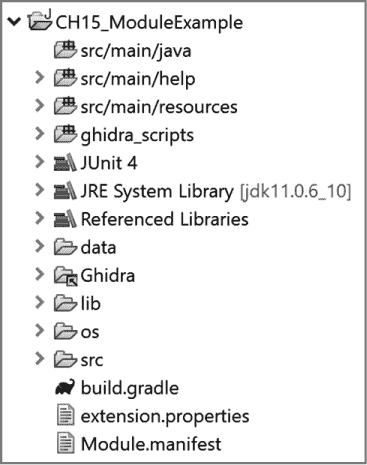

*图 15-17：* CH15_ModuleExampleModule 的包资源管理器层次结构

**我们是否再次构建那个脚本？**

在第十四章中，我们展示了一个在 Ghidra 脚本管理器环境中的玩具示例，我们修改了现有的脚本*CountAndSaveStrings*并用它构建了一个名为*FindStringsByRegex*的新脚本。以下步骤将在 Eclipse IDE 中执行相同的任务：

1.  在 Eclipse 中搜索*CountAndSaveStrings.java*（CTRL-SHIFT-R）。

1.  双击以在 Eclipse 编辑器中打开文件。

1.  用新类和注释替换现有的类和注释。

1.  将文件(*EclipseFindStringByRegex.java*)保存到推荐的*ghidra_scripts*目录中。

1.  从 Ghidra 的脚本管理器窗口中运行新脚本。

你可以手动启动 Ghidra 来访问脚本管理器窗口。或者，你可以在 Eclipse IDE 中选择“以此方式运行”选项，这将显示图 15-18 中的对话框。第一个选项会为你启动 Ghidra，第二个选项会启动一个无 GUI 版本的 Ghidra，这是第十六章的主题。

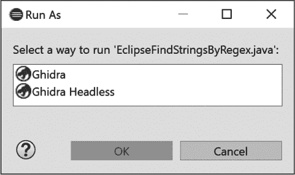

*图 15-18：Eclipse“以此方式运行”选项*

一旦 Ghidra 启动，你可以从脚本管理器运行脚本并使用 Eclipse 进行编辑。

模块项目包括以下新元素：

***src/main/java*** 这是源代码的位置。如果你创建了一个有模板的模块类型，相关的*.java*文件会放在这个目录下。

***src/main/help*** 当你创建或扩展内容时，你有机会通过使用此目录中的文件和信息将有用的信息添加到 Ghidra 帮助中。

***src/main/resources*** 与 *src/main* 目录中的许多其他条目一样，展开此内容将带您进入一个 *README.txt* 文件，提供有关目录目的和使用方法的更多信息。例如，*src/main/resources/images/README.txt* 文件告知您，它是存储与模块相关的任何图像或图标文件的位置。

***ghidra_scripts*** 这是存储特定于此模块的 Ghidra 脚本的位置。

***data*** 此文件夹包含与此模块一起使用的任何独立数据文件。（虽然不禁止与其他模块类型一起使用，但此文件夹主要用于处理器模块，并在第十八章中进行了讨论。）

***lib*** 模块所需的任何*.jar*文件应存储在此文件夹中。

***os*** 此文件夹内有子目录，用于存储 linux64、oxs64 和 win64 的任何本地二进制文件，模块可能依赖于这些文件。

***src*** 此目录用于存储单元测试用例。

***build.gradle*** Gradle 是一个开源构建系统。此文件用于构建您的 Ghidra 扩展。

***extension.properties*** 此文件存储有关扩展的元数据。

***Module.manifest*** 您可以在此文件中输入有关模块的配置信息等。

您可能已经注意到，在图 15-14 中，我们创建了额外的 *Test* 模块（*AnalyzerTest*、*AllTypeTest* 和 *LoaderTest*）。每个模块都使用不同的模块模板选项组合创建（见图 15-13），这会为每个项目实例化不同的文件集。使用这些模板作为您项目的起点时，了解 Eclipse 和 Ghidra 已为您完成了多少工作——以及还有多少工作需要您完成，是非常有用的。

让我们从我们创建的 *AnalyzerTest* 目录开始，演示分析器模板。展开 *src/main/java* 目录，找到一个名为 *AnalyzerTestAnalyzer.java* 的文件。这个名字是模块名（*AnalyzerTest*）和模板类型（*Analyzer*）的拼接。双击此文件以在编辑器中打开它，并查看图 15-19 中显示的代码。像本章前面的脚本模板一样，Eclipse IDE 提供了带有相关注释的任务标签，帮助我们构建分析器，并提供扩展和折叠内容的选项。*LoaderTest* 模块包含构建加载器的模板，后者在第十七章中进一步讨论。剩下的模块 *AllTypeTest* 是跳过模块模板选项时的默认模块。它将所有模板填充到 *src/main/java* 目录中，如图 15-20 所示。

既然我们已经了解了 Ghidra 和 Eclipse 在创建新模块时的帮助作用，现在让我们利用这些信息构建一个新的分析器。

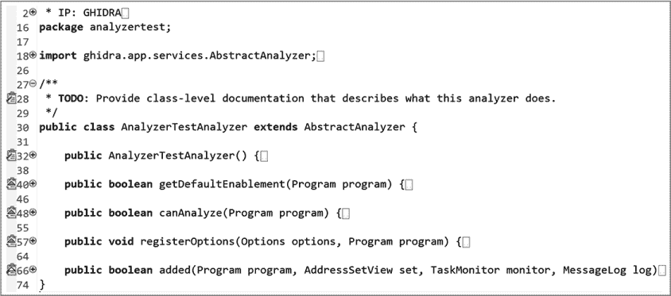

*图 15-19：模块的默认分析器模板（已折叠的注释、导入和函数）*

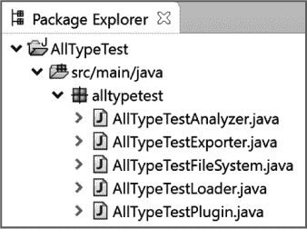

*图 15-20：示例默认模块源代码内容*

### 示例：Ghidra 分析器模块项目

在掌握了 Eclipse 集成基础知识后，让我们逐步构建一个简单的 Ghidra 分析器，以识别我们列表中的潜在 ROP gadgets。我们将采用简化的软件开发流程，因为这只是一个简单的演示项目。我们的流程包括以下步骤：

1.  定义问题。

1.  创建 Eclipse 模块。

1.  构建分析器。

1.  将分析器添加到我们的 Ghidra 安装中。

1.  测试我们 Ghidra 安装中的分析器。

**什么是 ROP gadget，为什么我们关心它？**

对于那些不熟悉利用开发的人，ROP 代表*面向返回的编程*。一种旨在阻止原始 shellcode 注入的软件安全缓解措施是确保没有可写的内存区域同时也是可执行的。这类缓解措施通常被称为*不可执行（NX）*或*数据执行保护（DEP）*，因为这样就无法将 shellcode 注入到内存中（必须是可写的），然后将控制权转移到该 shellcode 上（必须是可执行的）。

ROP 技术旨在劫持程序的栈（通常通过基于栈的缓冲区溢出），将精心构造的一系列返回地址和数据放入栈中。在溢出发生后的某个时刻，程序开始使用攻击者提供的返回地址，而不是由正常程序执行放置在栈上的返回地址。攻击者放置在栈上的返回地址指向程序内存位置，这些位置已经包含了代码，这些代码通常是由于正常的程序和库加载操作而存在的。因为被利用程序的原始作者并未设计程序来为攻击者执行任务，所以攻击者通常需要挑选和组合这些现有代码的小片段。

一个*ROP gadget*是这些代码片段中的单个部分，而序列化机制通常依赖于该 gadget 以一个返回（因此是面向返回的）指令结束，这个指令从现在由攻击者控制的栈中检索一个地址，将控制权转移到下一个 gadget。一个 gadget 通常执行一个非常简单的任务，例如从栈中加载寄存器。以下简单的 gadget 可用于初始化 x86-64 系统上的 RAX：

```
POP RAX  ; pop the next item on the attacker-controlled stack into RAX

RET      ; transfer control to the address contained in the next stack item
```

由于每个可利用的程序都不同，攻击者不能依赖于任何给定二进制文件中存在特定的 gadget 集。自动化的 gadget 查找器是用于搜索二进制文件中可能用作 gadget 的指令序列的工具，并将这些 gadget 提供给攻击者，攻击者必须决定哪些 gadget 在构造攻击时有用。最先进的 gadget 查找器可以推断 gadget 的语义，并自动地将多个 gadget 排列成执行特定操作的序列，省去了攻击者自己处理的麻烦。

#### *步骤 1：定义问题*

我们的任务是设计并开发一个指令分析器，用于识别二进制文件中的简单 ROP gadget。该分析器需要添加到 Ghidra 中，并在 Ghidra 分析器菜单中作为可选分析器提供。

#### *步骤 2：创建 Eclipse 模块*

我们使用 GhidraDev ▸ New ▸ Ghidra Module Project 创建一个名为 *SimpleROP* 的模块，采用分析器模块模板。这将在 *SimpleROP* 模块的 *src/main/java* 文件夹中创建一个名为 *SimpleROPAnalyzer.java* 的文件。结果的包资源管理器视图如 图 15-21 所示。

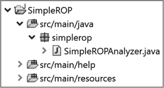

*图 15-21：包资源管理器* src/main *SimpleROP 的条目*

#### *步骤 3：构建分析器*

生成的部分 *SimpleROPAnalyzer.java* 代码如 图 15-22 所示。各个函数已经被折叠，我们可以看到提供的所有分析方法。Eclipse 在我们开发代码时，如果需要导入，会推荐相应的导入语句，这样我们可以直接跳入编写所需任务的代码，并在 Eclipse 检测到我们需要时，自动添加推荐的 `import` 语句。

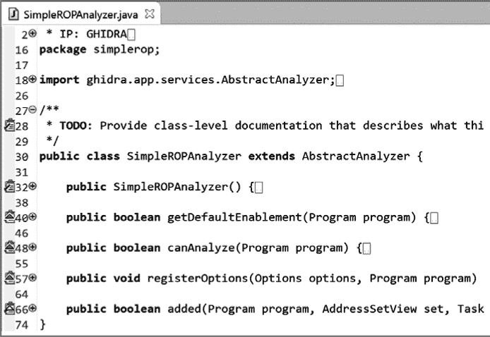

*图 15-22：* SimpleROPAnalyzer *模板*

图 15-22 中的六个任务标签（位于行号的左侧）标示了我们应该开始开发的位置。我们将在处理每个任务时扩展相关部分，并包含每个任务的前后内容。（请注意，为了可读性，一些内容将被换行或重新格式化，并且注释将尽量简化以节省空间。）

对于功能性，我们将依赖以下类级声明：

```
   private int gadgetCount = 0;         // Counts the number of gadgets

   private BufferedWriter outFile;      // Output file

// List of "interesting" instructions

   private List<String> usefulInstructions = Arrays.asList(

       "NOP", "POP", "PUSH", "MOV", "ADD", "SUB", "MUL", "DIV", "XOR");

// List of "interesting" instructions that don’t have operands

   private List<String> require0Operands = Arrays.asList("NOP");

// List of "interesting" instructions that have one operand

   private List<String> require1RegOperand = Arrays.asList("POP", "PUSH");

// List of "interesting" instructions for which we want the first

// parameter to be a register

   private List<String> requireFirstRegOperand = Arrays.asList(

        "MOV", "ADD", "SUB", "MUL", "DIV", "XOR");

// List of "start" instructions that have ZERO operands

   private List<String> startInstr0Params = Arrays.asList("RET");

// List of "start" instructions that have ONE register operand

   private List<String> startInstr1RegParam = Arrays.asList("JMP", "CALL");
```

每个声明旁边的注释描述了每个变量的用途。各种 `List` 变量包含了我们的 gadget 所需的指令，并根据它们所需的操作数数量和类型，以及该指令是否是我们 gadget 合法起始指令来分类这些指令。由于我们的 gadget 构建算法是从内存中倒着进行的，*start* 这里实际上指的是我们算法的起点。在运行时，这些起始指令实际上将是给定 gadget 中最后执行的指令。

##### 步骤 3-1：记录类文档

当我们展开第一个任务标签时，我们会看到以下任务描述：

```
/**

 * TODO: Provide class-level documentation that describes what this

 * analyzer does.

 */
```

将现有的`TODO`注释替换为描述分析器功能的注释：

```
/**

 * This analyzer searches through a binary for ROP gadgets.

 * The address and contents of each gadget are written to a

 * file called inputfilename_gadgets.txt in the user’s home directory.

 */
```

##### 步骤 3-2：命名并描述我们的分析器

展开下一个任务标签会显示一个`TODO`注释和我们需要编辑的代码行。在 Eclipse IDE 中，需要修改的代码以紫色字体显示，并且代码的名称表明了相关任务的内容。第二项任务包含以下内容：

```
// TODO: Name the analyzer and give it a description.

public SimpleROPAnalyzer() {

   super("My Analyzer",

         "Analyzer description goes here",

          AnalyzerType.BYTE_ANALYZER);

}
```

这两个字符串需要替换为有意义的内容。此外，还需要指定分析器类型。为了促进分析器之间的依赖解决，Ghidra 将分析器分为以下几类：字节、数据、函数、函数修饰符、函数签名和指令。在这种情况下，我们正在构建一个指令分析器。最终的代码如下：

```
public SimpleROPAnalyzer() {

   super("SimpleROP",

         "Search a binary for ROP gadgets",

          AnalyzerType.INSTRUCTION_ANALYZER);

}
```

##### 步骤 3-3：确定我们的分析器是否应该是默认分析器

第三项任务要求我们返回`true`，如果分析器应该默认启用的话：

```
public boolean getDefaultEnablement(Program program) {

   // TODO: Return true if analyzer should be enabled by default

   return false;

}
```

我们不希望此分析器默认启用，因此无需修改代码。

##### 步骤 3-4：确定输入是否适合此分析器

第四项任务要求我们确定我们的分析器是否与程序内容兼容：

```
public boolean canAnalyze(Program program) {

   // TODO: Examine 'program' to determine of this analyzer

   // should analyze it.

   // Return true if it can.

   return false;

}
```

由于此分析器仅用于演示目的，我们假设输入文件与我们的分析兼容，并直接返回`true`。实际上，我们会在使用分析器之前添加代码来验证分析文件的兼容性。例如，我们可能仅在确定文件是 x86 二进制文件后才返回`true`。有关此验证的工作示例，可以在您的 Ghidra 安装中找到大多数分析器（*Ghidra/Features/Base/lib/Base-src/Ghidra/app/analyzers*），可以通过 Eclipse 中的模块目录访问：

```
public boolean canAnalyze(Program program) {

   return true;

}
```

##### 步骤 3-5：注册分析器选项

第五项任务为我们提供了指定任何特殊选项的机会，这些选项将呈现给我们的分析器用户：

```
public void registerOptions(Options options, Program program) {

   // TODO: If this analyzer has custom options, register them here

   options.registerOption("Option name goes here", false, null,

                          "Option description goes here");

}
```

由于此分析器仅用于演示目的，我们将不会添加任何选项。选项可能包括用户控制的选择（例如，选择输出文件、可选地注释列表等）。每个分析器的选项会在选择单个分析器时显示在分析器窗口中：

```
public void registerOptions(Options options, Program program) {

}
```

##### 步骤 3-6：执行分析

第六项任务强调了在分析器被调用时触发的函数：

```
public boolean added(Program program, AddressSetView set, TaskMonitor

                     monitor, MessageLog log) throws CancelledException {

   // TODO: Perform analysis when things get added to the 'program'.

   // Return true if the analysis succeeded.

   return false;

}
```

这是模块中执行工作的部分。该模块使用了四个方法，每个方法接下来将详细说明：

```
  //*************************************************************************

  //  This method is called when the analyzer is invoked.

  //*************************************************************************

➊ public boolean added(Program program, AddressSetView set, TaskMonitor

                       monitor, MessageLog log) throws CancelledException {

      gadgetCount = 0;

      String outFileName = System.getProperty("user.home") + "/" +

                           program.getName() + "_gadgets.txt";

      monitor.setMessage("Searching for ROP Gadgets");

      try {

         outFile = new BufferedWriter(new FileWriter(outFileName));

      } catch (IOException e) {/* pass */}

      // iterate through each instruction in the binary

      Listing code = program.getListing();

      InstructionIterator instructions = code.getInstructions(set, true);

    ➋ while (instructions.hasNext() && !monitor.isCancelled()) {

         Instruction inst = instructions.next();

      ➌ if (isStartInstruction(inst)) {

            // We found a "start" instruction.  This will be the last

            // instruction in the potential ROP gadget so we will try to

            // build the gadget from here

            ArrayList<Instruction> gadgetInstructions =

               new ArrayList<Instruction>();

            gadgetInstructions.add(inst);

            Instruction prevInstr = inst.getPrevious();

         ➍ buildGadget(program, monitor, prevInstr, gadgetInstructions);

         }

      }

      try {

         outFile.close();

      } catch (IOException e) {/* pass */}

      return true;

   }

   //*************************************************************************

   //  This method is called recursively until it finds an instruction that

   //  we don't want in the ROP gadget.

   //*************************************************************************

   private void buildGadget(Program program, TaskMonitor monitor,

                            Instruction inst,

                            ArrayList<Instruction> gadgetInstructions) {

      if (inst == null || !isUsefulInstruction(inst)➎ ||

         monitor.isCancelled()) {

         return;

      }

      gadgetInstructions.add(inst);

   ➏ buildGadget(program, monitor, inst.getPrevious()➐, gadgetInstructions);

      gadgetCount += 1;

 ➑ for (int ii = gadgetInstructions.size() - 1; ii >= 0; ii--) {

         try {

            Instruction insn = gadgetInstructions.get(ii);

            if (ii == gadgetInstructions.size() - 1) {

               outFile.write(insn.getMinAddress() + ";");

            }

            outFile.write(insn.toString() + ";");

         } catch (IOException e) {/* pass */}

      }

      try {

         outFile.write("\n");

      } catch (IOException e) {/* pass */}

      // Report count to monitor every 100th gadget

      if (gadgetCount % 100 == 0) {

         monitor.setMessage("Found " + gadgetCount + " ROP Gadgets");

      }

      gadgetInstructions.remove(gadgetInstructions.size() - 1);

   }

   //*************************************************************************

   //  This method determines if an instruction is useful in the context of

   //  a ROP gadget

   //*************************************************************************

   private boolean isUsefulInstruction(Instruction inst) {

      if (!usefulInstructions.contains(inst.getMnemonicString())) {

         return false;

      }

      if (require0Operands.contains(inst.getMnemonicString())) {

         return true;

      }

      if (require1RegOperand.contains(inst.getMnemonicString()) &&

         inst.getNumOperands() == 1) {

         Object[] opObjects0 = inst.getOpObjects(0);

         for (int ii = 0; ii < opObjects0.length; ii++) {

            if (opObjects0[ii] instanceof Register) {

               return true;

            }

         }

      }

      if (requireFirstRegOperand.contains(inst.getMnemonicString()) &&

         inst.getNumOperands() >= 1) {

         Object[] opObjects0 = inst.getOpObjects(0);

         for (int ii = 0; ii < opObjects0.length; ii++) {

            if (opObjects0[ii] instanceof Register) {

               return true;

            }

         }

      }

      return false;

   }

   //*************************************************************************

   //  This method determines if an instruction is the "start" of a

   //  potential ROP gadget

   //*************************************************************************

 private boolean isStartInstruction(Instruction inst) {

      if (startInstr0Params.contains(inst.getMnemonicString())) {

         return true;

      }

      if (startInstr1RegParam.contains(inst.getMnemonicString()) &&

         inst.getNumOperands() >= 1) {

         Object[] opObjects0 = inst.getOpObjects(0);

         for (int ii = 0; ii < opObjects0.length; ii++) {

            if (opObjects0[ii] instanceof Register) {

               return true;

            }

         }

      }

      return false;

   }
```

Ghidra 调用分析器的 `added` 方法 ➊ 启动分析。我们的算法会测试二进制中的每一条指令 ➋，以确定该指令是否是我们构建工具的有效“起始”点 ➌。每当找到一个有效的起始指令时，我们的工具创建功能 `buildGadget` 会被调用 ➍。工具创建是一个递归过程 ➏，会沿指令列表向后 ➐ 遍历，只要指令对我们有用 ➎，就会继续。最后，每个工具会通过遍历其指令 ➑ 被打印出来，当它完成时。

#### *步骤 4：在 Eclipse 中测试分析器*

在开发过程中，频繁测试和修改代码是很常见的。当您构建分析器时，可以通过使用 Run As 选项并选择 Ghidra 在 Eclipse 中测试其功能。这会临时安装当前版本的模块并打开 Ghidra。如果在测试模块时结果与预期不符，您可以在 Eclipse 中编辑文件并重新测试。当您对结果满意时，可以进入步骤 5。使用这种方法在 Eclipse 中测试代码，能在开发过程中节省大量时间。

#### *步骤 5：将分析器添加到我们的 Ghidra 安装中*

要将此分析器添加到我们的 Ghidra 安装中，我们需要从 Eclipse 导出我们的模块，然后在 Ghidra 中安装该扩展。导出通过选择 **GhidraDev** ▸ **Export** ▸ **Ghidra Module Extension**，选择您的模块并点击 **Next** 完成。在下一个窗口中，如果您没有本地的 Gradle 安装，请选择 **Gradle Wrapper** 选项，具体如图 15-23 所示（请注意，使用该包装器需要网络连接以便从 *gradle.org* 获取信息）。点击 **Finish** 完成导出过程。如果这是您第一次导出该模块，Eclipse 中的模块会新增一个 *dist* 目录，并将导出的内容以 *.zip* 文件的形式保存在该文件夹中。

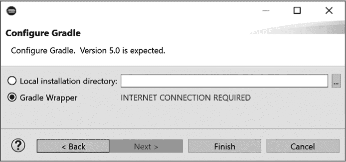

*图 15-23：配置 Gradle 对话框*

在 Ghidra 项目窗口中，选择 **File** ▸ **Install Extensions** 添加新分析器。会显示一个类似图 15-24 的窗口，列出所有未安装的现有扩展。

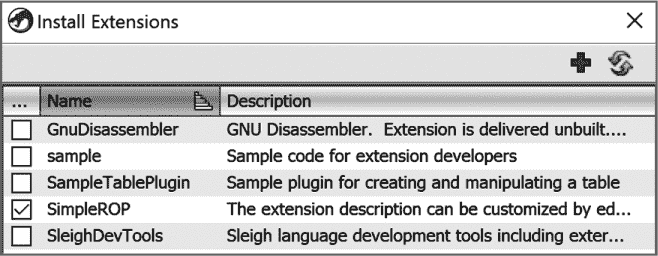

*图 15-24：安装扩展窗口*

通过选择右上角的 + 图标并导航到我们新创建的 *.zip* 文件所在的 *dist* 目录，添加新的分析器 *SimpleROP*。当我们的分析器出现在列表中时，我们可以选择它并点击 OK（未显示）。重启 Ghidra 后，即可在分析菜单中使用新功能。

#### *步骤 6：在 Ghidra 中测试分析器*

与我们的有限开发计划一样，我们使用了有限范围的测试计划，仅用于演示功能。*SimpleROP* 通过了验收测试，因为该分析器满足以下标准：

1.  （通过）*SimpleROP*会出现在 CodeBrowser ▸ Analysis 菜单中的分析选项中。

1.  （通过）当选择时，*SimpleROP*的描述会出现在分析选项描述窗口中。

    测试案例 1 和 2 通过，如图 15-25 所示。（如果我们选择在步骤 3-5 中注册和编程相关选项，它们将显示在窗口右侧的选项面板中）。

    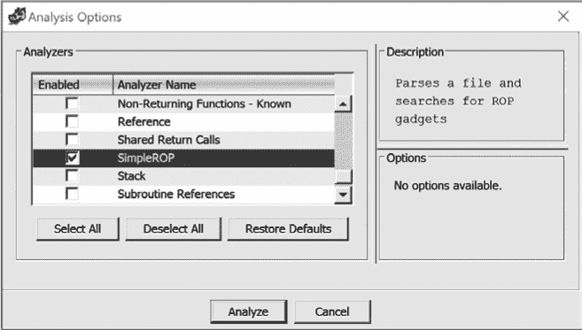

    *图 15-25：分析选项窗口*

1.  （通过）当选择时，*SimpleROP*会执行。

    在这种情况下，我们在分析过的文件上运行了*SimpleROP*，并作为自动分析的一部分进行处理。在未分析的文件上运行*SimpleROP*将不会产生任何结果，因为`INSTRUCTION_ANALYZER`扩展需要指令事先被识别（这是自动分析的默认部分）。当*SimpleROP*作为自动分析的一部分运行时，由于我们在步骤 3-2 中分配的分析器类型，它会被适当地优先处理。图 15-26 显示了*SimpleROP*分析器运行的 Ghidra 日志确认信息。

    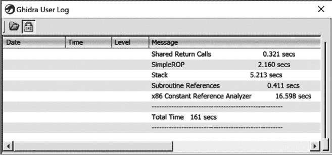

    *图 15-26：Ghidra 用户日志窗口显示分析确认信息*

1.  （通过）*SimpleROP*在分析*fileZZZ*时会将每个小工具写入名为*fileZZZ_gadgets.txt*的文件中。

    以下摘录自文件*call_tree_x64_static_gadgets.txt*，显示了许多小工具来自*call_tree_x64_static*列表的这一部分，如图 15-27 所示：

    ```
    00400412;ADD RSP,0x8;RET;

    004004ce;NOP;RET;

    00400679;ADD RSP,0x8;POP RBX;POP RBP;POP R12;POP R13;POP R14;POP R15;RET;

    0040067d;POP RBX;POP RBP;POP R12;POP R13;POP R14;POP R15;RET;

    0040067e;POP RBP;POP R12;POP R13;POP R14;POP R15;RET;

    0040067f;POP R12;POP R13;POP R14;POP R15;RET;

    00400681;POP R13;POP R14;POP R15;RET;

    00400683;POP R14;POP R15;RET;

    00400685;POP R15;RET;

    00400a8b;POP RBP;MOV EDI,0x6babd0;JMP RAX;

    00400a8c;MOV EDI,0x6babd0;JMP RAX;

    00400a98;POP RBP;RET;
    ```

    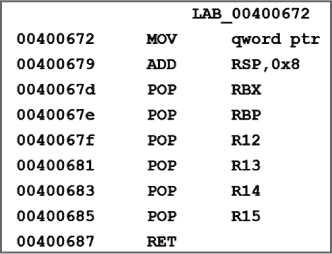

    *图 15-27：CodeBrowser 中*call_tree_x64_static*的列表示例

### 总结

在第十四章中，我们介绍了脚本作为扩展 Ghidra 功能的手段。在本章中，我们介绍了 Ghidra 扩展模块以及 Ghidra 与 Eclipse 集成的功能。虽然 Eclipse 不是编辑 Ghidra 扩展的唯一选择，但 Ghidra 与 Eclipse IDE 的集成为开发者提供了一个极为强大的环境，用于扩展 Ghidra 的功能。开发向导和模板降低了编写扩展的门槛，它们为程序员提供了一种有指导性的方式来修改现有内容并构建新的扩展。在第十六章中，我们将探讨无头 Ghidra，这是图 15-18 中出现的一个选项。后续章节将基于 Ghidra 与 Eclipse IDE 的集成，进一步扩展 Ghidra 的功能，并为将 Ghidra 打造为最佳反向工程工作流工具奠定坚实的基础。
