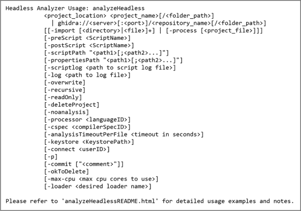
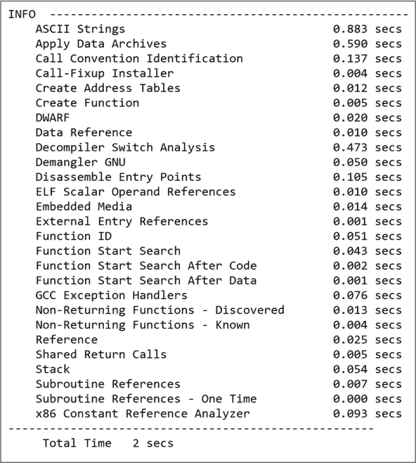
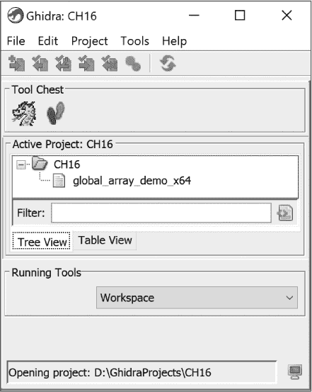
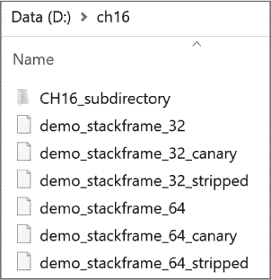
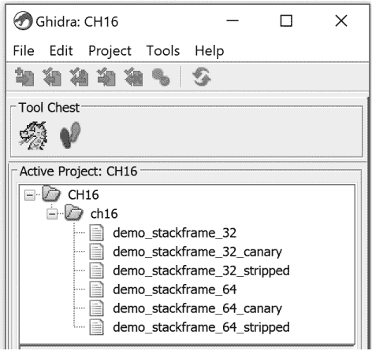
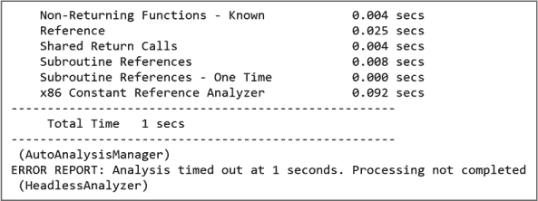
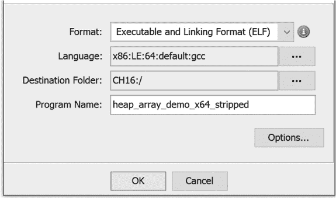
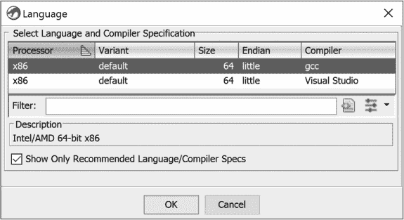
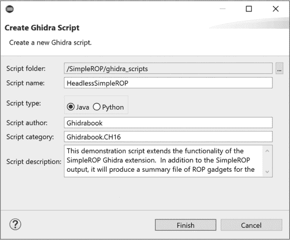
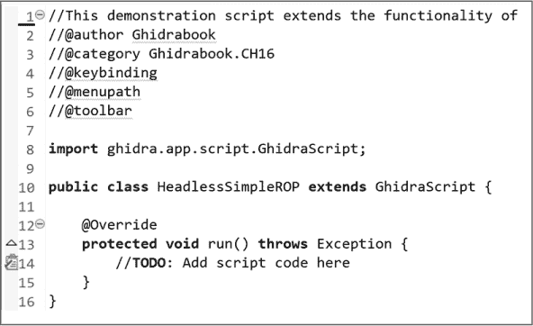

## 第十九章：**Ghidra 的无头模式**


在之前的章节中，我们专注于在单个项目中探索单个文件，这是通过 Ghidra 的 GUI 完成的。除了 GUI 之外，Ghidra 还提供了一个名为 *Ghidra 无头分析器* 的命令行界面。无头分析器提供了与 Ghidra GUI 相同的一些功能，包括处理项目和文件的能力，但它更适合批处理和脚本化控制 Ghidra。在本章中，我们将讨论 Ghidra 的无头模式以及它如何帮助你在更多文件中执行重复任务。我们从一个熟悉的示例开始，然后扩展讨论更复杂的选项。

### 入门

让我们先回顾一下我们在第四章中首次使用 Ghidra 的经历。我们成功地完成了以下步骤：

1.  启动 Ghidra。

1.  创建一个新的 Ghidra 项目。

1.  确定项目的位置。

1.  将文件导入项目。

1.  自动分析文件。

1.  保存并退出。

现在，让我们使用 Ghidra 无头分析器的命令行界面来复现这些任务。无头分析器（*analyzeHeadless* 或 *analyzeHeadless.bat*）以及一个名为 *analyzeHeadlessREADME.html* 的有用文件可以在你的 Ghidra 安装目录的 *support* 文件夹中找到。为了简化文件路径，我们临时将文件 *global_array_demo_x64* 放在了同一个目录下。首先，我们将识别每个单独任务所需的命令和参数，然后将它们组合在一起实现我们的目标。虽然在之前的章节中没有太大区别，但当我们从命令行操作时，三种 Ghidra 平台之间存在更多的差异。在我们的示例中，我们使用 Windows 安装，并且会标出其他平台上的显著差异。

**使用斜杠还是反斜杠？**

支持 Ghidra 的操作系统平台之间的一个主要区别是它们识别文件系统路径的方式。虽然语法一致，不同平台使用不同的目录分隔符。Windows 使用反斜杠，而 Linux 和 macOS 使用斜杠。在 Windows 中，路径如下所示：

```
D:\GhidraProjects\ch16\demo_stackframe_32
```

在 Linux 和 macOS 中，路径看起来是这样的：

```
/GhidraProjects/ch16/demo_stackframe_32
```

对于 Windows 用户来说，这种语法可能更加困惑，因为斜杠在 URL 和命令行开关（以及 Ghidra 文档）中都有使用。操作系统认识到这个问题，并尝试接受两者，但并不总是以可预测的方式进行。为了本章中的示例，我们使用 Windows 的约定，以便读者能够保持与 DOS 的向后兼容性。

#### *第 1 步：启动 Ghidra*

这一步通过 `analyzeHeadless` 命令完成。所有其他步骤将通过该命令相关的参数和选项完成。运行 `analyzeHeadless` 命令而不带任何参数时，会显示命令的用法信息及其选项，如 图 16-1 所示。为了启动 Ghidra，我们需要将这些参数添加到命令中。



*图 16-1：无头分析器语法*

#### *步骤 2 和 3：在指定位置创建一个新的 Ghidra 项目*

在无头模式下，如果项目尚不存在，Ghidra 会为你创建一个项目。如果项目已存在于指定位置，Ghidra 会打开现有的项目。因此，需要两个参数：项目位置和项目名称。以下命令会在我们的 *D:\GhidraProjects* 目录下创建一个名为 *CH16* 的项目：

```
analyzeHeadless D:\GhidraProjects CH16
```

这是一个最简化的无头 Ghidra 启动命令，只打开一个项目，并不会做更多操作。事实上，来自 Ghidra 的响应消息明确告诉你这一点：

```
Nothing to do...must specify -import, -process, or prescript and/or postscript.
```

#### *步骤 4：将文件导入项目*

要导入文件，Ghidra 需要 `-import` 选项和要导入的文件名。我们将导入之前使用过的 *global_array_demo_x64* 文件。如前所述，为了简化这个初始示例，我们将文件放置在 *support* 目录中。或者，我们可以在命令行中指定文件的完整路径。我们将 `-import` 选项添加到我们的命令中：

```
analyzeHeadless D:\GhidraProjects CH16 -import global_array_demo_x64
```

#### *步骤 5 和 6：自动分析文件、保存并退出*

在无头模式下，默认会自动分析并保存，因此步骤 4 中的命令可以完成我们需要的所有操作。如果不想分析文件，需要提供一个选项（`-noanalysis`），并且有选项可控制项目及其关联文件的保存方式。

这是我们完成六个目标的完整命令：

```
analyzeHeadless D:\GhidraProjects CH16 -import global_array_demo_x64
```

就像许多控制台命令一样，你可能会问自己：“我怎么知道是否有任何操作发生？”你成功（或失败）的第一个迹象是控制台上显示的消息。以 `INFO` 为前缀的信息性消息会在无头分析器开始工作时提供进度报告。错误消息以 `ERROR` 为前缀。清单 16-1 包含了一些消息的子集，包括一个错误消息。

```
➊ INFO  HEADLESS Script Paths:

      C:\Users\Ghidrabook\ghidra_scripts

   ➋ D:\ghidra_PUBLIC\Ghidra\Extensions\SimpleROP\ghidra_scripts

      D:\ghidra_PUBLIC\Ghidra\Features\Base\ghidra_scripts

      D:\ghidra_PUBLIC\Ghidra\Features\BytePatterns\ghidra_scripts

      D:\ghidra_PUBLIC\Ghidra\Features\Decompiler\ghidra_scripts

      D:\ghidra_PUBLIC\Ghidra\Features\FileFormats\ghidra_scripts

      D:\ghidra_PUBLIC\Ghidra\Features\FunctionID\ghidra_scripts

      D:\ghidra_PUBLIC\Ghidra\Features\GnuDemangler\ghidra_scripts

      D:\ghidra_PUBLIC\Ghidra\Features\Python\ghidra_scripts

      D:\ghidra_PUBLIC\Ghidra\Features\VersionTracking\ghidra_scripts

      D:\ghidra_PUBLIC\Ghidra\Processors\8051\ghidra_scripts

      D:\ghidra_PUBLIC\Ghidra\Processors\DATA\ghidra_scripts

      D:\ghidra_PUBLIC\Ghidra\Processors\PIC\ghidra_scripts(HeadlessAnalyzer)

   INFO  HEADLESS: execution starts (HeadlessAnalyzer)

   INFO  Opening existing project: D:\GhidraProjects\CH16 (HeadlessAnalyzer)

➌ ERROR Abort due to Headless analyzer error:

      ghidra.framework.store.LockException:

      Unable to lock project! D:\GhidraProjects\CH16 (HeadlessAnalyzer)

      java.io.IOException: ghidra.framework.store.LockException:

      Unable to lock project! D:\GhidraProjects\CH16

      ...
```

*清单 16-1：带错误条件的无头分析器*

无头模式中使用的脚本路径列在➊。在本章后续部分，我们将展示如何在无头命令中使用额外的脚本。我们在上一章中创建的扩展 SimpleROP 包含在脚本路径中➋，因为每个扩展都会将一个新的路径添加到脚本路径中。`LockException` ➌可能是无头分析器中最常见的错误。如果你试图在另一个 Ghidra 实例中已经打开的项目上运行它，分析器会失败。此时，无头分析器无法为其自身独占使用锁定该项目，因此命令执行失败。

为了修复该错误，关闭任何正在运行并打开*CH16*项目的 Ghidra 实例，再次运行命令。图 16-2 显示了成功执行命令后的输出末尾，这与我们在 Ghidra GUI 中分析文件时看到的弹出窗口类似。



*图 16-2：无头分析器结果显示在控制台*

为了在 Ghidra GUI 中验证结果，打开项目并确认文件已加载，如图 16-3 所示，然后在 CodeBrowser 中打开该文件以确认分析。



*图 16-3：Ghidra GUI 确认项目已创建且文件已加载*

现在我们已经使用 Ghidra 的无头模式重复了之前的分析，让我们探讨一些无头模式相对于图形用户界面（GUI）的优势。在 Ghidra 的 GUI 中创建项目并加载和分析图 16-4 中显示的所有文件，我们可以创建项目然后逐个加载文件，或者选择文件进行批量导入操作，正如在第 226 页的“批量导入”中所讨论的。无头 Ghidra 允许我们指定一个目录并分析该目录中的所有文件。



*图 16-4：无头 Ghidra 示例的输入目录*

以下命令告诉无头分析器在*D:\GhidraProjects*目录中打开或创建一个名为*CH16*的项目，并导入分析*D:\ch16*目录中的所有文件：

```
analyzeHeadless D:\GhidraProjects CH16 -import D:\ch16
```

命令执行后，我们可以将新项目加载到 Ghidra GUI 中，并查看其相关文件，如图 16-5 所示。子目录*D:\ch16\CH16_subdirectory*不会出现在项目中，该子目录中的任何文件也不会出现。我们将在接下来的章节中讨论更多无头 Ghidra 可以使用的选项和参数时再回到这个问题。



*图 16-5：将无头 Ghidra 指向目录后生成的项目*

#### *选项和参数*

使用无头模式的 Ghidra 创建项目、加载并分析单个文件，并使用批处理导入整个目录的简单示例，仅仅展示了其可能性的冰山一角。虽然我们无法讨论无头 Ghidra 的所有功能，但我们会简要介绍当前可用的每个选项。

##### 常规选项

以下是我们可以使用的额外选项的简要描述，并附有相关示例，帮助我们进一步控制在简单示例中发生的情况。（换行的行会缩进。）当遇到时，将讨论常见的错误情况。专业错误情况留给读者在 Ghidra 帮助文件中自行探讨。

-log logfilepath

执行命令行时，许多事情可能会出错（或成功）。幸运的是，Ghidra 插件在 Ghidra 运行时提供持续的反馈，告知发生了什么。虽然在 Ghidra GUI 中这种反馈不那么重要（因为你可以通过视觉线索看到发生了什么），但在无头 Ghidra 中，这种反馈非常重要。

默认情况下，日志文件会写入用户主目录中的 *.ghidra/.ghidra_<VER>_PUBLIC*/*application.log*。你可以通过在命令行中添加 `-log` 选项来选择新位置。要创建一个目录 *CH16-logs* 并将日志文件写入 *CH16-logfile*，请使用以下命令：

```
analyzeHeadless D:\GhidraProjects CH16 -import global_array_demo_x64

  -log D:\GhidraProjects\CH16-logs\CH16-Logfile
```

-noanalysis

该选项指示 Ghidra 不分析从命令行导入的任何文件。在执行以下语句后，在 Ghidra GUI 中打开文件 *global_array_demo_x64* 会展示一个已加载但未分析的文件版本，位于 *CH16* 项目中：

```
analyzeHeadless D:\GhidraProjects CH16 -import global_array_demo_x64

  -noanalysis
```

-overwrite

在 示例 16-1 中，我们看到了一个错误条件，当 Ghidra 尝试打开一个已经打开的项目时会发生。第二个常见错误发生在 Ghidra 尝试将文件导入项目时，而该文件已经被导入。要导入文件的新版本，或无论文件内容如何都覆盖现有文件，请使用 `-overwrite` 选项。如果没有此选项，运行以下无头命令两次会在第二次执行时导致错误。有了此选项，我们可以随意重新运行命令：

```
analyzeHeadless D:\GhidraProjects CH16 -import global_array_demo_x64

  -overwrite
```

-readOnly

要导入文件但不将文件保存到项目中，请使用 `-readOnly` 选项。如果使用此选项，`-overwrite` 选项将被忽略（如果存在）。当与 `-process` 选项一起使用时，而不是与 `-import` 命令一起使用时，此选项也具有意义。`-process` 选项将在本章后面介绍。

```
analyzeHeadless D:\GhidraProjects CH16 -import global_array_demo_x64

  -readOnly
```

-deleteProject

该选项指示 Ghidra 不保存使用 `–import` 选项创建的任何项目。此选项可以与其他选项一起使用，但在使用 `-readOnly` 时默认假定（即使省略）。新创建的项目会在分析完成后删除。此选项不会删除现有项目：

```
analyzeHeadless D:\GhidraProjects CH16 -import global_array_demo_x64

  -deleteProject
```

-recursive

默认情况下，Ghidra 在处理整个目录时不会递归进入子目录。当你希望 Ghidra 执行递归目录处理时（即处理它沿途找到的任何子目录），可以使用此选项。为了演示这个功能，我们将指向之前处理过的同一个*ch16*目录，但这次将使用`-recursive`选项：

```
analyzeHeadless D:\GhidraProjects CH16 -import D:\ch16 -recursive
```

在运行此命令后打开项目*CH16*，将会生成如图 16-6 所示的项目结构。与图 16-5 相比，项目中包含了*CH16_subdirectory*及其相关文件，并且目录层次结构在项目层次结构中得以保留。


*图 16-6：通过* -recursive *选项生成的无头 Ghidra 项目*

**通配符！**

通配符提供了一种简单的方法来为无头 Ghidra 选择多个文件，而无需单独列出每个文件。简而言之，星号（`*`）匹配任意字符序列，问号（`?`）匹配单个字符。为了仅加载和分析图 16-7 中的 32 位文件，可以使用以下通配符：

```
analyzeHeadless D:\GhidraProjects CH16 -import D:\ch16\demo_stackframe_32*
```

这会创建 CH16 项目并加载分析*ch16*目录下的所有 32 位文件。生成的项目如图 16-7 所示。有关使用通配符指定文件进行导入和处理的详细信息，请参见*analyzeHeadlessREADME.html*。你还将会在未来的无头 Ghidra 脚本示例中看到通配符的使用。


*图 16-7：由通配符* demo_stackframe_32* 生成的项目文件*

-analysisTimeoutPerFile 秒

在你分析（或观察 Ghidra 分析）文件时，可能会注意到几个影响分析时间的因素，如文件大小、是否静态链接以及反编译选项。无论文件内容和选项如何，你无法提前知道分析文件究竟需要多长时间。

在无头 Ghidra 中，尤其是在处理大量文件时，可以使用`-analysisTimeoutPerFile`选项来确保任务在合理的时间内结束。使用此选项时，你需要指定超时时间（以秒为单位），如果超时，分析将被中断。例如，我们现有的无头 Ghidra 命令在我们的系统上分析文件大约需要一秒多（参见图 16-2）。如果我们*真的*有限时间来执行此脚本，以下无头命令将在一秒钟后停止分析：

```
analyzeHeadless D:\GhidraProjects CH16 -import global_array_demo_x64

  -analysisTimeoutPerFile 1
```

这将导致控制台显示图 16-8 中的信息。



*图 16-8：控制台警告：分析超时*

-processor languageID 和 -cspec compilerSpecID

如前面的示例所示，Ghidra 通常在识别文件信息并给出导入建议方面做得相当好。对于某个特定文件的建议，示例窗口如图 16-9 所示。每次使用 GUI 将文件导入项目时，都会显示此窗口。



*图 16-9：Ghidra GUI 导入确认对话框*

如果你认为自己对合适的语言或编译器有更多见解，可以展开语言规格右侧的框。这将呈现出图 16-10 所示的窗口，提供选择语言和编译器规格的机会。



*图 16-10：Ghidra 语言/编译器规格选择窗口*

要在无头 Ghidra 中执行相同操作，请使用 `-cspec` 和/或 `processor` 选项，如下所示。不能仅使用 `-cspec` 选项而不使用 `-processor` 选项。你可以在不使用 `-cspec` 选项的情况下使用 `-processor` 选项，这时 Ghidra 会选择与处理器相关的默认编译器。

```
analyzeHeadless D:\GhidraProjects CH16 -import global_array_demo_x64

  -processor "x86:LE:64:default" -cspec "gcc"
```

-loader loadername

`-loader` 选项可能是无头 Ghidra 选项中最复杂的一个。loadername 参数指定 Ghidra 的加载模块之一（在第十七章中讨论），该模块将用于将新文件导入指定的项目。示例加载模块名称包括 `PeLoader`、`ElfLoader` 和 `MachoLoader`。每个加载模块可能还会识别一些额外的命令行参数。这些额外的参数在*support/analyzeHeadlessREADME.html*中有详细讨论。

-max-cpu number

此选项允许你限制用于处理无头 Ghidra 命令的处理器（CPU）核心数。该选项需要一个整数值作为参数。如果该值小于 1，则最大核心数设置为 1。

```
analyzeHeadless D:\GhidraProjects CH16 -import global_array_demo_x64

  -max-cpu 5
```

##### 服务器选项

一些命令仅在与 Ghidra 服务器交互时使用。由于这不是本书的重点，我们将简要提及这些命令。更多信息请参考*analyzeheadlessREADME.html*。

ghidra://server[:port]/repository_name[/folder_path]

前面的示例都指定了项目位置或项目名称。这个替代方法允许你指定一个 Ghidra 服务器仓库和可选的文件夹路径。

-p

在使用 Ghidra 服务器时，此选项通过控制台强制要求输入密码。

-connect [userID]

此选项提供一个 userID，用于在连接 Ghidra 服务器时覆盖默认的 userID。

-keystore path

此选项允许你在使用 PKI 或 SSH 认证时指定一个私有的密钥库文件。

-commit ["comment"]

虽然 `commit` 默认为启用，但此选项允许你为提交关联评论。

##### 脚本选项

也许无头模式下 Ghidra 最强大的应用之一与 Ghidra 的脚本功能相关。第十四章和第十五章均演示了如何在 Ghidra GUI 中创建和使用脚本。介绍完脚本选项后，我们将展示无头模式下 Ghidra 在脚本环境中的强大功能。

-process [project_file]

该选项处理选定的文件（与导入文件不同）。如果没有指定文件，项目文件夹中的所有文件都将被处理。除非使用`-noanalysis`选项，否则所有指定的文件也将被分析。Ghidra 接受两个通配符字符（`*` 和 `?`）用于`–process`选项，以简化多个文件的选择。对于此选项，与`–import`选项不同，你指定的是 Ghidra 导入的项目文件，而*不是*本地文件系统中的文件，因此需要引用任何包含通配符的文件名，以防止你的 shell 提前展开它们。

-scriptPath "path1[;path2...]"

默认情况下，无头模式下的 Ghidra 包含许多默认脚本路径以及导入扩展的脚本路径，如清单 16-1 所示。要扩展 Ghidra 搜索可用脚本的路径列表，可以使用`–scriptPath`选项，该选项需要一个带引号的路径列表参数。在引号内，多个路径必须使用分号分隔。路径组件中会识别两种特殊的前缀标识符：

`$GHIDRA_HOME`和`$USER_HOME`。`$GHIDRA_HOME`指的是 Ghidra 安装目录，`$USER_HOME`指的是用户的主目录。请注意，这些不是环境变量，且你的命令行 shell 可能需要你转义前导的`$`字符，以便将其传递给 Ghidra。以下示例将 *D:\GhidraScripts* 目录添加到脚本路径中：

```
analyzeHeadless D:\GhidraProjects CH16 -import global_array_demo_x64

  -scriptPath "D:\GhidraScripts"
```

在你运行命令后，新的脚本目录，*D:\GhidraScripts*，会被包括在脚本路径中：

```
INFO  HEADLESS Script Paths:

  D:\GhidraScripts

  C:\Users\Ghidrabook\ghidra_scripts

  D:\ghidra_PUBLIC\Ghidra\Extensions\SimpleROP\ghidra_scripts

  D:\ghidra_PUBLIC\Ghidra\Features\Base\ghidra_scripts

  D:\ghidra_PUBLIC\Ghidra\Features\BytePatterns\ghidra_scripts

  D:\ghidra_PUBLIC\Ghidra\Features\Decompiler\ghidra_scripts

  D:\ghidra_PUBLIC\Ghidra\Features\FileFormats\ghidra_scripts

  D:\ghidra_PUBLIC\Ghidra\Features\FunctionID\ghidra_scripts

  D:\ghidra_PUBLIC\Ghidra\Features\GnuDemangler\ghidra_scripts

  D:\ghidra_PUBLIC\Ghidra\Features\Python\ghidra_scripts

  D:\ghidra_PUBLIC\Ghidra\Features\VersionTracking\ghidra_scripts

  D:\ghidra_PUBLIC\Ghidra\Processors\8051\ghidra_scripts

  D:\ghidra_PUBLIC\Ghidra\Processors\DATA\ghidra_scripts

  D:\ghidra_PUBLIC\Ghidra\Processors\PIC\ghidra_scripts (HeadlessAnalyzer)

INFO  HEADLESS: execution starts (HeadlessAnalyzer)
```

-preScript

该选项指定在分析之前运行的脚本名称。脚本可能包含一个可选的参数列表。

-postScript

该选项指定在分析后运行的脚本名称。脚本可能包含一个可选的参数列表。

-propertiesPath

该选项指定与脚本相关的属性文件的路径。属性文件为以无头模式运行的脚本提供输入。脚本及其关联的属性文件示例包含在无头分析器文档中。

-okToDelete

由于脚本可以执行其创建者意图的任何操作，因此脚本有可能删除（或尝试删除）Ghidra 项目中的文件。为了防止这种不必要的副作用，无头模式下的 Ghidra 不允许脚本删除文件，除非在调用脚本时包含了`-okToDelete`选项。注意：在`-import`模式下运行时，此参数不是必需的。

### 编写脚本

现在你已经理解了无头 Ghidra 命令的基本组件，让我们编写一些脚本，在命令行中运行。

#### *HeadlessSimpleROP*

回想一下我们在第十五章中编写的 SimpleROP 分析器。我们使用 Eclipse IDE 编写了这个模块，然后将扩展导入 Ghidra，这样我们就可以在导入的任何文件上运行它。现在，我们希望将 SimpleROP 指向一个目录，并让它识别该目录中每个文件（或选定文件）中的 ROP 小工具。除了每个现有二进制文件中带有 ROP 小工具的 SimpleROP 输出文件外，我们还希望有一个摘要文件，列出每个文件及其识别到的 ROP 小工具数量。

对于这样的任务，通过 Ghidra GUI 运行 SimpleROP 会引入一些时间上的开销，例如打开和关闭 CodeBrowser 来显示列表窗口中的每个文件等。为了实现我们的新目标，我们并不需要在 CodeBrowser 窗口中看到任何文件。为什么我们不能编写一个脚本，完全独立于 GUI 来找到小工具呢？这正是适合无头 Ghidra 的用例。

虽然我们可以修改 SimpleROP 的功能以实现我们的目标，但我们不想丧失其他用户可能会觉得有用的现有 Ghidra 扩展的功能。（我们意识到我们刚刚在上一章中介绍了它……但它可能已经流行开了。）相反，我们将使用 SimpleROP 中的一些代码作为基础，创建我们新的脚本 *HeadlessSimpleROP*，它会查找 *<filename>* 中的所有 ROP 小工具，并将其创建并写入到 *<filename>_gadgets.txt* 中，然后将 *<path>/<filename>* 和 ROP 小工具的计数追加到一个名为 *gadget_summary.txt* 的 *HeadlessSimpleROP* 摘要文件中。所有其他所需的功能（解析目录、文件等）将由无头 Ghidra 提供，使用我们在本章前面讨论的选项。

为了简化开发，我们使用第十五章中介绍的 Eclipse ▸ GhidraDev 方法创建一个新脚本，然后将*SimpleROPAnalyzer.java* 源代码复制到新脚本模板中，并根据需要编辑代码。最后，我们将使用`-postScript`选项运行脚本，以便在分析阶段后调用它，针对每个打开的文件。

##### 创建 HeadlessSimpleROP 脚本模板

首先创建一个模板。在 GhidraDev 菜单中选择**新建** ▸ **GhidraScript**，并填写对话框中显示的信息，如图 16-11 所示。虽然我们可以将脚本放在任何文件夹中，但我们将把它放在 Eclipse 中现有的 SimpleROP 模块中的*ghidra_scripts* 文件夹内。



*图 16-11：创建 Ghidra 脚本对话框*

点击**完成**，查看新的脚本模板，连同元数据，如图 16-12 所示。第 14 行的任务标签显示了你可以开始的地方。



*图 16-12：新的* HeadlessSimpleROP *脚本模板*

要将 SimpleROP 分析器转换为*HeadlessSimpleROP*脚本，我们需要执行以下操作：

1.  删除不需要的`import`语句。

1.  删除分析器公共方法。

1.  复制当使用`run`方法调用*HeadlessSimpleROP*脚本时，调用 SimpleROPAnalyzer 时`added`方法的功能。

1.  添加将文件名和找到的小工具数量附加到汇总文件*gadget_summary.txt*中的功能。

我们将把脚本*HeadlessSimpleROP*放在*D:\GhidraScripts*目录中，并使用无头分析器演示其功能。在接下来的部分中，我们将运行一系列测试，调用*HeadlessSimpleROP*脚本，使用图 16-6 中显示的目录结构中的项目。这些测试还演示了与无头 Ghidra 相关的一些选项。

##### 测试场景 1：加载、分析和处理单个文件

在以下清单中，我们使用无头 Ghidra 导入、分析并调用脚本来为单个文件生成小工具报告（^字符是 Windows 命令行中的行续符）：

```
analyzeHeadless D:\GhidraProjects CH16_ROP ^

     -import D:\ch16\demo_stackframe_32 ^

     -scriptPath D:\GhidraScripts ^

     -postScript HeadlessSimpleROP.java
```

执行时，Ghidra 无头分析器会在*GhidraProjects*目录下创建一个名为*CH16_ROP*的项目，然后导入文件*demo_stackframe_32*，该文件也将被加载并分析。我们使用`scriptPath`指示脚本所在的目录。最后，在分析完成后，我们的脚本将在导入并分析后的文件上运行。

命令完成后，我们检查*tool_summary.txt*和*demo_stackframe_32_gadgets.txt*文件的内容，以确定我们的脚本是否正确工作。*demo_stackframe_32_gadgets.txt*包含 16 个潜在的 ROP 小工具：

```
080482c6;ADD ESP,0x8;POP EBX;RET;

080482c9;POP EBX;RET;

08048343;MOV EBX,dword ptr [ESP];RET;

08048360;MOV EBX,dword ptr [ESP];RET;

08048518;SUB ESP,0x4;PUSH EBP;PUSH dword ptr [ESP + 0x2c];PUSH dword ptr [ESP + 0x2c];

         CALL dword ptr [EBX + EDI*0x4 + 0xffffff0c];

0804851b;PUSH EBP;PUSH dword ptr [ESP + 0x2c];PUSH dword ptr [ESP + 0x2c];

         CALL dword ptr [EBX + EDI*0x4 + 0xffffff0c];

0804851c;PUSH dword ptr [ESP + 0x2c];PUSH dword ptr [ESP + 0x2c];

         CALL dword ptr [EBX + EDI*0x4 + 0xffffff0c];

08048520;PUSH dword ptr [ESP + 0x2c];CALL dword ptr [EBX + EDI*0x4 + 0xffffff0c];

08048535;ADD ESP,0xc;POP EBX;POP ESI;POP EDI;POP EBP;RET;

08048538;POP EBX;POP ESI;POP EDI;POP EBP;RET;

08048539;POP ESI;POP EDI;POP EBP;RET;

0804853a;POP EDI;POP EBP;RET;

0804853b;POP EBP;RET;

 0804854d;ADD EBX,0x1ab3;ADD ESP,0x8;POP EBX;RET;

08048553;ADD ESP,0x8;POP EBX;RET;

08048556;POP EBX;RET;
```

以下是*tool_summary.txt*中相关条目的内容：

```
demo_stackframe_32: Found 16 potential gadgets
```

##### 测试场景 2：加载、分析和处理目录中的所有文件

在此测试中，我们导入一个完整的目录，而不是使用`import`语句导入单个文件：

```
analyzeHeadless D:\GhidraProjects CH16_ROP ^

      -import D:\ch16 ^

      -scriptPath D:\GhidraScripts ^

      -postScript HeadlessSimpleROP.java
```

当无头分析器完成时，*gadget_summary.txt*中会找到以下内容：

```
demo_stackframe_32: Found 16 potential gadgets

demo_stackframe_32_canary: Found 16 potential gadgets

demo_stackframe_32_stripped: Found 16 potential gadgets

 demo_stackframe_64: Found 24 potential gadgets

demo_stackframe_64_canary: Found 24 potential gadgets

demo_stackframe_64_stripped: Found 24 potential gadgets
```

这些是根目录中显示的六个文件，如图 16-6 所示。除了小工具汇总文件外，我们还生成了列出与每个文件相关的潜在 ROP 小工具的单独小工具文件。在剩余的示例中，我们只关注小工具汇总文件。

##### 测试场景 3：递归加载、分析和处理目录中的所有文件

在此测试中，我们添加了`-recursive`选项。这会扩展导入操作，递归访问*ch16*目录中所有子目录中的所有文件：

```
analyzeHeadless D:\GhidraProjects CH16_ROP ^

      -import D:\ch16  ^

      -scriptPath D:\GhidraScripts ^

      -postScript HeadlessSimpleROP.java ^

      -recursive
```

当无头分析器完成时，*gadget_summary.txt*中会找到以下内容，子目录文件出现在列表的顶部：

```
demo_stackframe_32_sub: Found 16 potential gadgets

demo_stackframe_32: Found 16 potential gadgets

demo_stackframe_32_canary: Found 16 potential gadgets

demo_stackframe_32_stripped: Found 16 potential gadgets

demo_stackframe_64: Found 24 potential gadgets

demo_stackframe_64_canary: Found 24 potential gadgets

demo_stackframe_64_stripped: Found 24 potential gadgets
```

##### 测试场景 4：加载、分析和处理目录中的所有 32 位文件

在这个测试中，我们使用 * 作为外壳通配符，将导入内容限制为带有 32 位设计符的文件：

```
analyzeHeadless D:\GhidraProjects CH16ROP ^

      -import D:\ch16\demo_stackframe_32* ^

      -recursive ^

      -postScript HeadlessSimpleROP.java ^

      -scriptPath D:\GhidraScripts
```

生成的 *gadget_summary* 文件包含以下内容：

```
demo_stackframe_32: Found 16 potential gadgets

demo_stackframe_32_canary: Found 16 potential gadgets

demo_stackframe_32_stripped: Found 16 potential gadgets
```

如果你事先知道只关心生成的 gadget 文件，可以使用 `-readOnly` 选项。此选项指示 Ghidra 不将导入的文件保存到命令中指定的项目中，适用于避免批量处理多个文件时造成项目杂乱。

#### *自动化 FidDb 创建*

在 第十三章 中，我们开始创建一个函数 ID 数据库（FidDb），并用从 *libc* 静态版本中提取的函数指纹进行填充。通过 GUI 和 Ghidra 的批量导入模式，我们从 *libc.a* 压缩包中导入了 1,690 个目标文件。然而，在分析这些文件时，我们遇到了瓶颈，因为 GUI 对批量分析的支持很有限。现在你已经熟悉了无头模式的 Ghidra，我们可以利用它来完成新的 FidDb。

##### 批量导入与分析

导入并分析来自归档的 1,690 个文件曾一度看起来是一项艰巨的任务，但前面的例子已经向我们展示了完成这项任务所需的所有信息。我们在这里考虑两种情况，并为每种情况提供命令行示例。

如果 *libc.a* 尚未导入到 Ghidra 项目中，我们会将 *libc.a* 的内容提取到一个目录中，然后使用无头 Ghidra 处理整个目录：

```
$ mkdir libc.a && cd libc.a

$ ar x path\to\archive && cd ..

$ analyzeHeadless D:\GhidraProjects CH16 –import libc.a ^

        -processor x86:LE:64:default –cspec gcc –loader ElfLoader ^

        -recursive
```

该命令会输出数千行结果，Ghidra 会报告它在处理 1,690 个文件时的进度，但一旦命令完成，你的项目中将会有一个新的 *libc.a* 文件夹，里面包含 1,690 个已分析的文件。

如果我们已经使用 GUI 批量导入了 *libc.a*，但没有处理任何已导入的 1,690 个文件，以下命令行将负责分析：

```
$ analyzeHeadless D:\GhidraProjects CH16\libc.a –process
```

通过高效地导入并分析整个静态归档，我们现在可以使用函数 ID 插件的功能来创建并填充 FidDb，详细内容请参见 第十三章。

### 总结

虽然 GUI 版 Ghidra 仍然是最直接且功能最全的版本，但以无头模式运行 Ghidra 提供了巨大的灵活性，可以构建围绕 Ghidra 自动化分析的复杂工具。到目前为止，我们已经涵盖了 Ghidra 最常用的功能，并探讨了你可以如何让 Ghidra 为你工作。现在是时候深入了解更高级的功能了。

在接下来的几章中，我们将探讨一些在反向工程二进制文件时遇到的更具挑战性的问题，包括通过构建复杂的 Ghidra 扩展来处理未知的文件格式和未知的处理器架构。我们还将花一些时间研究 Ghidra 的反编译器，并讨论编译器在生成代码时的差异，以提高你阅读反汇编代码的流畅度。
