## 第二十章：GHIDRA 加载器**


除了在第四章中简要展示的原始二进制加载器示例外，Ghidra 已经识别了文件类型，并顺利加载并分析了我们投给它的所有文件。但这并非总是如此。在某些时候，你可能会遇到如图 17-1 所示的对话框。（这个特定的文件是 shellcode，Ghidra 无法识别它，因为没有定义的结构、意义明确的文件扩展名或魔术数字。）

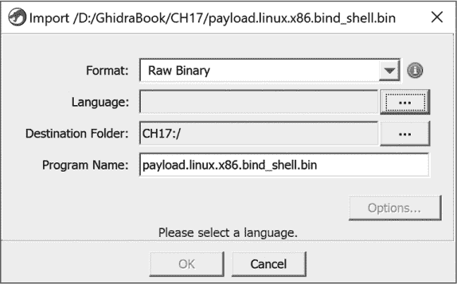

*图 17-1：原始二进制加载器示例*

那么当我们尝试导入这个文件时发生了什么呢？让我们从一个高层次的角度来看一下 Ghidra 加载文件的过程：

1.  在 Ghidra 项目窗口中，用户指定一个文件加载到项目中。

1.  Ghidra 导入器会轮询所有的 Ghidra 加载器，每个加载器尝试识别文件。如果可以加载文件，它们会响应并提供一份加载规范列表以填充导入对话框。（一个空列表意味着“我不能加载这个文件。”）

1.  导入器收集所有加载器的响应，构建一个识别该文件的加载器列表，并向用户展示一个已填充的导入对话框。

1.  用户选择加载器及其相关信息来加载文件。

1.  导入器调用用户选择的加载器，然后加载该文件。

对于图 17-1 中的文件，没有任何格式特定的加载器给出“是”的回应。因此，任务被交给了唯一一个愿意随时接受任何文件的加载器——原始二进制加载器。这个加载器几乎不做任何工作，把分析的负担转移给了逆向工程师。如果你在分析类似的文件时，发现它们都表现出“原始”格式，可能是时候构建一个专门的加载器来帮助你完成部分或全部的加载过程。创建一个新的加载器以便 Ghidra 能够加载一种新格式的文件需要完成几个任务。

在本章中，我们首先将引导你分析一个 Ghidra 无法识别格式的文件。这将帮助你了解分析未知文件的过程，同时也为构建加载器提供有力的论据，我们将在本章的后半部分进行详细探讨。

### 未知文件分析

Ghidra 包含多个加载模块，用于识别许多常见的可执行文件和归档文件格式，但 Ghidra 无法适应日益增加的用于存储可执行代码的文件格式数量。二进制映像可能包含针对特定操作系统格式化的可执行文件、从嵌入式系统中提取的 ROM 镜像、从固件更新中提取的固件镜像，或者只是原始的机器语言块，可能是通过网络数据包捕获提取的。这些镜像的格式可能由操作系统（可执行文件）、目标处理器和系统架构（ROM 镜像）或者根本没有任何格式（嵌入在应用层数据中的利用 shellcode）来决定。

假设有一个处理器模块可以反汇编未知二进制文件中的代码，那么你的任务就是在 Ghidra 中正确安排文件镜像，并在告知 Ghidra 哪些二进制部分表示代码，哪些二进制部分表示数据之前完成此操作。对于大多数处理器类型，使用原始格式加载文件的结果通常只是一个包含文件内容的列表，这些内容堆积成一个单一段，从地址零开始，如 Listing 17-1 所示。

```
00000000 4d       ??         4Dh    M

00000001 5a       ??         5Ah    Z

00000002 90       ??         90h

00000003 00       ??         00h

00000004 03       ??         03h

00000005 00       ??         00h

00000006 00       ??         00h

00000007 00       ??         00h
```

*Listing 17-1: 使用原始二进制加载器加载的未分析 PE 文件的初始行*

在某些情况下，取决于所选处理器模块的复杂度，可能会进行一些反汇编。例如，为嵌入式微控制器选择的处理器可以对 ROM 镜像的内存布局做出特定假设，或者一个了解与特定处理器相关的常见代码序列的分析工具，可以乐观地将任何匹配的部分格式化为代码。

当你面对一个无法识别的文件时，尽可能多地收集有关该文件的信息。有用的资源可能包括文件的获取方式和位置的说明、处理器参考、操作系统参考、系统设计文档以及通过调试或硬件辅助分析（例如通过逻辑分析仪）获得的任何内存布局信息。

在接下来的部分，为了举例说明，我们假设 Ghidra 无法识别 Windows PE 文件格式。PE 是一个广为人知的文件格式，许多读者可能对此有所了解。更重要的是，关于 PE 文件结构的文档随处可得，这使得分析任意 PE 文件成为一项相对简单的任务。

### 手动加载 Windows PE 文件

当你能找到某个文件格式的文档时，使用 Ghidra 帮助你理清二进制文件时将变得更加轻松。列表 17-1 显示了使用 Raw Binary 加载器加载并使用 `x86:LE:32:default:windows` 作为语言/编译器规范的未分析 PE 文件的前几行。^(1) PE 规范规定，一个有效的 PE 文件应以 MS-DOS 头部结构开始，头部以 2 字节签名 `4Dh 5Ah`（`MZ`）开始，我们可以在 列表 17-1 的前两行看到这一点。^(2) 位于文件偏移量 `0x3C` 处的 4 字节值包含下一个头部的偏移量：PE 头部。

处理 MS-DOS 头部字段的两种策略是：(1) 为每个字段定义适当大小的数据值；(2) 使用 Ghidra 的数据类型管理器功能，按照 PE 文件规范定义并应用 `IMAGE_DOS_HEADER` 结构。我们将在本章后面的例子中探讨选项 1 相关的挑战。在这种情况下，选项 2 需要的工作量显著较少。

使用 Raw Binary 加载器时，Ghidra 并不会加载 Windows 数据类型的 Data Type Manager，因此我们可以自行加载包含 MS-DOS 类型的归档文件 *windows_vs12_32.gdt*。通过在归档中导航或按 CTRL-F 在数据类型管理器窗口中查找，定位 `IMAGE_DOS_HEADER`；然后将头部拖动到文件的起始位置。你也可以将光标放置在列表中的第一个地址上，然后从右键菜单中选择 Data ▸ Choose Data Type（或快捷键 T）并输入或导航到数据类型选择对话框中的数据类型。这些选项都会得到以下列表，并附有描述每个字段的行尾注释：

```
00000000 4d 5a      WORD      5A4Dh    e_magic

00000002 90 00      WORD      90h      e_cblp

00000004 03 00      WORD      3h       e_cp

00000006 00 00      WORD      0h       e_crlc

00000008 04 00      WORD      4h       e_cparhdr

0000000a 00 00      WORD      0h       e_minalloc

0000000c ff ff      WORD      FFFFh    e_maxalloc

0000000e 00 00      WORD      0h       e_ss

00000010 b8 00      WORD      B8h      e_sp

00000012 00 00      WORD      0h       e_csum

00000014 00 00      WORD      0h       e_ip

00000016 00 00      WORD      0h       e_cs

00000018 40 00      WORD      40h      e_lfarlc

0000001a 00 00      WORD      0h       e_ovno

0000001c 00 00 00   WORD[4]            e_res

         00 00 00

         00 00

 00000024 00 00      WORD      0h       e_oemid

00000026 00 00      WORD      0h       e_oeminfo

00000028 00 00 00   WORD[10]           e_res2

         00 00 00

         00 00 00

0000003c d8 00 00   LONG      D8h      e_lfanew
```

上一个列表中的最后一行 `e_lfanew` 字段的值为 `D8h`，这表示 PE 头部应该位于二进制文件的偏移量 `D8h`（216 字节）处。检查偏移量 `D8h` 处的字节应该能揭示出 PE 头部的魔术数字 `50h 45h`（`PE`），这表示我们应该在二进制文件的偏移量 `D8h` 处应用 `IMAGE_NT_HEADERS` 结构。以下是 Ghidra 扩展列表的一部分：

```
000000d8    IMAGE_NT_HEADERS

   000000d8       DWORD           4550h     Signature

   000000dc    IMAGE_FILE_HEADER            FileHeader

      000000dc    WORD            14Ch      Machine➊

      000000de    WORD            5h        NumberOfSections➋

      000000e0    DWORD           40FDFD    TimeDateStamp

      000000e4    DWORD           0h        PointerToSymbolTable

      000000e8    DWORD           0h        NumberOfSymbols

      000000ec    WORD            E0h       SizeOfOptionalHeader

      000000ee    WORD            10Fh      Characteristics

   000000f0    IMAGE_OPTIONAL_HEADER32      OptionalHeader

      000000f0    WORD            10Bh      Magic

      000000f2    BYTE            '\u0006'  MajorLinkerVersion

      000000f3    BYTE            '\0'      MinorLinkerVersion

      000000f4    DWORD           21000h    SizeOfCode

      000000f8    DWORD           A000h     SizeOfInitializedData

      000000fc    DWORD           0h        SizeOfUninitializedData

      00000100    DWORD           14E0h     AddressOfEntryPoint➌

      00000104    DWORD           1000h     BaseOfCode

      00000108    DWORD           1000h     BaseOfData

      0000010c    DWORD           400000h   ImageBase➍

      00000110    DWORD           1000h     SectionAlignment➎

      00000114    DWORD           1000h     FileAlignment➏
```

到目前为止，我们已经揭示了许多有趣的信息，有助于进一步完善二进制文件的布局。首先，PE 头部中的 `Machine` 字段 ➊ 表示文件构建时的目标处理器类型。值 `14Ch` 表示该文件适用于 x86 处理器类型。如果机器类型是其他类型，例如 `1C0h`（ARM），我们需要关闭 CodeBrowser，右击项目窗口中的文件，选择 Set Language 选项，然后选择正确的语言设置。

`ImageBase` 字段 ➍ 指示加载文件镜像的基虚拟地址。利用这些信息，我们可以将一些虚拟地址信息整合到 CodeBrowser 中。通过“窗口 ▸ 内存映射”菜单选项，我们可以看到当前程序的内存块列表（见 图 17-2）。在这种情况下，单个内存块包含了程序的所有内容。原始二进制加载器无法为程序的任何内容确定合适的内存地址，因此它将所有内容放在从地址零开始的一个内存块中。

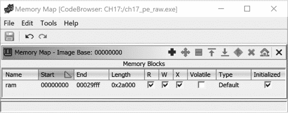

*图 17-2：内存映射窗口*

内存映射窗口的工具按钮，如 图 17-3 所示，用于操作内存块。为了正确地将我们的镜像映射到内存中，首先需要做的是设置 PE 头中指定的基地址。


*图 17-3：内存映射窗口工具*

`ImageBase` 字段 ➍ 告诉我们该二进制文件的正确基址是 `00400000`。我们可以使用“设置镜像基址”选项将镜像基址从默认值调整为该值。点击确认后，所有 Ghidra 窗口将更新，以反映程序的新内存布局，如 图 17-4 所示。（在已经定义了多个内存块的情况下使用此选项时需要小心，它会将每个内存块都移动与基内存块相同的距离。）


*图 17-4：设置镜像基址后的内存映射*

`AddressOfEntryPoint` 字段 ➌ 指定了程序入口点的相对虚拟地址（RVA）。在 PE 文件规范中，RVA 是从程序基虚拟地址的相对偏移量，而程序入口点是程序文件中将执行的第一条指令的地址。在本例中，`14E0h` 的入口点 RVA 表明程序将在虚拟地址 `4014E0h`（`400000h + 14E0h`）处开始执行。这是我们开始在程序中查找代码的第一个指示。然而，在此之前，我们需要将程序的其余部分正确映射到适当的虚拟地址。

PE 格式使用节（sections）来描述文件内容与内存范围的映射。通过解析文件中每个节的节头，我们可以完成程序的基本虚拟内存布局。`NumberOfSections` 字段 ➋ 表示 PE 文件中包含的节的数量（在本例中为五个）。根据 PE 规范，一组节头结构紧随 `IMAGE_NT_HEADERS` 结构之后。该数组中的每个元素都是 `IMAGE_SECTION_HEADER` 结构，我们在 Ghidra 结构编辑器中定义，并将其应用（本例中为五次）到 `IMAGE_NT_HEADERS` 结构之后的字节上。或者，您可以选择第一个节头的第一个字节，并将其类型设置为 `IMAGE_SECTION_HEADER[n]`，其中 n 在本例中为 5，从而将整个数组压缩为 Ghidra 显示行中的一行。

`FileAlignment` 字段 ➏ 和 `SectionAlignment` 字段 ➎ 表示每个节的数据在文件中的对齐方式，以及当数据映射到内存时如何对齐。在我们的例子中，两个字段都设置为 `1000h` 字节偏移量对齐。^(3) 在 PE 格式中，这两个数字不需要相同。然而，二者相同确实让我们的工作更轻松，因为这意味着磁盘文件内内容的偏移量与加载的内存映像中的相应字节的偏移量相同。理解节的对齐方式对于帮助我们在手动创建程序节时避免错误非常重要。

在构造了每个节头后，我们就有足够的信息来创建程序中的其他段。将 `IMAGE_SECTION_HEADER` 模板应用于紧跟在 `IMAGE_NT_HEADERS` 结构之后的字节，得到我们在 Ghidra 列表中的第一个节头：

```
004001d0    IMAGE_SECTION_HEADER

   004001d0       BYTE[8]         ".text"   Name➊

   004001d8    _union_226                   Misc

      004001d8    DWORD           20A80h    PhysicalAddress

      004001d8    DWORD           20A80h    VirtualSize

   004001dc       DWORD           1000h     VirtualAddress➋

   004001e0       DWORD           21000h    SizeOfRawData➌

   004001e4       DWORD           1000h     PointerToRawData➍

   004001e8       DWORD           0h        PointerToRelocations

   004001ec       DWORD           0h        PointerToLinenumbers

   004001f0       WORD            0h        NumberOfRelocations

   004001f2       WORD            0h        NumberOfLinenumbers
```

`Name` 字段 ➊ 告诉我们这个节头描述的是 `.text` 节。其余的字段在格式化列表时可能有用，但我们将重点关注三个描述节布局的字段。`PointerToRawData` 字段 ➍（`1000h`）表示可以找到节内容的文件偏移量。注意，这个值是文件对齐值 `1000h` 的倍数。PE 文件中的节按文件偏移量（和虚拟地址）升序排列。由于该节从文件偏移量 `1000h` 开始，因此文件的前 `1000h` 字节包含文件头数据和填充（如果文件头数据少于 `1000h` 字节，节必须填充到 `1000h` 字节边界）。因此，尽管文件头字节严格来说并不构成一个节，我们可以通过将它们分组为 Ghidra 列表中的内存块来突出它们在逻辑上是相关的。

Ghidra 提供了两种创建新内存块的方法，这两种方法都可以通过内存映射窗口访问，见图 17-2。添加块工具（参考图 17-3）打开图 17-5 中显示的对话框，用于添加与现有内存块不重叠的新内存块。该对话框要求提供新内存块的名称、起始地址和长度。该块可以通过常量值进行初始化（例如，填充零），也可以通过当前文件中的内容进行初始化（您需要指示内容来源的文件偏移量），或者保持未初始化状态。

创建新块的第二种方法是拆分一个现有的块。在 Ghidra 中拆分块时，必须首先在内存映射窗口中选择要拆分的块，然后使用拆分块工具（参考图 17-3）打开图 17-6 中显示的对话框。我们刚开始，所以只有一个块可以拆分。我们首先在 `.text` 部分的开始处拆分文件，将程序头从现有块的开头切割下来。当我们输入要拆分的块的长度（`1000h`）（即头部部分）时，Ghidra 会自动计算剩余的地址和长度字段。剩下的就是为新创建的块提供一个名称，名称来自于第一个部分头部：`.text`。

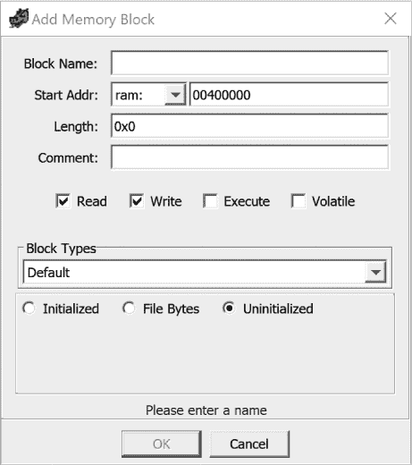

*图 17-5：添加内存块对话框*

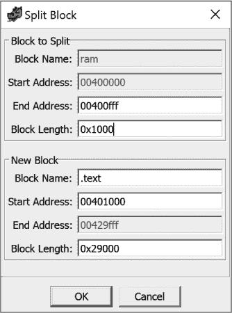

*图 17-6：拆分块对话框*

现在，我们的内存映射中有两个块。第一个块包含正确大小的程序头。第二个块包含正确命名但大小不正确的 `.text` 部分。这个情况在图 17-7 中得到了体现，我们可以看到 `.text` 部分的大小是 `0x29000` 字节。

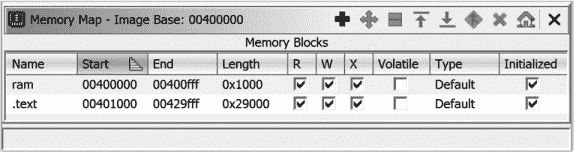

*图 17-7：拆分块后的内存映射窗口*

回到 `.text` 部分的头部，我们看到 `VirtualAddress` 字段 ➋（`1000h`）是一个 RVA，指定了部分内容开始的内存偏移（从 `ImageBase` 开始），而 `SizeOfRawData` 字段 ➌（`21000h`）指示文件中存在多少字节的数据。换句话说，这个特定的部分头部告诉我们，`.text` 部分是通过将 `21000h` 字节的文件数据从 `1000h-21FFFh` 的偏移映射到虚拟地址 `401000h-421FFFh` 来创建的。

因为我们在`.text`段的开始处分割了原始内存块，新的`.text`段暂时包含了所有剩余的段，因为其当前大小`0x29000`大于正确的大小`0x21000`。通过查阅剩余的段头，并反复分割最后一个内存块，我们逐步接近程序的正确最终内存映射。然而，当我们遇到以下一对段头时，问题出现了：

```
00400220    IMAGE_SECTION_HEADER

   00400220       BYTE[8]         ".data"   Name

   00400228    _union_226                   Misc

      00400228    DWORD           5624h     PhysicalAddress

      00400228    DWORD           5624h     VirtualSize➊

   0040022c       DWORD           24000h    VirtualAddress➋

   00400230       DWORD           4000h     SizeOfRawData➌

   00400234       DWORD           24000h    PointerToRawData

   00400238       DWORD           0h        PointerToRelocations

   0040023c       DWORD           0h        PointerToLinenumbers

   00400240       WORD            0h        NumberOfRelocations

   00400242       WORD            0h        NumberOfLinenumbers

   00400244       DWORD           C0000040h Characteristics

00400248    IMAGE_SECTION_HEADER

   00400248       BYTE[8] ".idata" Name

   00400250    _union_226 Misc

      00400250    DWORD           75Ch      PhysicalAddress

      00400250    DWORD           75Ch      VirtualSize

 00400254       DWORD           2A000h    VirtualAddress➍

   00400258       DWORD           1000h     SizeOfRawData

   0040025c       DWORD           28000h    PointerToRawData➎

   00400260       DWORD           0h        PointerToRelocations

   00400264       DWORD           0h        PointerToLinenumbers

   00400268       WORD            0h        NumberOfRelocations

   0040026a       WORD            0h        NumberOfLinenumbers

   0040026c       DWORD           C0000040h Characteristics
```

`.data`段的虚拟大小 ➊ 大于其文件大小 ➌。这意味着什么，如何影响我们的内存映射？编译器已经得出结论，程序需要`5624h`字节的运行时静态数据，但只提供了`4000h`字节来初始化这些数据。剩余的`1624h`字节运行时数据将不会通过可执行文件的内容初始化，因为它们是为未初始化的全局变量分配的。（在程序中，常常会看到这样的变量分配到一个名为`.bss`的专用段中。）

为了完成我们的内存映射，我们必须为`.data`段选择一个合适的大小，并确保随后的段也正确映射。`.data`段将从文件偏移`24000h`映射`4000h`字节的数据到内存地址`424000h` ➋（`ImageBase` + `VirtualAddress`）。接下来的段（`.idata`）将从文件偏移`28000h` ➎映射`1000h`字节到内存地址`42A000h` ➍。如果你留心观察，可能已经注意到，`.data`段似乎在内存中占用了`6000h`字节（`42A000h–424000h`），实际上它确实占用了。这个大小的原因是，`.data`段需要`5624h`字节，但这不是`1000h`的整数倍，因此该段会填充到`6000h`字节，以确保`.idata`段符合 PE 头中指定的段对齐要求。为了完成我们的内存映射，我们必须执行以下操作：

1.  使用`4000h`的长度分割`.data`段。生成的`.idata`段暂时将从`428000h`开始。

1.  点击“移动块”图标（图 17-3），将`.idata`段移动到地址`42A000h`，并将起始地址设置为 42A000h。

1.  分离并根据需要移动任何剩余的段，以实现最终的程序布局。

1.  可选地，扩展任何虚拟大小对齐到比文件大小更高边界的段。在我们的示例中，`.data`段的虚拟大小`5624h`对齐到`6000h`，而其文件大小`4000h`对齐到`4000h`。一旦我们通过将`.idata`段移动到正确的位置来腾出空间，就可以将`.data`段从`4000h`扩展到`6000h`字节。

要扩展 `.data` 部分，在内存映射窗口中突出显示 `.data` 部分，然后选择 **Expand Down** 工具（参见图 17-3），修改该部分的结束地址（或长度）。展开块向下对话框显示在图 17-8 中。（此操作将为该部分名称添加 *.exp* 扩展名。）

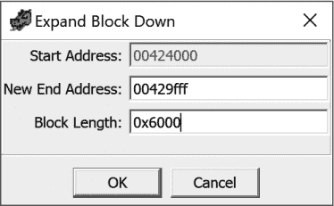

*图 17-8：展开块向下对话框*

我们的最终内存映射，在经过一系列块移动、拆分和扩展后，如图 17-9 所示。除了部分名称、起始和结束地址以及长度列外，还显示了每个部分的读取（R）、写入（W）和执行（X）权限，权限以复选框的形式显示。对于 PE 文件，这些值是通过每个部分头中的 `Characteristics` 字段的位来指定的。请查阅 PE 规范，以了解如何解析 `Characteristics` 字段，正确设置每个部分的权限。

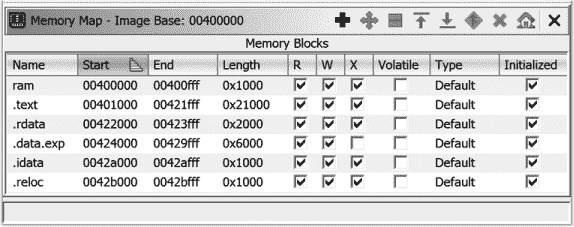

*图 17-9：创建所有部分后的最终内存映射窗口*

在所有程序部分正确映射后，我们需要定位一些很可能是代码的字节。`AddressOfEntryPoint`（RVA `14E0h`，或虚拟地址 `4014E0h`）引导我们到程序的入口点，这是已知的代码位置。导航到该位置后，我们看到以下原始字节列表：

```
004014e0  ??     55h    U

004014e1  ??     8Bh

004014e2  ??     ECh

...
```

使用上下文菜单从 `address` `004014e0` 进行反汇编（快捷键 D），启动递归下降过程（其进度可以在代码浏览器的右下角跟踪），并使上面的字节重新格式化为以下所示的代码：

```
     FUN_004014e0

004014e0  PUSH   EBP

 004014e1  MOV    EBP,ESP

004014e3  PUSH   -0x1

004014e5  PUSH   DAT_004221b8

004014ea  PUSH   LAB_004065f0

004014ef  MOV    EAX,FS:[0x0]

004014f5  PUSH   EAX
```

在此时，我们希望已收集到足够的代码来进行全面的二进制分析。如果我们对二进制文件的内存布局或文件中代码与数据的分离了解较少，我们将需要依赖其他信息来源来指导我们的分析。确定正确内存布局和定位代码的一些潜在方法包括以下几种：

+   使用处理器参考手册来了解复位向量的位置。

+   在二进制文件中查找可能暗示架构、操作系统或编译器的字符串。

+   查找常见的代码序列，如与构建该二进制文件的处理器相关的函数前言。

+   对二进制文件的部分进行统计分析，找出看起来在统计上类似于已知二进制文件的区域。

+   寻找可能是地址表格的重复数据序列（例如，许多非平凡的 32 位整数，它们共享相同的上 12 位）。^(4) 这些可能是指针，并且可能提供有关二进制文件内存布局的线索。

在我们讨论加载原始二进制文件时，请考虑到每次打开一个格式相同但 Ghidra 无法识别的二进制文件时，您都需要重复本节中讲解的每个步骤。在这个过程中，您可能通过编写脚本自动化一些操作，执行一些头部解析和段创建。这正是 Ghidra 加载器模块的目的！在下一节中，我们将编写一个简单的加载器模块，以介绍 Ghidra 的加载器模块架构，然后再深入到执行一些常见任务的更复杂加载器模块，这些任务涉及加载符合结构化格式的文件。

### 示例 1：SimpleShellcode 加载器模块

在本章开始时，我们尝试将一个 shellcode 文件加载到 Ghidra 中，并且被引导到使用 Raw Binary 加载器。在第十五章中，我们使用了 Eclipse 和 GhidraDev 创建了一个分析模块，并将其作为扩展添加到 Ghidra 中。回想一下，Ghidra 提供的模块选项之一是创建一个加载器模块。在本章中，我们将构建一个简单的加载器模块，作为 Ghidra 的扩展来加载 shellcode。和我们在第十五章中的示例一样，我们将使用简化的软件开发流程，因为这只是一个简单的演示项目。我们的过程将包括以下步骤：

1.  定义问题。

1.  创建 Eclipse 模块。

1.  构建加载器。

1.  将加载器添加到我们的 Ghidra 安装中。

1.  从我们的 Ghidra 安装中测试加载器。

**什么是 SHELLCODE，为什么我们关心它？**

严格来说，*shellcode* 是原始机器代码，其唯一目的是生成一个用户空间的 shell 进程（例如，*/bin/sh*），通常通过使用系统调用直接与操作系统内核进行通信。使用系统调用消除了对用户空间库（如*libc*）的依赖。在这种情况下，*raw*（原始）一词不应与 Ghidra 的 Raw Binary 加载器混淆。原始机器代码是没有文件头包装的代码，相比于执行相同行为的编译可执行文件，它非常紧凑。对于 Linux 上的 x86-64 架构，紧凑的 shellcode 可能小至 30 字节，但以下 C 程序的编译版本（它同样生成一个 shell）即使在去除调试信息后，仍然超过 6000 字节：

```
#include <stdlib.h>

int main(int argc, char **argv, char **envp) {

   execve("/bin/sh", NULL, NULL);

}
```

Shellcode 的缺点在于它不能直接从命令行运行。相反，它通常会被注入到一个现有的进程中，然后采取措施将控制权转交给 shellcode。攻击者可能会试图将 shellcode 放入进程的内存空间中，并与该进程消耗的其他输入一起，触发控制流劫持漏洞，从而允许攻击者将进程的执行重定向到他们注入的 shellcode。由于 shellcode 通常嵌入在其他供进程使用的输入中，因此 shellcode 可能会出现在针对易受攻击的服务器进程的网络流量中，或者出现在需要被易受攻击的查看应用程序打开的文件中。

随着时间的推移，术语 *shellcode* 被泛指为任何嵌入到漏洞利用中的原始机器代码，无论这些机器代码的执行是否会在目标系统上启动一个用户空间的 shell。

#### *步骤 0：退后一步*

在我们开始定义问题之前，我们需要了解 (a) Ghidra 当前如何处理 shellcode 文件，以及 (b) 我们希望 Ghidra 如何处理 shellcode 文件。基本上，我们必须将 shellcode 文件作为原始二进制文件加载并分析，然后利用我们发现的信息来指导我们 shellcode 加载器（并可能是分析器）的开发。幸运的是，大多数 shellcode 远没有 PE 文件那么复杂。让我们深呼吸一下，进入 shellcode 的世界。

让我们从分析我们在章节开始时尝试加载的 shellcode 文件开始。我们加载了文件，并且如前所示，被指向了原始二进制加载器作为唯一选项，图 17-1 中展示了这一点。由于其他加载器都不需要该文件，因此没有为其推荐语言。让我们选择一个相对常见的语言/编译器规格，`x86:LE:32:default:gcc`，如 图 17-10 所示。

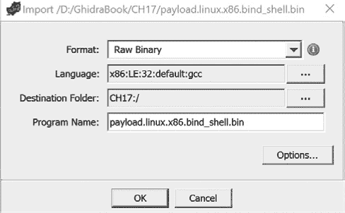

*图 17-10：带有语言/编译器规格的导入对话框*

我们点击 **确定**，并得到一个包含 图 17-11 所示内容的导入结果摘要窗口。

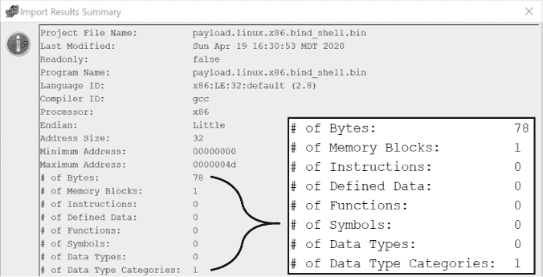

*图 17-11：shellcode 文件的导入结果摘要*

根据总结中放大区块的内容，我们知道文件在一个内存/数据块中只有 78 字节，这就是我们从原始二进制加载器得到的所有帮助。如果我们在 CodeBrowser 中打开文件，Ghidra 会提供自动分析文件的选项。无论 Ghidra 是否自动分析该文件，CodeBrowser 中的 Listing 窗口都会显示图 17-12 中所示的内容。请注意，程序树中只有一个部分，符号树为空，数据类型管理器在文件特定的文件夹中没有条目。此外，反编译器窗口保持空白，因为文件中没有识别出的函数。

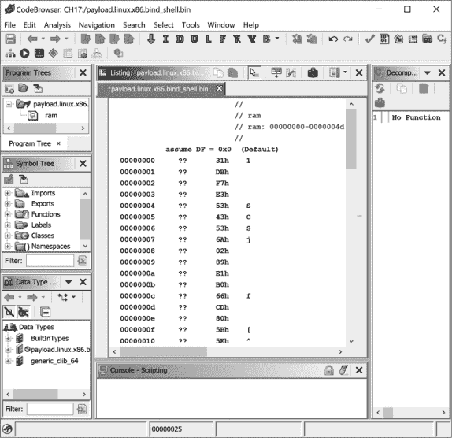

*图 17-12：加载（或分析）shellcode 文件后的 CodeBrowser 窗口*

右键点击文件中的第一个地址，并从上下文菜单中选择**Disassemble**（快捷键 D）。在 Listing 窗口中，我们现在看到一些可以操作的内容——一系列指令！列表 17-2 显示了反汇编后的指令，以及我们在文件分析后得到的结果。行末注释记录了一些关于这个简短文件的分析内容。

```
0000002b  INC    EBX

0000002c  MOV    AL,0x66       ; 0x66 is Linux sys_socketcall

0000002e  INT    0x80          ; transfers flow to kernel to

                               ; execute system call

 00000030  XCHG   EAX,EBX

00000031  POP    ECX

        LAB_00000032             XREF[1]:  00000038(j)

00000032  PUSH   0x3f          ; 0x3f is Linux sys_dup2

00000034  POP    EAX

00000035  INT    0x80          ; transfers flow to kernel to

                               ; execute system call

00000037  DEC    ECX

00000038  JNS   LAB_00000

0000003a  PUSH   0x68732f2f    ; 0x68732f2f converts to "//sh"

0000003f  PUSH   0x6e69622f    ; 0x6e69622f converts to "/bin"

00000044  MOV    EBX,ESP

00000046  PUSH   EAX

00000047  PUSH   EBX

00000048  MOV    ECX,ESP

0000004a  MOV    AL,0xb        ; 0xb is Linux sys_execve which

                               ; executes a specified program

0000004c  INT    0x80          ; transfers flow to kernel to

                                      ; execute system call
```

*列表 17-2：反汇编后的 32 位 Linux shellcode*

根据我们的分析，shellcode 调用了 Linux 的*execve*系统调用（在`0000004c`处），以启动*/bin/sh*（该路径在`0000003a`和`000003f`处被压入堆栈）。这些指令对我们有意义，表明我们可能选择了合适的语言和反汇编起点。

我们现在对加载过程了解得足够多，可以定义我们的加载器了。（我们也有足够的信息来构建一个简单的 shellcode 分析器，但那是另一天的任务。）

#### *步骤 1：定义问题*

我们的任务是设计并开发一个简单的加载器，它将把 shellcode 加载到 Listing 窗口中并设置入口点，以便进行自动分析。该加载器需要添加到 Ghidra 中，并作为 Ghidra 加载器选项可用。它还需要能够以适当的方式响应 Ghidra Importer 的轮询：与原始二进制加载器的工作方式相同。这将使我们的新加载器成为第二个通用加载器选项。顺便提一下，所有示例都将使用 FlatProgramAPI。虽然 FlatProgramAPI 通常不用于构建扩展，但其使用将巩固在第十四章中介绍的脚本概念，这些概念在你使用 Java 开发 Ghidra 脚本时可能会用到。

#### *步骤 2：创建 Eclipse 模块*

如第十五章中所述，使用**GhidraDev** ▸ **New** ▸ **Ghidra Module Project**来创建一个名为 SimpleShellcode 的模块，该模块使用加载器模块模板。这将会在 SimpleShellcode 模块的*src/main/java*文件夹中创建一个名为*SimpleShellcodeLoader.java*的文件。该文件夹层级结构在图 17-13 中有展示。

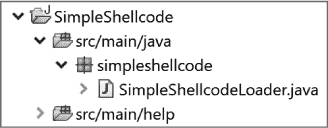

*图 17-13：* SimpleShellcode *层次结构*

#### *第 3 步：构建加载器*

加载器模板*SimpleShellcodeLoader.java*的部分图像如图 17-14 所示。功能已被折叠，以便你可以看到加载器模板中提供的所有加载器方法。回想一下，当你在开发代码时，如果需要导入，Eclipse 会推荐导入项，因此你可以直接开始编码，当 Eclipse 检测到你需要它们时，接受推荐的`import`语句。

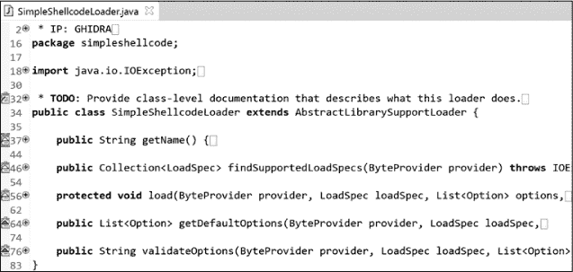

*图 17-14：* SimpleShellcodeLoader *模板*

在图 17-14 中的加载器模板内，左侧的行号旁有六个*任务标签*，指示你应该从哪里开始开发。我们将在处理具体任务时扩展每个部分，并包括与每个任务相关的前后内容，以便你理解如何修改模板。（为了可读性，某些内容将被折叠或重新格式化，注释将被简化以节省空间。）与第十五章中你编写的分析器模块不同，这个模块不需要任何明显的类成员变量，因此你可以直接开始当前任务。

##### 第 3 步-1：记录类

当你展开第一个任务标签时，你会看到以下任务描述：

```
/**

 * TODO: Provide class-level documentation that describes what this

 * loader does.

 */
```

这个任务涉及将现有的`TODO`注释替换为描述加载器功能的注释：

```
/*

 * This loader loads shellcode binaries into Ghidra,

 * including setting an entry point.

 */
```

##### 第 3 步-2：命名并描述加载器

展开下一个任务标签会显示一个`TODO`注释和你需要编辑的字符串。这使你可以轻松识别你应该从哪里开始工作。第二个任务包含以下内容：

```
public String getName() {

       // TODO: Name the loader.  This name must match the name

       // of the loader in the .opinion files

     return "My loader"➊;

}
```

将字符串 ➊ 更改为有意义的内容。你不需要担心与*.opinion*文件中的名称匹配，因为这些文件不适用于将接受任何文件的加载器。当你进入第三个示例时，你会看到*.opinion*文件。忽略模板中的*.opinion*文件注释会导致以下代码：

```
public String getName() {

   return "Simple Shellcode Loader";

}
```

##### 第 3 步-3：确定加载器是否能加载该文件

我们在章节开头描述的加载过程的第二个步骤涉及到导入器加载器轮询。此任务要求你确定你的加载器是否可以加载文件，并通过你的方法的返回值向导入器提供响应：

```
public Collection<LoadSpec> findSupportedLoadSpecs(ByteProvider provider)

                            throws IOException {

   List<LoadSpec> loadSpecs = new ArrayList<>();

   // TODO: Examine the bytes in 'provider' to determine if this loader

   // can load it.  If it can load it, return the appropriate load

   // specifications.

   return loadSpecs;

}
```

大多数加载器通过检查文件的内容来查找魔数或头部结构来实现这一点。`ByteProvider`输入参数是 Ghidra 提供的一个只读包装器，封装了输入文件流。我们将简化任务，采用 Raw Binary 加载器使用的`LoadSpec`列表，该列表忽略文件内容，只列出所有可能的`LoadSpec`。然后，我们将给加载器设置一个比 Raw Binary 加载器更低的优先级，这样如果存在更具体的加载器，它将在 Ghidra 导入对话框中自动拥有更高的优先级。

```
public Collection<LoadSpec> findSupportedLoadSpecs(ByteProvider provider)

                                                   throws IOException {

   // The List of load specs supported by this loader

   List<LoadSpec> loadSpecs = new ArrayList<>();

   List<LanguageDescription> languageDescriptions =

        getLanguageService().getLanguageDescriptions(false);

   for (LanguageDescription languageDescription : languageDescriptions) {

      Collection<CompilerSpecDescription> compilerSpecDescriptions =

         languageDescription.getCompatibleCompilerSpecDescriptions();

      for (CompilerSpecDescription compilerSpecDescription :

           compilerSpecDescriptions) {

         LanguageCompilerSpecPair lcs =

            new LanguageCompilerSpecPair(languageDescription.getLanguageID(),

            compilerSpecDescription.getCompilerSpecID());

         loadSpecs.add(new LoadSpec(this, 0, lcs, false));

      }

   }

   return loadSpecs;

}
```

每个加载器都有一个关联的层级和层级优先级。Ghidra 定义了四个加载器层级，层级 0 为高度专业化的加载器，层级 3 为与格式无关的加载器。当多个加载器都愿意接受某个文件时，Ghidra 会按照层级的递增顺序对加载器列表进行排序。同一层级中的加载器则会根据层级优先级的递增顺序进一步排序（即，层级优先级为 10 的加载器会排在层级优先级为 20 的加载器之前）。

例如，PE 加载器和原始二进制加载器都愿意加载 PE 文件，但 PE 加载器是加载这种格式的更好选择（其层级为 1），因此它将出现在原始二进制加载器（层级 3，层级优先级 100）之前。我们将简单 Shellcode 加载器的层级设置为 3（`LoaderTier.UNTARGETED_LOADER`），优先级设置为 101，因此在 Importer 填充导入窗口中的候选加载器时，它会被赋予最低的优先级。为此，请将以下两个方法添加到您的加载器中：

```
@Override

public LoaderTier getTier() {

   return LoaderTier.UNTARGETED_LOADER;

}

@Override

public int getTierPriority() {

   return 101;

}
```

##### 步骤 3-4：加载字节

以下方法展示了在我们编辑内容前后的操作，它完成了将文件内容加载到我们的 Ghidra 项目中的主要任务（在这个例子中，它加载的是 shellcode）：

```
protected void load(ByteProvider provider, LoadSpec loadSpec,

               List<Option> options, Program program, TaskMonitor monitor,

               MessageLog log) throws CancelledException, IOException {

   // TODO: Load the bytes from 'provider' into the 'program'.

}
```

```
protected void load(ByteProvider provider, LoadSpec loadSpec,

               List<Option> options, Program program, TaskMonitor monitor,

               MessageLog log) throws CancelledException, IOException {

➊ FlatProgramAPI flatAPI = new FlatProgramAPI(program);

   try {

      monitor.setMessage("Simple Shellcode: Starting loading");

      // create the memory block we're going to load the shellcode into

      Address start_addr = flatAPI.toAddr(0x0);

   ➋ MemoryBlock block = flatAPI.createMemoryBlock("SHELLCODE",

      start_addr, provider.readBytes(0, provider.length()), false);

      // make this memory block read/execute but not writeable

   ➌ block.setRead(true);

      block.setWrite(false);

      block.setExecute(true);

      // set the entry point for the shellcode to the start address

   ➍ flatAPI.addEntryPoint(start_addr);

      monitor.setMessage( "Simple Shellcode: Completed loading" );

   } catch (Exception e) {

      e.printStackTrace();

      throw new IOException("Failed to load shellcode");

   }

}
```

请注意，与第十四章和第十五章中的脚本不同，这些脚本继承自`GhidraScript`（最终继承自`FlatProgramAPI`），我们的加载器类无法直接访问 Flat API。因此，为了简化我们对一些常用 API 类的访问，我们实例化了我们自己的`FlatProgramAPI`对象➊。接下来，我们在地址零处创建一个名为`SHELLCODE`的`MemoryBlock`➋，并用输入文件的全部内容填充它。在添加一个入口点之前，我们花时间为新的内存区域设置一些合理的权限➌，该入口点通知 Ghidra 它应从哪里开始反汇编。

添加入口点是加载器的一个非常重要的步骤。入口点的存在是 Ghidra 定位已知包含代码（而非数据）的地址的主要手段。在解析输入文件时，加载器理想情况下能够发现任何入口点并将其标识给 Ghidra。

##### 步骤 3-5：注册自定义加载器选项

一些加载器为用户提供修改与加载过程相关的各种参数的选项。您可以重写`getDefaultOptions`函数，以便向 Ghidra 提供可用于您加载器的自定义选项列表：

```
public List<Option> getDefaultOptions(ByteProvider provider, LoadSpec

       loadSpec,DomainObject domainObject, boolean isLoadIntoProgram) {

   List<Option> list = super.getDefaultOptions(provider, loadSpec,

                       domainObject, isLoadIntoProgram);

   // TODO: If this loader has custom options, add them to 'list'

   list.add(new Option("Option name goes here",

                        Default option value goes here));

   return list;

}
```

由于这个加载器只是用于演示，我们不会添加任何选项。加载器的选项可能包括设置开始读取文件的偏移量，以及设置加载二进制文件的基地址。要查看与任何加载器相关的选项，请点击导入对话框右下角的**选项 . . .**按钮（请参阅图 17-1）。

```
public List<Option> getDefaultOptions(ByteProvider provider, LoadSpec

       loadSpec,DomainObject domainObject, boolean isLoadIntoProgram) {

   // no options

   List<Option> list = new ArrayList<Option>();

   return list;

}
```

##### 步骤 3-6：验证选项

接下来的任务是验证选项：

```
public String validateOptions(ByteProvider provider, LoadSpec loadSpec,

                              List<Option> options, Program program) {

   // TODO: If this loader has custom options, validate them here.

   // Not all options require validation.

   return super.validateOptions(provider, loadSpec, options, program);

}
```

由于我们没有任何选项，我们直接返回`null`：

```
public String validateOptions(ByteProvider provider, LoadSpec loadSpec,

                              List<Option> options, Program program) {

   // No options, so no need to validate

   return null;

}
```

**从 ECLIPSE 测试模块**

如果你是那种在第一次尝试时不总是能精确写出代码的程序员，可以通过从 Eclipse 运行新代码来避免多次进行“导出，启动 Ghidra，导入扩展，添加扩展到导入列表，选择扩展，重启 Ghidra，测试扩展”这些循环。如果你从 Eclipse 菜单选择“运行 ▸ 作为运行”，你将获得作为 Ghidra（或 Ghidra Headless）运行的选项。这将启动 Ghidra，你可以将文件导入到当前项目中。你的加载器将作为导入选项包含在内，所有控制台反馈都会在 Eclipse 控制台中显示。你可以像处理其他文件一样在 Ghidra 中与该文件进行交互。然后，你可以在不保存的情况下退出 Ghidra 项目，并选择（1）调整代码，或（2）只进行一次“导出，启动 Ghidra，导入扩展，添加扩展到导入列表，选择扩展，重启 Ghidra，测试扩展”。

#### *步骤 4：将加载器添加到我们的 Ghidra 安装中*

在确认该模块正常工作后，从 Eclipse 导出 Ghidra 模块扩展，然后将扩展安装到 Ghidra，就像我们在第十五章中对 SimpleROPAnalyzer 模块所做的那样。选择 **GhidraDev** ▸ **导出** ▸ **Ghidra 模块扩展**，选择 **SimpleShellcode** 模块，然后按照你在第十五章中所做的相同步骤进行操作。

要将扩展导入到 Ghidra 中，请从 Ghidra 项目窗口选择 **文件** ▸ **安装扩展**。将新加载器添加到列表中并选择它。重新启动 Ghidra 后，新加载器应作为选项可用，但你应该进行测试以确保。

#### *步骤 5：在 Ghidra 中测试加载器*

我们简化的测试计划仅用于演示功能。SimpleShellcode 已通过以下标准的验收测试：

1.  （通过）SimpleShellcode 作为加载器选项出现，优先级低于原始二进制文件。

1.  （通过）SimpleShellcode 加载文件并设置入口点。

测试用例 1 已通过，如图 17-15 所示。第二个确认在图 17-16 中显示，其中前面章节分析的 PE 文件正在被加载。在这两种情况下，我们可以看到“简单 shellcode 加载器”选项在格式列表中的优先级最低。

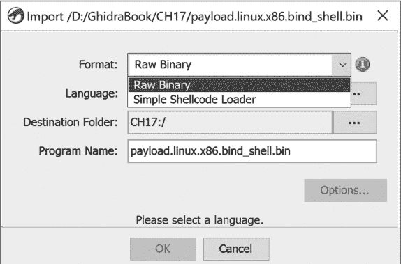

*图 17-15：导入窗口，显示我们的新加载器作为选项*

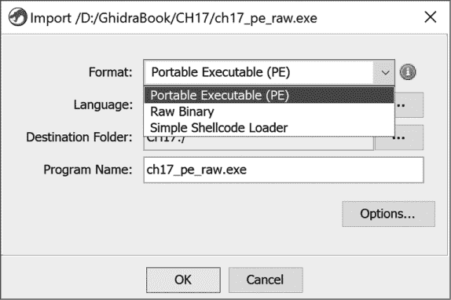

*图 17-16：导入窗口，显示我们的新加载器作为 PE 文件的选项*

根据有关二进制文件的信息和获取方式，选择语言规范。假设 shellcode 是从指向 x86 机器的数据包中捕获的。在这种情况下，选择 `x86:LE:32:default:gcc` 作为我们的语言/编译器规范可能是一个好的起点。

在我们选择语言并点击 图 17-15 中所示的文件后，二进制文件将被导入到我们的 Ghidra 项目中。然后我们可以在 CodeBrowser 中打开程序，Ghidra 会提供一个选项来分析文件。如果我们接受分析，我们将看到以下清单：

```
     undefined FUN_00000000()

        undefined  AL:1 <RETURN>

        undefined4 Stack[-0x10]:4 local_10  XREF[1]: 00000022(W)

     FUN_00000000                           XREF[1]: Entry Point(*)➊

00000000 31 db          XOR    EBX,EBX

00000002 f7 e3          MUL    EBX

00000004 53             PUSH   EBX

00000005 43             INC    EBX

00000006 53             PUSH   EBX

00000007 6a 02          PUSH   0x2

00000009 89 e1          MOV    ECX,ESP

0000000b b0 66          MOV    AL,0x66

0000000d cd 80          INT    0x80

0000000f 5b             POP    EBX

00000010 5e             POP    ESI

00000011 52             PUSH   EDX

00000012 68 02 00 11 5c PUSH   0x5c110002
```

入口点 ➊ 被识别，因此 Ghidra 能够为我们提供反汇编结果，以便开始分析。

SimpleShellcodeLoader 是一个简单的示例，因为 shellcode 通常嵌入在其他数据中。为了演示目的，我们将以我们的加载器模块为基础，创建一个从 C 源文件中提取 shellcode 并加载 shellcode 进行分析的加载器模块。这可能会允许我们构建 Ghidra 能在其他二进制文件中识别的 shellcode 特征。我们不会深入探讨每个步骤，因为我们只是扩展了现有 shellcode 加载器的功能。

### 示例 2：简单的 Shellcode 源代码加载器

由于模块提供了一种组织代码的方法，并且您创建的 SimpleShellcode 模块具备创建加载器所需的一切，您不需要创建一个新模块。只需从 Eclipse 菜单中选择 **文件** ▸ **新建** ▸ **文件**，然后将一个新文件 (*SimpleShellcodeSourceLoader.java*) 添加到您的 SimpleShellcode *src/main/java* 文件夹中。通过这样做，您所有的新加载器将包含在您的新 Ghidra 扩展中。

为了简化操作，将现有的 *SimpleShellcodeLoader.java* 文件内容粘贴到这个新文件中，并更新关于加载器功能的注释。以下步骤突出显示了现有加载器中需要更改的部分，以使新加载器按预期工作。在大多数情况下，您将扩展现有代码。

#### *更新 1：修改对导入器轮询的响应*

简单的源代码加载器将严格根据文件扩展名做出决定。如果文件的扩展名不是*.c*，加载器将返回一个空的`loadSpecs`列表。如果文件扩展名是*.c*，它将返回与之前的加载器相同的`loadSpecs`列表。为了使这一点生效，您需要在`findSupportLoadSpecs`方法中添加以下测试：

```
// The List of load specs supported by this loader

List<LoadSpec> loadSpecs = new ArrayList<>();

// Activate loader if the filename ends in a .c extension

if (!provider.getName().endsWith(".c")) {

   return loadSpecs;

}
```

我们还决定，由于我们的加载器识别特定类型的文件并且更适合该类型的文件，所以它的优先级高于原始二进制加载器。这是通过在`getTierPriority`方法中返回一个较高的优先级（较低的值）来实现的：

```
public int getTierPriority() {

   // priority of this loader

   return 99;

}
```

#### *更新 2：在源代码中找到 Shellcode*

记住，shellcode 只是执行某些有用任务的原始机器码。shellcode 中的每个字节都在 `0..255` 范围内，其中许多值超出了 ASCII 可打印字符的范围。因此，当 shellcode 被嵌入到源文件中时，其中的大部分必须通过十六进制转义序列来表示，例如 `\xFF`。这种类型的字符串相当独特，我们可以构建一个正则表达式，帮助我们的加载器识别它们。以下实例变量声明描述了所有加载器函数可能使用的正则表达式，用于在选定的 C 文件中查找 shellcode 字节：

```
private String pattern = "\\\\x[0-9a-fA-F]{1,2}";
```

在 `load` 方法中，加载器解析文件，寻找与正则表达式匹配的模式，以帮助计算加载文件到 Ghidra 时所需的内存量。由于 shellcode 通常不是连续的，因此加载器应解析整个文件，寻找需要加载的 shellcode 区域。

```
// set up the regex matcher

CharSequence provider_char_seq =

      new String(provider.readBytes(0, provider.length())➊, "UTF-8");

Pattern p = Pattern.compile(pattern);

Matcher m = p.matcher(provider_char_seq)➋;

 // Determine how many matches (shellcode bytes) were found so that we can

// correctly size the memory region, then reset the matcher

int match_count = 0;

while (m.find()) {

 ➌ match_count++;

}

m.reset();
```

加载输入文件的全部内容 ➊ 后，我们统计所有与正则表达式匹配的项 ➌。

#### *更新 3：将 Shellcode 转换为字节值*

`load()` 方法接下来需要将十六进制转义序列转换为字节值，并将它们放入字节数组中：

```
byte[] shellcode = new byte[match_count];

// convert the hex representation of bytes in the source code to actual

// byte values in the binary we're creating in Ghidra

int ii = 0;

while (m.find()) {

   // strip out the \x

   String hex_digits = m.group().replaceAll("[⁰-9a-fA-F]+", "")➊;

   // parse what's left into an integer and cast it to a byte, then

   // set current byte in byte array to that value

   shellcode[ii++]➋ = (byte)Integer.parseInt(hex_digits, 16)➌;

}
```

十六进制数字从每个匹配的字符串 ➊ 中提取，并转换为字节值 ➌，然后附加到我们的 shellcode 数组 ➋。

#### *更新 4：加载转换后的字节数组*

最后，由于 shellcode 已经是字节数组，`load()` 方法需要将其从字节数组复制到程序的内存中。这是实际的加载步骤，也是加载器完成目标的最后一步：

```
// create the memory block and populate it with the shellcode

Address start_addr = flatAPI.toAddr(0x0);

MemoryBlock block =

      flatAPI.createMemoryBlock("SHELLCODE", start_addr, shellcode, false);
```

#### *结果*

为了测试我们的新加载器，我们创建了一个 C 源文件，其中包含以下表示 x86 shellcode 的转义形式：

```
unsigned char buf[] =

   "\x31\xdb\xf7\xe3\x53\x43\x53\x6a\x02\x89\xe1\xb0\x66\xcd\x80"

   "\x5b\x5e\x52\x68\x02\x00\x11\x5c\x6a\x10\x51\x50\x89\xe1\x6a"

   "\x66\x58\xcd\x80\x89\x41\x04\xb3\x04\xb0\x66\xcd\x80\x43\xb0"

 "\x66\xcd\x80\x93\x59\x6a\x3f\x58\xcd\x80\x49\x79\xf8\x68\x2f"

   "\x2f\x73\x68\x68\x2f\x62\x69\x6e\x89\xe3\x50\x53\x89\xe1\xb0"

   "\x0b\xcd\x80";
```

由于我们的源文件名以 *.c* 结尾，因此我们的加载器出现在列表中的首位，优先级高于原始二进制和简单 shellcode 加载器，如 图 17-17 所示。

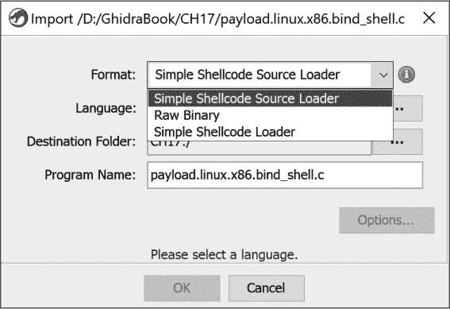

*图 17-17：Shellcode 源文件导入对话框*

选择此加载器，使用与之前示例相同的默认编译器/语言规范（`x86:LE:32:default:gcc`），并让 Ghidra 自动分析文件，结果如下所示的反汇编列表中的函数：

```
     **************************************************************

     *                         FUNCTION                           *

     **************************************************************

     undefined FUN_00000000()

        undefined AL:1 <RETURN>

        undefined4 Stack[-0x10]:4 local_10

     FUN_00000000                      XREF[1]: Entry Point(*)

00000000  XOR    EBX,EBX

00000002  MUL    EBX

00000004  PUSH   EBX

00000005  INC    EBX

00000006  PUSH   EBX
```

向下滚动查看列表，带我们到熟悉的内容（见 列表 17-2），此处显示的是（已添加注释以便理解）：

```
        LAB_00000032

00000032  PUSH   0x3f

00000034  POP    EAX

 00000035  INT    0x80

00000037  DEC    ECX

00000038  JNS    LAB_00000

0000003a  PUSH   0x68732f2f          ; 0x68732f2f converts to "//sh"

0000003f  PUSH   0x6e69622f          ; 0x6e69622f converts to "/bin"
```

大多数逆向工程工作集中在二进制文件上。在这种情况下，我们跳出了这个范畴，使用 Ghidra 加载 shellcode 进行分析，并从 C 源文件中提取 shellcode。我们的目标是展示为 Ghidra 创建加载器的灵活性和简便性。现在，让我们重新回到这个范畴，创建一个结构化文件格式的加载器。

假设我们的目标 shellcode 包含在一个 ELF 二进制文件中，并且为了这个示例，Ghidra 无法识别 ELF 二进制文件。此外，我们中的任何人都从未听说过 ELF 二进制文件。冒险开始吧。

### 示例 3：Simple ELF Shellcode Loader

恭喜！你现在是 shellcode 的常驻逆向工程专家，同事们报告他们怀疑某些二进制文件中包含 shellcode，并且 Ghidra 将它们转介给原始二进制文件加载器。由于这似乎不是一次性的问题，而且你认为很有可能会看到更多具有类似特征的二进制文件，因此你决定构建一个能够处理这种新文件类型的加载器。如 第十三章 中所讨论的，你可以使用 Ghidra 内部或外部的工具来捕获文件信息。如果你再次转向命令行，`file` 命令提供了有用的信息，帮助你开始构建加载器：

```
$ file elf_shellcode_min

  elf_shellcode_min: ELF 32-bit LSB executable, Intel 80386, version 1 (SYSV),

  statically linked, corrupted section header size

$
```

`file` 命令提供了你之前从未听说过的 ELF 格式的信息。你的第一步是进行一些研究，看看是否能找到有关这种二进制文件的任何信息。你的朋友 Google 会很高兴地为你指引几篇关于 ELF 格式的参考资料，你可以利用这些资料来找到构建加载器所需的信息。任何提供足够准确信息以解决问题的资源都可以使用。^(5)

由于这是一个比之前两个加载器示例更大的挑战，我们将其分解为与 Eclipse SimpleShellcode 模块中各个文件相关的部分，你需要创建、修改或删除这些文件以完成你的新 *SimpleELFShellcodeLoader*。我们将从一些简单的基本准备工作开始。

#### *基本准备工作*

第一步是在 Eclipse 中的 SimpleShellcode 模块内创建一个 *SimpleELFShellcodeLoader.java* 文件。由于你不想从零开始，你应该使用另存为功能创建这个新文件，文件名为 *SimpleShellcodeLoader.java*。完成这个步骤后，你需要对新文件进行一些小的修改，才能开始集中精力解决新的挑战：

+   将类名更改为 SimpleELFShellcodeLoader。

+   修改 `getTier` 方法的返回值，从 `UNTARGETED_LOADER` 改为 GENERIC_TARGET_LOADER。

+   删除 `getTierPriority` 方法。

+   修改 `getName` 方法以返回 "Simple ELF Shellcode Loader"。

一旦你完成了基本的准备工作，让我们应用你从研究中学到的关于新头部格式的信息。

#### *ELF 头部格式*

在研究这种新格式时，你发现 ELF 格式包含三种类型的头文件：文件头（或 ELF 头文件）、程序头和节头。你可以从专注于 ELF 头文件开始。每个 ELF 头文件中的字段都与一个偏移量以及其他关于该字段的信息相关联。由于你只需要访问其中的少数字段，并且不会修改偏移量，因此可以将以下常量作为实例变量声明在加载器类中，以帮助加载器正确解析这种新的头文件格式：

```
private final byte[] ELF_MAGIC            = {0x7f, 0x45, 0x4c, 0x46};

private final long EH_MAGIC_OFFSET        = 0x00;

private final long EH_MAGIC_LEN           = 4;

private final long EH_CLASS_OFFSET        = 0x04;

private final byte EH_CLASS_32BIT         = 0x01;

private final long EH_DATA_OFFSET         = 0x05;

private final byte EH_DATA_LITTLE_ENDIAN  = 0x01;

private final long EH_ETYPE_OFFSET        = 0x10;

private final long EH_ETYPE_LEN           = 0x02;

private final short EH_ETYPE_EXEC         = 0x02;

private final long EH_EMACHINE_OFFSET     = 0x12;

private final long EH_EMACHINE_LEN        = 0x02;

private final short EH_EMACHINE_X86       = 0x03;

private final long EH_EFLAGS_OFFSET       = 0x24;

private final long EN_EFLAGS_LEN          = 4;

private final long EH_EEHSIZE_OFFSET      = 0x28;

private final long EH_PHENTSIZE_OFFSET    = 0x2A;

private final long EH_PHNUM_OFFSET        = 0x2C;
```

在获取了 ELF 头文件的描述后，下一步是确定如何响应导入器的轮询，以确保新的 ELF 加载器只加载符合 ELF 格式的文件。在前两个示例中，shellcode 加载器并没有查看文件内容来判断是否能够加载一个文件。这大大简化了这些示例的编写。现在情况有点复杂。幸运的是，ELF 文档提供了重要的线索，帮助确定适当的加载器规范。

#### *查找支持的加载规范*

加载器无法加载任何不符合正确格式的文件，并且可以通过返回一个空的`loadSpecs`列表来拒绝任何文件。在`findSupportedLoadSpecs()`方法中，立即通过以下代码消除所有没有预期魔数的二进制文件：

```
byte[] magic = provider.readBytes(EH_MAGIC_OFFSET, EH_MAGIC_LEN);

if (!Arrays.equals(magic, ELF_MAGIC)) {

   // the binary is not an ELF

   return loadSpecs;

}
```

一旦排除了不需要的内容，加载器可以检查位宽和字节顺序，以查看架构是否适合 ELF 二进制文件。为了演示，我们进一步限制加载器接受的二进制文件类型为 32 位小端模式：

```
byte ei_class = provider.readByte(EH_CLASS_OFFSET);

byte ei_data = provider.readByte(EH_DATA_OFFSET);

if ((ei_class != EH_CLASS_32BIT) || (ei_data != EH_DATA_LITTLE_ENDIAN)) {

   // not an ELF we want to accept

   return loadSpecs;

}
```

为了完善验证过程，以下代码检查是否为 x86 架构的 ELF 可执行文件（与共享库不同）：

```
byte[] etyp = provider.readBytes(EH_ETYPE_OFFSET, EH_ETYPE_LEN);

short e_type =

      ByteBuffer.wrap(etyp).order(ByteOrder.LITTLE_ENDIAN).getShort();

byte[] emach = provider.readBytes(EH_EMACHINE_OFFSET, EH_EMACHINE_LEN);

short e_machine =

      ByteBuffer.wrap(emach).order(ByteOrder.LITTLE_ENDIAN).getShort();

if ((e_type != EH_ETYPE_EXEC) || (e_machine != EH_EMACHINE_X86)) {

   // not an ELF we want to accept

   return loadSpecs;

}
```

现在你已经限制了文件类型，你可以查询意见服务以匹配语言和编译器规范。从概念上讲，你是用从加载的文件中提取的值（例如，ELF 头文件中的`e_machine`字段）查询意见服务，作为响应，你将收到一个语言/编译器规范的列表，加载器愿意接受这些规范。（查询意见服务时后台进行的操作将在以下章节中详细描述。）

```
byte[] eflag = provider.readBytes(EH_EFLAGS_OFFSET, EN_EFLAGS_LEN);

int e_flags = ByteBuffer.wrap(eflag).order(ByteOrder.LITTLE_ENDIAN).getInt();

List<QueryResult> results =

     QueryOpinionService.query(getName(), Short.toString(e_machine),

                               Integer.toString(e_flags));
```

假设意见服务可能会返回比你希望此加载器处理的结果更多的内容。你可以通过基于相关语言/编译器规范中指定的属性进一步缩小列表。以下代码过滤掉了一个编译器和一个处理器变种：

```
for (QueryResult result : results) {

   CompilerSpecID cspec = result.pair.getCompilerSpec().getCompilerSpecID();

   if (cspec.toString().equals("borlanddelphi"➊)) {

      // ignore anything created by Delphi

      continue;

   }

   String variant = result.pair.getLanguageDescription().getVariant();

   if (variant.equals("System Management Mode"➋)) {

       // ignore anything where the variant is "System Management Mode"

       continue;

   }

   // valid load spec, so add it to the list

 ➌ loadSpecs.add(new LoadSpec(this, 0, result));

}

return loadSpecs;
```

上述示例（你可以自由地将其包括在加载器中）特别排除了*Delphi 编译器* ➊和*x86 系统管理模式* ➋。你也可以排除其他的。如果你没有排除的所有结果，都需要添加到`loadSpecs`列表中 ➌。

#### *将文件内容加载到 Ghidra 中*

你简化版加载器的`load()`方法假设文件包含一个最小的 ELF 头和一个简短的程序头，后面是 shellcode 的文本部分。你需要确定头部的总长度，以便为其分配正确的空间。以下代码通过使用 ELF 头中的 `EH_EEHSIZE_OFFSET`、`EH_PHENTSIZE_OFFSET` 和 `EH_PHNUM_OFFSET` 字段来确定所需的大小：

```
// Get some values from the header needed for the load process

//

// How big is the ELF header?

 byte[] ehsz = provider.readBytes(EH_EEHSIZE_OFFSET, 2);

e_ehsize = ByteBuffer.wrap(ehsz).order(ByteOrder.LITTLE_ENDIAN).getShort();

// How big is a single program header?

byte[] phsz = provider.readBytes(EH_PHENTSIZE_OFFSET, 2);

e_phentsize =

      ByteBuffer.wrap(phsz).order(ByteOrder.LITTLE_ENDIAN).getShort();

// How many program headers are there?

byte[] phnum = provider.readBytes(EH_PHNUM_OFFSET, 2);

e_phnum = ByteBuffer.wrap(phunm).order(ByteOrder.LITTLE_ENDIAN).getShort();

// What is the total header size for our simplified ELF format

// (This includes the ELF Header plus program headers.)

long hdr_size = e_ehsize + e_phentsize * e_phnum;
```

现在你知道了大小，按照以下方式创建并填充 ELF 头部区域和文本区域的内存块：

```
// Create the memory block for the ELF header

long LOAD_BASE = 0x10000000;  

Address hdr_start_adr = flatAPI.toAddr(LOAD_BASE);

MemoryBlock hdr_block =

      flatAPI.createMemoryBlock(".elf_header", hdr_start_adr,

                                 provider.readBytes(0, hdr_size), false);

// Make this memory block read-only

hdr_block.setRead(true);

hdr_block.setWrite(false);

hdr_block.setExecute(false);

// Create the memory block for the text from the simplified ELF binary

Address txt_start_adr = flatAPI.toAddr(LOAD_BASE + hdr_size);

MemoryBlock txt_block =

      flatAPI.createMemoryBlock(".text", txt_start_adr,

             provider.readBytes(hdr_size, provider.length() – hdr_size),

             false);

// Make this memory block read & execute

txt_block.setRead(true);

txt_block.setWrite(false);

txt_block.setExecute(true);
```

#### *格式数据字节并添加入口点*

再做几步，你就完成了。加载器通常会应用数据类型并为从文件头中派生的信息创建交叉引用。加载器的工作还包括识别二进制文件中的任何入口点。在加载时创建入口点列表，能为反汇编器提供它应该视为代码的位置列表。我们的加载器遵循以下做法：

```
  // Add structure to the ELF HEADER

➊ flatAPI.createData(hdr_start_adr, new ElfDataType());

 // Add label and entry point at start of shellcode

➋ flatAPI.createLabel(txt_start_adr, "shellcode", true);

➌ flatAPI.addEntryPoint(txt_start_adr);

  // Add a cross reference from the ELF header to the entrypoint

  Data d = flatAPI.getDataAt(hdr_start_adr).getComponent(0).getComponent(9);

➍ flatAPI.createMemoryReference(d, txt_start_adr, RefType.DATA);
```

首先，在 ELF 头部的开始应用 Ghidra ELF 头数据类型 ➊。^(6) 其次，为 shellcode 创建一个标签 ➋ 和入口点 ➌。最后，我们在 ELF 头的入口点字段和 shellcode 开始之间创建一个交叉引用 ➍。

恭喜！你已经完成了加载器的 Java 代码编写，但我们需要解决几个问题，以确保你理解新加载器与一些重要相关文件之间的所有依赖关系，以便加载器能够按预期正常运行。

这个示例利用了现有的处理器架构（x86），并且在幕后做了一些工作，帮助加载器正确运行。回想一下，导入器轮询了加载器并神奇地生成了可接受的语言/编译器规范。以下两个文件提供了对加载器至关重要的信息。第一个文件是 x86 语言定义文件 *x86.ldefs*，是 x86 处理器模块的一部分。

#### *语言定义文件*

每个处理器都有一个关联的语言定义文件。这个 XML 格式的文件包含生成处理器语言/编译器规范所需的所有信息。满足 32 位 ELF 二进制文件要求的来自 *x86.ldefs* 文件的语言定义如下所示：

```
<language processor="x86"

          endian="little"

          size="32"

          variant="default"

          version="2.8"

          slafile="x86.sla"

          processorspec="x86.pspec"

          manualindexfile="../manuals/x86.idx"

          id="x86:LE:32:default">

   <description>Intel/AMD 32-bit x86</description>

   <compiler name="Visual Studio" spec="x86win.cspec" id="windows"/>

   <compiler name="gcc" spec="x86gcc.cspec" id="gcc"/>

   <compiler name="Borland C++" spec="x86borland.cspec" id="borlandcpp"/>

 ➊ <compiler name="Delphi" spec="x86delphi.cspec" id="borlanddelphi"/>

</language>

<language processor="x86"

          endian="little"

          size="32"

        ➋ variant="System Management Mode"

          version="2.8"

          slafile="x86.sla"

          processorspec="x86-16.pspec"

          manualindexfile="../manuals/x86.idx"

          id="x86:LE:32:System Management Mode">

   <description>Intel/AMD 32-bit x86 System Management Mode</description>

   <compiler name="default" spec="x86-16.cspec" id="default"/>

</language>
```

这个文件用于填充作为导入选项呈现的推荐语言/编译器规范。在这种情况下，有五个推荐规范（每个以 `compiler` 标签开头），这些规范将根据与 ELF 二进制文件相关的信息返回，但我们的加载器会根据编译器 ➊ 和变种 ➋ 排除其中两个。

#### *意见文件*

另一种类型的支持文件是*.opinion*文件。这是一个 XML 格式的文件，包含与你的加载器相关的约束。为了让意见查询服务识别，每个加载器必须在意见文件中有一个条目。以下列出了你刚刚构建的加载器的合适意见文件条目：

```
<opinions>

   <constraint loader="Simple ELF Shellcode Loader" compilerSpecID="gcc">

      <constraint➊ primary➋="3" processor="x86"  endian="little" size="32" />

      <constraint primary="62" processor="x86"  endian="little" size="64" />

   </constraint>

</opinions>
```

入口中的所有内容应该是熟悉的，除了可能的`primary`字段 ➋。该字段是用于搜索的主键，用于标识在 ELF 头中定义的机器类型。在 ELF 头中，`e_machine`字段中的值`0x03`表示 x86，而`0x3E`表示 amd64。`<constraint>`标签 ➊定义了主键（`"3"`/x86）和`<constraint>`标签其余属性之间的关联。这些信息由查询服务用于定位语言定义文件中的相关条目。

我们唯一剩下的任务是将我们的意见数据放置在一个合适的位置，确保 Ghidra 能够找到它。唯一随 Ghidra 一起发布的意见文件位于 Ghidra 处理器模块的*data/languages*子目录下。尽管你可以将意见数据插入到现有的意见文件中，但最好避免修改任何处理器的意见文件，因为每次升级 Ghidra 安装时，你的修改都需要重新应用。

相反，创建一个新的意见文件，包含我们的意见数据。你可以将文件命名为任何你喜欢的名字，但*SimpleShellcode.opinion*似乎是合理的。我们的 Eclipse 加载器模块模板包含它自己的*data*子目录。将你的意见文件保存在这个位置，这样它将与加载器模块关联。Ghidra 在查找意见文件时会定位到它，而且 Ghidra 的任何升级都不应该影响你的模块。

现在你了解了幕后发生的事情，是时候测试你的加载器，看看它是否按预期运行了。

#### *结果*

为了展示新的简化 ELF 加载器（一个程序头，没有节区）的成功，让我们逐步了解加载过程，并观察加载器在每个步骤中的表现。

从 Ghidra 项目窗口导入一个文件。导入器将扫描所有 Ghidra 的加载器，包括你自己的，看看哪些加载器愿意加载该文件。回顾一下，你的加载器期待的是符合以下配置文件的文件：

+   文件开始时的 ELF 魔数

+   32 位小端

+   x86 架构的 ELF 可执行文件

+   不能由 Delphi 编译

+   不能有“系统管理模式”变体

如果你加载了一个符合该配置文件的文件，你应该会看到类似于图 17-18 的导入对话框，显示出愿意处理该文件的加载器的优先列表。

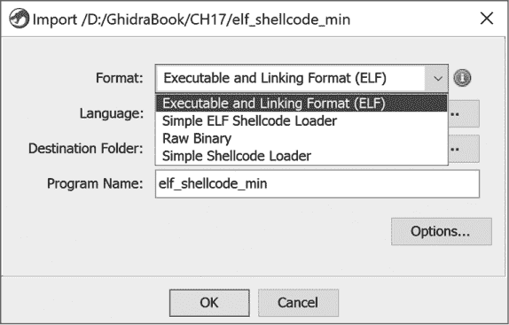

*图 17-18：elf_shellcode_min 的导入选项*

优先级最高的加载器是 Ghidra 的 ELF 加载器。让我们将它接受的语言/编译器规范与新加载器在图底部接受的规范进行比较（见 图 17-19）。

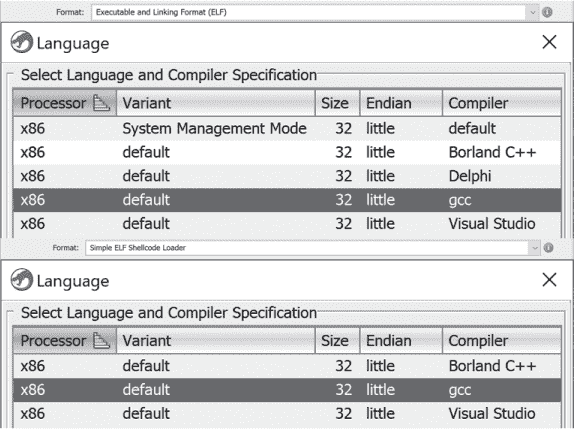

*图 17-19：两种不同加载器的可接受语言/编译器规范*

Delphi 编译器和系统管理模式变种被标准 ELF 加载器接受，但不被你的加载器接受，因为它们已被过滤掉。当你选择加载器加载文件 *elf_shellcode_min* 时，你应该会看到类似于 图 17-20 的汇总信息。

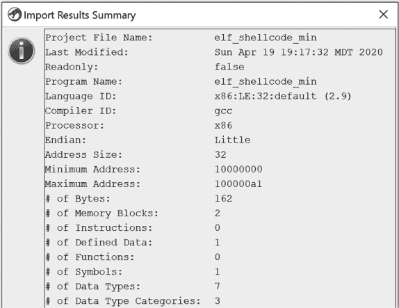

*图 17-20：新 ELF Shellcode 加载器的导入结果汇总窗口*

如果你在 CodeBrowser 中打开文件，并允许 Ghidra 自动分析该文件，你应该会在文件顶部看到以下 ELF 头部定义：

```
10000000 7f             db      7Fh          e_ident_magic_num

10000001 45 4c 46       ds      "ELF"        e_ident_magic_str

10000004 01             db      1h           e_ident_class

10000005 01             db      1h           e_ident_data

10000006 01             db      1h           e_ident_version

10000007 00 00 00 00 00 db[9]                e_ident_pad

         00 00 00 00

10000010 02 00          dw      2h           e_type

10000012 03 00          dw      3h           e_machine

10000014 01 00 00 00    ddw     1h           e_version

10000018 54 00 00 10    ddw     shellcode➊  e_entry

1000001c 34 00 00 00    ddw     34h          e_phoff

10000020 00 00 00 00    ddw     0h           e_shoff

10000024 00 00 00 00    ddw     0h           e_flags

10000028 34 00          dw      34h          e_ehsize
```

在列表中，`shellcode` 标签 ➊ 显然与入口点相关。双击 `shellcode` 标签会带你进入一个名为 `shellcode` 的函数，里面包含了我们在之前两个示例中看到的相同的 shellcode 内容，包括以下内容：

```
1000008c  JNS    LAB_10000086

1000008e  PUSH   "//sh"

10000093  PUSH   "/bin"

10000098  MOV    EBX,ESP

1000009a  PUSH   EAX
```

现在你已经确认新加载器正常工作，可以将其作为扩展添加到 Ghidra 安装中，并与那些一直在期待此功能的同事分享。

### 总结

在本章中，我们集中讨论了处理未识别的二进制文件所面临的挑战。我们通过加载和分析过程的示例，展示了可以在 Ghidra 中使用的方法，以帮助我们解决这些具有挑战性的逆向工程场景。最后，我们将模块创建能力扩展到 Ghidra 加载器的领域。

虽然我们构建的示例非常简单，但它们为编写更复杂的加载器模块提供了基础，并介绍了在 Ghidra 中编写这些模块所需的所有组件。在下一章中，我们将通过介绍处理器模块来完成对 Ghidra 模块的讨论——这些模块在反汇编二进制文件的整体格式化中起着最重要的作用。
