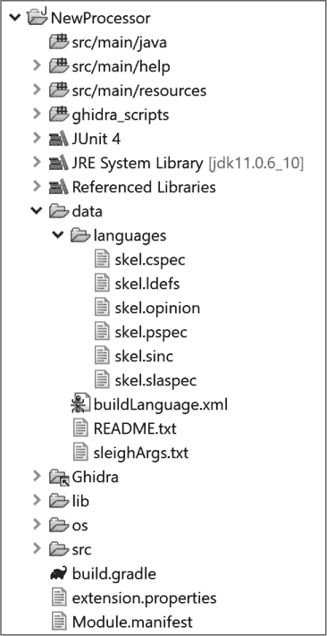
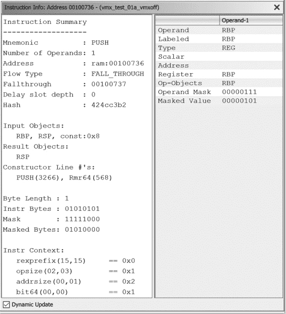
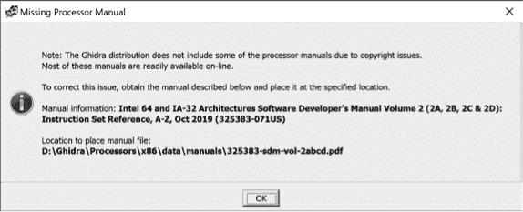
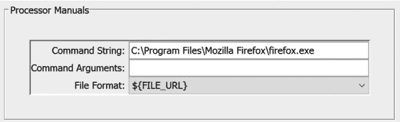
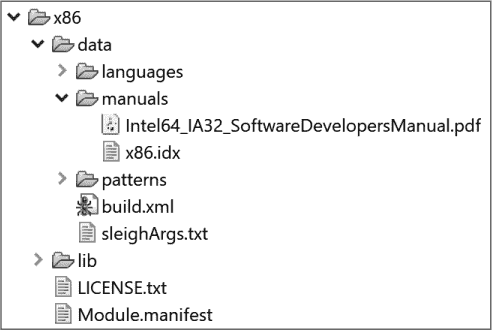
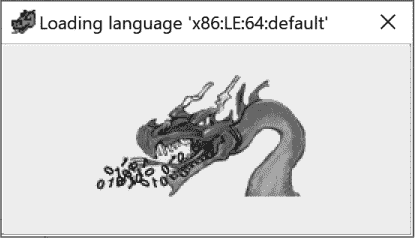
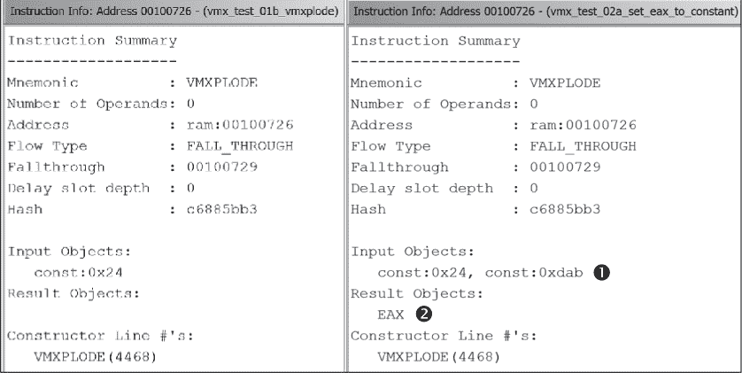
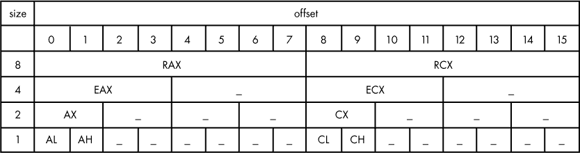
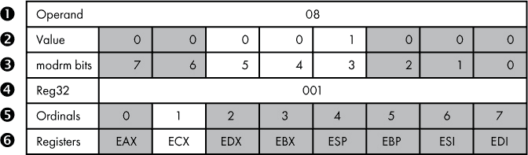
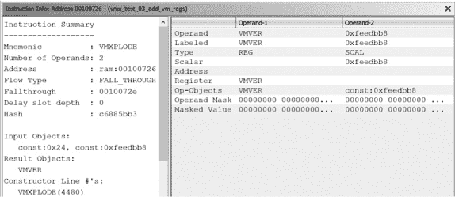

# 第二十一章：**Ghidra 处理器**


处理器模块是 Ghidra 中最复杂的模块类型，负责 Ghidra 中所有的反汇编操作。除了将机器语言操作码转换为其汇编语言等价物外，处理器模块还支持创建函数、交叉引用和堆栈框架。

尽管 Ghidra 支持的处理器数量令人印象深刻，并且每次发布新版本时都会增加，但在某些情况下，仍然需要开发一个新的 Ghidra 处理器模块。开发处理器模块的显而易见的情况是逆向工程一个在 Ghidra 中没有处理器模块的二进制文件。除此之外，这样的二进制文件可能代表了嵌入式微控制器的固件镜像，或是从手持设备或物联网（IoT）设备中提取的可执行镜像。一个不太明显的使用场景是反汇编嵌入在模糊化的 x86 可执行文件中的自定义虚拟机指令。在这种情况下，现有的 Ghidra x86 处理器模块只能帮助你理解虚拟机本身，而无法理解虚拟机底层的字节码。

如果你决定承担这项艰巨的任务，我们希望确保你拥有一个坚实的基础来帮助你完成这一工作。我们之前的每个模块示例（分析器和加载器）都只需要修改一个 Java 文件。如果你在 Eclipse GhidraDev 环境中创建了这些模块，你会在每个模板中获得一个模块模板和任务标签，以帮助你完成任务。处理器模块更为复杂，不同文件之间的关系必须得到保持，才能使处理器模块正确工作。虽然在本章中我们不会从零开始构建一个处理器模块，但我们将为你提供一个坚实的基础，帮助你理解 Ghidra 处理器模块，并演示如何创建和修改这些模块中的组件。

**谁可能会扩展 Ghidra？**

根据一项完全不科学的研究，我们强烈怀疑以下几类人群的存在：

**分类 1** 使用 Ghidra 的少部分人会修改或编写脚本，以自定义或自动化与 Ghidra 相关的某些功能。

**分类 2** 在分类 1 中，有一小部分人会选择修改或开发插件，以自定义 Ghidra 相关的一些功能。

**分类 3** 在分类 2 中，更小的一部分人会选择修改或编写分析器，以扩展 Ghidra 的分析功能。

**分类 4** 在分类 3 中，有一小部分人会选择修改或编写一个加载器来支持新的文件格式。

**类别 5** 类别 4 中的*极少数*人会选择修改或编写 Ghidra 处理器模块，因为需要解码的指令集数量远少于使用这些指令集的文件格式数量。因此，新处理器模块的需求相对较低。

随着你深入类别列表，相关任务的性质往往变得越来越专业化。然而，仅仅因为你现在无法设想自己编写 Ghidra 处理器模块，并不意味着学习它们是如何构建的没有任何意义。处理器模块构成了 Ghidra 的反汇编、汇编和反编译功能的基础，了解它们的内部工作原理可能会让你在同事眼中成为 Ghidra 的高手。

### 理解 Ghidra 处理器模块

为一个真实架构创建处理器模块是一个高度专业化、耗时的工作，超出了本书的范围。然而，了解处理器及其相关指令集如何在 Ghidra 中表示，将有助于你识别需要查看的地方，这样当你需要有关 Ghidra 处理器模块的信息时，你可以轻松地获得所需资源。

#### *Eclipse 处理器模块*

我们将从稍微熟悉的领域开始。当你使用 Eclipse ▸ GhidraDev 创建一个处理器模块时，生成的文件夹结构基本上与其他模块类型相同，但处理器模块不会像其他模块那样在*src/main/java*文件夹中提供一个完整的 Java 源文件，包括注释、任务标签和`TODO`列表，如图 18-1 所示。



*图 18-1：处理器模块内容*

相反，*data* 文件夹（如图所示）包含的内容远超其他模块类型的*README.txt*文件。我们将简要介绍*data*文件夹中的九个文件，并重点关注它们的文件扩展名。（*skel*前缀让我们知道我们正在处理一个骨架文件。）

***skel.cspec*** 这是一个 XML 格式的、初看可能令人不知所措的编译器规范文件。

***skel.ldefs*** 这是一个 XML 格式的语言定义文件。骨架文件中包含了一个注释掉的模板，用于定义语言。

***skel.opinion*** 这是一个 XML 格式的导入器意见文件。骨架文件中包含了一个注释掉的模板，用于定义语言/编译器规范。

***skel.pspec*** 这是一个 XML 格式的处理器规范文件。

***skel.sinc*** 这通常是一个 SLEIGH 语言指令文件。^(1)

***skel.slaspec*** 这是一个 SLEIGH 规范文件。

***buildLanguage.xml*** 这个 XML 文件描述了*data/languages*目录中文件的构建过程。

***README.txt*** 该文件在所有模块中相同，但在本模块中它终于变得有意义，因为它专注于 *data/* 目录的内容。

***sleighArgs.txt*** 该文件包含 SLEIGH 编译器选项。

*.ldefs* 和 *.opinion* 文件在构建 第十七章 中的 ELF shellcode 加载器时使用过。其他文件扩展名将在你进行示例时逐步呈现。你将学习如何使用这些文件来修改处理器模块，但首先让我们讨论一个特定于处理器模块的新术语——SLEIGH。

#### *SLEIGH*

*SLEIGH* 是一个特定于 Ghidra 的语言，用于描述微处理器指令集，以支持 Ghidra 的反汇编和反编译过程。^(2) *languages* 目录中的文件（见 图 18-1）要么是用 SLEIGH 编写的，要么是 XML 格式的，因此你一定需要了解一些 SLEIGH 语言，以便创建或修改处理器模块。

指令如何编码以及处理器如何解释它们的规范包含在一个 *.slaspec* 文件中（有点类似于 *.c* 文件的作用）。当一个处理器家族有多个不同变体时，每个变体可能有自己的 *.slaspec* 文件，而变体之间的公共行为可能被提取到单独的 *.sinc* 文件中（类似于 *.h* 文件的作用），这些 *.sinc* 文件可以在多个 *.slaspec* 文件中引用。Ghidra 的 ARM 处理器就是一个很好的例子，它有十多个 *.slaspec* 文件，每个文件都引用一个或多个 *.sinc* 文件。这些文件构成了处理器模块的 SLEIGH 源代码，SLEIGH 编译器的工作是将它们编译成适用于 Ghidra 的 *.sla* 文件。

我们不会从理论角度深入探讨 SLEIGH，而是会在遇到并需要它们的示例中介绍 SLEIGH 语言的各个组成部分，但首先让我们看一下 SLEIGH 文件中包含的有关指令的信息。

要查看与 CodeBrowser 列表中的指令相关的附加信息，请右键单击并从上下文菜单中选择 **Instruction Info**。显示的信息来源于 SLEIGH 文件规范中所选指令的定义。图 18-2 显示了 x86-64 `PUSH` 指令的 Instruction Info 窗口。



*图 18-2: x86-64* PUSH *指令的 Instruction Info 窗口*

Instruction Info 窗口结合了来自 SLEIGH 文件的 `PUSH` 指令信息，以及 `PUSH` 在地址 `00100736` 处的具体使用细节。在本章后面，我们将处理 SLEIGH 文件中的指令定义，并将在我们处理的指令上下文中重新审视此窗口。

#### *处理器手册*

处理器制造商提供的文档是获取指令集信息的重要资源。虽然这些版权材料不能包含在你的 Ghidra 分发版中，但你可以通过在列表窗口中右键单击来轻松地将它们集成。如果你右键单击任何指令并选择“处理器手册”，你可能会看到类似于图 18-3 所示的消息，告知你当前处理器的手册无法在预期位置找到。



*图 18-3：缺失处理器手册对话框*

在这里，Ghidra 为你提供了处理缺失手册情况所需的信息。在这个具体的例子中，你首先需要在线找到 x86 手册，然后按照指定的名称和位置将其保存。

**注意**

*有许多与 x86 相关的处理器手册。通过搜索手册信息末尾提供的标识符，你可以在线找到正确的手册：* 325383-060US。

一旦你正确安装了手册，选择“处理器手册”将会显示该手册。由于处理器手册通常很大（例如，这本 x86 处理器手册几乎有 2200 页），Ghidra 非常贴心地包含了处理索引文件的功能，这些索引文件将指令映射到手册中的特定页面。幸运的是，x86 手册的索引已经为你创建好了。

处理器手册应放置在适合你处理器的*Ghidra/Processors/<proc>/data/manuals*目录中。索引文件应与其关联的手册放在同一目录中。索引文件的格式相对简单。Ghidra 的*x86.idx*文件的前几行如下所示：

```
@Intel64_IA32_SoftwareDevelopersManual.pdf [Intel 64 and IA-32 Architectures

     Software Developer's Manual Volume 2 (2A, 2B, 2C & 2D): Instruction Set

     Reference, A-Z, Sep 2016 (325383-060US)]

AAA, 120

AAD, 122

BLENDPS, 123

AAM, 124
```

文件中的第一行（在本例中已分成三行显示）将手册的本地文件名与当手册在系统中不可用时显示给用户的描述性文本配对。该行的格式如下：

```
@FilenameInGhidraManualDirectory [Description of manual file]
```

每一行额外的内容都应采用 INSTRUCTION, page 的格式。指令必须是大写字母，页码从*.pdf*文件的第一页开始计算。（这不一定是文档上任何给定页面显示的页码。）

可以在一个*.idx*文件中引用多个手册。只需使用额外的`@`指令来区分每个手册的指令映射。有关处理器手册索引文件的更多信息，请参见你的 Ghidra 安装目录中的*docs/languages/manual_index.txt*。

一旦你保存并索引了手册，在列表窗口中选择任何指令的处理器手册应该会将你带到该指令在手册中的对应页面。如果手册没有出现，你可能需要选择 编辑 ▸ 工具选项 ▸ 处理器手册 来配置适当的查看器应用程序来查看手册。一个示例查看器设置，用于通过 Firefox 打开手册，如图 18-4 所示。



*图 18-4：处理器手册工具选项*

现在你已经掌握了一些基本的处理器模块术语，是时候深入了解处理器模块实现的内部结构了。

### 修改 Ghidra 处理器模块

从头开始构建一个处理器模块是一个重大的任务。我们将不像直接跳入其中，而是像以前的示例一样，从修改现有模块开始。由于我们希望展示与实际问题相关的概念，因此我们将从识别一个假设的问题开始，涉及 Ghidra 的 x86 处理器模块。我们将逐步解决这个问题，并使用我们学到的知识来创建一个完整的 Ghidra 处理器模块的宏观视图，展示各种组件如何协同工作。

**GHIDRA 的 SLEIGH 编辑器**

为了帮助你修改和构建处理器模块，Ghidra 包含一个 SLEIGH 编辑器，能够轻松集成到 Eclipse 环境中。编辑器的安装说明包含在前一节提到的 SLEIGH *readme*文件中，并且只需要几个步骤。编辑器支持的特殊功能包括以下内容：

**语法高亮** 为具有特殊含义的内容上色（例如，注释、标记、字符串、变量等）。

**验证** 标记许多语法错误，并为那些在编译之前无法检测到的错误生成警告。

**快速修复** 提供针对编辑器检测到的问题的解决建议。（这类似于我们在第十五章中看到的`import`语句的 QuickFix 选项。）

**悬停** 当你将鼠标悬停在某个构造上时，会提供该构造的附加信息。

**导航** 提供特定于 SLEIGH 的导航功能（例如，子构造器、标记、寄存器、pcode 操作等）。

**查找引用** 快速找到一个变量的所有使用。

**重命名** 不同于传统的基于字符串的查找和替换，这会在文件及其他相关的*.sinc*和*.slaspec*文件中重命名实际的变量。

**代码格式化** 根据 SLEIGH 语言的结构重新格式化文件（例如，根据关键字对构造器进行对齐、对 attach 中的条目进行对齐等）。该功能可以应用于整个文件或选定的部分。

虽然我们推荐使用这个编辑器，特别是它在早期语法检查方面的帮助，但本章中的示例开发并不特定于此编辑器。

#### *问题陈述*

在本地安装的*Ghidra/Processors*目录中快速搜索后，我们发现 x86 处理器模块包含许多指令，但似乎缺少一个假设的虚拟机扩展（VMX）管理指令，适用于 IA32 和 IA64 架构。^(3) 这个指令（我们刚刚为这个示例发明的）叫做`VMXPLODE`。它的行为类似于 Ghidra 支持的`VMXOFF`指令。虽然现有的`VMXOFF`指令会让处理器退出 VMX 操作，`VMXPLODE`则会以一种炫酷的方式退出！我们将带你一步一步地将这个非常重要的指令添加到现有的 Ghidra x86 处理器模块中，以介绍一些与构建和修改处理器模块相关的概念。

#### *示例 1：向处理器模块添加指令*

我们的第一个目标是找到需要修改的文件，以支持`VMXPLODE`指令。*Ghidra/Processors*目录包含所有 Ghidra 支持的处理器的子目录，其中之一是 x86。你可以直接在 Eclipse 中打开 x86 处理器模块（或任何其他处理器模块），方法是使用文件 ▸ 从文件系统或归档中打开项目，并提供处理器文件夹的路径（*Ghidra/Processors/x86*）。这将把你的 Eclipse 实例链接到 Ghidra 的 x86 处理器模块，这意味着你在 Eclipse 中所做的更改将直接反映到你的 Ghidra 处理器模块中。

一个在 Eclipse 中部分展开的 x86 模块，准确反映了相关的 Ghidra 目录结构，见图 18-5。你下载的处理器手册与 x86 索引文件一起存在。



*图 18-5：Eclipse 包浏览器中的 x86 处理器模块*

*x86*文件夹包含一个*data*文件夹，就像你在使用 Eclipse ▸ GhidraDev 创建的处理器模块中看到的那样。在这个文件夹中有一个*languages*文件夹，里面包含 40 多个文件，其中包括 19 个*.sinc*文件，定义了语言指令。由于 x86 指令集相当庞大，因此该指令集被分割成几个文件，每个文件分组相似的指令。如果我们要向 Ghidra 添加一组新的指令（例如，x86 的`SGX`指令集），我们可能会创建一个新的*.sinc*文件来将它们全部集中在一起。（实际上，`SGX`指令被分组在一个名为*sgx.sinc*的公共文件中。这就解释了许多*.sinc*文件之一！）

通过搜索*.sinc*文件，我们发现*ia.sinc*包含现有`VMX`指令集的定义。我们将使用*ia.sinc*中`VMXOFF`的定义作为模板来定义`VMXPLODE`。`VMXOFF`在*ia.sinc*中的两个不同部分被引用。第一个部分是 Intel IA 硬件辅助虚拟化指令的定义：

```
# MFL: definitions for Intel IA hardware assisted virtualization instructions

define pcodeop invept;   # Invalidate Translations Derived from extended page

                         # tables (EPT); opcode 66 0f 38 80

# -----CONTENT OMITTED HERE-----

define pcodeop vmread;   # Read field from virtual-machine control structure;

                         # opcode 0f 78

define pcodeop vmwrite;  # Write field to virtual-machine control structure;

                         # opcode 0f 79

define pcodeop vmxoff;   # Leave VMX operation; opcode 0f 01 c4

define pcodeop vmxon;    # Enter VMX operation; opcode f3 0f C7 /6
```

定义部分中的每一项都定义了一个 pcodeop，这是 x86 架构的新微代码操作。

该定义包括一个名称，在这种情况下，还有一个包含描述和操作码的注释。我们需要为我们的新指令填写注释。经过快速的另类现实网络搜索（并进行了测试）确认，操作码`0f 01 c5`早已为`VMXPLODE`保留。现在我们有了必要的信息，可以将新指令添加到文件中。以下是我们在上下文中的新定义：

```
define pcodeop vmxoff;   # Leave VMX operation; opcode 0f 01 c4

define pcodeop vmxplode; # Explode (Fake) VMX operation; opcode 0f 01 c5

define pcodeop vmxon;    # Enter VMX operation; opcode f3 0f C7 /6
```

我们在*ia.sinc*中遇到的第二个位置`VMXOFF`（我们将在此插入新指令）是操作码定义部分。（为了清晰起见，我们省略了部分内容，并将一些指令定义行进行了换行处理以提高可读性。）尽管我们不会完全剖析*ia.sinc*文件中 8000 多行的代码，但有几个有趣的要点值得注意：

```
# Intel hardware assisted virtualization opcodes

# -----CONTENT OMITTED HERE-----

# TODO: invokes a VM function specified in EAX➊

:VMFUNC EAX     is vexMode=0 & byte=0x0f; byte=0x01; byte=0xd4 & EAX     { vmfunc(EAX); }

# TODO: this launches the VM managed by the current VMCS. How is the

#       VMCS expressed for the emulator?  For Ghidra analysis?

:VMLAUNCH       is vexMode=0 & byte=0x0f; byte=0x01; byte=0xc2           { vmlaunch(); }

# TODO: this resumes the VM managed by the current VMCS. How is the

#       VMCS expressed for the emulator?  For Ghidra analysis?

:VMRESUME       is vexMode=0 & byte=0x0f; byte=0x01; byte=0xc3           { vmresume(); }

# -----CONTENT OMITTED HERE-----

:VMWRITE Reg32, rm32 is vexMode=0 & opsize=1 & byte=0x0f; byte=0x79;➋

         rm32 & Reg32 ... & check_Reg32_dest ... { vmwrite(rm32,Reg32); build check_Reg32_dest; }

@ifdef IA64➌

:VMWRITE Reg64, rm64 is vexMode=0 & opsize=2 & byte=0x0f;  byte=0x79;

         rm64 & Reg64 ...    { vmwrite(rm64,Reg64); }

@endif

:VMXOFF         is vexMode=0 & byte=0x0f; byte=0x01; byte=0xc4         { vmxoff(); }➍

 :VMXPLODE       is vexMode=0 & byte=0x0f; byte=0x01; byte=0xc5         { vmxplode(); }➎

# -----CONTENT OMITTED HERE-----

#END of changes for VMX opcodes
```

`TODO`注释➊，在许多 Ghidra 文件中找到，标识了尚未完成的任务。在 Ghidra 文件中搜索`TODO`任务是发现为这个开源项目贡献机会的好方法。

接下来，我们看到 32 位➋和 64 位架构的`VMWRITE`指令。64 位指令被一个测试➌包围，确保它只包含在 64 位*.sla*文件中。尽管 32 位指令在 64 位环境下是有效的（例如，`EAX`是`RAX`的 32 位最低有效位），但反之则不成立。条件语句确保操作 64 位寄存器的指令仅包含在 64 位构建中。

`VMXOFF`指令➍并不直接涉及寄存器，因此不需要区分 32 位和 64 位版本的指令。我们新指令`VMXPLODE` ➎的构造函数（包含其新操作码）与`VMXOFF`的构造函数非常相似。让我们将这一行的组件分解：

:VMXPLODE

这是正在定义的指令，并显示在反汇编清单中。

是 vexMode=0 & byte=0x0f; byte=0x01; byte=0xc5

这些是与指令相关的比特模式，并为该指令提供了约束条件。`&`代表逻辑与操作。分号有着双重作用，既用于连接，也用于逻辑与。这部分的意思是：“如果我们不处于 VEX 模式，并且操作码按此顺序为这 3 个字节，那么该约束条件满足。”^(4)

{ vmxplode(); }

花括号用于括起指令的语义动作部分。SLEIGH 编译器将这些动作转换为一种称为 p-code 的 Ghidra 内部形式（在本章后面讨论）。定义指令需要理解 SLEIGH 操作符和语法。构造函数的这一部分，执行大多数指令相关的实际工作，可以迅速变成一个由分号分隔的多个语句的复杂序列。在这种情况下，由于我们已将`VMXPLODE`定义为新的 p-code 操作（`define pcodeop vmxplode;`），我们可以在此调用该指令。在以后的示例中，我们将向这一部分添加额外的 SLEIGH 语义动作。

最大的 x86*.sinc*文件是*ia.sinc*，因为在该文件中定义了许多指令（包括我们的新`VMXPLODE`指令），以及大量定义 x86 处理器属性的内容（例如字节序、寄存器、上下文、标记、变量等）。*ia.sinc*中的许多 x86 特定内容没有在该目录中的其他*.sinc*文件中复制，因为所有*.sinc*文件都被包含在 SLEIGH 规范（*.slaspec*）文件中。

两个 x86 的*.slaspec*文件，*x86.slaspec*和*x86-64.slaspec*，每个文件都包含了对所需*.sinc*文件的`include`语句。（请注意，你可以省略使用*.sinc*文件，直接在*.slaspec*文件中包含内容，这对于具有较小指令集的处理器来说可能更有意义。）*x86-64.slaspec*的内容如下所示：

```
  @define IA64 "IA64"         # Only in x86-64.slaspec

➊ @include "ia.sinc"

  @include "avx.sinc"

  @include "avx_manual.sinc"

  @include "avx2.sinc"

  @include "avx2_manual.sinc"

  @include "rdrand.sinc"      # Only in x86-64.slaspec

  @include "rdseed.sinc"      # Only in x86-64.slaspec

  @include "sgx.sinc"         # Only in x86-64.slaspec

  @include "adx.sinc"

  @include "clwb.sinc"

  @include "pclmulqdq.sinc"

  @include "mpx.sinc"

  @include "lzcnt.sinc"

  @include "bmi1.sinc"

  @include "bmi2.sinc"

  @include "sha.sinc"

  @include "smx.sinc"

  @include "cet.sinc"

  @include "fma.sinc"         # Only in x86-64.slaspec
```

我们已添加 EOL 注释，以标示出* x86-64.slaspec*文件中特有的内容。（*x86.slaspec*文件是*x86-64.slaspec*文件的一个子集。）在包含的文件中有*ia.sinc* ➊，其中我们定义了`VMXPLODE`，因此无需添加任何内容。如果你创建一个新的*.sinc*文件，你需要在* x86.slaspec*和*x86-64.slaspec*中都添加`include`语句，才能使指令在 32 位和 64 位二进制文件中都能被识别。

为了测试 Ghidra 是否能在二进制文件中识别新指令，我们构建了一个测试文件。该文件首先验证`VMXOFF`指令是否仍被识别，然后验证`VMXPLODE`是否已成功添加。用于测试`VMXOFF`的 C 源文件包含如下内容：

```
#include <stdio.h>

// The following function declares an assembly block and tells the

// compiler that it should execute the code without moving or changing it.

void do_vmx(int v) {

   asm volatile (

      "vmxon %0;"       // Enable hypervisor operation

      "vmxoff;"         // Disable hypervisor operation

      "nop;"            // Tiny nop slide to accommodate examples

 "nop;"

      "nop;"

      "nop;"

      "nop;"

      "nop;"

      "nop;"

      "vmxoff;"         // Disable hypervisor operation

      :

      :"m"(v)           // Holds the input variable

      :

   );

}

int main() {

   int x;

   printf("Enter an int: ");

   scanf("%d", &x);

   printf("After input, x=%d\n", x);

   do_vmx(x);

   printf("After do_vmx, x=%d\n", x);

   return 0;

}
```

当我们将编译后的二进制文件加载到 Ghidra 中时，我们会在 Listing 窗口看到函数`do_vmx`的以下主体：

```
  0010071a 55             PUSH     RBP

  0010071b 48 89 e5       MOV      RBP,RSP

  0010071e 89 7d fc       MOV      dword ptr [RBP + local_c],EDI

  00100721 f3 0f c7       VMXON    qword ptr [RBP + local_c]

           75 fc

➊ 00100726 0f 01 c4       VMXOFF

  00100729 90             NOP

  0010072a 90             NOP

  0010072b 90             NOP

  0010072c 90             NOP

  0010072d 90             NOP

  0010072e 90             NOP

  0010072f 90             NOP

➋ 00100730 0f 01 c4       VMXOFF

  00100733 90             NOP

  00100734 5d             POP RBP

  00100735 c3             RET
```

在两次调用`VMXOFF` ➊➋时显示的字节（`0f 01 c4`）与我们在*ia.sinc*中为该指令观察到的操作码匹配。以下来自反编译器窗口的列表与我们对源代码及相关反汇编的了解一致：

```
void do_vmx(undefined4 param_1)

{

   undefined4 unaff_EBP;

   vmxon(CONCAT44(unaff_EBP,param_1));

   vmxoff();

   vmxoff();

   return;

}
```

为了测试 Ghidra 是否能检测到 `VMXPLODE` 指令，我们将 `do_vmx` 测试函数中第一次出现的 `VMXOFF` 替换为 `VMXPLODE`。然而，`VMXPLODE` 指令不仅在 Ghidra 的处理器定义中缺失，而且在我们的编译器知识库中也没有。为了让汇编器接受我们的代码，我们通过数据声明手动组装了该指令，而不是直接使用指令助记符，以便汇编器能够处理这条新指令：

```
   //"vmxoff;"                 // replace this line

   ".byte 0x0f, 0x01, 0xc5;"   // with this hand assembled one
```

当您将更新后的二进制文件加载到 Ghidra 中时，您将在列表窗口中看到以下内容：

```
  0010071a 55 PUSH RBP

  0010071b 48 89 e5 MOV RBP,RSP

  0010071e 89 7d fc MOV dword ptr [RBP + local_c],EDI

  00100721 f3 0f c7 VMXON qword ptr [RBP + local_c]

           75 fc

➊ 00100726 0f 01 c5 VMXPLODE

  00100729 90 NOP

  0010072a 90 NOP

  0010072b 90 NOP

  0010072c 90 NOP

  0010072d 90 NOP

  0010072e 90 NOP

  0010072f 90 NOP

  00100730 0f 01 c4 VMXOFF

  00100733 90 NOP

  00100734 5d POP RBP

  00100735 c3 RET
```

您的新指令 ➊ 与我们分配给它的操作码（`0f 01 c5`）一起出现。反编译器窗口也显示了新指令：

```
void do_vmx(undefined4 param_1)

{

   undefined4 unaff_EBP;

   vmxon(CONCAT44(unaff_EBP,param_1));

   vmxplode();

   vmxoff();

   return;

}
```

那么，Ghidra 在后台为将我们新的指令添加到 x86 处理器指令集中做了什么工作呢？当 Ghidra 重启时（如有需要时才能使这些更改生效），它会检测到基础 *.sinc* 文件发生了变化，并在需要时生成新的 *.sla* 文件。

在本示例中，当我们加载原始编译后的 64 位二进制文件时，Ghidra 检测到 *ia.sinc* 文件的更改，并在重新编译 *ia.sinc* 文件时显示了图 18-6 中的窗口。（请注意，只有在需要时才会重新编译，而不是在重启时自动重新编译。）由于我们加载了一个 64 位文件，因此只有 *x86-64.sla* 被更新，而 *x86.sla* 没有更新。稍后，当我们加载包含 `VMXPLODE` 命令的更新文件时，Ghidra 不会重新编译，因为自上次加载以来，任何基础的 SLEIGH 源文件都没有发生更改。



*图 18-6：重新编译语言文件时显示的 Ghidra 窗口*

以下是将新指令添加到处理器模块的步骤总结：

1.  定位目标处理器的 *languages* 目录（例如，*Ghidra/Processor/<<targetprocessor>>/data/languages*）。

1.  将指令添加到选定处理器的 *.sinc* 文件中，或创建一个新的 *.sinc* 文件（例如，*Ghidra/Processor/<targetprocessor>/data/languages/<targetprocessor>.sinc*）。

1.  如果您创建了新的 *.sinc* 文件，请确保它已包含在 *.slaspec* 文件中（例如，*Ghidra/Processor/<targetprocessor>/data/languages/<targetprocessor>.slaspec*）。

#### *示例 2：修改处理器模块中的指令*

我们已经成功将指令添加到 Ghidra x86 处理器模块，但尚未完成目标，即让 `VMXPLODE` 以 *华丽的方式* 退出。目前，它只是无动于衷地退出。虽然使汇编语言指令做一些足以称为华丽的事情是具有挑战性的，但我们可以在它退出时让我们的指令 *摆个姿势*。^(5) 在本示例中，我们将通过三种选项来演示如何让 `VMXPLODE` 为我们摆个姿势。第一种选择是退出时将 `EAX` 设置为硬编码值：`0xDAB`。

##### 选项 1：将 EAX 设置为常量值

让`VMXPLODE`指令在退出之前将`EAX`的值设置为`0xDAB`，只需对我们在示例 1 中使用的同一文件(*ia.sinc*)中的一条指令进行小幅修改。以下列出了在示例 1 之后我们留下的`VMXOFF`和`VMXPLODE`指令：

```
:VMXOFF         is vexMode=0 & byte=0x0f; byte=0x01; byte=0xc4      { vmxoff(); }

:VMXPLODE       is vexMode=0 & byte=0x0f; byte=0x01; byte=0xc5      { vmxplode(); }
```

在指令内容中，立即在`vmxplode`操作之前添加对`EAX`的赋值，如下所示：

```
:VMXOFF         is vexMode=0 & byte=0x0f; byte=0x01; byte=0xc4      { vmxoff(); }

:VMXPLODE       is vexMode=0 & byte=0x0f; byte=0x01; byte=0xc5      { EAX=0xDAB; vmxplode(); }
```

当我们重新打开 Ghidra 并加载我们的测试文件时，Ghidra 再次显示图 18-6 中所示的窗口，告诉我们它已经检测到与关联语言文件的变化，并正在重新生成*x86-64.sla*。Ghidra 自动分析文件后，列表示例窗口没有显示任何变化，但在反编译器窗口中的差异是显而易见的：

```
undefined4 do_vmx(undefined4 param_1)

{

   undefined4 unaff_EBP;

   vmxon(CONCAT44(unaff_EBP,param_1));

   vmxplode();

   vmxoff();

   return 0xdab;

}
```

在反编译器窗口中，`return`语句现在返回`EAX`的内容（`0xDAB`）。这很有趣，因为我们知道这是一个 void 函数，并没有返回值。新指令的列在列表示例中没有显示`VMXPLODE`命令有任何变化：

```
00100726 0f 01 c5       VMXPLODE
```

反编译器和反汇编器之间的一个重要区别在于，反编译器理解并将每条指令的完整语义行为纳入其分析中，而反汇编器则主要关注每条指令的正确语法表示。在这个例子中，`VMXPLODE`不接受操作数，反汇编器正确地显示了该指令，但没有提供任何视觉提示说明`EAX`已发生变化。在阅读反汇编时，完全是你的责任去理解每条指令的语义行为。这个例子还展示了反编译器的价值，它理解`VMXPLODE`的完整语义，能够识别出`EAX`是作为指令的副作用而发生了变化。反编译器还识别到`EAX`在函数的其余部分不再使用，并假设该值将返回给调用函数。

Ghidra 提供了一个机会，让你深入了解指令是如何工作的，并能够检测和测试指令之间的微妙差异。首先，让我们查看与`VMXPLODE`相关的一些指令信息，如图 18-7 所示。



*图 18-7：* `VMXPLODE` *指令信息*

左侧是我们原始的`VMXPLODE`指令，右侧是修改后的版本，`0xdab`列在输入对象➊部分，`EAX`列在结果对象➋部分。我们可以通过查看底层信息，称为 p-code，来获取有关任何指令的额外见解，之前我们没有查看过这些信息。^(6) 该指令的 p-code 可以非常详细地说明指令到底做了什么。

**P-CODE：你能深入到什么程度？**

Ghidra 文档将 p-code 描述为“一种为逆向工程应用设计的寄存器传输语言（RTL）。” *寄存器传输语言（RTL）* 是一种与架构无关、类似汇编语言的语言，通常作为高层语言（如 C）和目标汇编语言（如 x86 或 ARM）之间的中间表示（IR，或称中间语言 IL）。编译器通常由特定语言的前端组成，负责将源代码翻译为 IR，再由特定架构的后端将 IR 翻译为特定的汇编语言。这种模块化允许将 C 前端与 x86 后端结合，创建一个生成 x86 代码的 C 编译器，同时也提供灵活性，可以用 ARM 模块替换后端，立即得到一个生成 ARM 代码的 C 编译器。将 C 前端换成 FORTRAN 前端，你就得到了一个适用于 ARM 的 FORTRAN 编译器。

在 IR 层面工作使我们能够构建在 IR 上操作的工具，而不是维持一套针对 C 或 ARM 特定的工具，这些工具在其他语言或架构下毫无用处。例如，一旦我们有了一个针对 IR 的优化器，我们可以在任何前端/后端组合中重用该优化器，而无需在每种情况下重写优化器。

逆向工程工具链，毫不奇怪，运行方向与传统的软件构建链相反。逆向工程前端需要将机器码转换为 IR（这个过程通常称为 *lifting*），而逆向工程后端将 IR 转换为 C 等高层语言。根据这个定义，纯粹的反汇编器不算是前端，因为它只将机器码转换为汇编语言。Ghidra 的反编译器是一个 IR 到 C 的后端。Ghidra 处理器模块是机器码到 IR 的前端。

当你在 SLEIGH 中构建或修改 Ghidra 处理器模块时，首先需要做的一件事就是让 SLEIGH 编译器知道你需要引入的任何新的 p-code 操作，以描述任何新指令或修改指令的语义动作。例如，操作定义

```
define pcodeop vmxplode
```

我们添加到 *ia.sinc* 文件中的定义指示 SLEIGH 编译器 `vmxplode` 是一个有效的语义动作，可用于描述我们架构中任何指令的行为。你将面临的一个最具挑战性的问题是，使用一系列语法正确的 SLEIGH 语句准确描述每条新增或更改的指令，并正确描述与指令相关的动作。所有这些信息都被捕获在 *.slaspec* 和包含的 *.sinc* 文件中，这些文件组成了你的处理器。如果你做得足够好，Ghidra 会免费给你提供反编译器后端。

要查看列表窗口中的 p-code，请打开 **浏览器字段格式化器** 并选择 **指令/数据** 标签，右键单击 **P-code** 栏，并启用该字段。一旦列表窗口显示每条指令的 p-code，我们就可以比较前两个列表，观察其中的差异。启用 p-code 后，我们的 `VMXPLODE` 第一次实现如下，p-code 显示在每条指令后面：

```
0010071b 48 89 e5       MOV      RBP,RSP

                                            RBP = COPY RSP

                                            $U620:8 = INT_ADD RBP, -4:8

                                            $U1fd0:4 = COPY EDI

                                            STORE ram($U620), $U1fd0

00100721 f3 0f c7 75 fc VMXON    qword ptr [RBP + local_c]

                                            $U620:8 = INT_ADD RBP, -4:8

                                            $Ua50:8 = LOAD ram($U620)

                                            CALLOTHER "vmxon", $Ua50

00100726 0f 01 c5       VMXPLODE

                                            CALLOTHER "vmxplode"

00100729 90             NOP
```

这是修改后的 `VMXPLODE`：

```
00100726 0f 01 c5       VMXPLODE

                                            ➊ EAX = COPY 0xdab:4

                                               CALLOTHER "vmxplode"
```

相关的 p-code 现在显示常数值 (`0xdab`) 被移动到 `EAX` ➊。

##### 选项 2：将寄存器（由操作数确定）设置为常数值

指令集通常由操作零个或多个操作数的指令组成。随着与指令相关的操作数的数量和类型增加，描述指令语义的难度也随之增加。在这个例子中，我们将扩展 `VMXPLODE` 的行为，使其需要一个单一的寄存器操作数，该寄存器将被赋值为 dab。这将要求我们访问 *ia.sinc* 文件中我们之前没有遇到的部分。这次，让我们从修改后的指令开始，然后向后推演。以下列表显示了我们需要对指令定义进行的修改，以接受一个操作数，该操作数将标识最终保存 `0xDAB` 的寄存器：

```
:VMXPLODE   Reg32➊ is vexMode=0 & byte=0x0f; byte=0x01; byte=0xc5; Reg32➋

         {  Reg32=0xDAB➋; vmxplode(); }
```

在这里，`Reg32` ➊ 被声明为局部标识符，然后与操作码 ➋ 连接，成为指令相关约束的一部分。与之前直接将 `0xDAB` 赋值给 `EAX` 不同，指令现在将值赋给 `Reg32` ➌。为了实现我们的目标，我们需要找到一种方法，将 `Reg32` 中的值与我们选择的 x86 寄存器关联起来。让我们探究 *ia.sinc* 中的其他组件，帮助我们理解如何正确地将操作数映射到特定的 x86 通用寄存器。

在 *ia.sinc* 文件的开头，我们看到所有整个规范所需的定义，如 Listing 18-1 所示。

```
# SLA specification file for Intel x86

@ifdef IA64➊

@define SIZE     "8"

@define STACKPTR "RSP"

@else

@define SIZE     "4"

@define STACKPTR "ESP"

@endif

define endian=little;➋

define space ram type=ram_space size=$(SIZE) default;

define space register type=register_space size=4;

# General purpose registers➌

@ifdef IA64

define register offset=0 size=8 [ RAX    RCX    RDX    RBX    RSP    RBP    RSI    RDI ]➍;

define register offset=0 size=4    [ EAX _  ECX _  EDX _  EBX _  ESP _  EBP _  ESI _  EDI ];

define register offset=0 size=2    [ AX _ _ _ CX _ _ _ DX _ _ _ BX];       # truncated

define register offset=0 size=1    [ AL AH _ _ _ _ _ _ CL CH _ _ _ _ _ _]; # truncated y

define register offset=0x80 size=8 [ R8    R9    R10    R11    R12    R13    R14    R15 ]➎;

define register offset=0x80 size=4 [ R8D _ R9D _ R10D _ R11D _ R12D _ R13D _ R14D _ R15D ];

define register offset=0x80 size=2 [ R8W _ _ _ R9W _ _ _ R10W _ _ _ R11W ];  # truncated

define register offset=0x80 size=1 [ R8B _ _ _ _ _ _ _ R9B _ _ _ _ _ _ _ ];  # truncated

@else

define register offset=0 size=4    [  EAX  ECX  EDX  EBX  ESP  EBP  ESI  EDI ];

define register offset=0 size=2    [  AX _ CX _ DX _ BX _ SP _ BP _ SI _ DI ];

define register offset=0 size=1    [  AL AH _ _ CL CH _ _ DL DH _ _ BL BH ];

@endif
```

*Listing 18-1：x86 寄存器的部分 SLEIGH 规范（改编自 ia.sinc）*

在文件的顶部，我们可以看到 32 位和 64 位构建的堆栈指针名称和大小 ➊，以及 x86 的字节序 ➋。一个注释 ➌ 引入了通用寄存器定义的开始。和所有其他组件一样，SLEIGH 在命名和定义寄存器方面有一个特殊的约定：寄存器位于一个名为`register`的特殊地址空间中，每个寄存器（可能跨越 1 个或多个字节）都被分配一个在地址空间中的偏移量。SLEIGH 寄存器定义指示寄存器列表在寄存器地址空间中开始的偏移量。寄存器列表中的所有寄存器是连续的，除非使用下划线在它们之间创建空格。64 位`RAX`和`RCX`寄存器的地址空间布局 ➍ 在图 18-8 中有更详细的展示。



*图 18-8：x86-64 的 RAX*和*RCX*寄存器的寄存器布局*

名为`AL`的寄存器恰好占据了`RAX`、`EAX`和`AX`的最低有效字节的位置（因为 x86 是小端序）。类似地，`EAX`占据了`RAX`的低 4 个字节。下划线表示没有名称与给定字节范围相关联。在这种情况下，位于偏移四到七的 4 字节块没有名称，尽管这些字节与`RAX`寄存器的上半部分同义。清单 18-1 描述了从偏移`0x80`开始的一个寄存器块，该寄存器块以`R8`为起始 ➎。位于偏移`0x80`的 1 字节寄存器被称为`R8B`，而位于偏移`0x88`的 1 字节寄存器被称为`R9B`。希望清单 18-1 中的寄存器定义与图 18-8 中的表格表示之间的相似性显而易见，因为 SLEIGH 文件中的寄存器定义不过是架构寄存器地址空间的文本表示。

如果你正在为一个完全不被 Ghidra 支持的架构编写 SLEIGH 描述，那么你的任务就是为该架构布局寄存器地址空间，确保寄存器之间没有重叠，除非该架构要求（例如 x86-64 架构中的`RAX`、`EAX`、`AX`、`AH`、`AL`）。

现在你理解了寄存器在 SLEIGH 中的表示方式，让我们回到我们选择寄存器进行*dab*的目标！为了让我们的指令正常工作，它需要将标识符`Reg32`映射到一个通用寄存器。为了完成这个任务，我们可以使用在*ia.sinc*中找到的现有定义，该定义位于以下代码行中：

```
➊ define token modrm (8)

       mod           = (6,7)

       reg_opcode    = (3,5)

       reg_opcode_hb = (5,5)

       r_m           = (0,2)

       row           = (4,7)

       col           = (0,2)

       page          = (3,3)

       cond          = (0,3)

       reg8          = (3,5)

       reg16         = (3,5)

    ➋ reg32         = (3,5)

       reg64         = (3,5)

       reg8_x0       = (3,5)
```

`define`语句 ➊ 声明了一个 8 位的标记，名为`modrm`。SLEIGH 标记是用来表示构成被建模指令的字节大小组件的语法元素。^(7) SLEIGH 允许在标记中定义任意数量的位字段（一个或多个连续的位范围）。当你在 SLEIGH 中定义指令时，这些位字段提供了一种方便、符号化的方式来指定相关的操作数。在这个列表中，一个名为`reg32`的位字段 ➋ 跨越了`modrm`的第 3 到 5 位。这个 3 位字段的值可以是 0 到 7，并可以用来选择八个 32 位 x86 寄存器中的一个。

如果我们转到文件中`reg32`的下一个引用，我们将看到以下有趣的代码行：

```
# attach variables fieldlist registerlist;

  attach variables [ r32   reg32   base   index ]   [ EAX  ECX  EDX  EBX  ESP  EBP  ESI  EDI ];

#                                                      0    1    2    3    4    5    6    7
```

列表的第一行和最后一行包含注释，显示了此语句的 SLEIGH 语法和每个寄存器的序号值。`attach variables`语句将字段与一个列表关联（在此情况下是 x86 通用寄存器的列表）。结合前面的`modrm`定义，代码行的粗略解释如下：`reg32`的值是通过查看`modrm`标记的第 3 到 5 位来确定的。得到的值（0 到 7）然后用作索引，从列表中选择一个寄存器。

我们现在有了一种方法来识别目标寄存器，以便为`0xDAB`提供值。我们在文件中再次遇到`Reg32`时，找到了以下代码，它包含了 32 位和 64 位寄存器的`Reg32`构造器，现在我们可以看到`reg32`与`Reg32`之间的关联：^(8)

```
Reg32:    reg32  is rexRprefix=0 & reg32   { export reg32; } #64-bit Reg32

Reg32:    reg32  is reg32                  { export reg32; } #32-bit Reg32
```

让我们回到开始这个小冒险的命令：

```
:VMXPLODE Reg32➊is vexMode=0 & byte=0x0f; byte=0x01; byte=0xc5; Reg32➋

                                           { Reg32=0xDAB; vmxplode(); }
```

我们将在调用`VMXPLODE`时包含一个操作数，用于确定哪个寄存器获得值`0xDAB`。我们将通过移除第一个`NOP`并将值`0x08`附加到我们手工组装的指令中，进一步更新我们的测试二进制文件。前 3 个字节是操作码（`0f 01 c5`），接下来的字节（`08`）将是指定要使用的寄存器的操作数：

```
".byte 0x0f, 0x01, 0xc5, 0x08;"            // hand assembled with operand
```

图 18-9 展示了从操作数到基于*ia.sinc*文件中的信息确定寄存器的逐步翻译过程。



*图 18-9：从操作数到寄存器的翻译路径*

原始操作数值，如第一行所示，是`0x08` ➊。该值被解码为其二进制形式 ➋，并与`modrm`标记的字段叠加 ➌。提取位 3 到 5，得到`Reg32`值`001` ➍。这个值用于索引序号映射 ➎ 以选择`ECX`寄存器 ➏。因此，操作数`0x08`指定`ECX`将获得值`0xDAB`。

当我们保存更新后的*ia.sinc*文件，重启 Ghidra，然后加载并分析该文件时，生成了以下列表，显示了我们新指令的使用情况。正如预期的那样，`ECX`是被选中来存储`0xDAB`的寄存器：

```
00100721 f3 0f c7 75 fc VMXON    qword ptr [RBP + local_c]

                                            $U620:8 = INT_ADD RBP, -4:8

                                            $Ua50:8 = LOAD ram($U620)

                                            CALLOTHER "vmxon", $Ua50

00100726 0f 01 c5 08    VMXPLODE ECX

                                            ECX = COPY 0xdab:4

                                            CALLOTHER "vmxplode"

0010072a 90 NOP
```

`0xDAB`不再出现在反编译器窗口中，因为反编译器假设返回值位于`EAX`中。在这种情况下，我们使用的是`ECX`，因此反编译器没有识别到返回值。

现在我们可以让选择的寄存器成为 dab，让我们添加一个 32 位立即数作为第二个操作数。这将使我们的庆祝潜力翻倍。

##### 选项 3：寄存器和值操作数

为了扩展我们指令的语法，使其可以接收两个操作数（目标寄存器和源常量），请按照这里所示更新`VMXPLODE`的定义：

```
:VMXPLODE Reg32,imm32 is vexMode=0 & byte=0x0f; byte=0x01; byte=0xc5;

          Reg32; imm32                     { Reg32=imm32; vmxplode(); }
```

向指令中添加一个 32 位立即常量需要额外的 4 个字节进行编码。因此，我们用正确编码我们的`imm32`的小端顺序替换接下来的四个 NOPs，如下所示：

```
".byte 0x0f, 0x01, 0xc5, 0x08, 0xb8, 0xdb, 0xee, 0x0f;"

"nop;"

"nop;"
```

当我们重新加载文件时，`VMXPLODE`以另一种华丽的方式退出。正如以下列表中所示（显示了 p-code），`ECX`现在的值是`0xFEEDBB8`（这可能是科幻迷更吸引的退出华彩）：

```
00100726 0f 01 c5       VMXPLODE ECX,0xfeedbb8

         08 b8 db

         ee 0f

                                            ECX = COPY 0xfeedbb8:4

                                            CALLOTHER "vmxplode"
```

#### *示例 3：向处理器模块添加寄存器*

我们通过向架构中添加两个全新的寄存器来结束我们的处理器模块示例。^(9) 回顾一下本章前面提到的 32 位通用寄存器定义：

```
define register offset=0  size=4  [EAX ECX EDX EBX ESP EBP ESI EDI];
```

寄存器的定义需要一个偏移量、大小和寄存器列表。我们在审查当前已分配的偏移量并找到为两个 4 字节寄存器所需的空间后，选择了寄存器内存地址空间中的起始偏移量。我们可以利用这些信息在*ia.sinc*文件中定义两个新的 32 位寄存器，分别为`VMID`和`VMVER`，如下所示：

```
# Define VMID and VMVER

define register offset=0x1500 size=4 [ VMID VMVER ];
```

我们的指令需要一种方式来识别它们正在操作的哪个新寄存器（`VMID`或`VMVER`）。在之前的示例中，我们使用了一个 3 位字段来选择八个寄存器之一。要在两个新寄存器之间选择，只需要一个位。以下语句定义了`modrm`标记中的一个 1 位字段，并将该字段与`vmreg`关联：

```
# Associate vmreg with a single bit in the modrm token.

vmreg = (3, 3)
```

以下语句将`vmreg`附加到包含两个寄存器的序号集合，其中 0 表示`VMID`，1 表示`VMVER`：

```
attach variables [ vmreg ]   [ VMID  VMVER ];
```

指令定义可能会在指令中引用`vmreg`，当任何附加的寄存器在该指令内有效时，汇编语言程序员可能会将`VMID`和`VMER`作为操作数，出现在任何允许`vmreg`操作数的指令中。让我们比较以下两个`VMXPLODE`的定义。第一个来自我们之前的示例，其中我们从通用寄存器中选择了一个寄存器，第二个则选择了我们的两个寄存器之一，而不是任何通用寄存器：

```
:VMXPLODE Reg32,imm32 is vexMode=0 & byte=0x0f; byte=0x01; byte=0xc5;

          Reg32, imm32                     { Reg32=imm32; vmxplode(); }

:VMXPLODE vmreg,imm32 is vexMode=0 & byte=0x0f; byte=0x01; byte=0xc5;

          vmreg, imm32                     { vmreg=imm32; vmxplode(); }
```

在第二个列表中，`Reg32`被替换为`vmreg`。如果我们使用相同的输入文件并执行测试指令`vmxplode 0x08,0xFEEDBB8`，立即数操作数`0xFEEDBB8`将被加载到`VMVER`中，因为输入值`0x08`映射到序号值 1（因为位 3 被设置），正如我们在图 18-10 中展示的那样，`VMVER`是`vmreg`中的寄存器 1。在加载测试文件后（保存*ia.sinc*并重新启动 Ghidra），我们可以看到列表窗口中的 p-code 显示立即数操作数已被加载到`VMVER`中：

```
00100726 0f 01 c5       VMXPLODE   VMVER,0xfeedbb8

         08 b8 db

         ee 0f

                                              VMVER = COPY 0xfeedbb8:4

                                              CALLOTHER "vmxplode"
```

相关的指令信息，如图 18-10 所示，也确认了这一变化。



*图 18-10：选择新寄存器 VMVER 的 VMXPLODE 指令信息*

### 总结

本章虽然只介绍了 x86 处理器文件内容的一小部分，但我们查看了处理器模块的主要组成部分，包括指令定义、寄存器定义、标记，以及如何使用 Ghidra 特定的语言 SLEIGH 来构建、修改和增强 Ghidra 处理器模块。如果你有意愿（或需要）为 Ghidra 添加一个新处理器，我们强烈建议你查看一些最近添加到 Ghidra 中的处理器。（*SuperH4.sinc*文件尤其有良好的文档说明，并且该处理器的复杂性远低于 x86 处理器。）

我们不能过多强调耐心和实验在任何处理器开发过程中的重要性。当你能够在每个收集到的新二进制文件中重用你的处理器模块，并可能将其贡献回 Ghidra 项目以造福其他逆向工程师时，那份辛勤的工作将获得丰厚的回报。

在下一章中，我们将深入探讨与 Ghidra 反编译器相关的功能。
