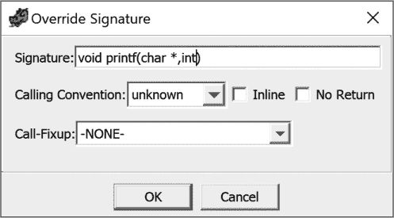
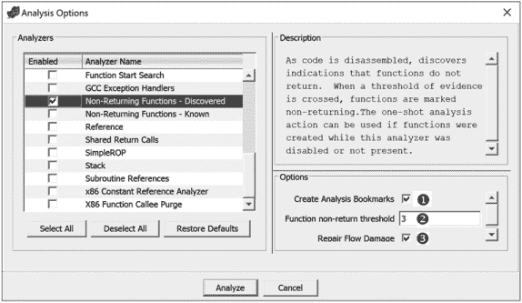
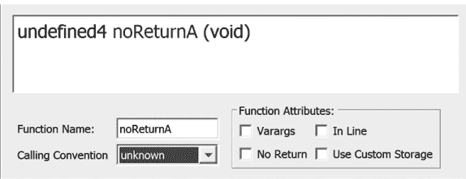
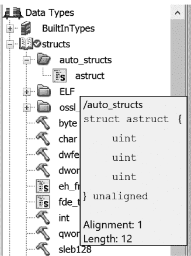
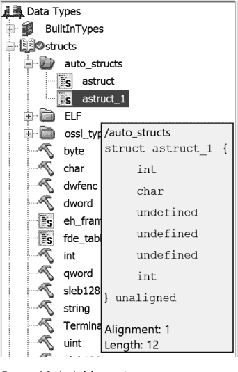

## 第二十二章：GHIDRA 反编译器**


到目前为止，我们已经将逆向工程分析集中在列表窗口，并通过反汇编列表的视角介绍了 Ghidra 的特性。在本章中，我们将焦点转向反编译窗口，研究如何使用反编译器及其相关功能完成熟悉的分析任务（以及一些新的任务）。我们将从反编译过程的简要概述开始，然后深入反编译窗口中可用的功能。接着我们将通过一些示例，帮助你发现如何利用反编译窗口改进你的逆向工程过程。

### 反编译分析

合理的假设是，反编译窗口中的内容来自于列表窗口，但令人惊讶的是，列表窗口和反编译窗口的内容是独立生成的，这就是为什么它们有时不一致的原因，因此，在试图确定真实情况时，必须在上下文中评估这两者。Ghidra 反编译器的主要功能是将机器语言指令转换为 p-code（见 第十八章），然后将 p-code 转换为 C 语言，并在反编译窗口中显示。

从简化的视角来看，反编译过程包括三个不同的阶段。在第一阶段，反编译器使用 SLEIGH 规范文件创建 p-code 草图，并推导出相关的基本块和控制流。第二阶段专注于简化：删除不需要的内容，如不可达代码，然后根据变化调整和优化控制流。在最后阶段，进行一些修整，进行最终检查，并通过格式化算法生成最终结果，最终呈现在反编译窗口中。当然，这大大简化了一个非常复杂的过程，但主要的要点如下：^(1)

+   反编译器是一个分析器。

+   它从二进制文件开始工作，并生成 p-code。

+   它将 p-code 转换为 C 语言。

+   C 代码和相关消息显示在反编译窗口中。

我们将详细讨论这些步骤，并深入探讨 Ghidra 的反编译功能。让我们从分析过程开始，了解它释放的主要功能。

#### *分析选项*

在自动分析过程中，有几个分析器与反编译窗口相关。反编译分析选项通过“编辑 ▸ 工具选项”菜单管理，如 图 19-1 所示，默认选项已选择。

我们接下来将讨论其中两个选项：消除不可达代码和简化预测。对于其他选项，你可以实验它们的结果或参考 Ghidra 帮助文档。


*图 19-1：Ghidra 反编译器分析选项，已选择默认值*

##### 消除不可达代码

“消除无法访问的代码”选项会将无法访问的代码排除在反编译器列表之外。例如，以下 C 函数有两个永远不可能满足的条件，这使得相应的条件块变得无法访问：

```
int demo_unreachable(volatile int a) {

    volatile int b = a ^ a;

 ➊ if (b) {

        printf("This is unreachable\n");

        a += 1;

    }

 ➋ if (a - a > 0) {

        printf("This should be unreachable too\n");

        a += 1;

    } else {

        printf("We should always see this\n");

        a += 2;

    }

    printf("End of demo_unreachable()\n");

    return a;

}
```

变量`b`以一种或许不太明显的方式初始化为零。当测试`b`时➊，它的值永远不会为非零，因而对应的`if`语句块将永远不会执行。同样，`a - a`永远不可能大于零，因此第二个`if`语句的条件➋也永远无法评估为真。当选择“消除无法访问的代码”选项时，反编译器窗口会显示警告信息，提醒我们它已经移除了无法访问的代码。

```
/* WARNING: Removing unreachable block (ram,0x00100777) */

/* WARNING: Removing unreachable block (ram,0x0010079a) */

ulong demo_unreachable(int param_1)

{

  puts("We should always see this");

  puts("End of demo_unreachable()");

  return (ulong)(param_1 + 2);

}
```

##### 简化预测

该选项通过合并共享相同条件的`if`/`else`块来优化代码。在以下列表中，前两个`if`语句共享相同的条件：

```
int demo_simppred(int a) {

    if (a > 0) {

          printf("A is > 0\n");

    }

    if (a > 0) {

          printf("Yes, A is definitely > 0!\n");

    }

    if (a > 2) {

          printf("A > 2\n");

    }

    return a * 10;

}
```

启用简化预测后，生成的反编译器列表显示合并后的代码块：

```
ulong demo_simppred(int param_1)

{

  if (0 < param_1) {

    puts("A is > 0");

    puts("Yes, A is definitely > 0!");

  }

  if (2 < param_1) {

    puts("A > 2");

  }

  return (ulong)(uint)(param_1 * 10);

}
```

### 反编译器窗口

现在你已经了解了反编译器分析引擎如何填充反编译器窗口，接下来我们来看一下如何利用窗口来辅助分析。导航反编译器窗口相对简单，因为它一次只显示一个函数。为了在函数之间移动或查看函数的上下文，最好与列表窗口进行关联。由于反编译器窗口和列表窗口默认是链接的，你可以通过使用 CodeBrowser 工具栏中的可用选项同时在两个窗口间导航。

反编译器窗口中显示的函数有助于分析，但刚开始时可能不太容易阅读。由于缺乏关于函数反编译的数据类型的信息，Ghidra 需要自行推断这些数据类型。因此，反编译器可能会过度使用类型转换，正如你在以下示例语句中看到的那样：

```
printf("a=%d, b=%d, c=%d, d=%d, e=%d, f=%d, g=%d\n", (ulong)param_1,

      (ulong)param_2,(ulong)uVar1,(ulong)uVar2,(ulong)(uVar1 + param_1),

      (ulong)(uVar2 * 100),(ulong)uVar4);

uStack44 = *(undefined4 *)**(undefined4 **)(iStack24 + 0x10);
```

当你通过反编译器编辑选项提供更精确的类型信息时，你会注意到反编译器越来越少依赖类型转换，生成的 C 代码也变得更易读。在接下来的示例中，我们将讨论一些反编译器窗口最有用的功能，用于清理生成的源代码。最终目标是生成更易于理解的可读源代码，从而减少理解代码行为所需的时间。

#### *示例 1：在反编译器窗口中编辑*

考虑一个程序，该程序从用户那里接受两个整数值，然后调用以下函数：

```
int do_math(int a, int b) {

    int c, d, e, f, g;

    srand(time(0));

    c = rand();

    printf("c=%d\n", c);

    d = a + b + c;

    printf("d=%d\n", d);

    e = a + c;

    printf("e=%d\n", e);

    f = d * 100;

    printf("f=%d\n", f);

    g = rand() - e;

    printf("g=%d\n", g);

    printf("a=%d, b=%d, c=%d, d=%d, e=%d, f=%d, g=%d\n", a, b, c, d, e, f, g);

    return g;

}
```

该函数使用两个整数参数和五个局部变量来生成其输出。它们之间的相互依赖关系可以总结如下：

+   变量`c`依赖于`rand()`的返回值，直接影响`d`和`e`，并间接影响`f`和`g`。

+   变量`d`依赖于`a`、`b`和`c`，并直接影响`f`。

+   变量`e`依赖于`a`和`c`，并直接影响`g`。

+   变量`f`直接依赖于`d`，间接依赖于`a`、`b`和`c`，但不影响任何内容。

+   变量`g`直接依赖于`e`，间接依赖于`a`和`c`，但不影响任何内容。

当关联的二进制文件加载到 Ghidra 中并对函数进行分析时，你会在反编译器窗口中看到`do_math`函数的以下表示：

```
ulong do_math(uint param_1,uint param_2)

{

    uint uVar1;

    uint uVar2;

    int iVar3;

    uint uVar4;

    time_t tVar5;

    tVar5 = time((time_t *)0x0);

    srand((uint)tVar5);

    uVar1 = rand();

    printf("c=%d\n");

    uVar2 = uVar1 + param_1 + param_2;

  ➊ printf("d=%d\n");

    printf("e=%d\n");

    printf("f=%d\n");

    iVar3 = rand();

    uVar4 = iVar3 - (uVar1 + param_1);

    printf("g=%d\n");

    printf("a=%d, b=%d, c=%d, d=%d, e=%d, f=%d, g=%d\n", (ulong)param_1,

          (ulong)param_2,(ulong)uVar1,(ulong)uVar2,(ulong)(uVar1 + param_1),

          (ulong)(uVar2 * 100),(ulong)uVar4);

    return (ulong)uVar4;

  }
```

如果你想使用反编译器进行分析，你需要确保反编译器生成的代码尽可能准确。通常，这通过提供尽可能多的关于数据类型和函数原型的信息来完成。接受可变数量参数的函数，如`printf`，尤其对反编译器来说是棘手的，因为反编译器需要完全理解所需参数的语义，才能估算提供的可选参数的数量。

##### 覆盖函数签名

你可以看到一些`printf`语句 ➊ 看起来不太对。每个语句都有一个格式字符串，但没有额外的参数。由于`printf`接受可变数量的参数，你可以在每个调用位置覆盖函数签名，并（根据格式字符串）指示该`printf`语句应接受一个整数参数。^(2) 要进行此更改，请右键单击`printf`语句，并从上下文菜单中选择**覆盖签名**，以打开图 19-2 所示的对话框。



*图 19-2：覆盖签名对话框*

将第二个参数类型`int`添加到每个`printf`语句的签名中（如图所示），结果如下所示：

```
 ulong do_math(uint param_1,uint param_2)

 {

➊ uint uVar1;

   uint uVar2;

   uint uVar3;

   int iVar4;

   uint uVar5;

   time_t tVar6;

   tVar6 = time((time_t *)0x0);

   srand((uint)tVar6);

   uVar1 = rand();

   printf("c=%d\n",uVar1);

   uVar2 = uVar1 + param_1 + param_2;

   printf("d=%d\n",uVar2);

➋ uVar3 = uVar1 + param_1;

   printf("e=%d\n",uVar3);

   printf("f=%d\n",uVar2 * 100);

   iVar4 = rand();

➌ uVar5 = iVar4 - uVar3;

   printf("g=%d\n",uVar5);

➍ printf("a=%d, b=%d, c=%d, d=%d, e=%d, f=%d, g=%d\n", (ulong)param_1,

 (ulong)param_2,(ulong)uVar1,(ulong)uVar2,(ulong)(uVar1 + param_1),

         (ulong)(uVar2 * 100),(ulong)uVar4);

   return (ulong)uVar4;

 }
```

除了更新的具有正确参数的`printf`调用外，由于覆盖了`printf`函数 ➋ ➌，反编译器列表中还添加了两行新代码。这些语句之前没有包括进来，因为 Ghidra 认为这些结果未被使用。一旦反编译器明白这些结果在每个`printf`中都有使用，这些语句就变得有意义，并会显示在反编译器窗口中。

##### 编辑变量类型和名称

在修正完函数调用之后，你可以继续通过重命名（快捷键 L）和重新输入（快捷键 CTRL-L）参数以及变量 ➊，根据在`printf`格式字符串中找到的名称来清理列表。顺便提一下，格式字符串是任何程序中关于变量类型和用途的极其宝贵的信息来源。

在完成这些更改后，最终的`printf`语句 ➍ 仍然有点繁琐：

```
printf("a=%d, b=%d, c=%d, d=%d, e=%d, f=%d, g=%d\n", (ulong)a,

      (ulong)(uint)b, (ulong)(uint)c, (ulong)(uint)d, (ulong)(uint)e,

      (ulong)(uint)(d * 100),(ulong)(uint)g);
```

右键单击此语句允许你覆盖函数签名。此`printf`语句中的第一个参数是格式字符串，它无需修改。将其余参数更改为`int`类型后，结果会得到如下更简洁的代码（Listing 19-1）显示在反编译器窗口中。

```
int do_math(int a, int b)

{

  int c;

  int d;

  int e;

  int g;

  time_t tVar1;

  tVar1 = time((time_t *)0x0);

  srand((uint)tVar1);

  c = rand();

  printf("c=%d\n",c);

  d = c + a + b;

  printf("d=%d\n",d);

  e = c + a;

  printf("e=%d\n",e);

  printf("f=%d\n",d * 100);

  g = rand();

  g = g - e;

  printf("g=%d\n",g);

 printf("a=%d, b=%d, c=%d, d=%d, e=%d, f=%d, g=%d\n",a,b,c,d,e,d * 100➊,g);

  return g;

}
```

*列表 19-1：带有更新签名的反编译函数*

这与我们原始的源代码非常相似，并且比原始的反编译器列表示更加易读，因为函数参数的修改已经传播到整个列表中。反编译器列表示和我们原始源代码之间的一个区别是，变量`f`已经被等效的表达式➊所替代。

##### 高亮切片

现在你有了更易理解的反编译器窗口，你可以开始进一步的分析。假设你想知道某个变量如何影响其他变量，或者如何被其他变量影响。一个*程序切片*是指一组影响某个变量值（*回溯切片*）或被某个变量值影响（*前向切片*）的语句。在漏洞分析场景中，这可能表现为“我控制了这个变量，它的值在哪些地方被使用？”

Ghidra 在其右键菜单中提供了五个选项，用于高亮函数中变量与指令之间的关系。如果你在反编译器窗口中右键点击一个变量，你可以从以下选项中进行选择：

**高亮 Def-use** 该选项会高亮函数中变量的所有使用位置。（你也可以通过中键单击来实现相同的效果。）

**高亮前向切片** 该选项会高亮所有受选定变量值影响的内容。例如，如果你在列表 19-1 中选择变量`b`并选择此选项，则所有出现`b`和`d`的位置都会被高亮，因为`b`的值变化可能也会导致`d`值的变化。

**高亮回溯切片** 这是前一个选项的反向操作，会高亮所有对某个特定值有贡献的变量。如果你右键点击列表 19-1 中最后一个`printf`语句中的变量`e`并选择此选项，所有影响`e`值的变量（在这种情况下是`e`、`a`和`c`）都会被高亮。修改`a`或`c`也可能改变`e`的值。

**高亮前向语句切片** 该选项会高亮与“高亮前向切片”选项相关的整个语句。在列表 19-1 中，如果你在选中`b`变量时使用此选项，所有涉及`b`或`d`的语句都会被高亮。

**高亮回溯语句切片** 该选项会高亮与“高亮回溯切片”选项相关的整个语句。在列表 19-1 中，选择此选项并高亮`e`变量时，所有涉及`a`、`c`或`e`的语句都会被高亮。

现在我们对如何操作反编译器窗口以及如何在分析中使用它有了大致了解，接下来我们看一个更具体的示例。

#### *示例 2：无返回的函数*

通常，Ghidra 可以安全地假设函数调用会返回，因此会将函数调用视为在基本块内呈现顺序流。然而，一些函数，如源代码中标记为 `noreturn` 关键字的函数，或在恶意软件中以混淆的跳转指令结束的函数，是不返回的，这可能导致 Ghidra 生成不准确的反汇编或反编译代码。Ghidra 提供了三种处理非返回函数的方法：两种非返回函数分析器和手动编辑函数签名的功能。

Ghidra 可以根据已知的 `noreturn` 函数列表（如 `exit` 和 `abort`）来识别非返回函数，使用的是“非返回函数-已知分析器”。此分析器在自动分析时默认选中，其工作原理非常简单：如果函数名出现在该列表中，它会将该函数标记为非返回函数，并尽最大努力修复任何相关问题（例如，将相关调用设置为非返回函数、查找可能需要修复的流程等）。

“非返回函数-已发现”分析器会寻找可能表明函数不返回的线索（例如，调用后面的数据或错误指令）。它如何处理这些信息，主要由与分析器相关的三个选项控制，如图 19-3 所示。



*图 19-3：非返回函数-已发现分析选项*

第一个选项 ➊ 允许自动创建分析书签（这些书签会出现在列表窗口的书签栏上）。第二个选项 ➋ 允许你指定一个阈值，该阈值通过一系列检查，判断是否将某个函数标记为非返回函数。最后，还有一个复选框 ➌ 用于修复相关的流程损坏。

当 Ghidra 无法识别非返回函数时，你可以选择自己编辑函数签名。如果你完成分析并有错误书签，这些书签用于标记错误指令，这通常是 Ghidra 自身分析出错的一个良好指示。如果错误指令紧随 `CALL`，如

```
00100839                 CALL          noReturnA

0010083e                 ??            FFh
```

然后，你可能会在反编译器窗口看到一个相关的后置注释，警告你关于该情况，如下所示：

```
  noReturnA(1);

  /* WARNING: Bad instruction - Truncating control flow here */

  halt_baddata();
```

如果你在反编译器窗口点击函数名（此例中为 `noReturnA`），然后选择“编辑函数签名”，你将有机会修改与该函数相关的属性，如图 19-4 所示。



*图 19-4：编辑函数属性*

勾选“无返回”框，将该函数标记为非返回函数。Ghidra 然后会在反编译器窗口中插入一个前置注释，并在列表窗口中插入一个后置注释，如下所示：

```
  /* WARNING: Subroutine does not return */

  noReturnA(1);
```

纠正该错误后，你可以继续处理其他问题。

#### *示例 3：自动化结构创建*

在分析反编译后的 C 源代码时，你可能会遇到看起来包含结构体字段引用的语句。Ghidra 可以帮助你创建一个结构体，并根据反编译器检测到的相关引用填充它。让我们从源代码和 Ghidra 的初步反编译开始，逐步了解这个过程。

假设你有源代码，定义了两个结构体类型，并为每个类型创建了一个全局实例：

```
➊ struct s1 {

      int a;

      int b;

      int c;

   };

➋ typedef struct s2 {

       int x;

       char y;

       float z;

   } s2_type;

   struct s1 GLOBAL_S1;

   s2_type GLOBAL_S2;
```

一个结构体 ➊ 包含同质元素，另一个 ➋ 包含异质类型的集合。源代码还包含三个函数，其中一个函数（`do_struct_demo`）声明了每个结构体类型的本地实例：

```
void display_s1(struct s1* s) {

    printf("The fields in s1 = %d, %d, and %d\n", s->a, s->b, s->c);

}

void update_s2(s2_type* s, int v) {

    s->x = v;

    s->y = (char)('A' + v);

    s->z = v * 2.0;

}

void do_struct_demo() {

    s2_type local_s2;

    struct s1 local_s1;

    printf("Enter six ints: ");

    scanf("%d %d %d %d %d %d", (int *)&local_s1, &local_s1.b, &local_s1.c,

          &GLOBAL_S1.a, &GLOBAL_S1.b, &GLOBAL_S1.c);

    printf("You entered: %d and %d\n", local_s1.a, GLOBAL_S1.a);

    display_s1(&local_s1);

    display_s1(&GLOBAL_S1);

    update_s2(&local_s2, local_s1.a);

}
```

`do_struct_demo`的反编译版本出现在示例 19-2 中。

```
void do_struct_demo(void)

{

   undefined8 uVar1;

   uint local_20;

   undefined local_1c [4];

   undefined local_18 [4];

   undefined local_14 [12];

   uVar1 = 0x100735;

   printf("Enter six ints: ");

   __isoc99_scanf("%d %d %d %d %d %d", &local_20, local_1c, local_18,

                  GLOBAL_S1,0x30101c,0x301020,uVar1);

   printf("You entered: %d and %d\n",(ulong)local_20,(ulong)GLOBAL_S1._0_4_);

➊ display_s1(&local_20);

➋ display_s1(GLOBAL_S1);

   update_s2(local_14,(ulong)local_20,(ulong)local_20);

   return;

}
```

*示例 19-2：`do_struct_demo`的初步反编译*

双击反编译器窗口中的函数调用 ➊➋，进入`display_s1`函数，将显示如下内容：

```
void display_s1(uint *param_1)

{

  printf("The fields in s1 = %d, %d, and %d\n", (ulong)*param_1,

        (ulong)param_1[1],(ulong)param_1[2]);

  return;

}
```

因为你怀疑`display_s1`的参数可能是一个结构体指针，你可以要求 Ghidra 自动为你创建一个结构体。只需右键点击函数参数列表中的`param_1`，并从上下文菜单中选择“自动创建结构体”。作为回应，Ghidra 会跟踪`param_1`的所有使用，将对指针执行的所有算术运算视为对结构体成员的引用，并自动创建一个新结构体类型，包含每个引用偏移量的字段。这会在反编译器的列表中改变一些内容：

```
void display_s1(astruct *param_1)

{

  printf("The fields in s1 = %d, %d, and %d\n",(ulong)param_1->field_0x0,

        (ulong)param_1->field_0x4,(ulong)param_1->field_0x8);

  return;

}
```

参数的类型已经改变，现在是`astruct*`，并且调用`printf`时已经包含了字段引用。新类型也已经添加到数据类型管理器中，鼠标悬停在结构体名称上会显示字段定义，如图 19-5 所示。



*图 19-5：数据类型管理器中的自动结构体*

你可以通过右键点击上下文菜单中的“重新类型变量”选项，将`local_20`和`GLOBAL_S1`的类型更新为`astruct`。结果如下所示：

```
 void do_struct_demo(void)

 {

   undefined8 uVar1;

➊ astruct local_20;

   undefined local_14 [12];

   uVar1 = 0x100735;

   printf("Enter six ints: ");

   __isoc99_scanf("%d %d %d %d %d %d", &local_20, &local_20.field_0x4➋,

             ➌ &local_20.field_0x8, &GLOBAL_S1, 0x30101c, 0x301020, uVar1);

   printf("You entered: %d and  %d\n", (ulong)local_20.field_0x0,

      ➍ (ulong)GLOBAL_S1.field_0x0);

   display_s1(&local_20);

   display_s1(&GLOBAL_S1);

   update_s2(local_14,(ulong)local_20.field_0x0,(ulong)local_20.field_0x0);

   return;

 }
```

将其与示例 19-2 进行比较，可以看到`local_20`的类型被修改 ➊，并且为`local_20` ➋ ➌和`GLOBAL_S1` ➍添加了字段引用。

让我们将焦点转向第三个函数`update_s2`的反编译，如示例 19-3 所示。

```
void update_s2(int *param_1,int param_2)

{

  *param_1 = param_2;

  *(char *)(param_1 + 1) = (char)param_2 + 'A';

  *(float *)(param_1 + 2) = (float)param_2 + (float)param_2;

  return;

}
```

*示例 19-3：`update_s2`的初步反编译*

你可以使用之前的方法，自动为`param_1`创建一个结构体。只需右键点击函数中的`param_1`，并从上下文菜单中选择**自动创建结构体**。

```
void update_s2(astruct_1 *param_1,int param_2)

{

  param_1->field_0x0 = param_2;

  param_1->field_0x4 = (char)param_2 + 'A';

  param_1->field_0x8 = (float)param_2 + (float)param_2;

  return;

}
```

数据类型管理器现在与此文件关联了第二个结构体定义，如图 19-6 所示。



*图 19-6：数据类型管理器窗口中的附加自动结构体*

这个结构包含一个`int`、一个`char`、三个`undefined`字节（可能是编译器插入的填充字节）和一个`float`。要编辑该结构，右键点击`astruct_1`并从上下文菜单中选择“编辑”，这将打开结构编辑器窗口。如果我们选择将`int`字段命名为`x`，将`char`字段命名为`y`，将`float`字段命名为`z`，然后保存更改，那么新的字段名称将在反编译器列表中反映出来：

```
void update_s2(astruct_1 *param_1,int param_2)

{

  param_1->x = param_2;

  param_1->y = (char)param_2 + 'A';

  param_1->z = (float)param_2 + (float)param_2;

  return;

}
```

这个列表比列表 19-3 中的原始反编译结果更容易阅读和理解。

### 总结

反编译器窗口与列表窗口类似，都为你提供了二进制文件的视图，每种方式都有各自的优缺点。反编译器提供了一个更高层次的视图，可以帮助你比查看反汇编代码更快速地理解单个函数的结构和功能（特别是对于那些没有多年阅读反汇编列表经验的人）。列表窗口则提供了整个二进制文件的更低层次视图，包含所有可用的细节，但这可能使得很难从整体上获取洞察。

Ghidra 的反编译器可以与列表窗口以及我们在本书中介绍的所有其他工具有效配合，帮助你进行逆向工程过程。最终，决定解决当前问题的最佳方法是逆向工程师的职责。

本章重点介绍了反编译器窗口以及与反编译相关的问题。许多挑战可以追溯到各种各样的编译器及其相关的编译器选项，这些直接影响生成的二进制文件。在下一章中，我们将看一些特定编译器的行为和编译器构建选项，以更好地理解生成的二进制文件。
