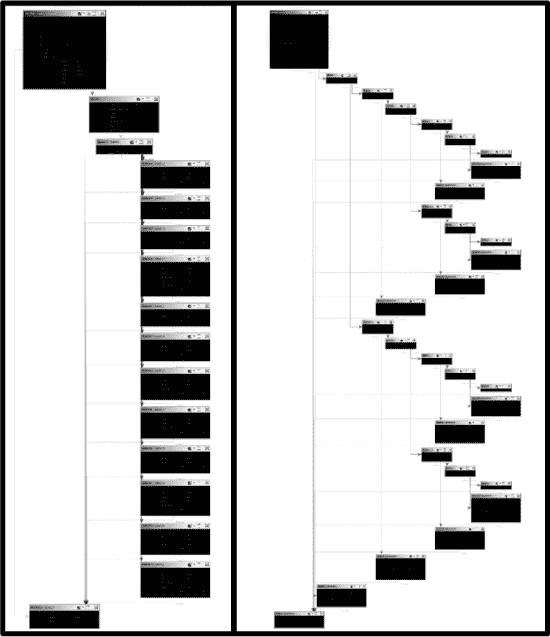
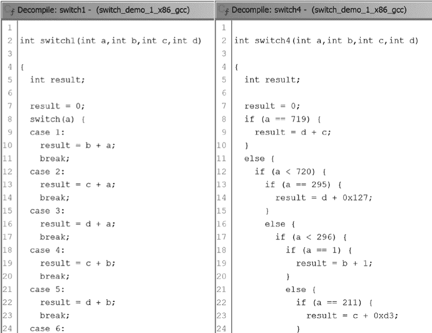
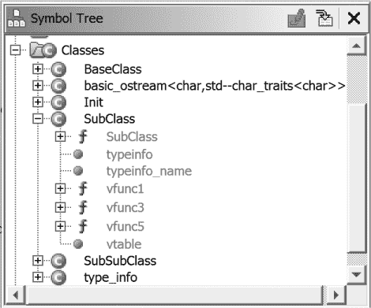
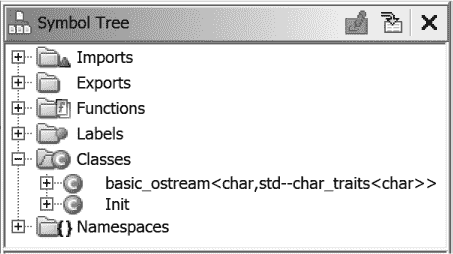
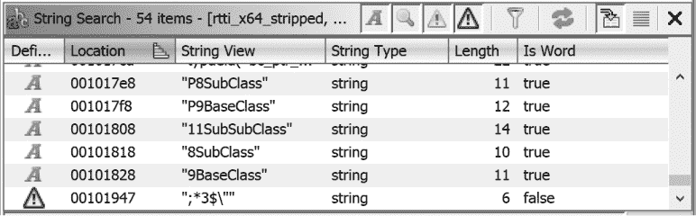
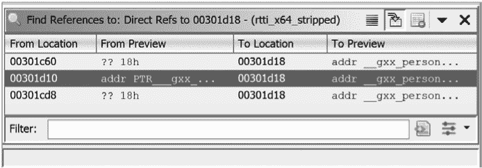

## 第二十三章：**编译器差异**


到目前为止，如果我们做得对，你应该已经掌握了有效使用 Ghidra 的基本技能，更重要的是，学会如何让它为你所用。下一步是学习如何应对二进制文件（而不是 Ghidra）给你带来的挑战。根据你研究汇编语言的动机，你可能对自己正在查看的内容非常熟悉，或者你根本无法预知会面临什么。如果你花费所有时间分析在 Linux 平台上使用`gcc`编译的代码，你将非常熟悉它生成的代码风格，但你可能会对使用微软 C/C++编译器编译的调试版本程序感到困惑。如果你是恶意软件分析师，你可能会在同一个下午看到使用`gcc`、clang、微软 C++编译器、Delphi 等编写的代码。

和你一样，Ghidra 对某些编译器的输出比其他编译器更熟悉，而对某个编译器生成的代码的熟悉，并不能保证你能够识别使用完全不同编译器（甚至是同一编译器家族的不同版本）编译的高级构造。与其完全依赖 Ghidra 的分析能力来识别常用的代码和数据结构，你应该始终准备好运用自己的技能：你对特定汇编语言的熟悉程度、你对编译器的知识，以及你的研究能力，以正确解读反汇编代码。

在本章中，我们将介绍编译器差异如何在反汇编清单中体现出来。我们主要使用编译后的 C 代码作为示例，因为 C 编译器和目标平台的多样性提供了基础概念，这些概念可以扩展到其他编译语言。

### 高级构造

在某些情况下，编译器之间的差异可能只是表面上的，但在其他情况下，它们的差异可能更为显著。在本节中，我们将探讨高级语言构造，并演示不同的编译器和编译器选项如何显著影响生成的反汇编清单。我们从`switch`语句开始，讨论解决`switch` case 选择时最常用的两种机制。接着，我们将研究编译器选项如何影响常见表达式的代码生成，然后再讨论不同编译器如何实现 C++特定构造并处理程序启动。

#### *switch 语句*

C 语言的`switch`语句是编译器优化的常见目标。这些优化的目标是以最有效的方式将`switch`变量匹配到有效的 case 标签，但`switch`语句的 case 标签分布限制了可以使用的查找类型。

由于搜索的效率是通过所需的比较次数来衡量的，我们可以追踪编译器可能用来确定最优方式表示`switch`表的逻辑。常数时间算法，如表查找，是最有效的。^(1) 在最不理想的情况下是线性搜索，它在最坏情况下需要将`switch`变量与每个 case 标签进行比较，直到找到匹配项或回退到默认值，因此它是最不高效的。^(2) 二分查找的效率通常优于线性搜索，但也引入了额外的限制，因为它需要一个已排序的列表。^(3)

为了选择最有效的实现方式，对于特定的`switch`语句，了解 case 标签的分布如何影响编译器的决策过程是很有帮助的。当 case 标签紧密聚集时，如列表 20-1 中的源代码所示，编译器通常通过执行表查找来解决`switch`变量，将`switch`变量与其相关联的 case 地址匹配——具体而言，是通过使用跳转表。

```
switch (a) {

/** NOTE: case bodies omitted for brevity **/

    case 1:  /*...*/ break;

    case 2:  /*...*/ break;

    case 3:  /*...*/ break;

    case 4:  /*...*/ break;

    case 5:  /*...*/ break;

    case 6:  /*...*/ break;

    case 7:  /*...*/ break;

    case 8:  /*...*/ break;

    case 9:  /*...*/ break;

    case 10: /*...*/ break;

    case 11: /*...*/ break;

    case 12: /*...*/ break;

}
```

*列表 20-1：一个*`switch`*语句，具有连续的 case 标签*

*跳转表*是一个指针数组，数组中的每个指针都指向一个可能的跳转目标。在运行时，表中的动态索引每次被引用时都会选择多个潜在跳转中的一个。跳转表在`switch` case 标签紧密排列（即密集）时表现良好，大多数 case 标签都形成一个连续的数字序列。编译器在决定是否使用跳转表时会考虑这一点。对于任何`switch`语句，我们可以通过以下方式计算跳转表中最少的条目数：

```
num_entries = max_case_value – min_case_value + 1
```

跳转表的*密度*或利用率可以通过以下方式计算：

```
density = num_cases / num_entries
```

如果每个值都被表示为一个完全连续的列表，那么该列表的密度值为 100%（1.0）。最后，存储跳转表所需的总空间如下：

```
table_size = num_entries * sizeof(void*)
```

一个具有 100%密度的`switch`语句将通过跳转表来实现。一个密度为 30%的 case 集合可能无法通过跳转表实现，因为跳转表条目仍然需要为缺失的 case 分配空间，而这些缺失的 case 占了跳转表的 70%。如果`num_entries`为 30，则跳转表将包含 21 个未引用的 case 标签的条目。在 64 位系统上，这将占用跳转表分配的 240 字节中的 168 字节，虽然开销不大，但如果`num_entries`跳到 300，则开销变为 1680 字节，这对于 90 个可能的 case 来说可能不值得这种权衡。优化速度的编译器可能更倾向于使用跳转表实现，而优化尺寸的编译器则可能选择一个内存开销更小的替代实现：二分查找。

当 case 标签分布较广（低密度）时，*二分查找*非常高效，如在清单 20-2 中所示（密度为 0.0008）。^(4) 由于二分查找仅适用于排序过的列表，编译器必须确保在开始使用中位值进行查找之前，先对 case 标签进行排序。这可能导致在反汇编中查看到的 case 块的顺序与它们在源代码中的顺序不同。^(5)

```
switch (a) {

/** NOTE: case bodies omitted for brevity **/

    case 1:     /*...*/ break;

    case 211:   /*...*/ break;

    case 295:   /*...*/ break;

    case 462:   /*...*/ break;

    case 528:   /*...*/ break;

    case 719:   /*...*/ break;

    case 995:   /*...*/ break;

    case 1024:  /*...*/ break;

    case 8000:  /*...*/ break;

    case 13531: /*...*/ break;

    case 13532: /*...*/ break;

    case 15027: /*...*/ break;

}
```

*清单 20-2：示例* `switch` *语句，包含非连续的 case 标签*

清单 20-3 显示了一个通过固定数量常量值进行非迭代二分查找的概要框架。这是编译器用来实现来自清单 20-2 的`switch`语句的粗略框架。

```
if (value < median) {

    // value is in [0-50) percentile

    if (value < lower_half_median) {

        // value is in [0-25) percentile

        // ... continue successive halving until value is resolved

    } else {

        // value is in [25-50) percentile

        // ... continue successive halving until value is resolved

   }

} else {

    // value is in [50-100) percentile

    if (value < upper_half_median) {

        // value is in [50-75) percentile

 // ... continue successive halving until value is resolved

    } else {

        // value is in [75-100) percentile

        // ... continue successive halving until value is resolved

    }

}
```

*清单 20-3：通过固定数量常量值进行非迭代二分查找*

编译器还能够在一系列 case 标签之间执行更精细的优化。例如，当面对 case 标签时，

```
label_set = [1, 2, 3, 4, 5, 6, 7, 8, 50, 80, 200, 500, 1000, 5000, 10000]
```

一个不那么激进的编译器可能会看到 0.0015 的密度，并对所有 15 个 case 进行二分查找。而一个更激进的编译器可能会生成一个跳转表来解决 case 1 到 8，并对剩余的 case 进行二分查找，从而实现对超过一半 case 的最佳性能。

在我们查看清单 20-1 和清单 20-2 的反汇编版本之前，先来看看与这些清单对应的 Ghidra 函数图窗口，两个窗口并排显示在图 20-1 中。



*图 20-1：Ghidra 函数图* `switch` *语句示例*

在左侧，清单 20-1 的图表显示了一个整齐的垂直堆叠的 case。每个堆叠的代码块位于相同的嵌套深度，这正是`switch`语句中的 case 的特点。该堆叠表明我们可以使用索引快速从多个块中选择一个（类似数组访问）。这正是跳转表解析的工作原理，左侧的图表为我们提供了一个视觉提示，表明这一点，即使我们还没有查看反汇编的任何一行代码。

右侧的图形是 Ghidra 仅根据其对示例 20-2 反汇编结果的理解所得到的结果。由于缺少跳转表，这使得识别`switch`语句变得更加困难。你看到的是使用 Ghidra 的嵌套代码布局的`switch`语句的可视化表示。这是 Ghidra 中函数图形的默认布局，旨在表示程序中的流程结构。图中的水平分支表示条件执行（`if`/`else`）分支到互斥的替代路径。垂直对称性表明，替代执行路径被非常仔细地平衡，确保图形的每个垂直半部分中包含相等数量的块。最后，图形水平遍历的距离是搜索深度的指示器，这又由`switch`中存在的总案例标签数量决定。对于二分查找，这个深度通常是`log[2]``(num_cases)`的数量级。图形表示的缩进与示例 20-3 中概述的算法之间的相似性很容易观察到。

将注意力转向反编译窗口，图 20-2 显示了图 20-1 中展示的函数的部分反编译结果。左侧是示例 20-1 的反编译版本。与图形一样，二进制文件中存在跳转表有助于 Ghidra 将代码识别为`switch`语句。

右侧是示例 20-2 的反编译版本。反编译器将`switch`语句呈现为与二分查找一致的嵌套`if`/`else`结构，且结构与示例 20-3 类似。你可以看到，第一次比较是与 719 进行的，这是列表中的中位数，随后的比较则继续将搜索空间对半分。参考图 20-1（以及示例 20-3），我们可以再次观察到，每个函数的图形表示与反编译窗口中观察到的缩进模式紧密对应。

现在你对高层的情况有了了解，我们来看一下二进制文件，调查低层发生了什么。由于本章的目标是观察编译器之间的差异，我们将这个例子呈现为`gcc`与微软 C/C++编译器之间的比较系列。^(6)



*图 20-2：Ghidra 反编译的* `switch` *语句示例*

#### *示例：比较 gcc 与微软 C/C++编译器*

在这个例子中，我们比较了为清单 20-1 生成的两个 32 位 x86 二进制文件，这两个文件分别由两个不同的编译器生成。我们将尝试识别每个二进制文件中的`switch`语句组件，定位每个二进制文件中的相关跳转表，并指出这两个二进制文件之间的重要差异。让我们从查看使用`gcc`构建的二进制文件中的清单 20-1 的`switch`相关组件开始。

```
0001075a  CMP➊  dword ptr [EBP + value],12

0001075e  JA     switchD_00010771::caseD_0➋

00010764  MOV    EAX,dword ptr [EBP + a]

00010767  SHL    EAX,0x2

0001076a  ADD    EAX,switchD_00010771::switchdataD_00010ee0       = 00010805

0001076f  MOV    EAX,dword ptr [EAX]=>->switchD_00010771::caseD_0 = 00010805

        switchD_00010771::switchD

00010771  JMP    EAX

        switchD_00010771::caseD_1➌             XREF[2]:      00010771(j), 00010ee4(*)

 00010773  MOV    EDX,dword ptr [EBP + a]

00010776  MOV    EAX,dword ptr [EBP + b]

00010779  ADD    EAX,EDX

0001077b  MOV    dword ptr [EBP + result],EAX

0001077e  JMP    switchD_00010771::caseD_0

;--content omitted for remaining cases--

       switchD_00010771::switchdataD_00010ee0➋  XREF[2]: switch_version_1:0001076a(*),

                                                          switch_version_1:0001076f(R)

00010ee0  addr    switchD_00010771::caseD_0➎

00010ee4  addr    switchD_00010771::caseD_1

00010ee8  addr    switchD_00010771::caseD_2

00010eec  addr    switchD_00010771::caseD_3

00010ef0  addr    switchD_00010771::caseD_4

00010ef4  addr    switchD_00010771::caseD_5

00010ef8  addr    switchD_00010771::caseD_6

00010efc  addr    switchD_00010771::caseD_7

00010f00  addr    switchD_00010771::caseD_8

00010f04  addr    switchD_00010771::caseD_9

00010f08  addr    switchD_00010771::caseD_a

00010f0c  addr    switchD_00010771::caseD_b

00010f10  addr    switchD_00010771::caseD_c
```

Ghidra 识别`switch`边界测试 ➊，跳转表 ➍，以及通过值区分的单个`case`块，例如`switchD_00010771::caseD_1` ➌。在编译时，生成了一个包含 13 个条目的跳转表，尽管清单 20-1 中只有 12 个`case`。额外的`case`，即`case 0`（跳转表中的第一个条目 ➎），与值范围 1 到 12 以外的所有值共享目标地址。换句话说，`case 0`是默认`case`的一部分。尽管看起来负数被排除在默认情况之外，但`CMP`、`JA`指令序列实际上对无符号值进行比较；因此，`-1`（`0xFFFFFFFF`）会被视为`4294967295`，这个值远大于 12，因此被排除在有效范围之外，无法用来索引跳转表。`JA`指令将所有这些情况引导至默认位置：`switchD_00010771::caseD_0` ➋。

现在我们理解了由`gcc`编译器生成的代码的基本组件，接下来我们将注意力转向微软 C/C++编译器在调试模式下生成的代码中的相同组件：

```
00411e88  MOV    ECX,dword ptr [EBP + local_d4]

00411e8e  SUB➊  ECX,0x1

00411e91  MOV    dword ptr [EBP + local_d4],ECX

00411e97  CMP➋  dword ptr [EBP + local_d4],11

00411e9e  JA     switchD_00411eaa::caseD_c

00411ea4  MOV    EDX,dword ptr [EBP + local_d4]

        switchD_00411eaa::switchD

00411eaa  JMP    dword ptr [EDX*0x4 + ->switchD_00411eaa::caseD      = 00411eb1

        switchD_00411eaa::caseD_1                XREF[2]: 00411eaa(j), 00411f4c(*)

00411eb1  MOV    EAX,dword ptr [EBP + param_1]

00411eb4  ADD    EAX,dword ptr [EBP + param_2]

 00411eb7  MOV    dword ptr [EBP + local_c],EAX

00411eba  JMP    switchD_00411eaa::caseD_c

;--content omitted for remaining cases--

        switchD_00411eaa::switchdataD_00411f4c   XREF[1]: switch_version_1:00411eaa(R)

00411f4c  addr   switchD_00411eaa::caseD_1➌

00411f50  addr   switchD_00411eaa::caseD_2

00411f54  addr   switchD_00411eaa::caseD_3

00411f58  addr   switchD_00411eaa::caseD_4

00411f5c  addr   switchD_00411eaa::caseD_5

00411f60  addr   switchD_00411eaa::caseD_6

00411f64  addr   switchD_00411eaa::caseD_7

00411f68  addr   switchD_00411eaa::caseD_8

00411f6c  addr   switchD_00411eaa::caseD_9

00411f70  addr   switchD_00411eaa::caseD_a

00411f74  addr   switchD_00411eaa::caseD_b

00411f78  addr   switchD_00411eaa::caseD_c
```

在这里，`switch`变量（在此案例中为`local_d4`）被递减 ➊，以将有效值的范围从 0 变为 11 ➋，从而不再需要为值 0 创建一个虚拟的表项。因此，跳转表中的第一个条目（即索引为 0 的条目）实际上指向的是`switch`语句的第 1 个分支。

另一个可能更微妙的区别是跳转表在文件中的位置。`gcc`编译器将`switch`跳转表放置在二进制文件的只读数据（`.rodata`）部分，从而在与`switch`语句相关的代码和实现跳转表所需的数据之间提供了逻辑上的分离。另一方面，微软 C/C++编译器将跳转表插入到`.text`部分，紧接着包含相关`switch`语句的函数之后。这种跳转表的定位对程序的行为几乎没有影响。在这个例子中，Ghidra 能够识别两种编译器生成的`switch`语句，并在相关标签中使用`switch`一词。

这里的一个关键点是，没有单一的正确方式将源代码编译成汇编代码。因此，你不能仅仅因为 Ghidra 没有将某个部分标记为`switch`语句，就假设它不是`switch`语句。理解`switch`语句的特点，这些特点会影响编译器的实现，能够帮助你更准确地推断出原始源代码。

### 编译器构建选项

编译器将解决特定问题的高级代码转换为解决相同问题的低级代码。多个编译器可能采用截然不同的方式来解决同一问题。此外，同一个编译器可能会根据相关的编译器选项以非常不同的方式来解决一个问题。在本节中，我们将查看使用不同编译器和不同命令行选项时生成的汇编语言代码。（一些差异有明确的解释；另一些则没有。）

Microsoft 的 Visual Studio 可以构建程序二进制文件的调试版本或发布版本。^(7) 要了解这两种版本的区别，可以对比它们各自的构建选项。发布版本通常会经过优化，而调试版本则不会，调试版本会链接附加的符号信息和调试版本的运行时库，而发布版本则不会。^(8) 与调试相关的符号使调试器能够将汇编语言语句映射回源代码，并确定局部变量的名称（否则此类信息在编译过程中会丢失）。Microsoft 运行时库的调试版本还包括了调试符号、禁用了优化，并启用了额外的安全检查，以验证某些函数参数的有效性。

使用 Ghidra 反汇编时，Visual Studio 项目的调试版本与发布版本看起来有显著不同。这是由于仅在调试版本中指定的编译器和链接器选项所导致的，例如基本的运行时检查（`/RTCx`），这些选项会在生成的二进制文件中引入额外的代码。^(9) 让我们直接进入，看看这些反汇编中的一些差异。

#### *示例 1：取模运算符*

我们以一个简单的数学运算——取模作为示例。以下列出了一个程序的源代码，该程序的唯一目标是接受用户输入的整数值，并演示整数除法和取模运算符：

```
int main(int argc, char **argv) {

    int x;

    printf("Enter an integer: ");

    scanf("%d", &x);

    printf("%d %% 10 = %d\n", x, x % 10);

}
```

让我们研究一下不同编译器在处理此示例中的取模运算符时，反汇编是如何变化的。

##### 使用 Microsoft C/C++ Win x64 调试版本的取模

以下列表显示了当配置为构建调试版本的二进制文件时，Visual Studio 生成的代码：

```
1400119c6 MOV    EAX,dword ptr [RBP + local_f4]

1400119c9 CDQ

1400119ca MOV    ECX,0xa

1400119cf IDIV➊ ECX

1400119d1 MOV    EAX,EDX

1400119d3 MOV➋  R8D,EAX

1400119d6 MOV    EDX,dword ptr [RBP + local_f4]

1400119d9 LEA    RCX,[s_%d_%%_10_=_%d_140019d60]

1400119e0 CALL   printf
```

一个直接的 x86 `IDIV` 指令 ➊ 将商保存在 `EAX` 寄存器中，余数保存在 `EDX` 寄存器中。结果随后被移动到 `R8` 的低 32 位（`R8D`） ➋，这是调用 `printf` 函数时的第三个参数。

##### 使用 Microsoft C/C++ Win x64 发布版本的取模

发布版本通过优化软件的速度和大小来提高性能并最小化存储需求。在优化速度时，编译器作者可能会采用一些不明显的常见操作实现方式。以下列表展示了 Visual Studio 如何在发布二进制文件中生成相同的取模操作：

```
140001136 MOV    ECX,dword ptr [RSP + local_18]

14000113a MOV    EAX,0x66666667

14000113f IMUL➊ ECX

140001141 MOV    R8D,ECX

140001144 SAR    EDX,0x2

140001147 MOV    EAX,EDX

140001149 SHR    EAX,0x1f

14000114c ADD    EDX,EAX

14000114e LEA    EAX,[RDX + RDX*0x4]

140001151 MOV    EDX,ECX

140001153 ADD    EAX,EAX

140001155 LEA    RCX,[s_%d_%%_10_=_%d_140002238]

14000115c SUB➋  R8D,EAX

14000115f CALL➌ printf
```

在这种情况下，使用的是乘法➊而不是除法，经过一长串算术操作，最终模运算的结果被存储在`R8D`中➋（同样是`printf`调用中的第三个参数➌）。直观吧？接下来我们将通过下一个示例来解释这段代码。

##### Linux x64 的 gcc 模运算

我们已经看到，通过仅仅改变编译时选项，编译器的行为可以有很大的不同。我们可能会期望一个完全不同的编译器会生成完全不同的代码。以下的反汇编展示了相同模运算的`gcc`版本，结果看起来有些熟悉：

```
00100708  MOV    ECX,dword ptr [RBP + x]

0010070b  MOV    EDX,0x66666667

00100710  MOV    EAX,ECX

00100712  IMUL➊ EDX

00100714  SAR    EDX,0x2

00100717  MOV    EAX,ECX

00100719  SAR    EAX,0x1f

0010071c  SUB    EDX,EAX

0010071e  MOV    EAX,EDX

00100720  SHL    EAX,0x2

00100723  ADD    EAX,EDX

00100725  ADD    EAX,EAX

00100727  SUB    ECX,EAX

00100729  MOV➋  EDX,ECX
```

这段代码与 Visual Studio 发布版生成的汇编非常相似。我们再次看到的是乘法➊而不是除法，后面跟着一系列算术操作，最终结果存储在`EDX`中➋（最终作为`printf`的第三个参数）。

该代码使用乘法逆运算来执行除法，因为硬件乘法比硬件除法更快。你也可能看到乘法是通过一系列加法和算术移位来实现的，因为这些操作在硬件中比乘法显著更快。

你能将这段代码识别为模 10 运算，取决于你的经验、耐心和创造力。如果你以前见过类似的代码序列，你可能会更容易识别出这里发生的事情。如果缺乏这样的经验，你可能会手动通过样本值来推算代码，希望能从结果中识别出某种模式。你甚至可能花时间提取汇编语言，将其封装在 C 测试框架中，进行高速数据生成来辅助你。Ghidra 的反编译器也是一个很有用的资源，可以将复杂或不寻常的代码序列简化为更易识别的 C 语言等效代码。

作为最后的手段，或者是第一选择（别害羞），你可能会转向互联网寻找答案。但你应该搜索什么呢？通常，独特且具体的搜索能够带来最相关的结果，而在这段代码序列中，最独特的特征就是整数常量`0x66666667`。当我们搜索这个常量时，排名前三的结果都很有帮助，但其中一个特别值得收藏：[`flaviojslab.blogspot.com/2008/02/integer-division.html`](http://flaviojslab.blogspot.com/2008/02/integer-division.html)*。独特常量在加密算法中也经常使用，快速的互联网搜索可能正是识别你正在查看的加密程序的关键。

#### *示例 2：三元运算符*

三元运算符会计算一个表达式，然后根据该表达式的布尔值，返回两种可能结果之一。从概念上讲，三元运算符可以被看作是一个 `if`/`else` 语句（甚至可以用 `if`/`else` 语句替代）。下面的未经优化的源代码演示了如何使用此运算符：

```
int main() {

    volatile int x = 3;

    volatile int y = x * 13;

  ➊ volatile int z = y == 30 ? 0 : -1;

}
```

**注意**

*`volatile` 关键字要求编译器不要优化涉及相关变量的代码。如果这里没有使用它，一些编译器可能会优化掉整个函数体，因为其中的语句不会影响函数的结果。这是你在为自己或他人编写示例代码时可能遇到的挑战之一。*

至于未经优化的代码，赋值给变量 `z` ➊ 可以用以下 `if`/`else` 语句替代，而不改变程序的语义：

```
    if (y == 30) {

        z = 0;

    } else {

        z = -1;

    }
```

让我们看看三元运算符代码是如何被不同编译器和不同编译选项处理的。

##### 带有 gcc 的三元运算符（Linux x64）

`gcc` 在没有选项的情况下，为 `z` 的初始化生成了以下汇编代码：

```
00100616  MOV    EAX,dword ptr [RBP + y]

00100619  CMP➊  EAX,0x1e

0010061c  JNZ    LAB_00100625

0010061e  MOV    EAX,0x0

00100623  JMP    LAB_0010062a

        LAB_00100625

00100625  MOV    EAX,0xffffffff

        LAB_0010062a

0010062a  MOV➋  dword ptr [RBP + z],EAX
```

这段代码使用了 `if`/`else` 实现。局部变量 `y` 与 `30` ➊ 进行比较，以决定是将 `EAX` 设置为 `0` 还是 `0xffffffff`，然后在 `if`/`else` 的不同分支中将结果赋值给 `z` ➋。

##### 带有 Microsoft C/C++ Win x64 发布版的三元运算符

Visual Studio 对包含三元运算符的语句进行了非常不同的实现。在这里，编译器识别到可以使用单条指令有条件地生成 `0` 或 `-1`（且没有其他可能的值），并用这条指令替代我们之前看到的 `if`/`else` 结构：

```
140001013 MOV    EAX,dword ptr [RSP + local_res8]

140001017 SUB➊  EAX,0x1e

14000101a NEG➋  EAX

14000101c SBB➌  EAX,EAX

14000101e MOV    dword ptr [RSP + local_res8],EAX
```

`SBB` 指令 ➌ (*subtract with borrow*，带借位相减) 从第一个操作数中减去第二个操作数，然后减去进位标志 `CF`（它只能是 0 或 1）。`SBB EAX,EAX` 的等效算术表达式是 `EAX – EAX – CF`，简化为 `0 – CF`。这反过来只能得到 `0`（当 `CF == 0` 时）或 `-1`（当 `CF == 1` 时）。为了使这个技巧有效，编译器必须在执行 `SBB` 指令之前正确设置进位标志。这是通过将 `EAX` 与常量 `0x1e`（即 `30`） ➊ 进行比较实现的，比较操作会使得只有当 `EAX` 初始值为 `0x1e` 时，`EAX` 的值才为 0。接下来的 `NEG` 指令 ➋ 会为后续的 `SBB` 指令设置进位标志。^(10)

##### 带有优化的 gcc 三元运算符（Linux x64）

当我们请求 `gcc` 通过优化其代码（`-O2`）来稍微加把劲时，结果与前面示例中的 Visual Studio 代码类似：

```
00100506  MOV    EAX,dword ptr [RSP + y]

0010050a  CMP    EAX,0x1e

0010050d  SETNZ➊AL

00100510  MOVZX  EAX,AL

00100513  NEG➋  EAX

00100515  MOV➌  dword ptr [RSP + z],EAX
```

在这种情况下，`gcc` 使用 `SETNZ` ➊ 根据前面的比较结果（零标志的状态）有条件地将 `AL` 寄存器设置为 0 或 1。然后，该结果被取反 ➋，变为 `0` 或 `-1`，并赋值给变量 `z` ➌。

#### *示例 3：函数内联*

当程序员标记一个函数为`inline`时，他们是在向编译器建议，任何对该函数的调用应该被整个函数体的副本所替代。其目的是通过消除参数和堆栈帧的设置与拆卸来加速函数调用。其权衡之处在于，多个副本会使二进制文件变大。内联函数在二进制文件中非常难以识别，因为独特的`call`指令被去除了。

即使没有使用`inline`关键字，编译器也可能主动决定将一个函数内联。在我们的第三个示例中，我们调用了以下函数：

```
int maybe_inline() {

    return 0x12abcdef;

}

int main() {

    int v = maybe_inline();

    printf("after maybe_inline: v = %08x\n", v);return 0;

}
```

##### 在 Linux x86 上使用 gcc 的函数调用

在使用`gcc`构建没有优化的 Linux x86 二进制文件后，我们对其进行反汇编，得到了如下的清单：

```
00010775  PUSH   EBP

00010776  MOV    EBP,ESP

00010778  PUSH   ECX

00010779  SUB    ESP,0x14

0001077c  CALL➊ maybe_inline

00010781  MOV    dword ptr [EBP + local_14],EAX

00010784  SUB    ESP,0x8

00010787  PUSH   dword ptr [EBP + local_14]

0001078a  PUSH   s_after_maybe_inline:_v_=_%08x_000108e2

0001078f  CALL   printf
```

我们可以清楚地看到在这个反汇编代码中对`maybe_inline`函数的调用 ➊，尽管它仅是一个返回常量值的单行代码。

##### 在 Linux x86 上使用 gcc 优化的函数调用

接下来，我们来看一下相同源代码的优化（`-O2`）版本：

```
0001058a  PUSH   EBP

0001058b  MOV    EBP,ESP

0001058d  PUSH   ECX

0001058e  SUB    ESP,0x8

00010591  PUSH➊ 0x12abcdef

00010596  PUSH   s_after_maybe_inline:_v_=_%08x_000108c2

0001059b  PUSH   0x1

0001059d  CALL   __printf_chk
```

将这段代码与未优化的代码进行对比时，我们看到对`maybe_inline`的调用已经被移除，并且`maybe_inline`返回的常量值 ➊ 被直接压入栈中，作为调用`printf`时的参数使用。这个优化后的函数调用与如果该函数被指定为内联时所看到的完全一致。

在审视了优化如何影响编译器生成的代码之后，我们接下来将关注编译器设计者在语言设计者将实现细节留给编译器编写者时，选择实现语言特定功能的不同方式。

### 特定编译器的 C++实现

编程语言是程序员为程序员设计的。一旦设计过程尘埃落定，编译器编写者就需要构建工具，将用新高级语言编写的程序忠实地转换为语义上等效的机器语言程序。当一种语言允许程序员执行 A、B 和 C 时，编译器编写者的任务是找到一种方法使这些操作成为可能。

C++给了我们三个很好的例子，展示了语言所要求的行为，但其实现细节留给了编译器编写者来解决：

+   在类的非静态成员函数中，程序员可以引用一个名为`this`的变量，而这个变量从未在任何地方显式声明过。（关于编译器如何处理`this`，请参见第六章和第八章）

+   函数重载是允许的。程序员可以根据需要自由地重用函数名，但必须遵循其参数列表的限制。

+   通过使用`dynamic_cast`和`typeid`运算符，支持类型反射。

#### *函数重载*

C++中的函数重载允许程序员为函数命名相同的名称，但有一个前提条件，任何两个共享名称的函数必须具有不同的参数序列。第八章中介绍的名称混淆是一个幕后机制，它通过确保在链接器进行工作时，没有两个符号共享相同的名称，从而使得重载得以实现。

通常，当你发现正在处理 C++二进制文件时，最早的迹象之一就是出现了混淆的名称。最流行的两种名称混淆方案是微软方案和 Intel Itanium ABI 方案。^(11) Intel 标准已被其他 Unix 编译器，如`g++`和 clang，广泛采用。以下展示了一个 C++函数名以及该名称在微软和 Intel 方案下的混淆版本：

**函数** `void SubClass::vfunc1()`

**微软方案** `?vfunc1@SubClass@@UAEXXZ`

**Intel 方案** `_ZN8SubClass6vfunc1Ev`

允许重载的大多数语言，包括 Objective-C、Swift 和 Rust，在实现层面都包含某种形式的名称混淆。对名称混淆样式的简单了解可以为你提供有关程序原始源语言以及用于构建程序的编译器的线索。

#### *RTTI 实现*

在第八章中，我们讨论了 C++运行时类型识别（RTTI）以及编译器实施 RTTI 的标准缺失。实际上，C++标准中没有提到运行时类型识别，因此，实施方式的差异并不令人惊讶。为了支持`dynamic_cast`操作符，RTTI 数据结构不仅记录类的名称，还记录其完整的继承层次结构，包括任何多重继承关系。定位 RTTI 数据结构在恢复程序的对象模型时非常有用。在二进制文件中自动识别 RTTI 相关构造是 Ghidra 在不同编译器间能力差异的另一个领域。

微软的 C++程序不包含嵌入的符号信息，但微软的 RTTI 数据结构已经被充分理解，Ghidra 会在存在时定位它们。Ghidra 定位到的任何 RTTI 相关信息都会在符号树的*Classes*文件夹中汇总，该文件夹将包含每个类的条目，这些类是通过 Ghidra 的 RTTI 分析器定位的。

使用`g++`构建的程序包含符号表信息，除非它们已经被剥离。对于未剥离的`g++`二进制文件，Ghidra 完全依赖于它在二进制文件中找到的被混淆的名称，并使用这些名称来识别与 RTTI 相关的数据结构及其关联的类。与微软的二进制文件一样，任何与 RTTI 相关的信息都会被包含在符号树的*Classes*文件夹中。

理解编译器如何为 C++ 类嵌入类型信息的一种策略是编写一个简单的程序，使用包含虚函数的类。编译程序后，可以将生成的可执行文件加载到 Ghidra 中，并搜索包含程序中使用的类名的字符串实例。无论使用什么编译器构建二进制文件，RTTI 数据结构的共同点是它们都以某种方式引用一个包含它们所表示的类的 mangled 名称的字符串。通过提取的字符串和数据交叉引用，应该可以在二进制文件中定位候选的 RTTI 相关数据结构。最后一步是将候选 RTTI 结构链接回相关类的 vftable，最佳方法是通过从候选 RTTI 结构向后跟踪数据交叉引用，直到找到函数指针表（vftable）。让我们通过一个示例来演示这种方法。

##### 示例：定位 Linux x86-64 g++ 二进制文件中的 RTTI 信息

为了演示这些概念，我们创建了一个包含 `BaseClass`、`SubClass`、`SubSubClass` 以及每个类独有的虚函数的小程序。以下清单展示了我们用于引用类和函数的部分主程序：

```
    BaseClass *bc_ptr_2;

    srand(time(0));

    if (rand() % 2) {

        bc_ptr_2 = dynamic_cast<SubClass*>(new SubClass());

    }

    else {

        bc_ptr_2 = dynamic_cast<SubClass*>(new SubSubClass());

    }
```

我们使用 `g++` 编译程序，构建了一个包含符号的 64 位 Linux 二进制文件。分析程序后，符号树提供了如 图 20-3 所示的信息。



*图 20-3：未剥离二进制文件的符号树类*

*Classes* 文件夹包含了我们所有三个类的条目。展开的 *SubClass* 条目揭示了 Ghidra 发现的更多信息。剥离后的版本同一二进制文件包含的信息少得多，如 图 20-4 所示。



*图 20-4：剥离二进制文件的符号树类*

在这种情况下，我们可能会错误地认为二进制文件中没有值得关注的 C++ 类，尽管基于对一个核心 C++ 类（`basic_ostream`）的引用，它很可能是一个 C++ 二进制文件。由于剥离操作仅去除符号信息，我们仍然可以通过在程序的字符串中搜索类名，逆向跟踪到任何 RTTI 数据结构来查找 RTTI 信息。字符串搜索的结果如 图 20-5 所示。



*图 20-5：字符串搜索结果显示类名*

如果我们点击 `"8SubClass"` 字符串，就会跳转到列出窗口中的这一部分：

```
        s_8SubClass_00101818               XREF[1]:   00301d20(*)

00101818  ds "8SubClass"
```

在 `g++` 二进制文件中，RTTI 相关的结构包含对相应类名字符串的引用。如果我们沿着第一行的交叉引用追溯到其来源，就可以看到以下反汇编清单部分：

```
           PTR___gxx_personality_v0_00301d18  XREF[2]: FUN_00101241:00101316(*)➊,

                                                       00301d10(*)➋

➌ 00301d18  addr   __gxx_personality_v0      = ??

➍ 00301d20  addr   s_8SubClass_00101818      = "8SubClass"

   00301d28  addr   PTR_time_00301d30         = 00303028
```

交叉引用的源代码 ➍ 是`SubClass`的`typeinfo`结构中的第二个字段，它从地址`00301d18` ➌开始。不幸的是，除非你愿意深入研究`g++`的源代码，否则像这样的结构布局只是需要通过经验来学习。我们最后的任务是定位`SubClass`的 vftable。在这个例子中，如果我们追踪到来源于数据区域 ➋ 的孤立交叉引用到`typeinfo`结构（另一个交叉引用 ➊ 来自一个函数，显然不可能是 vftable），我们会碰到死胡同。简单的数学运算告诉我们，交叉引用源自于`typeinfo`结构前面的地址（`00301d18` – `8` == `00301d10`）。在正常情况下，vftable 到`typeinfo`结构应该存在交叉引用；然而，由于缺少符号，Ghidra 未能创建该引用。由于我们知道，另一个指向我们`typeinfo`结构的指针必须存在某个地方，我们可以请求 Ghidra 的帮助。在结构的开始位置 ➌，将光标定位后，我们可以使用菜单选项“搜索 ▸ 寻找直接引用”，让 Ghidra 为我们找到当前内存地址。搜索结果如图 20-6 所示。



*图 20-6：直接引用搜索结果*

Ghidra 找到了两个额外的引用指向这个`typeinfo`结构。对每个引用进行调查，最终我们找到了一个 vftable：

```
➊ 00301c60       ??      18h                 ?➋ -> 00301d18

  00301c61       ??      1Dh

  00301c62       ??      30h                 0

  00301c63       ??      00h

  00301c64       ??      00h

  00301c65       ??      00h

  00301c66       ??      00h

  00301c67       ??      00h

          PTR_FUN_00301c68                 XREF[2]: FUN_00101098:001010b0(*),

                                                    FUN_00101098:001010bb(*)

➌ 00301c68  addr   FUN_001010ea

  00301c70  addr   FUN_00100ff0

  00301c78  addr   FUN_00101122

  00301c80  addr   FUN_00101060

  00301c88  addr   FUN_0010115a
```

Ghidra 没有将`typeinfo`交叉引用的源代码➊格式化为指针（这解释了为何没有交叉引用），但它确实提供了一个行尾注释，暗示它是一个指针➋。虚拟函数表（vftable）本身在 8 个字节后开始➌，并包含指向`SubClass`所属的五个虚拟函数的指针。该表中没有经过名称修饰的名字，因为二进制文件已经被剥离。

在接下来的部分，我们将应用这种“追踪面包屑”分析技术，帮助识别由几个编译器生成的 C 语言二进制文件中的`main`函数。

### 定位 main 函数

从程序员的角度来看，程序执行通常从`main`函数开始，因此从`main`函数着手分析一个二进制文件并不是一个坏策略。然而，编译器和链接器（以及库的使用）会添加在到达`main`之前执行的代码。因此，假设二进制文件的入口点就是程序作者编写的`main`函数往往是不准确的。事实上，所有程序都有`main`函数的这一概念其实是 C/C++编译器的一种约定，而不是编写程序的硬性规定。如果你曾经编写过 Windows GUI 应用程序，你可能对`main`函数的变体`WinMain`有所了解。一旦你离开 C/C++，你会发现其他语言为其主入口函数使用了不同的名称。我们通常将这个函数泛称为`main`函数。

如果你的二进制文件中有一个名为 `main` 的符号，你可以直接让 Ghidra 带你去该位置，但如果你正分析一个被剥离的二进制文件，你将会被直接带到文件头部，然后必须自己找到 `main`。只要稍微理解一下可执行文件的工作原理，并积累一些经验，这个任务不应该太难。

所有可执行文件都必须指定一个地址，该地址是二进制文件映射到内存后执行的第一条指令。Ghidra 将这个地址称为 `entry` 或 `_start`，具体取决于文件类型和符号的可用性。大多数可执行文件格式在文件的头部区域指定此地址，Ghidra 加载器能准确找到它。在 ELF 文件中，入口点地址在名为 `e_entry` 的字段中指定，而 PE 文件则包含名为 `AddressOfEntryPoint` 的字段。无论可执行文件运行在哪个平台，编译后的 C 程序在入口点处都有代码，由编译器插入，用于将进程从刚创建的状态转换为正在运行的 C 程序。这一过渡的一部分是确保内核在创建进程时提供的参数和环境变量被收集并传递给 `main`，并使用 C 调用约定。

**注意**

*你的操作系统内核既不知道也不关心任何可执行文件是用什么语言编写的。你的内核仅知道一种将参数传递给新进程的方式，而这种方式可能与程序的入口函数不兼容。这正是编译器的任务，它负责弥合这一差距。*

现在我们知道执行从一个公开的入口点开始，并最终到达 `main` 函数，我们可以查看一些编译器特定的代码，了解如何实现这一过渡。

#### *示例 1：在 Linux x86-64 上使用 gcc 从 _start 到 main*

通过检查未剥离的可执行文件中的启动代码，我们可以确切了解在给定操作系统上，如何通过特定的编译器到达 `main`。Linux `gcc` 提供了一个相对简单的方法：

```
     _start

004003b0  XOR    EBP,EBP

004003b2  MOV    R9,RDX

004003b5  POP    RSI

004003b6  MOV    RDX,RSP

004003b9  AND    RSP,-0x10

004003bd  PUSH   RAX

004003be  PUSH   RSP=>local_10

004003bf  MOV    R8=>__libc_csu_fini,__libc_csu_fini

004003c6  MOV    RCX=>__libc_csu_init,__libc_csu_init

004003cd  MOV    RDI=>main,main➊

004003d4  CALL➋ qword ptr [->__libc_start_main]
```

`main` 的地址在调用到名为 `__libc_start_main` 的库函数之前，会被加载到 `RDI` ➊ 中，这意味着 `main` 的地址作为第一个参数传递给了 `__libc_start_main`。掌握了这个信息后，我们就可以轻松地在剥离的二进制文件中定位到 `main`。以下是剥离二进制文件中调用 `__libc_start_main` 的前导代码：

```
004003bf  MOV    R8=>FUN_004008a0,FUN_004008a0

004003c6  MOV    RCX=>FUN_00400830,FUN_00400830

004003cd  MOV    RDI=>FUN_0040080a,FUN_0040080a➊

004003d4  CALL   qword ptr [->__libc_start_main]
```

尽管代码中引用了三个命名通用的函数，但我们可以得出结论，`FUN_0040080a` 必定是 `main`，因为它作为第一个参数传递给了 `__libc_start_main` ➊。

#### *示例 2：在 FreeBSD x86-64 上使用 clang 从 _start 到 main*

在当前版本的 FreeBSD 中，clang 是默认的 C 编译器，并且 `_start` 函数比简单的 Linux `_start` 存根要更为复杂，且更难以跟踪。为了简化操作，我们将使用 Ghidra 的反编译器来查看 `_start` 的尾部。

```
    //~40 lines of code omitted for brevity

    atexit((__func *)cleanup);

    handle_static_init(argc,ap,env);

    argc = main((ulong)pcVar2 & 0xffffffff,ap,env);

                    /* WARNING: Subroutine does not return */

    exit(argc);

}
```

在这种情况下，`main`是`_start`中倒数第二个被调用的函数，`main`的返回值立即传递给`exit`以终止程序。使用 Ghidra 的反编译器对相同二进制文件的剥离版本进行反编译，得到以下列表：

```
    // 40 lines of code omitted for brevity

    atexit(param_2);

    FUN_00201120(uVar2 & 0xffffffff,ppcVar5,puVar4);

    __status = FUN_00201a80(uVar2 & 0xffffffff,ppcVar5,puVar4)➊;

                    /* WARNING: Subroutine does not return */

    exit(__status);

}
```

再一次，我们可以从人群中挑选出`main` ➊，即使二进制文件已经被剥离。如果你想知道为什么这个列表显示了两个没有被剥离的函数名，原因是这个特定的二进制文件是动态链接的。`atexit`和`exit`这两个函数并不是二进制中的符号；它们是外部依赖。这些外部依赖即使在剥离后仍然存在，并且在反编译后的代码中仍然可见。下面展示的是这个二进制文件的静态链接、剥离版本的相应代码：

```
    FUN_0021cc70();

    FUN_0021c120(uVar2 & 0xffffffff,ppcVar13,puVar11);

    uVar7 = FUN_0021caa0(uVar2 & 0xffffffff,ppcVar13,puVar11);

                    /* WARNING: Subroutine does not return */

    FUN_00266d30((ulong)uVar7);

}
```

#### *示例 3：Microsoft C/C++编译器的 _start 到 main*

Microsoft 的 C/C++编译器的启动存根要复杂一些，因为 Windows 内核的主要接口是通过*kernel32.dll*（而不是大多数 Unix 系统上的*libc*）提供的，它不提供 C 库函数。因此，编译器通常会将许多 C 库函数静态链接到可执行文件中。启动存根使用这些函数以及其他函数与内核交互，以设置 C 程序的运行时环境。

然而，最终，启动存根仍然需要在`main`返回后调用`main`并退出。追踪`main`通常是通过识别一个带有三个参数的函数（`main`），其返回值被传递给一个带有一个参数的函数（`exit`）。以下是这种类型的二进制文件的片段，包含了我们正在寻找的两个函数的调用：

```
140001272 CALL   _amsg_exit➊

140001277 MOV    R8,qword ptr [DAT_14000d310]

14000127e MOV    qword ptr [DAT_14000d318],R8

140001285 MOV    RDX,qword ptr [DAT_14000d300]

14000128c MOV    ECX,dword ptr [DAT_14000d2fc]

140001292 CALL➋ FUN_140001060

140001297 MOV    EDI,EAX

140001299 MOV    dword ptr [RSP + Stack[-0x18]],EAX

14000129d TEST   EBX,EBX

14000129f JNZ    LAB_1400012a8

1400012a1 MOV    ECX,EAX

1400012a3 CALL➌ FUN_140002b30
```

在这里，`FUN_140001060` ➋ 是带有三个参数的函数，结果是`main`，而`FUN_140002b30` ➌ 是带有一个参数的`exit`。注意，Ghidra 能够恢复启动存根调用的静态链接函数之一的名称 ➊，因为该函数与 FidDb 条目匹配。我们可以利用任何已识别符号提供的线索，在寻找`main`时节省一些时间。

### 总结

编译器特定行为的数量太多，无法在一章（甚至一本书）中涵盖。除了其他行为外，编译器在实现各种高级结构时选择的算法和优化生成代码的方式各不相同。由于编译器的行为受到构建过程中提供的参数的强烈影响，因此当使用相同的源代码并选择不同的构建选项时，一个编译器可能会生成完全不同的二进制文件。

不幸的是，应对所有这些变体只能通过经验积累，而在特定的汇编语言结构上寻求帮助通常非常困难，因为很难构造出能针对你特定情况产生有效结果的搜索表达式。当这种情况发生时，你最好的资源通常是一个专门讨论逆向工程的论坛，在那里你可以发布代码，并从那些有类似经历的人的知识中受益。
