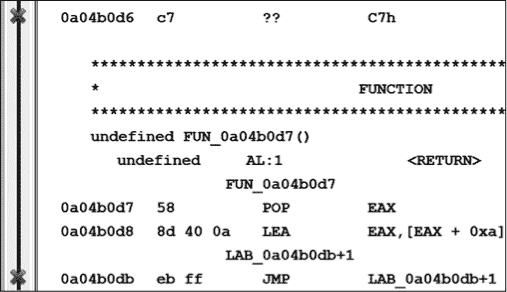
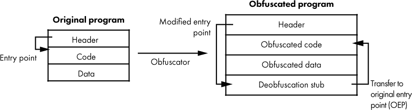
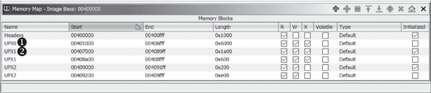
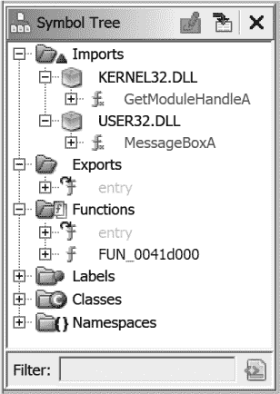
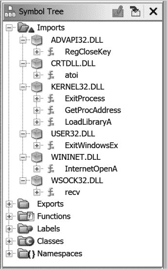
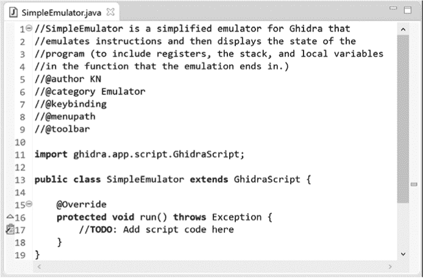

# 第二十五章：混淆代码分析**


即使在理想的情况下，理解反汇编列表也是一项困难的任务。高质量的反汇编对于任何试图理解二进制文件内部工作原理的人都是至关重要的，这也是我们在过去 20 章中讨论 Ghidra 及其相关功能的原因。可以说，Ghidra 在它的工作中如此高效，以至于它降低了进入二进制分析领域的门槛。虽然这绝不是 Ghidra 独有的成就，但二进制逆向工程的近期进展并没有被那些不希望自己的软件被分析的人忽视。因此，在过去的几年里，程序员与逆向工程师之间为了保持代码的机密性，进行了一场某种意义上的技术竞赛。

本章我们将探讨 Ghidra 在这场技术竞赛中的作用，并讨论一些已采取的保护代码的措施，以及应对这些措施的方法。最后，我们将介绍 Ghidra 的`Emulator`类，并举例说明仿真脚本如何帮助我们在这场技术竞赛中占得先机。

### 反向工程防护

*反向工程防护*是一个涵盖所有软件开发人员可能采用的技术的总称，这些技术的目的是使得逆向工程他们的产品变得更加具有挑战性。许多工具和技术存在，旨在帮助开发者实现这一目标，而且每天都有新的技术出现。RE/反 RE 生态系统类似于恶意软件作者与杀毒软件供应商之间的日益升级的动态。

作为一名逆向工程师，你可能会遇到从简单到几乎无法攻克的各种技术。你需要使用的方法也会根据你遇到的反逆向技术的性质而有所不同，可能需要一定程度上熟悉静态和动态分析技术。在接下来的章节中，我们将讨论一些常见的反逆向技术、它们为何被采用以及如何克服这些技术的方法。

#### *混淆*

各种词典定义表明，*混淆*是指将某物变得模糊、复杂、混乱或令人困惑，以防止他人理解该混淆的项目。在本书的背景下，以及在使用 Ghidra 时，被混淆的项目是二进制可执行文件（而不是源文件或硅片等）。

混淆本身过于广泛，不能被视为一种反逆向工程技术。它也无法涵盖所有已知的反逆向工程技术。具体的、单独的技术通常可以描述为混淆或非混淆技术，适用时，我们将在以下部分指出这些技术。需要注意的是，没有单一正确的方式来分类这些技术，因为一般类别的描述常常是重叠的。此外，新的反逆向工程技术正在不断发展，因此无法提供一个包罗万象的列表。

因为 Ghidra 主要是一个静态分析工具，我们发现将技术讨论分为两个大类更为有用：*反静态分析*和*反动态分析*。这两个类别都可能包含混淆技术，但前者更可能会困扰静态工具，而后者通常是针对调试器和其他运行时分析工具的。

#### *反静态分析技术*

*反静态分析技术*旨在防止分析人员在不实际运行程序的情况下理解程序的性质。这正是针对像 Ghidra 这样的反汇编工具的技术，因此在使用 Ghidra 进行二进制逆向工程时，这类技术是最值得关注的。这里讨论了几种反静态分析技术。

##### 反汇编同步化

一种较旧的技术旨在通过创造性地使用指令和数据，防止反汇编工具找到一个或多个指令的正确起始地址。强制反汇编工具失去方向通常会导致反汇编失败，或者至少是错误的反汇编结果。列表 21-1 显示了 Ghidra 在反汇编 Shiva 反逆向工程工具部分代码时的努力。^(1)

```
  0a04b0d1 e8 01 00 00 00 CALL➊ FUN_0a04b0d7

  0a04b0d6 c7             ??     C7h➋

       ************************************************************

       *                         FUNCTION                         *

       ************************************************************

       undefined FUN_0a04b0d7()

          undefined AL:1 <RETURN>

       FUN_0a04b0d7                           XREF[1]: FUN_0a04b0c4:0a04b0d1(c)

  0a04b0d7 58             POP➌  EAX

  0a04b0d8 8d 40 0a       LEA➍  EAX,[EAX + 0xa]

          LAB_0a04b0db+1                      XREF[0,1]: 0a04b0db(j)

➎ 0a04b0db eb ff          JMP   LAB_0a04b0db+1

  0a04b0dd e0             ??➏   E0h
```

*列表 21-1：初步 Shiva 反汇编示例*

这个示例执行了一个 `CALL` ➊，紧接着是一个 `POP` ➌。这个序列在自修改代码中并不罕见，代码通过它来发现自己在哪个内存位置运行。调用指令的返回地址 ➋ 是 `0a04b0d6`，它位于栈顶，当执行到 `POP` 指令时。`POP` 指令从栈中移除返回地址并将其加载到 `EAX` 寄存器中，紧接着的 `LEA` 立即将 `0xa`（即 10）加到 `EAX` 中，这样 `EAX` 现在存储的是 `0a04b0e0`（请记住这个值，我们稍后会用到）。

被调用的函数不太可能返回到原始的调用点，因为原始返回地址已经不在栈顶（它需要被替换才能 `RET` 回原来的返回位置），而且 Ghidra 无法在返回地址 ➋ 处形成指令，因为 `C7h` 不是有效的指令起始字节。

到目前为止，代码可能有点不寻常或者难以理解，但 Ghidra 展示的是正确的反汇编。当达到 `JMP` ➎ 指令时，情况就发生了变化。这条跳转指令长 2 个字节，地址是 `0a04b0db`，跳转目标是 `LAB_0a04b0db+1`。标签中的 `+1` 后缀对我们来说是新的。标签的地址部分与跳转本身的地址相同。`+1` 告诉你，跳转目标在 `LAB_0a04b0db` 之后 1 个字节。换句话说，跳转指令正好跳到了 2 字节跳转指令的中间。虽然处理器不在乎这种不寻常的情况（它会很高兴地获取指令指针所指向的内容），但 Ghidra 无法处理这个问题。Ghidra 没有办法同时显示 `0a04b0db` 处的字节（`ff`）既是跳转指令的第二个字节，又是另一条指令的第一个字节。因此，Ghidra 无法继续进行反汇编，这在 `0a04b0dd` 处的未定义数据值 ➏ 中得到了体现。（这种行为不仅限于 Ghidra：几乎所有反汇编器，无论是使用递归下降算法还是线性扫描算法，都无法避免这种技术带来的问题。）

Ghidra 在反汇编过程中会通过创建*错误书签*来记录它遇到的任何问题。图 21-1 显示了两个这样的书签（位于有问题地址左侧的 X 图标），它们出现在列表窗口的左侧边距中。将鼠标悬停在错误书签上会显示相关的详细信息。此外，你可以通过使用窗口 ▸ 书签来打开当前二进制文件中所有书签的列表。

Ghidra 对第一个错误的提示是“无法解析位于 0a04b0d6 的构造函数（来自 0a04b0d1 的流程）”，大致意思是“我认为 0a04b0d6 处应该存在一条指令，但我没能创建它。”Ghidra 对第二个错误的提示是“由于 0a04b0db 处的指令冲突（来自 0a04b0db 的流程），无法在 0a04b0dc 处进行反汇编”，大致意思是“我无法在现有指令中反汇编一条指令。”



*图 21-1：Ghidra 错误书签*

作为 Ghidra 用户，对于第一个错误你没有解决方案。一个字节序列要么是有效的指令，要么不是。对于第二个错误，通过一些努力你可以处理。解决这种情况的正确方法是取消定义包含目标调用字节的指令，然后在调用目标地址处定义一条指令，尝试重新同步反汇编。你将失去原始的指令，但可以留一个注释来提醒你原始指令是什么。以下是前面列出的包含重叠指令错误的部分：

```
          LAB_0a04b0db+1                       XREF[0,1]:   0a04b0db(j)

➊ 0a04b0db eb ff    JMP    LAB_0a04b0db+1

  0a04b0dd e0        ??     E0h
```

右键点击 `JMP` 指令 ➊ 并从上下文菜单中选择清除代码字节（快捷键 C）将显示以下未定义字节的列表：

```
  0a04b0db eb        ??     EBh

➊ 0a04b0dc ff       ??     FFh

  0a04b0dd e0        ??     E0h
```

作为`JMP`指令目标➊的字节现在可以进行重新格式化。通过右键点击指令的起始字节并选择反汇编（快捷键 D），原始字节将被更改为代码。此时，列表已更新为以下内容：

```
➊ 0a04b0dc ff e0    JMP    EAX

  0a04b0de 90        ??     90h

  0a04b0df c7        ??     C7h
```

跳转指令的目标结果是另一个跳转指令➊。 然而，在这种情况下，跳转对于反汇编器来说是无法跟踪的（并且可能会让人工分析员感到困惑），因为跳转的目标存储在寄存器（`EAX`）中，并在运行时计算得出。这是另一种反静态分析技术的示例，接下来的“动态计算目标地址”部分将讨论这一点。我们之前已经确定，在到达此跳转时，`EAX`的值为`0a04b0e0`，而这是我们必须从此地址恢复反汇编过程的位置。洗头、冲水、重复。

参考清单 21-1，作为手动跳转到`0a04b0e0`地址恢复反汇编的替代方法，您可以通过右键点击地址➌并选择设置寄存器值来将`EAX`的值设置为已知值。Ghidra 将为该指令添加一个称为*寄存器过渡*的特殊标记，以指示`JMP`目标`EAX`的*假定*值。随后从此位置清除（快捷键 C）并反汇编（快捷键 D）将重新启动递归下降反汇编过程，从`JMP`到目标`0a04b0e0`，并继续（包括在这些代码块之间创建交叉引用）。

这种方法的一个优点是代码被注释，以显示`JMP`指令的目标，从而使其他分析人员能够轻松跟踪此部分的有效控制流。（当与`0a04b0d8`处的`LEA`指令的后续覆盖结合使用时，这一点更加清晰，见清单 21-1）。这种替代方法会产生以下的列表：

```
0a04b0d7 58        POP    EAX

0a04b0d8 8d 40 0a  LEA    EAX,[EAX + 0xa]

                      -- Fallthrough Override: 0a04b0dc

0a04b0db eb        ??     EBh

            assume EAX = 0xa04b0e0

        LAB_0a04b0dc                         XREF[1]:     0a04b0d8  

0a04b0dc ff e0     JMP    EAX=>LAB_0a04b0e0

            assume EAX = <UNKNOWN>

0a04b0de 90        ??     90h

0a04b0df c7        ??     C7h

 LAB_0a04b0e0                         XREF[1]:     0a04b0dc(j)  

0a04b0e0 58        POP    EAX 0a04b0e0 POP EAX
```

另一个来自不同二进制文件的去同步化示例展示了处理器标志如何被用来将条件跳转转变为绝对跳转。以下反汇编示例展示了 x86 `Z`标志如何用于这种目的：

```
  00401000  XOR➊  EAX,EAX

  00401002  JZ➋   LAB_00401009+1

  00401004  MOV    EBX,dword ptr [EAX]

  00401006  MOV    dword ptr [param_1 + -0x4],EBX

       ➌ LAB_00401009+1                       XREF[0,1]: 00401002(j)

➍ 00401009  CALL   SUB_adfeffc6

  0040100e  FICOM  word ptr [EAX + 0x59]
```

在这里，`XOR`指令➊用于清零`EAX`寄存器并设置 x86 的`Z`标志。程序员知道`Z`标志已被设置，因此利用跳转零（`JZ`）指令➋，该指令将始终被执行，从而实现无条件跳转的效果。因此，跳转指令➋与跳转目标➌之间的指令将永远不会被执行，仅用于迷惑任何没有意识到这一点的分析员。这个例子还通过跳转到`00401009`处的`CALL`指令的中间➍来模糊实际的跳转目标。正确反汇编后，代码应如下所示：

```
  00401000  XOR    EAX,EAX

  00401002  JZ     LAB_0040100a

  00401004  MOV    EBX,dword ptr [EAX]

  00401006  MOV    dword ptr [param_1 + -0x4],EBX

➊ 00401009  ??    E8h

          LAB_0040100a                         XREF[1]: 00401002(j)

➋ 0040100a  MOV    EAX,0xdeadbeef

  0040100f  PUSH   EAX

  00401010  POP    param_1
```

跳转的实际目标➋已经揭示，同时导致最初不同步的额外字节➊也被揭示。确实可能使用更加间接的方法来设置和测试标志位，在执行条件跳转之前。分析这种代码的难度随着在测试处理器标志位之前可能影响标志位的操作数量增加而增加。

##### 动态计算的目标地址

*动态计算*这一术语简单地意味着执行流向的地址是在运行时计算的。在本节中，我们讨论了几种计算该地址的方式。这些技术的目的是隐藏（混淆）二进制文件将要遵循的实际控制流路径，以避免静态分析过程的窥探。

本节前面展示了这一技术的一个示例。该示例使用了调用指令将返回地址压入栈中。返回地址被直接从栈中弹出到寄存器，并将常量值加到寄存器中以推导最终的目标地址，最终通过执行跳转指令跳转到寄存器内容指定的位置。

可以开发出无限多种类似的代码序列来推导目标地址并将控制权转移到该地址。以下代码也是在 Shiva 中使用的，展示了动态计算目标地址的另一种方法：

```
  0a04b3be  MOV    ECX,0x7f131760              ; ECX = 7F131760

  0a04b3c3  XOR    EDI,EDI                     ; EDI = 00000000

  0a04b3c5  MOV    DI,0x1156                   ; EDI = 00001156

  0a04b3c9  ADD    EDI,0x133ac000              ; EDI = 133AD156

  0a04b3cf  XOR    ECX,EDI                     ; ECX = 6C29C636

  0a04b3d1  SUB    ECX,0x622545ce              ; ECX = 0A048068

  0a04b3d7  MOV    EDI,ECX                     ; EDI = 0A048068

  0a04b3d9  POP    EAX

  0a04b3da  POP    ESI

  0a04b3db  POP    EBX

  0a04b3dc  POP    EDX

  0a04b3dd  POP    ECX

➊ 0a04b3de  XCHG   dword ptr [ESP],EDI         ; TOS =   0A048068

  0a04b3e1  RET                                ; return to 0A048068
```

分号右侧的注释记录了每条指令对各种处理器寄存器所做的更改。该过程最终将计算出的值移到栈的顶部位置（`TOS`）➊，这导致返回指令将控制权转移到计算得到的位置（此例为`0A048068`）。分析员本质上必须手动运行代码，以确定程序实际执行的控制流路径。

##### 混淆的控制流

近年来，已经开发和使用了更为复杂的控制流隐藏方法。在最复杂的情况下，一个程序会使用多个线程或子进程来计算控制流信息，并通过某种形式的进程间通信（对于子进程）或同步原语（对于多个线程）来接收这些信息。

在这种情况下，静态分析可能变得非常困难，因为不仅需要理解多个可执行实体的行为，还需要理解这些实体交换信息的具体方式。例如，一个线程可能会等待一个共享信号量对象，而第二个线程计算值或修改代码，第一线程将在第二个线程通过信号量发出完成信号后使用这些数据。^(2)

另一种技术，通常用于 Windows 恶意软件中，涉及配置一个异常处理程序，^(3)故意触发一个异常，然后在处理异常时操控进程寄存器的状态。以下示例是 tElock 反逆向工程工具用于掩盖程序实际控制流的方式：

```
➊ 0041d07a  CALL   LAB_0041d07f

          LAB_0041d07f                         XREF[1]: 0041d07a(j)

➋ 0041d07f  POP    EBP

➌ 0041d080  LEA    EAX,[EBP + 0x46]

➍ 0041d083  PUSH   EAX

  0041d084  XOR    EAX,EAX

➎ 0041d086  PUSH   dword ptr FS:[EAX]

➏ 0041d089  MOV    dword ptr FS:[EAX],ESP

➐ 0041d08c  INT    3

  0041d08d  NOP

  0041d08e  MOV    EAX,EAX

  0041d090  STC

  0041d091  NOP

  0041d092  LEA    EAX,[EBX*0x2 + 0x1234]

  0041d099  CLC

  0041d09a  NOP

  0041d09b  SHR    EBX,0x5

  0041d09e  CLD

  0041d09f  NOP

  0041d0a0  ROL    EAX,0x7

  0041d0a3  NOP

  0041d0a4  NOP

➑ 0041d0a5  XOR    EBX,EBX

➒ 0041d0a7  DIV    EBX

  0041d0a9  POP    dword ptr FS:[0x0]
```

该序列首先通过`CALL` ➊调用下一个指令 ➋；`CALL`指令将`0041d07f`推入栈中作为返回地址，随后该地址被弹出并存入`EBP`寄存器 ➋。接下来，`EAX`寄存器 ➌被设置为`EBP`和`46h`的和，即`0041d0c5`，该地址作为异常处理程序函数的地址被推入栈中 ➍。异常处理程序的其余设置发生在➎和➏处，这完成了将新的异常处理程序链接到由`FS:[0]`引用的现有异常处理程序链中的过程。^(4)

下一步是故意生成一个异常➐，在本例中是一个`INT 3`，它是一个软件陷阱（中断），用于调试器。（在 x86 程序中，`INT 3`指令被调试器用来实现软件断点。）通常在此时，附加的调试器会获得控制权，因为调试器有机会首先处理该异常。在本例中，程序完全预期会处理该异常，因此任何附加的调试器必须被指示将异常传递给程序。不允许程序处理异常可能导致程序运行不正常或崩溃。如果没有理解如何处理`INT 3`异常，就无法知道程序接下来会发生什么。如果我们假设执行在`INT 3`之后简单地恢复，那么看起来除法零异常将在指令➑和➒之后最终被触发。

与前面的代码相关联的异常处理程序的反汇编版本从地址`0041d0c5`开始。该函数的第一部分如下所示：

```
int FUN_0041d0c5(EXCEPTION_RECORD *param_1,void *frame,➊CONTEXT *ctx) {

  DWORD code;

➋ ctx->Eip = ctx->Eip + 1;

➌ code = param_1->ExceptionCode;

➍ if (code == EXCEPTION_INT_DIVIDE_BY_ZERO) {

    ctx->Eip = ctx->Eip + 1;

  ➎ ctx->Dr0 = 0;

    ctx->Dr1 = 0;

    ctx->Dr2 = 0;

    ctx->Dr3 = 0;

    ctx->Dr6 = ctx->Dr6 & 0xffff0ff0;

    ctx->Dr7 = ctx->Dr7 & 0xdc00;

  }
```

异常处理程序函数 ➊的第三个参数是一个指向 Windows `CONTEXT`结构的指针（在 Windows API 头文件*winnt.h*中定义）。`CONTEXT`结构通过包含异常发生时所有处理器寄存器的内容来初始化。异常处理程序有机会检查并在需要时修改`CONTEXT`结构的内容。如果异常处理程序认为它已修复导致异常的问题，它可以通知操作系统允许出现问题的线程继续执行。此时，操作系统从提供给异常处理程序的`CONTEXT`结构中重新加载线程的处理器寄存器，然后线程的执行将恢复，就像什么都没有发生过一样。

在前面的例子中，异常处理程序首先访问线程的`CONTEXT`，以便递增指令指针 ➋，允许执行继续进行，跳过生成异常的那条指令。接下来，获取异常的类型代码（`EXCEPTION_RECORD`中的一个字段） ➌ ，以确定异常的性质。异常处理程序的这一部分处理了前面例子中产生的除以零错误 ➍，通过将所有 x86 硬件调试寄存器清零 ➎ 并禁用硬件断点。^(5) 在没有检查剩余的 tElock 代码之前，无法立即理解为什么要清空调试寄存器。在这种情况下，tElock 清除了来自之前操作的值，其中它使用调试寄存器设置了四个断点，除了之前看到的`INT 3`。除了混淆程序的真实执行流，清空或修改 x86 调试寄存器可能会对软件调试工具（如 OllyDbg 或 GDB）造成严重干扰。此类反调试技术在第 487 页的“反动态分析技术”中有讨论。

##### 操作码混淆

虽然到目前为止所描述的技术确实为理解程序的控制流提供了——实际上，它们旨在提供——一定的障碍，但没有一种方法能够完全防止你观察正在分析的程序的正确反汇编形式。反同步化对反汇编影响最大，但通过重新格式化反汇编以反映正确的指令流，轻松战胜了这一技术。

防止正确反汇编的一个更有效的技术是在可执行文件创建时对实际指令进行编码或加密。混淆的指令必须在被处理器取出执行之前恢复为原始形式。因此，程序的至少一部分必须保持未加密状态，以作为启动例程，在混淆程序的情况下，这通常负责将程序的其余部分部分或全部进行反混淆。图 21-2 展示了混淆过程的一个非常通用的概览。



*图 21-2：通用混淆过程*

如图所示，输入到该过程的是一个需要混淆的程序。在许多情况下，输入程序使用标准编程语言和构建工具（如编辑器、编译器等）编写，对即将进行的混淆几乎没有考虑。生成的可执行文件被输入到一个混淆工具，该工具将二进制文件转换为一个功能上等效但被混淆的二进制文件。如图所示，混淆工具负责混淆原始程序的代码和数据部分，并添加额外的代码（去混淆存根），该存根在运行时能够执行去混淆操作，使得原始功能能够被访问。混淆工具还会修改程序头信息，将程序入口点重定向到去混淆存根，确保执行从去混淆过程开始。去混淆后，执行通常会转移到原始程序的入口点，程序开始执行，就好像它从未被混淆过一样。

这个过于简化的过程根据所使用的混淆工具而有很大差异。现有越来越多的工具可用于处理混淆过程。这些工具提供了从压缩到反反汇编和反调试等技术的各种功能。例如，像 UPX（压缩工具，也支持 ELF；* [`upx.github.io/`](https://upx.github.io/)*）、ASPack（压缩工具；* [`www.aspack.com/`](http://www.aspack.com/)*）、ASProtect（反逆向工程，由 ASPack 开发者制作）、tElock（压缩和反逆向工程；* [`www.softpedia.com/get/Programming/Packers-Crypters-Protectors/Telock.shtml`](http://www.softpedia.com/get/Programming/Packers-Crypters-Protectors/Telock.shtml)*）等程序适用于 Windows PE 文件。混淆工具的功能已经发展到某些反逆向工程工具（如 VMProtect）可以与整个构建过程集成，使得程序员能够在开发的每个阶段，从源代码到编译后的二进制文件后处理，集成反逆向工程功能（* [`vmpsoft.com/`](https://vmpsoft.com/)*）。

**沙箱环境**

反向工程的*沙箱环境*的目的是让你以一种能够观察程序行为的方式执行程序，而不会让这种行为对反向工程平台的关键组件或其连接的任何内容产生不利影响。沙箱环境通常使用平台虚拟化软件构建，但也可以在能够在执行任何恶意软件后恢复到已知良好状态的专用系统上构建。

沙箱系统通常会进行大量的监控，以便观察和收集运行在沙箱内的程序的行为信息。收集的数据可能包括程序的文件系统活动、（Windows）程序的注册表活动以及程序生成的任何网络活动信息。一个完整的沙箱环境的例子是 Cuckoo (*[`cuckoosandbox.org/`](https://cuckoosandbox.org/)*)，它是一个专门用于恶意软件分析的流行开源沙箱。

和任何进攻性技术一样，防御措施也已被开发出来，以应对许多反反向工程工具。在大多数情况下，这些工具的目标是恢复原始的、未保护的可执行文件（或一个合理的副本），然后可以使用更传统的工具，如反汇编器和调试器，进行分析。

一个旨在去混淆 Windows 可执行文件的工具叫做 QuickUnpack (*[`qunpack.ahteam.org/?p=458`](http://qunpack.ahteam.org/?p=458)*；该网站为俄语)。QuickUnpack 与许多其他自动解包器一样，通过充当调试器，允许一个混淆的二进制文件通过其去混淆阶段执行，然后捕获内存中的进程镜像。请注意，这种类型的工具实际上是运行潜在的恶意程序，目的是在这些程序解包或去混淆后但尚未做出恶意行为之前拦截它们的执行。因此，您应该始终在沙箱类型的环境中执行此类程序。

使用纯静态分析环境来分析混淆代码是一项具有挑战性的任务。在无法执行去混淆存根的情况下，必须先解包或解密二进制文件中的混淆部分，然后才能开始反汇编。右侧的 Ghidra 地址类型概览栏（见图 21-3）显示了使用 UPX 打包器打包的可执行文件的布局。Ghidra 在概览栏中对内容进行颜色编码，以便指示二进制文件中相关内容。概览栏的常见类别包括以下内容：

+   功能

+   未初始化

+   外部引用

+   指令

+   数据

+   未定义

通过图中的概览栏，我们可以看到 Ghidra 对二进制文件各个部分的初步评估。将鼠标悬停在概览栏的任何部分上，都会提供关于该二进制文件相应区域的附加信息。这个特别的导航栏的异常外观是一个提示，表明这个二进制文件以某种方式被混淆了。让我们更仔细地查看概览栏中的一些部分。

Ghidra 在文件开始处识别出了一个数据段➊。检查此内容后，可以看到文件的头信息以及一些指示文件使用的混淆类型的内容：

```
  This file is packed with the UPX executable packer http://upx.tsx.org

  UPX 1.07 Copyright (C) 1996-2001 the UPX Team. All Rights Reserved.
```


*图 21-3：使用 UPX 压缩的二进制文件的 Ghidra Listing 窗口和地址类型概览栏*

本节后面是一个未定义内容块 ➋，类似于以下内容，它出现在 Listing 窗口中：

```
004008a3 72        ??     72h    r

004008a4 85        ??     85h

004008a5 6c        ??     6Ch    l
```

最大的部分 ➌ 包含未初始化的数据，在 Listing 窗口中显示如下：

```
004034e3  ??       ??

004034e4  ??       ??
```

在文件稍后的部分，Ghidra 识别出了另一个未定义的内容块 ➍。该数据的末尾是 Ghidra 识别为一个函数的区域 ➎。该函数很容易识别为 UPX 解压缩存根，Ghidra 已将其标识为二进制文件的入口点，如 图 21-3 左侧的 Listing 窗口所示。我们观察到的未定义内容块 ➋➍ 是 UPX 压缩过程的结果。解压存根的任务是将这些数据解包到未初始化区域 ➌ 中，最后将控制权转移到解压后的代码。

地址类型概览栏提供的信息可以与二进制文件中每个段的属性相关联，以确定每个显示的信息是否一致。此二进制文件的内存映射如 图 21-4 所示。



*图 21-4：UPX 压缩二进制文件的内存映射*

在这个特定的二进制文件中，包含在 `UPX0` ➊ 和 `UPX1` ➋ 段中的整个地址范围（`00401000`–`00408fff`）被标记为可执行的（X 标志已设置）。鉴于这一点，我们应该期望看到整个地址类型概览栏的颜色被标记为表示函数。然而，事实上我们没有看到这一点，并且 `UPX0` 段的整个范围未初始化且可写，这应被视为非常可疑，并为我们提供了关于该二进制文件的重要线索，帮助我们继续进行分析。

使用 Ghidra 在静态环境中（不实际执行二进制文件）对此类文件进行解压操作的技术，讨论了“使用 Ghidra 对二进制文件进行静态去混淆”的内容，见 第 491 页。

#### *导入函数混淆*

反静态分析技术也可能隐藏二进制文件使用的共享库和库函数，以避免泄露关于二进制文件可能执行的潜在操作的信息。在大多数情况下，可以使像 `dumpbin`、`ldd` 和 `objdump` 这样的工具在列出库依赖项时失效。

这种混淆对 Ghidra 的影响在符号树中最为明显。我们之前提到的 tElock 示例的完整符号树如 图 21-5 所示。



*图 21-5：混淆二进制文件的符号树*

只有两个被引用的导入函数：`GetModulehandleA`（来自*kernel32.dll*）和`MessageBoxA`（来自*user32.dll*）。从这个简短的列表中几乎无法推测程序的行为。这里采用的技巧多种多样，但本质上归结为程序本身必须加载它所依赖的任何附加库，并且一旦这些库被加载，程序必须在这些库中找到所需的函数。在大多数情况下，这些任务由去混淆存根执行，在将控制权转交给去混淆后的程序之前。最终目标是使程序的导入表已正确初始化，就像操作系统自己的加载器执行的那样。

对于 Windows 二进制文件，一种简单的方法是使用`LoadLibrary`函数按名称加载所需的库，然后使用`GetProcAddress`函数在每个库中执行函数地址查找。要使用这些函数，程序必须显式链接到它们，或者有其他方式进行查找。tElock 示例的符号树中不包含这两个函数，而 UPX 示例的符号树，如图 21-6 所示，包含了这两个函数。



*图 21-6：UPX 示例的符号树*

负责重建导入表的实际 UPX 代码见于清单 21-2。

```
        LAB_0040886c                         XREF[1]: 0040888e(j)

0040886c  MOV    EAX,dword ptr [EDI]

0040886e  OR     EAX,EAX

00408870  JZ     LAB_004088ae

00408872  MOV    EBX,dword ptr [EDI + 0x4]

00408875  LEA    EAX,[EAX + ESI*0x1 + 0x8000]

0040887c  ADD    EBX,ESI

0040887e  PUSH   EAX

0040887f  ADD    EDI,0x8

00408882  CALL➊ dword ptr [ESI + 0x808c]=>KERNEL32.DLL::LoadLibraryA

00408888  XCHG   EAX,EBP

        LAB_00408889                         XREF[1]: 004088a6(j)

00408889  MOV    AL,byte ptr [EDI]

0040888b  INC    EDI

0040888c  OR     AL,AL

0040888e  JZ     LAB_0040886c

00408890  MOV    ECX,EDI

00408892  PUSH   EDI

00408893  DEC    EAX

00408894  SCASB.REPNE ES:EDI

00408896  PUSH    EBP

00408897  CALL➋ dword ptr [ESI + 0x8090]=>KERNEL32.DLL::GetProcAddress

0040889d  OR     EAX,EAX

 0040889f  JZ     LAB_004088a8

004088a1  MOV➌  dword ptr [EBX],EAX ; save to import table

004088a3  ADD    EBX,0x4

004088a6  JMP    LAB_00408889
```

*清单 21-2：UPX 中的导入表重建*

这个示例包含一个外部循环，负责调用`LoadLibrary` ➊，以及一个内部循环，负责调用`GetProcAddress` ➋。每次成功调用`GetProcAddress`后，新的函数地址会被存储到重建的导入表中 ➌。

这些循环是在 UPX 去混淆存根的最后部分执行的，因为每个函数都采用指向库名或函数名的字符串指针参数，而相关的字符串被保存在压缩数据区域中，以避免被`strings`工具检测到。因此，UPX 中的库加载无法在所需的字符串被解压之前进行。

回到 tElock 示例，出现了一个不同的问题。只有两个导入函数，而且都不是`LoadLibrary`或`GetProcAddress`，那么 tElock 工具如何执行 UPX 所执行的函数解析任务呢？所有 Windows 进程都依赖于*kernel32.dll*，这意味着它在所有进程的内存中都存在。如果一个程序能够定位到*kernel32.dll*，那么可以遵循一个相对简单的过程来定位该 DLL 中的任何函数，包括`LoadLibrary`和`GetProcAddress`。如前所示，拥有这两个函数后，就可以加载进程所需的任何附加库，并在这些库中找到所有必需的函数。

在他的论文《理解 Windows Shellcode》中，Skape 讨论了执行此操作的技术。^(6) 虽然 tElock 并未使用 Skape 详细描述的具体技术，但两者之间有许多相似之处，最终的效果是掩盖加载和链接过程的细节。如果没有仔细追踪程序的指令，很容易忽略库的加载或函数地址的查找。以下小段代码展示了 tElock 尝试定位 `LoadLibrary` 地址的方式：

```
0041d1e4  CMP    dword ptr [EAX],0x64616f4c

0041d1ea  JNZ    LAB_0041d226

0041d1ec  CMP    dword ptr [EAX + 0x4],0x7262694c

0041d1f3  JNZ    LAB_0041d226

0041d1f5  CMP    dword ptr [EAX + 0x8],0x41797261

0041d1fc  JNZ    LAB_0041d226
```

很明显，多个比较操作迅速接连进行。可能不太明显的是这些比较的目的。重新格式化每个比较中使用的操作数（右键点击，然后选择 **转换** ▸ **字符序列**）能稍微揭示一些代码的含义，如下所示的清单所示。

```
0041d1e4  CMP    dword ptr [EAX],"Load"

0041d1ea  JNZ    LAB_0041d226

0041d1ec  CMP    dword ptr [EAX + 0x4],"Libr"

0041d1f3  JNZ    LAB_0041d226

0041d1f5  CMP    dword ptr [EAX + 0x8],"aryA"

0041d1fc  JNZ    LAB_0041d226
```

每个十六进制常量实际上是一组四个 ASCII 字符，Ghidra 能够将其显示为引用的 ASCII 字符，并一起拼写出 `LoadLibraryA`。^(7) 如果三个比较成功，tElock 就找到了 `LoadLibraryA` 的导出表项，并通过几次简单的操作获取该函数的地址，以加载更多的库。tElock 的函数查找方式在一定程度上抵抗字符串分析，因为嵌入程序指令中的 4 字节常量不像标准的以 null 终止的字符串，因此除非你更改默认设置（例如，在字符串搜索时取消勾选“需要 null 终止”选项），否则这些常量不会被包含在 Ghidra 生成的字符串列表中。

通过仔细分析程序代码手动重建程序的导入表，在 UPX 和 tElock 的情况下会更加容易，因为最终，这两者都包含 ASCII 字符数据，你可以利用这些数据来准确确定所引用的库和函数。Skape 的论文详细描述了一个函数解析过程，其中代码中根本没有出现任何字符串。论文中讨论的基本思路是为每个需要解析的函数名称预先计算一个唯一的哈希值。^(8) 要解析每个函数，你可以在一个库的导出名称表中进行查找。表中的每个名称都被哈希化，你可以将生成的哈希值与预先计算的哈希值进行比较。如果哈希值匹配，你就找到了所需的函数，并可以轻松地在库的导出地址表中定位其地址。

要静态分析以这种方式混淆的二进制文件，你需要理解每个函数名使用的哈希算法，并将该算法应用于程序正在搜索的库所导出的所有名称。有了完整的哈希表，你可以简单地查找在程序中遇到的每个哈希，以确定该哈希所引用的函数。以下是为*kernel32.dll*生成的哈希表的一部分，可能像这样：

```
➊ GetProcAddress : 8A0FB5E2

  GetProcessAffinityMask : B9756EFE

  GetProcessHandleCount : B50EB87C

  GetProcessHeap : C246DA44

 GetProcessHeaps : A18AAB23

  GetProcessId : BE05ED07
```

请注意，哈希值是特定于在特定二进制文件中使用的哈希函数的，且可能在不同的二进制文件之间有所不同。使用这个特定的表格，如果在程序中遇到哈希值`8A0FB5E2` ➊，你可以快速确定该程序试图查找`GetProcAddress`函数的地址。

Skape 使用哈希值来解析函数名最初是为 Windows 漏洞的利用负载开发和记录的；然而，它们也已被用于混淆程序中。

#### *反动态分析技术*

过去几节中介绍的反静态分析技术对程序是否真正执行没有任何影响。实际上，虽然反静态分析技术可能使你仅使用静态分析技术难以理解程序的真实行为，但它们无法阻止程序执行，否则程序从一开始就会变得无法使用，从而根本不需要分析程序。

鉴于程序必须运行才能执行任何有用的工作，动态分析旨在观察程序的运行行为（即在程序运行时），而不是观察程序静止时的状态（即在程序未运行时使用静态分析）。在本节中，我们简要总结了几种常见的反动态分析技术。在大多数情况下，这些技术对静态分析工具几乎没有影响；然而，当有重叠时，我们会指出这一点。

##### 检测虚拟化

沙箱环境通常使用虚拟化软件，如 VMware，为恶意软件（或任何其他感兴趣的软件）提供执行环境。这种环境的优势是它们通常提供检查点和回滚功能，有助于将沙箱迅速恢复到已知的干净状态。主要的缺点是恶意软件可能能够检测到沙箱。在假设虚拟化等同于观察的情况下，许多希望保持隐匿的程序一旦确定自己正在虚拟机中运行，就会直接关闭。鉴于虚拟化在生产中的广泛使用，这一假设今天已经不如历史上那么有效。

以下列表描述了一些在虚拟化环境中运行的程序所使用的技术，这些技术用于判断它们是否在虚拟机中运行，而不是在本地硬件上运行：

**检测虚拟化特定的软件**

用户通常会在虚拟机中安装辅助应用程序，以促进虚拟机与其主机操作系统之间的通信，或仅仅是为了提高虚拟机内的性能。VMware Tools 集合就是这类软件的一个例子。此类软件的存在很容易被虚拟机内运行的程序检测到。例如，当 VMware Tools 被安装到 Microsoft Windows 虚拟机中时，它会创建 Windows 注册表键，这些键可以被任何程序读取。恶意软件检测到这些键时，可能会选择在展示任何显著行为之前关闭自己。另一方面，虚拟化如今已被广泛使用，因此在没有安装 VMware Tools 的 VMware 镜像，可能在恶意软件看来同样令人怀疑。

**检测虚拟化特定的硬件**

虚拟机使用虚拟硬件抽象层提供虚拟机与主机计算机本地硬件之间的接口。虚拟硬件的特征通常很容易被运行在虚拟机内的软件检测到。例如，VMware 已为其虚拟化的网络适配器分配了独有的组织标识符（OUI）。^(9) 观察到 VMware 特定的 OUI 是程序正在虚拟机中运行的一个良好指示。因而，因这个原因而关闭的程序可能通过修改与虚拟机相关的虚拟网络适配器的 MAC 地址来诱导其执行。

**检测处理器特定的行为变化**

完美的虚拟化是难以实现的。理想情况下，一个程序不应该能察觉虚拟化环境与本地硬件之间的任何区别。然而，这种情况很少发生。Joanna Rutkowska 在观察到本地硬件上 x86 `sidt` 指令与在虚拟机环境中执行相同指令之间的行为差异后，开发了她的 Red Pill VMware 检测技术。^(10)

##### 检测工具

在创建沙盒环境并执行任何程序之前，您需要确保已部署适当的工具来收集和记录有关您分析的程序行为的信息。有多种工具可用于执行此类监控任务。两个广泛使用的例子是来自微软 Sysinternals 组的*进程监视器*和*Wireshark*。11 进程监视器是一个实用工具，能够监控与任何正在运行的 Windows 进程相关的某些活动，包括访问 Windows 注册表和文件系统活动。Wireshark 是一个网络数据包捕获和分析工具，通常用于分析恶意软件生成的网络流量。

拥有足够偏执的恶意软件作者可能会将其软件编程为搜索运行中的此类监控程序实例。已采用的技术包括扫描活动进程列表，查找与此类监控软件相关的进程名称，或扫描所有活动 Windows 应用程序的标题栏文本，以搜索已知字符串。更深入的搜索可以执行，一些软件甚至会搜索与某些仪器化软件中使用的 Windows GUI 组件相关的特定特征。

##### 检测调试器

超越简单的程序观察，调试器允许分析人员完全控制需要分析的程序的执行。调试器通常用于运行一个混淆程序，直到完成任何解压或解密任务，然后利用调试器的内存访问功能从内存中提取去混淆的进程映像。在大多数情况下，可以使用标准的静态分析工具和技术来完成对提取进程映像的分析。

混淆工具的作者充分意识到这些调试器辅助的去混淆技术，因此他们已经采取措施，试图阻止使用调试器执行其混淆程序。检测到调试器存在的程序通常选择终止，而不是继续进行任何可能让分析人员确定程序行为的操作。

检测调试器的方法从通过知名 API 函数（如 Windows `IsDebuggerPresent` 函数）向操作系统发出简单查询，到检查由于使用调试器而产生的内存或处理器伪影。后者的一个例子包括检测处理器的跟踪（单步）标志是否已设置。

只要你知道应该查找什么，试图检测调试器其实并不复杂，而且在静态分析过程中，检测的尝试很容易被发现（除非同时使用反静态分析技术）。有关调试器检测的更多信息，请参阅文章《带有示例的反调试检测技术》，它提供了 Windows 反调试技术的全面概述。^(12)

##### 防止调试

即便是无法检测到的调试器，也可以通过一些额外的技术来阻碍，尝试通过引入虚假的断点、清除硬件断点、妨碍反汇编使选择合适的断点地址变得困难，或者防止调试器附加到进程来进行干扰。之前提到的反调试文章中讨论的许多技术，都是为了防止调试器正确运行。

故意生成异常是程序可能尝试阻碍调试的一种方式。在大多数情况下，附加的调试器会捕获到异常，调试器的用户必须分析异常发生的原因，并决定是否将异常传递给正在调试的程序。在如 x86 `INT 3` 这样的软件断点的情况下，很难区分是由底层程序生成的软中断，还是由实际的调试器断点引起的。正是这种混淆效果是混淆程序的创建者所希望达到的效果。在这种情况下，尽管更困难，但仍然可以通过仔细分析反汇编列表来理解真实的程序流程。

对程序的编码部分具有双重效果：一方面会阻碍静态分析，因为无法进行反汇编；另一方面会妨碍调试，因为设置断点变得困难。即使已知每条指令的起始位置，也无法在指令实际解码之前设置软件断点，因为通过插入软件断点修改指令可能导致混淆代码解密失败，从而在执行到预定断点时导致程序崩溃。

用于 Linux 的 Shiva ELF 混淆工具采用一种叫做*互相 ptrace*的技术来防止使用调试器分析 Shiva 的行为。

**进程追踪**

*ptrace*，或称进程跟踪（process tracing），是许多类 Unix 系统提供的 API，它允许一个进程监视并控制另一个进程的执行。GNU 调试器（`gdb`）是使用 ptrace API 的著名应用之一。通过 ptrace API，一个 ptrace 父进程可以附加到并控制一个 ptrace 子进程的执行。为了开始控制一个进程，父进程必须首先*附加*到它想要控制的子进程。一旦父进程附加，子进程在接收到信号时会被停止，父进程通过 POSIX 的`wait`函数接收到这个通知，父进程可以选择在指示子进程继续执行之前，修改或检查子进程的状态。一旦父进程附加到子进程，其他进程就无法再附加到该子进程，直到跟踪父进程选择从子进程上分离。

Shiva 利用了每次只能有一个其他进程附加到一个进程的事实。在其执行的早期，Shiva 进程会派生出一个自己的副本。原始的 Shiva 进程立即对新派生的子进程执行 ptrace 附加操作。新派生的子进程则立即附加到其父进程。如果任何一次附加操作失败，Shiva 会终止，并假设有调试器正在监视 Shiva 进程。如果两次附加操作都成功，其他调试器无法附加到正在运行的 Shiva 对，这样 Shiva 就能继续运行，而不必担心被观察到。在这种方式下运行时，任一 Shiva 进程可以更改另一个进程的状态，这使得使用静态分析技术很难确定 Shiva 二进制文件的确切控制流路径。

### 使用 Ghidra 进行二进制文件的静态去混淆

到这时，你可能会想，考虑到所有可用的反逆向工程技术，如何分析那些程序员有意隐瞒的软件呢？由于这些技术既针对静态分析工具，也针对动态分析工具，那么揭示程序隐藏行为的最佳方法是什么呢？不幸的是，没有一种解决方案能够适用于所有情况。

在大多数情况下，解决方案取决于你的技能和可用的工具。如果你选择的分析工具是调试器，你需要开发绕过调试器检测和防护措施的策略。如果你偏好的分析工具是反汇编器，你需要开发获取准确反汇编结果的策略，并且在遇到自修改代码的情况下，需要模拟该代码的行为，以便正确更新反汇编列表。

在这一节中，我们讨论了两种在静态分析环境中处理自修改代码的技术（即不执行代码的情况下）。静态分析可能是您的唯一选择，当您因敌意代码而不愿意（或因缺乏硬件而无法）在调试器控制下分析程序时。如果这些概念让您觉得自己正在陷入一个困境，不要气馁。Ghidra 具有一些秘密（或者说不那么秘密的）武器，我们可以在静态解混淆的军备竞赛中加以利用。

#### *面向脚本的解混淆*

由于 Ghidra 可以用于反汇编针对越来越多的处理器开发的二进制文件，因此分析为与您运行 Ghidra 的平台完全不同的另一个平台开发的二进制文件并不罕见。例如，您可能被要求分析一个 Linux x86 二进制文件，即使您恰好在 macOS 上运行 Ghidra，或者您可能被要求分析一个 MIPS 或 ARM 二进制文件，即使您在 x86 平台上运行 Ghidra。

在这种情况下，您可能无法访问合适的工具，例如调试器，用于动态分析二进制文件。当这样的二进制文件经过程序部分编码的混淆时，您可能别无选择，只能创建一个 Ghidra 脚本，模拟程序的解混淆阶段，以正确解码程序并反汇编解码后的指令和数据。

这看起来可能是一个令人生畏的任务；然而，在许多情况下，混淆程序的解码阶段只使用处理器指令集的一小部分，因此，熟悉必要的操作可能不需要理解目标处理器的整个指令集。

第十四章介绍了一种开发脚本以模拟程序部分行为的算法。在接下来的示例中，我们将利用这些步骤开发一个简单的 Ghidra 脚本，以解码一个使用 Burneye ELF 加密工具加密的程序。在我们的示例程序中，执行从第 21-3 节中的指令开始。

```
➊ 05371035  PUSH   dword ptr [DAT_05371008]

➋ 0537103b  PUSHFD

➌ 0537103c  PUSHAD

➍ 0537103d  MOV    ECX,dword ptr [DAT_05371000]

  05371043  JMP    LAB_05371082

  ...

          LAB_05371082                         XREF[1]:     05371043(j)

➎ 05371082  CALL   FUN_05371048

  05371087  SHL    byte ptr [EBX + -0x2b],1

  0537108a  PUSHFD

  0537108b  XCHG   byte ptr [EDX + -0x11],AL

  0537108e  POP    SS

  0537108f  XCHG   EAX,ESP

  05371090  CWDE

  05371091  AAD    0x8e

  05371093  PUSH   ECX

➏ 05371094  OUT    DX,EAX

  05371095  ADD    byte ptr [EDX + 0xa81bee60],BH

  0537109b  PUSH   SS

  0537109c  RCR    dword ptr [ESI + 0xc],CL

  0537109f  PUSH   CS

  053710a0  SUB    AL,0x70

  053710a2  CMP    CH,byte ptr [EAX + 0x6e]

  053710a5  CMP    dword ptr [DAT_cbd35372],0x9c38a8bc

  053710af  AND    AL,0xf4

  053710b1  SBB    EBP,ESP

  053710b4  POP    DS

➐ 053710b5  ??    C6h
```

*第 21-3 节：Burneye 启动序列和混淆代码*

程序开始时将内存位置 `05371008h` 的内容压入栈中 ➊，然后压入处理器标志 ➋ 和所有处理器寄存器 ➌。这些指令的目的尚不清楚，因此我们将这些信息暂时记录下来以备后用。接下来，`ECX` 寄存器被加载了内存位置 `05371000h` 的内容 ➍。根据第十四章中提出的算法，我们需要在这一点上声明一个名为 `ECX` 的变量，并通过 Ghidra 的 `getInt` 函数从内存中初始化它，如下所示：

```
int ECX = getInt(toAddr(0x5371000));    // from instruction 0537103d
```

在绝对跳转后，程序调用函数`FUN_05371048` ➎，并将地址`05371087h`（返回地址）压入栈中。紧跟着`CALL`指令的反汇编指令开始变得越来越不合常理。`OUT`指令 ➏通常不出现在用户空间代码中，而 Ghidra 无法反汇编位于地址`053710B5h`的指令 ➐。这些都表明该二进制文件可能存在问题（另外，符号树中只列出了两个函数：`entry`和`FUN_05371048`）。

此时，分析需要继续进行，接下来的函数调用是`FUN_05371048`，如 Listing 21-4 所示。

```
  FUN_05371048                                 XREF[1]:     entry:05371082(c)

➊ 05371048  POP    ESI

➋ 05371049  MOV    EDI,ESI

➌ 0537104b  MOV    EBX,dword ptr [DAT_05371004] = C09657B0h

  05371051  OR     EBX,EBX

➍ 05371053  JZ     LAB_0537107f

➎ 05371059  XOR    EDX,EDX

        ➏ LAB_0537105b                         XREF[1]:  0537107d(j)

  0537105b  MOV    EAX,0x8

        ➐ LAB_05371060                         XREF[1]:  05371073(j)

  05371060  SHRD   EDX,EBX,0x1

  05371064  SHR    EBX,1

  05371066  JNC    LAB_05371072

  0537106c  XOR    EBX,0xc0000057

          LAB_05371072                         XREF[1]:  05371066(j)

  05371072  DEC    EAX

  05371073  JNZ    LAB_05371060

  05371075  SHR    EDX,0x18

  05371078  LODSB  ESI

  05371079  XOR    AL,DL

  0537107b  STOSB  ES:EDI

  0537107c  DEC    ECX

  0537107d  JNZ    LAB_0537105b

          LAB_0537107f                         XREF[1]:  05371053(j)

  0537107f  POPAD

  05371080  POPFD

  05371081  RET
```

*Listing 21-4: 主 Burneye 解码函数*

这不是一个典型的函数：它开始时立即将返回地址从栈中弹出到`ESI`寄存器 ➊。回想一下，保存的返回地址是`05371087h`，并考虑到`EDI` ➋、`EBX` ➌和`EDX` ➎的初始化，我们的脚本扩展为如下：

```
int ECX = getInt(toAddr(0x5371000));   // from instruction 0537103D

int ESI = 0x05371087;                  // from instruction 05371048

int EDI = ESI;                         // from instruction 05371049

int EBX = getInt(toAddr(0x5371004));   // from instruction 0537104B

int EDX = 0;                           // from instruction 05371059
```

在这些初始化之后，函数会先对`EBX`寄存器中的值进行测试 ➍，然后进入外部循环 ➏和内部循环 ➐。函数的剩余逻辑在以下完成的脚本中得到了体现。脚本中使用注释将脚本操作与前述反汇编列表中的相应操作关联起来。

```
public void run() throws Exception {

   int ECX = getInt(toAddr(0x5371000));   // from instruction 0537103D

   int ESI = 0x05371087;                  // from instruction 05371048

   int EDI = ESI;                         // from instruction 05371049

   int EBX = getInt(toAddr(0x5371004));   // from instruction 0537104B

   if (EBX != 0) {                        // from instructions 05371051 

                                          //   and 05371053

      int EDX = 0;                        // from instruction 05371059

      do {

         int EAX = 8;                     // from instruction 0537105B

         do {

                                          // mimic x86 shrd instruction

                                          //   using several operations

            EDX = EDX >>> 1;              // unsigned shift right one bit

            int CF = EBX & 1;             // remember the low bit of EBX

            if (CF == 1) {                // CF represents the x86 carry flag

               EDX = EDX | 0x80000000;    // shift in low bit of EBX if it's 1

            }

            EBX = EBX >>> 1;              // unsigned shift right one bit

            if (CF == 1) {                // from instruction 05371066

               EBX = EBX ^ 0xC0000057;    // from instruction 0537106C

            }

            EAX--;                        // from instruction 05371072

         } while (EAX != 0);              // from instruction 05371073

         EDX = EDX >>> 24;                // unsigned shift right 24 bits

      ➊ EAX = getByte(toAddr(ESI));      // from instruction 05371078

         ESI++;

         EAX = EAX ^ EDX;                 // from instruction 05371079

         clearListing(toAddr(EDI));       // clear byte so we can change it

      ➋ setByte(toAddr(EDI), (byte)EAX); // from instruction 0537107B

         EDI++;

         ECX--;                           // from instruction 0537107C

      } while (ECX != 0);                 // from instruction 0537107D

   }

}
```

每当你尝试模拟一条指令时，应该特别注意数据大小和寄存器别名。在这个例子中，我们需要选择合适的数据大小和变量，以正确实现 x86 的`LODSB`（加载字符串字节）和`STOSB`（存储字符串字节）指令。这些指令分别对`EAX`寄存器的低 8 位进行写入（`LODSB`）和读取（`STOSB`），^(13)而不改变上 24 位。在 Java 中，除了通过各种按位操作来掩码并重新组合变量的部分外，无法将变量分割为位大小的部分。具体来说，对于`LODSB`指令 ➊，一个更忠实的模拟应如下所示：

```
EAX = (EAX & 0xFFFFFF00) | (getByte(toAddr(ESI)) & 0xFF);
```

这个例子首先清除`EAX`变量的低 8 位，然后通过`OR`操作将新的低 8 位值合并到其中。在 Burneye 解码示例中，每次外部循环开始时，整个`EAX`寄存器被设置为 8，这样就会将`EAX`的上 24 位置零。因此，我们决定简化`LODSB` ➊的实现，忽略赋值对`EAX`上 24 位的影响。对于`STOSB` ➋的实现无需过多思考，因为`setByte`函数要求我们将第二个参数转换为`byte`。

执行 Burneye 解码脚本后，我们的反汇编将反映所有那些通常在混淆程序在 Linux 系统上执行时才可观察到的变化。如果解混淆过程顺利进行，我们很可能会在 Ghidra 的“搜索 ▸ 字符串...”选项中看到更多清晰的字符串。为了观察这一点，你可能需要在字符串搜索窗口中选择刷新图标。

剩下的任务包括：(1) 确定解码函数将返回到哪里，因为它在函数的第一条指令中弹出了返回地址，(2) 引导 Ghidra 正确地显示解码后的字节值，作为指令或数据，具体取决于情况。Burneye 解码函数以以下三条指令结束：

```
0537107f  POPAD

05371080  POPFD

05371081  RET
```

回想一下，该函数从弹出自己的返回地址开始，这意味着剩余的栈值是由调用者设置的。这里使用的`POPAD`和`POPFD`指令是与 Burneye 启动例程开头使用的`PUSHAD`和`PUSHFD`指令相对的，正如这里所示：

```
       entry

➊ 05371035  PUSH   dword ptr [DAT_05371008]

  0537103b  PUSHFD

  0537103c  PUSHAD
```

最终结果是，栈上唯一剩下的值是第一行`entry` ➊推送的那个值。Burneye 解码例程会返回到这个位置，接下来对 Burneye 保护的二进制文件的进一步分析也必须从这个位置继续。

上面的示例可能让人觉得编写一个脚本来解码或解开一个混淆的二进制文件是一件相对容易的事。对于 Burneye 来说，这是真的，因为它并没有使用非常复杂的初始混淆算法。像 ASPack 和 tElock 这类更复杂的工具的解混淆代码，使用 Ghidra 实现时需要更多的工作。

基于脚本的解混淆的优点包括：被分析的二进制文件从不需要执行，而且有可能创建一个功能完整的脚本，而无需完全理解解混淆所使用的确切算法。这个后者的说法可能看起来违反直觉，因为似乎在你能够用脚本模拟该算法之前，你需要对解混淆算法有完整的理解。然而，按照这里描述的开发过程以及在第十四章中的说明，你真正需要的是对解混淆过程中涉及的每个处理器指令有完整的理解。通过忠实地使用 Ghidra 实现每个处理器动作，并根据反汇编列表正确地排列每个动作，你将获得一个脚本，能够模拟程序的行为，即使你不完全理解这些动作作为整体所实现的高级算法。

使用基于脚本的方法的缺点之一是脚本相当脆弱。如果去混淆算法因为去混淆工具的升级或通过对混淆工具使用替代命令行设置而发生变化，那么以前对该工具有效的脚本可能需要进行相应修改。例如，虽然可以为使用 UPX 打包的二进制文件开发通用解包脚本，但随着 UPX 的演变，这些脚本需要不断调整。

最后，脚本化去混淆存在缺乏通用解决方案的问题。没有一种超级脚本可以去混淆所有的二进制文件。从某种意义上来说，脚本化去混淆存在与基于签名的入侵检测和杀毒系统相似的缺点。每种新的打包器类型都需要开发新的脚本，并且现有打包器的细微变化可能会导致现有脚本失效。让我们转移焦点，看看一种更通用的去混淆方法。

#### *面向模拟的去混淆*

在创建用于执行去混淆任务的脚本时，常常遇到的一个主题是需要模拟处理器的指令集，以便与正在去混淆的程序行为一致。指令模拟器使我们能够将这些脚本执行的一部分或全部工作转交给模拟器，从而大幅减少 Ghidra 进行去混淆所需的时间。模拟器可以填补脚本与调试器之间的空白，并且比调试器更具灵活性。例如，模拟器可以在 x86 平台上模拟 MIPS 二进制文件，或者在 Windows 平台上模拟 Linux ELF 二进制文件的指令。

模拟器的功能各不相同。最低要求是模拟器需要处理指令字节流，并有足够的内存用于堆栈操作和处理器寄存器的分配。更为复杂的模拟器可能还会提供对模拟硬件设备和操作系统服务的访问。

##### Ghidra 的模拟器类

幸运的是，Ghidra 提供了丰富的`Emulator`类和`EmulatorHelper`，后者提供了常见模拟器功能的高级抽象，并便于快速轻松地创建模拟脚本。在第十八章中，我们介绍了 p-code 作为底层汇编的中间表示，并描述了它如何使反编译器能够针对多种目标架构进行工作。同样，p-code 也支持模拟器功能，Ghidra 的`ghidra.pcode.emulate.Emulate`类提供了模拟单个 p-code 指令的能力。

我们可以使用 Ghidra 的模拟器相关类来构建模拟器，允许我们模拟多种处理器类型。与 Ghidra 的其他包和类一样，这个功能在随 Ghidra 提供的 Javadoc 文档中有详细说明，并且可以通过点击脚本管理器窗口中的红色加号工具调出作为参考。如果你有兴趣编写模拟器，建议你查看以下示例中使用的模拟器方法的 Javadoc 文档。

**破解我，自己破解**

*crackme* 是逆向工程师为逆向工程师构建的谜题。这个名字来源于破解一段软件以绕过复制或使用限制——这是逆向工程技能的一种恶意用途。破解题为练习这些技能提供了合法手段，也为破解题的作者和分析破解题的人提供了展示其才华的机会。

一种常见的破解题风格是接受用户输入，对输入进行某种转换，然后将转换后的结果与预计算的输出进行比较。当你尝试解决一个破解题时，通常只有一个包含执行转换的代码和一个用于未知输入的最终输出的已编译可执行文件。破解题的解决方法是推导出用于生成二进制文件中输出的输入，这通常需要理解转换过程到足以推导出逆转换函数。

##### 示例：SimpleEmulator

假设我们有一个与以下破解挑战相关的二进制文件，其中在文件开头有一些编码内容，这些内容最终作为函数体的一部分。在这个示例中，我们构建了一个模拟器脚本来自动化解码解决破解问题所需的信息的过程：

```
➊ unsigned char check_access[] = {

      0xf0, 0xed, 0x2c, 0x40, 0x2c, 0xd8, 0x59, 0x26, 0xd8,

      0x59, 0xc1, 0xaa, 0x31, 0x65, 0xaa, 0x13, 0x65, 0xf8, 0x66

  };

 unsigned char key = 0xa5;

  void unpack() {

      for (int ii = 0; ii < sizeof(check_access); ii++) {

        ➋ check_access[ii] ^= key;

      }

  }

  void do_challenge() {

      int guess;

      int access_allowed;

      int (*check_access_func)(int);

    ➌ unpack();

      printf("Enter the correct integer: ");

      scanf("%d", &guess);

      check_access_func = (int (*)(int))check_access;

      access_allowed = check_access_func(guess)➋;

      if (access_allowed) {

          printf("Access granted!\n");

      } else {

          printf("Access denied!\n");

      }

  }

  int main() {

      do_challenge();

      return 0;

  }
```

即使源代码可用，这个破解题仍然需要一些努力才能解决，因为它包含了编码内容 ➊。Ghidra 的反编译器常常是解决破解题的得力伙伴，但这个例子有一些有趣的特性使得过程变得复杂。Ghidra 只能看到编码后的函数体，但在解决挑战之前，我们需要了解函数的实际功能。在运行时，`unpack` ➌ 函数调用会解码 `check_access` ➋ 函数，然后 `check_access` 才会被调用 ➍。这个破解题的答案是混淆的，我们可以在 Ghidra 中构建一个模拟器脚本来帮助我们攻克这个挑战。与前一个示例不同，这个模拟器不仅仅能为这个特定案例解决问题，而是能够模拟一些任意的代码。

#### *步骤 1：定义问题*

我们的任务是设计和开发一个简单的模拟器，允许我们选择反汇编区域并模拟该区域的指令。该模拟器需要被添加到 Ghidra 中，并作为脚本可用。例如，如果我们为 crackme 挑战选择`unpack`函数并运行脚本，我们的模拟器应该使用密钥来解包`check_access`数组，并告诉我们 crackme 挑战的解决方案。该脚本将把解包后的代码字节写入 Ghidra 程序的内存中。

#### *步骤 2：创建 Eclipse 脚本项目*

我们可以使用 GhidraDev ▸ New ▸ Ghidra 脚本项目创建一个名为*SimpleEmulator*的项目。这样，我们将在 Eclipse 中创建一个*SimpleEmulator*文件夹，并在其中创建一个名为*Home scripts*的文件夹（参见图 15-16，位于第 325 页），等待我们的新脚本。我们仍然需要创建实际的脚本并输入相关的元数据，以确保我们的脚本有文档并可以被分类。脚本创建对话框中收集的元数据将包含在文件中，正如图 21-7 所示，我们只需要做一件事：`在此处添加脚本代码`。



*图 21-7：SimpleEmulator 的脚本模板*

#### *步骤 3：构建模拟器*

我们知道，Eclipse 在我们开发代码时，如果需要导入内容，会自动推荐导入语句，因此我们可以直接开始编码任务，并在 Eclipse 检测到我们需要时添加推荐的`import`语句。在功能实现方面，我们将在整个`SimpleEmulator`类中依赖以下实例变量声明：

```
private EmulatorHelper emuHelper;   // EmulatorHelper member variable object

private Address executionAddress;   // Initially the start of the selection

private Address endAddress;         // End of the selected region
```

与每个声明相关的注释描述了每个变量的目的。`executionAddress`最初将被设置为选定范围的起始地址，但也将用于在选择区域中推进。

##### 步骤 3-1：设置模拟器

我们将在脚本的`run`方法中做的第一件事是实例化我们的模拟器辅助对象，并激活对模拟器中任何内存写入操作的跟踪，以便我们可以将更新后的值写回当前程序。实例化操作充当了一个锁，类似于 CodeBrowser 在打开二进制文件时所施加的锁：

```
emuHelper = new EmulatorHelper(currentProgram);

emuHelper.enableMemoryWriteTracking(true);
```

##### 步骤 3-2：选择要模拟的地址范围

因为我们希望用户选择要模拟的代码段，所以我们需要确保他们在列表窗口中选择了某些内容。如果没有选择，我们将生成错误消息。

```
if (currentSelection != null) {

    executionAddress = currentSelection.getMinAddress();

    endAddress = currentSelection.getMaxAddress().next();

} else {

    println("Nothing selected");

    return;

}
```

##### 步骤 3-3：准备模拟

在选择的区域内，我们希望确保查看到的是一条指令，以便建立初始的处理器上下文，初始化堆栈指针，并在选定区域的末尾设置一个断点。`continuing`标志指示我们是刚开始模拟还是继续模拟，并决定在步骤 3-4 中调用`emuHelper.run`的哪个版本：

```
Instruction executionInstr = getInstructionAt(executionAddress);

if (executionInstr == null) {

    printerr("Instruction not found at: " + executionAddress);

    return;

}

long stackOffset = (executionInstr.getAddress().getAddressSpace().

                    getMaxAddress().getOffset() >>> 1) - 0x7fff;

emuHelper.writeRegister(emuHelper.getStackPointerRegister(), stackOffset);

// Setup breakpoint at the end address

emuHelper.setBreakpoint(endAddress);

// Set continuing to false as we are just starting the emulation

boolean continuing = false;;
```

##### 步骤 3-4：执行模拟

在本节中，您应该能认识到一些 Ghidra API 函数的使用，这些函数在 第十四章 中有介绍（例如 `monitor.isCancelled`）。我们需要一个循环来驱动仿真，直到达到我们定义的终止条件：

```
➊ while (!monitor.isCancelled() &&

         !emuHelper.getExecutionAddress().equals(endAddress)) {

      if (continuing) {

 emuHelper.run(monitor);

      } else {

          emuHelper.run(executionAddress, executionInstr, monitor);

      }

    ➋ executionAddress = emuHelper.getExecutionAddress();

      // determine why the emulator stopped, and handle each possible reason

    ➌ if (emuHelper.getEmulateExecutionState() ==

          EmulateExecutionState.BREAKPOINT) {

          continuing = true;

      } else if (monitor.isCancelled()) {

          println("Emulation cancelled at 0x" + executionAddress);

          continuing = false;

      } else {

          println("Emulation Error at 0x" + executionAddress +

                  ": " + emuHelper.getLastError());

          continuing = false;

      }

    ➍ writeBackMemory();

      if (!continuing) {

          break;

      }

  }
```

在这个示例中，模拟将继续进行，直到监视器检测到用户取消操作、我们尚未到达所选指令范围的结束，或未触发错误条件 ➊。当模拟器停止时，我们需要更新当前执行地址 ➋，然后适当处理停止条件 ➌。最后一步是调用 `writeBackMemory()` 方法 ➍。

##### 步骤 3-5：将内存写回程序

`writeBackMemory()` ➍ 的实现如图所示。此模拟器将在一个解包例程中进行测试，该例程最终会更改内存中的字节。模拟器所做的内存更改仅存在于其工作内存中。内容需要写回到二进制文件，以便列出和其他用户界面能够准确反映通过执行解包例程中的指令所导致的更改。Ghidra 在其 `emulatorHelper` 中提供了相关功能来简化此过程。

```
private void writeBackMemory() {

    AddressSetView memWrites = emuHelper.getTrackedMemoryWriteSet();

    AddressIterator aIter = memWrites.getAddresses(true);

    Memory mem = currentProgram.getMemory();

    while (aIter.hasNext()) {

        Address a = aIter.next();

        MemoryBlock mb = getMemoryBlock(a);

        if (mb == null) {

            continue;

        }

 if (!mb.isInitialized()) {

            // initialize memory

            try {

                mem.convertToInitialized(mb, (byte)0x00);

            } catch (Exception e) {

                println(e.toString());

            }

        }

        try {

            mem.setByte(a, emuHelper.readMemoryByte(a));

        } catch (Exception e) {

            println(e.toString());

        }

    }

}
```

##### 步骤 3-6：清理资源

在此步骤中，我们需要清理资源并释放对当前程序的锁定。这两项操作可以通过一个简单的语句完成：

```
emuHelper.dispose();
```

由于此模拟器仅用于演示目的，我们在脚本中做了一些简化。为了节省空间，我们最小化了通常在生产脚本中包含的注释、功能、错误检查和错误处理。现在剩下的只是确认我们的模拟器脚本能够完成我们的目标。

#### *步骤 4：将脚本添加到我们的 Ghidra 安装中*

将脚本添加到我们的 Ghidra 安装中只需要将其放置在 Ghidra 可以找到的地方。如果您将脚本项目设置为链接项目，Ghidra 已经知道在哪里找到它。如果您没有链接脚本项目（或如果您在另一个编辑器中创建了模拟器脚本），则需要将其保存在 Ghidra 的某个脚本目录中，具体情况请参见 第十四章。

#### *步骤 5：在 Ghidra 中测试脚本*

为了测试脚本，我们将加载与 crackme 挑战源代码相关的二进制文件。当我们加载二进制文件并导航到 `unpack` 函数时，注意到它包含对 `check_access` 标签的引用：

```
0010077d 48 8d 05 8c 08 20 00  LEA    RAX,[check_access]
```

Decompiler 窗口中的代码包含以下内容，这并没有让我们更接近解决 crackme：

```
check_access[(int)local_c] = check_access[(int)local_c] ^ key;
```

在 Listing 窗口中双击 `check_access` 会将我们引导到地址 `00301010`，该地址看起来不像是函数内的指令。

```
00301010 f0 ed 2c 40 2c d8 59  undefined1[19]

         26 d8 59 c1 aa 31 65

         aa 13 65 f8 66
```

如果我们选择反汇编这个内容，我们会在 Ghidra 中收到坏数据错误。反编译器窗口对此位置也没有任何帮助。所以让我们使用脚本看看能否仿真 `unpack` 函数。我们选择构成 `unpack` 函数的指令，打开脚本管理器并运行我们的脚本。我们没有看到 `unpack` 函数或反编译器窗口中有任何可观察的变化。但是，如果我们导航到 `check_access`（`00301010`），内容已经发生了变化！

```
00301010 55 48 89 e5 89 7d     undefined1[19]

         fc 83 7d fc 64 0f

         94 c0 0f b6 c0 5d c3
```

我们可以清除这些代码字节（快捷键 C），然后反汇编（快捷键 D），并获得以下结果：

```
     check_access

00301010 55                    PUSH   RBP

00301011 48 89 e5              MOV    RBP,RSP

00301014 89 7d fc              MOV    dword ptr [RBP + -0x4],EDI

00301017 83 7d fc 64           CMP    dword ptr [RBP + -0x4],100

0030101b 0f 94 c0              SETZ   AL

0030101e 0f b6 c0              MOVZX  EAX,AL

00301021 5d                    POP    RBP

00301022 c3                    RET
```

这里是反编译器窗口中对应的代码：

```
ulong UndefinedFunction_00301010(int param_1)

{

  return (ulong)(param_1 == 100);

}
```

这只是一个概念验证脚本，用于展示如何利用仿真器帮助代码去模糊化，但它确实展示了如何通过使用 Ghidra 的仿真器支持类在 Ghidra 中构建一个相对通用的仿真器。还有其他情况下，开发和使用仿真器是合适的做法。与调试相比，仿真有一个直接的优势，即潜在的恶意代码永远不会被仿真器实际执行，而调试器辅助的去模糊化必须至少允许恶意程序的某部分执行，以便获得去模糊化后的程序版本。

### 总结

目前，模糊化程序在恶意软件中是常态，而非例外。任何尝试研究恶意软件样本内部操作的行为，几乎都需要某种形式的去模糊化。无论你是采用调试器辅助的动态去模糊化方法，还是更倾向于不运行潜在恶意代码而选择使用脚本或仿真来去模糊化二进制文件，最终的目标是生成一个可以完全反汇编并正确分析的去模糊化二进制文件。

在大多数情况下，这一最终分析将使用像 Ghidra 这样的工具进行。考虑到最终目标（使用 Ghidra 进行分析），从头到尾使用 Ghidra 是合理的。本文中介绍的技术旨在展示 Ghidra 能做的不仅仅是生成反汇编清单，接下来的章节将基于此，探讨我们如何使用 Ghidra 来修补我们的反汇编清单。
