## 第二十六章：**修补二进制文件**


在反向工程一个二进制文件时，你可能会决定修改原始二进制的行为。行为修改通常通过修补二进制文件来完成，方法是插入、删除或修改现有的指令。进行此类修改的动机有很多—其中一些比较有争议—包括以下几点：

+   修改恶意软件样本以消除防调试技术，防止恶意软件被研究

+   修补没有源代码的软件漏洞

+   自定义应用程序的启动画面或字符串内容

+   修改游戏逻辑以进行作弊

+   解锁隐藏功能

+   绕过许可检查或其他反盗版保护措施

本章我们并不打算教授任何不道德的行为，但我们讨论了修改二进制文件以反映你在 Ghidra 中所做更改的高层次挑战。第十四章 介绍了 `setByte` API 函数，第二十一章 展示了不同风格的仿真脚本如何修改加载到 Ghidra 中的程序内容。这些技术修改了导入到 Ghidra 中的内容，对原始二进制文件没有任何影响。为了完成修补过程，你将学会如何让 Ghidra 将更改写回磁盘上的文件。我们还将讨论不同类型补丁可能带来的挑战。

### 规划你的补丁

修补过程通常涉及以下步骤：

1.  确定你打算进行的修补类型。这通常由你修补的理由决定，如前所述。

1.  确定需要修补的程序位置。这通常需要对程序进行一定的研究和分析。

1.  规划补丁的内容。内容更改可能需要新的数据、新的机器代码或两者兼具。在任何情况下，你的更改必须经过深思熟虑，以防程序出现任何意外行为。

1.  使用 Ghidra 替换现有的程序内容（数据或代码）为你的替代内容。

1.  使用 Ghidra 验证你的更改是否已正确实施。

1.  使用 Ghidra 将你的更改导出为一个新的二进制文件。

1.  验证新的二进制文件是否按预期行为运行，必要时重复第 2 步。

在某些修补场景中，许多步骤可能显得几乎微不足道；而在其他场景中，它们将更加具有挑战性。在接下来的章节中，我们将回顾 Ghidra 可以帮助你完成的步骤，并讨论可能将你或 Ghidra 推向极限的情况。我们将从第 2 步开始，回顾 Ghidra 在修补过程中帮助你找到感兴趣项的几种方式。

### 寻找要更改的内容

补丁的具体性质将决定你需要修补的内容。定制启动画面或字符串需要你定位需要更改的原始数据。改变程序的逻辑需要修改或插入代码来改变程序的行为。在这种情况下，可能需要大量的逆向工程，仅仅是为了找到需要修改的程序位置。Ghidra 的许多功能都可以帮助完成这些任务，前面章节中已经介绍过。让我们回顾一下对于补丁制作有用的一些功能。

#### *搜索内存*

当你的补丁涉及修改程序数据时，你识别应用补丁位置的主要方式将是某种形式的内存搜索。最常见的内存搜索是 CodeBrowser 的“搜索 ▸ 内存”菜单选项（快捷键 S），如图 22-1 所示（展开了高级选项）。“搜索内存”对话框在第六章中已讨论过。

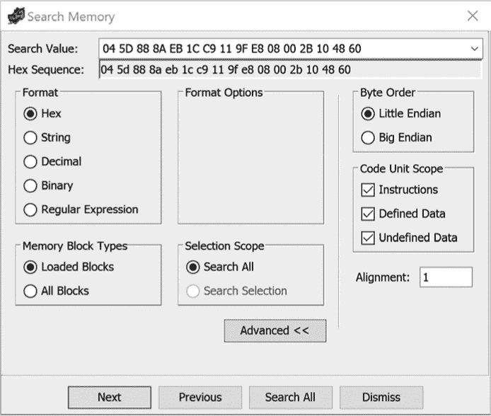

*图 22-1：搜索内存对话框*

“搜索内存”对话框在补丁制作的上下文中最为有用，尤其是在你要查找二进制文件中已知的特定数据时，如已知的字符串或十六进制序列。成功的搜索将使所有相关显示重新定位到匹配字节的位置，或者在“搜索所有”情况下，打开一个新对话框，列出所有可以找到匹配内容的地址。对于非常大的二进制文件，可能需要将搜索范围限制在程序中的特定区域（如指令、已定义数据、未定义数据等），通过取消选择任何无关的代码单元类型来减少搜索的范围。

**注意**

*虽然“搜索 ▸ 内存”提供了 Ghidra 中最为灵活的一般性搜索功能，但它是对数据库原始字节内容的搜索，其他类型的搜索可能更适合你正在查找的数据类型。例如，如果你想在你输入到程序中的注释内容中进行搜索，那么“搜索 ▸ 内存”就不适合你。有关在反汇编列表中搜索的更多信息，请参见“搜索程序文本”，第 115 页。*

#### *搜索直接引用*

在第二十章中，我们使用“搜索 ▸ 直接引用”扫描程序的二进制内容，查找特定地址的所有出现位置。此类搜索最常见的用途是定位指向感兴趣数据的指针，尤其是在 Ghidra 未能为这些数据创建交叉引用时。在补丁制作的上下文中，这通常用于全面理解并更新所有数据或代码位置的引用，以保持补丁二进制文件中代码和数据之间的正确关系。

#### *搜索指令模式*

Ghidra 的“搜索 ▸ 查找指令模式”功能通过匹配模式来查找特定的指令序列。定义指令模式时，需要在过于具体的模式和过于通用的模式之间找到微妙的平衡。让我们看一个例子来说明这个概念。假设我们有一个列出包含`cleanup_and_exit`函数的清单，该函数会退出程序：

```
   int test_even(int v) {

       return (v % 2 == 0);

   }

   int test_multiple_10(int v) {

       return (v % 10 == 0);

   }

   int test_lt_100(int v) {

       return v < 100;

   }

   int test_gte_20(int v) {

       return v >= 20;

   }

➊ void cleanup_and_exit(int rv, char* s) {

       printf("Result: %s\n", s);

       exit(rv);

   }

   void do_testing() {

       int v;

       srand(time(0));

       v = rand() % 150;

       printf("Testing %d\n", v);

     ➋ if (!test_even(v)) {

           cleanup_and_exit(-1, "failed even test");

       }

       if (test_multiple_10(v)) {

            cleanup_and_exit(-2, "failed not multiple of 10 test");

 }

       if (!test_lt_100(v)) {

           cleanup_and_exit(-3, "failed <100 test");

       }

       if (!test_gte_20(v)) {

           cleanup_and_exit(-4, "failed > 20 test");

       }

       // all tests passed so do interesting work here

     ➌ system("/bin/sh");

       cleanup_and_exit(0, "success!");

   }

   int main() {

       do_testing();

       return 0;

   }
```

函数`do_testing`执行一系列测试 ➋。如果任何测试失败，`cleanup_and_exit`函数 ➊ 会被调用，程序执行结束。如果所有测试都通过，某些非常有趣的代码 ➌ 将被执行。我们的修补挑战是确定需要在哪些地方修补，以确保所有测试都通过，从而使我们能够执行有趣的代码。

如果我们将二进制文件加载到 Ghidra 中，我们可以搜索所有对`cleanup_and_exit`的调用，以确定需要修补什么，以确保所有测试都通过，无论测试数量如何。我们有几个选项需要考虑：

+   我们可以直接进入该函数并修补它，使其返回，以便失败的测试不会退出程序，而是继续执行。这不是一个最佳解决方案，因为该函数也用于在程序完成有趣的工作后，合法地退出程序。

+   我们可以使用搜索功能或 XREFs 来查找`cleanup_and_exit`。这将给我们所有的调用，但我们只希望修补其中的一些。

+   我们可以识别出这些调用所共有的指令模式，并使用“搜索 ▸ 查找指令模式”来找到需要修补的正确调用。

要使用此搜索功能，我们需要确定一个有用的模式。我们尝试通过的每个测试在“清单”窗口中都有以下形式：

```
001008af  CALL   test_even

001008b4  TEST   EAX,EAX

001008b6  JNZ    LAB_001008c9

001008b8  LEA    RSI,[s_failed_even_test_00100a00]

001008bf  MOV    EDI,0xffffffff

001008c4  CALL   cleanup_and_exit
```

让我们通过选择指令序列并点击“搜索 ▸ 查找指令模式”来尝试搜索该序列。这将自动填充指令模式搜索对话框，如图 22-2 所示。

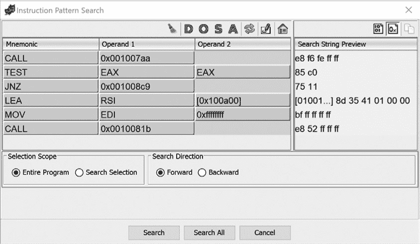

*图 22-2：选择所有字段的指令模式搜索对话框*

如果我们点击“搜索所有”，我们将看到只有一个结果（即我们在开始搜索时选择的特定位置），如图 22-3 所示。

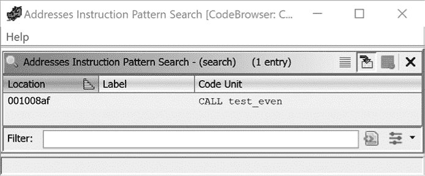

*图 22-3：选择所有字段后的指令模式搜索结果*

我们的问题是，我们包含了一些在测试案例之间不会保持不变的操作数。例如，第一个调用的操作数是某个特定测试函数的地址。我们可以取消选择任何指令模式中的单个组成部分（助记符和操作数），使其变得更加通用，如图 22-4 所示。任何被取消选择的部分都会在随后的搜索中被视为通配符。

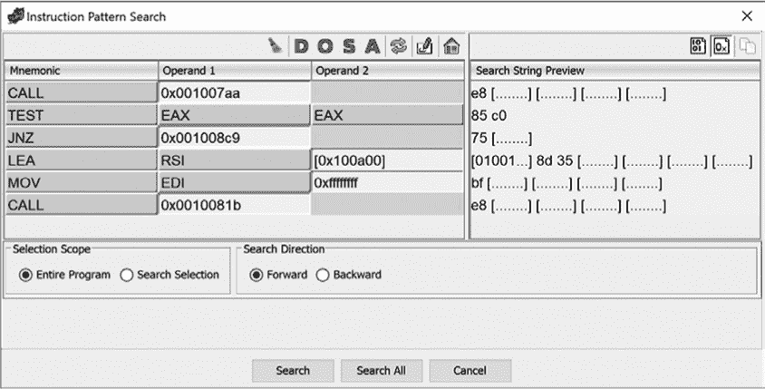

*图 22-4：选择部分操作数的指令模式搜索对话框*

如果我们点击禁用操作数字段的“搜索所有”按钮，我们将看到图 22-5 中显示的三个结果。

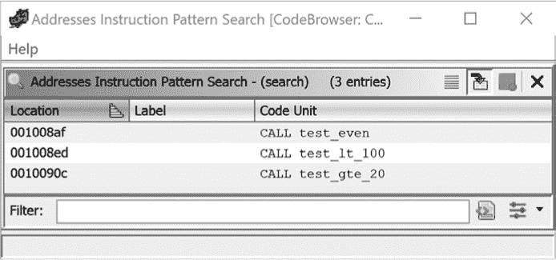

*图 22-5：指令模式搜索结果，部分操作数被取消选择*

搜索仍未能识别到对`test_multiple_10`的调用，该调用使用的是`JZ`指令而不是`JNZ`指令。取消选择`JNZ`指令的助记符字段并重新运行搜索，得到的结果如图 22-6 所示，其中包括了我们希望补丁的四个调用，并且没有包括我们不想补丁的最终调用`cleanup_and_exit`。


*图 22-6：指令模式搜索结果，带有`JNZ`并且部分操作数被取消选择*

这种搜索功能不仅用于定位补丁候选指令模式。它还可以用于漏洞分析、查找特定功能以及其他搜索，以识别对逆向工程师重要的指令模式。

#### *查找特定行为*

程序的行为由它执行的指令和执行这些指令时使用的数据共同定义。当你的补丁任务涉及修改程序行为时，定位你想要修改的确切行为通常比定位你希望更改的数据要困难得多。因为我们永远无法预测编译器可能为任何源代码生成的确切指令序列，所以使用 Ghidra 的自动化搜索功能来精准定位应用代码补丁的位置是具有挑战性的。定位特定行为归根结底还是要通过本书中介绍的各种技术对程序中的函数进行常规分析。

除了对二进制文件中所有函数的仔细分析或从一个熟悉的函数（如`main`）开始进行调用树的仔细遍历外，识别感兴趣函数的两种最常见方法是依赖于函数的名称（假设二进制文件有符号信息）以及利用来自“感兴趣”数据的交叉引用反向追溯到可能感兴趣的函数。例如，如果我们想定位二进制文件中的身份验证相关函数，我们可以搜索与身份验证相关的常见字符串，如`"请输入您的` `密码："`和`"身份验证失败"`。类似的字符串通常出现在身份验证过程的开头和结尾，找到引用这些字符串的函数可以显著减少我们搜索其他身份验证相关函数的范围。

在这里，可能会导致你找到感兴趣函数的数据的性质，取决于你特定的补丁场景。无论你使用何种方法定位一个函数作为补丁的候选，你都应始终验证该函数是否真正实现了你希望修改的行为。特别是，你应该始终对程序员为函数指定的名称保持警惕，因为函数的行为并不一定与其名称相符。

### 应用你的补丁

终于，你的辛勤工作和坚持不懈得到了回报，你找到了你希望修改的代码或数据。接下来怎么办？假设你已经开发了要替换到二进制中的内容，并且知道你准确的位置，现在是时候使用 Ghidra 的功能来修改程序了。

首先，你需要考虑的是新内容相对于你要替换的内容的大小。如果新内容的大小小于或等于原始内容的大小，那么你就很顺利，因为你的补丁会适应原始内容的内存占用。然而，当你的补丁大于原始内容时，事情就会变得有点棘手，我们稍后会专门讨论这种情况。

#### *进行基本更改*

无论你手头有一堆字节，还是需要借助汇编器的帮助，最终你都需要将内容导入 Ghidra。对于短小的字节序列，你可能会觉得使用 Ghidra 内置的字节编辑器或汇编器更为方便。对于较长的字节序列，你可能会想要自动化处理。接下来的几节将介绍 Ghidra 的一些字节级编辑功能。

##### 字节查看器

Ghidra 字节查看器（窗口 ▸ 字节），如 图 22-7 所示，提供了当前列出位置的原始字节内容的标准十六进制转储视图，并与每个其他链接的窗口同步。

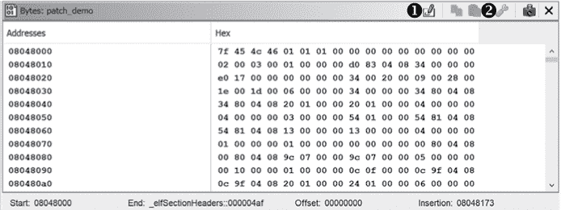

*图 22-7：Ghidra 字节查看器*

字节查看器也可以通过切换编辑模式工具 ➊ 作为十六进制编辑器使用，这是当你需要一次修改几个字节时的一个便捷选项。

不便之处在于，Ghidra 不允许你编辑任何现有指令的一部分。解决这一限制的方法是，在列表窗口中清除相关指令（右键点击清除代码字节或按快捷键 C）。字节查看器选项工具 ➋ 用于打开 图 22-8 所示的对话框，在此你可以自定义字节查看器的显示。

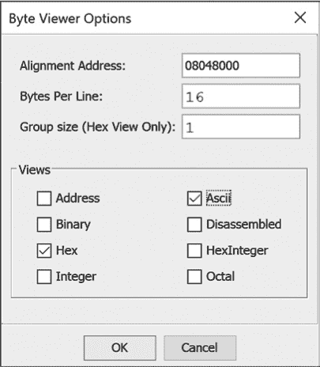

*图 22-8：字节查看器选项对话框*

选择 ASCII 选项会将 ASCII 转储添加到字节查看器中（见 图 22-9），这样在编辑模式下它就会同时充当 ASCII 编辑器。

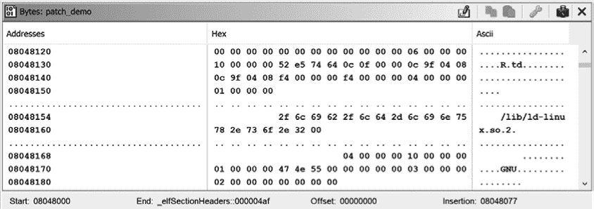

*图 22-9：启用 ASCII 转储的字节查看器*

一旦你完成了新值的输入，应该退出编辑模式并返回到列表窗口，验证你的更改是否正确。

##### 脚本化你的更改

除非你的补丁非常短，否则在 Ghidra 中修改原始字节的最有效方法是让脚本为你完成。给定一个字节数组形式的补丁，以及补丁的起始地址，以下函数将在 Ghidra 中应用补丁：

```
public void patchBytes(Address start, byte[] patch) throws Exception {

    Address end = start.add(patch.length);

  ➊ clearListing(start, end);

    setBytes(start, patch);

}
```

你可以将此功能包含在一个脚本中，该脚本根据你选择的来源创建补丁字节数组（例如，通过声明已初始化的数组或加载文件内容）。`clearListing`调用 ➊ 是必要的，因为 Ghidra 不允许你修改已经是现有指令或数据项一部分的字节。脚本完成后，你需要手动将补丁字节格式化为代码或数据，并验证补丁的正确性。

##### 使用汇编器

当你想在二进制文件中打补丁时，你很可能会考虑用另一条汇编语言指令替换原有指令（例如，将`CALL _exit`替换为`NOP`），这并不一定是错误的，但通常忽略了与补丁代码相关的一些复杂性。实际上，当你准备将补丁应用到程序时，你不能直接粘贴替换的汇编语言语句；你必须粘贴相应的机器码字节，这意味着你可能需要使用汇编器来生成所有替换指令的机器码版本。

一种方法是使用外部编辑器编写替换的汇编语句，使用外部汇编器（例如，`nasm`或`as`）进行汇编，提取原始机器码^(1)，最后将其打补丁到程序中，可能会像之前讨论的那样使用脚本。另一种方法是使用 Ghidra 内置的汇编器功能，可以通过右键单击任何指令并选择“补丁指令”菜单选项来访问。

就像 SLEIGH 规范告诉 Ghidra 如何将机器代码转换为汇编语言一样，它们还使 Ghidra 能够执行汇编到机器代码的转换——也就是说，像一个汇编器一样工作。第一次为特定架构选择“补丁指令”选项时，Ghidra 会基于该架构的 SLEIGH 规范构建一个汇编器。最初，你将看到类似于图 22-10 所示的消息。

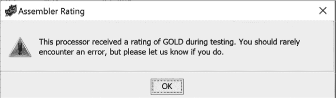

*图 22-10：汇编器评分对话框*

Ghidra 的开发者已经对 Ghidra 生成的汇编器的准确性进行了测试。如果一个处理器的汇编器已经过测试，它将被分配以下之一的评分（按准确性递减顺序）：铂金、黄金、白银、青铜和差。任何未测试的汇编器将标记为*未评分*。有关 Ghidra 汇编器评分的更多信息，以及所有可用汇编器的当前评分，可以在 Ghidra 帮助文档中找到。

一旦你关闭汇编器评分对话框，Ghidra 会根据当前处理器的 SLEIGH 规范构建所需的汇编器功能。在等待汇编器构建的过程中，Ghidra 会显示类似于图 22-11 所示的等待对话框。

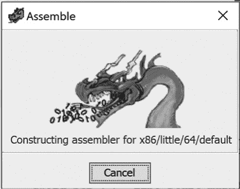

*图 22-11：汇编等待对话框*

一旦你的汇编器构建完成，Ghidra 会将列表窗口中选中的指令替换为两个文本输入框（见 图 22-12），允许你编辑指令的助记符和操作数。按 ESC 键会丢弃你的更改，在指令汇编之前，按 ENTER 键则会汇编新指令，并用新指令的机器码字节替换原指令的字节。

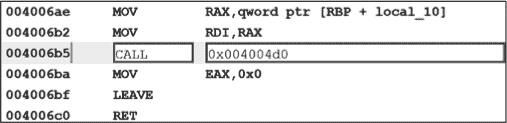

*图 22-12：汇编新指令*

因为它们源自与对应反汇编器相同的规范，Ghidra 的汇编器识别 Ghidra 列表窗口中使用的相同汇编语法。Ghidra 的汇编器区分大小写，并且在输入新指令时提供自动补全选项。输入指令后，Ghidra 会将你带回正常的列表窗口视图，如果有其他指令需要修改，你可以重新选择“Patch Instruction”。对于小型补丁，Ghidra 的汇编器提供了一种方便的方法，可以同时汇编指令并修改程序。

##### 指令替换陷阱

虽然 Ghidra 的汇编器能迅速修改单个指令，但新的替换指令可能比原指令更短、更长，或者与原指令相同大小。第三种情况，即替换指令和原指令大小相同，并不有趣。（前两种问题仅会出现在没有固定指令大小的架构上，例如 x86。）

考虑第一种情况，其中替换指令比原指令短，如下列表所示：

```
;BEFORE:

0804851b  83 45 f4 01   ADD➊  dword ptr [EBP + local_10],0x1

0804851f  83 45 f0 01   ADD    dword ptr [EBP + local_14],0x1

;AFTER

0804851b  66➋ 90       NOP➋

0804851d  f4            ??➋   F4h

0804851e  01            ??     01h

0804851f  83 45 f0 01   ADD    dword ptr [EBP + local_14],0x1

;FIXED:

0804851b  66 90         NOP

0804851d  90            NOP➎

0804851e  90            NOP

0804851f  83 45 f0 01   ADD    dword ptr [EBP + local_14],0x1
```

在这种情况下，一个 4 字节的 `ADD` 指令 ➊ 被一个 2 字节的 `NOP` ➌ 替换。Ghidra 的汇编器尽力通过在 x86 `NOP` 操作码（`90`）前插入一个 x86 前缀字节（`66`）➋ 来填充可用空间。不幸的是，替换指令仍然太短，无法完全填补原指令的剩余两个字节 ➍，其中一个转化为 `HLT`（按 D 键反汇编查看），另一个是 Ghidra 无法反汇编的，表示它不是有效指令。如果你用这种方式修补原始二进制并运行，它几乎肯定会在到达该位置时崩溃。

Ghidra 除了列出中的`??`字符外，并不会提示可能存在的问题，因为 Ghidra 并不了解你做出此更改的动机，且“正确”的解决方案依赖于你特定的使用案例。如果你在不打算导出的情况下修改列表中的指令，你可以使用 Ghidra 的“穿透覆盖”选项（右键菜单中的选项）来绕过不需要的字节。^(2) 或者，你可以请求 Ghidra 反汇编未定义的字节，但它们不太可能被反汇编成你会发现有用的指令。在这种情况下，最常见的解决方案是用`NOP`指令替换掉原始指令中多余的字节 ➎，并填充到下一个指令的起始位置。

当你的替换指令比原始指令更长时，它会引入一系列新的挑战，如下所示：

```
;BEFORE:

08048502 6a 01          PUSH➊ 0x1

08048504 ff 75 f0       PUSH➋ dword ptr [EBP + local_14]

08048507 ff 75 08       PUSH   dword ptr [EBP + param_1]

0804850a e8 51 fe ff ff CALL   read

;AFTER:

08048502 68 00 01 00 00 PUSH➌ 0x100

08048507 ff 75 08       PUSH   dword ptr [EBP + param_1]

0804850a e8 51 fe ff ff CALL   read
```

在这个例子中，补丁的目标是读取 256（`0x100`）字节，而不是 1 字节。原始的 2 字节`PUSH`指令 ➊，将第三个参数（长度参数）推送到`read`函数的栈上，被一个 5 字节的`PUSH`指令 ➌替换，以推送一个更大的常量。替换指令中的额外字节完全覆盖了负责`read`函数第二个参数（读取缓冲区） ➋的原始指令。

结果代码不仅无法为`read`提供足够的参数，还将一个整数传递给预期为指针的地方。与之前的例子一样，这几乎肯定会导致补丁程序崩溃。解决这个特定补丁问题的潜在方案并不简单，我们将在下一节中讨论。

#### *进行非平凡的修改*

当你的补丁大小超过你要替换的指令或数据时，你的工作变得更加复杂。在大多数情况下，这并不意味着你的补丁无法实现，但需要更多的思考和努力来正确实现补丁。在本节中，我们将讨论几种处理“补丁过大”问题的方法，取决于补丁是包含代码还是数据。

##### 超大代码补丁

当你的补丁过大，无法直接覆盖你想要修改的指令时，你只能选择定位或创建一个足够大的未使用区域，将代码补丁放入这个空白区域，然后在原始补丁位置插入一个跳转（称为*钩子*）来将控制权转移到实际的补丁位置。在大多数情况下，你还需要在替换代码后追加一个跳转，以便将控制权转移回钩子函数中的适当位置。图 22-13 展示了安装了跳转钩子的补丁函数的大致流程。

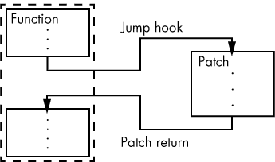

*图 22-13：安装补丁的函数*

可用的未使用空间必须足够容纳你的超大代码补丁

+   至少要与补丁一样大

+   位于运行时可执行的地址上

+   从文件内容初始化；否则，您的补丁在运行时将无法加载。

寻找大型未使用可执行字节块的最简单方法是检查二进制文件中可能存在的 *代码洞*。当二进制文件中的可执行部分（如 `.text` 部分）被填充以遵守可执行文件格式规定的部分对齐要求时，就会形成代码洞。代码洞在 Windows PE 二进制文件中非常常见，因为它们通常要求每个部分的大小都是 512 字节的倍数。

寻找代码洞的第一个地方通常是 `.text` 部分的末尾。您可以通过在 CodeBrowser 的 Program Trees 窗口中双击该部分名称，然后滚动到 Listing 窗口的末尾，轻松导航到 `.text` 部分的末尾（或任何其他部分）。

在我们的示例 PE 二进制文件中，Listing 窗口显示了 `.text` 部分末尾的以下内容：

```
140012df8 ??     00h

140012df9 ??     00h

140012dfa ??     00h

140012dfb ??     00h

140012dfc ??     00h

140012dfd ??     00h

140012dfe ??     00h

140012dff ??     00h
```

列表显示了以下内容：

+   这些字节在 Ghidra 中被标记为未分类（`??`）。

+   这些字节已初始化为 `00h`。

+   `.text` 部分结束于地址 `140012dff`，这满足文件对齐要求，即该部分的大小是 512 字节的倍数（`140012e00` 是 `0x200` 的倍数）。

通过向上滚动（或在 CodeBrowser 中选择 I 工具，并将搜索方向设置为“向上”），我们到达了以下位置：

```
140012cbd POP    RBP

140012cbe RET➊

140012cbf ??     CCh

140012cc0 ??     00h
```

`RET` ➊ 是该二进制文件中最后一条有意义的指令，我们现在可以计算该二进制文件代码洞的大小为 `0x140012e00 - 0x140012cbf = 0x141`（或 321 字节）。这意味着我们可以轻松地将多达 321 字节的新代码补丁到该二进制文件中。假设我们在地址 `0x140012cbf` 打上新代码补丁，我们需要在二进制文件现有的代码中某个地方补上跳转到 `0x140012cbf`，以确保执行流最终能够到达我们的补丁。

当找不到代码洞或代码洞不够大以容纳您的补丁时，您需要发挥一些创造力，找到足够的空间来适应您的补丁。根据构建二进制文件时使用的编译选项，您可能能够通过 *函数间对齐间隙* 来分散您的补丁。函数间对齐间隙是指编译器将每个函数的起始地址对齐到 2 的倍数（通常是 16）时所产生的间隙。当强制函数对齐时，每个函数之间将插入 `align` / 2 字节，最多插入 `align` - 1 字节的填充。以下列表显示了两个相邻函数之间的最佳（从补丁的角度来看）对齐间隙（`align` = 16）：

```
  1400010a0 RET

➊ 1400010a1 ??     CCh

 1400010a2 ??     CCh

  1400010a3 ??     CCh

  1400010a4 ??     CCh

  1400010a5 ??     CCh

  1400010a6 ??     CCh

  1400010a7 ??     CCh

  1400010a8 ??     CCh

  1400010a9 ??     CCh

  1400010aa ??     CCh

  1400010ab ??     CCh

  1400010ac ??     CCh

  1400010ad ??     CCh

  1400010ae ??     CCh

➋ 1400010af ??     CCh

       **************************************************************

       *                   FUNCTION                                 *

       **************************************************************
```

从 `1400010a1` ➊ 到 `1400010af` ➋ 的所有字节可以安全地用补丁代码覆盖。

存在一些额外的方法可以将补丁代码压缩到二进制文件中——有些方法涉及扩展现有的程序段，或者完全注入新的程序段。任何以这种方式操作段的技术也要求你更新二进制文件的段头，以确保它们与所做的修改保持一致。因此，这些技术非常依赖于文件格式，并且需要详细了解文件头数据结构。

##### 过大的数据补丁

在某些方面，数据补丁比代码补丁更容易，但在其他方面则更难。对于结构化数据类型，你的主要关注点是结构中每个成员的正确大小和字节顺序，且由于结构的大小是在编译时确定的，因此你不需要担心替换结构的过大问题。在补丁字符串数据时，建议任何替换数据完全适应原始字符串的空间。如果你的新字符串比原始字符串大，你可能幸运地在字符串末尾和下一个数据项之间找到一些填充字节，但你必须小心不要破坏程序依赖的任何数据。如果你的数据根本无法适应原始数据的内存空间，你将不得不为其找到新的位置，但正确地移动数据可能会很困难。

所有全局数据项都通过它们与程序代码或数据段的偏移量来引用。为了重新定位一个数据项，除了找到足够的未使用空间外，你还需要找到每个引用原始数据项的位置，并将其修改为引用新的数据项。Ghidra 的交叉引用功能在识别全局变量的每个引用时非常有用，但它无法识别派生指针（通过指针运算生成的指针）。

一旦你所有的补丁都已输入到 Ghidra 中，并且你对生成的程序列表感到满意，你将需要将更改推送回原始二进制文件，以验证补丁是否按预期工作。

### 导出文件

为了确认你的更改会对二进制文件的行为产生预期效果，你需要更新原始二进制文件以反映你的更改。在本节中，我们将讨论一些 Ghidra 的导出功能，它们与补丁相关。

Ghidra 的文件 ▸ 导出程序菜单选项提供了将程序信息导出为多种格式的能力。结果导出对话框如 图 22-14 所示。

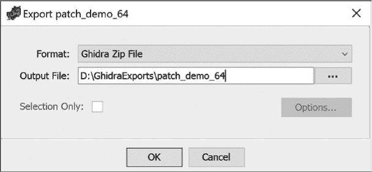

*图 22-14：Ghidra 导出对话框*

导出对话框也可以通过在项目管理器中右键点击您希望导出的文件并从上下文菜单中选择“导出”来访问。在对话框中，您需要指定导出格式和输出文件位置，并指示是否希望将导出的范围限制为您在 CodeBrowser 中选择的范围。某些导出格式提供额外的选项，以便更细粒度地控制导出过程。

#### *Ghidra 导出格式*

Ghidra 支持以下导出格式，尽管其中只有一个（二进制）对于二进制修补特别有用：

**Ascii** Ascii 导出格式可用于保存程序的文本表示，类似于在 Listing 窗口中显示的内容，并提供选择要包含在输出文件中的字段的选项。

**二进制** 二进制导出格式会生成一个二进制文件，是修补应用程序时最有用的格式，并且在其独立部分中进行了讨论。

**C/C++** C/C++导出格式用于保存反编译器生成的程序源代码表示，并包含所有已知数据类型的声明。此选项也可以从反编译器窗口中访问。

**Ghidra Zip 文件** Ghidra *zip*文件是程序的序列化 Java 对象表示，适用于导入到其他 Ghidra 实例中。

**HTML** HTML 导出格式生成程序列表的 HTML 表示。与 Ascii 导出器中类似的选项使您可以选择要包含在输出文件中的字段。标签和交叉引用作为超链接表示，提供基本的导航功能，以便于在生成的输出中进行浏览。

**Intel Hex** Intel Hex 格式定义了一个二进制数据的 ASCII 表示，通常用于编程 EEPROM。

**XML** XML 导出器以结构化的 XML 格式输出程序内容，并提供选择应包含哪些程序构造在生成文件中的选项。此功能也可用于反编译器窗口中的单个函数，以便于调试函数反编译。尽管 Ghidra 包括相应的 XML 加载器，但该导出器包含以下警告：“警告：XML 是有损的，仅用于将数据传输到外部工具。建议使用 GZF 格式来保存和共享程序数据。”

#### *二进制导出格式*

Ghidra 的二进制导出用于将程序的底层二进制内容写入文件。程序的所有已初始化内存块（见窗口 ▸ 内存映射）都会连接在一起，形成输出文件。输出文件是否与导入的原始文件完全相同，取决于用于导入文件的加载器模块。Raw Binary 加载器可以保证重新创建原始输入文件，因为它将原始文件的每个字节加载到一个单独的内存块中。其他加载器可能会或可能不会加载每个文件字节（例如，PE 加载器会，ELF 加载器则不会）。

当需要应用你在 Ghidra 中所做的更改时，你需要确保生成的文件包含你的修补，并且可以执行。如果你正在修补一个 PE 文件，二进制导出将生成修补后的原始二进制版本。同样，如果你使用 Raw Binary 加载器导入了程序，二进制导出也将生成修补后的原始二进制版本。当然，正如在第十七章中讨论的那样，使用 Raw Binary 加载器时，你可能需要手动执行大部分程序的内存布局，因此存在权衡。幸运的是，完全可以编写脚本，解决任何加载器的问题。

#### *脚本辅助导出*

我们可以创建一个 Ghidra 脚本，自动保存修补后的程序版本，而不是对每个 Ghidra 加载器进行详尽的测试，以了解加载器创建的内存块是否覆盖了文件字节的整个范围。这个脚本为使用 Ghidra 生成修补文件提供了与加载器无关的功能。无论 Ghidra 当前已知的内存映射布局如何，它都会处理原始文件字节的整个范围。

```
public void run() throws Exception {

    Memory mem = currentProgram.getMemory();

  ➊ java.util.List<FileBytes> fbytes = mem.getAllFileBytes();

    if (fbytes.size() != 1) {

        return;

    }

  ➋ FileBytes fb = fbytes.get(0);

  ➌ File of = askFile("Choose output file", "Save");

    FileOutputStream fos = new FileOutputStream(of, false);

    writePatchFile(fb, fos);

    fos.close();

}
```

脚本首先通过获取程序的 `FileBytes` 列表 ➊ 开始。`FileBytes` 对象封装了从导入的程序文件中获取的所有字节，并跟踪文件中每个字节的原始值和修改后的值。由于 Ghidra 允许将多个文件导入到一个程序中，因此该脚本仅处理导入到程序中的第一个文件的字节（第一个字节范围） ➋。

在提示输出文件 ➌ 后，`FileBytes` 对象和打开的 `OutputStream` 被传递到我们的 `writePatchFile` 函数中，以处理生成修补后的可执行文件的细节。

为了呈现程序的映射内存视图，Ghidra 加载器可能会像运行时加载器一样处理程序的重定位表条目。此处理的结果是，标记为修正位置的程序位置（具有重定位表条目的位置）会被 Ghidra 修改，从原始文件值更改为正确的重定位值。当我们生成修补后的二进制版本时，我们不希望包括任何 Ghidra 为重定位目的而修改的字节。

接下来的`writePatchFile`函数首先根据程序的重定位表生成运行时（以及由 Ghidra 修补）时修补的地址集合：

```
public void writePatchFile(FileBytes fb, OutputStream os) throws Exception {

    Memory mem = currentProgram.getMemory();

    Iterator<Relocation> relocs;

  ➊ relocs = currentProgram.getRelocationTable().getRelocations();

    HashSet<Long> exclusions = new HashSet<Long>();

    while (relocs.hasNext()) {

        Relocation r = relocs.next();

      ➋ AddressSourceInfo info = mem.getAddressSourceInfo(r.getAddress());

        for (long offset = 0; offset < r.getBytes().length; offset++) {

          ➌ exclusions.add(info.getFileOffset() + offset);

        }

    }

  ➍ saveBytes(fb, os, exclusions);

}
```

在获得程序重定位表的迭代器 ➊ 后，获取每个重定位条目的`AddressSourceInfo` ➋。

`AddressSourceInfo`对象提供了程序地址到磁盘文件的映射，以及该文件中的偏移量，从中加载了相应的程序字节。每个重定位字节的文件偏移量被添加到一个偏移量集合 ➌ 中，以便在生成最终的修补文件时忽略它们。该函数通过调用`saveBytes`函数 ➍ 来写入当前程序文件的最终修补版本。`saveBytes`函数在以下列表中显示：

```
public void saveBytes(FileBytes fb, OutputStream os, Set<Long> exclusions)

                      throws Exception {

    long begin = fb.getFileOffset();

    long end = begin + fb.getSize();

  ➊ for (long offset = begin; offset < end; offset++) {

      ➋ int orig = fb.getOriginalByte(offset) & 0xff;

      ➌ int mod = fb.getModifiedByte(offset) & 0xff;

        if (!exclusions.contains(offset) && orig != mod) {

          ➍ os.write(mod);

        }

        else {

          ➎ os.write(orig);

        }

    }

}
```

该函数遍历整个文件字节范围 ➊，以确定是保存原始字节还是修改后的字节到输出文件。

在每个文件偏移位置，`FileBytes`类的方法用于获取从导入文件加载的原始字节值 ➋ 和当前字节值 ➌，后者可能已被 Ghidra 或 Ghidra 用户修改。如果原始值与当前值不同 *且* 该字节不与重定位条目相关联，则将修改后的字节写入输出文件 ➍；否则，将原始字节写入输出文件 ➎。

为了总结这一部分内容，让我们看一个示例，演示如何修补一个二进制文件并确认补丁按预期运行。

### 示例：修补二进制文件

让我们看一个示例，演示在上下文中如何修补。假设你有一段恶意软件代码，它检查是否存在调试器，如果检测到调试器，则退出，不允许你查看其行为。以下源代码概述了该功能的一个简单程序：

```
int is_debugger_present() {

    return ptrace(PTRACE_TRACEME, 0, 0, 0) == -1;

}

void do_work() {

  ➊ if (is_debugger_present()) {

         printf("No debugging allowed - exiting!\n\n");

         exit(-1);

    }

 // do interesting things here

    printf("Confirmed that there is no debugger, so do\n"

           "interesting things here that we don't want\n"

           "analysts to see!\n\n");

}

int main() {

    do_work();

    return 0;

}
```

该代码检查是否存在调试器 ➊，如果找到了则退出。否则，它继续执行其不轨的操作。以下显示了程序独立运行（没有调试器）的输出：

```
# ./debug_check_x64

  Confirmed that there is no debugger, so do

  interesting things here that we don't want

  analysts to see!
```

当程序在调试器下运行时，我们会看到不同的响应：

```
# gdb ./debug_check_x64

  Reading symbols from ./debug_check_x64...(no debugging symbols found)...done.

  (gdb) run

  Starting program: /ghidrabook/CH22/debug_check_x64

  No debugging allowed - exiting!

  [Inferior 1 (process 434) exited with code 0377]

  (gdb)
```

如果我们将二进制文件加载到 Ghidra 中，我们会在列表窗口中看到以下内容：

```
     undefined do_work()

        undefined  AL:1 <RETURN>

001006f8  PUSH   RBP

001006f9  MOV    RBP,RSP

001006fc  MOV    EAX,0x0

00100701  CALL   is_debugger_present

00100706  TEST   EAX,EAX

00100708  JZ     LAB_00100720

0010070a  LEA    RDI,[s_No_debugging_allowed_-_exiting!_001007d8]

00100711  CALL   puts

00100716  MOV    EDI,0xffffffff

0010071b  CALL   exit

   -- Flow Override: CALL_RETURN (CALL_TERMINATOR)

        LAB_00100720

00100720  LEA    RDI,s_Confirmed_that_there_is_no_debug_001008

00100727  CALL   puts

0010072c  NOP

0010072d  POP    RBP

0010072e  RET
```

反编译窗口提供了以下相应代码：

```
void do_work(void)

{

  int iVar1;

  iVar1 = is_debugger_present();

  if (iVar1 != 0) {

    puts("No debugging allowed - exiting!\n");

                    /* WARNING: Subroutine does not return */

    exit(-1);

  }

  puts("Confirmed that there is no debugger, so do\n"

       "interesting things here that we don't want\n"

       "analysts to see!\n"

      );

  return;

}
```

要修补这个二进制文件以绕过检查，可以将对`is_debugger_present`函数的调用替换为`NOP`，改变测试条件，或者修改`is_debugger_present`函数的内容。如果你使用右键菜单中的“Patch Instruction”选项，可以轻松地将`JZ`替换为`JNZ`（实际上是翻转条件，使其仅在调试时运行），如[图 22-15 所示。

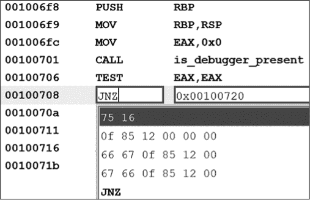

*图 22-15：替换`JZ`为`JNZ`后的 Patch Instruction 选项*

这将在反编译窗口中产生如下代码：

```
void do_work(void)

{

  int iVar1;

  iVar1 = is_debugger_present();

  if (iVar1 == 0) {

    puts("No debugging allowed - exiting!\n");

                    /* WARNING: Subroutine does not return */

 exit(-1);

  }

  puts("Confirmed that there is no debugger, so do\n"

       "interesting things here that we don't want\n"

       "analysts to see!\n"

      );

  return;

}
```

如果我们使用导出脚本将文件导出为二进制并重新运行它，我们会看到以下两个列表，这些列表展示了我们希望通过补丁实现的行为：

```
# ./debug_check_x64.patched

  No debugging allowed - exiting!

# gdb ./debug_check_x64.patched

  Reading symbols from ./debug_check_x64.patched...(no debugging symbols found)...done.

  (gdb) run

  Starting program: /ghidrabook/CH22/debug_check_x64.patched

  Confirmed that there is no debugger, so do

  interesting things here that we don't want

  analysts to see!

  [Inferior 1 (process 445) exited normally]

  (gdb)
```

尽管有许多外部工具（例如，`VBinDiff`）可以用来确认在这个示例中文件仅改变了 1 个字节，但你也可以使用 Ghidra 的内部工具来得出相同的结论。下一章将重点介绍实现这一目标的方法。

### 总结

无论你补丁二进制文件的具体动机是什么，你的补丁都需要仔细规划和部署。Ghidra 提供了你所需要的一切来规划补丁；通过十六进制编辑、Ghidra 内置的汇编器或脚本来草拟补丁；查看每次更改的效果；以及在生成原始二进制补丁版本之前，可能通过撤销操作来还原更改。下一章将演示如何使用 Ghidra 比较未打补丁和已打补丁的二进制文件版本，并讨论 Ghidra 在更高级的二进制差异比较和版本跟踪方面的功能。
