# 第二十七章：**二进制差异和版本跟踪**


我们在前几章中向你介绍了 Ghidra 如何帮助你进行逆向工程分析的方式。在这个过程中，我们介绍了许多方法，帮助你转化和注释你的工作，以便记录并便于理解二进制文件。

本章介绍了二进制差异和 Ghidra 的版本跟踪工具，帮助你识别文件和函数之间的相似性和差异，并促进将以前的分析结果应用到新文件中。我们还从三个角度讨论了文件差异：二进制差异、函数比较和版本跟踪。

### 二进制差异

在前一章中，我们打补丁修改了一个二进制文件，改变了函数的流程，绕过了对`exit`的调用，通过修改一条指令中的一个字节：`JZ`（74）改为`JNZ`（75）。为了确认更改并准确记录修改的内容，我们可以使用外部工具如`VBinDiff`或`WinDiff`，在字节级别比较这两个文件。然而，要在指令级别进行文件比较，我们需要一个更为复杂的工具：Ghidra 的“程序差异”工具，这个工具可以在列表窗口中使用。一旦计算出差异，它们可以通过定制显示来查看，这些显示旨在突出差异，帮助理解每个更改，并提供根据差异类型采取行动的机会。

若要比较已导入项目并处于相同状态（例如，两个文件都已分析或两个文件都未分析）的两个文件，打开其中一个文件在 CodeBrowser 中，然后选择**工具** ▸ **程序差异**，并选择项目中的另一个文件进行比较。或者，你可以使用图 23-1 中所示的列表窗口工具图标。这个图标作为切换按钮，打开或关闭程序差异工具。


*图 23-1：CodeBrowser 差异视图切换图标*

在这个示例中，我们将从打开未打补丁的文件版本开始，选择“差异视图”图标，并选择打补丁后的文件版本。这将打开图 23-2 中所示的“确定程序差异”对话框。


*图 23-2：差异工具的确定程序差异对话框*

虽然所有可用的差异字段默认都会被选中，但在这种情况下，选择“字节”是确认补丁是否正确工作的适当选择，因此它是唯一被选中的差异选项。当你点击“确定”时，你可以在列表窗口中看到这两个二进制文件，窗口被分为左右两栏，每个文件显示在其中一栏。默认情况下，列表是同步的，因此在一个栏中导航时，另一个栏也会同步导航。本工具提供了多种方式来浏览检测到的差异，我们将在本章后面介绍这些方法。

当你打开两个文件进行差异比较时，Ghidra 最初将列表视图定位在每个文件的开头。你可以使用列表窗口工具栏上的向下箭头工具（或 CTRL-ALT-N）导航到两个文件之间的第一个差异。为了引起你对不同代码的注意，变化会通过颜色高亮的反汇编行在每个文件的列表窗口中显示，如果差异位于某个函数内，反汇编结果也会在反编译器窗口中显示。（反编译器窗口与两个文件中的第一个文件同步。）导航到第一个检测到的差异时，会显示原始列表中的单字节`JZ`（74）和第二个列表中的`JNZ`（75）。

要查看更多细节，请选择**窗口** ▸ **差异** ▸ **差异详情**。你将在 CodeBrowser 窗口底部的差异详情窗口中看到以下报告：

```
Diff address range 1 of 1.

Difference details for address range: [ 00100708 - 00100709 ]

Byte Diffs :

    Address   Program1  Program2

    00100708    0x74       0x75

Code Unit Diffs :

    Program1 CH23:/DiffDemo/debug_check_x64 :

            00100708 - 00100709    JZ 0x00100720

                                   Instruction Prototype hash = 16af243b

    Program2 CH23:/DiffDemo/debug_check_x64.patched :

            00100708 - 00100709    JNZ 0x00100720

                                   Instruction Prototype hash = 176d4e0c
```

第一行显示包含差异的地址范围的数量。在这个例子中，文件中只有一个范围包含差异，因此你可以确定这两个程序仅在一个字节上有所不同。这个简单的例子只是触及了 Ghidra 程序差异工具的能力表面，因此让我们花一些时间来探讨这个工具提供的其他功能。

#### *程序差异工具*

图 23-2 顶部的九个选项构成了你的比较基础，你可以选择其中的任何一个或全部。默认情况下，程序差异工具对每个文件的整个程序进行操作。如果你希望将比较限制在特定的地址范围内，你必须在打开工具之前先在第一个文件中高亮选择该范围。一旦你做出了选择并点击“确定”，你看到的分屏列表窗口就叫做程序差异。

##### 程序差异

程序差异视图让你同时查看两个文件。基本上，列表窗口现在有两个列表，左侧一个，右侧一个。当你打开差异详情窗口时，它会出现在 CodeBrowser 窗口的底部。在差异详情窗口中，左侧文件被视为程序 1（你最初打开的文件），而右侧文件被视为程序 2（你选择与程序 1 进行比较的文件）。反编译器窗口反映的是程序 1 的内容。当你比较两个文件时，Ghidra 可以计算两个文件之间的差异，可以是任意方向。你需要记住哪个文件是哪个，使用程序差异工具时自行区分。

一个常见的工作流程是开始分析一个文件后，发现部分或全部代码看起来很熟悉，这可能会促使你打开一个之前分析过的文件来开始进行差异比较。幸运的是，程序差异会通过必要时插入空行来保持两个文件之间的对齐。差异会被高亮显示，程序差异工具栏为你提供了导航功能，并帮助你确定如何处理这些差异。

##### 程序差异工具栏

程序差异工具栏通过添加图 23-3 中显示的工具，扩展了列表窗口的工具栏选项。

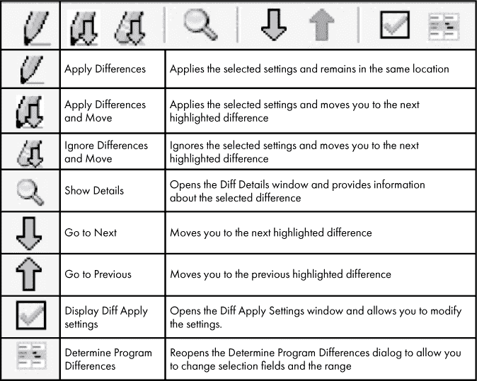

*图 23-3：程序差异工具栏选项*

##### 差异应用设置

差异应用设置定义了当两个文件之间存在差异时，你希望采取的操作。选择“显示差异应用设置”选项，将显示图 23-4 中显示的窗口。

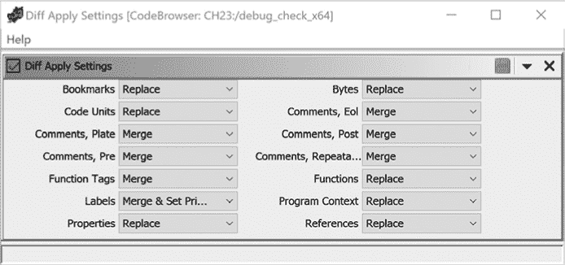

*图 23-4：差异应用设置窗口*

每个设置指定了你希望如何将第二个程序的操作应用于你打开的第一个程序，并且如何应用该选项。以下四个选项可以从每个下拉菜单中选择：

**忽略** 不更改第一个程序（适用于所有情况）。

**替换** 将第一个程序的内容更改为与第二个程序的内容匹配（适用于所有情况）。

**合并** 将第二个程序中的差异添加到第一个程序中。如果应用于标签，这将不会改变哪个标签被设置为主标签（仅适用于评论和标签）。

**合并并设置为主标签** 该操作与“合并”相同，但如果可能，主标签将设置为第二个程序的标签（仅适用于标签）。

在图 23-4 的顶部，有两个工具栏图标。保存为默认图标保存当前的差异应用设置。箭头图标打开一个菜单，允许你通过选择图 23-5 中显示的选项，一次性更改所有设置。

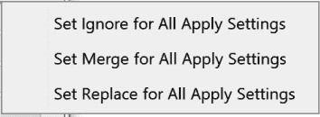

*图 23-5：差异应用设置下拉菜单*

如果你选择“设置合并”选项，并且“合并”不是特定设置的有效选项，则该选项将更改为“设置替换”。对于标签，将更改为“合并并设置为主标签”。

如果你希望应用所有默认更改，请从工具栏中选择“应用差异”。完成程序差异工具后，切换列表窗口中的差异视图图标，你将看到图 23-6 中显示的对话框。

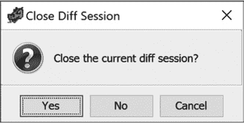

*图 23-6：关闭差异会话确认对话框*

确认你希望关闭当前差异会话后，将关闭第二个文件的显示，并返回到正常的列表窗口，显示第一个文件（以及你从差异分析中选择的所有更改）。

程序差异工具设计了两个主要用例：首先，用于比较由两个不同用户分析的文件，这些用户没有共享 Ghidra 服务器实例；其次，用于比较由同一个源代码库的不同版本生成的代码（例如，未修补和修补的共享库版本）。在以下示例中，我们将演示如何使用此工具来协调两份相同二进制文件的差异，每个文件都是独立分析的。

#### *示例：合并两个已分析的文件*

假设你正在分析一个包含加密例程的二进制文件。一位同事提到她正在分析一个似乎也包含加密例程的二进制文件，且很可能来自同一家恶意软件家族。她同意将她的项目提供给你，以便你可以比较这两个文件。当你在“差异视图”中查看这些文件时，你立刻注意到你们似乎正在分析相同的二进制文件。

挑战在于，你们各自根据个人分析进展并修改了文件内容。你们需要合并两个已分析的文件，以便互相受益。你们已同意承担这一责任，并在 CodeBrowser 中打开了你的二进制文件，启动了程序差异会话，并添加了同事的二进制文件进行比较。

在“程序差异”工具栏上选择向下箭头将带你到此文件中的第一个差异。在此时，你可以通过选择“程序差异”工具栏中的选项（或快捷键 F5）打开“差异详情”窗口。此窗口会为你提供以下列表（分为两部分以便讨论）。在“差异详情”顶部的第一部分，你将看到以下内容：

```
Diff address range 1 of 4\. ➊

Difference details for address: 0010075a ➋

Function Diffs : ➌

  Program1 CH23:/Crypto/diff_sample1 :

    Signature: void encrypt_rot13(char * inbuffer, char * outbuffer) ➍

    Thunk? : no

    Stack Frame:

       Parameters: ➎

         DataType    Storage        FirstUse Name      Size Source

         /char *     RDI:8          0x0      inbuffer  8    USER_DEFINED

         /char *     RSI:8          0x0      outbuffer 8    USER_DEFINED

       Local Variables: ➏

         DataType    Storage        FirstUse Name      Size Source

         /int        EAX:4          0xc0     length    4    USER_DEFINED

         /int        Stack[-0x1c]:4 0x0      idx       4    USER_DEFINED

         /char       Stack[-0x1d]:1 0x0      curr_char 1    USER_DEFINED

  Program2 CH23:/Crypto/diff_sample1a : ➐

    Signature: void encrypt(char * param_1, long param_2)

    Thunk? : no

    Stack Frame:

       Parameters:

         DataType    Storage        FirstUse Name      Size Source

         /char *     RDI:8          0x0      param_1   8    DEFAULT

         /long       RSI:8          0x0      param_2   8    DEFAULT

       Local Variables:

         DataType    Storage        FirstUse Name      Size Source

         /undefined4 Stack[-0x1c]:4 0x0      local_1c  4    DEFAULT

         /undefined1 Stack[-0x1d]:1 0x0      local_1d  1    DEFAULT
```

该文件中识别出的四个差异地址范围中的第一个➊正在显示，并与当前地址`0010075a` ➋相关联。列表首先详细描述了两个二进制文件的函数头部差异➌。对于你的二进制文件，你已经为函数及其签名中的参数提供了有意义的名称 ➍。此外，每个参数都有适当定义的类型 ➎。类似地，本地变量也赋予了有意义的名称和类型 ➏。在第二个程序中 ➐，分析师没有对相应函数的默认 Ghidra 头部进行任何修改。

你希望保留你对函数定义和本地变量所做的更改版本。你可以使用工具栏图标来拒绝此更改，但这将拒绝与该地址相关的所有差异。由于你还没有审查所有差异，因此只需向下滚动到“差异详情”窗口中的下一个差异即可。

与第一个地址范围相关的下一个差异部分包含标签和注释的差异。

```
➊ Label Diffs :

    Program1 CH23:/Crypto/diff_sample1 at 0010075a :

      0010075a is an External Entry Point.

        Name           Type           Primary  Source        Namespace

      ➋ encrypt_rot13  Function       yes      USER_DEFINED  Global

    Program2 CH23:/Crypto/diff_sample1a at 0010075a :

      0010075a is an External Entry Point.

        Name           Type           Primary  Source        Namespace

      ➌ encrypt        Function       yes      USER_DEFINED  Global

➍ Plate-Comment Diffs :

➎ Program1 CH23:/Crypto/diff_sample1 at 0010075a :

      ****************************************************************

      *                      FUNCTION                                *

      * This is a crypto function originally named cryptor. Renamed  *

      * to use our standard format encrypt_rot13\. Changed the        *

      * function parameters to char *. Added meaningful variable     *

      * names. Function first seen in fileC13d by Ken H              *

      ****************************************************************

    Program2 CH23:/Crypto/diff_sample1a at 0010075a :

      No Plate-Comment.

➏ EOL-Comment Diffs :

    Program1 CH23:/Crypto/diff_sample1 at 0010075a :

      No EOL-Comment.

  ➐ Program2 CH23:/Crypto/diff_sample1a at 0010075a :

      This looks like an encryption routine. TODO: Analyze to get more information.
```

在标签差异中 ➊，唯一的差异是函数的名称 ➋ ➌，这一点已经讨论过。在`Plate-Comment`部分 ➍，你的文件有详细的注释 ➎，而另一个文件没有板注释。在`EOL-Comment`部分 ➏，另一位分析师有一个简短的注释 ➐，而你的文件中没有。在查看该注释时，你会发现它是一个`TODO`操作项，而你在文件中已经完成了该操作。

在评估了两个文件之间的所有差异后，你决定保留你的内容，并不接受来自另一个二进制文件的任何新内容。你通过选择“忽略差异并移动”图标来完成这个操作。这将带你到下一个差异。由于你已经打开了差异详情窗口，一旦你导航，它的内容会立即更新，你会看到以下内容：

```
Diff address range 1 of 3\. ➊

Difference details for address range: [ 0010081a - 0010081e ]

Reference Diffs :

  Program1 CH23:/Crypto/diff_sample1 at 0010081a :

    Reference Type: WRITE  From: 0010081a  Mnemonic  To: register: 

      RAX  USER_DEFINED  Primary

  Program2 CH23:/Crypto/diff_sample1a at 0010081a :

    No unmatched references.
```

你通过拒绝之前的差异➊，减少了包含差异的范围数量。再次强调，你的文件比第二个文件包含更多信息。这一次，你将通过点击下箭头来导航到下一个差异。这将带你到以下内容：

```
Diff address range 2 of 3\. ➊

Difference details for address: 00100830

Function Diffs :

  Program1 CH23:/Crypto/diff_sample1 :

    Signature: undefined display_message()

    Thunk? : no

    Calling Convention: unknown

    Return Value :

         DataType    Storage        FirstUse Name      Size Source

         /undefined  AL:1           0x0      <RETURN>  1    IMPORTED

      Parameters:

        No parameters.

  Program2 CH23:/Crypto/diff_sample1a :

    Signature: void display_message(char * message) ➋

    Thunk? : no

    Calling Convention: __stdcall

    Return Value :

         DataType    Storage        FirstUse Name      Size Source

         /void       <VOID>         0x0      <RETURN>  0    IMPORTED

      Parameters:

         DataType    Storage        FirstUse Name      Size Source

         /char *     RDI:8          0x0      message   8    USER_DEFINED
```

注意到差异范围的数量没有变化➊。你只是被移动到下一个差异范围，而没有影响总的差异范围数量。评估这个新的差异显示第二个文件包含了由另一个分析员提供的信息，而这些信息在你的文件中并不存在。函数签名有一个返回类型，并且已经在函数签名中添加了一个参数➋。你可以通过右键点击右侧列表窗口中的差异，并选择“应用选择”（快捷键 F3），或者点击工具栏上的“应用差异”图标，将其包含到你的二进制文件中。

导航到下一个差异后，你会看到以下详细信息：

```
➊ Diff address range 2 of 2.

  Difference details for address range: [ 00100848 - 0010084c ]

  Pre-Comment Diffs :

    Program1 CH23:/Crypto/diff_sample1 at 00100848 :

      No Pre-Comment.

    Program2 CH23:/Crypto/diff_sample1a at 00100848 :

    ➋ This is a potential vulnerability.  The parameter is being passed

      in to printf as the first/only parameter which may result in a format

      string vulnerability.
```

差异范围的数量减少了，因为你在之前的范围中应用了差异➊。在这个最终的差异中，你看到另一个文件的`预注释`部分➋中有一个有趣的条目。分析员发现了一个潜在的漏洞。为了确保这个信息被包含到你的文件中，你选择**应用差异**。

现在你已经完成了两个文件的比较，你可以点击“差异视图”图标，并确认你要关闭当前的程序差异会话。你的列表视图现在反映了来自两个二进制文件的综合分析，你可以保存并关闭文件。

Ghidra 程序差异工具提供了调查同一文件两个版本之间差异的功能。尽管它会尝试对比两个无关的文件，但任何结果很可能仅反映出巧合的相似性。让我们将注意力转向另一个工具，它便于在相同或不同程序之间比较选定的函数。

### 比较函数

如果你看到一个函数，它让你想起你以前分析过的某个函数，那么直接比较这两个函数会很有帮助，这样你就能在适当的时候将你初步分析的结果应用到当前函数上。Ghidra 提供了这个功能，通过其函数比较窗口，你可以同时查看两个函数，如图 23-7 所示。

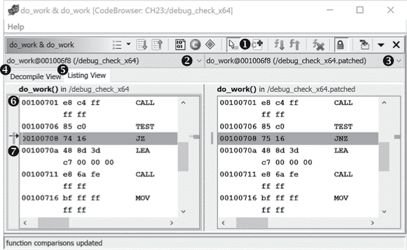

*图 23-7：函数比较窗口中的列表视图*

#### *函数比较窗口*

要使用函数比较窗口，请在代码浏览器中打开包含函数的一个或多个二进制文件，通过在活动代码浏览器标签中突出显示一个函数来加载初始函数，然后从右键上下文菜单中选择“比较选定函数”（快捷键 SHIFT-C）。函数比较窗口将并排显示两个函数，并突出显示潜在的差异，如图 23-7 所示。（如果您只选择了一个函数，它将在两个窗口中显示，直到您加载更多函数。）

要添加更多函数进行比较，请选择添加函数图标 ➊。这将显示活动程序中所有函数的列表，您可以从列表中选择一个函数，或切换到代码浏览器窗口，通过选择列表窗口中的其他程序标签来更改活动程序。

在活动列表的左侧（由框住的列表 ➏ 表示）是一个光标箭头 ➐。若函数匹配，箭头也将在另一个窗口的相同位置出现。在图 23-7 中，主窗口中的指令与另一个窗口中的指令不匹配，因此光标箭头在两个窗口中都没有显示。

函数比较窗口提供了加载多个二进制文件中的多个函数的机会。您可以根据需要从每个面板中添加或删除函数。一个有用的下拉菜单让您选择在关联窗口 ➋ ➌ 中显示的函数。

该窗口让您轻松在反编译视图 ➍ 和列表视图 ➎ 之间切换，並可以更改每个窗口中显示的函数。该示例的反编译视图如图 23-8 所示。

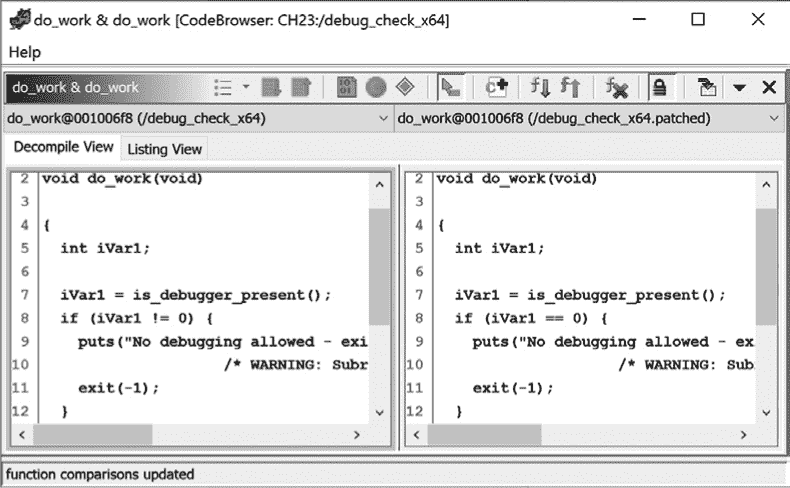

*图 23-8：函数比较窗口中的反编译视图*

该窗口中可用的探索功能与程序差异工具有很大的重叠，唯一的区别是您一次只比较两个函数，并且可以轻松在反编译代码和列表之间切换。该窗口的工具栏菜单如图 23-9 所示。

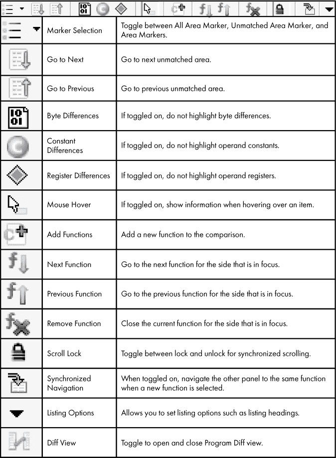

*图 23-9：函数比较工具栏选项*

让我们通过一个示例来演示一些额外的函数比较工具功能。

#### *示例：比较加密例程*

恭喜晋升！基于您在加密例程分析和使用程序差异工具方面的成功，您现在已经被标记为您所在工作组的加密专家。每次同事怀疑他们有加密例程时，他们都会将二进制文件发给您，看看是否是您认出的加密例程。

现在，你有了一个同事发来的新文件，想要确定这个文件中使用的加密例程是新例程还是你之前已经识别过的例程。与其加载并将每个加密例程与新函数进行比较，你设置了一个特别的 Ghidra 项目，其中包含了你之前分析和记录的所有加密例程。你的目标是将你的加密例程加载到函数比较窗口的一侧，然后将新文件导入到另一侧进行比较。（为了简化此示例，你目前的收藏中只有一个已分析的加密例程：你在之前示例中合并的 ROT13 例程。）

在你将完整的已分析加密文件集加载到 CodeBrowser 并在函数比较窗口中加载了你的函数`encrypt_rot13`之后，你需要将新文件加载到同一个 CodeBrowser 实例中（文件 ▸ 打开）并将其设置为活动文件。此时，你可以探索文件，但并不是必须的。如果你找不到需要的函数，你始终可以切换回 CodeBrowser 窗口。在这种情况下，选择函数比较工具栏中的“添加函数”选项，你会看到新二进制文件中完整的函数列表，在列表中间有一个名字引起你兴趣的函数`encrypt`，如图 23-10 所示。

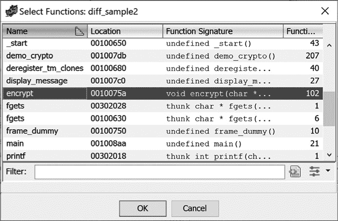

*图 23-10：选定* encrypt *函数的选择函数窗口*

从图 23-11 中显示的已加载函数的反编译视图中，粗略一看，这两个函数似乎非常不同。

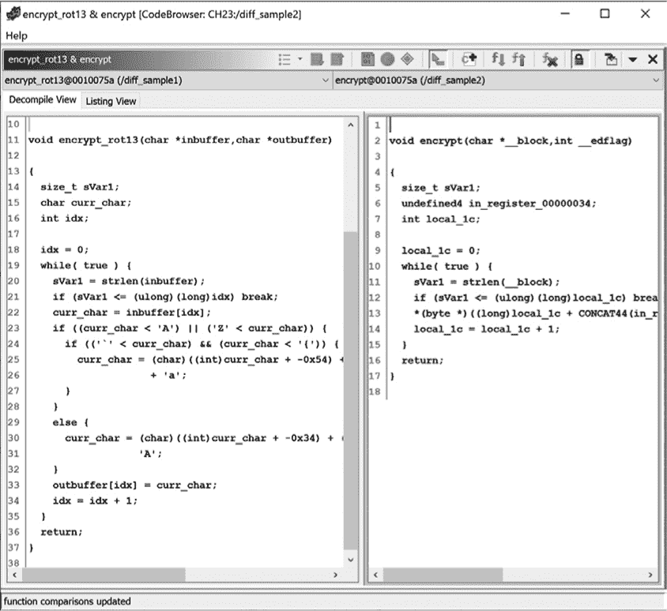

*图 23-11：两个加密例程的反编译视图的函数比较窗口*

在图 23-12 中显示的列表视图确认了这两个函数有显著的差异。

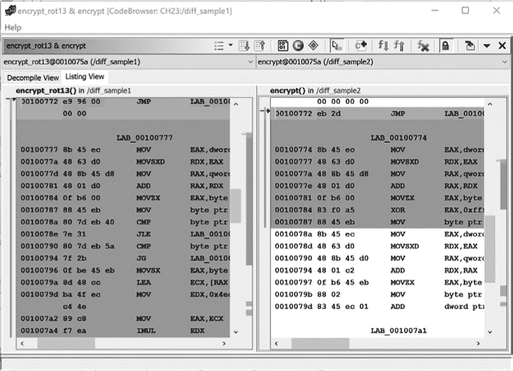

*图 23-12：显示差异的两个加密例程的函数比较窗口的列表视图*

进一步分析后，你发现新例程将每个字节与常数值`0xa5`进行异或。这与当前的加密例程明显不同，因此你为这个新函数命名并进行文档记录，并将其添加到你的收藏中（这样你的收藏将有两个成员！）。回到 CodeBrowser，你更新了函数签名并添加了注释，以文档化这个新的加密例程。你所做的更改也会在函数比较窗口中反映出来。

在记录时，你注意到新二进制文件中有一个名为`display_message`的函数，与你正在比较的二进制文件中的函数相同。你回忆起在当前二进制文件中这个函数被识别为存在漏洞，因此你决定比较这两个函数。你将它们加载到功能比较窗口中，看看它们是否在常见名称之外还有相似之处。在反编译视图和列表视图中，它们似乎是不同的，如图 23-13 所示。

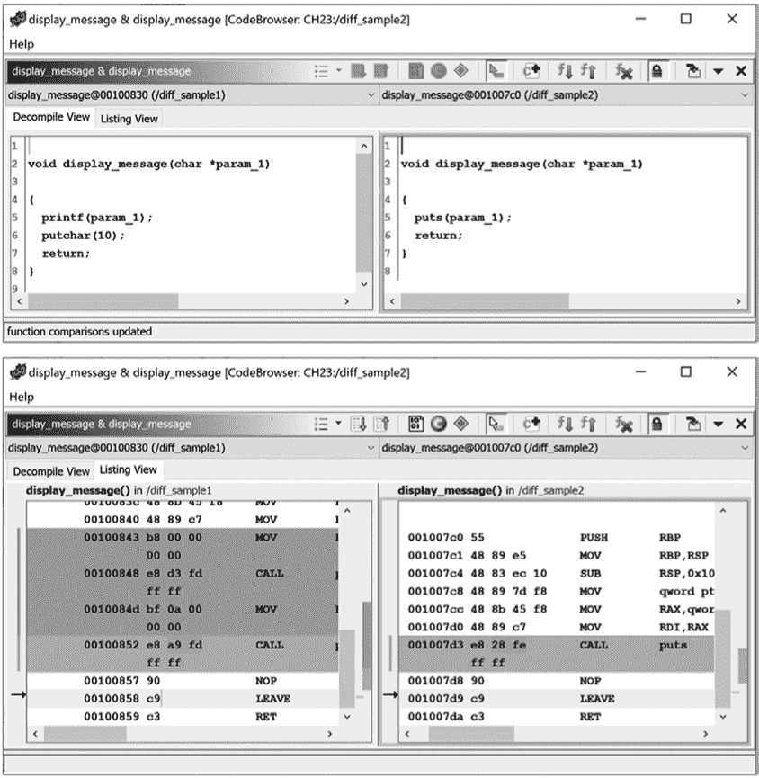

*图 23-13：`display_message`函数的反编译和列表视图*

在第二个示例中，`param_1`被传递给`puts`进行输出，从而修复了漏洞。

现在你已经记录了这个加密例程，你发现又收到了来自同事的另一个二进制文件。为了重新开始你的加密比较过程，你可以使用功能比较工具栏图标，移除窗口中的`display_message`函数，留下你的加密例程集合，现在它有两个不同的成员：`encrypt_rot13`和`encrypt_XOR_a5`。

对这个新文件的初步探索表明，三个函数似乎涉及加密：`encrypt`、`encrypt_strong`和`encrypt_super_strong`。你将它们加载到功能比较窗口中，以便将它们与你现有的加密例程进行比较。比较`encrypt_rot13`与每个新函数后，你注意到以下几点：

encrypt_rot13 **vs.** encrypt 几乎完全不同。`encrypt`例程只是一个测试，可能会调用另外两个加密例程中的一个。

encrypt_rot13 **vs.** encrypt_strong 几乎完全相同。

encrypt_rot13 **vs.** encrypt_super_strong 非常不同。更仔细地看这两个函数之间的差异后，你认为它们不是同一个函数。

更仔细地看差异后发现，`encrypt_rot13`和`encrypt_strong`中的指令是完全相同的——差异主要是地址标签，如图 23-14 所示。

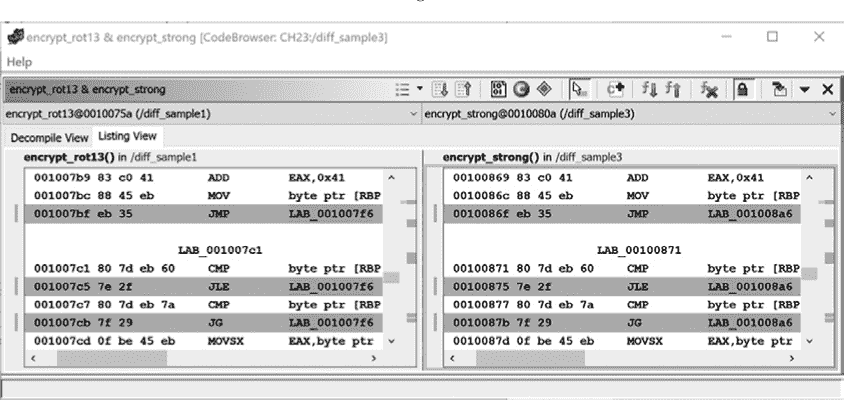

*图 23-14：功能比较窗口中的地址标签差异*

你不期望地址标签在这种情况下完全匹配，因为函数在二进制文件中的位置不同。位置是相对于当前地址保持一致的，所以我们可能正在处理相同的函数。唯一的其他差异是与调用`strlen`相关的 1 个字节，如图 23-15 所示。这是一个类似的问题，可以通过加密函数和`strlen`在每个二进制文件中的相对位置差异来解释。

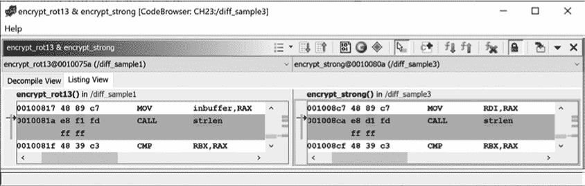

*图 23-15：功能比较窗口中调用`strlen`时的字节差异*

确定这两个是相同的函数后，你可以右键点击之前分析的函数，并从右键菜单中选择“将函数签名应用于另一边”。这将更新所有需要的地方的函数签名，包括列表窗口和符号树。请注意，函数比较窗口并没有提供 Diff View 中所有可用的功能。要复制更多的信息（如与函数相关的详细评论），请使用程序差异工具。

在完成 `encrypt_rot13` 的比较分析后，你将注意力转向 `encrypt_XOR_a5`，并观察到与每个新函数之间的以下关系：

encrypt_XOR_a5 **与** encrypt 完全不同。

encrypt_XOR_a5 **与** encrypt_strong 非常不同。更仔细地观察这两个函数之间的差异，也使你相信它们不是同一个函数。

encrypt_XOR_a5 **与** encrypt_super_strong 几乎完全相同。

`encrypt_XOR_a5` 和 `encrypt_super_strong` 之间的差异仅仅是地址标签和在调用 `strlen` 时的一些字节。你可以像处理之前匹配的函数一样处理这个情况。

虽然这是一个微不足道的例子（并且不太可能与实际中你可能遇到的加密例程一致），但它展示了如何使用函数比较来减少分析工作的重复性，当你在新二进制文件中遇到熟悉的例程时。

调查两个文件的最终工具是最复杂的：版本跟踪工具。

### 版本跟踪

想象一下，你已经花了几个月的时间分析一个非常大的二进制文件。这个二进制文件包含了数百或数千个函数，并且没有符号。在你的分析过程中，你已经为大多数函数提供了有意义的名称；重新命名了数据、局部变量和函数参数；并且添加了大量评论，这些评论需要几天甚至更长的时间才能重新创建。

现在想象一下，一个新版本的二进制文件发布了，而全世界不再使用你所熟悉的版本。你可以继续分析旧版本，假设新版本的行为类似，从中获取更多的信息，但你将无法了解新版本中新增或修改的行为。相反，你决定开始处理新版本的二进制文件，并迅速意识到，你花费了大量时间阅读旧版本中的标记，以帮助你理解新版本的内容。

在两个 CodeBrowser 窗口之间来回切换并不是时间的最佳利用方式。是时候从 CodeBrowser 切换到 Ghidra 在项目工具箱中提供的另一个默认工具，如 图 23-16 所示。

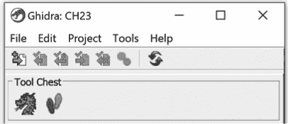

*图 23-16：项目工具箱中的版本跟踪工具（痕迹）*

Ghidra 的版本追踪工具旨在帮助您处理这种情况。通过使用各种关联器，Ghidra 尝试将源二进制文件中的项目（如函数或数据）与目标二进制文件中的相应版本进行匹配。一旦在两个二进制文件之间匹配了函数，Ghidra 可以自动将信息（包括标签和注释）从源二进制文件迁移到目标二进制文件。除了快速迁移现有分析外，版本追踪工具还使得您能够轻松识别哪些内容没有改变，哪些内容仅有轻微变化（通过差异化检测），以及哪些内容是全新的。

版本追踪工具是 Ghidra 中最具可配置性的工具之一，这使得它可以轻松适应特定的调查方向。它也是一个具有挑战性的工具，难以完整呈现。在接下来的章节中，我们将为您简要介绍版本追踪过程，并指引您使用资源来发现正确的设置和组件，帮助您利用版本追踪工具发现两个文件之间的关系。

#### *版本追踪概念*

虽然函数比较和程序差异工具回答了有关两个文件或函数之间原子差异的具体问题，但版本追踪工具为您提供了一个更全面的问题答案：这两个二进制文件有多相似？您能否突出显示并提供它们之间相似性的洞察？基础工作单元称为*会话*，每个会话都配置为识别和处理两个文件之间的*关联*。

##### 关联器

从高层次看，版本追踪工具在寻找两个文件之间的关联。有七种类型的关联器可以在两个二进制文件之间生成匹配：

+   数据匹配关联器

+   函数匹配关联器

+   传统导入关联器

+   隐含关联器

+   手动匹配关联器

+   符号名称匹配关联器

+   引用关联器

与其仅仅列出每个类别中的具体差异，版本追踪工具通过扩展两个文件之间的关联，识别不同精确度级别的匹配项：

**完全匹配** 这是两个文件之间的一对一匹配，可以匹配数据、函数字节、函数指令或函数助记符（例如，当两个二进制文件包含完全相同的函数时）。

**重复数据匹配** 这些是精确匹配，但并非一对一匹配（例如，当一个字符串在一个文件中出现一次，而在另一个文件中出现七次时）。

**相似匹配** 这些是通过用户控制的相似度阈值的匹配。该匹配方法类似于第十三章中描述的词模型方法，但使用的是四元组和三元组。

通过设置阈值以及接受和拒绝匹配，这个工具提供了一个强大的功能，可以将你之前的分析迁移到新版本的二进制文件。此外，与每个会话相关的信息提供了有效的分析审计跟踪，可以帮助捕捉二进制文件的增量变化或恶意软件家族的演变。

##### 会话

尽管全面介绍完整会话需要相当长的时间，但一个基本的版本追踪会话可能包括以下步骤：

1.  打开 Ghidra 的版本追踪工具。

1.  通过选择源文件和目标文件来创建一个新会话。

1.  对于所有适用的相关工具：添加到现有会话中，选择相关工具，选择所有匹配结果，接受所有匹配项并应用其标记项。

1.  保存会话。

1.  关闭会话。

上述工作流提供了一个非常概括的概述，与相关步骤相关的组合潜力非常广泛。这个工具的潜力及其细微差别无法在一个章节中全面涵盖。Ghidra 团队已经在 Ghidra 帮助文档中提供了示例工作流（以及关于版本追踪工具的重要文档）。如何在反向工程工作流中最有效地应用此工具的功能，取决于你自己。

### 总结

在本章中，我们从单个二进制文件转向使用程序差异、函数比较和版本追踪工具来识别二进制文件之间的差异和相似之处。这些工具是将现有工作移植到新二进制文件、合并同事的注释以及快速识别两个版本之间的变化的宝贵节省时间的工具。

当我们结束对 Ghidra 丰富功能的探索时，请知道我们仅仅触及了 Ghidra 能力的表面。你现在应该对 Ghidra 有了更深入的了解，知道如何将其应用于你所面临的反向工程挑战。当你有疑问时，Ghidra 社区可以通过 GitHub、Stack Exchange、Reddit、YouTube 和许多其他论坛为你提供帮助。

更重要的是，你现在应该能够通过回答问题并为他人提供帮助来作出贡献。Ghidra 是一个由社区支持的软件，且在不断发展。我们希望你能参与其中，发布教程、编写和发布 Ghidra 脚本和模块、识别并解决问题，甚至为 Ghidra 本身开发新功能。Ghidra 的未来将由社区决定，而现在你也是其中的一员。欢迎加入，祝你反向工程愉快！
