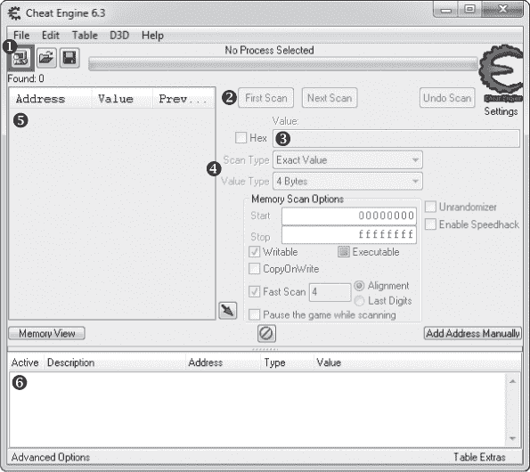
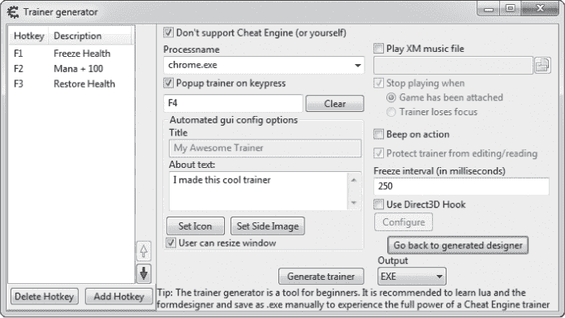
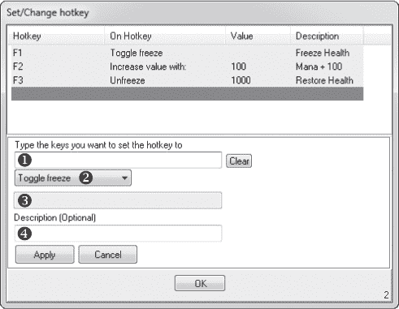
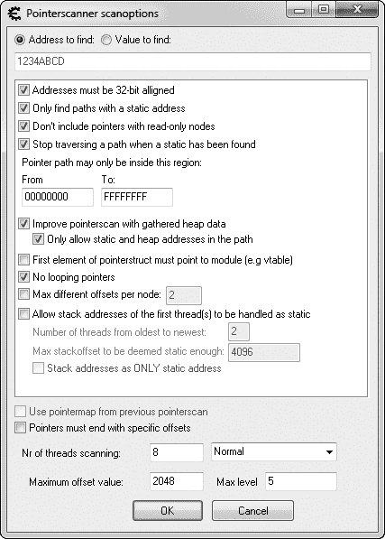
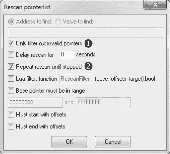

## 1

**使用作弊引擎扫描内存**


世界上最顶尖的游戏黑客花费数年时间，个性化定制庞大的工具箱。如此强大的工具包使这些黑客能够无缝地分析游戏，轻松地原型化黑客攻击，并有效地开发机器人。然而，在核心上，每个独特的工具包都由同样的四个核心组成：一个内存扫描器、一个汇编级调试器、一个进程监控器和一个十六进制编辑器。

内存扫描是游戏黑客的入口，本章将教你如何使用作弊引擎——一个强大的内存扫描器，它搜索游戏的运行内存（也就是 RAM）中的值，比如玩家的等级、血量或游戏中的货币。首先，我会介绍基础的内存扫描、内存修改和指针扫描。接着，我们将深入了解作弊引擎强大的嵌入式 Lua 脚本引擎。

**注意**

*你可以从* [`www.cheatengine.org/`](http://www.cheatengine.org/) *下载作弊引擎。安装时要注意，因为它会尝试安装一些工具栏和其他垃圾软件。如果你愿意，可以禁用这些选项。*

### 为什么内存扫描器很重要

了解游戏的状态对于智能地与游戏互动至关重要，但与人类不同，软件不能仅仅通过看屏幕上的内容来确定游戏的状态。幸运的是，在游戏产生的所有刺激背后，计算机的内存包含了该游戏状态的纯数字表示——而程序能够轻松理解数字。黑客使用内存扫描器来找到这些内存中的值，然后在他们的程序中读取这些位置的内存，以了解游戏的状态。

例如，一个当玩家血量低于 500 时自动治疗玩家的程序需要做两件事：追踪玩家当前的血量和施放治疗法术。前者需要访问游戏的状态，而后者可能只需要按下一个按钮。给定玩家血量存储的位置和读取游戏内存的方式，程序大致的伪代码可能如下所示：

```
// do this in some loop
health = readMemory(game, HEALTH_LOCATION)
if (health < 500)
    pressButton(HEAL_BUTTON)
```

内存扫描器让你可以找到`HEALTH_LOCATION`，以便你的软件稍后可以查询它。

### 基础内存扫描

内存扫描器是对有抱负的游戏黑客来说最基础也是最重要的工具。和任何程序一样，游戏中的所有数据都存在一个叫做*内存地址*的绝对位置。如果你把内存看作一个非常大的字节数组，那么内存地址就是指向该数组中某个值的索引。当内存扫描器被告知要在游戏内存中找到某个值*x*（称为*扫描值*，因为它是你正在扫描的值）时，扫描器会循环遍历字节数组，寻找任何等于*x*的值。每次找到匹配的值时，它会将该匹配项的索引添加到结果列表中。

然而，由于游戏内存的庞大，*x* 的值可能出现在数百个位置。假设 *x* 是玩家的生命值，目前是 500。我们的 *x* 唯一持有 `500`，但 `500` 并非仅由 *x* 独占，因此扫描 *x* 会返回所有值为 `500` 的变量。任何与 *x* 无关的地址最终都是杂乱无章的；它们仅仅是偶然与 *x* 一起共享 `500` 的值。为了过滤掉这些不需要的值，内存扫描器允许你重新扫描结果列表，移除那些不再持有与 *x* 相同值的地址，无论 *x* 是否仍为 `500` 或已发生变化。

为了使这些重新扫描有效，游戏的整体状态必须具有显著的 *熵*——一种衡量混乱的指标。通过改变游戏内的环境，通常是通过四处走动、击杀怪物或更换角色，可以增加熵值。随着熵值的增加，无关的地址不太可能继续随意持有相同的值，且在足够的熵值下，几次重新扫描应该可以过滤掉所有假阳性，最终只留下 *x* 的真实地址。

### Cheat Engine 的内存扫描器

本节将带你了解 Cheat Engine 的内存扫描选项，帮助你追踪游戏状态值在内存中的地址。我将在《基础内存编辑》的第 11 页让你有机会亲自尝试扫描器；现在，打开 Cheat Engine 并四处看看。内存扫描器紧密封装在其主窗口中，如图 1-1 所示。



*图 1-1：Cheat Engine 主界面*

要开始扫描游戏的内存，点击附加图标 ➊ 以附加到一个进程，然后输入你想要查找的扫描值（在我们概念化的扫描器中称为 *x*） ➌。通过附加到一个进程，我们告诉 Cheat Engine 准备对其进行操作；在这种情况下，这个操作是一个扫描。接下来，我将讨论告诉 Cheat Engine 执行哪种类型的扫描也会有所帮助。

#### *扫描类型*

Cheat Engine 允许你选择两种不同的扫描指令，分别是扫描类型和数值类型 ➍。扫描类型告诉扫描器如何使用以下扫描类型之一来比较你的扫描值与正在扫描的内存： 

**精确值** 返回指向等于扫描值的地址。如果你正在寻找的值在扫描过程中不会改变，请选择此选项；例如，生命值、法力值和等级通常属于此类别。

**大于** 返回指向比扫描值更大的值的地址。当你搜索的值不断增加时，这个选项非常有用，这通常发生在计时器中。

**小于** 返回指向比扫描值更小的值的地址。与“大于”类似，这个选项在寻找计时器时非常有用（在这种情况下，是倒计时而不是正计时）。

**介于某两个值之间** 返回指向位于扫描值范围内的值的地址。此选项结合了“大于”和“小于”，显示一个次级扫描值框，允许你输入一个更小范围的值。

**未知初始值** 返回程序内存中所有地址，允许重新扫描检查相对于它们初始值的整个地址范围。此选项对于寻找物品或生物类型非常有用，因为你并不总是知道游戏开发者用来表示这些对象的内部值。

值类型指令告诉作弊引擎扫描器正在寻找哪种类型的变量。

#### *运行第一次扫描*

一旦设置了两个扫描指令，点击**第一次扫描** ➋开始初始值扫描，扫描仪将填充结果列表➎。列表中任何绿色的地址都是*静态*的，意味着它们应该在程序重启后保持不变。以黑色列出的地址位于*动态分配内存*中，即在运行时分配的内存。

当结果列表首次填充时，它会显示每个结果的地址和实时值。每次重新扫描时，还会显示上次扫描期间每个结果的值。（任何显示的实时值会以你在 编辑 ▸ 设置 ▸ 常规设置 ▸ 更新间隔 中设置的时间间隔进行更新。）

#### *下一次扫描*

一旦结果列表被填充，扫描仪会启用“下一次扫描”➋按钮，该按钮提供六种新的扫描类型。这些附加扫描类型允许你将结果列表中的地址与上次扫描中的值进行比较，从而帮助你缩小哪个地址包含你正在扫描的游戏状态值。它们如下：

**增加的值** 返回指向已增加的值的地址。此选项与“大于”扫描类型互补，保持相同的最小值，并移除任何值已减少的地址。

**增加的值** 返回指向值增加了指定数量的地址。此扫描类型通常会返回更少的误报，但仅当你准确知道一个值增加了多少时才可以使用它。

**减少的值** 这个选项是“增加的值”的相反操作。

**减少的值** 这个选项是“增加的值”的相反操作。

**已更改的值** 返回指向已更改的值的地址。当你知道一个值会发生变化，但不确定变化方式时，此类型非常有用。

**未更改的值** 返回指向未更改的值的地址。这有助于你排除误报，因为你可以轻松产生大量熵，同时确保所需的值保持不变。

您通常需要使用多种扫描类型，以便缩小大量结果列表并找到正确的地址。消除误报通常是通过正确创建熵（如在“基本内存扫描”第 4 页中所述）、战术性地改变扫描指令、勇敢地按下“下一次扫描”，然后重复这一过程，直到只剩下一个地址。

#### *当你无法获得单一结果时*

有时在作弊引擎中无法确定一个单一的结果，在这种情况下，您必须通过实验来确定正确的地址。例如，如果您正在寻找角色的生命值并且无法将地址缩小到少于五个地址，您可以尝试修改每个地址的值（如在“使用作弊引擎手动修改”第 8 页中所述），直到看到生命值显示变化，或者其他值自动变化为您设置的值。

#### *作弊表*

一旦您找到正确的地址，可以双击它将其添加到*作弊表面板* ➏；在作弊表面板中的地址可以被修改、监视，并保存到作弊表文件中以供将来使用。

在作弊表面板的每个地址上，您可以通过双击描述栏来添加描述，也可以通过右键单击并选择“更改颜色”来添加颜色。您还可以通过右键单击并分别选择“以十六进制显示”或“以十进制显示”来显示每个地址的值，最后，您可以通过双击类型栏来更改每个值的数据类型，或者通过双击值栏来更改值本身。

由于作弊表面板的主要目的是允许游戏黑客整洁地跟踪地址，因此它可以动态保存和加载。请前往**文件** ▸ **保存**或**文件** ▸ **另存为**，将当前的作弊表面板保存为一个*.ct*文档文件，其中包含每个地址及其值类型、描述、显示颜色和显示格式。要加载已保存的*.ct*文档，请前往**文件** ▸ **加载**。（您可以在*[`cheatengine.org/tables.php`](http://cheatengine.org/tables.php)*找到许多流行游戏的现成作弊表。）

现在我已经描述了如何扫描游戏状态值，接下来我将讨论在您知道它在内存中的位置时，如何更改该值。

### 游戏中的内存修改

机器人通过修改游戏状态中的内存值来作弊，以便给你大量的游戏内货币、修改你角色的健康、改变角色位置等。在大多数在线游戏中，角色的生命值（如健康、魔法、技能和位置）保存在内存中，但由游戏服务器控制并通过互联网传递到你的本地游戏客户端，因此在在线游戏中修改这些值仅仅是表面上的，不会影响实际值。（对在线游戏的任何有效内存修改都需要一种比作弊引擎更高级的黑客技术。）然而，在没有远程服务器的本地游戏中，你可以随意操控这些值。

#### *使用作弊引擎手动修改*

我们将使用作弊引擎来了解内存修改的原理。

要手动修改内存，请执行以下操作：

1.  将作弊引擎附加到一个游戏。

1.  你可以扫描你想要修改的地址，或者加载一个包含该地址的作弊表。

1.  双击地址栏的值列，打开输入提示框，你可以在其中输入新值。

1.  如果你想确保新值不会被覆盖，请选择“活动”列下的框，*冻结*该地址，这将使作弊引擎每次该地址值发生变化时，都将相同的值写回。

这种方法对快速粗糙的黑客攻击非常有效，但手动不断更改值是繁琐的；一个自动化的解决方案将更加吸引人。

#### *训练器生成器*

作弊引擎的训练器生成器允许你在不编写任何代码的情况下自动化整个内存修改过程。

要创建一个*训练器*（一个简单的机器人，将内存修改操作绑定到键盘快捷键），请转到**文件** ▸ **从表格创建通用训练器 Lua 脚本**。这将打开一个训练器生成器对话框，类似于图 1-2 所示的对话框。



*图 1-2：作弊引擎训练器生成器对话框*

这里有一些可以修改的字段：

**进程名称** 训练器应该附加到的可执行文件名称。这是你在使用作弊引擎时在进程列表中看到的名称，通常会自动填充作弊引擎附加的进程名称。

**按键时弹出训练器** 可选择启用一个快捷键——你可以通过在复选框下方的框中输入一个键组合来设置——用来显示训练器的主窗口。

**标题** 训练器的名称，将显示在其界面上。这个字段是可选的。

**关于文本** 你训练器的描述，将显示在界面上；这是可选的。

**冻结间隔（毫秒）** 冻结操作覆盖值的时间间隔。通常，你应该将其保持为 250，因为较短的间隔会消耗资源，而较长的间隔可能太慢。

配置好这些值后，点击 **添加快捷键** 来设置一个键序列以激活你的训练器。系统会提示你从作弊表中选择一个值。输入一个值后，你将进入类似于 图 1-3 的设置/更改快捷键界面。



*图 1-3：Cheat Engine 设置/更改快捷键界面*

在此页面上，将光标放在标记为“输入要设置的快捷键”的框中 ➊，并输入所需的快捷键组合。接下来，从下拉菜单中选择所需的操作 ➋；选项应该按以下顺序出现：

**切换冻结** 切换地址的冻结状态。

**切换冻结并允许增加** 切换地址的冻结状态，但允许值增加。每当值减少时，训练器会用其先前的值覆盖它。增加的值将不会被覆盖。

**切换冻结并允许减少** 执行与“切换冻结并允许增加”相反的操作。

**冻结** 如果地址未被冻结，则将地址设置为冻结状态。

**解冻** 如果地址被冻结，则解冻该地址。

**设置值为** 将值设置为你在值框 ➌ 中指定的内容。

**减少值** 根据你在值框 ➌ 中指定的数值减少该值。

**增加值** 执行与“减少值”相反的操作。

最后，你可以为该操作设置一个描述 ➍。点击 **应用**，然后点击 **确定**，你的操作将出现在训练器生成器屏幕上的列表中。此时，Cheat Engine 会在后台运行训练器，你只需按下配置的快捷键即可执行内存操作。

要将训练器保存为可执行文件，请点击 **生成训练器**。在游戏启动后运行该可执行文件将会将训练器附加到游戏中，这样你就可以在不启动 Cheat Engine 的情况下使用它。

现在你已经熟悉了 Cheat Engine 的内存扫描器和训练器生成器，试着自己修改一些内存吧。

**基础内存编辑**

从 *[`www.nostarch.com/gamehacking/`](https://www.nostarch.com/gamehacking/)* 下载本书的文件，并运行文件 *BasicMemory.exe*。接着，启动 Cheat Engine 并附加到二进制文件。然后，仅使用 Cheat Engine，找到灰色球的 x 和 y 坐标地址。（提示：使用 4 字节值类型。）

一旦找到这些值，修改它们，将球放置在黑色方块上方。当你成功时，游戏会通过显示文本“做得好！”来告知你。（提示：每次移动球时，它的位置—作为一个 4 字节整数—在该平面中变化 1。还要尝试只查找静态的 [绿色] 结果。）

### 指针扫描

如我所提到的，在线游戏通常将值存储在动态分配的内存中。虽然引用动态内存的地址本身对我们没有用，但某个静态地址总是会指向另一个地址，而该地址又会指向另一个，以此类推，直到链的末尾指向我们感兴趣的动态内存。Cheat Engine 可以使用一种叫做*指针扫描*的方法来定位这些链。

在本节中，我将向你介绍指针链，并描述如何在 Cheat Engine 中进行指针扫描。当你掌握了用户界面后，你可以在第 18 页的“指针扫描”中获得一些实践经验。

#### *指针链*

我刚才描述的这个偏移链被称为*指针链*，其结构如下：

```
list<int> chain = {start, offset1, offset2[, ...]}
```

这个指针链中的第一个值（`start`）称为*内存指针*。它是启动链的地址。其余的值（`offset1`，`offset2`，依此类推）构成到达目标值的路径，称为*指针路径*。

这个伪代码展示了如何读取一个指针链：

```
   int readPointerChain(chain) {
➊      ret = read(chain[0])
       for i = 1, chain.len - 1, 1 {
           offset = chain[i]
           ret = read(ret + offset)
       }
       return ret
   }
```

这段代码创建了一个名为`readPointerPath()`的函数，它以一个名为`chain`的指针链作为参数。`readPointerPath()`函数将`chain`中的指针路径视为从地址`ret`（最初设置为➊处的内存指针）开始的一系列内存偏移量。然后，它循环遍历这些偏移量，在每次迭代时通过`read(ret + offset)`更新`ret`的值，并在完成后返回`ret`。以下是当循环展开时，`readPointerPath()`的伪代码：

```
list<int> chain = {0xDEADBEEF, 0xAB, 0x10, 0xCC}
value = readPointerPath(chain)
// the function call unrolls to this
ret = read(0xDEADBEEF) //chain[0]
ret = read(ret + 0xAB)
ret = read(ret + 0x10)
ret = read(ret + 0xCC)
int value = ret
```

该函数最终调用`read`四次，针对`chain`中的每个地址调用一次。

**注意**

*许多游戏黑客更喜欢将链读取直接编写在代码中，而不是像* `readPointerPath()` *那样将它们封装成函数。*

#### *指针扫描基础*

指针链存在的原因是每一块动态分配的内存都必须有一个对应的静态地址，游戏代码可以用这个地址来引用它。游戏黑客可以通过定位引用这些内存块的指针链来访问它们。然而，由于指针链具有多层结构，它们无法通过内存扫描器使用的线性方式来定位，因此游戏黑客发明了新的方法来查找它们。

从逆向工程的角度来看，你可以定位并分析汇编代码，从而推断它使用的指针路径来访问该值，但这样做非常耗时且需要高级工具。*指针扫描器*通过暴力破解的方法递归遍历每一个可能的指针链，直到找到一个可以解析到目标内存地址的链。

清单 1-1 中的伪代码应该能让你大致了解指针扫描器是如何工作的。

```
   list<int> pointerScan(target, maxAdd, maxDepth) {
➊    for address = BASE, 0x7FFFFFF, 4 {
           ret = rScan(address, target, maxAdd, maxDepth, 1)
           if (ret.len > 0) {
               ret.pushFront(address)
               return ret
           }
      }
      return {}
   }
   list<int> rScan(address, target, maxAdd, maxDepth, curDepth) {
➋      for offset = 0, maxAdd, 4 {
            value = read(address + offset)
➌          if (value == target)
                return list<int>(offset)
        }
➍      if (curDepth < maxDepth) {
            curDepth++
➎          for offset = 0, maxAdd, 4 {
                ret = rScan(address + offset, target, maxAdd, maxDepth, curDepth) 
➏              if (ret.len > 0) {
                    ret.pushFront(offset)
➐                  return ret
                }
            }
        }
        return {}
   }
```

*清单 1-1：指针扫描的伪代码*

这段代码创建了`pointerScan()`和`rScan()`这两个函数。

##### pointerScan()

`pointerScan()` 函数是扫描的入口点。它接受以下参数：`target`（要查找的动态内存地址），`maxAdd`（任何偏移量的最大值），以及 `maxDepth`（指针路径的最大长度）。然后，它会遍历游戏中的每个 4 字节对齐的地址 ➊，并使用参数 `address`（当前迭代中的地址）、`target`、`maxAdd`、`maxDepth` 和 `curDepth`（路径的深度，此时始终为 1）调用 `rScan()`。

##### rScan()

`rScan()` 函数从 `0` 到 `maxAdd` 之间的每个 4 字节对齐偏移量 ➋ 读取内存，并在结果等于 `target` ➌ 时返回。如果 `rScan()` 在第一次循环中没有返回，且递归深度不太深 ➍，它会递增 `curDepth` 并再次循环每个偏移量 ➎，对每次迭代进行自我调用。

如果自调用返回一个部分指针路径 ➏，`rScan()` 会将当前偏移量添加到路径前，并沿着递归链向上返回 ➐，直到它到达 `pointerScan()`。当从 `pointerScan()` 调用 `rScan()` 并返回一个指针路径时，`pointerScan()` 会将当前地址推送到路径的前面，并将其作为完整的链条返回。

#### *使用 Cheat Engine 进行指针扫描*

前面的示例展示了指针扫描的基本过程，但我展示的实现方式比较原始。除了执行速度极慢外，它还会生成无数的假阳性。Cheat Engine 的指针扫描器使用了许多高级插值方法来加速扫描并提高其准确性，在本节中，我将向你介绍可用的各种扫描选项。

要在 Cheat Engine 中启动指针扫描，右键点击你的作弊表中的动态内存地址，然后点击 **Pointer scan for this address**。当你启动指针扫描时，Cheat Engine 会询问你将扫描结果存储为 *.ptr* 文件的位置。一旦你输入了位置，类似 图 1-4 所示的指针扫描选项对话框将会出现。



*图 1-4：Cheat Engine 指针扫描选项对话框*

顶部的“查找地址”输入字段显示的是你的动态内存地址。现在，仔细从 Cheat Engine 的多种扫描选项中选择。

##### 关键选项

Cheat Engine 的几个扫描选项通常保留默认值。以下是这些选项：

**地址必须是 32 位对齐** 告诉 Cheat Engine 只扫描 4 的倍数的地址，这大大提高了扫描速度。正如你在 第四章 中将学到的那样，编译器会对数据进行对齐，因此大多数地址默认情况下会是 4 的倍数。你很少需要禁用这个选项。

**仅查找具有静态地址的路径** 通过防止 Cheat Engine 查找具有动态起始指针的路径来加速扫描。这个选项应该 *始终* 启用，因为扫描从另一个动态地址开始的路径可能会适得其反。

**不包含只读节点的指针** 也应该始终启用。存储易变数据的动态分配内存不应为只读。

**当找到静态地址时停止遍历路径** 当发现指向静态起始地址的指针路径时终止扫描。应该启用此选项，以减少假阳性并加速扫描。

**指针路径仅限于此区域内** 通常可以保持默认设置。你可以使用的其他选项通过智能缩小扫描范围来弥补这一大范围。

**指针结构的第一个元素必须指向模块** 告诉 Cheat Engine 不要搜索那些未找到虚函数表的堆块，假设游戏是使用面向对象编程方法编写的。虽然这个设置可以极大地加速扫描，但它非常不可靠，你几乎总是应该将其禁用。

**无循环指针** 使任何指向自身的路径无效，从而筛除低效路径，但会稍微降低扫描速度。通常应该启用此选项。

**最大层级** 确定指针路径的最大长度。（记得 Listing 1-1 示例代码中的 `maxDepth` 变量吗？）这个值应该保持在 6 或 7 左右。

当然，也会有需要改变这些选项的情况。例如，如果使用“无循环指针”或“最大层级”设置时无法获得可靠结果，通常意味着你正在寻找的值存在于一个动态数据结构中，比如链表、二叉树或向量。另一个例子是“当找到静态地址时停止遍历路径”选项，在少数情况下，它可能会阻止你获得可靠的结果。

##### 情况性选项

与之前的选项不同，其余设置的配置将取决于你的情况。以下是如何为每个设置确定最佳配置：

**使用收集的堆数据改善指针扫描** 允许 Cheat Engine 使用堆分配记录来确定偏移限制，从而有效地通过筛除许多假阳性来加速扫描。如果你遇到使用自定义内存分配器的游戏（这种情况越来越常见），这个选项实际上可能会做出与其预期相反的效果。在初次扫描时可以启用此设置，但当你无法找到可靠路径时，它应该是第一个禁用的选项。

**路径中只允许静态和堆地址** 使所有无法通过堆数据优化的路径无效，从而使该方法更加激进。

**每个节点的最大不同偏移量** 限制扫描器检查的相同值指针的数量。也就是说，如果 *n* 个不同的地址指向 `0x0BADF00D`，此选项告诉 Cheat Engine 只考虑前 *m* 个地址。当你无法缩小结果集时，这个选项可以非常有帮助。在其他情况下，你可能希望禁用它，因为它会错过许多有效的路径。

**允许将第一线程的堆栈地址视为静态** 扫描游戏中最旧的 *m* 个线程的调用栈，考虑每个栈中前 *n* 字节。这使得 Cheat Engine 能够扫描游戏调用链中的函数参数和局部变量（目标是找到游戏主循环使用的变量）。使用此选项找到的路径既可能非常不稳定，又可能极其有用；当我无法找到堆地址时，我才会使用这个选项。

**将堆栈地址视为唯一的静态地址** 通过仅允许堆栈地址出现在指针路径中，进一步加强了之前的选项。

**指针必须以特定的偏移量结束** 如果你知道有效路径结尾的偏移量，这个选项会非常有用。它允许你指定这些偏移量（从最后一个偏移量开始），大大减少扫描的范围。

**扫描线程数** 确定扫描器将使用多少个线程。通常，线程数设置为与处理器核心数相同效果最佳。下拉菜单中的选项允许你为每个线程指定优先级。如果你希望扫描非常缓慢，选择“空闲”最合适；如果是大多数扫描，选择“正常”；“时间关键”适用于长时间的扫描，但会使你的电脑在扫描过程中变得无法使用。

**最大偏移量值** 确定路径中每个偏移量的最大值。（记得 Listing 1-1 中的 `maxAdd` 变量吗？）我通常从一个较低的值开始，只有当扫描失败时才会增加它；`128` 是一个不错的起始值。请记住，如果你使用的是堆优化选项，这个值大多会被忽略。

**注意**

*如果同时启用了“仅允许路径中的静态和堆地址”和“将堆栈地址视为唯一的静态地址”选项，会怎么样？扫描会没有结果吗？看起来像是一个有趣的实验，尽管它可能没什么用。*

定义扫描选项后，点击 **确定** 开始指针扫描。当扫描完成后，会出现一个结果窗口，显示找到的指针链列表。这个列表通常会有数千个结果，包含了真实链和误报。

#### *指针重扫*

指针扫描器有一个重扫功能，可以帮助你消除误报。首先，在结果窗口中按 CTRL-R 打开重扫指针列表对话框，如 图 1-5 所示。



*图 1-5：Cheat Engine 重扫指针列表对话框*

在告诉 Cheat Engine 进行重扫时，有两个主要选项需要考虑：

**仅过滤无效指针** 如果你勾选这个框 ➊，重扫将仅丢弃指向无效内存的指针链，这在初始结果集非常大的时候会很有帮助。禁用此选项则会过滤掉那些没有解析到特定地址或值的路径（如图所示）。

**重复重扫直到停止** 如果你勾选此框 ➋，重扫将以循环方式执行。理想情况下，你应该启用此设置并让重扫在你创建大量内存熵时运行。

对于初始重扫，启用 **仅过滤无效指针** 和 **重复重扫直到停止**，然后按 **确定** 以启动重扫。重扫窗口将消失，结果窗口中会出现一个“停止重扫循环”按钮。结果列表将持续重扫，直到你点击停止重扫循环，但在此之前，花几分钟创建内存熵。

在极少数情况下，使用重扫循环可能仍然会留下一个较大的可能路径列表。当这种情况发生时，你可能需要重新启动游戏，找到保存你值的地址（它可能已更改！），并在该地址上使用重扫功能进一步缩小结果范围。在此扫描中，保持 **仅过滤无效指针** 取消选中，并在 **查找的地址** 字段中输入 *新的* 地址。

**注意**

*如果你不得不关闭结果窗口，你可以重新打开它，并通过进入主 Cheat Engine 窗口，按下结果窗格下方的内存视图按钮来加载结果列表。这应该会弹出一个内存转储窗口。窗口出现后，按 CTRL-P 打开指针扫描结果列表。然后按 CTRL-O 打开你保存指针扫描的 *.ptr* 文件。*

如果你的结果仍然不够精确，尝试在系统重启后，甚至在不同的系统上运行相同的扫描。如果这仍然产生较大的结果集，则可以安全地认为每个结果是静态的，因为多个指针链可能会解析到相同的地址。

一旦你缩小了结果集的范围，双击一个可用的指针链，将其添加到作弊表中。如果你有几条看似可用的链，选择偏移量最少的那一条。如果你发现有多个指针链的偏移量完全相同且起始指针相同，但在某一点后分岔，那么你的数据可能存储在动态数据结构中。

这就是 Cheat Engine 中指针扫描的全部内容。试试看吧！

**指针扫描**

访问 *[`www.nostarch.com/gamehacking/`](https://www.nostarch.com/gamehacking/)* 并下载 *MemoryPointers.exe*。与上一个任务不同，这个任务要求你在 10 秒内赢得 50 次。每次获胜后，x 和 y 坐标的内存地址将会变化，意味着你只能在找到合适的指针路径时冻结该值。像前一个任务一样开始此练习，但一旦找到地址，使用指针扫描功能来定位指针路径。然后，将球放在黑色方块上，冻结该值，并按 TAB 开始测试。就像之前一样，游戏会在你获胜后告知你。（提示：尝试将最大级别设置为 `5`，最大偏移值设置为 `512`。此外，可以调整选项来允许堆栈地址，找到静态时终止扫描，并通过堆数据改善指针扫描。看看哪种选项组合能给出最佳结果。）

### Lua 脚本环境

历史上，机器人开发者在游戏发布补丁时很少使用 Cheat Engine 来更新地址，因为在 OllyDbg 中这样做要容易得多。这使得 Cheat Engine 对游戏黑客除了初期研究和开发外几乎没有用处——直到一个强大的基于 Lua 的嵌入式脚本引擎在 Cheat Engine 强大的扫描环境中实现。虽然这个引擎是为了在 Cheat Engine 中开发简单的机器人而创建的，但专业游戏黑客发现他们也可以利用它轻松编写复杂的脚本，自动定位不同版本游戏二进制文件中的地址——否则这个任务可能需要几个小时。

**注意**

*你可以在 wiki 上找到有关 Cheat Engine Lua 脚本引擎的更多详细信息，网址是* [`wiki.cheatengine.org/`](http://wiki.cheatengine.org/)。

要开始使用 Lua 引擎，从主 Cheat Engine 窗口按 CTRL-ALT-L。窗口打开后，在文本区域编写你的脚本，并点击 **执行脚本** 来运行它。使用 CTRL-S 保存脚本，使用 CTRL-O 打开已保存的脚本。

脚本引擎有数百个函数和无限的使用案例，因此我将通过分解两个脚本来让你了解它的一部分能力。每个游戏都是不同的，每个游戏黑客编写脚本来实现独特的目标，所以这些脚本仅用于演示概念。

#### *搜索汇编模式*

第一个脚本定位组成出站数据包的函数，并将它们发送到游戏服务器。它通过在游戏的汇编代码中搜索包含特定代码序列的函数来工作。

```
➊ BASEADDRESS = getAddress("Game.exe")
➋ function LocatePacketCreation(packetType)
➌     for address = BASEADDRESS, (BASEADDRESS + 0x2ffffff) do
           local push = readBytes(address, 1, false)
           local type = readInteger(address + 1)
           local call = readInteger(address + 5)
➍         if (push == 0x68 and type == packetType and call == 0xE8) then
               return address
           end
       end
       return 0
   end
   FUNCTIONHEADER = { 0xCC, 0x55, 0x8B, 0xEC, 0x6A }
➎ function LocateFunctionHead(checkAddress)
       if (checkAddress == 0) then return 0 end 
➏     for address = checkAddress, (checkAddress - 0x1fff), -1 do
           local match = true
           local checkheader = readBytes(address, #FUNCTIONHEADER, true)
➐         for i, v in ipairs(FUNCTIONHEADER) do
               if (v ~= checkheader[i]) then
                   match = false
                   break
               end
           end
➑         if (match) then return address + 1 end
       end
       return 0
   end

➒ local funcAddress = LocateFunctionHead(LocatePacketCreation(0x64))
   if (funcAddress ~= 0) then
       print(string.format("0x%x",funcAddress))
   else
       print("Not found!")
   end
```

代码首先获取 Cheat Engine 附加的模块的基地址 ➊。获得基地址后，定义了函数 `LocatePacketCreation()` ➋。这个函数循环遍历游戏中前 `0x2FFFFFF` 字节的内存 ➌，搜索一个代表此 x86 汇编代码的序列：

```
PUSH type   ; Data is: 0x68 [4byte type]
CALL offset ; Data is: 0xE8 [4byte offset]
```

该函数检查类型是否等于`packetType`，但它不关心函数偏移量是什么 ➍。一旦找到这个序列，函数就会返回。

接下来，定义了`LocateFunctionHead()`函数 ➎。该函数从给定地址回溯最多 0x1FFF 字节 ➏，并在每个地址处检查一个看起来像这样的汇编代码存根 ➐：

```
INT3         ; 0xCC
PUSH EBP     ; 0x55
MOV EBP, ESP ; 0x8B 0xEC
PUSH [-1]    ; 0x6A 0xFF
```

这个存根将在每个函数的开头出现，因为它是设置函数堆栈帧的函数前言的一部分。一旦找到代码，函数将返回存根的地址加 1 ➑（第一个字节`0xCC`是填充字节）。

为了将这些步骤串联起来，调用`LocatePacketCreation()`函数，并传入我正在寻找的`packetType`（随意设为`0x64`），然后将得到的地址传递给`LocateFunctionHead()`函数 ➒。这实际上定位了第一个将`packetType`传递到函数调用中的函数，并将其地址存储在`funcAddress`中。这个代码片段显示了结果：

```
INT3          ; LocateFunctionHead back-tracked to here
PUSH EBP      ;   and returned this address
MOV EBP, ESP
PUSH [-1]
--snip--
PUSH [0x64]   ; LocatePacketCreation returned this address
CALL [something]
```

这个 35 行的脚本可以在不到一分钟的时间内自动定位 15 个不同的函数。

#### *搜索字符串*

接下来的 Lua 脚本扫描游戏内存中的文本字符串。它的工作方式与在 Cheat Engine 中使用字符串值类型时的内存扫描器相似。

```
   BASEADDRESS = getAddress("Game.exe")
➊ function findString(str)
       local len = string.len(str)
➋     local chunkSize = 4096
➌     local chunkStep = chunkSize - len
       print("Found '" .. str .. "' at:")
➍     for address = BASEADDRESS, (BASEADDRESS + 0x2ffffff), chunkStep do
           local chunk = readBytes(address, chunkSize, true)
            if (not chunk) then break end
➎         for c = 0, chunkSize-len do 
➏             checkForString(address , chunk, c, str, len)
           end
       end
   end
   function checkForString(address, chunk, start, str, len)
       for i = 1, len do
           if (chunk[start+i] ~= string.byte(str, i)) then
               return false
           end
       end
➐     print(string.format("\t0x%x", address + start))
   end

➑ findString("hello")
➒ findString("world")
```

在获取基本地址后，定义了`findString()`函数 ➊，该函数将一个字符串`str`作为参数。该函数会以 4,096 字节为一块循环遍历游戏内存 ➍。数据块按顺序扫描，每个块的起始位置比上一个块的末尾提前`len`（`str`的长度）字节 ➌，以防止遗漏从一个块开始、另一个块结束的字符串。

当`findString()`读取每个数据块时，它会遍历每个字节，直到数据块中的重叠点 ➎，然后将每个子块传递给`checkForString()`函数 ➏。如果`checkForString()`将子块与`str`匹配，它会将该子块的地址打印到控制台 ➐。

最后，为了查找所有引用字符串`"hello"`和`"world"`的地址，调用了`findString("hello")` ➑和`findString("world")` ➒。通过使用这段代码搜索嵌入的调试字符串，并将其与前面的代码结合使用来定位函数头，我能够在几秒钟内找到游戏中的大量内部函数。

**优化内存代码**

由于内存读取的高开销，当编写执行内存读取的代码时，优化非常重要。在之前的代码片段中，请注意`findString()`函数没有使用 Lua 引擎内建的`readString()`函数。相反，它会读取大块的内存并在其中搜索所需的字符串。让我们来分析一下这些数字。

使用 `readString()` 的扫描会尝试在每一个可能的内存地址处读取一个 `len` 字节的字符串。这意味着它最多会读取 `(0x2FFFFFF * len + len)` 字节。而 `findString()` 会读取 4,096 字节的块，并在本地扫描这些块中的匹配字符串。这意味着它最多会读取 `(0x2FFFFFF + 4096 + (0x2FFFFFF / (4096 - 10)) * len)` 字节。在查找一个长度为 10 的字符串时，每种方法读取的字节数分别为 503,316,480 和 50,458,923 字节。

`findString()` 不仅读取的数据量少一个数量级，而且调用的内存读取次数也大大减少。以 4,096 字节为单位进行分块读取，可能需要总共 `(0x2FFFFFF / (4096 - len))` 次读取。相比之下，使用 `readString()` 的扫描则需要 `0x2FFFFFF` 次读取。使用 `findString()` 的扫描有了巨大的改进，因为调用读取操作的代价要比增加读取数据的大小要高得多。（注意，我选择 4,096 是随便挑的。由于读取内存可能非常耗时，我保持数据块相对较小，因为一次读取四页数据可能会浪费时间，仅仅是为了在第一页中找到字符串。）

### 结束语

到这个阶段，你应该已经对 Cheat Engine 及其工作原理有了基本的理解。Cheat Engine 是你工具箱中非常重要的一项工具，我鼓励你通过阅读 “基本内存编辑”（第 11 页）和 “指针扫描”（第 18 页），并自己动手实践，来积累一些使用经验。
