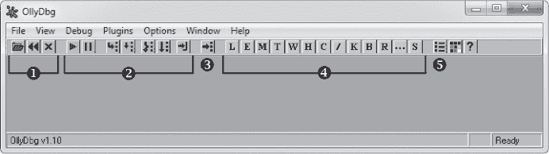
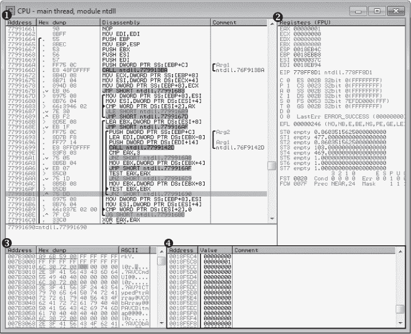
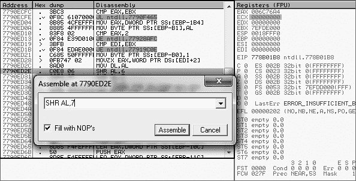
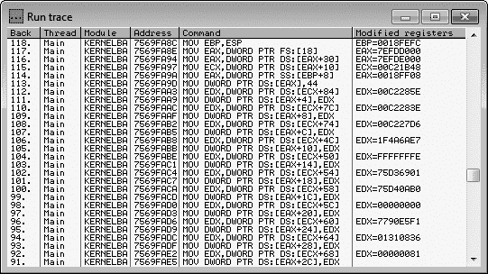
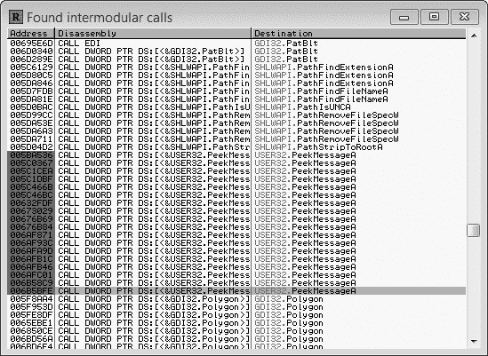
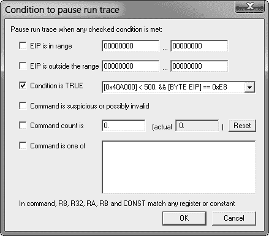
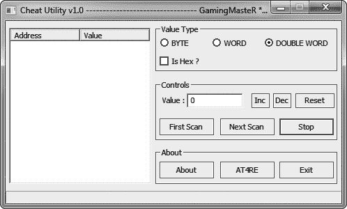
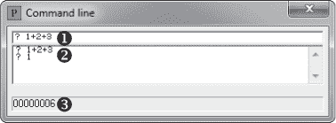
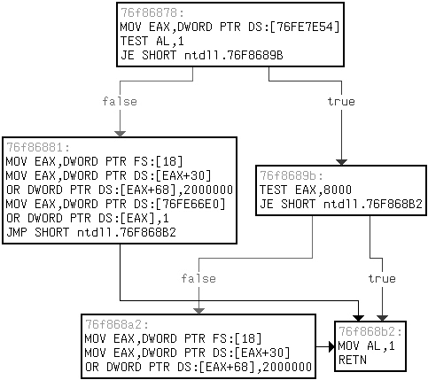

## 第二章：2

**使用 OLLYDBG 调试游戏**


使用 Cheat Engine 你可以了解游戏运行时的一些表面现象，但使用一个优秀的调试器，你可以深入挖掘，直到完全理解游戏的结构和执行流程。这使得 OllyDbg 成为你游戏破解工具包中不可或缺的部分。它包含了许多强大的工具，如条件断点、字符串引用搜索、汇编模式搜索和执行跟踪，使其成为一个功能强大的 32 位 Windows 应用程序汇编级调试器。

我将在第四章详细讲解低级代码结构，但在本章中，我假设你至少对现代代码级调试器有所了解，比如微软 Visual Studio 自带的调试器。OllyDbg 在功能上与这些调试器相似，但有一个重要的区别：它与应用程序的汇编代码进行交互，即使没有源代码和/或调试符号，仍然能够工作，这使得它在你需要深入了解游戏内部时非常理想。毕竟，游戏公司通常不会“好心”或“愚蠢”到将调试符号随游戏一起发布！

在本章中，我将介绍 OllyDbg 的用户界面，向你展示如何使用其最常见的调试功能，解析其表达式引擎，并提供一些实际案例，展示如何将其应用于你的游戏破解工作。最后，我还将介绍一些有用的插件，并送你一款测试游戏，帮助你入门 OllyDbg。

**注意**

*本章聚焦于 OllyDbg 1.10，可能对后续版本不完全适用。我使用这个版本是因为，在撰写时，OllyDbg 2 的插件接口仍然比 OllyDbg 1 的接口弱很多。*

当你觉得已经掌握了 OllyDbg 的界面和功能时，可以通过第 46 页中的“修改`if()`语句”自己尝试调试一个游戏。

### 简要了解 OllyDbg 的用户界面

访问 OllyDbg 官网 (*[`www.ollydbg.de/`](http://www.ollydbg.de/)*)，下载并安装 OllyDbg，然后打开程序。你应该会看到如图 2-1 所示的工具栏和多窗口界面区域。



*图 2-1：OllyDbg 主窗口*

这个工具栏包含了程序控制按钮➊、调试按钮➋、跳转按钮➌、控制窗口按钮➍和设置按钮➎。

这三个程序控制选项让你分别能够打开可执行文件并附加到它创建的进程、重启当前进程，或者终止当前进程的执行。你也可以通过快捷键 F3、CTRL-F2 和 ALT-F2 分别完成这些功能。要附加到已经在运行的进程，点击**文件** ▸ **附加**。

调试按钮控制调试器的操作。表 2-1 描述了这些按钮的功能、快捷键和作用。此表还列出了三个没有按钮的有用调试器操作。

**表 2-1：** 调试按钮和其他调试器功能

| **按钮** | **快捷键** | **功能** |
| --- | --- | --- |
| 播放 | F9 | 恢复进程的正常执行。 |
| 暂停 | F12 | 暂停进程中所有线程的执行，并在当前执行的指令处打开 CPU 窗口。 |
| 步进进入 | F7 | 单步执行到下一个操作（会进入函数调用）。 |
| 步进越过 | F8 | 单步执行到当前作用域内的下一个操作（会跳过函数调用）。 |
| 跟踪进入 | CTRL-F11 | 执行深度跟踪，跟踪每个执行的操作。 |
| 跟踪超出 | CTRL-F12 | 运行被动跟踪，仅跟踪当前作用域内的操作。 |
| 执行直到返回 | CTRL-F9 | 执行直到当前作用域内遇到返回操作为止。 |
|  | CTRL-F7 | 每次操作都自动单步执行，跟随反汇编窗口中的执行。这使得执行看起来像是动画的。 |
|  | CTRL-F8 | 也会动画化执行，但跳过函数而不是进入函数。 |
|  | ESC | 停止动画，暂停当前操作的执行。 |

“转到”按钮打开一个对话框，要求输入一个十六进制地址。一旦输入地址，OllyDbg 将打开 CPU 窗口并显示指定地址处的反汇编。当 CPU 窗口处于焦点时，你还可以通过快捷键 CTRL-G 显示该信息。

控制窗口按钮打开不同的*控制窗口*，这些窗口展示了调试中进程的有用信息，并暴露更多的调试功能，例如设置断点的能力。OllyDbg 共有 13 个控制窗口，所有这些窗口可以在多窗口界面中同时打开。表 2-2 描述了这些窗口，按它们在窗口按钮工具栏中出现的顺序列出。

**表 2-2：** OllyDbg 的控制窗口

| **窗口** | **快捷键** | **功能** |
| --- | --- | --- |
| 日志 | ALT-L | 显示日志消息列表，包括调试打印、线程事件、调试器事件、模块加载等。 |
| 模块 | ALT-E | 显示加载到进程中的所有可执行模块的列表。双击一个模块以在 CPU 窗口中打开它。 |
| 内存映射 | ALT-M | 显示进程分配的所有内存块的列表。双击列表中的某个块以打开该内存块的转储窗口。 |
| 线程 |  | 显示进程中运行的线程列表。每个线程在此列表中都有一个名为*线程信息块（TIB）*的结构。OllyDbg 允许你查看每个线程的 TIB；只需右键点击线程并选择“转储线程数据块”。 |
| Windows |  | 显示进程所持有的窗口句柄列表。在此列表中右键单击一个窗口，跳转到该窗口或在其类过程上设置断点（该过程是当消息发送到窗口时被调用的函数）。 |
| Handles |  | 显示进程所持有的句柄列表。（注意，Process Explorer 的句柄列表比 OllyDbg 更好，具体细节我会在第三章中讨论。） |
| CPU | ALT-C | 显示主要的反汇编界面并控制大多数调试器功能。 |
| Patches | CTRL-P | 显示你对进程中模块所做的任何汇编代码修改的列表。 |
| Call stack | ALT-K | 显示活动线程的调用栈。进程停止时，窗口会更新。 |
| Breakpoints | ALT-B | 显示活动的调试器断点列表，并允许你切换它们的开关。 |
| References |  | 显示参考列表，通常包含多种类型搜索的结果。它会在你运行搜索时自动弹出。 |
| Run trace |  | 显示调试器追踪记录的操作列表。 |
| Source |  | 如果存在程序调试数据库，显示反汇编模块的源代码。 |

最后，设置按钮打开 OllyDbg 设置窗口。暂时保持默认设置即可。

现在你已经参观了 OllyDbg 主窗口，让我们更深入地探讨 CPU、Patches 和 Run trace 窗口。作为一名游戏黑客，你将大量使用这些窗口，熟悉它们是关键。

### OllyDbg 的 CPU 窗口

图 2-2 中的 CPU 窗口是游戏黑客在 OllyDbg 中大部分时间都待的地方，因为它是调试功能的主要控制窗口。



*图 2-2：OllyDbg CPU 窗口*

这个窗口包含四个独立的控制面板：反汇编面板 ➊、寄存器面板 ➋、转储面板 ➌ 和堆栈面板 ➍。这四个面板封装了 OllyDbg 的主要调试功能，因此了解它们的细节非常重要。

#### *查看和浏览游戏的汇编代码*

你将通过 OllyDbg 的反汇编面板浏览游戏代码并控制调试的大多数方面。这个面板显示当前模块的汇编代码，其数据整齐地以由四列组成的表格显示：地址、十六进制转储、反汇编和注释。

地址列显示你所附加的游戏进程中每个操作的内存地址。你可以双击此列中的地址来切换它是否为*显示基址*。当地址被设置为显示基址时，地址列将显示所有其他地址作为相对于它的偏移量。

十六进制转储列显示每个操作的字节码，并按操作码和参数分组。此列左侧跨越多行的黑色括号标记了已知函数的边界。指向这些操作的跳转操作将显示在这些括号内的右箭头。执行跳转的操作会根据跳转的方向，在这些括号内显示向上或向下的箭头。例如，在 图 2-2 中，地址为 0x779916B1（高亮显示）的指令上有一个向上的箭头，表示这是一个向上的跳转。您可以将跳转视为一个 `goto` 操作符。

反汇编列显示游戏执行的每个操作的汇编代码。例如，您可以通过查看汇编代码确认 图 2-2 中地址为 0x779916B1 的指令是一个跳转指令，因为汇编代码中显示了 JNZ（非零时跳转）指令。此列中的黑色括号标记了循环的边界。附着在这些括号上的右箭头指向控制循环是否继续或退出的条件语句。在 图 2-2 中的这一列里，三个右箭头指向 CMP（比较）和 TEST 指令，这些指令用于汇编代码中进行值的比较。

注释列显示游戏执行的每个操作的可读注释。如果 OllyDbg 遇到已知的 API 函数名，它将自动插入带有函数名称的注释。同样，如果它成功检测到传递给函数的参数，它将标记这些参数（例如，`Arg1`、`Arg2`、...、`ArgN`）。您可以在该列中双击以添加自定义注释。此列中的黑色括号标记了假定的函数调用参数边界。

**注意**

*OllyDbg 在代码分析过程中推断函数边界、跳转方向、循环结构和函数参数，因此如果这些列缺少边界线或跳转箭头，只需按 CTRL-A 对二进制文件进行代码分析即可。*

当反汇编窗格获得焦点时，您可以使用一些快捷键来快速导航代码并控制调试器。使用 F2 来切换断点，SHIFT-F12 来设置条件断点，-（短横线）来后退，+（加号）来前进（这两个操作与网页浏览器中的表现相同），*（星号）来跳转到 EIP（即 x86 架构中的执行指针），CTRL--（短横线）来跳转到上一函数，CTRL-+ 来跳转到下一函数。

反汇编器还可以通过不同类型的搜索结果填充引用窗口。当您想要更改引用窗口的内容时，右键单击反汇编窗格，鼠标悬停在“搜索”菜单上以展开它，然后选择以下选项之一：

**所有跨模块调用** 搜索所有调用远程模块中函数的操作。例如，这可以让你看到游戏中所有调用 `Sleep()`、`PeekMessage()` 或任何其他 Windows API 函数的地方，从而使你能够检查或在调用时设置断点。

**所有命令** 搜索所有给定的汇编操作的出现，其中新增的操作符 `CONST` 和 `R32` 分别匹配常量值或寄存器值。此选项的一个用例可能是搜索诸如 `MOV [0xDEADBEEF], CONST`；`MOV [0xDEADBEEF], R32`；和 `MOV [0xDEADBEEF], [R32+CONST]` 的命令，以列出所有修改地址 `0xDEADBEEF` 上内存的操作，这个地址可以是任何东西，包括你角色的生命值地址。

**所有序列** 搜索所有给定操作序列的出现。这类似于之前的选项，但允许你指定多个命令。

**所有常量** 搜索给定十六进制常量的所有实例。例如，如果你输入角色生命值的地址，这将列出所有直接访问该地址的命令。

**所有开关** 搜索所有的开关-案例块。

**所有引用的文本字符串** 搜索代码中引用的所有字符串。你可以使用此选项搜索所有引用的字符串，并查看哪些代码访问了它们，这对于关联游戏中的文本显示与显示它们的代码非常有用。此选项对于定位任何调试断言或日志字符串也非常有用，这对确定代码部分的目的帮助巨大。

反汇编器还可以将当前模块中的所有标签（CTRL-N）或所有模块中已知的标签（搜索 ▸ 名称在所有模块中）填充到名称窗口中。已知的 API 函数将自动标记为其名称，你可以通过高亮命令、按 SHIFT-; 并在提示时输入标签来为命令添加标签。当代码中引用带标签的命令时，标签将替代地址显示。使用此功能的一种方法是为你分析过的函数命名（只需在函数的第一个命令上设置标签），这样你就可以看到其他函数调用时的名称。

#### *查看和编辑寄存器内容*

寄存器窗格显示八个处理器寄存器的内容、所有八个标志位、六个段寄存器、最后的 Windows 错误代码和 EIP。在这些值下方，窗格可以显示*浮点单元（FPU）*寄存器或调试寄存器；点击窗格的标题更改显示的寄存器类型。只有在你冻结进程时，这些值才会被填充。以红色显示的值自上次暂停以来已被更改。双击此窗格中的值可进行编辑。

#### *查看和搜索游戏内存*

转储窗格显示特定地址的内存转储。要跳转到某个地址并显示该地址的内存内容，请按 CTRL-G 并在弹出的框中输入地址。你也可以通过右键点击其他 CPU 窗格的地址列，并选择“在转储中跟随”来跳转到该条目的地址。

虽然转储窗格始终有三列，但你应始终看到的唯一一列是地址列，它的行为与反汇编窗格中的类似。你选择的数据展示类型决定了其他两列的显示方式。右键点击转储窗格来更改展示类型；对于图 2-2 中显示的类型，你需要右键点击并选择“十六进制” ▸ “十六进制/ASCII（8 字节）”。

你可以通过右键点击转储窗格中显示的地址并展开断点子菜单，在某个地址上设置内存断点。 从此菜单中选择**内存** ▸ **按访问**，可以在任何使用该地址的代码上断点，或者选择**内存** ▸ **按写入**，仅在写入该内存区域的代码上断点。要删除内存断点，请在相同菜单中选择**删除内存断点**；此选项仅在右键点击的地址上已有断点时出现。

在转储窗格中选择一个或多个值后，你可以按 CTRL-R 在当前模块的代码中搜索引用所选值的地址；此搜索的结果会显示在“引用”窗口中。你还可以使用 CTRL-B 搜索此窗格中的二进制字符串，使用 CTRL-N 搜索标签。发起搜索后，按 CTRL-L 可以跳转到下一个匹配项。CTRL-E 可以让你编辑任何已选择的值。

**注意**

*你可以从内存窗口打开的转储窗口与转储窗格的工作方式相同。*

#### *查看游戏的调用栈*

最后一种 CPU 窗格是堆栈窗格，顾名思义，它显示调用栈。与转储和反汇编窗格一样，堆栈窗格也有地址列。堆栈窗格还具有值列，显示堆栈中的 32 位整数数组，并且有一个注释列，显示返回地址、已知的函数名称和其他信息标签。堆栈窗格支持与转储窗格相同的所有快捷键，唯一的例外是 CTRL-N。

**多客户端补丁**

一种被称为*多客户端补丁*的黑客方式，会在游戏的二进制文件中覆盖单实例限制代码，将其替换为无操作代码，从而允许用户运行多个游戏客户端，即使通常情况下这样做是被禁止的。由于执行实例限制代码必须在游戏客户端启动后非常早的时候进行，这使得机器人的补丁几乎不可能及时注入。最简单的解决方法是通过在 OllyDbg 中应用补丁并直接将其保存到游戏二进制文件中，使多客户端补丁得以持久化。

### 创建代码补丁

OllyDbg 的 *代码补丁* 允许你对想要破解的游戏进行汇编代码修改，无需专门为该游戏开发工具。这使得原型设计 *控制流破解*——通过游戏设计缺陷、x86 汇编协议和常见的二进制构造组合来操控游戏行为——变得更加容易。

游戏黑客通常将完善的补丁作为可选功能集成到机器人的工具套件中，但在某些情况下，使这些功能持久化实际上对最终用户更为方便。幸运的是，OllyDbg 的补丁提供了你所需的完整功能，允许你仅使用 OllyDbg 来设计、测试并永久保存代码修改到可执行的二进制文件中。

要放置一个补丁，在 CPU 窗口中导航到你想要修补的汇编代码行，双击你希望修改的指令，在弹出的提示框中输入新的汇编指令，并点击 **汇编**，如 图 2-3 所示。



*图 2-3：在 OllyDbg 中设置补丁*

始终注意补丁的大小——你不能随意调整和移动汇编代码。比你打算替换的代码*更大的*补丁会溢出到后续的操作中，可能会移除关键功能。比你打算替换的操作*更小*的补丁是安全的，只要勾选了“用 NOP 填充”选项。此选项会用*无操作（NOP）*指令填充任何弃用的字节，NOP 指令是单字节操作，在执行时不会执行任何操作。

所有你放置的补丁都会列出，并显示其地址、大小、状态、旧代码、新代码和注释，在补丁窗口中查看。在这个列表中选择一个补丁，访问一组小而强大的快捷键，参见 表 2-3。

**表 2-3：补丁窗口快捷键**

| **操作符** | **功能** |
| --- | --- |
| ENTER | 跳转到反汇编器中的补丁。 |
| 空格键 | 切换补丁的启用或禁用状态。 |
| F2 | 在补丁上设置断点。 |
| SHIFT-F2 | 在补丁上设置条件断点。 |
| SHIFT-F4 | 在补丁上设置条件日志断点。 |
| DEL | 仅从列表中移除补丁条目。 |

在 OllyDbg 中，你还可以直接将补丁保存到二进制文件中。首先，在反汇编器中右键单击，然后点击 **复制到可执行文件** ▸ **所有修改**。如果你只想复制特定的补丁，可以在反汇编窗格中高亮显示它们，然后按 **复制到可执行文件** ▸ **选择**。

**确定补丁大小**

有几种方法可以判断你的补丁是否会与原始代码的大小不同。例如，在图 2-3 中，你可以看到位于 `0x7790ED2E` 的命令从 `SHR AL, 6` 被更改为 `SHR AL, 7`。如果你看命令左边的字节，你会看到三个字节，表示该命令的内存。这意味着我们的新命令必须是 3 个字节，或者如果少于 3 个字节，则用 NOP 填充。此外，这些字节被分为两列。第一列包含 `0xC0` 和 `0x08`，它们分别表示命令 `SHR` 和第一个操作数 `AL`。第二列包含 `0x06`，表示原始操作数。因为第二列显示了一个字节，所以任何替代操作数也必须是 1 字节（介于 `0x00` 和 `0xFF` 之间）。如果第二列显示的是 `0x00000006`，则替代操作数的长度可以达到 4 字节。

典型的代码补丁通常会使用所有的 NOP 指令来完全移除命令（通过留空并让它填充整个命令为 NOP），或者仅替换一个操作数，因此这种检查补丁大小的方法几乎总是有效的。

### 通过汇编代码追踪

当你对任何程序进行追踪时，OllyDbg 会逐步执行每个操作，并记录每个操作的数据。当追踪完成后，记录的数据会显示在运行追踪窗口中，如图 2-4 所示。



*图 2-4：运行追踪窗口*

运行追踪窗口被组织为以下六列：

**返回** 记录操作与当前执行状态之间的操作次数

**线程** 执行该操作的线程

**模块** 操作所在的模块

**地址** 操作的地址

**命令** 执行的操作

**修改的寄存器** 操作更改的寄存器及其新值

在破解游戏时，我发现 OllyDbg 的追踪功能非常有效，能帮助我找到动态内存的指针路径，尤其是在 Cheat Engine 扫描结果不明确时。这之所以有效，是因为你可以在运行追踪窗口中，逆向跟踪从内存使用点到内存从静态地址解析点的日志。

这个强大的功能的有用性仅受使用它的黑客创造力的限制。虽然我通常只用它来查找指针路径，但我遇到过一些其他情况，在这些情况下，它证明了非常宝贵。《OllyDbg 表达式的实际应用》中的轶事，以及第 36 页的内容，有助于阐明追踪的功能和强大之处。

### OllyDbg 的表达式引擎

OllyDbg 拥有一个自定义的表达式引擎，能够以简单的语法编译和计算高级表达式。这个表达式引擎出乎意料地强大，如果使用得当，它可以成为普通 OllyDbg 用户和 OllyDbg 大师之间的差距。你可以使用这个引擎为许多功能指定表达式，如条件断点、条件跟踪和命令行插件。本节介绍了表达式引擎及其提供的选项。

**注意**

*本节内容部分基于官方的表达式文档*（[`www.ollydbg.de/Help/i_Expressions.htm`](http://www.ollydbg.de/Help/i_Expressions.htm)）。然而，我发现文档中定义的某些组件似乎并不起作用，至少在 OllyDbg v1.10 版本中是如此。两个例子是*`INT`*和*`ASCII`*数据类型，它们必须替换为别名*`LONG`*和*`STRING`*。因此，在此我只包括了我亲自测试过并完全理解的组件。

#### *在断点中使用表达式*

当*条件断点*被激活时，OllyDbg 会提示你输入一个条件表达式；这就是大多数表达式的使用场景。当断点被触发时，OllyDbg 会悄悄暂停执行并计算该表达式。如果计算结果非零，执行会保持暂停状态，并且你会看到断点被触发。但如果计算结果是 `0`，OllyDbg 会悄悄恢复执行，就像什么都没发生一样。

由于游戏中每秒会发生大量的执行操作，你经常会发现某段代码在太多的上下文中被执行，导致断点不再是获取你所需数据的有效方式。将条件断点与对周围代码的良好理解结合起来，是避免这种情况的万无一失的方式。

#### *在表达式引擎中使用运算符*

对于数值数据类型，OllyDbg 表达式支持常见的 C 风格运算符，如表 2-4 所示。虽然没有明确的文档说明运算符优先级，但 OllyDbg 似乎遵循 C 风格的优先级规则，并且可以使用括号进行作用域限定。

**表 2-4：** OllyDbg 数值运算符

| **运算符** | **功能** |
| --- | --- |
| `a == b` | 如果 `a` 等于 `b`，则返回 `1`，否则返回 `0`。 |
| `a != b` | 如果 `a` 不等于 `b`，则返回 `1`，否则返回 `0`。 |
| `a > b` | 如果 `a` 大于 `b`，则返回 `1`，否则返回 `0`。 |
| `a < b` | 如果 `a` 小于 `b`，则返回 `1`，否则返回 `0`。 |
| `a >= b` | 如果 `a` 大于或等于 `b`，则返回 `1`，否则返回 `0`。 |
| `a <= b` | 如果 `a` 小于或等于 `b`，则返回 `1`，否则返回 `0`。 |
| `a && b` | 如果 `a` 和 `b` 都非零，则返回 `1`，否则返回 `0`。 |
| `a &#124;&#124; b` | 如果 `a` 或 `b` 其中之一非零，则返回 `1`，否则返回 `0`。 |
| `a ^ b` | 返回 `XOR(a, b)` 的结果。 |
| `a % b` | 返回`MODULUS(a, b)`的结果。 |
| `a & b` | 返回`AND(a, b)`的结果。 |
| `a &#124; b` | 返回`OR(a, b)`的结果。 |
| `a << b` | 返回将`a`左移`b`位后的结果。 |
| `a >> b` | 返回将`a`右移`b`位后的结果。 |
|  `a + b`  | 返回`a`加`b`的和。 |
| `a - b` | 返回`a`减去`b`的差。 |
| `a / b` | 返回`a`除以`b`的商。 |
| `a * b` | 返回`a`乘以`b`的积。 |
| `+a` | 返回`a`的符号表示。 |
| `-a` | 返回`a*-1`。 |
| `!a` | 如果`a`为`0`，返回`1`，否则返回`0`。 |

另一方面，对于字符串，唯一可用的运算符是`==`和`!=`，它们遵循以下规则：

• 字符串比较不区分大小写。

• 如果只有一个操作数是字符串字面量，比较将在达到字面量的长度后终止。因此，表达式`[STRING EAX]=="ABC123"`，其中`EAX`是指向字符串`ABC123XYZ`的指针，将评估为`1`而不是`0`。

• 如果在字符串比较中未指定操作数的类型，而另一个操作数是字符串字面量（例如，`"MyString"!=EAX`），则比较会首先假设非字面量操作数是一个 ASCII 字符串，如果该比较返回`0`，它将尝试进行第二次比较，假设操作数是 Unicode 字符串。

当然，运算符没有操作数是没有太大用处的。让我们来看一下在表达式中可以评估的一些数据。

#### *操作基本表达式元素*

表达式能够评估许多不同的元素，包括：

**CPU 寄存器** `EAX`、`EBX`、`ECX`、`EDX`、`ESP`、`EBP`、`ESI`和`EDI`。你还可以使用 1 字节和 2 字节寄存器（例如，`AL`表示`EAX`的低字节，`AX`表示`EAX`的低字）。`EIP`也可以使用。

**段寄存器** `CS`、`DS`、`ES`、`SS`、`FS`和`GS`。

**FPU 寄存器** `ST0`、`ST1`、`ST2`、`ST3`、`ST4`、`ST5`、`ST6`和`ST7`。

**简单标签** 可以是 API 函数名称，如`GetModuleHandle`，或用户定义的标签。

**Windows 常量** 如`ERROR_SUCCESS`。

**整数** 以十六进制格式或十进制格式表示（例如，`FFFF`或`65535`）。

**浮点数** 允许以十进制格式表示指数（例如，`654.123e-5`）。

**字符串字面量** 用引号括起来（例如，`"my string"`）。

表达式引擎按它们列出的顺序查找这些元素。例如，如果你有一个标签与 Windows 常量的名称匹配，引擎会使用该标签的地址，而不是常量的值。但是，如果你有一个以寄存器命名的标签，例如 EAX，引擎会使用寄存器的值，而不是标签的值。

#### *使用表达式访问内存内容*

OllyDbg 表达式还足够强大，可以结合内存读取，你可以通过将内存地址或计算出内存地址的表达式括在方括号中来实现。例如，`[EAX+C]`和`[401000]`表示 EAX+C 和 401000 地址处的内容。要将内存读取为除`DWORD`外的其他类型，你可以在方括号前指定所需类型，例如`BYTE [EAX]`，或在方括号内的第一个标记中指定，如`[STRING ESP+C]`。支持的类型列在表 2-5 中。

**表 2-5：** OllyDbg 数据类型

| **数据类型** | **解释** |
| --- | --- |
| `BYTE` | 8 位整数（无符号） |
| `CHAR` | 8 位整数（有符号） |
| `WORD` | 16 位整数（无符号） |
| `SHORT` | 16 位整数（有符号） |
| `DWORD` | 32 位整数（无符号） |
| `LONG` | 32 位整数（有符号） |
| `FLOAT` | 32 位浮动点数 |
| `DOUBLE` | 64 位浮动点数 |
| `STRING` | 指向一个 ASCII 字符串的指针（以空字符结尾） |
| `UNICODE` | 指向一个 Unicode 字符串的指针（以空字符结尾） |

在游戏黑客中，将内存内容直接插入到 OllyDbg 表达式中非常有用，部分原因是你可以让调试器在暂停之前检查角色的健康、名字、金币等信息。你将在“当特定玩家的名字被打印时暂停执行”第 37 页看到一个示例。

### OllyDbg 表达式示例

OllyDbg 中的表达式使用的语法与大多数编程语言类似；你甚至可以将多个表达式组合在一起，或将一个表达式嵌套在另一个表达式内。游戏黑客（实际上所有黑客）通常使用它们来创建条件断点，正如我在“在断点中使用表达式”第 34 页中描述的那样，但你可以在 OllyDbg 中的许多不同位置使用它们。例如，OllyDbg 的命令行插件可以实时评估表达式并显示其结果，使你能够轻松读取任意内存，检查汇编代码正在计算的值，或快速得到数学方程的结果。此外，黑客们甚至可以通过将表达式与追踪功能结合，创建智能的、与位置无关的断点。

在本节中，我将分享一些在我的工作中表达式引擎派上用场的轶事。我会解释我的思考过程，逐步展示我的调试过程，并将每个表达式分解成其组成部分，这样你就可以看到一些在游戏黑客中使用 OllyDbg 表达式的方式。

**注意**

*这些示例包含了一些汇编代码，但如果你没有太多汇编经验，也不必担心。只需忽略细节，了解像`ECX`、`EAX`和`ESP`这样的值是进程寄存器，类似于在“查看和编辑寄存器内容”第 29 页提到的寄存器内容。接下来，我会解释其余的内容。*

如果在我走过这些轶事时，你对表达式中的某个运算符、元素或数据类型感到困惑，只需参考“OllyDbg 的表达式引擎”（第 33 页）。

#### *当打印特定玩家的名称时暂停执行*

在一次特定的调试会话中，我需要搞清楚在游戏绘制玩家名称时究竟发生了什么。具体来说，我需要在游戏绘制“Player 1”名称之前设置断点，忽略所有绘制的其他名称。

##### 弄清楚在哪儿暂停执行

作为起点，我使用 Cheat Engine 找到了玩家 1 名称在内存中的地址。一旦找到了地址，我就用 OllyDbg 在该字符串的第一个字节上设置了内存断点。每次这个断点被触发时，我快速检查汇编代码，弄清楚它是如何使用玩家 1 名称的。最终，我找到了名称被直接访问的地方，它位于一个我之前命名为`printText()`的函数调用上方。我找到了绘制名称的代码。

我移除了我的内存断点，并在调用`printText()`的地方设置了一个代码断点。然而，出现了一个问题：由于调用`printText()`的地方在一个循环中，这个循环遍历了游戏中的每个玩家，所以每次绘制名称时，我的新断点都会被触发——这太频繁了。我需要修复它，使其仅在特定玩家时触发。

检查我之前的内存断点时发现，每个玩家的名称是通过以下汇编代码访问的：

```
PUSH DWORD PTR DS:[EAX+ECX*90+50]
```

`EAX`寄存器包含了一个玩家数据数组的地址；我将其称为`playerStruct`。`playerStruct`的大小为 0x90 字节，`ECX`寄存器包含迭代索引（著名的变量`i`），每个玩家的名称存储在其相应`playerStruct`开始位置后 0x50 字节的地方。这意味着，这条`PUSH`指令本质上将`EAX[ECX].name`（索引`i`的玩家名称）压入栈中，并作为参数传递给`printText()`函数调用。于是，循环大致可以分解为如下伪代码：

```
playerStruct EAX[MAX_PLAYERS]; // this is filled elsewhere
for (int ➊ECX = 0; ECX < MAX_PLAYERS; ECX++) {
    char* name = ➋EAX[ECX].name;
    breakpoint(); // my code breakpoint was basically right here
    printText(name);
}
```

通过分析，我确定了`playerStruct()`函数包含了所有玩家的数据，而循环遍历了玩家的总数（通过`ECX` ➊递增），为每个索引获取了角色名称 ➋，并打印了这个名字。

##### 制作条件断点

知道了这一点，为了仅在打印“Player 1”时暂停执行，我只需要在执行断点之前检查当前玩家的名称。在伪代码中，新的断点看起来像这样：

```
if (EAX[ECX].name == "Player 1") breakpoint();
```

一旦我弄清楚了新断点的形式，我需要在循环中访问`EAX[ECX].name`。这时，OllyDbg 的表达式引擎派上了用场：通过稍微修改汇编代码所用的表达式，我达到了目标，最终得到了这个表达式：

```
[STRING EAX + ECX*0x90 + 0x50] == "Player 1"
```

我移除了 `printText()` 上的代码断点，改为使用一个条件断点，该断点使用这个表达式，告诉 OllyDbg 仅当 `EAX + ECX*0x90 + 0x50` 存储的字符串值与 Player 1 的名字匹配时才中断。这个断点只会在绘制 `"Player 1"` 时触发，从而让我继续我的分析。

设置这个断点所需的工作量可能看起来很大，但通过练习，整个过程变得像写代码一样直观。经验丰富的黑客可以在几秒钟内完成这个操作。

实际上，这个断点使我能够在 `"Player 1"` 一出现就检查 `playerStruct()` 函数中的某些值。这样做很重要，因为这些值的状态只有在玩家进入屏幕后头几帧才与我的分析相关。像这样创造性地使用断点，可以让你分析各种复杂的游戏行为。

#### *当角色生命值降低时暂停执行*

在一次调试过程中，我需要找到在我的角色的生命值降到最大值以下后，第一次被调用的函数。我知道两种方法来解决这个问题：

• 查找每一段访问生命值的代码，并在每一段代码上设置一个条件断点，检查生命值。然后，当其中一个断点被触发时，逐步执行代码，直到下一个函数调用。

• 使用 OllyDbg 的追踪功能来创建一个动态断点，能够在我需要的地方停止。

第一个方法需要更多的设置，而且不容易重复，主要是因为需要设置大量的断点，而且我必须手动逐步执行代码。相比之下，后者方法的设置较为快速，且由于它是自动执行的，因此容易重复。尽管使用追踪功能会显著降低游戏速度（每个操作都会被追踪捕获），但我选择了后者方法。

##### 编写检查生命值的表达式

我再次使用了 Cheat Engine 来查找存储生命值的地址。通过参考 “Cheat Engine 的内存扫描器” 在 第 5 页 中描述的方法，我确定该地址为 0x40A000。

接下来，我需要一个表达式，告诉 OllyDbg 当我的生命值低于最大值时返回 `1`，否则返回 `0`。知道我的生命值存储在 0x40A000，并且最大值是 `500`，我最初设计了这个表达式：

```
[0x40A000] < 500.
```

这个表达式会在我的生命值低于 500 时触发中断（记住，在表达式引擎中，十进制数字必须以句点作为后缀），但与其等待一个函数被调用，不如立即触发中断。为了确保它等待直到函数被调用，我用 `&&` 运算符附加了另一个表达式：

```
[0x40A000] < 500\. && [➊BYTE EIP] == 0xE8
```

在 x86 处理器中，EIP 寄存器存储正在执行的操作的地址，因此我决定检查 `EIP` ➊ 处的第一个字节，看看它是否等于 `0xE8`。这个值告诉处理器执行一个*近距离函数调用*，这正是我所寻找的调用类型。

在开始我的跟踪之前，我还需要做一件最后的事情。由于跟踪功能会反复单步执行（如 “简要了解 OllyDbg 的用户界面” 中所述，Trace into 使用步入，Trace over 使用步过，第 24 页），我需要从一个位于或高于任何可能更新生命值的代码的地方开始跟踪。

##### 找出从哪里开始跟踪

为了找到一个合适的位置，我在 OllyDbg 的 CPU 窗口中打开了游戏的主模块，在反汇编面板中右键单击，然后选择了“搜索 ▸ 所有模块间调用”。随后弹出了“引用”窗口，显示了游戏调用的外部 API 函数列表。几乎所有的游戏软件都使用 Windows 的 `USER32.PeekMessage()` 函数来轮询新的消息，因此我根据目标列对列表进行了排序，并输入了 `PEEK`（你可以通过将窗口聚焦并直接输入名称来搜索列表），找到了第一次调用 `USER32.PeekMessage()` 的位置。

多亏了目标列排序，每次调用这个函数的记录都紧随其后地列在一起，正如图 2-5 所示。我通过选择它并按下 F2 在每个调用上设置了断点。



*图 2-5：OllyDbg 的找到的模块间调用窗口*

尽管有大约十几次调用 `USER32.PeekMessage()`，但只有其中两次触发了我的断点。更好的是，活跃的调用彼此相邻，位于一个无条件的循环中。在这个循环的底部有一些内部函数调用。这看起来完全像是一个主游戏循环。

##### 激活跟踪

为了最终设置我的跟踪，我删除了所有先前的断点，并在怀疑的主循环顶部放置了一个断点。我在断点触发后立即将其移除。然后，我按下了 CPU 窗口中的 CTRL-T，弹出了一个名为“条件暂停跟踪运行”的对话框，如图 2-6 所示。在这个新对话框中，我启用了“条件为 TRUE”选项，将我的表达式放入旁边的框中，并点击了 OK。接着，我回到 CPU 窗口，按下 CTRL-F11 开始一个“跟踪进入”会话。



*图 2-6：用于暂停跟踪运行的条件对话框*

一旦跟踪开始，游戏运行得非常慢，几乎无法玩耍。为了减少我的测试角色的生命值，我打开了第二个游戏实例，登录了一个不同的角色，并攻击了我的测试角色。当跟踪执行进度赶上实时进度时，OllyDbg 看到我的生命值发生变化，并在以下函数调用时触发了断点——正如预期的那样。

在这个游戏中，修改健康值的主要代码块是直接从网络代码中调用的。通过这个追踪，我能够找到网络模块在网络数据包告诉游戏更改玩家健康值后直接调用的函数。以下是游戏执行的伪代码：

```
   void network::check() {
       while (this->hasPacket()) {
           packet = this->getPacket();
           if (packet.type == UPDATE_HEALTH) {
               oldHealth = player->health;
               player->health = packet.getInteger();
➊             observe(HEALTH_CHANGE, oldHealth, player->health);
           }
       }
   }
```

我知道游戏中的代码只需在玩家的健康值发生变化时执行，而我需要添加代码以响应此类变化。在不了解整体代码结构的情况下，我猜测与健康值相关的代码会在 `health` 更新后直接通过某个函数调用执行。我的追踪条件断点确认了这一猜测，因为它直接在 `observe()` 函数 ➊ 处断开。从这里，我能够在该函数上放置一个 *钩子*（*钩子*是一种拦截函数调用的方式，具体描述请见 “Hooking to Redirect Game Execution” 在 第 153 页）并在玩家的健康值发生变化时执行我自己的代码。

### OllyDbg 插件为游戏黑客提供的工具

OllyDbg 高度灵活的插件系统可能是其最强大的功能之一。经验丰富的游戏黑客通常会配置 OllyDbg 环境，安装数十个有用的插件，包括公开发布的和自定义制作的插件。

你可以从 OpenRCE (*[`www.openrce.org/downloads/browse/OllyDbg_Plugins`](http://www.openrce.org/downloads/browse/OllyDbg_Plugins)*) 和 tuts4you (*[`www.tuts4you.com/download.php?list.9/`](http://www.tuts4you.com/download.php?list.9/)*) 插件仓库下载流行的插件。安装它们很简单：只需解压插件文件并将其放置在 OllyDbg 的安装文件夹中。

安装后，某些插件可以通过 OllyDbg 的插件菜单项访问。然而，其他插件可能只能在 OllyDbg 界面中的特定位置找到。

你可以通过这些在线仓库找到数百个强大的插件，但在构建你的工具库时要小心。工作环境中充斥着未使用的插件可能会影响生产力。在本节中，我精心挑选了四个插件，我认为它们不仅是游戏黑客工具包中不可或缺的部分，而且对环境的影响较小。

#### *使用 Asm2Clipboard 复制汇编代码*

Asm2Clipboard 是一个来自 OpenRCE 仓库的简约插件，允许你将反汇编窗格中的汇编代码片段复制到剪贴板。这在更新地址偏移量和设计代码空洞时非常有用，这两者是游戏黑客中我在 第五章 和 第七章 中深入探讨的游戏破解要素。

安装 Asm2Clipboard 后，您可以在反汇编器中高亮一段汇编代码，右键点击高亮的代码，展开 Asm2Clipboard 子菜单，并选择“将固定的 Asm 代码复制到剪贴板”或“将 Asm 代码复制到剪贴板”。后者会在每条指令的代码前加上代码地址作为注释，而前者仅复制纯代码。

#### *通过作弊工具将 Cheat Engine 添加到 OllyDbg*

来自 tuts4you 的 Cheat Utility 插件在 OllyDbg 中提供了一个高度精简版的 Cheat Engine。虽然 Cheat Utility 仅允许您执行精确值扫描，并且支持的数据显示类型非常有限，但当您不需要 Cheat Engine 的完整功能来找到所需的内容时，它可以使简单的扫描变得更加轻松。在安装 Cheat Utility 后，要打开其界面（如图 2-7 所示），请选择 **插件** ▸ **作弊工具** ▸ **启动**。



*图 2-7：作弊工具界面*

Cheat Utility 的用户界面和操作与 Cheat Engine 非常相似，因此如果您需要复习，可以参考第一章。

**注意**

*Games Invader 是 tuts4you 发布的 Cheat Utility 更新版，旨在提供更多功能。然而，我发现它存在一些 bug，且我更喜欢使用 Cheat Utility，因为我总是可以利用 Cheat Engine 进行高级扫描。*

#### *通过命令行控制 OllyDbg*

命令行插件使您能够通过一个小型命令行界面控制 OllyDbg。要访问插件，您可以按 ALT-F1 或选择 插件 ▸ 命令行 ▸ 命令行。然后，您将看到一个窗口，如图 2-8 所示，作为命令行界面。



*图 2-8：命令行界面*

要执行命令，请在输入框 ➊ 中输入命令并按 ENTER 键。您将在中间的列表 ➋ 中看到会话级别的命令历史，底部标签会显示命令的返回值 ➌（如果有的话）。

尽管有许多可用的命令，但我发现其中大多数是无用的。我主要将此工具作为测试表达式是否按预期解析以及作为便捷计算器的工具，但也有一些其他使用场景值得一提。我已在表 2-6 中描述了这些用法。

**表 2-6：** 命令行插件命令

| **命令** | **功能** |
| --- | --- |
| `BC 标识符` | 移除 `标识符` 上的任何断点，`标识符` 可以是代码地址或 API 函数名称。 |
| `BP 标识符 [,条件]` | 在 `标识符` 上设置调试器断点，`标识符` 可以是代码地址或 API 函数名称。当 `标识符` 为 API 函数名时，断点将设置在函数入口点。`条件` 参数是一个可选表达式，如果存在，它将作为断点条件。 |
| `BPX label` | 在当前反汇编模块中，每次出现`label`时都会设置一个调试断点。这个`label`通常是 API 函数名。 |
| `CALC expression ? expression` | 评估`expression`并显示结果。 |
| `HD address` | 移除`address`上任何已存在的硬件断点。 |
| `HE address` | 在`address`上放置硬件执行断点。 |
| `HR address` | 在`address`上放置硬件访问断点。每次只能存在四个硬件断点。 |
| `HW address` | 在`address`上放置硬件写入断点。 |
| `MD` | 移除任何现有的内存断点（如果存在）。 |
| `MR address1, address2` | 在`address1`开始并延伸至`address2`的内存访问上设置断点。将替换任何现有的内存断点。 |
| `MW address1, address2` | 在`address1`开始并延伸至`address2`的内存写入上设置断点。将替换任何现有的内存断点。 |
| `WATCH expression W expression` | 打开观察窗口并将`expression`添加到观察列表中。此列表中的表达式将在每次进程接收到消息时重新评估，并且评估结果将显示在旁边。 |

命令行插件是由 OllyDbg 开发者制作的，应已预装在 OllyDbg 中。

#### *使用 OllyFlow 可视化控制流*

OllyFlow 可以在 OpenRCE 插件目录中找到，是一个纯粹的可视化插件，可以生成像图 2-9 中的代码图表，并使用 Wingraph32 显示它们。



*图 2-9：OllyFlow 函数流程图*

**注意**

*Wingraph32 并不随 OllyFlow 一起提供，但可以在 IDA 的免费版本中获取，下载链接如下：* [`www.hex-rays.com/products/ida/`](https://www.hex-rays.com/products/ida/)*。下载后，将*.exe*文件放入 OllyDbg 安装文件夹中。*

虽然这些图表不是交互式的，但它们能帮助你轻松识别游戏代码中的结构，例如循环和嵌套的`if()`语句，这在控制流分析中至关重要。安装 OllyFlow 后，你可以通过转到插件 ▸ OllyFlow（或者右键点击反汇编面板，展开 OllyFlow 图表子菜单）并选择以下选项之一来生成图表：

**生成函数流程图** 生成当前作用域中函数的图表，拆分不同的代码块并显示跳转路径。图 2-9 展示了一个函数流程图。毫无疑问，这是 OllyFlow 最有用的功能。

**从图表生成交叉引用** 生成一个图表，显示当前作用域中的函数所调用的所有函数。

**生成图表交叉引用** 生成一个图表，显示所有调用当前作用域中的函数的函数。

**生成调用栈图表** 生成从进程入口点到当前作用域中的函数的假定调用路径图表。

**生成模块图** 理论上生成整个模块中所有函数调用的完整图，但实际上很少能成功工作。

为了了解 OllyFlow 的实用性，可以查看 图 2-9 中的图形，并将其与生成该图形的相对简单的汇编函数进行比较：

```
   76f86878:
➊     MOV EAX,DWORD PTR DS:[76FE7E54]
       TEST AL,1
       JE ntdll.76F8689B
   76f86881:
➋     MOV EAX,DWORD PTR FS:[18]
       MOV EAX,DWORD PTR DS:[EAX+30]
       OR DWORD PTR DS:[EAX+68],2000000
       MOV EAX,DWORD PTR DS:[76FE66E0]
       OR DWORD PTR DS:[EAX],1
       JMP ntdll.76F868B2
   76f8689b:
➌     TEST EAX,8000
       JE ntdll.76F868B2
   76f868a2:
➍     MOV EAX,DWORD PTR FS:[18]
       MOV EAX,DWORD PTR DS:[EAX+30]
       OR DWORD PTR DS:[EAX+68],2000000
   76f868b2:
➎     MOV AL,1
       RETN
```

图 2-9 中有五个框，它们分别映射到这个函数的五个部分。该函数从 ➊ 开始，如果分支失败，则跳转到 ➋；如果成功，则跳转到 ➌。执行完 ➋ 后，直接跳转到 ➎，然后返回函数。执行完 ➌ 后，可能会继续执行 ➍ 或跳转到 ➎ 直接返回。执行完 ➍ 后，无条件地跳转到 ➎。理解 OllyFlow 的重点不在于了解这个函数的作用；现在只需要关注代码如何映射到图形上。

**补丁处理 IF() 语句**

如果你认为自己已经准备好用 OllyDbg 进行实际操作，那就继续阅读。访问 *[`www.nostarch.com/gamehacking/`](https://www.nostarch.com/gamehacking/)*，下载本书的资源文件，获取 *BasicDebugging.exe*，并执行它。乍一看，你会发现它看起来像经典游戏 Pong。在这个版本的 Pong 中，球在你对手的屏幕上时是不可见的。你的任务是禁用这个功能，让你始终能看到球。为了让你更轻松，我已使游戏变得自动化。你不需要玩，只需要进行黑客操作。

首先，将 OllyDbg 附加到游戏上。然后将 CPU 窗口聚焦于主模块（在模块列表中找到 *.exe* 并双击它），使用引用的文本字符串功能定位隐藏球时显示的字符串。接下来，双击该字符串，将其带到代码中并分析周围的代码，直到找到决定是否隐藏球的`if()`语句。最后，使用代码补丁功能，修改`if()`语句，使球始终被绘制。作为额外奖励，您可以尝试使用 OllyFlow 来绘制这个函数的图形，以便更好地理解它到底在做什么。（提示：`if()`语句检查球的 x 坐标是否小于 0x140。如果是，它跳转到绘制球的代码。如果不是，它绘制没有球的场景。如果您将 0x140 改为例如 0xFFFF，球就永远不会被隐藏。）

### 结语

OllyDbg 比 Cheat Engine 要复杂得多，但你会通过使用它学得最好，所以大胆尝试，亲自动手吧！你可以通过将本章中讲解的控制与调试技巧结合起来，开始在一些真实游戏中实践。如果你还没有准备好动手修改虚拟命运，那么可以尝试解决“修改 `if()` 语句”中的示例，作为练习环境。当你完成后，继续阅读第三章，在这里我将向你介绍两个在游戏破解侦查中非常有价值的工具——Process Monitor 和 Process Explorer。
