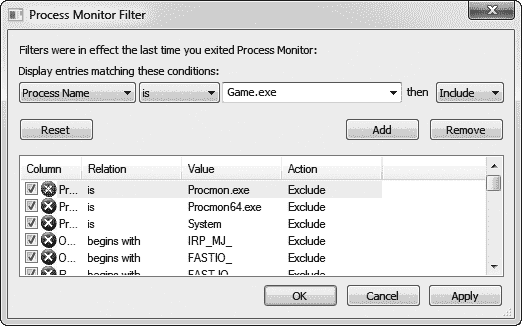
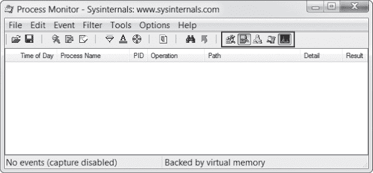
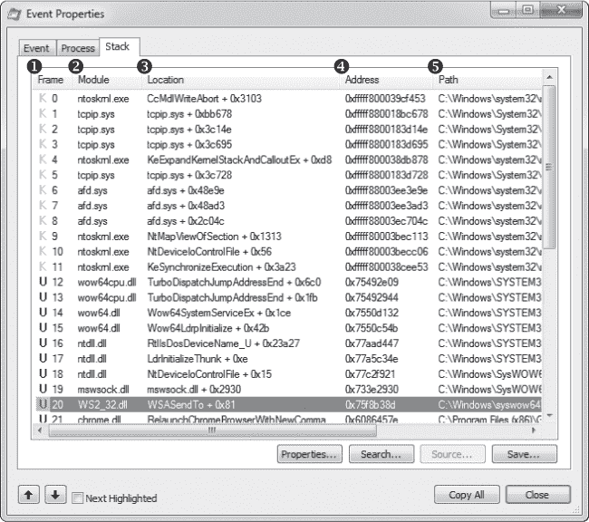
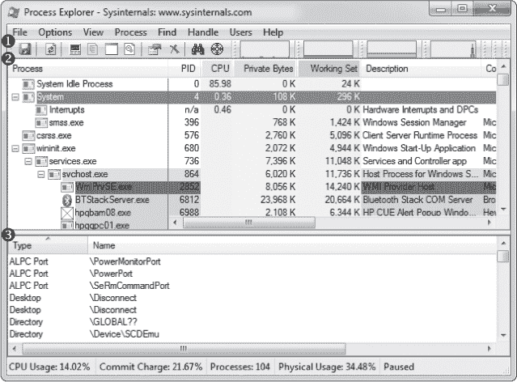
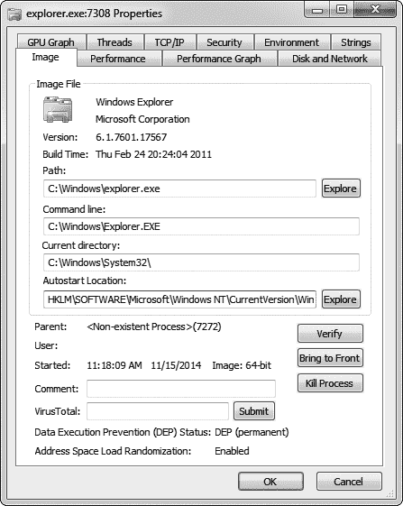

## 3

**使用 Process Monitor 和 Process Explorer 进行侦察**


Cheat Engine 和 OllyDbg 可以帮助你拆解游戏的内存和代码，但你还需要了解游戏如何与文件、注册表项、网络连接和其他进程交互。为了了解这些交互方式，你必须使用两种工具，它们擅长监控进程的外部操作：Process Monitor 和 Process Explorer。借助这些工具，你可以追踪完整的游戏映射，找到保存文件，识别用于存储设置的注册表键，并列出远程游戏服务器的互联网协议（IP）地址。

在本章中，我将教你如何使用 Process Monitor 和 Process Explorer 来记录系统事件并检查它们，以了解游戏是如何与系统交互的。这些工具主要用于初步侦察，能够清晰且详细地展示游戏如何与系统交互。你可以从 Windows Sysinternals 网站下载这两个程序（* [`technet.microsoft.com/en-us/sysinternals/`](https://technet.microsoft.com/en-us/sysinternals/)*）。

### Process Monitor

你可以通过探索游戏如何与注册表、文件系统和网络交互来了解很多游戏的内容。Process Monitor 是一个强大的系统监控工具，能够实时记录这些事件，并让你将数据无缝集成到调试会话中。该工具提供大量关于游戏如何与外部环境交互的有用数据。通过你的细致分析（有时也依靠直觉），这些数据可以揭示关于数据文件、网络连接和注册表事件的细节，这些对你理解并操控游戏功能大有帮助。

在这一节中，我将向你展示如何使用 Process Monitor 来记录数据，浏览这些数据，并根据经验判断游戏与哪些文件发生了交互。在这个界面介绍之后，你将有机会在“查找高分文件”中尝试使用 Process Monitor，位于第 55 页。

#### *记录游戏内事件*

Process Monitor 的日志可以保存各种潜在有用的信息，但它们最实际的用途是帮助你找出数据文件的存储位置，比如游戏中的物品定义。启动 Process Monitor 时，你首先看到的对话框是 Process Monitor 过滤器，如图 3-1 所示。



*图 3-1：Process Monitor 过滤器对话框*

这个对话框允许你根据事件所具备的多个动态属性来显示或抑制事件。要开始监控进程，选择**进程名称** ▸ **是** ▸ ***YourGameFilename.exe*** ▸ **包含**，然后按**添加**、**应用**和**确定**。这会告诉 Process Monitor 显示由*YourGameFilename.exe*触发的事件。在正确设置过滤器后，你将进入如图 3-2 所示的主窗口。



*图 3-2：进程监视器主窗口*

要配置进程监视器日志区域中显示的列，右键单击标题并选择 **选择列**。有很多令人印象深刻的选项，但我建议选择七个。

**时间** 让你看到操作发生的时间。

**进程名称** 如果你正在监视多个进程，它是有用的，但对于通常用于游戏的单进程过滤器来说，禁用此选项可以节省宝贵的空间。

**进程 ID** 类似于进程名称，但它显示的是进程 ID 而不是名称。

**操作** 显示执行的操作；因此，此选项是必选的。

**路径** 显示操作目标的路径；这是必选的。

**详细信息** 只有在某些情况下才有用，但启用它不会造成任何问题。

**结果** 显示操作失败时的情况，例如加载文件时失败。

当你显示更多列时，日志可能会变得非常拥挤，但坚持使用这些选项应该能帮助保持输出简洁。

一旦监视器运行，并且你已定义了希望看到的列，你可以切换五个事件类过滤器（在图 3-2 中用黑色标出），进一步清理日志。事件类过滤器允许你根据事件类型选择在日志中显示哪些事件。 从左到右，这些过滤器如下：

**注册表** 显示所有注册表活动。进程创建时，注册表中会有很多白噪声，因为游戏很少使用注册表，而 Windows 库总是使用它。禁用此过滤器可以节省日志中的大量空间。

**文件系统** 显示所有文件系统活动。这是最重要的事件类过滤器，因为了解数据文件存储的位置及其访问方式对于编写有效的机器人程序至关重要。

**网络** 显示所有网络活动。网络事件的调用堆栈在查找游戏中的网络相关代码时非常有用。

**进程和线程活动** 显示所有进程和线程的操作。对于这些事件的调用堆栈可以让你深入了解游戏代码如何处理线程。

**进程分析** 定期显示每个正在运行的进程的内存和 CPU 使用情况；游戏黑客通常不会使用它。

如果类级别的事件过滤仍然不足以精确过滤掉日志中不需要的信息，可以右键单击特定事件进行事件级别的过滤选项。一旦配置了只记录需要的事件的过滤器，你就可以开始浏览日志。表 3-1 列出了控制日志行为的一些有用快捷键。

**表 3-1：** 进程监视器快捷键

| **快捷键** | **操作** |
| --- | --- |
| CTRL-E | 切换日志记录。 |
| CTRL-A | 切换日志的自动滚动。 |
| CTRL-X | 清除日志。 |
| CTRL-L | 显示过滤器对话框。 |
| CTRL-H | 显示高亮对话框。该对话框与过滤器对话框非常相似，但用于指示应该高亮显示哪些事件。 |
| CTRL-F | 显示搜索对话框。 |
| CTRL-P | 显示所选事件的事件属性对话框。 |

当你浏览日志时，你可以检查记录的操作，查看事件的详细信息。

#### *检查进程监视器日志中的事件*

进程监视器会记录每个事件的所有数据点，使你能够了解这些事件的更多信息，而不仅仅是它们作用的文件。仔细检查数据丰富的列，如结果和详细信息，可以揭示一些非常有趣的信息。

例如，我发现游戏有时会直接从文件中按元素读取数据结构。当日志中包含大量对同一文件的读取时，且每次读取的偏移量是连续的但长度不同时，这种行为尤为明显。考虑表 3-2 中的假设事件日志。

**表 3-2：** 示例事件日志

| **操作** | **路径** | **详细信息** |
| --- | --- | --- |
| 创建文件 | *C:\file.dat* | 期望访问: 读取 |
| 读取文件 | *C:\file.dat* | 偏移量: 0 大小: 4 |
| 读取文件 | *C:\file.dat* | 偏移量: 4 大小: 2 |
| 读取文件 | *C:\file.dat* | 偏移量: 6 大小: 2 |
| 读取文件 | *C:\file.dat* | 偏移量: 8 大小: 4 |
| 读取文件 | *C:\file.dat* | 偏移量: 12 大小: 4 |
| ... | *...* | ...继续读取 4 字节的数据块一段时间 |

该日志显示游戏正按部就班地从文件中读取结构，揭示了一些关于该结构的线索。例如，假设这些读取反映了以下数据文件：

```
struct myDataFile
{
    int header;        // 4 bytes (offset 0)
    short effectCount; // 2 bytes (offset 4)
    short itemCount;   // 2 bytes (offset 6)
    int* effects;
    int* items;
};
```

将日志与表 3-2 中的结构进行比较。首先，游戏读取了 4 个`header`字节。接着，它读取两个 2 字节的值：`effectCount`和`itemCount`。然后，它创建了两个整数数组，`effects`和`items`，它们的长度分别为`effectCount`和`itemCount`。游戏随后从文件中读取数据，填充这些数组，读取了`effectCount + itemCount`次，每次 4 个字节。

**注意**

*开发者绝对不应该使用这样的过程从文件中读取数据，但你会惊讶于这种情况发生的频率。幸运的是，对于你来说，像这样的天真行为反而让你的分析变得更加容易。*

在这种情况下，事件日志可以识别文件中的小块信息。但请记住，虽然将读取操作与已知结构关联很容易，但从一个空白的事件日志反向推测一个未知结构则要困难得多。通常，游戏黑客会使用调试器来获取有关每个有趣事件的更多上下文信息，而进程监视器的数据可以无缝地集成到调试会话中，有效地将两种强大的逆向工程范式结合起来。

#### *调试游戏以收集更多数据*

让我们暂时跳出这个假设的文件读取场景，看看 Process Monitor 如何让你从事件日志转到调试。Process Monitor 会为每个事件存储完整的堆栈跟踪，显示导致事件触发的完整执行链。你可以在事件属性窗口的堆栈标签页中查看这些堆栈跟踪（双击事件或按 CTRL-P），如 图 3-3 所示。



*图 3-3：Process Monitor 事件调用堆栈*

堆栈跟踪以一个表格的形式展示，首先是帧栏 ➊，显示执行模式和堆栈帧索引。该栏中的粉色 *K* 表示调用发生在内核模式，而蓝色 *U* 表示调用发生在用户模式。由于游戏黑客通常在用户模式下工作，因此内核模式操作通常没有意义。

模块栏 ➋ 显示了调用代码所在的可执行模块。每个模块仅仅是发出调用的二进制文件的名称；这使得我们可以轻松识别哪些调用实际上是从游戏二进制文件内部发出的。

位置栏 ➌ 显示了发出每个调用的函数名称，以及调用的偏移量。这些函数名是从模块的导出表中推导出来的，通常在游戏二进制文件中的函数不会显示名称。当没有函数名时，位置栏会显示模块名称以及调用的 *偏移量*（即调用在内存中距离模块基地址的字节数）。

**注意**

*在代码上下文中，偏移量是指从某个项到其源地址之间的汇编代码字节数。*

地址栏 ➍ 显示了调用的代码地址，这非常有用，因为你可以在 OllyDbg 反汇编器中跳转到该地址。最后，路径栏 ➎ 显示了发出调用的模块的路径。

在我看来，堆栈跟踪是 Process Monitor 中最强大的功能。它揭示了导致事件发生的完整上下文，在调试游戏时非常有用。你可以用它找到触发事件的确切代码，沿着调用链向上查看事件是如何发生的，甚至可以确定完成每个操作所使用的库。

Process Monitor 的姊妹应用程序 Process Explorer 在功能上与 Process Monitor 或 OllyDbg 相比并没有太多额外的功能。但它确实能更有效地展示其中的一些功能，使其在特定情况下成为理想的选择。

**查找高分文件**

如果你准备好测试你的 Process Monitor 技能，那么你来对地方了。打开*GameHackingExamples/Chapter3_FindingFiles*目录并执行*FindingFiles.exe*。你会看到这是一个 Pong 游戏，类似于在“修改 `if()` 语句”中的游戏，位于第 46 页。不过，与第二章不同的是，现在这个游戏实际上可以玩了。它还会显示你当前的分数和历史最高分数。

现在重启游戏，在第二次执行游戏之前启动 Process Monitor。通过过滤文件系统活动并创建你认为合适的其他过滤器，尝试找出游戏存储高分文件的位置。作为额外奖励，尝试修改此文件，使游戏显示最高可能的分数。

### Process Explorer

Process Explorer 是一个高级任务管理器（它甚至有一个按钮可以让你将其设置为默认的任务管理器），当你开始了解一个游戏如何运行时，它非常方便。它提供关于正在运行的进程的复杂数据，如父子进程、CPU 使用率、内存使用率、加载的模块、打开的句柄和命令行参数，并且能够操作这些进程。它擅长显示高层次的信息，如进程树、内存消耗、文件访问和进程 ID，这些都非常有用。

当然，这些数据单独看没有特别大的用处。但通过敏锐的观察，你可以找到关联并得出一些有用的结论，了解游戏访问了哪些全局对象——包括文件、互斥体和共享内存段。此外，当这些数据与调试会话中收集的数据进行交叉引用时，它们的价值将更大。

本节介绍了 Process Explorer 界面，讨论了它显示的属性，并描述了你如何使用这个工具来操作*句柄*（对系统资源的引用）。在这个介绍之后，请使用“查找并关闭互斥体”在第 60 页来磨练你的技能。

#### *Process Explorer 的用户界面和控制*

当你打开 Process Explorer 时，你会看到一个分成三个不同部分的窗口，如图 3-4 所示。



*图 3-4：Process Explorer 主窗口*

这三个部分是工具栏 ➊、上窗格 ➋ 和下窗格 ➌。上窗格显示进程列表，采用树状结构显示它们的父子关系。不同的进程使用不同的颜色高亮显示；如果你不喜欢当前的颜色，点击 **选项** ▸ **配置颜色**，将弹出一个对话框，让你查看并更改颜色。

就像在进程监视器中一样，此表格的显示非常灵活，你可以通过右键点击表头并选择“选择列”来定制它。可能有超过 100 个自定义选项，但我发现默认设置加上“ASLR 启用”这一列就已经非常合适了。

**注意**

地址空间布局随机化（ASLR）*是一项 Windows 安全功能，它将可执行映像分配到不可预测的位置，知道它是否启用对于你在内存中修改游戏状态值时至关重要。*

下半部分窗格有三种可能的状态：隐藏、DLL 和句柄。隐藏选项会将窗格隐藏，DLL 选项显示当前进程中加载的动态链接库（DLL）列表，句柄选项显示进程所持有的句柄列表（见图 3-4）。你可以通过切换视图 ▸ 显示下半部分窗格来隐藏或显示整个下半部分窗格。当它可见时，你可以通过选择视图 ▸ 下半部分窗格视图 ▸ DLL 或 视图 ▸ 下半部分窗格视图 ▸ 句柄来更改信息显示。

你还可以使用快捷键在下半部分窗格模式之间快速切换，而不影响上半部分窗格中的进程。这些快捷键列在表 3-3 中。

**表 3-3：** 进程资源管理器快捷键

| **快捷键** | **操作** |
| --- | --- |
| CTRL-F | 在下半部分窗格数据集中搜索某个值。 |
| CTRL-L | 切换下半部分窗格的隐藏与显示。 |
| CTRL-D | 切换下半部分窗格显示 DLL。 |
| CTRL-H | 切换下半部分窗格显示句柄。 |
| 空格键 | 切换进程列表的自动刷新。 |
| ENTER | 显示选定进程的属性对话框。 |
| DEL | 终止选中的进程。 |
| SHIFT-DEL | 终止选中的进程及其所有子进程。 |

使用图形用户界面或快捷键来练习切换模式。当你熟悉主窗口后，我们将查看另一个重要的进程资源管理器对话框，称为属性。

#### *检查进程属性*

与进程监视器类似，进程资源管理器采用了一种非常动态的数据收集方式；最终结果是一个广泛且冗长的信息谱。事实上，如果你打开一个进程的属性对话框（见图 3-5），你会看到一个巨大的标签栏，包含 10 个标签。

默认选中的“图像”标签（见图 3-5）显示可执行文件的名称、版本、构建日期和完整路径。它还显示当前工作目录以及可执行文件的地址空间布局随机化（ASLR）状态。ASLR 状态是这里最重要的信息，因为它直接影响机器人如何从游戏中读取内存。我将在第六章中详细讨论这个问题。



*图 3-5：进程资源管理器属性对话框*

性能、性能图表、磁盘和网络、以及 GPU 图表选项卡显示了有关进程的 CPU、内存、磁盘、网络和 GPU 使用情况的各种指标。如果你创建了一个注入到游戏中的机器人，这些信息可以帮助你判断你的机器人对游戏性能的影响程度。

TCP/IP 选项卡显示了一个活动的 TCP 连接列表，你可以用它来找到游戏连接的任何服务器 IP 地址。如果你想测试连接速度、终止连接，或者研究游戏的网络协议，这些信息至关重要。

字符串选项卡显示了在进程的二进制文件或内存中找到的字符串列表。与 OllyDbg 中的字符串列表不同，OllyDbg 仅显示由汇编代码引用的字符串，而这个列表包括了任何包含三个或更多连续可读字符且后跟空字符的字符串。当游戏二进制文件更新时，你可以使用差异工具对比每个游戏版本中的字符串列表，查看是否有新的字符串值得你进一步研究。

线程选项卡显示了进程内运行的线程列表，并允许你暂停、恢复或终止每个线程；安全选项卡显示了进程的安全权限；环境选项卡显示了进程已知的或设置的任何环境变量。

**注意**

*如果你打开一个.NET 进程的属性对话框，你会注意到两个额外的选项卡：.NET 程序集和.NET 性能。这些选项卡中的数据非常直观易懂。请记住，本书中的大多数技术不能应用于使用.NET 编写的游戏。*

#### *句柄操作选项*

正如你所看到的，进程资源管理器可以为你提供关于进程的大量信息。然而，它不仅仅只有这些功能：它还可以操控进程的某些部分。例如，你可以在进程资源管理器的下方窗格中查看并操作打开的句柄（见图 3-4）。这本身就足以证明将进程资源管理器添加到你的工具箱中是有价值的。关闭一个句柄的操作很简单，只需右键点击它并选择“关闭句柄”。例如，当你需要关闭互斥锁时，这非常实用，而互斥锁的关闭对某些类型的黑客攻击至关重要。

**注意**

*你可以右键点击下方窗格的标题并选择“选择列”来定制显示的内容。你可能会发现特别有用的一列是“句柄值”，当你在 OllyDbg 中看到一个句柄被传递时，它能帮助你了解该句柄的作用。*

##### 关闭互斥锁

游戏通常只允许同时运行一个客户端；这称为 *单实例限制*。你可以通过多种方式实现单实例限制，但使用系统互斥量是常见方法，因为互斥量是会话范围的，并且可以通过简单的名称访问。利用互斥量来限制实例非常简单，得益于 Process Explorer，去除这个限制同样简单，使你能够同时运行多个游戏实例。

首先，下面是一个游戏如何使用互斥量处理单实例限制的示例：

```
int main(int argc, char *argv[]) {
    // create the mutex
    HANDLE mutex = CreateMutex(NULL, FALSE, "onlyoneplease");
    if (GetLastError() == ERROR_ALREADY_EXISTS) {
        // the mutex already exists, so exit
        ErrorBox("An instance is already running.");
        return 0;
    }
    // the mutex didn't exist; it was just created, so
    // let the game run
    RunGame();
    // the game is over; close the mutex to free it up
    // for future instances
    if (mutex)
        CloseHandle(mutex);
    return 0;
}
```

这段示例代码创建了一个名为 `onlyoneplease` 的互斥量。接下来，函数检查 `GetLastError()` 看互斥量是否已存在，如果已存在，则关闭游戏。如果互斥量不存在，游戏会创建第一个实例，从而阻止未来的游戏客户端运行。在这个例子中，游戏正常运行，并在完成后调用 `CloseHandle()` 关闭互斥量，从而允许将来运行多个游戏实例。

你可以使用 Process Explorer 关闭限制实例的互斥量，并同时运行多个游戏实例。为此，选择下方窗格的 Handles 视图，查找所有类型为 `Mutant` 的句柄，确定哪个互斥量在限制游戏实例，并关闭该互斥量。

**警告**

*互斥量也用于跨线程和进程同步数据。只有当你确定其唯一目的是你正在尝试颠覆的目的时，才可以关闭它！*

多客户端黑客通常需求量大，因此能够快速为新兴游戏开发此类黑客程序对你作为该市场内的机器人开发者整体成功至关重要。由于互斥量是实现单实例限制的最常见方法之一，Process Explorer 是原型开发这类黑客程序的一个重要工具。

##### 检查文件访问

与 Process Monitor 不同，Process Explorer 无法显示文件系统调用的列表。另一方面，Process Explorer 窗口下方的 Handles 视图可以显示游戏当前打开的所有文件句柄，准确揭示哪些文件正在被持续使用，而无需在 Process Monitor 中设置复杂的过滤条件。只需查找类型为 `File` 的句柄即可查看游戏当前正在使用的所有文件。

这个功能在你试图定位日志文件或存档文件时非常有用。此外，你还可以定位用于进程间通信（IPC）的命名管道；这些文件的前缀为 *\Device\NamedPipe\*。看到这些管道通常是游戏正在与另一个进程通信的提示。

**查找并关闭互斥量**

为了将你的 Process Explorer 技能付诸实践，进入 *GameHackingExamples/Chapter3_CloseMutex* 目录并执行 *CloseMutex.exe*。这个游戏的玩法与 “查找高分文件” 中的内容完全相同，第 55 页也有类似的介绍，但它阻止你同时运行多个实例。正如你可能猜到的，它通过一个单实例限制互斥锁来实现这一点。在 Process Explorer 的下方窗格中使用 Handles 视图，找到负责这一限制的互斥锁并关闭它。如果你成功了，你将能够打开游戏的第二个实例。

### 结束语

要有效使用 Process Monitor 和 Process Explorer，首先需要对这些应用程序显示的数据以及它们用来展示数据的接口有深刻的了解。虽然本章的概述是一个很好的基础，但这些应用程序的复杂性只能通过实践来掌握，因此我鼓励你在自己的系统上尝试使用它们。

你不会经常使用这些工具，但在某些时候，它们会帮你大忙：当你在努力理解某段代码的工作原理时，你会回忆起在之前使用 Process Explorer 或 Process Monitor 时看到的一条不经意间注意到的信息。这就是为什么我认为它们是有用的侦察工具。
